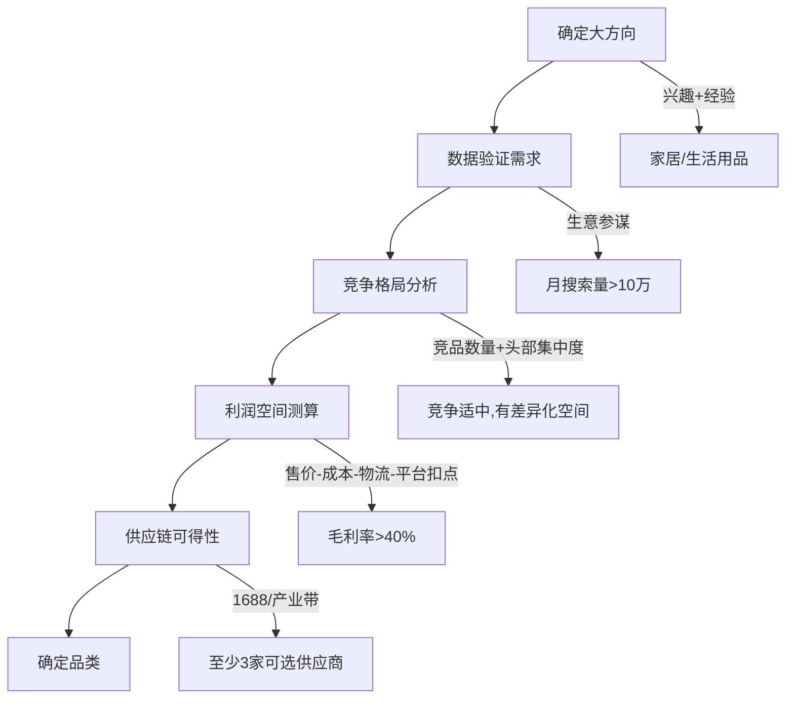
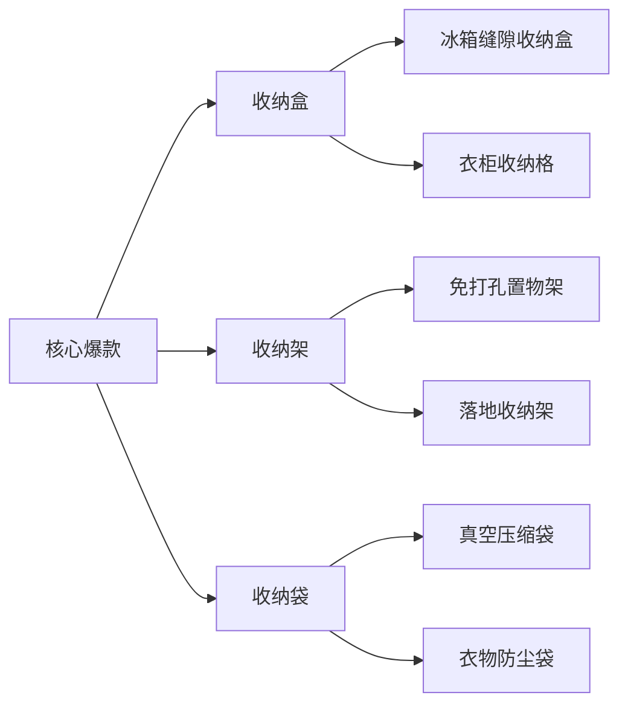
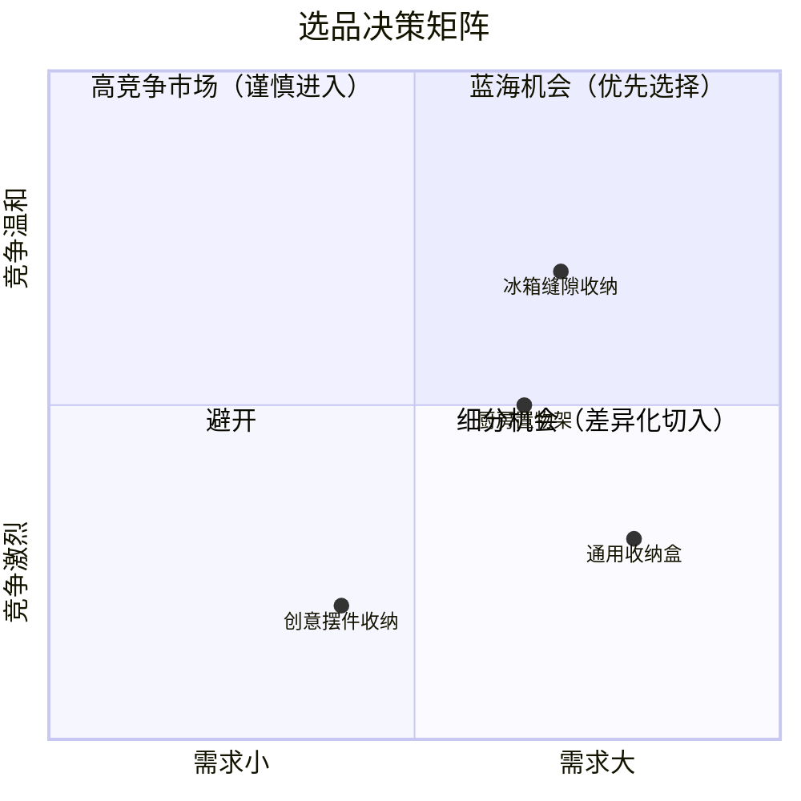

## 案例一：淘宝新手从0到月销50万的进阶之路

本案例记录了一位零电商经验的互联网运营转型淘宝创业的完整历程。从2万元启动资金起步，历时12个月实现月销售额突破50万元。案例重点拆解每个阶段的决策逻辑、关键动作、踩过的坑以及可复用的方法论，为准备入局淘宝的新手提供一份可参照的路线图。

### 案例导读

在阅读本案例之前，有三点需要说明：

**第一，这是一个"普通人的路径"。** 小张没有供应链资源、没有资金优势、没有流量红利。他的每一步都可以被同等条件的创业者复制——这正是本案例的价值所在。如果你期待看到"三个月暴富"的故事，这里没有；但如果你想看到一个可执行、可验证、可复制的路径，这正是你要找的。

**第二，数据是真实的但会变化。** 案例中的数据（搜索量、PPC价格、转化率等）反映的是特定时期的真实情况。淘宝平台的规则、流量分配机制、竞争格局每年都在变化。你需要学习的是方法论，而不是照搬具体数字。

**第三，与本章理论部分的对应关系。** 本案例是"理论→方法→实操"链条的最后一个环节。建议先阅读本章"理论基础"部分（电商的商业本质、流量分配机制、消费者决策路径）和"核心技巧"部分（选品方法论、Listing优化、流量获取），再来阅读本案例，理解会更深入。

### 案例主角背景

| 项目 | 详情 |
|------|------|
| 卖家 | 小张，28岁，前互联网公司运营（3年经验，熟悉数据分析但无电商实操） |
| 品类 | 家居收纳用品 |
| 启动资金 | 2万元（自有积蓄，无借款） |
| 所在城市 | 杭州（靠近产业带，物流成本低） |
| 时间线 | 12个月（第1-2月调研，第3-4月起步，第5-8月增长，第9-12月规模化） |
| 最终成绩 | 月销售额50万+，毛利率35%，月净利润8-10万，团队2人 |

**为什么选择小张作为案例？** 因为他代表了最大多数淘宝创业者的画像：有一定职场经验、资金有限、没有供应链资源、需要从零学习电商运营。他的路径不具备"资源碾压"的特殊性，因此更具参考价值。与那些"自带流量""家族工厂""百万启动资金"的案例不同，小张的每一步都可以用2万元复现。

### 第一阶段：选品调研（第1-2个月）

选品是淘宝创业最关键的一步，选错品类后面所有努力都是在错误的方向上加速。小张在这两个月里做了大量功课，核心方法论是"数据验证+差异化定位"。

#### 1.1 选品的底层逻辑

小张没有凭感觉选品，而是遵循了一套系统化的筛选流程。这套流程的核心思想是：**先用数据缩小范围，再用逻辑验证可行性，最后用实物样品确认品质。** 任何跳过其中某一步的做法，都是在用真金白银赌概率。



**选品五维评估模型：** 以上每个环节都不是独立判断，而是综合评估。一个品类必须同时满足"需求真实存在""竞争可切入""利润可支撑""供应链可获取""自己能做好"这五个条件，才值得投入。很多新手只看了其中一个维度（比如"这个品类搜索量很大"），就匆忙入场，结果发现竞争激烈到根本分不到流量。

#### 1.2 具体选品过程

**第一步：圈定大方向。** 小张从自己的兴趣和过往经验出发，锁定了"家居生活用品"这个大类。原因有三：一是自己对家居产品有使用体感，能判断产品好坏；二是家居类目消费频次适中，复购率可观；三是杭州周边有丰富的家居产业带（义乌、永康），供应链距离近。

这里需要强调"兴趣+经验"在选品中的作用：它不是决定性因素，但是一个重要的加分项。如果你对自己卖的产品完全没有使用体验，你在写标题、拍主图、做详情页、回答买家咨询时都会缺乏"体感"，很难做出打动人的内容。小张之前租房时就经常买收纳用品，对"小户型收纳痛点"有真实感受——这让他的产品描述比那些纯粹搬运供应商图片的卖家更有说服力。

**第二步：用生意参谋做数据验证。** 小张购买了生意参谋标准版（约100元/月），对家居大类下的子类目逐一分析：

| 子类目 | 月搜索量 | 竞品数 | 平均售价 | 增长趋势 | 判断 |
|--------|----------|--------|----------|----------|------|
| 收纳盒/箱 | 15万+ | 200+ | 39-89元 | 平稳增长 | ✓ 入选 |
| 懒人沙发 | 8万+ | 500+ | 150-400元 | 平稳 | ✗ 竞争太激烈 |
| 创意摆件 | 12万+ | 1000+ | 15-50元 | 下降 | ✗ 过于分散 |
| 厨房置物架 | 10万+ | 300+ | 49-129元 | 增长 | ✓ 备选 |
| 简易衣柜 | 6万+ | 150+ | 89-299元 | 平稳 | ✗ 物流成本高 |

**生意参谋的使用技巧：** 很多新手买了生意参谋但只看搜索量，这是浪费。生意参谋最有价值的数据是"搜索词分析"——它能告诉你消费者用什么具体关键词搜索、每个关键词的搜索量、点击率、转化率、竞争度。小张把家居收纳相关的核心关键词全部导出来，按"搜索量×转化率÷竞争度"计算了一个"机会指数"，优先选择机会指数高的细分方向。

**第三步：竞争格局分析。** 锁定"收纳"类目后，小张进一步分析了头部卖家的产品特点。他发现一个关键机会：头部卖家的收纳盒以通用型为主（大号、中号、小号），但针对"小户型"场景的垂直收纳产品（如冰箱缝隙收纳、马桶上方置物架、阳台窄缝收纳柜）供应不足，搜索量却不低。这就是差异化切入点。

**竞争分析的具体方法：** 小张在淘宝搜索"收纳盒"，按销量排序，逐一查看前50名卖家的产品特点、价格区间、主图风格、评价内容。他用Excel记录了每家的核心卖点和价格，发现：

- 前10名卖家主打"通用型"，价格在29-59元之间
- 11-30名卖家开始出现差异化（分格收纳、抽屉式、折叠式）
- 30名以后的卖家大多是同质化竞争，靠低价生存

结论：避开"通用型"的正面竞争，切入"场景化收纳"这个细分赛道。

**第四步：利润空间测算。** 小张用一张详细的成本表来验证每个SKU的利润空间：

| 成本项 | 金额（以售价59元的收纳盒为例） |
|--------|-------------------------------|
| 采购成本 | 15元（1688拿货价） |
| 快递费 | 3.5元（义乌仓发货，日均百单以上议价） |
| 包装材料 | 1.5元（纸箱+气泡膜+封箱胶） |
| 平台扣点 | 3%（约1.8元） |
| 退货预估 | 5%（约3元，按退货率8%分摊到每单） |
| 广告费预估 | 约5元/单（直通车PPC约1.5元，按3.3:1的ROI估算） |
| **总成本** | **约30元** |
| **毛利** | **约29元，毛利率49%** |

这个利润率足够支撑前期的广告投放和运营投入。

**成本测算中容易被忽略的隐性成本：** 上表是一个"精简版"。实际运营中，还有以下隐性成本需要提前考虑：

- **包装损耗**：运输过程中的破损率约2-3%，需要分摊到每单
- **客服成本**：如果请客服，月薪4500元分摊到每天的订单里
- **仓储成本**：前期在家里发货可以忽略，后期需要租仓库
- **退换货运费**：开通运费险后，每单额外增加约0.5-1元
- **软件工具费**：生意参谋、ERP系统、打单软件等，月均100-300元
- **平台活动费用**：参加聚划算、天天特卖等活动时，平台会收取额外佣金

将所有隐性成本加上去，实际毛利率通常会比估算低5-10个百分点。小张的案例中，初期估算毛利率49%，最终稳定在35%左右——这14个百分点的差距主要来自广告费超预期和退货率高于预估。

#### 1.3 供应商对接细节

在1688上，小张按照以下标准筛选供应商：

- **实力商家认证**：优先选择有"实力商家"或"超级工厂"标识的店铺
- **成立年限**：3年以上，说明经营稳定
- **回头率**：>30%，说明产品质量和服务过关
- **响应速度**：旺旺咨询后24小时内回复，且能回答专业问题
- **起订量**：新手友好，支持小批量（50-200件）起订

小张最终选了3家供应商，分别拿了样品做对比：

| 对比维度 | 供应商A | 供应商B | 供应商C |
|----------|---------|---------|---------|
| 单价 | 13元 | 15元 | 14元 |
| 材质厚度 | 偏薄 | 适中 | 偏厚 |
| 色差 | 有 | 无 | 轻微 |
| 包装 | 简陋 | 精致 | 一般 |
| 起订量 | 500件 | 100件 | 200件 |
| 配合度 | 一般 | 很好 | 好 |
| **选择** | ✗ | ✓ 首选 | ✓ 备选 |

最终选择了供应商B——虽然单价不是最低，但质量最好、起订量友好、配合度高。首批订货200件，总投入约5000元（含样品费300元）。

**供应商谈判的实战技巧：** 新手往往不知道如何与供应商议价。小张的经验是：

1. **先不要谈价格，先谈合作模式。** 告诉供应商你是长期合作，不是一次性采购。供应商更愿意给长期客户降价
2. **用竞争对手的价格做筹码。** "另一家给我报12元，但你的质量更好，能不能给个优惠价？"
3. **承诺采购量换折扣。** "如果第一个月能卖200件，第二个月我每月订500件，价格能不能再降1元？"
4. **要求供应商提供产品图和视频素材。** 很多供应商有专业拍摄的产品图，新手期可以直接使用（注意版权问题）
5. **确认售后责任。** 明确质量问题谁承担退货运费、残次品如何处理、补货周期多长

#### 1.4 这一阶段的常见误区

**误区一：凭感觉选品。** 很多新手看到什么火就卖什么，不做数据分析。等产品上架才发现搜索量已经被头部垄断，根本分不到流量。"感觉"是有偏见的——你身边的人喜欢什么，不代表全网消费者喜欢什么。数据才是最客观的判断依据。

**误区二：只看采购价不看总成本。** 采购价10元的产品，加上物流、包装、广告、退货，实际成本可能翻倍。必须算清楚全链路成本。很多新手觉得"采购价才10元，卖39元肯定赚"，结果运营半年发现根本没赚钱，就是因为忽略了广告费、退货率、包装损耗这些"看不见的成本"。

**误区三：供应商选最便宜的。** 低价供应商往往意味着质量不稳定、配合度差。新手期出一个差评的代价远大于每件多花2元采购成本。一个差评可能导致：转化率下降→销售额下降→搜索排名下降→更多差评，形成恶性循环。

**误区四：一开始就铺太多SKU。** 资金有限的情况下，SKU越多库存压力越大、运营精力越分散。新手期建议聚焦3-5个SKU，打透一个再扩展。小张初期只上了5个SKU，最终砍到2个核心爆款+3个辅助款。

**误区五：选品周期太短。** 有些新手花三天时间就决定了卖什么，然后把大量时间花在装修店铺上。正确的做法是：选品调研至少花2-4周，用数据反复验证，拿到样品实际体验，确认供应链可靠。选品阶段花的时间是最有价值的——它决定了你接下来半年的努力方向。

### 第二阶段：店铺搭建与测试（第3-4个月）

#### 2.1 店铺基础设置

小张选择了淘宝C店（个人店）而非天猫店，原因很现实：天猫店需要公司资质、保证金5-15万，而C店只需身份证+1000元保证金。对于2万元启动资金的新手，C店是唯一合理选择。

**C店与天猫店的核心区别：**

| 维度 | 淘宝C店 | 天猫店 |
|------|---------|--------|
| 入驻门槛 | 身份证+1000元保证金 | 公司资质+5-15万保证金+年费 |
| 信任度 | 一般 | 更高（天猫标识自带信任） |
| 流量权重 | 基础 | 有加权（同品质下天猫优先展示） |
| 扣点 | 约3% | 约5% |
| 活动资源 | 有限 | 更多官方活动入口 |
| 适合阶段 | 新手试水、资金有限 | 已验证品类、有一定规模 |

小张的策略是：先用C店跑通全流程，等月销稳定在10万以上再考虑开天猫店。这个策略是正确的——在你还没验证商业模式之前，不要在固定成本上投入太多。

**店铺定位明确化：** 店铺名"XX收纳生活馆"，定位为"小户型收纳解决方案"。这个定位的好处是：目标人群明确（租房族、小户型住户），搜索场景具体（"小户型收纳""租房收纳"），容易建立品牌认知。

**店铺定位的底层逻辑：** 很多新手把店铺定位理解为"装修风格"或"店铺口号"，这是片面的。店铺定位的本质是回答三个问题：①你卖给谁？②你卖什么？③你跟别人有什么不同？小张的答案是：①卖给小户型住户和租房族；②卖收纳用品；③专注于"缝隙空间利用"这个细分场景。这三个答案决定了他后续所有的选品方向、标题关键词、主图风格、详情页内容。

**店铺视觉统一：** 店铺首页、店招、产品主图使用统一的色调和风格（浅木色+白色，传达简洁、温馨的感觉）。虽然预算有限，但视觉统一性直接影响买家的信任感。

#### 2.2 产品上架的关键动作

**主图制作：** 小张没有请专业摄影师（预算不够），而是用手机拍摄+简单的后期处理。具体做法：

- **拍摄设备**：iPhone + 自然光（阳台拍摄，上午9-11点光线最好）
- **背景**：白色PVC背景板（淘宝20元购入）
- **构图**：第一张主图白底产品图（符合淘宝主图规范），后几张场景图（放在真实的家居环境中）
- **后期**：用美图秀秀或醒图APP调整亮度、对比度，加上简洁的文字卖点
- **成本**：约500元（含背景板和道具）

**主图的技术要求：** 淘宝主图有严格的技术规范，不遵守会导致审核不通过或展示异常：

- 尺寸：800×800像素（最低）或1200×1200像素（推荐，支持放大镜功能）
- 格式：JPG或PNG，文件大小<3MB
- 第一张主图：必须是白底产品图（部分类目要求），不能有文字水印
- 第二至五张：可以放场景图、细节图、对比图、促销信息
- 视频主图：建议制作15-30秒的产品展示视频，能显著提升点击率

**标题优化：** 标题是淘宝搜索流量的核心入口。小张的标题策略：

```text
核心关键词 + 属性词 + 场景词 + 长尾词

示例：收纳盒家用抽屉式衣柜收纳箱小户型衣物整理盒内衣袜子分类储物箱
```

- 用生意参谋"搜索分析"功能，找出搜索量大、竞争度适中的关键词
- 标题30个字填满，不留空
- 核心关键词放在标题前部（权重更高）
- 避免关键词堆砌导致可读性差

**标题优化的进阶方法：** 小张在实践中总结出一套"关键词分层布局"策略：

```text
第一层（核心词）：收纳盒、收纳箱 — 覆盖最大搜索量
第二层（属性词）：家用、抽屉式、衣柜 — 限定产品类型
第三层（场景词）：小户型、衣物、内衣袜子 — 精准匹配需求场景
第四层（长尾词）：整理盒、分类储物 — 补充搜索入口
```

每3-5天根据生意参谋的"引流关键词"数据调整一次标题，保留点击率高的词，替换表现差的词。标题优化是一个持续迭代的过程，不是一次性写好就完事了。

**详情页设计：** 详情页的结构遵循"AIDA模型"（注意→兴趣→欲望→行动）：

| 模块 | 内容 | 目的 |
|------|------|------|
| 首屏海报 | 产品核心卖点+使用场景图 | 吸引注意 |
| 痛点共鸣 | "你是否也有这些收纳烦恼？" | 激发兴趣 |
| 产品展示 | 多角度细节图+尺寸标注 | 建立信任 |
| 使用场景 | 4-6个真实使用场景 | 激发欲望 |
| 对比图 | 与竞品的材质/厚度对比 | 消除疑虑 |
| 买家秀 | 真实用户评价截图 | 社会证明 |
| 售后保障 | 7天无理由退换+运费险 | 降低决策门槛 |

**详情页的手机端优化：** 2025年淘宝移动端流量占比超过95%，详情页必须以手机端为第一优先级。小张的做法：

- 图片宽度统一750px（手机端最佳显示宽度）
- 每张图片200KB以内（保证加载速度<2秒）
- 文字要大（手机端阅读，14px以上）
- 关键信息放在前3屏（大部分买家不会往下拉太多）

#### 2.3 初期运营策略

上架后的前30天是最关键的"新品期"。淘宝对新上架的商品有一定的流量扶持（新品标签+搜索加权），但这个窗口期稍纵即逝。

**每天必做的5件事：**

1. **优化标题**：根据生意参谋的"引流关键词"数据，每隔3-5天微调标题中的关键词，保留点击率高的词，替换表现差的词
2. **监控数据**：每天登录千牛工作台，查看访客数、浏览量、点击率、转化率、收藏加购率
3. **直通车小额测试**：每天预算50元，测试不同关键词的点击率和转化率
4. **回复咨询**：所有买家咨询在3分钟内回复（响应速度影响店铺权重）
5. **处理订单**：当天16:00前的订单当天发货（发货速度影响DSR评分）

**初期的核心数据指标：**

| 指标 | 目标值 | 小张实际值 | 判断标准 |
|------|--------|-----------|----------|
| 主图点击率 | >3% | 2.0% | 需要优化主图 |
| 详情页转化率 | >3% | 3.2% | 合格 |
| 收藏加购率 | >8% | 6% | 偏低，需优化详情页 |
| 客服响应时间 | <3分钟 | 平均2分钟 | 合格 |
| 退款率 | <5% | 3% | 合格 |

**初期的日均销量只有3-5单，日销售额约200-300元。** 这个阶段最重要的是"不放弃"——很多新手看到每天只有几单就丧失信心，但数据积累需要时间。小张的心态调整方法是：给自己设定一个"3个月考核期"，只要在3个月内看到数据有正向趋势（访客数在增长、转化率在提升），就继续投入；如果3个月后数据没有任何好转，再考虑止损。

**这个阶段的心理建设：** 新手期最大的敌人不是竞争对手，而是自己的焦虑。每天看数据只有几个访客、一两单，很容易陷入"是不是选错了""是不是不适合做电商"的自我怀疑。小张的做法是：①不看日数据，看周数据（日数据波动太大，容易焦虑）；②每周给自己定一个小目标（比如"这周测试2个新关键词""这周优化1张主图"），完成就给自己正反馈；③在淘宝卖家论坛里看其他新手的分享，知道自己不是一个人在挣扎。

### 第三阶段：优化与增长（第5-8个月）

这是从"活下来"到"跑起来"的关键阶段。小张在这个阶段做了三个核心动作：砍SKU、打爆款、拉流量。

#### 3.1 数据驱动的SKU优化

经过2个月的测试，5个SKU的数据表现差异明显：

| SKU | 产品 | 日均销量 | 点击率 | 转化率 | 决策 |
|-----|------|----------|--------|--------|------|
| A | 冰箱缝隙收纳盒 | 15单 | 5.2% | 7.5% | 重点打造 |
| B | 马桶上方置物架 | 10单 | 4.1% | 6.0% | 重点打造 |
| C | 衣柜收纳格 | 5单 | 2.8% | 3.5% | 观察 |
| D | 桌面收纳盒 | 2单 | 1.9% | 2.0% | 下架 |
| E | 阳台收纳柜 | 1单 | 1.5% | 1.5% | 下架 |

小张果断砍掉了D和E两个SKU，把资金和精力集中在A和B上。这个决策的底层逻辑是：**二八法则——80%的销售额来自20%的产品。新手期资源有限，必须聚焦。**

**SKU评估的"三维打分法"：** 小张不只是看销量来决定砍哪个SKU，而是用三个维度综合评估：

1. **流量维度**：点击率>3%为合格，说明主图有吸引力
2. **转化维度**：转化率>3%为合格，说明产品本身有竞争力
3. **利润维度**：毛利>15元/单为合格，说明有足够利润空间覆盖运营成本

三个维度都合格的SKU，重点投入；两个合格的，观察优化；只有一个或都不合格的，果断砍掉。D和E两个SKU三个维度都不合格，继续保留只是浪费库存资金和运营精力。

#### 3.2 主图优化——点击率从2%到5%的突破

点击率是淘宝运营中最重要的指标之一。主图点击率从2%提升到5%，意味着同样的曝光量，流量增加了1.5倍。

**优化方法：A/B测试法**

小张针对SKU A（冰箱缝隙收纳盒）做了5版主图，每版投放直通车3天，每天预算100元，确保每版至少获得2000次曝光，然后比较点击率：

| 版本 | 主图风格 | 点击率 | 分析 |
|------|----------|--------|------|
| V1 | 白底产品图 | 2.0% | 基准版 |
| V2 | 场景图（放在冰箱旁） | 3.5% | 场景代入感更强 |
| V3 | 场景图+文字卖点"仅需10cm缝隙" | 4.8% | 文字直击痛点 |
| V4 | 对比图（使用前vs使用后） | 4.2% | 视觉冲击力强 |
| V5 | V3基础上加价格标签"39元起" | 5.2% | 价格锚点降低决策门槛 |

最终V5胜出，成为正式主图。这个过程花了约1500元广告费，但带来的长期收益远超投入。

**A/B测试的科学方法论：** 小张的测试之所以有效，是因为他遵守了三个原则：

1. **单变量原则**：每次只改变一个元素（背景、文字、构图），这样才能知道是哪个变化带来了效果
2. **足够样本量**：每版至少2000次曝光，否则数据不具有统计显著性
3. **同时段测试**：不同时间段的流量质量不同，如果V1在周一测试、V2在周五测试，数据就不可比

**主图优化的常见套路总结：**

- **痛点文字法**：在主图上用简短文字直击买家痛点（"仅需10cm缝隙""承重50斤""0甲醛"）
- **场景代入法**：把产品放在真实使用场景中拍摄（不是白底图，而是"在冰箱旁边的收纳盒"）
- **对比法**：使用前vs使用后，或者与竞品的材质/厚度对比
- **价格锚点法**：在主图上标注"XX元起"或"限时特惠"，降低买家的决策门槛
- **社会证明法**：在主图上加"已售10000+""好评率99%"等标签

#### 3.3 详情页优化——转化率从3%到6%

详情页优化的核心是"减少买家的决策阻力"。小张通过以下方法逐步提升转化率：

**方法一：分析买家咨询问题。** 小张把所有买家咨询的问题整理成表格，找出高频问题：

| 高频问题 | 出现次数 | 详情页优化动作 |
|----------|----------|----------------|
| "尺寸是多少？能放得下吗？" | 45次 | 增加详细尺寸图+场景对比图 |
| "材质会不会变形？" | 32次 | 增加承重测试视频截图 |
| "有味道吗？" | 28次 | 增加环保检测报告截图 |
| "退货包运费吗？" | 20次 | 首屏增加"7天无理由+运费险"标识 |

**这个方法的底层逻辑：** 买家问的每一个问题，都说明你的详情页没有回答好这个问题。把高频问题的答案放进详情页，就能同时解决两件事：①减少客服咨询量（节省人力）；②让那些"懒得问就走了"的买家直接下单（提升转化率）。

**方法二：买家秀征集。** 小张在每个包裹里放了一张好评卡（成本0.3元/张）：

```text
亲，感谢您的购买！
扫码加微信，发送买家秀照片
即可获得5元无门槛优惠券！
（微信二维码）
```

两周内收集到30+条带图好评，精选后放入详情页。真实买家秀的说服力远超商家自己拍的图。

**合规提醒：** 好评卡/好评返现是淘宝明令禁止的行为，如果被平台发现，可能面临扣分、降权甚至封店的处罚。小张的做法虽然有效，但存在合规风险。更安全的替代方案是：①在包裹里放"售后关怀卡"，引导买家加微信，后续通过微信沟通获得授权使用买家秀；②通过淘宝"买家秀征集"官方功能合法征集；③通过淘宝群聊发起"晒图有礼"活动，走平台内合规渠道。

**方法三：优化详情页加载速度。** 很多新手忽略这一点——详情页图片太大导致加载慢，买家等不及就划走了。小张把所有详情页图片压缩到200KB以内，宽度统一为750px（淘宝手机端标准宽度），加载速度从4秒缩短到1.5秒。

**加载速度对转化率的影响：** 淘宝官方数据显示，页面加载时间每增加1秒，转化率下降约7%。从4秒优化到1.5秒，理论上可以提升约17%的转化率。这是一个投入产出比极高的优化动作——不需要花钱，只需要花时间压缩图片。

#### 3.4 直通车投放进阶

随着数据积累，小张的直通车策略从"测试"转向"精准投放"：

**关键词分层管理：**

| 关键词类型 | 示例 | 出价策略 | 日预算占比 |
|-----------|------|----------|-----------|
| 核心词 | 收纳盒 | 高出价，抢前5名 | 40% |
| 精准长尾词 | 冰箱缝隙收纳盒家用 | 中出价，抢前前10名 | 35% |
| 场景词 | 小户型收纳 | 低出价，广泛匹配 | 15% |
| 竞品词 | XX品牌收纳盒 | 低出价，截流 | 10% |

**直通车的核心原理：** 淘宝直通车是按点击付费（CPC）的竞价广告。它的底层逻辑是：出价×质量分=排名。质量分由关键词与产品的相关性、点击率、转化率等因素决定。所以"质量分高+出价低"比"质量分低+出价高"更划算。小张的优化策略核心就是持续提升质量分——通过优化主图提升点击率、通过优化详情页提升转化率——从而用更低的出价获得更好的排名。

**直通车ROI优化：** 经过3个月的优化，小张的直通车数据如下：

| 指标 | 第5个月 | 第6个月 | 第7个月 | 第8个月 |
|------|---------|---------|---------|---------|
| 日预算 | 100元 | 150元 | 200元 | 200元 |
| PPC（点击单价） | 1.8元 | 1.5元 | 1.2元 | 1.0元 |
| 点击量 | 55次 | 100次 | 167次 | 200次 |
| 转化率 | 4% | 5% | 6% | 6.5% |
| 日成交单数 | 2单 | 5单 | 10单 | 13单 |
| ROI | 1:2.2 | 1:3.3 | 1:4.5 | 1:5.2 |

ROI从1:2.2提升到1:5.2，意味着每花1元广告费能带来5.2元销售额。

**直通车优化的关键动作：**

- **否定关键词**：每天查看直通车的"搜索词报告"，把点击率低、转化率低的关键词添加到"否定词"列表
- **分时折扣**：根据生意参谋的"访客时段分析"，在转化率高的时段（如20:00-23:00）提高出价，在凌晨时段降低出价
- **人群溢价**：对高转化人群（如收藏加购过的用户、相似店铺的访客）提高出价
- **创意优化**：每个关键词设置4张创意图，定期替换点击率最低的那张

#### 3.5 活动报名

小张在第6个月开始尝试报名淘宝官方活动：

- **天天特卖**：报名门槛低（店铺DSR≥4.6，近30天销量≥50），活动期间流量是平时的3-5倍，但价格需要打8折左右
- **淘抢购**：门槛较高，需要一定的店铺等级和销量基础，但流量更大
- **类目活动**：家居类目不定期有专题活动，关注"淘宝营销中心"报名

**活动经验教训：** 第一次报天天特卖时，小张没有提前备足库存，活动第二天就断货了，不仅损失了销售额，还因为发货延迟导致几个差评。之后每次报活动前，他都会提前一周备足库存（按日常销量的3倍准备）。

**活动报名的决策框架：** 不是所有活动都值得报。小张用一个简单的公式来评估：

```text
活动收益 = 活动期间销量 × 毛利率 - 活动折扣损失
活动成本 = 备货资金 + 额外人力 + 发货压力

只有当活动收益 > 活动成本 × 2 时才值得报名
```

很多新手看到"活动流量大"就盲目报名，结果活动期间卖得越多亏得越多——因为折扣太深、退货率太高、发货压力导致售后问题。

#### 3.6 好评管理与DSR维护

淘宝的DSR评分（描述相符、服务态度、物流速度）直接影响店铺权重和活动报名资格。小张的做法：

- **描述相符**：产品详情页的描述与实物一致，不夸大宣传。尺寸、颜色、材质都标注清楚
- **服务态度**：所有客服回复使用亲切的语气，遇到问题主动补偿（小额优惠券或下次包邮）
- **物流速度**：与快递公司签订协议，确保当天16:00前的订单当天发出。使用菜鸟打单系统提高效率

**差评处理流程：** 遇到差评时，小张的标准流程是：

1. 24小时内电话联系买家（不要只用旺旺，电话沟通效率更高）
2. 了解具体问题，真诚道歉
3. 提出解决方案（退款/补发/优惠券）
4. 问题解决后，礼貌请求买家修改评价
5. 如果买家不愿意修改，在评价下方做好解释回复

**差评处理的底线：** 差评处理必须在法律和平台规则范围内进行。以下行为是绝对禁止的：电话骚扰买家、威胁恐吓、泄露买家隐私、雇佣"差评删除"服务。这些行为一旦被举报，面临的不仅是罚款，还可能被永久封店。正确的做法是通过优质服务解决问题，让买家自愿修改评价；如果买家不愿意，就做好公开回复，让其他买家看到你的态度。

**好评率维护的日常动作：**

- 每天检查新产生的评价，3星以下立即跟进处理
- 对好评中提到的问题（如"东西不错但包装简陋"）也要重视，持续改进
- 保持DSR三项评分都在4.7以上（4.6是很多活动的准入门槛）
- 月度复盘时计算"好评率=好评数/(好评数+中差评数)"，目标>98%

这个阶段的日均销量从3-5单增长到30-50单，月销售额约5-8万元。

### 第四阶段：规模化运营（第9-12个月）

#### 4.1 产品线扩展策略

当店铺有了稳定的流量和销量基础后，小张开始有计划地扩展产品线。扩展逻辑不是盲目铺SKU，而是围绕"小户型收纳"这个核心定位做关联扩展：



**扩展原则：**

- 每次只增加2-3个SKU，测试通过后再继续扩展
- 新品与已有爆款形成关联推荐（"买了收纳盒的客户也买了置物架"）
- 新品定价与已有产品形成梯度（引流款39元、利润款69元、形象款99元）

到第12个月，SKU从最初的5个扩展到20个，但贡献80%销售额的仍然是那2-3个核心爆款。

**产品线扩展的节奏控制：** 小张的扩展节奏是"每月测试2-3个新品，通过率约30-50%"。也就是说，每月测试3个新品，大概只有1个能留下来成为正式SKU。这个淘汰率是正常的——不是每个产品都能成为爆款，关键是用低成本快速测试、快速淘汰。

**新品测试的标准流程：**

1. 从1688拿样品（每个样品50-100元）
2. 拍照上架（自己拍摄，不额外花钱）
3. 直通车小额测试（每天50元，测试7天）
4. 评估数据：点击率>3%、转化率>3%、收藏加购率>8%→通过
5. 通过→备货200件正式上架；不通过→下架，换下一个

#### 4.2 流量矩阵升级

单一依赖直通车的流量结构是脆弱的。小张在这个阶段逐步搭建了多渠道流量矩阵：

| 流量渠道 | 占比 | 月投入 | ROI | 特点 |
|----------|------|--------|-----|------|
| 自然搜索 | 40% | 0元 | ∞ | 最优质流量，需要长期SEO积累 |
| 直通车 | 25% | 6000元 | 1:5 | 精准可控，见效快 |
| 超级推荐 | 15% | 3000元 | 1:3 | 猜你喜欢推荐位，适合拉新 |
| 淘宝直播 | 10% | 自播，0元坑位费 | 1:4 | 提升转化率和客单价 |
| 微淘/粉丝群 | 10% | 0元 | ∞ | 复购核心渠道 |

**流量结构健康度评估：** 小张的流量结构中，付费流量（直通车+超级推荐）占比约40%，免费流量（自然搜索+微淘+直播）占比约60%。这个比例是健康的。如果付费流量占比超过70%，说明店铺过度依赖广告，一旦停投就会"断流"。理想的流量结构是：免费流量占60-70%，付费流量占30-40%。

**淘宝直播起步：** 小张没有请主播，而是自己开播。每天晚上8-10点直播2小时，在仓库里边整理产品边讲解。初期观看人数只有十几人，但坚持一个月后稳定在200-500人。直播的核心价值不是直接卖货，而是建立信任感和品牌人设。

**自播的实操技巧：**

- **固定时间**：每天同一时间开播，培养粉丝观看习惯
- **场景化展示**：不是坐在那里念产品参数，而是在真实的家居场景中演示产品使用
- **互动优先**：回答弹幕问题比卖货更重要，互动率高的直播间会被平台推荐
- **直播切片**：把直播中的精彩片段剪辑成15秒短视频，发到逛逛和微淘，二次利用

**粉丝群运营：** 小张建立了微信群（后迁移到淘宝群聊），定期发布新品预告、优惠活动、收纳技巧。群内人数约800人，月均贡献销售额约3万元（复购率高）。

**粉丝群运营的关键：** 很多卖家建了粉丝群但不运营，群很快就变成"死群"。小张的运营节奏是：

- 每天：发一条收纳小技巧（内容营销，不卖货）
- 每周：发一次新品预告或限时优惠（带购买链接）
- 每月：发一次"老客户专属价"（只有群内才有）
- 不定期：发起"晒图有礼"活动（征集买家秀）

核心原则是：80%的内容是"对粉丝有用的"，20%是"卖货的"。如果反过来，粉丝会退群。

#### 4.3 供应链深度优化

随着销量增长，供应链管理变得更加重要：

**库存管理：** 小张建立了一套简单的库存预警机制：

| SKU | 日均销量 | 安全库存天数 | 补货周期 | 补货触发点 | 单次补货量 |
|-----|----------|-------------|----------|-----------|-----------|
| 冰箱缝隙收纳盒 | 50单 | 15天 | 5天 | 库存<750件 | 1000件 |
| 马桶置物架 | 35单 | 15天 | 7天 | 库存<525件 | 800件 |
| 其他SKU | 各5-15单 | 10天 | 5天 | 按公式计算 | 按需 |

**补货公式：** 补货触发点 = 日均销量 × (安全库存天数 + 补货周期)

**为什么安全库存天数设15天而不是更少？** 因为供应链中存在很多不确定性：供应商可能临时缺货、物流可能延迟、活动期间销量可能突然翻倍。15天的安全库存意味着即使遇到任何意外，你还有15天的缓冲时间。小张在第7个月因为断货吃过大亏，之后再也没让安全库存低于15天。

**供应商关系深化：**

- 与首选供应商签订了年度框架协议，锁定了价格和优先排产权
- 争取到30天账期（月采购额超过3万后），大幅缓解现金流压力
- 建立了2-3家备选供应商，避免单一供应商风险
- 每季度验厂一次，确保产品质量稳定

**账期的价值：** 30天账期意味着你可以先拿货、先卖、30天后再付款。这对现金流的改善是巨大的——相当于供应商给你提供了一笔无息贷款。小张在拿到账期后，可以把更多的资金用于广告投放和新品测试，而不必把大量现金压在库存上。

#### 4.4 团队搭建

从一个人运营到两个人的团队，小张的分工如下：

| 角色 | 负责人 | 具体工作 |
|------|--------|----------|
| 运营+选品+采购 | 小张本人 | 数据分析、选品、供应商对接、活动策划 |
| 客服+发货+售后 | 客服（月薪4500元） | 旺旺客服、打包发货、退换货处理 |

**招聘渠道：** 在58同城和BOSS直聘发布招聘信息，要求有淘宝客服经验，打字速度>60字/分钟。面试时让候选人实际操作千牛工作台，测试响应速度和问题处理能力。

**客服培训要点：** 小张给新客服做了一套标准化培训：

1. **产品知识**：每个SKU的材质、尺寸、使用方法、常见问题，必须背熟
2. **回复模板**：准备了30个常见问题的标准回复模板，客服在此基础上根据实际情况调整语气
3. **催付话术**：买家咨询后没有下单的，30分钟后用千牛的"催付"功能跟进
4. **售后处理标准**：10元以下的问题直接退款，10-50元的问题发优惠券补偿，50元以上的问题上报给小张处理
5. **差评预防**：发货后第3天主动联系买家确认收货情况，如果满意请求好评，如果不满意立即处理

**为什么要标准化？** 因为客服是店铺的"门面"，买家对店铺的第一印象往往来自客服回复。一个回复不专业、态度不好的客服，能让你花大价钱引来的流量白白流失。标准化不是限制客服的灵活性，而是确保"底线服务"不滑坡。

#### 4.5 自有品牌建设

在第10个月，小张注册了自己的商标（费用约1000元，通过商标代理机构），开始在产品上使用自有品牌包装。这一步的意义在于：

- **防止跟卖**：其他卖家无法直接使用你的品牌名
- **提升信任度**：有品牌的产品比白牌产品更容易获得买家信任
- **积累品牌资产**：随着销量增长，品牌本身也在增值
- **为未来铺路**：如果以后开天猫店或做独立站，品牌是必要条件

**商标注册的注意事项：**

- 商标注册周期约6-12个月，建议在店铺运营稳定后就立即申请
- 先做商标查询（在"中国商标网"免费查询），确认没有同名或近似商标
- 选择商标类别时，收纳用品属于第20类（家具及非金属容器）
- 通过商标代理机构办理更省心，费用约800-1500元
- 注册成功后要规范使用™（申请中）和®（已注册）标志

#### 4.6 第12个月的最终成绩

| 指标 | 数值 |
|------|------|
| 月销售额 | 50万+ |
| 月订单数 | 约8000单 |
| 客单价 | 约62元 |
| 毛利率 | 35% |
| 月毛利 | 约17.5万 |
| 月广告费 | 约1.2万 |
| 月人员成本 | 约0.5万 |
| 月物流成本 | 约3万 |
| 月其他成本（仓储、包装等） | 约2万 |
| **月净利润** | **约8-10万** |
| 团队规模 | 2人 |
| SKU数量 | 20个 |
| 店铺粉丝 | 1.2万 |

### 全年资金流转复盘

| 阶段 | 时间 | 累计投入 | 累计收入 | 累计利润 | 现金流状态 |
|------|------|----------|----------|----------|-----------|
| 选品期 | 第1-2月 | 5300元 | 0 | -5300元 | 纯投入 |
| 起步期 | 第3-4月 | 1.8万 | 1.5万 | -3000元 | 接近回本 |
| 增长期 | 第5-8月 | 5万 | 18万 | +13万 | 正向循环 |
| 规模期 | 第9-12月 | 12万 | 55万 | +43万 | 稳定盈利 |

**关键转折点在第5个月**——当月销售额首次突破5万元，月净利润首次超过1万元。从这个节点开始，店铺进入正向循环：有利润→投入广告→更多销量→更多利润。

**现金流管理的教训：** 小张在第6-7月遇到过一次现金流紧张——因为同时要备货、投广告、付快递费，账面资金一度只剩8000元。他的经验是：

- 永远保留至少1个月运营成本的现金储备（约2-3万元）
- 采购时尽量争取账期，减少现金占用
- 广告费不要一次性投入太多，按日预算控制
- 建立一个简单的"现金流量表"，每周更新一次

### 踩过的坑与血泪教训

#### 坑一：新品期没把握好，错失流量窗口

小张在第3个月上架产品时，因为详情页没准备好，先上架了一个"半成品"链接，想着后续再优化。结果淘宝的新品扶持期（上架后14天内）白白浪费了。后来他重新上架了一个新链接，才重新获得新品流量扶持。

**教训：** 产品上架前必须确保主图、标题、详情页全部到位。宁可晚一周上架，也不要带着半成品进入新品期。新品期的流量扶持是不可再生的资源——浪费了就没有了。

#### 坑二：盲目降价促销

第4个月销量停滞不前时，小张尝试了全场8折促销。结果短期销量确实上升了，但活动结束后销量暴跌到比促销前还低——因为促销吸引来的都是价格敏感型客户，不会复购，而且还打乱了店铺的价格体系。

**教训：** 不要轻易打折。如果要做促销，用"满减""赠品""买二送一"等方式，而不是直接降价。直接降价是最懒的促销方式，也是伤害最大的。

**更深层的原因：** 降价会触发淘宝的价格监控系统。如果你频繁降价，系统会认为你的产品"不值原价"，从而降低搜索权重。更严重的是，老客户看到你降价了会觉得"之前买贵了"，产生负面情绪。促销应该制造"获得感"（买到就是赚到），而不是"贬值感"（原来不值那个价）。

#### 坑三：忽视售后导致DSR暴跌

第6个月，因为客服人手不足，有几个退货退款的处理不及时，买家给了差评。DSR评分从4.8降到了4.6，直接影响了天天特卖的报名资格。

**教训：** 售后问题必须在24小时内响应。宁可多花一点钱做补偿（发优惠券、免运费退货），也不要让差评扩散。一个差评的负面影响需要10-20个好评才能抵消。

**DSR评分的恢复周期：** DSR评分的计算是基于最近180天的评价数据。一旦DSR下降，恢复非常缓慢——你需要持续获得好评，逐步拉高平均分。小张从4.6恢复到4.7花了整整两个月。这两个月里，他每天亲自跟进售后，主动联系不满意的买家解决问题，累计发出了200多张5元优惠券作为补偿。代价不小，但比失去活动报名资格的损失小得多。

#### 坑四：库存管理失误

第7个月报了一次天天特卖活动，预估销量是日常的3倍，但实际活动效果超出预期，第二天就断货了。补货需要5天，这5天里店铺权重因为发货延迟而下降，活动结束后自然搜索流量也跟着下降。

**教训：** 活动备货按预估销量的1.5-2倍准备。宁可活动结束后剩下一些库存（下次还能卖），也不要断货。断货的代价远高于压货的成本。

**断货的连锁反应：** 很多新手不理解"断货"为什么这么严重。原因在于淘宝的搜索排名算法是一个"正反馈系统"——销量越高→排名越高→曝光越多→销量越高。断货打断了这个正反馈循环，排名下降后要重新积累，需要花费大量时间和广告费才能恢复。小张断货5天后，搜索排名从首页掉到了第三页，恢复花了整整三周。

### 风险预警与合规提醒

在淘宝创业过程中，有一些风险需要提前了解和预防：

#### 资质与合规风险

| 风险类型 | 说明 | 预防措施 |
|----------|------|----------|
| 商标侵权 | 使用他人的品牌名或商标图案 | 上架前在商标网查询，不使用任何他人品牌标识 |
| 虚假宣传 | 主图或详情页夸大产品功能 | 所有宣传用语必须有依据，不使用"最好""第一"等极限词 |
| 产品质量 | 产品不符合国家标准 | 采购时要求供应商提供质检报告，定期送检 |
| 好评返现 | 通过返现诱导好评 | 使用平台合规的买家秀征集功能，不用好评返现卡 |
| 税务风险 | 收入不报税 | 年收入超过一定金额需要依法纳税，建议咨询当地税务部门 |

#### 个人所得税提醒

淘宝C店的收入属于个人经营所得，需要缴纳个人所得税。月销售额50万、月净利润8-10万，已经远超个人所得税起征点。小张在第8个月咨询了税务师后，注册了个体工商户，适用核定征收政策，综合税负约3-5%。具体税率因地区而异，建议在店铺开始盈利后尽早咨询当地税务局或专业税务师。

#### 账号安全风险

- **账号被盗**：启用千牛的二次验证，定期修改密码
- **恶意投诉**：竞争对手可能发起知识产权投诉，保留好所有产品的采购凭证和授权文件
- **平台规则变更**：淘宝规则每年都在调整，关注"淘宝规则"官方频道，及时了解最新变化

### 可复用的方法论总结

#### 选品决策矩阵



#### 新手淘宝创业的启动清单

| 步骤 | 具体动作 | 预算 | 时间 |
|------|----------|------|------|
| 1. 选品调研 | 生意参谋数据分析+1688选品 | 100元/月 | 2-4周 |
| 2. 供应商对接 | 样品对比+确定供应商 | 500元 | 1-2周 |
| 3. 店铺注册 | 淘宝C店+缴纳保证金 | 1000元 | 1天 |
| 4. 产品拍摄 | 手机拍摄+简单后期 | 500元 | 3天 |
| 5. Listing制作 | 标题优化+详情页设计 | 0（自己做） | 3天 |
| 6. 首批备货 | 200-500件首批订单 | 3000-8000元 | 5-7天 |
| 7. 开始运营 | 直通车测试+数据监控 | 50元/天起 | 持续 |
| **合计** | | **约6000-11000元** | **约4-6周** |

#### 运营节奏日历

| 频率 | 动作 |
|------|------|
| 每天 | 查看千牛数据、回复咨询、处理订单发货、直通车调价 |
| 每3天 | 分析关键词数据、微调标题 |
| 每周 | 复盘周数据、优化主图/详情页、检查库存 |
| 每两周 | 竞品分析、新品调研 |
| 每月 | 月度复盘、制定下月计划、供应商对账 |
| 每季度 | 产品线评估、店铺定位调整、供应商验厂 |

#### 关键指标速查表

| 阶段 | 核心指标 | 及格线 | 良好 | 优秀 |
|------|----------|--------|------|------|
| 新品期（0-30天） | 点击率 | >2% | >3% | >5% |
| 新品期（0-30天） | 转化率 | >2% | >3% | >5% |
| 增长期（1-3月） | 日均销量 | >5单 | >15单 | >30单 |
| 增长期（1-3月） | 直通车ROI | >1:2 | >1:3 | >1:5 |
| 稳定期（3月+） | 复购率 | >5% | >10% | >20% |
| 稳定期（3月+） | 付费流量占比 | <70% | <50% | <40% |
| 稳定期（3月+） | DSR评分 | >4.6 | >4.7 | >4.8 |

### 给不同阶段读者的建议

**如果你还在犹豫要不要做淘宝：** 先用最小成本验证——花2万元试3个月。如果3个月后数据没有正向趋势，果断止损。不要在没有数据验证的情况下大量投入。止损不是失败，是理性决策。很多成功的创业者都经历过"第一次失败"——重要的是从失败中提取教训，而不是在错误的方向上越陷越深。

**如果你刚开店还没出单：** 检查三个核心指标——曝光量够不够（说明标题和关键词有没有问题）、点击率够不够（说明主图有没有吸引力）、转化率够不够（说明详情页和价格有没有竞争力）。逐一排查，对症下药。具体诊断方法：如果曝光量<100/天，问题在标题关键词→重新做关键词调研；如果曝光量>500但点击率<2%，问题在主图→做主图A/B测试；如果点击率>3%但转化率<2%，问题在详情页或价格→优化详情页或调整定价。

**如果你已经月销几万想突破：** 这时候瓶颈通常在流量上。不要只依赖直通车，尝试超级推荐、淘宝直播、内容种草（逛逛）等多渠道获取流量。同时优化老客户的复购率——维护一个老客户的成本只有获取新客户的1/5。具体动作：①建立粉丝群，每周发一次老客户专属优惠；②上新时先在粉丝群预热，积累基础销量；③分析老客户的购买周期，在复购时间点主动触达。

**如果你已经月销几十万：** 关注利润率而非销售额。很多卖家销售额很高但不赚钱，因为广告费占比太高、退货率失控。这时候要精细化运营，优化每一个环节的成本。具体关注点：①广告费占销售额的比例是否<10%？②退货率是否<8%？③客单价是否有提升空间（通过关联销售和套餐组合）？④供应链成本是否有下降空间（通过规模化采购谈判）？

**如果你失败了想重新开始：** 复盘比重新开始更重要。用以下框架做复盘：①选品有没有用数据验证？②产品的点击率和转化率分别多少？③亏损的主要来源是什么（广告费太高？退货率太高？采购成本太高）？④如果不做这个品类，换什么品类会更好？带着这些复盘结论重新开始，成功率会比第一次高很多。

***

> **本案例核心启示：** 淘宝创业不是一夜暴富的捷径，而是一门需要系统学习和持续优化的生意。小张的成功不是因为他有什么特殊资源，而是因为他把每一个环节都做到了"及格线以上"。选品用数据说话、运营靠测试驱动、增长靠系统化执行——这才是普通人在淘宝上能复制的路径。更重要的是，他在每个阶段都保持了"数据驱动的理性决策"，而不是"凭感觉的冲动行动"。在电商这个高度竞争的领域，理性是最好的武器。
