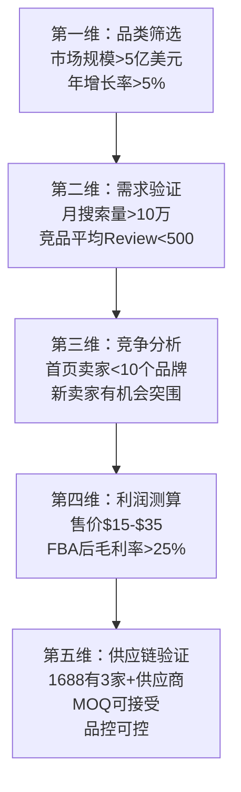
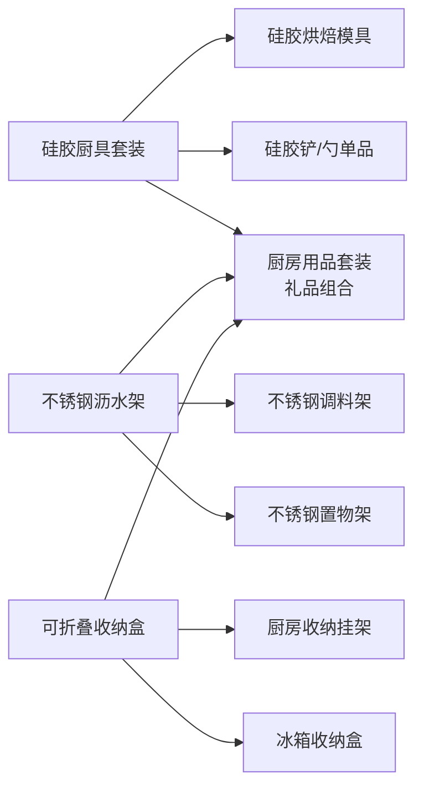
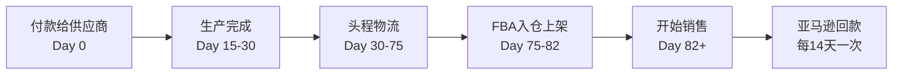

## 案例二：亚马逊跨境电商从0到月销10万美金

> 本案例完整记录一位前外贸业务经理转型亚马逊跨境电商的18个月实战历程——从选品调研到月销10万美金，涵盖市场分析、Listing打造、FBA物流、广告投放、Review积累、品牌建设、风险管控的全链路方法论。每个阶段都有具体数据、可复用的模板和真实的踩坑教训。

### 案例背景与人物画像

**卖家**：王总，35岁，前外贸公司业务经理，8年B2B外贸经验，熟悉国际贸易流程但从未接触过B2C零售。2022年初决定转型跨境电商，以亚马逊为主战场。

**核心数据概览**：

| 指标 | 起步期（第1-3月） | 成长期（第7-12月） | 成熟期（第13-18月） |
|------|-------------------|--------------------|--------------------|
| SKU数量 | 3 | 6 | 10 |
| 日均单量 | 5-10 | 30-50 | 100-120 |
| 月销售额 | $3,000-$5,000 | $30,000-$50,000 | $100,000+ |
| ACoS | 40%-60% | 20%-30% | 15%-20% |
| 毛利率 | 15%-20% | 25%-30% | 30%-35% |
| 团队规模 | 1人 | 2人 | 3人 |

**启动资金**：15万元人民币（含备货、物流、广告、工具等全部费用）

**品类选择**：厨房用品——这是一个被验证过的高潜力赛道。美国厨房用品市场规模约200亿美元，年增长率5%-7%，且中国供应链占据全球70%以上的产能，具备天然的供应链优势。

#### 资金分配明细

15万元启动资金并不是一个拍脑袋的数字，而是基于"首批备货+3个月运营资金"的精确计算：

| 项目 | 金额（万元） | 说明 |
|------|-------------|------|
| 首批采购（3个SKU×500件） | 5.0 | 含包装、质检费用 |
| 头程物流（空运首批） | 1.5 | 200件/SKU空运到FBA仓库 |
| 工具订阅（3个月） | 0.3 | Jungle Scout + Helium 10 + Keepa |
| 广告预算（3个月） | 4.0 | 日均$30-50，新品期必须投入 |
| 产品摄影+设计 | 0.6 | 3个SKU的7图拍摄+A+设计 |
| 商标注册 | 0.5 | 美标注册（通过IP Accelerator） |
| 预备金（应急） | 3.1 | 补货、意外支出、差评处理 |
| **合计** | **15.0** | — |

**关键认知**：跨境电商的资金不是"花完就没了"，而是"滚动投入"。首批采购的5万元在60-90天后会以销售回款的形式回到你的账户，然后立即投入第二批补货。真正的资金压力在于**现金流周期**——从你付款给供应商到亚马逊回款，通常需要90-120天（采购30天+物流30天+销售30天+回款14天）。这意味着你必须始终保留至少2个月的运营资金作为缓冲。

#### 为什么选择亚马逊而非其他平台

王总在启动前对主流跨境电商平台做了系统对比：

| 维度 | 亚马逊（Amazon） | Shopee/Lazada | 独立站（Shopify） | eBay |
|------|-----------------|---------------|-------------------|------|
| 市场体量 | 全球最大，美国站占40%+ | 东南亚为主，客单价低 | 自主可控，需自建流量 | 成熟但增长趋缓 |
| 启动难度 | 中等（需FBA、品牌注册） | 低 | 高（需广告投放能力） | 低 |
| 流量成本 | 站内广告+自然流量 | 平台补贴为主 | Google/Meta广告 | 平台内竞价 |
| 利润空间 | 30%-40%（FBA模式） | 10%-20% | 40%-60%（流量成本高） | 15%-25% |
| 品牌沉淀 | 强（Brand Registry） | 弱 | 最强 | 弱 |
| 适合人群 | 有供应链资源、追求品牌化 | 价格敏感型卖家 | 有营销能力的品牌方 | 清库存、二手交易 |

选择亚马逊的核心逻辑：**FBA物流体系解决了跨境物流最复杂的"最后一公里"问题**，卖家只需把货发到亚马逊仓库，后续的仓储、配送、客服退换全部由亚马逊处理。这大幅降低了个人卖家的运营复杂度。

---

### 第一阶段：市场调研与选品（第1-3个月）

#### 1.1 工具矩阵搭建

跨境电商不是"凭感觉选品"的生意，数据驱动是基本原则。王总搭建了一套完整的调研工具链：

| 工具 | 用途 | 费用 | 核心功能 |
|------|------|------|----------|
| Jungle Scout | 市场分析、竞品调研 | $49/月 | 产品数据库、销量估算、关键词追踪、Opportunity Finder |
| Helium 10 | 关键词研究、Listing优化 | $79/月 | Cerebro反查、Magnet关键词、Scribbles、Index Checker |
| Keepa | 价格历史追踪 | $19/月 | 价格走势图、BSR排名历史、库存变化、Buy Box归属 |
| Google Trends | 趋势验证 | 免费 | 搜索趋势、季节性判断、地区热度 |
| 1688/阿里巴巴国际站 | 供应商调研 | 免费 | 价格对比、工厂资质、MOQ谈判 |
| 卖家精灵 | 中国卖家辅助 | ¥39/月 | 中文界面、竞品监控、利润计算器 |

**月度工具成本约$150（~1,000元）**，这是跨境电商的"基础操作系统"投入，省不得。很多新手试图省掉工具费用靠手动调研，结果花了几周时间得出的结论，工具10分钟就能给你——而且更准确。

**工具使用优先级**（预算有限时）：

1. **必买**：Jungle Scout（选品核心工具，没有它等于盲选）
2. **强烈推荐**：Helium 10（关键词研究无可替代）
3. **推荐**：Keepa（价格和排名历史是判断竞品真实实力的关键数据）
4. **可选**：卖家精灵（中文界面适合新手过渡期使用）

#### 1.2 选品方法论：五维漏斗模型

王总采用的是"五维漏斗"选品法——从大市场逐步聚焦到具体产品：



**第一维：品类筛选——为什么是厨房用品**

通过Jungle Scout的产品数据库，设定筛选条件：月销量≥300单、售价$15-$35、重量≤2磅、Review数量≤500。厨房用品品类在这些条件下筛出了超过200个符合条件的子品类，说明市场容量充足且竞争没有被垄断。

筛选时还要排除以下危险品类：

- **需要认证的品类**：电子产品（FCC认证）、儿童用品（CPC认证）、食品接触材料（FDA认证）——合规成本高且流程复杂
- **侵权高风险品类**：动漫周边、品牌联名、专利外观产品
- **退货率>15%的品类**：服装（尺码问题）、鞋类（舒适度主观）
- **季节性过强的品类**：圣诞装饰、万圣节用品——非旺季销量断崖式下跌

**第二维：需求验证——数据不说谎**

用Helium 10的Cerebro工具反查竞品ASIN的关键词，发现"silicone kitchen utensils set"月搜索量18万、"dish drying rack"月搜索量12万、"foldable storage box"月搜索量8万。这些数字证明需求是真实存在的，不是伪需求。

需求验证的三个补充维度：

1. **Google Trends验证**：搜索趋势是否平稳或上升（排除昙花一现的网红产品）
2. **社交媒体验证**：TikTok、Instagram上相关产品的讨论热度
3. **季节性验证**：用Keepa查看竞品过去12个月的BSR变化，确认没有明显的淡旺季波动

**第三维：竞争分析——找到"有缝隙的市场"**

首页卖家的Review分布分析：

| 产品类目 | 首页平均Review数 | 首页新卖家占比 | 竞争评级 |
|----------|-----------------|---------------|----------|
| 硅胶厨房工具套装 | 3,200 | 10% | ★★★★（激烈） |
| 不锈钢沥水架 | 1,800 | 20% | ★★★（中等） |
| 可折叠收纳盒 | 800 | 35% | ★★（有机会） |
| 硅胶烘焙模具 | 1,200 | 25% | ★★★（中等） |

王总最终选择了硅胶工具套装、不锈钢沥水架、可折叠收纳盒三个SKU。选择逻辑：**不是选竞争最小的，而是选自己能建立差异化优势的**。硅胶工具套装虽然竞争激烈，但王总通过供应商渠道拿到了食品级铂金硅胶材质（竞品多为普通硅胶），这就是产品层面的差异化壁垒。

**竞争深度分析清单**：

分析前10名竞品时，不只是看Review数量，还要拆解以下维度：

| 分析维度 | 具体看什么 | 信息来源 |
|----------|-----------|----------|
| 价格分布 | 各竞品的售价区间、是否有低价搅局者 | Amazon搜索页 |
| Listing质量 | 主图专业度、Bullet Points完整度、A+内容 | 产品详情页 |
| Review内容 | 1-3星差评集中在哪些问题（产品质量/尺寸/材质） | 评论区筛选 |
| 上架时间 | 竞品是老品还是新品（新品能做到首页说明有机会） | Keepa/卖家精灵 |
| 广告投入 | 竞品是否大量投放广告（广告依赖度高说明自然流量弱） | Helium 10 Cerebro |
| 品牌实力 | 竞品是否有Brand Store、A+ Content、视频 | 品牌旗舰店 |

**第四维：利润测算——算清楚每一美元**

以"不锈钢沥水架"为例，完整的利润测算表：

| 项目 | 金额（美元） | 占售价比例 |
|------|-------------|-----------|
| 售价 | $24.99 | 100% |
| 采购成本（含包装） | -$5.80 | 23.2% |
| 头程物流（海运+关税） | -$2.10 | 8.4% |
| FBA配送费 | -$5.18 | 20.7% |
| FBA仓储费（月均） | -$0.65 | 2.6% |
| 亚马逊佣金（15%） | -$3.75 | 15.0% |
| 广告费（ACoS 25%） | -$6.25 | 25.0% |
| **净利润** | **$1.26** | **5.0%** |

这个表看起来利润很薄（5%），但有两个关键变量会改变结果：

1. **ACoS会随着排名提升而下降**——从初期的40%-60%降到成熟期的15%-20%，利润空间会翻倍。
2. **规模效应**——采购量从500件增加到5,000件时，采购成本下降15%-20%。

当ACoS降到20%、采购量达到3,000件时，单件净利润约为$3.50（14%），月销1,000件就是$3,500，三个SKU合计月利润超过$10,000。

**利润测算的隐藏成本（新手常遗漏）**：

| 隐藏成本 | 金额 | 说明 |
|----------|------|------|
| 退货损耗 | 售价的2%-5% | FBA退货不退回卖家，产品直接销毁或折价处理 |
| 广告试错成本 | $500-$1,000/SKU | 新品前30天的广告"学费" |
| 滞销库存处理 | 变动 | 清仓折扣、移除费（$0.50-$1.00/件） |
| 工具订阅 | ~$150/月 | 长期固定支出 |
| 商标注册 | $1,000-$2,000 | 一次性投入 |
| 产品改良 | 变动 | 根据差评反馈改进产品的二次开模/打样费用 |

**第五维：供应链验证——不能只看价格**

王总结了一个教训：**1688上最便宜的供应商往往不是最好的选择**。他筛选供应商的标准：

- 工厂规模：年营业额500万以上，有ISO认证
- 打样能力：能在7天内提供样品
- 起订量：首批500件可接受（降低试错成本）
- 沟通效率：24小时内回复，能理解产品改良需求
- 验厂报告：通过第三方验厂（SGS或BV）
- 出口经验：有向美国/欧洲出口的经验，了解目标市场的合规要求

**供应商评估实操模板**：

```text
供应商评分卡（满分100分）
├── 价格竞争力（20分）
│   ├── 同品质最低价 = 20分
│   ├── 中等价格 = 12分
│   └── 最高价 = 5分
├── 品质控制（25分）
│   ├── 有ISO认证+第三方质检报告 = 25分
│   ├── 有ISO认证 = 18分
│   └── 无认证 = 8分
├── 交付能力（20分）
│   ├── 7天打样+15天交货 = 20分
│   ├── 10天打样+25天交货 = 14分
│   └── >15天打样+>30天交货 = 6分
├── 沟通与服务（15分）
│   ├── 24h内回复+理解改良需求 = 15分
│   ├── 48h内回复 = 10分
│   └── 回复慢/沟通困难 = 3分
├── 出口经验（10分）
│   ├── 有美国/欧洲出口经验 = 10分
│   ├── 有其他地区出口经验 = 6分
│   └── 无出口经验 = 2分
└── 灵活度（10分）
    ├── 接受小批量+支持定制 = 10分
    ├── 接受小批量 = 6分
    └── 高MOQ = 2分
```

最终确定2家核心供应商——一家在义乌（硅胶制品），一家在佛山（不锈钢制品）。首批订货3个SKU，总采购成本约5万元，加上物流、工具、广告等费用，总计投入约8万元。

---

### 第二阶段：产品上架与Listing优化（第4-6个月）

#### 2.1 Listing打造——"在线销售员"

亚马逊Listing就是你的24小时在线销售员。王总把Listing优化拆解为五个模块，每个模块都有明确的执行标准：

**主图——决定点击率的生命线**

主图的要求比你想象的严格得多：

| 要求 | 具体标准 | 常见错误 |
|------|----------|----------|
| 背景 | 纯白（RGB 255,255,255） | 灰白、米白、有阴影 |
| 占比 | 产品占图片85%以上 | 产品太小，留白过多 |
| 分辨率 | 最短边≥1,000px（推荐2,000px） | 模糊、像素化 |
| 角度 | 45度俯拍，展示产品全貌 | 正面平拍，缺乏立体感 |
| 道具 | 主图不允许有道具和文字 | 加了使用场景或促销文字 |

王总的做法：请了专业的亚马逊产品摄影师（费用约2,000元/SKU），7张图片的分配策略是：

1. **主图**：纯白背景，45度角，展示产品全貌
2. **卖点图**：标注核心功能，用图标+文字说明
3. **尺寸图**：标注重量、尺寸、对比参照物
4. **场景图**：真实厨房使用场景
5. **细节图**：材质特写、工艺细节
6. **对比图**：与竞品的材质/功能对比
7. **包装图**：展示完整配件和包装品质

**图片优化的数据验证**：王总在第5个月做了一次A/B测试（Amazon Manage Your Experiments功能），将主图从"正面平拍"改为"45度俯拍+微距细节"，点击率（CTR）从0.35%提升到0.52%，提升了48%。这个数据证明：**主图质量直接决定广告费的效率**——同样的广告预算，CTR高48%意味着多获得48%的点击。

**标题——关键词+可读性的平衡术**

亚马逊标题的A9/A10算法权重分配：标题 > Search Terms > Bullet Points > Description。标题的写法公式：

```text
[品牌名] + [核心关键词] + [材质/属性] + [规格/数量] + [使用场景/人群] + [差异化卖点]
```

实操案例对比：

- ❌ 差标题："Kitchen Utensils Set Cooking Tools"
  - 问题：没有品牌、没有材质、没有数量、没有卖点
- ✅ 好标题："BrandName Silicone Kitchen Utensils Set - 12 Pcs BPA-Free Cooking Tools with Holder, Heat Resistant Non-Stick Spatula Spoon for Nonstick Cookware, Dishwasher Safe (Black)"
  - 优点：品牌+核心词+数量+材质认证+使用场景+颜色变体，信息完整且可读

**标题优化的7条铁律**：

1. 标题长度控制在150-200个字符（超过200会被截断，移动端只显示前80个字符）
2. 核心关键词放在标题最前面（品牌名之后），权重最高
3. 不要堆砌关键词——算法已经能识别同义词，堆砌只会降低可读性
4. 包含1-2个关键属性词（材质、颜色、尺寸）
5. 包含1个使用场景词（for kitchen/cooking/baking）
6. 每个单词首字母大写（介词、冠词除外）
7. 不要使用促销词（如"Best Seller""Free Shipping""Hot Sale"）

**Bullet Points——说服力的战场**

五个Bullet Points的内容分配策略：

1. **核心卖点**：解决什么问题、与竞品的关键区别
2. **材质/品质**：食品级认证、耐温范围、安全标准
3. **使用场景**：适配哪些厨具、适合什么人群
4. **售后保障**：退换政策、质保期限
5. **赠品/附加值**：额外配件、使用指南

每个Bullet Point控制在200字符以内，首字母大写，开头用大写关键词短语做"扫描锚点"。

**Bullet Points写作模板**：

```text
✅ PREMIUM MATERIAL — Made from food-grade platinum-cured silicone, BPA-free, 
   FDA and LFGB certified. Heat resistant up to 446°F (230°C), safe for all 
   cookware surfaces including non-stick.

✅ COMPLETE 12-PIECE SET — Includes spatula, ladle, slotted spoon, tongs, 
   whisk, pasta server, and 6 measuring spoons. Everything you need to equip 
   your kitchen in one purchase.

✅ NON-STICK FRIENDLY — Soft silicone heads won't scratch or damage your 
   expensive non-stick pans, pots, and bakeware. Unlike metal utensils that 
   cause coating peeling.

✅ EASY TO CLEAN & STORE — Dishwasher safe for effortless cleanup. Comes with 
   a holder for organized storage. Silicone doesn't absorb odors or stains.

✅ 100% SATISFACTION GUARANTEE — We stand behind our products. If you're not 
   completely satisfied, contact us for a full refund or replacement within 30 days.
```

**A+ Content——品牌故事的画布**

完成品牌注册后才能使用的增强内容模块。王总的A+ Content结构：

- 品牌Banner：品牌理念+产品全家福
- 对比模块：自家产品 vs 普通产品（材质、耐温、安全性）
- 使用场景模块：分步骤展示烹饪过程
- 品质认证模块：FDA、LFGB、BPA Free等认证标识
- 产品矩阵模块：展示全系列产品，引导交叉购买

A+ Content能提升5%-10%的转化率，这在日均50单的基础上意味着每天多卖3-5单。

**Premium A+ Content**（高级A+内容）：品牌注册后且有一定品牌影响力才能解锁，支持视频模块、交互式对比表、轮播图等高级组件，转化率提升可达15%-20%。王总在第12个月申请到Premium A+权限后，页面停留时间增加了30秒，转化率从12%提升到14.5%。

**Search Terms——隐藏的关键词战场**

后台Search Terms的填写规则：

- 总字节限制：250字节（注意是字节不是字符，中文占3字节）
- 不要重复标题中已有的关键词
- 用空格分隔，不要用逗号
- 包含同义词、拼写变体、长尾词
- 不要用品牌名（自己的或竞品的）
- 不要用促销词（如"best seller""free shipping"）
- 包含常见的拼写错误变体（如"kichen"作为"kitchen"的变体）
- 包含西班牙语等多语言关键词（美国有大量西语用户）

#### 2.2 FBA物流——跨境的"最后一公里"

FBA（Fulfillment by Amazon）是亚马逊跨境电商的核心基础设施。王总的物流方案：

**头程物流选择对比**：

| 运输方式 | 时效 | 费用（每公斤） | 适用场景 |
|----------|------|---------------|----------|
| 海运（整柜） | 30-45天 | 8-12元 | 大批量、不急的货 |
| 海运（拼柜） | 35-50天 | 12-18元 | 中等批量 |
| 空运 | 7-10天 | 35-50元 | 紧急补货、新品测试 |
| 海运+卡车（海卡） | 25-35天 | 10-15元 | 性价比最优 |
| 快递（DHL/FedEx） | 3-5天 | 60-80元 | 样品、超紧急 |

王总的策略：**首批用空运测试市场反应，确认销量后切换海运降低成本**。首批200件/SKU通过空运发到美国FBA仓库，物流费用约1.5万元。第二批补货切换为海运拼柜，物流成本降低60%。

**FBA入库流程**：

1. 在卖家后台创建FBA发货计划
2. 打印FNSKU标签（每个商品贴一个）
3. 按亚马逊分仓要求装箱（可能被分到多个仓库）
4. 贴外箱标签，预约入仓时间
5. 安排头程物流发货
6. 等待亚马逊签收、上架（通常3-7天）

**关键注意事项**：

- **分仓问题**：亚马逊可能把你的货分到3-4个不同仓库，增加头程物流成本。可以用"库存配置服务"（Inventory Placement Service）合并到一个仓库，但每件加收$0.30。另一种方案是使用第三方海外仓做中转，先集中发到海外仓，再由海外仓分发到各FBA仓库，总成本可能更低。
- **入仓延误**：旺季（Q4，10-12月）入仓可能需要等待2-4周，必须提前6-8周发货。2023年旺季部分卖家等待超过6周，导致错过黑五和圣诞销售窗口。
- **库存限制**：新卖家有库存数量限制（通常为1000件），需要通过销售来提升IPI分数（Inventory Performance Index）。IPI低于350会被限制入仓，高于500可以获得更多仓储空间。
- **标签合规**：FNSKU标签必须清晰可扫描，否则亚马逊会拒绝入仓或收取贴标费（$0.55/件）。建议使用热敏打印机（如DYMO 450）自己打印，长期来看比外包便宜。

#### 2.3 广告投放——花钱买数据的阶段

新品上架后的前30天是"蜜月期"，亚马逊会给予一定的流量倾斜。王总的广告策略分为三个阶段：

**第一阶段（第1-2周）：自动广告跑数据**

```text
Campaign设置：
- 广告类型：Sponsored Products - 自动投放
- 日预算：$30
- 竞价策略：动态竞价-仅降低
- 默认竞价：$0.75
- 匹配类型：紧密匹配+宽泛匹配同时开启
```

自动广告的作用不是直接卖货，而是**让亚马逊帮你发现有效的搜索词**。亚马逊的算法会把你的产品展示在它认为相关的搜索结果中，通过用户的点击和购买行为来"学习"你的产品适合哪些关键词。

**自动广告的四种匹配类型**：

| 匹配类型 | 含义 | 作用 |
|----------|------|------|
| 紧密匹配（Close Match） | 搜索词与产品高度相关 | 发现精准关键词 |
| 宽泛匹配（Loose Match） | 搜索词与产品相关度较低 | 发现长尾词和潜在需求 |
| 同类商品（Substitutes） | 展示在竞品详情页 | 抢竞品流量 |
| 关联商品（Complements） | 展示在互补产品页面 | 获取关联流量 |

**第二阶段（第3-4周）：手动广告精准投放**

从自动广告的"搜索词报告"中筛选出表现好的关键词（点击率>0.5%、转化率>10%），建立手动广告Campaign：

```text
Campaign结构：
├── 精确匹配（Exact）- 核心大词，如 "silicone kitchen utensils"
│   └── 竞价：$1.20（高于自动广告）
├── 词组匹配（Phrase）- 中等词，如 "silicone cooking tools set"
│   └── 竞价：$0.90
└── 广泛匹配（Broad）- 长尾词测试
    └── 竞价：$0.60
```

**Sponsored Products之外的广告类型**：

当品牌注册完成后，王总在第8个月开始拓展其他广告类型：

| 广告类型 | 展示位置 | 适用阶段 | ACoS参考值 |
|----------|----------|----------|-----------|
| Sponsored Products | 搜索结果+详情页 | 新品期即用 | 15%-30% |
| Sponsored Brands | 搜索结果顶部横幅 | 有品牌注册后 | 20%-35% |
| Sponsored Display | 竞品详情页+站外 | 有Review基础后 | 25%-40% |
| Sponsored Brands Video | 搜索结果中间 | 有品牌注册+视频素材 | 15%-25% |

**Sponsored Brands Video**是王总发现的"秘密武器"——视频广告的CTR（点击率）通常是图片广告的2-3倍，因为视频在搜索结果中格外醒目。制作成本不高（1,000-2,000元/条），但效果显著。王总的一条"硅胶厨具使用演示"视频广告，ACoS只有18%，远低于同关键词的图片广告25%。

**第三阶段（第5周起）：ACoS优化**

每周分析广告数据，执行"三砍一加"策略：

- **砍**：ACoS>50%且无转化的关键词 → 降低竞价或暂停
- **砍**：花费>$20但0单的关键词 → 暂停并加入否定关键词
- **砍**：自动广告中已转移到手动广告的关键词 → 在自动广告中否定
- **加**：表现好的关键词（ACoS<25%）→ 提高竞价抢更好位置

第3个月末，日均销量稳定在5-10单，ACoS从初期的55%降到了38%。

**广告优化周报模板**：

```text
周广告数据复盘
──────────────
1. 整体数据
   - 总花费: $___   总销售额: $___   ACoS: ___%   TACoS: ___%
   - 上周对比: ACoS ▲/▼ ___%

2. Campaign级别
   ├── 自动广告: ACoS ___%  (状态: 保留/优化/暂停)
   ├── Exact:    ACoS ___%  (状态: ___)
   ├── Phrase:   ACoS ___%  (状态: ___)
   └── Broad:    ACoS ___%  (状态: ___)

3. 本周操作
   - 新增否定关键词: ___
   - 提高竞价的词: ___ (原因: ___)
   - 降低竞价的词: ___ (原因: ___)
   - 暂停的词: ___ (原因: ___)

4. 下周计划
   - ___
```

---

### 第三阶段：广告优化与排名提升（第7-12个月）

#### 3.1 Review积累——最难也最重要的环节

亚马逊的Review（评论）体系是影响转化率的第一权重因素。数据表明：**有15条以上Review的产品，转化率比0 Review的产品高出200%-300%**。

**Review获取的合规路径**：

| 方式 | 成本 | 效果 | 风险 |
|------|------|------|------|
| Vine Program | $200/ASIN（最多30件免费产品） | 高质量、带"Vine绿标" | 评论可能是差评 |
| 售后卡片 | 每张0.3-0.5元 | 引导真实好评 | 不能直接给好评奖励 |
| 品牌故事 | 免费 | 提升品牌认同 | 效果慢 |
| Request a Review按钮 | 免费 | 官方合规渠道 | 回复率5%-10% |
| 社交媒体引流 | 广告费 | 精准人群+好评 | 成本高 |
| 买家邮件跟进 | 免费 | 提醒已购用户留评 | 回复率3%-8% |

王总的Review积累路径：

- 第1个月：开启Vine Program，3个SKU各送出30件，获得约45条Vine评论
- 第2-3个月：每笔订单后通过"Request a Review"按钮发送评论请求，同时在包装内放售后卡片（引导扫码注册会员获取使用指南，间接提升好评率）
- 第4-6个月：重点抓产品质量和售后服务，减少差评产生
- 第6个月末：累计获取200+真实Review，评分4.3-4.5星

**Vine Program的深度策略**：

Vine是新品获取Review最高效的方式，但使用时有讲究：

1. **时机选择**：在Listing完全优化后再申请Vine——主图、标题、Bullet Points、A+ Content全部就位。因为Vine Reviewer会根据Listing质量来评判产品，一个粗糙的Listing可能招来差评
2. **产品准备**：发给Vine的产品必须是"大货品质"，不能是样品或次品。Vine Reviewer的评论通常详细且配有图片，差评的杀伤力远大于普通差评
3. **预期管理**：Vine评论不一定全是好评，约70%是4-5星，20%是3星，10%是1-2星。关键是产品质量本身要过硬

**处理差评的标准流程**：

1. 第一时间在评论下方用品牌身份回复（Brand Response），展示重视态度
2. 分析差评内容，是产品质量问题还是使用方法问题
3. 如果是产品质量问题，立即联系供应商改进
4. 通过亚马逊"联系买家"功能（仅限1-3星评论）主动道歉并提供解决方案
5. 如果差评违反亚马逊评论政策（如恶意攻击、与产品无关），提交申诉请求删除

**差评回复模板**：

```text
Dear [Customer Name],

Thank you for your honest feedback. We sincerely apologize for the issue 
you experienced with [specific problem mentioned].

We have taken your feedback seriously and [specific action taken, e.g., 
"worked with our manufacturing team to reinforce the handle design"].

Please reach out to us at [brand email] — we would like to make this right 
by offering a [replacement/full refund].

Best regards,
[Brand Name] Customer Care Team
```

#### 3.2 关键词排名的系统打法

亚马逊的搜索排名由A10算法决定，核心权重因素（按重要性排序）：

1. **销售速度**（Sales Velocity）—— 最近7天/30天的销量
2. **转化率**（Conversion Rate）—— 访客到购买的比例
3. **点击率**（CTR）—— 搜索结果中的点击比例
4. **Review数量和评分** —— 社会证明
5. **Listing完整度** —— A+ Content、视频、所有字段填写完整

**排名提升的核心策略——"关键词阶梯"**：

不要一上来就打大词（如"kitchen utensils"），而是从长尾词开始逐级攀升：

```text
第1步：打长尾精确词（如 "silicone cooking utensils set nonstick"）
  → 竞争低，容易获得排名 → 产生销量

第2步：打中等词组（如 "silicone cooking utensils"）
  → 有了长尾词的销量积累，权重提升

第3步：打核心大词（如 "cooking utensils"）
  → 前两步积累的销量+Review形成竞争力
```

第9个月时，核心关键词排名变化：

| 关键词 | 第4个月排名 | 第7个月排名 | 第9个月排名 |
|--------|------------|------------|------------|
| silicone kitchen utensils set | 第5页 | 第2页 | 首页第8位 |
| dish drying rack stainless steel | 第4页 | 第2页 | 首页第5位 |
| foldable storage organizer | 第3页 | 首页第12位 | 首页第3位 |

日均销量从5-10单增长到30-50单，月销售额突破$30,000。

**关键词排名监控体系**：

王总每周一固定执行排名检查：

| 检查项 | 工具 | 操作 |
|--------|------|------|
| 核心关键词排名 | Helium 10 Keyword Tracker | 记录Top 20关键词的自然排名和广告排名 |
| 竞品排名变化 | Keepa BSR追踪 | 关注前10名竞品的排名波动 |
| 新出现的关键词 | 搜索词报告 | 从自动广告中发现新的有效搜索词 |
| 竞品新投放的关键词 | Cerebro ASIN反查 | 每月反查一次竞品的关键词变化 |

#### 3.3 库存管理——最容易被忽视的致命问题

**断货是亚马逊卖家的"癌症"**。一旦断货，关键词排名会断崖式下跌，之前几个月的广告投入全部归零，恢复排名需要重新花费2-3倍的成本。

王总的库存管理模型：

```text
安全库存 = 日均销量 × 补货周期天数 × 1.5（安全系数）

补货触发点 = 安全库存 + 在途库存警戒线

示例（月销1000件时）：
  日均销量 = 33件
  补货周期 = 海运45天 + 上架7天 = 52天
  安全库存 = 33 × 52 × 1.5 = 2,574件
  当库存降到2,500件时，立即下单补货
```

**库存成本控制**：

- FBA月度仓储费：1-9月 $0.87/立方英尺，10-12月 $2.40/立方英尺（旺季涨近3倍）
- 长期仓储费：库存超过365天，$6.90/立方英尺或$0.15/件（取较高者）
- 策略：保持45-60天的库存周转周期，既不断货也不积压

**库存管理的实战经验**：

| 场景 | 应对策略 |
|------|----------|
| 旺季前（Q4） | 提前8-10周备货，库存量提升至正常的2倍 |
| 新品首发 | 首批控制在200-500件，用空运快速测试 |
| 滞销品 | 30天无动销立即启动促销（Coupon/Lightning Deal），60天仍滞销则清仓移除 |
| 供应商交期延误 | 保持2家以上供应商，主供+备供双保险 |
| 节假日物流停运 | 中国春节前3周完成下单，确保节前发货 |

---

### 第四阶段：品牌建设与扩展（第13-18个月）

#### 4.1 品牌注册（Brand Registry）——从卖货到做品牌

品牌注册是亚马逊跨境电商从"卖货郎"升级为"品牌商"的分水岭。

**Brand Registry的核心权益**：

| 权益 | 价值 | 使用方法 |
|------|------|----------|
| A+ Content | 提升转化率5%-10% | 图文并茂的产品详情页 |
| 品牌旗舰店（Brand Store） | 免费流量入口、品牌展示 | 独立品牌页面，可投放品牌广告 |
| 品牌分析（Brand Analytics） | 竞品数据洞察 | 搜索词报告、市场篮子分析、人口统计 |
| 品牌广告（Sponsored Brands） | 搜索结果顶部展示 | 品牌Logo+3个产品+自定义文案 |
| 透明计划（Transparency） | 防跟卖 | 每件产品贴唯一二维码 |
| Project Zero | 自主移除假冒listing | 无需向亚马逊报告 |
| 品牌推荐奖励 | 品牌引流佣金奖励 | 站外引流到亚马逊可获10%佣金返还 |

**品牌注册的前提条件**：

1. 拥有注册商标（文字商标或图文商标）
2. 商标已在美国专利商标局（USPTO）注册或在目标站点所在国注册
3. 能够验证你是商标所有者或授权代理人

王总的商标注册路径：通过亚马逊IP Accelerator项目加速注册，在商标正式下发前就获得Brand Registry资格，节省了6-8个月的等待时间。

**Brand Analytics的深度应用**：

Brand Analytics是品牌注册后最被低估的数据工具，它提供了普通卖家看不到的市场洞察：

- **搜索词报告**：显示买家搜索了什么词后购买了什么产品，可以精确知道竞品的真实流量来源
- **市场篮子分析**：显示购买你产品的用户同时购买了什么其他产品，为产品扩展提供数据支撑
- **人口统计**：你的买家画像（年龄、收入、教育、性别），指导广告投放和产品定位
- **重复购买行为**：用户是否复购，复购周期多长，指导售后跟进策略

#### 4.2 产品线扩展——构建产品矩阵

王总从3个SKU扩展到10个SKU的策略不是随机选品，而是**互补性扩展**：



扩展的三条原则：

1. **同供应链扩展**：利用现有供应商的能力开发新品，降低起订量和沟通成本
2. **同人群扩展**：购买厨房用品的用户可能也需要烘焙工具、收纳用品
3. **跨品类关联**：通过"经常一起购买"（Frequently Bought Together）数据发现关联品类

每个新品的开发流程：

1. 通过Jungle Scout验证市场需求和竞争度
2. 分析竞品差评（1-3星），找到产品改进方向
3. 向供应商提出改良需求（材质升级、功能优化）
4. 打样→测试→小批量生产（200-500件）
5. 上架→Vine评论→广告推广
6. 数据验证后加大投入

**产品改良的真实案例**：

王总在分析竞品"不锈钢沥水架"的1-2星差评时，发现了三个高频投诉：

| 差评关键词 | 出现频率 | 王总的改进方案 |
|-----------|---------|--------------|
| "生锈"（rust） | 35% | 升级为304不锈钢（竞品多用201不锈钢） |
| "不稳"（wobbly） | 25% | 底部增加防滑硅胶垫+加粗支撑腿 |
| "排水慢"（drains slowly） | 20% | 重新设计沥水槽坡度，增加排水孔数量 |

改进后的产品在Vine评论中获得了4.6星（竞品平均4.1星），这0.5星的差距直接体现在转化率上——搜索结果中4.6星比4.1星的点击率高约15%。

#### 4.3 多站点拓展——全球化布局

**美国站→欧洲站→日本站**的三步走战略：

| 站点 | 市场特点 | 关键挑战 | 王总的应对策略 |
|------|----------|----------|---------------|
| 美国站 | 最大市场，竞争最激烈 | 广告成本高 | 通过品牌和Review建立壁垒 |
| 欧洲站（德/法/意/西） | 客群消费力强，VAT税务复杂 | VAT注册和申报 | 使用税务代理，成本约2,000元/国/年 |
| 日本站 | 客单价高，品质要求严苛 | 产品合规（PSE认证等） | 选择不需要特殊认证的品类 |

欧洲站需要注意的关键合规要求：

- **VAT税号**：在目标国家注册增值税号（英国脱欧后需要单独注册）
- **CE认证**：进入欧盟市场的强制性认证标志
- **EPR（生产者责任延伸）**：法国和德国要求的包装回收注册
- **欧盟产品安全法规（GPSR）**：2024年12月起强制执行，要求在欧盟境内指定授权代表

多站点运营的核心优势：**同一个产品可以卖到全球多个市场，边际成本极低**。一个已经在亚马逊美国站验证过的产品，只需解决合规和物流问题就能进入欧洲和日本市场，相当于用同样的供应链能力撬动了3倍的市场空间。

**多站点运营的额外成本估算**：

| 项目 | 欧洲站（德/法/意/西） | 日本站 |
|------|----------------------|--------|
| VAT注册+申报 | ¥8,000-12,000/年/国 | N/A |
| CE认证 | ¥3,000-8,000/产品 | N/A |
| EPR注册 | ¥2,000-5,000/年/国 | N/A |
| 商标注册 | ¥8,000-12,000 | ¥5,000-8,000 |
| Listing翻译 | ¥500-1,000/SKU | ¥500-1,000/SKU |
| 首批备货 | 与美国站类似 | 约为美国站的60% |

#### 4.4 团队搭建——从单兵作战到团队协作

18个月末的3人团队分工：

| 角色 | 职责 | 月薪范围 |
|------|------|----------|
| 王总（老板/战略） | 选品决策、供应商管理、财务、战略规划 | — |
| 运营专员 | Listing优化、广告投放、数据分析、库存管理 | 8,000-12,000元 |
| 客服专员 | 买家邮件回复、Review管理、退货处理 | 5,000-8,000元 |

招聘运营专员的关键考察点：

- 是否有亚马逊卖家后台实操经验（不是理论，是真正操作过）
- 能否看懂广告报表并给出优化建议
- 是否了解亚马逊的政策红线（刷单、操控评论等）
- 数据敏感度：能否从数据中发现问题和机会

---

### 风险管控体系

跨境电商的风险远比国内电商复杂，涉及账号安全、知识产权、供应链、政策合规等多个维度。王总在18个月运营中踩过的坑和建立的防控体系：

#### 账号安全——命根子

亚马逊账号一旦被封，所有投入归零。账号安全是运营的**生命线**。

| 风险类型 | 触发原因 | 后果 | 防控措施 |
|----------|---------|------|----------|
| 账号关联 | 同一人/公司注册多个账号 | 所有关联账号永久封禁 | 一套资料只注册一个账号，不使用相同IP/设备 |
| 绩效指标不达标 | 订单缺陷率>1%、迟发率>4%、取消率>2.5% | 账号被暂停 | 每日监控账号健康度（Account Health Dashboard） |
| 知识产权投诉 | 被品牌方投诉侵权 | Listing下架+账号警告 | 上架前做商标和专利检索（USPTO/Google Patents） |
| 政策违规 | 刷单、操控评论、虚假描述 | Listing下架+账号封禁 | 严格遵守亚马逊TOS，不走灰色地带 |
| 二审/KYC | 账号触发身份验证 | 暂停销售直到验证通过 | 保持公司资料的真实性和一致性 |

**账号健康度监控清单**（每日必查）：

```text
□ Order Defect Rate (ODR) < 1%
□ Late Shipment Rate < 4%  （MFN卖家适用）
□ Cancellation Rate < 2.5%
□ Valid Tracking Rate > 95%
□ A-to-Z Guarantee Claims 最近无新增
□ Intellectual Property Complaints 最近无新增
□ Policy Compliance 无警告
```

#### 知识产权防护

| 防护类型 | 具体措施 | 成本 |
|----------|---------|------|
| 商标注册 | 在美国、欧盟、日本等目标市场注册商标 | ¥5,000-12,000/国 |
| 专利检索 | 上架前在USPTO、Google Patents检索外观和实用专利 | 免费（自己检索）或¥2,000-5,000（专业检索） |
| 品牌监控 | 使用Brand Watch或手动监控是否有跟卖 | 免费-$50/月 |
| 透明计划 | 每件产品贴唯一二维码，防止跟卖和假货 | $0.01-$0.05/码 |
| 版权保护 | 产品图片、A+ Content、描述文字均自动拥有版权，但建议保留原始文件和时间戳 | 免费 |

**被跟卖的应急处理流程**：

1. 确认自己已加入Brand Registry
2. 通过"Report a Violation"工具提交投诉
3. 如果已加入Transparency计划，跟卖者无法通过验证
4. 严重情况可通过律师发送Cease and Desist函
5. 极端情况可向亚马逊法务团队提交诉讼请求

#### 季节性风险管理

| 时间节点 | 风险 | 应对策略 |
|----------|------|----------|
| Q4旺季（10-12月） | 广告CPC上涨50%-100%、入仓延误、库存不足 | 提前8-10周备货，提高广告预算30%-50% |
| 中国春节（1-2月） | 供应商停工2-3周、物流停运 | 12月底完成下单，确保节前发货 |
| Prime Day（7月） | 竞品大促冲击、自己库存不足 | 提前6周备货，准备促销活动 |
| 亚马逊Prime Day后 | 销量短暂下滑 | 维持广告投入，不要恐慌性降价 |
| 退货季（1月） | 退货率飙升、差评增加 | 提前准备客服话术，优化产品说明减少误购 |

---

### 财务管理与现金流

#### 现金流周期

跨境电商的现金流周期是新手最容易忽视的问题。从花钱到回款的完整链条：



**从付款到首次回款：约90-120天**。这意味着你的资金在这段时间内是"锁死"的。

**亚马逊回款机制**：

- 回款周期：每14天一次（新账号可能是21天）
- 回款金额 = 销售额 - 佣金 - FBA费用 - 广告费 - 退款
- 余额储备：亚马逊会保留部分资金作为储备金（新账号前90天）
- 提款方式：ACH转账到美国银行账户，或通过Payoneer/万里汇等第三方收款工具

**第三方收款工具对比**：

| 工具 | 费率 | 到账速度 | 特点 |
|------|------|---------|------|
| Payoneer | 1.2% | 1-2个工作日 | 最主流，支持多币种 |
| 万里汇（WorldFirst） | 0.3%-0.7% | 1个工作日 | 费率低，蚂蚁集团旗下 |
| PingPong | 0.6%-1% | 1-2个工作日 | 国内用户多，客服响应快 |
| 连连支付 | 0.7% | 1-2个工作日 | 与国内银行对接顺畅 |

#### 利润核算的正确方法

很多卖家只看"售价-采购成本-物流费"就觉得自己赚钱了，实际上忽略了一大堆隐性成本：

**完整的利润核算公式**：

```text
毛利润 = 销售额 - 采购成本 - 头程物流 - FBA费用（配送+仓储）- 亚马逊佣金

净利润 = 毛利润 - 广告费 - 退货损耗 - 工具费用 - 团队人力 - 商标/合规费用 - 其他杂费

真实利润率 = 净利润 / 销售额 × 100%
```

**王总第18个月的月度损益表**：

| 项目 | 金额（万元） | 占销售额比例 |
|------|-------------|-------------|
| 销售额 | 72.0 | 100% |
| 采购成本（含包装） | -16.6 | 23% |
| 头程物流 | -5.0 | 7% |
| FBA配送费 | -13.0 | 18% |
| FBA仓储费 | -1.4 | 2% |
| 亚马逊佣金（15%） | -10.8 | 15% |
| **毛利润** | **25.2** | **35%** |
| 广告费 | -5.8 | 8% |
| 退货损耗 | -1.4 | 2% |
| 工具+软件 | -0.15 | 0.2% |
| 团队工资 | -2.0 | 2.8% |
| 商标+合规 | -0.3 | 0.4% |
| **净利润** | **15.55** | **21.6%** |

---

### 最终成绩与财务复盘

**第18个月末的核心数据**：

| 指标 | 数值 |
|------|------|
| 月销售额 | $100,000+（约72万元人民币） |
| SKU数量 | 10个 |
| 日均订单 | 100-120单 |
| 毛利率 | 30%-35% |
| 净利率 | 20%-22% |
| 月净利润 | 约15万元人民币 |
| 广告ACoS | 15%-20% |
| 广告TACoS | 8%-10% |
| Review平均评分 | 4.3-4.5星 |
| 团队 | 3人 |

**18个月总投入与回报**：

| 项目 | 金额 |
|------|------|
| 初始投入（备货+物流+工具） | 8万元 |
| 18个月广告总投入 | 约25万元 |
| 18个月补货总投入 | 约60万元 |
| 其他费用（工具、税务、商标等） | 约5万元 |
| **总投入** | **约98万元** |
| 18个月累计销售额 | 约350万元 |
| 18个月累计净利润 | 约45万元 |
| **投资回报率（ROI）** | **约46%** |

**重要说明**：45万元是"已提现利润"，但账户中还有约15万元的滚动库存资金。如果把库存折算为资产，实际总资产约为60万元，投入98万元的综合回报率约为61%。

---

### 关键成功因素深度分析

**1. 外贸经验的降维打击**

8年B2B外贸经验给了王总三个核心优势：一是熟悉国际贸易流程（报关、关税、汇率风险），省去了新手的学习成本；二是有现成的供应商资源和验厂能力，选品阶段比纯新手快2-3倍；三是对海外市场消费习惯有直觉认知，选品失误率更低。

**给没有外贸经验的新手的建议**：外贸经验可以快速补齐——花1-2周系统学习国际贸易基础流程（报关、关税计算、汇率管理），通过1688和阿里巴巴国际站的在线沟通积累供应商资源。核心差距不在"经验"而在"认知"——认识到跨境电商是数据驱动的生意，而非"凭感觉选品"。

**2. 数据驱动而非感觉驱动**

王总在每个关键决策点都有数据支撑：选品用Jungle Scout验证市场容量，Listing优化用Helium 10做关键词研究，广告投放每周分析Search Term Report，库存管理用销量预测模型。数据不能保证成功，但能把犯错概率从"抛硬币"降到"掷骰子"。

**3. 品牌意识的先发优势**

很多亚马逊卖家在做到月销$50,000后才想到注册品牌，王总在第6个月就开始Brand Registry流程。早期品牌注册带来的好处是：A+ Content提升了转化率、品牌旗舰店提供了免费流量入口、Transparency计划彻底解决了跟卖问题。这些优势在后期竞争加剧时成为真正的护城河。

**4. 广告策略的科学迭代**

从自动广告跑数据→手动广告精准投放→ACoS持续优化→品牌广告拓展，这是一个循序渐进的科学过程。很多新手的错误是：要么不敢花钱投广告（导致没有数据和销量），要么盲目加大预算不优化（导致ACoS飙升、亏损加剧）。王总的广告投入始终保持在销售额的20%-25%，在可承受范围内持续优化。

**5. 库存管理的纪律性**

18个月里，王总从未出现过断货。这不是运气，而是严格执行库存管理模型的结果。每次补货都是基于数据计算，而非主观判断。

**6. 产品差异化而非价格战**

王总从不参与价格战。当竞品降价时，他的应对策略不是跟降，而是通过产品改良（更好的材质、更多的配件、更好的包装）来维持价格甚至提价。价格战的终点是利润归零，产品差异化的终点是品牌溢价。

---

### 常见误区与避坑指南

**误区一："选品靠感觉，看到什么火卖什么"**

很多人在1688上看到某款产品销量好就盲目跟卖，结果进入一个已经红海的市场。正确做法是用数据工具验证市场容量和竞争度，找到"有需求但没有被充分满足"的细分市场。

**误区二："Listing随便写写就行，重要的是产品"**

Listing是你的"在线销售员"，一个粗糙的Listing就像一个不专业的销售——产品再好，用户也不会买单。一个优化过的Listing（专业主图+完整Bullet Points+A+Content）比粗糙Listing的转化率高50%-100%。

**误区三："广告一开就有钱赚"**

新品期的广告大概率是亏损的，这是正常的"买数据"阶段。正确的预期是：前3个月广告是投入期，第4-6个月开始盈亏平衡，第7个月之后才开始真正盈利。

**误区四："刷单是快速提升排名的捷径"**

亚马逊的反作弊系统（机器学习+人工审核）已经非常成熟。刷单被抓的后果：Listing被下架、账号被暂停、资金被冻结。2023年以来，亚马逊大规模封禁刷单账号，很多"大卖"一夜归零。**合规运营是唯一可持续的路径**。

**误区五："做到月销$10万就成功了"**

月销$10万只是开始。真正的挑战是：如何在竞争加剧时保持利润率？如何应对竞品的恶意攻击（恶意差评、恶意点击广告）？如何在亚马逊政策变化时快速调整？跨境电商是一场马拉松，不是百米冲刺。

**误区六："资金不够就做不了跨境电商"**

王总的启动资金是15万元，但核心并不是钱的多少，而是资金的使用效率。用5万元启动一个SKU，3个月后用回款滚动到第二个SKU，同样可以逐步做大。关键是：不要把所有资金押在一个SKU上，控制好现金流节奏。

**误区七："FBA成本太高，自发货更划算"**

自发货（FBM）看似省了FBA费用，但实际上：物流时效慢（中国发美国7-15天 vs FBA 1-2天）、不享受Prime标识（转化率低40%-60%）、客服退换全靠自己处理。除非你有海外仓，否则FBA是亚马逊跨境卖家的唯一正确选择。

---

### 进阶内容：从月销10万到100万的路径

当月销达到$10万后，增长逻辑会发生根本性变化——从"单品突破"转向"品牌矩阵+多渠道"。

**品牌矩阵策略**：在厨房用品之外，用同样的方法论开拓家居用品、户外用品等新品类，每个品类独立品牌运营，形成"多品牌矩阵"。

**独立站布局**：建立Shopify独立站，通过Google Ads和社交媒体引流，逐步降低对亚马逊的依赖。独立站的利润率比亚马逊高10-15个百分点（没有平台佣金），但需要自己解决流量和物流问题。

**社交媒体电商**：在TikTok、Instagram上建立品牌内容矩阵，通过短视频展示产品使用场景，引流到亚马逊或独立站。TikTok Shop在美国市场的快速增长为跨境卖家提供了新的增量渠道。

**供应链深度整合**：从"采购成品"升级为"参与产品设计和开发"，与工厂联合开模，生产独家产品。独家产品的竞争壁垒最高，利润率也最高（可达40%-50%）。

**团队和组织升级**：从3人小团队扩展到10-15人的完整组织架构，包括运营、设计、客服、供应链、财务等专职岗位，建立标准化的SOP流程和培训体系。

这个案例的核心启示：**跨境电商不是"捡钱"的生意，而是一个需要系统能力的创业项目**。选品能力、运营能力、供应链管理能力、数据分析能力、品牌建设能力、风险管控能力——缺一不可。王总的成功不是因为运气好，而是因为他把每一项能力都做到了80分以上，并且持续迭代优化。

***
