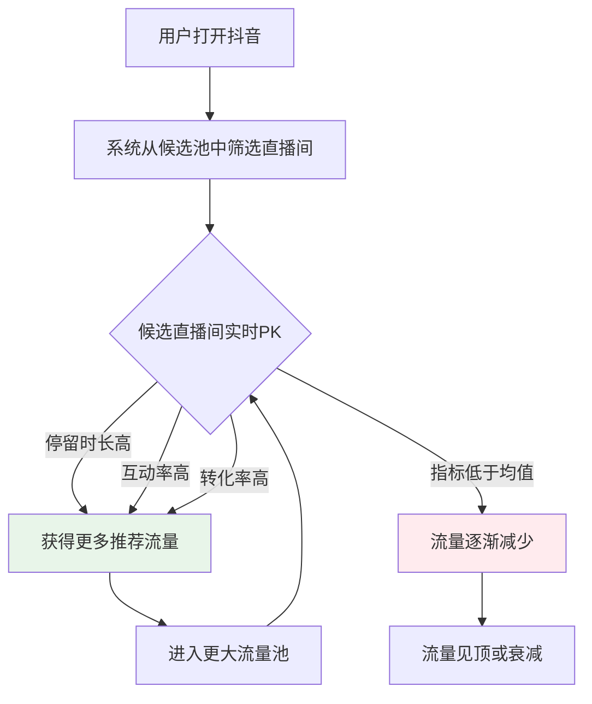
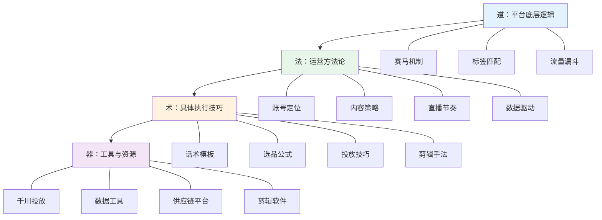
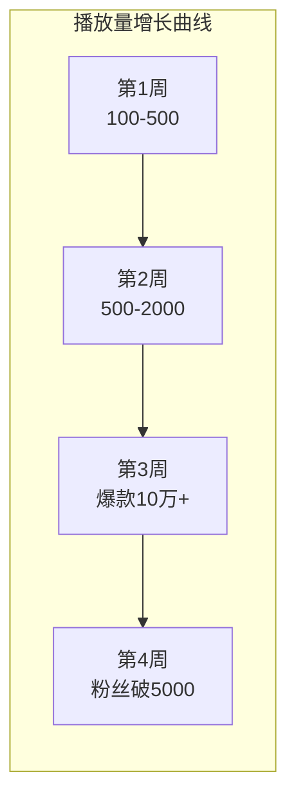

## 案例三：抖音直播带货的起号策略

### 引言：为什么研究这个案例

抖音直播带货是2023-2025年增长最快的电商形态之一。据抖音电商官方数据，2024年抖音电商GMV突破3万亿，其中直播电商占比超过60%。与传统电商相比，直播带货的进入门槛更低——不需要囤大量货、不需要开店铺保证金、不需要专业的摄影团队——一部手机、一个补光灯就能开播。

但低门槛不等于容易成功。抖音直播的淘汰率极高：开播3个月内放弃的主播超过70%，能做到月入过万的不到10%。差距在哪里？不是运气，而是**系统化的起号策略**。

本案例记录了"小美"从零起步到月销20万的完整过程，重点拆解每个阶段的决策逻辑、执行细节和踩过的坑。这不是一个"一夜暴富"的故事，而是一个普通人通过正确方法论稳步增长的可复制路径。

### 道：理解抖音直播的底层逻辑

在进入具体操作之前，必须先理解抖音直播带货的"道"——也就是它的底层运行逻辑。很多新手一上来就学话术、学投流，结果越做越迷茫，根本原因是没有理解平台的底层逻辑。

#### 流量分配的本质：赛马机制

抖音的流量分配不是"给你流量"，而是"你去抢流量"。平台同时把流量分配给成千上万个直播间，每个直播间都在同一条赛道上竞争。系统会根据实时数据表现，决定给谁更多流量、减少谁的流量。这个过程叫做**赛马机制**。



理解赛马机制后，所有运营动作的目标就清晰了：**让你的直播间在每一个流量池层级中，数据都跑赢同层级的竞争对手**。不是一次性跑赢，而是持续跑赢。

#### 抖音的标签系统：人找货，货找人

抖音电商的核心模型是**兴趣电商**——不是用户搜索商品，而是系统根据用户兴趣推荐商品。这个过程中，标签系统起着关键作用：

**用户标签**：系统根据用户的浏览历史、互动行为、购买记录，给每个用户打上兴趣标签（如"25-35岁女性""关注职场穿搭""价格敏感度中等"）。

**内容标签**：系统根据视频/直播的内容、文字、语音、画面，给每条内容打上分类标签（如"女装""通勤风""99-299元"）。

**匹配逻辑**：当内容标签和用户标签高度匹配时，系统把内容推给对应用户。匹配度越高，点击率和转化率就越高，系统就越愿意推——形成正向循环。

这意味着起号阶段的首要任务是**让系统正确识别你的标签**。如果标签混乱（今天发美食、明天发穿搭、后天发搞笑），系统不知道你是干什么的，就无法精准推流。

#### 算法评估的五大核心指标

抖音推荐算法评估直播间主要看五个指标，这五个指标层层递进，形成一个转化漏斗：

| 指标 | 定义 | 权重（估） | 优化方向 |
|------|------|-----------|----------|
| **停留时长** | 用户在直播间的平均观看时间 | ★★★★★ | 内容吸引力、话术节奏、福利设计 |
| **互动率** | 评论、点赞、分享、加团的频率 | ★★★★ | 引导互动话术、争议话题、抽奖 |
| **转粉率** | 进入直播间后关注主播的比例 | ★★★ | 人设魅力、内容价值承诺 |
| **商品点击率** | 用户点击购物车的比例 | ★★★★ | 选品吸引力、讲解技巧、价格展示 |
| **成交转化率** | 点击商品后下单的比例 | ★★★★★ | 价格、信任、逼单话术、售后保障 |

**关键洞察**：这五个指标中，停留时长是"入场券"——如果用户平均停留不到30秒，其他指标再好也没有意义，因为系统根本不会推更多人进来。所以起号阶段的第一优先级是**把停留时长做到60秒以上**。

#### 道法术器的完整框架



---

### 背景：起点画像

| 维度 | 详情 |
|------|------|
| **主播** | 小美，26岁，前服装店导购，有3年线下服装销售经验 |
| **品类** | 女装（职场通勤风） |
| **启动资金** | 5000元（设备2000元 + 首批货款3000元） |
| **时间线** | 6个月（从开号到稳定月销15-20万） |
| **团队** | 前期单人，第4个月起增加1助播+1运营 |
| **选品来源** | 1688拿货 + 后期工厂定制 |

**为什么选女装？** 小美的选择并非随意。抖音直播选品有几个核心考量：第一，品类要有**视觉展示性**——服装上身效果直观，比标品更容易激发购买欲；第二，**复购率高**——女性用户买衣服是持续性需求；第三，**价格带适中**——99-299元处于冲动消费的舒适区间，用户决策链短；第四，**供应链可获取**——1688上女装供应商极度成熟，小批量拿货门槛低。

**为什么选通勤风而非其他风格？** 这个决策背后有数据支撑。小美在选品前用蝉妈妈分析了抖音女装赛道的竞争格局：

| 风格 | 搜索量 | 竞争度 | 适合新号？ | 原因 |
|------|--------|--------|-----------|------|
| 甜美风 | 高 | 极高 | 否 | 头部主播垄断，新号难突围 |
| 辣妹风 | 中 | 高 | 否 | 受众偏年轻，客单价低 |
| 大码女装 | 中 | 中 | 可考虑 | 蓝海但供应链要求高 |
| **通勤风** | **中高** | **中** | **是** | **场景明确、受众购买力强、竞争相对温和** |
| 国风/汉服 | 低 | 低 | 否 | 小众，天花板低 |

通勤风的核心优势在于**场景驱动选题**——"上班穿什么"是一个每天都会产生的刚需问题，这意味着内容选题永远不枯竭，而且用户有明确的购买动机。

---

### 第一阶段：账号定位与冷启动（第1-2周）

#### 1.1 账号定位的四要素

小美的账号定位经过了反复推敲，最终确定了四个维度：

**目标人群画像**：25-35岁职场女性，一二线城市为主，月收入8000-20000元，注重穿着但预算有限，追求"看起来贵但不贵"的穿搭方案。这个人群在抖音上有庞大的基数，且购买力和决策速度都不错。

**内容风格**：简约通勤风。为什么不是甜美风、辣妹风？因为通勤风的场景最明确——上班穿什么，这个需求是每天都在发生的。场景明确意味着内容选题不会枯竭，也容易形成"解决方案型"的内容定位。

**价格带**：99-299元。这个价格带的逻辑是：低于99元用户会质疑质量，高于299元在直播间冲动消费的转化率会显著下降。199元是甜蜜点——用户觉得"不贵"但主播有足够的利润空间。

**差异化定位**：真人穿搭+职场场景。抖音上做女装的主播成千上万，小美的差异化在于：她不是在空荡的直播间换衣服，而是在真实的办公室、会议室、咖啡厅场景中展示穿搭。这让用户能直接想象"我穿去上班也这样"。

**定位验证方法**：在最终确定定位前，小美做了三个验证动作：（1）在蝉妈妈上搜索"通勤穿搭""职场女装"等关键词，确认搜索量和竞争度；（2）找到5-10个同类账号，分析他们的粉丝量、更新频率、内容形式、变现方式；（3）发布3条不同风格的测试视频，看哪种风格的数据最好。最终数据验证了通勤风的可行性。

#### 1.2 账号基建清单

以下是一个完整的起号准备清单，每一项都有具体要求：

| 准备项 | 具体要求 | 预算 | 注意事项 |
|--------|----------|------|----------|
| 手机 | iPhone 12及以上或同级别安卓 | 已有/2000元 | 画质直接影响转化率 |
| 补光灯 | 18寸环形补光灯+柔光罩 | 150-300元 | 避免硬光，色温调到4500K |
| 麦克风 | 领夹式无线麦克风 | 100-200元 | 环境噪音会让用户秒退 |
| 手机支架 | 可调节落地支架 | 50-100元 | 高度调到胸部位置 |
| 背景布/场景 | 简约风背景或实景搭建 | 200-500元 | 不要太花哨，突出产品 |
| 样品 | 首批10款，每款5件 | 2000-3000元 | 先小批量测试，不要压货 |
| 抖音账号 | 实名认证，开通商品橱窗 | 0 | 需要1000粉丝才能开橱窗 |
| 1688供应商 | 至少备选3家 | 0 | 下文详述 |

**设备选择的细节补充**：

- **手机选择**：iPhone 12以上的摄像头在弱光环境下表现远好于同价位安卓机，但如果你的安卓机是近2年的旗舰（如小米14、华为Mate60），画质完全够用。关键是保持镜头清洁——指纹和油污会让画面模糊，准备一块擦镜布。
- **补光灯的正确用法**：环形灯放在手机正后方，高度与脸部平齐。灯太低会有"恐怖片"效果，灯太高会在眼窝形成阴影。色温4500K是中性白光，既不会偏黄（显得廉价）也不会偏蓝（显得冰冷）。
- **收音环境**：关掉空调、风扇等持续噪音源。如果房间有回音，挂几件厚衣服或铺地毯可以有效吸音。领夹麦夹在衣领下方15cm处，不要夹在正胸口——会有呼吸声。

**供应商筛选标准**：在1688上找供应商不能只看价格。小美筛选供应商的五个标准是：（1）支持一件代发——前期不压货；（2）48小时内发货——物流体验影响口碑；（3）支持7天无理由退换——降低用户购买门槛；（4）有实拍图而非精修图——避免货不对板；（5）月销量1000+——说明产品经过市场验证。

**供应商沟通话术**：找到供应商后，不要直接下单。先用这个话术联系："你好，我是抖音直播带货的，目前月销量XXX件，想长期合作。请问你们支持一件代发吗？批发价和零售价差多少？能提供实拍视频吗？"即使你前期没有销量，也要表现出"长期合作"的意向，这样供应商更愿意给你好的价格和服务。

#### 1.3 账号装修与主页设计

账号主页是用户决定是否关注你的"门面"。小美的主页设计遵循三个原则：

**头像**：使用真人半身照，穿着自己卖的衣服，背景干净。不要用卡通头像、风景照或过度美颜的照片——用户要看到"真实的你"。

**昵称**：格式为"人名+品类"，如"小美通勤穿搭"。这样用户一看就知道你是做什么的。避免使用生僻字、特殊符号或纯英文名——用户记不住、搜不到。

**简介**：用一句话说清楚三个问题——你是谁、你能提供什么、为什么要关注你。小美的简介是："前服装店导购 | 帮职场女生花小钱穿出高级感 | 每晚8点直播"。

**背景图**：放上直播时间表和核心卖点，如"每晚8点 | 99-299元通勤穿搭 | 7天无理由退换"。

---

### 第二阶段：内容积累与粉丝增长（第3-8周）

#### 2.1 短视频策略：用内容撬动算法

起号阶段，短视频的作用是**给直播间导流**。抖音的逻辑是：先通过短视频让系统认识你、给你打标签，然后系统才会把你的直播间推给精准用户。

**内容类型矩阵**：

| 内容类型 | 占比 | 目的 | 示例 |
|----------|------|------|------|
| 穿搭教程 | 40% | 展示专业度，获取精准流量 | "小个子女生通勤穿搭，显高10cm" |
| 一衣多穿 | 25% | 展示产品性价比 | "一件西装的7种穿法，从周一穿到周五" |
| 穿搭对比 | 20% | 制造冲突感，提高完播率 | "月薪3千和月薪3万的穿搭差在哪" |
| 幕后花絮 | 15% | 建立人设，增强粉丝粘性 | "选货的一天，教你避坑劣质面料" |

**发布节奏**：每天2-3条，时间分别在早8点（通勤时间）、中午12点（午休时间）、晚7点（下班时间）。这三个时段是目标用户最活跃的时间窗口。

**标签策略**：每条视频带3-5个标签，组合方式为"大标签+中标签+小标签"。例如：#穿搭（大，流量池大但竞争激烈）+ #职场穿搭（中，精准度更高）+ #小个子通勤穿搭（小，竞争少容易出头）。大标签获取曝光上限，小标签确保冷启动阶段能获得初始流量。

#### 2.2 爆款内容的创作方法论

爆款不是偶然，而是有规律可循的。小美在实践中总结了一套可复制的内容创作方法论：

**前3秒黄金法则**：用户在信息流中划到你的视频，如果前3秒没有抓住注意力，立刻就会划走。前3秒的设计有几种有效模式：

| 模式 | 示例 | 原理 |
|------|------|------|
| 反常识 | "面试千万别穿黑色西装" | 打破认知预期，激发好奇心 |
| 冲突对比 | "淘宝39元 vs 专柜399元，你分得清吗？" | 制造视觉冲突，吸引停留 |
| 痛点直击 | "大腿粗的女生别再穿紧身裤了" | 精准命中目标人群的痛点 |
| 利益前置 | "教你用100块搭出1000块的效果" | 直接告诉用户能得到什么 |
| 悬念钩子 | "这件衣服我犹豫了一周才敢推荐" | 制造悬念，引导继续观看 |

**完播率优化技巧**：完播率高意味着内容质量好，系统会推入更大的流量池。提升完播率的具体技巧：（1）视频时长控制在15-45秒——太短撑不起内容，太长完播率会下降；（2）在视频中段设置"转折点"或"惊喜点"，给用户一个继续看下去的理由；（3）结尾用"下一条更精彩"或"评论区告诉我你想看什么"引导互动。

**选题库建设**：不要每天临时想选题，要提前建好选题库。小美的选题库来源：（1）蝉妈妈/飞瓜数据看同行爆款视频的选题；（2）抖音搜索框看"通勤穿搭"相关的热门搜索词；（3）自己评论区里用户的真实问题；（4）小红书/微博上的穿搭热搜话题。每周日花2小时整理下周的选题，每天只需从库里挑选即可。

#### 2.3 数据复盘：读懂流量密码

小美在内容积累阶段坚持每天复盘数据。以下是她记录的真实数据变化：



**关键转折点分析**：

第3周出现爆款不是运气。小美复盘发现，那条视频有几个成功要素：（1）标题用了"反常识"的钩子——"面试千万别穿黑色西装"；（2）前3秒就展示了"错误穿搭"和"正确穿搭"的对比画面，制造了视觉冲击；（3）视频时长控制在28秒——完播率达到45%，远高于同类型视频的平均值（约20%）。

这个案例说明了抖音内容创作的核心法则：**前3秒决定生死，完播率决定天花板**。用户在信息流中划到你的视频，如果前3秒没有抓住注意力，立刻就会划走。而完播率高则意味着内容质量好，系统会推入更大的流量池。

**每日数据复盘模板**：

```text
日期：____
发布视频数：____
总播放量：____
最高播放量视频：____
最高播放量视频的完播率：____
最高互动率视频：____
粉丝增长：____
今日反思：哪条视频数据好？为什么？哪条差？为什么？
明日改进：____
```

#### 2.4 从短视频到直播的过渡

粉丝到5000是一个重要节点——这时候可以开通商品橱窗，开始在短视频中挂车。但小美没有急于开播，而是做了三件事：

1. **预热视频**：连续3天发布"明天晚上8点，直播见"的预告视频，培养用户预期
2. **福利设计**：准备了5件9.9元的引流款（成本价出售），用于直播间拉停留
3. **话术准备**：写好了开场5分钟的话术脚本，反复练习到自然流畅

**首播前的检查清单**：

- [ ] 设备充满电，备用充电宝准备好
- [ ] 网络测试：用抖音直播伴侣测速，上传带宽至少10Mbps
- [ ] 产品全部摆放到位，价格标签写好
- [ ] 话术脚本打印出来放在手边
- [ ] 优惠券设置好（新关注粉丝专属券、限时折扣券）
- [ ] 助播或朋友准备好在评论区带节奏
- [ ] 提前30分钟发布"即将开播"的短视频

---

### 第三阶段：直播优化与增长（第9-16周）

#### 3.1 直播间的节奏设计

一场2小时的直播不是随意聊天，而是一场精心设计的"演出"。小美的直播节奏模板如下：

**前15分钟——开场暖场期**：
- 0-5分钟：用福利款（9.9元T恤）吸引进入直播间的用户停留，同时引导关注和加粉丝团
- 5-10分钟：自我介绍+今日直播预告，告诉用户"今天有什么好东西"
- 10-15分钟：上第一个正价款，用详细讲解建立信任

**中间90分钟——核心转化期**：
- 采用"3+1"循环节奏：3个正价款+1个福利款，每20-25分钟一个循环
- 每个款的讲解时间3-5分钟，包含：展示上身效果→说明面料和做工→对比同类产品价格→给出限时优惠→催单话术
- 每隔30分钟做一次"整点抽奖"或"评论区抽免单"，维持互动热度

**最后15分钟——收尾冲刺期**：
- 回顾今日爆款，做最后一波限时优惠
- 预告明天的直播内容，引导关注
- 感谢所有下单的用户，营造温暖的结束氛围

**排品的底层逻辑**：直播间的排品不是随便排列，而是有节奏的。一个2小时直播的排品结构应该是：

| 位置 | 产品类型 | 数量 | 目的 |
|------|----------|------|------|
| 开场 | 引流款（低价高性价比） | 1-2款 | 拉停留、拉互动 |
| 前半段 | 主推款A（利润款） | 2-3款 | 主力转化 |
| 中段 | 福利款 | 1款 | 维持在线人数 |
| 后半段 | 主推款B（利润款） | 2-3款 | 持续转化 |
| 收尾 | 爆款返场 | 1-2款 | 最后冲刺 |

#### 3.2 直播话术的完整体系

话术不是"背台词"，而是理解背后的心理学原理后，用自己的方式表达。以下是小美总结的话术体系：

**开场话术（5分钟）**：

```text
"家人们晚上好！欢迎来到小美的直播间！
今天给大家准备了XX款超值好物，有几款是直播间专属价，外面买不到的！
新来的姐妹先点个关注，不迷路，一会儿有9.9元的福利款等你们抢！
先扣个1让我看看有多少姐妹在！"
```

**讲品话术（每款3-5分钟）**：

讲品话术的核心是**FABE法则**——Feature（特征）、Advantage（优势）、Benefit（利益）、Evidence（证据）：

| 步骤 | 话术示例 | 作用 |
|------|----------|------|
| Feature | "这件西装是TR面料，含65%涤纶+35%粘纤" | 告诉用户产品是什么 |
| Advantage | "这种面料不起皱、不起球、垂感好" | 说明比其他面料好在哪 |
| Benefit | "出差放行李箱里拿出来就能穿，不用熨" | 告诉用户能得到什么好处 |
| Evidence | "你看我揉了几下，完全没褶子"（现场演示） | 用证据证明你说的是真的 |

**逼单话术的底层逻辑**：

逼单不是"逼迫"用户下单，而是**降低决策阻力**。有效的逼单话术围绕三个心理学原理展开：

**稀缺性**："这款只剩最后20件了，拍完就下架"——制造紧迫感，让用户觉得"现在不买就没了"。注意：必须是真实的库存限制，虚假宣传会被平台处罚。

**社会认同**："已经有87位姐妹下单了，大家的眼光真好"——利用从众心理，让用户觉得"这么多人买肯定不会差"。

**损失厌恶**："今天直播间的价格是全网最低的，明天恢复原价299"——人对"失去"的恐惧远大于对"得到"的渴望。

**互动话术**：

| 目的 | 话术示例 | 技巧 |
|------|----------|------|
| 拉停留 | "刚进来的姐妹扣个'新'，我看看今天有多少新朋友" | 让用户参与，而不是被动观看 |
| 拉互动 | "觉得好看的扣1，觉得一般的扣2，我看看大家的审美" | 用低门槛的互动降低参与成本 |
| 拉关注 | "关注小美的姐妹，每周三有一场老粉专属福利" | 给关注一个具体的价值承诺 |
| 拉加团 | "加入粉丝团的姐妹，等会儿优先发货+送小礼物" | 用实际利益驱动加团 |

**应急话术**：

| 场景 | 话术 | 原则 |
|------|------|------|
| 冷场（在线人数骤降） | "姐妹们，这款真的是今天最值的，我给大家再演示一遍" | 用产品价值重新吸引注意力 |
| 质疑（有人说贵） | "理解姐妹的顾虑，我们来看看这个面料和做工，值不值这个价" | 不要反驳，用证据化解 |
| 黑粉攻击 | "谢谢这位朋友的关注，每个人有不同的看法很正常" | 不要争吵，一句话带过 |
| 系统提醒违规 | 立即停止当前话术，切换到合规表达 | 了解平台规则，避免反复踩线 |

#### 3.3 千川广告投放策略

当直播间自然流量遇到瓶颈时，需要用付费流量突破。小美从第9周开始投放千川广告，日预算从100元逐步提升到300元。

**投放策略分三步走**：

**第一步：短视频引流投放（日预算100元）**
- 投放目标：直播间观看
- 定向人群：25-35岁女性，兴趣标签"女装""穿搭"
- 素材：用已验证的爆款短视频作为投放素材
- 目的：用低成本获取精准流量，同时帮助系统学习你的用户画像

**第二步：直播间画面直投（日预算200元）**
- 投放目标：商品点击
- 定向人群：在第一步基础上叠加"相似达人"定向
- 优化重点：直播间画面要有吸引力——主播状态、产品展示、价格标签
- 目的：从"拉人头"升级为"拉精准用户"

**第三步：成交优化投放（日预算300元）**
- 投放目标：下单成交
- 使用"放量投放"——让系统自动寻找最可能下单的用户
- ROI要求：至少做到1:3（投1元产出3元GMV）
- 目的：直接拉动销售额

**千川投放的核心指标**：

| 指标 | 健康值 | 危险信号 | 优化方向 |
|------|--------|----------|----------|
| 千次曝光成本（CPM） | 20-50元 | >80元 | 人群定向太窄或素材太差，扩大定向或更换素材 |
| 点击率（CTR） | >3% | <1.5% | 封面/标题没有吸引力，优化素材 |
| 转化率（CVR） | >2% | <1% | 直播间承接能力不足，优化讲品话术和排品 |
| ROI | >1:3 | <1:2 | 暂停投放，先优化直播间转化再继续 |

**投放避坑指南**：

- **不要一上来就投成交**：新号的直播间承接能力不足，直接投成交会浪费预算。先投"观看"积累数据，再逐步升级目标。
- **不要频繁调整计划**：每次调整后系统需要6-8小时学习，频繁调整会导致系统无法学习到稳定的用户模型。
- **素材要定期更新**：同一条素材的生命周期约7-14天，之后效果会衰减。每两周准备3-5条新素材轮换。
- **投放时段要和直播时段匹配**：投放是为了给直播间导流，如果投放了但主播不在播，钱就白花了。

#### 3.4 选品的数据化决策

选品不能靠感觉，要靠数据。小美建立了一个简单的选品评估表：

| 评估维度 | 权重 | 评分标准 |
|----------|------|----------|
| 直播间点击率 | 25% | >5%得5分，3-5%得3分，<3%得1分 |
| 转化率 | 25% | >3%得5分，1-3%得3分，<1%得1分 |
| 退货率 | 20% | <10%得5分，10-20%得3分，>20%得1分 |
| 利润率 | 15% | >50%得5分，30-50%得3分，<30%得1分 |
| 复购率 | 15% | >15%得5分，5-15%得3分，<5%得1分 |

总分4分以上的款持续主推，3-4分的款作为辅助款，3分以下的款淘汰。通过这个评估体系，小美每两周淘汰一轮末位款，补充新款式，保持直播间的产品新鲜度。

**选品的具体来源和方法**：

| 来源 | 方法 | 适用阶段 |
|------|------|----------|
| 蝉妈妈/飞瓜 | 查看同类主播的爆款商品 | 全阶段 |
| 1688热搜 | 关注"直播专供"分类的热销品 | 起步期 |
| 精选联盟 | 看高佣且销量好的商品 | 中期 |
| 用户评论 | 收集粉丝在评论区的需求 | 全阶段 |
| 线下市场 | 去服装批发市场看实物、摸面料 | 进阶期 |

---

### 第四阶段：规模化运营（第17-24周）

#### 4.1 团队扩展的时机和方式

当月销售额稳定在10万以上时，一个人已经扛不住了。小美在第17周开始组建团队：

**第一个招的人：助播**
- 职责：直播间互动、回复评论、上下架商品、配合主播制造氛围
- 要求：性格活泼、打字快、懂服装基本知识
- 成本：4000-6000元/月（底薪+提成）
- 招聘渠道：可以在自己的粉丝中招聘——既了解产品，又有热情

**第二个招的人：运营**
- 职责：短视频拍摄剪辑、数据分析、千川投放、供应链对接
- 要求：有抖音运营经验，会用剪映/PR，懂基本的数据分析
- 成本：6000-8000元/月（底薪+提成）

**标准化流程建设**：

团队扩大后，最重要的是建立SOP（标准操作流程）。小美整理了三个核心SOP：

**直播SOP**（开播前1小时 → 下播后30分钟）：

```text
开播前1小时：
  □ 检查设备电量、网络速度
  □ 确认今日排品顺序和价格
  □ 打印话术脚本
  □ 设置优惠券和限时活动
  □ 发布预告短视频

开播前15分钟：
  □ 调整灯光和机位
  □ 产品按出场顺序摆放
  □ 助播就位，测试互动流程

直播中：
  □ 按节奏模板执行排品
  □ 助播实时记录在线人数和互动数据
  □ 每30分钟做一次互动活动

下播后：
  □ 导出今日直播数据
  □ 30分钟复盘会议
  □ 记录待改进事项
  □ 准备明天的排品和话术
```

**选品SOP**：供应商初筛→样品评估→上播测试→数据追踪→淘汰/补货决策

**短视频SOP**：选题库维护→脚本撰写→拍摄→剪辑→发布→数据复盘

#### 4.2 供应链升级路径

从1688拿货到工厂定制，是一个质的飞跃：

**阶段一：1688代发（第1-8周）**
- 优点：零库存、零风险、快速测试市场
- 缺点：同质化严重、利润空间有限、发货速度不可控
- 适合：起号验证阶段

**阶段二：小批量备货（第9-16周）**
- 与验证过的爆款供应商签订小批量采购协议
- 单款备货20-50件，库存周转控制在7天内
- 利润率提升10-15%（因为批量采购有折扣）

**阶段三：工厂定制合作（第17周起）**
- 找到愿意合作的小型服装厂（起订量50-100件）
- 开发独家款式——这是核心壁垒，别人抄不了
- 面料、版型、细节都可以根据直播间反馈快速迭代
- 利润率再提升15-20%

**工厂合作的注意事项**：

| 事项 | 具体要求 | 风险点 |
|------|----------|--------|
| 起订量 | 谈到50-100件/款 | 起订量太高会压资金 |
| 交期 | 明确写入合同 | 延迟交期影响直播排期 |
| 质量标准 | 提供详细的质量标准清单 | 口头约定没有约束力 |
| 知识产权 | 约定款式设计归属 | 防止工厂把你的设计卖给别人 |
| 结算方式 | 先付30%定金，验货后付尾款 | 不要一次性全款 |

#### 4.3 最终经营数据

经过6个月的运营，小美的账号达到了以下成绩：

| 指标 | 数据 |
|------|------|
| 粉丝数 | 8万+ |
| 日均直播时长 | 3-4小时 |
| 日均在线人数 | 100-300人 |
| 日均GMV | 5000-10000元 |
| 月销售额 | 15-20万元 |
| 毛利率 | 40% |
| 月净利润 | 3-5万元 |
| 千川投放ROI | 1:3.5 |
| 平均退货率 | 12% |

**成本结构拆解**（以月销15万为例）：

| 成本项 | 金额 | 占比 |
|--------|------|------|
| 货品成本 | 6万 | 40% |
| 千川广告 | 1.5万 | 10% |
| 人员工资 | 1.2万 | 8% |
| 快递物流 | 0.75万 | 5% |
| 退货损耗 | 1.05万 | 7% |
| 设备折旧 | 0.1万 | 0.7% |
| 其他杂费 | 0.3万 | 2% |
| **总成本** | **10.9万** | **72.7%** |
| **净利润** | **4.1万** | **27.3%** |

---

### 关键成功因素深度解析

#### 因素一：内容先行，直播收割

小美没有一上来就开播卖货，而是花了4周时间通过短视频积累粉丝和内容标签。这个策略的底层逻辑是：**抖音的流量分配是"标签匹配"机制**。系统通过你发布的内容判断你的账号是什么类型，然后把你的直播间推给对这类内容感兴趣的用户。如果一开始就开播，系统不知道该推给谁，流量就不精准，转化率就低，系统就越不推——形成恶性循环。

#### 因素二：真人出镜，建立IP

在抖音直播中，用户买的不只是商品，更是对主播的信任。小美坚持真人出镜，用自己的真实穿搭效果打动用户。数据显示，真人出镜的直播间平均停留时长是无人出镜直播间的3-5倍。当粉丝认可了主播的审美和品味，复购率会显著提升——小美的粉丝复购率达到18%，远高于行业平均的8%。

#### 因素三：数据驱动，持续迭代

小美每天花30分钟复盘直播数据：哪个时段在线人数最多、哪款产品点击率最高、哪个话术转化效果最好。所有的决策——选品、排品、话术、投放——都基于数据而非直觉。这种"数据驱动"的思维方式，是她能在6个月内持续增长的核心原因。

#### 因素四：供应链是长期壁垒

前期在1688拿货只能赚到信息差的钱，利润薄且容易被模仿。当小美开始与工厂合作开发独家款式时，她的竞争壁垒才真正建立起来。独家款式意味着：用户在其他直播间买不到同款，价格没有可比性，利润率也更高。

#### 因素五：坚持是最大的竞争力

小美在前3周每天只有100-500的播放量时没有放弃，在开播初期只有10-30人在线时没有放弃，在千川投放前期ROI只有1:1.5时没有放弃。抖音直播是一个"滚雪球"的过程——前期积累慢，但一旦突破临界点，增长会加速。大多数失败的人不是方法不对，而是没有坚持到临界点。

---

### 合规与风控：不可忽视的法律底线

很多新手主播只关注"怎么卖货"，却忽视了"什么不能做"。抖音直播带货涉及多个法律法规，违规轻则限流、重则封号甚至面临法律诉讼。

#### 广告法红线

《广告法》对直播话术有严格限制，以下是必须避免的违规表达：

| 违规类型 | 违规示例 | 合规替代 |
|----------|----------|----------|
| 绝对化用语 | "最好的""全网第一""独一无二" | "我们家卖得最好的""很多姐妹都喜欢" |
| 虚假功效 | "穿上显瘦20斤""治好了我的腰痛" | "版型设计修饰身材比例""穿着很舒服" |
| 虚假促销 | "原价999今天只要99"（实际从未卖过999） | "日常价299，直播间专属价199" |
| 诱导好评 | "给五星好评返现5元" | "收到货满意的话，帮小美分享一下哦" |
| 虚假限量 | "只剩最后10件"（实际库存充足） | 只在真实库存紧张时使用限量话术 |

**处罚力度**：抖音平台对违规话术的处罚包括：警告→限流→禁播1-3天→永久封号。严重违规（如虚假宣传涉及食品安全）还可能被市场监管部门处罚。

#### 消费者权益保护

| 义务 | 具体要求 | 违规后果 |
|------|----------|----------|
| 7天无理由退换 | 非定制、非鲜活商品必须支持 | 平台处罚+用户投诉 |
| 如实描述 | 产品材质、尺码、颜色必须与实物一致 | 退货率飙升+差评 |
| 发货时效 | 承诺时间内必须发货 | 平台扣分+降权 |
| 售后响应 | 24小时内回复用户消息 | 平台处罚 |

#### 税务合规

当月销售额超过一定额度后，税务合规就成为必须面对的问题：

- **个人主播**：年收入超过12万元需要个人所得税汇算清缴
- **个体工商户**：注册个体户可以享受小规模纳税人优惠（月销售额10万以下免征增值税）
- **公司化运营**：当月销超过30万时，建议注册公司，可以抵扣成本、合理节税

**建议**：月销售额超过5万后，找一个专业的财税代理，每年费用约3000-5000元，但能避免税务风险。

---

### 危机管理：当事情出错时

直播带货不可能一帆风顺，提前准备好危机应对方案至关重要。

#### 场景一：产品翻车（质量问题/货不对板）

**应对流程**：
1. 立即下架问题产品
2. 在直播间公开道歉，说明情况
3. 主动联系已购买的用户，提供退换货方案
4. 向供应商追责，要求赔偿
5. 发布道歉视频，说明整改措施

**话术模板**："姐妹们，非常抱歉，这批货的质量确实有问题。所有已经购买的姐妹都可以联系客服全额退款，运费我们承担。这是我们选品不严格的责任，以后一定会加强质量把控。"

#### 场景二：直播事故（口误/画面问题/网络中断）

| 事故类型 | 应急处理 |
|----------|----------|
| 口误（说错价格） | 立即纠正，如果已下单按错误价格履约 |
| 画面卡顿/黑屏 | 助播立即在评论区说明情况，主播检查网络 |
| 网络中断 | 切换到备用手机热点，5分钟内恢复 |
| 不当言论 | 立即停止，下播后发布道歉声明 |

#### 场景三：恶意投诉/职业打假

**预防措施**：（1）所有产品描述有据可查，不夸大宣传；（2）保留所有进货凭证和质检报告；（3）直播间录屏备份，保留话术证据。

**应对方法**：收到投诉后不要慌张，先核实情况。如果是真实问题，积极解决；如果是恶意投诉，向平台提交申诉材料（进货凭证、质检报告、直播录屏）。

---

### 进阶：从月销20万到月销100万的路径

当账号做到月销20万后，要突破到月销100万，需要在三个方向发力：

**矩阵账号**：用已经验证成功的内容模式和供应链，复制2-3个账号。每个账号可以是不同的风格定位（如：一个通勤风、一个休闲风、一个大码女装），覆盖更广的人群。矩阵账号之间可以互相导流，降低单账号的风险。

**自播+达播结合**：除了自己直播，把验证过的爆款产品分销给其他中小主播。在抖音精选联盟上设置20-30%的佣金，让100个主播帮你卖货，比自己一个人播效果好得多。

**私域沉淀**：把直播间的忠实粉丝引导到微信群，建立私域社群。在群里做新品预告、专属优惠、穿搭分享，把一次性买家变长期客户。私域的复购率通常是公域的3-5倍。

**品牌化转型**：当销量稳定后，注册自己的商标，设计品牌包装。从"卖货"升级为"卖品牌"，客单价和利润率都会有质的提升。

**多平台布局**：不要把鸡蛋放在一个篮子里。抖音之外，同步布局快手、视频号、小红书等平台，用同一套内容和供应链覆盖更多渠道。

---

### 常见踩坑与避坑指南

| 坑 | 表现 | 正确做法 |
|----|------|----------|
| 过早开播 | 0粉丝就开播，系统不知道推给谁 | 先发2-3周短视频，积累1000+粉丝和清晰标签再开播 |
| 盲目压货 | 一次性拿几万块的货 | 先小批量测试，数据验证后再加量 |
| 忽视退货率 | 只看GMV不看退货 | 退货率超过20%必须排查产品和描述问题 |
| 话术生硬 | 背话术模板，不自然 | 理解话术背后的逻辑，用自己的话表达 |
| 投放无策略 | 一开始就大预算投放 | 先用自然流量验证直播间转化能力，再用付费放大 |
| 忽视粉丝维护 | 只卖货不互动 | 每场直播专门留出互动时间，回复老粉评论 |
| 选品靠感觉 | "我觉得这个好看" | 用数据评估表，让数据说话 |
| 不做复盘 | 播完就走 | 每天30分钟复盘，记录关键数据变化 |
| 忽视合规 | 用绝对化用语、虚假宣传 | 学习广告法，所有话术自查合规性 |
| 单一平台依赖 | 只做抖音一个平台 | 至少布局2个平台，分散风险 |
| 不做税务规划 | 收入直接进个人账户 | 月销5万后注册个体户，找财税代理 |
| 急于扩团队 | 赚到钱就招人 | 先用兼职/外包验证需求，稳定后再正式招聘 |

---

### 工具与资源清单

| 工具类别 | 推荐工具 | 用途 | 费用 |
|----------|----------|------|------|
| 数据分析 | 蝉妈妈、飞瓜数据 | 竞品分析、热门选品、直播数据监控 | 免费版够用，专业版200-500元/月 |
| 直播工具 | 抖音直播伴侣 | 直播推流、多机位切换、弹幕管理 | 免费 |
| 视频剪辑 | 剪映（首选） | 短视频剪辑、字幕生成、模板套用 | 免费 |
| 供应链 | 1688、批批网、搜款网 | 服装货源采购、一件代发 | 免费 |
| 千川投放 | 巨量千川App/PC端 | 付费流量投放与优化 | 按预算 |
| 客服管理 | 飞鸽（官方） | 售前咨询、售后处理、自动回复 | 免费 |
| 选品工具 | 蝉选、大鱼 | 精选联盟选品、佣金对比 | 免费版够用 |
| 财税代理 | 当地代理记账公司 | 税务申报、发票管理 | 200-500元/月 |

---

### 总结

小美的案例证明了一个朴素的道理：**在抖音直播带货这个赛道，方法论比资金更重要，坚持比天赋更重要**。5000元启动资金，6个月做到月入3-5万，这不是奇迹，而是系统化执行的结果。

核心公式可以总结为：

> **精准定位 × 优质内容 × 数据驱动 × 持续迭代 × 合规经营 × 时间积累 = 抖音直播成功**

每一个环节都不是一次性的工作，而是需要持续优化的闭环。内容要持续迭代，选品要持续更新，话术要持续打磨，投放要持续优化，合规要持续关注。只有把"持续改进"变成日常习惯，才能在抖音直播这个高度竞争的赛道中活下来、活得好。

最后提醒一点：本案例的时间节点是2024-2025年，抖音的规则和算法在持续变化。具体的投放策略、流量分配机制可能会更新，但底层逻辑——**用优质内容获取精准流量，用数据驱动优化转化，用供应链建立壁垒**——是不变的。掌握了底层逻辑，就能灵活应对平台的变化。
