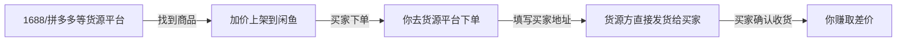
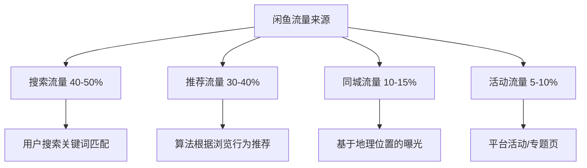
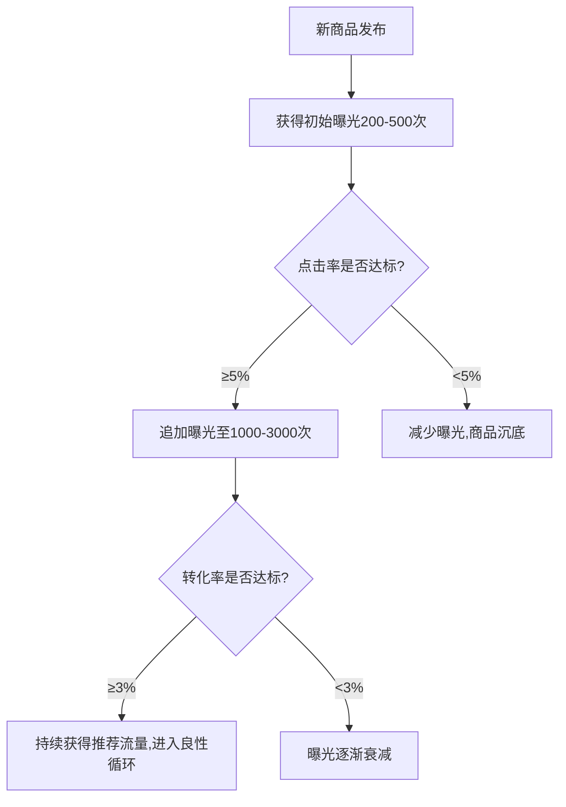
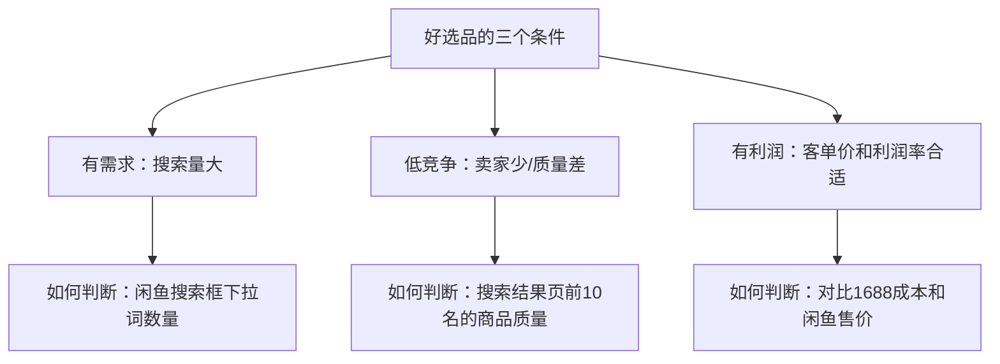
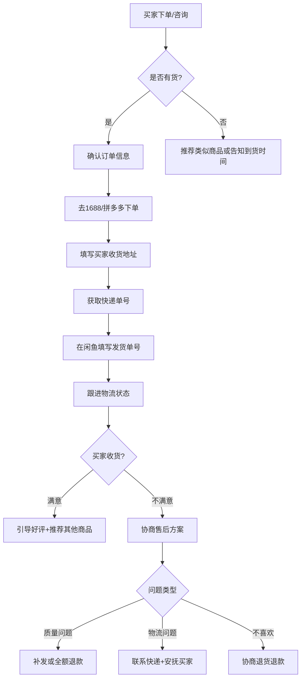
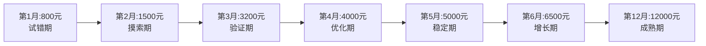
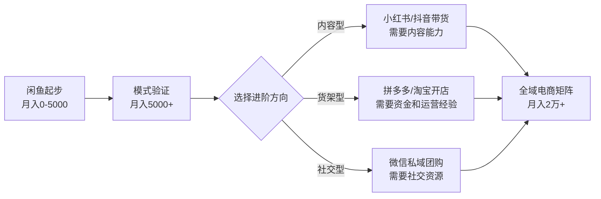

## 案例四：闲鱼无货源月入5000的低门槛实践

### 一、案例背景与项目定位

小王，26岁，三线城市行政岗，月薪4500元。2024年6月开始利用下班时间做闲鱼无货源电商，第一个月收入800元，第三个月突破3000元，第六个月稳定在5000-8000元区间，最高单月突破12000元。全程零库存、零囤货，启动资金不到200元。

这不是一个"轻松躺赚"的故事。小王每天投入2-3小时，经历了选品反复试错、前三天零曝光的焦虑、被同行抄袭标题的愤怒、以及售后纠纷的手忙脚乱。但正是这些真实的困难和解决方案，构成了这个案例的核心价值——它展示的是一个普通人通过系统化运营能力，在低门槛平台上建立可持续副业收入的完整路径。

#### 为什么选择闲鱼而非其他平台？

| 对比维度 | 闲鱼 | 拼多多无货源 | 抖音小店 | 淘宝C店 |
|---------|------|------------|---------|---------|
| 启动资金 | 0元（个人支付宝即可） | 2000-5000元（保证金） | 2000-5000元（保证金） | 1000元（保证金） |
| 技术门槛 | 极低，会用手机就行 | 中等，需选品工具 | 高，需短视频制作能力 | 中等，需PS/详情页设计 |
| 流量机制 | 搜索+推荐，新号有7天扶持期 | 搜索竞价，烧钱买流量 | 内容驱动，需持续产出 | 搜索+付费推广，竞争激烈 |
| 变现周期 | 1-3天出单 | 7-15天 | 30天以上 | 15-30天 |
| 适合人群 | 宝妈/学生/上班族/任何新手 | 有电商经验者 | 内容创作者 | 有一定资金和运营经验者 |
| 封号风险 | 低（遵守规则即可） | 中（平台打击无货源） | 中（违规扣分严格） | 低 |
| 日均时间投入 | 1-3小时 | 3-5小时 | 4-8小时 | 3-5小时 |

闲鱼的核心优势在于三个方面：

1. **零门槛入场**：它是阿里体系内唯一对个人卖家零门槛的平台，不需要营业执照、不需要缴纳保证金、不需要学习复杂的后台操作。一个支付宝实名账号就能开始。

2. **天然流量池**：闲鱼日活用户超过3000万，且用户画像以18-35岁为主，消费意愿强但价格敏感。平台的"二手交易"属性让用户决策链路极短——看到合适的就直接拍下，不像淘宝那样反复比价、看评价、纠结详情页。

3. **算法对新手友好**：闲鱼的流量分配机制不像淘宝那样严重偏向头部卖家。新发布的商品会获得平台的"新品曝光"扶持，只要标题和图片质量过关，新号也能获得可观的自然流量。这意味着新手不需要花钱买流量，靠内容质量就能获取曝光。

#### 这个案例适合谁？

**适合的人群**：
- 有稳定工作，想利用碎片时间增加收入的上班族
- 在校大学生，时间灵活但启动资金有限
- 全职宝妈，照顾孩子间隙可以操作手机
- 对电商感兴趣但不敢大投入的新手，想低成本试水
- 有耐心、愿意持续优化的人

**不适合的人群**：
- 想"躺赚"或"一夜暴富"的人——无货源需要每天投入时间
- 不愿意处理售后问题的人——电商售后是绕不开的环节
- 期望月入3万以上的人——闲鱼单账号天花板在1-2万，想更高需要矩阵或多平台

---

### 二、无货源模式的商业逻辑与底层原理

#### 核心商业模式



**核心公式：利润 = 闲鱼售价 - 货源成本 - 快递差价 - 售后损耗**

举例说明：一款收纳盒在1688上拿货价12元，闲鱼售价29.9元，快递费由供应商承担（含在拿货价中），售后损耗率约3%（每100单有3单退款或补发），则：

- 单件毛利：29.9 - 12 = 17.9元
- 扣除3%售后损耗：17.9 × 0.97 ≈ 17.36元
- 月出100单：17.36 × 100 = 1,736元

#### 无货源的本质是信息差套利+流量运营

你不需要生产商品、不需要囤货、不需要发货，你做的事情本质上是四件事：

1. **选品**：找到有需求但闲鱼上供给不足的商品（信息差）
2. **上架**：用优质的标题、图片、描述获取流量（流量运营）
3. **转化**：通过话术和服务促成交易（销售能力）
4. **履约**：在货源平台下单并填写买家地址（供应链管理）

这四个环节中，选品和流量获取是核心竞争力，转化和履约是基础能力。后面会逐一展开每个环节的详细方法论。

#### 闲鱼的流量分配机制（理解算法才能获取流量）

闲鱼的流量来源主要有四个渠道：



影响商品排名的核心因素（按权重从高到低）：

| 排序因素 | 权重 | 说明 |
|---------|------|------|
| 标题关键词匹配度 | ★★★★★ | 标题包含用户搜索词是获取搜索流量的前提 |
| 点击率 | ★★★★★ | 曝光后有多少人点进来，主图决定 |
| 转化率 | ★★★★☆ | 点进来后有多少人下单，价格+描述决定 |
| 想要数 | ★★★★☆ | "想要"越多，算法认为商品越受欢迎 |
| 账号活跃度 | ★★★☆☆ | 每天登录、擦亮、互动，保持活跃 |
| 响应速度 | ★★★☆☆ | 买家咨询后多快回复，影响排名和转化 |
| 发货速度 | ★★☆☆☆ | 下单后多快填写快递单号 |
| 账号信用分 | ★★☆☆☆ | 芝麻信用分越高，初始权重越高 |

理解这个排序逻辑后，运营策略就很清晰了：**标题决定曝光量，主图决定点击率，价格和描述决定转化率，三者缺一不可。**

#### 闲鱼搜索算法的深层机制

很多卖家只停留在"标题要包含关键词"这个层面，但对闲鱼搜索算法的底层逻辑一无所知。理解这些机制，才能在运营中做出正确的决策：

**1. 赛马机制：新商品的流量分配逻辑**

每个新发布的商品都会经历一个"流量测试期"，通常为3-7天。在这个阶段，平台会分配一波初始曝光（通常为200-500次），然后根据这批曝光产生的用户行为数据来决定是否给予更多流量：



这意味着：**标题和主图不是"慢慢优化"的事情，而是发布时就要做到位**。因为新商品有且仅有一次初始测试机会，如果第一波数据不好，后续再怎么擦亮、优化，都很难翻身——算法已经给这个商品贴上了"低质量"的标签。

**2. 标签匹配机制：用户画像与商品匹配**

闲鱼的推荐流量（占总流量30-40%）依赖用户标签匹配。每个用户在闲鱼上都有行为标签（最近浏览过什么、收藏过什么、买过什么），平台会把这些标签与商品的品类标签进行匹配推荐：

- 如果你的商品是"学生宿舍收纳盒"，平台会把它推给最近浏览过学生用品、文具、宿舍用品的用户
- 如果你的商品标题中包含"车载"，平台会推给浏览过汽车用品的用户

**实操启示**：标题中包含的场景词不仅影响搜索流量，还决定了推荐流量的目标人群。"学生宿舍收纳盒"和"车载收纳盒"虽然产品可能是同一个，但获得的推荐流量完全不同。这就是为什么同类商品要拆分成不同场景词的标题分别上架——覆盖更多人群标签。

**3. 时效性权重：擦亮的真正作用**

"擦亮"不只是简单的刷新。擦亮的机制是：将商品的发布时间重置为当前时间，从而重新获得"新品"的时效性权重加成。闲鱼的搜索排序中，发布时间是一个隐性权重——越新的商品排名越靠前，这就是为什么擦亮后商品会短暂排名上升。

但擦亮有每日次数限制（通常每件商品每天1次），且效果会随着商品"年龄"增长而递减。一个发布了3个月的老商品，即使擦亮，获得的排名提升也远不如新商品。

**4. 想要数的"马太效应"**

"想要"数是闲鱼中最重要的社交信号之一。当一个商品的"想要"数超过一定阈值（通常是20-50），算法会认为这是一个"受欢迎"的商品，从而给予更多的推荐流量。这形成了一个正反馈循环：想要数越多 → 推荐流量越多 → 想要数增长越快。

**实操技巧**：
- 在商品描述末尾加上"觉得不错先点想要，随时可能涨价"，引导用户点"想要"
- 同类商品中，优先推广"想要"数已超过20的商品，因为它们的增长曲线会加速
- 不要用刷的方式提高"想要"数，闲鱼对此有检测机制，违规会降权

---

### 三、完整执行过程

#### 第一阶段：账号搭建与基础设置（第1-3天）

##### 账号准备

- **实名认证**：使用支付宝实名认证的闲鱼账号。芝麻信用分650+优先，信用分越高，平台给的初始权重越大。如果芝麻分不够，可以通过完善支付宝个人信息、按时还款花呗、绑定公积金等方式提升
- **个人资料完善**：
  - 头像：用真人照片或有品牌感的logo图（不要用风景照、动漫头像，降低信任感）
  - 昵称：带行业关键词，如"好物严选小王""家居收纳优选"（让买家一看就知道你卖什么）
  - 简介：写清服务范围和承诺，如"专注家居好物｜48小时发货｜售后无忧"
- **绑定第三方账号**：微博、淘宝、豆瓣等，增加账号可信度
- **完成新手任务**：闲鱼会引导新用户完成一系列任务（完善资料、发布第一个商品等），完成可提升账号权重

##### 养号操作（前7天）

新号不要急着大量上架，先养号。养号的核心目的是让算法认为你是一个真实活跃用户，而非营销号：

| 天数 | 操作内容 | 具体要求 |
|------|---------|---------|
| 第1天 | 浏览+签到 | 浏览闲鱼30分钟，签到，逛同城页面 |
| 第2天 | 互动 | 点赞5-10个商品，在2-3个帖子下评论 |
| 第3天 | 关注+试上架 | 关注5-10个同领域卖家，上架1-2个商品 |
| 第4天 | 浏览+互动 | 继续浏览30分钟，回复评论，擦亮已上架商品 |
| 第5天 | 增加上架 | 再上架2-3个商品，开始测试不同品类 |
| 第6天 | 模拟购买 | 在闲鱼下一单（买自己需要的东西），体验买家流程 |
| 第7天 | 总结观察 | 观察已上架商品的曝光和点击数据，调整策略 |

**养号注意事项**：
- 不要用WiFi多设备登录同一个账号（会被判定为工作室）
- 不要频繁切换IP地址
- 不要在养号期间大量发布商品
- 每天操作时间尽量固定，形成规律

##### 账号权重自检清单

在正式大量上架前，先确认以下指标是否达标：

| 自检项目 | 达标标准 | 未达标处理方式 |
|---------|---------|--------------|
| 芝麻信用分 | ≥650 | 完善支付宝信息、绑定公积金、使用花呗按时还款 |
| 账号活跃天数 | ≥7天 | 继续养号，每天签到+浏览30分钟 |
| 已完成新手任务 | 全部完成 | 逐项完成，不要跳过 |
| 绑定第三方账号 | ≥2个 | 绑定微博、淘宝、豆瓣等 |
| 商品浏览量（测试商品） | 单品≥100/天 | 优化标题关键词，或品类竞争太激烈需换品 |

#### 第二阶段：选品策略与货源对接（第4-14天）

##### 选品的底层逻辑

选品是闲鱼无货源的核心能力，70%的收入差异来自选品。好的选品需要同时满足三个条件：



##### 选品三大原则

1. **高需求低竞争**：用闲鱼搜索框看下拉联想词，搜索量大但卖家少的品类是蓝海。具体方法：在搜索框输入"收纳"，如果下拉出现"收纳盒桌面""收纳神器""收纳柜"等10+个联想词，说明需求旺盛；然后看搜索结果，如果前10名的商品标题写得很差、图片模糊，说明竞争质量低，你有机会
2. **客单价50-200元**：太低（<30元）利润薄，扣除售后损耗后可能亏本；太高（>300元）转化率低且售后风险大，买家会非常挑剔
3. **轻小件优先**：重量<1kg、体积小的商品优先。降低物流成本，减少运输破损概率，供应商也更愿意代发

##### 选品实操的五种方法

**方法一：搜索框联想词挖掘**

打开闲鱼APP，在搜索框依次输入以下高频词根，记录所有下拉联想词：

```text
收纳、厨房、桌面、手机、汽车、宠物、办公、化妆、母婴、数码、
健身、露营、钓鱼、手办、文具、饰品、家居、清洁、浴室、卧室
```

每个词根会产生5-15个联想词，这些就是真实用户在搜索的关键词。从中筛选出竞争少、利润率高的品类。

**方法二：同行店铺逆向分析**

找到闲鱼上做得好的同行卖家（"想要"数超过100的商品），分析他们的：
- 店铺里还有哪些商品？（说明这些品类在闲鱼好卖）
- 哪些商品"想要"数最高？（说明需求最旺）
- 他们的标题和图片有什么特点？（学习优化方向）

**方法三：1688爆品反查**

在1688上搜索"一件代发""网红爆款"等关键词，找到近期销量高的商品，然后到闲鱼上搜索同款。如果闲鱼上卖家少或质量差，这就是机会。

**方法四：季节性选品日历**

| 月份 | 热门品类 | 提前上架时间 |
|------|---------|------------|
| 1-2月 | 春节装饰、红包封、年货收纳 | 12月中旬 |
| 3-4月 | 春季收纳换季、清明祭扫用品、踏青装备 | 2月底 |
| 5-6月 | 夏季小风扇、防晒用品、毕业礼物 | 4月中旬 |
| 7-8月 | 开学用品、军训防晒、宿舍收纳 | 6月底 |
| 9-10月 | 国庆出行装备、秋冬换季、万圣节装饰 | 8月底 |
| 11-12月 | 暖手宝、圣诞礼物、新年装饰、年终收纳 | 10月中旬 |

**关键原则**：应季品要提前1个月上架，等当季再上就晚了。

**方法五：热点追踪法**

关注闲鱼"发现"页面的热门话题和小红书、抖音上的爆款商品。当某个商品在社交媒体上突然火起来时，第一时间在闲鱼上架，可以吃到一波红利流量。

##### 选品的"红绿灯"判断法

很多新手选品时不知道如何快速判断一个品是否值得做。用下面的红绿灯法则，在5分钟内做出初步判断：

**绿灯信号（可以尝试）**：
- 闲鱼搜索框下拉联想词≥8个（需求旺盛）
- 搜索结果前10名中，至少3个商品的主图质量差、标题敷衍（竞争质量低）
- 1688同款成本≤闲鱼售价的40%（利润空间充足）
- 商品重量<500g（物流成本低、破损率低）
- 非品牌敏感品类（侵权风险低）

**黄灯信号（谨慎尝试）**：
- 搜索结果前10名全是精心运营的店铺（竞争质量高）
- 1688成本与闲鱼售价差价不到50%（利润薄）
- 商品易碎或需要特殊包装（售后风险高）
- 季节性极强的品类（如圣诞装饰，窗口期只有2个月）

**红灯信号（直接放弃）**：
- 搜索结果前20名几乎没有"想要"数超过10的（需求不足）
- 商品涉及品牌logo、IP形象（侵权风险极高）
- 需要特殊资质的品类（如食品、医疗器械、化妆品）
- 体积超大或重量超2kg的商品（物流成本吃掉利润）

##### 实测有效的品类推荐

| 品类 | 客单价 | 利润率 | 操作难度 | 推荐指数 | 说明 |
|------|--------|--------|---------|---------|------|
| 手机壳/膜 | 15-40元 | 50-70% | ★☆☆ | ★★★★ | 需求量大但竞争激烈，需选细分款式 |
| 收纳用品 | 20-80元 | 40-60% | ★☆☆ | ★★★★★ | 常青品类，四季有需求，复购率高 |
| 厨房小工具 | 15-60元 | 50-80% | ★☆☆ | ★★★★ | 新奇特产品多，容易做差异化 |
| 桌面摆件/手办 | 30-150元 | 40-60% | ★★☆ | ★★★★ | 需要了解IP文化，溢价空间大 |
| 汽车内饰用品 | 30-200元 | 40-50% | ★★☆ | ★★★★ | 男性用户为主的品类，客单价高 |
| 宠物用品 | 20-100元 | 50-70% | ★★☆ | ★★★★★ | 养宠人群消费意愿强，复购率极高 |
| 办公桌面用品 | 20-80元 | 45-65% | ★☆☆ | ★★★★ | 打工人刚需，场景明确 |
| 应季品（如小风扇） | 30-100元 | 40-60% | ★★☆ | ★★★★ | 短期爆发力强，需提前布局 |

##### 货源平台选择与对接

**首选平台：1688**

1688是闲鱼无货源的核心货源平台，操作步骤：

1. 下载1688APP或访问1688.com
2. 搜索目标商品关键词
3. 筛选条件：勾选"一件代发"→优先"48小时发货"→"支持退换货"
4. 对比3-5家供应商的价格、评分、发货速度
5. 先下一单样品（花费10-30元），检查商品质量和包装
6. 确认供应商后，收藏店铺并加微信建立长期联系

**供应商筛选标准**：

| 筛选维度 | 合格标准 | 不合格表现 |
|---------|---------|-----------|
| 店铺评分 | 4.7分以上 | 4.5分以下 |
| 发货速度 | 48小时内发货 | 承诺72小时或更久 |
| 退换政策 | 支持7天无理由退换 | 不支持退换或条件苛刻 |
| 沟通响应 | 旺旺/微信1小时内回复 | 经常不回复或回复敷衍 |
| 商品实拍 | 有高清实拍图和视频 | 只有PS过度的效果图 |
| 代发价格 | 比零售价低40-60% | 差价太小无利润空间 |

**备用平台**：
- **拼多多**：适合比价和补单，部分商品比1688更便宜，且物流时效有保障
- **义乌购**：小商品类目的补充货源，适合义乌地区的品类
- **工厂微信**：长期合作后直接加供应商微信，拿到更低价和优先发货权

**对接供应商的关键话术**：

```text
"老板你好，我在闲鱼做零售，日均出单5-10件，想找长期合作的一件代发供应商。
请问你们支持代发吗？代发价格是多少？能提供实拍图和视频素材吗？
发货时能不能不放任何价格标签和店铺信息？"
```

**要点**：最后一句很重要——如果供应商在包裹里放了1688的价格标签或店铺名片，买家看到会直接找你退款甚至投诉。务必提前确认供应商的包装规范。

##### 供应商管理的深水区

很多卖家只关注"找供应商"，但忽略了供应商管理。实际上，随着订单量增长，供应商管理能力直接决定了你的售后成本和运营稳定性：

**1. 主备供应商策略**

每个核心品类至少维护2个供应商：
- **主供应商**：价格最优、合作时间长、发货稳定，承担80%的订单
- **备供应商**：价格略高但同样可靠，承担20%的订单和主供应商缺货时的替补

为什么需要备供应商？因为1688上的中小供应商经常出现以下问题：
- 突然缺货但不主动告知（你的闲鱼订单会延迟发货，影响权重）
- 旺季产能不足，发货速度从48小时退化到72小时甚至更久
- 质量不稳定，不同批次的商品品质差异大
- 店铺突然关闭或被平台处罚

有了备供应商，这些问题都不会直接影响你的闲鱼店铺。

**2. 供应商评分卡**

每月对合作供应商做一次评分，淘汰持续低分的供应商：

| 评分维度 | 权重 | 5分标准 | 1分标准 |
|---------|------|---------|---------|
| 发货时效 | 30% | 24小时内发货 | 超过72小时发货 |
| 商品质量 | 30% | 零退货零投诉 | 退货率超过5% |
| 沟通响应 | 20% | 30分钟内回复 | 超过24小时不回复 |
| 价格竞争力 | 10% | 同品类最低价 | 高于市场均价20%以上 |
| 包装规范 | 10% | 干净无信息泄露 | 放入供应商名片或价格标签 |

**3. 供应商谈判进阶话术**

当你的月订单量超过100单时，可以尝试和供应商谈更好的条件：

```text
"老板，上个月从你这里代发了150单，退货率控制在2%以内。
接下来我这边会持续加量，预计下个月能做到300单。
能不能给我一个专属的代发价格？另外发货时帮我多塞一张我的售后卡进去。
如果价格合适，我可以把其他几个品类也转到你这里来。"
```

谈判的核心筹码是**订单量承诺**和**品类扩展承诺**。供应商最喜欢稳定的、持续增长的客户，他们愿意为这类客户提供更好的价格和服务。

#### 第三阶段：商品上架与流量获取（第7-21天）

##### 标题优化：每个字都是流量入口

闲鱼标题上限30字，每一字都应该承载流量价值：

**标题公式**：`核心关键词 + 属性词 + 卖点词 + 场景词`

```text
❌ "收纳盒出售"（4个字，浪费26个字的流量机会）
❌ "收纳盒 桌面 收纳"（重复词，算法会降权）
✅ "桌面收纳盒ins风学生宿舍化妆品整理盒大容量透明亚克力"（精准覆盖10+搜索词）
✅ "汽车后备箱收纳箱折叠车载储物箱车内整理箱多功能置物盒"（精准覆盖8+搜索词）
```

**找关键词的四种方法**：

1. **搜索框联想**：在闲鱼搜索框输入核心词，记录所有下拉联想词，这些是真实搜索量最高的词
2. **同行标题拆解**：找"想要"数>50的同行商品，把他们的标题拆解成关键词，合并去重
3. **闲鱼搜索热度工具**：使用"闲鱼助手""鱼塘数据"等第三方工具查看关键词搜索指数
4. **淘宝/1688关键词反查**：同类商品在淘宝的搜索词也是闲鱼的潜在搜索词

**标题优化检查清单**：

- [ ] 是否包含核心品类词？（如"收纳盒""手机壳"）
- [ ] 是否包含属性词？（如"大容量""透明""折叠"）
- [ ] 是否包含场景词？（如"学生宿舍""车载""桌面"）
- [ ] 是否包含卖点词？（如"ins风""多功能""免安装"）
- [ ] 是否有重复词？（重复会浪费字数且可能被降权）
- [ ] 是否超过30字？（超长部分会被截断，不显示）

##### 主图设计：决定点击率的关键

主图是买家在搜索结果页看到的第一张图，直接决定他们是否会点进来。在信息流中，用户平均只花0.5秒扫一眼就决定是否点击。

**主图设计原则**：

- **第一张图**：商品主体突出，背景干净（纯色或浅色），角度正面45度。这张图决定80%的点击率
- **实拍优先**：从供应商素材或买家秀中获取实拍图，比白底商品图更有真实感。买家在闲鱼上更信任"实拍"风格
- **加文字标注**：用手机自带编辑功能加上"包邮""限时特惠""已售500+"等标签，提高点击率
- **9张图全覆盖**：正面→侧面→背面→细节特写→使用场景→尺寸对比→颜色选项→包装→买家秀/好评截图

**获取图片的渠道**（按推荐顺序）：

1. 供应商提供的实拍素材（首选，质量有保障）
2. 1688商品详情页的买家秀（真实感最强）
3. 小红书/抖音上的产品展示视频截图（需注意版权）
4. 自己买一件样品拍摄（成本10-30元，但图片独一无二）
5. 淘宝同行的商品图（不推荐，可能被投诉侵权）

**图片处理工具**：
- 手机自带编辑器：裁剪、加文字、调亮度
- 醒图/美图秀秀：加滤镜、拼图、加水印
- Canva（可画）：制作带文字标注的主图

##### 描述文案：从浏览到下单的最后一推

```text
【商品名称】桌面收纳盒ins风学生宿舍化妆品整理盒

✅ 品质保障，实物拍摄，所见即所得
📦 48小时内发货，默认中通/圆通快递
💡 适合：学生党/上班族/租房族/化妆爱好者
📏 规格：大号25×18×12cm / 小号18×12×10cm
🎨 颜色：奶白色/雾霾蓝/樱花粉/薄荷绿
⭐ 售后：7天无理由退换，质量问题免费补发

这个收纳盒我自用了半年，桌面终于不乱了！
分格设计，化妆品、文具、小物件都能分类放好，
透明材质一眼就能找到想要的东西，不用翻来翻去。
亚克力材质比塑料的质感好太多，放在桌面上也很美观。

拍下后请备注颜色和尺寸，不备注随机发～
有任何问题随时联系我，秒回！
```

**描述文案的核心逻辑**：

1. **信息层**：规格、颜色、发货时效等硬信息（解决"是什么"的问题）
2. **信任层**：品质保障、实拍、售后承诺（解决"能不能买"的问题）
3. **场景层**：使用场景描述、自用体验（解决"要不要买"的问题）
4. **行动层**：拍下备注、联系方式（降低购买摩擦）

##### 定价策略：不是越便宜越好

**基础定价公式**：`闲鱼售价 = 货源成本 × (1.5 ~ 2.5)`

具体倍率取决于品类竞争程度：
- 竞争激烈的品类（如手机壳）：加价50-80%
- 竞争中等的品类（如收纳用品）：加价80-120%
- 竞争较小的品类（如小众手办）：加价100-150%

**阶梯定价法**：

| 阶段 | 定价策略 | 目的 |
|------|---------|------|
| 前5单 | 微利甚至平价出 | 积累基础销量和好评 |
| 6-20单 | 正常定价 | 验证利润模型 |
| 21-50单 | 适当提价 | 提升利润率 |
| 50单以上 | 根据数据优化 | 转化率高的适当提价，转化率低的考虑降价 |

**降价触发推送**：闲鱼有"降价"功能，先标高价再降价，平台会自动给关注过该商品的用户推送降价通知，相当于免费的精准营销。

**组合定价**：单件29.9元，两件49.9元。组合价的利润率更高（因为多出的一件边际成本很低），而且提高了客单价。

**心理学定价技巧**：
- 用".9"结尾（29.9比30看起来便宜很多，虽然只差1毛钱）
- 设置"锚定价格"：在描述中写"淘宝同款售价59.9"，让买家觉得29.9很划算
- 阶梯价：小号19.9 / 中号29.9 / 大号39.9，大多数人会选中间档，而中间档的利润率往往最高

#### 第四阶段：日常运营与订单处理（第14天起持续）

##### 每日运营动作表

| 时间段 | 动作 | 目的 | 预计耗时 |
|--------|------|------|---------|
| 早8:00 | 擦亮3-5个商品 | 获取早高峰流量 | 5分钟 |
| 早8:30 | 回复过夜的留言和咨询 | 提升响应率，抓住意向买家 | 10分钟 |
| 中午12:00 | 擦亮另外3-5个商品+回复消息 | 获取午间流量高峰 | 10分钟 |
| 下午15:00 | 检查订单，去货源平台下单 | 确保当天订单当天处理 | 15分钟 |
| 晚20:00 | 擦亮剩余商品+回复消息 | 获取晚间流量高峰 | 10分钟 |
| 晚22:00 | 上架1-2个新商品或优化旧商品 | 保持店铺活跃度 | 20分钟 |
| 随时 | 买家咨询5分钟内回复 | 响应速度影响排名和转化 | 碎片时间 |

**日均总耗时：约1.5-2小时**

##### "擦亮"技巧深度解析

闲鱼每天可以免费擦亮商品（相当于刷新/重新发布），擦亮后商品会获得一波新的曝光。核心技巧：

- **分时段擦亮**：不要一次性擦亮所有商品，分成早/中/晚三批，让商品在不同时间段都能获得曝光
- **优先擦亮转化率高的商品**：转化率高的商品擦亮后，算法会给予更多流量（正反馈循环）
- **擦亮前先优化**：如果某个商品曝光高但转化低，先优化标题和主图再擦亮，否则浪费曝光机会
- **新品不急着擦亮**：新品有"新品扶持"流量，等扶持期过了（通常3-5天）再开始擦亮

##### 订单处理完整流程



**订单处理注意事项**：

- **地址核对**：下单前务必核对买家地址是否完整（省市区+详细地址+电话），闲鱼上部分买家的地址可能不完整
- **快递面单**：供应商发货时，快递面单上不能出现1688店铺名或价格信息，提前和供应商确认
- **物流跟踪**：发货后每天检查一次物流状态，如果发现异常（如长时间不更新、显示签收但买家说没收到），主动联系买家和快递公司
- **确认收货**：买家签收后如果没主动确认收货，闲鱼会在10天后自动确认。可以在第7天时发一条温馨提醒

##### 买家沟通话术库

**咨询阶段**：

```text
买家："这个收纳盒质量怎么样？"
回复："亲，这个是亚克力材质的，比普通塑料的质感好很多，我自己也在用～
      有什么具体想了解的可以问我哦，实物拍摄所见即所得😊"

买家："能便宜点吗？"
回复："亲，这个价格已经是最低了哦，而且我们48小时发货+7天无理由退换，
      售后有保障的～买两件的话可以给您优惠5块钱，您看看需要吗？"
```

**发货通知**：

```text
"亲，您的订单已发货啦📦
快递：中通快递
单号：YT1234567890
预计2-3天到达，有问题随时联系我哦～"
```

**催好评**：

```text
"亲，看到快递显示已签收，您收到了吗？
如果满意的话麻烦给个好评哦，您的好评是我继续做下去的动力❤️
有任何问题都可以联系我，一定给您处理好～"
```

**售后处理**：

```text
买家："收到的和图片不一样/有质量问题"
回复："亲，真的很抱歉给您带来了不好的体验🙏
      您方便拍个照片给我看一下吗？
      确认是质量问题的话，我这边直接给您补发一个新的，
      不需要您退回，您看可以吗？"
```

**核心原则**：售后问题不要和买家扯皮，差评和投诉的隐性成本远高于一单的损失。一个差评可能导致你的商品权重下降，影响后续几十单的成交。

##### 售后纠纷分类处理方案

售后是无货源卖家最头疼的环节，但也是决定店铺能否长期存活的关键。不同类型的纠纷需要不同的处理策略：

| 纠纷类型 | 发生频率 | 处理原则 | 具体操作 | 成本估算 |
|---------|---------|---------|---------|---------|
| 商品质量问题 | 5-8% | 直接补发或退款，不要求退回 | 买家发照片确认后，直接在货源平台申请补发，同时给买家退款或补发。退回的物流成本（5-10元）往往高于商品成本，不值得退回 | 商品成本（10-30元） |
| 物流延迟/丢件 | 3-5% | 主动跟进，必要时补发 | 先查物流状态，联系快递客服。如果确认丢件，直接补发一单。物流延迟的话主动告知买家预计到达时间 | 补发成本或免费 |
| 与描述不符 | 2-3% | 协商部分退款或补发 | 判断差异程度。如果买家觉得"还行但不完全满意"，可以协商退5-10元；如果完全不满意，直接全额退款 | 5-10元或商品成本 |
| 买家不喜欢/不想要 | 3-5% | 引导不退货，协商部分退款 | 闲鱼上"不喜欢"的退货率很低，因为买家要自己承担退货运费。可以协商退5元让买家留下，大多数人会接受 | 5元 |
| 恶意买家/薅羊毛 | <1% | 收集证据，申请平台介入 | 保留所有聊天记录和发货凭证。遇到恶意退款的买家，不要私下妥协，直接申请闲鱼客服介入 | 时间成本 |

**售后处理的黄金法则**：

1. **响应速度**：买家反馈问题后，30分钟内必须回复。超过2小时不回复，买家大概率会申请平台介入，一旦平台介入，你的纠纷率指标就会受影响
2. **态度第一**：不管问题是不是你的错，先道歉、先安抚。买家要的是"被重视"的感觉，不是真的想要你赔钱
3. **快速决策**：10元以下的损失，直接退款不要犹豫。20元以下的损失，5分钟内做出补发/退款决定。不要为了一单十几块钱的利润，付出一个差评的代价
4. **留痕意识**：所有售后沟通必须在闲鱼聊天窗口内完成，不要转移到微信。万一买家投诉，平台只看闲鱼内的聊天记录
5. **复盘归因**：每个售后问题都要追问"为什么"——是供应商质量不行？是描述夸大了？是物流太慢？找到根因才能从源头减少售后

---

### 四、关键运营指标与数据管理

#### 核心指标体系

| 指标 | 计算方式 | 健康值 | 优秀值 | 说明 |
|------|---------|--------|--------|------|
| 曝光量 | 商品被展示次数 | 日均500+ | 日均2000+ | 反映标题和关键词质量 |
| 点击率 | 点击数/曝光数 | >5% | >10% | 反映主图吸引力 |
| 转化率 | 下单数/点击数 | >3% | >8% | 反映价格+描述+服务综合能力 |
| 想要率 | 想要数/点击数 | >5% | >15% | 反映商品吸引力 |
| 响应率 | 5分钟内回复的咨询比例 | >90% | >98% | 影响排名权重 |
| 好评率 | 好评数/总评价数 | >95% | >99% | 影响转化和权重 |
| 退货率 | 退货数/总订单数 | <5% | <2% | 反映选品和描述准确性 |

**优化方向判断**：

```text
曝光低 → 优化标题关键词（增加搜索匹配词）
点击率低 → 优化主图（更吸引人的首图）
转化率低 → 优化价格/描述/赠品策略
想要率低 → 商品本身吸引力不足，考虑换品
```

#### 每周数据复盘模板

每周日花30分钟做一次数据复盘，记录以下内容：

```markdown
## 第X周运营复盘（MM/DD - MM/DD）

### 核心数据
- 本周新增曝光：___
- 本周新增点击：___
- 本周订单数：___
- 本周收入：___
- 本周利润：___

### Top 3 商品分析
1. 商品名：___ | 曝光：___ | 点击率：___ | 转化率：___
   优化方向：___
2. 商品名：___ | 曝光：___ | 点击率：___ | 转化率：___
   优化方向：___
3. 商品名：___ | 曝光：___ | 点击率：___ | 转化率：___
   优化方向：___

### 需要淘汰的商品（曝光高但转化极低）
- ___

### 下周计划
- 新上架商品数：___
- 重点优化商品：___
- 测试新品类：___
```

#### 数据驱动的精细化运营

**每周数据复盘三步法**：

1. **找问题**：哪些商品曝光高但转化低？（说明标题引来流量了，但主图/价格/描述不够好）
2. **找机会**：哪些商品转化高但曝光低？（说明商品本身好，但标题关键词不够，需要优化标题）
3. **做决策**：淘汰曝光和转化都低的商品，把擦亮次数分配给高潜力商品

**A/B测试方法**：
- 同一商品用两个不同的标题上架（注意不要完全相同，需要有差异化）
- 观察一周的数据，保留表现更好的那个
- 持续迭代优化，每次只改一个变量（标题或主图或价格）

---

### 五、常见误区与纠正

#### 误区一：盲目铺货，上架越多越好

**错误做法**：一天上架50个商品，标题随便写，图片从其他店铺搬运。

**正确做法**：精选10-20个品，每个品用心优化标题、图片、描述。质量远比数量重要。闲鱼的算法更看重单品的转化率，而非店铺商品总数。一个转化率8%的商品带来的流量，远超100个转化率1%的商品。

**底层逻辑**：闲鱼的流量分配是"赛马机制"——每个新商品都会获得一波初始曝光，平台根据这批曝光的点击率和转化率来决定是否给予更多流量。如果商品质量差，初始曝光的点击率和转化率都很低，算法就会停止推荐，后续再怎么擦亮也没用。

#### 误区二：打价格战，比谁更便宜

**错误做法**：看到同行卖39.9，自己就卖35，对方降到30，自己再降到25。

**正确做法**：价格战没有赢家，最终大家都没钱赚。通过以下方式做差异化：
- 主图更好看、更有质感（用Canva做带标注的主图）
- 描述更详细、更有场景感（写使用体验而非干巴巴的参数）
- 提供赠品（如买收纳盒送标签贴纸，成本几毛钱但感知价值高）
- 打包组合销售（如3件套比单件更有吸引力，且利润率更高）
- 更好的售后承诺（如"不满意直接退，运费我出"）

#### 误区三：忽视售后，一锤子买卖

**错误做法**：买家有问题就推给供应商，自己不处理。或者回复慢、态度差。

**正确做法**：售后是复购和口碑的关键。在闲鱼这个平台，口碑的传播效应非常大——一个满意的买家可能会在其他帖子下推荐你的店铺，也可能在你的商品下追评好评，这些都是免费的信任背书。

**售后投入产出比**：
- 获取一个新客户的成本（选品+上架+等待成交）：约2-5小时
- 维护一个老客户的成本（快速回复+解决问题）：约5-10分钟
- 老客户的复购率和客单价都高于新客户

#### 误区四：只做一个品类，不懂得扩展

**错误做法**：只卖手机壳，做到天花板后不知道怎么办。

**正确做法**：核心品类稳定后（月出50单以上），横向扩展到相关品类。扩展逻辑：
- **关联扩展**：卖手机壳 → 手机支架 → 数据线 → 充电宝 → 手机挂绳
- **场景扩展**：卖桌面收纳 → 桌面摆件 → 桌面台灯 → 桌面绿植
- **人群扩展**：卖学生文具 → 学生收纳 → 学生生活用品 → 学生数码配件

用已有的客户信任和运营能力复用到新品类，新品类的冷启动速度会比第一个品类快得多。

#### 误区五：忽视平台规则，踩红线

**错误做法**：发布违禁品、虚假宣传、引导站外交易。

**正确做法**：仔细阅读闲鱼社区公约，以下行为绝对不能碰：

| 违规行为 | 处罚 | 严重程度 |
|---------|------|---------|
| 引导加微信/QQ等站外联系方式 | 一次扣12分，可能直接封号 | ★★★★★ |
| 发布假冒伪劣商品 | 扣分+下架+可能永久封号 | ★★★★★ |
| 同一商品重复铺货（超3个链接） | 扣分+下架多余链接 | ★★★☆☆ |
| 虚假发货或空包 | 扣分+冻结资金 | ★★★★★ |
| 虚假宣传（夸大功效） | 扣分+下架 | ★★★★☆ |
| 盗用他人图片 | 扣分+下架+可能被投诉 | ★★★☆☆ |

#### 误区六：忽视账号安全，不注意风控

**错误做法**：同一手机登录多个账号、频繁修改价格、短时间内大量上架。

**正确做法**：闲鱼的风控系统会检测异常行为，以下操作需要特别注意：

- **一机一号**：一个手机只登录一个闲鱼账号，不要切换登录
- **渐进式上架**：新号每天上架不超过5个商品，老号每天不超过10个
- **价格稳定**：不要频繁大幅修改价格（如从50改成20再改回50）
- **避免敏感词**：标题和描述中不要出现"正品""专柜""代购"等可能触发审核的词
- **不刷单**：闲鱼的刷单检测非常严格，一旦被发现直接封号

#### 误区七：只看收入不看利润

**错误做法**：月收入5000元就觉得自己赚了5000，实际上扣除成本后可能只有2000。

**正确做法**：严格区分"收入"和"利润"，建立完整的成本核算体系：

| 成本项目 | 占收入比例 | 说明 |
|---------|----------|------|
| 货源成本 | 40-60% | 1688采购价 |
| 售后损耗 | 3-8% | 退款、补发、部分退款的平均成本 |
| 包材成本 | 1-2% | 如果需要自己加包装的话 |
| 时间成本 | 隐性 | 每天1.5-2小时的机会成本 |
| 工具成本 | 0-5% | 如果使用付费工具的话 |

**真实利润率 = (售后价 - 货源成本 - 售后损耗) / 售价**

大多数无货源卖家的真实利润率在35-50%之间。月收入5000元，实际利润大约在1750-2500元。认清这个数字，才能做出正确的决策——比如是否值得投入更多时间、是否需要换利润率更高的品类、是否需要开矩阵。

---

### 六、成果数据与成长曲线

#### 小王的完整数据记录

| 指标 | 第1个月 | 第3个月 | 第6个月 | 第12个月 |
|------|---------|---------|---------|----------|
| 月收入 | 800元 | 3,200元 | 6,500元 | 12,000元 |
| 月订单数 | 25单 | 95单 | 180单 | 320单 |
| 客单价 | 45元 | 58元 | 65元 | 72元 |
| 在架商品数 | 15个 | 50个 | 120个 | 200个 |
| 月利润 | 500元 | 1,800元 | 3,800元 | 7,200元 |
| 利润率 | 35% | 42% | 48% | 52% |
| 日均耗时 | 2小时 | 2.5小时 | 2小时 | 1.5小时 |

**利润率持续提升的原因**：
- 第1个月：选品不准，经常选到利润率低的商品，且售后损耗高
- 第3个月：积累了选品经验，知道哪些品类利润高、售后少
- 第6个月：和供应商建立了长期关系，拿到了更低的代发价格
- 第12个月：运营效率提升，用更少的时间处理更多的订单，且组合定价提高了客单价

#### 关键里程碑

```text
第7天  ：第一单成交，客单价29.9元的手机壳，利润8元
第15天 ：日均稳定2-3单，开始有信心
第30天 ：月收入突破800元，验证模式可行
第45天 ：淘汰了5个低效品类，聚焦3个核心品类
第60天 ：开始测试高客单价品类，利润提升明显
第90天 ：月入3,200元，决定投入更多时间优化
第120天：和2个核心供应商建立长期合作，拿到专属价格
第150天：开始尝试第二个品类方向
第180天：月入6,500元，摸索出稳定的选品和运营节奏
第270天：尝试矩阵化运营，用家人账号开了第二个店
第365天：两个店合计月入12,000元+
```

#### 成长曲线可视化



#### 小王的真实困难与应对

| 时间节点 | 遇到的困难 | 当时的感受 | 解决方案 | 吸取的教训 |
|---------|----------|----------|---------|----------|
| 第3天 | 发布了5个商品，曝光全部为0 | 焦虑，怀疑自己不适合做这个 | 检查发现标题全是"XX出售"，完全不含关键词 | 标题必须包含用户会搜索的词 |
| 第10天 | 一个买家收到货后说质量差，要求退款 | 慌张，不知道该怎么处理 | 直接退款并道歉，然后去1688给供应商差评 | 售后不要纠缠，快速处理 |
| 第20天 | 发现同行抄袭了自己的标题和图片 | 愤怒，觉得不公平 | 换了一套新的主图风格，反而点击率更高了 | 竞争是常态，持续优化才是壁垒 |
| 第35天 | 连续一周没有新订单 | 低落，想放弃 | 复盘发现是选品出了问题，淘汰了3个低效品 | 数据复盘比感觉更可靠 |
| 第60天 | 供应商发错货，买家投诉 | 压力大，夹在买家和供应商之间 | 自己掏钱给买家补发，然后找供应商协商赔偿 | 一定要有备供应商 |
| 第90天 | 月入突破3000后不知道怎么继续增长 | 迷茫 | 加入卖家社群学习，开始尝试矩阵化 | 社群学习能加速成长 |

---

### 七、进阶策略：从月入5000到月入2万

#### 矩阵化运营

当单账号月收入稳定在3000元以上时，可以考虑多账号矩阵：

**矩阵搭建步骤**：
1. 用家人（父母、配偶）的身份证注册2-3个闲鱼账号
2. 每个账号用独立的手机和网络（不要在同一WiFi下）
3. 每个账号专注不同品类，避免内部竞争
4. 统一用一个货源供应商管理，降低对接成本
5. 多账号合计月收入可达8,000-15,000元

**矩阵化注意事项**：
- 多账号不要在同一手机上切换登录，闲鱼会检测设备信息
- 建议一机一号，或者用备用手机（二手手机200-300元即可）
- 不同账号之间不要互相点赞、评论、"想要"，会被判定为刷单
- 每个账号的运营节奏独立，不要同步操作

**矩阵化的运营效率优化**：

当运营3个以上账号时，日常运营时间会急剧增加。以下是节省时间的方法：

1. **统一话术库**：把常用的话术（咨询回复、发货通知、催好评、售后处理）整理成文档，直接复制粘贴
2. **批量处理订单**：每天固定2个时间段（下午3点、晚上9点）集中处理订单，去1688批量下单
3. **供应商代发标准化**：和供应商约定固定的发货模板（不放价格标签、使用统一包装），减少每次沟通的成本
4. **数据记录模板化**：用Excel建立统一的数据记录表，每周日批量复盘所有账号的数据

#### 私域沉淀与复购提升

- 每个包裹里放一张售后卡（成本0.1-0.2元/张），内容包括：
  - 感谢语
  - 使用注意事项
  - "关注我的闲鱼账号，新品第一时间通知您"
  - 注意：不能引导到微信，否则违反闲鱼规则
- 老客户购买新品时给予专属优惠（如"老客户专享价"）
- 建立"老客户专属"系列商品，定期上新并@关注者

#### 从闲鱼到全域电商的进阶路径



闲鱼是最好的电商练兵场。当你在闲鱼上跑通了选品、上架、转化、售后的全流程后，这些能力可以直接迁移到任何电商平台。具体迁移路径：

- **到拼多多**：闲鱼验证过的爆品可以直接搬到拼多多，利用拼多多的搜索流量。需要缴纳保证金（2000-5000元），但流量更大
- **到淘宝**：从C店开始，用闲鱼积累的选品和运营经验，逐步升级到天猫
- **到小红书**：把闲鱼的爆品做成"种草笔记"，通过内容获取流量。小红书的用户消费能力更强，同样的商品可以卖更高的价格
- **到抖音**：用短视频展示商品使用场景，通过抖音的推荐流量获取订单。需要学习短视频制作，门槛较高但天花板也高

#### 多平台协同策略

当你同时在闲鱼+拼多多+小红书运营时，不是简单的"把同一批商品搬到所有平台"，而是需要根据各平台的特性做差异化运营：

| 策略维度 | 闲鱼 | 拼多多 | 小红书 |
|---------|------|--------|--------|
| 定位 | 测品+清仓+利润 | 规模化走量 | 品牌溢价+高客单价 |
| 客单价 | 50-100元 | 20-50元 | 80-200元 |
| 核心能力 | 标题+主图 | 价格+销量 | 内容+种草 |
| 选品逻辑 | 蓝海小众品 | 通用品/刚需品 | 高颜值/生活方式品 |
| 流量来源 | 搜索+推荐 | 搜索竞价 | 内容推荐 |

**协同打法**：在闲鱼上测品（零成本验证需求）→ 在拼多多上放量（低价走量）→ 在小红书上做品牌溢价（同样的商品卖2-3倍价格）。三个平台互相导流，形成闭环。

---

### 八、心态管理与认知升级

#### 闲鱼无货源的五个认知阶段

做闲鱼无货源不是一条直线，而是一个螺旋上升的过程。每个阶段都有不同的挑战和对应的认知升级：

**第一阶段：兴奋期（第1-7天）**

心态：充满期待，觉得找到了"轻松赚钱"的方法。上架了几个商品，每隔10分钟刷一次曝光数据。

风险：期望过高，一旦发现曝光量为零就容易放弃。

正确认知：这个阶段的目标不是赚钱，而是跑通流程——从注册账号到发布第一个商品到完成第一笔交易，验证模式是否可行。

**第二阶段：焦虑期（第8-30天）**

心态：开始怀疑自己——"别人都能月入5000，为什么我一天才出一单？""是不是我选的品类不对？""要不要换一个品类试试？"

风险：频繁换品类，每个品类只做了几天就放弃，结果什么都做不好。

正确认知：选品的试错是必经之路。给自己定一个规则——每个品类至少测试7天（发布5个以上商品+每天擦亮+观察数据），7天后用数据做决策，而不是凭感觉。

**第三阶段：突破期（第31-90天）**

心态：找到了1-2个稳定出单的品类，开始有规律的收入。信心逐渐建立，但也开始遇到售后、同行竞争等新问题。

风险：收入稳定后放松运营，停止优化和上新。

正确认知：稳定不是终点，而是优化的起点。用数据驱动的方式持续优化——每周淘汰1-2个低效品，上架1-2个新品，优化1-2个标题。

**第四阶段：瓶颈期（第91-180天）**

心态：收入在3000-5000元之间徘徊，感觉怎么努力都突破不了。时间投入增加但收入不增。

风险：陷入"内卷"——和同行比价格、比数量，忽视了策略层面的突破。

正确认知：瓶颈期需要的不是"更努力"，而是"更聪明"。这个阶段应该考虑：矩阵化运营、跨品类扩展、优化供应链（拿到更好的价格）、提升客单价（组合销售、高利润品类）。

**第五阶段：系统化期（第180天以后）**

心态：把闲鱼运营当成一个系统来管理，而不是一个"副业"。有稳定的选品流程、供应商体系、运营节奏。

目标：从"每天花2小时做闲鱼"变成"用1小时管理一个自动运转的系统"。

#### 应对负面情绪的实用方法

| 负面情绪 | 触发场景 | 应对方法 |
|---------|---------|---------|
| 焦虑 | 曝光量突然下降 | 检查是否平台活动结束、是否被降权。不要慌，先看数据再行动 |
| 嫉妒 | 看到同行卖得更好 | 分析他们做得好的地方（标题、主图、定价），学习而不是抱怨 |
| 沮丧 | 连续几天没有订单 | 回顾自己的数据趋势，短期波动是正常的。如果连续2周无订单才需要认真复盘 |
| 倦怠 | 每天重复同样的操作 | 给自己设定阶段性目标和奖励，比如"本月利润突破2000就奖励自己一顿好吃的" |
| 自满 | 收入稳定后觉得够了 | 看看同行动态和行业趋势，保持危机感。闲鱼规则会变，竞争会加剧 |

---

### 九、风险提示与合规提醒

#### 税务合规

- 个人年收入超过一定额度需要申报个税，闲鱼收入属于"经营所得"
- 月入5,000元以内基本不涉及税务问题，但长期做大后需要关注
- 建议保留所有交易记录和收支明细，以备税务核查
- 如果月收入持续超过1万元，建议注册个体工商户，享受小规模纳税人优惠政策

#### 知识产权风险

- 不要使用品牌方的官方图片和文案，避免侵权投诉
- 不要销售假冒品牌商品（如假冒LV、假冒Nike），这是违法行为
- 用供应商提供的素材或自己拍摄，确保图片来源合法
- 如果收到侵权投诉，立即下架相关商品，不要心存侥幸

#### 平台政策变动

- 闲鱼规则会不定期更新，关注闲鱼官方公告和卖家社群
- 2024年以来闲鱼加强了对"职业卖家"的管理，但无货源代发本身不违规
- 保持对政策的敏感度，第一时间调整策略

#### 现金流管理

- 买家确认收货前，你在货源平台已经垫付了货款，要注意现金流周转
- 闲鱼的回款周期通常是7-15天（从发货到买家确认收货）
- 初期建议选择回款周期短的品类，避免现金流断裂
- 做好收支记录，知道自己的真实利润是多少

**简单的收支记录表**：

```text
日期 | 商品名 | 售价 | 成本 | 快递费 | 利润 | 备注
6/1  | 收纳盒 | 29.9 | 12.0 | 0     | 17.9 | 正常
6/2  | 手机壳 | 19.9 | 8.0  | 0     | 11.9 | 正常
6/3  | 收纳盒 | 29.9 | 12.0 | 0     | -12.0| 退款（质量问题）
```

**现金流周转计算公式**：

```text
所需周转资金 = 日均订单数 × 平均货源成本 × 回款天数

示例：
日均10单 × 15元/单 × 10天回款 = 1,500元周转资金
```

这意味着当你日均出10单时，需要准备至少1500元的周转资金（用于在买家付款前先在1688垫付货款）。初期收入增长时，要注意预留足够的周转资金，避免"有订单但没钱下单"的尴尬。

#### 个人信息安全

- 不要在商品描述中暴露自己的真实姓名、电话、地址
- 发货时确认供应商不会在包裹中放入你的个人信息
- 与买家沟通时使用闲鱼内置聊天工具，不要转移到其他平台

---

### 十、工具与资源清单

#### 必备工具

| 工具 | 用途 | 费用 | 平台 |
|------|------|------|------|
| 闲鱼APP | 主运营平台 | 免费 | iOS/Android |
| 1688APP | 货源采购 | 免费 | iOS/Android |
| 手机自带编辑器 | 图片裁剪、加文字 | 免费 | 系统内置 |
| Excel/WPS表格 | 收支记录、数据分析 | 免费 | 全平台 |
| 备忘录/笔记APP | 话术模板、运营笔记 | 免费 | 系统内置 |

#### 进阶工具

| 工具 | 用途 | 费用 | 说明 |
|------|------|------|------|
| 醒图/美图秀秀 | 图片美化、拼图 | 免费（基础功能） | 主图制作 |
| Canva（可画） | 设计带标注的主图 | 免费（基础功能） | 专业主图设计 |
| 闲鱼助手（第三方） | 关键词热度查询 | 部分功能付费 | 选品参考 |
| 多多参谋 | 拼多多数据分析 | 付费 | 深度选品分析 |

#### 学习资源

- **闲鱼官方卖家中心**：了解最新规则和活动
- **闲鱼卖家社群**：与其他卖家交流经验，获取一手信息
- **1688商学院**：学习供应链管理和货源对接技巧
- **电商运营类公众号/博主**：关注行业动态和运营方法论

---

### 十一、本案例核心启示

闲鱼无货源模式的本质是**用时间和运营能力换取信息差利润**。它不适合想躺赚的人，但非常适合愿意投入时间学习和执行的新手。

**关键成功要素**：

1. **选品是核心能力**：70%的收入差异来自选品。好的选品可以让你事半功倍，差的选品再怎么优化标题和图片也没用。选品能力需要通过持续的试错和数据复盘来积累。

2. **执行力决定速度**：同样的方法，有人3个月做到月入5000，有人6个月还在原地踏步。差距不在方法，在于每天是否坚持执行运营动作（擦亮、回复、上新、优化）。

3. **持续优化是壁垒**：标题、图片、描述、定价，每一个环节都有优化空间。不要"上架就不管了"，每周至少做一次数据复盘和优化迭代。

4. **心态要稳**：前期可能一周才出一单，这是正常的。坚持下去，量变会产生质变。第一个月的目标不是赚钱，而是跑通流程、积累经验。

5. **长期主义**：不要因为短期没赚到钱就放弃。闲鱼无货源是一个需要3-6个月才能看到稳定收益的项目，但它一旦跑通，就是一个可持续的被动收入来源。

**最终，月入5000不是终点，而是起点。** 当你掌握了选品、流量、转化、售后的核心能力后，这些能力可以复用到任何电商平台，你的收入天花板取决于你想走多远。
