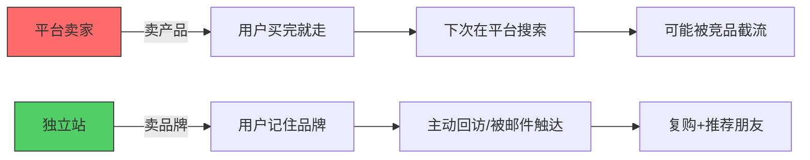
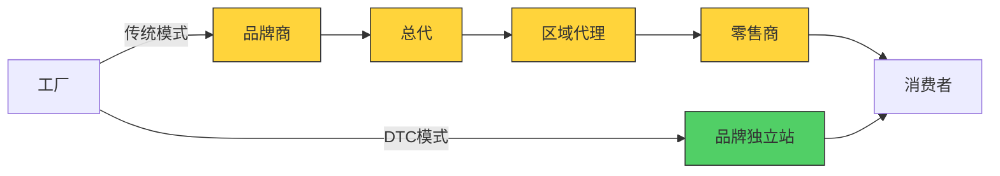
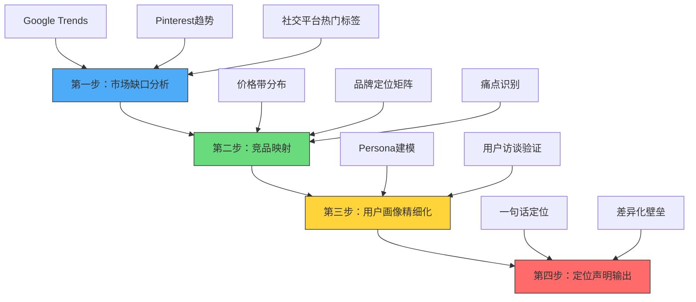
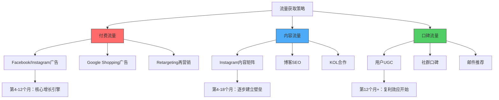
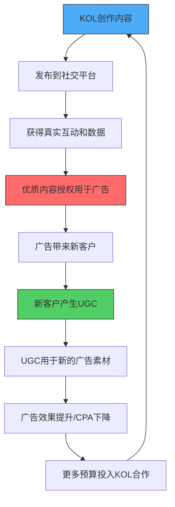
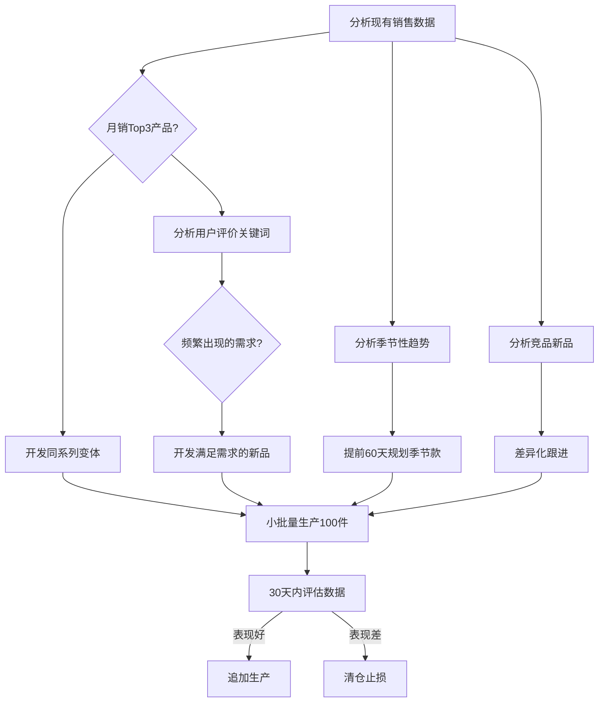

## 案例五：独立站品牌出海的长期主义

独立站品牌出海是跨境电商中门槛最高、但天花板也最高的路径。与依托第三方平台（亚马逊、速卖通）不同，独立站意味着品牌方完全掌控流量、用户数据和定价权，但同时也必须自己解决流量获取、信任建立和用户运营的全部问题。

本案例完整还原一个从30万元人民币启动资金起步、24个月做到月销5万美元的独立站品牌出海全过程，拆解每一步的决策逻辑和执行细节。这不是一个"一夜暴富"的故事，而是一个关于**系统化方法论、数据驱动迭代和长期主义耐心**的实战复盘。

### 为什么独立站是"长期主义"的赛道

在进入案例之前，先理解独立站的底层商业逻辑，这决定了你用什么心态和节奏来做这件事。

#### 独立站 vs 平台店：本质区别

| 维度 | 第三方平台（亚马逊/速卖通） | 独立站（Shopify/自建） |
|------|--------------------------|----------------------|
| 流量来源 | 平台分配（搜索排名、广告） | 自己获取（广告、内容、SEO） |
| 用户数据 | 归平台所有，你只能看到订单 | 归你所有，完整的用户行为数据 |
| 品牌建设 | 弱，用户记住的是平台 | 强，用户记住的是你的品牌 |
| 定价权 | 弱，平台比价机制压制溢价 | 强，没有直接比价环境 |
| 启动速度 | 快，1-2周可出单 | 慢，3-6个月才能稳定出单 |
| 竞争壁垒 | 低，跟卖和价格战 | 高，品牌+内容+用户关系 |
| 天花板 | 受限于平台规则和抽成 | 理论上无上限 |



**核心认知**：独立站的本质不是"建一个网站卖东西"，而是"建一个品牌资产"。网站只是载体，品牌才是资产。这个认知差异直接决定了你的投入节奏——前12个月是资产建设期，不是盈利期。

#### 独立站的DTC模式优势

DTC（Direct to Consumer，直接面向消费者）模式的核心优势在于去掉了中间商：



传统模式下，每个中间环节加价30%-50%，消费者最终支付的价格可能是出厂价的4-8倍。DTC模式下，品牌方直接面对消费者，可以做到：出厂价3倍定价仍有50%+毛利率，同时消费者支付的价格低于传统渠道。**双赢**是DTC模式持续增长的根本原因。

### 背景与创始人画像

| 维度 | 详情 |
|------|------|
| 创始人 | 陈总，32岁，前4A广告公司创意总监，有8年品牌策划经验 |
| 品类 | 原创设计饰品（项链、耳环、手链、胸针） |
| 启动资金 | 30万元人民币（约4.2万美元） |
| 时间线 | 24个月（从建站到稳定盈利） |
| 目标市场 | 北美（美国60%、加拿大15%）、欧洲（英国15%、德法10%） |
| 团队规模 | 启动期1人，第12个月扩至3人（+1运营+1客服） |

**陈总的核心优势**：4A广告公司背景让他对品牌视觉、消费者心理和内容营销有深刻理解，这是大多数纯供应链出身的电商创业者不具备的能力。但他的短板同样明显——没有电商运营经验、没有供应链资源、启动资金有限。

**这个案例的典型意义**：它证明了"品牌思维+内容能力"可以在独立站赛道中弥补资金和供应链的不足，但前提是你愿意接受较长的回报周期（至少12个月才能看到明显回报）。如果你没有内容能力，这条路的难度会翻倍——你需要额外花钱购买内容制作服务，或者花时间学习。

### 品牌定位：找到你的生态位

品牌定位不是一句口号，而是一整套商业决策的起点。陈总在启动前花了整整一个月做市场调研和品牌定位，这一步的质量直接决定了后面所有努力的方向是否正确。

#### 定位分析框架

陈总用了一个系统化的定位分析方法，而不是拍脑袋决定。这个方法可以抽象为可复用的四步框架：



**第一步：市场缺口分析**

他通过Google Trends、Pinterest趋势报告和Instagram热门标签，发现了一个明确的趋势信号——"Asian aesthetic jewelry"（亚洲美学饰品）的搜索量在过去两年增长了340%，但市场上能提供高品质、有设计感产品的品牌极少。大多数搜索结果要么是廉价的义乌小商品，要么是高端奢侈品（单价$500+），中间价位带（$30-$100）几乎是空白。

**验证方法**：陈总不只看搜索趋势，还做了三件事来交叉验证：
1. **Amazon搜索验证**：搜索"Asian jewelry"，按评价排序，发现4星以上产品集中在$10以下和$100以上，中间价位带产品评价普遍3.5-4星，差评集中在"质量差""与图片不符"
2. **Reddit/Quora用户声音**：搜索相关话题，发现大量用户抱怨"找不到好看又不贵的亚洲风饰品"，这是一个真实的未被满足的需求
3. **Instagram竞品账号分析**：用SimilarWeb和Social Blade分析对标账号的粉丝增长和互动率，验证这个品类有持续的社交传播力

**第二步：竞品映射**

| 竞品类型 | 代表 | 价格带 | 痛点 |
|----------|------|--------|------|
| 低价白牌 | 速卖通、Temu卖家 | $1-$15 | 质量差、无品牌、退货率高 |
| 中端设计师品牌 | Mejuri、Ana Luisa | $50-$200 | 缺乏文化故事、同质化严重 |
| 高端奢侈品牌 | Cartier东方系列 | $500+ | 普通消费者买不起 |
| 文化IP品牌 | 故宫文创海外版 | $20-$80 | 设计偏传统、不够时尚 |

陈总瞄准的正是"中端设计师品牌"和"文化IP品牌"之间的交叉地带——既有原创设计和文化故事，价格又在大众消费能力范围内。

**竞品分析的实操方法**：
- 用Ahrefs分析竞品网站的流量来源和关键词排名，找出他们的流量结构
- 用Facebook Ad Library查看竞品正在投放的广告素材和文案
- 以普通消费者身份下单购买竞品产品，拆解其包装、品质、售后全流程
- 分析竞品的Instagram内容策略：发布频率、内容类型、互动率

**第三步：用户画像精细化**

不是笼统的"25-40岁女性"，而是细分到具体的人物原型（Persona）：

- **Persona A：Emily，28岁，美籍华裔，纽约**。在科技公司工作，对中国文化有认同感但不想被贴"中国风"标签，希望饰品既有东方韵味又能日常佩戴，预算$40-$80/件。**触达渠道**：Instagram、YouTube、Reddit r/jewelry
- **Persona B：Sarah，35岁，英国，时尚博主**。对中国文化感兴趣，喜欢独特的、有故事的设计，会在社交媒体分享，预算$50-$100/件。**触达渠道**：Pinterest、Instagram、时尚博客
- **Persona C：林小姐，30岁，加拿大华裔，移民二代**。想找到连接两个文化身份的饰品，愿意为设计和品质付溢价。**触达渠道**：微信小红书海外版、Instagram、华人社区

每个Persona都附带了**用户旅程地图**（从发现品牌到购买到复购的完整路径），这直接指导了后续的广告投放渠道选择和内容策略制定。

#### 最终定位声明

> 为25-40岁、对东方美学有共鸣的全球消费者，提供原创设计、高品质的现代饰品，通过文化叙事建立情感连接，填补"有设计感的文化饰品"在$30-$100价位带的市场空白。

这个定位的精妙之处在于：它不是"做中国风饰品卖给外国人"，而是"用东方美学语言做现代设计"。前者是文化输出，后者是设计创新——后者的市场天花板高得多。**关键词是"现代"**——目标用户不想被当作"异域风情的消费者"，他们想要的是融入日常生活的、有设计感的饰品，只不过设计语言来自东方美学。

### 第一阶段：品牌搭建（第1-3个月）

#### 建站：Shopify不是唯一选择，但它是最佳选择

陈总评估了四个建站方案：

| 方案 | 月成本 | 上手难度 | 扩展性 | 推荐场景 |
|------|--------|----------|--------|----------|
| Shopify | $39-$299 | 低 | 高 | 品牌独立站首选 |
| WooCommerce | 主机费$10-$50 | 中 | 高 | 有技术团队、预算敏感 |
| BigCommerce | $39-$299 | 低 | 高 | B2B或复杂产品 |
| 自建站 | $500+ | 极高 | 完全自定义 | 不推荐初创团队 |

最终选择Shopify Basic（$39/月）的原因：生态成熟——有大量饰品行业主题和插件、支付集成简单（Shopify Payments直接接入信用卡）、SEO基础功能完善、有丰富的教程和社区支持。

**Shopify建站的进阶考量**：

| 升级时机 | 从Basic到Shopify($99/月) | 从Shopify到Advanced($299/月) |
|----------|-------------------------|----------------------------|
| 触发条件 | 月销$5,000+ | 月销$50,000+ |
| 核心收益 | 专业报告、更多员工账号 | 高级报告构建器、第三方运费计算 |
| 手续费 | 2.9% → 2.6% | 2.6% → 2.4% |
| 节省计算 | 月销$5K时省$15/月 | 月销$50K时省$100/月 |

**建站执行清单**（按优先级排序）：

1. **域名注册**：品牌名+.com，用Namecheap注册（年费约$10），避免在Shopify直接买域名（贵30%）。域名选择原则：简短（<15个字符）、易拼写、无歧义、.com优先
2. **主题选择**：购买Dawn或Prestige主题（$180-$350一次性），不使用免费主题——免费主题在移动端体验和加载速度上都差一截。饰品品类推荐Prestige主题，其产品展示页的布局特别适合视觉驱动型产品
3. **品牌VI系统**：聘请设计师设计logo、色板、字体方案、包装视觉，预算5000-8000元。品牌VI不是"好看就行"，而是要在所有触点（网站、包装、社交媒体、邮件）保持一致的视觉语言。陈总的VI系统包含：
   - 主色：墨绿色（#2D5A3D）——代表东方的含蓄与内敛
   - 辅色：米白（#F5F0E8）和金色（#C9A96E）——传达质感和温度
   - 字体：标题用Playfair Display（优雅感），正文用Lato（可读性）
   - 视觉元素：竹节纹样、流线型线条、留白构图
4. **产品摄影**：这是饰品品类最重要的投入。陈总的做法是——
   - 主图：纯白背景，展示产品细节，拍摄角度包括正面、45度、佩戴效果图
   - 场景图：在有东方元素的空间（竹、木、瓷器）中拍摄，强化品牌调性
   - 模特图：找不同肤色的模特佩戴，展示产品的通用性
   - 细节微距：展示材质纹理、扣环细节、包装质感
   - 预算：首批10款产品，拍摄费用约8000-12000元（含模特和场地）
   - **重要提醒**：产品图是独立站转化率的第一影响因素。一张好的产品图能让转化率提升50%以上，这笔钱不能省
5. **品牌故事页**：不是简单的"关于我们"，而是一个有起承转合的品牌叙事——创始人为什么做这件事、设计灵感来源、材料和工艺故事。陈总的品牌故事页分为四个板块：起源（个人经历+文化热爱）、理念（现代东方美学的诠释）、工艺（手工制作的过程）、承诺（品质保证和可持续发展）
6. **信任元素部署**：SSL证书（Shopify自带）、退货政策页（30天无理由退换）、FAQ页（覆盖尺码、材质、过敏、保养等常见问题）、客户评价展示、安全支付图标、信任徽章（Trustpilot、McAfee Secure等）
7. **核心插件安装**：
   - Klaviyo（邮件营销，免费起步，250个联系人以内免费）
   - Loox（产品评价收集，含照片评价，$9.99/月）
   - Judge.me（免费评价插件，替代方案，功能稍弱但免费版够用）
   - SEO Manager（SEO优化，$20/月）
   - PageFly（Landing Page构建器，免费起步）
   - Tidio（在线客服+聊天机器人，免费版支持50个对话/月）
   - Lucky Orange（用户行为录制和热力图，免费起步）

#### 产品开发：首批10款SKU的筛选逻辑

不是随便设计10个产品就上架，而是有明确的产品矩阵规划：

| 角色 | 数量 | 价格 | 目的 | 选品标准 |
|------|------|------|------|----------|
| 引流款 | 2款 | $29-$39 | 低门槛获客，积累评价和口碑 | 日常百搭、不易出错、适合送礼 |
| 利润款 | 5款 | $50-$80 | 主力盈利产品，展示设计实力 | 独特设计、有文化故事、高复购潜力 |
| 形象款 | 2款 | $90-$120 | 拉高品牌调性，制造"锚定效应" | 工艺复杂、限量感、视觉冲击力强 |
| 配件款 | 1款 | $15-$25 | 凑单用，提升客单价 | 低单价、高频使用、搭配性强 |

**产品矩阵的定价心理学**：形象款$90-$120的作用不是卖出去，而是让$50-$80的利润款看起来"性价比很高"。这就是**锚定效应**——当消费者看到$120的产品后，$60的产品心理感知价格会更低。实际数据验证：陈总的网站上，形象款的销量占比只有5%，但利润款的转化率因为形象款的存在提升了18%。

**材料和供应链**：陈总通过1688和深圳水贝珠宝批发市场找到三家供应商，分别负责银饰、合金饰品和包装。首批生产10万元（含材料、加工、包装），每款产品各100件。

**供应商筛选标准**：
1. 能提供材质检测报告（银饰需要S925认证，合金需要镍释放量检测）
2. 支持小批量起订（100件/款以下）
3. 交期稳定（15天内）
4. 能配合定制包装（品牌logo印制）
5. 有跨境电商供货经验（了解出口包装和标签要求）

**关键决策**：首批只做100件/款，而不是为了压低单价做500件。原因——独立站的测品逻辑与平台完全不同。平台卖家靠"铺货+数据筛选"，独立站卖家靠"精品+口碑传播"。首批100件的目的是验证产品力，如果某款卖不动，库存损失可控；如果某款爆了，快速追加生产。

**库存管理的黄金法则**：
- 首批：100件/款（测品期）
- 畅销品追加：200-300件/批（验证期）
- 稳定款备货：根据月销量×1.5倍（稳定期）
- 季节款：提前60天下单，限量生产

#### 支付与物流基础设施搭建

这两个环节直接决定用户体验和资金周转效率，但很多新手会忽视。

**支付方案**：

| 支付方式 | 覆盖率 | 手续费 | 建议 |
|----------|--------|--------|------|
| Shopify Payments（信用卡） | 美国80%+ | 2.9%+$0.30/笔 | 必须开通，核心支付方式 |
| PayPal | 全球30%+用户 | 3.49%+$0.49/笔 | 必须开通，部分用户只用PayPal |
| Apple Pay / Google Pay | 移动端30%+ | 同Shopify Payments | Shopify自动支持，提升移动端转化 |
| Klarna / Afterpay | 欧美年轻用户 | 商家承担3%-6% | 可选，适合$80+的产品，降低购买门槛 |
| Shop Pay | Shopify生态用户 | 同Shopify Payments | 自动支持，复购时一键支付 |

**PayPal风控注意**：新账号PayPal会冻结资金14-21天。解决方案：提前注册PayPal Business账号，用低风险订单（小额、国内发货）先积累信誉，避免首批大额订单被冻结导致资金链断裂。

**物流方案选择**：

| 方案 | 时效 | 成本（饰品0.5kg内） | 适用场景 |
|------|------|---------------------|----------|
| 云途/燕文等专线小包 | 10-20天 | ¥30-50/件 | 初期性价比最高 |
| 海外仓（ShipBob/ShipMonk） | 3-5天 | $3-5/件+仓储费 | 月销$10K+后考虑 |
| DHL/FedEx商业快递 | 3-7天 | ¥80-150/件 | VIP客户或急单 |
| ePacket | 7-15天 | ¥20-35/件 | 轻小件，性价比高 |

**陈总的物流策略**：前6个月用云途专线小包（成本低、可追踪），第7个月开始在美国西海岸租用第三方海外仓（ShipBob），将畅销品提前备货到海外。海外仓的核心价值不只是时效提升（从15天缩短到3天），更重要的是退货处理更方便——用户退回的饰品可以检验后重新上架，而不是作废。

### 第二阶段：流量获取（第4-12个月）

独立站最大的挑战就是流量。没有平台的自然流量分配机制，每一个访客都需要花钱买或者靠内容吸引。陈总的流量策略是"付费流量打基础，内容流量建壁垒"。



#### 付费广告：精准投放的完整方法论

**Facebook & Instagram广告**

Facebook广告是独立站冷启动的核心渠道，但也是最容易烧钱的地方。陈总的投放策略经过了三个迭代：

**迭代1（第4-5个月）：兴趣测试期**

- 日预算：$30-$50
- 目标：找到最有效的受众定向和广告素材组合
- 方法：创建10个广告组，每组对应一个兴趣标签（如"Asian culture""jewelry design""minimalist accessories""zen aesthetic""bohemian style""fashion accessories""gift ideas for her""self-care treats""cultural fashion""artisan jewelry"），每组投放同一套素材，运行3-5天后对比CTR（点击率）和CPM（千次展示成本）
- 结果：发现"Asian culture + 25-40岁女性"的组合CTR最高（2.8%），CPM最低（$6.5）
- **淘汰标准**：CTR<1%或CPM>$15的广告组直接关闭，不恋战

**迭代2（第6-8个月）：素材优化期**

- 日预算：$50-$100
- 目标：找到转化率最高的广告素材形式
- 测试了五种素材类型：

| 素材类型 | CTR | 转化率 | CPA（获客成本） | 适用阶段 |
|----------|-----|--------|----------------|----------|
| 产品静态图 | 1.2% | 1.8% | $28 | 低效，不推荐 |
| 产品视频（15秒） | 2.1% | 2.4% | $19 | 中等，可用于Retargeting |
| UGC风格视频 | 3.2% | 3.1% | $14 | 最佳，核心素材 |
| 创始人故事视频 | 1.8% | 2.8% | $16 | 良好，适合品牌认知 |
| 产品对比图 | 1.5% | 2.0% | $22 | 中等，适合突出差异化 |

UGC风格视频胜出——因为它看起来不像广告，更像真实用户的分享，降低了用户的防御心理。

**UGC素材的制作方法**：
1. 从KOL合作中获取原始素材（签合同时约定素材使用权）
2. 邀请已购买的客户录制15-30秒的开箱/佩戴视频，送$10优惠券作为感谢
3. 用CapCut或InShot编辑，添加字幕（很多用户静音浏览）、品牌logo水印、CTA按钮
4. 保持"粗糙感"——太精致的视频反而不像UGC，用户会识别为广告

**迭代3（第9-12个月）：规模化期**

- 日预算：$100-$200
- 使用CBO（Campaign Budget Optimization）让Facebook自动分配预算到表现最好的广告组
- 建立Lookalike Audience（相似受众）：基于已购买用户的1%相似受众，转化率比兴趣定向高出40%
- 开启Retargeting（再营销）：对访问过网站但未购买的用户展示专门的挽回广告，这部分流量的转化率是冷流量的3-5倍

**Facebook广告的关键指标基准**（饰品品类）：

| 指标 | 优秀 | 合格 | 需优化 |
|------|------|------|--------|
| CTR（点击率） | >2.5% | 1.5%-2.5% | <1.5% |
| CPM（千次展示成本） | <$8 | $8-$15 | >$15 |
| 转化率 | >3% | 1.5%-3% | <1.5% |
| CPA（获客成本） | <$15 | $15-$25 | >$25 |
| ROAS（广告回报率） | >3x | 2x-3x | <2x |

**Google Shopping广告**

Google Shopping适合捕捉有明确购买意图的搜索流量。陈总在第6个月开始投放：

- 产品Feed优化：标题中包含核心关键词（如"Handcrafted Silver Moon Necklace - Asian Inspired Design"），描述中突出材质、尺寸和文化含义
- 出价策略：初期使用手动CPC（每次点击成本），单次点击出价$0.5-$1.2；稳定后切换到Target ROAS（目标广告回报率），设为300%
- 否定关键词：排除"cheap""free shipping""wholesale""DIY""how to make"等低质量或非购买意图的搜索词
- 产品分组：按价格带和利润率分组出价，高利润品出价更高

**Google Shopping vs Facebook广告的本质区别**：

| 维度 | Facebook广告 | Google Shopping |
|------|-------------|-----------------|
| 用户意图 | 被动发现（刷到广告） | 主动搜索（有意购买） |
| 漏斗位置 | 认知/兴趣阶段 | 考虑/购买阶段 |
| 转化率 | 较低（1%-3%） | 较高（2%-5%） |
| CPA | 较低（$10-$20） | 较高（$15-$30） |
| 适合场景 | 冷启动、品牌曝光 | 稳定期、精准获客 |
| 素材要求 | 视频/图片为主 | 产品图+标题优化 |

**建议策略**：前6个月以Facebook为主（需要主动触达用户），第6个月后逐步增加Google Shopping预算（捕捉已有购买意图的用户）。两条渠道互为补充，不是竞争关系。

#### 内容营销：建立长期流量壁垒

付费广告是"租流量"，内容营销才是"建资产"。陈总在内容上的投入分三个层面：

**Instagram内容矩阵**

陈总为Instagram制定了严格的内容日历，每天发布1-2条内容：

| 内容类型 | 频率 | 目的 | 示例 | 最佳发布时间 |
|----------|------|------|------|------------|
| 产品展示 | 3次/周 | 直接转化 | 产品特写+佩戴效果 | 周二/四 上午10点 |
| 文化故事 | 2次/周 | 品牌调性 | "竹节纹样的寓意" | 周一/三 下午2点 |
| 用户UGC | 2次/周 | 社会证明 | 转发买家秀+感谢语 | 周五/六 上午11点 |
| 幕后花絮 | 1次/周 | 信任建设 | 设计手稿、制作过程 | 周日 下午3点 |
| 互动内容 | 1次/周 | 提升互动率 | 投票、问答、猜价格 | 周二/四 晚上8点 |

**关键发现**：文化故事类内容的互动率（点赞+评论/粉丝数）平均4.5%，远高于产品展示类（1.8%）。这说明用户关注这个账号不只是为了买东西，更是因为对东方文化感兴趣——这正是品牌护城河。

**Instagram增长节奏**：

| 时间节点 | 粉丝量 | 月均新增 | 核心策略 |
|----------|--------|----------|----------|
| 第3个月 | 500 | 170 | 每日发布+Hashtag策略 |
| 第6个月 | 2,500 | 400 | KOL合作+UGC转发 |
| 第12个月 | 12,000 | 800 | Reels视频+文化内容 |
| 第18个月 | 28,000 | 1,300 | 社群互动+品牌活动 |
| 第24个月 | 52,000 | 2,000 | 品牌影响力自然扩散 |

**Hashtag策略**：每条帖子使用20-25个标签，分三层：
- 高流量标签（5-8个）：#jewelry #fashion #accessories（竞争大但曝光多）
- 中流量标签（8-10个）：#asianjewelry #meaningfuljewelry #handcrafted（精准匹配）
- 品牌标签（3-5个）：#品牌名 #品牌名style（建立品牌话题）

**Reels（短视频）策略**：Instagram在2024年后大幅倾斜流量给Reels。陈总从第8个月开始每周发布3条Reels：
- 15-30秒产品展示（配合热门音乐）
- "一分钟了解东方文化"系列知识短视频
- 创始人日常vlog（增加人格化）
- Reels的平均曝光量是图文帖的3-5倍

**博客SEO策略**

陈总在网站上建立了博客板块，围绕目标关键词创作长文内容。这不是随便写几篇文章，而是系统化的SEO内容规划：

- **关键词分层**：
  - 头部词（搜索量1万+）：如"jewelry trends 2024"——竞争太大，不做主攻
  - 中部词（搜索量1000-10000）：如"Asian inspired jewelry""meaningful necklace designs"——重点突破
  - 长尾词（搜索量100-1000）：如"what does the jade pendant mean""how to style Chinese knot bracelet"——批量覆盖

- **内容策略**：每篇博客2000-3000字，结构为"文化背景→设计解读→搭配建议→产品推荐"，自然地将产品植入有价值的内容中

- **发布节奏**：每周2篇，6个月后积累了50+篇高质量博客，每月带来3000-5000自然搜索访客

- **SEO内容模板**（每篇博客遵循）：
  1. H1标题含核心关键词
  2. 开头200字回答用户搜索意图
  3. 中间主体部分：文化背景（500字）+ 设计解读（500字）+ 搭配建议（500字）
  4. 产品推荐部分：3-5款相关产品，附购买链接
  5. 结尾：FAQ部分（用schema标记，争取Google精选摘要）
  6. 内链：至少3个指向其他博客或产品页的内部链接

**KOL合作策略**

陈总没有一开始就找大V，而是采用了"微KOL矩阵"策略：

| KOL层级 | 粉丝量 | 合作方式 | 单次成本 | ROI | 寻找渠道 |
|---------|--------|----------|----------|-----|----------|
| 纳米KOL | 1K-10K | 免费寄样+佣金 | $30-$50（产品成本） | 最高 | Instagram搜索、Aspire |
| 微型KOL | 10K-50K | 寄样+固定费用 | $200-$500 | 高 | Creator Marketplace |
| 中型KOL | 50K-200K | 固定费用+佣金 | $1000-$3000 | 中等 | 代理机构、直接联系 |
| 大型KOL | 200K+ | 暂不合作 | $5000+ | 初期不划算 | — |

前6个月，陈总共合作了80+纳米和微型KOL，花费约2万元，带来了15万+曝光和2000+网站访问。关键是这些KOL的真实分享内容又可以被陈总作为UGC素材用于Facebook广告，形成"内容飞轮"。

**内容飞轮的完整机制**：



这个飞轮的关键在于**素材授权**——与KOL签约时明确约定：品牌方有权将合作内容用于付费广告，期限12个月。这让你的广告素材库持续增长，而不是每次都从零制作。

#### SEO技术优化

除了内容SEO，技术层面的优化同样重要：

- **页面加载速度**：Shopify主题优化、图片压缩（WebP格式，比JPEG小25-35%）、懒加载，目标LCP（最大内容绘制）<2.5秒。用Google PageSpeed Insights每月检测一次，目标移动端评分>80
- **结构化数据**：添加Product schema（价格、评分、库存状态）、BreadcrumbList schema、Organization schema，帮助Google理解页面内容。Shopify的SEO Manager插件可以自动生成
- **站内链接结构**：每个产品页至少有3个内部链接指向相关产品或博客。博客文章中用锚文本自然链接到产品页
- **移动端适配**：饰品用户60%以上通过手机浏览，确保移动端的图片展示、按钮大小和结账流程都流畅。**关键数据**：移动端转化率通常比桌面端低30%-40%，优化移动端结账流程（减少步骤、支持Apple Pay/Google Pay一键支付）能显著提升整体转化率
- **URL结构**：使用语义化URL（如/products/silver-moon-necklace），而不是默认的产品ID
- **图片SEO**：每张图片添加描述性alt文本，文件名用关键词命名（如silver-moon-necklace-front.jpg）

### 第三阶段：品牌深化与用户运营（第13-24个月）

当网站有了稳定的流量来源后，重心从"获客"转向"留客"和"提效"。

#### 邮件营销：被严重低估的利润中心

陈总使用Klaviyo搭建了完整的邮件自动化体系，这套系统在第12个月时已经能贡献月销售额的25%。**邮件营销的投资回报率高达36:1**（每投入1美元邮件营销费用，产生36美元收入），是所有数字营销渠道中ROI最高的。

**自动化邮件流程（Flow）**：

1. **欢迎序列**（3封邮件，间隔1天）：
   - 第1封：品牌故事+10%首单折扣码
   - 第2封：明星产品推荐+用户评价
   - 第3封：折扣即将过期提醒+畅销品展示
   - 效果：欢迎序列的打开率38%，转化率4.2%

2. **弃购挽回**（3封邮件，间隔1小时/24小时/72小时）：
   - 第1封：提醒购物车中有未完成订单，附产品图和一键结账链接
   - 第2封：展示产品评价+常见问题解答（尺码、过敏、退换货）
   - 第3封：提供5%额外折扣（仅在前两封无效时触发）
   - 效果：弃购挽回率12%，每月挽回约$3,000-$5,000销售额
   - **行业基准**：饰品品类弃购率通常60%-75%，挽回率8%-15%为正常水平

3. **购后序列**（3封邮件）：
   - 第1封（发货后3天）：使用指南+搭配建议+保养方法
   - 第2封（收货后7天）：邀请留评价（附照片送$10优惠券）
   - 第3封（收货后30天）：推荐相关产品+会员注册邀请

4. **VIP专属**：
   - 累计消费$200以上的用户自动进入VIP列表
   - 新品提前48小时预览和购买权
   - 生日当月专属20%折扣
   - 每季度一次VIP专属产品（限量设计款）

5. **浏览未购挽回**（Browse Abandonment）：
   - 用户浏览了产品页但未加入购物车，2小时后发送"你可能感兴趣"邮件
   - 效果：转化率约1.5%，看似不高但几乎零成本

**邮件营销的关键指标**：

| 指标 | 优秀 | 合格 | 需优化 |
|------|------|------|--------|
| 打开率 | >30% | 20%-30% | <20% |
| 点击率 | >4% | 2%-4% | <2% |
| 转化率 | >3% | 1%-3% | <1% |
| 退订率 | <0.3% | 0.3%-0.5% | >0.5% |

#### 用户分层运营

| 用户层级 | 条件 | 占比 | 运营策略 | 触达频率 |
|----------|------|------|----------|----------|
| 新客 | 首次购买 | 55% | 欢迎序列+首单关怀+交叉推荐 | 邮件1次/周 |
| 回头客 | 购买2-3次 | 25% | 交叉推荐+复购激励+专属折扣 | 邮件2次/周 |
| VIP | 购买4次+或累计$200+ | 15% | 专属权益+早期访问+生日礼遇 | 邮件3次/周+短信 |
| 沉睡用户 | 90天未购买 | 5% | 唤醒邮件+专属折扣+新品推荐 | 邮件1次/2周，3次后停止 |

**用户终身价值（LTV）计算**：

```text
LTV = 客单价 × 年均购买次数 × 平均客户生命周期 × 毛利率

陈总的数据：
  客单价：$68
  年均购买次数：2.5次
  平均客户生命周期：2.5年
  毛利率：65%

  LTV = $68 × 2.5 × 2.5 × 0.65 = $276.25

对比获客成本（CAC）：$14-$19

  LTV/CAC比率 = $276 / $16.5 ≈ 16.7x

健康基准：LTV/CAC > 3x 即可，陈总的16.7x说明品牌运营非常健康
```

#### 产品线扩展策略

从10款SKU扩展到30+SKU的过程不是盲目加产品，而是基于数据驱动的扩展：

1. **畅销品延伸**：月销量最高的3款产品，开发同系列的变体（不同颜色、不同长度、不同材质）。延伸品的成功率远高于全新品——因为已有用户基础和口碑
2. **季节性产品**：春节限定（红色系列）、情人节系列、母亲节礼盒、圣诞限定。每个季节系列提前60天开发、45天预热、30天正式发售
3. **联名合作**：与海外华人艺术家联名设计限量款，借助艺术家的粉丝基础扩大品牌影响力。联名款的关键是双方品牌调性一致，且艺术家有真实的创作能力而非只有流量
4. **礼品化**：推出精美礼盒套装（项链+耳环+手链），客单价从$60提升到$120-$150。礼品套装在节日季（11-12月、2月、5月）的销量占比可达30%-40%
5. **配件渗透**：开发低单价的发饰、钥匙扣等产品线，降低新客首次尝试门槛

**产品开发的数据驱动决策**：



#### 社群运营：从"卖货"到"建社区"

陈总在第15个月开始建立品牌社群，选择的平台是Facebook Group（而非微信群，因为目标用户在海外）：

- 社群定位：不只是"买家群"，而是"东方美学爱好者社区"
- 内容策略：每周分享东方文化知识、设计灵感、穿搭建议，产品信息只占20%（硬广不超过20%是社群运营的黄金比例，超过这个比例用户会觉得被骚扰）
- 互动机制：每月举办"最佳搭配"投票活动，获奖者得$50礼品卡；新成员入群问卷（了解兴趣偏好，用于个性化推荐）
- 规模：12个月后社群成员达到3000+人，其中40%有过购买记录
- **社群的商业价值**：社群成员的复购率是非社群用户的2.3倍，客单价高15%。社群也是新品测试的最佳场所——新品设计图发到群里，24小时内就能收到真实反馈

#### 客服体系建设

客服是独立站最容易被忽视但直接影响复购率的环节。

**客服渠道配置**：

| 渠道 | 工具 | 响应时间要求 | 用途 |
|------|------|-------------|------|
| 在线聊天 | Tidio | <5分钟 | 售前咨询、尺码推荐 |
| 邮件 | Klaviyo + Gmail | <4小时 | 售后问题、退换货 |
| 社交媒体 | Instagram DM | <2小时 | 用户互动、投诉处理 |
| FAQ自助 | Shopify页面 | 即时 | 常见问题解答 |

**客服SOP核心流程**：
1. 售前：尺码推荐、材质说明、搭配建议（目标：消除购买疑虑）
2. 售中：订单状态查询、物流追踪（目标：减少焦虑）
3. 售后：退换货处理、投诉解决（目标：将不满客户转化为忠实客户）
4. **关键原则**：客服不是成本中心，而是利润中心。一个好的客服回复能让一个不满客户变成品牌传播者

### 最终经营数据

| 指标 | 第6个月 | 第12个月 | 第18个月 | 第24个月 |
|------|---------|----------|----------|----------|
| 月销售额 | $3,000 | $12,000 | $30,000 | $45,000 |
| 月广告支出 | $2,000 | $4,000 | $6,000 | $7,000 |
| ROAS（广告回报率） | 1.5x | 3.0x | 5.0x | 6.4x |
| 毛利率 | 55% | 58% | 62% | 65% |
| 月净利润 | -$2,000 | $1,200 | $9,500 | $12,545 |
| 复购率 | 5% | 15% | 22% | 28% |
| 客单价 | $48 | $55 | $62 | $68 |
| 邮件贡献占比 | 0% | 15% | 22% | 28% |
| 自然流量占比 | 5% | 20% | 30% | 38% |
| 月订单量 | 63 | 218 | 484 | 662 |
| SKU数量 | 10 | 18 | 25 | 32 |

**第6个月是亏损的**——这很关键。很多创业者在这个阶段就放弃了，因为看不到正向现金流。但陈总清楚，前6个月的投入是在"买数据"——测试哪些广告素材有效、哪些产品受欢迎、哪些渠道ROI最高。这些数据是后续规模化盈利的基础。

**增长曲线的关键拐点**：
- **第8个月**：月销售额首次超过月支出，实现单月盈亏平衡
- **第12个月**：累计投入回本，开始真正盈利
- **第18个月**：自然流量+邮件营销占比超过50%，对付费广告的依赖度下降
- **第24个月**：品牌进入"飞轮效应"——口碑传播+SEO+邮件构成的增长引擎开始自主运转

### 投入产出详细测算

以第24个月的稳态数据为基准：

```text
月销售额：$45,000（约32万元）

收入端：
  产品销售收入          $45,000

支出端：
  产品成本（35%）       $15,750
  广告支出               $7,000
  Shopify月费+插件      $300
  邮件营销工具（Klaviyo） $150
  物流费用（8%）        $3,600
  支付手续费（2.9%）    $1,305
  退货损失（3%）        $1,350
  内容制作（摄影/视频）   $1,500
  KOL合作               $1,000
  客服外包               $800
  海外仓仓储费            $200
  其他杂费               $500

  支出合计              $33,455

月净利润              $11,545（约8.3万元）
年净利润              约100万元
```

从30万元启动资金到年净利润100万元，投资回报率超过230%——但请注意，前12个月基本是投入期，真正的回报从第13个月开始。

**盈亏平衡分析**：

```text
月固定成本：
  Shopify+插件    $300
  邮件工具        $150
  内容制作        $1,500
  KOL合作         $1,000
  客服外包         $800
  杂费             $500
  合计            $4,250

月变动成本率（占销售额）：
  产品成本  35%
  广告支出  15.6%（$7,000/$45,000）
  物流      8%
  支付手续费 2.9%
  退货损失   3%
  合计      64.5%

盈亏平衡月销售额 = $4,250 / (1 - 0.645) = $11,972

即月销售额达到约$12,000时实现盈亏平衡
——这与第12个月的数据吻合
```

### 关键成功因素深度剖析

#### 因素一：品牌定位的精准性

独立站与平台店的根本区别在于：平台卖的是"产品"，独立站卖的是"品牌"。陈总的成功首先在于他找到了一个既有市场需求、又没有强势竞品的细分市场——"现代东方美学饰品"。这个定位不是拍脑袋想出来的，而是通过Google Trends、Pinterest趋势、竞品分析和用户访谈系统化验证的。

**定位精准的量化标准**：
- 目标市场规模：$30-$100价位带年销售额>1亿美元
- 竞争密度：前10个搜索结果中，真正专注该定位的品牌<3个
- 趋势方向：相关搜索量年增长率>30%
- 用户支付意愿：目标客群中60%+表示愿意为设计和文化故事付溢价

#### 因素二：内容能力的壁垒效应

4A广告公司的背景让陈总具备了大多数电商创业者不具备的内容能力——他能产出高质量的品牌故事、视觉素材和社交媒体内容。这个能力本身就是壁垒，因为：好的内容需要审美、需要对消费者心理的理解、需要讲故事的能力，这些不是花钱就能买到的。

**没有内容能力怎么办**：
1. 聘请自由职业的内容创作者（Upwork、Fiverr），预算$500-$1000/月
2. 使用AI工具辅助生成文案初稿（ChatGPT、Jasper），人工润色
3. 与KOL深度合作，获取高质量UGC素材
4. 自己学习——关注对标品牌的Instagram，拆解其内容策略，模仿并迭代

#### 因素三：数据驱动的迭代思维

从广告投放的三轮迭代、到产品线的数据化扩展、到邮件营销的A/B测试，陈总在每一个环节都坚持"先测试、再放大"的原则。这不是运气，而是方法论。

**A/B测试的系统化方法**：

| 测试对象 | 测试变量 | 样本量要求 | 测试周期 | 判断标准 |
|----------|----------|-----------|----------|----------|
| 广告素材 | 图片vs视频、不同文案 | 每组1000+展示 | 3-5天 | CTR差异>20%为显著 |
| 产品页 | 主图顺序、描述长度 | 每组500+访客 | 7天 | 转化率差异>15%为显著 |
| 邮件 | 标题、发送时间、CTA | 每组500+收件人 | 24-48小时 | 打开率/点击率差异>10% |
| 定价 | 不同价格点 | 每组200+购买 | 14天 | 总利润差异>10% |

**核心原则**：一次只测试一个变量，其他条件保持不变。同时测试多个变量会混淆结果，无法判断是哪个因素导致了差异。

#### 因素四：对复购和用户终身价值的重视

第24个月28%的复购率意味着每100个客户中有28个会再次购买。在独立站获客成本持续上升的大背景下，复购是利润率的核心保障。陈总通过邮件营销、VIP体系和社群运营，把一次性买家转化为了品牌忠实用户。

**提升复购率的六个杠杆**：
1. 产品质量过硬（复购的前提）
2. 购后跟进邮件（提醒用户回访）
3. 新品推荐（给老客户优先购买权）
4. 积分/会员体系（消费越多权益越多）
5. 限量款/季节款制造稀缺感（避免用户"等打折"心理）
6. 社群归属感（让用户觉得是品牌的一部分）

#### 因素五：耐心和现金流管理

24个月的回报周期对大多数人来说太长了。陈总之所以能坚持下来，一方面是因为他有足够的积蓄支撑前12个月的生活开支，另一方面是因为他清楚地知道每一分钱花在了什么地方、带来了什么回报。模糊的焦虑和清晰的亏损是两回事——前者让人放弃，后者让人优化。

**现金流管理的具体做法**：
1. 启动前预留12个月生活费（约10-15万元），与创业资金分开
2. 每周更新现金流表：收入、支出、余额、预测
3. 设定止损线：如果第6个月ROAS仍<1.5x，暂停广告投放重新评估
4. 优先投入ROI可测量的渠道（邮件营销>SEO>社交媒体>品牌广告）
5. 库存不积压：宁可断货也不要过度备货，断货可以追加生产，积压只能清仓

### 风险分析与应对策略

| 风险 | 概率 | 影响 | 应对策略 |
|------|------|------|----------|
| Facebook广告账户被封 | 中 | 高 | 备用广告账户、Google Ads分流、内容营销建立自然流量 |
| 供应链断裂 | 低 | 高 | 至少2家供应商备选、关键材料保持30天安全库存 |
| 汇率波动 | 中 | 中 | 按美元定价、用PayPal自动换汇、关注汇率趋势 |
| 竞品跟进 | 高 | 中 | 持续创新设计、深耕品牌护城河、社群忠诚度 |
| 平台政策变化 | 中 | 中 | 不依赖单一渠道、邮件列表是自有资产 |
| 退货率飙升 | 低 | 中 | 严格品控、准确的产品描述、优化包装防损 |
| 现金流断裂 | 低 | 极高 | 预留12个月资金、库存不积压、关注每周现金流 |

### 常见错误与避坑指南

| 错误 | 后果 | 正确做法 |
|------|------|----------|
| 没有做品牌定位就直接建站 | 网站没有差异化，沦为另一个白牌站 | 花1个月做市场调研和定位 |
| 产品图用手机随便拍 | 转化率极低，品牌形象受损 | 投入8000-15000元做专业拍摄 |
| 只投Facebook不做内容 | 完全依赖付费流量，广告成本上涨就亏损 | 付费+内容两条腿走路 |
| 首批生产太多库存 | 资金被库存占压，无法灵活调整 | 每款先做100件测品 |
| 忽视邮件营销 | 错失25%+的免费销售额 | 第一天就搭建邮件自动化 |
| 找大KOL合作 | 成本高、ROI低、不可控 | 先做微KOL矩阵 |
| 6个月没盈利就放弃 | 错过后续的增长曲线 | 至少准备12个月的现金流 |
| 盲目扩展品类 | 稀释品牌定位，库存风险增加 | 基于数据做有序扩展 |
| 忽视移动端体验 | 60%用户流失 | 移动端优先设计 |
| 不做退货管理 | 退货损失吞噬利润 | 严格品控+优化退货流程 |
| 只关注获客不关注留存 | 获客成本持续上升而LTV不增长 | 邮件+社群+VIP三管齐下 |
| 照搬国内电商打法 | 海外用户审美和习惯完全不同 | 深入研究目标市场文化 |

### 进阶思考：独立站的长期价值

独立站的真正价值不在于短期销售额，而在于它积累的品牌资产：

1. **用户数据**：你知道谁买了什么、什么时候买的、通过什么渠道来的——这些数据在平台上是属于平台的，在独立站上是属于你的。这些数据可以用来做精准营销、产品开发决策、用户生命周期管理
2. **品牌认知**：通过持续的内容输出，"品牌"在目标用户心智中建立起来，这个资产可以延伸到新品类、新渠道。当品牌有了知名度后，你可以做品类延伸——从饰品扩展到家居、服饰、美妆
3. **定价权**：品牌溢价让你的产品不受平台比价机制的压制，毛利率可以从白牌的30%提升到品牌的60%+
4. **渠道议价力**：当品牌有了知名度后，你可以反向入驻平台（如Amazon）获取更大的流量，此时你已经不是"求着平台给流量"，而是"平台需要你这样的品牌来丰富生态"
5. **退出价值**：一个有品牌、有用户数据、有稳定收入的独立站，其估值通常是年净利润的2-4倍。如果年净利润100万元，这个独立站的价值在200-400万元

这就是为什么"长期主义"是独立站的核心关键词——你不是在做一个"卖货生意"，而是在建一个"品牌资产"。

### 工具清单汇总

| 类别 | 工具 | 用途 | 月成本 | 替代方案 |
|------|------|------|--------|----------|
| 建站 | Shopify Basic | 独立站搭建 | $39 | WooCommerce（免费但需技术能力） |
| 邮件 | Klaviyo | 邮件营销自动化 | 免费起步 | Mailchimp（功能较弱但更便宜） |
| 评价 | Loox / Judge.me | 产品评价收集 | $10-$15 | Stamped.io |
| 广告 | Meta Ads Manager | Facebook/Instagram广告 | 按消耗 | — |
| 广告 | Google Ads | 搜索和购物广告 | 按消耗 | Microsoft Ads（Bing，CPC更低） |
| 设计 | Canva Pro | 社交媒体素材制作 | $13 | Adobe Express |
| 分析 | Google Analytics 4 | 网站流量分析 | 免费 | — |
| 分析 | Hotjar | 用户行为热力图 | 免费起步 | Lucky Orange |
| SEO | Ahrefs / SEMrush | 关键词研究和竞品分析 | $99-$129 | Ubersuggest（$29/月） |
| 社交 | Later / Buffer | 社交媒体排期发布 | $15-$25 | Hootsuite |
| 客服 | Tidio | 在线客服和聊天机器人 | 免费起步 | Gorgias（更适合Shopify） |
| 物流 | ShipBob / 云途 | 海外仓和物流 | 按单计费 | Flexport |
| 短视频 | CapCut | 视频编辑 | 免费 | InShot |
| 竞品分析 | Facebook Ad Library | 查看竞品广告 | 免费 | — |

### 本案例的核心启示

独立站品牌出海不是一条"快速致富"的路，但它是一条"越走越宽"的路。前6-12个月的投入期是大多数人的放弃点，但也是竞争壁垒建立的关键期。如果你具备品牌思维、内容能力和至少12个月的现金流储备，独立站可能是跨境电商中天花板最高的路径。

**核心记住三句话**：**定位决定方向，内容建立壁垒，耐心等待复利。**

**行动检查清单**：
1. 你是否有清晰的品牌定位？（不是"我要卖饰品"，而是"我要为谁提供什么独特价值"）
2. 你是否有内容制作能力或预算？（没有内容能力的独立站，获客成本会高2-3倍）
3. 你是否有12个月的现金流储备？（包括生活费和运营资金）
4. 你是否能接受6-12个月不盈利？（心理准备和财务准备同样重要）
5. 你是否有数据驱动的思维方式？（不是"我觉得"，而是"数据说"）

如果以上5个问题你的答案都是"是"，那么独立站品牌出海值得你全力以赴。
