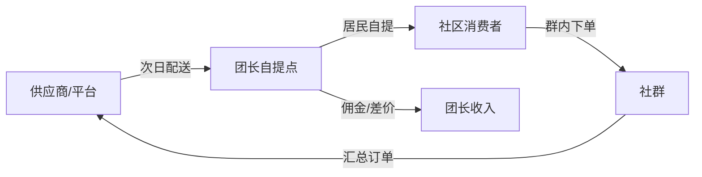
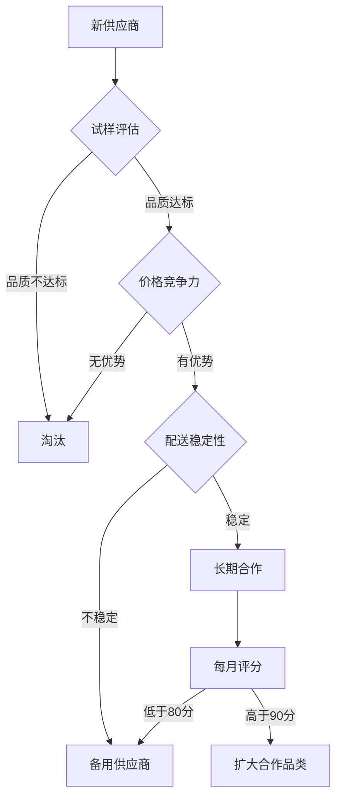

## 案例六：社群团购的本地化运营

社群团购是近年来最接地气的轻创业模式之一——不需要店面、不需要大量资金，靠一个微信群和一套本地化的运营体系，就能实现月入过万。本案例完整还原一位三线城市宝妈从零起步、6个月月入8650元的全过程，涵盖模式选择、冷启动、选品策略、社群运营、利润拆解、进阶扩展和避坑指南，可直接复制到你的社区落地执行。

---

### 一、社群团购的商业本质

#### 1.1 为什么社群团购能成立

社群团购并非简单的"微信群卖货"，它有清晰的商业逻辑支撑：

**成本结构优势**：传统零售的商品从工厂到消费者手中，需要经过经销商、批发商、零售商等多个环节，每一层都加价15%-30%。社群团购通过"预售+集单+自提"的模式，砍掉了中间环节：

| 环节 | 传统零售 | 社群团购 | 节省比例 |
|------|---------|---------|---------|
| 经销商加价 | 15%-20% | 无 | 省15%-20% |
| 门店租金分摊 | 10%-15% | 几乎为零（家庭自提点） | 省10%-15% |
| 末端配送成本 | 5%-8% | 居民自提 | 省5%-8% |
| 损耗成本 | 8%-12% | 预售制，按需采购 | 省5%-8% |

这些节省的成本，一部分让利给消费者（价格比超市便宜20%-30%），一部分作为团长佣金/差价（毛利率8%-45%），形成三方共赢。

**社交信任机制**：行为经济学中的"社会证明"（Social Proof）效应在社群团购中体现得淋漓尽致——当群里有人晒单说"今天的脐橙又甜又便宜"，其他人的购买意愿会显著提升。这种基于熟人关系的信任链，比任何广告都有效。

**碎片化时间变现**：团长的运营时间高度碎片化，每天3-4小时即可覆盖核心工作（选品、推品、处理售后、整理订单），非常适合宝妈、退休人员、自由职业者等时间灵活的群体。

#### 1.2 社群团购与其他模式的本质区别

| 维度 | 传统电商 | 直播带货 | 社群团购 | 社区便利店 |
|------|---------|---------|---------|-----------|
| 流量来源 | 平台分配（需付费购买） | 粉丝+平台推荐 | 私域熟人关系 | 地理位置自然客流 |
| 获客成本 | 5-50元/人 | 3-20元/人 | 0.5-3元/人 | 0（但有固定租金） |
| 复购驱动 | 价格+算法推荐 | 主播人设+限时优惠 | 信任关系+品质口碑 | 便利性+习惯 |
| 资金门槛 | 高（备货+推广） | 高（设备+投流） | 低（500-3000元） | 高（租金+装修+进货） |
| 适合人群 | 有运营经验者 | 有表现力/供应链者 | 有社交资源的普通人 | 有资金+选址能力者 |

#### 1.3 行业规模与趋势

社区团购市场在经历2020-2022年的"百团大战"后，进入精细化运营阶段。美团优选、多多买菜、淘宝买菜三大平台覆盖全国大部分县市，但三四线城市和县域市场的渗透率仍低于30%，存在大量机会空间。平台补贴退潮后，团长的核心竞争力从"拼价格"转向"拼服务+拼本地化"，这恰恰是个人团长比平台地推人员更有优势的地方。

---

### 二、案例背景

**人物画像**：刘洁，32岁，三线城市（湖北宜昌）全职宝妈，有两个孩子（3岁和6岁），此前从事超市收银员工作，离职后无固定收入来源。丈夫在本地工厂上班，家庭月收入约6000元，经济压力较大。

**入局契机**：2023年初，刘洁在小区业主群看到有人分享社区团购链接，注意到该平台（美团优选）在本地的团长佣金为订单金额的10%-15%。她所在小区有约1200户住户，周边1公里内还有4个中型小区，总户数约4000户。她判断这是一个可以利用碎片化时间操作的副业。

**起步资源**：一部智能手机、一个闲置的储物间（约15平方米，位于小区一楼）、2000元启动资金（用于购买简易货架和首批自采商品试样）。

---

### 三、市场分析与模式选择

#### 3.1 社群团购的核心商业模式

社群团购的核心逻辑是"预售+集单+自提"：团长在社区内建立微信群，每日推送商品链接，居民下单后由平台或供应商次日配送至团长自提点，居民自行取货。平台/供应商省去了末端配送成本，将节省的费用以佣金形式分给团长。



#### 3.2 三种主流模式对比

| 维度 | 平台团长模式 | 自采自销模式 | 混合模式 |
|------|------------|------------|---------|
| 代表 | 美团优选、多多买菜、淘宝买菜 | 自己对接供应商，群内开团 | 平台带货+自采爆款 |
| 启动资金 | 几乎为零 | 2000-5000元 | 1000-3000元 |
| 毛利率 | 8%-15%（佣金） | 25%-45%（差价） | 15%-30%（综合） |
| 运营难度 | 低，平台负责供应链 | 高，需自行选品、采购、售后 | 中等 |
| 风险 | 低，无库存压力 | 中，有滞销损耗风险 | 中低 |
| 适合人群 | 新手、时间有限者 | 有供应链资源者 | 有一定经验的团长 |

**刘洁的选择**：采用混合模式——以美团优选和多多买菜作为基础品（生鲜果蔬、日用百货），同时自采本地特色品（如宜昌脐橙、土家腊肉、手工豆丝等）作为高利润补充品。

#### 3.3 为什么"本地化"是关键

很多团长犯的一个错误是照搬平台默认推品，忽略本地消费习惯。本地化运营的核心差异体现在三个层面：

- **选品本地化**：宜昌人爱吃腊货、豆制品、河鲜，这些品类复购率远高于标准化零食
- **价格带本地化**：三线城市客单价通常在15-35元，远低于一二线城市的40-80元
- **社交方式本地化**：方言沟通、熟人关系维护、线下见面打招呼，这些"人情味"是大平台无法复制的护城河

---

### 四、冷启动：从0到200人的社群搭建（第1-30天）

#### 4.1 第一步：申请成为团长

**平台选择**：刘洁同时注册了美团优选和多多买菜两个平台的团长账号。流程如下：

1. 在微信搜索"美团优选团长"小程序，填写个人信息、自提点地址、上传自提点照片
2. 平台审核（通常1-3个工作日），期间可先准备自提点环境
3. 审核通过后，在"多多买菜"APP中同步申请（建议多平台并行，降低单一平台政策变动风险）
4. 两个平台均通过后，各获得一个专属推广链接/二维码

**关键细节**：自提点照片要整洁明亮，即使只是一个小房间也要摆放整齐、灯光充足。平台审核员看到杂乱的环境会降低通过率。

#### 4.2 第二步：建立第一批种子用户

刘洁没有急于拉群，而是用了"地推+信任预热"的策略：

**第一周：线下触达**

- 在小区大门口、快递驿站旁张贴手写海报（非打印版，手写更有亲和力），内容："小区邻居福利群，每天3款特价果蔬，比超市便宜30%，扫码进群"
- 每天下午4-6点（接孩子放学时段）在小区门口摆一个小桌，放几份平台的免费试吃品（平台新团长通常有试吃补贴），让邻居品尝后扫码进群
- 主动和小区物业沟通，争取在业主公告栏张贴信息（很多物业不反对，但需要打个招呼）

**第二周：口碑裂变**

- 前50名群成员每人下单后，赠送一个橙子或一把小葱（成本0.5-1元/人）
- 设置"老带新"机制：邀请1位邻居进群并下单，邀请者获得2元红包
- 在群内发起"今日开箱"活动：鼓励收到货的邻居拍照分享，分享者获得下一次订单减免1元

**第三周：稳定输出**

- 每天固定时间（早上7:30）推送当日开团商品，附上实拍图和简短推荐语
- 每天晚上8点推送"明日预告"，制造期待感
- 周末推出"家庭套餐"（如一周蔬果包、火锅食材包），客单价从20元提升到45元

**第30天结果**：社群成员218人，日均下单量35-40单，日均佣金收入约80-120元。

#### 4.3 自提点布置

刘洁将闲置储物间改造为自提点，关键布置如下：

| 区域 | 配置 | 成本 | 用途 |
|------|------|------|------|
| 货架区 | 4层铁质货架×2组 | 280元 | 存放当日到货商品，按订单号分区摆放 |
| 冷藏区 | 小型冰箱1台（二手） | 200元 | 存放需冷藏的肉类、乳制品 |
| 取货台 | 折叠桌1张 | 80元 | 居民取货时核对订单、扫码确认 |
| 自采品展示区 | 1.2米展柜 | 150元 | 摆放自采的本地特产，促进连带消费 |
| 标识牌 | 亚克力门牌+群二维码 | 60元 | 门口悬挂，方便新住户发现 |

总投入约770元，属于一次性投入，后续只需补充耗材。

---

### 五、选品策略：本地化选品的四个维度

选品是社群团购的核心竞争力。刘洁建立了自己的选品矩阵，按四个维度筛选商品：

#### 5.1 价格优势维度

商品必须比周边超市/菜市场有明显价格优势（至少便宜15%-20%），否则用户没有理由改变购买习惯。

**平台品选择逻辑**：

- 每天早上7点打开美团优选和多多买菜的"今日爆品"页面
- 筛选标准：单价<10元、历史好评率>95%、本地仓有货
- 重点品类：鸡蛋（引流品，几乎每天必推）、时令蔬菜（利润率高）、应季水果
- 对比周边超市价格，只推有明确价格优势的商品

**自采品选择逻辑**：

- 每周去本地批发市场（宜昌三峡物流园）1-2次，考察当季低价货源
- 优先选择：保质期长（干货、腌制品）、毛利高（40%以上）、不易在平台买到的品类
- 典型案例：宜昌秭归脐橙上市季（10月-次年2月），刘洁直接联系果园，以1.8元/斤的价格拿货，在群内以3.5元/斤开团，扣除损耗后毛利率约40%

#### 5.2 复购频率维度

将商品分为四类，按复购频率制定推品节奏：

| 类型 | 复购周期 | 典型商品 | 推品频率 | 定价策略 |
|------|---------|---------|---------|---------|
| 引流品 | 3-7天 | 鸡蛋、豆腐、豆芽 | 每周2-3次 | 微利或平价，用于拉新留存 |
| 刚需品 | 7-14天 | 米面粮油、调味品 | 每周1-2次 | 正常毛利15%-20% |
| 利润品 | 14-30天 | 本地特产、进口水果 | 每周1次 | 高毛利30%-45% |
| 季节品 | 按季 | 粽子、月饼、脐橙 | 季节性 | 旺季高毛利，淡季不下架（预售） |

#### 5.3 本地偏好维度

刘洁通过三个渠道了解本地居民偏好：

1. **群内投票**：每月做一次"你最想在群里买到什么"投票，用微信群投票功能
2. **取货闲聊**：居民取货时主动聊天，记录他们提到的需求（"你这里有没有卖XX的？"）
3. **数据复盘**：每周统计订单数据，找出复购率最高的Top 10商品和退货率最高的Bottom 5商品

**宜昌本地特色选品示例**：

- 腊肉腊肠（冬季爆款，单团最高卖出180斤）
- 手工豆丝（本地传统食品，几乎每家都吃）
- 清江鱼干（远安特产，送礼场景需求大）
- 五峰茶叶（本地茶农直供，毛利50%以上）
- 三峡苕酥（零食类，适合办公室人群）

#### 5.4 供应链稳定性维度

自采品最怕的是断货或品质不稳定。刘洁建立了供应商评估体系：



评分标准（满分100）：

- 品质一致性（30分）：每次到货品质是否稳定
- 价格竞争力（25分）：与市场均价的差异
- 配送准时率（20分）：约定时间±30分钟内到达
- 缺货率（15分）：承诺供货后是否频繁缺货
- 售后配合度（10分）：出现品质问题时的退换态度

---

### 六、社群运营：从"卖货群"到"生活圈"

#### 6.1 社群日常运营节奏

刘洁将每天的运营拆解为固定时间线：

| 时间 | 动作 | 目的 |
|------|------|------|
| 7:00 | 检查平台当日爆品，筛选3-5款推品 | 选品把关 |
| 7:30 | 发布"今日好物"消息（图片+价格+推荐理由） | 触发下单 |
| 10:00 | 分享一条生活小贴士（育儿/美食/天气） | 维持群活跃 |
| 12:00 | 补发一次商品提醒（针对未下单的高意向商品） | 二次触达 |
| 15:00 | 公布当日订单统计（"今天XX已经被抢了50份"） | 制造紧迫感 |
| 17:00 | 提醒取货时间，发布明日预告 | 物流通知+预期管理 |
| 20:00 | 处理售后问题，回复私信 | 服务保障 |
| 21:30 | 发布次日自采品预售（如有） | 预售锁单 |

**关键原则**：每天群消息控制在5-8条，不能刷屏。消息格式统一：标题+实拍图+价格+一句话推荐+下单链接。

#### 6.2 群规与氛围管理

**群规模板**（入群自动发送）：

```text
欢迎加入【XX小区邻里福利群】🎉

本群每天分享性价比超高的生鲜果蔬和日用品
比超市便宜20%-30%，次日到自提点取货

📌 群规：
1. 下单链接每天7:30准时发布
2. 取货时间：下午4:00-8:00
3. 有任何问题请私信群主，24小时内处理
4. 欢迎晒单、推荐好物、分享美食做法
5. 禁止广告、政治、不良信息
```

**氛围维护技巧**：

- 培养3-5个"铁粉"（通常是热心阿姨），她们会在群里主动互动、回答新人问题
- 每周做一次"美食分享"活动，鼓励居民分享用团购食材做的菜，优秀作品奖励5元红包
- 遇到投诉时，第一时间在群里公开回应（"亲，你反馈的问题我已经联系供应商了，马上给你处理"），展示负责态度

#### 6.3 用户分层与精细化运营

刘洁用Excel表格对用户进行分层管理：

| 层级 | 定义 | 数量占比 | 运营策略 |
|------|------|---------|---------|
| S级 | 月下单>15次，月消费>300元 | 8% | 专属福利群，优先通知爆品，生日送小礼品 |
| A级 | 月下单8-15次，月消费150-300元 | 22% | 定期私信推荐新品，参与选品投票 |
| B级 | 月下单3-7次，月消费50-150元 | 35% | 推送引流品，用低价刺激复购 |
| C级 | 月下单<3次 | 35% | 沉默用户激活，发送"好久没见你"关怀消息 |

#### 6.4 推品话术模板

好的推品消息不是简单的"今天有XX，要的扣1"，而是要给用户一个下单的理由。刘洁总结了一套万能话术结构：

**公式**：场景引入 + 产品亮点 + 价格对比 + 行动指令

```text
🍎 今日好物：秭归伦晚脐橙

刚从果园拉回来的，皮薄汁多，甜度很高
我家二宝一口气吃了三个，比超市那种打了蜡的好吃太多

超市价：6.8元/斤
群友价：3.5元/斤（5斤起，约17.5元一箱）

👉 点链接下单，明天下午4点自提点取
今天限量80份，手慢无~
```

**不同品类的话术重点**：

- 生鲜类：强调新鲜度、产地、口感（"今早刚到的"、"果园直发"）
- 日用品：强调性价比、囤货理由（"这个价格比双11还便宜"、"保质期12个月，囤着不亏"）
- 本地特产：强调稀缺性、送礼场景（"过年走亲访友必备"、"外地买不到"）
- 季节品：强调时令性、错过等一年（"就这一个月，过了就没了"）

---

### 七、利润模型与数据复盘

#### 7.1 收入结构拆解

刘洁运营6个月后的稳定收入结构（月均数据）：

| 收入来源 | 月均金额 | 占比 | 说明 |
|---------|---------|------|------|
| 平台佣金（美团优选） | 2800元 | 32% | 佣金率10%-12%，以生鲜为主 |
| 平台佣金（多多买菜） | 1800元 | 21% | 佣金率8%-10%，以日用品为主 |
| 自采品差价 | 3200元 | 37% | 本地特产，毛利率35%-45% |
| 平台活动奖励 | 500元 | 6% | 冲单奖励、拉新奖励 |
| 其他（广告、代购） | 350元 | 4% | 本地商家合作推广 |
| **合计** | **8650元** | **100%** | - |

**成本结构**：

| 成本项 | 月均金额 | 说明 |
|--------|---------|------|
| 自采品进货成本 | 约4200元 | 以实际售价计算已扣除 |
| 损耗成本 | 约300元 | 生鲜损耗率约3%-5% |
| 包装耗材 | 约150元 | 塑料袋、泡沫箱等 |
| 交通/油费 | 约200元 | 去批发市场采购 |
| 红包/赠品 | 约300元 | 用户维护成本 |
| **成本合计** | **约5150元** | - |
| **净利润** | **约3500元** | 平台佣金部分无额外成本 |

> 注：上述成本计算中，自采品进货成本4200元对应的是自采品收入3200元加上损耗等分摊后的总进货支出。平台佣金部分无额外进货成本，佣金即为毛利。实际净利润为平台佣金（4600元）+ 自采品差价（3200元）- 自采进货成本及运营成本（约5150元）= 约2650-3500元，取决于当月损耗和赠品支出。

#### 7.2 关键运营指标

刘洁每周复盘以下核心指标：

- **群转化率**：当天下单人数/群总人数，健康值>15%，刘洁稳定在18%-22%
- **客单价**：平均订单金额，目标>25元，刘洁通过"满30减2"提至28元
- **复购率**：7日内再次下单比例，健康值>40%，刘洁通过品类丰富度维持在55%
- **退货率**：退款订单/总订单，健康值<5%，刘洁控制在2.5%
- **用户活跃度**：7日内有互动行为的用户比例，健康值>30%

**数据复盘模板**（每周日晚填写）：

```text
📊 本周数据复盘（X月X日-X月X日）

总订单数：___单（上周___单，环比___%）
总营收：___元（上周___元，环比___%）
新增用户：___人（退群___人，净增___人）
客单价：___元
复购率：___%

TOP 5 热销品：________________
BOTTOM 3 滞销品：______________
下周调整计划：________________
```

#### 7.3 财务目标达成路径

刘洁的实际增长曲线：

```text
第1月：日均订单20单，月收入约1200元（冷启动期）
第2月：日均订单38单，月收入约2400元（口碑积累期）
第3月：日均订单55单，月收入约3800元（增长加速期）
第4月：日均订单72单，月收入约5200元（稳定增长期）
第5月：日均订单88单，月收入约6800元（自采品发力）
第6月：日均订单105单，月收入约8650元（成熟运营期）
```

**增长拐点分析**：第3个月是关键拐点——此时用户信任度建立完成，口碑裂变开始生效，自采品供应链初步稳定。前两个月的低收入期是最容易放弃的阶段，也是大多数人失败的原因。

---

### 八、进阶策略：从单点到体系

#### 8.1 多群矩阵运营

当单个群的用户超过300人时，消息触达率会下降（微信群超过200人后，活跃度会显著降低）。刘洁在第4个月开始拆分群：

- **主群（A群）**：280人，覆盖小区1-3栋，日常推品群
- **B群**：180人，覆盖小区4-6栋，同样运营节奏
- **VIP群**：45人，S级和A级用户，推高毛利商品和预售品
- **闲聊群**：120人，纯生活交流群（育儿、装修、二手置换），不定期插入团购信息

**关键原则**：拆群不是复制，而是差异化运营。VIP群推品更少但利润更高，闲聊群重在维护关系。

#### 8.2 与本地商家合作

刘洁在第5个月开始与本地商家合作，拓展收入来源：

- **本地餐饮店**：帮餐厅在群内推优惠券，每张核销收取2元推广费
- **水果店**：与小区旁水果店合作，帮他清滞销库存（以批发价拿货，团购价卖出，水果店省去损耗，刘洁赚差价）
- **家政/维修**：在群内推荐靠谱的水电维修、保洁阿姨，收取信息服务费50-100元/单
- **培训机构**：帮本地幼儿兴趣班发体验课信息，每个报名收取30元佣金

#### 8.3 从团购团长到社区KOL

6个月后，刘洁在小区已经建立了信任度和影响力。她开始尝试：

- **短视频内容**：在抖音发布"10元搞定一家三口晚餐"系列视频，用团购食材拍摄，既做内容又做推广
- **社区活动**：联合物业组织"邻里美食节"，群友用团购食材做菜参赛，增强社区归属感
- **私域电商**：在微信小程序搭建自己的微店，上架高毛利自采品，脱离平台限制

#### 8.4 带教与规模化复制

刘洁在第10个月开始将经验系统化，带教其他想做社群团购的人：

- **带教内容**：平台注册流程、选品方法论、社群运营SOP、供应商开发技巧、数据分析方法
- **收费模式**：每人3000元带教费，包含1个月的陪跑指导（每天30分钟语音答疑）
- **带教成果**：2个学员在相邻小区成功复制，首月收入均超过2000元
- **额外价值**：学员之间可以共享供应商资源，联合采购降低成本

---

### 九、常见误区与避坑指南

#### 9.1 新手团长最容易犯的8个错误

| 错误 | 后果 | 正确做法 |
|------|------|---------|
| 一开始就追求群人数 | 低质量用户拉低转化率 | 先做50个精准用户，再通过裂变扩展 |
| 只推平台品不做自采 | 佣金率低，月收入天花板约3000元 | 第2个月开始尝试自采，从小量测试 |
| 不控制推品数量 | 每天推20+商品，用户选择困难 | 每天精选5-8款，每款都写推荐理由 |
| 售后不及时 | 一个差评在群内扩散，信任崩塌 | 30分钟内响应，先赔付再追责 |
| 忽视线下关系 | 纯线上运营缺乏温度 | 取货时笑脸相迎、记住常客名字 |
| 盲目低价竞争 | 毛利被压到不可持续 | 强调"性价比"而非"最低价" |
| 不做数据复盘 | 凭感觉选品，反复踩坑 | 每周统计TOP商品和滞销品，优化选品 |
| 急于扩展多个小区 | 精力分散，服务品质下降 | 先把一个小区做到极致，再复制模式 |

#### 9.2 供应链风险防控

**自采品损耗控制**：

- 生鲜类（蔬菜、水果）：采用预售制，先收款再采购，零库存风险
- 腌制品（腊肉、腊肠）：小批量进货（每次50-100斤），测试销售速度后再加大
- 干货类（茶叶、豆丝）：保质期长，可适当备货，但不超过2周销量
- 通用规则：任何新品首次进货不超过200元，卖完再补

**平台政策风险**：

- 不依赖单一平台，同时运营2-3个平台
- 保留用户微信群（平台无法夺走你的私域流量）
- 当平台降低佣金时，加大自采品比例作为缓冲

#### 9.3 危机处理预案

社群团购运营中难免遇到突发情况，提前准备好应对方案：

**场景一：大面积品质投诉**

- 触发条件：同一商品收到3个以上投诉
- 处理流程：① 立即在群内公开致歉 ② 承诺无条件退款 ③ 联系供应商追责 ④ 当天暂停该商品销售 ⑤ 次日公布处理结果
- 预防措施：新品先自购试用，确认品质后再推给群友

**场景二：平台突然降佣**

- 触发条件：佣金率下调超过3个百分点
- 应对策略：① 加大自采品比例（从当前30%提升到50%） ② 开发更多本地商家合作 ③ 启动微店小程序作为备选渠道
- 预防措施：始终维持自采品占比不低于30%

**场景三：竞争对手入局**

- 触发条件：同小区出现其他团长
- 应对策略：① 不打价格战 ② 强化服务差异化（如免费切配、食谱推荐） ③ 增加独家自采品 ④ 通过社区活动巩固关系
- 预防措施：持续提升服务品质，建立口碑壁垒

#### 9.4 合规注意事项

- **食品安全**：自采食品必须索要供应商的营业执照和食品经营许可证复印件，至少保留1年。涉及散装食品的，需确保供应商有食品生产许可证（SC认证）
- **税务合规**：年收入超过12万元需进行个税申报；自采品收入属于经营所得，建议在年收入超过5万元时咨询当地税务局。平台佣金部分通常由平台代扣代缴个税
- **消费者权益**：明确告知团购商品的售后政策（48小时内反馈问题、凭照片退换）
- **平台规则**：仔细阅读各平台的团长协议，了解违规行为（如私自加价、截留订单）的处罚条款

---

### 十、实用工具与技术配置

#### 10.1 必备工具清单

| 工具类型 | 推荐工具 | 用途 | 成本 |
|---------|---------|------|------|
| 订单管理 | 微信接龙/群报数小程序 | 收集订单、统计数量 | 免费 |
| 数据记录 | Excel/WPS表格 | 记录每日订单、用户分层、财务数据 | 免费 |
| 图片编辑 | 醒图/美图秀秀 | 制作推品海报、商品实拍美化 | 免费 |
| 群管理 | 微伴助手/企业微信 | 自动欢迎语、关键词回复、数据统计 | 免费-30元/月 |
| 记账 | 随手记/微信记账小程序 | 记录收支、生成月度报表 | 免费 |
| 供应链 | 微信+电话 | 与供应商沟通、确认订单 | 免费 |

#### 10.2 推品消息制作流程

**Step 1：拍照**——自然光下拍摄，突出商品细节（如脐橙的切面、腊肉的纹理），避免过度滤镜

**Step 2：编辑图片**——添加价格标签和简短卖点文字，图片尺寸建议1:1正方形（微信群展示效果最好）

**Step 3：撰写文案**——按照"场景引入+产品亮点+价格对比+行动指令"的公式

**Step 4：添加下单链接**——平台品直接用平台生成的链接，自采品用微信接龙或群报数小程序

**Step 5：定时发送**——用手机闹钟提醒自己在固定时间发送，保持节奏一致

#### 10.3 简易记账模板

```text
日期 | 商品名称 | 平台/自采 | 进货价 | 售出价 | 数量 | 营收 | 成本 | 毛利
-----|---------|----------|--------|--------|------|------|------|-----
6/1  | 脐橙5斤 | 自采     | 9元    | 17.5元 | 35份 | 612  | 315  | 297
6/1  | 鸡蛋30枚| 美团     | -      | 18.9元 | 42份 | 794  | -    | 95
```

每周汇总一次，计算各品类的毛利率和销售占比，指导下周选品。

---

### 十一、可复制的SOP模板

#### 11.1 新团长30天启动清单

**第1周：准备阶段**

- [ ] 调研本小区及周边小区的户数、入住率、消费水平
- [ ] 选择1-2个平台申请成为团长
- [ ] 布置自提点（货架、冰箱、标识牌）
- [ ] 准备入群话术和群规
- [ ] 准备推品话术模板（至少3套）

**第2周：种子用户期**

- [ ] 通过地推（海报、试吃、电梯广告）招募50人进群
- [ ] 每天固定时间推品3-5款
- [ ] 执行"老带新"裂变机制
- [ ] 记录每日订单数据

**第3周：增长期**

- [ ] 群人数突破100人
- [ ] 尝试第一款自采品（从保质期长的干货开始）
- [ ] 建立3-5个核心铁粉用户
- [ ] 优化推品时间和品类

**第4周：稳定期**

- [ ] 群人数突破150人，日均订单30+
- [ ] 完成第一次供应商评估
- [ ] 建立用户分层表格
- [ ] 制定下月增长目标

#### 11.2 每日运营检查清单

```text
□ 7:00  检查平台爆品，选定今日推品5-8款
□ 7:30  发布今日好物消息（图文+价格+链接）
□ 10:00 发布生活类内容（维持活跃）
□ 12:00 补发提醒消息
□ 15:00 更新库存/销量信息
□ 17:00 发布取货提醒+明日预告
□ 20:00 处理售后、回复私信
□ 21:00 记录当日数据（订单数、金额、新增用户）
□ 21:30 如有自采品预售，发布预售信息
```

---

### 十二、经验总结

刘洁从零开始用6个月实现月入8000+的过程，提炼出五条核心经验：

**1. 社群团购的本质是信任生意**

不同于电商平台的流量逻辑，社群团购建立在熟人关系之上。一次品质问题可能导致10个用户流失，而培养10个忠实用户需要一个月。因此，品控和服务是第一优先级，永远高于利润。

**2. 本地化是最大的护城河**

大平台可以复制供应链和价格，但无法复制团长对本地需求的理解。你比平台更清楚宜昌人爱吃什么、什么季节买什么最划算、谁家需要送货上门——这些"小数据"才是核心竞争力。

**3. 自采品决定收入天花板**

纯做平台团长，月收入很难突破5000元。自采品的毛利率是平台佣金的3-4倍，是突破收入天花板的关键。但自采品也有风险，需要从小量测试开始，逐步建立供应链。

**4. 数据驱动而非感觉驱动**

凭感觉选品的结果是反复踩坑。每周复盘一次数据（哪些商品卖得好、哪些卖不动、为什么），用数据指导下周的选品和运营策略，才能持续优化。

**5. 坚持是最大的门槛**

社群团购前两个月的收入可能只有1000-2000元，很多人在这个阶段放弃。但实际上，社群的价值是累积的——用户信任、供应链关系、运营经验都在不断积累。坚持6个月，收入曲线会出现明显的拐点。

刘洁目前（运营第10个月）已将月收入稳定在10000-12000元，并开始培训2个朋友在相邻小区复制她的模式，每人收取3000元的"带教费"，进一步拓展了收入来源。
