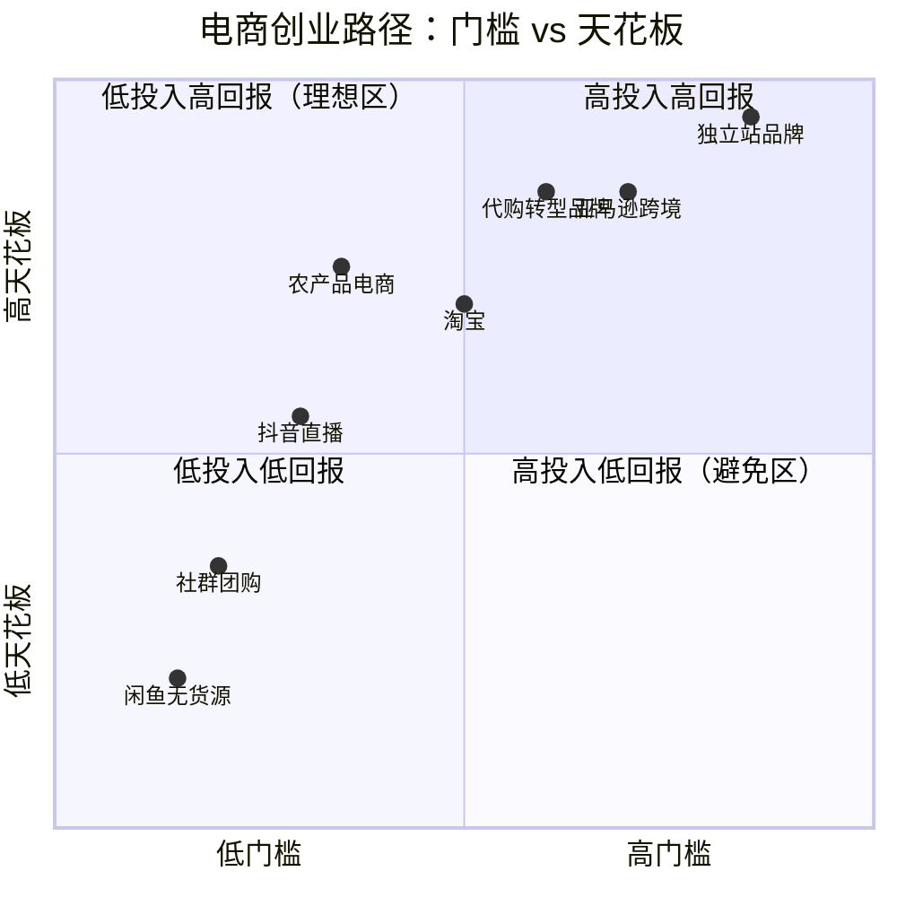
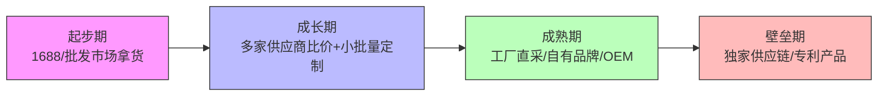
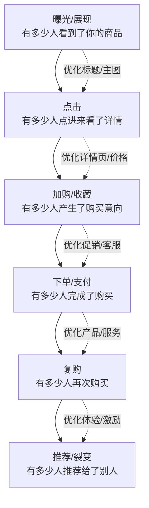
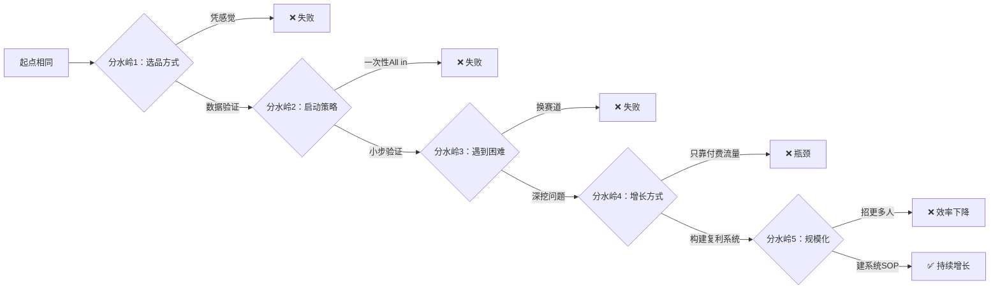
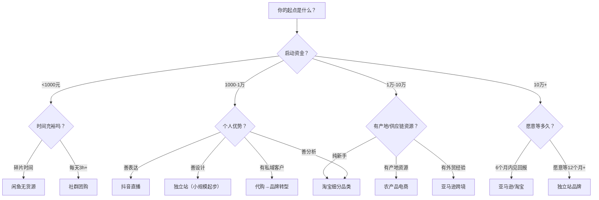

## 案例总结与启示

九个案例覆盖了电商创业的完整光谱——国内平台电商、跨境电商、直播电商、无货源电商、独立站品牌出海、社区团购、代购转型品牌、农产品电商、以及从零到一的全链路品牌构建。每个案例的主角背景不同、资源禀赋不同、选择的赛道不同，但他们走过的路径中存在可提炼的共性规律。本章不是简单罗列"经验总结"，而是从九个真实案例中萃取可复用的认知框架、决策模型和行动清单，帮助你建立自己的电商创业方法论。

### 一、九大案例全景对比

在深入分析之前，先用一张全景表把九个案例的关键变量拉齐，方便横向比较：

| 维度 | 案例一：淘宝 | 案例二：亚马逊 | 案例三：抖音直播 | 案例四：闲鱼 | 案例五：独立站 | 案例六：社群团购 | 案例八：代购转型 | 案例九：农产品电商 |
|------|-------------|---------------|-----------------|-------------|---------------|----------------|----------------|-----------------|
| **主角** | 小张，28岁，运营转型 | 王总，35岁，外贸转型 | 小美，26岁，服装导购 | 小王，26岁，行政岗 | 陈总，32岁，广告创意 | 刘洁，32岁，全职宝妈 | 林晓雯，32岁，前外企行政 | 张明辉，35岁，互联网返乡 |
| **启动资金** | 2万元 | 15万元 | 5000元 | 200元 | 30万元 | 2000元 | 25万元 | 3万元 |
| **品类** | 家居收纳 | 厨房用品 | 女装通勤 | 多品类无货源 | 原创饰品 | 生鲜日用 | 敏感肌护肤品 | 农产品（金银花/百合） |
| **核心能力** | 数据分析+选品 | 供应链+广告投放 | 表现力+选品眼光 | 信息差+执行力 | 品牌设计+内容营销 | 社群运营+本地资源 | 用户洞察+品牌构建 | 产地资源+内容能力 |
| **达到稳定收入** | 12个月 | 18个月 | 6个月 | 3个月 | 24个月 | 4个月 | 24个月 | 6个月 |
| **最终月收入** | 净利润8-10万 | 月销$10万+ | 月销15-20万 | 5000-8000元 | 月销$5万 | 8000-15000元 | 月净利润8-12万 | 年营收2600万 |
| **团队规模** | 2人 | 3人 | 3人 | 1人 | 2人 | 1人 | 6人 | 15人+ |
| **天花板** | 高（可扩品类） | 极高（全球市场） | 中高（依赖主播） | 低（兼职上限） | 极高（品牌壁垒） | 中（地域限制） | 极高（品牌+渠道） | 极高（产业带动） |
| **风险等级** | 中 | 高 | 低 | 极低 | 高 | 低 | 中高 | 中 |

**九个案例的起点差异极大**——从200元到30万，从全职宝妈到互联网老兵，从一线白领到返乡青年。这恰恰说明：电商创业没有"标准画像"，关键在于找到与自身资源禀赋匹配的路径。



从象限图可以清晰看出：闲鱼和社群团购处于"低门槛"区域，适合试水；淘宝和抖音处于中间地带，是大多数人的主战场；亚马逊、独立站和代购转型品牌门槛较高但天花板也最高；农产品电商比较特殊——启动门槛不高（有产地资源即可），但做大后天花板极高（产业带动效应）。

### 二、九个跨案例共性规律

从九个差异化极大的案例中，提炼出七条贯穿始终的底层规律。这些规律不依赖于具体平台或品类，是电商创业的"元认知"。

#### 2.1 规律一：选品决定80%的成败

九个案例无一例外地将选品放在了最重要的位置。小张花两个月做选品调研，王总对厨房用品做了详细的市场规模分析，小美选择女装是因为抖音的视觉展示属性，小王在闲鱼上测试了多个品类才找到利润款，陈总花一个月做品牌定位和品类选择，刘洁从生鲜切入是因为社区消费的高频刚需特征，林晓雯从两年代购数据中提炼出敏感肌护肤的细分机会，张明辉走遍8个乡镇用"四维筛选模型"锁定了金银花和龙牙百合。

**选品的三个验证层级：**

| 层级 | 验证内容 | 验证方法 | 案例体现 |
|------|----------|----------|----------|
| **需求验证** | 这个品类有没有真实需求？ | 搜索量、市场趋势、竞品销量 | 小张用生意参谋看搜索人气；王总分析亚马逊BSR排名；林晓雯回溯500+条客户聊天记录提炼高频痛点 |
| **竞争验证** | 我能不能在这个品类里活下来？ | 竞品数量、头部集中度、差异化空间 | 小张避开标品红海选择收纳细分；陈总用原创设计避开同质化；张明辉利用"中国金银花之乡"的产地标签建立辨识度 |
| **利润验证** | 做这个品类能不能赚钱？ | 成本核算、毛利率计算、广告占比 | 王总严格计算FBA费用后确保30%以上毛利；小王算清闲鱼每单利润；林晓雯对比代购18%毛利和自有品牌55%毛利后坚定转型 |

**常见选品误区：**

- **凭感觉选品**："我觉得这个好卖"是最危险的起点。小张在初期曾想做手机壳，数据调研后发现头部卖家月销50万+、价格战激烈，果断放弃。
- **追逐爆款**：看到别人卖什么火就跟进，等你上架时红利期已过。正确做法是找"需求存在但竞争尚可"的蓝海细分。
- **忽视供应链**：再好的选品，如果找不到靠谱的货源、拿不到有竞争力的价格，也无法持续。小美从1688拿货起步，后期才转向工厂定制。
- **忽视标准化可行性**：张明辉在农产品选品时专门评估了外观一致性、储存稳定性和物流适应性，淘汰了脐橙（易碰伤）和腊肉（外观不统一），选中了金银花（干货、轻便、保质期2年）——产品能不能标准化直接决定了后续运营的难度。
- **只看需求不看政策**：林晓雯注意到2019年《电商法》实施后代购必须注册纳税，政策风险是选品时必须纳入的变量。

#### 2.2 规律二：启动阶段的核心是"验证"，不是"盈利"

九个案例的主角在起步阶段都经历了"小额测试→数据验证→放量投入"的过程。没有人一开始就大规模投入——即使陈总的30万启动资金，也是分阶段投入的；林晓雯的25万转型资金，先花了6个月做配方研发和小批量测试，确认产品力后才投入生产。

**验证阶段的关键动作：**

1. **最小可行测试（MVT）**：用最少的钱测试市场反应。小王在闲鱼用200元启动，小美用3000元首批货款测试抖音直播，张明辉在朋友圈试卖金银花茶第一个月只卖了3200元。
2. **数据收集**：记录每一个动作的结果数据。小张每天花1小时分析生意参谋数据，王总用Excel追踪每个SKU的广告ACoS，林晓雯导出所有微信订单做品类热度分析。
3. **快速迭代**：根据数据调整方向，不要在错误的方向上坚持。小美在直播前两周换了3次选品方向，直到找到通勤女装这个切入点。

**验证阶段的时间框架：**

| 平台类型 | 建议验证周期 | 验证指标 | 放量标准 |
|----------|-------------|----------|----------|
| 淘宝/天猫 | 2-4周 | 点击率>3%，转化率>行业均值 | 自然流量占比>30% |
| 亚马逊 | 4-8周 | 广告ACoS<40%，自然排名进入前3页 | BSR稳定在小类目前100 |
| 抖音直播 | 1-2周 | 场均观看>200人，转化率>2% | 单场GMV稳定破1000 |
| 闲鱼 | 3-7天 | 曝光量>500/天，咨询转化率>10% | 日均出单>2单 |
| 独立站 | 4-8周 | 加购率>3%，ROAS>2 | 复购率>15% |
| 社群团购 | 1-2周 | 群内下单率>20%，客单价>15元 | 日均订单>20单 |
| 代购→品牌 | 3-6个月 | 小批量产品复购率>30%，NPS>50 | 种子用户>200人 |
| 农产品电商 | 2-4周 | 朋友圈/社群复购率>25%，退货率<5% | 月销稳定破5000元 |

**关键认知**：验证阶段不要用"赚了多少钱"来衡量成败，而要用"获得了多少有效数据"来衡量。小王在闲鱼第一个月只赚了800元，但他测试了12个品类、积累了哪些品类转化率高的数据，这些数据的价值远超800元。

#### 2.3 规律三：流量获取的本质是"人货匹配效率"

不同平台的流量机制差异巨大，但底层逻辑一致——平台的算法目标是将最合适的商品推给最可能购买的用户。理解这一点，就知道该把精力放在哪里：

| 平台 | 核心流量来源 | 算法权重因子 | 优化重点 |
|------|-------------|-------------|----------|
| 淘宝 | 搜索+推荐 | 点击率、转化率、DSR评分、销量增速 | 关键词优化、主图点击率、好评维护 |
| 亚马逊 | 搜索+关联推荐 | 相关性、转化率、Review数量与质量 | Listing优化、关键词埋词、评论获取 |
| 抖音 | 推荐+搜索 | 完播率、互动率、转化率、停留时长 | 短视频引流、直播间停留优化 |
| 闲鱼 | 搜索+推荐 | 擦亮频率、标题关键词、账号权重 | 每日擦亮、标题优化、多账号矩阵 |
| 独立站 | 社媒+SEO+广告 | 内容质量、外链数量、广告ROAS | Google SEO、社媒内容、Facebook广告 |
| 社群团购 | 社交裂变+私域 | 开团频率、参团人数、复购率 | 群活跃度维护、爆款日推送、裂变激励 |
| 代购/私域 | 社交推荐+口碑 | 信任度、内容价值、互动频率 | 朋友圈内容规划、1v1关怀、社群分享 |
| 农产品 | 内容+搜索+社交 | 原产地信任、内容真实度、复购数据 | 产地实拍内容、原产地故事、季节性营销 |

**小张的淘宝流量增长路径**很典型：前两个月靠付费推广（直通车）获取初始流量和销量，积累到100+好评后自然搜索流量占比逐步提升到60%，广告费用占比从40%降到15%。这是一个从"花钱买流量"到"靠产品和口碑赚流量"的良性循环。

**张明辉的农产品流量路径**则展示了另一条路：他在抖音发布的"金银花采摘实拍"视频获得180万播放量，没有花一分钱推广费。农产品电商的流量优势在于"内容即产品"——田间地头的真实画面本身就是最好的营销素材，这种内容的信任感是城市直播间无法复制的。

#### 2.4 规律四：复购率是检验商业模式健康度的核心指标

九个案例中，复购率高的案例都展现了更强的盈利能力和可持续性：

| 案例 | 复购率 | 实现方式 | 商业意义 |
|------|--------|----------|----------|
| 淘宝（小张） | 25% | 品类天然复购（收纳用品消耗品属性）+会员体系 | 获客成本被多次购买摊薄 |
| 亚马逊（王总） | 18% | 产品线扩展（厨房用品→家居用品） | 单客户终身价值提升3倍 |
| 抖音（小美） | 35% | 私域沉淀（粉丝群+微信）+定期上新 | 直播间60%流量来自老粉 |
| 闲鱼（小王） | 40% | 优质服务+售后保障+老客转介绍 | 获客成本趋近于零 |
| 独立站（陈总） | 45% | 邮件营销+会员积分+限量新品 | 品牌溢价能力持续增强 |
| 社群团购（刘洁） | 70% | 社区关系+高频刚需+信任背书 | 月均贡献利润占比80% |
| 代购转型（林晓雯） | 55% | 从代购客户中筛选种子用户+产品力驱动 | 转型首年60%营收来自老客户 |
| 农产品（张明辉） | 60% | 季节性上新+会员订阅+社区团购复购 | 预售模式降低库存风险 |

**关键洞察**：复购率最高的三个案例（社群团购70%、农产品60%、代购转型55%）有一个共同点——它们都建立了与消费者的"直接关系"，不依赖平台的流量分配。刘洁靠社区邻里关系，张明辉靠产地故事和品质信任，林晓雯靠从代购时期积累的私域关系。这意味着，无论你做哪个平台，最终都要思考"如何把平台流量转化为自己的私域资产"。

**复购率提升的四个杠杆：**

1. **产品力**：复购的根本原因是产品好。林晓雯的敏感肌护肤品复购率55%，源于她花了6个月做配方研发，产品力远超代购时卖的品牌。
2. **关系维护**：刘洁每天在群里分享菜谱和生活日常，不只是卖货，更是"社区朋友"的身份。
3. **上新节奏**：张明辉按照季节上新（春茶、夏花、秋果、冬腊），每次上新都是一次复购触发点。
4. **会员机制**：陈总的独立站用积分体系和会员专属折扣，将复购率从30%提升到45%。

#### 2.5 规律五：供应链能力决定利润上限

表面上看，电商卖的是商品；本质上，电商卖的是"供应链效率"。同样的商品，谁的采购成本更低、物流更快、品质更稳定，谁就能在竞争中胜出。

**九个案例的供应链进化路径：**



- **小张（淘宝）**：从1688拿货起步，月销破10万后直接联系工厂定制包装，成本降低15%
- **王总（亚马逊）**：利用外贸经验直接对接工厂，比同行采购成本低10%-20%
- **小美（抖音）**：从1688拿货→档口选款→工厂定制，每一步都降低了成本、提升了差异化
- **陈总（独立站）**：与设计师工作室合作开发独家款式，形成产品壁垒
- **林晓雯（代购转型）**：从代购日本品牌→找国内OEM工厂代工→自建研发团队，供应链每升一级，毛利率提升10-15个百分点
- **张明辉（农产品）**：从农户收购→签约合作农户→建立分拣加工中心→取得SC食品生产许可证→建成冷链仓储中心，用4年时间构建了从田间到餐桌的全链路

**林晓雯的供应链升级路径特别值得借鉴**：她没有一步到位建工厂，而是分三步走——第一步找成熟的OEM工厂代工（最小化启动风险），第二步与工厂共建研发团队（掌控配方和品质），第三步自建质检体系（确保批次稳定性）。每一步都建立在上一步验证成功的基础上。

**给新手的建议**：起步阶段不要纠结供应链，用1688或批发市场快速验证产品；当月销稳定在一定规模后，再逐步优化供应链。过早追求"极致供应链"会导致启动成本过高、风险过大。

#### 2.6 规律六：团队扩张的时机和节奏至关重要

九个案例中有七个从单人起步，团队扩张的时机各不相同，但共同遵循一个原则——**用不过来的时候才加人**。

| 案例 | 初始团队 | 加人时机 | 第一个招聘岗位 | 成熟团队 |
|------|---------|---------|---------------|---------|
| 淘宝 | 1人 | 月销破15万，发货和客服忙不过来 | 客服 | 2人（运营+客服） |
| 亚马逊 | 1人 | SKU扩到6个，广告管理复杂化 | 运营助理 | 3人（运营+客服+物流） |
| 抖音 | 1人 | 日播6小时体力不支 | 助播 | 3人（主播+助播+运营） |
| 独立站 | 1人 | 需要持续产出内容和管理广告 | 内容运营 | 2人（创始人+运营） |
| 社群团购 | 1人 | 订单量日均50+，分拣和配送忙不过来 | 分拣员 | 1-2人 |
| 代购转型 | 1人 | 自有品牌上线后订单超出单人处理能力 | 客服+仓储 | 6人（研发+运营+客服+仓储） |
| 农产品 | 1人 | 年销破120万后需要加工和品控 | 分拣加工员 | 15人+（含加工、品控、物流） |

**团队扩张的三个警惕信号：**

1. **你每天的工作超过12小时且有明确的重复性任务可以外包**——招人的信号
2. **你的收入已经稳定3个月以上**——说明业务模型成立，可以投入人力
3. **有明确的ROI计算**——招一个人能带来多少增量收入，如果不能回答这个问题，就不要招

**反面教训**：过早招人是新手最常见的错误之一。团队成本（工资+社保+管理成本）是刚性支出，而电商收入是波动的。小张在月销破15万之前一直单人运营，虽然辛苦但保证了现金流安全。

**林晓雯的团队扩张节奏值得学习**：她在代购阶段一直保持1人运营，直到自有品牌产品验证成功、月销稳定在8万后才开始招人。第一个招的不是运营而是客服——因为客服是直接接触用户的岗位，她需要把"用户洞察"这个核心能力通过客服传递给团队。之后才依次招了仓储、运营和研发人员。

#### 2.7 规律七：数据驱动是持续优化的唯一路径

九个案例的主角都有一个共同习惯——**每天花固定时间看数据**。不是笼统地看"生意好不好"，而是拆解到具体的指标层级。

**电商运营的核心数据漏斗：**



**各环节的关键指标和优化方向：**

| 环节 | 核心指标 | 健康基准 | 优化手段 |
|------|----------|----------|----------|
| 曝光→点击 | 点击率（CTR） | 淘宝>3%，亚马逊>0.5% | 主图A/B测试、标题关键词优化 |
| 点击→加购 | 加购率 | 淘宝>8%，独立站>3% | 详情页卖点提炼、价格锚定 |
| 加购→下单 | 支付转化率 | 淘宝>5%，亚马逊>10% | 限时促销、客服催付、评价管理 |
| 下单→复购 | 复购率 | >20%为健康 | 会员体系、新品推送、售后关怀 |
| 复购→推荐 | 推荐率 | >10%为优秀 | 老带新奖励、社交分享激励 |

**数据驱动的实操要点**：不是"看了数据"就够了，关键是"看了数据后做了什么"。小张的日常习惯是：每天早上花30分钟看前一天的数据，找出"异常值"——某款产品点击率突然下降，立刻排查主图和价格是否被竞品超越；某款产品转化率异常高，立刻加大广告投放。这种"数据→洞察→行动"的闭环，才是数据驱动的真正含义。

### 三、成功者与失败者的分水岭

知道"怎么做对"很重要，但理解"为什么会做错"同样关键。基于九个案例的观察和电商行业的普遍规律，总结出成功者与失败者之间的核心差异。

#### 3.1 五个关键分水岭



**分水岭一：选品方式——凭感觉 vs 数据驱动**

失败者的典型路径：看到某个产品"好像很火"→直接进货→上架后发现竞争激烈/需求不足→积压库存→亏损退出。

成功者的路径：用数据工具调研搜索量和竞争度→分析竞品的差评找改进空间→小批量测试→数据验证后放量。

**分水岭二：启动策略——All in vs 小步快跑**

小王用200元起步、小美用3000元首批货款测试、张明辉在朋友圈先试卖一个月。他们的共同点是：用最小的成本获取最大的市场信息。失败者往往是"看好一个方向就倾其所有"，一旦判断失误就无力回天。

**分水岭三：遇到困难时——换赛道 vs 深挖问题**

这是最致命的分水岭。很多人在遇到困难时的本能反应是"这个赛道不行，换一个"，却不知道困难本身恰恰是筛选掉竞争对手的门槛。陈总的独立站前12个月几乎没有明显回报，但他坚持内容营销和品牌调性，从第13个月开始爆发。如果他在第6个月"换赛道"，就永远等不到那一天。

**分水岭四：增长方式——付费流量依赖 vs 复利系统构建**

只靠付费流量的卖家，利润永远被广告费挤压。成功的卖家都在构建"复利系统"：小张的自然流量占比从30%提升到60%，小美的直播间60%流量来自老粉，刘洁的社群团购获客成本趋近于零。

**分水岭五：规模化路径——加人 vs 建系统**

王总在月销突破$5万后，花了两周时间把所有运营流程写成SOP文档，新员工入职后看文档就能上手80%的工作。而失败的规模化往往是"招一堆人，每个人凭自己的理解做事"，效率不升反降。

#### 3.2 九个案例中体现的"反模式"

以下是九个案例主角在创业过程中踩过的坑，以及他们如何爬出来的：

| 反模式 | 表现 | 案例教训 | 正确做法 |
|--------|------|----------|----------|
| 完美主义陷阱 | 产品/店铺反复修改不上线 | 小美最初纠结直播间布景两周 | 先上线70%版本，用市场反馈指导优化 |
| 虚假繁荣 | 刷单/亏本冲量制造虚假销量 | 王总提到一位卖家因刷单被封号 | 用真实数据驱动增长，即使慢一点 |
| 品类漂移 | 什么都想卖，没有核心品类 | 小王在闲鱼初期测试了12个品类后才聚焦 | 测试期可以广，验证后必须聚焦 |
| 现金流幻觉 | 把纸面利润当成可用现金 | 王总月销$6万时差点交不起房租 | 严格区分"纸面利润"和"可用现金" |
| 供应链赌博 | 把所有鸡蛋放在一个供应商篮子里 | 小美的一家供应商突然涨价20% | 至少保持2-3家备选供应商 |
| 规模化幻觉 | 以为"更多人=更好结果" | 过早招人导致固定成本飙升 | 系统建立之前不加人 |

### 四、不同阶段的关键决策模型

电商创业不是一条直线，而是一系列阶段性的决策点。基于九个案例的经验，总结出每个阶段的核心决策和常见陷阱。

#### 4.1 冷启动期（0-3个月）：活下来比什么都重要

**核心目标**：验证产品可行性，实现"从0到1"的突破。

**关键决策清单：**

- [ ] 选品是否经过数据验证（而非直觉）？
- [ ] 启动资金是否足够支撑3个月的运营+试错？
- [ ] 是否准备了至少2-3个备选品类？
- [ ] 是否了解平台的基本规则和红线？
- [ ] 是否建立了数据记录和分析的习惯？

**常见致命错误：**

1. **一次性投入全部资金进货**。小张的忠告是"第一批货只进预期销量的60%，宁可断货也不要压库存"。王总第一批只发了3个SKU到FBA仓库，每个SKU只发200件。
2. **忽视平台规则**。王总提到一位卖家朋友因为不了解亚马逊的"关联账号"政策，一个账号被封导致全部库存冻结，损失超过10万元。
3. **过早追求完美**。小美在开播第一天用的是手机前置摄像头+台灯，画面质量一般，但她的真诚和专业知识打动了观众。先跑起来，再优化细节。
4. **忽视合规资质**。张明辉在农产品电商初期没有SC食品生产许可证，只能卖初级农产品，利润空间受限。后来取得SC证后可以做深加工，利润率提升了15个百分点。

#### 4.2 增长期（3-12个月）：建立可复制的增长模型

**核心目标**：找到稳定的流量来源和转化路径，建立可复制的运营SOP。

**关键决策清单：**

- [ ] 是否找到了至少一个稳定的流量渠道？
- [ ] 核心转化指标（点击率、转化率）是否达到行业均值？
- [ ] 是否建立了标准化的运营流程（上新、推广、客服、售后）？
- [ ] 供应链是否稳定？是否有备选供应商？
- [ ] 利润率是否覆盖了所有成本并有合理盈余？

**增长期的核心策略——"放大赢家"：**

小张在增长期做了一件非常聪明的事：他把80%的推广预算集中在转化率最高的3个SKU上，而不是均匀分配给所有产品。结果这3个SKU贡献了60%的总销售额，同时带动了其他产品的自然流量。

**"放大赢家"的操作框架：**

| 步骤 | 动作 | 工具/方法 |
|------|------|----------|
| 1. 识别赢家 | 找出转化率TOP3的产品 | 平台后台数据、ERP系统 |
| 2. 加大投入 | 增加广告预算、优化Listing | 直通车/SP广告加预算 |
| 3. 丰富关联 | 用赢家产品带动其他产品 | 套装销售、满减活动、关联推荐 |
| 4. 复制经验 | 把赢家的选品逻辑应用到新品 | 选品清单模板化 |

#### 4.3 规模化期（12个月+）：从个人能力到系统能力

**核心目标**：建立不依赖个人的运营体系，实现可持续增长。

**关键转变：**

| 维度 | 增长期（个人驱动） | 规模化期（系统驱动） |
|------|-------------------|---------------------|
| 决策方式 | 老板凭经验拍板 | 数据看板驱动决策 |
| 运营流程 | 口口相传、手把手教 | SOP文档化、培训体系 |
| 供应链 | 单一供应商 | 多供应商+备选方案 |
| 产品策略 | 爆款思维 | 产品矩阵（引流款+利润款+形象款） |
| 团队管理 | 全能选手 | 分工明确、KPI考核 |
| 客户资产 | 平台流量依赖 | 私域+会员体系+品牌认知 |

**王总的亚马逊规模化经验**值得借鉴：他在月销突破$5万后，花了两周时间把所有运营流程写成了SOP文档——从选品评估表、Listing上架模板、广告投放策略到客服话术模板，新员工入职后看文档就能上手80%的工作。

**林晓雯的品牌规模化经验**提供了另一个视角：她的SOP不仅包括运营流程，还包括"品牌调性指南"——从产品包装的色系、文案的语气、客服的话术到社交媒体的视觉风格，全部有明确的规范。这确保了即使团队扩张到6人，品牌的一致性也不会稀释。

### 五、不同人群的路径选择指南

不是每条电商路径都适合所有人。基于九个案例中主角的背景差异，给出一个基于个人条件的路径选择框架。

#### 5.1 资金维度

| 启动资金 | 推荐路径 | 案例参考 | 预期回报周期 |
|----------|----------|----------|-------------|
| <1000元 | 闲鱼无货源、社群团购 | 小王、刘洁 | 1-3个月 |
| 1000-1万 | 抖音直播、淘宝细分品类 | 小美、小张 | 3-6个月 |
| 1-10万 | 淘宝/天猫、农产品电商 | 小张、张明辉 | 6-12个月 |
| 10-30万 | 亚马逊跨境、代购转型品牌 | 王总、林晓雯 | 12-24个月 |
| 30万+ | 独立站品牌、亚马逊品牌化 | 陈总 | 12-24个月 |

#### 5.2 能力维度

| 个人优势 | 推荐路径 | 原因 |
|----------|----------|------|
| 数据分析能力强 | 淘宝/亚马逊 | 平台电商的核心竞争力就是数据驱动运营 |
| 表现力强、善于沟通 | 抖音直播/短视频 | 直播电商本质上是"人带货"，主播魅力是核心变量 |
| 设计/审美能力强 | 独立站品牌 | 品牌溢价来源于视觉和故事，设计师有天然优势 |
| 本地人脉广、社交能力强 | 社群团购 | 社区信任关系是团购模式的核心资产 |
| 时间碎片化、追求低风险 | 闲鱼无货源 | 门槛最低、风险最小、随时可退出 |
| 有外贸/供应链经验 | 亚马逊跨境 | B2B经验可直接迁移到B2C，供应链是最大壁垒 |
| 有私域客户积累 | 代购转型品牌 | 已有的客户信任和需求洞察是转型的最大资产 |
| 有产地/农业资源 | 农产品电商 | 产地直发的品质优势和成本优势难以复制 |

#### 5.3 时间维度

| 可投入时间 | 推荐路径 | 理由 |
|------------|----------|------|
| 每天2小时以内 | 闲鱼无货源、社群团购 | 可碎片化操作，不需要连续时间 |
| 每天3-5小时 | 淘宝、抖音直播、农产品电商 | 需要集中时间做选品、优化或直播 |
| 全职投入 | 亚马逊、独立站、代购转型 | 运营复杂度高，需要全职精力 |

#### 5.4 综合决策流程图



### 六、电商创业的五个阶段性启示

#### 启示一：完成比完美重要——先上线，再优化

九个案例的主角都有一个共同点：他们不是在万事俱备后才开始行动，而是在"差不多"的状态下就启跑了。

小张的第一版详情页是用手机拍的粗糙照片，小美的第一场直播画质模糊且只有7个人看，小王的第一个闲鱼商品标题写得毫无技巧，张明辉在朋友圈试卖的第一个月只有3200元销售额。但他们都在第一周内就上线了产品，用真实的市场反馈来指导优化，而不是在"准备"阶段无限循环。

**行动法则**：当你觉得"准备好了70%"的时候，就该上线了。剩下的30%只有在真实市场中才能补齐——你的用户会告诉你缺什么。

#### 启示二：专注一个平台做到极致——不要同时铺多个平台

新手最容易犯的错误之一是"广撒网"——同时开淘宝、拼多多、抖音小店、闲鱼，结果每个平台都做不好。

小张的策略值得学习：他前6个月只做淘宝一个平台，把选品、引流、转化、客服的每个环节都打磨到位后，才在第7个月开始拓展拼多多。到第12个月时，他的淘宝店铺月销50万，拼多多月销10万，两条腿走路但主次分明。

**专注的价值**：每个平台的规则、算法、用户习惯都不同。同时做多个平台意味着你要同时学习多套规则、维护多套库存和客服体系，精力被严重稀释。在一个平台上做到"前20%"，远比在三个平台上都做到"前60%"有价值。

**唯一的例外**是张明辉——他的农产品电商同时在拼多多、抖音和微信私域运营，但他有明确的主次：抖音负责拉新（内容引流），拼多多负责转化（平台搜索），微信负责复购（私域沉淀）。三个平台承担不同功能，而不是简单地"多铺几个渠道"。

#### 启示三：现金流管理是生死线——不是利润决定生死，是现金流

王总分享了一个深刻教训：他在亚马逊的第6个月，有一个月销售额创新高达到$6万，但利润几乎没有——因为大部分钱都压在了新一批FBA库存和广告费上。那个月他差点因为交不起房租而放弃。

**现金流管理的核心原则：**

1. **永远留够3个月的运营资金**：即使在高速增长期，也不要将利润全部投入扩张
2. **区分"纸面利润"和"可用现金"**：FBA库存、在途货物、应收账款都是"纸面利润"，不是你能花的钱
3. **控制库存周转天数**：目标是30天以内，超过60天的库存要果断清仓
4. **小步快跑，分批进货**：宁可多付一点运费分批发货，也不要一次性压大量库存

**现金流健康度自检表：**

| 指标 | 危险 | 警戒 | 健康 |
|------|------|------|------|
| 手头现金 / 月固定支出 | <1个月 | 1-2个月 | >3个月 |
| 库存周转天数 | >60天 | 30-60天 | <30天 |
| 广告费用 / 总收入 | >30% | 15%-30% | <15% |
| 应收账款 / 月收入 | >50% | 20%-50% | <20% |

**张明辉的农产品现金流教训**：农产品电商有一个特殊的现金流挑战——季节性。金银花的采摘季集中在5-7月，需要在采摘季前预付农户定金，但销售回款要持续到年底。他在第二年差点因为季节性现金流断裂而放弃，后来通过"预售+会员订阅"模式，提前锁定全年60%的订单，才解决了这个问题。

#### 启示四：长期主义终将胜出——不要被短期波动绑架

陈总的独立站案例是最好的"长期主义"注脚。前12个月几乎没有明显回报，广告ROAS长期低于1，团队只有他一个人。但他坚持做内容营销、坚持品牌调性、坚持用户体验，从第13个月开始爆发——复购率45%、ROAS超过4、月销稳定在$5万。

对比之下，很多卖家在遇到困难时选择"换赛道"——淘宝做不好换拼多多，拼多多不行换抖音，抖音不行换独立站。每换一次赛道，之前积累的经验、资源和信用全部归零。

**长期主义的三个支撑要素：**

1. **足够的启动资金**：确保你能撑过"只投入没回报"的阶段。陈总的30万启动资金让他能承受12个月的"亏损期"。
2. **清晰的品牌愿景**：知道自己要建立什么样的品牌，而不是"什么赚钱做什么"。林晓雯从代购时期就清楚"要做敏感肌专业品牌"，这个愿景支撑她走过了24个月的转型期。
3. **持续学习的能力**：电商环境变化快，昨天有效的方法今天可能失效。张明辉在2018年靠朋友圈卖货，2019年靠拼多多起量，2020年靠抖音破圈，每一步都踩准了平台红利期。

#### 启示五：合规经营是底线——捷径的尽头往往是悬崖

九个案例中，所有成功者都强调了合规经营的重要性。王总分享了亚马逊平台上因为刷单被封号的案例——一位卖家投入50万做起来的店铺，因为一次刷单被平台永久封禁，库存冻结，资金冻结，从头再来。

**各平台的合规红线：**

| 平台 | 绝对红线 | 灰色地带（高风险） | 安全做法 |
|------|----------|-------------------|----------|
| 淘宝 | 售假、刷单 | 虚假宣传、极限用语 | 真实描述、合规用语 |
| 亚马逊 | 操控评论、侵权 | 变体滥用、关键词堆砌 | 合规获取评论、原创内容 |
| 抖音 | 虚假宣传、违禁品 | 诱导互动、数据造假 | 真实展示、合规话术 |
| 闲鱼 | 售假、诈骗 | 引流站外、虚假描述 | 真实商品、平台内交易 |
| 独立站 | 侵权、虚假广告 | 隐私合规（GDPR） | 合规页面、隐私政策 |
| 农产品 | 无证经营、虚假有机 | 夸大功效、产地造假 | 取得SC证、真实溯源 |
| 品牌代购 | 无证生产、虚假备案 | 夸大功效、违规成分 | 正规备案、合规宣称 |

**林晓雯的合规经验**：她在创立自有护肤品牌时，专门花了3个月时间做产品备案（国家药监局普通化妆品备案），虽然推迟了上市时间，但避免了后续可能的法律风险。她的忠告是："合规成本是一次性的，违规成本可能是毁灭性的。"

### 七、从案例到行动：你的电商创业启动框架

将九个案例的经验浓缩为一份可执行的启动框架，无论你选择哪条路径，都可以按照这个框架来规划你的第一步。

#### 7.1 第一周：调研与定位

| 天数 | 任务 | 具体动作 | 产出物 |
|------|------|----------|--------|
| 第1-2天 | 自我评估 | 盘点资金、时间、技能、人脉资源 | 个人资源清单 |
| 第3-4天 | 平台选择 | 根据资源匹配度选择主攻平台 | 平台选择决策表 |
| 第5-6天 | 品类调研 | 用数据工具调研3-5个候选品类 | 品类评估报告（含市场规模、竞争度、利润率） |
| 第7天 | 方向确定 | 选定1个品类+1个平台，制定3个月计划 | 启动计划书 |

**自我评估的具体方法**：不要笼统地想"我有什么"，而是列一张清单——

- **资金**：可动用资金是多少？能承受的最大亏损是多少？
- **时间**：每天能投入多少小时？是碎片时间还是连续时间？
- **技能**：数据分析能力、内容创作能力、社交能力、设计能力，哪项最强？
- **资源**：有没有供应链资源？有没有产地资源？有没有现成的客户群体？
- **风险偏好**：能接受多久不赚钱？能接受多大的亏损？

#### 7.2 第二周：准备与上架

| 天数 | 任务 | 具体动作 | 产出物 |
|------|------|----------|--------|
| 第8-9天 | 货源对接 | 1688/批发市场找3-5家供应商，拿样品 | 供应商评估表+样品 |
| 第10-11天 | 产品准备 | 拍摄产品图、撰写标题和详情、设置价格 | 完整的产品Listing |
| 第12-13天 | 店铺搭建 | 开店、装修、设置支付和物流 | 上线就绪的店铺 |
| 第14天 | 上架发布 | 发布首批3-5个商品，开始运营 | 首批商品上架 |

**供应商评估的五个维度**：

| 维度 | 评估标准 | 权重 |
|------|----------|------|
| 价格竞争力 | 同品质比同行低5-10% | 25% |
| 品质稳定性 | 样品与大货一致性>95% | 30% |
| 交货准时率 | 准时率>90% | 20% |
| 沟通响应速度 | 24小时内回复 | 10% |
| 最小起订量 | 首批MOQ适中（不要过大） | 15% |

#### 7.3 第三周起：运营与迭代

- **每天**：查看数据（曝光、点击、转化），回复客户咨询
- **每周**：分析数据趋势，调整推广策略，优化表现差的产品
- **每月**：复盘整体表现，决定是否加大投入或调整方向

**核心数据记录模板：**

```markdown
## 周报模板
### 本周关键数据
- 总曝光量：____，较上周 +/-___%
- 总点击量：____，点击率：____%
- 总订单量：____，转化率：____%
- 总营收：____元，净利润：____元
- 广告花费：____元，ACoS：____%
- 复购订单占比：____%
- 退货率：____%

### 本周TOP3动作
1. ____
2. ____
3. ____

### 本周TOP3问题
1. ____
2. ____
3. ____

### 下周重点
1. ____
2. ____
3. ____
```

#### 7.4 关键里程碑检查点

在创业过程中，设置明确的里程碑检查点，避免在错误的方向上越走越远：

| 时间点 | 检查内容 | 通过标准 | 未通过的行动 |
|--------|----------|----------|-------------|
| 第2周 | 是否有询盘/加购 | 至少3个询盘或10个加购 | 检查选品和Listing质量 |
| 第1个月 | 是否有真实成交 | 日均出单>=1单 | 调整选品或价格策略 |
| 第3个月 | 是否达到盈亏平衡 | 利润覆盖运营成本 | 重新评估商业模式可行性 |
| 第6个月 | 是否有稳定增长 | 月环比增长>10% | 优化流量和转化，或考虑转型 |
| 第12个月 | 是否建立竞争壁垒 | 复购率>20%，自然流量>30% | 投入品牌建设和供应链优化 |

### 八、电商行业演进趋势与未来机会

九个案例的成功都有时代的烙印——小张赶上了淘宝的搜索红利，王总吃到了亚马逊中国卖家的窗口期，小美踩中了抖音直播的爆发期。理解行业趋势，才能在下一个窗口期到来时做好准备。

#### 8.1 正在发生的五大趋势

**趋势一：AI重塑电商运营全链路**

AI正在渗透电商的每个环节——选品分析（AI预测爆款概率）、内容生产（AI生成商品图和文案）、客服应答（AI智能客服）、广告投放（AI自动化出价）。这不是"未来趋势"，而是"正在发生"。到2025年，不会用AI工具的电商卖家将面临显著的效率劣势。

**具体影响**：
- 选品：AI可以分析全网数据，预测品类趋势，将选品周期从2周缩短到2天
- 内容：AI生成商品主图、详情页文案、短视频脚本，降低内容生产成本60-80%
- 客服：AI客服可以处理80%的常规咨询，人工只处理复杂问题
- 投放：AI自动化广告投放（如亚马逊的Sponsored Products自动投放），降低广告管理门槛

**趋势二：内容电商成为主流**

传统的"货架电商"（搜索→比价→下单）正在被"内容电商"（种草→信任→下单）侵蚀。抖音电商2023年GMV突破2万亿，小红书电商GMV同比增长超过200%。这意味着：**能生产优质内容的卖家，将获得越来越大的流量红利**。

**趋势三：私域流量价值凸显**

平台流量成本持续上升（淘宝CPC从2019年的0.8元涨到2024年的2.5元），倒逼卖家构建私域。微信生态（公众号+小程序+企业微信+视频号）成为私域运营的核心阵地。九个案例中复购率最高的三个案例（刘洁70%、张明辉60%、林晓雯55%）都是私域运营的高手。

**趋势四：品牌化成为必选项**

消费者的品牌意识持续增强，白牌和无品牌商品的生存空间在收窄。九个案例中，从代购转型品牌的林晓雯和从零打造独立站品牌的陈总，都展现了品牌溢价的巨大价值——林晓雯的自有品牌毛利率55%，远超代购时期的18-25%。

**趋势五：全球化与本土化并行**

跨境电商仍然是最大的增量市场之一，但竞争规则在变——从"低价铺货"转向"品牌出海"。陈总的独立站模式代表了跨境电商的未来方向：不是把便宜货卖给外国人，而是把有品牌调性的产品卖给全球消费者。

#### 8.2 对新手的建议

- **不要追风口，要追能力圈**：AI、内容电商、私域、品牌化……趋势很多，但不是每个趋势都适合你。选择与你的能力和资源最匹配的方向。
- **保持学习，但不要焦虑**：趋势变化快是事实，但底层逻辑不变——选品、流量、转化、复购，这些基本功在任何时代都适用。
- **小步试错，快速迭代**：看到新趋势不要All in，用小成本测试，验证有效后再放量。

### 九、总结：给不同阶段读者的话

**给还在犹豫的你**：电商创业不需要你辞职、不需要你有大量资金、不需要你有专业背景。小王用200元起步，刘洁用带娃的碎片时间，张明辉用家乡的金银花，都在半年内实现了稳定的收入。最好的开始时间是一年前，其次是现在。

**给刚开始的你**：前3个月是最难的——出单少、收入不稳定、每天都在怀疑自己。这是所有成功者的必经之路，不是你不行。坚持记录数据、坚持优化产品、坚持学习平台规则，3个月后回头看，你会惊讶于自己的成长。

**给已经起步的你**：如果你已经在出单但增长遇到瓶颈，问题大概率出在三个地方——选品（产品竞争力不够）、流量（曝光渠道单一）、转化（详情页或服务有短板）。用数据定位问题，集中精力解决最薄弱的环节。

**给想做大的你**：规模化的核心不是"更多的人做更多的事"，而是"用系统替代人的判断"。把你的成功经验写成SOP，把你的数据看板搭建好，把你的供应链关系夯实。当你的业务能不依赖你个人而正常运转时，你就真正建立了可规模化的电商生意。

**给想转型的你**：如果你正在做代购、分销或其他"卖别人的货"的模式，林晓雯的案例告诉你——你最大的资产不是钱，而是对消费者需求的深度理解。把这份理解转化为自己的品牌，是通往更高利润和更可持续商业模式的关键一步。

> 九个案例，九条路径，一个共同的底层逻辑：**在正确的方向上，用正确的方法，持续投入时间**。方向靠数据验证，方法靠实践迭代，时间靠耐心坚持。电商创业没有捷径，但有地图——这张地图就是前面九个真实案例用真金白银画出来的。
