## 案例八：从代购到品牌的转型之路

> **一句话总结**：代购的本质是"信息差套利"，当信息差被平台压缩后，唯一的出路是把积累的消费者洞察转化为自有品牌资产。本案例记录了从月入1.2万到年营收600万的完整转型路径。

代购是中国跨境电商最原始的形态之一——帮国内消费者从海外代买商品，赚取差价和服务费。这个模式门槛低、启动快，但天花板明显：利润被上游品牌商锁定、客户忠诚度低、政策风险大。本案例记录了一位代购从业者如何用3年时间，从月入1.2万的个人代购，转型为年营收600万的自有品牌卖家，完整拆解转型过程中的每一步决策、每一个坑和可复用的方法论。

### 转型全景图

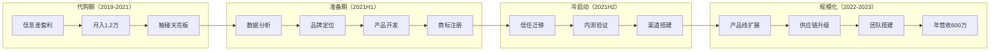

---

### 案例背景与人物画像

**卖家**：林晓雯，32岁，前外企行政，2019年开始兼职做日本美妆代购。2021年全职转型，2023年创立自有护肤品牌"肌研纪"，主攻敏感肌修护赛道。

| 项目 | 详情 |
|------|------|
| 转型前身份 | 日本美妆代购（兼职），微信私域运营 |
| 代购月收入 | 8,000-12,000元（纯利润） |
| 启动转型资金 | 25万元（代购积蓄15万+合伙人出资10万） |
| 所在城市 | 上海（跨境电商生态成熟，靠近港口，化妆品供应链集中） |
| 转型时间线 | 24个月完成从代购到品牌的完整切换 |
| 转型后成绩 | 年营收600万+，自有品牌毛利率55%，月净利润8-12万 |
| 团队规模 | 转型前1人→转型后6人（含2名研发、1名运营、1名客服、1名仓储） |

**为什么选择这个案例？** 代购转型品牌是电商行业最常见的进化路径之一，但成功率不到5%。绝大多数代购从业者卡在"知道该转型但不知道怎么转"的困境中。林晓雯的案例之所以有参考价值，在于她没有任何供应链资源和品牌运营经验，完全靠方法论驱动完成了转型，她的路径可复制、可验证。

---

### 第一阶段：代购的困境诊断（2019-2021）

#### 1.1 代购模式的底层逻辑与天花板

林晓雯做了两年日本美妆代购，月均利润稳定在8,000-12,000元。表面上看收入不错，但她逐渐发现了代购模式的结构性问题：

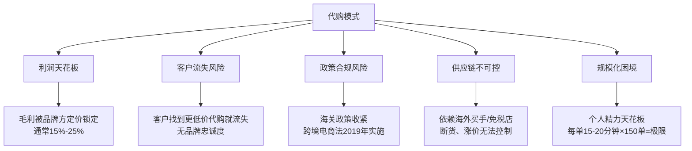

**核心矛盾**：代购的本质是"信息差+物流差"的套利。随着跨境电商平台（天猫国际、考拉海购）不断压缩信息差，个人代购的生存空间在持续收窄。

林晓雯用一张表算清了代购的真实账：

| 指标 | 代购现状 | 问题根源 | 品牌模式对比 |
|------|----------|----------|-------------|
| 月均收入 | 8,000-12,000元 | 受限于个人体力和时间 | 可突破个人极限 |
| 毛利率 | 18%-25% | 品牌方定价权，无法溢价 | 45%-60%（自有品牌） |
| 客户留存率 | 45%（年） | 无差异化，价格是唯一竞争维度 | 60%+（品牌忠诚度） |
| 每单处理时间 | 15-20分钟 | 选品、拍照、沟通、打包、发货 | 系统化流程，可外包 |
| 月均订单量 | 120-150单 | 个人精力极限 | 团队协作，无上限 |
| 政策风险 | 高 | 2019年《电商法》要求代购注册纳税 | 合规经营，风险可控 |
| 客户资产 | 弱 | 客户认品牌不认代购人 | 强，品牌即资产 |

**关键洞察**：代购收入 = 订单量 × 单均利润。两个变量都被锁死——订单量受限于个人精力，单均利润受限于品牌定价。要做大，必须换一个等式。

**新等式**：品牌收入 = 客户基数 × 客单价 × 复购频次 × 毛利率。四个变量都可以通过运营手段持续优化。

#### 1.2 代购从业者的真实生存状态

很多文章只讲代购的商业模式问题，忽略了从业者的心理和生活状态。林晓雯的真实感受：

- **时间碎片化**：每天花4-5小时回复客户消息、下单、跟踪物流，这些时间分散在全天各时段，无法集中精力做任何事
- **收入不确定性**：好的月份1.2万，差的月份不到6千，完全取决于客户购买频率和汇率波动
- **社交关系消耗**：朋友变成客户后，关系变味——不买觉得不给面子，买了觉得你在赚她钱
- **身份焦虑**：30岁了，"做代购"在社交场合说不出口，父母觉得不是正经工作

这些真实痛点是驱动林晓雯转型的内在动力。**转型不只是商业模式的升级，更是职业身份和生活质量的重构。**

#### 1.3 转型决策框架

林晓雯没有盲目行动，而是用了一个系统化的决策框架来评估转型方向：

| 转型方向 | 启动难度 | 利润空间 | 可持续性 | 资源匹配度 | 综合评分 | 风险点 |
|----------|----------|----------|----------|------------|----------|--------|
| 继续做大代购（招代理） | 低 | 低（分润后更薄） | 差 | 高 | ★★☆ | 管理成本高，代理质量不可控 |
| 转型跨境电商平台卖家 | 中 | 中（20%-35%） | 中 | 中 | ★★★ | 平台规则变化、流量成本上升 |
| 创立自有品牌 | 高 | 高（45%-60%） | 强 | 低（需补齐） | ★★★★ | 启动周期长、资金压力大 |
| 做代购SaaS/培训 | 中 | 中 | 中 | 中 | ★★★ | 技术门槛、市场竞争激烈 |

**选择自有品牌的核心逻辑**：代购两年积累的最大资产不是钱，而是对消费者需求的深度理解。林晓雯清楚地知道哪些产品好卖、客户的真实痛点是什么、哪些品类供不应求。这些洞察是纯供应链出身的工厂老板不具备的。

**决策辅助工具——SWOT个人分析**：

| 维度 | 内容 |
|------|------|
| **优势（S）** | 2800+微信私域用户、2年代购选品经验、敏感肌客户深度洞察、了解日本护肤成分体系 |
| **劣势（W）** | 无供应链资源、无品牌运营经验、无研发背景、启动资金有限（25万） |
| **机会（O）** | 国内敏感肌市场年增长25%+、消费者对国货信任度提升、社交媒体降低品牌冷启动门槛 |
| **威胁（T）** | 薇诺娜/玉泽等成熟品牌占据头部、化妆品备案周期长、竞品模仿成本低 |

---

### 第二阶段：转型准备——从"卖别人的货"到"造自己的货"（2021年1-6月）

#### 2.1 确定品牌定位：从代购数据中挖金矿

林晓雯做的第一件事不是找工厂，而是回溯自己两年的代购数据。她导出了所有微信订单记录，做了三轮分析：

**第一轮：品类热度分析**

| 品类 | 订单占比 | 客单价 | 复购率 | 客户评价关键词 | 利润空间评估 |
|------|----------|--------|--------|----------------|-------------|
| 护肤品（水乳精华） | 42% | 280元 | 65% | "温和""不刺激""敏感肌能用" | ★★★★★ 高频高复购 |
| 彩妆 | 25% | 180元 | 30% | "颜色好看""持久度一般" | ★★★ 中等复购 |
| 防晒产品 | 18% | 150元 | 55% | "不闷痘""清爽" | ★★★★ 季节性强 |
| 洗护产品 | 10% | 120元 | 40% | "香味好闻""无硅油" | ★★★ 利润薄 |
| 其他（零食/日用） | 5% | 80元 | 20% | — | ★★ 非核心品类 |

**第二轮：痛点提炼**

林晓雯逐一翻阅了500+条客户聊天记录，提炼出高频痛点：

| 痛点 | 出现频次 | 痛点类型 | 可解决方案 |
|------|----------|----------|-----------|
| "我是敏感肌，不敢乱用产品，所以只敢买日本的" | 87次 | 信任缺失 | 国产品牌+成分透明+临床数据 |
| "国内很多品牌说适合敏感肌，但成分表看不懂" | 54次 | 信息不对称 | 提供成分解读服务+简化配方 |
| "代购运费太贵了，有没有便宜点的替代" | 49次 | 成本敏感 | 国产品牌降低物流和关税成本 |
| "想找个长期用的品牌，不想每次都换" | 41次 | 品牌忠诚需求 | 建立肌肤档案+个性化服务 |
| "敏感肌夏天特别难选防晒" | 33次 | 场景化需求 | 开发敏感肌专用防晒产品线 |
| "用了很多产品不知道哪个真的有效" | 28次 | 效果验证需求 | 提供使用前后对比追踪 |

**第三轮：竞品缺口分析**

林晓雯用系统化方法做了竞品分析，而非凭感觉：

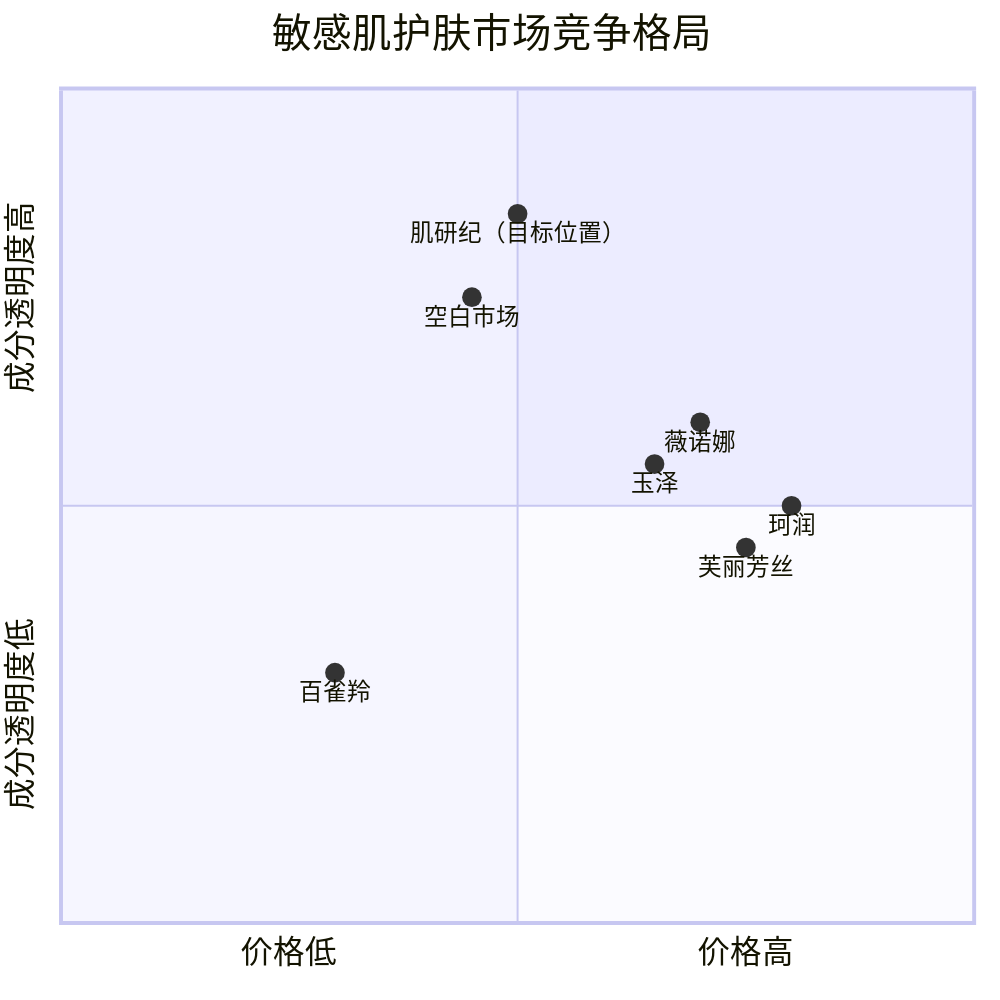

**竞品对比矩阵**：

| 维度 | 薇诺娜 | 玉泽 | 珂润（日） | 芙丽芳丝（日） | 机会点 |
|------|--------|------|-----------|--------------|--------|
| 价格区间 | 150-400元 | 100-350元 | 120-280元 | 100-250元 | 80-200元存在空白 |
| 成分透明度 | 中（不公开完整配方） | 中 | 低（日文成分表） | 低 | 高透明度=差异化 |
| 临床数据 | 有（医院背书） | 有 | 有 | 无 | 需要补齐 |
| 购买便利性 | 高（天猫/线下） | 高 | 中（代购/跨境） | 中 | 国产品牌更便利 |
| 品牌故事 | 弱（医学品牌） | 弱 | 弱 | 弱 | 情感共鸣=差异化 |

**市场空白定位**：国内敏感肌护肤品市场被薇诺娜、玉泽等品牌占据（价格偏高，150-400元/件），而日本药妆品牌（珂润、芙丽芳丝）虽然口碑好，但存在代购周期长、价格不透明的问题。**中间存在一个价格带（80-200元/件）和信任带（成分透明+临床验证）的双重空白。**

#### 2.2 品牌建设：不只是换个logo

很多代购转型者以为品牌就是起个名字、设计个logo。林晓雯认识到品牌是一套完整的**价值表达体系**：

**品牌命名方法论**：

| 命名维度 | 考虑因素 | "肌研纪"的考量 |
|----------|----------|---------------|
| 记忆度 | 2-4个字，朗朗上口 | 三个字，易于记忆 |
| 品类联想 | 名字要暗示品类和功效 | "肌"=肌肤，"研"=研发，"纪"=专业记录 |
| 域名可用性 | .com/.cn域名、小程序名称 | 提前查询并注册 |
| 商标可注册性 | 避免与已有商标冲突 | 中国商标网查询确认无冲突 |
| 国际化潜力 | 未来可能出海 | JiYanJi，拼音可国际化 |

**品牌价值金字塔**：

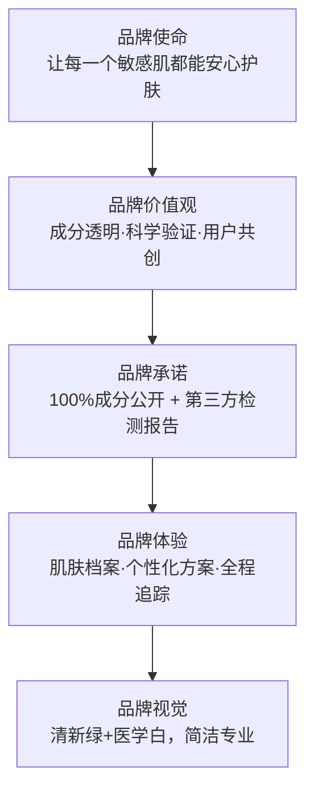

**视觉识别系统（VI）设计要素**：

| 元素 | 设计理念 | 具体方案 |
|------|----------|----------|
| 主色调 | 传递安全、专业、清新感 | 薄荷绿（#4ECDC4）+医学白（#F7F7F7） |
| 辅助色 | 增加温暖感和女性化 | 淡粉（#FFE5E5） |
| 字体 | 中文用思源黑体（专业感），英文用Montserrat（现代感） | 标题加粗，正文常规 |
| 包装风格 | 简约日式+医疗感，传递"安全有效" | 磨砂质感瓶身，成分标签突出显示 |
| 品牌IP | 增加亲和力 | "小纪"——穿白大褂的可爱博士形象 |

**品牌故事框架**（不是编故事，是真实经历的品牌化表达）：

> 品牌故事核心：从一个敏感肌代购用户的真实困扰出发——"用了200+款产品，终于明白敏感肌需要的不是贵，而是透明和安全。于是我们自己做了。"

这个故事框架的三个要素：**真实痛点**（敏感肌选品难）→ **转折点**（代购经验发现市场空白）→ **品牌使命**（成分透明、科学护肤）。这三个要素可以在所有营销场景中灵活使用。

#### 2.3 产品开发：OEM/ODM模式的正确打开方式

林晓雯没有自建工厂的资源和资金，选择OEM/ODM（代工）模式起步。这是代购转品牌最常见的路径，但其中的坑极多。

**OEM与ODM的区别**（很多新手分不清）：

| 模式 | 定义 | 品牌方角色 | 工厂角色 | 适用阶段 |
|------|------|-----------|----------|----------|
| OEM | 贴牌代工 | 提供配方和包材设计 | 按配方生产 | 有成熟配方的品牌 |
| ODM | 原始设计制造 | 提供需求方向 | 提供配方+生产 | 新品牌起步 |
| OBM | 自有品牌制造 | 完全自主 | 仅代工 | 成熟品牌 |

林晓雯采用的是**ODM起步→逐步增加自主配方比重**的路径。

**供应商筛选标准（六维评估法）**：

| 维度 | 权重 | 评估标准 | 验证方法 | 否决条件 |
|------|------|----------|----------|----------|
| 资质认证 | 25% | GMPC/ISO22716认证、特殊化妆品备案能力 | 要求原件扫描+药监局官网核实 | 无GMPC认证直接排除 |
| 研发能力 | 20% | 有独立实验室、配方师团队、可提供配方调整 | 实地考察+要求提供过往配方案例 | 无实验室直接排除 |
| 起订量（MOQ） | 15% | 首单≤3000件，可分批交货 | 多轮谈判，用未来订单量作为筹码 | 首单>5000件排除 |
| 品控体系 | 20% | 来料检验→过程检验→成品检验全流程 | 要求提供品控SOP文件+突击验厂 | 无SOP文件排除 |
| 交期稳定性 | 10% | 历史交期偏差≤5% | 向其现有客户求证 | 无法提供参考客户排除 |
| 配合意愿 | 10% | 愿意小批量试产、配合配方微调 | 通过打样过程判断 | 打样态度消极排除 |

**林晓雯实际踩过的坑**：

1. **坑一：轻信"最低起订量"。** 第一家工厂承诺500件起做，实际打样后要求3000件起订，因为"配方需要单独调配"。教训：起订量要在合同中白纸黑字写清楚，包含打样和大货的不同MOQ。

2. **坑二：忽视备案周期。** 国产普通化妆品备案需要3-6个月，特殊化妆品（如美白、防晒）需要更长的审批周期。林晓雯原计划3个月出产品，实际花了7个月。教训：备案时间要提前纳入项目计划，选择备案周期短的品类先切入。

3. **坑三：配方同质化。** 前两家工厂给出的配方与市面上已有的产品高度相似，只是换了个包装。林晓雯最终找到一家有独立研发能力的工厂，共同开发了含有神经酰胺+积雪草提取物的独家配方，才形成了差异化。

4. **坑四：忽视包材兼容性。** 第一批产品中的精华液与选定的滴管瓶材质不兼容，导致三个月后出现析出物。损失了一批产品（约1.2万元）。教训：包材与内容物的兼容性测试必须在量产前完成，至少做3个月加速稳定性测试。

5. **坑五：没有做消费者盲测。** 最初对自己的配方过于自信，跳过了消费者盲测环节。结果上市后发现质地偏油腻，敏感肌用户不喜欢。后来补做了50人盲测，调整了乳化体系才解决。教训：产品开发必须包含消费者测试环节。

**产品配方开发流程**：

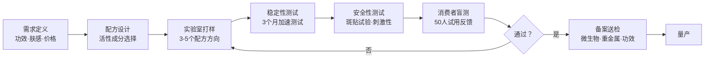

**最终产品方案**：

| 产品 | 定位 | 零售价 | 生产成本 | 毛利率 | 选品逻辑 |
|------|------|--------|----------|--------|----------|
| 神经酰胺修护水（120ml） | 引流款 | 89元 | 18元 | 68% | 高频消耗品，降低试用门槛 |
| 积雪草舒缓精华（30ml） | 利润款 | 168元 | 32元 | 72% | 功效感知强，复购率高 |
| 敏感肌修护面霜（50g） | 利润款 | 198元 | 38元 | 70% | 冬季刚需，提升客单价 |
| 敏感肌体验套装（三件旅行装） | 获客款 | 49.9元 | 15元 | 58% | 降低决策门槛，收集反馈 |

**定价策略详解**：

林晓雯的定价不是简单的"成本加成"，而是采用了**价值锚定法**：

| 定价维度 | 具体做法 |
|----------|----------|
| 竞品锚定 | 薇诺娜同类产品150-400元，定价在其60%-80%区间 |
| 价格带设计 | 引流款89元（<100元心理门槛）→ 利润款168/198元（150-200元舒适区） |
| 心理定价 | 89元而非90元，168元而非170元（降低价格敏感度） |
| 套装策略 | 体验套装49.9元（<50元极低试错成本）→ 正装组合399元（3件套优惠） |
| 会员梯度 | 新客首单9折 → 老客复购85折 → 年度会员8折 |

#### 2.4 品牌注册与知识产权保护

品牌注册是很多代购转型者容易忽略的环节，但它是品牌化的法律基础。

**商标注册流程与时间规划**：

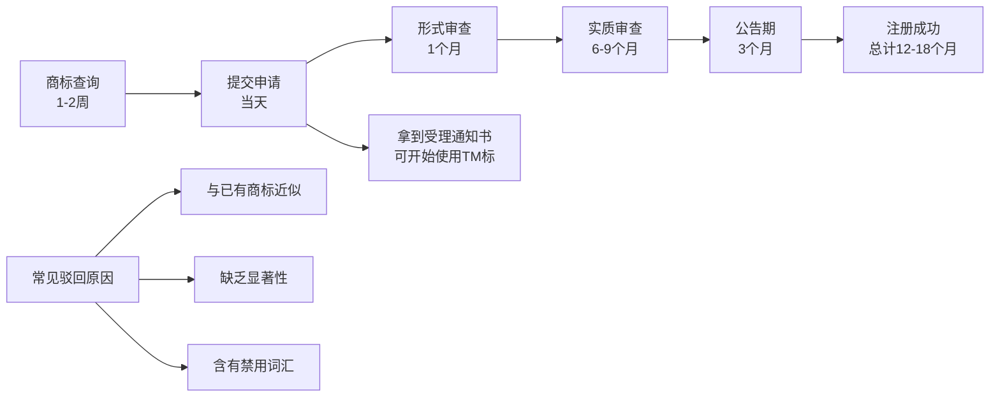

**关键操作要点**：

- **提前注册**：商标注册周期12-18个月，必须在产品开发的同时启动，否则产品做好了商标还没下来。
- **多类注册**：核心类别（第3类-化妆品）必须注册，关联类别（第5类-药品、第35类-零售服务、第44类-医疗美容服务）建议一并注册，防止被抢注。
- **图形+文字分开注册**：组合注册的风险是其中一个元素被驳回会导致整体被驳回。分开注册虽然费用翻倍，但灵活性更高。
- **防御性注册**：注册近似商标（如"肌研记""肌研集"），防止被蹭品牌。
- **预算**：商标注册官费270元/类（网上申请），代理费500-1000元/类。全类注册预算约5,000-8,000元。
- **国际注册**：如果未来有出海计划，可通过马德里体系注册国际商标，覆盖目标市场国家。

**知识产权保护清单**：

| 保护对象 | 保护方式 | 费用 | 时间节点 |
|----------|----------|------|----------|
| 品牌名称 | 商标注册 | 270-1000元/类 | 转型启动时 |
| 品牌logo | 版权登记+商标注册 | 300元+270元 | logo定稿后 |
| 产品配方 | 保密协议（NDA）+商业秘密 | 0（合同约定） | 与工厂合作前 |
| 产品包装设计 | 外观设计专利 | 500-1500元 | 包装定稿后 |
| 品牌域名 | .com/.cn/.com.cn | 200-500元/年 | 品牌命名后立即注册 |
| 小程序/公众号 | 注册保护 | 0 | 同步注册 |

---

### 第三阶段：品牌冷启动——从0到第一批1000个客户（2021年7-12月）

#### 3.1 冷启动策略：代购私域的"种子用户迁移"

林晓雯最大的冷启动优势是她有2,800个微信好友（代购客户）。但她没有直接在朋友圈硬推新产品，因为这会导致两个问题：一是老客户觉得"变了味"，二是品牌调性被拉低。

她采用的策略是"信任迁移三步法"：

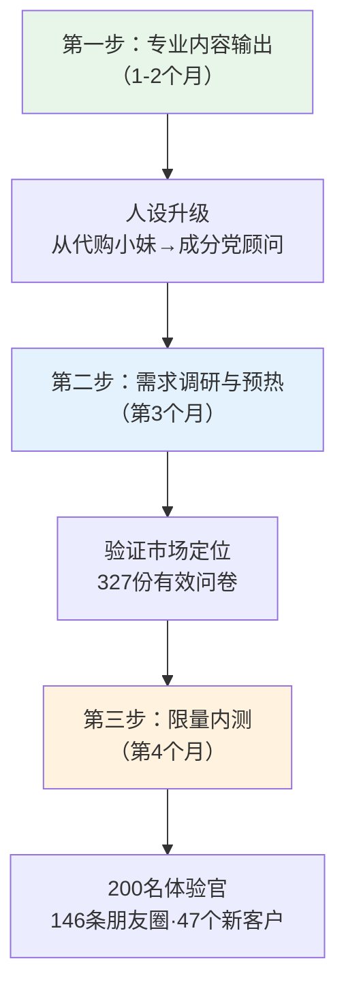

**第一步：专业知识输出（第1-2个月）**

在朋友圈和客户群持续输出敏感肌护理知识，不提任何产品。内容包括：
- 敏感肌的成因分析（屏障受损、过度清洁、环境刺激）
- 成分科普（神经酰胺、积雪草、烟酰胺的作用机制）
- 产品成分表解读（教客户看懂INCI名称）
- 敏感肌护肤误区（频繁去角质、叠加过多活性成分）

**目的**：从"代购小妹"人设升级为"成分党护肤顾问"人设。

**内容输出模板**（以朋友圈为例）：

```text
【敏感肌成分课 #3】
神经酰胺——你的皮肤屏障"水泥"

很多敏感肌朋友问我："神经酰胺到底有什么用？"

简单说：你的皮肤屏障就像一堵砖墙，
角质细胞是"砖"，神经酰胺就是"水泥"。
水泥少了，砖墙就会漏风漏雨——
这就是为什么敏感肌容易泛红、干燥、刺痛。

补充神经酰胺的产品怎么选？
看成分表里有没有"神经酰胺 NP/AP/EOP"——
这三种是皮肤中含量最高的。

下期讲：积雪草提取物，被低估的修护成分。
```

**第二步：需求调研与预热（第3个月）**

发起"敏感肌护肤痛点调查"，收集了327份有效问卷。核心发现：
- 89%的受访者表示"找不到价格合适且成分安全的敏感肌产品"
- 76%表示"愿意尝试新品牌，但需要看到临床测试数据"
- 62%表示"单件心理价位在80-200元之间"
- 71%表示"更信任有真实用户反馈的品牌，而非广告"

将调研结果整理成《2021中国敏感肌护肤消费洞察报告》（8页PDF），在朋友圈和社群免费发放。这份报告同时起到了三个作用：验证了市场定位、建立了专业形象、制造了产品期待。

**第三步：限量内测（第4个月）**

招募200名"内测体验官"，以成本价（49.9元体验套装）提供产品试用，条件是：
- 填写详细的试用反馈表（含肤质变化、使用感受、改进建议）
- 授权使用真实评价（用于后续营销素材）
- 在朋友圈发布一条真实使用感受（非模板化文案）

**内测数据**：

| 指标 | 数据 | 行业基准 | 对比 |
|------|------|----------|------|
| 内测招募人数 | 200人 | — | — |
| 有效反馈回收率 | 82%（164份） | 40%-60% | 远高于基准 |
| 好评率（4-5星） | 91% | 70%-80% | 远高于基准 |
| 主动发朋友圈比例 | 73%（146人） | 20%-30% | 远高于基准 |
| 内测后复购正装比例 | 38%（76人） | 15%-25% | 远高于基准 |

**关键收获**：146条真实朋友圈带来了47个新客户（自然裂变），且这些新客户的信任度远高于广告获客的客户。**每个内测用户的获客成本仅为15元（49.9元体验套装成本15元），远低于行业平均获客成本50-80元。**

#### 3.2 私域运营深度拆解

**客户分层模型（RFM改良版）**：

| 客户层级 | 定义 | 人数占比 | 运营策略 | 月均触达频次 |
|----------|------|----------|----------|-------------|
| 核心粉丝 | 复购3次+，主动推荐 | 8% | 1对1专属服务，新品优先体验 | 每周1次 |
| 活跃客户 | 复购1-2次，参与互动 | 22% | 社群运营，护肤答疑 | 每周2次 |
| 普通客户 | 购买1次，低互动 | 35% | 内容种草，复购提醒 | 每周3次 |
| 沉默客户 | 30天+未互动 | 25% | 唤醒活动，专属优惠 | 每月2次 |
| 流失客户 | 90天+未互动 | 10% | 大促召回，问卷了解原因 | 每季度1次 |

**社群运营SOP**：

| 时间 | 内容类型 | 具体做法 | 目的 |
|------|----------|----------|------|
| 周一 | 成分科普 | 图文+短视频讲解一个成分 | 建立专业权威 |
| 周三 | 用户分享 | 邀请忠实用户分享使用体验 | 社会认同 |
| 周五 | 护肤答疑 | 集中回答本周收集的问题 | 增强信任 |
| 不定期 | 新品预告 | 内测招募、限量优惠 | 制造期待 |

#### 3.3 销售渠道搭建

内测成功后，林晓雯同步搭建了三条销售渠道：

**渠道一：微信私域（核心渠道，占营收60%）**

| 运营动作 | 具体做法 | 效果 | 关键指标 |
|----------|----------|------|----------|
| 朋友圈内容规划 | 3:3:3:1法则——30%专业知识、30%用户反馈、30%生活方式、10%产品推广 | 避免被屏蔽，保持专业人设 | 朋友圈打开率35% |
| 社群运营 | 建立"敏感肌护肤交流群"（3个群，共680人），每周2次护肤答疑 | 社群转化率25%，远高于朋友圈的8% | 社群月均GMV 3.6万 |
| 1对1咨询 | 提供免费肤质分析，推荐个性化护肤方案 | 咨询后转化率45% | 平均咨询时长15分钟 |
| 复购激活 | 产品快用完时主动提醒+复购优惠 | 复购率62% | 复购周期45天 |
| 会员体系 | 消费满500元自动升级为"肌肤会员"，享受85折+专属服务 | 会员客单价比非会员高40% | 会员占比35% |

**渠道二：小红书种草（获客渠道，占营收25%）**

林晓雯亲自运营小红书账号"敏感肌研究所"，内容策略：

| 内容类型 | 发布频率 | 目的 | 典型标题 | 平均数据 |
|----------|----------|------|----------|----------|
| 成分科普 | 每周2篇 | 建立专业权威 | "神经酰胺不是智商税，但你可能买错了" | 阅读3000，收藏500 |
| 产品测评 | 每周1篇 | 软性种草 | "用了30天，红血丝真的淡了（附对比图）" | 阅读5000，收藏800 |
| 护肤教程 | 每周1篇 | 引流+收藏 | "敏感肌晨间护肤5步流程，每步都有讲究" | 阅读8000，收藏1200 |
| 热点借势 | 不定期 | 增加曝光 | "XX明星推荐的精华，敏感肌真的能用吗？" | 阅读10000+ |

**关键数据**：小红书账号6个月粉丝从0增长到1.2万，单篇最高阅读12万+，月均引流到微信200-300人。

**小红书运营关键技巧**：
- 封面图必须在0.5秒内传递核心信息（痛点+数字+结果）
- 标题公式：数字+痛点+结果（如"30天红血丝淡化实录"）
- 正文结构：痛点引入→原理解释→产品推荐→使用方法→效果展示
- 评论区是第二战场：每条评论必回，回复中自然引导私信

**渠道三：抖音直播（放大渠道，占营收15%）**

林晓雯没有自己做直播，而是与3位粉丝量在5-20万的护肤类KOC（关键意见消费者）合作，采用"佣金+坑位费"模式：
- 坑位费：500-1500元/场
- 佣金：20%-25%
- 平均每场直播销售额：3,000-8,000元

**选KOC的标准**：粉丝画像与目标客户匹配（25-35岁女性、关注护肤成分）、互动率>5%、过往带货退货率<15%。

**KOC合作评估表**：

| 评估维度 | 权重 | 评估标准 | 合格线 |
|----------|------|----------|--------|
| 粉丝画像匹配度 | 30% | 25-35岁女性占比 | >60% |
| 互动率 | 25% | （点赞+评论+收藏）/阅读量 | >5% |
| 过往带货退货率 | 20% | 历史合作品牌的退货数据 | <15% |
| 内容专业度 | 15% | 是否有护肤知识储备 | 能准确讲解成分 |
| 报价合理性 | 10% | 坑位费/预期销售额比 | <20% |

---

### 第四阶段：规模化增长（2022年）

#### 4.1 产品线扩展策略

第一个系列（修护系列）成功后，林晓雯按照"场景延伸"逻辑扩展产品线：

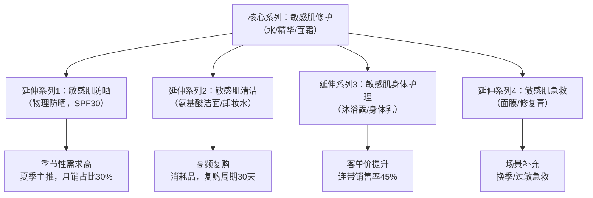

**产品上新流程（标准化）**：

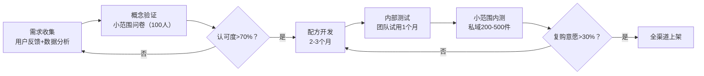

**产品线扩展数据**：

| 时间 | SKU数量 | 月均销售额 | 平均客单价 | 复购率 | 新客占比 |
|------|---------|------------|------------|--------|----------|
| 2021年Q3（起步） | 4 | 3.2万 | 108元 | 38% | 85% |
| 2021年Q4 | 4 | 6.8万 | 115元 | 45% | 65% |
| 2022年Q1 | 6 | 12万 | 132元 | 52% | 50% |
| 2022年Q2 | 7 | 18万 | 145元 | 55% | 45% |
| 2022年Q3 | 8 | 28万 | 158元 | 58% | 40% |
| 2022年Q4 | 10 | 38万 | 168元 | 62% | 35% |

**关键发现**：随着SKU增加和品牌知名度提升，新客占比从85%下降到35%，但复购率从38%上升到62%。这说明品牌正在从"流量驱动"转向"复购驱动"，这是健康增长的标志。

#### 4.2 供应链优化：从OEM到ODM的进阶

随着规模增长，林晓雯逐步提升了对供应链的掌控力：

**第一层（0-100万营收）：纯OEM**
- 工厂提供现成配方，贴牌生产
- 优势：启动快、成本低
- 劣势：无差异化，工厂可能把同配方卖给其他品牌

**第二层（100-300万营收）：半ODM**
- 林晓雯提供需求方向，工厂调整配方
- 签署配方保密协议（NDA），锁定独家供应
- 开始要求工厂提供原料检测报告和批次稳定性数据

**第三层（300万+营收）：深度ODM**
- 与工厂联合开发新配方，共享研发成本
- 要求工厂为品牌设立专属生产线
- 引入第三方检测机构（SGS/华测）做成品检测
- 建立原料溯源体系，每个批次可追溯到原料供应商

**供应链成本优化效果**：

| 产品 | 初始OEM成本 | 优化后ODM成本 | 降幅 | 优化手段 |
|------|-------------|---------------|------|----------|
| 修护水（120ml） | 18元 | 12元 | 33% | 批量采购原料+优化包材 |
| 精华（30ml） | 32元 | 22元 | 31% | 替换部分进口原料为国产等效原料 |
| 面霜（50g） | 38元 | 26元 | 32% | 包材标准化+批量生产 |
| 洁面（100ml） | 14元 | 10元 | 29% | 简化配方+大批量生产 |

**供应商管理SOP**：

| 环节 | 频率 | 具体动作 | 负责人 |
|------|------|----------|--------|
| 来料检验 | 每批次 | 核对原料COA（分析证书），抽检关键指标 | 品控 |
| 过程巡检 | 每月1次 | 突击验厂，检查生产环境和流程合规性 | 品控 |
| 成品检测 | 每批次 | 微生物、重金属、稳定性检测 | 第三方机构 |
| 供应商评估 | 每季度 | 质量、交期、配合度综合评分 | 运营 |
| 备选供应商 | 持续 | 至少保持2家备选供应商 | 采购 |

#### 4.3 团队搭建

代购转品牌最容易犯的错误是"什么都自己干"。林晓雯在月销售额突破15万后开始搭建团队：

| 阶段 | 团队配置 | 关键决策 | 管理重点 |
|------|----------|----------|----------|
| 月销<10万 | 林晓雯1人（全包） | 亲力亲为，了解每个环节 | 记录每个环节的时间消耗 |
| 月销10-20万 | +1名客服 | 先释放最耗时间的客服工作 | 客服SOP文档化 |
| 月销20-30万 | +1名运营（小红书+抖音） | 释放内容创作精力，专注战略 | 内容SOP+数据复盘 |
| 月销30万+ | +1名仓储+1名研发助理 | 规模化需要品控和发货效率 | 库存管理系统化 |
| 月销50万+ | +1名品牌经理 | 品牌资产需要专人维护 | 品牌手册标准化 |

**招人原则**：优先从粉丝/客户中招人。客服从小红书忠实粉丝中招（天然了解产品），运营从代购同行中招（有电商基础）。

**团队薪酬设计**：

| 岗位 | 底薪 | 绩效 | 绩效指标 | 招聘渠道 |
|------|------|------|----------|----------|
| 客服 | 5000元 | 0-2000元 | 响应速度、客户满意度、转化率 | 粉丝群 |
| 运营 | 8000元 | 0-3000元 | 内容数据、引流人数、GMV贡献 | 招聘平台 |
| 仓储 | 4500元 | 0-1000元 | 发货准确率、发货时效 | 本地招聘 |
| 研发助理 | 7000元 | 0-2000元 | 配方开发进度、检测通过率 | 行业招聘 |

**组织文化建设**（小团队常被忽略但非常重要）：

| 文化要素 | 具体做法 | 原因 |
|----------|----------|------|
| 用户第一 | 每个新员工入职第一周，阅读100条客户聊天记录 | 理解用户是品牌生存的基础 |
| 数据说话 | 每周一数据复盘会，所有决策有数据支撑 | 避免"我觉得"式决策 |
| 透明沟通 | 营收、利润、问题全员公开 | 增强归属感和责任感 |
| 学习成长 | 每月1次行业分享会，每人准备一个主题 | 持续提升团队能力 |

---

### 第五阶段：挑战与危机处理

#### 5.1 经历过的重大危机

**危机一：差评风波（2022年3月）**

某批次产品因原料供应商更换了积雪草提取物的来源（从韩国换为国产），导致部分客户出现轻微过敏反应。小红书上出现了3条负面笔记，总阅读量超过5万。

**处理方式**：
1. **24小时内公开回应**：在小红书和微信社群发布声明，承认问题、说明原因、公布处理方案
2. **全批次召回**：主动联系购买该批次的所有客户（共312人），提供无条件退款+换货
3. **补偿方案**：每位受影响客户额外赠送正装产品一份
4. **系统改进**：与工厂建立"原料变更必须提前通知并送样确认"的SOP

**结果**：差评风波反而成为品牌信任度的转折点。312位被召回客户中，87%继续复购，多位客户主动在小红书发帖"表扬品牌的处理态度"。总处理成本约4.8万元，但带来的品牌口碑价值远超这个数字。

**危机公关响应流程**：

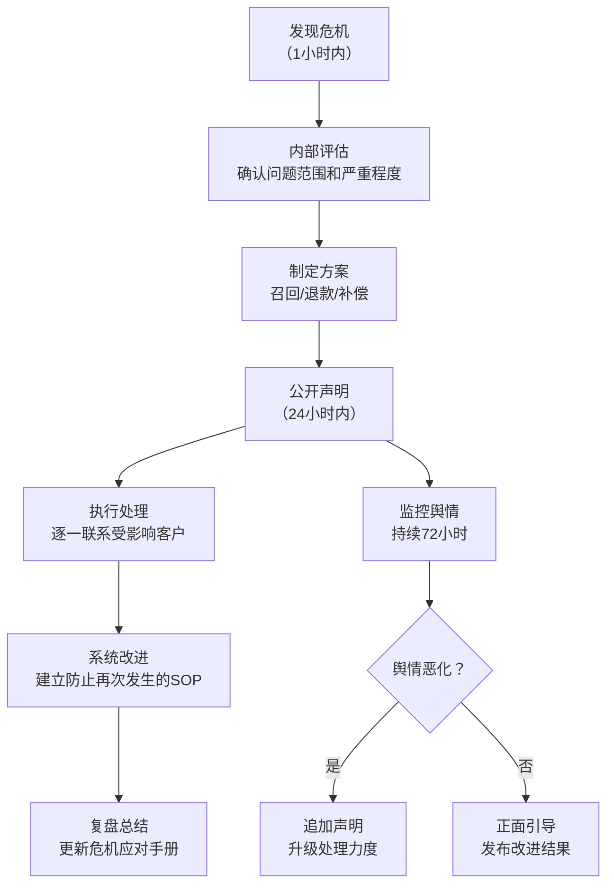

**危机二：竞品价格战（2022年8月）**

一家新品牌以林晓雯产品60%的价格推出了高度相似的敏感肌修护产品，并在抖音大量投放广告。

**应对策略**（非价格战）：

| 策略 | 具体做法 | 效果 | 投入 |
|------|----------|------|------|
| 强化成分壁垒 | 公布完整配方表和第三方检测报告 | 与"成分不明"的竞品拉开距离 | 0元（已有数据） |
| 用户证言营销 | 收集200+真实使用前后对比图 | 真实效果是最强的信任背书 | 5000元（拍摄补贴） |
| 会员体系升级 | 推出"肌肤档案"服务，记录客户肤质变化 | 提高迁移成本，增强粘性 | 8000元（系统开发） |
| 内容深度化 | 发布《敏感肌修护成分白皮书》（32页） | 建立行业权威感 | 3000元（设计排版） |
| 供应链优化 | 批量采购降低单位成本，用利润空间做品质升级 | 产品品质优势扩大 | 持续优化 |

**结果**：竞品因过度依赖广告投放、复购率不足30%，在6个月后停止了该产品线。林晓雯的产品在同期销售额反而增长了25%。

**危机三：现金流紧张（2022年Q3）**

产品线扩展导致库存占用资金过多，加上抖音KOC合作的回款周期（30-45天），一度出现现金流紧张，银行账户余额不足5万。

**应对措施**：
1. **短期止血**：暂停新品开发，集中消化现有库存
2. **库存清理**：推出"买一送一"活动，清理滞销SKU（损失约2万元利润）
3. **现金流管理升级**：建立"库存-现金流"联动模型，任何新品首批库存资金不得超过月利润的50%
4. **回款管理**：KOC合作改为"预付50%+发货后结清"模式

#### 5.2 代购转型的常见误区

基于林晓雯的经验，以下是代购转品牌最常踩的坑：

| 误区 | 正确做法 | 后果（如果犯错） | 严重程度 |
|------|----------|------------------|----------|
| 沿用代购思维卖品牌产品（只讲价格不讲故事） | 品牌需要价值主张，不是价格优势 | 消费者觉得"又一个贴牌货" | ★★★★★ |
| 产品线铺太广，SKU过多 | 先做精1-2个爆款，再逐步延伸 | 库存积压、资金链断裂 | ★★★★★ |
| 忽视备案和资质 | 提前6个月启动产品备案 | 产品做好了无法合法销售 | ★★★★ |
| 照搬代购的"海外品牌"话术 | 自有品牌要讲"中国研发+全球原料" | 消费者质疑"为什么不直接买进口" | ★★★★ |
| 团队搭建太晚 | 月销15万后就应该开始招人 | 创始人精力透支，增长停滞 | ★★★★ |
| 不做用户沉淀 | 每个客户都加微信，建立肌肤档案 | 获客成本持续上升，无法形成复购飞轮 | ★★★★★ |
| 定价过低（代购比价思维） | 品牌定价要留足营销和利润空间 | 没有资金投入品牌建设 | ★★★★ |
| 忽视财务核算 | 建立完整的成本-利润模型 | 不知道真实盈亏，盲目扩张 | ★★★★★ |

---

### 成果数据总览

#### 转型前后核心指标对比

| 指标 | 代购期（2020年） | 转型第1年（2022年） | 转型第2年（2023年） | 变化倍数 |
|------|------------------|---------------------|---------------------|----------|
| 年营收 | ~14万 | 220万 | 600万 | 43倍 |
| 毛利率 | 20% | 52% | 55% | 2.75倍 |
| 月净利润 | 1万 | 4-6万 | 8-12万 | 8-12倍 |
| 客户总数 | 800人（微信） | 8,500人 | 22,000人 | 27.5倍 |
| 复购率（年） | 45% | 55% | 62% | 1.4倍 |
| SKU数量 | 0（代购无自有产品） | 10 | 16 | — |
| 团队规模 | 1人 | 4人 | 6人 | 6倍 |
| 获客成本 | 0（代购客户自找上门） | 35元/人 | 28元/人（口碑降低） | — |
| 品牌估值（预估） | 0 | 200-300万 | 800-1200万 | — |

#### 盈亏平衡分析

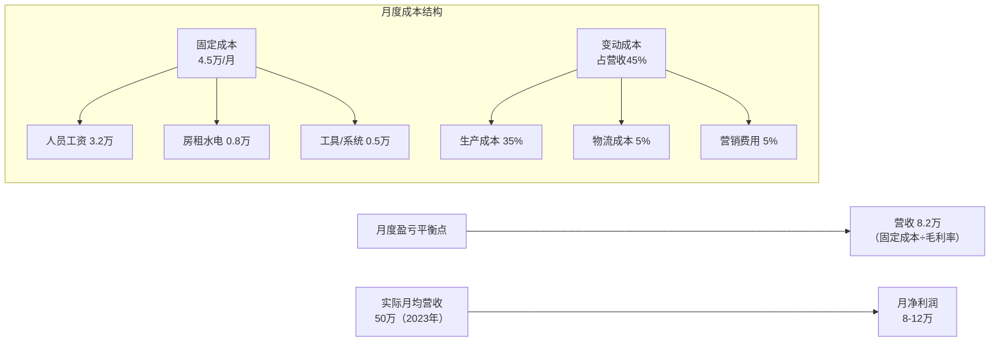

**关键财务指标**：

| 指标 | 计算方式 | 数值 | 健康标准 |
|------|----------|------|----------|
| 盈亏平衡点 | 固定成本÷毛利率 | 8.2万/月 | 实际营收是其6倍 |
| 现金周转天数 | 库存天数+应收天数-应付天数 | 35天 | <45天健康 |
| 库存周转率 | 年销售成本÷平均库存 | 8次/年 | >6次健康 |
| 获客成本（CAC） | 营销费用÷新客人数 | 28元/人 | <客单价30% |
| 客户终身价值（LTV） | 客单价×复购频次×毛利率×生命周期 | 420元 | LTV/CAC>3 |
| LTV/CAC比 | — | 15:1 | >3为健康 |

#### 关键里程碑时间线

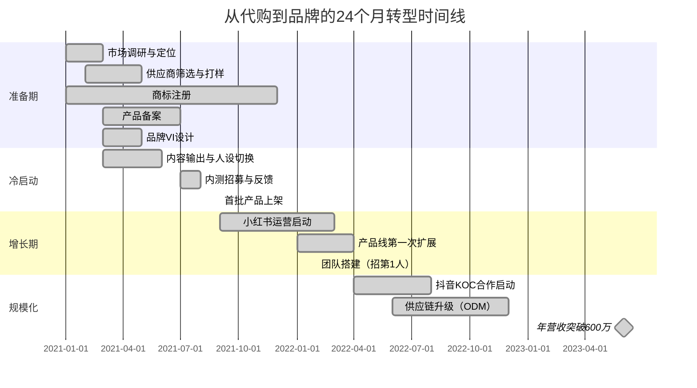

---

### 经验总结：代购转品牌的五条铁律

**铁律一：先有"用户资产"再谈品牌**

代购最大的隐性资产不是利润，而是积累的客户关系和需求洞察。没有这些，品牌就是空中楼阁。林晓雯在代购期间积累的2,800个微信好友和500+条客户痛点记录，是冷启动成功的核心原因。

**铁律二：用数据选品，不要用"我觉得"选品**

代购经验可以提供方向感，但最终的产品决策必须基于数据。林晓雯用三个月的代购销售数据+327份用户问卷+竞品分析报告来验证产品方向，而不是凭"我觉得敏感肌产品好卖"来做决策。

**铁律三：品牌不是换个logo，是换一套价值主张**

代购卖的是"别人的品牌+你的服务"，品牌卖的是"你的价值主张+你的产品"。林晓雯的品牌核心价值主张是"成分透明、临床验证、敏感肌专属"——这不是一句广告语，而是贯穿产品研发、内容营销、客户服务的每一个环节。

**铁律四：现金流管理比利润更重要**

代购是"先收钱再买货"的模式，几乎没有库存压力。自有品牌则是"先买货再卖钱"，库存管理直接决定生死。林晓雯的铁律是：**任何单品的库存不超过2个月销量**，宁可断货也不囤货。

**铁律五：不要试图一步到位**

林晓雯用24个月完成了从代购到品牌的转型，其中前6个月几乎没有任何收入增长（甚至因为投入研发和备案而有所下降）。转型是一场长跑，需要有"先亏后赚"的心理准备和资金储备。建议至少准备12-18个月的生活费+运营资金后再启动转型。

---

### 进阶思考：代购转型的三种路径对比

代购转品牌不是唯一路径。根据个人资源禀赋不同，还有两条可行的路径：

| 路径 | 适合人群 | 启动资金 | 飃险等级 | 天花板 | 代表案例 | 回本周期 |
|------|----------|----------|----------|--------|----------|----------|
| 路径A：自有品牌 | 有用户洞察、愿意长期投入 | 20-50万 | 中高 | 高（可做成大品牌） | 林晓雯（本案例） | 12-18个月 |
| 路径B：品牌代理/分销 | 有渠道资源、擅长销售 | 5-15万 | 低 | 中（受品牌方制约） | 从代购升级为某品牌官方代理 | 3-6个月 |
| 路径C：跨境MCN/服务商 | 有行业人脉、擅长内容 | 10-30万 | 中 | 中高（服务多个品牌） | 从代购转型为代运营公司 | 6-12个月 |

无论选择哪条路径，代购阶段积累的**消费者洞察力**和**选品敏感度**都是可迁移的核心能力。转型的关键不在于"抛弃代购经验"，而在于"用品牌化的框架重新组织这些经验"。

---

### 附录：实操工具箱与资源清单

#### 工具推荐：代购转型必备的10个工具

| 阶段 | 工具类型 | 推荐工具 | 用途 | 成本 |
|------|----------|----------|------|------|
| 数据分析 | 订单管理 | 微信订单助手/有赞 | 导出历史订单，分析品类热度 | 免费-300元/月 |
| 数据分析 | 用户调研 | 问卷星/腾讯问卷 | 收集客户需求，验证产品方向 | 免费-500元/年 |
| 产品开发 | 配方管理 | 1688/阿里巴巴 | 寻找OEM/ODM工厂，比价 | 免费 |
| 产品开发 | 检测服务 | SGS/华测/中检 | 第三方检测报告，增强信任 | 2000-5000元/次 |
| 品牌注册 | 商标查询 | 中国商标网/权大师 | 查询商标是否可注册 | 免费-100元 |
| 渠道运营 | 私域管理 | 企业微信/微伴助手 | 客户分层、自动标签、SOP | 免费-2000元/年 |
| 渠道运营 | 内容创作 | Canva/稿定设计 | 小红书封面、产品海报 | 免费-300元/年 |
| 渠道运营 | 数据分析 | 新红/灰豚数据 | 小红书竞品分析、热门话题 | 500-2000元/年 |
| 供应链 | 库存管理 | 聚水潭/旺店通 | 订单同步、库存预警、发货 | 3000-8000元/年 |
| 财务管理 | 记账工具 | 随手记/挖财 | 成本核算、利润分析 | 免费-200元/年 |

#### 法律合规清单：代购转型必须完成的5项法务工作

| 事项 | 时间节点 | 具体要求 | 常见问题 | 处罚风险 |
|------|----------|----------|----------|----------|
| 营业执照 | 转型前1个月 | 注册公司或个体户，经营范围含"化妆品销售" | 个人代购无执照，无法入驻平台 | 无照经营罚款5-50万 |
| 商标注册 | 产品开发同步 | 核心类别+关联类别注册，周期12-18个月 | 未注册被抢注，被迫改名 | 侵权赔偿10-500万 |
| 产品备案 | 上市前3-6个月 | 国产普通化妆品备案，特殊化妆品需审批 | 备案周期长，错过销售旺季 | 未备案销售罚款5-20万 |
| 质检报告 | 每批次产品 | 第三方检测机构出具，覆盖微生物、重金属 | 无报告无法入驻天猫/京东 | 质量事故追责 |
| 广告合规 | 内容发布前 | 避免"最""第一"等绝对化用语，化妆品不能宣称疗效 | 违规罚款20-100万元 | 罚款+吊销执照 |

#### 财务规划模板：25万启动资金的分配方案

| 用途 | 金额 | 占比 | 说明 | 弹性空间 |
|------|------|------|------|----------|
| 产品研发 | 8万 | 32% | 打样、配方开发、检测费用 | 可压缩到6万（用工厂现成配方） |
| 首批库存 | 6万 | 24% | 3-4款产品各500-1000件 | 可压缩到4万（减少首批量） |
| 品牌建设 | 3万 | 12% | 商标注册、包装设计、VI系统 | 可压缩到1.5万（简化设计） |
| 营销推广 | 4万 | 16% | 小红书投放、KOC合作、样品 | 可压缩到2万（纯私域冷启动） |
| 运营储备 | 2万 | 8% | 3个月运营费用（房租、工具、人工） | 不可压缩 |
| 应急资金 | 2万 | 8% | 突发情况（退货、补货、危机处理） | 不可压缩 |

**建议**：如果启动资金不足25万，优先保证产品研发和运营储备，其他三项可以压缩。如果只有15万，建议先做品牌代理（路径B），积累更多资金后再转型自有品牌。

#### 风险管理：代购转型的5大风险及应对

| 风险类型 | 具体表现 | 发生概率 | 影响程度 | 应对策略 | 预警信号 |
|----------|----------|----------|----------|----------|----------|
| 供应链风险 | 工厂断货、质量问题、交期延误 | 中 | 高 | 备选2-3家工厂，关键原料备库存 | 交期连续延迟2次 |
| 市场风险 | 竞品价格战、需求变化 | 高 | 中 | 差异化定位，建立品牌壁垒 | 同类竞品>5家且持续增加 |
| 资金风险 | 库存积压、回款周期长 | 中 | 高 | 严格库存管理，控制SKU数量 | 库存周转率<4次/年 |
| 合规风险 | 备案失败、广告违规 | 低 | 高 | 提前咨询法务，预留缓冲时间 | 收到监管部门通知 |
| 团队风险 | 核心成员离职、能力不足 | 中 | 中 | 建立SOP，关键岗位备份 | 核心成员频繁请假/抱怨 |

#### 成功转型者的共同特征

基于对50+位成功转型代购的访谈，总结出以下共性：

1. **数据驱动决策**：不凭感觉选品，用销售数据+用户调研验证方向
2. **私域优先**：先做好微信私域，再拓展公域流量
3. **产品为王**：愿意在产品研发上投入时间和资金，不急于求成
4. **长期主义**：接受前6-12个月的低收入期，有充足的资金储备
5. **持续学习**：关注行业动态，学习品牌运营、供应链管理等新知识
6. **危机意识**：提前规划风险，不把鸡蛋放在一个篮子里
7. **用户共创**：让用户参与产品开发过程，增强归属感和忠诚度

---

### 延伸阅读：代购转型的进阶学习路径

| 学习阶段 | 学习内容 | 推荐资源 | 预计学习时间 |
|----------|----------|----------|-------------|
| 入门期 | 品牌定位、用户洞察 | 《定位》《疯传》《增长黑客》 | 1-2个月 |
| 进阶期 | 供应链管理、产品研发 | 《供应链管理》《产品经理方法论》 | 2-3个月 |
| 高阶期 | 品牌战略、团队管理 | 《品牌领导力》《从0到1》 | 3-6个月 |
| 实战期 | 行业案例、工具实操 | 派代网、亿邦动力、各类行业报告 | 持续学习 |
