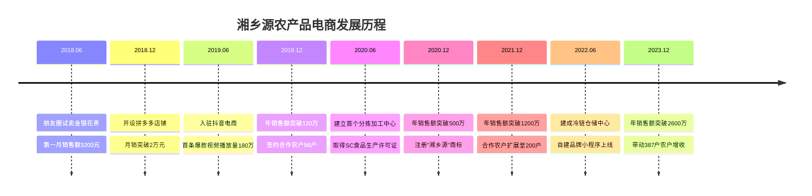
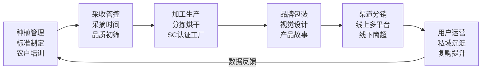
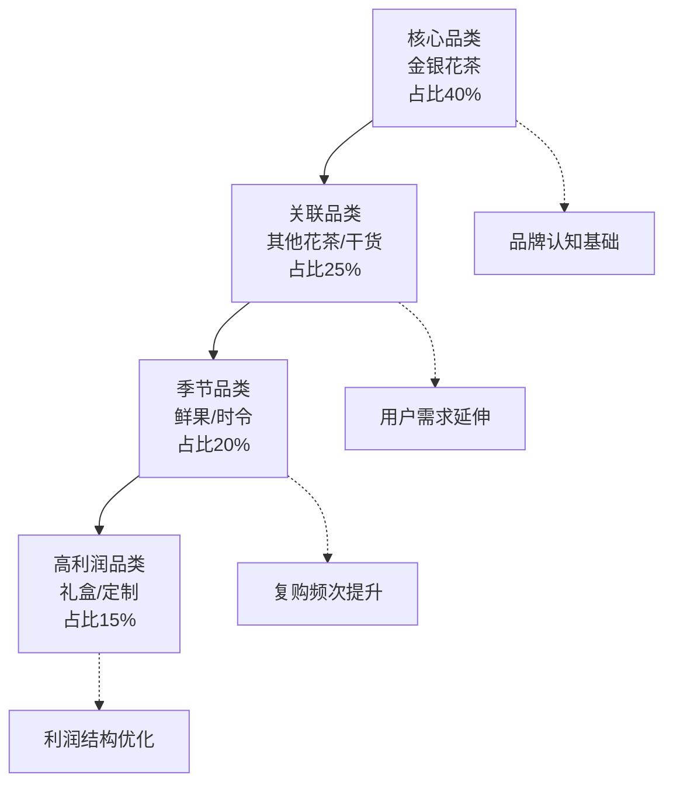
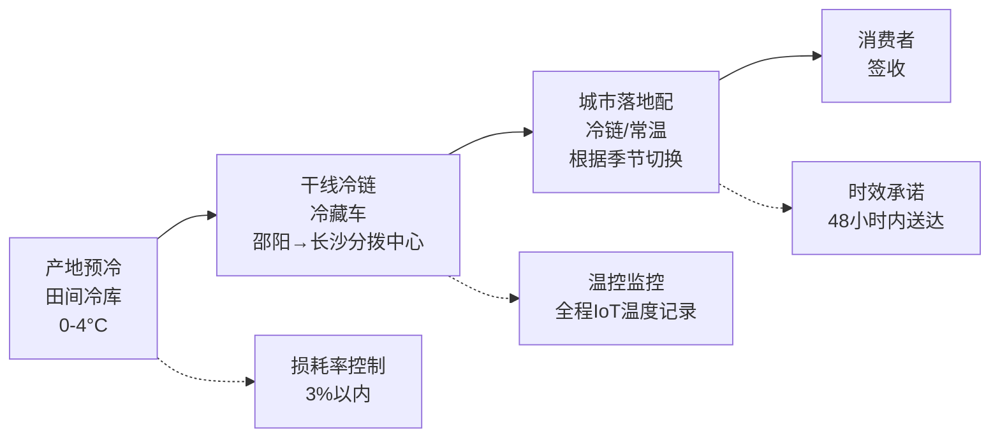
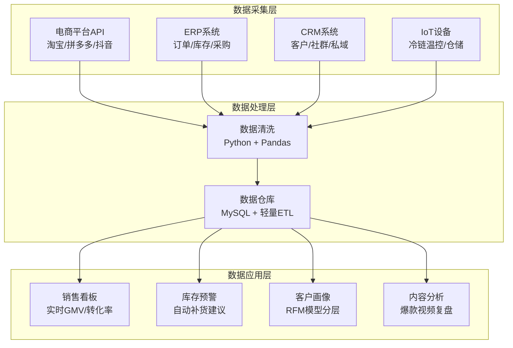
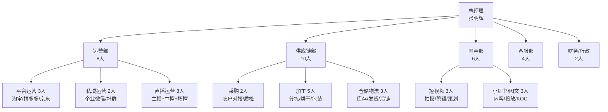

> **本章导读**：本案例完整记录了一位互联网从业者返乡创业、用4年时间将农产品电商从零做到年销售额2600万元的真实路径。案例覆盖了选品逻辑、冷启动策略、平台运营、供应链建设、品牌化扩张的全生命周期，并提炼了可复制的方法论框架。无论你是计划返乡创业的城市从业者，还是已经在做农产品电商的农村创业者，都能从中找到对应阶段的实操参考。案例中提炼的"四维选品模型""冷启动三步法""供应链三层防线"等框架，可以直接套用到你自己的项目中。
>
> **道法术器导航**：本章以"道"（乡村振兴与农产品电商的本质逻辑）为起点，经"法"（四大商业模式与选品框架），到"术"（平台运营、供应链建设、品牌化扩张的具体方法），最终落于"器"（工具清单、资质申请、资金规划的可执行方案），形成完整的知识闭环。

## 案例九：农产品电商的乡村振兴实践

### 案例背景与时代机遇

#### 乡村振兴战略下的电商风口

2017年，党的十九大首次提出"乡村振兴"战略；2021年，《乡村振兴促进法》正式施行；2023年中央一号文件明确提出"深入实施'数商兴农'和'互联网+'农产品出村进城工程"。在政策红利持续释放的背景下，农产品电商从"边缘探索"走向"主流赛道"。

一组数据揭示了这个市场的规模：

| 年份 | 农产品网络零售额（亿元） | 同比增速 | 农村网络零售额（亿元） |
|------|--------------------------|----------|------------------------|
| 2019 | 3,975 | 27.0% | 17,080 |
| 2020 | 5,750 | 31.0% | 20,800 |
| 2021 | 6,800 | 18.3% | 23,500 |
| 2022 | 7,962 | 17.1% | 25,200 |
| 2023 | 9,050 | 13.7% | 27,800 |
| 2024 | 10,200 | 12.7% | 30,500 |

（数据来源：商务部、国家统计局历年《中国电子商务报告》）

市场规模突破万亿的同时，结构性矛盾依然突出——全国约832个脱贫县中，仍有大量优质农产品"养在深闺无人识"。这正是创业者的巨大机会窗口。

**为什么现在是最好的时机？**

- **政策叠加窗口**：2024-2025年，"数商兴农"工程、"快递进村"工程、"互联网+农产品出村进城"工程三大政策同时发力，农村电商基础设施正在快速补齐
- **消费者认知升级**：后疫情时代，消费者对"原产地直供""零添加""可溯源"的需求持续走强，农产品电商的客单价年均提升15-20%
- **技术降本到位**：AI辅助内容创作、SaaS化ERP、智能客服等工具的成熟，让个体创业者也能拥有"数字化团队"的能力
- **平台流量倾斜**：抖音、拼多多、快手等平台持续加大对农产品品类的流量扶持（如抖音"富域计划"、拼多多"百亿补贴"农产品专区）

#### 农产品电商与传统电商的本质区别

农产品电商并非简单地把农产品搬到网上卖，它与标准品电商存在根本性差异，理解这些差异是做好农产品电商的前提：

| 维度 | 标准品电商（如服装、3C） | 农产品电商 |
|------|--------------------------|------------|
| 产品标准化程度 | 高，工业流水线生产 | 低，自然生长，批次差异大 |
| 保质期 | 长（1-3年） | 短（鲜品3-15天，干货6-24个月） |
| 供应链可控性 | 高，工厂按订单生产 | 低，受天气、季节、病虫害影响 |
| 消费者预期管理 | 产品一致性高，退货率低 | 产品差异大，需要"容差教育" |
| 物流要求 | 常温快递即可 | 干货常温、鲜果冷链，成本差异3-5倍 |
| 复购驱动力 | 品牌忠诚度、价格 | 品质体验、时令需求、情感连接 |
| 政策环境 | 常规工商注册 | 食品安全许可、农产品检测、地理标志认证 |
| 退款逻辑 | 七天无理由退货为主 | 品质问题退货（鲜品不支持无理由退货） |

正因为这些差异，很多在标准品电商领域成功的经验无法直接套用。张明辉的成功恰恰在于他深刻理解了这些差异，并针对性地设计了运营策略。

#### 本案例核心人物与项目概览

本案例的实践者是张明辉（化名），35岁，湖南邵阳人，2018年从深圳一家互联网公司辞职返乡。他带着8年的电商运营经验，以家乡邵阳隆回县的金银花、龙牙百合为核心产品，从一个微信朋友圈卖货的个体户，用了4年时间发展为年销售额2600万元、带动周边6个乡镇387户农户增收的农产品电商企业——"湘乡源"。

以下是项目发展的关键里程碑：



**张明辉的核心能力矩阵**：他的成功不是偶然，而是"电商经验×本地资源×持续学习"三者叠加的结果。

| 能力维度 | 张明辉的优势来源 | 你如何补齐 |
|----------|------------------|------------|
| 电商运营 | 8年深圳电商公司经验 | 系统学习平台规则，用3-6个月实践积累 |
| 内容创作 | 初期不强，边做边学 | 学习爆款视频结构，模仿+迭代 |
| 供应链管理 | 岳父家有种植基础，本地人脉 | 从已有供应链切入，不从零搭建 |
| 资金实力 | 初始投入约8万元积蓄 | 从朋友圈零成本起步，逐步积累 |
| 政策运用 | 主动对接政府部门 | 关注当地商务局、农业农村局公众号 |

### 农产品电商的四大核心模式

在深入案例细节之前，有必要先厘清农产品电商的主要商业模式，因为张明辉的成长路径恰好覆盖了从模式一到模式四的完整演进。

#### 模式一：平台店铺模式

**核心逻辑**：在淘宝、拼多多、京东等综合电商平台开设店铺，借助平台流量销售农产品。

**平台选择的关键差异**：

| 平台 | 用户画像 | 流量特点 | 费用结构 | 适合品类 | 运营重点 |
|------|----------|----------|----------|----------|----------|
| 淘宝/天猫 | 25-45岁，一二线为主 | 搜索流量为主，推荐为辅 | 佣金2-5%+推广费 | 品牌化农产品、礼盒 | SEO优化、直通车 |
| 拼多多 | 30-55岁，下沉市场 | 推荐流量为主，价格敏感 | 佣金0.6-3% | 高性价比基础款 | 低价引流、评价管理 |
| 京东 | 25-45岁，品质导向 | 搜索+自营流量 | 佣金3-8%+平台使用费 | 高品质、冷链鲜品 | 品质保障、物流时效 |
| 抖音小店 | 18-40岁，兴趣驱动 | 内容推荐流量 | 佣金1-5%+达人佣金 | 有故事、有场景的产品 | 内容创作、达人合作 |

**优势**：

- 流量现成，起步门槛低
- 平台背书增加消费者信任
- 物流基础设施完善（菜鸟、京东物流等已覆盖大部分农村地区）

**劣势**：

- 竞争激烈，价格战严重
- 平台佣金和推广费用侵蚀利润
- 客户数据归平台所有，难以建立私域

**适合阶段**：创业初期快速验证产品和市场需求。

#### 模式二：直播/短视频电商模式

**核心逻辑**：通过抖音、快手、视频号等平台的内容创作，以"原产地直播""田园生活记录"等内容形式吸引粉丝，转化为购买。

**三大内容平台对比**：

| 平台 | 流量分配 | 内容偏好 | 变现路径 | 农产品优势 |
|------|----------|----------|----------|------------|
| 抖音 | 强算法推荐 | 短平快、强情绪 | 短视频挂车+直播间 | 爆发力强，单条视频可带千单 |
| 快手 | 社交推荐+算法 | 真实、接地气 | 直播带货+信任电商 | 老铁文化，复购率高 |
| 视频号 | 社交裂变+算法 | 中老年偏好 | 直播+公众号+小程序 | 微信生态，私域转化强 |

**优势**：

- 内容即流量，不需要付费推广也能起量
- 视频展示农产品生长环境，天然建立信任
- 算法推荐机制让优质内容有机会获得爆发式增长

**劣势**：

- 内容创作能力要求高，需要持续产出
- 流量波动大，受算法变化影响
- 客单价通常偏低，退货率较高

**适合阶段**：有一定产品基础后，通过内容突破增长瓶颈。

#### 模式三：社区团购/会员订阅模式

**核心逻辑**：以城市社区为单位，团长组织居民拼团下单；或以会员制预售模式，按周/月定期配送应季农产品。

**社区团购的两种形态**：

**平台型社区团购**（美团优选、多多买菜等）：平台统一运营，团长仅负责提货点。优势是流量大、操作简单；劣势是平台抽成高（15-25%）、定价权在平台、农户利润被压缩。

**自营型社区团购**：自建小程序+自招团长+自控供应链。优势是利润高（团长分润10-15%后仍有25-35%毛利）、用户数据可控；劣势是前期搭建成本高、团长管理复杂。

**会员订阅制的运营要点**：

1. **节奏设计**：每周/每两周配送一次，与农产品成熟周期匹配
2. **组合搭配**：每次配送3-5种应季产品，创造"开箱惊喜感"
3. **定价策略**：月费制（如299元/月4次配送），比单次购买便宜15-20%
4. **退出机制**：允许暂停（而非取消），降低用户心理门槛

**优势**：

- 预售模式降低库存风险
- 复购率高，用户粘性强
- 以销定采，减少损耗

**劣势**：

- 团长管理和分润体系复杂
- 物流配送成本高（最后一公里）
- 规模化扩张速度较慢

**适合阶段**：产品线稳定、供应链成熟后的深度运营阶段。

#### 模式四：品牌化全产业链模式

**核心逻辑**：从产地源头介入，控制种植标准、加工工艺、品牌包装、渠道分销全环节，打造农产品品牌。

**全产业链的核心环节**：



**优势**：

- 品牌溢价能力强，利润率高
- 供应链可控，品质稳定
- 用户数据沉淀，可持续经营

**劣势**：

- 前期投入大（加工厂、冷链、资质认证）
- 管理复杂度高
- 需要较长的品牌建设周期

**适合阶段**：规模化发展阶段，已验证商业模式后的升级路径。

#### 四种模式对比

| 维度 | 平台店铺 | 直播短视频 | 社区团购 | 品牌全产业链 |
|------|----------|------------|----------|--------------|
| 启动资金 | 1-5万 | 3-10万 | 5-15万 | 50-200万 |
| 技能要求 | 电商运营 | 内容创作 | 社群运营 | 综合管理 |
| 起量速度 | 1-3月 | 2-6月 | 3-6月 | 6-18月 |
| 利润率 | 10-20% | 15-30% | 20-35% | 25-40% |
| 规模天花板 | 中 | 高 | 中 | 极高 |
| 核心壁垒 | 低 | 中 | 中 | 高 |
| 风险等级 | 低 | 中 | 中 | 高 |
| 适合人群 | 有电商基础 | 有内容能力 | 有社区资源 | 有资金+管理能力 |

### 从零到一：张明辉的完整创业路径

#### 第一阶段：低成本验证（2018年6月-12月）

##### 产品选择的底层逻辑

张明辉返乡后，并没有盲目开干，而是花了两周时间走遍隆回县的8个乡镇，系统调研了当地的农产品资源。他的产品选择遵循了一个核心框架——"四维筛选模型"：

**维度一：稀缺性与辨识度**

隆回县是"中国金银花之乡"，全国约60%的金银花产自这里；隆回龙牙百合则是国家地理标志产品。这些产品天然具备"一县一品"的地域标签，在电商平台上具有差异化优势。

选择地理标志产品的实际好处：

1. **信任溢价**：消费者对"XX之乡"的产品天然有品质预期，转化率比普通产品高20-30%
2. **搜索红利**：在电商平台搜索"金银花"时，产地标签是重要的排名因子
3. **政策支持**：地理标志产品在申请政府补贴、参加展会时有优先权
4. **防竞争壁垒**：地理标志有法律保护，其他产区不能使用相同名称

**如何查找当地地理标志产品**：

```text
方法一：国家知识产权局官网
  访问 https://dlj.cnipa.gov.cn/ → 地理标志检索
  → 输入省份/县市 → 查看已注册的地理标志产品列表

方法二：地方政府官网
  搜索"XX县 地理标志产品"或"XX县 特色农产品"
  → 通常农业农村局或市场监管局会有完整清单

方法三：电商平台验证
  在淘宝/拼多多搜索"XX县 特产" → 看哪些产品有产地标签
  → 关注销量和评价数据，验证市场需求
```

**维度二：标准化可行性**

农产品电商最大的挑战是"非标品"。张明辉重点评估了三个指标：

| 评估指标 | 金银花 | 龙牙百合 | 脐橙 | 腊肉 |
|----------|--------|----------|------|------|
| 外观一致性 | 高（花蕾形态统一） | 中（大小有差异） | 高 | 低 |
| 储存稳定性 | 高（干货，保质期2年） | 中（鲜品7天，干品1年） | 低（7-15天） | 高 |
| 物流适应性 | 高（轻便不易碎） | 中 | 低（易碰伤） | 高 |
| 标准化成本 | 低 | 中 | 高 | 中 |
| **综合评分** | **★★★★★** | **★★★★** | **★★★** | **★★★** |

最终，他选择了金银花茶作为切入点——干货易保存、轻便好发货、地方特色鲜明、且有药食同源的消费认知基础。

**维度三：供应链可控性**

张明辉的岳父家就有5亩金银花种植地，周边邻居也大面积种植。这意味着他可以从熟悉的农户手中以合理价格收购原料，且质量可控。他不需要从零搭建供应链，而是"站在已有供应链上做增值"。

这一点极为重要——很多返乡创业者失败的原因不是产品不好，而是供应链断裂。选择身边已有的成熟供应链，可以把"供应链建设"这个最重的环节后置，先把精力放在市场验证上。

**维度四：利润空间**

他做了一笔精确的成本核算：

```text
金银花茶（50g罐装）成本结构：
  原料成本：    6元/罐（鲜花30元/斤 → 干花120元/斤 → 50g约12元，副品级6元）
  包装成本：    2.5元/罐（铁罐+标签+封口）
  加工费：      1.5元/罐（代加工，含分拣、烘干、包装）
  快递费：      3元/罐（首重内，合作快递价）
  平台费用：    约2元/罐（佣金+技术服务费）
  ──────────────────────
  总成本：      15元/罐
  售价：        39.9元/罐（买二送一折合约26.6元/罐）
  单罐毛利：    11.6元（毛利率43.8%）
```

即使在拼多多的价格竞争环境下，43.8%的毛利依然健康。这个数字给了他足够的信心。

**农产品选品的利润底线法则**：毛利率至少要达到30%以上才能支撑后续的推广、损耗和售后成本。低于30%毛利的农产品品类，除非能走极大量，否则很难持续经营。

**利润测算的隐藏成本**：很多新手只算原料+包装+快递，忽略了以下成本项：

| 隐藏成本 | 占比 | 说明 |
|----------|------|------|
| 售后损耗 | 3-8% | 破损、变质、客户无理由退货 |
| 平台推广费 | 5-15% | 直通车、活动报名、达人佣金 |
| 仓储损耗 | 2-5% | 库存积压、过期报废 |
| 包材辅料 | 1-3% | 填充物、胶带、面单、赠品 |
| 售后成本 | 1-3% | 补发、退款、客服人力 |

实际净利润 = 毛利率 - 隐藏成本（约12-30%），因此毛利率40%的品类，实际净利率可能只有10-28%。

##### 微信朋友圈冷启动

张明辉没有一开始就开店铺，而是用最轻量的方式验证需求：

**第一步：种子用户获取**

他在朋友圈发布了一条精心设计的内容——不是硬广，而是一条"返乡日记"：

> 回到老家第三天，跟着岳父上山摘金银花。清晨五点的山间雾气还没散，露水挂在花蕾上，空气里全是清甜的味道。摘了两箩筐，晒干后能出十来斤干货。老家的金银花品质真的好，但一直卖不上价格。我想试试，有没有朋友想要的，成本价给大家尝尝。50g一罐，19.9元包邮。

这条朋友圈带来了47个咨询、23个下单——转化率接近50%。这个数据让他确认：**"返乡故事+原产地场景+低价试吃"** 是一个有效的起盘公式。

**朋友圈卖货的文案公式**：

```text
结构：场景引入 → 情感共鸣 → 产品介绍 → 信任背书 → 行动指令

场景引入："清晨五点，跟着家人上山……"（用具体时间和画面感）
情感共鸣："老家的XX品质真的好，但一直卖不上价……"（唤起同情+正义感）
产品介绍："50g一罐，19.9元包邮"（具体规格+明确价格）
信任背书："成本价给大家尝尝"（降低决策门槛）
行动指令："想要的私信我"（明确下一步动作）
```

**第二步：快速迭代产品**

收到第一批用户反馈后，他发现三个问题：

1. 简陋的塑料袋包装让产品显得廉价，送人不好意思
2. 没有产品说明，消费者不知道怎么泡、怎么搭配
3. 有些用户反馈"味道淡"——原因是采摘时间偏晚，花蕾已开放

他逐一解决：

- 花3000元找设计师做了一套山野风格的包装（牛皮纸盒+手绘插画）
- 编写了一份《金银花冲泡指南》随包裹附赠，内容包括：水温建议（85-90°C，不宜沸水）、冲泡时间（3-5分钟）、搭配建议（+枸杞明目、+菊花清热、+蜂蜜润喉）、每日饮用量（3-5g）
- 与农户约定采摘标准：花蕾未开放、颜色青白时采摘

**第三步：口碑裂变**

张明辉发现一个规律：农产品复购的核心驱动力不是营销，而是"超出预期的品质"。他在包裹里放了一张手写感谢卡，并附上一句："如果您觉得不错，帮我在朋友圈推荐一下，下次购买减5元。"

这个简单策略让他的月销售额从第一个月的3200元增长到第六个月的1.8万元，客户数从23人增长到280人——几乎全部来自朋友圈口碑推荐。

**冷启动阶段的核心数据**：

| 时间 | 累计客户 | 月销售额 | 复购率 | 客单价 | 获客成本 |
|------|----------|----------|--------|--------|----------|
| 第1个月 | 23 | 3,200元 | 0% | 19.9元 | 0元（自然流量） |
| 第2个月 | 65 | 5,800元 | 30% | 22元 | 0元 |
| 第3个月 | 110 | 9,500元 | 38% | 25元 | 0元 |
| 第4个月 | 160 | 12,000元 | 42% | 28元 | 0元 |
| 第5个月 | 220 | 15,000元 | 45% | 30元 | 0元 |
| 第6个月 | 280 | 18,000元 | 45% | 32元 | 0元 |

6个月零推广费用、280个种子用户、45%的复购率——这就是冷启动成功的标志。

#### 第二阶段：平台扩张（2019年1月-12月）

##### 入驻拼多多：低价策略的正确打开方式

2019年1月，张明辉开设了拼多多店铺。他没有犯大多数新手的错误——盲目烧钱开直通车。他的策略是：

**选品策略：引流款+利润款组合**

| 角色 | 产品 | 定价 | 目的 |
|------|------|------|------|
| 引流款 | 金银花试饮装（20g） | 9.9元包邮 | 拉新、冲销量、获取评价 |
| 利润款 | 金银花茶礼盒（100g×2罐） | 69.9元 | 主要利润来源 |
| 形象款 | 金银花+百合+菊花组合装 | 128元 | 提升店铺调性 |
| 复购款 | 金银花茶月度订阅（4罐/月） | 99元/月 | 锁定长期客户 |

**定价的"锚定效应"设计**

在商品详情页，他设置了三个规格选项：

- 20g体验装：9.9元（锚定低价，降低决策门槛）
- 50g标准装：39.9元（主推款，看起来"性价比最高"）
- 100g家庭装：69.9元（暗示"买大份更划算"）

这个设计让50g标准装的点击转化率达到了4.7%，远高于行业平均的1.8%。

**评价管理的关键动作**

拼多多的算法权重中，评价数量和评分占比极高。张明辉的做法是：

1. **前100单不赚钱**：9.9元引流款实际成本约11元（含快递），每单亏1元，但快速积累了第一批评价
2. **主动跟进差评**：每一条差评，他都亲自打电话沟通。不是求删评，而是了解问题并提出解决方案（补发/退款/送优惠券）。最终70%的差评用户主动修改了评价
3. **引导带图评价**：在包裹卡片上写"晒图评价返现3元"，带图评价率达到35%

到2019年6月，店铺月销售额稳定在6-8万元，好评率99.2%。

**拼多多农产品运营的特殊技巧**：

- **标题关键词**：核心词（金银花茶）+ 属性词（特级/烘干/无硫）+ 场景词（去火/清热/养生）+ 产地词（隆回/湖南）
- **主图设计**：第一张主图突出产品本身（实物拍摄，非渲染图），第二张突出产地场景，第三张突出使用场景，第四张突出规格对比，第五张突出好评截图
- **活动报名**：优先报名"限时秒杀"和"九块九特卖"，这两个活动对农产品品类有流量倾斜
- **售后话术**：预先准备10套常见问题的标准回复（泡法、保存方法、与XX的区别等），响应时间控制在5分钟内

##### 入驻抖音电商：内容驱动的爆发增长

2019年6月，张明辉注册了抖音账号"湘乡源·张明辉"，开始尝试短视频带货。

**内容策略的三次迭代**

**第一代内容（2019.06-09）——"产品展示型"**

最初他拍的是标准的产品介绍视频："大家好，这是我家乡的金银花茶……"这类视频播放量惨淡，最好的一条也只有2000多播放。

**问题诊断**：纯产品介绍在抖音没有差异化，用户刷到后3秒就会划走。

**第二代内容（2019.09-12）——"场景故事型"**

他转变策略，拍摄家乡的自然场景和采摘过程。一条"凌晨4点，跟着70岁的外婆上山采金银花"的视频意外爆了——180万播放，直接带来3700单订单。

**爆款分析**：

```text
视频数据拆解：
  完播率：67%（平台平均35%）
  点赞率：8.2%（平台平均3%）
  评论率：3.1%（平台平均0.8%）
  转发率：2.4%（平台平均0.5%）
  
爆款因子分析：
  ✅ 情感共鸣：70岁老人+凌晨劳作→激发用户共情
  ✅ 真实感：原生态场景，无滤镜、无美颜
  ✅ 好奇心：用户不知道金银花是这样采摘的
  ✅ 互动引导：视频结尾问"你见过凌晨4点的山间日出吗？"
```

**第三代内容（2020年起）——"人设IP型"**

张明辉将账号定位为"返乡创业的90后新农人"，持续输出四类内容：

1. **农村生活记录**（占比40%）：采摘、做饭、赶集等日常，打造亲近感
2. **产品知识科普**（占比30%）：金银花的功效、真假辨别、冲泡方法，建立专业度
3. **创业故事分享**（占比20%）：从城市白领到返乡创业的心路历程，引发共鸣
4. **助农公益**（占比10%）：帮助其他农户卖滞销产品，提升品牌社会价值

到2019年底，抖音账号粉丝达到12万，单月直播带货最高突破15万元。

**农产品短视频的爆款公式**：

| 内容类型 | 模板 | 适用场景 | 预期数据 |
|----------|------|----------|----------|
| 原产地记录 | "凌晨X点+跟XX上山+采摘过程" | 新账号冷启动 | 完播率>50% |
| 知识科普 | "你吃的XX可能是假的+辨别方法" | 建立专业度 | 收藏率>5% |
| 沉浸式加工 | ASMR风格的加工过程（无旁白） | 传递品质感 | 完播率>60% |
| 情感故事 | "爷爷种了一辈子XX+从未走出大山" | 引发传播 | 转发率>3% |
| 挑战/实验 | "用XX做了10道菜/挑战XX吃法" | 涨粉 | 点赞率>8% |
| 溯源直播 | 从采摘到发货全流程直播 | 信任建设 | 停留时长>3分钟 |

**抖音直播的农产品话术框架**：

```text
开场（前5分钟）：
  "今天带大家看看我们的金银花是怎么采的"
  → 走到田间/仓库，展示真实环境
  
产品讲解（核心15分钟）：
  "你们看这个花蕾，颜色青白、还没开放的才是最好的"
  → 现场对比不同等级，教用户辨别
  → 现场冲泡，展示汤色和口感
  
逼单（5分钟）：
  "今天直播间专属价，50g装39.9，前100单再减5元"
  → 展示库存（"就剩XX单了"）
  → 放出优惠券

收尾（5分钟）：
  "下一批鲜货后天到，想抢的点关注"
  → 引导关注，预告下次直播时间
```

#### 第三阶段：供应链建设（2020年）

随着订单量增长，供应链瓶颈开始暴露。

##### 品质失控危机

2020年3月，连续出现了多起品质投诉——有消费者反映金银花茶里有杂质、颜色发黄、味道不对。

**根本原因分析**：

```mermaid
fishbone
    title 品质投诉根因分析
    原料端 : 农户自行采摘标准不统一
           : 部分农户掺入劣等花蕾
           : 阴雨天采收导致霉变
    加工端 : 代加工厂同时服务多个客户
           : 烘干温度控制不精准
           : 分拣仅靠肉眼筛选
    包装端 : 铁罐密封性不足
           : 未充氮保鲜
           : 没有干燥剂
    物流端 : 夏季高温运输导致变质
           : 暴力分拣导致包装破损
```

这次危机让张明辉意识到：**农产品电商的核心竞争力不在前端流量，而在后端供应链**。

**危机处理的四步法**：

1. **止损**：第一时间在店铺首页公告致歉，主动联系投诉客户（补发+退款+赠品），总损失约2.3万元
2. **溯源**：对问题批次进行逐批追溯，锁定3家品质不达标的农户，暂停合作
3. **根治**：启动自建加工中心的计划，不再依赖外部代加工
4. **预防**：建立"三检制度"（进货检验→过程检验→出厂检验），每批次留样备查

##### 自建分拣加工中心

2020年6月，张明辉投入38万元（含政府创业补贴12万元），在隆回县经济开发区建了一个200平方米的分拣加工中心。核心设备清单：

| 设备名称 | 型号/规格 | 数量 | 用途 | 投入（万元） |
|----------|-----------|------|------|-------------|
| 热泵烘干机 | 5P空气能 | 2台 | 金银花低温烘干 | 8.0 |
| 色选机 | 小型CCD | 1台 | 自动分选颜色/杂质 | 6.5 |
| 金属探测仪 | 桌面式 | 1台 | 异物检测 | 0.8 |
| 充氮包装机 | 半自动 | 1台 | 延长保质期 | 2.5 |
| 封口机 | 脚踏式 | 2台 | 罐装封口 | 0.3 |
| 电子秤 | 30kg精度1g | 3台 | 称重分装 | 0.2 |
| 空调除湿系统 | 工业级 | 1套 | 车间温湿度控制 | 3.0 |
| 工作台+货架 | 不锈钢 | — | 操作和存放 | 1.5 |
| **合计** | | | | **22.8** |

剩余15万元用于装修、资质认证和首批原料采购。

**加工中心选址的关键考量**：

1. **交通便利**：距离主干道500米以内，方便原料运入和成品运出
2. **水电稳定**：加工设备对电力要求高，需要三相电接入
3. **租金合理**：县级开发区的租金通常为8-15元/㎡/月，远低于城市
4. **政策配套**：入驻开发区可享受租金减免、税收优惠等政策
5. **扩展空间**：预留了100㎡的空地，为后续扩建留余地

##### 取得SC食品生产许可证

这是一个关键但常被忽略的步骤。没有SC证，产品无法在正规电商平台销售（拼多多、天猫、京东均要求），也无法进入线下商超渠道。

**SC认证全流程详解**：

| 阶段 | 时间 | 核心任务 | 注意事项 |
|------|------|----------|----------|
| 前期准备 | 1个月 | 确定生产场所、设备到位、编写质量管理文件 | 需要食品安全管理员持证 |
| 申请提交 | 1周 | 向县级市场监管局提交申请材料 | 材料包括：营业执照、场所布局图、设备清单、管理制度 |
| 现场审查 | 2-4周 | 市场监管局派人检查生产条件 | 重点检查：环境卫生、设备状态、人员资质、制度执行 |
| 整改反馈 | 1-2周 | 根据审查意见整改 | 常见整改项：缺少防鼠设施、记录不全、分区不明确 |
| 发证 | 2-4周 | 审查通过后发放SC证书 | SC编号印在产品包装上 |

**总周期**：2-4个月，费用约5000-8000元（含检测费、咨询费）。

**关键提醒**：SC认证要求至少有一名食品安全管理人员持有健康证和培训合格证。张明辉自己考取了食品安全管理师证书，这也是后来直播中"持证上岗"的一个信任背书点。

**SC之外还需要关注的资质**：

| 资质/认证 | 是否必须 | 作用 | 申请难度 | 费用 |
|-----------|----------|------|----------|------|
| SC食品生产许可证 | 必须 | 电商平台入驻门槛 | 中等 | 5000-8000元 |
| 食品经营许可证 | 必须 | 合法经营 | 低 | 免费 |
| 商标注册 | 强烈建议 | 品牌保护 | 低 | 300元/类 |
| 绿色食品认证 | 可选 | 溢价15-30% | 中等 | 1-3万元 |
| 有机认证 | 可选 | 高端定位 | 高 | 3-8万元 |
| ISO 22000 | 可选 | 出口/大客户准入 | 高 | 2-5万元 |
| 地理标志使用授权 | 可选 | 产地背书 | 中等 | 5000-2万元 |

##### 建立农户合作标准

张明辉与周边农户签订了《金银花种植收购合作协议》，核心条款：

```text
一、种植标准
  1. 禁止使用高毒农药（参照GB 2763食品安全国家标准）
  2. 采摘时间：花蕾未开放、颜色青白（开放率<5%）
  3. 采摘时间：每日清晨5:00-9:00（露水蒸发前）
  4. 采摘后2小时内送达收购点（防止堆积发热）

二、收购价格
  1. 一级品（花蕾完整、颜色青白、无杂质）：保底价60元/斤
  2. 二级品（花蕾微开、颜色偏黄）：保底价40元/斤
  3. 等外品：不收购
  4. 市场价高于保底价时，按市场价上浮10%收购

三、质量追溯
  1. 每批次标注农户姓名、采摘日期、重量
  2. 抽样检测（农残快检），不合格批次退回
  3. 连续3次不合格的农户，解除合作关系
```

这个标准体系让原料品质从"靠运气"变成了"靠制度"。合作农户从最初的十几户扩展到56户，收购成本比市场散户价高15%，但品质稳定带来的退货率下降（从8%降到1.2%）和复购率提升（从35%升到62%）远超成本增量。

**农户合作体系的管理技巧**：

1. **保底价机制**：让农户有安全感，愿意投入精力种好产品。比市场价高10-15%的保底价，换来的是品质的大幅提升
2. **分级定价**：用价格信号引导农户种出好产品。一级品和二级品的价差（60元 vs 40元）直接激励农户提升采摘标准
3. **即时结算**：当天交货、当天结款。农户最怕赊账，即时结算是最有效的信任建设
4. **定期培训**：每月组织一次种植技术培训，由县农业局专家主讲。培训内容包括：病虫害绿色防控、科学施肥、采摘时机判断
5. **示范带动**：选3-5户"示范户"，重点扶持，让他们先赚到钱，其他农户自然跟进

#### 第四阶段：品牌化与规模化（2021-2023年）

##### 品牌建设的三步走

**第一步：商标注册与视觉体系**

2020年12月，张明辉注册了"湘乡源"商标（第30类：茶、花茶）。随后委托设计公司打造了完整的品牌视觉体系：

- **品牌色**：山野绿（#2D5A27）+ 麦穗金（#C8A951）
- **品牌符号**：一片叶子托起一滴露珠
- **品牌口号**："从山间到杯间，只隔一个快递"
- **包装风格**：原生态牛皮纸+手绘植物插画，传递"质朴、天然、匠心"

**农产品品牌的差异化路径**：

| 品牌定位 | 目标人群 | 价格策略 | 传播重点 | 代表案例 |
|----------|----------|----------|----------|----------|
| 产地直供型 | 价格敏感、追求性价比 | 低于市场20-30% | "没有中间商赚差价" | 拼多多农产品店铺 |
| 品质生活型 | 中产、注重健康 | 高于市场30-50% | "从田间到餐桌的安心" | 湘乡源 |
| 匠心手作型 | 高端、追求独特体验 | 高于市场100-200% | "传统工艺、限量供应" | 手工茶叶品牌 |
| 助农公益型 | 有社会责任感的消费者 | 平价或微溢价 | "每买一斤，农户多赚X元" | 公益助农项目 |

**第二步：产品线矩阵化**

从单一的金银花茶，扩展为覆盖"花茶+干货+鲜果+礼盒"四大品类的产品矩阵：

| 品类 | 代表产品 | SKU数 | 客单价 | 毛利率 | 销售占比 |
|------|----------|-------|--------|--------|----------|
| 花茶系列 | 金银花茶、菊花茶、玫瑰花茶 | 12 | 39-89元 | 45% | 40% |
| 干货系列 | 龙牙百合干、笋干、香菇 | 8 | 29-69元 | 38% | 25% |
| 鲜果季节 | 脐橙、黄桃、猕猴桃 | 6 | 49-99元 | 25% | 20% |
| 礼盒定制 | 节日礼盒、企业团购 | 5 | 128-368元 | 50% | 15% |

**产品线扩展的"同心圆"原则**：



核心逻辑：以最强品类建立品牌认知，然后围绕同一用户群体的关联需求扩展品类。不要跨品类太远（比如从花茶跳到生鲜海鲜），但可以在"吃的"这个大品类内横向扩展。

**第三步：多渠道品牌传播**

2021年起，张明辉在品牌传播上做了系统布局：

1. **抖音矩阵**：主账号（创业故事+产品展示）+ 子账号1（金银花种植知识）+ 子账号2（乡村美食），总粉丝量突破50万
2. **微信私域**：企业微信+社群运营，沉淀8000+核心用户，月度复购率38%
3. **小红书种草**：与20位生活类KOC合作，产出真实体验笔记
4. **政府背书**：入选"湖南省农产品电商示范企业"，获得"邵阳市青年创业带头人"称号
5. **线下触点**：在邵阳市区开设1家品牌体验店，兼做直播基地

##### 冷链物流体系建设

鲜果类产品（脐橙、黄桃等）的电商化，最大的瓶颈是冷链物流。张明辉的解决方案是"分段式冷链"：



**冷链投入明细**：

| 项目 | 规格 | 投入（万元） | 说明 |
|------|------|-------------|------|
| 田间预冷库 | 20㎡，0-4°C | 8 | 采摘后立即降温 |
| 冷藏仓储 | 50㎡，分区温控 | 18 | 含冷冻区和保鲜区 |
| 冷藏车（租赁） | 4.2米厢式 | 3/年 | 按季度租赁 |
| 温控标签 | 一次性温度记录贴 | 0.5/年 | 每包裹一张 |
| **年度合计** | | **约30** | |

冷链投入使得鲜果产品的客诉率从15%（常温发货）降至3%以下，退货率从12%降至2.5%。虽然物流成本增加了约40%，但客单价提升了60%，且打开了鲜果这个高复购品类。

**不同品类的物流方案选择**：

| 品类 | 推荐方案 | 单件成本 | 时效要求 | 损耗率控制 |
|------|----------|----------|----------|------------|
| 花茶/干货 | 普通快递 | 2.5-3.5元 | 72小时内 | <0.5% |
| 根茎类干货 | 普通快递（加固包装） | 3-4元 | 72小时内 | <1% |
| 鲜果（常温季） | 顺丰/京东标快 | 5-8元 | 48小时内 | <3% |
| 鲜果（高温季） | 冷链快递 | 8-15元 | 48小时内 | <3% |
| 冻品（如速冻粽子） | 冷链+冰袋 | 10-18元 | 36小时内 | <2% |

##### 数字化运营体系

当月销售额突破100万后，张明辉开始搭建数字化运营体系：

**数据中台架构**：



**RFM客户分层模型应用**：

张明辉将客户按"最近购买时间（Recency）、购买频次（Frequency）、消费金额（Monetary）"三个维度分为8类：

| 客户类型 | R | F | M | 占比 | 运营策略 |
|----------|---|---|---|------|----------|
| 重要价值客户 | 高 | 高 | 高 | 8% | VIP专属服务、新品优先体验 |
| 重要发展客户 | 高 | 低 | 高 | 5% | 提频促销、会员卡引导 |
| 重要保持客户 | 低 | 高 | 高 | 6% | 召回优惠券、专属客服 |
| 重要挽留客户 | 低 | 低 | 高 | 3% | 大额折扣、电话回访 |
| 一般价值客户 | 高 | 高 | 低 | 15% | 关联推荐、提升客单价 |
| 一般发展客户 | 高 | 低 | 低 | 25% | 新人礼包、首单优惠 |
| 一般保持客户 | 低 | 高 | 低 | 12% | 激活短信、限时折扣 |
| 流失客户 | 低 | 低 | 低 | 26% | 低优先级、批量短信触达 |

通过RFM分层运营，核心客户的复购率从35%提升至62%，客单价提升了28%。

**私域运营的具体打法**：

张明辉的私域体系是农产品电商中做得最扎实的环节之一：

| 渠道 | 用户数 | 核心功能 | 日均运营时长 |
|------|--------|----------|-------------|
| 企业微信个人号 | 3,200 | 1对1深度服务 | 2小时 |
| 社群（20个群） | 5,800 | 拼团、晒单、互动 | 1.5小时 |
| 公众号 | 8,000 | 品牌故事、产品科普 | 每周2篇 |
| 小程序商城 | 活跃用户2,100 | 直接成交、会员积分 | 持续运营 |

**社群运营节奏**（每周循环）：

```text
周一：新品预告 + 预售开启
周二：种植/加工幕后花絮（短视频）
周三：限时拼团活动
周四：产品知识科普（图文）
周五：用户好评展示 + 互动话题
周六：直播（产地/厨房场景）
周日：休息 + 数据复盘
```

### 风险管理：农产品电商的六大风险与应对

农产品电商的风险远高于标准品电商。以下是系统性的风险识别和应对方案：

#### 风险一：天气与自然灾害风险

**风险描述**：干旱、洪涝、冰雹、霜冻等极端天气可能导致农产品减产甚至绝收，直接影响供应链稳定性。

**应对方案**：

| 策略 | 具体措施 | 实施难度 |
|------|----------|----------|
| 产地分散 | 合作农户分布在3个以上乡镇，避免单一区域风险 | 中 |
| 安全库存 | 干货类保持15-30天安全库存，鲜果类保持3-5天 | 低 |
| 农业保险 | 投保种植险，政府补贴60-80%保费 | 低 |
| 备选品类 | 极端天气影响A品类时，快速切换到B品类主推 | 中 |
| 合同条款 | 与农户协议中加入"不可抗力"条款，明确极端天气下的处理方式 | 低 |

#### 风险二：市场竞争与价格战风险

**风险描述**：农产品电商门槛低，竞争者涌入快。拼多多平台上的价格战尤为严重，可能将利润压缩到无法持续。

**应对方案**：

- **差异化定位**：不拼价格拼品质，通过品牌故事、溯源体系、包装设计建立差异化
- **多渠道布局**：不要依赖单一平台，至少覆盖2-3个平台+私域
- **私域壁垒**：将公域流量沉淀到企业微信/社群，降低对平台的依赖
- **产品创新**：开发竞品没有的差异化产品（如组合装、定制化、深加工产品）

#### 风险三：食品安全与法律风险

**风险描述**：一次农残超标、异物混入、标签违规，可能导致店铺关闭、巨额赔偿甚至刑事责任。

**应对方案**：

1. **每批次农残快检**：投入约3000-5000元购买农残速测仪，每批次原料到货后检测
2. **产品责任保险**：年保费2000-5000元，保额100万元
3. **标签合规审查**：参照GB 7718（预包装食品标签通则）自查，避免绝对化用语
4. **建立溯源体系**：每批次记录农户信息、检测结果、加工日期，出问题可快速定位

#### 风险四：现金流断裂风险

**风险描述**：农产品电商的季节性导致现金流波动大。鲜果季需要大量采购资金，淡季收入锐减，如果资金规划不当，可能在旺季前就断粮。

**应对方案**：

```text
现金流管理三原则：
  1. 始终保持3个月运营成本的现金储备
  2. 鲜果季采购用预售回款覆盖，不垫资
  3. 干货类保持合理库存周转（30-45天），不囤货

资金储备计算公式：
  月运营成本 × 3 = 最低现金储备
  例：月均成本15万 × 3 = 45万现金储备
  
旺季采购资金来源：
  1. 预售回款（占比40-60%）
  2. 银行短期贷款（占比20-30%）
  3. 自有储备金（占比20-30%）
```

#### 风险五：人才流失风险

**风险描述**：县城招人难、留人更难。核心运营人员被挖走，可能导致业务断档。

**应对方案**：

- **核心岗位持股**：给关键员工分红权（不用给股权），让收入与业绩挂钩
- **标准化SOP**：所有岗位的工作流程文档化，降低对个人的依赖
- **本地化招聘**：优先招聘本地人（稳定性高于外地人），与当地职业学校合作
- **远程协作**：内容创作、客服等岗位可以远程办公，扩大人才池

#### 风险六：政策与合规风险

**风险描述**：食品安全法规、广告法、电商法规持续更新，不及时跟进可能踩红线。

**应对方案**：

| 风险点 | 合规要求 | 检查频率 |
|--------|----------|----------|
| 广告用语 | 不使用"最""第一""纯天然""治疗"等绝对化/功效性用语 | 每月 |
| 产品标签 | 符合GB 7718，SC编号、营养成分表完整 | 每季度 |
| 农残检测 | 符合GB 2763，每批次检测记录 | 每批次 |
| 税务合规 | 农产品免税政策（自产自销增值税免征） | 每季度 |
| 电商法规 | 七天无理由退货、消费者权益保护 | 持续 |

### 实战中的关键教训与避坑指南

#### 教训一：农产品的"非标化"陷阱

**问题描述**：农产品天然非标——同一棵树上的果子大小不一、甜度不同、外观各异。消费者在网上看到的是精修图片，收到的实物往往有落差。

**解决方案**：

1. **建立分级标准**：以脐橙为例，按果径分为70-80mm（小果）、80-90mm（中果）、90mm以上（大果），按糖度分为一级（13°Brix以上）、二级（11-13°Brix）。分级后的"一级中果"标准化程度最高，适合做电商主推款
2. **实拍图替代精修图**：在详情页放"实拍对比图"——左图是最好状态，右图是最差状态，并标注"您收到的实物将在此范围内"。这个做法将退货率降低了40%
3. **设置"容差条款"**：在商品详情页明确标注"因农产品特性，果径/色泽/形状可能存在±10%的差异，介意者慎拍"。虽然看似劝退，但实际减少了无效订单和纠纷

**标准化投入的回报测算**：

```text
以脐橙为例，投入5万元建立分选线：
  分选前：退货率12%，客诉率18%，复购率25%
  分选后：退货率3%，客诉率4%，复购率55%

  年销售额200万的情况下：
  减少退货损失：200万 × (12%-3%) = 18万
  提升复购收益：200万 × (55%-25%) × 30%毛利 = 18万
  年度增量收益：36万
  投入回报周期：5万 / 36万 = 1.7个月
```

#### 教训二：季节性断供的现金流风险

**问题描述**：农产品有明确的季节性。金银花的采摘期是5-8月，脐橙是11-1月，黄桃是7-9月。非采摘季节，如果供应链管理不善，容易出现"旺季缺货、淡季囤货"的尴尬。

**解决方案**：

1. **产品组合平滑季节性**：花茶类（四季可售）+ 干货类（保质期长）+ 鲜果类（季节性强）的组合，确保每个季节都有主推产品
2. **预售模式**：鲜果上市前1个月开始预售，用"预约锁价"模式提前锁定订单量，指导采购量
3. **安全库存公式**：`安全库存 = 日均销量 × (补货周期 + 安全天数) × 季节系数`。干货类安全天数设为15天，鲜果类设为3天

**农产品全年的品类节奏安排**：

| 月份 | 主推品类 | 营销主题 | 备注 |
|------|----------|----------|------|
| 1月 | 干货礼盒、腊味 | 年货节 | 全年第一个销售高峰 |
| 2月 | 花茶（春季养生） | 开工养生 | 春节后恢复期 |
| 3月 | 花茶组合（女神节） | 三八节礼盒 | 女性用户集中采购 |
| 4月 | 春茶、笋干 | 春季尝鲜 | 时令新品上市 |
| 5月 | 金银花（头茬） | 母亲节礼盒 | 金银花采摘季开始 |
| 6月 | 金银花+杨梅 | 618大促 | 年中大促+鲜果上市 |
| 7月 | 黄桃、西瓜 | 夏日消暑 | 鲜果高峰季 |
| 8月 | 七夕礼盒 | 七夕送礼 | 情感营销 |
| 9月 | 秋梨、板栗 | 中秋礼盒 | 第二个销售高峰 |
| 10月 | 脐橙预售 | 国庆+丰收季 | 预售锁定订单 |
| 11月 | 脐橙上市 | 双11大促 | 全年最大销售月 |
| 12月 | 年终礼盒 | 双12+圣诞 | 企业团购高峰 |

#### 教训三：直播带货的退货率危机

**问题描述**：抖音直播的冲动消费特性导致退货率偏高。张明辉早期的直播退货率一度达到25%，远高于店铺自然流量的5%。

**解决方案**：

1. **直播间"冷静期"设计**：在直播中反复强调"不着急下单，先听我讲完产品细节"，降低冲动购买比例
2. **详细的产品演示**：现场冲泡、切开展示果肉、对比不同等级，让消费者对实物有准确预期
3. **设置合理的赠品策略**：买金银花茶送冲泡杯，而非送同品类——送同品类会稀释主品价值，导致消费者觉得"多到用不完"而退货
4. **优化物流时效**：48小时内发货、提供物流追踪，减少因等待焦虑导致的退款

**直播间退货率优化的完整清单**：

```text
开播前：
  □ 产品准备充分，确保库存充足
  □ 发货团队就位，承诺48小时发货
  □ 详情页信息完整（规格、保质期、储存方法）

直播中：
  □ 展示产品实物（不要只用图片）
  □ 说明产品特性（口感、外观、用途）
  □ 提示适用人群和不适用人群
  □ 设置"冷静期"话术
  □ 不夸大功效、不做虚假承诺

发货后：
  □ 24小时内推送物流信息
  □ 3天后主动询问收货体验
  □ 引导满意用户带图评价
  □ 不满意用户快速处理（补发/退款）
```

#### 教训四：政府补贴的正确获取姿势

**问题描述**：很多返乡创业者不知道有哪些政策可以申请，或者申请流程不清楚，白白错过了大量资源。

**可申请的主要政策项目**：

| 政策项目 | 主管部门 | 补贴金额 | 申请条件 | 申请时间 |
|----------|----------|----------|----------|----------|
| 返乡创业补贴 | 人社局 | 1-5万元 | 返乡2年内、营业执照 | 每季度 |
| 电商扶贫补贴 | 商务局 | 2-10万元 | 带动贫困户增收 | 每年3-4月 |
| 农产品加工补贴 | 农业农村局 | 5-20万元 | SC认证、设备投入 | 每年5-6月 |
| 青年创业贷款 | 团委+银行 | 最高30万贴息贷款 | 45岁以下、创业计划书 | 随时 |
| 乡村振兴专项资金 | 乡村振兴局 | 10-50万元 | 产业带动能力强 | 每年申报 |
| 农业保险补贴 | 财政局 | 保费的60-80% | 种植/养殖保险 | 每年播种季 |

**申请技巧**：

1. 提前与当地商务局、农业农村局建立联系，了解最新政策
2. 准备好完整的"带动增收"数据——带动多少户、增收多少、这是政府最看重的
3. 材料要规范，最好请做过申报的专业人士协助
4. 不要一次只申请一个，多个政策可以叠加

**张明辉的补贴获取经验**：

他4年累计获得各类政府补贴约42万元，占总投入的12%。其中：

- 返乡创业补贴：3万元（一次性）
- 电商扶贫补贴：8万元（分两年）
- 农产品加工补贴：12万元（设备投入补助）
- 乡村振兴专项资金：15万元（产业带动奖励）
- 农业保险补贴：4万元（分三年）

他的经验总结：**"补贴不是白拿的，本质上是政府在投资你的带动能力。你带动的农户越多、增收越明显，能拿到的补贴就越多。"**

#### 教训五：食品安全的底线思维

**问题描述**：食品安全事故是农产品电商的"核弹"——一次严重的质量问题可能导致店铺关闭、品牌崩塌，甚至承担法律责任。

**食品安全管理体系的三层防线**：

| 防线 | 措施 | 检查频率 | 责任人 |
|------|------|----------|--------|
| 第一层：原料把控 | 农残快检、重金属检测 | 每批次 | 收购员 |
| 第二层：过程控制 | 温湿度监控、操作规范、卫生检查 | 每日 | 车间主任 |
| 第三层：出厂检验 | 感官检验、理化指标、微生物检测 | 每批次 | 质检员 |

**必须购买的保险**：

- **产品责任保险**：年保费2000-5000元，保额100万元，覆盖因产品缺陷导致的消费者人身伤害和财产损失
- **食品安全责任保险**：年保费3000-8000元，保额50-200万元，覆盖食品安全事故的赔偿和召回费用

#### 教训六：合伙人与团队管理

**问题描述**：从1个人到30个人的扩张过程中，团队管理是最大的隐性挑战。张明辉在团队扩张中踩过几个坑：

1. **亲戚管理困境**：初期雇佣了3名亲戚，效率低但不好管。后来建立"亲属回避制度"——亲属可以参与劳动岗位，但不担任管理职务
2. **核心岗位流失**：2021年，一名优秀的直播运营被竞争对手挖走。此后他建立了"核心岗位持股计划"，让关键员工持有公司分红权
3. **季节性用工**：鲜果采摘季需要大量临时工，但培训不足导致品质不稳定。后来他建立了"季节工培训手册"和"老带新"制度

**团队架构（2023年，30人）**：



**团队扩张的节奏建议**：

| 阶段 | 月销售额 | 团队规模 | 关键招聘 | 年人力成本 |
|------|----------|----------|----------|------------|
| 单人起步 | <3万 | 1人 | 自己搞定一切 | 0 |
| 第一个助手 | 3-10万 | 2人 | 打包发货+基础客服 | 5-8万 |
| 小团队 | 10-30万 | 3-5人 | +运营/内容各1人 | 20-35万 |
| 正规团队 | 30-100万 | 8-15人 | +供应链管理+直播团队 | 60-100万 |
| 规模化运营 | 100万+ | 15-30人 | +各部门负责人 | 120-240万 |

### 成果数据与商业模式验证

#### 四年成长数据一览

| 指标 | 2018年 | 2019年 | 2020年 | 2021年 | 2022年 | 2023年 |
|------|--------|--------|--------|--------|--------|--------|
| 年销售额（万元） | 12 | 120 | 500 | 1200 | 1800 | 2600 |
| 合作农户数 | 5 | 56 | 120 | 200 | 300 | 387 |
| SKU数量 | 2 | 8 | 18 | 32 | 45 | 56 |
| 团队人数 | 1 | 3 | 8 | 15 | 22 | 30 |
| 全平台粉丝量 | 0 | 12万 | 28万 | 45万 | 68万 | 95万 |
| 私域用户数 | 280 | 2000 | 5000 | 8000 | 12000 | 18000 |
| 退货率 | 2% | 5% | 6% | 4% | 3.2% | 2.8% |
| 复购率 | 45% | 38% | 42% | 52% | 58% | 62% |
| 毛利率 | 50% | 45% | 40% | 42% | 44% | 43% |
| 净利率 | 35% | 22% | 15% | 18% | 20% | 22% |

**数据解读**：

- **毛利率先降后稳**：2018年50%是因为朋友圈直接卖、无平台费用；2020年降到40%是因为自建加工中心的固定成本摊入；2021年后回升到42-43%是因为品牌溢价和产品结构优化
- **净利率U型曲线**：2020年最低（15%）是因为重资产投入期，2023年回升到22%说明规模效应开始显现
- **复购率持续攀升**：从38%到62%，说明品质和品牌建设的长期回报

#### 财务模型拆解（以2023年为基准）

```text
年度收入结构：
  花茶系列：    1,040万（40%）  毛利率45%
  干货系列：      650万（25%）  毛利率38%
  鲜果季节：      520万（20%）  毛利率25%
  礼盒定制：      390万（15%）  毛利率50%
  ─────────────────────────────────
  总销售额：    2,600万
  综合毛利：    1,092万（毛利率42%）

年度成本结构：
  原料采购：      780万
  包装材料：      156万
  加工费用：      130万
  物流快递：      312万（含冷链）
  平台费用：      104万（佣金+推广）
  人工成本：      240万（30人×年均8万）
  场地租金：       36万
  设备折旧：       28万
  其他费用：       48万
  ─────────────────────────────────
  总成本：      1,834万

净利润：        566万（净利率21.8%）
```

**各渠道贡献占比**：

| 渠道 | 销售额（万元） | 占比 | 毛利率 | 获客成本 |
|------|----------------|------|--------|----------|
| 抖音（短视频+直播） | 780 | 30% | 38% | 8-15元/人 |
| 拼多多 | 520 | 20% | 32% | 5-10元/人 |
| 淘宝/天猫 | 390 | 15% | 40% | 12-20元/人 |
| 微信私域 | 520 | 20% | 52% | 0元（老客） |
| 礼盒/团购 | 260 | 10% | 50% | 线下拓客 |
| 其他（小红书/线下） | 130 | 5% | 45% | 混合 |

**核心洞察**：微信私域以20%的销售额贡献了最高的毛利率（52%），因为获客成本为零、复购率高、不受平台佣金抽成。这验证了"公域获客、私域成交"的策略价值。

#### 社会效益

张明辉的项目带来的社会效益同样显著：

1. **农户增收**：387户合作农户年均增收1.2-1.8万元，其中脱贫户89户
2. **就业带动**：直接雇佣30人（含8名返乡青年），间接带动采摘、运输等季节性用工200余人次/年
3. **产业升级**：推动隆回金银花从"卖原料"到"卖品牌"的转变，产地收购价提升了35%
4. **人才培养**：为当地培训电商人才60余人，其中12人独立开设了网店

### 复制方法论：从案例中提炼的可执行框架

张明辉的案例并非不可复制。将他的经验提炼为一个通用框架：

#### 第一步：选品（第1-2周）

```text
选品检查清单：
  □ 是否为当地特色产品？（地理标志/独特品种）
  □ 是否具备标准化基础？（可分选、可分级）
  □ 保质期和物流适应性如何？
  □ 竞品在电商平台的表现如何？（搜索量、销量、价格带）
  □ 利润空间是否>30%？
  □ 是否有可靠的货源？（不是临时收购）
  □ 是否有食品安全隐患？（农残、重金属）
```

**工具推荐**：

- 生意参谋（淘宝）/ 多多参谋（拼多多）：查看品类搜索趋势和竞争格局
- 飞瓜数据 / 蝉妈妈：查看抖音同类产品的直播和短视频数据
- 1688.com：了解原料和包装的成本基准

**竞品分析模板**：

| 分析维度 | 数据来源 | 关注指标 | 判断标准 |
|----------|----------|----------|----------|
| 市场规模 | 生意参谋 | 月搜索量 | >10万/月有空间 |
| 竞争强度 | 拼多多 | 首页店铺数 | <50个头部卖家可进入 |
| 价格带 | 淘宝/拼多多 | 主流价格区间 | 找到空白价格带 |
| 用户痛点 | 差评分析 | 差评关键词 | 差评集中点=你的机会 |
| 内容空间 | 抖音/小红书 | 相关话题播放量 | >1亿有内容潜力 |

#### 第二步：冷启动（第3-8周）

1. 采购少量样品（200-500份），以成本价在朋友圈/微信群试卖
2. 收集反馈，迭代产品（包装、规格、品质）
3. 积累50条以上真实评价和买家秀
4. 总结"什么内容/话术最能打动消费者"

**冷启动的三个关键指标**：

| 指标 | 合格线 | 优秀线 | 不合格怎么办 |
|------|--------|--------|-------------|
| 朋友圈转化率 | >10% | >30% | 检查文案/定价/信任度 |
| 复购率（3个月内） | >20% | >40% | 检查产品品质/体验 |
| 推荐率（自发推荐） | >10% | >25% | 检查是否有推荐激励机制 |

#### 第三步：平台入驻（第9-16周）

1. 开设拼多多店铺（门槛最低，适合验证）
2. 同步开设抖音账号，每周3-5条短视频
3. 月销稳定在3万以上后，考虑入驻天猫或京东
4. 开始做微信私域沉淀（企业微信+社群）

#### 第四步：供应链升级（第6-12月）

1. 建立稳定的农户合作体系
2. 取得SC食品生产许可证
3. 根据品类需求投资加工和冷链设备
4. 建立品控流程（进货检验→过程检验→出厂检验）

#### 第五步：品牌化扩张（第2-3年）

1. 注册商标，建立品牌视觉体系
2. 产品线矩阵化，覆盖不同价格带和场景
3. 多平台+私域的全域运营
4. 争取政府政策支持和媒体曝光

**品牌建设的投入建议**：

| 项目 | 投入范围 | 优先级 | 说明 |
|------|----------|--------|------|
| 商标注册 | 300-1000元 | 最高 | 越早越好，保护品牌名 |
| 品牌VI设计 | 3000-10000元 | 高 | Logo、色彩、包装模板 |
| 产品包装升级 | 5000-20000元 | 高 | 包装是无声的销售员 |
| 品牌故事拍摄 | 5000-15000元 | 中 | 用于详情页、公众号、招商 |
| 官方小程序 | 10000-30000元 | 中 | 私域成交的基础设施 |

### 农产品电商的工具箱

#### 电商平台与运营工具

| 工具类别 | 工具名称 | 用途 | 费用 | 适用阶段 |
|----------|----------|------|------|----------|
| 电商数据分析 | 生意参谋（淘宝） | 搜索趋势、竞品分析 | 标准版免费 | 任何阶段 |
| 电商数据分析 | 多多情报通 | 拼多多竞品监控 | 99元/月起 | 入驻拼多多后 |
| 短视频数据 | 飞瓜数据/蝉妈妈 | 抖音爆款分析 | 99-299元/月 | 做抖音内容后 |
| ERP系统 | 聚水潭/旺店通 | 多平台订单/库存管理 | 3000-8000元/年 | 月销10万+ |
| 客服工具 | 晓多客服机器人 | 智能客服回复 | 1500-5000元/年 | 日咨询50+ |
| 私域工具 | 企业微信+微伴助手 | 客户管理、社群运营 | 基础版免费 | 任何阶段 |
| 设计工具 | Canva/稿定设计 | 详情页、海报、主图 | 基础版免费 | 任何阶段 |

#### 农产品检测与品控工具

| 工具/设备 | 用途 | 价格 | 推荐品牌 |
|-----------|------|------|----------|
| 农残速测仪 | 有机磷和氨基甲酸酯类农药快速检测 | 2000-5000元 | 深圳三方圆、厦门斯坦道 |
| 糖度计 | 水果糖度测量（Brix值） | 200-800元 | ATAGO（爱拓） |
| 水分测定仪 | 干货水分含量检测 | 500-2000元 | 梅特勒-托利多 |
| 温湿度记录仪 | 仓储和运输过程温湿度监控 | 100-500元/个 | 精创、美德时 |
| 金属探测仪 | 异物检测 | 3000-8000元 | 上海高晶 |

#### 内容创作工具

| 工具 | 用途 | 费用 | 说明 |
|------|------|------|------|
| 剪映 | 短视频剪辑 | 免费 | 抖音官方工具，模板丰富 |
| AI文案工具（Kimi/豆包） | 产品描述、脚本初稿 | 免费-低 | 人工修改后使用，效率提升3倍 |
| 提词器APP | 直播/拍摄提词 | 免费 | 避免忘词、保持流畅 |
| 轻抖 | 抖音数据分析 | 免费基础版 | 监控竞品、热门话题 |

### 进阶思考：农产品电商的未来趋势

#### 趋势一：AI与数字化赋能

AI技术正在深刻改变农产品电商的各个环节：

- **智能分选**：基于机器视觉的自动分级，替代人工色选，准确率从85%提升至98%。一台AI分选机（约15-30万元）可以替代5-8名分拣工人，投资回收期约12个月
- **需求预测**：基于历史销售数据、天气、节日等因素的AI预测模型，将库存周转率提升30%。目前可用的工具有：阿里数据中台、京东智能供应链、第三方SaaS（如聚水潭、旺店通）
- **内容生成**：AI辅助短视频脚本撰写、商品详情页文案、客服话术。张明辉团队开始使用AI工具批量生成产品描述和短视频脚本初稿，人工修改后发布，效率提升了3倍
- **精准营销**：基于用户画像的个性化推荐和定价策略。例如：向价格敏感用户推送折扣信息，向品质导向用户推送溯源视频

**AI工具落地的优先级**（按投入产出比排序）：

| 工具 | 投入 | 产出 | 适合阶段 |
|------|------|------|----------|
| AI客服（智能问答） | 低 | 减少50%客服工作量 | 月销10万+ |
| AI文案生成 | 低 | 效率提升3倍 | 任何阶段 |
| AI数据分析 | 中 | 库存周转提升30% | 月销50万+ |
| AI分选设备 | 高 | 品控效率提升5倍 | 月销100万+ |

#### 趋势二：产地直播常态化

从"网红带货"到"产地直播"的转变正在加速。越来越多的农民主播在田间地头开播，这种"所见即所得"的信任模式正在成为农产品电商的主流。

**产地直播的三种形态**：

1. **田间采摘直播**：在采摘现场开播，展示产品最原始的状态。优势是真实感最强，劣势是网络信号和环境噪音是常见问题
2. **加工过程直播**：在加工车间开播，展示分拣、烘干、包装全流程。优势是传递品质信心，劣势是加工场景不够"美"
3. **溯源全程直播**：从采摘到发货的完整流程，通常2-4小时。优势是信任度最高，劣势是对主播体力和内容设计要求高

**产地直播的设备清单**（总投入约3000-8000元）：

| 设备 | 推荐型号 | 价格 | 用途 |
|------|----------|------|------|
| 手机 | iPhone 15/华为Mate60 | 已有 | 主拍摄设备 |
| 手持稳定器 | DJI OM 7 | 800元 | 户外防抖 |
| 无线麦克风 | DJI Mic 2 | 1200元 | 户外收音 |
| 补光灯 | 桌面环形灯 | 200元 | 室内补光 |
| 4G/5G随身WiFi | 华为5G随行WiFi | 500元+流量费 | 户外直播网络保障 |
| 便携折叠桌 | 用于产品展示 | 100元 | 产品陈列 |

#### 趋势三：C2M（消费者直连制造）模式

消费者直接向产地下单，产地根据订单采摘、加工、发货。这种模式最大限度减少了中间环节，让消费者获得更低价格、更新鲜的产品，农户获得更高收益。

C2M在农产品领域的典型应用场景：

- **认养一棵树/一块地**：消费者预付年度费用，产地方按季节配送。年费500-2000元，消费者获得全年4-6次应季鲜果配送
- **定制化加工**：消费者选择加工方式（如金银花茶的烘干程度、脐橙的果径大小），产地按需定制
- **社区订单农业**：城市社区集体下单，产地集中采摘发货，降低物流成本

#### 趋势四：区域公用品牌崛起

从"企业品牌"到"区域公用品牌"的升级。例如"阳澄湖大闸蟹""赣南脐橙""洛川苹果"等区域品牌的成功，证明了"一方水土养一方品牌"的逻辑。地方政府+龙头企业+电商协会的三方协同，是区域品牌建设的有效路径。

**区域品牌对企业的影响**：

- **正面**：区域品牌做大后，整个产区的企业都受益（如阳澄湖大闸蟹带动了整个苏州大闸蟹产业）
- **负面**：如果某家企业出了质量问题，整个区域品牌的声誉都会受损（如某产区的农残超标事件）
- **策略**：积极参与区域品牌建设，同时建立自有品牌作为"安全垫"

#### 趋势五：跨境电商的农产品出海

随着RCEP等贸易协定的推进，中国农产品跨境电商正在快速起步。东南亚、日韩、欧美华人市场是主要目标市场。

| 目标市场 | 热门品类 | 平台选择 | 物流方案 | 准入门槛 |
|----------|----------|----------|----------|----------|
| 东南亚 | 茶叶、枸杞、红枣 | Shopee/Lazada | 跨境快递 | 低 |
| 日韩 | 绿茶、山药、蜂蜜 | 乐天/亚马逊日本 | EMS/专线 | 中（需JAS认证） |
| 欧美华人 | 干货、调味料、茶叶 | 亚马逊/独立站 | 海外仓 | 高（FDA/EU认证） |
| 中东 | 枣类、坚果、茶叶 | Amazon.ae | 跨境快递 | 中 |

### 常见问题解答

**Q1：没有电商经验，能做好农产品电商吗？**

可以，但需要降低预期。建议从"轻模式"起步——先在朋友圈卖3个月，积累产品认知和客户基础，再考虑开店铺。不要一上来就投入大量资金建仓、买设备。张明辉之所以能成功，一部分原因是他在深圳有8年的电商运营经验。如果你没有这个基础，更应该从最轻量的方式开始，边学边做。

**Q2：农产品电商的启动资金需要多少？**

取决于模式。纯线上（不开店、不建仓）：5000-1万元；拼多多店铺模式：1-3万元；自建供应链模式：10-30万元。建议用最小成本验证可行性后再加大投入。

**详细的资金规划建议**：

| 启动阶段 | 资金需求 | 用途分配 | 回本周期 |
|----------|----------|----------|----------|
| 朋友圈试卖 | 5000-8000元 | 样品采购60%+包装设计20%+快递费20% | 1-2个月 |
| 拼多多开店 | 1-3万元 | 进货50%+包装20%+推广20%+周转10% | 3-6个月 |
| 抖音+多平台 | 3-8万元 | 进货40%+设备（手机/灯光）15%+推广25%+周转20% | 6-12个月 |
| 自建供应链 | 10-30万元 | 设备40%+资质认证10%+原料30%+周转20% | 12-24个月 |

**Q3：如何解决农产品"最后一公里"配送问题？**

干货类产品用普通快递即可（与快递公司谈协议价，量大可压到3元/单以内）；鲜果类需要冷链，初期建议与顺丰冷运、京东冷链等专业服务商合作，日均单量超过100单后再考虑自建冷链。

**快递合作谈判技巧**：

1. **货比三家**：同时联系3-5家快递公司（顺丰、中通、圆通、韵达、极兔），让他们报价竞争
2. **承诺量级**：即使初期量小，也要给快递公司一个增长预期（"下个月预计日均100单"）
3. **签阶梯价**：按月单量阶梯定价（如100单以内3.5元，100-500单3元，500单以上2.5元）
4. **季节性调整**：鲜果季临时加价是正常的，但要提前协商好旺季价格上限

**Q4：遇到恶意差评和职业打假人怎么办？**

- 差评：先分析是否属实，属实则改进产品并回复致歉；不属实则向平台申诉
- 职业打假：确保产品标签、广告用语合规（不使用"最好""第一""治疗"等绝对化用语），保留好进货凭证和检测报告

**防打假合规检查清单**：

```text
□ 产品标签是否符合GB 7718（预包装食品标签通则）？
□ 营养成分表是否完整？
□ 生产日期和保质期标注是否清晰？
□ 是否使用了"最""第一""纯天然"等绝对化用语？
□ 是否暗示了保健功效（如"降血压""抗癌"）？
□ 广告页面是否有虚假宣传内容？
□ SC编号是否正确标注？
□ 进货凭证和检测报告是否完整保存？
```

**Q5：农产品电商最大的风险是什么？**

食品安全事故。一次严重的质量问题可能导致店铺关闭、品牌崩塌。务必做好进货检验（每批次农残快检）、存储管理（温湿度控制）和保质期管理（先进先出）。建议购买产品责任保险，年保费约2000-5000元，保额可达100万元。

**Q6：一个人能做农产品电商吗？**

可以，但有天花板。一个人能做的事情：朋友圈卖货、抖音拍摄、拼多多客服。一个人做不了的事情：规模化直播（需要场控、中控）、供应链管理（需要人盯加工和发货）、多平台运营（精力有限）。

**一个人 vs 团队的效率对比**：

| 工作内容 | 1人能做的上限 | 需要团队的阈值 |
|----------|--------------|----------------|
| 月销售额 | 3-5万元 | 超过5万元需要帮手 |
| 日均订单 | 20-30单 | 超过30单需要打包发货人员 |
| 短视频更新 | 每周3-5条 | 每天1-2条需要专人拍摄剪辑 |
| 直播 | 每周2-3场×2小时 | 每天直播需要专职主播 |
| 客服 | 日均50条咨询 | 超过100条需要客服人员 |

建议：月销售额超过3万元时，招第一个员工（负责打包发货和基础客服）；超过10万元时，组建3-5人小团队。

**Q7：如何判断一个农产品品类值不值得做？**

用"五看"框架：

1. **看搜索量**：在生意参谋搜索品类关键词，月搜索量>10万说明有需求
2. **看竞争度**：搜索结果首页的店铺数和销量，如果头部店铺月销都在1万+且有20家以上，说明竞争激烈
3. **看价格带**：找到主流价格区间，看是否有空白价格带可以切入
4. **看差评**：分析竞品的差评集中在哪里，那就是你的差异化机会
5. **看复购**：查看竞品的"回头客"比例，如果>30%说明品类有复购基础

**Q8：农产品电商的税务怎么处理？**

农产品电商有特殊的税务优惠政策，用好了可以显著降低成本：

| 场景 | 税务处理 | 依据 |
|------|----------|------|
| 自产自销初级农产品 | 增值税免征 | 《增值税暂行条例》第十五条 |
| 初加工农产品 | 增值税免征 | 财税〔2008〕149号 |
| 深加工农产品 | 增值税13%（小规模3%） | 正常税率 |
| 电商销售收入 | 需要申报所得税 | 企业所得税/个人所得税 |

**关键提醒**：自产自销免税需要保留"自产证明"（土地承包合同、种植记录等），否则税务机关可能不予认可。建议咨询当地税务局，确认具体操作流程。

**Q9：如何处理农产品的售后问题？**

农产品的售后与标准品不同，需要特别处理：

| 问题类型 | 处理方案 | 预防措施 |
|----------|----------|----------|
| 运输破损 | 照片核实后立即补发 | 加固包装、选择靠谱快递 |
| 品质不符 | 部分退款或补发差额 | 实拍图+容差条款 |
| 口味不合 | 解释产品特性，酌情退款 | 详情页说明口感特征 |
| 保质期问题 | 全额退款+改进 | 标注生产日期、先进先出 |
| 异物投诉 | 立即退款+溯源排查 | 金属探测仪+异物检测 |

**售后响应时效要求**：
- 普通咨询：5分钟内首次响应
- 品质投诉：1小时内给出处理方案
- 食品安全问题：30分钟内响应，24小时内解决
