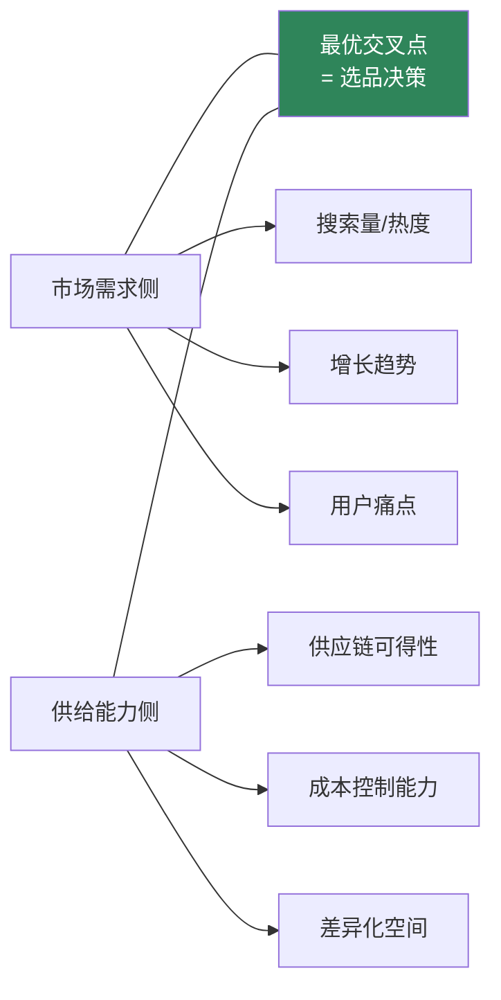
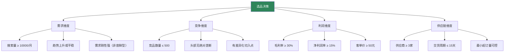
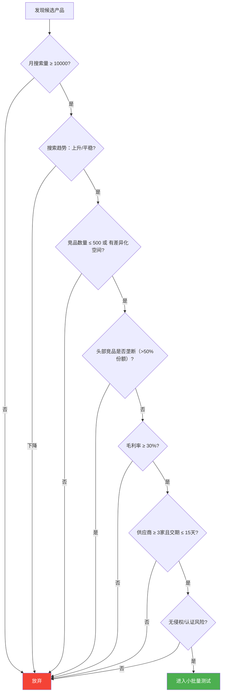
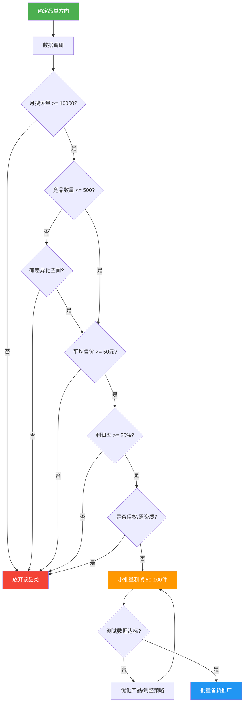

## 一、选品方法论

> 电商界有一句老话："七分靠选品，三分靠运营。"选品是电商的起点，也是决定成败的关键环节。一个好产品可以让平庸的运营也能盈利，而一个烂产品再牛的运营也救不回来。本节将系统讲解三种互补的选品方法——数据选品法、趋势选品法、差异化选品法，并提供完整的决策框架和实操模板。

### 1.1 选品的底层逻辑

在进入具体方法之前，先理解选品的本质。选品的核心是**在"市场需求"和"供给能力"之间找到最优交叉点**。



**市场需求侧**回答的问题是：消费者想买什么？这个需求有多大？是增长还是衰退？

**供给能力侧**回答的问题是：我能以什么成本拿到货？我和竞品相比有什么优势？我能持续供应吗？

只有两侧同时满足，才是一个值得做的产品。很多新手只看到"需求大"就冲进去，忽略了供给端的竞争强度和自身的资源匹配度，最终亏钱离场。

**选品的三个黄金标准：**

| 标准 | 含义 | 量化参考 |
|------|------|----------|
| 有需求 | 足够多的人在搜索和购买 | 月搜索量 ≥ 10000，日销量 ≥ 30单（头部竞品） |
| 能竞争 | 竞争强度在自身能力范围内 | 首页竞品平均评分 < 4.6，有差异化切入点 |
| 有利润 | 扣除所有成本后仍有可观利润 | 毛利率 ≥ 30%，净利润率 ≥ 15% |

#### 1.1.1 选品的四维评估框架

除了上述三个黄金标准，成熟的选品决策还需要加入第四个维度——**供应链可控性**。很多选品看起来数据完美，但因为供应链问题最终失败。四维框架如下：



四个维度中任何一个不达标，都应该放弃或重新评估。下面的选品决策树将四维评估整合为一个可执行的流程：



#### 1.1.2 选品的三个层次

选品不是一个动作，而是一个持续优化的过程。从新手到高手，选品能力分为三个层次：

| 层次 | 特征 | 方法 | 目标 |
|------|------|------|------|
| **初级：跟款选品** | 模仿已验证的成功产品 | 看平台热销榜、跟卖爆款 | 月利润 5000-20000元 |
| **中级：数据选品** | 用数据工具分析市场空白 | 评分卡+利润测算+竞品分析 | 月利润 20000-100000元 |
| **高级：趋势/创造选品** | 预判需求，创造新品类 | 社交媒体洞察+供应链创新 | 月利润 100000元+ |

新手建议从跟款选品开始，积累经验后过渡到数据选品，最终形成自己的趋势判断能力。切忌跳级——没有数据基础就去"创造需求"，失败率极高。

### 1.2 数据选品法

**核心思路**：用数据驱动选品决策，而非凭感觉。数据选品法是最科学、最可复制的方法，适合新手入门和有经验卖家的系统化选品。

**完整选品决策流程图**：



#### 1.2.1 第一步：确定品类方向

不要漫无目的地大海捞针，先划定品类范围。品类方向的选择基于三个维度：

**维度一：个人资源匹配度。** 你有什么资源？有工厂资源就从供应链优势品类入手；有行业经验就从熟悉的领域切入；什么都没有就从轻小件标品开始，降低试错成本。

**维度二：市场容量。** 品类太小做不大，品类太大竞争激烈。理想的品类是"足够大但没有绝对垄断者"——年销售额在1亿-50亿之间，前10名卖家的市场份额合计不超过40%。

**维度三：品类生命周期。** 导入期品类风险高但回报大，成长期品类是最佳进入窗口，成熟期品类竞争白热化，衰退期品类不要碰。判断方法：看品类关键词的搜索趋势曲线——持续上升是成长期，平稳是成熟期，下降是衰退期。

**补充维度四：品类结构性特征。** 有些品类天然适合中小卖家，有些品类天然被大品牌垄断。以下是品类结构的判断方法：

| 特征 | 适合中小卖家 | 不适合中小卖家 |
|------|-------------|---------------|
| 品牌集中度 | 前10名份额 < 40% | 前3名份额 > 60% |
| 产品标准化程度 | 非标品（设计、功能可差异化） | 纯标品（同质化严重） |
| 决策权重 | 低关注度（日用品、配件） | 高关注度（大家电、汽车） |
| 复购属性 | 高复购（耗材、食品） | 低复购（耐用消费品） |
| 客单价区间 | 50-500元（冲动消费区间） | >2000元（需要品牌信任） |

#### 1.2.2 第二步：数据调研

不同平台使用不同的数据工具，以下是各平台的核心工具及其关键指标：

| 平台 | 核心工具 | 关键指标 | 费用 |
|------|----------|----------|------|
| 淘宝/天猫 | 生意参谋（市场洞察） | 搜索量、点击率、转化率、竞争度、在线商品数 | 标准版 99元/年 |
| 亚马逊 | Jungle Scout / Helium 10 | BSR排名、月销量、Review数量、搜索量 | JS $49/月，H10 $79/月 |
| 抖音电商 | 蝉妈妈 / 飞瓜数据 | 热销商品、达人数据、直播数据 | 蝉妈妈 3600元/年 |
| 拼多多 | 多多情报通 | 销量、价格区间、竞品分析 | 3600元/年 |
| 跨境通用 | Google Trends | 搜索趋势、地区分布、相关查询 | 免费 |

**生意参谋实操要点（淘宝/天猫）：**

1. 进入「市场」→「搜索分析」，输入品类核心关键词
2. 查看「搜索人气」（代表需求量），「在线商品数」（代表供给量）
3. 计算**竞争系数 = 在线商品数 / 搜索人气**。竞争系数 < 1 表示供不应求，是蓝海；1-5 表示竞争适中；> 5 表示竞争激烈
4. 查看「搜索趋势」，选择近6个月呈上升趋势的品类
5. 导出数据到 Excel，进行多品类横向对比
6. **进阶技巧**：使用「市场」→「行业大盘」查看品类的整体增速。品类增速 > 20% 说明处于成长期，值得重点关注

**Jungle Scout实操要点（亚马逊）：**

1. 使用 Product Database 按条件筛选：月销量 300-3000，Review数量 < 200，售价 $15-$50
2. 使用 Keyword Scout 查看核心关键词的搜索量和趋势
3. 使用 Product Tracker 追踪目标产品的历史销量和排名变化（至少追踪2周）
4. 分析前20名Listing的Review内容，找到用户抱怨最多的点（这就是差异化机会）
5. **进阶技巧**：使用 Opportunity Score（JS内置）综合评估市场机会。评分 > 7 的产品值得重点关注

**蝉妈妈实操要点（抖音电商）：**

1. 进入「商品」→「热销商品榜」，按品类筛选，查看近7天/30天销量排行
2. 重点关注「商品卡」销量而非直播销量——商品卡销量代表自然搜索需求，更稳定
3. 查看「达人带货数据」，分析哪些达人带火了该商品，评估是否可以复制其推广路径
4. 使用「趋势分析」查看商品的搜索热度变化曲线，选择上升期商品
5. **进阶技巧**：关注「蓝海商品」板块，蝉妈妈会自动标记竞争度低但增速快的商品

**多多情报通实操要点（拼多多）：**

1. 搜索目标品类关键词，查看「商品销量排行」和「价格分布」
2. 拼多多的核心竞争维度是价格——分析销量TOP20的价格区间，找到价格空白带
3. 查看「类目热销榜」，识别拼多多特有的消费趋势（下沉市场需求往往与淘宝不同）
4. 关注「新品飙升榜」，发现近期快速增长的新品
5. **进阶技巧**：拼多多的「万人团」和「百亿补贴」商品代表平台主推方向，可以作为选品参考，但不要直接跟卖（价格战打不过）

**Google Trends实操要点（跨境通用）：**

1. 输入产品关键词，选择目标市场（美国/欧洲/全球），时间范围选「过去12个月」
2. 对比多个相关关键词的搜索趋势，选择增长最快的细分方向
3. 查看「地区分布」，确定目标市场的高需求区域（用于广告投放定位）
4. 查看「相关查询」中的「飙升」关键词——这些是新兴需求信号
5. **进阶技巧**：使用「对比」功能同时输入5个关键词，快速横向比较多个品类的趋势

#### 1.2.3 第三步：筛选标准与评分卡

建立量化的选品评分卡，给每个候选产品打分，避免主观判断：

| 评估维度 | 权重 | 评分标准（1-5分） |
|----------|------|-------------------|
| 市场需求（月搜索量） | 20% | 1分:<5000, 2分:5000-1万, 3分:1万-5万, 4分:5万-20万, 5分:>20万 |
| 竞争强度（竞品数量） | 15% | 1分:>2000, 2分:1000-2000, 3分:500-1000, 4分:200-500, 5分:<200 |
| 利润空间（毛利率） | 25% | 1分:<15%, 2分:15%-25%, 3分:25%-35%, 4分:35%-50%, 5分:>50% |
| 供应链难度 | 15% | 1分:极难获取, 2分:需定制, 3分:1688可找, 4分:工厂直接, 5分:有资源 |
| 差异化空间 | 15% | 1分:完全同质, 2分:微小差异, 3分:可改进, 4分:明显痛点, 5分:蓝海 |
| 风险等级 | 10% | 1分:高侵权/高损耗, 2分:季节性强, 3分:一般, 4分:低风险, 5分:极低风险 |

**综合评分 = 各维度得分 × 权重之和。** 综合评分 ≥ 3.5分的产品值得进入测试阶段。

**评分卡使用注意事项：**

1. **权重可调**：上述权重是通用建议。如果你的供应链资源很强，可以把「供应链难度」权重从15%提高到20%，相应降低其他维度
2. **多人评分**：如果团队选品，建议2-3人分别独立评分，取平均值，避免个人偏见
3. **红线规则**：无论总分多高，以下情况直接一票否决：侵权风险为「高」、毛利率 < 15%、供应商 < 2家
4. **动态更新**：评分卡不是一次性工具，每周更新市场数据，每月重新评估已上架产品的评分

#### 1.2.4 第四步：利润测算

很多新手只看售价和进货价的差额，忽略了隐藏成本。以下是完整的利润测算公式：

**跨境电商（亚马逊FBA）利润公式：**

```text
净利润 = 售价 - 采购成本 - 头程运费 - FBA费用 - 平台佣金 - 广告费 - 退货损失 - 其他费用

其中：
- 头程运费 = 重量(kg) × 头程单价(约30-60元/kg，海运)
- FBA费用 = 亚马逊配送费(按尺寸重量) + 仓储费(按体积/时间)
- 平台佣金 = 售价 × 品类佣金率(通常8%-15%)
- 广告费 = 售价 × 广告占比(新品期15%-25%，稳定期5%-10%)
- 退货损失 = 售价 × 退货率(通常2%-8%)
```

**国内电商（淘宝/天猫）利润公式：**

```text
净利润 = 售价 - 采购成本 - 快递费 - 平台佣金 - 推广费 - 包装费 - 退货损失

其中：
- 快递费 = 单件 3-6元（日单量 > 50可议价）
- 平台佣金 = 售价 × 0.5%-5%（按品类）
- 推广费 = 售价 × 10%-20%（直通车+引力魔方）
- 退货损失 = 售价 × 退货率(5%-15%，服装类更高)
```

**抖音电商利润公式：**

```text
净利润 = 售价 - 采购成本 - 快递费 - 平台佣金 - 达人佣金 - 推广费 - 退货损失

其中：
- 平台佣金 = 售价 × 1%-5%（按品类）
- 达人佣金 = 售价 × 20%-50%（如果走达人带货模式）
- 推广费 = 售价 × 10%-30%（千川投放）
- 退货损失 = 售价 × 退货率(15%-40%，抖音退货率普遍高于淘宝)
```

**拼多多利润公式：**

```text
净利润 = 售价 - 采购成本 - 快递费 - 平台佣金 - 推广费 - 退货损失

其中：
- 快递费 = 单件 2-4元（拼多多物流成本通常更低）
- 平台佣金 = 售价 × 0.6%-3%
- 推广费 = 售价 × 5%-15%（多多搜索+场景推广）
- 退货损失 = 售价 × 退货率(3%-10%)
```

**利润测算实例**：以一款售价89元的手机壳为例（淘宝平台）

| 成本项 | 金额 | 占售价比 |
|--------|------|----------|
| 采购成本（1688进货） | 12元 | 13.5% |
| 包装+吊牌 | 3元 | 3.4% |
| 快递费 | 4元 | 4.5% |
| 平台佣金（1%） | 0.89元 | 1.0% |
| 推广费（直通车，15%） | 13.35元 | 15.0% |
| 退货损失（退货率5%） | 4.45元 | 5.0% |
| **总成本** | **37.69元** | **42.3%** |
| **单件净利润** | **51.31元** | **57.7%** |
| **毛利率** | **86.5%** | — |

这个例子的利润率很高，因为手机壳采购成本极低。但要注意：推广费占比15%是稳定期的数据，新品期可能高达25%-30%，净利润会大幅下降。

**实操建议**：用Excel建一个利润测算模板，把所有成本项都列进去。每选一个产品就填入数据计算。**净利润率低于15%的产品不要做**——因为你不可能把每个环节都做到最优，实际利润往往比理论计算低20%-30%。

#### 1.2.5 第五步：竞品深度分析

选品不能只看宏观数据，必须深入分析竞品的具体表现。以下是竞品分析的完整框架：

**竞品分析五步法：**

1. **锁定竞品**：在目标平台搜索核心关键词，取销量排名前20的竞品。排除品牌旗舰店（不可复制），聚焦与自己定位相似的卖家
2. **拆解Listing**：逐个分析竞品的标题关键词、主图风格、详情页结构、价格策略、SKU设置、促销方式
3. **分析评论**：收集每个竞品的前100条评论（好评+差评），分类统计：好评关键词TOP5、差评关键词TOP5、用户提到但未被满足的需求
4. **追踪动态**：使用Keepa（亚马逊）或店透视（淘宝）追踪竞品的价格变动、排名变动、上新节奏
5. **评估壁垒**：判断竞品的竞争壁垒是什么——供应链优势？品牌认知？设计能力？流量资源？你能复制或超越吗？

**竞品分析模板：**

```text
竞品名称：_______________
店铺名称：_______________
月销量：___________  评分：___________
售价：___________ 元  SKU数量：___________

【Listing分析】
标题关键词：_______________
主图风格：□白底 □场景图 □模特图 □对比图
详情页长度：___________ 屏
核心卖点（前3个）：_______________

【评论分析】
好评关键词：1.___ 2.___ 3.___ 4.___ 5.___
差评关键词：1.___ 2.___ 3.___ 4.___ 5.___
未满足需求：_______________

【竞争壁垒】
□供应链优势  □品牌认知  □设计能力  □流量资源  □价格优势  □其他：___
我能否复制/超越：□能 □部分能 □不能

【可借鉴点】
1._______________
2._______________
3._______________

【可攻击的弱点】
1._______________
2._______________
3._______________
```

### 1.3 趋势选品法

**核心思路**：抓住趋势红利，提前布局，在竞争对手反应过来之前抢占市场。趋势选品法的关键是"快"——比大多数人更早发现趋势，更早上架产品。

#### 1.3.1 趋势的四个来源

**来源一：社交媒体热点**

社交媒体是新需求的"矿脉"。当一个话题在社交平台爆发时，背后往往隐藏着真实的消费需求。

| 平台 | 监控方法 | 适用品类 |
|------|----------|----------|
| 抖音 | 关注热榜、搜索"好物推荐"、追踪头部达人选品 | 新奇特、美妆、食品、家居 |
| 小红书 | 搜索"种草"笔记、关注爆款笔记的评论区需求 | 美妆、服饰、母婴、家居 |
| 微博 | 热搜话题、明星同款、影视剧植入 | 同款服饰、周边、礼品 |
| Instagram/TikTok（跨境） | Trending hashtags、viral products | 时尚、3C配件、家居创意 |

**操作方法**：每天花30分钟浏览各平台的热门内容，记录出现频率高的产品关键词。当同一个关键词在3天内出现3次以上，就值得深入调研。

**社交媒体选品的信号强度判断：**

| 信号强度 | 特征 | 行动建议 |
|----------|------|----------|
| 强信号 | 多平台同时爆发、有真实购买需求评论、话题持续3天以上 | 立即调研，2周内上架 |
| 中信号 | 单平台热点、话题持续1-2天、有讨论但购买意向不明 | 持续观察，准备供应链 |
| 弱信号 | 偶尔出现、无持续热度、娱乐性大于消费性 | 记录但不行动 |

**来源二：行业报告**

行业报告能帮你看到宏观趋势，而非被单一爆款带偏。

- **国内**：艾瑞咨询、易观分析、CBNData、亿邦动力——这些机构定期发布电商行业报告，涵盖品类趋势、消费者洞察、平台策略
- **跨境**：eMarketer、Statista、Jungle Scout年度报告、亚马逊官方品类报告
- **垂直行业**：各品类都有专业报告，如母婴行业的CBME报告，美妆行业的英敏特报告

**如何从报告中提取选品信号：**

1. 关注「增长最快的品类TOP10」——这些品类代表消费趋势的转移
2. 关注「消费者未被满足的需求」相关数据——这些是差异化选品的机会
3. 关注「新兴消费人群」的特征描述——如银发经济、单身经济、宠物经济
4. 对比连续2-3年的报告，识别趋势的持续性——1年的增长可能是偶然，3年的持续增长才是趋势

**来源三：搜索趋势工具**

- **Google Trends**：输入关键词，查看过去12个月的搜索趋势。选择"上升"而非"稳定"的品类。关注"相关查询"中的"飙升"关键词，这些往往是新兴需求
- **百度指数**：国内版的搜索趋势工具，适合查看国内消费者的需求变化
- **生意参谋搜索分析**：查看品类关键词的搜索量变化趋势

**趋势工具的组合使用策略：**

单一工具容易产生误判，建议组合使用：

1. **发现阶段**：用Google Trends/百度指数发现上升趋势关键词
2. **验证阶段**：用生意参谋/Jungle Scout验证搜索量和竞争度
3. **确认阶段**：用社交媒体搜索确认是否有真实讨论和购买意向
4. **量化阶段**：用数据工具估算市场规模和利润空间

**来源四：季节性和事件性需求**

| 时间节点 | 对应品类 | 提前布局时间 |
|----------|----------|-------------|
| 春节（1-2月） | 年货、礼品、装饰、新衣 | 提前3个月（11月） |
| 情人节（2月） | 鲜花、巧克力、饰品、情侣装 | 提前2个月（12月） |
| 开学季（3月/9月） | 文具、书包、电子产品、宿舍用品 | 提前2个月 |
| 618（6月） | 全品类大促 | 提前3个月备货 |
| 夏季（6-8月） | 防晒、泳装、空调扇、驱蚊 | 提前2个月（4月） |
| 双11（11月） | 全品类大促 | 提前4个月选品备货 |
| 圣诞节（跨境12月） | 礼品、装饰、节日服饰 | 提前4个月（8月） |
| 返校季（跨境8-9月） | 文具、电子产品、背包 | 提前3个月（5月） |
| 黑五/网一（跨境11月） | 全品类大促 | 提前4个月（7月） |
| 母亲节/父亲节 | 礼品、鲜花、健康产品 | 提前2个月 |

**季节性选品的关键原则：**

1. **提前但不过早**：提前太久会导致资金占用，提前太晚则错过红利窗口。上表的「提前布局时间」是经验值
2. **控制库存深度**：季节性产品的库存管理是核心难点。首次做季节性产品，备货量按预期销量的60%-70%准备，宁可缺货也不要积压
3. **设置止损线**：季节性产品过了销售窗口后，剩余库存必须快速清仓。提前制定清仓方案（降价促销、跨平台清货、来年再卖）

#### 1.3.2 趋势选品的时效性管理

趋势选品最大的风险是**时效性**——你看到的趋势，别人也看到了。必须建立快速反应机制：

1. **发现期（0-3天）**：发现趋势信号，初步验证可行性
2. **验证期（3-7天）**：深度调研市场需求、竞品情况、供应链可行性
3. **上架期（7-14天）**：找到供应商、完成样品确认、拍摄图片、上架产品
4. **爆发期（14-60天）**：趋势红利期，快速获取流量和订单
5. **衰退期（60天+）**：趋势消退，利润下降，逐步减少库存

**关键原则**：从发现到上架必须控制在2周以内。超过2周，红利窗口就可能关闭。这对供应链的响应速度提出了很高要求——提前建立好供应商关系，才能在趋势来临时快速反应。

**趋势选品的库存策略：**

趋势产品的库存管理与常规产品完全不同：

| 阶段 | 库存策略 | 备货量 |
|------|----------|--------|
| 爆发初期 | 少量多批，快速补货 | 7-14天销量 |
| 爆发中期 | 加大备货，确保不断货 | 14-30天销量 |
| 爆发后期 | 逐步减少，观察趋势拐点 | 7-14天销量 |
| 衰退期 | 停止补货，清仓处理 | 不再补货 |

**趋势拐点的判断方法**：当周销量连续2周下降超过15%，且搜索量同步下降，说明趋势正在消退。此时应立即停止补货并启动清仓。

### 1.4 差异化选品法

**核心思路**：避免红海竞争，寻找蓝海市场。差异化不是"做不一样的东西"，而是"解决别人没解决好的问题"。

#### 1.4.1 差异化的五个维度

**维度一：功能差异——"别人有的我更好，别人没有的我也有"**

分析竞品的差评和问答区，找到用户最常抱怨的功能缺陷，针对性改进。

案例：普通手机壳 → 防摔手机壳。市场上99%的手机壳只强调"好看"，但大量用户在评论中抱怨"不耐摔"。一款主打"军工级防摔"的手机壳，把缓冲气囊结构作为核心卖点，在竞争激烈的手机壳品类中杀出突围，月销超过10万件。

**维度二：设计差异——"颜值即正义"**

同质化产品中，设计是最低成本的差异化手段。改颜色、改造型、改包装，不需要改变产品功能，就能获得完全不同的市场定位。

案例：普通瑜伽垫 → 国风图案瑜伽垫。传统瑜伽垫只有纯色，一款融入中国山水画元素的瑜伽垫，在小红书种草后迅速走红，客单价从39元提升到128元，利润率翻了3倍。

**维度三：人群差异——"专门为某一类人设计"**

大众市场被大卖家占据，细分人群往往被忽略。找到一个特定人群的未满足需求，就能开辟一个竞争较小的市场。

案例：普通水杯 → 老人智能提醒水杯。年轻人的水杯市场已经饱和，但老年人市场几乎空白。一款带定时提醒、大字体显示、防滑设计的智能水杯，精准定位"孝心消费"——子女买给父母。客单价89元，月销5000+。

**维度四：场景差异——"换一个使用场景就是新产品"**

同一产品在不同场景下的需求差异，往往被忽视。

案例：普通瑜伽垫 → 旅行折叠瑜伽垫。传统瑜伽垫又大又重，不适合携带。一款可折叠、带收纳袋的旅行瑜伽垫，精准定位"出差/旅行也要练瑜伽"的人群。产品本身没有技术壁垒，但场景定位精准，避免了和大品牌的正面竞争。

**维度五：组合差异——"打包就是创新"**

把多个相关产品组合成套装，降低消费者的决策成本，同时提高客单价。

案例：新手妈妈待产包。单独卖奶瓶、单独卖婴儿服、单独卖产妇卫生巾，每一样都有无数竞品。但把这些组合成"新手妈妈待产包"，按孕周分阶段打包，一个链接解决所有需求，客单价从几十元提升到300-500元。

**组合差异的实操要点：**

1. **组合逻辑要合理**：不是随便把几个产品打包。组合要有明确的使用场景或用户故事，如"新手钓鱼套装""办公室午睡套装""露营入门套装"
2. **定价有吸引力**：组合价必须低于单独购买的总价，折扣率建议15%-25%。太低不赚钱，太高没有吸引力
3. **包装要统一**：组合产品的包装风格要一致，给用户"套装感"而非"杂货感"
4. **SKU管理**：组合产品中的单品也可以单独销售，满足不同用户需求

#### 1.4.2 差异化的验证方法

差异化不是自嗨，必须用数据验证。以下是验证差异化方案是否有效的三个方法：

**方法一：竞品差评分析。** 收集目标品类前20个竞品的1-3星差评（至少200条），用Excel分类统计出现频率最高的抱怨点。排名第一的抱怨点就是最强的差异化方向。

**差评分析实操流程：**

1. 在平台搜索目标品类，按销量排序，取前20个竞品
2. 逐个进入竞品评论区，筛选1-3星差评
3. 每个竞品收集至少10条差评，总计200条以上
4. 将差评按问题类型分类：质量、功能、设计、尺寸、物流、客服等
5. 统计各类问题的出现频率，排序后取TOP5
6. TOP5问题中，选择你有能力解决且成本可控的1-2个作为差异化方向

**方法二：问卷调研。** 在小红书、微信群、QQ群发布简短问卷（5-8题），目标样本量100-200人。核心问题："你在使用XX产品时，最不满意的地方是什么？""你愿意为XX改进多付多少钱？"

**问卷设计注意事项：**

1. 问题数量控制在5-8题，太长没人填
2. 避免引导性问题，如"你是否觉得XX产品的XX功能不好用？"——改为"你对XX产品的哪些方面不满意？"（开放式）
3. 包含一个价格敏感度问题："如果产品增加了XX功能，你愿意多付多少钱？"选项设置为：0元 / 5-10元 / 10-20元 / 20-50元 / 50元以上
4. 提供填写激励：小额红包、抽奖、优惠券等

**方法三：小批量测试。** 拿到样品后，先用50-100件做真实销售测试。核心观察指标：点击率（主图吸引力）、转化率（产品说服力）、退货率（产品实际体验）、复购率（用户满意度）。测试周期2-4周。

**小批量测试的关键指标与达标标准：**

| 指标 | 达标标准 | 不达标处理 |
|------|----------|-----------|
| 点击率 | ≥ 行业均值的1.2倍 | 更换主图/标题 |
| 转化率 | ≥ 行业均值 | 优化详情页/价格/评价 |
| 退货率 | ≤ 品类平均退货率 | 排查产品质量/描述准确性 |
| 好评率 | ≥ 90% | 排查产品和服务问题 |
| 复购率 | ≥ 10%（快消品）/ ≥ 3%（耐用品） | 产品满意度可能不足 |

### 1.5 跨境选品的特殊考量

跨境电商选品除了遵循上述方法论外，还需要额外考虑以下因素：

#### 1.5.1 物流适配性

跨境物流成本是选品的硬约束。选品时必须计算"体积重"和"实际重"中较大的那个：

| 产品类型 | 重量 | 尺寸 | 物流方式 | 单件运费（参考） |
|----------|------|------|----------|-----------------|
| 轻小件（饰品、手机壳） | < 500g | 小 | 邮政小包/专线 | 15-30元 |
| 标准件（服装、日用品） | 500g-2kg | 中 | 专线/FBA头程 | 30-80元 |
| 大件（家居、户外） | 2-10kg | 大 | 海运/FBA头程 | 80-300元 |
| 超大件（家具、健身器材） | > 10kg | 超大 | 海运专线 | 300元+ |

**选品原则**：新手优先选择轻小件（重量<1kg，体积<30×20×15cm），物流成本可控，头程费用低，即使退换货损失也有限。

**体积重计算公式：**

```text
体积重(kg) = 长(cm) × 宽(cm) × 高(cm) ÷ 5000（空运）或 ÷ 6000（海运）

计费重量 = MAX（实际重量，体积重）
```

**案例**：一个收纳盒实际重量0.5kg，尺寸30×20×15cm。
- 体积重 = 30×20×15÷5000 = 1.8kg（空运）
- 计费重量 = MAX(0.5, 1.8) = 1.8kg
- 头程运费 = 1.8 × 45元/kg = 81元

这个产品虽然很轻，但体积大，物流成本占比过高，可能不适合做跨境。

#### 1.5.2 合规与认证

不同国家对产品有不同的认证要求，未通过认证的产品可能被海关扣押或被平台下架：

| 目标市场 | 常见认证 | 适用品类 | 费用 | 周期 |
|----------|----------|----------|------|------|
| 美国 | FCC（电子）、FDA（食品/化妆品）、CPSIA（儿童） | 电子产品、食品、儿童用品 | 5000-30000元 | 2-6周 |
| 欧盟 | CE、REACH、WEEE | 电子产品、化学品、电器 | 8000-50000元 | 4-8周 |
| 日本 | PSE、TELEC | 电子产品、无线设备 | 10000-40000元 | 4-8周 |
| 英国 | UKCA | 电子产品、电器 | 8000-40000元 | 4-8周 |

**选品原则**：新手避开需要复杂认证的品类（电子产品、食品、化妆品、儿童用品），优先选择无需认证的品类（家居日用、运动户外、服装配饰）。

**各品类认证需求速查表：**

| 品类 | 美国 | 欧盟 | 日本 | 新手友好度 |
|------|------|------|------|-----------|
| 家居日用 | 无需 | 无需 | 无需 | ★★★★★ |
| 服装配饰 | 无需（需标签） | 无需（需标签） | 无需 | ★★★★★ |
| 运动户外 | 一般无需 | 一般无需 | 一般无需 | ★★★★☆ |
| 厨房用品 | FDA（食品接触） | 食品接触认证 | 食品卫生法 | ★★★★☆ |
| 玩具 | CPSIA | EN71 | ST标志 | ★★★☆☆ |
| 电子产品 | FCC | CE+ROHS | PSE+TELEC | ★★☆☆☆ |
| 食品/保健品 | FDA | EFSA | 厚生劳动省 | ★☆☆☆☆ |
| 化妆品 | FDA | CPNP | 医药部外品 | ★☆☆☆☆ |
| 儿童用品 | CPSIA+CPC | CE+EN71 | ST标志 | ★★☆☆☆ |
| 医疗器械 | FDA 510(k) | MDR | PMDA | ★☆☆☆☆ |

#### 1.5.3 知识产权风险

跨境电商的知识产权纠纷是国内卖家最常踩的坑。在选品阶段就要做好排查：

1. **商标查询**：在美国USPTO、欧盟EUIPO、中国商标网查询品牌名是否已被注册
2. **专利查询**：在Google Patents、USPTO查询产品外观和功能是否涉及专利
3. **版权排查**：避免使用影视IP、动漫形象、名人肖像
4. **平台排查**：在亚马逊搜索目标产品，看是否有品牌备案（Brand Registry），有的话避开

**知识产权排查实操流程：**

```text
第一步：商标排查
  → USPTO商标搜索：https://tmsearch.uspto.gov
  → EUIPO商标搜索：https://euipo.europa.eu
  → 中国商标网：https://sbj.cnipa.gov.cn
  → 搜索产品名称、品牌名、系列名，确认无在先注册

第二步：专利排查
  → Google Patents：https://patents.google.com
  → USPTO专利搜索：https://ppubs.uspto.gov
  → 搜索产品核心功能和外观设计关键词
  → 重点关注外观专利（Design Patent）——最容易被忽视

第三步：版权排查
  → 确认产品不涉及影视、动漫、游戏、名人IP
  → 确认产品图片、文案为原创或有授权

第四步：平台排查
  → 在亚马逊搜索目标产品关键词
  → 查看头部卖家是否有Brand Registry标记
  → 如有，评估其品牌覆盖范围——是核心品类还是边缘品类
```

#### 1.5.4 跨境选品的地域差异

不同市场的消费偏好差异显著，不能用一套选品逻辑覆盖所有市场：

| 市场 | 消费特征 | 优势品类 | 避坑品类 |
|------|----------|----------|----------|
| 美国 | 注重品牌和品质，愿为创新付溢价 | 家居、运动、宠物、3C配件 | 超低价商品（Temu已经卷到极致） |
| 欧洲 | 注重环保和合规，偏好简约设计 | 家居、户外、环保产品 | 需要复杂CE认证的产品 |
| 日本 | 注重细节和品质，偏好精致小巧 | 家居收纳、美妆工具、文具 | 大件商品（居住空间小） |
| 东南亚 | 价格敏感，偏好实用性强的商品 | 美妆、时尚、手机配件 | 高客单价商品 |
| 中东 | 注重外观和档次，宗教文化敏感 | 家居装饰、时尚、美妆 | 涉及宗教禁忌的产品 |

### 1.6 选品避坑清单

以下是经过大量卖家验证的"不选"清单。新手尤其要牢记——有些坑，别人替你踩过了，你就不必再踩。

**绝对不碰：**

- ❌ **侵权产品**（品牌、专利、版权）——轻则下架罚款，重则店铺封禁、法律诉讼。跨境平台上一个侵权投诉可以让你的店铺永久关闭
- ❌ **涉及安全风险的产品**（电池、化学品、食品）——一旦出安全事故，后果远超经济损失
- ❌ **法律法规限制的产品**（医疗器械、处方药、管制刀具）——违法经营的代价是刑事责任

**新手不碰：**

- ❌ **超大超重产品**（物流成本占售价30%以上）——利润被物流吃掉，且退货成本极高
- ❌ **易碎易损产品**（玻璃、陶瓷）——售后成本高，差评率高
- ❌ **季节性太强的产品**（圣诞装饰、泳装）——库存管理难度大，新手容易积压
- ❌ **需要复杂资质认证的产品**（医疗器械、婴幼儿食品）——认证周期长、费用高
- ❌ **客单价过低的产品**（售价<30元）——单件利润太薄，需要极大销量才能盈利
- ❌ **退货率超高的品类**（女装退货率30%-50%）——资金周转压力大
- ❌ **需要售后服务的产品**（电子产品故障维修）——跨境售后成本极高，纠纷率高

**谨慎选择：**

- ⚠️ **已经出现垄断者的品类**（某品牌占据50%以上市场份额）——你很难撼动品牌忠诚度
- ⚠️ **技术更新极快的品类**（消费电子产品）——库存贬值风险高
- ⚠️ **严重依赖平台活动的品类**——一旦活动结束，销量断崖式下降
- ⚠️ **供应链极度集中的品类**（只有1-2家工厂生产）——供应商议价权太强，断供风险高
- ⚠️ **需要大量用户教育的品类**——用户不了解产品，转化率低，推广成本高

### 1.7 选品工具箱

以下是各阶段推荐使用的工具，从免费到付费，从入门到专业：

| 阶段 | 工具 | 用途 | 费用 |
|------|------|------|------|
| 入门 | 1688.com | 查找供应商和采购价 | 免费 |
| 入门 | Google Trends | 查看搜索趋势 | 免费 |
| 入门 | 生意参谋（标准版） | 淘宝数据基础分析 | 99元/年 |
| 免费辅助 | 百度指数 | 国内搜索趋势分析 | 免费 |
| 免费辅助 | 企查查/天眼查 | 查供应商资质和经营状况 | 基础免费 |
| 进阶 | Jungle Scout | 亚马逊选品分析 | $49/月 |
| 进阶 | 蝉妈妈 | 抖音电商数据分析 | 3600元/年 |
| 进阶 | 卖家精灵 | 亚马逊关键词和竞品分析 | $35/月 |
| 专业 | Helium 10 | 亚马逊全链路数据工具 | $79/月 |
| 专业 | 飞瓜数据 | 抖音/快手深度数据分析 | 7800元/年 |
| 专业 | Keepa | 亚马逊历史价格和排名追踪 | $19/月 |
| 跨境专用 | AMZScout | 亚马逊竞品追踪和利润计算 | $49/月 |
| 跨境专用 | Sorftime | 亚马逊蓝海市场发现 | $39/月 |

**工具选择建议：**

1. **预算 < 1000元/年**：用免费工具（Google Trends + 1688 + 百度指数）+ 生意参谋标准版
2. **预算 1000-5000元/年**：加上蝉妈妈或Jungle Scout（根据主攻平台选择）
3. **预算 5000-20000元/年**：全套工具组合，覆盖数据分析+竞品追踪+趋势监控
4. **跨境卖家必装**：Jungle Scout + Keepa + Helium 10（三件套覆盖选品全流程）

### 1.8 选品实操模板

以下是一个可直接使用的选品评估模板。每选一个候选产品，就填写一张表，最后对比评分做出决策：

```text
产品名称：_______________
品类：_______________
目标平台：_______________
填表日期：_______________

【市场数据】
月搜索量：___________ 评分：___/5
日均销量（头部竞品）：___________
在线商品数/竞品数量：___________ 评分：___/5
搜索趋势（上升/平稳/下降）：___________
竞争系数：___________ 评分：___/5

【利润测算】
售价：___________ 元
采购成本：___________ 元
物流成本：___________ 元
平台佣金：___________ 元
推广费（预估）：___________ 元
包装+其他：___________ 元
单件利润：___________ 元
毛利率：___________ % 评分：___/5

【供应链评估】
供应商数量：___________ 评分：___/5
最小起订量：___________
交货周期：___________ 天
质量可控性：___________ 评分：___/5
备选供应商：___________

【差异化评估】
竞品主要差评点：_______________
我的差异化方案：_______________
差异化可行性：___________ 评分：___/5
差异化成本增加：___________ 元

【风险评估】
侵权风险：□无 □低 □中 □高
认证需求：□无 □有（具体：___）
季节性：□无 □弱 □强
综合风险评分：___/5

【综合评分】
加权总分：_________ / 5.0
决策：□进入测试 □继续调研 □放弃
下一步行动：_______________
```

### 1.9 常见选品误区

**误区一：跟爆款就能赚钱。** 看到别人卖得火就跟进，等你上架时往往已经是红海。爆款的生命周期通常只有3-6个月，你进场时可能已经是尾声。正确做法：分析爆款背后的用户需求，用差异化产品满足同一需求。

**误区二：只看搜索量不看竞争度。** 搜索量大的品类往往竞争也大。一个搜索量5000但竞争系数<1的品类，可能比搜索量50000但竞争系数>10的品类更适合新手。

**误区三：凭个人喜好选品。** "我觉得这个很好看/很有用"不代表市场需要。选品必须基于数据验证，而非个人偏好。你不是目标消费者（除非你真的有深度需求）。

**误区四：追求大而全。** 新手上来就想做一个大品类的所有产品，结果精力分散、库存积压。正确做法：从一个细分品类切入，做深做透后再扩展。

**误区五：忽略退货率。** 服装品类退货率30%-50%，这意味着每卖出100件就有30-50件退回来。退货的成本（来回运费+商品折旧+客服成本）会严重侵蚀利润。选品时一定要了解品类的平均退货率。

**误区六：不做利润测算就上架。** 很多新手只算了"进货价"和"售价"的差额，忽略了快递费、平台佣金、推广费、退货损失、包装成本等。实际利润往往只有毛利的30%-50%。上架前必须用1.2.4节的公式做完整测算。

**误区七：选品只看线上数据。** 线上数据反映的是已经发生的需求，但不代表未来的趋势。线下展会、工厂走访、消费者访谈都是重要的信息来源。尤其是供应链端的信息——工厂最近在做什么新款？哪些产品在展会上询价最多？这些信息往往比线上数据更有前瞻性。

**误区八：忽略竞争对手的反应速度。** 你发现了一个蓝海品类，但大卖家的资金和供应链优势意味着他们可以在1-2周内跟进。评估蓝海市场时，不仅要问"这个市场有多大"，还要问"我能在这个市场里领先多久"。如果领先窗口 < 1个月，投入产出比可能不划算。

**误区九：把测试当成正式运营。** 小批量测试的目的是验证假设，不是盈利。很多新手在测试阶段就大量投入推广费，结果测试成本过高，还没验证完假设就已经亏钱。测试阶段应控制总投入在5000元以内，用最小成本验证核心指标。

**误区十：选品完成后就不再优化。** 市场是动态变化的，今天的蓝海明天可能变成红海。选品不是一次性决策，而是持续优化的过程。每月至少复盘一次已上架产品的数据表现，及时淘汰表现差的产品，补充新品。

### 1.10 进阶：AI辅助选品

随着AI工具的普及，选品效率可以大幅提升。以下是几种AI辅助选品的方法，从简单到复杂，逐步深入：

#### 1.10.1 AI分析竞品评论

把竞品的评论导入AI工具，快速提取用户需求和痛点。这是AI辅助选品中最实用、最容易上手的方法。

**实操Prompt（通用版）：**

```text
请分析以下产品评论数据，输出以下内容：

1. 用户最满意的TOP5方面（按提及频率排序）
2. 用户最不满意的TOP5方面（按提及频率排序）
3. 用户提到但产品未满足的潜在需求（最多5个）
4. 基于以上分析，给出3个具体的产品改进建议，每个建议说明：
   - 改进内容
   - 预期用户反馈
   - 实施难度（低/中/高）
   - 预期成本增加

评论数据：
[粘贴评论内容]
```

**实操Prompt（竞品对比版）：**

```text
我正在调研[品类名称]品类，以下是3个竞品的评论数据。
请对比分析这3个竞品的优劣势，找出：
1. 用户对整个品类的共同期望（跨竞品都提到的需求）
2. 每个竞品的独特优势（其他竞品不具备的）
3. 所有竞品都未满足的需求（差异化机会）
4. 综合建议：如果我要进入这个品类，应该主打什么差异化方向？

竞品A评论：[粘贴]
竞品B评论：[粘贴]
竞品C评论：[粘贴]
```

#### 1.10.2 AI生成差异化方案

输入品类信息和竞品分析结果，让AI生成差异化方案。

**实操Prompt：**

```text
我正在做[品类名称]的选品，以下是市场和竞品信息：

市场数据：
- 月搜索量：XXX
- 平均售价：XX元
- 竞品数量：XXX
- 市场趋势：上升/平稳/下降

竞品分析：
- 主要竞品：[列出3-5个竞品]
- 竞品共同特点：[列出]
- 用户主要痛点：[列出TOP5]

我的资源：
- 预算：XX万元
- 供应链：有/无工厂资源
- 擅长领域：[列出]

请生成10个差异化选品方案，每个方案包含：
1. 差异化方向
2. 目标用户画像
3. 产品核心卖点
4. 预估成本和售价
5. 可行性评估（高/中/低）
6. 潜在风险
```

#### 1.10.3 AI监控趋势

设置定时任务，每天抓取社交媒体和电商平台的热门关键词，用AI分析趋势。

**自动化工作流示例（需要编程基础）：**

```text
1. 数据采集层：
   - 用Python爬虫每天抓取抖音热榜、小红书热搜、Google Trends
   - 数据存储到本地数据库或Google Sheets

2. AI分析层：
   - 每天定时将采集的数据发送给AI（Claude/GPT）
   - AI分析哪些关键词是新兴趋势、哪些是短暂热点
   - 输出：趋势关键词列表 + 置信度评分

3. 人工决策层：
   - 每天查看AI推送的趋势报告
   - 对高置信度趋势进行人工验证
   - 验证通过后进入选品流程
```

**趋势分析Prompt：**

```text
以下是今天的社交媒体热点数据，请分析哪些可能是电商选品机会：

数据来源：[抖音热榜/小红书热搜/Google Trends]
数据内容：
[粘贴热点关键词列表]

请按以下维度评估每个热点的电商潜力：
1. 产品化可能性（能否转化为具体产品？）
2. 需求持续性（是短暂热点还是持续需求？）
3. 竞争预期（其他人跟进的速度和数量？）
4. 供应链可行性（能否快速找到供应商？）
5. 综合推荐指数（1-10分）

只推荐综合推荐指数 ≥ 7 的项目。
```

#### 1.10.4 AI辅助定价

输入竞品价格区间、成本结构、目标利润率，让AI计算最优定价策略。

**实操Prompt：**

```text
请帮我分析以下产品的最优定价策略：

产品信息：
- 产品名称：[名称]
- 采购成本：XX元
- 物流成本：XX元
- 平台佣金率：X%
- 推广费占比：X%（新品期）/ X%（稳定期）
- 退货率：X%
- 目标净利润率：≥ 15%

竞品价格分布：
- 低价竞品（TOP3低价）：XX元, XX元, XX元
- 中价竞品（TOP3中价）：XX元, XX元, XX元
- 高价竞品（TOP3高价）：XX元, XX元, XX元

请给出：
1. 建议售价及理由
2. 不同售价下的利润率对比表
3. 定价策略（渗透定价/撇脂定价/竞争定价）
4. 促销期和稳定期的价格调整建议
```

#### 1.10.5 AI选品的局限性

AI是工具，不是决策者。以下是使用AI辅助选品时需要注意的局限：

1. **数据时效性**：AI的训练数据有截止日期，无法反映最新的市场变化。AI给出的趋势判断需要实时数据验证
2. **缺乏供应链感知**：AI不了解你的实际供应链能力、资金状况、团队配置。AI推荐的方案需要结合自身资源评估
3. **过度乐观倾向**：AI倾向于给出积极的建议，可能会低估竞争风险和执行难度。对AI的"可行性评估"要打7折理解
4. **无法替代实地验证**：AI分析的是文字和数据，无法替代你亲自试用产品、走访供应商、与消费者交流的体验。最终决策必须基于多维度验证

**正确的AI使用姿势**：把AI当作"研究助理"而非"决策顾问"。让AI帮你快速处理大量信息、生成初步方案，但最终的选品决策由你自己做——因为只有你最了解自己的资源、能力和风险承受度。

### 1.11 选品决策的终极检验清单

在做出最终选品决策之前，用以下清单逐项检验。任何一项答案为"否"，都应该重新评估：

```text
□ 这个产品的月搜索量 ≥ 10000？
□ 搜索趋势是上升或平稳（非下降）？
□ 竞品数量 ≤ 500 或者我有明确的差异化方案？
□ 头部竞品没有形成垄断（前3名份额 < 50%）？
□ 毛利率 ≥ 30%（含所有成本）？
□ 净利润率 ≥ 15%（含推广费和退货损失）？
□ 我能找到 ≥ 3家供应商？
□ 供应商交货周期 ≤ 15天？
□ 产品无侵权风险（已做商标/专利/版权排查）？
□ 产品无复杂认证需求或我已完成认证？
□ 产品不在"绝对不碰"清单上？
□ 我有预算完成小批量测试（5000元以内）？
□ 我能在2周内完成从选品到上架的全流程？
□ 这个产品我愿意投入至少3个月的时间运营？
□ 如果测试失败，最大损失在我可承受范围内？

通过率 ≥ 13/15：强烈推荐进入测试
通过率 10-12/15：谨慎推荐，补齐短板后再测试
通过率 < 10/15：不推荐，重新选品
```
