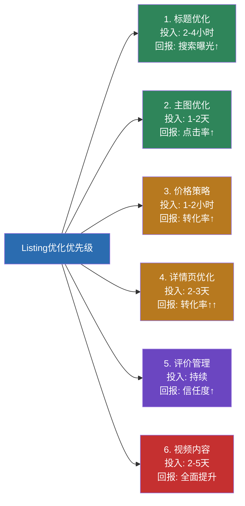
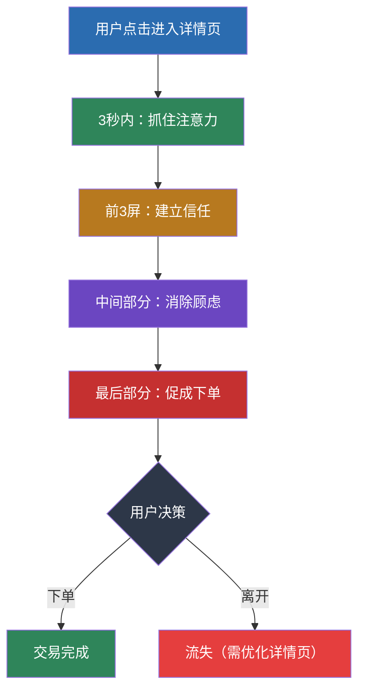
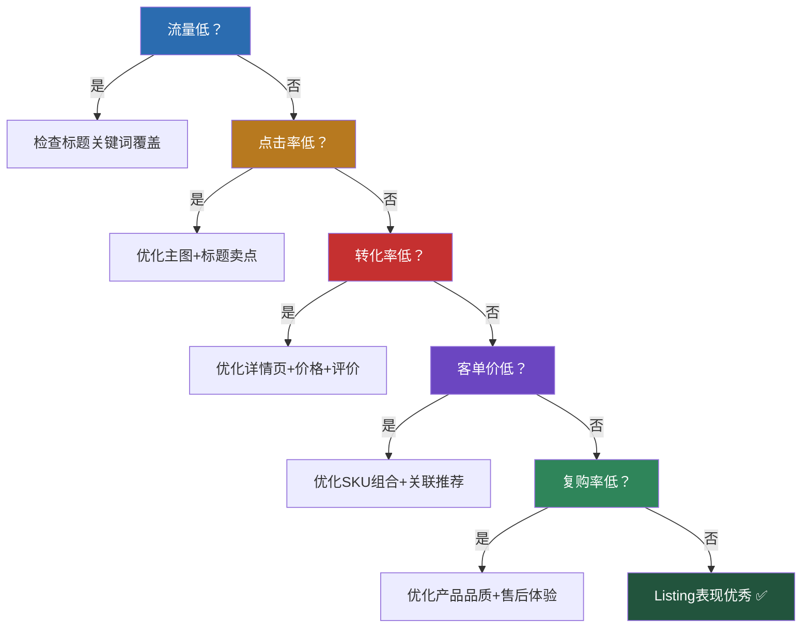

## 二、Listing优化技巧

### 1. 为什么Listing优化是电商运营的核心能力

在电商的"人、货、场"模型中，Listing是"场"的核心载体。消费者无法触摸实物、无法面对面询问，所有购买决策都依赖于Listing传达的信息。一个优秀的Listing和一个平庸的Listing之间的差距，远不只是"好看"与否——它直接决定了点击率、转化率、搜索排名和最终销售额。

**Listing优化的投入产出比在所有电商运营动作中排名第一。** 理由很简单：流量获取需要持续花钱（直通车、千川投放），而Listing优化是一次性投入、长期受益的事情。一个转化率从2%提升到3%的Listing，相当于在流量不变的情况下销售额增长50%，而这个提升不需要多花一分钱广告费。

| 优化维度 | 对应指标 | 影响程度 | 优化难度 |
|----------|----------|----------|----------|
| 标题优化 | 搜索曝光量 | 决定能否被搜索到 | 中等 |
| 主图优化 | 点击率（CTR） | 决定用户是否点击进入 | 中等 |
| 视频内容 | 点击率+转化率 | 提升30%-80%的转化效果 | 较高 |
| 详情页优化 | 转化率（CVR） | 决定进店用户是否下单 | 较高 |
| 价格/促销 | 下单决策 | 决定最终成交 | 中等 |
| 评价管理 | 信任度 | 决定犹豫用户是否下单 | 持续性 |

这六个维度构成了一个完整的转化漏斗，任何一个环节的短板都会导致流量的浪费。

#### 1.1 Listing优化的底层逻辑：平台算法视角

要真正理解Listing优化，必须先理解平台的流量分配逻辑。电商平台的核心目标是**最大化平台GMV（成交总额）**，而GMV = 流量 × 转化率 × 客单价。因此，平台的搜索算法天然倾向于把流量分配给"能为平台创造最大GMV"的商品。

以淘宝为例，其搜索排序的核心公式可以简化为：

```text
商品综合排名 = f(相关性, 商品质量分, 店铺质量分, 人气分, 时效性)

其中：
- 相关性：标题关键词与用户搜索词的匹配程度
- 商品质量分：点击率、转化率、收藏加购率、停留时长
- 店铺质量分：店铺评分（DSR）、退款率、纠纷率、发货速度
- 人气分：销量、评价数量、好评率
- 时效性：新品加权、季节性加权、活动加权
```

**理解这个公式的关键结论：**

1. **标题决定你能不能被看到**（相关性）——标题没有的关键词，用户搜不到你
2. **主图决定用户愿不愿意点**（点击率）——搜索结果中有你但没人点，排名会下降
3. **详情页决定用户买不买**（转化率）——用户点了但不买，排名也会下降
4. **评价决定平台信不信你**（商品质量分+人气分）——差评多=平台不敢给你流量
5. **以上四个指标形成正循环或负循环**——好Listing越来越好，差Listing越来越差

这就是为什么Listing优化如此重要：它不仅影响单个商品的表现，还通过平台算法形成正反馈循环，放大每一个优化动作的效果。

#### 1.2 Listing优化的时间投入与优先级

对于新卖家或资源有限的团队，需要明确优先级：



**核心原则：先做好标题和主图（决定流量入口），再优化详情页和价格（决定转化），最后做视频和评价管理（锦上添花）。** 不要在详情页还没做好的时候就去拍视频——先把基础转化链路打通。

### 2. 标题优化：让用户搜索时找到你

#### 2.1 标题的本质：关键词与人话的平衡

标题在电商平台上有两个受众：**搜索引擎**和**消费者**。搜索引擎需要通过标题判断你的商品与用户搜索词的相关性，从而决定是否展示你的商品；消费者需要通过标题快速判断这个商品是否是自己想要的。

很多新手卖家犯的第一个错误就是把标题当成关键词堆砌场，写出"2024新款夏季女装连衣裙韩版修身显瘦气质女神范碎花中长裙"这样机器能读但人看着难受的标题。另一个极端是写出"超美的连衣裙，穿上就是仙女"这样人话十足但搜索引擎完全无法匹配的标题。

**正确的标题策略是：核心关键词前置保证搜索匹配，修饰词在后保证可读性和点击欲望。**

标题优化的ROI在所有Listing优化动作中最高，因为：
- 标题修改成本最低（不需要拍摄、设计）
- 标题直接影响搜索曝光量（搜索流量是电商最大的免费流量来源）
- 一个精准的长尾关键词可以带来持续稳定的精准流量

#### 2.2 标题关键词布局公式

经过大量实操验证，以下标题公式适用于绝大多数电商平台：

```text
[品牌词] + [核心关键词] + [属性词1] + [属性词2] + [场景/人群词] + [差异化卖点]
```

**各组成部分详解：**

| 组成部分 | 作用 | 示例 | 注意事项 |
|----------|------|------|----------|
| 品牌词 | 品牌搜索入口 | "华为""三只松鼠" | 有品牌力的品牌放在最前面；新品牌或无品牌可省略 |
| 核心关键词 | 搜索流量入口 | "连衣裙""蓝牙耳机" | 必须是搜索量最大的品类词，参考平台搜索下拉词 |
| 属性词1 | 产品特征 | "纯棉""真丝""降噪" | 选择搜索量高的属性词，用数据验证 |
| 属性词2 | 补充特征 | "长袖""入耳式""大容量" | 与属性词1形成互补，不要重复 |
| 场景/人群词 | 精准定位 | "通勤""学生""跑步" | 帮助目标用户快速识别"这是我的菜" |
| 差异化卖点 | 竞争优势 | "7天无理由""顺丰包邮""送耳机" | 与竞品形成差异，刺激点击 |

**实战案例拆解：**

以蓝牙耳机为例，假设你卖的是一款百元级真无线蓝牙耳机，核心卖点是降噪和长续航。

```text
❌ 错误标题：蓝牙耳机无线2024新款运动跑步降噪超长续航入耳式
   问题：关键词堆砌，没有可读性，用户读完不知道这个耳机的核心优势是什么

✅ 正确标题：【品牌名】蓝牙耳机 真无线降噪 超长续航48小时 运动跑步防水 适用于苹果安卓
   改进：品牌前置→核心词→核心卖点→场景词→兼容性说明，逻辑清晰
```

再看一个非标品（服装）的例子：

```text
❌ 错误标题：女装裙子2024新款夏装连衣裙女裙子碎花裙女夏季裙子
   问题：关键词重复（"裙子"出现4次），浪费宝贵的字符位

✅ 正确标题：【品牌名】法式碎花连衣裙 女夏收腰显瘦 V领中长裙 通勤约会气质
   改进：风格前置→品类词→核心卖点→款式细节→场景词，每个词都有独立信息量
```

#### 2.3 关键词挖掘的五大方法

**方法一：平台搜索下拉词**

这是最基础也最直接的方法。在淘宝/京东/拼多多的搜索框输入核心品类词，下拉框中出现的所有词都是平台根据用户真实搜索行为推荐的高频词。记录这些词并按搜索热度排序，选择与你产品最匹配的词组合进标题。

操作步骤：
1. 打开平台首页，在搜索框输入核心品类词（如"连衣裙"）
2. 记录下拉框中出现的所有长尾词（约8-10个）
3. 继续输入核心词+属性词（如"连衣裙 纯棉"），获取更精准的长尾词
4. 用生意参谋/数据罗盘等工具查询各关键词的搜索量和竞争度
5. 优先选择"搜索量中高 + 竞争度中低"的关键词

**进阶技巧：** 除了搜索框下拉词，还要关注搜索结果页的"筛选栏"和"相关搜索"区域。筛选栏中的选项（如"材质""风格""尺码"）是平台识别出的该品类核心属性维度，也是用户高频筛选条件，应该作为属性词纳入标题。

**方法二：竞品标题逆向分析**

找到你所在品类中销量排名前10-20的商品，把它们的标题全部复制下来，用分词工具拆解成单个关键词，统计每个关键词出现的频率。出现频率最高的关键词就是这个品类的"流量密码"——因为卖家们经过市场验证后都选择了这些词。

操作步骤：
1. 搜索你的品类核心词，按销量排序，取前20个商品
2. 将20个标题复制到Excel表格中
3. 手动或用分词工具（如"结巴分词"Python库）拆解成关键词单元
4. 统计每个关键词的出现次数和出现频率
5. 按频率排序，选择出现频率最高且与你产品匹配的关键词

**Python分词示例：**

```python
import jieba
from collections import Counter

titles = [
    "蓝牙耳机真无线降噪超长续航运动跑步防水",
    "无线蓝牙耳机主动降噪入耳式超长待机",
    # ... 更多竞品标题
]

all_words = []
for title in titles:
    words = jieba.cut(title)
    all_words.extend(words)

# 统计词频
word_freq = Counter(all_words)
for word, count in word_freq.most_common(30):
    print(f"{word}: {count}")
```

**方法三：平台广告工具反查**

利用平台的广告投放工具获取关键词数据。淘宝的"直通车→流量解析"、亚马逊的"Brand Analytics"、拼多多的"推广工具"都可以查看关键词的搜索量、点击率和竞争度。这些数据是最精准的，因为它们来自平台的真实广告系统。

| 平台 | 关键词工具名称 | 关键数据维度 | 使用方法 |
|------|--------------|------------|----------|
| 淘宝/天猫 | 直通车→流量解析 | 搜索量、点击率、转化率、竞争度 | 输入关键词查看数据，筛选高搜索低竞争词 |
| 京东 | 京准通→关键词推荐 | 搜索量、推荐出价、竞争指数 | 系统推荐+手动搜索结合 |
| 拼多多 | 推广工具→关键词推荐 | 搜索热度、竞争强度 | 关注"蓝海词"（搜索高竞争低） |
| 亚马逊 | Brand Analytics / Helium 10 | 搜索频率排名、点击份额、转化份额 | 分析Top 3 ASIN的关键词策略 |
| Shopee | 热门关键词 / 知虾 | 搜索量、关联商品数 | 关注各站点的本地化热词 |

**方法四：社交媒体需求洞察**

小红书、抖音、知乎等社交平台上，用户的搜索词、热门话题和评论区讨论反映了真实的消费需求。例如小红书上"通勤穿搭 连衣裙"是高频搜索，说明"通勤"是一个重要的场景词，可以在标题中加入。

具体操作方法：
1. 在小红书搜索你的品类词，查看"搜索推荐"和"大家都在搜"
2. 浏览Top笔记的标题和标签（#话题），提取高频场景词和痛点词
3. 在抖音搜索品类词，查看"相关搜索"和热门视频的文案关键词
4. 在知乎搜索品类词，查看高赞回答中反复出现的需求描述词

**方法五：AI辅助关键词扩展**

2026年的AI工具可以大幅提升关键词挖掘效率。利用大语言模型（如ChatGPT、Claude、文心一言等）进行关键词扩展：

```text
提示词示例：
"我卖的是[产品描述]，目标用户是[用户画像]。
请帮我列出：
1. 用户可能用来搜索这个产品的20个关键词（包括口语化表达）
2. 5个长尾关键词（3个词以上的组合）
3. 3个场景化搜索词
4. 按搜索意图分类（信息型、交易型、导航型）"
```

**注意：** AI生成的关键词需要与平台数据交叉验证。AI可以帮你"想出"你没想到的词，但搜索量和竞争度必须用平台工具确认。

#### 2.4 不同平台的标题规范差异

不同平台对标题的字数限制、关键词权重算法和展示方式都有差异，需要针对性优化：

| 平台 | 标题字数限制 | 展示特点 | 优化重点 |
|------|------------|----------|----------|
| 淘宝/天猫 | 60个字符（30个汉字） | 搜索结果中完整展示 | 关键词全面覆盖，核心词前置 |
| 京东 | 45个汉字 | 搜索结果中完整展示 | 品牌词+品类词+属性词的规范排列 |
| 拼多多 | 60个字符 | 搜索结果中截断展示 | 前20个字必须包含核心卖点 |
| 抖音电商 | 30个汉字 | 信息流中部分展示 | 简洁有力，突出卖点和价格 |
| 亚马逊 | 200字符 | 搜索结果中截断展示 | 前80字符是黄金区域，核心关键词必须在这里 |
| Shopee | 60-120字符（因站点而异） | 搜索结果中截断展示 | 前30字符决定点击，后半部分补充关键词 |

#### 2.5 隐藏关键词与后端搜索词

很多卖家只关注标题中的"可见关键词"，却忽略了平台提供的"隐藏关键词"字段——这是极其浪费的机会。

**淘宝/天猫的"搜索关键词"字段：**
在商品编辑页面，有单独的"搜索关键词"（或称"商品卖点""导购标题"）字段，这些词不会展示给用户，但会被搜索引擎索引。在这个字段中补充标题中放不下的长尾关键词、同义词和近义词。

**亚马逊的Search Terms字段：**
亚马逊后台允许填写最多250字节的Search Terms，这些词不出现在Listing中但会被索引。填写原则：
- 不要重复标题中已有的词
- 用空格分隔，不需要逗号
- 包含同义词、缩写、常见拼写错误
- 不要放竞品品牌名（违规）
- 用小写字母即可（不区分大小写）

**Shopee的关键词标签：**
Shopee允许每个商品添加多个关键词标签，这些标签参与搜索匹配。建议填写5-10个与产品相关但标题中未覆盖的关键词。

#### 2.6 标题优化的迭代策略

标题不是写完就不动的。正确的做法是建立"数据监测 → 分析诊断 → 调整优化 → 效果验证"的闭环：

1. **数据监测**：每周记录每个商品的搜索曝光量、点击率和转化率
2. **分析诊断**：曝光量低说明关键词覆盖不够或竞争度过高；点击率低说明标题不吸引人或主图有问题；转化率低说明标题承诺与实际产品不匹配
3. **调整优化**：每次只修改标题中1-2个关键词，不要大改（大改会导致搜索权重重置）
4. **效果验证**：修改后观察7-14天的数据变化，与修改前同期对比

**黄金法则：标题修改频率控制在每2-3周一次，每次改动幅度不超过30%。** 频繁大幅修改标题会导致搜索引擎重新评估你的商品权重，短期内搜索排名反而会下降。

**标题优化的季节性策略：**
- **换季前2-4周**：在标题中加入应季词（如"夏季""秋冬""新年"）
- **大促前1-2周**：加入活动相关词（如"618""双11""年货节"）
- **热点事件期间**：快速加入相关热度词（需与产品相关，不要蹭无关热点）
- **大促结束后**：及时移除活动词，避免标题与实际不符

### 3. 主图优化：让用户在搜索结果中点击你

#### 3.1 主图的决定性作用

在电商平台的搜索结果页中，用户面对的是几十甚至上百个商品的主图。用户平均只花0.5-1秒扫视一个商品，决定是否点击。在这不到1秒的时间里，主图承担了90%的决策权重——标题和价格是辅助，主图才是第一印象。

**数据说话：** 优质主图的点击率（CTR）通常在3%-8%，而普通主图的CTR只有1%-2%。在同样1000次搜索曝光下，8%CTR的主图能获得80次点击，而1.5%CTR的主图只有15次点击——5倍的流量差距，完全来自主图质量。

#### 3.2 高点击率主图的五个核心要素

**要素一：清晰的产品主体**

产品必须在主图中占据60%-70%的画面，背景干净简洁，产品细节清晰可辨。避免以下常见错误：
- 产品太小，用户看不清是什么
- 背景过于复杂，喧宾夺主
- 图片模糊或分辨率不足（建议至少800×800像素）
- 使用过多的文字覆盖产品

**要素二：突出核心卖点**

用简洁的文字或视觉元素在主图上突出产品的核心差异化卖点。卖点文字控制在3-5个字，字号要大，位置要在产品旁边或上方，颜色要与背景形成强对比。

卖点展示的优先级（按转化影响力排序）：
1. 价格优势（"9.9元""买一送一"）
2. 功能卖点（"30天续航""IPX8防水"）
3. 品质背书（"纯手工""进口原料"）
4. 信任标识（"7天无理由""顺丰包邮"）

**要素三：场景化呈现**

将产品放在使用场景中展示，帮助用户想象拥有产品后的状态。例如：
- 连衣裙：模特在咖啡厅、办公室等真实场景穿着
- 蓝牙耳机：年轻人在跑步、通勤时佩戴
- 家居用品：摆放在温馨的客厅或卧室中

场景化主图比纯白底产品图的点击率平均高20%-40%，因为用户更容易产生代入感。

**要素四：色彩对比与差异化**

观察你的竞品主图的整体色调，然后选择一个明显不同的色调。如果竞品普遍使用白色背景，你可以尝试深色或暖色背景；如果竞品都是平铺拍摄，你可以尝试俯拍或45度角拍摄。差异化的目的不是标新立异，而是在搜索结果的一片同质化图片中让用户的眼睛停在你这里。

**实操方法：** 搜索你的核心关键词，截取搜索结果前20个商品的主图，铺在一张画布上整体观察。找出"视觉公约数"（大家都用的元素），然后刻意避开这些公约数，做出视觉差异。

**要素五：平台规范合规**

每个平台对主图都有具体的规范要求，违反规范会被降权甚至下架：

| 平台 | 尺寸要求 | 格式要求 | 禁止事项 |
|------|----------|----------|----------|
| 淘宝/天猫 | 800×800以上，建议1200×1200 | JPG/PNG，≤3MB | 纯文字图、牛皮癣（过多文字覆盖）、盗用他人图片 |
| 京东 | 800×800以上 | JPG/PNG | 促销信息过多、拼接图、边框图 |
| 拼多多 | 750×750以上 | JPG/PNG | 白底图为主图、促销价标识 |
| 亚马逊 | 1000×1000以上，建议2000×2000 | JPG/TIFF/PNG，纯白背景（RGB 255,255,255） | 主图必须纯白背景+产品占比85%以上，不能有文字、logo、配件 |
| Shopee | 800×800以上 | JPG/PNG | 过多文字、边框 |

#### 3.3 主图拍摄的实操指南

**基础设备清单：**

| 设备 | 推荐选择 | 预算 | 说明 |
|------|----------|------|------|
| 相机 | 手机（iPhone 13及以上/华为P50及以上） | 已有 | 现代旗舰手机的拍照能力完全够用 |
| 补光灯 | 18寸环形灯+柔光箱 | 200-500元 | 均匀柔和的光线是好图的基础 |
| 背景 | 纯色背景纸/布（白色、灰色、米色） | 30-100元 | 根据品类选择合适的背景色 |
| 三脚架 | 手机三脚架 | 30-80元 | 保证拍摄角度稳定，图片清晰 |
| 修图工具 | Canva/醒图/美图秀秀 | 免费-几百元/年 | 基础修图完全够用 |

**拍摄流程（以服装为例）：**

1. **布光**：主灯放在产品左前方45度，辅灯放在右后方补光，消除硬阴影
2. **摆放**：服装平铺或挂在衣架上，整理好褶皱，保证线条流畅
3. **构图**：产品占画面60%-70%，留出空间放卖点文字
4. **拍摄**：使用三脚架固定手机，设置定时拍摄避免手抖
5. **后期**：调整亮度和对比度→裁剪到平台要求尺寸→添加卖点文字→导出

**不同品类的主图拍摄技巧：**

- **服装类**：必须有模特实拍或人台展示，纯平铺图点击率低30%以上。展示正面+侧面两个角度
- **食品类**：突出食欲感，用暖色调灯光，适当添加食材或餐具作为道具
- **3C数码类**：突出科技感和质感，使用深色背景，展示产品细节（接口、按键）
- **家居类**：场景化拍摄，在真实的家居环境中展示产品使用状态
- **美妆类**：展示质地和色彩，可以拍手臂试色图或使用前后对比

#### 3.4 五张主图的策略布局

大多数电商平台提供5张主图位（有些平台支持更多）。每张主图的作用不同，需要策略性地安排内容：

| 主图位置 | 内容定位 | 说明 |
|----------|----------|------|
| 第1张（封面图） | 最佳展示+核心卖点 | 搜索结果中展示的图，决定点击率，投入最多精力 |
| 第2张 | 产品全貌/多角度 | 展示产品的正面、侧面或打开状态 |
| 第3张 | 核心卖点/功能展示 | 用图文结合的方式详细展示一个核心卖点 |
| 第4张 | 使用场景/细节特写 | 场景化展示或产品材质、工艺等细节 |
| 第5张 | 信任背书/促销信息 | 质检报告、品牌故事、买赠活动、售后保障 |

**关于主图视频的重要补充（2026年）：**

目前主流平台都已支持主图视频，且视频内容在搜索结果中的展示权重越来越高。淘宝/天猫的主图视频位、亚马逊的Video位、抖音的视频主图——视频已经从"加分项"变成"必选项"。

主图视频的最佳实践：
- 时长控制在15-30秒（太短信息不足，太长用户不看完）
- 前3秒必须抓住注意力（展示最震撼的画面或核心卖点）
- 产品使用过程>静态展示（动态内容停留时长高40%以上）
- 必须有字幕（大量用户静音浏览）
- 画面比例与平台要求一致（通常1:1或3:4）

### 4. 视频内容：2026年Listing的必备要素

#### 4.1 视频为什么成为Listing的核心竞争力

2026年的电商环境中，视频内容已经从"锦上添花"变成"必不可少"。核心原因有三个：

**第一，平台流量倾斜。** 淘宝的"逛逛"、抖音的"商城"、亚马逊的"Inspire"——所有平台都在推视频化内容，发布视频内容的商品获得更多免费流量推荐。

**第二，用户行为变迁。** Z世代（1995-2010年出生）已经成为电商消费主力，他们更习惯通过短视频了解产品而非阅读图文。数据显示，观看产品视频的用户的转化率比只看图文的用户高73%。

**第三，信息传达效率。** 一段30秒的视频可以传达的信息量相当于10张图片+2000字文案。视频可以同时展示产品的外观、功能、使用场景和效果，这是图文无法比拟的。

#### 4.2 电商视频的四种类型与制作方法

**类型一：产品展示视频（主图视频）**

用途：展示产品外观、核心功能和使用场景
时长：15-30秒
制作成本：低（手机拍摄即可）

制作要点：
- 开头3秒：产品最佳角度+核心卖点文字
- 中间部分：产品多角度展示+核心功能演示
- 结尾：品牌logo+促销信息

脚本模板（以保温杯为例）：
```text
0-3秒：产品特写 + "12小时超长保温"大字
3-10秒：倒入热水→密封→放入包中（展示便携性）
10-20秒：12小时后打开→温度计显示68°C（展示保温效果）
20-25秒：多个颜色展示+使用场景切换
25-30秒：品牌logo + "限时特惠" + 引导点击
```

**类型二：功能演示视频**

用途：详细展示产品某个核心功能的使用过程
时长：30-60秒
制作成本：中等

适合品类：3C数码（手机壳防摔测试）、家电（扫地机器人清扫效果）、美妆（粉底液遮瑕效果）

**类型三：用户场景视频（UGC风格）**

用途：模拟真实用户的使用体验，增强代入感
时长：15-45秒
制作成本：低-中等

关键要素：
- 使用"第一人称视角"拍摄（像用户自己在用）
- 画面不需要太精致，"真实感"比"精美感"更重要
- 展示"使用前→使用后"的对比效果
- 加入真人出镜的口播或字幕解说

**类型四：品牌故事视频**

用途：建立品牌认知和情感连接
时长：1-3分钟
制作成本：较高

适合高客单价产品或有品牌故事的品牌。展示品牌理念、生产过程、品质把控等。

#### 4.3 视频制作的低成本方案

对于中小卖家，不需要专业摄影团队也能做出合格的电商视频：

**方案一：手机拍摄+免费剪辑**
- 设备：手机+三脚架+补光灯（与主图拍摄共用）
- 剪辑工具：剪映（免费）、CapCut（海外版免费）
- 成本：0元（已有设备的情况下）

**方案二：AI辅助制作**
- 使用AI视频生成工具（如可灵、即梦、Sora等）生成产品展示视频
- 适合标准化产品（如日用品、食品包装等）
- 成本：几十到几百元/月的订阅费

**方案三：外包制作**
- 在猪八戒、Fiverr等平台找视频制作服务
- 主图视频：100-500元/条
- 品牌视频：1000-5000元/条
- 注意：需要提供详细的产品信息和拍摄要求

### 5. 详情页优化：让用户从浏览变成下单

#### 5.1 详情页的说服逻辑

如果说主图决定用户是否点击，那么详情页就决定用户是否下单。用户进入详情页后，平均浏览时间只有30-90秒。在这短短的时间内，你需要完成以下说服任务：



#### 5.2 详情页的"黄金结构"

经过大量A/B测试验证，以下详情页结构的转化率最高：

**第一屏（前3张图）：视觉冲击 + 核心卖点**

这是用户看到的第一部分内容，必须在3秒内回答用户的三个问题：
- 这是什么产品？→ 清晰的产品大图
- 它能帮我解决什么问题？→ 核心卖点一句话概括
- 为什么选它而不是别家？→ 差异化优势（数据/对比）

示例布局（以保温杯为例）：
```text
图片1：产品最佳角度大图 + "12小时超长保温"大字
图片2：温度实测对比图（倒入沸水→12小时后→温度计显示68°C）
图片3：与竞品的对比表格（保温时长、材质、重量、价格四项对比）
```

**第二屏（第4-8张图）：信任建立 + 产品详解**

用户已经被你的卖点吸引，现在需要确信你说的是真的。这部分需要提供证据：

- **产品参数详解**：材质、尺寸、重量、容量等核心参数，用表格或信息图展示
- **使用场景展示**：2-3个典型的使用场景，帮助用户想象拥有产品后的状态
- **品质证明**：检测报告、材质证书、专利证书等信任状
- **生产过程展示**：工厂实拍、工艺流程、质检环节，证明品质可控
- **品牌故事**（如果有品牌力）：简短的品牌理念和创立故事

**第三屏（第9-12张图）：消除顾虑 + 细节展示**

用户已经对产品产生兴趣，但还在犹豫。这部分要主动解决用户可能的顾虑：

- **细节特写**：材质纹理、做工细节、包装展示
- **使用教程**：产品使用步骤图文说明
- **常见问题FAQ**：主动回答用户可能的疑问（尺寸选择、色差说明、清洗方法等）
- **售后保障**：退换货政策、质保期限、客服联系方式

**第四屏（最后1-2张图）：促单 + 连带推荐**

- **促销信息**：限时优惠、买赠活动、满减规则
- **套餐推荐**：搭配购买更划算的组合方案
- **好评截图**：精选3-5条真实好评（带图评价效果最佳）

#### 5.3 详情页文案的说服技巧

**技巧一：AIDA模型**

这是经典的营销说服框架，适用于详情页的每一张图文：

| 环节 | 说明 | 详情页应用 |
|------|------|------------|
| Attention（注意） | 抓住注意力 | 首屏用强视觉冲击和核心数据 |
| Interest（兴趣） | 引发兴趣 | 展示使用场景和效果对比 |
| Desire（欲望） | 激发欲望 | 用用户好评和销量数据强化 |
| Action（行动） | 促成行动 | 限时优惠、赠品、售后保障 |

**技巧二：FABE法则**

针对每个卖点，用FABE框架展开说明：

| 元素 | 含义 | 示例（保温杯） |
|------|------|----------------|
| Feature（特征） | 产品的客观属性 | 采用316不锈钢内胆 |
| Advantage（优势） | 这个属性带来的好处 | 比304不锈钢更耐腐蚀、更安全 |
| Benefit（利益） | 对用户的实际价值 | 装酸性饮料也不会析出有害物质，全家人都能放心用 |
| Evidence（证据） | 证明以上说法的依据 | 附SGS检测报告截图 |

**技巧三：数据化表达**

抽象的品质描述没有说服力，具体的数据才有。对比以下两种写法：

```text
❌ "我们的保温杯保温效果非常好"
✅ "实测数据：倒入100°C沸水，12小时后温度68°C，24小时后温度52°C"
   （配温度计实拍图）

❌ "这款面膜补水效果很好"
✅ "使用后皮肤含水量提升47%，实测8小时后含水量仍然高于使用前32%"
   （配皮肤水分检测仪数据图）

❌ "这个背包很能装"
✅ "主仓容量25L，可放入15.6寸笔记本+3件换洗衣服+洗漱包+折叠伞"
   （配实际装入物品的图片）
```

**技巧四：痛点→方案→效果的叙事结构**

每个核心卖点都用"痛点→方案→效果"三段式展开：

```text
痛点：夏天出门不到2小时，水壶里的水就变成温水了，喝起来一点都不爽
方案：我们采用双层真空隔热技术，中空层厚度达到行业标准的1.5倍
效果：实测12小时后水温仍然68°C，冬天出门一整天都能喝到热水
```

**技巧五：社会证明叠加**

在详情页中多处嵌入社会证明元素，形成"很多人都在买"的从众效应：
- 销量数据："累计售出50,000+件"
- 评价数据："12,000+条好评，好评率99.2%"
- 权威背书："央视推荐品牌""获得XX认证"
- 名人/KOL背书："XX博主同款"（需真实授权）
- 用户证言：精选2-3条高质量用户评价截图

#### 5.4 移动端详情页的专项优化

超过85%的电商流量来自移动端（2026年数据），但很多卖家的详情页仍然按照PC端思维制作。移动端详情页有其独特的设计要求：

**尺寸适配原则：**
- 图片宽度：750px（淘宝/天猫标准宽度）
- 文字大小：正文不小于24px，标题不小于32px
- 单张图片信息量不要过多（手机屏幕小，信息密度太高看不清）
- 重要信息放在图片上半部分（用户可能不会滑动到图片底部）

**移动端加载速度优化：**
- 单张图片大小控制在200KB以内
- 总详情页图片数量控制在12-15张以内
- 使用WebP格式（比JPG小30%-50%，平台通常自动转换）
- 避免使用超长的长图（加载慢且用户需要反复缩放）

**移动端阅读习惯适配：**
- 用户在手机上是"竖向滑动"浏览，不是"横向翻页"
- 每张图片之间的逻辑衔接要自然，像"讲故事"一样引导用户往下滑
- 在图片底部设置"悬念"或"钩子"，激励用户继续滑动查看

#### 5.5 详情页的常见错误

**错误一：图片堆砌，没有逻辑**

很多卖家把产品图片简单地堆在详情页里，没有清晰的逻辑顺序。用户看完后不知道这个产品的核心优势是什么，自然不会下单。

**错误二：只展示不说明**

放了很多产品图片，但没有文字说明。用户需要自己猜测图片想表达什么——大多数用户不会费这个劲。

**错误三：卖点太多太杂**

一页详情页里展示了十几个卖点，每个都只用一句话带过。结果用户什么都记不住。正确做法是突出2-3个核心卖点，每个都用足够的篇幅展开论证。

**错误四：忽视手机端适配**

超过85%的电商流量来自移动端，但很多卖家的详情页是在电脑上制作的，在手机上要么文字太小看不清，要么图片太大加载慢。**必须在手机上预览和调试详情页。**

**错误五：抄袭竞品详情页**

直接复制竞品的详情页文案和图片布局。一方面有侵权风险，另一方面你的产品和竞品不可能完全一样，照搬的详情页无法突出你自己的差异化优势。

**错误六：忽视详情页的加载速度**

详情页图片过多或单张图片过大，导致加载时间超过3秒。数据显示，页面加载每增加1秒，转化率下降7%。如果详情页加载超过5秒，超过50%的用户会直接关闭。

**错误七：首屏没有核心卖点**

首屏放的是品牌logo、公司简介或无关的装饰图。用户在详情页的前3秒决定是继续看还是离开，首屏必须直接回答"这个产品能帮我解决什么问题"。

### 6. 价格与SKU优化

#### 6.1 定价策略对Listing转化率的影响

价格是影响购买决策的核心因素之一，但"越便宜越好"是一个严重的误区。定价需要综合考虑成本结构、竞品价格带、目标利润率和消费者心理。

**心理定价的六种策略：**

**策略一：锚定定价法**

在SKU列表中设置一个高价SKU作为"价格锚点"，让其他SKU看起来更划算。例如保温杯设置三个SKU：
- 基础款（500ml）：79元
- 升级款（500ml+杯刷+杯套）：99元 ← 主推款，显得性价比高
- 豪华款（750ml+杯刷+杯套+礼盒）：159元 ← 价格锚点

消费者看到159元的豪华款后，会觉得99元的升级款"很值"，从而选择主推款。这个策略的核心原理是丹·艾瑞里在《怪诞行为学》中提出的"诱饵效应"——当存在一个明显劣势的选项时，人们更容易在剩余选项中做出选择。

**策略二：阶梯定价法**

设置不同规格或数量的SKU，单价随数量递减。这既满足了不同预算的消费者，又提高了客单价：
- 1件装：39元/件
- 2件装：35元/件 ← 推荐
- 5件装：29元/件

**策略三：尾数定价法**

价格以.9或.99结尾，比整数价格有更高的转化率。这不是因为消费者"算不清"，而是因为：
- .99的价格让用户感觉"没有到下一个价格区间"（49.99感觉是"40多块"而非"50块"）
- 精确的尾数价格暗示"这个价格是经过精心计算的合理利润"

适用场景：低客单价商品（100元以下）效果最明显。
不适用场景：高端品牌、奢侈品——这类产品用整数价格更能传递品质感。

**策略四：组合定价法**

将互补商品组合销售，总价低于单独购买之和：
- 单买洗面奶：89元
- 单买水乳：159元
- 洗面奶+水乳套装：199元（省49元）← 主推

**策略五：满减门槛定价**

设置满减活动的门槛略高于客单价，引导用户多买一件：
- 如果你的客单价是60元，设置"满99减20"，用户为了凑单会多买一件
- 满减门槛 = 客单价 × 1.5 是经验值

**策略六：对比定价法**

在详情页中直接与竞品对比价格（不点名竞品，只对比"市场同类产品"）：
```text
市场同类产品：200-300元
我们的价格：129元
比市场均价低40%，品质不打折
```

#### 6.2 SKU图片和命名优化

每个SKU都应该有独立的图片，展示该规格/颜色的实际外观。不要用一个通用图片代表所有SKU，这会导致用户不确定自己选的是哪个版本，增加犹豫和流失。

SKU命名要清晰直观：
```text
❌ "颜色一""颜色二""颜色三"
✅ "经典黑｜百搭""奶茶色｜温柔""雾霾蓝｜高级"
```

在颜色/规格名称后面加上场景化或情感化的关键词，帮助用户快速做出选择。

**SKU数量的优化原则：**
- SKU太少（只有1-2个）：用户没有选择感，转化率偏低
- SKU太多（超过8-10个）：用户选择困难，决策时间增加，反而降低转化率
- 最佳SKU数量：3-5个，覆盖不同需求层级
- 用"推荐""热销""性价比之选"等标签引导用户选择主推SKU

### 7. 评价管理与社会证明

#### 7.1 评价对转化率的影响

评价是Listing中最重要的"社会证明"。数据显示：
- 没有评价的新品，转化率比有评价的同类产品低40%-60%
- 4.8分以上评分的商品比4.5分以下的商品转化率高25%以上
- 带图评价的说服力是纯文字评价的3倍
- 差评对转化率的负面影响是好评正面影响的5-10倍（负面偏差效应）

**负面偏差效应（Negativity Bias）的心理学解释：** 人类大脑对负面信息的敏感度是正面信息的3-5倍。这是进化形成的生存本能——对危险信号更敏感的原始人更容易存活。在电商场景中，一条差评需要5-10条好评来抵消其负面影响。

#### 7.2 新品冷启动的评价获取策略

新品上线后最大的挑战是"零评价"。以下是合规获取初始评价的方法：

**方法一：售后卡引导**

在包裹中放入精心设计的售后卡，引导用户好评。注意：
- 不能直接要求好评或用返现诱导（违反平台规则）
- 可以引导用户"分享使用体验"或"晒图参与抽奖"
- 售后卡的设计要精致，与产品品质匹配
- 在售后卡上提供售后服务入口，先解决问题再引导评价

**售后卡设计模板：**

正面：
```text
感谢您的购买 ❤️
扫码添加专属客服，享以下权益：
✦ 一对一使用指导
✦ 专属优惠券
✦ 新品优先体验
```

背面：
```text
分享您的使用体验，参与月度抽奖
[二维码区域]
晒图评价有机会获得[具体奖品]
```

**方法二：客服主动跟进**

在用户签收后2-3天（给用户使用产品的时间），通过平台消息或短信主动询问使用体验。如果用户满意，顺势引导好评；如果不满意，及时解决问题，避免差评。

话术模板：
```text
"亲，看到您前两天购买的[产品名]已经签收了~使用感觉怎么样呀？
如果有任何问题都可以联系我们，我们第一时间帮您解决 ❤️
如果觉得好用的话，方便给我们一个带图评价嘛？您的反馈是对我们最大的鼓励！"
```

**方法三：超预期体验**

最根本的好评策略是让产品和服务超出用户的预期。例如：
- 发货速度比承诺的快（承诺48小时发，实际24小时发）
- 赠送一个小而精致的赠品（成本低但有惊喜感）
- 包装比同价位产品更精致
- 客服回复速度和专业度超出预期

**方法四：平台官方试用/测评活动**

多个平台提供官方的试用/测评机制：
- 淘宝的"试用中心"：免费发放产品，换取真实评价
- 亚马逊的"Vine计划"：邀请可信赖的评论者免费试用并评价
- 京东的"京东试用"：类似的免费试用机制

这些渠道获取的评价质量高、带图率高，且完全合规。缺点是需要付出产品成本。

#### 7.3 差评处理的标准流程

差评不可怕，可怕的是对差评不处理或者处理不当。标准的差评处理流程：

1. **第一时间响应**：看到差评后2小时内联系用户，不要拖延
2. **真诚道歉**：无论是否是卖家的责任，先表达歉意和重视
3. **了解原因**：详细询问用户不满意的具体原因
4. **提出方案**：根据问题类型提供解决方案（退款/补发/优惠券/技术支持）
5. **解决问题**：执行方案，确保用户满意
6. **委婉请求**：问题解决后，委婉请求用户修改评价
7. **内部复盘**：将差评原因反馈给产品和运营团队，从根源改进

**特别提醒：绝对不要威胁、骚扰用户修改差评。** 这不仅违反平台规则，还会导致更严重的后果（用户追评差评、投诉到平台、甚至社交媒体曝光）。

**差评分类处理策略：**

| 差评类型 | 处理方式 | 预期效果 |
|----------|----------|----------|
| 产品质量问题 | 退款/换货+真诚道歉 | 70%用户愿意修改 |
| 物流问题 | 解释+补偿优惠券 | 50%用户愿意修改 |
| 与描述不符 | 核实后修改Listing+退款 | 需同时修改Listing |
| 恶意差评 | 向平台申诉+提供证据 | 平台审核后可删除 |
| 主观不满意 | 真诚沟通+适度补偿 | 30%用户愿意修改 |

#### 7.4 评价内容的优化策略

主动引导评价内容包含以下关键信息，这些信息对后续消费者的购买决策影响最大：

- **使用场景**：在什么场景下使用的（"通勤用""办公室用""户外运动用"）
- **使用效果**：实际使用效果如何（"保温效果确实好，早上倒的水下午还是热的"）
- **产品细节**：具体的品质描述（"杯子做工很精致，没有毛刺"）
- **对比感受**：与其他产品的对比（"之前用的XX品牌的，这个明显好很多"）
- **带图/视频**：真实的产品实拍图和使用视频

#### 7.5 评价的持续运营

评价管理不是一次性工作，而是持续的运营过程：

**日常监控（每天）：**
- 检查新评价，及时回复感谢好评、处理差评
- 关注评价中反复出现的问题，反馈给产品团队

**周度分析（每周）：**
- 统计好评率、差评率变化趋势
- 分析差评的主要原因分布
- 检查竞品的评价变化

**月度优化（每月）：**
- 更新详情页中的好评截图（选最新的高质量评价）
- 根据评价反馈优化产品或包装
- 调整好评引导话术和策略

### 8. 跨境电商Listing的特殊优化

#### 8.1 本地化不只是翻译

跨境电商Listing优化最大的坑就是"直译"——把中文标题和详情页直接翻译成目标语言。这种做法会产生大量不自然的表达，甚至闹出文化笑话。

**本地化优化的四个维度：**

| 维度 | 具体要求 | 常见错误 |
|------|----------|----------|
| 语言本地化 | 使用目标市场的日常用语和搜索习惯 | 用翻译腔写标题，不符合当地搜索习惯 |
| 文化本地化 | 了解当地审美偏好和消费习惯 | 用中式审美设计主图，不符合欧美或东南亚审美 |
| 规格本地化 | 使用当地的度量单位和标准 | 用厘米而非英寸、用摄氏度而非华氏度 |
| 场景本地化 | 展示当地使用场景和人群 | 用亚洲面孔/场景展示给欧美市场 |

**不同市场的文化差异举例：**

| 市场 | 审美偏好 | 语言习惯 | 重点注意事项 |
|------|----------|----------|------------|
| 美国 | 简洁、大图、突出功能 | 直接、强调benefit | 必须注明材质成分、产地 |
| 日本 | 信息密集、细节丰富 | 礼貌用语、敬语 | 包装和细节展示极其重要 |
| 欧洲 | 高级感、环保可持续 | 正式、专业 | CE认证、环保标识必须展示 |
| 东南亚 | 色彩鲜艳、促销信息突出 | 口语化、emoji多 | 价格敏感，促销信息要醒目 |
| 中东 | 保守、避免暴露 | 阿拉伯语RTL排版 | 宗教文化敏感，斋月等节日 |

#### 8.2 亚马逊Listing的英文优化要点

亚马逊标题的英文写法与中文完全不同。英文标题遵循"品牌 + 核心关键词 + 关键属性 + 用途/场景"的结构，每个属性之间用逗号或连字符分隔：

```text
❌ 中式英语标题：Brand New High Quality Wireless Bluetooth Earbuds Noise Cancelling
✅ 地道英文标题：[Brand] Wireless Earbuds, Active Noise Cancelling Bluetooth 5.3 Earphones,
   48H Playtime, IPX7 Waterproof, Deep Bass Headphones for iPhone Android
```

**英文标题的常见错误：**
- 使用"Brand New""High Quality""Best Seller"等无信息量的修饰词（亚马逊已明确禁止）
- 使用全大写字母（除了品牌名）
- 使用特殊符号（如★、♥等）
- 关键词重复（如"Earbuds...Earphones...Headphones"只保留搜索量最高的一个）

#### 8.3 亚马逊A+ Content（品牌增强内容）

A+ Content是亚马逊为品牌注册卖家提供的高级图文详情页功能，可以大幅提升转化率。数据显示，使用A+ Content的商品转化率平均提升5%-10%。

A+ Content的最佳实践：
- **模块1**：品牌Banner + 核心卖点一句话
- **模块2**：产品对比表（与同类产品对比3-5个关键维度）
- **模块3**：核心卖点图文展示（每个卖点配一张场景图+简短说明）
- **模块4**：品牌故事模块（品牌历史、理念、品质承诺）
- **模块5**：FAQ模块（回答3-5个常见问题）

**Premium A+ Content（高级A+内容）：**
2025年起亚马逊向更多品牌开放了Premium A+ Content，支持交互式模块、视频嵌入和更丰富的排版。如果你的品牌符合条件，强烈建议升级——Premium A+ Content的转化率提升效果比普通A+高2-3倍。

#### 8.4 关键词的多语言优化

跨境电商需要针对不同语言市场分别做关键词研究，不能简单翻译。同一个产品在不同市场的搜索习惯可能完全不同：

- 美国市场搜索"water bottle"，英国市场搜索"water flask"
- 美国市场搜索"sneakers"，英国市场搜索"trainers"
- 日本市场需要用日语关键词，且要区分平假名、片假名和汉字的使用场景

**多语言关键词挖掘方法：**
1. 使用目标市场的本地电商平台搜索下拉词（如日本用乐天、Yahoo Shopping）
2. 用Google Keyword Planner切换到目标市场查看搜索量
3. 使用Helium 10、Jungle Scout等亚马逊专用工具的多站点功能
4. 在目标市场的社交媒体（Reddit、Twitter/X、Line等）上搜索产品相关讨论
5. 请当地母语者审阅关键词列表（机器翻译无法覆盖口语化搜索词）

#### 8.5 跨境Listing的合规要求

不同市场对产品Listing有不同的法规要求，不合规会导致Listing被下架甚至店铺被封：

| 市场 | 合规要求 | 常见违规 |
|------|----------|----------|
| 美国 | FCC认证（电子产品）、FDA注册（食品/化妆品）、CPSIA（儿童产品） | 未标注认证信息 |
| 欧盟 | CE认证、REACH法规、WEEE指令 | 缺少合规标识 |
| 日本 | PSE认证（电器）、JLMA认证、食品卫生法 | 未提供日文说明书 |
| 英国 | UKCA认证（替代CE）、UK REACH | 使用CE而非UKCA标识 |

### 9. Listing优化的数据驱动方法

#### 9.1 核心数据指标体系

Listing优化不能靠感觉，必须靠数据。以下是需要持续监控的核心指标：

| 指标 | 计算方式 | 健康范围 | 优化方向 |
|------|----------|----------|----------|
| 搜索曝光量 | 平台后台数据 | 因品类而异 | 优化标题关键词 |
| 点击率（CTR） | 点击量/曝光量 | 3%-8% | 优化主图和标题 |
| 转化率（CVR） | 订单量/点击量 | 5%-15% | 优化详情页和价格 |
| 加购率 | 加购量/点击量 | 10%-20% | 价格或信任度不足 |
| 收藏率 | 收藏量/点击量 | 5%-15% | 用户有兴趣但还在犹豫 |
| 跳失率 | 只看一页就离开的比例 | <50% | 首屏吸引力不足 |
| 页面停留时间 | 平均浏览时长 | >60秒 | 详情页内容吸引力 |
| 客单价 | 总销售额/订单数 | 因品类而异 | 优化SKU组合和关联推荐 |
| 复购率 | 重复购买客户/总客户 | >15% | 产品品质和客户维护 |

**数据指标的诊断逻辑：**



#### 9.2 A/B测试方法论

当你不确定哪种标题、主图或价格更好时，用A/B测试来用数据说话：

**主图A/B测试步骤：**
1. 准备两套主图（A方案和B方案），只改变一个变量
2. A方案上线，记录7天的点击率数据
3. 换成B方案，记录7天的点击率数据
4. 对比两个方案的点击率，选择表现更好的方案
5. 用胜出方案继续与新方案C对比，持续迭代

**注意事项：**
- 每次只测试一个变量（要么是主图，要么是标题，不要同时改）
- 测试周期至少7天，排除周末/工作日的差异
- 样本量要足够（至少1000次曝光以上才有统计意义）
- 记录每次测试的变量和结果，建立自己的优化知识库

**A/B测试的统计学基础：**

很多卖家在做A/B测试时犯统计学错误，导致得出错误结论。关键概念：

- **最小样本量**：要检测5%的CTR差异（如从3%到3.15%），在95%置信度下需要约26,000次曝光。如果日曝光只有500次，测试7天（3,500次曝光）远远不够。
- **简化的样本量估算公式**：`n = 16 × p × (1-p) / δ²`，其中p是基准转化率，δ是想要检测的最小差异
- **实际操作建议**：如果日曝光量低，宁可测试14-21天也不要草率下结论

**平台内置A/B测试工具：**
- 淘宝/天猫：万相台的"创意优化"功能
- 亚马逊：Manage Your Experiments（品牌注册卖家可用）
- Shopee：部分站点支持主图A/B测试

#### 9.3 竞品监控与学习

定期（每2-4周）检查竞品的Listing变化，包括：
- 标题关键词的变化（是否新增了热门关键词）
- 主图风格的变化（是否更换了拍摄风格或卖点展示方式）
- 价格策略的变化（是否进行了促销或调价）
- 评价的变化（是否有新的好评策略或差评问题）
- 视频内容的变化（是否新增了主图视频或详情视频）

建立一个竞品监控表，持续跟踪5-10个核心竞品的Listing变化，从中学习有效的优化策略。

**竞品监控表模板：**

```markdown
| 竞品名称 | 链接 | 监控日期 | 标题变化 | 主图变化 | 价格变化 | 评分变化 | 新增视频 | 学习要点 |
|----------|------|----------|----------|----------|----------|----------|----------|----------|
| 竞品A | [链接] | 2026-06-01 | 新增"夏季"关键词 | 更换为场景图 | 降价10元 | 4.7→4.8 | 新增主图视频 | 学习场景图拍摄方式 |
```

#### 9.4 AI辅助Listing数据分析

2026年的AI工具可以帮助卖家更高效地进行Listing数据分析：

**用途一：评价情感分析**
用AI批量分析竞品的评价内容，提取高频正面词和负面词，发现竞品的弱点和你可以强化的优势。

**用途二：标题优化建议**
将你的标题和竞品标题输入AI，让它分析关键词覆盖差异和可读性评分。

**用途三：详情页文案润色**
用AI优化详情页的文案表达，确保语言流畅、有说服力、没有语法错误（尤其是跨境Listing的英文文案）。

**用途四：趋势预测**
用AI分析搜索词的季节性变化趋势，提前布局下一个季节的关键词。

### 10. 不同品类的Listing优化差异

#### 10.1 标品 vs 非标品

| 维度 | 标品（3C、家电、日用品） | 非标品（服装、饰品、家居装饰） |
|------|--------------------------|-------------------------------|
| 标题重点 | 品牌+型号+核心参数 | 风格+场景+情感关键词 |
| 主图重点 | 产品细节+参数对比 | 场景化+模特展示+氛围感 |
| 详情页重点 | 参数表+功能对比+技术原理 | 风格展示+搭配建议+场景图 |
| 评价引导重点 | 使用体验+功能验证 | 穿搭效果+实物与图片对比 |
| 定价策略 | 竞品对标+性价比突出 | 情感溢价+风格差异化 |
| 视频重点 | 功能演示+使用教程 | 氛围感+场景展示+穿搭效果 |

#### 10.2 高客单 vs 低客单

高客单价产品（500元以上）的详情页需要更长的说服链路，因为用户的决策更谨慎。需要更多的信任状（品牌背书、质检报告、用户案例）和更详细的使用说明。

低客单价产品（50元以下）的详情页可以更简洁，重点突出性价比和促销信息。用户对低价产品的决策更快，不需要过多的说服，但需要消除"便宜没好货"的顾虑。

**高客单价产品的Listing特殊要求：**
- 详情页至少15张以上，充分论证每个卖点
- 必须有品牌故事模块
- 必须展示质检报告、专利证书等信任状
- 必须有详细的售后保障说明（质保期、退换货政策）
- 视频内容要更专业，体现品质感
- 客服响应要更及时、更专业

**低客单价产品的Listing特殊要求：**
- 详情页控制在8-12张，简洁高效
- 突出价格优势和促销信息
- 强调"性价比"而非"高端品质"
- 可以用"量大从优"的阶梯定价策略
- 评价数量比评价质量更重要（低客单价用户更看销量）

#### 10.3 季节性产品的Listing策略

季节性产品（如夏季防晒、冬季保暖、节日礼品等）的Listing需要特殊的时间节奏：

| 时间节点 | 优化动作 | 说明 |
|----------|----------|------|
| 淡季（提前2-3个月） | 储备关键词、拍摄素材 | 为旺季做准备，不要等旺季到了才开始 |
| 预热期（旺季前1个月） | 标题加入应季词、上架新品 | 利用新品加权期抢占搜索排名 |
| 爆发期（旺季） | 主图突出促销、详情页强调紧迫感 | 配合平台活动，最大化转化 |
| 尾声期（旺季结束） | 清仓促销、开始准备下一季 | 及时调整，避免库存积压 |

### 11. Listing优化的常见误区

| 误区 | 表现 | 后果 | 正确做法 |
|------|------|------|----------|
| 关键词堆砌 | 标题塞满关键词，无法阅读 | 点击率低，用户体验差 | 关键词与可读性平衡，核心词前置 |
| 主图同质化 | 跟竞品用一样的拍摄角度和色调 | 在搜索结果中毫无存在感 | 观察竞品后差异化设计 |
| 详情页太长 | 放了30+张详情图 | 加载慢，用户看不完 | 控制在12-15张，每张都有明确目的 |
| 忽视移动端 | 只在电脑上查看详情页 | 85%的用户看到的是糟糕的排版 | 必须在手机上预览和调试 |
| 频繁改标题 | 每天或每周都在改标题 | 搜索权重不稳定，排名下降 | 2-3周改一次，每次改动不超过30% |
| 只关注价格 | 用低价作为唯一卖点 | 利润微薄，无法持续经营 | 差异化卖点+合理定价 |
| 忽视评价 | 对差评不处理或威胁用户 | 转化率持续下降 | 及时响应，真诚解决问题 |
| 抄袭竞品 | 直接复制竞品的详情页 | 侵权风险+无法突出自身优势 | 学习竞品思路，用自己的内容表达 |
| 不做视频 | 认为图文就够了 | 2026年流量竞争力下降 | 主图视频+详情视频是标配 |
| 忽视后端关键词 | 只优化标题可见关键词 | 浪费大量搜索流量机会 | 充分利用隐藏关键词字段 |
| 一刀切策略 | 所有商品用同样的优化模板 | 无法针对品类特点优化 | 根据品类特性定制优化策略 |

### 12. 本节实操检查清单

完成Listing优化后，用以下清单逐项自查：

**标题检查：**
- [ ] 核心关键词是否放在标题前1/3位置
- [ ] 关键词是否用数据工具验证过搜索量
- [ ] 标题是否在手机端完整展示（未被截断）
- [ ] 标题是否包含了品牌词、品类词、属性词和场景词
- [ ] 标题读起来是否通顺自然（不是关键词堆砌）
- [ ] 是否填写了隐藏关键词/后端搜索词字段
- [ ] 标题是否针对当前季节/活动做了适配

**主图检查：**
- [ ] 第1张主图是否清晰展示了产品主体
- [ ] 第1张主图是否有核心卖点文字
- [ ] 5张主图是否有策略性分工
- [ ] 图片分辨率是否满足平台要求
- [ ] 是否在手机上检查过主图的展示效果
- [ ] 主图是否与竞品有明显的视觉差异化

**视频检查：**
- [ ] 是否有主图视频（15-30秒）
- [ ] 视频前3秒是否有吸引力
- [ ] 视频是否有字幕
- [ ] 视频是否展示了产品的核心使用场景

**详情页检查：**
- [ ] 前3张图是否在3秒内传达核心卖点
- [ ] 是否有产品参数表/对比表
- [ ] 是否有使用场景展示
- [ ] 是否有信任状（检测报告、品牌背书等）
- [ ] 是否主动回答了常见问题（FAQ）
- [ ] 是否在手机上检查过排版效果
- [ ] 页面加载速度是否在3秒以内
- [ ] 详情页总图片数是否控制在12-15张

**评价检查：**
- [ ] 是否有带图好评展示
- [ ] 差评是否已及时回复和处理
- [ ] 是否有好评引导策略
- [ ] 评分是否在4.8分以上
- [ ] 是否有新品冷启动的评价获取计划

**价格检查：**
- [ ] 价格是否有竞争力（对比同类竞品）
- [ ] 是否设置了价格锚点
- [ ] 促销活动是否清晰展示
- [ ] 是否有满减/赠品等提升客单价的策略
- [ ] SKU数量是否在3-5个之间
- [ ] SKU命名是否有场景化/情感化关键词

**数据检查：**
- [ ] 是否建立了核心指标的监控表格
- [ ] 是否制定了A/B测试计划
- [ ] 是否有竞品监控机制
- [ ] 是否记录了每次优化的变量和效果
