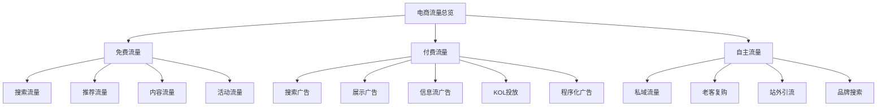
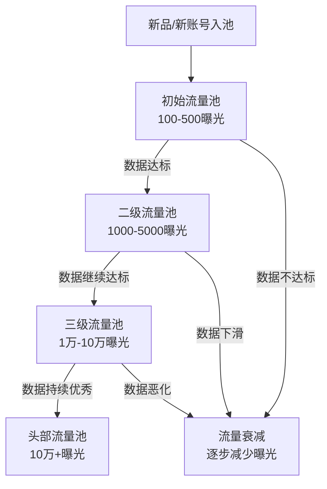
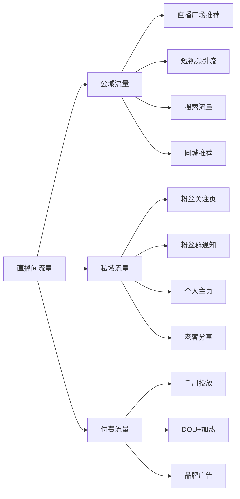
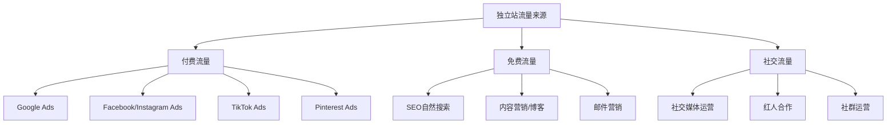
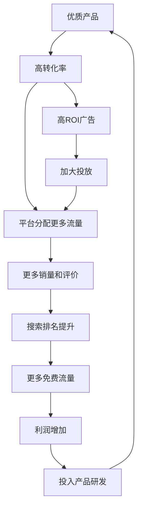

## 三、流量获取技巧

流量是电商的生命线。没有流量，再好的产品、再精美的详情页都是空谈。但流量获取不是简单的"花钱买人"，而是一套涉及平台算法理解、用户心理洞察、内容创意策划、数据精细运营的系统工程。本节将从流量的本质出发，系统讲解各大平台的流量获取方法，帮助你建立完整的流量运营能力。

### 1. 流量的本质与分类

#### 1.1 什么是电商流量

电商流量的本质是**有购买意向的用户注意力**。不同于泛娱乐流量，电商流量的核心衡量标准不是"看了多久"，而是"买了没有"。理解这一点，才能避免陷入"虚假繁荣"的陷阱——1000个精准访客的价值远大于10万个无效点击。

从经济学角度看，电商流量本质上是一种**稀缺资源的分配问题**。平台每天的用户注意力总量是有限的（日活用户数 × 平均使用时长），平台需要决定把这些注意力分配给哪些商家。分配的依据就是：**谁能给平台带来最大化的长期收益**。

这个"长期收益"不仅仅是佣金和广告收入，还包括用户体验（用户买到满意的东西会继续来平台）、用户留存（好的购物体验提升日活和使用时长）、生态健康（优质商家驱逐劣质商家）。理解平台的底层利益诉求，是理解一切流量规则的前提。

**流量的三重属性：**

| 属性 | 说明 | 实操含义 |
|------|------|----------|
| 精准度 | 流量与产品的匹配程度 | 精准流量转化率是泛流量的5-10倍 |
| 时效性 | 流量的持续性（一次性vs长期） | 搜索流量持续稳定，活动流量脉冲式 |
| 可控性 | 商家对流量的掌控程度 | 付费可控，推荐不可控，私域完全可控 |

理解这三重属性，才能在不同阶段做出正确的流量决策——新品期需要可控的付费流量快速起量，成长期需要稳定的搜索流量建立基本盘，成熟期需要私域流量保障利润。

#### 1.2 流量分类框架



| 流量类型 | 典型来源 | 成本特征 | 可控性 | 适合阶段 | 转化率参考 |
|----------|----------|----------|--------|----------|-----------|
| 搜索流量 | 淘宝搜索、亚马逊搜索、拼多多搜索 | 前期投入精力，后期边际成本低 | 中等（受算法影响） | 全阶段 | 3-8% |
| 推荐流量 | 猜你喜欢、首页推荐、信息流 | 免费但不可控 | 低 | 有一定基础销量后 | 1-3% |
| 内容流量 | 直播、短视频、图文种草、小红书笔记 | 内容制作成本 | 中等 | 有内容能力时 | 2-5%（直播可达5-15%） |
| 活动流量 | 聚划算、秒杀、亚马逊Deal、拼多多百亿补贴 | 让利成本 | 低（需报名审核） | 有一定基础后 | 5-15% |
| 搜索广告 | 直通车、亚马逊PPC、拼多多搜索推广 | 按点击付费，CPC 0.5-5元 | 高 | 测款、冲排名阶段 | 2-5% |
| 展示广告 | 钻展、引力魔方 | 按展现/点击付费 | 高 | 品牌曝光、拉新 | 0.5-2% |
| 信息流广告 | 抖音巨量千川、快手磁力金牛 | 按曝光/转化付费 | 高 | 爆品打爆、直播引流 | 1-3%（直播间可达3-8%） |
| KOL投放 | 达人种草、直播合作 | 按坑位费/佣金 | 中 | 新品推广、品牌建设 | 取决于达人匹配度 |
| 私域流量 | 微信、企微、社群、会员体系 | 前期获客成本，后期接近零 | 极高 | 复购型产品 | 10-30% |

#### 1.3 流量成本的底层逻辑

所有平台的流量分配都遵循一个核心公式：

**流量价值 = 转化率 × 客单价 × 复购率**

平台会把流量分配给"能最大化平台收益"的商家。对平台而言，收益 = 流量 × 点击率 × 转化率 × 客单价 × 平台佣金率。所以，提升你自己的流量价值（转化率、客单价、复购率），是获取更多免费流量的根本方法。

**平台流量池机制详解：**

每个平台都采用**层级流量池**机制，而非简单的线性分配：



每个流量池的晋级条件通常包括：
- **点击率** > 该流量池层级的基准线（通常随层级提升而提高）
- **转化率** > 行业均值（或环比上一周期有提升）
- **用户停留时长** > 基准线（反映内容/产品吸引力）
- **互动率** > 基准线（评论、收藏、加购、分享）
- **退货率/差评率** < 阈值（反映产品质量和用户满意度）

这意味着：**获取流量的关键不是"买"流量，而是让你的每个流量都产生足够好的数据，让平台愿意给你更多**。

#### 1.4 各主流平台流量特征对比

| 平台 | 核心流量逻辑 | 流量分配偏好 | 适合品类 | 启动难度 | 流量天花板 |
|------|-------------|-------------|---------|---------|-----------|
| 淘宝/天猫 | 搜索+推荐双轮驱动 | 转化率、DSR、店铺层级 | 全品类 | 中等 | 极高 |
| 京东 | 品质+物流体验 | 品牌力、物流时效、自营优先 | 3C、家电、日百 | 较高 | 高 |
| 拼多多 | 价格驱动+社交裂变 | 价格竞争力、销量增速 | 白牌、日用、农产品 | 低 | 高 |
| 抖音电商 | 兴趣推荐+内容驱动 | 内容质量、直播间数据、商品卡权重 | 美妆、服饰、食品、家居 | 中等 | 极高 |
| 快手电商 | 信任经济+老铁文化 | 粉丝粘性、复购率、主播人设 | 食品、服饰、农产品 | 中等 | 高 |
| 小红书电商 | 种草+搜索 | 内容质量、笔记互动率、搜索匹配 | 美妆、母婴、家居、服饰 | 中等 | 中高 |
| 亚马逊 | 搜索为主+关联推荐 | 销售速度、转化率、评论 | 标品、3C、家居 | 较高 | 极高 |
| 独立站 | 全靠自己获取 | 不适用 | 品牌型、DTC | 高 | 取决于投放能力 |

**平台选择决策矩阵：**

| 你的情况 | 推荐首选平台 | 原因 |
|----------|-------------|------|
| 有供应链优势，无内容能力 | 淘宝/拼多多 | 搜索流量为主，不需要内容能力 |
| 有内容创作能力 | 抖音/小红书 | 内容即流量，边际成本低 |
| 品牌型商家 | 天猫/京东/亚马逊 | 平台背书强，用户信任度高 |
| 价格竞争力强 | 拼多多/Temu | 价格驱动的平台逻辑 |
| 想做海外市场 | 亚马逊/独立站/TikTok Shop | 根据品类和团队能力选择 |
| 小团队起步，预算有限 | 拼多多或抖音 | 拼多多门槛低，抖音靠内容免费起量 |

### 2. 搜索流量获取

搜索流量是电商最核心的流量来源，因为搜索用户带有明确的购买意图，转化率通常是推荐流量的2-3倍。掌握搜索流量，等于掌握了电商的"基本盘"。

#### 2.1 搜索排名的核心因素

不同平台的搜索算法细节不同，但底层逻辑高度一致——**把最可能让用户满意的结果排在前面**。

**淘宝/天猫搜索排名因素（权重从高到低）：**

| 排名因素 | 权重占比（估算） | 优化方向 | 常见误区 |
|----------|------------------|----------|----------|
| 点击率 | 25-30% | 主图优化、标题关键词精准 | 只关注主图美观而忽视差异化 |
| 转化率 | 20-25% | 详情页、价格、评价 | 刷单提升的虚假转化率会被识别 |
| 收藏加购率 | 15-20% | 产品吸引力、营销活动 | 收藏加购后不购买=权重打折 |
| DSR评分 | 10-15% | 产品质量、物流速度、服务态度 | 忽视售后导致DSR持续下降 |
| 店铺权重 | 10% | 店铺层级、动销率、违规记录 | 大量滞销品拖低动销率 |
| 上下架时间 | 5-10% | 错峰上架、避开竞争 | 所有商品同一时间上下架 |
| 新品标签 | 5% | 首发、原创、差异化 | 首图/标题与已有商品高度雷同 |

**淘宝搜索算法的核心机制——"赛马制"：**

淘宝的搜索排名不是静态的，而是**实时赛马**。系统会在每个时间窗口（通常以小时为单位）对比同一关键词下所有商品的核心数据指标（点击率、转化率、收藏加购率），数据更好的商品获得排名提升。这意味着：

1. 你的商品在每个时段都在和竞品"比赛"
2. 排名提升需要**持续**的数据优秀，而非一次性的数据冲刺
3. 某个时段数据差（比如凌晨没有客服回复导致转化率低），不会永久影响排名，但持续差数据会导致排名持续下降
4. 大促期间的赛马权重会临时调整（更看重销售额增速）

**亚马逊搜索排名因素（A9/A10算法）：**

| 排名因素 | 说明 | 优化要点 |
|----------|------|----------|
| 销售速度（Sales Velocity） | 近期销量和增长趋势是最大权重 | 通过广告+促销提升短期销量 |
| 转化率（Conversion Rate） | 页面访客转化为购买者的比例 | Listing质量、价格、评论 |
| 关键词相关性 | 标题、后台Search Terms、描述中的关键词匹配度 | 全面覆盖目标关键词 |
| 评论数量和质量 | 评论数、星级、评论内容相关性 | Vine计划、售后跟进请求评论 |
| 配送方式 | FBA优于FBM，Prime标签提升排名 | 优先使用FBA |
| 退货率 | 退货率过高会显著降低排名 | 准确的产品描述、质量把控 |
| 页面停留时间 | 用户在Listing页面的停留时长 | A+页面、视频、详细描述 |

**A10算法相比A9的关键变化：**
- **站外流量权重提升**：通过Google、社交媒体引入的站外流量对排名有正向影响
- **点击率权重降低**：更看重真实的转化率而非点击率（减少黑帽操控空间）
- **卖家权威性**：账号健康度、ODR（订单缺陷率）、退货处理速度等综合评估
- **内部关联推荐**：Frequently Bought Together的权重增加

**拼多多搜索排名因素：**

| 排名因素 | 权重特征 | 说明 |
|----------|----------|------|
| 价格竞争力 | **极高** | 同类商品中价格越低排名越靠前 |
| 销量增速 | 高 | 近期销量增长趋势比绝对销量更重要 |
| 商品质量分 | 中高 | 退货率、差评率、品质退货率 |
| 店铺服务分 | 中 | 回复速度、发货速度、售后满意度 |
| 活动参与度 | 中 | 参加百亿补贴、限时秒杀等获得加权 |

**拼多多的特殊逻辑**：拼多多的搜索算法极度强调**价格竞争力**。同一类目下，价格更低的商品天然获得更高的搜索排名权重。但"低价"不等于"亏本"——平台看的是**同一品质层级内的价格竞争力**。如果你的产品品质明显高于同类（通过材质、工艺、品牌等维度区分），即使价格不是最低，也能通过品质分获得不错的排名。

**抖音电商搜索排名因素：**

抖音电商的搜索流量正在快速增长，其排名逻辑与传统电商有显著不同：

| 排名因素 | 说明 | 权重趋势 |
|----------|------|----------|
| 内容相关性 | 短视频/直播标题、商品标题与搜索词的匹配度 | 上升 |
| 商品转化率 | 搜索场景下的购买转化率 | 上升 |
| 商品卡质量 | 主图、价格、销量、评价的综合表现 | 上升 |
| 内容互动率 | 相关短视频的点赞、评论、分享数据 | 中等 |
| 店铺体验分 | 商品体验+物流体验+服务体验 | 上升 |
| 直播间数据 | 在播直播间的实时转化数据 | 中等 |

#### 2.2 关键词策略

关键词是搜索流量的入口。选对关键词 = 找到了正确的战场。

**关键词分类：**

| 关键词类型 | 示例 | 搜索量 | 竞争度 | 转化率 | 策略 |
|-----------|------|--------|--------|--------|------|
| 大词/核心词 | "连衣裙" | 极高 | 极高 | 低 | 有实力后争取 |
| 二级词 | "碎花连衣裙" | 高 | 高 | 中 | 主推方向 |
| 长尾词 | "法式碎花连衣裙女夏" | 中 | 中低 | 高 | 新品主攻方向 |
| 场景词 | "约会穿搭连衣裙" | 中低 | 低 | 很高 | 精准流量入口 |
| 品牌词 | "XX品牌连衣裙" | 低 | 低 | 极高 | 品牌保护 |
| 属性词 | "雪纺连衣裙" | 中 | 中 | 中高 | 细分市场切入 |
| 人群词 | "小个子连衣裙" | 中低 | 低 | 高 | 精准人群定位 |
| 季节词 | "夏季连衣裙" | 高 | 高 | 中 | 季节性流量入口 |

**关键词挖掘工具和方法：**

1. **平台内置工具**
   - 淘宝：生意参谋→搜索分析→关键词挖掘（最权威的淘宝关键词数据源）；直通车→流量解析（查看关键词的点击率、转化率、竞争度数据）
   - 亚马逊：Brand Analytics→Search Terms Report（查看类目下Top搜索词及点击份额）；Helium 10的Cerebro（反查竞品关键词，功能强大）；Jungle Scout的Keyword Scout（关键词搜索量和趋势数据）
   - 拼多多：多多参谋→关键词分析；拼多多推广后台→关键词推荐
   - 抖音：巨量算数→搜索趋势（查看抖音搜索热词和趋势）；抖店后台→搜索分析
   - 小红书：小红书聚光平台→关键词规划；千瓜数据→笔记关键词分析

2. **竞品分析法**
   - 找到类目TOP 20竞品，分析其标题中使用的关键词
   - 用工具反查竞品的流量关键词（如Ahrefs、SEMrush用于亚马逊；生意参谋的竞争情报用于淘宝）
   - 记录竞品频繁使用的词根和组合方式
   - 分析竞品的Search Terms（亚马逊后台可查看）或标题构成

3. **用户语言法**
   - 翻看买家评价和问大家，提取用户描述产品的自然语言（比如用户说"不闷痘"而非"透气性好"）
   - 分析客服聊天记录中的高频问题和用词
   - 社交平台（小红书、抖音评论区、微博话题）搜集用户的表达习惯
   - 分析搜索下拉词和"相关搜索"——这些是真实用户的搜索行为数据

4. **季节/趋势关键词挖掘**
   - 使用Google Trends（海外）或百度指数（国内）查看关键词的季节趋势
   - 提前1-2个月布局季节性关键词（如8月开始布局秋冬装关键词）
   - 关注平台热搜榜和行业趋势报告，捕捉新兴关键词

**关键词布局实操：**

以淘宝为例，一个标题最多60个字符（30个汉字），需要最大化关键词覆盖：

```text
公式：核心词 + 属性词1 + 属性词2 + 场景词 + 卖点词 + 长尾修饰

示例（连衣裙）：
❌ 差标题：新款连衣裙女夏季（信息太少，无法匹配长尾搜索）
❌ 差标题：连衣裙碎花雪纺法式小个子约会收腰显瘦（堆砌无逻辑，用户看不懂）
✅ 好标题：法式碎花连衣裙女夏季2024新款收腰显瘦小个子中长款约会裙子

关键词覆盖分析：
- 法式碎花连衣裙（二级词）
- 碎花连衣裙女夏季（长尾词）
- 收腰显瘦连衣裙（卖点词）
- 小个子连衣裙（人群词）
- 中长款连衣裙（属性词）
- 约会裙子（场景词）
- 连衣裙女2024新款（时效词）
```

**亚马逊标题优化公式：**
```text
[品牌名] + [核心关键词] + [属性词1] + [属性词2] + [使用场景/人群] + [规格/尺寸/数量]

示例（保温杯）：
❌ 差标题：BrandX Water Bottle 32oz
✅ 好标题：BrandX Insulated Water Bottle 32oz Stainless Steel - BPA Free Double Wall Vacuum 
            Thermos for Sports, Gym, Outdoor - Keeps Drinks Cold 24hrs Hot 12hrs

关键规则：
- 前80个字符最重要（移动端只显示前80个字符）
- 不要堆砌关键词，保持可读性
- 每个单词首字母大写（介词、冠词除外）
- 不要使用特殊符号和促销信息
```

**标题关键词矩阵法（进阶）：**

对于有多个SKU的店铺，使用**关键词矩阵**避免内部竞争：

```text
假设你卖5款连衣裙：
SKU-1：法式碎花连衣裙（主打"法式碎花"）
SKU-2：纯色A字连衣裙（主打"纯色A字"）
SKU-3：印花雪纺连衣裙（主打"印花雪纺"）
SKU-4：针织连衣裙秋冬（主打"针织秋冬"）
SKU-5：吊带连衣裙内搭（主打"吊带内搭"）

原则：
1. 每个SKU主打不同的关键词组合
2. 避免多个SKU竞争同一个关键词
3. 合力覆盖整个类目的搜索流量
```

#### 2.3 搜索流量的冷启动策略

新品没有任何数据积累，搜索排名极低。冷启动的核心思路是"用付费撬动免费"——通过付费推广快速积累点击率、转化率等核心数据，让搜索算法识别到你的商品是"好商品"，从而分配更多免费搜索流量。

**第一步：测款期（1-2周）**
- 用直通车/亚马逊PPC投放长尾词，每天预算50-100元
- 观察点击率（>行业均值1.5倍为优秀）和转化率（>行业均值为合格）
- 核心指标：点击率反映主图吸引力，转化率反映产品/详情页竞争力
- 如果数据好，进入推广期；数据差，换款或优化
- **测款的关键判断标准**：200-500个点击后，转化率是否达到行业均值的80%以上

**第二步：推广期（2-4周）**
- 逐步加入二级词、核心词的投放
- 配合限时折扣、满减等活动提升转化率
- 引导买家晒图评价，积累优质买家秀
- 目标：核心长尾词进入搜索前3页
- **关键动作**：每天分析搜索词报告，把带来成交的词加入手动计划重点投放，把不相关的词加入否定词

**第三步：爆发期（1-2月）**
- 申请平台活动（聚划算、秒杀、亚马逊Deal、拼多多百亿补贴）
- 加大付费投放，抢占核心词排名
- 配合直播、短视频等内容流量引爆
- 目标：核心词稳定在搜索首页
- **关键动作**：监控竞品动态，准备防御性策略（竞品降价时的应对方案）

**第四步：稳定期**
- 逐步降低付费占比，提升免费流量占比
- 维护好DSR评分和评论质量
- 拓展更多长尾词覆盖
- 目标：免费流量占比>60%
- **关键动作**：建立关键词排名监控表，每周跟踪核心词排名变化

**冷启动加速技巧：**
1. **利用新品标签**：新品上架28天内有新品流量加权，上架前确保标题、主图、详情页都优化到位
2. **老客破零**：通过私域社群、老客户群发优惠券，快速获得首批真实成交
3. **关联销售**：在已有爆款的详情页中关联新品，借助爆款流量带动新品
4. **内容种草前置**：新品上架前1-2周就在小红书/抖音发布种草内容，上架时已有搜索热度

### 3. 付费流量投放

付费流量是最可控的流量来源，也是电商运营的必备技能。核心原则：**花出去的每一分钱都要有数据回报**。

#### 3.1 付费流量的战略定位

付费流量不是"有钱就能投"，需要在正确的阶段用正确的方式投放。不同阶段的付费流量扮演不同的角色：

| 阶段 | 付费流量角色 | 核心目标 | 预算占比建议 | 关键动作 |
|------|-------------|----------|-------------|----------|
| 测款期 | 侦察兵 | 验证产品市场接受度 | 100%（此时无免费流量） | 小预算多计划测试 |
| 推广期 | 加速器 | 积累数据撬动免费流量 | 60-70% | 重点投放核心关键词 |
| 爆发期 | 助推器 | 抢占排名、冲销量 | 50-60% | 加大预算+活动配合 |
| 稳定期 | 补充器 | 查漏补缺、防御竞品 | 20-30% | 精细化ROI优化 |
| 衰退期 | 延续器 | 维持基本曝光 | 10-20% | 只保留高ROI计划 |

**预算分配的"金字塔"原则：**

```text
预算金字塔（月预算10000元为例）：

顶层（30%，3000元）：确定性投放
├── 搜索广告精准长尾词：这些词已有历史数据证明ROI
├── 老客再营销：转化率最高，浪费最少
└── 目标：ROI > 3，稳定贡献利润

中层（50%，5000元）：增长性投放
├── 搜索广告二级词：正在培养排名的词
├── 信息流广告测试新素材：持续产出新创意
├── 达人合作：小规模测试新达人
└── 目标：ROI > 盈亏平衡点，培养未来增长点

底层（20%，2000元）：探索性投放
├── 大词竞价：冲击高流量关键词
├── 新人群定向测试：探索新客群
├── 新平台试水：如TikTok Ads、小红书聚光
└── 目标：允许ROI低于盈亏线，但要有数据收获
```

#### 3.2 国内主流付费推广工具

**淘宝/天猫推广体系：**

| 工具 | 定位 | 计费方式 | 适合场景 | 日预算建议 | 核心优势 |
|------|------|----------|----------|-----------|----------|
| 直通车（万相台无界版） | 搜索广告 | CPC（按点击） | 测款、拉搜索排名 | 100-500元起 | 精准关键词定向 |
| 引力魔方 | 推荐广告 | CPC/CPM | 拉新、收割、人群定向 | 100-300元起 | 人群标签精细化 |
| 品销宝 | 品牌广告 | CPM | 品牌词保护、品牌曝光 | 500元起 | 品牌搜索结果页独占 |
| 超级直播 | 直播推广 | CPC/CPM | 直播间引流 | 200元起 | 实时直播间导流 |
| 超级短视频 | 短视频推广 | CPC/CPM | 短视频带货引流 | 100元起 | 短视频挂商品链接 |

**直通车投放实操流程：**

```text
1. 建计划
   ├── 日限额：新品100元/天，逐步提升
   ├── 投放平台：无线端为主（占比>90%）
   ├── 投放时间：根据买家活跃时段设置（生意参谋查看）
   │   └── 通常高峰时段：10:00-12:00, 14:00-16:00, 20:00-23:00
   └── 投放地域：除偏远地区外全投（有数据后精简）

2. 选关键词
   ├── 新品：20-30个精准长尾词
   │   └── 选词标准：搜索量>500，竞争度<0.6，相关性100%
   ├── 成长期：加入二级词50-100个
   │   └── 选词标准：搜索量>2000，转化率>行业均值
   └── 成熟期：大词+长尾组合100-200个
       └── 大词占比不超过30%，长尾词稳定基本盘

3. 出价策略
   ├── 新品：出价=行业均价×1.2-1.5（先获取展现）
   ├── 质量分提升后：逐步降价（每3天降5-10%）
   ├── 核心公式：实际扣费 = 下一名出价 × 下一名质量分 ÷ 你的质量分 + 0.01
   └── 实操技巧：
       ├── 质量分7分以下的词：提高出价抢展现，提升质量分
       ├── 质量分9-10分的词：可以适当降价，节省预算
       └── 质量分与出价的平衡点：PPC低于行业均值20%

4. 创意优化
   ├── 每个关键词配4张创意图
   ├── 轮播测试3-5天
   ├── 保留点击率最高的创意
   └── 持续测试新创意替换低效创意
   └── 创意图设计要点：
       ├── 差异化：与竞品主图有明显视觉差异
       ├── 卖点突出：1-2个核心卖点用文字/图标标注
       ├── 场景感：展示产品使用场景而非白底图
       └── 促销信息：如有优惠活动，在图片上标注

5. 数据优化（每天必看）
   ├── 点击率 < 行业均值 → 优化主图（测试新创意）
   ├── 转化率 < 行业均值 → 优化详情页/价格/评价
   ├── PPC过高 → 提升质量分（优化相关性、提升点击率）
   ├── 展现量低 → 提高出价或增加关键词数量
   └── ROI < 盈亏线 → 精简低效关键词，暂停低ROI计划
```

**投放效果衡量标准：**

| 指标 | 及格线 | 优秀 | 说明 |
|------|--------|------|------|
| 点击率（CTR） | >行业均值 | >行业均值×1.5 | 反映主图吸引力 |
| 转化率（CVR） | >行业均值 | >行业均值×1.3 | 反映产品竞争力 |
| PPC（单次点击费用） | <行业均价 | <行业均价×0.7 | 反映投放效率 |
| ROI（投入产出比） | >盈亏平衡点 | >3 | 核心盈利指标 |
| 质量分 | >7分 | >9分 | 影响PPC和排名 |
| 加购成本 | <20元 | <10元 | 反映人群精准度 |

**盈亏平衡ROI的计算方法：**
```text
盈亏平衡ROI = 1 ÷ 毛利率

示例：
售价100元，成本60元，毛利率 = (100-60)/100 = 40%
盈亏平衡ROI = 1 ÷ 0.4 = 2.5
即广告ROI > 2.5时才盈利

实际操作中，需要考虑退货率：
实际盈亏平衡ROI = 1 ÷ (毛利率 × (1-退货率))
如果退货率10%：1 ÷ (0.4 × 0.9) = 2.78
```

**竞价策略深度解析：**

各平台的竞价机制有本质区别，理解底层逻辑才能做出正确的出价决策：

| 平台 | 竞价公式 | 质量分构成 | 实际扣费逻辑 |
|------|----------|-----------|-------------|
| 淘宝直通车 | 排名 = 出价 × 质量分 | 点击率、相关性、创意质量 | 下一名出价 × 下一名质量分 ÷ 你的质量分 + 0.01 |
| 亚马逊PPC | 排名 = 出价 × 相关性得分 | 关键词相关性、转化率、评论 | 第二名出价 + 0.01（次价拍卖） |
| 拼多多 | 排名 = 出价 × 质量分 | 点击率、转化率、商品质量分 | 低于出价的实际扣费 |
| 抖音千川 | 排名 = 出价 × 预估转化率 × 内容质量 | 素材质量、转化率、互动率 | eCPM竞争，实际按转化扣费 |

**出价优化的"三段式"方法：**

```text
阶段一：高出价抢数据（第1-7天）
├── 出价 = 行业均价 × 1.3-1.5
├── 目的：快速获取展现和点击，积累数据
├── 注意：严格控制日预算，防止超支
└── 关注指标：点击率、转化率是否达标

阶段二：优化质量降成本（第8-21天）
├── 根据质量分变化逐步降价（每次降5-10%）
├── 保留高ROI关键词，暂停低效词
├── 优化创意提升点击率（间接提升质量分）
└── 目标：PPC降低20-30%，保持展现量不下降

阶段三：精细化运营（第22天+）
├── 分时段出价：高峰期提高出价，低谷期降低
├── 分地域出价：高转化地区提高出价
├── 分人群出价：精准人群溢价20-30%
└── 持续监控竞品出价变化，动态调整
```

#### 3.3 信息流广告投放

信息流广告（抖音巨量千川、快手磁力金牛等）的核心逻辑与搜索广告不同：**搜索广告是"人找货"，信息流广告是"货找人"**。用户在刷短视频时并没有购物意图，你需要通过素材创造购买欲望。

**巨量千川投放策略：**

```text
投放准备：
├── 短视频素材：准备5-10条不同角度的视频素材
│   ├── 产品展示型（展示产品功能/效果）
│   ├── 痛点解决型（戳中用户痛点）
│   ├── 使用场景型（展示使用场景）
│   ├── 对比评测型（与竞品对比）
│   └── 用户证言型（真实用户反馈）
├── 直播间准备：场景、话术、逼单节奏
└── 人群包：基于产品特征定义目标人群
    ├── 基础定向：性别、年龄、地域、兴趣标签
    ├── 行为定向：近期搜索/浏览/加购过相关商品
    └── 达人定向：对标竞品达人的粉丝

投放节奏：
├── 测试期（3-5天）：多计划、多素材、小预算（每条100-200元）
│   ├── 同时跑5-10条计划，每条不同的素材+人群组合
│   ├── 重点关注：3秒完播率 > 45%，点击率 > 3%
│   └── 淘汰标准：消耗>50元无转化的计划直接关闭
├── 放量期：选出跑量计划，逐步提升预算
│   ├── 每次提幅不超过30%（提太快会触发系统重新学习）
│   ├── 保留2-3条ROI最好的计划作为"主力计划"
│   └── 持续上新计划替换衰退的旧计划
├── 稳定期：优化素材生命周期，持续产出新素材
│   ├── 信息流素材生命周期通常7-14天
│   ├── 每周至少产出3-5条新素材
│   └── 对跑量素材做微调（换BGM、换开头、换文案）
└── 衰退期：素材衰退时及时更换，保持账户活力
```

**信息流广告素材制作要点：**

| 要素 | 要求 | 原因 | 实操技巧 |
|------|------|------|----------|
| 前3秒 | 必须有"钩子"（悬念/痛点/利益） | 用户3秒内决定是否继续看 | 用提问式、数据式、冲突式开头 |
| 视频时长 | 15-30秒为佳 | 太长流失率高，太短信息不足 | 直播引流素材可以5-15秒 |
| 画面质量 | 高清、明亮、有冲击力 | 低质素材直接被算法降权 | 使用原生手机拍摄风格更自然 |
| 文案 | 口语化、有节奏感 | 书面语在短视频平台违和 | 像和朋友聊天一样写文案 |
| BGM | 跟随平台热门趋势 | 热门BGM提升完播率 | 用巨量算数查看热门音乐 |
| 行动号召 | 明确的CTA（点击/购买/关注） | 没有CTA=白白浪费流量 | "点击下方小黄车""现在下单立减XX" |
| 产品卖点 | 1-2个核心卖点，不要贪多 | 信息过载导致用户记不住 | 用"痛点+解决方案"的结构 |

**高转化素材的5种模板：**

1. **Before/After对比**：展示使用产品前后的效果差异（适合护肤、清洁、家居品类）
2. **开箱惊喜**：从拆快递开始，逐步展示产品亮点，制造期待感
3. **街头采访/随机测试**：在街头随机邀请路人试用产品，记录真实反应
4. **专家/达人背书**：以专业人士身份讲解产品原理和优势
5. **剧情反转**：先展示痛点场景，再用产品解决，形成反转效果

#### 3.4 拼多多付费推广

拼多多的付费推广工具体系相对简洁，但有其独特的玩法：

**拼多多推广工具：**

| 工具 | 定位 | 适合场景 | 特点 |
|------|------|----------|------|
| 搜索推广（标准推广） | 搜索广告 | 关键词精准投放 | CPC计费，按关键词出价 |
| 场景推广 | 推荐广告 | 信息流+类目页+营销活动页 | CPC/CPM，人群定向 |
| 全站推广 | 全域推广 | 系统自动分配流量 | 按成交扣费，操作简单 |
| 多多进宝 | CPS分销 | 快速起量 | 按成交付佣金，风险低 |

**拼多多推广核心策略：**

```text
新品起步路径：
1. 多多进宝破零（设置20-30%佣金，快速获得基础销量）
2. 搜索推广长尾词（低出价，高ROI，积累权重）
3. 场景推广定向竞品人群（精准获客）
4. 报名活动（秒杀/9.9特卖/百亿补贴）
5. 全站推广稳定出单（系统智能分配）

出价技巧：
- 拼多多的竞价逻辑与淘宝不同，更看重"出价 × 预估转化率"
- 新品出价建议：行业均价 × 1.5（先拿展现）
- 质量分提升后逐步降价
- 拼多多用户对价格敏感，转化率和价格竞争力高度相关
```

#### 3.5 跨境电商付费推广

**亚马逊PPC广告体系：**

| 广告类型 | 定位 | 适合场景 | 预算建议 | 关键指标 |
|----------|------|----------|----------|----------|
| Sponsored Products | 搜索广告 | 核心推广工具，提升搜索排名 | 占广告预算60-70% | ACoS<30% |
| Sponsored Brands | 品牌广告 | 品牌曝光，展示品牌旗舰店 | 占广告预算15-20% | 品牌搜索量增长 |
| Sponsored Display | 展示广告 | 竞品关联、再营销 | 占广告预算10-15% | 新客获取成本 |

**亚马逊PPC优化要点：**

1. **自动广告跑词**：新品先开自动广告，跑1-2周，收集有效搜索词。自动广告分为四种匹配类型：
   - 紧密匹配（Close Match）：搜索词与产品高度相关
   - 宽泛匹配（Loose Match）：搜索词与产品有一定相关性
   - 同类商品（Substitutes）：展示在相似商品详情页
   - 关联商品（Complements）：展示在互补商品详情页
   - 建议：新品期四种都开，后期根据ACoS表现保留效果好的类型

2. **手动广告精准投放**：把自动广告中表现好的词提取出来，开手动精准匹配。分组策略：
   - 高转化词（ACoS<20%）：单独建组，提高出价抢首页
   - 中等转化词（ACoS 20-35%）：保持当前出价，持续优化
   - 低转化词（ACoS>35%）：降低出价或暂停

3. **否定关键词**：把不相关的搜索词加为否定关键词，避免浪费预算。每周检查搜索词报告，及时添加否定词。

4. **竞价策略**：
   - 新品期：用"动态竞价-仅降低"，保守控制成本
   - 成长期：用"动态竞价-提高和降低"，积极抢排名
   - 成熟期：根据ACoS目标灵活调整
   - 旺季前：提前2-4周提高竞价，抢占旺季流量

5. **ACoS目标**：一般控制在15-30%之间，具体取决于产品利润率。ACoS = 广告花费 ÷ 广告销售额 × 100%。盈亏平衡ACoS = 产品毛利率（不含广告）。

**Google Ads投放（独立站/亚马逊站外引流）：**

| 广告类型 | 适合场景 | 关键策略 | 预算建议 |
|----------|----------|----------|----------|
| Google Search Ads | 品牌词+产品词 | 精准关键词+否定词+广告扩展 | 日预算50-200美元 |
| Google Shopping | 电商产品展示 | 优化Feed质量+出价策略 | 日预算50-300美元 |
| YouTube Ads | 品牌曝光+种草 | 15秒不可跳过广告+精准定向 | 日预算30-100美元 |
| Google Display | 再营销+品牌曝光 | 再营销列表+相似受众 | 日预算20-50美元 |

Google Ads投放的核心数据指标：
- **CTR（点击率）**：Search Ads > 3%为合格，Shopping Ads > 1%为合格
- **CPC（单次点击费用）**：因行业差异大，一般0.5-3美元
- **转化率**：电商落地页 > 2%为合格
- **ROAS（广告支出回报率）**：> 3为健康
- **Quality Score（质量得分）**：> 7分为优秀，直接影响CPC

### 4. 内容流量获取

内容流量是近年增长最快的流量来源。其核心逻辑是：**用优质内容吸引用户，用场景激发购买欲望**。相比付费流量的"花钱买量"，内容流量的边际成本趋近于零——一条爆款短视频的自然播放量可能达到百万级，相当于数万元的付费投放效果。

#### 4.1 直播带货流量获取

**直播间流量来源：**



**提升直播间推荐流量的核心指标：**

| 指标 | 说明 | 优化方法 | 权重趋势 |
|------|------|----------|----------|
| 平均停留时长 | 用户在直播间停留的平均时间 | 话术留人、福袋/抽奖、限时活动 | 持平 |
| 互动率 | 评论、点赞、分享的比例 | 提问引导、互动话术、回复评论 | 上升 |
| 商品点击率 | 点击购物车/商品链接的比例 | 口播引导、商品展示、价格悬念 | 上升 |
| 转化率（GPM） | 千次观看成交金额 | 逼单话术、限时折扣、赠品策略 | 极高 |
| 粉丝转化率 | 新增粉丝占观看人数比例 | 人设打造、价值输出、粉丝专属福利 | 中等 |
| UV价值 | 每个观众产生的平均成交额 | 提升客单价、优化转化漏斗 | 上升 |

**直播起号实操（新号冷启动）：**

```text
第1周：养号期
├── 每天直播2-4小时，固定时间段（让算法学习你的直播节奏）
├── 不急着卖货，以互动和内容为主
├── 发布3-5条短视频预热（展示产品/人设/专业度）
├── 目标：熟悉直播节奏，获取初始流量池
└── 关键指标：平均停留时长>1分钟，互动率>5%

第2-3周：测品期
├── 上架3-5个引流款（低价高性价比，用于拉人气）
├── 配合少量付费投放（200-500元/天）
├── 测试哪个品在直播间转化最好
├── 目标：找到直播间的"爆款"
└── 关键指标：GPM>500元，商品点击率>10%

第4-6周：打爆期
├── 以爆款为核心设计直播脚本
├── 加大付费投放（500-2000元/天）
├── 每场直播设计"开播福利→爆款讲解→逼单成交"节奏
├── 目标：稳定场观，提升GMV
└── 关键指标：GPM>1000元，转化率>3%

第7周+：稳定期
├── 优化货品结构（引流款20%+利润款60%+形象款20%）
├── 建立粉丝群，沉淀私域
├── 探索矩阵号、达人分销等增量
├── 目标：稳定的ROI和增长曲线
└── 关键指标：付费流量占比<40%，粉丝复购率>20%
```

**直播间留人的5个核心技巧：**
1. **福袋/抽奖**：每15-20分钟设置一次福袋，要求评论+关注才能参与
2. **价格悬念**：先展示产品价值，最后才公布价格，制造期待感
3. **限时限量**：营造紧迫感——"只剩最后XX件""倒计时3分钟"
4. **互动话术**：经常提问观众——"你们觉得这个颜色好看吗？扣1/扣2"
5. **价值输出**：分享专业知识/使用技巧，让用户觉得"即使不买也学到了东西"

**直播间脚本模板：**

```text
标准2小时直播脚本结构：

00:00-00:10 开场暖场
├── 欢迎话术+今日福利预告
├── 福袋设置（关注+评论参与）
└── 互动话题引导（拉停留时长）

00:10-00:30 引流款讲解
├── 产品展示+卖点强调
├── 价格对比（原价vs直播价）
└── 限量逼单（"只有XX件"）

00:30-01:30 利润款循环讲解
├── 每15-20分钟一个循环
├── 每个循环：产品讲解(8min)→互动(3min)→逼单(4min)→过渡(1min)
├── 中间穿插福袋和互动
└── 关键：逼单话术要有节奏感，制造紧迫感

01:30-01:50 爆款返场/秒杀
├── 返场今日最好卖的产品
├── 给出额外优惠（限时加赠/降价）
└── 利用"最后机会"心理

01:50-02:00 收尾
├── 感谢观众+预告下次直播时间
├── 引导关注+加粉丝群
└── 最后一波福利
```

#### 4.2 短视频种草

短视频种草的核心不是"展示产品"，而是**制造需求场景**。用户刷短视频时并没有购物意图，你需要通过内容创造一个"我也需要"的瞬间。

**高效种草内容公式：**

| 内容类型 | 公式 | 示例 | 适合品类 |
|----------|------|------|----------|
| 痛点型 | 痛点引入→产品解决→效果展示 | "夏天出汗脸上黏糊糊？这款控油散粉一拍即哑光…" | 护肤、清洁、家居 |
| 教程型 | 知识/技巧→产品植入→成果展示 | "三步画出自然眉形，用的是这支…（教程中自然植入）" | 美妆、烹饪、手工 |
| 评测型 | 多产品对比→突出优势→购买引导 | "5款热门防晒霜实测，这款性价比最高…" | 标品、3C、日化 |
| 场景型 | 场景代入→产品使用→情感共鸣 | "周末和闺蜜露营，带了这款便携咖啡机…" | 户外、旅行、生活方式 |
| 开箱型 | 收到产品→开箱展示→使用体验 | "等了一个月的XX终于到了！开箱给大家看…" | 数码、潮玩、礼品 |
| 数据型 | 数据/事实引入→原理解释→产品推荐 | "90%的人都不知道，洗脸水温应该控制在…" | 专业护肤、健康、科技 |

**短视频引流到电商的关键技巧：**

1. **评论区引导**：在评论区置顶"怎么买"的回复，或引导私信。可以用小号在评论区提问"这是什么牌子？在哪买？"然后主号回复。
2. **主页橱窗**：在主页设置商品橱窗，短视频挂购物车。抖音商品橱窗的开通条件：1000粉丝+10条公开视频。
3. **直播间预告**：短视频结尾预告直播时间和福利——"今晚8点直播间XX元秒杀"。
4. **搜索优化**：标题和描述中植入商品关键词，获取搜索流量。抖音搜索流量正在快速增长。
5. **矩阵发布**：同一内容适配多个平台（抖音、快手、视频号、小红书），不同平台的封面和标题需要调整。
6. **DOU+加热**：对数据表现好的短视频投DOU+（100-500元），放大自然流量效果。

#### 4.3 小红书种草引流

小红书是电商种草的核心阵地，尤其适合美妆、家居、母婴、服饰等品类。小红书的独特价值在于：用户来小红书就是为了"做功课"——他们有明确的消费决策需求，只是还没确定买什么品牌。

**小红书内容运营策略：**

```text
笔记类型规划：
├── 干货笔记（40%）：教程、攻略、测评 → 获取搜索流量和收藏
│   └── 示例：「油皮秋冬护肤全攻略｜从洁面到面霜的完整流程」
├── 种草笔记（30%）：好物分享、使用体验 → 激发购买欲望
│   └── 示例：「用了3个月的真实感受｜这款精华到底值不值得买」
├── 日常笔记（20%）：生活场景、人设展示 → 建立信任感
│   └── 示例：「周末vlog｜我的护肤routine和新入手的好物」
└── 互动笔记（10%）：话题讨论、投票 → 提升账号活跃度
    └── 示例：「你们觉得A和B哪个更好用？评论区告诉我」

关键词布局：
├── 标题：核心关键词 + 吸引点击的修饰词
│   示例：「油皮亲妈！这5款控油散粉我用空瓶了」
│   关键词技巧：
│   ├── 用数字增加可信度（5款、3步、7天）
│   ├── 用情绪词增加吸引力（亲妈级、绝绝子、哭了）
│   ├── 用人群词精准定位（油皮、小个子、学生党）
│   └── 用场景词激发联想（约会、通勤、旅行）
├── 正文：自然融入3-5个关键词，不要堆砌
│   ├── 前100字必须包含核心关键词（影响搜索排名）
│   ├── 每段开头自然融入一个关键词
│   └── 结尾总结时再次提及核心关键词
├── 标签：5-10个相关标签，包含核心词和长尾词
│   └── 标签格式：#核心词 #长尾词 #场景词 #人群词
└── 话题：参与平台热门话题，获取额外曝光

引流路径：
笔记 → 评论区引导"在哪买" → 私信回复 → 引导到淘宝/微信
笔记 → 挂商品链接（小红书店铺） → 直接成交
笔记 → 直播间预告 → 直播间成交
```

**小红书避坑指南：**

| 常见错误 | 后果 | 正确做法 |
|----------|------|----------|
| 笔记中直接放微信号/链接 | 被限流甚至封号 | 在评论区或私信中引导 |
| 内容过度营销 | 用户反感，数据差 | 7分内容价值，3分产品植入 |
| 图片质量差 | 点击率低 | 统一风格，高清美观，用Canva/醒图制作 |
| 标题不吸引人 | 无人点击 | 用数字、痛点、悬念等技巧 |
| 不回复评论 | 互动率低，算法不推荐 | 每条评论都回复，提升互动数据 |
| 频繁发广告 | 账号权重下降 | 保持内容与广告的比例（7:3） |
| 抄袭/搬运内容 | 被系统检测降权 | 原创内容，用自己的语言和风格 |
| 一天发太多笔记 | 被判为营销号 | 每天1-2篇，保持稳定频率 |

**小红书SEO优化技巧：**

小红书的搜索流量占比越来越高，做好小红书SEO可以获取长期稳定的精准流量：

1. **关键词研究**：使用小红书搜索框的下拉词、聚光平台的关键词工具
2. **标题优化**：标题中必须包含核心关键词，前20个字最关键
3. **正文优化**：前100字包含核心关键词，全文自然融入3-5个相关词
4. **标签优化**：每篇5-10个标签，核心标签放前面
5. **互动优化**：高互动的笔记搜索排名更高，重点提升收藏和评论
6. **发布时间**：用户活跃时段发布（工作日12:00-14:00, 18:00-22:00；周末全天）

### 5. 私域流量构建

私域流量是你能**反复触达、无需付费**的用户资产。在流量成本持续上涨的今天，私域运营能力决定了电商的长期盈利能力。

#### 5.1 私域流量的价值

| 指标 | 公域流量 | 私域流量 | 差异原因 |
|------|----------|----------|----------|
| 获取成本 | 持续付费，逐年上涨 | 一次性获客成本 | 公域竞争加剧推高成本 |
| 触达成本 | 每次都要付费 | 接近零 | 私域是你自己的渠道 |
| 转化率 | 1-3% | 10-30%（甚至更高） | 已建立信任关系 |
| 复购率 | 依赖平台推荐 | 主动唤醒，复购率高3-5倍 | 可以主动触达 |
| 用户数据 | 平台掌握，你不拥有 | 你自己掌握 | 数据即资产 |
| 抗风险能力 | 平台政策变化影响大 | 不受平台政策直接影响 | 多渠道降低风险 |

**私域流量的ROI计算：**
```text
私域ROI = (私域GMV - 私域运营成本) ÷ 私域获客成本

示例：
- 私域用户数：5000人
- 获客成本：5元/人（通过包裹卡引流）
- 总获客成本：25000元
- 月均私域GMV：50000元（人均月消费10元）
- 月均运营成本：3000元（内容制作+社群管理）
- 月ROI = (50000-3000) ÷ 25000 = 1.88
- 年ROI = (50000×12-3000×12) ÷ 25000 = 22.56

结论：私域在第2个月就能回本，之后都是净收益。
```

#### 5.2 私域流量池搭建

**第一层：微信生态**
- 企业微信（**强烈推荐**）：支持客户标签、群发、离职继承、客户朋友圈，是目前最主流的私域工具
- 个人微信（限制较多）：适合小规模精细运营，但有封号风险
- 微信社群：快闪群（活动期间临时建群）、会员群（长期维护）、兴趣群（围绕共同兴趣）
- 公众号/视频号：内容触达，适合长期维护，视频号可直接挂商品链接

**企业微信实操配置：**

```text
企业微信搭建步骤：

1. 注册与认证
   ├── 企业微信注册（需营业执照）
   ├── 企业认证（提升可信度和功能权限）
   └── 设置企业名片（品牌Logo、介绍、对外信息）

2. 员工账号设置
   ├── 统一头像风格（品牌视觉统一）
   ├── 设置欢迎语（添加好友后自动发送）
   │   └── 示例：「Hi～我是XX品牌的专属顾问小美 💕
   │       感谢你的关注！为你准备了新人专属福利：
   │       🎁 无门槛10元优惠券（点击领取）
   │       📋 有任何问题随时找我～」
   └── 设置快捷回复（常见问题标准答案）

3. 客户标签体系
   ├── 来源标签：包裹卡、直播间、活动、老客推荐
   ├── 消费标签：首购、复购、高客单、沉睡
   ├── 兴趣标签：护肤、彩妆、服饰、家居
   └── 人群标签：油皮、干皮、敏感肌、学生党

4. 社群SOP
   ├── 入群欢迎语+群规
   ├── 每日固定动作模板
   ├── 活动策划模板
   └── 社群分层管理（VIP群/普通群/快闪群）
```

**第二层：会员体系**
- 平台会员：淘宝88VIP、京东PLUS等平台会员（利用平台的会员权益）
- 自建会员：积分体系、等级体系、专属权益（推荐，数据在自己手中）
- 付费会员：付费入会享受专属折扣和权益（适合高复购品类）

**会员等级设计示例：**

| 等级 | 条件 | 权益 | 目的 |
|------|------|------|------|
| 普通会员 | 注册即得 | 首单9折、生日券 | 降低门槛，引入新客 |
| 银卡会员 | 累计消费500元 | 专属8.5折、新品优先购、包邮券×3 | 激励首次复购 |
| 金卡会员 | 累计消费2000元 | 专属8折、专属客服、季度礼盒、免邮 | 培养忠诚度 |
| 黑卡会员 | 累计消费5000元 | 专属7.5折、1对1顾问、新品试用、年度礼盒 | 维护高价值用户 |

**第三层：内容阵地**
- 自有APP（适合成熟品牌，DAU>10万时考虑）
- 小程序商城（轻量级，适合中小商家，推荐使用有赞、微店等SaaS工具）

#### 5.3 从公域引流到私域的方法

```text
引流路径设计：

路径1：包裹卡引流（推荐，转化率最高）
├── 包裹内放入好评返现卡/福利卡
├── 卡片设计要点：
│   ├── 正面：大字写清利益点（扫码领XX元红包/赠品）
│   ├── 背面：二维码 + 简短引导语
│   └── 材质：铜版纸覆膜，不要用廉价打印纸
├── 加微信后自动欢迎语 + 打标签
│   └── 欢迎语示例：「亲爱的XX，欢迎加入我们的VIP社群！
│       你的专属福利已到账：XX元无门槛券。
│       回复"1"获取最新活动信息，回复"2"获取产品使用指南。」
└── 转化率：5-15%

路径2：客服引流
├── 买家咨询时，引导加微信获取专属优惠
├── 话术示例：「加我们的专属顾问微信，可以领取8折优惠券哦~」
├── 注意不要在平台聊天中直接发微信号（会被处罚）
├── 技巧：用图片形式发送联系方式（降低被系统检测的概率）
└── 转化率：3-8%

路径3：直播引流
├── 直播间引导关注 → 粉丝群 → 企微
├── 粉丝群内定期发放专属福利
├── 引导老客分享拉新
└── 转化率：10-20%

路径4：内容引流
├── 小红书/抖音评论区引导私信
├── 私信中引导加微信
├── 提供有价值的内容作为"钩子"（资料包/教程/优惠）
└── 转化率：5-10%
```

#### 5.4 私域运营的核心动作

| 动作 | 频率 | 目的 | 具体做法 |
|------|------|------|----------|
| 朋友圈运营 | 每天2-3条 | 保持存在感，展示产品/生活 | 早中晚各一条，内容混搭（产品:生活:干货=3:4:3） |
| 社群互动 | 每天1-2次 | 维护活跃度 | 早安问候、话题讨论、限时秒杀、晒单有礼 |
| 1对1私聊 | 重要节点 | 深度维护VIP客户 | 生日祝福、新品试用邀请、专属优惠 |
| 内容推送 | 每周2-3次 | 提供价值，避免纯卖货 | 使用教程、行业资讯、搭配建议 |
| 社群活动 | 每周1次 | 拉动转化和裂变 | 限时秒杀、拼团、老带新 |

**私域朋友圈内容模板：**
```text
早上8-9点（生活/正能量）：
「早安~ 今天天气真好，分享一下我早上的护肤步骤 ☀️
（配图：生活照或护肤台）」

中午12-13点（产品/种草）：
「最近很多姐妹问我的XX用完了没有？还没呢，真的太耐用了！
一瓶用了3个月还有大半，性价比绝了~」
（配图：产品使用图）

晚上20-21点（干货/互动）：
「今天有姐妹问我油皮怎么选防晒？分享3个避坑点：
1. 选物化结合的，比纯物理的清爽
2. 看质地，选流动性强的
3. 成分表避开矿物油
你们还有什么问题？评论区问我~」
```

**私域自动化运营SOP：**

```text
用户生命周期自动化运营：

阶段1：新客期（添加后0-7天）
├── Day 0：自动欢迎语 + 领券链接
├── Day 1：发送产品使用指南/搭配建议
├── Day 3：朋友圈互动（点赞评论新客的朋友圈）
├── Day 5：私聊关怀（"产品收到了吗？有问题随时找我"）
└── Day 7：发送首单专属优惠（促进复购）

阶段2：活跃期（8-30天）
├── 每周2-3次朋友圈触达
├── 每周1次社群活动参与
├── 有购买行为：打标签+升级权益
└── 无购买行为：定向推送优惠券

阶段3：忠诚期（30天+）
├── 生日关怀（提前3天提醒+生日当天祝福+专属券）
├── 新品优先试用邀请
├── 专属1对1服务
└── 裂变激励（老带新返利）

阶段4：沉睡期（60天+无互动）
├── 沉睡唤醒话术：「好久不见～最近上了新品，特别适合你，
│   给你留了个专属优惠，XX折～」
├── 限时福利刺激
├── 如果3次唤醒无反应，降低推送频率
└── 标记为沉睡用户，减少资源投入
```

### 6. 跨境电商流量获取

跨境电商的流量获取有其特殊性，需要针对海外市场的用户习惯和平台规则制定策略。不同市场的用户行为差异很大——北美用户习惯通过Google搜索产品，东南亚用户更依赖社交媒体和短视频。

#### 6.1 亚马逊流量获取

**站内流量：**
- **搜索流量**：优化Listing（标题、五点、A+页面、Search Terms）——占亚马逊站内流量的60-70%
- **关联流量**：Frequently Bought Together、Customers Also Viewed——通过互补商品和相似商品获取
- **Deal流量**：Lightning Deal（限时特卖，通常持续4-12小时）、Best Deal（周特卖）、7-Day Deal——需要满足条件才能报名
- **品牌流量**：Brand Store（品牌旗舰店，可自定义页面）、Brand Story（品牌故事，展示在Listing下方）、Posts（类似Instagram的图文帖子）
- **亚马逊直播**：Amazon Live，正在增长的流量渠道

**Listing优化深度指南：**

```text
亚马逊Listing优化清单：

标题优化（200字符上限）：
├── 品牌名 + 核心关键词 + 材质/属性 + 功能/卖点 + 规格/尺寸
├── 前80字符最关键（移动端截断）
├── 不要堆砌关键词，保持可读性
└── 每个单词首字母大写（介词/冠词除外）

五点描述（Bullet Points）：
├── 每条150-200字符，最多5条
├── 排列顺序：核心卖点 → 材质/品质 → 使用场景 → 规格参数 → 售后保障
├── 嵌入长尾关键词（自然融入）
└── 使用大写字母开头强调卖点关键词

A+页面（品牌注册后可用）：
├── 品牌故事模块：建立品牌认知
├── 产品对比模块：与自家其他产品对比（提升关联销售）
├── 图文模块：高质量场景图+使用说明
├── FAQ模块：回答常见购买疑虑
└── A+页面可提升转化率5-10%

Search Terms（后台关键词）：
├── 250字节限制（注意是字节不是字符）
├── 不要重复标题中已有的词
├── 包含同义词、拼写变体、长尾词
└── 不要用品牌名（尤其是竞品品牌名）
```

**站外流量：**
- **Google Ads**：投放品牌词和产品词，引导到亚马逊Listing。建议使用Amazon Attribution追踪站外流量效果
- **社交媒体**：Facebook/Instagram广告，适合视觉类产品（家居、服饰、美妆）
- **红人营销**：YouTube/TikTok/Instagram红人测评。YouTube长视频测评的转化率通常高于TikTok短视频
- **Deal网站**：Slickdeals（美国最大的Deal社区，发帖需要账号等级）、DealNews、Vipon
- **EDM营销**：通过独立站或邮件列表引流。注意亚马逊不允许直接在邮件中放亚马逊链接

#### 6.2 独立站流量获取

独立站没有平台自带流量，所有流量都需要自己获取，但优势是用户数据完全属于你，不受平台规则约束。



**Google SEO要点：**
- 关键词研究：用Ahrefs/SEMrush找到低竞争高搜索量的关键词（KD<30，搜索量>1000）
- 内容优化：每个产品页围绕1-2个核心关键词优化，标题、H1、Meta Description、Alt标签都要包含关键词
- 技术SEO：网站速度（Google PageSpeed>90分）、移动端适配、结构化数据（Schema Markup）、XML Sitemap
- 外链建设：Guest Post（在相关行业博客发表客座文章并获得链接）、PR外链（通过新闻稿获得媒体链接）、资源页外链（在行业资源页面获得链接）
- 内容营销：围绕产品相关话题撰写博客文章，吸引长尾搜索流量。每周发布1-2篇高质量博客（2000字以上）

**EDM（邮件营销）策略：**

邮件营销是独立站ROI最高的渠道之一，平均每投入1美元可获得36-42美元回报。

| 邮件类型 | 发送时机 | 目的 | 预期打开率 |
|----------|----------|------|-----------|
| Welcome Email | 注册后立即 | 建立第一印象，发放首单优惠 | 50-60% |
| Abandoned Cart | 弃购后1h/24h/72h | 挽回弃购订单 | 40-50% |
| Post-Purchase | 收货后3-7天 | 请求评论，交叉销售 | 30-40% |
| Win-Back | 60-90天未购买 | 唤醒沉睡用户 | 15-25% |
| Newsletter | 每周/每两周 | 内容营销，保持品牌存在感 | 20-30% |

**Abandoned Cart挽回邮件序列（关键）：**

```text
邮件1（弃购后1小时）：
主题：「你忘了点什么？购物车里的宝贝还在等你~」
内容：展示购物车商品 + 一键返回链接 + 客服联系方式
预期挽回率：10-15%

邮件2（弃购后24小时）：
主题：「还在犹豫吗？帮你解答疑虑」
内容：常见购买疑虑FAQ + 用户评价截图 + 限时优惠码（5-10%折扣）
预期挽回率：5-10%

邮件3（弃购后72小时）：
主题：「最后机会！你的专属优惠即将过期」
内容：更大折扣（10-15%）+ 紧迫感 + 明确CTA按钮
预期挽回率：3-5%

三封邮件合计可挽回15-25%的弃购订单。
```

**Facebook/Google广告投放：**

| 阶段 | 目标 | 投放策略 | 预算分配 | 关键指标 |
|------|------|----------|----------|----------|
| 冷启动 | 测试受众和素材 | CBO多组测试，3-5个受众×3-5个素材 | 日预算50-100美元 | CPA<目标成本的1.5倍 |
| 数据积累 | 找到最优组合 | 保留CPA最低的广告组，逐步加预算 | 日预算100-300美元 | ROAS>2 |
| 规模放量 | 扩大利润 | Lookalike受众、扩大地理范围 | 日预算300-1000美元 | ROAS>3，规模增长 |
| 稳定运营 | 持续优化 | 再营销+新客获取组合 | ROAS目标3-5倍 | 维持ROAS的同时扩大规模 |

**独立站冷启动路径：**
```text
1. 建站（Shopify/WooCommerce，1-2周）
2. 产品页优化（SEO+高转化详情页，1周）
3. Google Shopping广告测试（2-4周，日预算50美元）
4. Facebook广告测试（2-4周，日预算50美元）
5. 红人合作（找5-10个微型红人，单条50-200美元）
6. 内容营销启动（每周2篇博客）
7. 邮件列表建设（弹窗收集邮箱，Welcome Email序列）
8. 逐步优化，找到最佳流量组合
```

#### 6.3 新兴跨境电商平台流量

**Temu（拼多多海外版）流量获取：**

Temu采用全托管模式，卖家只需供货，平台负责定价、物流、售后。流量获取方式：
- **平台推荐流量**：Temu的核心流量来源，算法主要看价格竞争力和产品质量
- **搜索流量**：优化商品标题和关键词（使用英文关键词）
- **活动流量**：参与平台组织的促销活动（折扣、秒杀）
- **社交裂变**：Temu的"砍一刀"模式在海外同样有效

**TikTok Shop流量获取：**

TikTok Shop是近年来增长最快的跨境电商渠道：

| 流量来源 | 说明 | 优化方法 |
|----------|------|----------|
| 短视频带货 | 发布带商品链接的短视频 | 内容质量、发布频率、热门话题 |
| 直播带货 | 直播间展示和销售商品 | 直播时长、互动率、转化率 |
| 商品卡 | 用户主动搜索商品 | 标题优化、关键词覆盖、价格竞争力 |
| 达人合作 | 与TikTok达人合作推广 | 达人匹配度、佣金设置、素材提供 |
| TikTok Ads | 付费广告投放 | 素材质量、人群定向、出价策略 |

**TikTok Shop达人合作实操：**

```text
达人筛选标准：
├── 粉丝量：微型达人（1万-10万）性价比最高
├── 粉丝画像：与目标用户匹配度>70%
├── 近期互动率：>3%（互动率=点赞+评论+分享÷粉丝数）
├── 带货数据：历史带货视频的GPM>500美元
└── 内容风格：与品牌调性一致

合作模式：
├── 纯佣金模式：无坑位费，佣金20-30%（适合新品测试）
├── 坑位费+佣金：固定费用+10-20%佣金（适合有一定知名度的达人）
├── 寄样合作：免费寄样+佣金（最常用的起量方式）
└── 长期合作：签约成为品牌大使，定期产出内容

合作SOP：
1. 建立达人列表（100-200人）
2. 批量发送合作邀请（个性化开场白）
3. 寄样+提供产品信息/卖点话术
4. 跟踪内容发布+数据监控
5. 复盘数据，筛选优质达人深度合作
```

### 7. 流量数据分析与优化

流量获取不是"投了就完事"，需要持续的数据分析和优化。数据分析是流量运营的"方向盘"——没有数据驱动的流量运营就是在盲目烧钱。

#### 7.1 核心流量指标体系

| 指标层级 | 指标名称 | 计算公式 | 健康值参考 | 优化方向 |
|----------|----------|----------|-----------|----------|
| 展现层 | 展现量 | 曝光次数 | 持续增长 | 提升关键词排名、增加投放 |
| 点击层 | 点击率（CTR） | 点击数÷展现数×100% | 搜索>4%，信息流>2% | 主图优化、标题优化 |
| 访问层 | 跳出率 | 只看一页就离开的比例 | <50%为好 | 详情页优化、价格匹配 |
| 转化层 | 转化率（CVR） | 成交数÷访客数×100% | 搜索>3%，推荐>1% | 详情页、价格、评价、信任 |
| 客单层 | 客单价（AOV） | 成交金额÷成交笔数 | 因品类而异 | 关联销售、满减策略 |
| 价值层 | UV价值 | 成交金额÷UV数 | >行业均值 | 综合优化 |
| 投放层 | ROI/ROAS | 成交金额÷广告花费 | 盈亏平衡点以上 | 精准投放、优化转化 |
| 投放层 | ACOS | 广告花费÷广告成交×100% | <毛利率 | 优化关键词、提升转化 |

#### 7.2 流量诊断框架

当流量出现问题时，用以下框架快速定位原因：

```text
流量下降诊断树：

流量下降了？
├── 展现量下降？
│   ├── 搜索展现下降 → 检查关键词排名变化、是否被降权
│   │   ├── 排名下降 → 检查竞品是否做了活动、自己的转化率是否下滑
│   │   └── 被降权 → 检查是否有违规行为（刷单、虚假宣传）
│   ├── 推荐展现下降 → 检查转化率、点击率是否下滑
│   │   └── 推荐流量的核心是"内容质量分"，检查商品详情页和主图
│   └── 付费展现下降 → 检查出价、预算、质量分
│       ├── 预算花完 → 提高日限额
│       └── 质量分下降 → 优化创意和关键词相关性
├── 点击率下降？
│   ├── 主图是否被竞品超越 → 测试新主图
│   ├── 价格是否失去竞争力 → 调整定价策略
│   └── 标题是否匹配搜索意图 → 优化关键词
├── 转化率下降？
│   ├── 评价出现问题？ → 差评处理、引导好评
│   ├── 竞品做了活动？ → 策划应对活动
│   ├── 详情页需要更新？ → 优化卖点展示
│   └── 客服响应变慢？ → 检查客服数据
└── 外部因素？
    ├── 行业淡旺季 → 调整推广节奏
    ├── 平台规则变化 → 学习新规则并适应
    ├── 竞争格局变化 → 分析竞品策略调整
    └── 大促前后波动 → 正常现象，观察1-2周
```

#### 7.3 流量漏斗分析

完整的流量漏斗分析能帮你精确定位每个环节的问题：

```text
展现量 (100,000)
    ↓ 点击率 4%
点击量 (4,000)
    ↓ 访问率 90%
访问量 (3,600)
    ↓ 加购率 15%
加购数 (540)
    ↓ 成交率 30%
成交数 (162)
    ↓ 客单价 100元
GMV (16,200元)

关键指标：
- CPM（千次展现成本）= 展现量维度
- CPC（单次点击成本）= 点击维度
- CPA（单次获客成本）= 成交维度
- UV价值 = GMV ÷ 访问量 = 4.5元
```

**漏斗各环节的优化优先级：**

| 环节 | 问题诊断 | 优化动作 | 预期提升 |
|------|----------|----------|----------|
| 展现→点击 | 点击率低于行业均值 | 优化主图、标题、价格展示 | 10-30% |
| 点击→访问 | 访问率低（站外投放） | 优化落地页加载速度、匹配度 | 5-15% |
| 访问→加购 | 加购率低 | 优化详情页卖点、价格、评价 | 20-50% |
| 加购→成交 | 成交率低 | 限时优惠、催付、评价优化 | 10-30% |
| 客单价 | 低于行业均值 | 关联销售、满减、组合装 | 10-20% |

#### 7.4 归因模型与多触点分析

在多渠道运营中，一个用户可能通过多个渠道触达你的产品后才最终购买。归因模型决定了你如何分配各渠道的"功劳"。

| 归因模型 | 逻辑 | 适用场景 | 优缺点 |
|----------|------|----------|--------|
| 末次触达 | 100%功劳归最后触达的渠道 | 简单分析 | 忽视前面渠道的贡献 |
| 首次触达 | 100%功劳归首次触达的渠道 | 评估拉新效果 | 忽视后面的转化推动 |
| 线性归因 | 各渠道平均分配功劳 | 全链路评估 | 过于平均化 |
| 时间衰减 | 越接近转化的渠道功劳越大 | 平衡分析 | 较为合理但仍有偏差 |
| 数据驱动 | 算法根据历史数据自动分配 | 数据量充足时 | 最准确但需要足够数据 |

**实操建议：**
- 初期使用"末次触达"做基础分析
- 积累数据后逐步切换到"数据驱动"模型
- 对比不同归因模型的结果，找出被低估/高估的渠道
- 亚马逊卖家可用Amazon Attribution追踪站外流量的归因

#### 7.5 AB测试方法论

流量优化的核心方法是AB测试。每次只改变一个变量，用数据说话。

**可测试的元素：**

| 测试对象 | 测试方法 | 关注指标 | 样本量要求 | 测试周期 |
|----------|----------|----------|-----------|----------|
| 主图 | 4张创意轮播测试 | 点击率 | 每张>500次展现 | 3-5天 |
| 标题 | A/B两个标题轮流使用 | 搜索流量变化 | 各跑1周 | 2周 |
| 价格 | 不同价格段测试 | 转化率×客单价的最优解 | 各>100次成交 | 1-2周 |
| 详情页 | 不同卖点顺序/文案风格 | 转化率、停留时间 | 各>500个UV | 1周 |
| 投放人群 | 不同人群定向测试 | ROI、转化率 | 各>1000元消耗 | 3-5天 |
| 投放时段 | 不同时间段投放 | CPC、转化率 | 各跑1周 | 2周 |
| 直播脚本 | 不同话术/节奏 | 停留时长、转化率 | 各>3场直播 | 1周 |

**AB测试注意事项：**
- 每次只测一个变量，否则无法归因
- 样本量要足够大（至少1000次展现或100次点击）
- 测试时间要足够长（至少3-7天，覆盖工作日和周末）
- 结果要具有统计显著性，不要凭感觉下结论
- 使用平台自带的AB测试工具（如直通车的创意轮播）比手动测试更准确

**AB测试记录模板：**

```text
测试编号：AB-2024-001
测试对象：商品主图
测试时间：2024.XX.XX - 2024.XX.XX（共7天）
测试假设：场景图比白底图的点击率更高

| 组别 | 主图类型 | 展现量 | 点击量 | 点击率 | 转化率 |
|------|----------|--------|--------|--------|--------|
| A组（对照） | 白底产品图 | 10,000 | 350 | 3.5% | 2.8% |
| B组（实验） | 场景使用图 | 10,000 | 480 | 4.8% | 3.1% |

结论：B组点击率提升37.1%，转化率提升10.7%，统计显著（p<0.05）
行动：全量切换为场景使用图
后续测试：测试不同场景的图片效果
```

#### 7.6 常用流量分析工具

| 工具 | 适用平台 | 核心功能 | 费用 |
|------|----------|----------|------|
| 生意参谋 | 淘宝/天猫 | 流量来源、关键词、竞品分析 | 免费版+付费版（标准版99元/月） |
| 亚马逊Brand Analytics | 亚马逊 | 搜索词报告、市场篮子分析、人口统计 | 免费（需品牌注册） |
| Helium 10 | 亚马逊 | 关键词研究、竞品分析、Listing优化 | 月费29-229美元 |
| 巨量算数 | 抖音 | 搜索趋势、热门话题、内容分析 | 免费 |
| 千瓜数据 | 小红书 | 笔记分析、达人分析、关键词分析 | 月费数百-数千元 |
| Google Analytics | 独立站 | 流量来源、用户行为、转化追踪 | 免费 |
| Ahrefs/SEMrush | 独立站/亚马逊 | SEO分析、关键词研究、外链分析 | 月费99-199美元 |
| 热力图工具（Hotjar/Crazy Egg） | 独立站 | 用户点击热力图、滚动深度、录屏回放 | 免费版+付费版 |

### 8. 平台算法变化与应对策略

平台算法不是一成不变的。每隔几个月，各平台都会进行算法调整，可能对你的流量产生重大影响。**不关注算法变化的商家，可能在一夜之间失去大量流量却不知道原因**。

#### 8.1 常见的算法调整类型

| 调整类型 | 表现 | 影响范围 | 应对策略 |
|----------|------|----------|----------|
| 权重因子调整 | 某个指标的权重增加/减少 | 全品类 | 关注行业报告，调整运营重心 |
| 流量池机制变化 | 晋级门槛提高/降低 | 全品类 | 重新评估数据基准线 |
| 打击黑产 | 对刷单/虚假交易的打击加严 | 依赖灰色手段的商家 | 坚持白帽运营 |
| 新功能上线 | 新流量入口出现（如商品卡、短视频） | 全品类 | 第一时间布局新功能 |
| 商业化调整 | 付费广告系统升级 | 投放商家 | 学习新工具，调整投放策略 |

#### 8.2 算法变化的信号识别

```text
算法变化预警信号：

信号1：流量突然变化（非季节性因素）
├── 单日流量下降>30% → 高度警惕
├── 连续3天流量异常 → 立即排查
└── 排查方向：
    ├── 自身是否有违规操作
    ├── 竞品是否有大动作
    ├── 平台是否有公告/规则更新
    └── 行业群/商家论坛是否有类似反馈

信号2：转化数据异常
├── 点击率不变但转化率下降 → 可能是人群匹配算法变了
├── 展现量增加但点击率下降 → 可能是流量池扩大但人群变泛
└── 建议：暂停大规模操作，观察1-2周

信号3：同行普遍反映类似问题
├── 不是个案 → 大概率是平台算法调整
├── 关注官方公告和商家社区
└── 不要恐慌性操作（大幅降价/停投等）
```

#### 8.3 应对算法变化的通用原则

1. **不要把鸡蛋放在一个篮子里**：多平台布局、多流量渠道分散风险
2. **坚持长期主义**：白帽运营、产品质量、用户体验——这些是任何算法都奖励的
3. **保持数据敏感度**：每天看数据，第一时间发现异常
4. **建立信息网络**：加入行业社群、关注平台官方账号、订阅行业媒体
5. **快速适应而非抱怨**：算法变化对所有商家都是公平的，适应最快的获益最多
6. **储备应急方案**：提前准备不同场景下的应对策略（如搜索流量下降时加大内容流量投入）

### 9. 流量获取的常见误区

#### 误区一：只关注流量数量，忽视流量质量

**错误表现**：盲目追求UV数字，什么流量都要，导致流量很大但转化极低。典型场景：投放时选择过宽泛的人群定向，或者为了冲流量参加不相关的活动。

**正确做法**：关注UV价值（成交金额÷UV数）而非UV数量。1000个精准UV > 10000个泛流量UV。在投放时优先选择精准人群定向，宁可缩小覆盖面也要保证流量质量。

**诊断方法**：对比不同流量来源的UV价值。如果某个渠道UV价值明显低于平均水平（<平均水平的50%），应该减少或停止该渠道投入。

#### 误区二：过度依赖付费流量

**错误表现**：付费流量占比>80%，一旦停止投放就没有生意，利润全给了平台。

**正确做法**：付费流量是"杠杆"，目标是撬动免费流量。健康的比例是免费:付费 = 6:4 或 7:3。通过付费流量积累数据和销量，逐步提升搜索排名和推荐权重，降低对付费的依赖。

**健康的流量结构参考：**
```text
成熟店铺的流量结构：
├── 搜索流量：30-40%（免费，稳定）
├── 推荐流量：15-25%（免费，波动大）
├── 内容流量：10-20%（免费/低成本）
├── 付费流量：15-25%（可控，用于补充和加速）
├── 私域/老客：10-20%（免费，高转化）
└── 活动流量：5-10%（低成本，阶段性）

警示信号：
- 付费流量>50%：需要立即加强免费流量建设
- 付费流量>70%：危险信号，利润大部分被广告吃掉
- 付费流量>90%：极度危险，停止投放=停止生意
```

#### 误区三：不做内容，只靠投流

**错误表现**：认为花钱投放就够了，忽视内容建设。

**正确做法**：内容是流量的放大器。一条优质短视频的自然播放量可能达到10-100万，相当于花费数万元的付费投放效果。内容能力强的商家，获客成本可以降低50%以上。

**投入产出对比：**
```text
纯投流模式：
- 月广告费：50000元
- 获客量：5000人
- 单客获取成本：10元
- 付费流量占比：100%

内容+投流模式：
- 月广告费：20000元
- 内容制作成本：5000元
- 内容带来的免费流量：8000人
- 投流带来的付费流量：3000人
- 总获客量：11000人
- 单客获取成本：2.27元
- 付费流量占比：27%

结论：内容投入带来的ROI远高于纯投流。
```

#### 误区四：盲目跟风追大词

**错误表现**：新品一上来就投"连衣裙"这样的大词，CPC极高，转化极低，预算很快烧完。

**正确做法**：从长尾词起步。新品权重低，打大词没有竞争力。先用精准长尾词积累数据和权重，逐步向上竞争更大的词。这是一个"农村包围城市"的过程。

**关键词进阶路径：**
```text
第1阶段（0-3个月）：长尾词为主
├── 关键词类型：属性词+核心词（如"法式碎花连衣裙女夏"）
├── 数量：20-30个精准长尾词
├── 目标：每个长尾词进入前3页
└── 预算占比：长尾词80%，二级词20%

第2阶段（3-6个月）：二级词突破
├── 关键词类型：二级词（如"碎花连衣裙"）
├── 数量：50-80个词（长尾+二级组合）
├── 目标：二级词进入前5页，长尾词稳定在首页
└── 预算占比：长尾词50%，二级词50%

第3阶段（6-12个月）：大词竞争
├── 关键词类型：核心大词（如"连衣裙"）
├── 数量：100-200个词
├── 目标：大词进入前10页，二级词进入首页
└── 预算占比：长尾词30%，二级词40%，大词30%
```

#### 误区五：忽视私域流量建设

**错误表现**：所有精力都放在拉新客，不做老客维护，导致获客成本持续攀升。

**正确做法**：私域流量的边际成本接近零，是长期盈利的关键。把每10%的精力放在私域维护上，可能带来30%以上的复购收入。从第一天起就要有意识地沉淀私域。

#### 误区六：数据不看全，决策靠感觉

**错误表现**：只看GMV或ROI单一指标，不分析完整的流量漏斗。

**正确做法**：建立完整的数据看板，每天关注展现→点击→访问→加购→成交的全链路数据。每个环节的下降都需要不同的优化策略，只有看到全貌才能精准定位问题。

**每日必看数据清单：**
```text
早上开店第一件事（10分钟）：
├── 昨日GMV、订单数、UV、转化率（与前日和上周同期对比）
├── 各流量来源的UV和转化率变化
├── 付费推广的花费、ROI、PPC数据
├── 有无新增差评或售后问题
└── 竞品动态（价格变化、活动信息）

每周分析（30分钟）：
├── 7天流量趋势图
├── 关键词排名变化
├── 各推广计划的ROI排名
├── 新增评价分析
└── 竞品周度对比

每月复盘（2小时）：
├── 月度流量结构分析（各渠道占比变化）
├── 月度ROI趋势（付费效率是否在提升）
├── 用户画像分析（新老客占比、复购率变化）
├── 竞品月度对比（排名变化、价格策略）
└── 下月流量计划和预算分配
```

### 10. 进阶：流量增长飞轮

当基础的流量获取方法掌握后，需要构建**流量增长飞轮**——让流量自我增长的正循环系统。



**飞轮加速的关键节点：**

1. **转化率突破行业均值×1.5**：平台会显著增加推荐流量，这是飞轮启动的第一个"临界点"
2. **评论数突破100/500/1000**：每个节点都会带来信任度跳跃，消费者在决策时有"评论数心理阈值"
3. **店铺层级突破**：淘宝从第3层到第4层，流量池大幅扩大（每层流量池规模相差2-5倍）
4. **爆款成型**：单品日销稳定在类目TOP 50，自动获取大量推荐流量
5. **品牌词搜索量增长**：品牌自带流量，降低对平台搜索的依赖，这是最健康的流量来源

**流量矩阵布局（多平台策略）：**

成熟的电商运营不应依赖单一平台，而是建立**流量矩阵**——多平台布局分散风险，同时各平台之间互相引流：

```text
流量矩阵布局示例：

                ┌─────────────┐
                │   品牌官网    │
                │  (流量中枢)   │
                └──────┬──────┘
                       │
        ┌──────────────┼──────────────┐
        │              │              │
   ┌────┴────┐   ┌────┴────┐   ┌────┴────┐
   │  淘宝    │   │  京东    │   │  拼多多  │
   │  天猫    │   │         │   │         │
   └────┬────┘   └────┬────┘   └────┬────┘
        │              │              │
        └──────────────┼──────────────┘
                       │
        ┌──────────────┼──────────────┐
        │              │              │
   ┌────┴────┐   ┌────┴────┐   ┌────┴────┐
   │  抖音    │   │  小红书  │   │  微信    │
   │  电商    │   │  电商    │   │  私域    │
   └─────────┘   └─────────┘   └─────────┘

各平台定位：
- 淘宝/天猫：搜索流量+品牌阵地
- 京东：品质用户+3C家电优势
- 拼多多：下沉市场+拉新渠道
- 抖音电商：内容流量+爆品打造
- 小红书：种草引流+品牌建设
- 微信私域：复购+裂变+用户沉淀
```

**多平台运营的关键原则：**
1. **差异化定位**：不同平台主打不同产品线或价格带，避免自我竞争
2. **统一品牌形象**：所有平台的品牌视觉、核心卖点保持一致
3. **流量互相导引**：各平台的用户最终沉淀到私域
4. **数据打通**：建立统一的用户数据体系，避免数据孤岛
5. **资源聚焦**：不要同时铺开所有平台，先做好1-2个主力平台再扩展

**从流量运营到品牌运营的进阶路径：**

```text
Level 1：流量运营（初级）
├── 核心能力：投广告、优化关键词、做活动
├── 典型特征：付费流量占比>60%
├── 利润水平：薄利，依赖投放效率
└── 瓶颈：流量成本持续上涨，利润空间被压缩

Level 2：产品运营（中级）
├── 核心能力：选品、供应链、差异化
├── 典型特征：免费流量占比>50%，有稳定爆款
├── 利润水平：中等，产品有溢价能力
└── 瓶颈：产品容易被模仿，需要持续创新

Level 3：品牌运营（高级）
├── 核心能力：品牌建设、用户心智、内容营销
├── 典型特征：品牌词搜索量稳定增长，私域用户活跃
├── 利润水平：高利润，品牌溢价明显
└── 瓶颈：品牌建设周期长，需要持续投入

Level 4：生态运营（顶级）
├── 核心能力：多平台布局、品牌矩阵、用户生态
├── 典型特征：多渠道自有流量，不依赖单一平台
├── 利润水平：持续高利润，抗风险能力强
└── 终极目标：品牌成为品类代名词（如"保温杯=膳魔师"）
```

### 11. 流量运营团队建设

当业务规模扩大后，一个人无法兼顾所有流量渠道。需要建立专业的流量运营团队。

#### 11.1 团队配置建议

| 业务规模 | 团队配置 | 核心分工 |
|----------|----------|----------|
| 月销<10万 | 1人 | 老板自己做所有事 |
| 月销10-50万 | 2-3人 | 1人负责搜索+付费投放，1人负责内容+客服，1人负责供应链 |
| 月销50-200万 | 4-6人 | 搜索运营、付费投放、内容运营、直播运营、客服、供应链各1人 |
| 月销200万+ | 8-15人 | 分平台设团队（淘宝组、抖音组、私域组），加上数据分析师、设计师 |

#### 11.2 关键岗位能力要求

| 岗位 | 核心能力 | 日常工作 | 关键KPI |
|------|----------|----------|---------|
| 搜索运营 | SEO知识、数据分析、竞品监控 | 标题优化、关键词跟踪、排名维护 | 搜索流量增长率、关键词覆盖率 |
| 付费投放 | 广告投放、数据分析、ROI优化 | 计划搭建、出价调整、素材优化 | ROI、PPC、消耗效率 |
| 内容运营 | 内容策划、短视频制作、文案写作 | 短视频脚本、小红书笔记、种草内容 | 播放量、互动率、引流转化 |
| 直播运营 | 直播话术、节奏把控、选品能力 | 直播脚本、场控、复盘 | GPM、转化率、停留时长 |
| 私域运营 | 社群管理、用户运营、活动策划 | 社群维护、朋友圈运营、活动执行 | 复购率、活跃度、裂变率 |

#### 11.3 外包vs自建的决策

| 内容 | 推荐自建 | 推荐外包 | 原因 |
|------|----------|----------|------|
| 付费投放 | ✓ | | 核心能力，需要长期积累数据经验 |
| 搜索运营 | ✓ | | 涉及产品和竞争策略 |
| 短视频拍摄 | | ✓ | 专业设备和拍摄技巧，外包性价比更高 |
| 直播运营 | ✓ | | 需要深度了解产品和用户 |
| 设计 | | ✓ | 非核心能力，外包更灵活 |
| 客服 | 视规模 | 视规模 | 小规模自建，大规模可外包 |

### 12. 本节核心要点回顾

| 要点 | 关键行动 | 优先级 |
|------|----------|--------|
| 理解流量本质 | 流量=有购买意向的用户注意力，关注UV价值而非UV数量 | ★★★★★ |
| 搜索流量是根基 | 关键词策略+冷启动打法+持续优化排名 | ★★★★★ |
| 付费流量是杠杆 | 精准投放+数据驱动+控制付费占比<40% | ★★★★ |
| 内容流量是放大器 | 直播+短视频+种草内容，降低综合获客成本 | ★★★★ |
| 私域流量是护城河 | 从第一天起沉淀用户，复购率提升3-5倍 | ★★★★★ |
| 数据分析是方向盘 | 全链路漏斗分析+AB测试+快速迭代 | ★★★★ |
| 增长飞轮是终局 | 产品→转化→流量→销量→排名→免费流量→利润→产品 | ★★★ |
| 多平台布局 | 流量矩阵分散风险，各平台差异化定位 | ★★★ |
| 关注算法变化 | 建立预警机制，快速适应平台调整 | ★★★★ |
| 团队建设 | 随业务规模扩大，逐步建立专业团队 | ★★★ |
