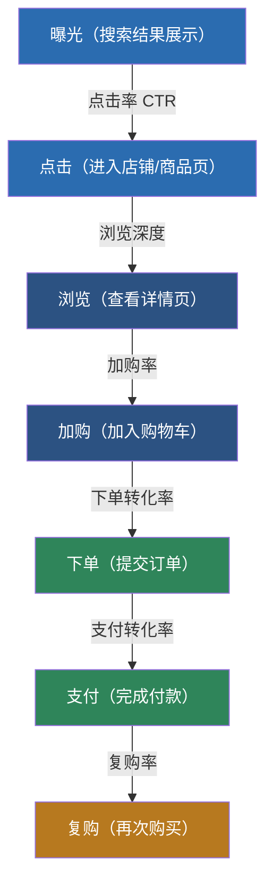
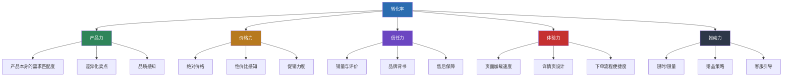
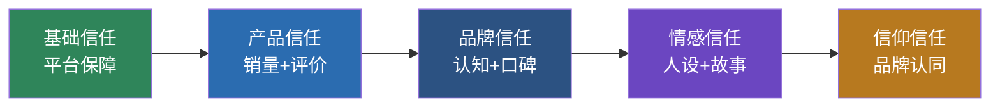
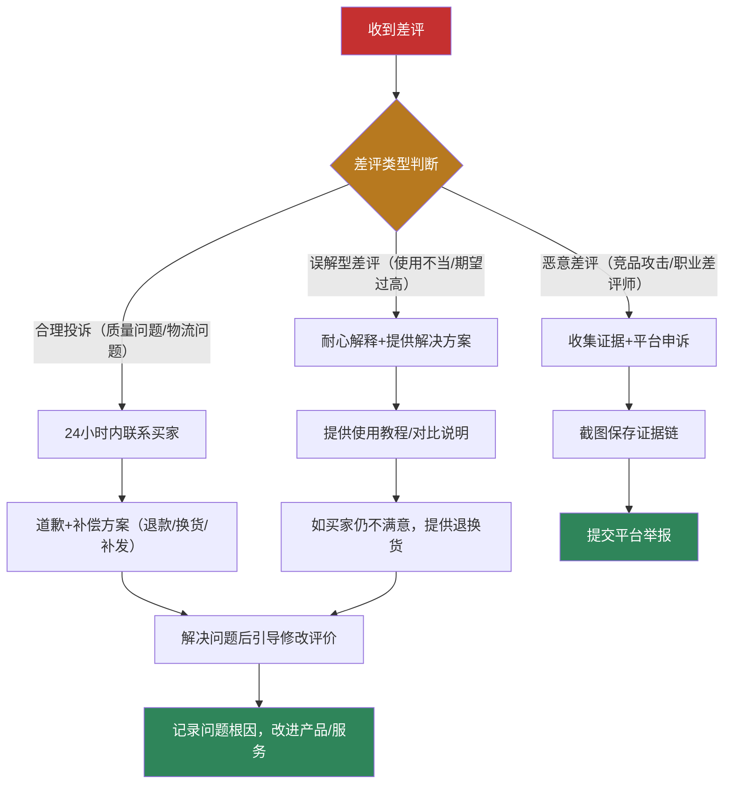
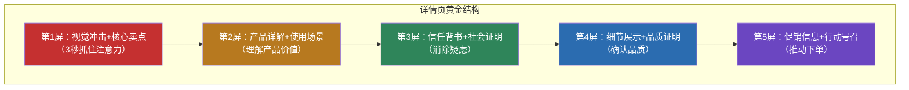
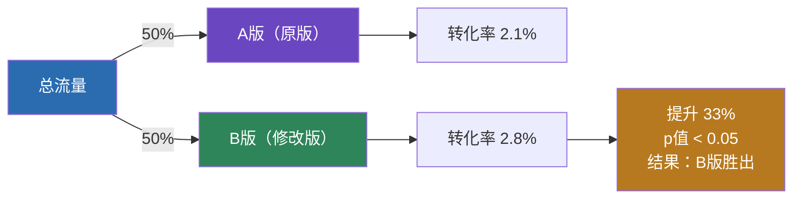
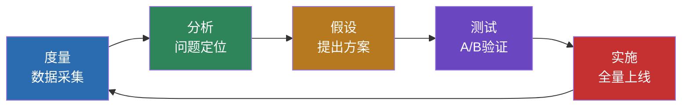

## 四、转化提升技巧

流量是水，转化是桶。桶有漏洞，灌再多水也是白费。电商运营中，转化率每提升1个百分点，带来的收入增长等同于获取同等比例的额外流量——但成本几乎为零。这就是为什么转化优化（CRO，Conversion Rate Optimization）是电商运营中投入产出比最高的系统性工作。

本节将从转化的底层逻辑出发，覆盖从用户进入店铺到完成下单、复购的全链路优化方法，包含定价策略、信任体系搭建、促销设计、购物路径优化、弃购挽回、A/B测试等核心模块，帮助你建立完整的转化提升能力。

### 1. 转化的底层逻辑

#### 1.1 什么是电商转化率

电商转化率的计算公式很简单：

```text
转化率 = 成交订单数 ÷ 访客数 × 100%

例如：某商品日访客1000人，当日成交30单
转化率 = 30 ÷ 1000 × 100% = 3%
```

但这个公式背后隐藏着一个更深层的转化漏斗，每一层都有流失：



**每一层的行业基准数据（国内综合电商平台）：**

| 漏斗层级 | 关键指标 | 行业均值 | 优秀值 | 说明 |
|----------|----------|----------|--------|------|
| 曝光→点击 | 点击率（CTR） | 3-5% | 8-15% | 由主图和标题决定 |
| 点击→浏览 | 页面停留时长 | 30-60秒 | 90-180秒 | 由详情页吸引力决定 |
| 浏览→加购 | 加购率 | 8-15% | 20-35% | 由产品吸引力+价格决定 |
| 加购→下单 | 下单转化率 | 30-50% | 60-80% | 由促销力度+紧迫感决定 |
| 下单→支付 | 支付转化率 | 85-92% | 95%+ | 由支付体验+优惠确认决定 |
| 成交→复购 | 复购率 | 15-25% | 40-60% | 由产品质量+售后体验决定 |

**关键洞察：** 大多数卖家只关注"总转化率"这个最终数字，却不知道瓶颈出在哪一层。优化转化率的第一步不是"做更多促销"，而是**定位流失最严重的环节**，然后集中精力攻克。如果加购率很高但下单转化率很低，说明用户想买但犹豫了——这时候优化详情页不如优化促销策略和价格。

#### 1.2 影响转化率的核心因子模型

转化率不是一个单一维度的问题，它由多个因子共同决定。以下模型基于大量A/B测试数据总结而成：



| 因子 | 权重占比（估算） | 核心逻辑 | 优化难度 |
|------|------------------|----------|----------|
| 产品力 | 30-35% | 用户是否真的需要这个产品 | 高（涉及选品） |
| 价格力 | 20-25% | 用户觉得值不值 | 中（可调整定价和促销） |
| 信任力 | 20-25% | 用户信不信你、敢不敢买 | 中（需时间积累） |
| 体验力 | 10-15% | 用户买的过程顺不顺畅 | 低（可快速优化） |
| 推动力 | 10-15% | 用户有没有"现在就买"的理由 | 低（可立即实施） |

**实战启示：** 新店铺转化率低，往往不是某一个因素的问题，而是五个因子都在及格线以下。需要按优先级逐一突破：先确保产品力（选品正确）→ 再调整价格力（定价+促销）→ 同步建设信任力（评价+保障）→ 优化体验力（页面+流程）→ 加强推动力（限时+赠品）。

### 2. 价格策略与定价优化

价格是影响转化最直接的因素之一。用户在做购买决策时，价格感知比实际价格更重要——同样一件衣服，标价399元打7折卖279元，比直接标价279元更让用户觉得"划算"。

#### 2.1 五种核心定价策略

**策略一：锚定定价法**

在商品页面设置一个"对比价格"，让用户感知到当前价格的优惠力度。这是电商中最常用也最有效的定价技巧。

```text
锚定定价的三种形式：

1. 原价对比锚
   原价：¥399    现价：¥199    省：¥200（5折）
   效果：用户会觉得"便宜了一半"，即使199元才是合理定价

2. 竞品对比锚
   "某品牌同类产品售价¥599，我们只要¥299"
   效果：通过对比建立"高性价比"的认知

3. 组合对比锚
   单件：¥99    两件装：¥159（每件79.5）    三件装：¥199（每件66.3）
   效果：引导用户选择中间档或最高档，提升客单价
```

**实操要点：** 锚定价格必须合理可信。如果同类产品市场价都在100-200元之间，你标"原价999元"会适得其反——用户会觉得你在虚标价格，反而降低信任。锚定价应在市场合理价格区间的上沿。

**策略二：尾数定价法**

| 尾数类型 | 适用场景 | 心理效应 | 示例 |
|----------|----------|----------|------|
| .9 / .99 | 低价商品、促销 | "不到XX元"的心理暗示 | ¥9.9、¥29.9 |
| .8 | 中国市场 | "发"的谐音，吉利感 | ¥168、¥288 |
| 整数 | 高端/礼品 | 价格自信、品质感 | ¥200、¥500 |
| .00 | 跨境电商 | 专业、标准化感知 | $29.00、$49.00 |

**数据参考：** 多项电商A/B测试表明，将定价从¥100改为¥99，转化率平均提升8-15%；将¥99改为¥97的效果不如¥99，因为"9"结尾在中国市场有最强的心理暗示效果。

**策略三：阶梯定价法**

通过设置不同规格/套餐，覆盖不同消费能力的用户群体，同时引导用户选择利润更高的选项：

```text
以蓝牙耳机为例：

基础版（简装）    ¥79    ——  利润率15%，用于引流
标准版（推荐）    ¥129   ——  利润率35%，主推款
豪华版（带充电仓） ¥169   ——  利润率45%，提升客单价

设计技巧：
- 标准版标注"推荐""热销"标签，引导大多数用户选择
- 豪华版只贵40元但多了充电仓，让用户觉得"加一点更划算"
- 基础版的存在让标准版显得"性价比高"
```

**策略四：满减/满赠定价**

满减的本质不是降价，而是**提升客单价**。设置满减门槛的核心公式：

```text
满减门槛 = 当前客单价 × 1.3-1.5

例如：
- 当前客单价80元 → 设置满99减10（门槛是客单价的1.24倍）
- 当前客单价150元 → 设置满199减20（门槛是客单价的1.33倍）
- 当前客单价300元 → 设置满399减40（门槛是客单价的1.33倍）

原则：
- 门槛不能太高（超过客单价2倍以上，用户放弃凑单）
- 门槛不能太低（低于客单价1.1倍，等于白送利润）
- 减免幅度控制在5-10%之间（太低无吸引力，太高亏损）
```

**策略五：心理账户定价**

用户对不同品类有不同的"心理价位"。理解你的产品在用户心理账户中的位置，才能制定合理的定价：

| 心理账户 | 价格敏感度 | 定价策略 | 示例品类 |
|----------|------------|----------|----------|
| 生活必需品 | 极高 | 低价走量，强调性价比 | 纸巾、垃圾袋、手机壳 |
| 自我提升 | 中等 | 中等价位，强调效果和专业性 | 书籍、课程、健身器材 |
| 情感消费 | 较低 | 中高价位，强调情感价值 | 礼品、鲜花、纪念品 |
| 品质生活 | 低 | 高价位，强调品质和身份感 | 奢侈品、高端数码、设计师品牌 |

#### 2.2 促销活动设计的转化公式

促销不是简单的"打折"，而是一套有策略的转化推动力。不同促销形式适用于不同目标：

| 促销形式 | 核心作用 | 适用场景 | 转化提升幅度 | 注意事项 |
|----------|----------|----------|------------|----------|
| 限时折扣 | 制造紧迫感 | 新品冷启动、清库存 | 20-50% | 必须有真实的结束时间，虚假倒计时会被平台处罚 |
| 满减活动 | 提升客单价 | 日常运营、大促 | 15-30% | 门槛计算要精准，参考客单价数据 |
| 买赠活动 | 提升感知价值 | 高利润商品、新品推广 | 10-25% | 赠品要有实际价值感，廉价赠品反而降格 |
| 优惠券 | 精准营销 | 老客唤醒、新客转化 | 10-20% | 设置领取门槛和使用期限，避免囤券不用 |
| 前N件优惠 | 拉动冲量 | 新品破零、活动预热 | 30-80%（前N件内） | "前100件半价"的冲击力极强，适合冷启动 |
| 拼团/砍价 | 社交裂变 | 拼多多、社群运营 | 20-40% | 适合低客单价高频商品 |

**促销设计的黄金公式：**

```text
有效促销 = 明确的优惠力度 + 真实的时间限制 + 可见的稀缺信号

❌ 无效促销："本商品有优惠"（无力度、无时间、无稀缺）
✅ 有效促销："前200件立减50元，仅剩37件，距结束2:15:30"

效果差异：后者转化率通常是前者的3-5倍
```

#### 2.3 优惠券体系设计

优惠券是电商最精细的转化工具。不同类型的优惠券承担不同的转化任务：

```text
优惠券体系架构：

┌─ 新客券（首单立减）
│   ├── 领取条件：新注册/首次访问
│   ├── 面额设计：客单价的10-15%
│   └── 目的：降低首次购买门槛
│
├─ 品类券（指定商品可用）
│   ├── 领取条件：浏览/收藏/加购后弹出
│   ├── 面额设计：客单价的5-8%
│   └── 目的：推动犹豫用户下单
│
├─ 满减券（提升客单价）
│   ├── 领取条件：无门槛或消费满XX元
│   ├── 面额设计：阶梯递增（满100减10，满200减30）
│   └── 目的：提升客单价
│
├─ 回购券（促进复购）
│   ├── 发放时机：确认收货后自动发放
│   ├── 面额设计：客单价的8-12%
│   └── 目的：提高复购率
│
└─ 沉睡唤醒券（挽回流失客户）
    ├── 发放时机：30天/60天/90天未购买
    ├── 面额设计：逐步递增（越久未买折扣越大）
    └── 目的：唤醒沉睡用户
```

**优惠券的A/B测试重点：**

| 测试维度 | 测试方案A | 测试方案B | 衡量指标 |
|----------|-----------|-----------|----------|
| 面额大小 | 满100减10 | 满100减15 | 转化率增量 vs 利润损失 |
| 展示方式 | 弹窗自动领 | 手动点击领 | 领取率 + 使用率 |
| 发放时机 | 浏览30秒后 | 加购后 | 转化率 + 客单价 |
| 有效期 | 24小时 | 7天 | 使用率 + 紧迫感 |

### 3. 信任体系搭建

电商信任是用户在"看不见摸不着"的线上环境中，敢于按下"立即购买"按钮的心理基础。信任不足是新店铺和中小卖家转化率低的首要原因。

#### 3.1 信任的五个层次



| 信任层次 | 核心要素 | 建设周期 | 对转化的影响 |
|----------|----------|----------|------------|
| 基础信任 | 7天无理由、运费险、正品保障 | 即时 | 消除"被骗"的恐惧 |
| 产品信任 | 销量数据、买家评价、买家秀 | 1-3个月 | 消除"质量差"的顾虑 |
| 品牌信任 | 品牌知名度、媒体背书、KOL推荐 | 6-12个月 | 消除"不靠谱"的疑虑 |
| 情感信任 | 创始人故事、品牌价值观、用户社群 | 12个月+ | 建立情感连接 |
| 信仰信任 | 品牌成为用户身份认同的一部分 | 长期 | 超越价格竞争 |

#### 3.2 评价管理体系

评价是转化率最强的信任因子之一。数据显示，92%的消费者在购买前会阅读评价，而负面评价对转化率的杀伤力是正面评价推动力的3-5倍。

**获取优质评价的系统方法：**

```text
评价获取策略（按优先级排序）：

1. 产品超出预期（根本方法）
   ├── 包装精致度超出用户预期
   ├── 附赠小惊喜（手写感谢卡、实用赠品）
   └── 产品品质 > 详情页描述
   → 效果：用户自发晒图好评

2. 好评引导卡
   ├── 包裹中放入好评引导卡
   ├── 内容：感谢+晒图返现（2-5元）+引导关键词
   ├── 设计精美，不要low感
   └── 注意：各平台政策不同，措辞需合规
   → 效果：评价率提升30-50%

3. 主动跟进提醒
   ├── 确认收货后2-3天，通过短信/消息提醒评价
   ├── 话术温和，不要骚扰感
   │   示例："亲爱的，快递收到了吗？如果满意的话帮我们写几句评价吧~
   │          您的评价是对我们最大的鼓励 ❤️"
   └── 不满意时先解决问题，再引导评价
   → 效果：评价率提升20-30%

4. 试用/测评活动
   ├── 邀请粉丝/KOC免费试用并发布真实评价
   ├── 适合新品冷启动阶段
   └── 注意：评价必须真实，刷单/虚假评价风险极高
   → 效果：快速积累首批优质评价
```

**差评处理的黄金流程：**



**差评回复模板（展示给其他买家看）：**

```text
❌ 错误回复："亲，您的问题已经私信沟通了哦~"
   问题：敷衍，其他买家看不到解决方案，反而觉得你不重视

✅ 正确回复：
"非常抱歉给您带来不好的体验！您反馈的[具体问题]我们已经确认，
原因是[原因说明]。我们已经[具体改进措施]。
已为您安排[补偿方案]，请您查收消息。
感谢您的反馈帮助我们改进，后续如有任何问题随时联系我们！
——客服主管 小王"
```

#### 3.3 售后保障体系

完善的售后保障是消除用户"后顾之忧"的关键。以下保障措施对转化率的提升效果有数据支撑：

| 保障措施 | 转化率提升幅度 | 成本 | 适用场景 |
|----------|------------|------|----------|
| 7天无理由退换货 | +5-15% | 退货运费（可购买运费险降低） | 所有品类 |
| 运费险 | +8-20% | 每单0.3-2元 | 服装、鞋靴等退货率高的品类 |
| 极速退款 | +3-8% | 平台功能，无额外成本 | 高客单价商品 |
| 假一赔十 | +5-12% | 无（前提是真的正品） | 品牌商品、美妆、3C |
| 30天价保 | +3-10% | 潜在的差价退补 | 大促期间 |
| 上门退换 | +5-15% | 物流成本 | 大件商品、家电家具 |

**关键提示：** 很多中小卖家担心"开通退换货会增加退货率"。数据显示，开通运费险后退货率确实会上升2-5个百分点，但转化率的提升幅度远大于退货率上升带来的损失。以日均1000访客、客单价100元、利润率30%为例：

```text
不开运费险：转化率2%，日成交20单，日毛利 = 20 × 100 × 30% = 600元
开通运费险：转化率3%（+50%），退货率+3%，运费险成本0.5元/单
日成交30单，其中退货1单（原0.7单+0.3单增量退货）
日毛利 = 29 × 100 × 30% - 30 × 0.5 = 870 - 15 = 855元
净增利润：855 - 600 = 255元/天，提升42.5%
```

### 4. 购物路径优化

用户从进入店铺到完成下单的每一步操作，都存在流失的可能。购物路径优化的核心目标是**减少摩擦、缩短决策路径**。

#### 4.1 详情页转化结构

详情页是用户做出购买决策的主战场。一个高转化率的详情页遵循以下结构：



**每一屏的具体内容和标准：**

| 屏次 | 内容要求 | 设计标准 | 常见错误 |
|------|----------|----------|----------|
| 第1屏 | 产品最佳角度+一句话核心卖点+差异化数据 | 大图、大字、高对比 | 卖点不清晰、图片太小、信息过多 |
| 第2屏 | 3-5个核心功能/卖点逐一展开 | 图文并茂、每点一图 | 只列要点不展开、图片质量差 |
| 第3屏 | 销量数据、买家秀截图、检测报告、媒体/名人背书 | 数据具象化、截图真实 | 只有好评截图没有数据、背书不可信 |
| 第4屏 | 材质/工艺/尺寸/使用方法等细节 | 特写图+对比参照物 | 细节信息不足、没有参照物导致尺寸误判 |
| 第5屏 | 限时优惠、赠品信息、售后保障、下单引导 | 紧迫感设计、按钮醒目 | 没有行动号召、优惠信息不突出 |

#### 4.2 详情页的AIDA说服模型

AIDA模型是经典营销说服框架，在电商详情页中的应用方式如下：

```text
A — Attention（注意力）
    目标：3秒内抓住用户注意力
    方法：震撼的产品图片 + 核心卖点一句话
    示例：保温杯详情页第一张图 —— 产品特写 + "沸水倒入，12小时后依然烫嘴"
    数据：用户平均在详情页停留30-90秒，前3秒决定是否继续浏览

I — Interest（兴趣）
    目标：让用户产生"这东西不错"的感觉
    方法：3-5个核心卖点逐一展开，每个卖点用"痛点→方案→效果"结构
    示例：
    痛点："普通保温杯4小时就凉了"
    方案："三层真空隔热+铜芯内胆"
    效果："实测12小时后水温68°C（附温度计实拍图）"

D — Desire（欲望）
    目标：让用户产生"我想要"的冲动
    方法：场景化展示 + 社会证明 + 对比优势
    示例：
    场景："冬天带孩子出门，随时喝到热水"
    社会证明："累计售出50万+，好评率99.2%"
    对比优势：与3个竞品的保温时长/材质/重量对比表格

A — Action（行动）
    目标：让用户立刻下单
    方法：促销信息 + 紧迫感 + 零风险承诺
    示例："前500件立减30元 | 送杯刷+杯套 | 7天无理由退换 | 运费险已购买"
    关键：行动按钮要醒目，放在用户手指自然滑动到的位置
```

#### 4.3 下单流程优化

每多一步操作，就会多流失一部分用户。优化下单流程的核心是减少"从决定买到完成买"之间的步骤数：

```text
下单流程优化清单：

1. 一键购买功能
   ├── 淘宝：支持"立即购买"直接跳过购物车
   ├── 亚马逊：Buy Now按钮
   └── 效果：减少1步操作，转化率提升5-10%

2. 购物车页面优化
   ├── 突出显示优惠信息（"已省XX元"）
   ├── 关联推荐替代商品（防止用户离开）
   ├── 显示库存紧张信号（"仅剩X件"）
   └── 一键领券按钮

3. 结算页面优化
   ├── 自动勾选可用优惠券
   ├── 显示预计送达时间
   ├── 提供多种支付方式（微信/支付宝/花呗/信用卡）
   ├── 零风险承诺再次展示（"7天无理由退换"）
   └── 减少非必要表单字段

4. 移动端适配
   ├── 按钮大小适合手指点击（≥44px）
   ├── 关键信息不被折叠
   ├── 加载速度 < 3秒
   └── 支付流程不超过2步
```

**页面加载速度对转化率的影响：**

| 页面加载时间 | 跳出率 | 相对转化率 | 说明 |
|------------|--------|------------|------|
| 1-2秒 | 10-20% | 100%（基准） | 理想状态 |
| 3秒 | 25-35% | 85-90% | 可接受 |
| 5秒 | 40-55% | 60-70% | 明显影响 |
| 10秒+ | 70-90% | 30-40% | 严重流失 |

**优化方法：**
- 图片压缩：使用WebP格式替代JPG/PNG，体积减少30-50%
- 图片懒加载：只加载用户当前视窗内的图片
- CDN加速：使用云服务商的CDN分发静态资源
- 减少第三方脚本：每多一个统计/客服代码，加载时间增加0.5-1秒

### 5. 社会证明与从众效应

从众效应是人类最基本的心理机制之一。在电商场景中，社会证明（Social Proof）是推动用户从"考虑"转向"下单"的核心力量。

#### 5.1 社会证明的六种形式

| 形式 | 作用机制 | 实施方式 | 影响力 |
|------|----------|----------|--------|
| 销量数据 | "这么多人买，应该不差" | 突出显示累计销量、月销数据 | ★★★★★ |
| 买家评价 | "看别人怎么说" | 鼓励图文评价、置顶优质买家秀 | ★★★★★ |
| KOL/KOC推荐 | "专业的人推荐的" | 合作达人测评、直播带货 | ★★★★ |
| 媒体/权威背书 | "权威机构认证的" | 质检报告、获奖证书、媒体报道 | ★★★★ |
| 实时购买信号 | "现在有人在买" | "XX人正在浏览""刚被购买" | ★★★ |
| 名人效应 | "XX同款" | 明星/网红同款（需合法授权） | ★★★★ |

#### 5.2 买家秀的转化价值

买家秀（UGC，用户生成内容）是转化率最高的信任内容。数据显示：

```text
买家秀对转化率的影响（数据来源：淘宝生意参谋行业报告）

- 有优质买家秀的商品 vs 无买家秀的商品：转化率高 50-130%
- 买家秀数量 > 20条的商品 vs < 5条的商品：转化率高 30-60%
- 有视频买家秀的商品 vs 仅图文买家秀：转化率高 20-40%
- 买家秀中出现使用场景 vs 仅展示产品：转化率高 15-25%
```

**系统化获取买家秀的方法：**

```text
买家秀获取策略：

1. 主动邀请法
   ├── 确认收货后发送邀请消息
   │   "亲爱的，感谢购买！如果您觉得产品不错，
   │    拍几张照片分享到评价区吧，我们会选出最美买家秀
   │    送出惊喜礼物哦~ 🎁"
   ├── 设置"最美买家秀"评选活动（每周/每月）
   └── 入选者奖励：现金红包/下次购物免单/专属礼品

2. 激励机制
   ├── 晒图评价返现：2-5元（根据客单价调整）
   ├── 视频评价加码：额外2-3元
   ├── 精选买家秀额外奖励：10-20元
   └── 注意：返现金额不要太高，避免诱导虚假好评

3. 买家秀展示优化
   ├── 在详情页置顶展示最优质的买家秀
   ├── 按场景分类展示（日常使用/特殊场合/对比效果）
   ├── 选出"代表性评价"标注在详情页核心位置
   └── 定期更新买家秀，保持新鲜感
```

### 6. 弃购挽回与复购提升

数据显示，电商平均加购未下单率在50-70%之间，弃购挽回是"捡回来"的销售额，成本极低但效果显著。

#### 6.1 弃购原因分析

| 弃购原因 | 占比（估算） | 应对策略 |
|----------|------------|----------|
| 价格犹豫（觉得贵了） | 30-35% | 发放专属优惠券、限时折扣提醒 |
| 对比竞品中 | 20-25% | 突出差异化优势、限时优惠制造紧迫感 |
| 支付不便 | 10-15% | 提供花呗/分期、多种支付方式 |
| 物流顾虑 | 10-15% | 显示预计送达时间、提供顺丰选项 |
| 临时搁置（忘了） | 15-20% | 定时提醒、购物车降价通知 |
| 页面问题（卡顿/报错） | 5-10% | 技术优化、简化流程 |

#### 6.2 弃购挽回的五种方法

**方法一：购物车提醒**

```text
提醒时间线设计：

加购后1小时 → 站内消息推送
   "您购物车中的XX还没下单哦~ 现在下单享XX优惠"

加购后24小时 → APP推送/短信
   "您关注的XX库存告急，仅剩X件~"

加购后48小时 → 专属优惠券推送
   "您的购物车有惊喜：专属XX元优惠券已到账！有效期24小时"

加购后7天 → 最后提醒
   "您的XX即将恢复原价，抓紧最后机会~"
```

**方法二：降价自动通知**

大多数平台支持"到价提醒"功能。用户可以设置目标价格，商品降价时自动通知。引导用户设置到价提醒，可以在价格调整时精准触达有购买意向的用户。

**方法三：私域触达**

如果用户已进入私域（微信/企微），可以通过朋友圈、社群或1对1私聊进行精准挽回：

```text
私域挽回话术模板：

朋友圈版：
"最近好多姐妹问我那件XX在哪买的，统一回复：
现在下单还送XX，链接在评论区👇"

社群版：
"群里有之前加购XX的姐妹吗？今天申请到了专属价，
比日常便宜XX元，限量XX件，需要的扣1~"

私聊版：
"亲，之前看你加购了XX，是有什么顾虑吗？
今天刚好有活动价，我帮你留了一张专属券~
有什么问题随时问我哦 ❤️"
```

**方法四：直播间逼单**

对于高客单价或决策周期长的商品，直播间是极有效的转化场景。主播可以通过实时互动、答疑解惑、限时优惠等方式推动犹豫用户下单。

```text
直播间逼单话术节奏：

1. 痛点唤醒（30秒）
   "有没有姐妹跟我一样，冬天出门带的水半小时就凉了？"

2. 产品展示（2分钟）
   "看看这个保温杯，沸水倒进去，盖上盖子……
   我给大家做个实验，现在温度是99度，
   我们等12小时后再来测——"

3. 信任背书（30秒）
   "这个杯子累计卖了50万只，看评价，
   有个宝妈说带孩子出门一整天水都是热的"

4. 逼单成交（1分钟）
   "今天直播间专属价，原价199，今天只要99！
   只有500件，已经抢了380多件了，
   倒计时10秒，没拍到的姐妹不要来找我哦——
   10、9、8、7……"

5. 售后保障（15秒）
   "拍下的姐妹放心，7天无理由退换，
   运费险已买好，不满意直接退！"
```

**方法五：老客复购激励**

复购用户的转化率是新用户的3-5倍，获客成本几乎为零。提升复购率的核心方法：

| 策略 | 具体做法 | 适用场景 |
|------|----------|----------|
| 会员体系 | 积分兑换、等级折扣、生日特权 | 高频消费品（美妆、食品、日用品） |
| 订阅制 | 定期配送（如每月一次零食箱） | 消耗品（宠物粮、母婴用品、护肤品） |
| 老客专属价 | 复购享受额外折扣 | 中高客单价商品 |
| 新品优先体验 | 老客提前购买新品/限量款 | 有品牌忠诚度的店铺 |
| 捆绑复购 | 买A送B的优惠券（B是A的关联商品） | 有明确使用周期的商品 |

### 7. A/B测试方法论

A/B测试是转化优化的科学方法——不是靠直觉猜，而是用数据验证。每一个转化优化动作都应该经过A/B测试的验证，才能确保效果。

#### 7.1 什么是A/B测试

A/B测试的基本原理：将流量随机分成两组，一组看到原版（A版/控制组），一组看到修改版（B版/实验组），通过对比两组的转化数据来判断修改是否有效。



#### 7.2 A/B测试的实操步骤

```text
A/B测试完整流程：

第1步：确定测试目标
├── 核心指标：转化率（CVR）
├── 辅助指标：点击率、加购率、客单价、停留时长
└── 必须先确定：你到底想提升什么指标

第2步：提出假设
├── 格式："如果[做某个改变]，那么[某个指标]会[提升/下降][X%]"
├── 示例："如果将主图从白底图改为场景图，那么点击率会提升15%"
└── 假设要有依据（行业数据/竞品分析/用户反馈）

第3步：设计实验
├── 变量控制：每次只测试一个变量（单因素测试）
│   ❌ 同时改主图+详情页+价格 → 无法判断哪个起了作用
│   ✅ 只改主图，其他保持不变 → 明确归因
├── 流量分配：通常50/50，样本量小时可30/70（70%给原版控制风险）
├── 样本量计算：
│   需要的样本量 = 16 × σ² / δ²
│   其中σ=标准差，δ=预期提升幅度
│   简化计算：如果转化率2%，想检测20%的提升，每组至少需要4000个访客
└── 测试时长：至少7天（覆盖工作日和周末的用户行为差异）

第4步：执行与监控
├── 确保两组流量的用户特征一致（设备、地域、时段分布）
├── 不要在测试中途修改实验内容
├── 每天记录数据，但不要过早下结论
└── 排除异常数据（如某天有大促活动导致数据失真）

第5步：分析结果
├── 计算统计显著性（p值 < 0.05 为显著）
├── 对比核心指标和辅助指标
├── 考虑实际意义（统计显著不等于商业显著）
│   示例：转化率从2.00%提升到2.05%，虽然统计显著但商业价值低
└── 记录结论并应用于全量

第6步：迭代优化
├── 测试胜出的方案上线全量
├── 基于新发现提出下一个假设
└── 持续迭代，每个周期提升一点
```

#### 7.3 电商A/B测试的常见测试项

| 测试项 | 测试内容 | 预期影响 | 测试难度 |
|--------|----------|----------|----------|
| 主图 | 白底图 vs 场景图、不同卖点文案、不同构图 | 点击率 10-40% | 低 |
| 标题 | 不同关键词组合、不同卖点前置 | 曝光量 10-30% | 低 |
| 价格 | 不同定价、不同尾数、不同折扣展示方式 | 转化率 5-25% | 中 |
| 详情页 | 不同首屏内容、不同卖点排序、不同图文比例 | 转化率 10-30% | 中 |
| 促销方式 | 满减 vs 直降、赠品 vs 优惠券 | 转化率 5-20% | 中 |
| 买家秀展示 | 展示位置、展示数量、展示类型 | 转化率 5-15% | 低 |
| CTA按钮 | 按钮颜色、文案、位置、大小 | 点击率 5-15% | 低 |

#### 7.4 没有A/B测试工具时的替代方案

中小卖家可能没有专业的A/B测试工具（如淘宝的"智能测图"功能）。以下是低成本替代方案：

```text
替代方案一：时间对比法
├── 第一周使用方案A（如原版主图）
├── 第二周使用方案B（如新版主图）
├── 对比两周的核心指标
├── 注意：需排除促销活动等干扰因素
└── 缺点：无法排除时间因素的影响

替代方案二：平台自带测图功能
├── 淘宝直通车：支持4张创意图轮播，自动优化点击率
├── 亚马逊：可以快速替换主图观察数据变化
├── 优势：平台原生功能，数据准确
└── 局限：只能测主图，无法测详情页

替代方案三：分时段策略
├── 上午展示方案A，下午展示方案B
├── 对比两个时段的转化数据
├── 注意：不同时间段的用户特征可能不同
└── 适用：流量较大的店铺

替代方案四：付费工具
├── 淘宝：万相台无界的"智能创意"功能
├── 独立站：Google Optimize（免费）、VWO、Optimizely
├── 预算有限时先用免费工具
└── 逐步积累测试经验后再投入专业工具
```

### 8. 数据驱动的转化诊断

转化优化不能靠猜。以下是一个系统化的转化诊断框架，帮助你快速定位问题并找到解决方案。

#### 8.1 转化诊断四步法

```text
转化率低？按以下顺序排查：

Step 1：确认流量质量
├── 问题：来的用户是否是目标用户？
├── 检查：流量来源、关键词匹配度、人群画像
├── 指标：跳出率 > 70% = 流量质量问题严重
└── 解决：优化关键词精准度、调整人群定向

Step 2：检查页面体验
├── 问题：用户进来后体验如何？
├── 检查：页面加载速度、移动端适配、详情页设计
├── 指标：平均停留时长 < 15秒 = 页面无法留住人
└── 解决：优化加载速度、提升首屏吸引力

Step 3：分析产品/价格竞争力
├── 问题：用户觉得产品值不值？
├── 检查：价格对比、竞品分析、性价比感知
├── 指标：加购率 > 10% 但下单率 < 30% = 价格或信任问题
└── 解决：调整定价策略、加强促销、增加信任元素

Step 4：排查下单流程
├── 问题：用户想买但买不了？
├── 检查：支付方式、页面报错、库存状态
├── 指标：下单到支付的流失率 > 15% = 流程有障碍
└── 解决：简化流程、增加支付方式、修复技术问题
```

#### 8.2 核心指标监控看板

建议每天监控以下指标，建立数据敏感度：

```text
日度监控看板：

流量指标：
├── UV（独立访客数） → 趋势是否正常
├── PV（页面浏览量） → UV/PV比反映浏览深度
├── 跳出率 → 是否有页面体验问题
└── 流量来源构成 → 各渠道占比变化

转化指标：
├── 加购率 → 产品吸引力
├── 下单转化率 → 综合竞争力
├── 支付转化率 → 下单流程顺畅度
├── 客单价 → 定价和凑单策略效果
└── UV价值（成交额/UV） → 最终的流量变现效率

客户指标：
├── 新客占比 → 健康值：40-60%
├── 复购率 → 产品质量和服务满意度
├── 退款率 → 产品和描述匹配度
└── 好评率 → 综合满意度
```

### 9. 常见误区与纠正

| 误区 | 错误认知 | 正确认知 | 影响 |
|------|----------|----------|------|
| 盲目打折 | 价格越低转化越高 | 价格过低反而降低信任，且压缩利润空间 | 利润归零、品牌贬值 |
| 忽视差评 | 只关注好评率 | 一条差评的杀伤力 > 10条好评的推动力 | 信任崩塌、转化暴跌 |
| 只看总转化率 | 转化率低就是"产品不好" | 必须拆解漏斗，定位具体环节 | 找错问题、浪费资源 |
| 过度优化详情页 | 详情页越长越好 | 用户平均只看3-5屏，信息过载反而流失 | 跳出率升高 |
| 刷单冲销量 | 销量高=转化高 | 平台算法已能识别刷单，且刷单带来的低质流量降低整体转化率 | 被降权甚至封店 |
| 忽视移动端 | PC端做好就行 | 80%+的电商流量来自移动端 | 丢失绝大多数用户 |
| 照搬竞品 | 竞品怎么做我就怎么做 | 每个店铺的用户群体和定位不同，需个性化优化 | 同质化、无差异化 |
| 只关注新客获取 | 流量越多越好 | 老客复购的转化率是新客的3-5倍，成本几乎为零 | 获客成本越来越高 |

### 10. 不同平台的转化优化差异

不同电商平台的用户行为和平台规则差异显著，转化优化策略需要针对性调整：

| 平台 | 用户决策特征 | 转化优化重点 | 核心工具 |
|------|------------|------------|----------|
| 淘宝/天猫 | 搜索+比价习惯强 | 详情页深度+买家秀+价格竞争力 | 生意参谋、直通车创意 |
| 京东 | 品质和物流敏感 | 品牌背书+京东物流+自营优势 | 京东商智、促销工具 |
| 拼多多 | 价格极度敏感 | 低价策略+拼团社交裂变+砍价 | 多多参谋、万人团 |
| 抖音电商 | 冲动消费+内容驱动 | 短视频/直播转化+限时优惠+价格锚定 | 巨量千川、抖店 |
| 亚马逊 | 信任平台+比价习惯 | A+页面+评论管理+FBA配送 | Brand Analytics、A+ Content |
| Shopee | 价格敏感+互动活跃 | 聊聊转化+关注礼+闪购 | Shopee Analytics |

### 11. 进阶：转化率优化的长期体系

转化率优化不是一次性的工作，而是一个持续循环的过程：



**长期转化优化的三个层次：**

| 层次 | 内容 | 周期 | 投入 | 预期回报 |
|------|------|------|------|----------|
| 基础层 | 详情页优化、价格调整、评价管理 | 1-3个月 | 低 | 转化率提升30-50% |
| 进阶层 | A/B测试体系、用户分层运营、个性化推荐 | 3-6个月 | 中 | 转化率再提升20-30% |
| 高级层 | AI智能推荐、全链路数据打通、用户生命周期管理 | 6-12个月 | 高 | 转化率再提升15-25% |

**核心结论：** 转化率优化的本质是**理解用户、消除障碍、创造动力**。不要追求某一个"神操作"带来的瞬间提升，而是建立一个持续迭代的优化体系——每周进步1%，一年后你的转化率将提升67%。这才是电商长期竞争力的来源。
