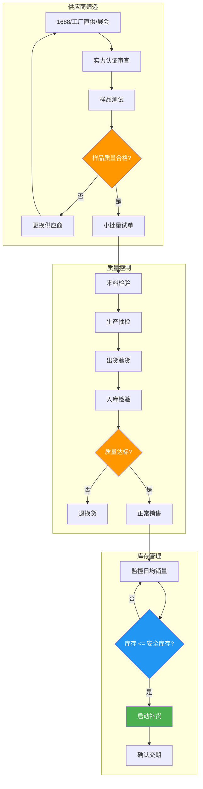
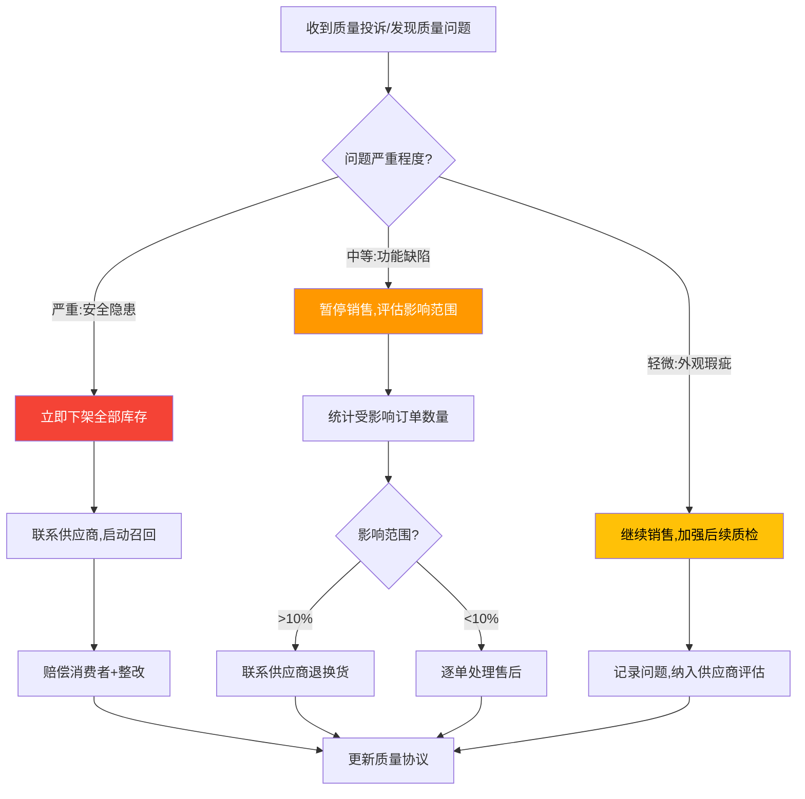
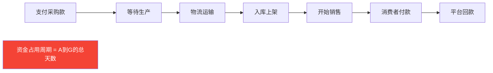

## 五、供应链管理技巧

供应链是电商的"后勤命脉"。选品再好、流量再大，如果供应链出了问题——断货、质量翻车、物流延迟——一切归零。很多电商卖家在前半段（选品、运营）投入大量精力，却在供应链上掉以轻心，最终被库存积压拖垮，或者被差评反噬。

供应链管理的核心目标只有三个：**不断货、不积压、品质稳定**。围绕这三个目标，本节从供应商选择、质量控制、库存管理、物流配送、供应链金融、风险管理六大模块展开，每个模块都给出具体的方法、工具和实操流程。



---

### 5.1 供应商选择

供应商选择是供应链管理的起点，也是最关键的一步。一个靠谱的供应商能让你省心省力，一个不靠谱的供应商会让你焦头烂额。选供应商不是"找个最便宜的"，而是在价格、质量、交期、服务之间找到最优平衡。

#### 5.1.1 供应商来源渠道

不同渠道各有优劣，实际操作中建议多渠道并行寻找，横向对比。

| 渠道 | 优势 | 劣势 | 适用场景 | 成本 |
|------|------|------|----------|------|
| **1688平台** | 品类齐全、门槛低、支持小批量 | 质量参差不齐、中间商多 | 新手入门、快速测试 | 低 |
| **工厂直供** | 价格最低、定制灵活 | 起订量高、沟通成本大 | 已验证的爆款、规模化 | 中 |
| **行业展会** | 面对面沟通、直观感受产品 | 需出差、时间成本高 | 拓展供应商池、了解行业趋势 | 中高 |
| **产业带实地考察** | 了解真实产能、建立深度信任 | 耗时耗力 | 长期合作、OEM/ODM定制 | 中 |
| **社交圈/同行推荐** | 有背书、风险较低 | 资源有限 | 已有行业人脉的卖家 | 低 |
| **跨境B2B平台** | 适合跨境电商选品 | 英文沟通、物流复杂 | 跨境电商卖家 | 中 |

**主要产业带分布**：

| 品类 | 产业带 | 特点 |
|------|--------|------|
| 小商品 | 义乌 | 全球最大小商品集散地，品类最全 |
| 服装 | 广州十三行、杭州四季青、虎门 | 快时尚供应链最成熟 |
| 电子产品 | 深圳华强北、东莞 | 3C配件、智能硬件集中地 |
| 家具 | 佛山、赣州 | 板式家具、实木家具主产区 |
| 纺织/家纺 | 南通、绍兴 | 面料、床品主产区 |
| 美妆个护 | 广州白云区、上海 | 化妆品代工厂集中 |
| 箱包 | 广州花都、泉州 | 各档次箱包均有覆盖 |
| 食品 | 各地特产产业带 | 注意食品经营许可证要求 |

**实操建议**：初次找供应商，优先从1688开始。搜索目标品类，按"实力商家""超级工厂"标签筛选，再看交易勋章等级（3颗钻以上为佳）。同时关注商品详情页是否有工厂实拍图、生产流程图——有这些的通常是真工厂而非贸易商。

#### 5.1.2 供应商筛选标准体系

不能只看价格选供应商。以下是一套经过实战验证的五维筛选体系：

**第一维：资质与规模**

| 检查项 | 具体内容 | 判断标准 |
|--------|----------|----------|
| 工厂规模 | 厂房面积、员工数量、设备数量 | 与订单量匹配即可，不必追求最大 |
| 生产资质 | 营业执照、生产许可证、行业认证 | 必须齐全，缺一不可 |
| 合作品牌 | 是否给知名品牌代工 | 有知名代工经历加分 |
| 成立年限 | 公司注册时间 | 建议3年以上，稳定性更好 |
| 注册资本 | 工商注册信息 | 参考值，不作为硬指标 |

**第二维：产品质量**

| 检查项 | 具体内容 | 判断标准 |
|--------|----------|----------|
| 样品质量 | 材质、做工、功能、包装 | 与描述一致，细节过关 |
| 批次一致性 | 多次取样对比 | 不同批次差异<5% |
| 质检报告 | 第三方检测报告 | 有CNAS/CMA认证的检测机构出具 |
| 合规认证 | 行业强制认证 | 出口产品必须有目标国认证 |

**第三维：价格与成本**

价格不是越低越好，要综合评估：

```text
总采购成本 = 单价 + 运费 + 包装费 + 质检费 + 资金占用成本 + 风险成本
```

举个例子：A供应商单价10元，但不良率8%；B供应商单价11元，不良率1%。假设月采购1000件：
- A的隐性成本：10×1000 + 80件×10元损失 = 10,800元
- B的实际成本：11×1000 = 11,000元，但几乎无不良损失

长期来看B更划算，因为退货、差评、售后的人力成本远超那1元差价。

**第四维：交期与响应**

| 检查项 | 达标标准 | 测试方法 |
|--------|----------|----------|
| 常规订单交期 | 3-7天（标品）/ 7-15天（定制） | 试单实测 |
| 紧急订单响应 | 48小时内可加急 | 模拟紧急需求 |
| 日常沟通响应 | 工作时间内2小时回复 | 日常沟通记录 |
| 缺货预警 | 提前通知原材料短缺 | 供应商主动告知 |

**第五维：服务与配合度**

- 是否愿意配合小批量试单（50-100件起）
- 是否接受退换货条款
- 是否愿意提供产品图片、视频等素材
- 是否配合定制包装、贴牌
- 售后问题的处理态度和速度

#### 5.1.3 供应商评估实操流程

**第一步：初筛（线上）**

在1688或展会收集10-20家供应商信息，按以下维度快速筛选：
1. 搜索目标品类，按"实力商家"筛选
2. 查看店铺年限、交易等级、回头率
3. 查看买家评价，重点关注差评内容
4. 初步沟通，确认是否支持小批量、定制等需求
5. 淘汰明显不合格的，保留5-8家

**第二步：样品测试**

向5-8家供应商索取样品，每家付样品费（一般20-50元/件）。收到后进行盲测：

| 测试维度 | 测试方法 | 评分（1-5分） |
|----------|----------|---------------|
| 外观 | 与详情页图片对比 | |
| 材质 | 触感、重量、气味 | |
| 做工 | 接缝、毛刺、对称性 | |
| 功能 | 实际使用测试 | |
| 包装 | 包装完整度、防护性 | |
| 附件 | 说明书、配件齐全度 | |

**第三步：试单验证（保留2-3家）**

选样品质量最好的2-3家，各下50-100件小批量订单，重点观察：
- 下单到发货的实际时间
- 大货与样品的一致性
- 包装运输中的损耗率
- 沟通配合的顺畅度

**第四步：确定主供+备供**

根据试单结果确定：
- **主供应商**：质量最好、配合度最高的1-2家，承担80%订单量
- **备供应商**：各方面合格但不是最优的1家，承担20%订单量，作为备份

> 重要原则：永远不要只依赖单一供应商。一旦主供应商出问题（产能不足、涨价、停工），备供能立即补位。这是供应链安全的基本底线。

#### 5.1.4 供应商关系管理

选好供应商不是终点，维护关系同样重要。

**日常维护要点**：
- 按时付款，建立信用。供应商也是生意人，付款爽快的客户自然获得更好的服务
- 定期沟通，不仅仅是下单时才联系。分享市场反馈、新品需求，让供应商感受到你是长期合作伙伴
- 合理压价，不要一味追求最低价。供应商利润空间太薄时，质量和服务必然缩水
- 节假日慰问，尤其是春节前后的订单安排要提前沟通

**年度评估机制**：

| 评估维度 | 权重 | 评分标准 |
|----------|------|----------|
| 产品质量（合格率） | 35% | ≥98%=5分，95-98%=4分，90-95%=3分，<90%=不合格 |
| 交期准确率 | 25% | ≥95%=5分，90-95%=4分，85-90%=3分，<85%=不合格 |
| 价格竞争力 | 20% | 与市场均价对比 |
| 服务配合度 | 15% | 沟通效率、问题处理速度 |
| 创新能力 | 5% | 是否主动提供新品/改进建议 |

评估结果为"不合格"的供应商，启动淘汰流程；连续两次"良好"以下的，降为备供。

---

### 5.2 质量控制

质量是电商的生命线。一个差评对新品的杀伤力远超你的想象——亚马逊上一个1星Review需要约10个5星Review才能拉回评分，淘宝上差评直接影响搜索权重和转化率。

质量控制的核心思想是：**预防优于检测，检测优于退货**。不要等到消费者收到劣质产品给你差评时才发现问题，要在产品到达消费者手中之前就消灭质量隐患。

#### 5.2.1 四阶段质量控制流程

**阶段一：来料检验（IQC）**

在大货生产前，对原材料和样品进行检验。

| 检验项 | 方法 | 标准 |
|--------|------|------|
| 外观检查 | 目视+放大镜 | 无色差、无瑕疵、与样品一致 |
| 尺寸测量 | 卡尺/卷尺 | 偏差在±2%以内 |
| 材质验证 | 燃烧测试/手感对比 | 与合同约定材质一致 |
| 功能测试 | 实际使用 | 所有功能正常运作 |
| 包装检查 | 目视 | 印刷清晰、配件齐全 |

**阶段二：生产中抽检（IPQC）**

在大货生产过程中进行抽检，及早发现问题。

- **抽检频率**：订单量<500件，至少抽检2次；订单量>500件，每个生产批次抽检1次
- **抽检数量**：按AQL（Acceptable Quality Level）标准，一般采用AQL 2.5，即：
  - 500件以内抽检50件，允许不合格≤3件
  - 500-1200件抽检80件，允许不合格≤5件
  - 1200-3200件抽检125件，允许不合格≤7件
- **重点关注**：生产中段最容易出现质量下降（工人疲劳、材料替换等）

**阶段三：出货前验货（OQC）**

大货完成后、发货前的最终检验，这是最后的质量拦截点。

验货清单：

```text
□ 数量核对：实际数量与订单一致
□ 外观全检/抽检：无明显瑕疵
□ 功能测试：逐项测试产品功能
□ 包装检查：包装完整、标签正确
□ 配件清点：说明书、配件、赠品齐全
□ 装箱检查：箱内布局合理、防护到位
□ 随机抽样破坏性测试：从大货中随机取样做极限测试
```

**阶段四：入库检验（FQC）**

货物到达仓库后的最终确认。

- 开箱抽检比例：首次合作供应商抽检20%，长期合作供应商抽检5%
- 重点检查运输过程中是否出现损坏
- 核对SKU、批次号，确保可追溯
- 合格产品入库，不合格品隔离标记

#### 5.2.2 质量标准文档化

口头约定的质量标准等于没有标准。必须将质量要求书面化：

**质量协议核心条款**：

```markdown
# 产品质量协议

## 1. 产品规格
- 材质要求：[具体材质及等级]
- 尺寸要求：[允许偏差范围]
- 颜色要求：[色号/Pantone色卡编号]
- 功能要求：[逐项列出]

## 2. 质量标准
- 外观合格率：≥98%
- 功能合格率：≥99%
- 包装合格率：≥99.5%

## 3. 检验方式
- 来料检验：全检/抽检（AQL 2.5）
- 出货检验：抽检（AQL 2.5）
- 第三方送检：每季度1次

## 4. 不合格处理
- 不合格率>5%：整批退货，供应商承担全部费用
- 不合格率2-5%：补货或折价处理
- 不合格率<2%：接受，但记录在供应商评估中

## 5. 售后质量追溯
- 供应商须保留每批次生产记录
- 质量问题须在48小时内响应
- 因质量问题导致的退货运费由供应商承担
```

#### 5.2.3 不同品类的质检重点

不同品类的质量风险点完全不同：

| 品类 | 核心质检项 | 常见质量问题 | 质检工具 |
|------|-----------|-------------|----------|
| 服装 | 面料成分、车缝工艺、色牢度、缩水率 | 色差、起球、开线、尺码偏差 | 色卡、卷尺、洗涤测试 |
| 电子产品 | 3C认证、电气安全、功能完整性 | 充电异常、发热、兼容性问题 | 万用表、负载测试仪 |
| 食品 | 生产日期、保质期、SC许可证、配料表 | 临期、标签不合规、口感异常 | 核对标签、开箱试吃 |
| 美妆 | 备案信息、成分表、微生物检测 | 过敏、变质、与描述不符 | 查药监局备案、试用测试 |
| 家居 | 承重测试、材质验证、环保等级 | 异味、甲醛超标、结构不稳 | 称重、试组装、通风测试 |
| 玩具 | 3C认证、小零件安全、材料无毒 | 尖锐边角、易脱落零件 | 安全测试、儿童试玩 |

#### 5.2.4 质量问题应急处理流程

即使质检再严格，质量问题仍然可能出现。关键是要有预案：



---

### 5.3 库存管理

库存管理是供应链中最考验功力的环节。库存太少，断货丢销量、丢排名；库存太多，资金被占用、仓储费增加、滞销贬值。核心就是两个字：**平衡**。

#### 5.3.1 库存策略分层

不同商品生命周期阶段需要不同的库存策略：

| 商品阶段 | 库存策略 | 备货量 | 补货频率 | 风险控制 |
|----------|----------|--------|----------|----------|
| **新品期** | 试探性备货 | 50-100件 | 按需 | 小批量验证，卖完再补 |
| **成长期** | 逐步加量 | 基于销量预测 | 每1-2周 | 观察增长曲线，逐步加量 |
| **爆品期** | 充足备货 | 安全库存的1.5-2倍 | 每周 | 防止断货是第一优先级 |
| **稳定期** | 精准备货 | 安全库存 | 每2周 | 关注竞争对手动向 |
| **衰退期** | 逐步减量 | 最低安全库存 | 按需 | 避免积压，准备清仓方案 |
| **清仓期** | 快速清零 | 停止补货 | 无 | 促销、直播、尾货渠道处理 |

#### 5.3.2 核心库存公式与计算

**安全库存公式**：

```text
安全库存 = 日均销量 × 补货周期(天) × 安全系数
```

其中：
- **日均销量**：取近7天或30天的平均值（新品用7天，稳定品用30天）
- **补货周期**：从下采购单到货物入库上架的总天数（含生产+物流+入库）
- **安全系数**：考虑销量波动和供应不确定性，一般取1.2-1.5

**计算示例**：

```text
某商品日均销量 = 30件
补货周期 = 7天(生产) + 3天(物流) + 1天(入库) = 11天
安全系数 = 1.3

安全库存 = 30 × 11 × 1.3 = 429件

即：当库存降至429件时，必须立即启动补货。
```

**补货数量公式**：

```text
补货量 = (日均销量 × 补货周期) + 安全库存 - 当前库存 - 在途库存
```

**经济订货量（EOQ）模型**：

当采购量越大、单价越低时，需要平衡采购成本和仓储成本：

```text
EOQ = √(2 × 年需求量 × 单次订货成本 / 单位年仓储成本)
```

示例：年需求量10000件，单次订货成本200元（含沟通、跟单、物流费），单位年仓储成本5元/件：
```text
EOQ = √(2 × 10000 × 200 / 5) = √800000 ≈ 894件
```
即每批订894件成本最优。实际操作中会取整到箱规（如每箱50件，取900件）。

#### 5.3.3 ABC分类管理法

不是所有商品都值得同等精力管理。用ABC分类法将精力集中在高价值商品上：

| 分类 | SKU占比 | 销售额占比 | 管理策略 |
|------|---------|-----------|----------|
| **A类** | 20% | 70% | 重点监控，每日查看销量，保持充足库存，不允许断货 |
| **B类** | 30% | 20% | 常规监控，每周查看，按安全库存补货 |
| **C类** | 50% | 10% | 轻度监控，每月查看，可考虑代发或少量备货 |

**实操方法**：
1. 导出近3个月的销售数据
2. 按销售额从高到低排序
3. 计算累计销售占比
4. 累计到70%的商品标记为A类
5. 累计70%-90%的标记为B类
6. 剩余为C类

#### 5.3.4 库存监控仪表盘

建议每天查看以下核心指标：

| 指标 | 计算方式 | 健康范围 | 预警阈值 |
|------|----------|----------|----------|
| **库存周转天数** | 平均库存 / 日均销量 | 30-60天 | >90天（积压风险）<br><15天（断货风险） |
| **库存周转率** | 年销售成本 / 平均库存 | 6-12次/年 | <4次（资金效率低） |
| **动销率** | 有销量SKU数 / 总SKU数 | >80% | <60%（大量滞销品） |
| **库龄结构** | 各库龄段库存占比 | 90天内>70% | 180天以上>20%（需清仓） |
| **缺货率** | 缺货天数 / 总天数 | <5% | >10%（严重影响排名） |

#### 5.3.5 滞销库存处理方案

当库存周转天数超过90天，或者商品进入衰退期时，需要果断处理滞销库存。积压的库存不仅占用资金，还产生仓储费，时间越长损失越大。

**处理方案优先级**：

| 方案 | 折损率 | 操作难度 | 适用场景 |
|------|--------|----------|----------|
| **平台促销** | 10-30% | 低 | 产品本身有竞争力，只是流量不足 |
| **直播/短视频清仓** | 20-40% | 中 | 有主播资源或自己做直播 |
| **尾货渠道** | 40-60% | 中 | 品牌尾货平台（爱库存、好衣库等） |
| **同行分销** | 30-50% | 中 | 有同行资源，批量出货 |
| **线下地摊/集市** | 50-70% | 高 | 低单价日用品 |
| **捐赠+税务抵扣** | 100% | 低 | 接近保质期或过季商品 |

> 核心原则：宁可亏损处理，也不要让库存继续积压。账面上的库存价值是虚幻的，只有变成现金才是真实的。很多卖家因为"舍不得亏"而让库存越积越多，最终亏损更大。

#### 5.3.6 库存管理工具对比

| 工具 | 价格 | 核心功能 | 适用规模 |
|------|------|----------|----------|
| **Excel/飞书表格** | 免费 | 手动记录、简单公式 | 月销<5万的小卖家 |
| **聚水潭ERP** | 基础版免费 | 多平台订单管理、库存同步、采购管理 | 多平台运营的中小卖家 |
| **旺店通** | 按单量收费 | 订单处理、仓储管理、财务对账 | 日均100单以上 |
| **马帮ERP** | 按单量收费 | 跨境电商专用，多平台、多仓库 | 跨境电商卖家 |
| **管易云** | 按单量收费 | 全渠道管理、智能补货建议 | 中大型卖家 |

---

### 5.4 物流与配送管理

物流是供应链中唯一直接触达消费者的环节，物流体验直接影响DSR评分（淘宝）、ODR（亚马逊）和复购率。

#### 5.4.1 国内物流方案选择

| 方案 | 单票成本 | 时效 | 适用场景 |
|------|----------|------|----------|
| **通达系快递** | 2-4元/单 | 2-4天 | 日用品、服装等低价商品 |
| **顺丰标快** | 12-23元/单 | 1-2天 | 高价值商品、生鲜、急需品 |
| **顺丰特惠** | 6-10元/单 | 2-3天 | 中高价值商品的性价比选择 |
| **京东物流** | 5-12元/单 | 1-3天 | 京东店铺、对时效有要求 |
| **极兔/丰网** | 2-3元/单 | 3-5天 | 价格敏感的低单价商品 |

**降低物流成本的方法**：
1. **谈月结协议**：日均发货>20单即可谈月结价，量越大价越低
2. **多快递比价**：至少对接3家快递，不同地区用不同快递（如偏远地区用邮政）
3. **集中发货**：固定每天下午统一取件，降低快递员上门成本
4. **优化包装**：在保证防护的前提下减小体积和重量，降低抛重计费

#### 5.4.2 跨境物流方案选择

| 方案 | 时效 | 成本 | 适用场景 |
|------|------|------|----------|
| **国际小包（邮政）** | 15-30天 | 低 | 轻小件、价格敏感 |
| **国际专线** | 7-15天 | 中 | 中等重量、有时效要求 |
| **FBA头程（海运）** | 30-45天 | 最低 | 大批量备货到亚马逊仓库 |
| **FBA头程（空运）** | 7-12天 | 中高 | 紧急补货、轻小高价值品 |
| **海外仓** | 3-5天（本地派送） | 中 | 稳定销量的成熟商品 |
| **直邮（DHL/FedEx/UPS）** | 3-7天 | 高 | 高价值、时效敏感 |

**跨境物流成本结构**：

```text
总物流成本 = 头程运费 + 目的国关税 + 清关费 + 尾程派送费 + 仓储费(如有)
```

以发美国FBA为例，一件500g的商品：
- 海运头程：约3-5元/kg（批量大可压到2.5元/kg）
- 空运头程：约30-45元/kg
- FBA配送费：约$3.22（标准尺寸1磅以内）
- FBA仓储费：$0.87/立方英尺·月（1-9月），$2.40/立方英尺·月（10-12月旺季）

#### 5.4.3 包装设计要点

包装不只是保护商品，更是品牌触点。好的包装能提升开箱体验，促进好评和复购。

**防护层设计**：

| 商品类型 | 内包装 | 外包装 | 特殊要求 |
|----------|--------|------|----------|
| 易碎品（玻璃、陶瓷） | 气泡膜+泡沫 | 加厚纸箱+易碎标识 | 悬浮包装或EPE定位 |
| 电子产品 | 防静电袋+珍珠棉 | 原装彩盒+外箱 | 防潮、防静电 |
| 服装 | OPP袋+防潮纸 | 快递袋或纸箱 | 防潮防污 |
| 液体/粉末 | 密封瓶+防漏膜 | 加固纸箱+填充物 | 防漏是第一优先级 |

**品牌层设计**：
- 包装箱/袋印刷品牌LOGO和Slogan
- 放入感谢卡（引导好评，但注意平台规则——不能直接要求好评）
- 附赠小样或实用赠品（成本控制在1-3元）
- 印上售后联系方式和使用说明

---

### 5.5 供应链金融

现金流是电商的血液，而供应链管理直接影响现金流效率。很多卖家不是死于没订单，而是死于现金流断裂。

#### 5.5.1 电商现金流周期

理解现金流周期是供应链金融的基础：



国内电商平台的资金占用周期：淘宝/天猫约10-15天（确认收货后到账），拼多多约7-15天。但加上采购和物流，实际资金占用通常在30-60天。

跨境电商更长：FBA从发货到可售约30-45天，加上平台14天回款周期，资金占用可达60-90天。

#### 5.5.2 供应链融资方案

| 方案 | 利率/费率 | 额度 | 适用阶段 |
|------|----------|------|----------|
| **电商平台贷款**（网商贷、亚马逊借贷） | 年化8-15% | 基于店铺数据 | 已有稳定销量 |
| **应收账款融资** | 年化6-10% | 基于应收账款 | 有平台未结算款 |
| **库存质押融资** | 年化8-12% | 基于库存价值 | 库存量大、资金周转困难 |
| **供应商账期** | 无利息 | 协商确定 | 与供应商关系好 |
| **信用证（L/C）** | 手续费1-3% | 按合同金额 | 跨境大额采购 |

**供应商账期谈判技巧**：

小卖家通常需要现款现货，但随着合作深入可以逐步争取账期：
- 首单：现款现货（建立信任）
- 合作3个月后：争取30%预付+70%货到付款
- 合作半年后：争取月结30天
- 合作一年以上：争取月结60天

账期=免费的资金周转窗口，对现金流改善巨大。

#### 5.5.3 现金流优化策略

1. **缩短采购到销售的周期**：选择交期短的供应商，优化物流时效
2. **提高库存周转率**：库存越少，占用资金越少。目标是库存周转天数<45天
3. **阶梯式采购**：不要一次性采购大量，分批采购分散资金压力
4. **预售模式**：先收订单再采购，资金零占用（适合新品测试和定制品）
5. **多平台回款对冲**：不同平台回款周期不同，可以利用时间差

---

### 5.6 供应链风险管理

供应链风险是电商经营中最容易被忽视但杀伤力最大的风险之一。2021年亚马逊封号潮中，大量卖家因为库存被扣、账号冻结导致供应链断裂，资金链崩溃。

#### 5.6.1 常见供应链风险分类

| 风险类型 | 具体表现 | 发生概率 | 影响程度 |
|----------|----------|----------|----------|
| **供应商风险** | 工厂倒闭、涨价、断供、质量下降 | 中 | 高 |
| **库存风险** | 滞销积压、断货、仓储损坏 | 高 | 中-高 |
| **物流风险** | 快递丢件、破损、时效延误、海关扣货 | 中 | 中 |
| **合规风险** | 产品不合规、侵权、政策变化 | 中低 | 极高 |
| **汇率风险** | 汇率波动侵蚀利润（跨境） | 高 | 中 |
| **平台风险** | 封号、限流、政策变更 | 低 | 极高 |
| **自然/突发事件** | 疫情、自然灾害、国际局势 | 低 | 极高 |

#### 5.6.2 风险应对策略

**供应商风险应对**：
- 主供+备供双保险（至少2家供应商）
- 定期评估供应商经营状况（关注工商变更、新闻报道）
- 核心原材料储备1-2周安全库存
- 关键产品考虑3家以上供应商

**库存风险应对**：
- 严格执行安全库存公式，不凭感觉备货
- 新品一律小批量测试，验证后逐步放量
- 季节性商品提前2个月规划清仓方案
- 滞销超过60天立即启动促销

**物流风险应对**：
- 跨境发货购买货运保险（费率约0.3-0.5%）
- 高价值商品用可追踪物流
- 海外仓备货分散到多个仓库
- 保留备用物流渠道

**合规风险应对**：
- 上架前确认产品符合目标国法规和平台政策
- 保留所有认证文件和检测报告
- 不碰仿品、侵权品
- 关注平台政策更新（订阅卖家论坛和官方通知）

#### 5.6.3 供应链应急预案模板

每个卖家都应该准备一份应急预案，而不是等出了问题才手忙脚乱：

```markdown
# 供应链应急预案

## 1. 断货应急
触发条件：库存 < 安全库存的50%
应急措施：
  - 立即联系所有供应商确认最快交期
  - 空运紧急补货（不计较物流成本）
  - 临时提高售价降低消耗速度
  - 减少广告投放降低订单量
  
## 2. 质量事故应急
触发条件：差评率突增或集中投诉
应急措施：
  - 立即下架问题批次
  - 联系供应商查明原因
  - 主动联系受影响买家退款+补偿
  - 启动全检，隔离问题产品
  
## 3. 供应商断供应急
触发条件：主供应商无法正常交货
应急措施：
  - 启动备供应商紧急下单
  - 临时调整商品为预售模式
  - 评估是否需要找替代品
  
## 4. 物流中断应急
触发条件：物流大面积延误
应急措施：
  - 切换备用物流渠道
  - 在商品详情页更新物流时效说明
  - 主动通知买家可能延迟
  
## 5. 账号风险应急
触发条件：收到平台警告或限制通知
应急措施：
  - 暂停相关商品采购
  - 加速清理受影响库存
  - 备用账号/备用平台启动
  - 联系平台客服了解具体原因
```

---

### 5.7 供应链管理的常见误区

#### 误区一：只看单价选供应商

**错误做法**：哪家便宜选哪家，不断压价。

**正确做法**：综合评估总成本（含质量损失、物流、售后、沟通成本），选择性价比最优的供应商。适度的采购价格换取更好的质量和服务，长期来看是赚的。

#### 误区二：大批量采购追求低价

**错误做法**：为了拿更低单价，一次采购3-6个月的量。

**正确做法**：小批量多频次采购。虽然单价略高，但库存周转快、资金占用少、滞销风险低。除非是确定性的爆品且有稳定销量数据支撑，否则不要囤大量库存。

#### 误区三：忽视质检

**错误做法**：信任供应商，收到大货直接入仓上架。

**正确做法**：每次大货都必须抽检。哪怕是合作多年的老供应商，抽检也不能省。因为供应商可能更换原材料、调整工艺，或者换工人导致质量波动。

#### 误区四：不设安全库存

**错误做法**：卖完了再补，或者促销前临时大量采购。

**正确做法**：每个SKU都计算安全库存，设置预警线。尤其是大促（双11、Prime Day）前，至少提前1.5个补货周期备货。

#### 误区五：不做供应商备份

**错误做法**：一个供应商合作愉快就一直用，不去开发备选。

**正确做法**：每个核心品类至少有1个备选供应商，并保持一定的交易量维持关系。不要等主供出问题才临时找，那时候能找到的大概率也不靠谱。

#### 误区六：库存只看数量不看库龄

**错误做法**：只关注总库存数量，不关注每批货的入库时间。

**正确做法**：用ERP或表格记录每批库存的入库日期，定期分析库龄结构。超过90天未动销的必须处理，超过180天的是死库存，越早处理越好。

---

### 5.8 供应链管理进阶：从被动到主动

以上内容覆盖了供应链管理的基础和核心技巧。对于已经有一定规模（月销>10万）的卖家，以下是几个进阶方向：

#### 5.8.1 数据驱动的智能补货

当你有3个月以上的稳定销售数据后，可以用数据模型替代经验判断：

```text
预测销量 = 基准销量 × 季节系数 × 趋势系数 × 活动系数
```

- **基准销量**：近30天日均销量的移动平均
- **季节系数**：同期历史数据的季节性波动（如冬季保暖品在9-11月系数>1.5）
- **趋势系数**：品类增长/衰退趋势
- **活动系数**：大促期间的销量倍增（双11通常2-5倍）

ERP系统（如聚水潭、旺店通）已内置智能补货建议功能，但你需要理解其逻辑才能判断建议是否合理。

#### 5.8.2 柔性供应链建设

柔性供应链的核心是"快速响应需求变化"：

- **小单快反**：与供应商约定7天快速交期，50件起订，新品测试周期缩短到1-2周
- **预售测款**：先上架测试收藏/加购数据，数据达标再下单生产
- **快时尚模式**：每周上新10-20款，数据好的追单，数据差的淘汰

这种模式特别适合服装、饰品等快消品类，需要与供应商建立极高的配合度和信任度。

#### 5.8.3 自有品牌与深度供应链整合

当你的店铺规模足够大（月销>50万），可以考虑：

1. **OEM贴牌**：使用自己的品牌，供应商按你的规格生产
2. **ODM定制**：你提出产品需求，供应商负责设计和生产
3. **自建供应链**：投资或入股工厂，掌控核心产能

深度整合供应链的优势：独占供应商产能、成本可控、品控更强、产品差异化。但投入也更大，需要谨慎评估。

---

### 5.9 供应链管理检查清单

将以下清单打印出来，每月自查一次：

**供应商管理**
- [ ] 每个核心品类有主供+备供
- [ ] 供应商评估表已更新（季度）
- [ ] 所有质量协议已签订并存档
- [ ] 供应商联系方式和关键信息已备份

**质量控制**
- [ ] 每批大货都执行了抽检
- [ ] 质检标准文档已更新
- [ ] 近30天的不良率在可控范围内（<3%）
- [ ] 有质量问题的批次已隔离处理

**库存管理**
- [ ] 每个SKU都有安全库存设定
- [ ] 库存周转天数在30-60天之间
- [ ] 无超过90天的滞销库存（或已有处理方案）
- [ ] 大促前备货计划已制定

**物流管理**
- [ ] 至少对接2家物流服务商
- [ ] 包装方案已优化（防护+成本）
- [ ] 物流时效达标率>95%

**风险管理**
- [ ] 应急预案已制定并可执行
- [ ] 核心商品有备选供应商
- [ ] 合规认证文件齐全有效
- [ ] 现金流可覆盖至少2个月运营

***

供应链管理是一个持续优化的过程，不存在"一劳永逸"的方案。随着你的业务规模增长、品类扩展、平台变化，供应链策略也需要同步调整。核心原则不变：**小批量起步、数据驱动、永远有备份、风险前置管理**。

***