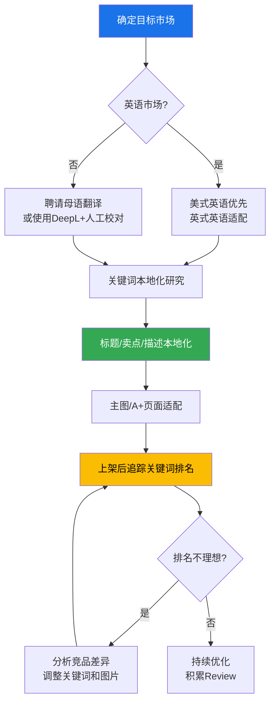
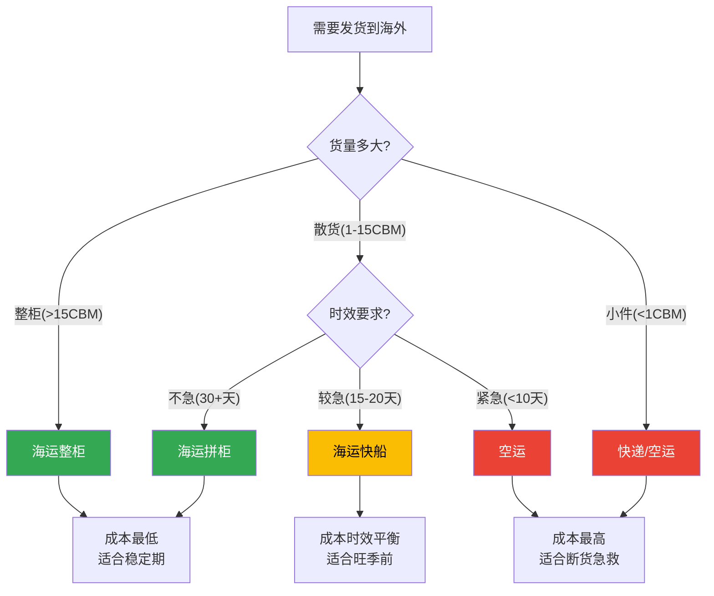
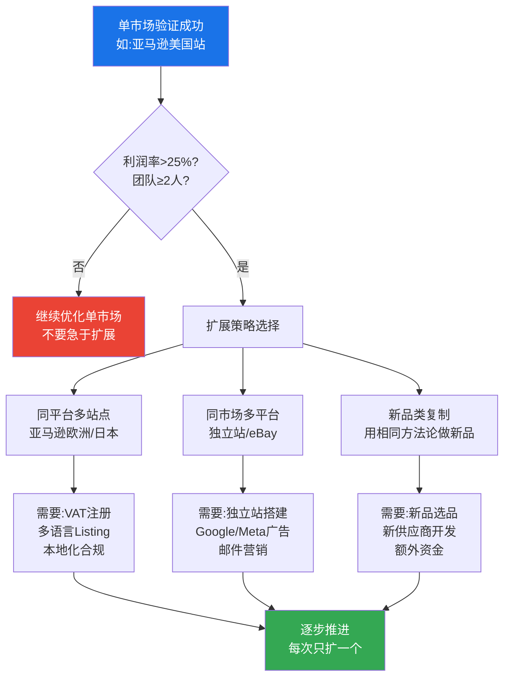

## 六、跨境电商特殊技巧

> 跨境电商不是"把国内商品翻译成英文挂到海外平台"这么简单。它涉及市场调研、文化适配、合规认证、物流方案、支付结算、税务处理、客服时区、知识产权等一整套国内电商完全不会遇到的复杂体系。本节从实操角度出发，系统讲解跨境电商区别于国内电商的每一个特殊环节，帮你建立完整的跨境运营能力。

### 6.1 跨境选品：文化差异与市场需求的精准匹配

国内电商选品看数据，跨境选品除了看数据，还必须理解目标市场的文化背景、消费习惯、法规限制和季节节奏。一个在中国卖爆的产品到了欧美可能无人问津，反之亦然。

#### 6.1.1 跨境选品的核心逻辑

跨境选品的本质是**信息差套利**——利用中国供应链的成本优势，满足海外市场未被充分满足的需求。但这个信息差正在缩小，单纯靠"便宜"已经不够，必须叠加以下维度：

| 维度 | 国内选品 | 跨境选品 | 关键差异 |
|------|----------|----------|----------|
| 需求验证 | 生意参谋/直通车数据 | Jungle Scout/Helium 10/Google Trends | 数据工具完全不同 |
| 文化适配 | 基本不需要 | 极其重要 | 颜色、图案、尺寸、命名都有文化含义 |
| 合规门槛 | 低（CCC认证少量品类） | 高（CE/FDA/FCC/PSE等） | 不合规直接扣关或下架 |
| 物流限制 | 无特殊限制 | 重量/体积/液体/电池/粉末都有限制 | 物流成本可能超过货值 |
| 季节节奏 | 与国内同步 | 反季节或错峰 | 北半球冬天卖棉服时，澳大利亚是夏天 |
| 竞争格局 | 国内同行竞争 | 全球卖家竞争 | 中国卖家约占亚马逊40% |

#### 6.1.2 五步跨境选品法

**第一步：确定目标市场**

不同市场的消费能力、竞争强度、物流成本差异巨大。新手建议从单一市场切入：

| 市场 | 特点 | 适合品类 | 启动难度 | 推荐指数 |
|------|------|----------|----------|----------|
| 美国 | 最大消费市场，客单价高，竞争激烈 | 家居、厨房、运动、宠物 | 中高 | ★★★★★ |
| 欧洲 | 消费力强，VAT合规复杂 | 家居、电子、时尚、户外 | 高 | ★★★★ |
| 日本 | 品质要求极高，退货率低 | 3C配件、家居、收纳 | 中高 | ★★★★ |
| 东南亚 | 增长快，客单价低，物流基础弱 | 美妆、服装、手机配件 | 低 | ★★★ |
| 中东 | 高客单价，文化限制多 | 家居、电子产品、时尚 | 中 | ★★★ |
| 拉美 | 增长潜力大，物流和支付不成熟 | 电子产品、家居、时尚 | 高 | ★★ |

**第二步：用数据工具筛选品类**

跨境选品的核心工具链：

- **Jungle Scout**（$49/月）：亚马逊产品数据库，可按月销量、价格、评论数、评分筛选，核心功能是估算某个关键词下产品的月销量和竞争度
- **Helium 10**（$79/月）：关键词研究的瑞士军刀，Cerebro功能可反查竞品的全部关键词，Magnet功能可拓展长尾词
- **Google Trends**（免费）：验证搜索趋势是否上升，比较不同地区的搜索热度
- **Keepa**（$19/月）：追踪亚马逊产品价格历史和BSR排名变化，判断产品是否季节性
- **卖家精灵**（¥39/月）：中文界面的亚马逊分析工具，适合不习惯英文工具的新手

选品数据筛选的核心指标：

| 指标 | 理想范围 | 说明 |
|------|----------|------|
| 月搜索量 | >5000 | 说明有足够需求 |
| 竞争卖家数 | <200 | 竞争不过于激烈 |
| 首页平均评论数 | <500 | 新品有机会突围 |
| 首页平均评分 | >4.3 | 说明市场对品质有要求但不苛刻 |
| 平均售价 | $15-$50 | 太低利润不够，太高资金压力大 |
| 头部卖家月销量 | >300单 | 说明市场容量足够 |
| 产品重量 | <2磅（1kg） | 物流成本可控 |
| 是否有品牌垄断 | 首页无大品牌独占 | 大品牌垄断的品类新手很难进入 |

**第三步：文化适配分析**

这是跨境选品最容易被忽略、也最容易踩坑的环节：

- **颜色禁忌**：白色在西方代表纯洁（婚礼），在东亚部分地区代表丧葬；红色在中国代表喜庆，在南非代表哀悼；绿色在东南亚受欢迎，在某些中东国家有宗教含义
- **尺寸差异**：美国消费者的体型普遍比东亚大1-2个尺码，家居空间也更大。卖收纳用品时，"大号"的定义完全不同
- **图案禁忌**：十字架、六芒星、特定动物图案在不同文化中有不同含义；卡通形象可能涉及版权
- **宗教因素**：中东市场禁止酒精相关产品、猪皮制品；印度市场部分素食人群不接受动物源产品
- **节日节奏**：美国的感恩节（11月）、圣诞节（12月）、独立日（7月）、返校季（8-9月）是重要销售节点；穆斯林市场的斋月、开斋节是消费高峰

**第四步：合规可行性评估**

在确定一个品类之前，必须确认目标市场的合规要求。这不是"做完再补"的事情，而是"做之前就必须搞清楚"的前置条件：

| 目标市场 | 核心认证 | 适用品类 | 办理周期 | 费用范围 |
|----------|----------|----------|----------|----------|
| 欧盟CE | CE标志 | 电子产品、玩具、机械、建材 | 4-8周 | 3000-30000元 |
| 欧盟REACH | 化学品注册 | 化妆品、纺织品、食品接触材料 | 8-12周 | 5000-50000元 |
| 美国FDA | FDA注册 | 食品、药品、化妆品、医疗器械 | 4-12周 | 5000-80000元 |
| 美国FCC | FCC认证 | 电子产品、无线设备 | 3-6周 | 5000-20000元 |
| 美国CPSIA | 儿童产品认证 | 12岁以下儿童使用的产品 | 4-8周 | 3000-15000元 |
| 日本PSE | PSE标志 | 电子产品 | 6-10周 | 10000-30000元 |
| 英国UKCA | UKCA标志 | 脱欧后替代CE | 4-8周 | 3000-25000元 |
| 欧盟GPSR | 通用产品安全法规 | 所有消费品（2024年12月生效） | — | 合规成本因产品而异 |

**第五步：利润测算**

跨境的利润计算比国内复杂得多，必须把所有隐性成本都算进去：

```text
净利润 = 售价 - 采购成本 - 头程物流 - FBA费用 - 平台佣金 - 广告费 - 退货成本 - VAT/关税 - 其他费用

示例（一款售价$29.99的厨房用品，发往美国FBA）：
采购成本：¥25（约$3.50）
头程物流（空运）：¥8（约$1.10）
FBA配送费：$5.40（标准尺寸1磅以内）
平台佣金（15%）：$4.50
广告费（ACoS 25%）：$7.50（新品期，成熟期降至15-20%）
退货成本（3%退货率）：$0.90
商标分摊：$0.10
净利润：$29.99 - $3.50 - $1.10 - $5.40 - $4.50 - $7.50 - $0.90 - $0.10 = $6.99
毛利率：23.3%
```

**利润率红线**：跨境产品的毛利率低于20%不建议做。因为汇率波动、物流涨价、广告成本上升等因素会吃掉利润。理想毛利率在30%-40%之间。

#### 6.1.3 跨境选品的禁忌清单

以下品类新手绝对不要碰：

| 禁忌品类 | 原因 | 风险等级 |
|----------|------|----------|
| 食品和保健品 | FDA认证复杂，保质期限制，食品安全责任巨大 | 极高 |
| 儿童用品（3岁以下） | CPSIA要求严格，窒息风险召回成本高 | 极高 |
| 电子烟/烟具 | 各国法规差异大，部分国家完全禁止 | 极高 |
| 药品和医疗器械 | 需要专业资质，FDA审批周期长 | 极高 |
| 品牌仿品/擦边球 | 知识产权侵权，平台封店+法律诉讼 | 极高 |
| 液体/粉末（大容量） | 物流限制多，危险品运费高 | 高 |
| 大件家具 | 头程物流成本极高，退货几乎无法处理 | 高 |
| 服装（非标品） | 退货率高达30%-40%，尺码问题复杂 | 中高 |

### 6.2 Listing本地化：不只是翻译，而是重写

跨境Listing最大的误区是"把中文翻译成英文"。本地化的核心是**用目标市场消费者的语言习惯、搜索习惯和决策逻辑来重写内容**。

#### 6.2.1 标题优化的本地化策略

不同平台的标题规则不同，但本地化的核心原则一致：**用当地人搜索时会用的词，而不是翻译后的中文思维词**。

**反面示例（直译）**：
```text
Chinese Style Kitchen Knife High Quality Stainless Steel Sharp Blade Cooking Tool
```

**正面示例（本地化）**：
```cpp
8 Inch Chef Knife - German High Carbon Stainless Steel Kitchen Knife with Ergonomic Handle,
Professional Cooking Knife for Chopping, Slicing and Dicing - Gift Box Included
```

**本地化差异对比**：

| 中文思维 | 美国消费者习惯 | 说明 |
|----------|---------------|------|
| 高品质 | Professional Grade / Premium | 用具体等级替代空泛描述 |
| 不锈钢 | German High Carbon Stainless Steel | 标注钢材来源增加信任感 |
| 厨房工具 | Chef Knife / Kitchen Knife | 用具体品类名替代笼统分类 |
| 锋利 | Ultra Sharp / Razor Sharp | 用更有画面感的修饰词 |
| 好用 | Ergonomic Handle / Comfortable Grip | 用具体功能特征替代主观评价 |

**关键词获取方法**：
1. 用Helium 10的Cerebro反查竞品ASIN，获取竞品的全部索引关键词
2. 用亚马逊搜索框的自动补全功能，输入核心词看推荐的长尾词
3. 用Google Keyword Planner查看搜索量和竞争度
4. 翻看竞品的评论区，找出消费者反复提到的关键词和痛点

#### 6.2.2 主图和A+页面的本地化

不同市场的审美偏好差异显著：

| 维度 | 美国市场 | 欧洲市场 | 日本市场 |
|------|----------|----------|----------|
| 主图风格 | 简洁白底，产品突出 | 简洁白底，强调质感 | 精致细腻，强调细节 |
| 场景图 | 生活化场景，多元化人种 | 生活化场景，注重环保元素 | 干净简洁，注重使用场景 |
| 信息图 | 数据驱动，强调功能参数 | 数据+环保认证 | 详细尺寸图，使用步骤图 |
| 文字量 | 中等，突出卖点 | 中等，多语言标注 | 较多，信息密度高 |
| 包装展示 | 展示包装和赠品 | 强调环保包装 | 精美包装是重要卖点 |

**A+页面（Enhanced Brand Content）的本地化要点**：

1. **不要在图片上嵌入大量文字**——图片上的文字无法被搜索引擎索引，且不同语言版本需要重新制作图片
2. **使用场景化图片**展示产品在目标市场家庭环境中的使用场景
3. **对比图表**用当地消费者熟悉的参照物（如用美元硬币对比尺寸，而不是用人民币）
4. **品牌故事**要融入目标市场的价值观（美国强调创新和品质，欧洲强调环保和可持续，日本强调匠心和细节）

#### 6.2.3 多语言Listing管理

如果你同时运营多个市场的店铺，需要为每个市场制作独立的本地化Listing：



**翻译工具推荐**：

| 工具 | 适用场景 | 优势 | 局限 |
|------|----------|------|------|
| DeepL | 欧洲语言翻译 | 翻译质量高于Google Translate | 亚洲语言支持较弱 |
| ChatGPT/Claude | 全语言本地化 | 可指定语气、风格、关键词 | 需要人工校对专业术语 |
| 母语翻译人员 | 高质量本地化 | 最准确、最自然 | 成本高，每条Listing约200-500元 |
| 卖家精灵/跨境翻译插件 | 批量翻译 | 快速、低成本 | 质量一般，适合初稿 |

### 6.3 跨境物流方案选择：FBA、海外仓与直邮的全面对比

物流是跨境电商成本结构中占比最大、也最复杂的环节。选错物流方案可能导致利润归零甚至亏损。

#### 6.3.1 三种主流物流模式对比

| 维度 | FBA（亚马逊配送） | 第三方海外仓 | 直邮（小包/专线） |
|------|-------------------|-------------|-------------------|
| **运作模式** | 货发到亚马逊仓库，亚马逊负责仓储、配送、退换 | 货发到第三方仓库，自行或委托配送 | 国内直接发货到买家手中 |
| **配送时效** | 1-3天（Prime标志） | 3-7天 | 7-30天 |
| **头程成本** | 海运：8-15元/kg；空运：30-50元/kg | 海运：8-15元/kg；空运：30-50元/kg | 专线：40-80元/kg |
| **仓储费** | 标准件：$0.87/立方英尺·月（1-9月）；$2.40（10-12月旺季） | $0.50-1.50/立方英尺·月 | 无 |
| **配送费** | $3.22-$6.92/件（标准尺寸） | $3-8/件（视仓库和渠道） | 含在运费中 |
| **退货处理** | 亚马逊自动处理 | 需自行安排 | 买家通常不退货（运费太高） |
| **适合场景** | 高客单价标品、走量产品、Prime会员 | 大件/超重件、非亚马逊平台 | 测品期、低客单价、长尾产品 |
| **资金占用** | 高（需提前备货到海外） | 中高 | 低（按单发货） |
| **风险** | 库存积压、长期仓储费、账号关联 | 库存管理、仓库选择 | 时效差、丢包率高、买家体验差 |

#### 6.3.2 物流成本精确计算

物流成本是跨境卖家最容易低估的隐性成本。以下是真实的成本构成：

**FBA全流程成本示例**（一款标准尺寸产品，重量12oz，发往美国）：

```text
头程物流（海运，1CBM约装500件）：
  海运费：约¥8000/CBM ÷ 500件 = ¥16/件 ≈ $2.20/件
  报关费：¥200/票，摊到500件 = ¥0.4/件 ≈ $0.05/件
  目的港杂费：约$0.10/件
  头程合计：$2.35/件

FBA费用：
  配送费：$3.68/件（Small Standard, 12oz）
  仓储费：$0.87/立方英尺·月 × 0.05立方英件 = $0.04/件·月
  FBA合计：$3.72/件（存放1个月）

单件物流总成本：$2.35 + $3.72 = $6.07/件
```

**FBA长期仓储费警告**：库存超过365天，仓储费飙升至$6.90/立方英尺·月或$0.15/件·月（取较大值）。这是新手最容易忽视的"资金黑洞"——大量备货卖不掉，仓储费会持续侵蚀利润。

#### 6.3.3 头程物流方案选择

| 方式 | 时效 | 成本 | 适用场景 | 注意事项 |
|------|------|------|----------|----------|
| 海运整柜（FCL） | 25-40天 | 最低（¥3000-6000/CBM） | 大批量、稳定销量 | 需要凑整柜，资金占用大 |
| 海运拼柜（LCL） | 30-45天 | 中等（¥6000-10000/CBM） | 中等批量 | 拼柜可能有延误 |
| 空运 | 7-12天 | 高（¥30-50/kg） | 紧急补货、新品首批 | 价格波动大 |
| 海运快船 | 15-20天 | 中高 | 平衡时效和成本 | 美森快船、以星快船 |
| 快递（DHL/UPS/FedEx） | 3-7天 | 最高（¥60-100/kg） | 样品、超紧急 | 有关税起征点优势 |

**头程物流决策框架**：



### 6.4 跨境支付与结算：资金流转的完整链路

跨境资金流转涉及多个环节，每个环节都有费用损耗。理解并优化这个链路，直接关系到你的实际利润。

#### 6.4.1 收款工具对比

海外平台的销售回款需要通过第三方收款工具转换为人民币：

| 工具 | 支持平台 | 提现费率 | 汇率 | 到账时间 | 特色功能 |
|------|----------|----------|------|----------|----------|
| Payoneer（派安盈） | 亚马逊/eBay/Shopee/Wish | 1.2% | 参考市场汇率，略有加价 | 1-3个工作日 | 多币种账户，可直接付款给供应商 |
| WorldFirst（万里汇） | 亚马逊/eBay/独立站 | 0.3%-0.7% | 接近市场汇率 | 1-2个工作日 | 蚂蚁集团旗下，费率有竞争力 |
| PingPong | 亚马逊/eBay/Shopee | 0.6%-1% | 接近市场汇率 | 1-2个工作日 | 国内团队，中文客服好 |
| 连连支付 | 亚马逊/eBay/Wish | 0.7% | 参考市场汇率 | 1-3个工作日 | 国内老牌支付公司 |
| 亚马逊全球收款 | 亚马逊 | 0 | 汇率较差 | 14天回款周期 | 最简单但汇率损失最大 |

**选择建议**：费率不是唯一考虑因素。WorldFirst和PingPong的综合性价比最高，Payoneer的生态最完善（可以直接用外币余额付款给1688供应商，避免二次汇损）。

#### 6.4.2 资金流转周期管理

跨境电商的资金流转周期远长于国内电商：

```text
典型资金流转周期（亚马逊FBA）：

Day 0：付款给供应商采购
Day 15：供应商发货
Day 30：货物到达FBA仓库并上架
Day 31-60：销售期（日均出单10-30单）
Day 75：亚马逊第一次回款（14天回款周期）

从付款到回款：约75天
如果加上补货决策和下单时间：约90-120天

这意味着你的资金每3-4个月才能周转一次。
首批投入10万元，至少需要准备20-30万元的总资金才能持续运营。
```

**现金流管理要点**：

1. **不要把所有资金一次性投入首批备货**——留30%-40%作为运营缓冲
2. **利用亚马逊的贷款服务**（Amazon Lending）缓解资金压力，年化利率约6%-16%
3. **供应商账期谈判**——量大后争取30天账期，相当于无息贷款
4. **海运和空运混合使用**——常规补货用海运（便宜），紧急补货用空运（快），平衡成本和断货风险

### 6.5 跨境广告投放：亚马逊PPC与站外引流

跨境广告的核心战场是亚马逊站内PPC（Pay Per Click），但站外引流（Google、Facebook、TikTok）在品牌建设阶段同样重要。

#### 6.5.1 亚马逊广告体系

亚马逊广告是跨境电商获取流量的最直接方式。新品期广告投入是"必要成本"，不是"可选支出"。

**三种核心广告类型**：

| 广告类型 | 展示位置 | 适用场景 | 核心指标 |
|----------|----------|----------|----------|
| SP（Sponsored Products） | 搜索结果页、商品详情页 | 新品推广、关键词排名 | ACoS、CPC、CTR、CVR |
| SB（Sponsored Brands） | 搜索结果页顶部 | 品牌曝光、多产品推广 | 品牌搜索量、CTR |
| SD（Sponsored Display） | 竞品详情页、站外 | 防御竞品、再营销 | CPM、CTR、ROAS |

**新品期广告策略（第1-3个月）**：

1. **自动广告跑词**：开一组自动广告（紧密匹配+宽泛匹配），日预算$20-30，跑2周收集有效关键词
2. **手动精准广告**：从自动广告中筛选出转化率>10%的关键词，开手动精准匹配，单独出价
3. **竞品ASIN定向**：选择排名在你前面但评分比你低的竞品ASIN，用商品定向广告抢占其详情页流量
4. **预算分配**：自动广告30%，手动精准50%，竞品定向20%

**ACoS目标参考**：

| 阶段 | 目标ACoS | 说明 |
|------|----------|------|
| 新品期（1-3月） | 30%-50% | 允许亏损换排名和Review |
| 成长期（4-6月） | 20%-30% | 开始盈利，优化关键词 |
| 成熟期（6月+） | 15%-20% | 广告贡献稳定利润 |
| 旺季/促销期 | 放宽到25%-35% | 冲销量和排名 |

#### 6.5.2 站外引流策略

站外引流的作用不是直接带来销量（转化率通常低于站内），而是**通过外部流量提升产品在亚马逊算法中的权重**：

- **社交媒体引流**：在Instagram/TikTok/Pinterest发布产品使用视频，链接到亚马逊Listing。适合视觉化强的产品（家居、美妆、时尚）
- **Deal网站**：Slickdeals、DealNews等美国折扣网站发布限时折扣，短期冲销量。注意：需要大幅折扣（50%+）才有曝光
- **红人合作**：通过Amazon Influencer Program联系社交媒体红人，寄样品+佣金合作。中小红人（1万-10万粉丝）性价比最高
- **Google Ads**：针对长尾关键词投放Google Shopping广告，引流到亚马逊Listing或独立站。适合高客单价、决策周期长的产品

### 6.6 跨境合规与知识产权：生死线而非选修课

合规是跨境电商最容易忽视、后果也最严重的环节。一次合规失误可能导致货物被扣关、店铺被封、甚至面临法律诉讼。

#### 6.6.1 产品合规的三大维度

**维度一：产品认证**

不同市场对不同品类有强制认证要求。以下是核心认证的实操指南：

| 认证 | 市场 | 核心要求 | 办理流程 | 常见坑 |
|------|------|----------|----------|--------|
| CE | 欧盟 | 产品符合欧盟安全/健康/环保指令 | 1.确定适用指令 2.产品测试 3.编制技术文件 4.签署符合性声明 5.加贴CE标志 | 自我声明≠不需要测试，很多品类必须第三方实验室出具报告 |
| FCC | 美国 | 电子产品电磁兼容 | 1.FCC认证实验室测试 2.获取FCC ID 3.产品标注 | 无意辐射设备和有意辐射设备要求不同 |
| FDA | 美国 | 食品/药品/化妆品/医疗器械安全 | 1.确定产品分类 2.FDA注册 3.产品标签合规 4.设施注册 | 化妆品不需要上市前审批但必须符合标签法规 |
| UL | 美国（非强制但实际必须） | 电子产品安全 | 1.UL授权实验室测试 2.获取UL报告 | 亚马逊大部分类目实际要求UL报告，没有会被下架 |
| PSE | 日本 | 电子产品安全 | 1.日本认可实验室测试 2.获取PSE标志 | 菱形PSE（特定危险品）和圆形PSE（一般电器）要求不同 |
| REACH | 欧盟 | 化学品安全 | 1.确定SVHC物质 2.含量检测 3.供应链通报 | 纺织品、电子产品的化学物质限制越来越严格 |

**维度二：知识产权**

知识产权问题是跨境卖家被封店的第二大原因（仅次于刷单）。必须做到：

1. **商标查询**：在USPTO（美国）、EUIPO（欧盟）、JPO（日本）数据库查询目标商标是否已注册
2. **专利查询**：在Google Patents、USPTO专利数据库查询产品外观和功能是否已有专利保护
3. **版权检查**：产品图片、描述文案、包装设计不能抄袭他人
4. **品牌备案**：在亚马逊Brand Registry注册自有品牌，获得品牌保护和A+页面权限
5. **外观专利避让**：如果发现某产品有外观专利，不要做"高度相似"的产品，微小改动不足以规避侵权

**维度三：税务合规**

| 税种 | 市场 | 核心要求 | 卖家义务 |
|------|------|----------|----------|
| 美国销售税 | 美国各州 | 各州税率不同（0%-10.25%），有nexus概念 | 达到nexus门槛需注册并代收代缴 |
| 欧盟VAT | 欧盟 | 统一增值税，税率15%-27%不等 | 在有库存的国家注册VAT，按季度申报 |
| 英国VAT | 英国 | 20%标准税率 | 在英国使用FBA必须注册英国VAT |
| GST | 澳大利亚/加拿大 | 10%/5%-15% | 达到门槛需注册 |
| 关税 | 全球 | 根据HS编码确定税率 | 正确申报货值和HS编码，避免低报被查 |

**VAT实操要点**：

- 欧盟VAT是跨境卖家最大的合规成本之一。以德国为例，VAT税率19%，意味着你每卖出100欧元要交19欧元的税
- 可以通过IOSS（Import One-Stop Shop）简化低于€150商品的VAT申报
- 英国脱欧后需要单独注册英国VAT，不能用欧盟VAT覆盖
- 建议使用专业的VAT服务商（如J&P会计师事务所、万理晴）代为注册和申报，费用约3000-8000元/年/国家

#### 6.6.2 合规检查清单

在上架任何产品之前，逐项确认：

- [ ] 产品是否需要目标市场的强制认证？如果是，是否已取得？
- [ ] 产品标签是否符合目标市场要求？（产地标注、警告标识、成分说明）
- [ ] 产品是否涉及他人的商标、专利或版权？
- [ ] 自有品牌是否已在目标市场完成商标注册？
- [ ] VAT/销售税是否已在需要的国家/州注册？
- [ ] 产品是否属于目标市场的禁止或限制进口品类？
- [ ] 包装是否符合目标市场的环保法规？（如欧盟包装指令）
- [ ] 产品说明书是否有目标市场官方语言版本？

### 6.7 跨境客服管理：时区、语言与文化的服务挑战

跨境客服的复杂度远高于国内——不同国家的消费者期望、沟通习惯、时区差异都不同。

#### 6.7.1 时区管理方案

| 市场 | 时区 | 与北京时差 | 客服高峰期（当地时间） | 北京时间 |
|------|------|-----------|----------------------|----------|
| 美国东部 | EST/EDT | -13/-12小时 | 9AM-9PM | 22:00-次日10:00（夏令时） |
| 美国西部 | PST/PDT | -16/-15小时 | 9AM-9PM | 次日1:00-13:00（夏令时） |
| 英国 | GMT/BST | -8/-7小时 | 9AM-9PM | 17:00-次日5:00（夏令时） |
| 德国 | CET/CEST | -7/-6小时 | 9AM-9PM | 16:00-次日4:00（夏令时） |
| 日本 | JST | +1小时 | 9AM-9PM | 10:00-22:00 |

**解决方案**：

1. **AI客服工具**：使用ChatGPT API或专门的跨境客服工具（如Reply.ai、Tidio）处理80%的常见问题。预设英文/日文/德文的话术模板，覆盖物流查询、退换货、产品使用等高频场景
2. **分时段值班**：如果团队有2人以上，安排"白班+夜班"轮换覆盖美国市场高峰时段
3. **亚马逊FBA的优势**：FBA产品的客服和退换由亚马逊处理，卖家只需处理少量产品相关问题，大幅降低客服压力
4. **快捷回复模板库**：为每个市场建立标准化回复模板（英文/日文/德文），包含常见问题的标准化回答

#### 6.7.2 差评处理的跨境策略

跨境差评的处理比国内更复杂，因为语言障碍和文化差异：

- **美国消费者**：直接、注重解决方案。回复要简洁明了，提供具体补偿方案（退款/补发/折扣券）
- **欧洲消费者**：注重礼貌和程序。回复要正式，说明处理流程和时间线
- **日本消费者**：极其注重细节和礼貌。回复要用敬语，详细说明改进措施，甚至手写感谢卡

**差评回复模板（英文）**：

```text
Dear [Customer Name],

Thank you for your feedback. We sincerely apologize for the inconvenience
you experienced with [specific issue mentioned in review].

We have taken immediate action to [specific improvement/resolution].
[If offering compensation: As a gesture of our commitment to your
satisfaction, we would like to offer you a full refund/replacement/
discount on your next purchase.]

Please contact us at [email] so we can resolve this for you directly.

Best regards,
[Brand Name] Customer Support
```

### 6.8 跨境电商的风险管理框架

跨境的风险维度比国内多出至少5个，需要系统化的风险管理框架。

#### 6.8.1 七大核心风险与应对策略

| 风险类型 | 风险描述 | 发生概率 | 影响程度 | 应对策略 |
|----------|----------|----------|----------|----------|
| **汇率风险** | 人民币升值压缩利润 | 中 | 中高 | 1.预留15%-20%利润空间 2.使用远期锁汇 3.多币种分散 |
| **物流风险** | 海运涨价、港口拥堵、丢件 | 中 | 高 | 1.多物流商备选 2.提前发货避开旺季 3.购买货运保险 |
| **库存风险** | 断货损失排名或积压占用资金 | 高 | 高 | 1.安全库存公式计算 2.海运+空运混合补货 3.滞销品及时清仓 |
| **合规风险** | 产品不达标被扣关或下架 | 中 | 极高 | 1.上架前完成所有认证 2.持续关注法规变化 3.聘请合规顾问 |
| **知识产权风险** | 被投诉侵权导致封店 | 中 | 极高 | 1.上架前全面检索 2.注册自有品牌 3.购买知识产权保险 |
| **账号风险** | 亚马逊账号被封或限制 | 中低 | 极高 | 1.严格遵守平台规则 2.不刷单不操控评价 3.多账号/多平台分散 |
| **政策风险** | 贸易战、关税变化、制裁 | 低 | 极高 | 1.关注国际贸易政策 2.多市场分散 3.灵活调整定价策略 |

#### 6.8.2 风险量化管理

用以下公式量化你的风险敞口：

```text
最大单笔损失 = 库存成本 + 头程物流 + 广告已投入 + 平台罚款（如有）

示例：
库存成本：¥50000（500件×¥100/件）
头程物流：¥15000
广告已投入：¥20000
平台罚款风险：¥0-50000（视违规程度）
最大单笔损失：¥85000-¥135000

风险管理原则：
最大单笔损失 ≤ 可承受损失（即不影响生活的资金）
建议：最大单笔损失 ≤ 总流动资产的20%
```

### 6.9 从单店到多市场：跨境电商的规模化路径

当你在一个市场站稳脚跟后，下一步是复制成功模式到其他市场和平台。

#### 6.9.1 多市场扩展策略



#### 6.9.2 独立站与平台的协同

成熟卖家的最佳策略是**平台+独立站双轨运营**：

| 维度 | 平台（亚马逊） | 独立站（Shopify） | 协同方式 |
|------|---------------|-------------------|----------|
| 流量来源 | 平台内搜索流量 | Google/Facebook/社媒广告 | 平台验证产品，独立站沉淀品牌 |
| 用户关系 | 平台拥有用户 | 你拥有用户数据 | 独立站收集邮箱，建立私域 |
| 利润率 | 15%-35%（扣完所有费用） | 25%-50%（无平台佣金） | 平台做量，独立站做利润 |
| 品牌建设 | 受限于平台模板 | 完全自主 | 独立站承载品牌故事 |
| 风险分散 | 平台政策风险 | 广告成本风险 | 互相备份 |

### 6.10 跨境电商常用工具与资源汇总

| 类别 | 工具 | 用途 | 费用 |
|------|------|------|------|
| **选品调研** | Jungle Scout | 亚马逊产品数据库 | $49/月 |
| **选品调研** | Helium 10 | 关键词研究、Listing优化 | $79/月 |
| **选品调研** | Keepa | 价格和排名历史追踪 | $19/月 |
| **选品调研** | Google Trends | 趋势验证 | 免费 |
| **Listing优化** | Canva | 主图和A+页面设计 | 免费/$12.99/月 |
| **Listing优化** | DeepL | 高质量翻译 | 免费/$8.74/月 |
| **广告管理** | Perpetua | 亚马逊广告自动化 | $250/月起 |
| **广告管理** | Quartile | 亚马逊广告优化 | 按广告花费比例 |
| **ERP管理** | 芒果店长 | 多平台ERP | ¥99/月起 |
| **ERP管理** | 领星ERP | 亚马逊专业ERP | ¥299/月起 |
| **收款工具** | WorldFirst | 跨境收款 | 0.3%-0.7% |
| **收款工具** | Payoneer | 跨境收款 | 1.2% |
| **合规服务** | 各认证机构 | CE/FCC/FDA认证 | 按产品定价 |
| **合规服务** | J&P会计师事务所 | 欧洲VAT注册和申报 | ¥3000-8000/年/国 |

### 6.11 跨境电商新手常见错误

| 错误 | 表现 | 后果 | 正确做法 |
|------|------|------|----------|
| 直译式Listing | 用Google翻译直接翻译中文标题和描述 | 搜索排名低，转化率差 | 用目标市场语言习惯重写，使用当地关键词 |
| 忽视合规 | 不做认证就上架，不注册VAT | 货物被扣关，店铺被封，罚款 | 上架前完成所有合规要求 |
| 盲目大量备货 | 首批就发1000件到FBA | 卖不掉产生高额仓储费 | 首批100-300件测品，验证后再加量 |
| 低价竞争 | 以为便宜就能卖 | 利润归零，陷入价格战 | 差异化选品+高转化率Listing+品牌溢价 |
| 忽视退货成本 | 不计算跨境退货的物流费用 | 退货吃掉所有利润 | 提高产品质量减少退货；低客单价产品直接退款不退货 |
| 只做站内广告 | 不做任何站外引流 | 广告成本持续上升，没有自然流量 | 站内+站外+内容营销多渠道组合 |
| 单一市场依赖 | 只做一个国家的生意 | 政策变化/汇率波动导致收入断崖 | 逐步扩展到2-3个市场分散风险 |
| 不跟踪竞品 | 上架后就不管竞争对手动态 | 被竞品超越而不自知 | 每周监控竞品价格、排名、评价变化 |

### 6.12 本节核心要点回顾

1. **跨境选品五步法**：确定目标市场→数据工具筛选→文化适配分析→合规可行性评估→利润测算，每一步都不能跳过
2. **Listing本地化**不是翻译，是用当地人的语言习惯、搜索习惯和审美偏好重写内容
3. **物流方案选择**要综合考虑产品特性、客单价、销量阶段和资金状况，FBA不是万能解
4. **资金流转周期**是跨境最大的隐性门槛——首批投入后约90-120天才能回款，必须预留充足资金
5. **合规是生死线**——产品认证、知识产权、税务合规三者缺一不可，在投入资金之前先搞定
6. **风险管理**要量化——最大单笔损失不能超过可承受范围，多市场多平台分散风险
7. **从单店到多市场**的扩展要循序渐进，每次只扩一个维度，验证成功后再扩展下一个
