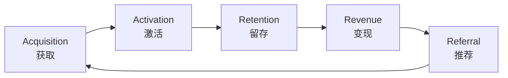
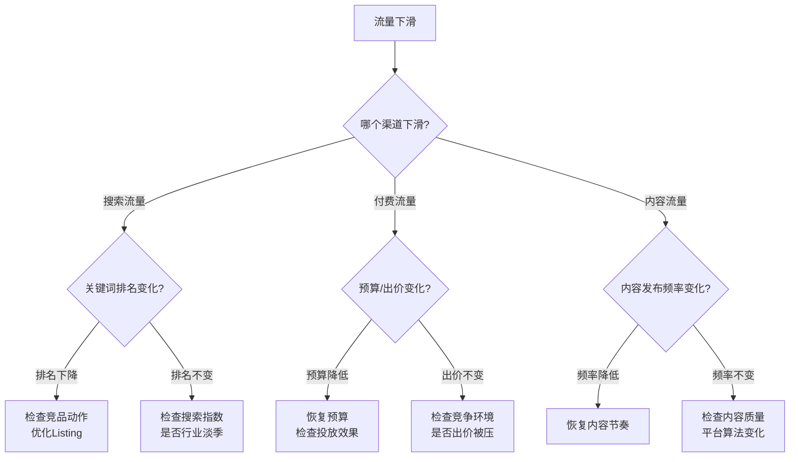
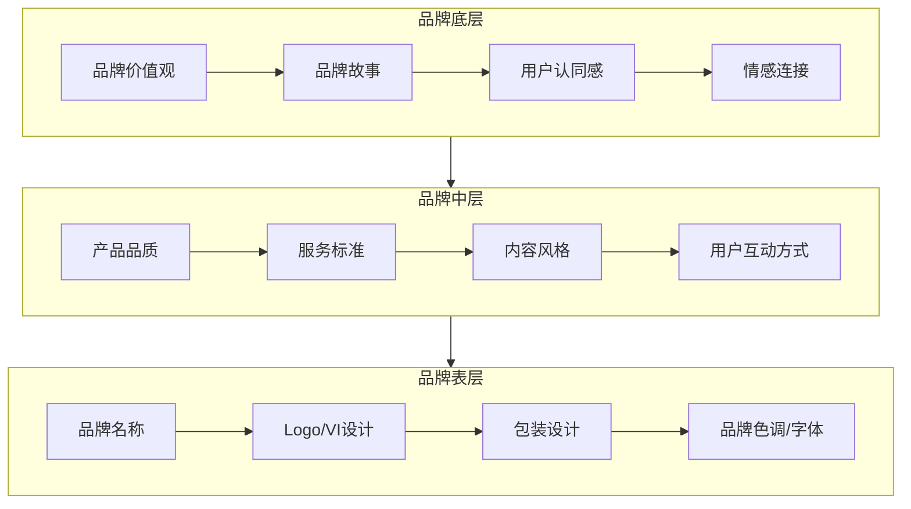
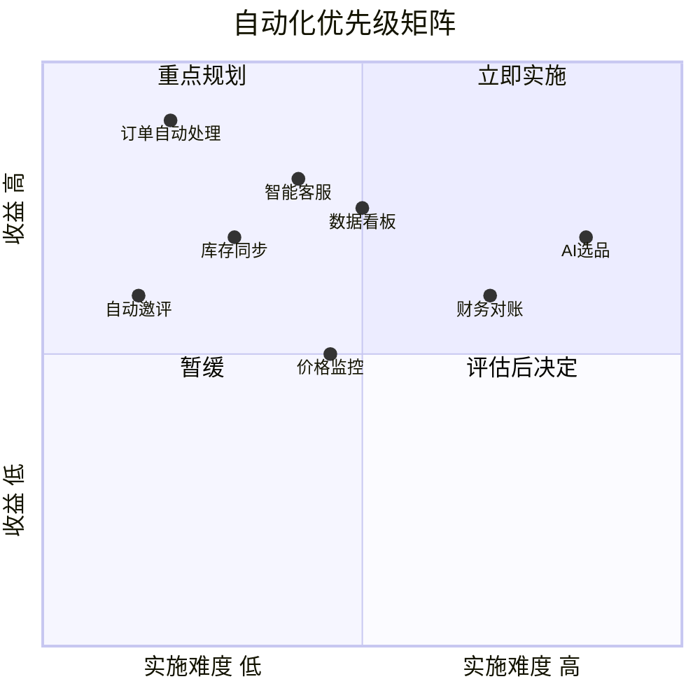

## 七、电商运营的高级技巧

选品决定了你能卖什么，流量决定了多少人看到你，但**运营**决定了这些人中有多少会买、买了会不会再来、来了会不会推荐给朋友。电商运营的初级阶段关注的是"把货卖出去"，而高级阶段关注的是"让整个系统自动高效地运转"。

本节从用户生命周期管理、数据驱动决策、动态定价策略、品牌化运营、运营自动化、团队与SOP建设、多平台协同运营七个维度，拆解电商运营的高级技巧。每个维度都从原理机制讲到实操方法，配合真实案例和可复用的模板。

---

### 7.1 用户生命周期管理：从 AARRR 到精细化运营

用户生命周期管理（Customer Lifecycle Management）的核心思想是：**不同阶段的用户需要不同的运营策略**。把所有用户一视同仁地推送相同的促销信息，是对资源的巨大浪费。

#### 7.1.1 AARRR 模型的电商应用

AARRR 模型（也称海盗指标）是用户生命周期管理的经典框架，在电商场景中的具体含义如下：



**获取（Acquisition）——让用户找到你**

获取阶段的核心指标是**获客成本（CAC）**和**流量质量**。不是所有流量都有价值，关键是要获取"会买的人"而不是"随便看看的人"。

| 获取渠道 | 典型CAC | 流量质量 | 适用阶段 |
|----------|---------|----------|----------|
| 平台搜索流量（SEO/直通车） | ¥5-30 | 高（主动搜索意图明确） | 全阶段 |
| 信息流广告（抖音/小红书） | ¥15-80 | 中（兴趣触发，需培育） | 打爆款、品牌曝光 |
| 社交裂变（拼团/砍价） | ¥1-10 | 低-中（价格敏感型） | 冲销量、拉新 |
| KOL/KOC种草 | ¥20-100 | 高（信任背书） | 新品推广、品牌建设 |
| 私域引流（微信/社群） | ¥0-5 | 极高（已有信任基础） | 复购、高客单价 |
| 跨平台导流 | ¥3-15 | 中-高 | 多平台布局 |

**实操要点：**

- **渠道组合而非单一依赖**：健康的流量结构是"搜索流量占40% + 付费流量占30% + 内容流量占20% + 其他占10%"。如果付费流量占比超过60%，说明利润被广告费吞噬，需要加强自然流量建设。
- **流量分层运营**：用UTM参数或平台自带的流量标记功能，追踪每个渠道来源用户的后续行为（浏览深度、加购率、转化率、复购率），砍掉"只看不买"的渠道，加码"高转化"的渠道。

**激活（Activation）——让新用户完成首购**

新用户从"进入店铺"到"完成首次购买"之间的每一步都可能流失。激活阶段的核心任务是**缩短决策路径、降低首购门槛**。

关键策略：

- **新客专享价**：设置仅限新用户的价格优惠（如首单立减20元、新客9折券），降低尝试成本。注意：折扣力度要控制在利润可承受范围内，避免吸引纯薅羊毛用户。
- **信任体系建设**：新用户对店铺没有信任基础，需要通过以下方式快速建立信任：
  - 详尽的商品详情页（实拍图、尺寸表、材质说明、使用场景）
  - 真实的用户评价（引导已购用户上传带图评价，前20条评价至关重要）
  - 明确的售后承诺（7天无理由退换、运费险、假一赔十）
  - 客服响应速度（首次回复控制在30秒内）
- **首购体验优化**：新用户的第一次购物体验决定了他是否会回来。重点优化：
  - 包装开箱体验（品牌感包装、感谢卡、使用说明）
  - 物流时效（新用户订单优先发货）
  - 购后跟进（发货通知、签收确认、使用关怀）

**留存（Retention）——让用户持续回来**

留存是电商运营中最被低估的环节。获取一个新用户的成本是维护一个老用户的5-7倍，而老用户的客单价通常比新用户高30%-50%。

留存策略的核心是**建立用户习惯和情感连接**：

- **会员体系设计**：

| 等级 | 达成条件 | 权益 | 运营目标 |
|------|----------|------|----------|
| 普通会员 | 注册即得 | 积分累计、生日券 | 引导首购 |
| 银卡会员 | 消费满500元或3单 | 95折、优先发货、专属客服 | 提升复购 |
| 金卡会员 | 消费满2000元或10单 | 9折、免运费、新品试用 | 提升客单价 |
| 钻石会员 | 消费满5000元或20单 | 85折、专属礼品、线下活动 | 品牌忠诚 |

- **复购触发机制**：
  - 基于购买周期的提醒（如护肤品30天回购提醒、食品60天补货提醒）
  - 基于浏览行为的推荐（浏览未购买的商品降价通知）
  - 基于用户标签的个性化内容（根据购买历史推送相关品类内容）
- **社群运营**：将高价值用户沉淀到微信社群或企业微信，通过日常内容（使用技巧、搭配建议、用户故事）保持互动，而非单纯发促销信息。社群运营的黄金比例是"80%内容 + 20%促销"。

**变现（Revenue）——提升用户价值**

变现阶段的核心指标是**用户终身价值（LTV）**。LTV = 客均单次消费额 × 年均购买次数 × 平均留存年限。提升LTV的三个杠杆：

- **提升客单价**：
  - 关联推荐（买了手机壳推荐钢化膜）
  - 满减/满赠活动（设置略高于平均客单价的满减门槛）
  - 套装组合（单品+配件打包优惠价）
  - 向上销售（基础款→升级款→旗舰款的阶梯推荐）
- **提升购买频次**：
  - 订阅制（如每月定期配送的消耗品）
  - 会员日（每月固定日期的会员专享折扣）
  - 新品上新提醒（让用户养成"定期来看看"的习惯）
- **提升留存时长**：
  - 积分体系（积分可兑换商品或优惠券，增加退出成本）
  - 专属服务（VIP用户的专属客服、优先售后）

**推荐（Referral）——让用户带来用户**

口碑推荐是成本最低、转化率最高的获客方式。推荐机制的设计要点：

- **双向奖励**：推荐人和被推荐人都获得奖励（如"邀请好友各得20元券"），比单向奖励效果好2-3倍。
- **降低分享门槛**：生成带有用户专属标识的分享海报/链接，一键分享到微信/朋友圈。
- **社交货币**：让用户分享出去的内容本身有价值感（如"我在XX店发现了这个宝藏好物"），而非赤裸裸的广告。
- **数据追踪**：通过邀请码、专属链接追踪每个用户的推荐效果，对高推荐用户给予额外奖励。

#### 7.1.2 用户分层精细化运营

AARRR 模型是纵向的时间维度，用户分层是横向的价值维度。两者结合才能实现真正的精细化运营。

**RFM 模型**是电商用户分层的经典方法：

- **R（Recency）**：最近一次购买时间
- **F（Frequency）**：购买频次
- **M（Monetary）**：购买金额

将三个维度各分为高/低两档，组合出8种用户类型：

| 用户类型 | R | F | M | 运营策略 |
|----------|---|---|---|----------|
| 重要价值用户 | 高 | 高 | 高 | VIP维护，专属权益，新品优先体验 |
| 重要发展用户 | 高 | 低 | 高 | 提升购买频次，推荐关联品类 |
| 重要保持用户 | 低 | 高 | 高 | 防流失预警，召回活动，了解流失原因 |
| 重要挽留用户 | 低 | 低 | 高 | 大额优惠券召回，专属客服跟进 |
| 一般价值用户 | 高 | 高 | 低 | 提升客单价，推荐高利润商品 |
| 一般发展用户 | 高 | 低 | 低 | 引导复购，新客培育 |
| 一般保持用户 | 低 | 高 | 低 | 低成本触达（短信/推送），维持活跃 |
| 流失用户 | 低 | 低 | 低 | 低优先级，批量召回活动覆盖即可 |

**实操：用 Excel 或 BI 工具实现 RFM 分层**

```python
import pandas as pd
from datetime import datetime

# 假设有订单数据：user_id, order_date, order_amount
df = pd.read_csv('orders.csv')
df['order_date'] = pd.to_datetime(df['order_date'])

# 计算RFM值
snapshot_date = df['order_date'].max() + pd.Timedelta(days=1)
rfm = df.groupby('user_id').agg({
    'order_date': lambda x: (snapshot_date - x.max()).days,  # Recency
    'order_amount': ['count', 'sum']  # Frequency, Monetary
}).reset_index()
rfm.columns = ['user_id', 'recency', 'frequency', 'monetary']

# 分层：以中位数为分界线
rfm['R_score'] = (rfm['recency'] <= rfm['recency'].median()).astype(int)
rfm['F_score'] = (rfm['frequency'] > rfm['frequency'].median()).astype(int)
rfm['M_score'] = (rfm['monetary'] > rfm['monetary'].median()).astype(int)

# 标签映射
def label_user(row):
    if row['R_score'] and row['F_score'] and row['M_score']:
        return '重要价值用户'
    elif row['R_score'] and not row['F_score'] and row['M_score']:
        return '重要发展用户'
    elif not row['R_score'] and row['F_score'] and row['M_score']:
        return '重要保持用户'
    elif not row['R_score'] and not row['F_score'] and row['M_score']:
        return '重要挽留用户'
    elif row['R_score'] and row['F_score'] and not row['M_score']:
        return '一般价值用户'
    elif row['R_score'] and not row['F_score'] and not row['M_score']:
        return '一般发展用户'
    elif not row['R_score'] and row['F_score'] and not row['M_score']:
        return '一般保持用户'
    else:
        return '流失用户'

rfm['user_segment'] = rfm.apply(label_user, axis=1)
print(rfm['user_segment'].value_counts())
```

---

### 7.2 数据驱动的运营决策

"感觉这个款能爆"——这是初级卖家的典型决策方式。高级运营的决策必须基于数据，而数据驱动的前提是**知道看什么数据、怎么看、看完怎么行动**。

#### 7.2.1 核心运营指标体系

电商运营涉及数十个指标，但真正需要日盯的核心指标不超过10个。按层级分为三层：

**第一层：老板看的（日维度）**

| 指标 | 计算方式 | 健康范围 | 异常判断 |
|------|----------|----------|----------|
| GMV（成交总额） | Σ(订单金额) | 环比±20%以内 | 连续3天下降>20%需排查 |
| 转化率 | 成交数÷访客数 | 3%-10%（因品类） | 低于品类均值50%需优化 |
| 客单价 | GMV÷成交数 | 因品类而异 | 突降可能是促销力度过大 |
| 退款率 | 退款数÷成交数 | <10% | >15%需排查产品或描述问题 |

**第二层：运营看的（周维度）**

| 指标 | 计算方式 | 分析要点 |
|------|----------|----------|
| 流量结构 | 各渠道访客占比 | 搜索流量占比是否健康（>30%） |
| 加购率 | 加购数÷访客数 | 低于5%说明详情页吸引力不足 |
| 支付转化率 | 支付数÷下单数 | 低于70%说明支付环节有障碍 |
| 复购率 | 重复购买客户÷总客户 | 低于20%说明留存有问题 |
| UV价值 | GMV÷UV数 | 综合衡量流量变现效率 |

**第三层：投放看的（日维度）**

| 指标 | 计算方式 | 优化方向 |
|------|----------|----------|
| ROI | 销售额÷广告花费 | >3为健康，<1.5需暂停优化 |
| CPC（单次点击成本） | 花费÷点击数 | 行业均值的80%以内为优 |
| CTR（点击率） | 点击数÷展现数 | >3%为优，<1%需优化创意 |
| ACoS（广告销售成本） | 广告花费÷广告销售额 | <25%为健康 |

#### 7.2.2 数据分析的四个实战场景

**场景一：流量下滑诊断**

流量下滑时，不要慌，按以下流程逐层排查：



**场景二：转化率优化的漏斗分析**

转化率低不是一个原因，而是整个漏斗中多个环节的累积损耗。需要逐层分析：

```text
展现量 → 点击量 → 详情页浏览 → 加购 → 下单 → 支付
100%   → 3-5%  → 60-80%     → 15-25% → 50-70% → 70-90%
```

每一层的优化方向：

| 漏斗环节 | 关键指标 | 优化方向 |
|----------|----------|----------|
| 展现→点击 | 点击率（CTR） | 主图优化、标题关键词、价格竞争力 |
| 点击→浏览 | 跳出率 | 首屏吸引力、加载速度、移动端适配 |
| 浏览→加购 | 加购率 | 详情页说服力、评价质量、价格合理性 |
| 加购→下单 | 下单转化率 | 优惠券推送、库存紧迫感、客服引导 |
| 下单→支付 | 支付率 | 支付方式多样性、限时优惠、短信提醒 |

**场景三：竞品数据分析**

知己知彼是运营的基本功。竞品分析的核心维度：

- **价格带分析**：用平台工具（如生意参谋的"竞品分析"功能）监控竞品价格变化，判断其促销节奏。
- **关键词分析**：通过ABA（亚马逊品牌分析）或生意参谋，查看竞品的主要流量关键词，找到自己可以切入的蓝海词。
- **评价分析**：定期爬取竞品的差评，提炼用户痛点，作为自己产品改进的方向。差评是免费的产品调研。
- **上新节奏**：监控竞品的上新频率和品类扩展方向，预判市场趋势。

**场景四：A/B 测试驱动优化**

不要猜，要测。A/B 测试是验证运营假设的最可靠方法：

| 可测试元素 | 测试方法 | 判断标准 |
|-----------|----------|----------|
| 主图 | 同一商品不同主图，观察点击率变化 | 统计显著性 p<0.05 |
| 标题 | 不同关键词组合，观察搜索流量变化 | 至少运行7天 |
| 价格 | 小范围内调整价格，观察转化率和利润变化 | 综合考虑销量×利润率 |
| 详情页 | 不同排版/卖点顺序，观察加购率 | 至少1000次曝光 |
| 促销方式 | 满减 vs 直降 vs 赠品，观察客单价和转化率 | 控制总让利额相同 |

**工具推荐**：

- **生意参谋**（淘宝/天猫）：最全面的国内电商数据工具，包含流量、商品、交易、竞争等模块
- **亚马逊品牌分析 ABA**（Amazon）：提供搜索词报告、市场篮子分析、重复购买行为
- **Google Analytics 4**（独立站）：用户行为追踪、转化漏斗、归因分析
- **GrowingIO / 神策数据**：用户行为分析工具，支持自定义事件追踪和漏斗分析
- **自建数据看板**：用 Metabase 或 Grafana 连接数据库，构建实时运营看板

---

### 7.3 动态定价策略

定价不是"成本+利润率"这么简单。高级定价策略需要综合考虑成本结构、竞争环境、用户心理、平台规则四个维度。

#### 7.3.1 四种定价模型

**成本加成定价法（入门级）**

公式：售价 = 成本 × (1 + 目标利润率)

适用场景：标准化产品、竞争不激烈的品类。优点是简单可控，缺点是忽略了市场需求和竞争因素。

示例：产品成本50元，目标利润率40%，则售价 = 50 × 1.4 = 70元。

**竞争导向定价法**

以竞品价格为锚点，根据自身定位决定高于、等于还是低于竞品价格：

- **高于竞品**：需要有明确的差异化卖点（品牌、品质、服务）支撑溢价
- **等于竞品**：适合同质化产品，通过其他维度（赠品、服务）竞争
- **低于竞品**：适合有成本优势的卖家，但要避免陷入价格战

**价值导向定价法（高级）**

根据用户感知价值而非成本来定价。适用于品牌化产品、独特设计、情感消费品。

关键在于**塑造价值感**：包装设计、品牌故事、使用场景展示、KOL背书都能提升用户感知价值，从而支撑更高定价。

**动态定价法（最高级）**

根据实时供需关系自动调整价格。大型平台（如亚马逊）已经在用算法动态定价，中小卖家也可以在一定范围内实施：

- **时段定价**：高峰时段（如晚间8-11点）适当提价，低谷时段降价引流
- **库存定价**：库存充足时保持正常价，库存紧张时适当提价
- **竞品联动**：监控竞品价格变化，自动调整自身价格保持竞争力
- **会员差异化**：不同等级会员享受不同价格，提升会员价值感

#### 7.3.2 心理定价技巧

| 技巧 | 原理 | 实操方法 |
|------|------|----------|
| 尾数定价 | 99元比100元感觉便宜很多 | 设置以9或8结尾的价格 |
| 锚定效应 | 先看到高价再看到低价，感觉更划算 | 划线价+活动价的对比展示 |
| 价格分摊 | 将总价拆成小单位降低感知成本 | "每天不到1元"的表述方式 |
| 组合定价 | 套装比单品感觉更值 | 3件套装比单件×3便宜15% |
| 损失厌恶 | "限时"比"优惠"更有驱动力 | "仅剩最后50件""活动还剩2小时" |
| 免费诱饵 | 增加一个"不划算"的选项衬托目标选项 | 设置三个价格档位，中间档为主推 |

#### 7.3.3 促销定价的利润计算

很多卖家做促销时只看销量不看利润，结果"越卖越亏"。促销定价必须算清楚这笔账：

```text
促销盈亏平衡点 = 固定成本 ÷ (促销单价 - 变动成本)

示例：
产品正常售价100元，变动成本（含采购、包装、物流）45元
促销价80元，平台扣点5%（4元）
促销变动成本 = 45 + 4 = 49元
单件毛利 = 80 - 49 = 31元
如果促销目的是清库存（无额外营销费），每件仍有31元毛利，可行

但如果需要额外投入广告费5000元：
盈亏平衡销量 = 5000 ÷ 31 ≈ 162件
只有预计能卖出162件以上，这个促销才不亏
```

---

### 7.4 品牌化运营：从卖货到建品牌

初级卖家卖产品，高级卖家卖品牌。品牌化的本质是**让用户在众多同类产品中优先选择你**，即使你的价格不是最低的。

#### 7.4.1 品牌化的三层结构



**表层（视觉识别）**：品牌名、Logo、包装、店铺装修的视觉统一性。建议找专业设计师做一套VI系统（视觉识别系统），包含标准色、标准字体、Logo使用规范。预算有限时可以用 Canva 或稿定设计做基础版本。

**中层（体验一致性）**：从产品品质到客服话术到内容风格，用户在每个触点的体验应该是一致的。一个定位"高端品质"的品牌，如果客服回复用大量表情包和网络用语，就会造成认知失调。

**底层（价值认同）**：用户选择品牌，本质上是选择一种价值观或生活方式。比如 Patagonia 卖的不是户外服装，而是环保理念；小米卖的不是手机，而是"性价比"的生活态度。

#### 7.4.2 品牌化运营的实操路径

**第一步：明确品牌定位**

用一句话说清楚：你是谁、为谁服务、提供什么独特价值。

模板：「[品牌名] 是为 [目标人群] 提供 [核心价值] 的 [品类] 品牌。」

示例：「三顿半是为追求品质生活的年轻白领提供精品速溶咖啡的品牌。」

**第二步：统一视觉形象**

- 品牌色：选择1个主色 + 1-2个辅色，所有物料统一使用
- Logo：简洁、可识别、在小尺寸（如手机图标）下依然清晰
- 包装：开箱体验是用户对品牌的第一次"见面"，值得投入
- 产品图：统一拍摄风格（白底图/场景图/模特图的比例和风格）

**第三步：内容品牌化**

- 建立品牌内容调性文档（Brand Voice Guide），规定语言风格、禁用词、常用表达
- 所有渠道（详情页、社交媒体、客服话术、包裹卡）保持一致的品牌声音
- 定期产出品牌故事类内容（创始人故事、产品研发过程、用户故事）

**第四步：构建品牌社区**

- 建立品牌专属社群（微信群/小红书群/品牌App）
- 鼓励用户生成内容（UGC），如晒单、使用心得、创意用法
- 定期举办品牌活动（新品试用、线下见面会、用户共创）

#### 7.4.3 品牌溢价的量化评估

品牌化不是情怀，是有明确商业回报的。评估品牌建设效果的指标：

| 指标 | 计算方式 | 品牌化前 | 品牌化后 | 提升幅度 |
|------|----------|----------|----------|----------|
| 搜索品牌词占比 | 品牌词搜索量÷总搜索量 | <5% | >20% | 4倍+ |
| 品牌溢价率 | (品牌售价-同类均价)÷同类均价 | 0% | 15%-50% | — |
| 复购率 | 重复购买客户÷总客户 | 10%-15% | 30%-50% | 2-3倍 |
| 自然流量占比 | 自然搜索流量÷总流量 | 20%-30% | 50%-70% | 2倍+ |
| NPS（净推荐值） | 推荐者%-贬损者% | 10-20 | 40-60 | 3倍+ |

---

### 7.5 运营自动化：用工具代替重复劳动

高级运营的核心特征之一是**用系统和工具替代人工重复操作**。当你的店铺日均订单超过50单时，手动处理每一个订单、回复每一条消息、更新每一次库存，效率会急剧下降。

#### 7.5.1 可自动化的运营环节

| 环节 | 手动方式 | 自动化方案 | 工具推荐 |
|------|----------|------------|----------|
| 订单处理 | 手动确认、打单、发货 | ERP自动抓单、批量打单、自动发货 | 聚水潭、旺店通、马帮 |
| 库存同步 | 手动更新各平台库存 | 多平台库存自动同步 | 聚水潭、通途 |
| 客服回复 | 人工逐一回复 | 智能客服机器人+人工兜底 | 阿里小蜜、乐言、晓多 |
| 评价管理 | 手动查看、回复评价 | 差评预警+自动邀评 | 评价无忧、悟空 |
| 价格监控 | 手动查看竞品价格 | 自动监控+预警+调价 | 蚁淘、店透视 |
| 数据报表 | 手动整理Excel | 自动汇总+可视化看板 | 生意参谋、自建BI |
| 营销推送 | 手动发优惠券/短信 | 基于用户行为自动触发 | 客户运营平台、CRM系统 |
| 财务对账 | 手动逐笔核对 | 自动抓取平台账单+对账 | 管易云、金蝶 |

#### 7.5.2 自动化实施的优先级

不是所有环节都值得立刻自动化。按**投入产出比**排序：



**第一优先级**：订单自动处理、智能客服、库存同步——这三个环节的人工成本最高、出错风险最大。

**第二优先级**：数据看板、自动邀评、价格监控——需要一定技术投入但收益明确。

**第三优先级**：财务对账、AI选品——实施难度较高，适合有一定规模的团队。

#### 7.5.3 自动化工具选型的决策框架

选工具时不要只看功能列表，要评估以下维度：

| 评估维度 | 关键问题 | 权重 |
|----------|----------|------|
| 平台兼容性 | 是否支持你使用的电商平台？ | ★★★★★ |
| 数据安全性 | 数据存储在哪里？是否有泄露风险？ | ★★★★★ |
| 易用性 | 团队能否快速上手？培训成本多高？ | ★★★★ |
| 扩展性 | 业务增长后能否支撑？是否支持多店铺？ | ★★★★ |
| 成本 | 月费/年费是否在预算内？按单量收费是否可控？ | ★★★ |
| 售后服务 | 出问题时能否及时响应？ | ★★★ |

---

### 7.6 团队管理与 SOP 建设

当店铺从"一个人干所有事"发展到"需要分工协作"时，团队管理和SOP（标准作业流程）建设就成为运营能力的关键瓶颈。

#### 7.6.1 电商团队的核心岗位

| 岗位 | 核心职责 | 关键KPI | 适合外包? |
|------|----------|---------|-----------|
| 运营店长 | 整体策略、数据分析、活动策划 | GMV、利润、转化率 | 否 |
| 美工/视觉 | 主图、详情页、视频制作 | 点击率、页面停留时间 | 可部分外包 |
| 客服 | 售前咨询、售后处理 | 回复速度、满意度、转化率 | 可部分外包 |
| 推广 | 付费广告投放、SEO优化 | ROI、流量增长 | 可外包 |
| 仓储物流 | 打包发货、库存管理 | 发货时效、错发率 | 可外包 |
| 内容运营 | 图文/视频内容、社群运营 | 内容互动率、粉丝增长 | 可外包 |

**小团队的现实方案**（1-3人）：

- 1人模式：自己当店长+运营+客服，美工和推广外包
- 2人模式：一人负责运营+推广，一人负责客服+仓储
- 3人模式：运营+美工+客服各一人，推广和仓储部分外包

#### 7.6.2 SOP 的建立方法

SOP 的核心价值是**让事情不依赖于个人能力**。一个好的SOP应该让新人在培训1-2天后就能按照流程完成工作。

**SOP 文档模板**：

```markdown
## [流程名称] SOP

### 1. 目的
说明这个SOP解决什么问题、为什么需要标准化

### 2. 适用范围
谁执行、什么情况下执行

### 3. 前置条件
执行前需要准备什么（工具、权限、物料）

### 4. 操作步骤
步骤1：具体操作 + 截图/示例
步骤2：具体操作 + 截图/示例
...

### 5. 常见问题与处理
Q: 遇到XX情况怎么办？
A: [具体处理方法]

### 6. 检查清单
- [ ] 操作完成
- [ ] 结果验证
- [ ] 异常记录
```

**必须建立SOP的核心流程**：

- **日常运营SOP**：每日开店检查、数据查看、订单处理、客服排班
- **大促SOP**：活动报名、备货计划、页面更新、应急预案、复盘模板
- **新品上架SOP**：选品确认→拍摄→修图→详情页制作→上架→推广
- **售后处理SOP**：退换货流程、差评处理流程、投诉升级流程
- **财务对账SOP**：平台账单核对、成本核算、利润计算

---

### 7.7 多平台协同运营

只做一个平台的卖家，命运掌握在平台手中。多平台布局不仅能分散风险，还能覆盖不同用户群体。但多平台运营不是简单的"把同样的产品复制到多个平台"。

#### 7.7.1 主流平台的运营差异

| 维度 | 淘宝/天猫 | 京东 | 拼多多 | 抖音电商 | 亚马逊 |
|------|-----------|------|--------|----------|--------|
| 流量逻辑 | 搜索+推荐 | 搜索+品质推荐 | 低价推荐+社交裂变 | 内容推荐+直播 | 搜索+广告 |
| 用户画像 | 全年龄段、价格敏感到品质追求 | 25-45岁、品质导向 | 价格敏感、下沉市场 | 18-35岁、冲动消费 | 全球中产 |
| 核心竞争力 | 丰富的SKU和店铺运营 | 物流速度和品质保障 | 极致低价 | 内容创作和直播能力 | 全球供应链和品牌 |
| 平台费率 | 技术服务费+佣金2-5% | 佣金3-10% | 佣金0.6-3% | 佣金1-5% | 佣金8-15%+$39.99/月 |
| 适合品类 | 全品类 | 3C、家电、品质百货 | 日用品、农产品 | 美妆、服饰、食品 | 全品类（需合规） |

#### 7.7.2 多平台运营的协同策略

**差异化选品**：不同平台的用户画像不同，应该针对性选品：

- 拼多多：走量款、性价比款
- 淘宝：中等价位、差异化款
- 天猫/京东：品牌款、高毛利款
- 抖音：新奇特款、视觉冲击力强的款
- 亚马逊：目标市场需求款、合规款

**统一中台管理**：用ERP系统（如聚水潭、旺店通）统一管理多平台的订单、库存、发货，避免手动切换多个后台。

**内容复用与适配**：一套产品素材（图片、视频、文案）根据各平台特点做适配：

- 淘宝详情页：长图文，信息全面
- 抖音短视频：15-60秒，突出卖点和视觉冲击
- 小红书种草文：真实使用体验，生活化场景
- 亚马逊Listing：英文描述+A+页面，符合海外用户阅读习惯

**统一品牌形象**：虽然各平台的内容形式不同，但品牌调性（视觉风格、语言风格、价值主张）应保持一致。

---

### 7.8 高级运营的常见误区

即使是有经验的卖家，在运营进阶过程中也容易踩坑。以下是最常见的误区和纠正方法：

| 误区 | 表现 | 后果 | 纠正方法 |
|------|------|------|----------|
| 唯GMV论 | 只看销售额，不看利润 | "越卖越亏"，现金流断裂 | 以净利润为核心指标，GMV为参考 |
| 过度依赖付费流量 | 付费流量占比>60% | 利润被广告费吞噬 | 加强SEO和内容营销，优化自然流量 |
| 促销依赖症 | 几乎每周都在做促销 | 用户形成"不促销不买"心理 | 控制促销频率，日常价也能卖 |
| 盲目扩品类 | 什么都想卖，SKU暴增 | 库存积压、运营精力分散 | 聚焦核心品类，做到极致再扩展 |
| 忽视老用户 | 所有精力都在拉新 | 获客成本越来越高 | 70%精力维护老用户，30%拉新 |
| 数据迷信 | 过度依赖数据，忽视用户直觉 | 决策僵化，错失创新机会 | 数据是参考而非圣经，结合行业洞察 |
| 工具堆砌 | 买了大量工具但用不起来 | 成本浪费，数据孤岛 | 先梳理需求再选工具，宁缺毋滥 |
| 忽视合规 | 不关注平台规则变化 | 店铺被处罚甚至封禁 | 定期学习平台规则，关注政策更新 |

---

### 7.9 运营能力进阶路径

从新手到高手，电商运营能力的提升有明确的阶段特征：

| 阶段 | 能力特征 | 核心任务 | 典型月GMV |
|------|----------|----------|-----------|
| 入门期（0-6月） | 会操作后台，能完成基础运营 | 跑通流程：选品→上架→出单→发货 | <5万 |
| 成长期（6-18月） | 能看懂数据，会基础优化 | 优化转化率、建立基础SOP | 5-30万 |
| 进阶期（18-36月） | 能做策略规划，会团队管理 | 品牌化、自动化、团队搭建 | 30-100万 |
| 高手期（36月+） | 能做商业决策，会资源整合 | 多平台布局、供应链整合、资本运作 | 100万+ |

**每个阶段的能力突破点**：

- **入门→成长**：学会看数据、学会投广告、学会优化Listing
- **成长→进阶**：学会做品牌、学会建团队、学会用工具提效
- **进阶→高手**：学会做战略、学会整合供应链、学会资本化运作

持续学习的资源推荐：

- 平台官方学习中心（淘宝大学、亚马逊卖家大学、抖音电商学习中心）
- 行业社群（知无不言、创蓝论坛、雨果跨境）
- 数据工具（生意参谋、Helium 10、Jungle Scout）
- 书籍（《电商产品经理》《增长黑客》《精益数据分析》）

---

> **本节小结**：电商运营的高级技巧不是某一个单点技能的突破，而是从"做事"到"建系统"的思维升级。用户生命周期管理让你不再盲目运营，数据驱动让你不再凭感觉决策，自动化和SOP让你从重复劳动中解放出来，品牌化让你摆脱价格战的泥潭。掌握这些高级技巧的核心，是把运营从"手艺活"变成"系统工程"。
