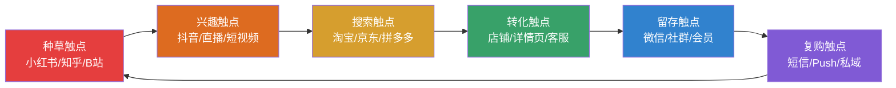
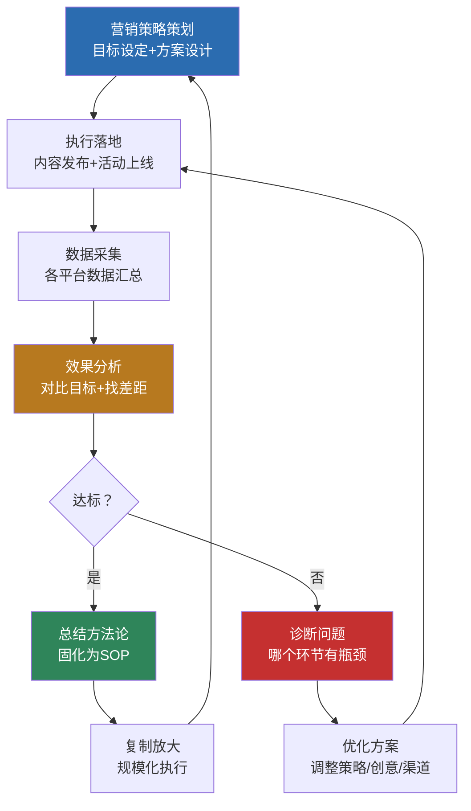

## 八、电商营销的高级策略

运营解决的是"如何把店管好"，营销解决的是"如何让更多人来买"。如果说运营是内功，营销就是外功——它决定了你的流量天花板有多高、品牌护城河有多深。初级营销靠打折促销，中级营销靠广告投放，高级营销靠体系化策略构建可预测、可复制、可持续的增长引擎。

本节将从数据驱动的用户分层出发，覆盖内容营销、社交裂变、全域营销、品牌营销、私域运营五大高级策略模块，每个模块都包含底层原理、完整方法论、实操步骤和真实案例，帮助你从"投广告买流量"的初级阶段，进化到"用户主动找上门"的高级阶段。

### 1. 数据驱动的用户分层与精准营销

#### 1.1 为什么用户分层是高级营销的起点

大多数电商卖家把所有用户当"一类人"对待——同一个促销、同一条消息、同一个价格。但现实是，一个新访客和一个购买过5次的老客户，他们需要的信息完全不同。对新访客推"老客专享价"，他看不懂；对老客户推"新人优惠券"，他觉得被轻视。

用户分层的本质是**用数据理解人，用差异化的策略服务不同的人**。这是所有高级营销策略的基础，没有分层，后面的策略都是"大水漫灌"。

#### 1.2 RFM模型：最经典的电商用户分层工具

RFM模型通过三个维度评估用户价值：

```text
R（Recency）—— 最近一次购买时间
  距离现在越近，用户越活跃，越容易再次购买

F（Frequency）—— 购买频率
  购买次数越多，忠诚度越高，生命周期价值越大

M（Monetary）—— 消费金额
  累计消费越高，用户价值越大，值得投入更多资源维护
```

**RFM分层实操步骤：**

| 步骤 | 操作 | 工具/方法 |
|------|------|-----------|
| 1. 导出数据 | 导出近12个月的订单数据（用户ID、订单金额、下单时间） | 平台后台/ERP系统 |
| 2. 计算RFM值 | R=今天-最后购买日，F=购买次数，M=累计金额 | Excel/Python |
| 3. 打分 | 每个维度按中位数分为高低两档（或5档） | 排序后二分/五分 |
| 4. 分群 | 根据三个维度的高低组合，划分8类用户 | 交叉分组 |
| 5. 制定策略 | 为每类用户制定差异化的营销方案 | 见下表 |

**八类用户及对应营销策略：**

| 用户类型 | R | F | M | 用户画像 | 营销策略 |
|----------|---|---|---|----------|----------|
| 重要价值客户 | 高 | 高 | 高 | 最近买过、经常买、花得多 | VIP专属权益、新品优先体验、生日礼、1对1客服 |
| 重要发展客户 | 高 | 低 | 高 | 最近买过、买得少但花得多 | 提频策略：交叉推荐、复购券、品类渗透 |
| 重要保持客户 | 低 | 高 | 高 | 曾经活跃但最近没买 | 唤醒策略：专属折扣、"好久不见"关怀消息 |
| 重要挽留客户 | 低 | 低 | 高 | 只买过一次花了大钱但没回来 | 深度关怀：电话回访、大额优惠券、VIP邀请 |
| 一般价值客户 | 高 | 高 | 低 | 最近买过、经常买但客单价低 | 提升客单价：满减、组合推荐、升级款引导 |
| 一般发展客户 | 高 | 低 | 低 | 最近买过一次、花钱不多 | 引导复购：新人福利、首购体验优化 |
| 一般保持客户 | 低 | 高 | 低 | 曾经经常买小件但最近没来 | 低成本唤醒：短信/Push推送，小额券 |
| 一般挽留客户 | 低 | 低 | 低 | 买过一次便宜货就再也没来 | 低优先级，自动化营销即可 |

**实操案例：** 某母婴店铺通过RFM分析发现，"重要保持客户"占比12%但贡献了28%的历史销售额。这批用户3个月前活跃但近期流失。分析原因：竞品在做大力度促销导致用户流失。应对策略：向这批用户推送"老客专属5折回归礼"+满199减50券，7天内召回率18%，挽回销售额约4.2万元。

#### 1.3 用户行为标签体系

RFM是基于交易数据的分层，但高级营销还需要基于**行为数据**的标签体系来补充：

```text
行为标签体系架构：

├── 基础属性标签（相对稳定）
│   ├── 性别、年龄段、地域、职业
│   ├── 注册渠道（搜索/社交/广告/推荐）
│   └── 设备类型（iOS/Android/PC）
│
├── 消费偏好标签（动态更新）
│   ├── 价格偏好（高/中/低价位敏感）
│   ├── 品类偏好（护肤/彩妆/个护）
│   ├── 品牌偏好（品牌忠诚/价格导向/尝鲜型）
│   └── 促销偏好（折扣敏感/赠品驱动/积分导向）
│
├── 行为特征标签（实时采集）
│   ├── 浏览行为（高频浏览未购买=犹豫型）
│   ├── 搜索行为（搜索关键词=明确需求）
│   ├── 加购行为（加购未下单=价格敏感或犹豫）
│   ├── 收藏行为（收藏=潜在需求，可长期培育）
│   └── 分享行为（分享=社交传播潜力）
│
└── 生命周期标签（阶段判断）
    ├── 新客（首单30天内）
    ├── 活跃客（近30天有购买）
    ├── 沉睡客（30-90天未购买）
    └── 流失客（90天+未购买）
```

**标签应用实例：**

一位用户的行为标签为：女性、25-30岁、一线城市、价格中等偏好、护肤品类偏好、频繁浏览抗衰产品、加购后未下单。营销系统可以自动触发：推送抗衰产品对比评测内容 → 弹出限时优惠券 → 展示"和你肤质类似的用户也在用"的社会证明。

### 2. 内容营销：从"卖货"到"种草"

#### 2.1 为什么内容营销是电商的高级策略

传统电商营销是"货架模式"——用户搜索商品，你展示商品，用户下单。但随着流量成本持续上涨（2025年国内电商平均获客成本已超200元/人），纯粹的货架模式越来越难以为继。

内容营销的本质是**先创造价值（内容），再转化商业（销售）**。用户不是被广告"打断"注意力，而是被内容"吸引"注意力。信任感在消费内容的过程中自然建立，转化率也因此更高。

**内容营销 vs 传统营销的核心差异：**

| 维度 | 传统营销（广告模式） | 内容营销（种草模式） |
|------|---------------------|---------------------|
| 用户心态 | 被动接收，有防备心理 | 主动获取，接受度高 |
| 信任建立 | 需要大量社会证明 | 内容本身即信任载体 |
| 获客成本 | 持续投入，停投即停 | 内容有长尾效应，持续引流 |
| 生命周期 | 广告到期即失效 | 优质内容持续12-24个月引流 |
| 用户质量 | 精准度取决于投放能力 | 自然吸引目标用户，精准度高 |
| 适用阶段 | 需要快速起量的阶段 | 品牌建设和长期增长 |

#### 2.2 电商内容营销的四大内容类型

**类型一：产品种草内容**

种草内容的目标是让用户产生"我也需要"的感觉，核心结构是"痛点共鸣→解决方案→产品展示→效果证明"。

```text
种草内容的四种创作框架：

框架一：Before-After对比
  结构：使用前的状态（痛点）→ 使用后的状态（效果）→ 产品介绍
  示例：护肤领域——"烂脸3年，用了这瓶精华30天的变化"
  关键：真实对比图、具体时间线、可量化的效果

框架二：测评/横评
  结构：选取3-5款同类产品 → 从多个维度对比 → 给出推荐结论
  示例："5款百元面霜实测，油皮亲测哪款不闷痘"
  关键：测试维度要全面、结论要明确、数据要真实

框架三：场景化推荐
  结构：描绘使用场景 → 引出产品解决方案 → 展示使用过程
  示例："出差一周的护肤包里有什么"
  关键：场景要真实、产品组合要有逻辑

框架四：知识科普+产品植入
  结构：科普专业知识 → 自然引出产品 → 强调专业性
  示例："敏感肌到底该怎么选洗面奶？（附产品推荐）"
  关键：知识本身要有价值，产品植入要自然
```

**类型二：品牌故事内容**

品牌故事不是"编故事"，而是**把品牌的价值观、创始初心、产品研发过程真实地展现给用户**。它的作用是建立情感连接，让用户从"买你的产品"变成"认同你的品牌"。

```text
品牌故事的五个切入角度：

1. 创始人故事
   为什么做这个品牌？解决了什么问题？经历了什么困难？
   示例：某护肤品牌创始人因自己是敏感肌，苦研配方3年
   效果：创始人IP化，用户产生共鸣和信任

2. 产品研发故事
   产品是怎么研发的？测试了多少个版本？解决了什么技术难题？
   示例："这款保温杯的内胆配方，我们调整了47次"
   效果：体现专业性和用心程度

3. 用户故事
   真实用户如何使用产品？生活发生了什么改变？
   示例："这位宝妈用我们的辅食工具，宝宝从挑食变成爱吃饭"
   效果：真实案例比广告更有说服力

4. 幕后故事
   生产车间、质检流程、打包发货的真实场景
   示例：展示无菌生产线、每道质检工序
   效果：透明化运营，增强信任

5. 社会责任故事
   环保理念、公益行动、可持续发展
   示例：每卖一件捐1元给山区学校
   效果：提升品牌好感度和认同感
```

**类型三：教育型内容**

教育型内容通过提供专业知识吸引目标用户，建立"行业权威"形象，从而在用户做购买决策时优先选择你。

| 内容形式 | 平台 | 适用品类 | 示例 |
|----------|------|----------|------|
| 选购指南 | 小红书/知乎 | 3C、家电、护肤 | "2025年无线耳机选购终极指南" |
| 使用教程 | 抖音/B站 | 工具、厨房用品 | "空气炸锅从入门到精通的20个技巧" |
| 行业科普 | 知乎/公众号 | 食品、健康 | "你喝的酸奶里到底加了多少糖？" |
| 穿搭/搭配 | 小红书 | 服装、饰品 | "小个子女生显高10cm的穿搭公式" |
| 问题解决 | 各平台 | 家居、清洁 | "卫生间发霉怎么办？亲测有效的5个方法" |

**教育型内容的核心原则：** 先解决用户的问题，再自然带出产品。如果通篇都在讲产品多好，用户会觉得是广告直接划走。比例建议：70%干货 + 30%产品植入。

**类型四：用户生成内容（UGC）**

UGC是最高效的内容形式——用户替你生产内容，而且其他用户对UGC的信任度是品牌自产内容的2.4倍（尼尔森数据）。

```text
UGC激励体系：

┌── 评价晒单激励
│   ├── 基础激励：好评晒图返现2-5元
│   ├── 优质激励：精选评价额外奖励10-20元
│   └── 月度评选：最佳买家秀赠送店铺大礼包
│
├── 话题活动激励
│   ├── 发起品牌话题：#XX品牌使用日记#
│   ├── 参与门槛低：带话题发布即可参与抽奖
│   └── 奖品有吸引力：新品试用、限量礼盒
│
├── KOC（关键意见消费者）培育
│   ├── 从活跃用户中筛选有内容创作能力的人
│   ├── 提供免费产品试用
│   ├── 给予专属优惠码（带分销佣金）
│   └── 建立KOC社群，定期组织活动
│
└── 内容复用机制
    ├── 用户授权后，将优质UGC用于详情页
    ├── 将买家秀整理为社交媒体内容
    └── 将用户反馈转化为产品研发方向
```

#### 2.3 内容营销的分发矩阵

内容做出来只是第一步，分发到正确的平台才能触达目标用户。不同平台有不同的内容偏好和用户画像：

| 平台 | 内容形式 | 用户特征 | 适合品类 | 内容调性 |
|------|----------|----------|----------|----------|
| 小红书 | 图文笔记/短视频 | 一二线女性，20-35岁 | 美妆、穿搭、家居、母婴 | 精致、真实、有用 |
| 抖音 | 短视频/直播 | 全年龄段，覆盖面最广 | 全品类 | 有趣、有冲击力、节奏快 |
| 知乎 | 长文/问答 | 一二线男性偏多，高学历 | 3C、家电、教育、健康 | 专业、深度、有理有据 |
| B站 | 中长视频 | Z世代，18-30岁 | 二次元、3C、学习、生活方式 | 深度、有趣、年轻化 |
| 微信公众号 | 长图文 | 全年龄段，社交关系链 | 品牌故事、深度内容 | 有温度、有深度 |
| 微博 | 图文/短视频 | 热点驱动，传播性强 | 快消、娱乐、时尚 | 话题性、互动性 |

**跨平台内容复用策略：**

```text
一次深度内容 → 多平台适配分发

原始内容：一篇3000字的产品深度评测（知乎首发）

↓ 拆解为：
├── 小红书版本：精简为800字+10张产品实拍图的种草笔记
├── 抖音版本：提取5个核心卖点，拍摄60秒短视频
├── B站版本：拍摄5-8分钟的深度评测视频
├── 微信版本：加入品牌故事，发布为公众号长图文
└── 微博版本：提取最有争议的结论，发起投票讨论

投入产出比：1份原始内容 → 5个平台曝光 → 触达量扩大5-10倍
```

#### 2.4 内容营销的数据评估体系

内容营销不能"做了就完"，必须用数据评估效果：

| 指标 | 计算方式 | 健康值 | 说明 |
|------|----------|--------|------|
| 内容曝光量 | 内容被展示的总次数 | 因平台而异 | 衡量分发效果 |
| 互动率 | （点赞+评论+收藏+分享）/曝光量 | 小红书>5%，抖音>3% | 衡量内容质量 |
| 种草转化率 | 看过内容后购买的人数/内容曝光量 | 0.5-2% | 衡量种草效果 |
| 内容ROI | 内容带来的销售额/内容制作成本 | >3 | 衡量投入产出 |
| 内容生命周期 | 从发布到停止获得曝光的天数 | >30天为佳 | 衡量长尾效应 |
| 搜索带动量 | 品牌关键词搜索量变化 | 增长>10% | 衡量品牌认知提升 |

### 3. 社交裂变与增长黑客

#### 3.1 社交裂变的底层原理

社交裂变的本质是**利用用户的社交关系链实现低成本用户增长**。核心公式：

```text
裂变效果 = 种子用户数 × 分享率 × 转化率 × 裂变层级

例如：
种子用户：500人
分享率：20%（100人愿意分享）
每个分享带来：3个新用户
转化率：30%

第一轮：500 × 20% × 3 × 30% = 90个新付费用户
第二轮：90 × 20% × 3 × 30% = 16个新付费用户
总计：500 + 90 + 16 = 606个付费用户

获客成本对比：
广告投放获客：200元/人 → 606人需121,200元
裂变获客成本：激励成本约20元/人 → 节省80-90%
```

**裂变成功的三个前提条件：**

| 前提 | 说明 | 反面案例 |
|------|------|----------|
| 产品本身有真实价值 | 用户愿意分享的前提是产品真的好用 | 质量差的产品裂变只会加速口碑崩塌 |
| 分享动机足够强 | 要么利益驱动（红包/折扣），要么社交驱动（面子/利他） | "帮我砍一刀"已被过度使用，用户反感 |
| 分享路径足够短 | 从看到分享到完成操作不超过3步 | 需要下载APP→注册→填写信息→才能领奖励 |

#### 3.2 六种经典社交裂变模型

**模型一：拼团裂变**

```text
拼团裂变机制：
发起人开团 → 分享给好友 → 好友参团 → 满员成团 → 享受团购价

关键参数设计：
├── 成团人数：2-3人为最佳（人数越多成团率越低）
├── 团长优惠：团长额外减免5-10元（激励开团动力）
├── 限时机制：24小时内未成团自动退款（制造紧迫感）
└── 一键分享：直接生成分享海报/小程序卡片

适用场景：高频复购品（零食、日用品）、低客单价商品（<100元）
数据参考：拼多多靠拼团模式3年做到3亿用户，拼团转化率比普通购买高30-50%
```

**模型二：邀请有礼（Referral Program）**

```text
邀请有礼机制：
老用户A邀请新用户B → B完成首单 → A和B各获得奖励

奖励设计原则：
├── 双方都要有奖励（只奖一方效果减半）
├── 奖励要有吸引力（<10元无感，>30元有动力）
├── 奖励即时到账（延迟发放会降低参与意愿）
└── 阶梯奖励（邀请1人奖10元，5人奖60元，10人奖150元）

示例设计：
邀请1位好友注册并首购：奖励20元无门槛券
邀请5位：额外奖励价值59元的热销单品
邀请10位：升级为VIP会员（全年95折+优先发货）

数据参考：Dropbox的邀请机制让注册量增长60%，Airbnb的邀请系统带来30%的新用户
```

**模型三：分销裂变（社交分销）**

```text
分销裂变机制：
用户申请成为分销员 → 生成专属推广链接 → 通过链接成交 → 获得分销佣金

分销体系设计：
├── 一级分销：直接推广成交，佣金10-20%
├── 二级分销：下线推广成交，上级获5-10%（注意法律合规）
├── 分销员等级：根据累计业绩升级，等级越高佣金比例越高
└── 提现规则：满50元可提现，T+7到账

适用场景：高毛利品类（美妆、教育、保健）、社交属性强的商品
法律红线：中国法律规定，分销层级不得超过3级（含3级），超过即为传销
```

**模型四：内容裂变**

```text
内容裂变机制：
品牌产出优质内容 → 用户自发分享 → 内容带来新用户 → 新用户继续分享

内容裂变的触发点：
├── 实用性：用户觉得"这个有用，发给朋友看看"
│   示例：选购指南、避坑清单、对比评测
├── 身份感：内容能帮助用户表达自我
│   示例："我是XX类型的人"测试、年度消费报告
├── 社交货币：分享内容能获得社交认同
│   示例：有趣的互动内容、有品味的产品推荐
└── 情感共鸣：内容触达用户情感
    示例：品牌故事、用户真实故事

案例：完美日记早期在小红书的内容营销，通过KOC矩阵（150+KOC同时发布种草笔记）制造"刷屏"效果，单月品牌搜索量增长300%
```

**模型五：社群裂变**

```text
社群裂变机制：
种子用户群 → 群内发起活动 → 老成员邀请新成员进群 → 新成员参与活动 → 扩大社群规模

社群裂变活动设计：
├── 限时抢购群
│   ├── 每天定时在群内发放限量秒杀
│   ├── 老群员邀请3人进群可解锁专属优惠
│   └── 适合：日用消费品、快消品
│
├── 新品内测群
│   ├── 新品优先体验资格（仅群成员）
│   ├── 内测用户反馈影响产品迭代
│   └── 适合：3C数码、创意产品
│
└── 兴趣社群
    ├── 围绕产品使用场景建立兴趣社群
    ├── 群内定期分享干货内容、使用技巧
    └── 适合：健身器材、烘焙工具、摄影器材
```

**模型六：互动游戏裂变**

```text
互动游戏裂变机制：
用户参与游戏 → 获得奖励/优惠 → 分享可获额外奖励 → 新用户参与

常见游戏形式：
├── 抽奖转盘：分享后获得额外抽奖次数
├── 集卡活动：集齐一套卡片兑换大奖（需好友赠卡）
├── 签到打卡：连续签到奖励递增，断签可通过邀请好友补签
└── 小游戏：品牌定制小游戏，排行榜前列获得奖励

关键设计原则：
├── 游戏规则3秒能理解
├── 前3次参与体验要好（降低流失）
├── 奖励要在"可获得"和"有挑战"之间平衡
└── 社交分享入口要在获得奖励的高光时刻出现

案例：瑞幸咖啡的"邀请好友各得一杯"活动，配合其APP内的小游戏互动，3个月新增用户600万
```

#### 3.3 裂变活动的数据监控

```text
裂变活动核心监控指标：

┌── 参与率 = 参与活动人数 / 触达人数
│   基准值：>15%（<5%说明活动吸引力不足或触达人群不精准）
│
├── 分享率 = 分享人数 / 参与人数
│   基准值：>25%（<10%说明分享动机不够强）
│
├── 裂变系数（K值）= 每个用户平均带来的新用户数
│   K>1：活动自增长（指数级扩散）
│   K<1：需要持续投入种子用户
│   K的计算：K = 分享率 × 每次分享触达人数 × 新用户转化率
│
├── 新增用户转化率 = 完成目标行为的新增用户 / 总新增用户
│   目标行为可以是：注册、首购、加购等
│   基准值：>20%
│
└── 裂变获客成本 = 活动总成本 / 有效新增用户数
    对比广告投放获客成本，通常裂变成本低60-80%
```

### 4. 全域营销与跨平台策略

#### 4.1 什么是全域营销

全域营销（Omni-channel Marketing）是指**打通线上所有触点，为用户提供一致的、连贯的购物体验**。用户可能在小红书种草→抖音看直播→淘宝搜索→微信下单，每个触点都应该是同一个品牌、同一套信息、同一个价格。



#### 4.2 全域营销的关键策略

**策略一：统一品牌认知**

在所有平台上保持一致的品牌视觉（Logo、配色、字体）和品牌信息（核心卖点、价格体系、促销活动）。用户在任何平台看到你，都应该能立刻认出是同一个品牌。

**策略二：流量承接闭环**

```text
流量承接闭环设计：

小红书种草笔记
    └── 笔记评论区引导"淘宝搜XX品牌"
        └── 淘宝搜索进店
            └── 关注店铺+领取优惠券
                └── 加购未下单的用户 → 旺旺消息推送专属优惠
                    └── 下单后 → 包裹卡片引导加微信
                        └── 微信社群 → 持续运营+复购引导

每个环节的承接率目标：
├── 种草→搜索：15-25%（关键词搜索量提升可观测）
├── 搜索→进店：30-50%（取决于搜索排名和主图）
├── 进店→加购：15-25%（取决于详情页和价格）
├── 加购→下单：30-50%（取决于促销和客服）
└── 下单→加微信：20-40%（取决于包裹卡片设计和利益点）
```

**策略三：数据打通**

在各平台收集的用户行为数据需要整合分析，形成完整的用户画像。实际操作中，可以通过以下方式实现：

| 打通方式 | 实现方法 | 适用场景 |
|----------|----------|----------|
| 统一会员ID | 手机号作为统一标识 | 同一用户在不同平台的数据关联 |
| CDP系统 | 部署客户数据平台 | 中大型卖家，多渠道数据整合 |
| Excel/表格 | 定期导出各平台数据手动汇总 | 小卖家，数据量不大时 |
| ERP系统 | 使用支持多平台的ERP | 有ERP的卖家 |

#### 4.3 站外引流到电商平台的实操方法

| 引流渠道 | 具体方法 | 转化路径 | 效果预估 |
|----------|----------|----------|----------|
| 小红书种草 | KOC发布种草笔记，评论区引导搜索 | 笔记→搜索→进店 | 单篇笔记带来50-200次搜索 |
| 抖音短视频 | 短视频挂商品链接或引导搜索 | 视频→商品页/搜索 | 单条视频带来100-1000次访问 |
| 知乎回答 | 在相关问题下回答并自然植入 | 回答→链接→进店 | 长尾效果，持续3-6个月引流 |
| 微信公众号 | 发布产品相关内容，内嵌小程序 | 文章→小程序→购买 | 依赖粉丝基数，转化率5-15% |
| 社群推广 | 在兴趣社群分享使用体验 | 社群→链接→购买 | 精准度高，转化率10-25% |
| KOL合作 | 付费让KOL推荐产品 | KOL内容→搜索/链接 | 取决于KOL影响力和匹配度 |

### 5. 品牌营销与长期主义

#### 5.1 为什么电商需要品牌

大多数中小卖家认为"品牌是大公司的事"，这是一个严重的认知误区。品牌不是"砸钱打广告"，而是**在用户心中建立一个独特的认知位置**。

```text
品牌带来的核心价值：

1. 溢价能力
   无品牌：同样材质的T恤只能卖49元，和无数竞品打价格战
   有品牌：同样材质的T恤可以卖129元，用户为品牌故事和信任感买单
   → 品牌溢价 = 利润空间的护城河

2. 流量成本降低
   无品牌：每次获取新客都要投广告，获客成本持续上升
   有品牌：用户主动搜索品牌名进店，搜索流量占比高、获客成本低
   → 品牌搜索量 = 免费流量池

3. 复购率提升
   无品牌：用户比价后选择更便宜的替代品
   有品牌：用户认准品牌重复购买，复购率40-60%
   → 品牌忠诚度 = 稳定的收入基础

4. 抗风险能力
   无品牌：平台政策变化、流量红利消失就可能垮掉
   有品牌：用户跟随品牌而非平台，抗风险能力强
   → 品牌资产 = 不依赖单一平台的生存能力
```

#### 5.2 电商品牌建设的五步路径

**第一步：品牌定位**

品牌定位要回答一个核心问题——**"用户为什么选你而不是别人？"**

```text
品牌定位画布：

┌── 目标用户：谁是你的核心用户？
│   示例：25-35岁、一二线城市、注重品质但追求性价比的新中产女性
│
├── 核心品类：你在什么品类里竞争？
│   示例：天然成分护肤
│
├── 差异化价值：你和竞品的核心区别是什么？
│   示例：全成分公开透明，无香精无酒精无防腐剂
│
├── 品牌承诺：你给用户的核心承诺是什么？
│   示例："成分看得见，安全看得见"
│
└── 品牌个性：如果品牌是一个人，TA是什么性格？
    示例：专业、温暖、不浮夸的"皮肤科朋友"
```

**第二步：视觉识别系统（VI）**

| 元素 | 要求 | 示例说明 |
|------|------|----------|
| Logo | 简洁、易识别、缩放不失真 | 线上使用需在50px大小下仍可辨认 |
| 品牌色 | 1个主色+1-2个辅色 | 所有平台保持一致，形成视觉记忆 |
| 字体 | 选择1-2种字体 | 中文推荐思源黑体/阿里巴巴普惠体 |
| 拍摄风格 | 统一的产品拍摄调性 | 光线、背景、构图保持一致 |
| 包装设计 | 与品牌调性一致的包装 | 包裹是用户接触品牌的第一个实物触点 |

**第三步：内容输出体系**

品牌内容不是想到什么发什么，需要一个持续、系统的输出计划：

```text
内容日历框架（月度）：

第1周：产品力展示
├── 周一：产品使用教程/技巧
├── 周三：产品细节/工艺展示
└── 周五：用户评价/买家秀合集

第2周：专业知识输出
├── 周一：行业知识科普
├── 周三：选购指南/避坑清单
└── 周五：热点话题结合品牌观点

第3周：品牌故事
├── 周一：品牌/创始人故事
├── 周三：产品研发幕后
└── 周五：用户故事/案例

第4周：互动与社群
├── 周一：话题讨论/投票
├── 周三：抽奖/互动活动
└── 周五：月度总结/下月预告
```

**第四步：品牌口碑管理**

品牌口碑是长期积累的结果，但可以主动管理：

```text
口碑管理的三个维度：

1. 主动收集正面口碑
   ├── 引导满意的客户在多个平台留下评价
   ├── 整理用户好评截图，用于各渠道展示
   └── 邀请忠实用户参与品牌共创（命名、包装设计投票等）

2. 及时处理负面口碑
   ├── 24小时内响应所有负面反馈
   ├── 公开回复展示解决问题的态度
   ├── 私下沟通解决具体问题
   └── 记录负面原因，从根源改进

3. 舆情监测
   ├── 定期搜索品牌关键词，了解用户讨论
   ├── 关注竞品的舆情动态
   └── 使用舆情监测工具（如新榜、飞瓜数据）
```

**第五步：品牌资产积累与保护**

| 品牌资产 | 积累方式 | 保护措施 |
|----------|----------|----------|
| 品牌商标 | 尽早注册商标（文字+图形） | 注册防御商标，覆盖关联品类 |
| 品牌域名 | 注册品牌相关域名 | .com/.cn/.com.cn至少各一个 |
| 社交媒体账号 | 各平台注册官方账号 | 即使暂不运营，先占坑防止被抢注 |
| 品牌搜索量 | 通过内容营销提升品牌认知 | SEO优化品牌关键词 |
| 用户数据 | 积累用户画像和行为数据 | 数据安全合规存储 |

### 6. 私域运营：构建品牌自有流量池

#### 6.1 私域流量的战略价值

私域流量是指**品牌可以自主触达、反复使用、无需额外付费的用户资产**。与之对应的公域流量（平台搜索、广告推荐）每次触达都需要付费，而且用户属于平台而非你。

```text
公域 vs 私域流量对比：

公域流量（平台给你流量）
├── 优势：起步快、有平台背书
├── 劣势：成本持续上升、规则平台定、用户属于平台
├── 典型场景：淘宝搜索、抖音推荐、拼多多首页
└── 成本趋势：平均每年上涨20-30%

私域流量（你自己的流量池）
├── 优势：免费触达、规则自己定、用户资产属于你
├── 劣势：需要时间积累、需要持续运营
├── 典型场景：微信社群、企业微信、公众号、APP
└── 成本趋势：初期建设成本，后续边际成本趋近于零

结论：公域获客，私域养客。最健康的电商模式是70%收入来自复购（私域），30%来自新客（公域）。
```

#### 6.2 私域流量池的搭建实操

**第一步：选择私域载体**

| 载体 | 用户容量 | 触达效率 | 运营成本 | 适合规模 |
|------|----------|----------|----------|----------|
| 个人微信号 | 5000好友 | 高（朋友圈+私聊） | 低 | 小卖家（<1万用户） |
| 企业微信 | 无上限 | 高（朋友圈+群发+社群） | 中 | 中小卖家首选 |
| 微信社群 | 500人/群 | 高（群消息触达率60%+） | 中 | 配合企业微信使用 |
| 公众号 | 无上限 | 中（推送打开率2-5%） | 低 | 内容输出为主 |
| 小程序 | 无上限 | 中（需用户主动打开） | 高（开发成本） | 有技术团队的卖家 |
| APP | 无上限 | 高（Push推送） | 极高 | 大型品牌 |

**企业微信私域搭建SOP：**

```text
企业微信私域搭建标准流程：

1. 基础设置（第1天）
   ├── 注册企业微信，完成企业认证
   ├── 设置品牌头像、欢迎语、自动回复
   ├── 创建客户标签体系（参考1.3节）
   └── 配置客户朋友圈（每周可发4条）

2. 引流入口设计（第1-3天）
   ├── 包裹卡片：扫码加微信领XX元优惠券
   ├── 店铺首页：客服自动引导加微信
   ├── 短信触达：已购用户发送引导短信
   └── 公众号菜单：设置加微信入口

3. 新用户承接流程（自动化）
   ├── 用户添加后：自动发送欢迎语+新人福利
   ├── 第1天：发送品牌介绍+核心产品推荐
   ├── 第3天：发送使用指南/搭配建议
   ├── 第7天：发送专属优惠券（限时3天有效）
   └── 第14天：询问使用体验+推荐关联产品

4. 社群运营节奏（日常）
   ├── 早上9:00：早安问候+今日秒杀预告
   ├── 中午12:00：干货内容/使用技巧分享
   ├── 下午15:00：限时秒杀/拼团活动
   ├── 晚上20:00：互动话题/有奖问答
   └── 周末：社群专属福利日
```

#### 6.3 私域变现模型

```text
私域变现的四种模式：

模式一：直接销售
  方法：社群推送商品+限时优惠
  频率：每周2-3次，避免过度营销
  转化率：私域社群直接转化率通常在5-15%
  适合：高频复购品类（食品、日用品、美妆）

模式二：活动促销
  方法：私域专属活动（社群秒杀、老客专场）
  频率：每月1-2次大活动，配合节日/上新
  效果：活动期间社群GMV通常是日常的3-5倍
  适合：所有品类

模式三：分销裂变
  方法：私域用户成为分销员，推荐购买获佣金
  频率：持续运行
  效果：头部分销员月贡献GMV可达数万元
  适合：高毛利品类

模式四：品牌活动
  方法：新品首发、品牌周年庆、用户共创
  频率：每季度1次
  效果：提升品牌忠诚度和用户参与感
  适合：有一定品牌基础的卖家
```

#### 6.4 私域运营的关键指标

| 指标 | 计算方式 | 健康值 | 优化方向 |
|------|----------|--------|----------|
| 加粉率 | 加微信用户数/订单数 | >30% | 优化包裹卡片设计和加粉话术 |
| 好友留存率 | 30天后仍为好友的比例 | >85% | 减少营销骚扰，增加价值内容 |
| 社群活跃率 | 每日发言人数/群总人数 | >15% | 增加互动内容和福利 |
| 私域复购率 | 私域用户中再次购买的比例 | >40% | 精细化运营和个性化推荐 |
| 私域客单价 | 私域用户平均订单金额 | 比公域高20%+ | 私域专属组合和推荐 |
| 单粉价值 | 年度GMV/私域用户总数 | >100元/人/年 | 提升复购频次和客单价 |

### 7. 高级营销策略的数据闭环

所有高级营销策略必须形成数据闭环——**策划→执行→数据采集→分析→优化→再执行**。



**营销复盘模板（每月执行）：**

```text
月度营销复盘框架：

一、核心数据总览
├── 本月GMV vs 目标GMV：达成率XX%
├── 新客获取数 vs 目标：达成率XX%
├── 复购率变化：XX% → XX%
├── 获客成本变化：XX元 → XX元
└── 私域用户增长：+XX人

二、各渠道效果分析
├── 广告投放：ROI=XX，对比上月变化
├── 内容营销：发布XX篇，总曝光XX，带来转化XX
├── 社交裂变：参与人数XX，新增用户XX，获客成本XX
├── 私域运营：社群GMV=XX，复购率XX%
└── KOL/KOC合作：投入XX，产出XX，ROI=XX

三、本月亮点与问题
├── 亮点：XX渠道/活动效果超预期，原因分析
└── 问题：XX渠道/活动效果不达标，根因分析

四、下月优化计划
├── 继续加强：XX策略效果好，加大投入
├── 调整优化：XX策略需改进，具体方案
├── 停止执行：XX策略ROI过低，暂停
└── 新增尝试：XX新策略/新渠道，测试方案

五、关键行动项
├── 行动1：XX（负责人+截止日期）
├── 行动2：XX（负责人+截止日期）
└── 行动3：XX（负责人+截止日期）
```

### 8. 常见误区与纠正

| 误区 | 纠正 |
|------|------|
| 营销就是打广告、做促销 | 广告和促销只是营销的一小部分，高级营销是体系化的用户获取和品牌建设 |
| 品牌是大公司的事，小卖家不需要 | 从第一天起就应该有品牌意识，品牌=用户对你的认知，你不定义它市场会替你定义 |
| 私域就是把用户拉进微信群 | 私域的核心是"提供持续价值"，而不是"换个地方发广告" |
| 裂变就是让老用户帮忙拉人 | 裂变的前提是产品本身有价值，分享动机要强，路径要短，否则适得其反 |
| 内容营销效果慢，不如投广告 | 内容有长尾效应，一篇好内容可能持续6-12个月引流，长期ROI远超广告 |
| 全域营销就是在所有平台都开个店 | 全域营销的核心是"打通"，不是"铺开"，需要统一的品牌体验和数据闭环 |
| 用户分层太复杂，小卖家用不上 | Excel就能做RFM分析，分层后的差异化营销效果比"一锅端"好3-5倍 |
| 营销活动越多越好 | 过于频繁的促销会降低品牌价值感，用户会等促销才买，日常转化率反而下降 |

### 9. 进阶：营销自动化的实现路径

当私域用户规模超过1000人、月GMV超过10万元时，手动运营将无法满足效率要求，需要逐步引入营销自动化：

```text
营销自动化成熟度模型：

Level 1：手动运营（0-1000用户）
├── 手动发朋友圈、手动群发消息
├── 人工判断用户需求，手动推荐产品
└── 工具：企业微信原生功能

Level 2：半自动化（1000-5000用户）
├── 自动欢迎语、自动标签分组
├── 定时群发、模板消息
├── 简单的用户行为触发（如加购未下单自动推送优惠）
└── 工具：企业微信+第三方SCRM（如微伴、句子互动）

Level 3：自动化（5000-50000用户）
├── 完整的自动化营销流程（从加粉到复购的全链路自动化）
├── 基于用户标签的个性化内容推送
├── A/B测试自动化
├── 营销效果自动归因
└── 工具：专业SCRM系统（如有赞CRM、微盟）

Level 4：智能化（50000+用户）
├── AI驱动的个性化推荐
├── 预测性营销（预测用户流失、预测最佳触达时间）
├── 自动化创意生成
└── 工具：CDP+MA平台+AI能力
```

**营销自动化的ROI计算：**

```text
假设：私域用户10000人，月均GMV 50万

手动运营成本：
├── 运营人员工资：8000元/月 × 2人 = 16000元
├── 效率限制：每天只能精细化运营200-300人
└── 用户触达率：30%（大量用户被遗漏）

引入SCRM后：
├── 系统费用：3000-5000元/月
├── 运营人员：1人（效率提升2-3倍）
├── 用户触达率：85%+
├── 自动化转化率提升：15-30%
└── 月GMV提升：50万 × 20% = 10万

净收益：10万GMV × 利润率 - SCRM费用 - 节省的人工成本
      ≈ 30000 - 4000 - 8000 = 18000元/月净增利润
投资回报期：< 1个月
```

***

本节系统介绍了电商营销的六大高级策略：数据驱动的用户分层、内容营销、社交裂变、全域营销、品牌营销和私域运营。这些策略不是孤立的，而是相互关联、层层递进的有机整体——用户分层是基础，内容营销是引擎，社交裂变是加速器，全域营销是放大器，品牌营销是护城河，私域运营是根据地。

从实操角度，建议按以下优先级逐步推进：先做好用户分层（数据基础）→ 搭建私域流量池（用户资产）→ 启动内容营销（持续获客）→ 设计裂变活动（加速增长）→ 统一全域体验（提升效率）→ 长期品牌建设（构建壁垒）。每一步都需要用数据验证效果，形成"执行→数据→优化"的闭环，才能真正实现可持续的营销增长。
