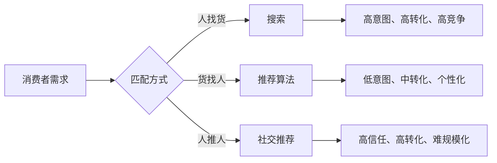
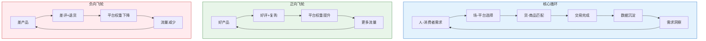
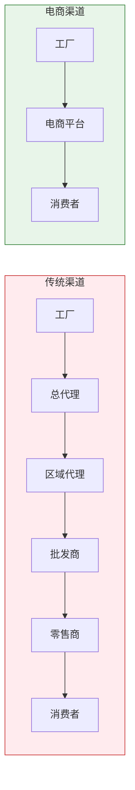

# 一、电商的商业本质

## 1.1 电商到底是什么：从本质理解生意

很多人把电商理解为"在网上卖东西"，这个理解不算错，但远远不够。如果只停留在这个层面，你会把电商当成一个渠道来经营，而不是一整套商业逻辑来思考。

**电商的本质是：通过互联网技术重构"人与商品"之间的连接方式，从而降低交易成本、提高匹配效率、扩大市场边界的商业形态。**

这句话包含三个关键词，每一个都值得拆开来讲：

### 1.1.1 降低交易成本

诺贝尔经济学奖得主罗纳德·科斯（Ronald Coase）在《企业的性质》中提出：市场交易存在成本，包括搜寻成本、谈判成本、监督成本和违约成本。传统商业中，这些成本非常高——你需要租店面、雇销售、发传单、搞关系，才能把商品信息传递给潜在买家。

电商的革命性在于：它系统性地压低了这些成本。

| 交易成本类型 | 传统商业 | 电商模式 | 成本变化 |
|---|---|---|---|
| 搜寻成本（找到对的商品） | 逛街、比价、托人打听 | 搜索、推荐算法、比价工具 | 下降 80%+ |
| 信息成本（了解商品详情） | 看实物、问导购、查杂志 | 详情页、评价、视频、问答 | 下降 70%+ |
| 谈判成本（确定价格） | 讨价还价、不同店铺比较 | 平台定价、优惠券、满减 | 下降 90%+ |
| 监督成本（确保履约） | 熟人推荐、品牌信任 | 平台担保、评价系统、退换货 | 下降 60%+ |
| 物流成本（商品到达） | 自提、局部配送 | 快递网络、仓储前置 | 下降 50%+ |

注意一个关键点：交易成本的下降不是均匀的。信息成本和谈判成本下降最剧烈，而物流成本（特别是实物电商）仍然存在刚性下限。这也解释了为什么信息类产品（课程、软件、数字内容）的电商化程度远高于实物商品。

### 1.1.2 提高匹配效率

传统商业的匹配是"人找货"——消费者去商场、去集市、去批发市场，被动接受有限范围内的选择。电商平台彻底翻转了这个逻辑，实现了"货找人"。

这背后有三层技术支撑：

**第一层：搜索引擎。** 用户主动表达需求（搜索关键词），平台在海量商品中返回最相关的结果。这是最原始也最直接的匹配方式，淘宝早期的增长主要靠这一层。

**第二层：推荐算法。** 用户不需要明确表达需求，平台通过行为数据（浏览、收藏、购买、停留时间）推断用户意图，主动推送可能感兴趣的商品。千人千面就是这一层的典型应用，它大幅提升了长尾商品和新用户的匹配效率。

**第三层：社交推荐。** 不是平台推的，也不是用户主动找的，而是朋友、KOL、社区里的口碑传播。这一层的匹配信任度最高，转化率也最高，但规模最难控制。拼多多的"砍一刀"、小红书的种草笔记，本质上都在利用这一层。



理解这三层匹配方式非常重要，因为它直接决定了你的运营策略。你选哪种匹配方式为主，就决定了你的流量结构、内容策略和团队配置。

### 1.1.3 扩大市场边界

一家线下服装店，辐射范围最多周边 5 公里。一家淘宝店，理论上可以触达全国 10 亿网民。一家亚马逊店铺，可以覆盖全球 20 个国家的消费者。

市场边界的扩大带来了三个深刻影响：

**长尾效应。** 在线下，小众需求无法支撑一个店铺的运营——整个城市可能只有 500 个人想买"左撇子专用剪刀"，开个实体店完全不划算。但在网上，全国 5000 个左撇子的需求集中到一家店，足以养活一个专门的品类。这就是克里斯·安德森（Chris Anderson）在《长尾理论》中描述的场景：互联网让小众需求变得有利可图。

**规模经济。** 固定成本（店铺设计、摄影、客服系统）在更大销量基础上被摊薄，边际成本递减。一个详情页做好了，服务 100 个客户和 10000 个客户的成本几乎相同。

**全球化机会。** 跨境电商让中小企业第一次真正拥有了"卖全球"的能力。一个义乌的小工厂，通过亚马逊可以直连美国消费者，跳过层层中间商，利润率可能从 5% 提升到 30%。

## 1.2 "人、货、场"模型：电商运营的核心框架

理解了电商的宏观本质之后，我们需要一个可操作的分析框架。在电商行业，"人、货、场"模型被广泛使用——它最早由阿里巴巴在 2016 年的"新零售"概念中提出，后来成为整个零售行业的通用分析语言。

### 1.2.1 人（消费者）

"人"不是抽象的概念，而是活生生的、有具体需求和行为模式的消费者。理解"人"需要从四个层面深入：

**需求层面：消费者为什么要买？**

所有消费行为的起点都是需求。需求可以分为三类：

- **刚性需求**：不买不行——手机壳、纸巾、婴儿奶粉。这类需求消费者主动搜索，对价格敏感，品牌忠诚度低。
- **改善型需求**：有了更好的就行——空气炸锅、电动牙刷、按摩仪。这类需求需要"被种草"，消费者需要被说服"为什么需要"，内容营销是关键。
- **冲动型需求**：看到就想买——创意礼品、网红零食、潮流单品。这类需求完全靠场景触发，视觉冲击力和社交氛围是核心驱动力。

三类需求对应完全不同的运营策略。刚性需求拼价格和排名，改善型需求拼内容和信任，冲动型需求拼视觉和氛围。如果你把策略用错了，比如用做刚性需求的方式去卖改善型产品（只拼价格不讲内容），效果一定很差。

**画像层面：消费者是谁？**

用户画像不是"25-35 岁女性"这种粗线条描述，而是一个立体的消费者模型。实用的用户画像至少包含：

| 维度 | 具体字段 | 用途 |
|---|---|---|
| 人口统计 | 年龄、性别、城市级别、收入 | 确定目标市场和定价区间 |
| 行为特征 | 浏览路径、搜索关键词、下单时间、客单价 | 优化投放策略和页面设计 |
| 心理特征 | 价格敏感度、品牌偏好、决策风格 | 制定差异化卖点和沟通话术 |
| 社交特征 | 活跃平台、内容偏好、传播意愿 | 选择营销渠道和裂变策略 |

**决策层面：从需求到下单的路径是什么？**

消费者的购买决策通常经历五个阶段：需求认知 → 信息搜索 → 方案评估 → 购买决策 → 购后行为。每个阶段消费者的行为和心理不同，运营介入点也不同。这一部分内容将在"03-消费者购买决策路径"中详细展开。

**复购层面：什么让消费者回来？**

首次获客成本（CAC）通常是复购成本的 5-10 倍。一个健康的电商业务，复购率至少应达到 30%。驱动复购的核心因素：

- **产品本身的满意度**：这是基础，产品不行什么都白搭
- **会员/积分体系**：制造退出成本，让消费者"舍不得走"
- **定期触达**：短信、微信、App 推送，保持存在感但不过度打扰
- **新品/交叉销售**：给老客户持续提供新价值

### 1.2.2 货（商品）

"货"是电商的基石。不管流量多大、运营多好，产品不行就是不行。

**产品力的本质：解决一个问题，或者创造一种体验。**

产品力可以从四个维度评估：

**功能维度**——这个产品解决了什么具体问题？解决得够不够好？一个保温杯能不能真的保温 12 小时？一个充电宝能不能真的充满 iPhone 三次？功能是产品的底线，功能不达标的产品在电商上活不过三个月。

**品质维度**——同样的功能，品质差异体现在耐用性、安全性、一致性和细节做工上。品质直接影响退货率、差评率和复购率。一个品质不稳定的供应商，即使价格再低，也会在长期运营中拖垮你的店铺评分。

**设计维度**——包括外观设计和用户体验设计。在电商环境中，"好看"就是生产力——主图的点击率、详情页的停留时长、买家秀的传播力，都与设计直接相关。一个包装精美的产品，即使功能和竞品完全相同，也能获得更高的溢价。

**差异化维度**——你的产品和同类竞品的核心区别是什么？差异化可以是功能创新（别人没有的功能）、设计创新（别人没有的外观）、场景创新（别人没覆盖的使用场景），甚至是服务创新（别人没有的售后保障）。没有差异化的产品只能陷入价格战，而价格战没有赢家。

**定价策略：电商定价不是"成本+利润"那么简单。**

电商定价的核心公式：

```text
售价 = 产品成本 + 物流成本 + 平台费用 + 推广费用 + 运营费用 + 利润
```

但实际定价远比这个公式复杂。你需要考虑：

- **竞品定价区间**：同类商品的主流价格带在哪里？你的定价是走性价比路线（低于均价 10-20%）还是品质路线（高于均价 20-50%）？
- **消费者心理锚点**：199 比 200 有本质区别，"原价 599 现价 299" 比直接标 299 更有吸引力
- **平台规则影响**：淘宝的千人千面、拼多多的最低价逻辑、抖音的直播间价格，同样的商品在不同平台可能需要不同的定价策略
- **生命周期定价**：新品期低价冲销量、成长期提价保利润、成熟期稳定收割、衰退期清仓回款

### 1.2.3 场（平台与渠道）

"场"是连接"人"和"货"的交易场景。不同平台的底层逻辑完全不同，不理解这一点就会犯致命错误。

**主流电商平台的底层逻辑对比：**

| 平台 | 流量逻辑 | 核心能力要求 | 适合卖家类型 |
|---|---|---|---|
| 淘宝/天猫 | 搜索 + 推荐 | SEO、视觉、运营 | 有供应链优势的品牌/商家 |
| 拼多多 | 低价 + 社交裂变 | 成本控制、供应链深度 | 工厂、源头供货商 |
| 京东 | 品质 + 物流体验 | 品牌力、仓储能力 | 品牌商、大经销商 |
| 抖音电商 | 内容兴趣 → 激发需求 | 内容创作、直播能力 | 有内容能力的团队 |
| 小红书 | 种草 → 搜索成交 | 内容质量、审美能力 | 设计师品牌、生活方式品牌 |
| 快手 | 老铁经济、信任关系 | 人设经营、社区互动 | 有个人 IP 的创作者 |
| 微信（视频号+小程序）| 私域 + 社交推荐 | 社群运营、用户管理 | 有私域基础的商家 |

选择平台不是"哪个平台流量大就去哪个"，而是"你的产品、能力和资源最匹配哪个平台的逻辑"。一个供应链强但不会做内容的工厂老板，硬去做抖音直播大概率会亏损；而一个有粉丝基础的美妆博主，去拼多多卖低价货也是浪费自己的优势。

**多平台经营的陷阱：** 很多新手犯一个错误——一上来就同时开淘宝、拼多多、抖音、京东四个店铺，以为多一个渠道就多一份收入。实际上，每个平台的运营逻辑完全不同，同时经营四个平台意味着每个都做不深、做不透。正确的策略是先聚焦一个平台做到盈利，再复制到第二个平台。

### 1.2.4 "人、货、场"的动态关系

"人、货、场"不是三个孤立的要素，而是一个相互影响的动态系统。理解这个系统，才能真正掌握电商运营的精髓。



电商运营中存在强烈的马太效应（强者愈强、弱者愈弱）。一旦进入正向飞轮，增长是指数级的；一旦掉入负向飞轮，下滑也是指数级的。这解释了为什么电商行业的头部集中度非常高——不是因为赢家更努力，而是因为飞轮效应让领先优势不断放大。

## 1.3 电商与传统商业的本质区别

很多人简单地认为电商就是"把线下搬到线上"，这个理解导致了大量失败。电商和传统商业的区别不是渠道不同，而是底层商业逻辑完全不同。

### 1.3.1 信息结构的根本改变

传统商业中，信息是稀缺的、不对称的。消费者不知道同一件商品在 10 家店分别卖多少钱，不知道哪个品牌的质量更好，不知道这款产品的真实使用体验。信息不对称是传统商业利润的重要来源——卖方知道的永远比买方多。

电商彻底改变了这一点。价格、评价、销量、成分表、使用视频——几乎所有信息都对消费者透明。这意味着：

- **信息不对称带来的利润空间消失了。** 以前靠"消费者不懂"赚钱的模式在电商上行不通。
- **口碑的权重被极度放大。** 一个差评可能劝退 100 个潜在买家，一个好评可能带来 50 个新客户。
- **透明度成为竞争壁垒。** 主动披露更多信息的品牌（工厂实拍、成分溯源、用户真实反馈），反而比遮遮掩掩的品牌更有竞争力。

### 1.3.2 交易结构的去中间化

传统商品从工厂到消费者手中，通常经过 3-5 个中间环节：总代理→区域代理→批发商→零售商→消费者，每个环节加价 30-100%。一双出厂价 50 元的鞋子，到消费者手中可能卖 300 元。

电商压缩了这个链条。工厂可以通过淘宝/拼多多/1688 直达消费者，中间环节的利润要么让利给消费者（低价），要么留给了卖家（高毛利），要么被平台抽走（平台费用）。



但要注意：去中间化并不意味着中间商全部消失。物流服务商、仓储服务商、MCN 机构、代运营公司——这些是电商生态中新的"中间环节"，只是形式和功能变了。理解这个变化，才能看清电商行业的利润分布。

### 1.3.3 规模效应的本质差异

传统商业的规模扩张是"线性"的——开第二家店需要几乎等量的投入（租金、装修、人员、库存）。电商的规模扩张更接近"复利"——

- **固定成本被无限摊薄。** 一套详情页、一个客服团队、一个仓库，服务 100 单和 10000 单的成本差异远小于传统商业。
- **数据资产可复用。** 淘宝的用户行为数据、广告投放模型、选品经验，可以跨品类、跨时间段持续产生价值。
- **供应链议价能力非线性增长。** 日发 100 单和日发 10000 单的快递成本、采购成本差异可以达到 30-50%。

这意味着电商天然适合"赢者通吃"的竞争格局。品类冠军的利润率可能是第二名的 2-3 倍，因为规模效应带来的成本优势是压倒性的。

### 1.3.4 数据驱动 vs. 经验驱动

传统商业决策主要靠经验和直觉："我觉得这个颜色卖得好"、"这个地段人流量大"。电商运营的每一个决策都可以数据化：

- 选品阶段：关键词搜索量、竞品销量、价格带分布
- 运营阶段：点击率、转化率、客单价、退货率
- 推广阶段：CPM、CPC、ROI、ACOS
- 复盘阶段：利润率、复购率、LTV、CAC

这不是说经验不重要——经验决定了你问出什么问题、如何解读数据。但没有数据支撑的纯经验决策，在电商竞争中越来越不可靠。

## 1.4 电商的商业模式分类

电商不是一种模式，而是一组模式。理解不同模式的经济逻辑，是选择自己创业方向的基础。

### 1.4.1 按交易主体分类

**B2C（Business to Consumer）—— 商家对消费者**

典型代表：天猫旗舰店、京东自营、品牌独立站。

这是最常见的电商模式。品牌商或经销商通过平台或自建网站向消费者销售商品。核心能力是品牌建设和用户运营。利润率通常在 30-60%（毛利率），但推广费用和平台费用会吃掉一部分。

**C2C（Consumer to Consumer）—— 消费者对消费者**

典型代表：闲鱼、转转、淘宝 C 店。

个人之间的交易，核心价值是闲置资源的再利用。平台提供交易撮合和信任保障。对卖家来说门槛最低（闲鱼上卖东西几乎零成本），但天花板也最低（难以规模化）。

**B2B（Business to Business）—— 商家对商家**

典型代表：1688、阿里巴巴国际站、敦煌网。

企业之间的大宗采购和批发交易。单笔金额大、决策链长、复购率高。这不是本书的重点，但理解 B2B 很重要——很多电商卖家的上游就是 B2B 平台。

**DTC（Direct to Consumer）—— 品牌直连消费者**

典型代表：Shein、Anker、完美日记早期。

这是近年来最热门的模式。品牌不通过任何中间商，直接建立与消费者的连接。DTC 品牌通常拥有更强的用户数据、更高的利润率和更强的品牌忠诚度，但需要自己承担所有获客成本。

### 1.4.2 按盈利模式分类

电商平台的盈利模式直接决定了平台对卖家的态度和流量分配逻辑。理解平台怎么赚钱，你才能理解平台为什么给你或不给你流量。

| 盈利模式 | 代表平台 | 平台怎么赚钱 | 对卖家的影响 |
|---|---|---|---|
| 佣金抽成 | 淘宝、亚马逊 | 按成交金额抽 2-15% | 平台希望成交越多越好 |
| 广告收入 | 淘宝直通车、抖音 | 按点击/展示收费 | 自然流量被压缩，付费流量占比升高 |
| 会员费 | Costco、京东 Plus | 消费者付年费享受权益 | 平台需要高质低价商品吸引会员 |
| 交易服务费 | PayPal、支付宝 | 按交易金额收手续费 | 影响支付体验和成本 |
| 数据服务 | 各平台的商家工具 | 卖家付费购买数据和分析工具 | 数据本身成为商品 |

大多数平台采用多种盈利模式的组合。以淘宝为例，它的核心收入来自广告（直通车、万相台、引力魔方），辅以佣金、服务费和数据服务。这意味着淘宝本质上是一家广告公司——它的商业模式决定了它会把流量分配给愿意付更多广告费的卖家，而不是产品最好的卖家。

理解这一点非常重要。它意味着：在电商平台上，产品好只是必要条件，不是充分条件。你还必须理解平台的商业逻辑，学会在规则内高效获取流量。

### 1.4.3 按经营形态分类

**自营模式**：自己采购、自己销售、自己承担库存风险。利润空间大但资金压力大，适合有供应链优势的卖家。

**平台模式**：不碰货，只做交易撮合。平台向卖家收佣金/广告费，向买家提供信任保障。淘宝、拼多多是典型的平台模式。

**代销/分销模式**：不持有库存，消费者下单后由供应商直接发货。典型代表是 1688 一件代发和部分跨境电商的 dropshipping 模式。门槛低但利润率也低。

**自营 + 平台混合模式**：京东是典型——既做自营（京东自营），也做平台（京东 POP 店）。这种模式的优势是既能把控品质又能扩大品类。

## 1.5 电商的价值创造：谁在赚钱，钱从哪来？

理解电商的价值创造链条，才能找到自己的利润空间。

### 1.5.1 对消费者的价值

电商对消费者的价值不是"便宜"那么简单，而是多维度的：

**便利性价值**——7×24 小时购物、送货上门、一键比价。这是电商最基础的价值，也是消费者最初选择电商的原因。

**选择权价值**——消费者面对的选择从"附近 10 家店的 200 个 SKU"变成了"全网的 1000 万个 SKU"。选择权的扩大意味着消费者更有可能找到完美匹配自己需求的商品。

**信息权价值**——用户评价、销量数据、问答互动，让消费者拥有前所未有的信息优势。一个理性消费者在电商平台上的决策质量，通常远高于在实体店中。

**价格价值**——去中间化带来的价格优势。但要注意，这个优势不是绝对的。一些线下渠道（如仓储超市、工厂店）的价格可能比电商还低。电商的价格优势主要体现在对比传统百货/专卖店的场景。

### 1.5.2 对卖家的价值

**低门槛创业**——开一个淘宝 C 店的成本接近零（保证金 1000 元），而开一个线下实体店至少需要 5-10 万的启动资金。低门槛意味着更多人可以参与，也意味着竞争更激烈。

**精准触达**——传统商业中，一个广告牌可能只有 1% 的路人是目标客户。电商广告可以通过人群标签、兴趣标签、行为标签，将广告精准投放给最可能购买的人群，广告效率提升 10-100 倍。

**数据资产**——每笔交易都在积累数据，数据可以反哺选品、定价、营销和供应链优化。这是一个传统商业不具备的正反馈循环。

**经营灵活性**——可以全职、可以兼职；可以做全国市场、也可以聚焦区域；可以小而美、也可以快速扩张。电商给创业者提供了极大的灵活性。

### 1.5.3 对整个商业生态的价值

**制造业升级**——电商倒逼制造业提升效率。消费者对品质、设计、性价比的高要求，通过数据反馈传导到生产端，推动工厂从"生产什么卖什么"转变为"消费者需要什么就生产什么"。

**就业创造**——电商生态创造了大量新型就业：网店运营、直播主播、内容创作者、电商客服、仓储物流、代运营服务……据中国商务部数据，2023 年中国电商直接和间接带动就业超过 6000 万人。

**区域经济平衡**——偏远地区的农产品、手工艺品可以通过电商触达全国消费者，缩小区域经济差距。这是"电商助农"的理论基础。

## 1.6 电商的本质挑战：为什么大多数人赚不到钱？

讲完价值创造，必须讲残酷的现实：**电商创业的失败率超过 90%。** 淘宝上真正盈利的店铺不到 10%，亚马逊上新手卖家第一年的亏损率超过 80%。

为什么？

### 1.6.1 流量成本的持续上涨

电商红利期（2008-2015）已经过去。当时平台流量便宜，竞争不充分，随便上架就能卖。现在，淘宝一个精准关键词的 CPC（每次点击成本）已经从 0.5 元涨到 3-5 元，一个新客户的获客成本（CAC）在很多品类已经超过 100 元。

这意味着：如果你的产品毛利率低于 50%，而且复购率低于 30%，几乎不可能持续盈利。

### 1.6.2 同质化竞争

电商的低门槛是一把双刃剑。你的创业门槛低，别人的也低。一个爆款出来，一周之内就会有 100 个卖家跟卖。没有供应链壁垒、品牌壁垒或技术壁垒的卖家，最终都会被拖入价格战的泥潭。

### 1.6.3 平台规则的不确定性

平台的规则可以一夜之间改变。淘宝调整一次搜索算法，可能导致你的店铺流量腰斩。亚马逊更新一次广告政策，可能让你的推广成本翻倍。在别人的地盘上做生意，你永远处于被动地位。

这也是为什么越来越多的成熟卖家开始做"多平台布局"和"私域运营"——不把鸡蛋放在一个篮子里。

### 1.6.4 供应链的隐性成本

新手卖家往往只看到"出厂价 30 元，卖 99 元，毛利率 70%"，但忽略了隐性成本：

- 退货成本：服装类退货率高达 30-50%，每次退货都意味着物流费+商品损耗
- 库存积压：选品失败导致的滞销库存，可能吃掉前面所有利润
- 客服人力：处理咨询、投诉、售后的人力成本
- 平台费用：佣金、广告费、服务费的综合占比通常在 15-30%
- 资金占用：从采购到回款的账期，可能长达 30-60 天

把这些全算进去，一个看起来"70% 毛利率"的产品，实际净利率可能只有 5-15%。如果销量不够大，可能连养活自己都困难。

## 1.7 电商的底层公式：一切运营决策的出发点

最后，掌握一个电商运营中最核心的公式，所有运营决策最终都要回到这个公式上来：

```text
利润 = 流量 × 转化率 × 客单价 × 毛利率 - 固定成本
```

展开来看：

- **流量**：每天有多少人看到你的商品（曝光 × 点击率 = 流量）
- **转化率**：看到商品的人中有多少人下单（通常 1-5%，优秀可达 10%+）
- **客单价**：每个订单的平均金额（产品定价 + 关联销售）
- **毛利率**：每笔订单中你赚的钱占售价的比例
- **固定成本**：人员工资、仓储租金、设备折旧等不随销量变化的成本

这个公式的力量在于：它告诉你每一个变量的优化都有价值。流量提升 20%、转化率提升 20%、客单价提升 20%，三者叠加的结果不是 60% 的增长，而是 72.8% 的增长（1.2 × 1.2 × 1.2 = 1.728）。

反过来说，任何一个变量崩塌都会导致整体失败。流量再大，转化率为 0 就没有任何意义。转化率再高，流量为 0 也是白搭。客单价再好，毛利率为负就是在亏钱。

**这就是电商的商业本质：在一个由数据驱动的交易场中，持续优化"人、货、场"的匹配效率，让每一分投入都产出最大的回报。**

理解了这个本质，后面的章节——流量分配机制、消费者决策路径、供应链管理、数据分析——都是在讲如何优化这个公式中的每一个变量。

---
