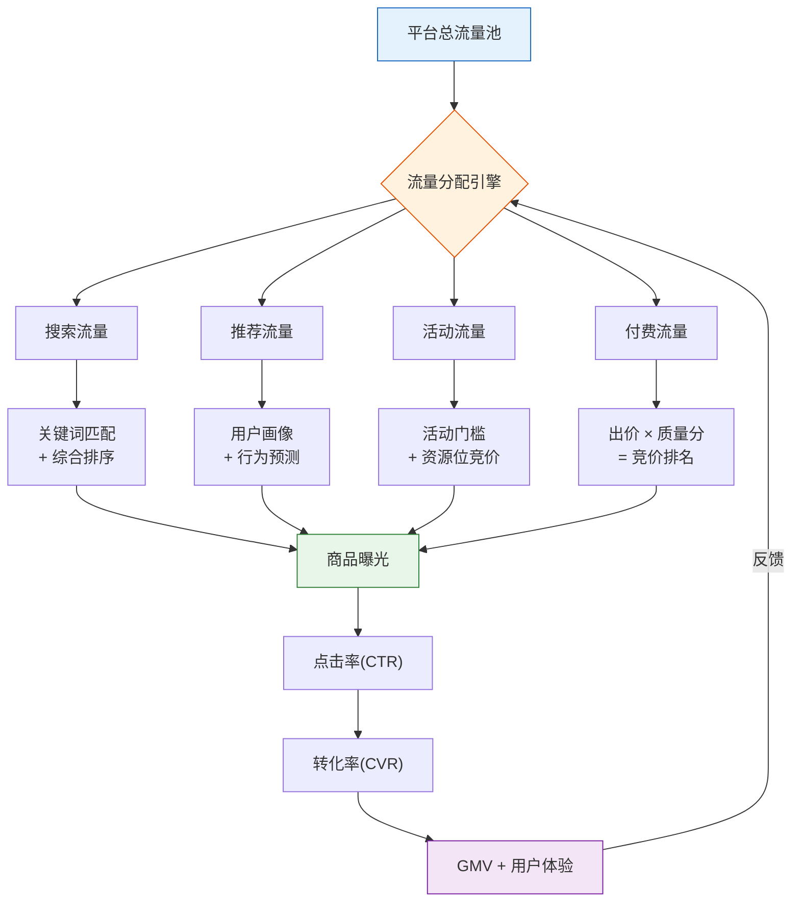
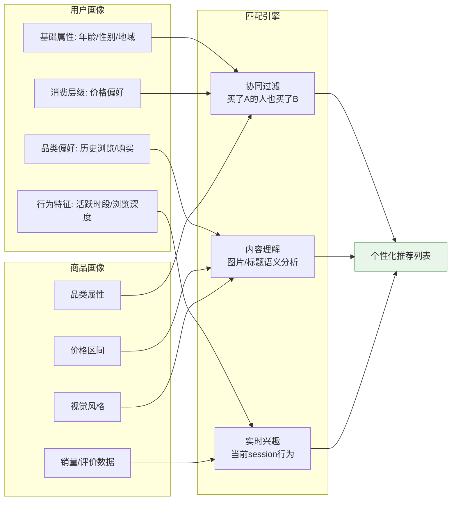
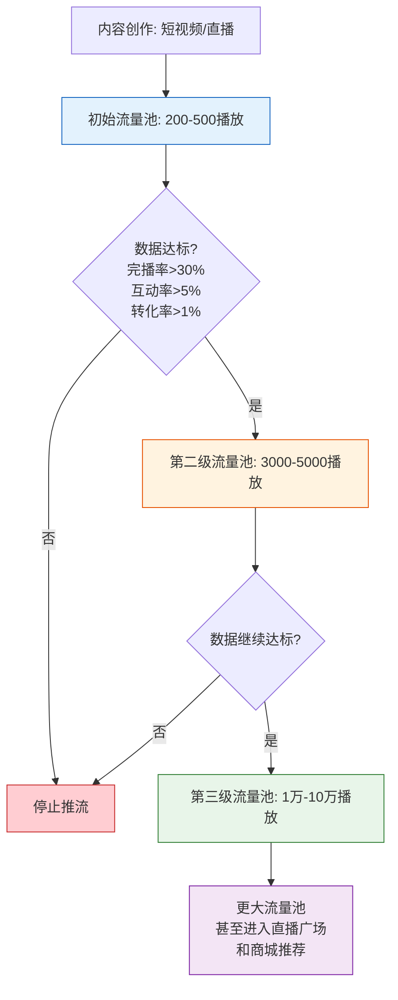
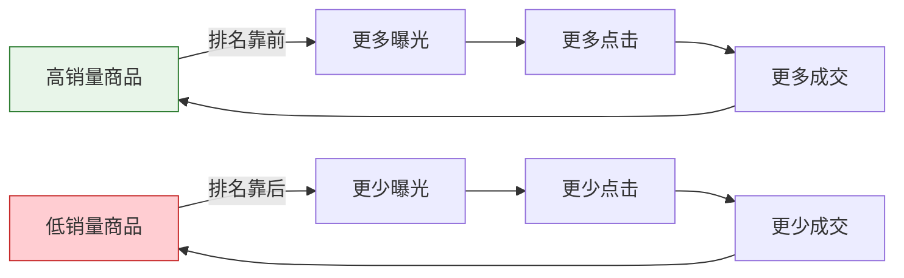

## 二、电商平台的流量分配机制

理解电商平台的流量分配机制，是电商运营的底层基本功。无论你在哪个平台卖货，流量分配逻辑决定了你的商品能被多少人看到，以及在什么位置被看到。不懂流量分配机制的卖家，就像在黑暗中摸索——偶尔撞上一个爆款，却不知道为什么爆，也无法复制成功。

### 2.1 流量分配的核心逻辑：平台的"上帝视角"

电商平台本质上是一个**双边市场**：一边是卖家（供给），一边是买家（需求）。平台的核心目标是**最大化平台GMV（成交总额）**，而不是最大化某个卖家的销量。理解这一点至关重要——平台不欠你流量，它只把流量分配给"最能让平台赚钱"的地方。

**平台流量分配的核心公式**：

```text
平台GMV = 流量 × 转化率 × 客单价 × 复购率
```

平台的算法会把流量分配给**综合效率最高**的商品和店铺。这里的"效率"不是单一指标，而是多维度加权的结果。换句话说，平台把流量看作投资——投给谁能产出最多的GMV，就投给谁。

**流量分配的三层逻辑**：



### 2.2 四大流量类型详解

电商平台的流量来源可以分为四大类，每类的获取方式和分配逻辑完全不同。

#### 2.2.1 搜索流量：最精准的免费流量

搜索流量是用户主动搜索关键词后看到的商品列表。这是**意图最明确、转化率最高**的流量来源。在淘宝/天猫体系中，搜索流量通常占店铺总流量的30%-50%。

**搜索排序的核心因子**：

| 排序因子 | 权重占比（估算） | 说明 |
|----------|:----------------:|------|
| 文本相关性 | 20%-25% | 标题、属性、详情页与搜索词的匹配度 |
| 点击率（CTR） | 15%-20% | 同等展现下被点击的概率 |
| 转化率（CVR） | 20%-25% | 进店后实际购买的比例 |
| 销量/销售额 | 15%-20% | 近期成交数据，体现市场验证 |
| 店铺综合权重 | 10%-15% | DSR评分、退款率、纠纷率、好评率 |
| 用户体验指标 | 5%-10% | 停留时长、跳失率、收藏加购率 |
| 新品/时效因子 | 5% | 新品加权、季节性加权 |

**搜索排序的动态加权机制**：平台不会简单地把所有因子加在一起。不同品类、不同阶段的权重不同。比如：

- **标品品类**（手机、家电）：价格和销量权重更高，因为消费者比价心理强
- **非标品品类**（服装、饰品）：点击率和收藏加购权重更高，因为消费者更注重视觉和喜好
- **新品期**：点击率和收藏加购的权重会被放大，给新品"弯道超车"的机会
- **大促期间**：活动标签和优惠力度的权重会显著提升

**搜索流量的分词逻辑**：淘宝搜索引擎会把用户输入的关键词拆分成最小语义单元，然后与商品标题的分词结果进行匹配。例如用户搜索"夏季薄款男士冰丝T恤"，系统会拆分为：夏季/薄款/男士/冰丝/T恤，然后去匹配标题中包含这些词的商品。标题中命中的词越多，且排列越紧凑，相关性得分越高。

#### 2.2.2 推荐流量：最大的流量池

推荐流量是平台根据用户行为和画像，"猜你喜欢"主动推送的商品。在淘宝体系中，推荐流量（首页"猜你喜欢"、"有好货"、"每日好店"等）已经超越搜索流量，成为**最大的免费流量入口**，占比可达40%-60%。

**推荐算法的核心逻辑**：



**推荐流量的核心考核指标**：

推荐系统比搜索系统更看重**"人货匹配"的效率**。核心考核指标按重要性排序：

1. **点击率（CTR）**：推荐场景下，图片是第一生产力。一张好的主图能让CTR翻倍
2. **收藏加购率**：用户虽然没立刻买，但表达了兴趣，说明人货匹配准确
3. **转化率（CVR）**：最终的购买行为是推荐系统最看重的信号
4. **坑产（单次曝光产出）**：每1000次曝光能带来多少GMV
5. **用户负反馈**：用户划过不看、点击后秒退、投诉"不感兴趣"，都会降低推荐权重

**推荐流量的"赛马机制"**：平台会给每个新品或潜力商品一定的初始曝光（通常几百到几千次），然后根据这段时间的点击率、转化率等数据决定是否继续推流。这就像一场赛马——初始曝光是参赛资格，数据表现决定你能跑多远。如果初始曝光阶段数据表现好，系统会逐步放量，形成"数据好→更多流量→数据更好→更多流量"的正循环；反之则逐步减少曝光，进入冷宫。

#### 2.2.3 活动流量：爆发式增长的机会

活动流量来自平台组织的各类促销活动，如淘宝的"双11"、"618"、"聚划算"，京东的"京东秒杀"，拼多多的"百亿补贴"等。

**活动流量的分配逻辑**：

| 活动类型 | 流量规模 | 准入门槛 | 典型坑位费 | 适用阶段 |
|----------|:--------:|----------|-----------|----------|
| S级大促（双11/618） | 极大 | 高（品牌+销量+折扣） | 0-数万 | 成熟期店铺 |
| A级活动（聚划算/淘抢购） | 大 | 中高（销量基础+折扣力度） | 5000-50000 | 成长期以上 |
| 日常活动（天天特卖/淘工厂） | 中 | 中低（价格优势为主） | 0-5000 | 新店铺也可参与 |
| 品类活动（行业主题活动） | 中 | 中（品类相关性+基础数据） | 0-10000 | 垂直店铺 |
| 直播活动（官方直播间坑位） | 大 | 高（样品+佣金+折扣） | 佣金20%-50% | 有价格优势的商家 |

**报名活动的策略要点**：

- **不要为了报名而亏本**：很多新手卖家为了上活动，把价格压到成本线以下，结果活动期间亏钱，活动结束后也拉不回自然流量。正确的做法是：用活动款引流（可以微亏或持平），用关联销售和后续复购赚利润
- **活动款的选择**：选择已有一定销量基础和好评的链接，而不是新链接。新链接在活动中的转化率往往不理想，因为缺少评价和销量背书
- **活动前的蓄水**：大促前1-2周，通过付费推广和内容种草积累收藏加购，活动开始后这些蓄水会集中转化，大幅提升活动期间的数据表现

#### 2.2.4 付费流量：花钱买确定性

付费流量是通过广告投放获取的流量。不同平台的付费工具不同，但底层逻辑类似：**出价 × 质量分 = 广告排名**。

**主流平台付费工具对比**：

| 平台 | 核心付费工具 | 计费方式 | 特点 |
|------|------------|----------|------|
| 淘宝/天猫 | 直通车（搜索广告）、万相台（推荐广告）、引力魔方（展示广告） | CPC/CPM | 工具最成熟，数据最透明 |
| 京东 | 京东快车、京准通 | CPC/CPM | 转化率相对高，但流量规模小于淘系 |
| 拼多多 | 搜索推广、场景推广、全站推广 | CPC/OCPX | 智能化程度高，手动调控空间小 |
| 抖音电商 | 巨量千川（千川） | CPC/CPM/OCPM | 内容+电商融合，素材质量是核心 |
| 亚马逊 | Sponsored Products、Sponsored Brands | CPC | 关键词竞价为主，A9算法决定排名 |

**付费流量与自然流量的关系**：这是很多卖家搞不清楚的问题。付费流量和自然流量之间存在**协同效应**：

- 付费推广带来的成交，会提升商品的搜索排名权重（因为销量增加了）
- 付费推广带来的点击和收藏加购数据，会提升推荐流量的匹配分数
- 但如果过度依赖付费流量（付费占比>70%），一旦停投，流量断崖式下跌，说明自然流量没有真正养起来

**健康的流量结构**：付费流量占总流量的20%-40%是比较健康的比例。低于20%说明你可能错过了付费推广的放大效应；高于40%说明你的自然流量获取能力不足，需要优化搜索和推荐的自然排名。

### 2.3 主流平台流量分配机制深度对比

不同平台的流量分配机制差异巨大，不能用同一套思路在所有平台运营。

#### 2.3.1 淘宝/天猫：搜索+推荐双引擎

淘系是"搜索+推荐"双引擎驱动的平台。搜索流量的核心是**"淘宝搜索引擎"**，推荐流量的核心是**"猜你喜欢"算法**。

**淘系搜索排名的核心公式（简化版）**：

```text
搜索排名分 = 文本相关性 × 0.25
           + 预估点击率 × 0.20
           + 预估转化率 × 0.25
           + 销量权重 × 0.15
           + 店铺综合质量分 × 0.10
           + 时效性因子 × 0.05
```

**淘系流量分配的"赛马+层级"机制**：淘宝把店铺和商品按照数据表现分为不同的"层级"。每个层级对应一个流量天花板。比如一个新链接，初始可能在第1层级（日曝光<500），当数据表现突破当前层级的阈值后，会升级到第2层级（日曝光500-2000），获得更多的流量池。这就是为什么很多卖家感觉"流量上不去"——你卡在了当前层级的天花板上，需要突破数据阈值才能进入下一层级。

**2024-2025年淘系流量分配的变化趋势**：

- 推荐流量占比持续上升，搜索流量占比下降
- 内容化（短视频、直播）在搜索和推荐中的权重提升
- "万相台无界版"整合了多种付费工具，趋向智能化投放
- 价格力（同品质下的价格竞争力）成为重要的排序因子

#### 2.3.2 拼多多：低价优先+社交裂变

拼多多的流量分配逻辑与淘宝有本质区别。拼多多的核心算法是**"极致性价比+社交裂变"**。

**拼多多流量分配的特点**：

- **价格权重极高**：在同类目商品中，价格更低的商品会获得更多的搜索和推荐流量。这是拼多多的底层基因
- **"全站推广"的智能化**：拼多多的全站推广工具已经非常智能化，卖家只需要设定目标ROI和日预算，系统自动分配搜索和推荐流量。这降低了操作门槛，但也减少了卖家的手动调控空间
- **活动流量占比大**：拼多多的"百亿补贴"、"限时秒杀"、"万人团"等活动流量占平台总流量的比例很高。参与这些活动需要价格竞争力
- **社交裂变流量**：拼团、砍价、分享领现金等社交玩法带来的流量，是拼多多独有的流量来源

**拼多多卖家的流量获取策略**：在拼多多上，**价格竞争力是第一优先级**。如果你的价格不是同类商品中最优的，很难获得大量自然流量。这意味着你需要在供应链上下功夫——找到更低成本的货源，或者通过规模效应降低单位成本。

#### 2.3.3 抖音电商：内容驱动+兴趣推荐

抖音电商的流量分配逻辑与传统搜索电商完全不同。抖音没有传统的"搜索-列表"购物场景（虽然搜索在增长），流量主要来自**内容推荐流**。

**抖音电商的流量分配路径**：



**抖音流量分配的核心指标**：

1. **完播率**：用户看完整个视频的比例。这是抖音最看重的内容质量指标。完播率>30%是进入下一级流量池的基准线
2. **互动率**：点赞、评论、转发、收藏的综合比例。互动率>5%说明内容有吸引力
3. **商品点击率**：视频中商品链接被点击的比例
4. **转化率**：点击商品后下单购买的比例
5. **GPM（千次观看成交额）**：每1000次观看带来的GMV。这是抖音电商最核心的效率指标

**抖音电商的"内容-货架"融合趋势**：2024年以来，抖音在大力发展"商城"板块，试图建立类似传统电商的"搜索-货架"场景。这意味着抖音电商的流量来源正在从"纯内容推荐"向"内容+货架"双驱动转变。对于卖家来说，既要做好内容（短视频+直播），也要优化商城的搜索排名（标题优化、商品属性填写、销量积累）。

#### 2.3.4 亚马逊：A9/A10算法

亚马逊的流量分配机制以**A9算法**（现已演进为A10）为核心。与国内平台相比，亚马逊的算法更加"黑盒"，但核心逻辑仍然可以归纳。

**亚马逊搜索排名的核心因子**：

| 因子 | 重要性 | 说明 |
|------|:------:|------|
| 销售速度（Sales Velocity） | ★★★★★ | 近期销量增长趋势，是最核心的排名因子 |
| 转化率（Conversion Rate） | ★★★★★ | Listing被浏览后购买的比例 |
| 关键词相关性 | ★★★★☆ | 标题、Bullet Points、Backend Keywords与搜索词的匹配 |
| 评价数量和质量 | ★★★★☆ | Review数量、星级、近期评价趋势 |
| 价格竞争力 | ★★★☆☆ | 同类商品中的价格排名 |
| 配送方式（FBA vs FBM） | ★★★☆☆ | FBA商品在排名上有天然优势 |
| 库存状态 | ★★★☆☆ | 缺货会严重影响排名，且恢复缓慢 |
| 广告表现 | ★★☆☆☆ | 站内广告带来的销量也计入排名权重 |

**亚马逊A10算法的变化**：A10相比A9，更加强调**自然销售速度**和**外部流量**。过去通过站内广告刷排名的策略效果在减弱，而通过社交媒体、博客等外部渠道引流到亚马逊的权重在增加。这意味着亚马逊卖家需要建立"外部引流→亚马逊转化"的能力。

### 2.4 流量分配的底层算法原理

理解算法的底层原理，能帮助你做出更优的运营决策，而不是盲目跟风。

#### 2.4.1 协同过滤推荐

协同过滤是最基础也最常用的推荐算法。核心思想：**行为相似的用户，可能对相似的商品感兴趣**。

- **用户协同过滤**：找到和你行为相似的用户群，把他们喜欢但你还没看过的商品推荐给你
- **商品协同过滤**：买了A商品的用户中有很高比例也买了B商品，那么A和B就是"关联商品"，浏览A的人也会被推荐B

**运营启示**：你的商品被推荐到什么人群，取决于你的现有买家画像。如果你一开始用低价引流吸引了大量低消费能力用户，后续推荐系统会持续给你推低消费人群，形成"低价→低质人群→低客单价→利润薄"的恶性循环。因此，**初始用户画像的塑造**非常关键。

#### 2.4.2 实时兴趣模型

现代推荐系统已经不是简单的"基于历史行为推荐"，而是加入了**实时兴趣信号**。用户当前session的行为（这次打开APP后浏览了什么、停留了多久、收藏了什么）会实时影响接下来的推荐内容。

**运营启示**：用户在你的商品页面停留时间越长、浏览深度越深（看了详情页、看了评价、看了买家秀），系统会认为你的商品与该用户高度匹配，后续会把你的商品推荐给更多"类似用户"。因此，**详情页的内容质量**直接影响推荐流量——不是因为它直接带来推荐流量，而是因为它影响了用户行为数据，进而影响了推荐算法的判断。

#### 2.4.3 多目标优化

平台的算法不是只优化单一目标（如点击率），而是**同时优化多个目标**：点击率、转化率、用户满意度、GMV、用户留存等。这些目标之间可能存在冲突（比如低价高转化但低利润），算法需要在多个目标之间找到平衡。

**运营启示**：不要只追求单一指标的极致。比如只追求高点击率而用夸张的标题和图片，用户点进去发现不符，会产生高跳失率和差评，反而降低后续的推荐权重。平台算法能识别"标题党"行为并进行惩罚。

### 2.5 流量分配中的"马太效应"与"破局点"

电商流量分配存在明显的**马太效应**——强者愈强，弱者愈弱。销量高的商品排名更靠前，获得更多曝光，带来更多销量，形成正循环。新商品和小卖家如何破局？

#### 2.5.1 马太效应的表现



#### 2.5.2 破局策略

**策略一：错位竞争，找蓝海关键词**

不要和头部卖家竞争大词（如"T恤"），而是找长尾词（如"夏季冰丝圆领男士T恤宽松版"）。长尾词搜索量小，但竞争也小，更容易拿到排名。当你的商品在长尾词上积累了足够的销量和权重后，再去竞争更大的词。

**策略二：利用新品加权期**

平台对新上架的商品有一定的流量扶持（淘宝约7-14天，亚马逊约2-4周）。在这段时间内，如果商品的点击率和转化率表现好，就能获得持续的流量增长。因此，新品上架前要做好充分准备：主图测试、标题优化、价格策略、详情页完善，确保上架后能接住初始流量。

**策略三：付费推广撬动自然流量**

用付费推广（直通车、千川等）获取初始销量和数据积累，当自然搜索和推荐排名提升后，逐步降低付费占比。关键是控制好"付费推广→自然流量"的转化效率——如果付费推广带来的销量能显著提升自然排名，说明这笔钱花得值。

**策略四：内容种草+搜索收割**

在抖音、小红书等内容平台种草，引导用户到电商平台搜索购买。这种"外部种草→搜索收割"的模式，能有效提升搜索关键词的权重，同时降低对平台付费流量的依赖。

### 2.6 实操：如何诊断和优化你的流量结构

理论讲完了，下面是可执行的诊断和优化流程。

#### 2.6.1 流量结构诊断清单

| 诊断项 | 健康标准 | 异常信号 | 优化方向 |
|--------|----------|----------|----------|
| 付费流量占比 | 20%-40% | >60% | 优化自然搜索和推荐排名 |
| 搜索流量占比 | 20%-40% | <10% | 优化标题关键词和SEO |
| 推荐流量占比 | 20%-50% | <10% | 优化主图点击率和商品标签 |
| 搜索转化率 | 行业均值×1.2以上 | <行业均值 | 优化详情页、价格、评价 |
| 推荐点击率 | 行业均值×1.2以上 | <行业均值 | 优化主图、标题吸引力 |
| 流量趋势 | 稳定或增长 | 持续下降>7天 | 排查降权原因、竞品分析 |

#### 2.6.2 流量优化的优先级排序

当流量遇到瓶颈时，按以下优先级逐项排查和优化：

1. **先看转化率**：如果流量来了但转化率低，说明流量质量或承接能力有问题。优化详情页、评价管理、价格策略
2. **再看点击率**：如果曝光量够但点击率低，说明主图或标题不够吸引人。重新设计主图、优化标题
3. **然后看曝光量**：如果曝光量本身不够，说明搜索排名或推荐权重不够。优化关键词布局、提升销量积累
4. **最后看流量来源结构**：如果某个渠道的流量异常下降，可能是平台算法调整或竞品挤压，需要针对性应对

### 2.7 常见误区与纠正

**误区一："刷单能提升搜索排名"**

纠正：平台的反作弊系统已经非常成熟。刷单被抓到的后果包括：降权（搜索排名大幅下降）、扣分、甚至关店。即使短期没被抓，虚假交易带来的数据（高销量低转化、异常的用户行为模式）会被算法识别，推荐权重反而下降。正确的做法是通过合规的方式积累真实销量和评价。

**误区二："开了直通车自然流量就会涨"**

纠正：付费推广只有在"付费成交→提升商品权重→自然排名提升"这条链路畅通时，才能带动自然流量。如果你的商品转化率很低，开直通车只是在烧钱——花钱买来的流量也转化不了，商品权重不会提升。先优化转化率，再开付费推广。

**误区三："只要价格低就能拿到流量"**

纠正：低价确实在拼多多等平台有明显优势，但在淘宝、天猫等平台，算法是综合考量的。一个价格极低但评价很差、退货率很高的商品，不会获得大量推荐流量。平台要的是"高效率"，不只是"低价格"。

**误区四："流量越多越好"**

纠正：不精准的流量反而有害。大量不相关用户进入你的店铺但不购买，会拉低转化率数据，进而降低搜索和推荐的权重。你需要的是"精准流量"——真正有购买意愿的目标用户。

**误区五："一个爆款就够了"**

纠正：过度依赖单一爆款的风险极高。一旦这个链接被降权、被投诉、或被竞品超越，整个店铺的流量会断崖式下降。健康的店铺应该有1-3个主力爆款+5-10个辅助款+20-50个长尾款的产品矩阵。

### 2.8 进阶：流量分配机制的未来趋势

**趋势一：AI驱动的个性化推荐将更精准**

随着大语言模型和多模态AI的发展，平台的推荐算法将更加精准。商品的图片质量、视频内容、甚至直播中的语言表达，都会被AI理解和纳入推荐决策。这意味着"内容质量"在流量分配中的权重将持续上升。

**趋势二：搜索与推荐的边界模糊化**

传统上，搜索流量和推荐流量是两个独立的系统。但越来越多的平台在把两者融合——用户搜索一个关键词后，看到的不仅是搜索结果，还有"相关推荐"、"看了又看"等内容。这意味着卖家需要同时优化搜索相关性和推荐匹配度。

**趋势三：内容化成为流量分配的核心变量**

无论是淘宝的"逛逛"和短视频、抖音的"商城"、还是拼多多的"多多视频"，所有平台都在加强内容化。在未来的流量分配中，**能产出优质内容的卖家将获得更多流量倾斜**。纯靠产品和价格竞争的时代正在过去，"内容能力"正在成为电商的核心竞争力之一。

**趋势四：全域流量经营取代单平台运营**

平台之间的壁垒正在被打破。抖音的内容可以在淘宝成交，小红书的种草可以在京东转化。未来的流量经营不再是"在某个平台上运营"，而是"在全域建立品牌认知，引导用户在最合适的渠道完成购买"。这对卖家的全域营销能力提出了更高要求。

***

