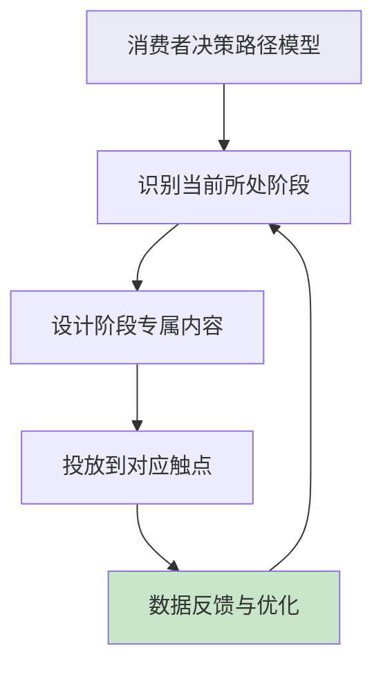
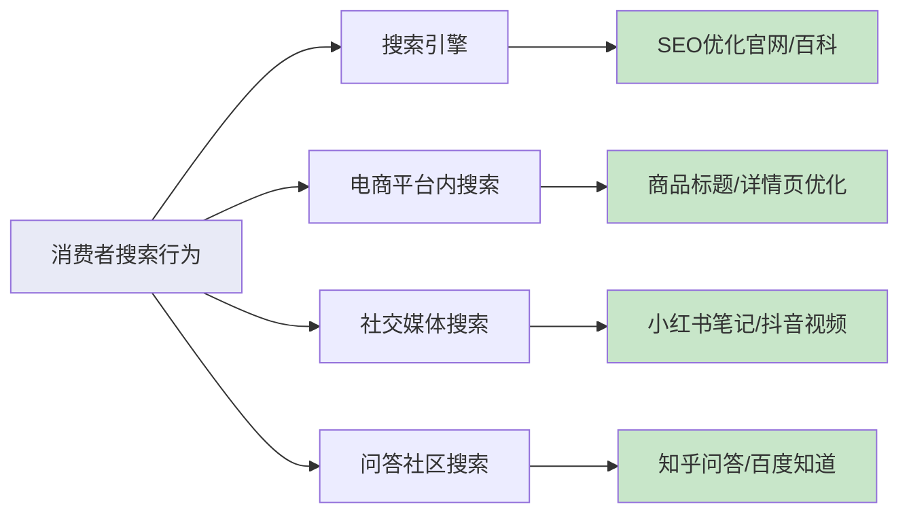
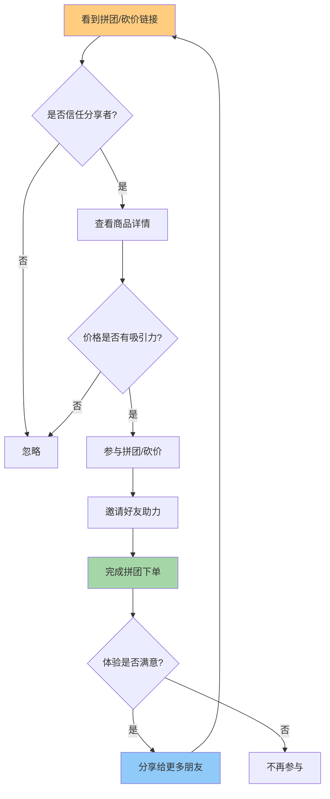
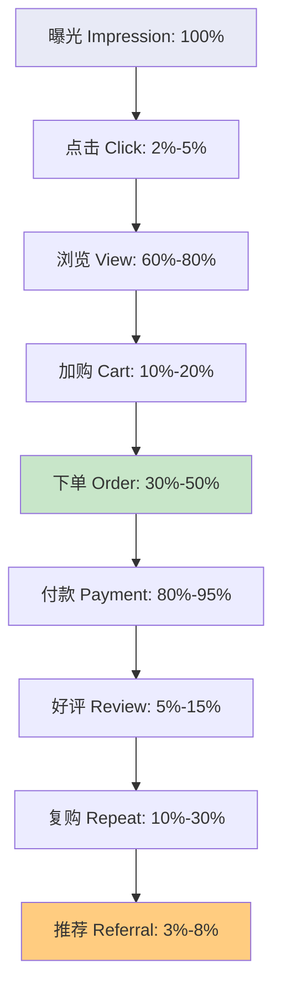
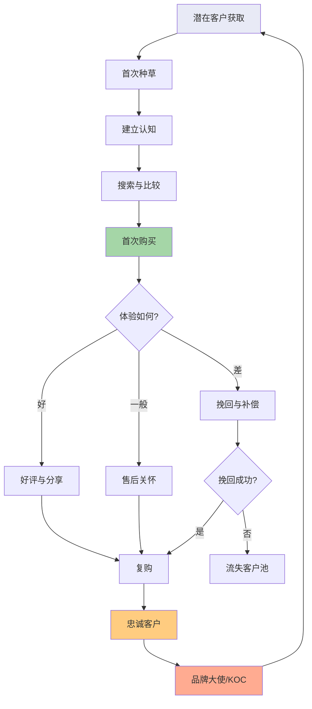

## 三、消费者购买决策路径

消费者从"看到商品"到"完成购买"的整个过程，不是一条直线，而是一条由心理活动驱动的复杂路径。理解这条路径，是电商运营的基本功——你必须知道消费者在想什么、在哪里犹豫、在哪里下决定，才能在正确的节点施加正确的影响。

本节从经典理论模型出发，逐步推演到移动互联网和社交电商时代的新模型，并给出每个决策节点的实操优化方法。

### 3.1 为什么决策路径模型对电商至关重要

决策路径模型的价值在于：**让你从"猜测消费者行为"转变为"系统化设计转化流程"**。

没有模型指导的电商运营，通常表现为：
- 流量来了但转化率低，不知道问题出在哪个环节
- 营销预算平均分配，没有重点突破关键节点
- 用户流失后无法定位原因，只能反复试错

有了模型之后，你可以：
- 将转化漏斗拆解为可度量的阶段
- 针对每个阶段设计独立的优化策略
- 通过数据监控精准定位瓶颈环节

### 3.2 经典模型：AIDMA（传统媒体时代）

AIDMA模型由美国广告学家Elias St. Elmo Lewis于1898年提出（最初是AIDA四阶段模型），后由日本电通公司在1920年代扩展为五阶段模型。这是最早也是影响最深远的消费者行为模型。

| 阶段 | 英文 | 含义 | 关键心理活动 |
|------|------|------|-------------|
| 注意 | Attention | 消费者首次接触商品信息 | "这是什么？" |
| 兴趣 | Interest | 对商品产生进一步了解的意愿 | "看起来不错，想多看看" |
| 欲望 | Desire | 产生拥有的强烈愿望 | "我想要这个" |
| 记忆 | Memory | 将商品信息储存在记忆中 | "记住这个品牌/产品" |
| 行动 | Action | 最终做出购买决定 | "我要买" |

**AIDMA的核心逻辑**是线性递进的——消费者从被动接收信息开始，经过心理酝酿，最终产生购买行为。整个过程以"品牌记忆"为桥梁，从兴趣到购买之间往往存在较长的时间间隔（几天到几个月）。

**各阶段运营要点：**

**Attention（注意）阶段：**
- 核心任务：让消费者看到你
- 关键手段：电视广告、报纸广告、户外大牌、杂志封面
- 度量指标：曝光量、到达率、频次
- 运营重点：创意冲击力——在海量广告中脱颖而出
- 典型案例：脑白金的"今年过节不收礼"，通过高频重复在消费者脑中植入品牌印记

**Interest（兴趣）阶段：**
- 核心任务：让消费者对你产生好奇
- 关键手段：产品卖点提炼、场景化展示、明星代言
- 度量指标：广告回忆率、品牌认知度调研
- 运营重点：卖点可视化——不要说"质量好"，要展示"用十年不变形"
- 常见错误：卖点罗列过多，消费者记不住；应该聚焦1-2个核心卖点

**Desire（欲望）阶段：**
- 核心任务：将"还不错"升级为"我想要"
- 关键手段：场景营造、情感共鸣、社会认同
- 度量指标：购买意愿调研、品牌偏好度
- 运营重点：让消费者想象拥有后的美好生活
- 典型案例：汽车广告从不讲参数，而是展示"一家人在海边公路自驾"的画面

**Memory（记忆）阶段：**
- 核心任务：让消费者在需要时想起你
- 关键手段：品牌标识设计、口号重复、品牌故事
- 度量指标：品牌回忆率（提示前提及率）、品牌再认率
- 运营重点：简洁+重复——品牌名不超过4个字，核心口号反复出现
- 这是AIDMA模型独有的阶段，也是传统营销的核心——在没有即时搜索能力的年代，消费者"记住你"是购买的前提

**Action（行动）阶段：**
- 核心任务：降低购买门槛，促成最终交易
- 关键手段：渠道铺设、促销活动、店员推销
- 度量指标：销售转化率、客单价
- 运营重点：让消费者买得到、买得方便

**AIDMA的局限性：**
- 假设消费者是被动接收信息的（实际现代消费者主动搜索）
- 假设决策是线性的（实际可能跳跃、回退、并行）
- 没有考虑购买后的行为（口碑、复购）
- Memory阶段在互联网时代价值大幅降低——需要时搜索即可，不需要预先记忆

### 3.3 互联网模型：AISAS（搜索电商时代）

2005年，日本电通公司针对互联网时代提出了AISAS模型，是对AIDMA的重大升级。核心变化有两点：用"Search（搜索）"替代了"Desire+Memory"，用"Share（分享）"补充了购后行为。

| 阶段 | 英文 | 含义 | 与AIDMA的区别 |
|------|------|------|--------------|
| 注意 | Attention | 在互联网场景中看到商品信息 | 触点从电视报纸变为搜索/社交/电商 |
| 兴趣 | Interest | 对商品产生兴趣 | 从被动接收变为主动筛选 |
| 搜索 | Search | 主动搜索商品信息和评价 | 全新阶段，取代了记忆 |
| 行动 | Action | 下单购买 | 购买从线下变为线上 |
| 分享 | Share | 分享购买体验和使用感受 | 全新阶段，购后行为纳入模型 |

**AISAS的革命性在于**：承认了消费者从"被动接收者"变为"主动决策者"。Search阶段的出现意味着消费者不再依赖品牌广告的记忆，而是通过搜索获取全面信息来辅助决策。

**各阶段运营要点：**

**Attention（注意）阶段——互联网触点矩阵：**

| 触点类型 | 具体渠道 | 特点 | 适用品类 |
|---------|---------|------|---------|
| 搜索广告 | 百度/Google竞价 | 精准匹配用户意图 | 高客单价、决策周期长 |
| 信息流 | 今日头条/朋友圈广告 | 兴趣标签定向 | 兴趣驱动型消费品 |
| 电商推荐 | 淘宝"猜你喜欢" | 基于浏览/购买历史 | 全品类 |
| 内容种草 | 小红书/知乎/公众号 | 深度内容渗透 | 高决策成本品类 |
| 短视频 | 抖音/快手 | 视觉冲击力强 | 高展示性商品 |

**Interest（兴趣）阶段——内容策略：**
- 种草内容的黄金结构：痛点引入→产品展示→效果对比→购买引导
- 内容深度要求：图文至少800字+5张图，视频至少60秒
- 关键原则：不要直接卖货，先提供价值（知识、娱乐、情感共鸣）
- 数据参考：小红书种草笔记的平均阅读完成率为45%，但加入"效果对比图"的笔记完成率提升至72%

**Search（搜索）阶段——搜索生态布局：**

搜索阶段是消费者主动获取信息的过程，运营者需要在搜索结果中建立全面的品牌信息矩阵：

搜索优化的核心策略：
- **品牌词防御**：确保搜索品牌名时，正面信息占据前3页
- **品类词进攻**：在品类通用关键词中争取排名（如"空气炸锅推荐"）
- **长尾词覆盖**：覆盖"XX品牌怎么样""XX和YY哪个好"等决策型长尾词
- **评价管理**：搜索阶段消费者高度依赖评价，差评的杀伤力是好评的3-5倍

**Action（行动）阶段——转化优化：**
- 详情页设计：首屏3秒法则——消费者在前3秒决定是否继续浏览
- 价格锚定：原价对比、竞品对比、日均成本换算
- 信任背书：销量数据、权威认证、KOL推荐、售后保障
- 紧迫感制造：限时优惠、限量库存、凑单优惠
- 支付便捷：一键下单、多种支付方式、分期免息

**Share（分享）阶段——口碑裂变：**
- 激励分享：好评返现、分享得优惠券、邀请有礼
- 降低分享门槛：一键生成分享海报、自动生成好评模板
- 分享内容引导：引导晒单照片/视频，提供拍摄模板
- 数据参考：带有用户晒单的商品，后续转化率平均提升25%-40%

### 3.4 社交电商决策模型（社交+短视频时代）

社交电商的兴起催生了全新的决策路径。与AIDMA和AISAS相比，社交电商的决策路径呈现三个显著特征：

**特征一：路径极短**
消费者在社交场景中被内容触发购买冲动，从发现到下单可能仅需几十秒。2024年数据显示，抖音电商用户从"看到商品"到"下单"的平均时间仅**72秒**，远低于传统电商平台的**3-7天**决策周期。

**特征二：信任前置**
传统模型中信任是逐步建立的，社交电商中信任来自KOL/朋友的背书，决策前就有信任基础。

**特征三：冲动驱动**
限时秒杀、直播间倒计时、拼团凑人数等机制，压缩了消费者的理性思考时间。

社交电商决策路径四阶段：

| 阶段 | 核心驱动 | 典型场景 | 转化关键 |
|------|---------|---------|---------|
| 发现 | 内容推荐/社交推荐 | 刷到短视频、朋友圈看到分享 | 内容质量与吸引力 |
| 信任 | KOL背书/社交关系 | 信任的博主推荐、朋友分享 | 信任链的强度 |
| 决策 | 冲动+限时压力 | 直播间倒计时、拼团剩余时间 | 紧迫感制造 |
| 裂变 | 超预期体验 | 产品好用到想分享、分享得红包 | 分享激励设计 |

**平台决策路径对比：**

| 维度 | 传统电商(淘宝/京东) | 搜索电商(百度/Google) | 社交电商(抖音/快手) | 私域电商(微信) |
|------|-------------------|---------------------|-------------------|--------------|
| 触发方式 | 主动搜索/推荐 | 主动搜索 | 被动推荐/内容触发 | 社交关系触发 |
| 决策周期 | 1-7天 | 3-30天 | 1-3分钟 | 几小时-几天 |
| 信任来源 | 销量/评价/品牌 | 官网/百科/评测 | KOL/直播间氛围 | 朋友/私域主 |
| 冲动程度 | 中等 | 低 | 极高 | 中等 |
| 复购驱动 | 平台推荐/价格 | 品牌忠诚 | 内容持续触达 | 私域运营/服务 |
| 典型转化率 | 3%-5% | 1%-3% | 1%-3%（但体量大） | 8%-15% |

**拼多多社交裂变模型深度解析：**

拼多多将社交裂变做到了极致，其决策路径可以进一步拆解为：

拼多多拼团转化率高达**35%-40%**，是传统搜索电商的**2-3倍**，核心原因：
- 价格优势明确（拼团价vs原价一目了然）
- 社交压力驱动（朋友邀请不好意思拒绝）
- 限时机制（拼团倒计时创造紧迫感）
- 沉没成本（已经邀请了朋友，不想白费）

### 3.5 其他重要决策模型

#### 3.5.1 SIPS模型（社交媒体时代）

日本电通公司于2011年提出，专门针对社交媒体环境：

| 阶段 | 含义 | 关键行为 |
|------|------|---------|
| Sympathize（共鸣） | 被内容触动产生共鸣 | 点赞、停留、关注 |
| Identify（确认） | 确认与自身需求的相关性 | 查看评论、对比信息 |
| Participate（参与） | 参与互动和讨论 | 评论、转发、提问 |
| Share & Spread（分享扩散） | 主动传播给更多人 | 发朋友圈、推荐给朋友 |

SIPS模型强调"共鸣"是起点——在社交媒体上，消费者不是被广告"触达"，而是被内容"打动"。这对内容营销的启示是：**先做内容，再做转化；先建立情感连接，再推动购买行为**。

#### 3.5.2 DECAX模型（内容营销时代）

由日本博报堂提出，适用于内容营销场景：

| 阶段 | 含义 | 内容策略 |
|------|------|---------|
| Discover（发现） | 消费者发现优质内容 | 产出高质量、有价值的内容 |
| Empathize（共鸣） | 对内容产生共鸣 | 内容要切中目标人群痛点 |
| Check（确认） | 主动查验品牌/产品信息 | 品牌信息要全面、可验证 |
| Action（行动） | 购买或进一步互动 | 转化路径要短、支付要便捷 |
| eXperience（体验） | 使用产品并体验价值 | 产品品质是基础，超预期体验驱动复购和传播 |

DECAX模型的核心观点：**内容即营销**。不是在内容中"插入"广告，而是让内容本身成为营销载体。

#### 3.5.3 精细化决策漏斗模型

将AISAS进一步细化为可度量的漏斗指标：

每个环节的流失都是可以优化的：
- 曝光→点击：优化标题、主图、价格展示
- 点击→浏览：优化首屏加载速度、首屏信息
- 浏览→加购：优化详情页说服力、价格锚定
- 加购→下单：优化购物车挽回（短信/push提醒）、凑单策略
- 下单→付款：优化支付流程、分期选项
- 付款→好评：优化开箱体验、好评引导
- 好评→复购：优化会员体系、复购优惠
- 复购→推荐：优化分享激励、社交裂变机制

### 3.6 决策路径的实战应用

#### 3.6.1 根据品类特征选择模型

不同品类的消费者决策路径差异巨大，不能套用同一套模型：

| 品类特征 | 典型品类 | 决策特点 | 适用模型 | 运营重点 |
|---------|---------|---------|---------|---------|
| 低频高客单 | 房产、汽车、教育 | 决策周期长，信息搜索深度大 | AISAS | Search阶段深度内容建设 |
| 高频低客单 | 零食、日用品、纸巾 | 决策快，品牌忠诚度低 | AIDMA | Attention阶段高频曝光 |
| 冲动消费 | 服饰、美妆、小饰品 | 视觉驱动，决策极快 | 社交电商模型 | 内容吸引力+限时机制 |
| 功能导向 | 电子产品、工具、软件 | 参数对比、评测依赖 | AISAS+DECAX | 搜索阶段评测内容布局 |
| 社交属性强 | 礼品、潮玩、联名款 | 社交认同驱动 | SIPS | 社群运营+稀缺性营销 |

#### 3.6.2 多触点协同策略

现代消费者的决策路径不是单一路径，而是多触点交叉的网状结构。一个典型的高客单价商品购买路径可能是：

1. 在抖音看到短视频（Attention）
2. 在小红书搜索评测（Search）
3. 在知乎看专业分析（Search深化）
4. 回到抖音看更多用户反馈（Interest强化）
5. 在淘宝搜索比价（Action准备）
6. 加入购物车但未购买（犹豫）
7. 收到淘宝推送的优惠券（促转化）
8. 在微信群看到朋友分享使用体验（信任确认）
9. 最终下单（Action）
10. 收到商品后发朋友圈（Share）

**多触点归因的关键问题**：在这10个触点中，哪个是"决定性触点"？

常用的归因模型：

| 归因模型 | 逻辑 | 优点 | 缺点 |
|---------|------|------|------|
| 末次触达 | 购买前最后一个触点获得全部功劳 | 简单易算 | 忽略前期种草贡献 |
| 首次触达 | 第一个触点获得全部功劳 | 重视获客 | 忽略后续转化贡献 |
| 线性归因 | 所有触点平均分配功劳 | 公平 | 不够精准 |
| 时间衰减 | 越接近购买的触点功劳越大 | 较合理 | 早期种草被低估 |
| 数据驱动归因 | 基于机器学习模型分配功劳 | 最精准 | 需要大量数据支持 |

实操建议：中小卖家用"末次触达"做基础归因，同时关注"首次触达"渠道的投入产出比；大品牌应逐步建立数据驱动归因体系。

#### 3.6.3 决策路径诊断清单

当转化率不理想时，按以下清单逐项排查：

**流量端（Attention）：**
- 曝光量是否达标？→ 检查投放预算和渠道覆盖
- 点击率是否正常？→ 检查标题、主图、价格展示
- 流量质量如何？→ 检查跳出率、页面停留时间

**种草端（Interest/Search）：**
- 种草内容是否充足？→ 检查各平台UGC/PGC内容数量和质量
- 搜索结果是否正面？→ 搜索品牌词+品类词，检查前3页内容
- 评测/口碑是否到位？→ 检查知乎、小红书、什么值得买等平台

**转化端（Action）：**
- 详情页是否具有说服力？→ 检查首屏信息、卖点展示、信任背书
- 价格是否有竞争力？→ 对比竞品价格和促销策略
- 购买流程是否顺畅？→ 测试从加购到付款的全流程
- 客服响应是否及时？→ 检查平均响应时间和解决率

**裂变端（Share）：**
- 是否有分享激励机制？→ 检查好评返现、分享有礼等活动
- 开箱体验是否超预期？→ 检查包装、赠品、使用指南
- 复购触达是否到位？→ 检查短信/push/私域触达策略

### 3.7 决策路径中的心理学杠杆

在决策路径的每个节点，都存在可以利用的心理学原理：

| 心理学原理 | 应用节点 | 具体应用 | 效果 |
|-----------|---------|---------|------|
| 社会认同 | Interest/Search | "已售10万件""98%好评" | 降低不确定感 |
| 稀缺效应 | Action | "仅剩3件""限时2小时" | 加速决策 |
| 锚定效应 | Action | 原价999现价299 | 感知划算 |
| 损失厌恶 | Action | "优惠券即将过期" | 推动行动 |
| 互惠原则 | Share | 好评返现、分享得红包 | 驱动分享 |
| 承诺一致性 | Interest→Action | 先收藏、再加购、最后下单 | 逐步升级承诺 |
| 峰终定律 | Share | 开箱惊喜、售后关怀 | 创造分享素材 |
| 从众效应 | Search→Action | 排行榜、实时购买播报 | 强化购买信心 |

**损失厌恶的实操案例**：
不要说"购买后享受30天无理由退货"，而要说"您可以先试用30天，不满意随时退"——后者暗示消费者已经"拥有"了商品，退货变成了"失去"，触发损失厌恶心理。数据显示，这种话术能将犹豫期转化率提升15%-20%。

### 3.8 常见误区与纠正

**误区一：只关注漏斗顶部（流量）**
很多卖家认为"只要有足够多的流量，自然会有转化"。实际上，如果决策路径中后端节点（搜索评价、详情页、客服）存在问题，加大流量投入只是加速浪费预算。正确的做法是先优化转化率，再放量。

**误区二：用同一套内容覆盖所有阶段**
在"注意"阶段用的内容（短平快、视觉冲击）与"搜索"阶段需要的内容（深度评测、数据对比）完全不同。很多卖家只做"种草"内容，不做"决策"内容，导致消费者被种草后搜索不到足够的决策信息而流失。

**误区三：忽略购后路径**
购买不是终点，而是新循环的起点。一次糟糕的购后体验（包装破损、客服态度差、产品质量不达标）不仅丧失复购，还会产生负面分享，影响其他消费者的"搜索"阶段。

**误区四：只看转化率不看路径时长**
同样5%的转化率，如果决策周期从7天缩短到1天，意味着同样的流量在相同时间内能产生7倍的交易。优化决策路径的"速度"和优化"转化率"同样重要。

**误区五：将所有消费者视为同质化群体**
不同人群的决策路径差异巨大。Z世代可能直接在抖音直播间下单（路径极短），而中年消费者可能需要先看评测、再比价、最后咨询客服（路径较长）。需要针对不同人群设计不同的决策路径优化策略。

### 3.9 数据驱动的决策路径优化

#### 3.9.1 关键指标体系

| 决策阶段 | 核心指标 | 辅助指标 | 健康基准 |
|---------|---------|---------|---------|
| 注意 | 曝光量、触达人数 | CPM（千次曝光成本） | 因渠道而异 |
| 兴趣 | 点击率(CTR) | 停留时长、互动率 | 搜索广告3%-5%，信息流0.5%-2% |
| 搜索 | 搜索排名、内容覆盖率 | 搜索转化率 | 品牌词前3，品类词前10 |
| 行动 | 转化率(CVR) | 客单价、加购率 | 电商2%-5%，直播1%-3% |
| 分享 | 分享率、好评率 | NPS（净推荐值） | 好评率>90%，分享率>5% |

#### 3.9.2 数据监控实操

以淘宝/天猫店铺为例，关键数据监控点：

1. **生意参谋-流量纵横**：监控各渠道流量占比和转化率，识别高效渠道
2. **生意参谋-商品分析**：监控单品从曝光到成交的全链路转化率
3. **直通车报表**：监控搜索广告的CTR和CVR，优化关键词出价
4. **客户运营平台**：监控复购率、客户生命周期价值（LTV）
5. **评价分析**：定期检查差评内容，识别产品和服务问题

每周至少做一次全链路数据复盘，重点关注：
- 哪个环节的转化率最低（瓶颈环节）
- 哪个环节的流失量最大（机会环节）
- 各环节数据与行业基准的差距（优化空间）

### 3.10 不同平台的决策路径优化实战

#### 3.10.1 淘宝/天猫（搜索电商）

决策路径特征：消费者有明确购物意图，通过搜索比价决策。
- 优化重点：搜索排名（SEO+直通车）+ 详情页转化率 + 评价管理
- 关键动作：标题关键词优化、主图点击率测试、详情页A/B测试、评价引导
- 核心数据：搜索流量占比、关键词排名、详情页转化率

#### 3.10.2 抖音电商（兴趣电商）

决策路径特征：消费者无明确购物意图，被内容激发需求。
- 优化重点：内容吸引力 + 直播间转化 + 短视频种草深度
- 关键动作：短视频前3秒钩子设计、直播间话术和节奏、千川投放人群包优化
- 核心数据：视频完播率、直播间停留时长、GPM（千次曝光成交额）

#### 3.10.3 小红书（种草平台）

决策路径特征：消费者处于"兴趣"和"搜索"阶段，种草价值极高。
- 优化重点：笔记质量和互动数据 + 搜索关键词布局
- 关键动作：KOC种草矩阵、笔记SEO优化、评论区互动维护
- 核心数据：笔记曝光量、互动率（点赞+收藏+评论）、搜索排名

#### 3.10.4 微信私域（信任电商）

决策路径特征：基于社交信任的决策，复购率高但初始获客成本高。
- 优化重点：私域人设建设 + 社群运营 + 复购引导
- 关键动作：朋友圈人设打造、社群价值输出、1对1精准推荐
- 核心数据：私域客户数、社群活跃度、复购率、客单价

### 3.11 进阶：全链路消费者运营

当你的电商业务进入成熟期，需要从"单次转化思维"升级为"全生命周期运营思维"。这意味着不仅要优化单次购买的决策路径，还要设计整个消费者生命周期的运营路径。

**全链路运营的核心指标体系：**
- 获客成本（CAC）：获取一个新客户的总成本
- 客户生命周期价值（LTV）：一个客户在整个生命周期内贡献的总营收
- LTV/CAC比值：健康值应>3，低于3说明获客成本过高或客户价值过低
- 复购率：30天/60天/90天复购率
- NPS（净推荐值）：衡量客户忠诚度和口碑传播意愿

当LTV/CAC>3时，你可以放心加大获客投入；当LTV/CAC<3时，应优先优化复购和客户价值，而不是盲目投放。
