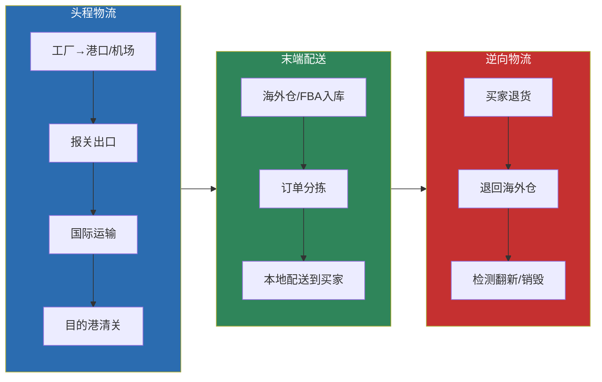
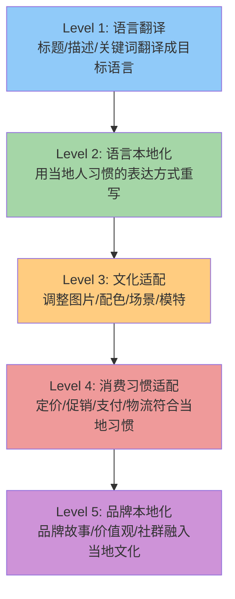
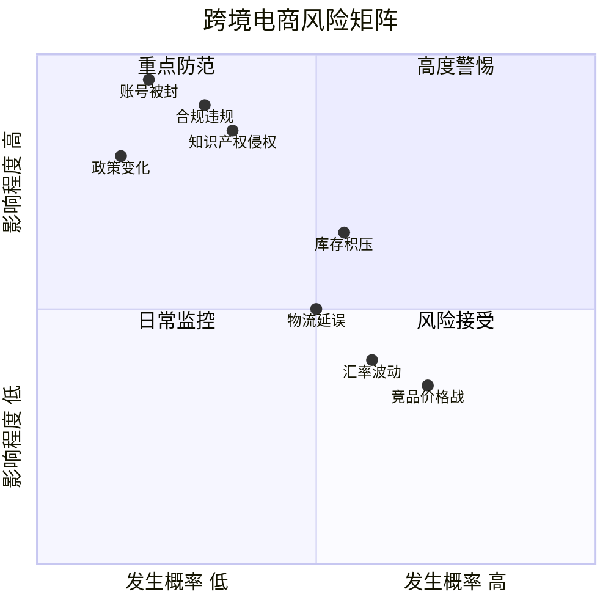
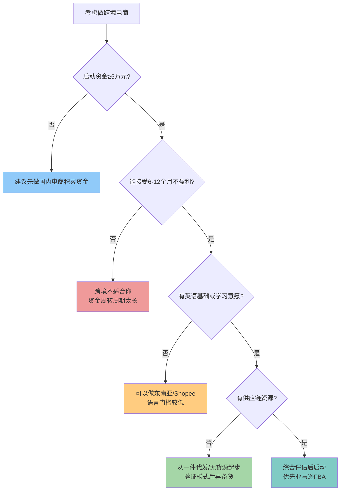

## 四、跨境电商的特殊逻辑

> 跨境电商不是"把国内电商搬到海外"。它在物流、支付、语言、文化、法规、税务、知识产权等维度上，与国内电商存在根本性差异。这些差异不是"麻烦"，而是跨境电商的结构性壁垒——理解并掌握它们的人，才能在这个赛道中建立真正的竞争护城河。本节从理论层面系统拆解跨境电商的底层逻辑，帮你建立完整的跨境认知框架。

### 4.1 跨境电商与国内电商的本质差异模型

国内电商和跨境电商虽然都是"在线卖货"，但在底层逻辑上有本质区别。理解这些区别，是做好跨境的前提。

#### 4.1.1 差异全景图

```mermaid
graph TD
    A["跨境电商 vs 国内电商"] --> B["物流维度"]
    A --> C["支付维度"]
    A --> D["语言文化维度"]
    A --> E["法规合规维度"]
    A --> F["税务维度"]
    A --> G["知识产权维度"]
    A --> H["客服维度"]
    A --> I["资金周期维度"]

    B --> B1["成本：3-5元 vs 30-80元/单"]
    B --> B2["时效：1-3天 vs 7-30天"]
    B --> B3["退货：可退 vs 几乎不可退"]

    C --> C1["支付方式差异"]
    C --> C2["汇率波动风险"]
    C --> C3["资金回笼周期"]

    D --> D1["消费习惯差异"]
    D --> D2["审美偏好差异"]
    D --> D3["搜索习惯差异"]

    E --> E1["产品认证：CE/FDA/FCC"]
    E --> E2["进出口法规"]
    E --> E3["平台规则差异"]

    F --> F1["VAT/销售税"]
    F --> F2["关税"]
    F --> F3["所得税"]

    G --> G1["商标地域性"]
    G --> G2["专利检索"]
    G --> G3["版权保护"]

    style A fill:#2d3748,stroke:#4a5568,color:#fff
    style B fill:#2b6cb0,stroke:#2c5282,color:#fff
    style C fill:#2f855a,stroke:#276749,color:#fff
    style D fill:#b7791f,stroke:#975a16,color:#fff
    style E fill:#c53030,stroke:#9b2c2c,color:#fff
    style F fill:#6b46c1,stroke:#553c9a,color:#fff
    style G fill:#2c7a7b,stroke:#285e61,color:#fff
```



#### 4.1.2 核心差异量化对比

| 维度 | 国内电商 | 跨境电商 | 差异倍数 |
|------|----------|----------|----------|
| **单均物流成本** | 3-5元 | 30-80元（FBA含头程） | 10-20倍 |
| **配送时效** | 1-3天 | 7-30天（FBA 1-3天） | 3-10倍 |
| **退货率** | 5%-15% | 3%-8%（但退货成本极高） | — |
| **退货处理成本** | 5-15元/单 | 50-200元/单（跨境退回） | 10-20倍 |
| **资金回笼周期** | 7-15天 | 60-120天 | 5-10倍 |
| **合规门槛** | 低（少量品类需CCC） | 高（CE/FDA/FCC等强制认证） | — |
| **语言障碍** | 无 | 必须本地化（翻译+文化适配） | — |
| **税务复杂度** | 简单（增值税+所得税） | 复杂（VAT+关税+销售税+所得税） | 3-5倍 |
| **知识产权风险** | 低 | 高（商标/专利/版权地域性） | — |
| **客服时区** | 同一时区 | 跨时区（美国-13h，欧洲-8h） | — |
| **平台规则复杂度** | 中等 | 高（各平台+各国法规叠加） | 2-3倍 |
| **启动资金** | 1000-10000元 | 30000-100000元 | 5-10倍 |

这些数字的背后，是跨境电商在**成本结构、运营复杂度、风险维度**上的全面升级。不是说跨境不能做，而是说必须在充分理解这些差异的基础上做决策。

### 4.2 物流维度的特殊逻辑

物流是跨境电商与国内电商差异最直观的维度。国内电商的物流问题基本是"选哪家快递"，而跨境电商的物流决策直接关系到利润结构。

#### 4.2.1 跨境物流的成本结构

国内电商物流成本通常只占售价的3%-8%，而跨境电商的物流成本（含头程+FBA费用+退货）可能占到售价的25%-40%。这意味着跨境定价时，物流成本是仅次于采购成本的第二大成本项。

**跨境物流的三层成本模型**：



每一层都有独立的费用结构和决策逻辑。很多新手只算了头程和配送，忽略了退货成本——跨境退货的物流费可能比商品本身还贵，所以很多卖家选择"直接退款不退货"，这本质上是把退货成本内化到了定价策略中。

#### 4.2.2 物流模式选择的理论框架

跨境电商的物流模式选择，本质上是在**时效、成本、体验、风险**四个维度之间做权衡：

| 模式 | 时效 | 成本 | 买家体验 | 资金占用 | 适合阶段 |
|------|------|------|----------|----------|----------|
| 国际小包直邮 | 15-30天 | 低 | 差 | 极低 | 测品期/低客单价 |
| 专线物流 | 7-15天 | 中低 | 中 | 低 | 成长期/中等销量 |
| 海外仓 | 3-7天 | 中 | 好 | 中高 | 稳定期/多平台 |
| FBA | 1-3天 | 中高 | 极好 | 高 | 成熟期/亚马逊主力 |

选择逻辑不是"哪个最好"，而是"哪个最适合你当前的阶段和产品特性"。一个售价$9.99的手机壳用FBA是亏本的，一个售价$49.99的厨房用品不用FBA则会因时效差而失去竞争力。

#### 4.2.3 跨境物流的"冰山成本"

很多新手计算物流成本时只看到水面上的运费，忽略了水面下的隐性成本：

- **关税**：根据HS编码和目标国税率计算，可能占货值的0%-25%
- **增值税/进口税**：欧盟进口增值税约20%，可在后续销售环节抵扣但需先垫付
- **清关费**：每票约$50-$150，包含报关行服务费
- **查验费**：海关抽查时产生，每次$100-$500
- **滞港费**：清关延误时港口收取，每天$50-$200
- **仓储费**：FBA旺季仓储费是淡季的2.75倍（$2.40 vs $0.87/立方英尺·月）
- **长期仓储费**：库存超365天，$6.90/立方英尺·月——这是新手的"资金黑洞"
- **退货处理费**：FBA退货处理费$2-$10/件，且退货商品可能无法再次销售

**理论启示**：跨境物流的总成本 = 显性运费 + 关税 + 税费 + 仓储费 + 退货成本 + 资金占用成本。在定价模型中，物流相关成本应预留售价的25%-35%，否则利润会被隐性成本吞噬。

### 4.3 支付与资金流转的特殊逻辑

#### 4.3.1 跨境资金流转的链路与损耗

国内电商的资金流转路径是：买家付款 → 平台 → 卖家支付宝/银行卡，中间损耗几乎为零。跨境电商的资金流转则复杂得多：


每个环节都有费用损耗：

| 环节 | 费用类型 | 费率范围 | 说明 |
|------|----------|----------|------|
| 平台回款 | 回款周期 | 14天（亚马逊） | 资金在平台沉淀 |
| 收款工具 | 提现手续费 | 0.3%-1.2% | 不同工具费率差异大 |
| 汇率转换 | 汇率差价 | 0.5%-2% | 隐性成本，容易被忽略 |
| 跨境转账 | 银行手续费 | $15-$50/笔 | 从收款工具到国内账户 |

综合来看，从买家付款到卖家实际可用资金，损耗约为交易额的1.5%-3.5%。这个比例看似不大，但对于毛利率只有20%-30%的跨境产品来说，是利润的重要组成部分。

#### 4.3.2 汇率风险的理论分析

汇率波动是跨境电商特有的系统性风险。以美元兑人民币为例：

- 2020年：约6.9
- 2022年：约7.2
- 2024年：约7.1-7.3

假设你的产品毛利率是25%，如果人民币在你备货到回款的3个月内升值3%，你的实际毛利率就从25%降到22%。反之，人民币贬值则利润增厚。

**汇率风险管理策略**：

1. **利润空间预留**：定价时预留15%-20%的利润缓冲空间，足以覆盖大部分汇率波动
2. **自然对冲**：用美元收入直接支付美元支出（如FBA费用、广告费），减少汇兑次数
3. **多币种分散**：同时做美元、欧元、日元市场，不同币种的汇率波动相互对冲
4. **远期锁汇**：通过银行远期结汇合约锁定未来汇率，适合大额确定性回款（通常需要10万美元起）

#### 4.3.3 资金周转效率的理论模型

跨境电商的资金周转效率远低于国内电商，这是跨境创业最大的隐性门槛。

**资金周转周期计算公式**：

```text
资金周转天数 = 备货周期 + 头程物流时间 + 平台上架时间 + 销售周期 + 回款周期

国内电商典型值：
5天（备货）+ 3天（物流）+ 1天（上架）+ 7天（销售）+ 7天（回款）= 23天

跨境电商典型值（亚马逊FBA）：
15天（备货）+ 30天（海运）+ 7天（入库上架）+ 30天（销售）+ 14天（回款）= 96天
```

这意味着同样10万元资金，国内电商一年可以周转约16次，跨境电商只能周转约4次。要达到同样的销售额，跨境电商需要4倍的资金量。

**理论启示**：跨境电商本质上是一个"资金密集型"业务。不是"能不能做"的问题，而是"有没有足够的资金撑过前3-4个月"的问题。新手最常见的死法不是选品失败，而是资金链断裂——第一批货还在海上漂着，钱已经花完了。

### 4.4 语言与文化维度的特殊逻辑

#### 4.4.1 语言障碍的本质：不只是翻译

语言障碍的本质不是"不懂英语"——翻译工具已经能解决80%的语言问题。真正的障碍是**搜索习惯和表达方式的差异**。

同一个产品，中国消费者的搜索词和美国消费者的搜索词可能完全不同：

| 产品 | 中国消费者搜索 | 美国消费者搜索 | 差异原因 |
|------|---------------|---------------|----------|
| 瑜伽垫 | 瑜伽垫 | Yoga Mat / Exercise Mat / Workout Mat | 英文有多个等价表达 |
| 蓝牙耳机 | 蓝牙耳机 | Wireless Earbuds / Bluetooth Headphones | 美国消费者更习惯"wireless"而非"bluetooth" |
| 空气炸锅 | 空气炸锅 | Air Fryer | 直译对了，但美国消费者还会搜"oilless fryer" |
| 收纳盒 | 收纳盒 | Storage Bin / Organizer / Container | 英文品类词更细分 |

这意味着跨境Listing的核心不是"翻译"，而是**用目标市场消费者的搜索语言重新构建关键词体系**。直译式标题的搜索排名和转化率，通常比本地化标题低30%-50%。

#### 4.4.2 文化差异的消费行为影响

文化差异不仅影响搜索词，更深刻地影响消费决策逻辑：

**审美偏好差异**：
- **美国市场**：偏好简洁、现代、功能主义的设计风格。主图用白底、产品突出、信息简洁
- **欧洲市场**：偏好环保、自然、可持续的概念。包装和Listing中强调环保认证是加分项
- **日本市场**：偏好精致、细腻、高信息密度。详情页可以放更多文字和细节图，日本消费者会仔细阅读
- **东南亚市场**：偏好鲜艳色彩、促销信息、社交证明。直播带货和KOL推荐效果显著

**消费决策逻辑差异**：
- **美国消费者**：重视产品评价（Review数量和质量是核心决策因素）、品牌故事、退换货政策
- **欧洲消费者**：重视产品认证（CE标志是基本门槛）、环保属性、数据隐私
- **日本消费者**：重视产品细节（尺寸精确到毫米）、品质一致性、售后服务的响应速度

**包装与开箱体验差异**：
- 美国市场：开箱视频（Unboxing Video）文化盛行，精美包装能带来免费的社交媒体传播
- 日本市场：包装是产品体验的核心组成部分，简陋包装会直接导致差评
- 欧洲市场：过度包装反而引起反感，简约环保包装更受欢迎

#### 4.4.3 本地化的层次模型

跨境本地化不是一次性工作，而是一个从浅到深的渐进过程：



大部分中国跨境卖家停留在Level 1-2，做到Level 3就已经能显著超越同行，做到Level 4-5的卖家具备真正的品牌溢价能力。

### 4.5 法规与合规维度的特殊逻辑

#### 4.5.1 合规的"准入壁垒"本质

国内电商的合规门槛相对较低——开淘宝店基本不需要产品认证（少数品类如3C需要CCC）。但跨境电商的合规要求是**强制性的准入壁垒**：

- 不做CE认证就往欧盟卖电子产品？货物被海关扣押，直接损失全部货值+运费
- 不做FDA注册就往美国卖食品？面临巨额罚款甚至法律诉讼
- 产品外观侵犯他人专利？亚马逊直接下架Listing，严重的冻结账户余额

这不是"建议做"，而是"必须做"。合规成本是跨境电商的硬性成本，必须在利润测算中提前计入。

#### 4.5.2 合规体系的三个层次

```mermaid
flowchart TD
    subgraph 第一层：产品准入
        A1["产品认证<br>CE/FCC/FDA/PSE/UL"]
        A2["产品标签<br>产地/警告/成分/说明书"]
        A3["产品安全<br>材料/电气/化学物质"]
    end
    subgraph 第二层：知识产权
        B1["商标注册<br>品牌保护+备案"]
        B2["专利检索<br>外观+实用新型+发明"]
        B3["版权保护<br>图片/文案/设计"]
    end
    subgraph 第三层：税务合规
        C1["VAT注册<br>欧盟/英国"]
        C2["销售税<br>美国各州"]
        C3["关税申报<br>HS编码+货值"]
        C4["企业所得税<br>利润申报"]
    end

    第一层 --> 第二层
    第二层 --> 第三层

    style 第一层 fill:#c53030,color:#fff
    style 第二层 fill:#b7791f,color:#fff
    style 第三层 fill:#6b46c1,color:#fff
```

每一层都有独立的规则体系和处罚机制。很多卖家只关注第一层（产品能不能卖），忽略了第二层（有没有侵权）和第三层（税怎么交），最终在做大后被追诉。

#### 4.5.3 知识产权的"地域性"原则

知识产权是跨境电商最容易踩的雷区之一。核心原则是**地域性**——一个商标或专利只在注册国有效。

这意味着：
- 你在中国注册了商标，在美国不受保护，别人可以抢注
- 某个产品外观在美国有专利，在中国可能没有——但你卖到美国就侵权
- 你在亚马逊上用的图片、文案、品牌名，都不能与他人已注册的商标/版权冲突

**真实教训场景**：某卖家在亚马逊美国站销售一款手机支架，月销3000单，突然被投诉外观专利侵权，Listing下架，账户余额冻结$15000，库存500件滞留FBA仓库。最终花了$8000律师费和解，加上滞销库存和仓储费，总损失超过$25000。而如果在上架前花$200做一次专利检索，这一切都可以避免。

#### 4.5.4 税务合规的经济影响

税务合规是跨境电商最大的持续性合规成本。以在欧盟销售为例：

```text
售价100欧元的产品税务成本拆解：
- 进口VAT（19%德国税率）：约19欧元（可抵扣但需先垫付）
- 销售VAT（19%）：19欧元（从售价中扣除）
- 关税（假设5%）：约5欧元
- 企业所得税（按利润25%）：取决于利润率

实际影响：
售价100欧元 → 扣除VAT 19欧 + 关税 5欧 → 实际收入76欧元
再加上平台佣金15%（15欧）、FBA费用（约8欧）、广告费（约10欧），
利润空间被大幅压缩。
```

这也是为什么跨境产品的定价通常需要比国内高出3-5倍——不是因为"赚得多"，而是因为"成本结构完全不同"。

### 4.6 跨境电商的经济模型

#### 4.6.1 跨境电商的利润公式

国内电商的利润公式是：

```text
利润 = 售价 - 采购成本 - 物流费 - 平台佣金 - 广告费 - 退货损失
```

跨境电商的利润公式则复杂得多：

```text
净利润 = 售价(外币) × 汇率
         - 采购成本(人民币)
         - 头程物流(人民币)
         - 关税(外币)
         - 进口增值税(外币，可抵扣但需垫付)
         - FBA/海外仓费用(外币)
         - 平台佣金(外币)
         - 广告费(外币)
         - 退货损失(外币)
         - 收款手续费(人民币)
         - 汇率损失(人民币)
         - VAT/销售税(外币)
         - 合规成本分摊(人民币)
         - 商标/专利维护费分摊(人民币)
```

成本项从国内的6项增加到13项以上。每一个新增的成本项都可能吃掉1%-5%的利润率。这就是为什么跨境卖家常说"算着30%的毛利，最后只剩10%"。

#### 4.6.2 跨境电商的规模效应

跨境电商的规模效应与国内电商不同。国内电商的规模效应主要体现在"物流议价权"——单量越大，快递费越低。跨境电商的规模效应则体现在多个维度：

| 规模效应维度 | 小卖家（月销<1万美元） | 中型卖家（月销1-10万美元） | 大卖家（月销>10万美元） |
|-------------|----------------------|--------------------------|----------------------|
| **头程物流** | 散货/空运，成本高 | 拼柜/快船，成本中等 | 整柜海运，成本最低 |
| **FBA费用** | 标准费率 | 标准费率 | 可谈判费率 |
| **广告效率** | ACoS高（30-50%） | ACoS中等（20-30%） | ACoS低（10-20%） |
| **供应商议价** | 无议价权，标准价 | 小幅折扣（5-10%） | 大幅折扣（15-30%） |
| **合规分摊** | 单件成本高 | 单件成本中等 | 单件成本低 |
| **团队效率** | 一人多岗，效率低 | 专人专岗 | 流程化运营 |

**理论启示**：跨境电商存在明显的"规模门槛"——月销低于1万美元时，大部分固定成本（合规、商标、工具）无法被摊薄，利润率天然偏低。跨过这个门槛后，利润率会随着规模提升而显著改善。新手在前6个月的"亏损期"是正常的，关键是控制亏损幅度和验证商业模型。

#### 4.6.3 跨境电商的竞争壁垒理论

为什么跨境电商能比国内电商建立更强的竞争壁垒？

1. **合规壁垒**：CE/FDA等认证需要时间和资金，构成了天然的进入门槛。一个品类如果需要$10000的认证费用，就会筛掉大量小卖家
2. **资金壁垒**：30-100万的启动资金+90-120天的资金周转周期，构成了资金门槛
3. **知识壁垒**：跨境运营涉及语言、文化、法规、物流、税务等多维知识体系，学习曲线陡峭
4. **品牌壁垒**：在亚马逊上积累的Review和品牌认知，是后来者难以快速复制的
5. **供应链壁垒**：与工厂建立的稳定合作关系、品控流程、账期安排，需要时间积累

这些壁垒的存在，意味着跨境电商的竞争虽然激烈，但远不如国内电商那样"卷到极致"。掌握了跨境能力的卖家，往往能获得比国内电商更高的利润率和更持久的竞争优势。

### 4.7 跨境电商的风险理论

#### 4.7.1 跨境电商的风险矩阵

跨境电商的风险维度比国内电商多出至少5个，需要用系统化的框架来管理：



#### 4.7.2 系统性风险 vs 个体风险

跨境电商的风险可以分为两类：

**系统性风险**（所有卖家共同面对）：
- 汇率波动：人民币升值压缩所有跨境卖家的利润
- 物流涨价：海运费从2019年的$1500/CBM涨到2021年的$15000/CBM，又回落到2024年的$3000-$5000
- 平台政策变化：亚马逊2021年大规模封号潮，影响约5万中国卖家
- 国际贸易摩擦：加征关税、出口管制等政策变化
- 目标国法规变化：如欧盟GPSR法规2024年12月生效，增加了合规成本

**个体风险**（因卖家自身操作产生）：
- 选品失误：产品不符合市场需求
- 库存管理不当：断货或积压
- 合规疏忽：未做认证或侵权
- 运营违规：刷单、操控评价
- 资金管理不当：过度扩张导致资金链断裂

系统性风险无法避免，只能通过多市场、多平台、多币种分散来对冲。个体风险则可以通过学习和规范操作来降低。

#### 4.7.3 跨境电商的"不可逆决策"理论

跨境电商中有几个决策一旦做出就很难逆转，需要格外谨慎：

1. **首批备货量**：货发到海外后，如果卖不掉，退回中国的运费可能超过货值。滞留在海外仓则持续产生仓储费。首批备货宁少勿多
2. **品牌注册**：商标注册后修改成本高、周期长。品牌名一旦确定，在所有市场的视觉形象、域名、社媒账号都要同步
3. **合规认证**：认证是按产品型号做的，如果产品设计后续有重大变更，可能需要重新认证
4. **FBA库存规划**：FBA库存一旦入仓，长期仓储费会持续侵蚀利润。超365天的库存费用是正常仓储费的8倍

### 4.8 跨境电商的平台生态理论

#### 4.8.1 平台模式的分类与选择逻辑

跨境电商的平台可以按运营模式分为三类：

| 模式 | 代表平台 | 卖家自主度 | 平台控制力 | 适合谁 |
|------|----------|-----------|-----------|--------|
| **自营平台** | 亚马逊、eBay | 中 | 高（规则+算法） | 有运营能力的卖家 |
| **全托管** | Temu、SHEIN | 低 | 极高（定价+选品） | 有供应链优势的工厂 |
| **独立站** | Shopify、WooCommerce | 极高 | 无 | 有品牌意识和营销能力的卖家 |

三种模式的底层逻辑完全不同：

- **自营平台**的核心是"平台算法优化"——理解搜索排名规则、广告投放机制、Review积累策略
- **全托管**的核心是"供应链效率"——把产品以最低成本交给平台，平台负责运营和流量
- **独立站**的核心是"品牌和流量获取"——自己负责从0到1构建品牌认知和用户信任

#### 4.8.2 平台与卖家的博弈关系

理解平台与卖家的关系，是跨境电商的战略基础。平台和卖家的利益既一致又冲突：

**一致性**：平台需要优质卖家提供好产品、好服务来吸引消费者；卖家需要平台的流量和基础设施来触达消费者。

**冲突性**：平台希望卖家之间充分竞争以压低价格（消费者受益），卖家希望减少竞争以维持利润；平台抽佣越多自身收入越高，卖家希望佣金越低越好。

**理论启示**：不要把平台当作"合作伙伴"，而要当作"有规则的竞技场"。平台规则随时可能变化，你的流量和排名不真正属于你。聪明的卖家会在平台赚钱的同时，逐步建立独立于平台的品牌资产和用户关系（如独立站+邮件列表+社媒粉丝）。

### 4.9 跨境电商的战略决策框架

#### 4.9.1 "做不做跨境"的决策模型

不是所有人都适合做跨境电商。以下决策框架帮你判断：



#### 4.9.2 跨境电商的"先胜后战"原则

孙子兵法说"先胜后战"——在开战之前就确保能赢。跨境电商的"先胜后战"体现在：

1. **先验证需求再备货**：用数据工具确认产品有足够搜索量和利润空间，再投入资金
2. **先搞定合规再上架**：所有认证、商标、税务问题在投入广告费之前解决
3. **先小批量测品再放量**：首批100-300件，用数据验证转化率和退货率后再加大备货
4. **先单市场成功再多市场**：在一个市场跑通完整闭环后，再复制到其他市场
5. **先盈利模型成立再扩张**：确认单产品的利润率为正且稳定后，再考虑扩品类、扩团队

### 4.10 本节核心要点回顾

1. **跨境电商与国内电商是两种不同的生意**——在物流、支付、语言、文化、法规、税务、知识产权等维度存在根本性差异，不能用国内电商的思维做跨境
2. **物流成本是跨境的第二大成本项**——总物流成本（头程+末端+退货+仓储）可能占售价的25%-35%，必须精确计算
3. **资金周转周期是跨境最大的隐性门槛**——从投入资金到首次回款约90-120天，需要准备3-4倍于首批货款的总资金
4. **本地化不是翻译，是重写**——用目标市场消费者的搜索语言、审美偏好、消费习惯重新构建产品展示
5. **合规是生死线而非选修课**——产品认证、知识产权、税务合规三者缺一不可，必须在投入资金之前搞定
6. **跨境电商有结构性竞争壁垒**——合规、资金、知识、品牌、供应链五重壁垒，使得跨境的竞争烈度低于国内电商
7. **先胜后战**——先验证需求、先搞定合规、先小批量测品、先单市场成功，再考虑扩张

***
