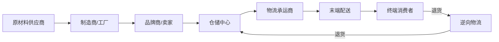
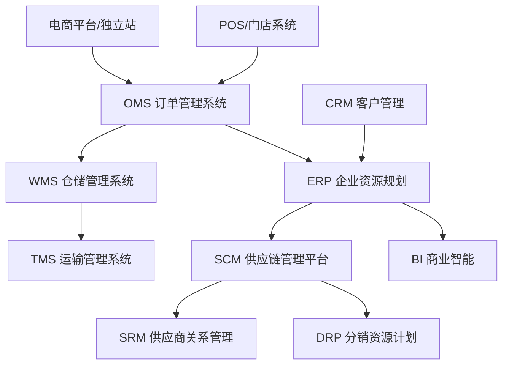

## 五、供应链管理理论

供应链管理（Supply Chain Management, SCM）是电商与跨境电商运营的底层基础设施。它决定了商品从原材料到最终消费者手中的全链路效率、成本和体验。对于电商从业者而言，理解供应链管理理论不是"加分项"，而是决定生死存亡的核心能力——库存积压拖垮现金流、物流延迟导致差评、供应商断货造成销售中断，这些问题的根源都在供应链。

### 1. 供应链管理的核心概念

#### 1.1 什么是供应链

供应链是指从原材料采购、生产制造、仓储物流到最终交付给消费者的全链条网络。它不仅包含企业内部的采购、生产、销售环节，还延伸到上游的供应商、供应商的供应商，以及下游的分销商、零售商和终端消费者。

#### 1.2 电商供应链 vs 传统供应链

传统供应链以"推式"（Push）为主——根据预测批量生产，层层分销。电商供应链则以"拉式"（Pull）为核心——以消费者需求驱动采购和生产，追求快速响应。

| 维度 | 传统供应链 | 电商供应链 |
|------|-----------|-----------|
| 驱动模式 | 预测驱动（推式） | 需求驱动（拉式） |
| 库存策略 | 渠道多级备货 | 中心仓/前置仓集中备货 |
| 响应速度 | 周/月级 | 天/小时级 |
| 信息流 | 层层传递，失真严重 | 平台实时同步，牛鞭效应小 |
| 消费者触达 | 间接（经经销商） | 直接（DTC模式） |
| 退货管理 | 渠道各自处理 | 统一逆向物流体系 |
| 核心指标 | 库存周转率、产能利用率 | 履约时效、现货率、退货率 |

#### 1.3 跨境电商供应链的特殊性

跨境电商的供应链比国内电商更长、更复杂，涉及海关清关、跨境物流、汇率波动、多国合规等额外环节：

- **链路更长**：国内电商平均2-3天到货，跨境电商7-30天（海外仓可缩短至2-5天）
- **合规更复杂**：不同国家的进口关税、产品认证（CE/FCC/FDA）、知识产权法规各不相同
- **资金周转更慢**：跨境结算周期长（PayPal 21天、亚马逊14天），加上物流时间，资金占用可达60-90天
- **风险更高**：汇率波动、国际物流丢件/破损、目的国政策突变（如关税调整）

### 2. 供应链管理的五大核心理论

#### 2.1 牛鞭效应（Bullwhip Effect）

牛鞭效应是供应链管理中最经典的理论之一。它描述了需求信息在供应链中从下游向上游传递时，波动幅度逐级放大的现象——就像甩牛鞭一样，手腕的轻微抖动在鞭梢会变成剧烈摆动。

**产生原因：**

1. **需求预测误差**：每一级都基于下游订单（而非真实需求）做预测，误差层层叠加
2. **批量订购**：为降低物流成本，每一级倾向于凑整批量下单
3. **价格波动**：促销/囤货行为导致订单量与真实需求脱节
4. **配给与短缺博弈**：预期缺货时，下游会超额下单（如疫情期间的口罩抢购）

**在电商中的表现：**

某爆款商品在平台上日销100件，由于促销活动突然涨到500件。卖家紧急向工厂追加订单2000件，工厂为凑产能又多采购了5000件原材料。促销结束后销量回落到120件，但上游已经堆积了大量库存。

**应对策略：**

- **信息共享**：通过ERP/WMS系统让供应链各环节共享实时销售数据
- **缩短供应链层级**：DTC模式直接连接工厂和消费者，减少中间环节
- **VMI（供应商管理库存）**：让供应商根据实时销售数据自主补货
- **小批量多频次采购**：牺牲少量物流成本换取库存风险降低

#### 2.2 长鞭效应与需求感知（Demand Sensing）

传统需求预测依赖历史数据和统计模型（如移动平均法、指数平滑法），但电商环境下消费者行为变化极快，历史数据的参考价值在降低。需求感知（Demand Sensing）理论强调利用实时数据信号来捕捉短期需求变化：

- **搜索数据**：平台搜索热词趋势（如"防晒衣"在4月搜索量飙升）
- **社交媒体信号**：小红书/抖音/TikTok的种草内容引爆消费趋势
- **竞品动态**：竞争对手的定价、促销、库存变化
- **天气/节假日/大促日历**：季节性需求波动的规律
- **实时销售流速**：过去24/72小时的出单速度变化

**实操建议**：建立"需求信号看板"，将上述数据源接入BI系统（如Tableau、Power BI或简单的飞书多维表格），设置阈值预警——当某个SKU的日销速变化超过±30%时自动触发采购评审。

#### 2.3 推拉结合策略（Push-Pull Boundary）

纯粹的推式或拉式供应链都有缺陷：推式容易造成库存积压，拉式容易导致缺货。推拉结合策略的核心是找到供应链中的"解耦点"（Decoupling Point），在解耦点之前用推式策略（基于预测备货），在解耦点之后用拉式策略（基于订单驱动）。

**电商中常见的推拉边界位置：**

| 策略 | 推式终点 | 拉式起点 | 适用场景 | 典型案例 |
|------|---------|---------|---------|---------|
| 纯推式 | 成品仓 | 消费者 | 标品、需求稳定 | 日用百货、纸巾 |
| 成品+MTO | 成品仓少量备货 | 收单后发货 | 需求有一定波动 | 服装基础款 |
| MTO（按单生产） | 半成品 | 收单后组装/定制 | 高个性化需求 | 定制礼品、3C配件定制 |
| 延迟策略（Postponement） | 通用半成品 | 最后环节差异化 | 多SKU、需求不确定 | 服装印字、电子产品刻字 |
| 纯拉式 | 原材料 | 收单后全流程 | 极低频、超高价值 | 奢侈品定制 |

**跨境电商的推拉策略**：由于跨境物流周期长（海运30-45天），通常在海外仓采用推式策略——根据销售预测提前备货至海外仓；而在最后一公里配送采用拉式——消费者下单后从最近的海外仓发货。

#### 2.4 供应链协同理论（Supply Chain Collaboration）

供应链协同强调链上各参与方通过信息共享、联合计划和利益分配机制，实现整体最优而非局部最优。

**协同的三个层次：**

1. **信息协同**：共享需求预测、库存水平、生产计划等基础数据
   - 工具：EDI（电子数据交换）、API对接、平台开放数据
   - 实例：亚马逊的Vendor Central让供应商直接查看销售数据和补货建议

2. **计划协同**：联合需求预测、联合库存计划（JMI）、协同补货计划
   - 实例：SHEIN与数百家面辅料供应商建立协同系统，新款从设计到上架仅需7天

3. **执行协同**：联合物流、共享仓储、协同配送
   - 实例：菜鸟网络的"智能供应链大脑"连接商家、仓储和物流合作伙伴

**实施条件**：供应链协同需要三个基础——信任关系、利益分配机制、IT系统支撑。没有利益分配机制的协同注定失败，因为参与方缺乏动力。

#### 2.5 精益供应链与敏捷供应链

精益供应链（Lean Supply Chain）和敏捷供应链（Agile Supply Chain）是两种截然不同的供应链哲学，适用于不同的产品特性：

| 维度 | 精益供应链 | 敏捷供应链 |
|------|-----------|-----------|
| 核心目标 | 消除浪费、降低成本 | 快速响应、灵活应变 |
| 适用产品 | 功能性产品（需求稳定、生命周期长） | 创新性产品（需求波动大、生命周期短） |
| 库存策略 | 最小化库存（JIT） | 战略性缓冲库存 |
| 供应商选择 | 成本优先，长期合作 | 能力优先，快速切换 |
| 生产模式 | 大批量、少品种 | 小批量、多品种 |
| 物流策略 | 成本最低（海运、集货） | 速度最快（空运、直发） |
| 典型品类 | 日用品、基础服装、3C标品 | 时尚服装、节日商品、网红爆款 |

**混合策略**：现实中大多数电商企业需要同时具备精益和敏捷能力。常见的做法是用"基础款+时尚款"的产品组合——基础款走精益供应链（成本最优），时尚款走敏捷供应链（响应最快）。SHEIN的成功正是这种混合策略的典型：基础面料和辅料采用精益采购（大批量低价），成衣生产采用敏捷模式（小单快反，首单100-200件测试市场反应）。

### 3. 电商供应链的核心模块

#### 3.1 采购管理

采购是供应链的起点，直接影响产品成本、质量和交付能力。

**供应商评估维度：**

- **QCDS模型**：质量（Quality）、成本（Cost）、交付（Delivery）、服务（Service）
- **财务健康度**：供应商的现金流、负债率，避免因供应商倒闭断供
- **产能弹性**：能否应对旺季2-3倍的产能需求
- **合规资质**：ISO认证、行业特殊认证（如食品SC认证、电子产品3C认证）

**采购策略矩阵：**

| 品类特征 | 采购策略 | 供应商关系 | 库存策略 |
|---------|---------|-----------|---------|
| 高价值+高风险（瓶颈品） | 多源采购，确保供应安全 | 战略合作+备选方案 | 保持安全库存 |
| 高价值+低风险（杠杆品） | 集中采购，利用量换价 | 竞争性谈判 | 按需补货 |
| 低价值+高风险（关键品） | 长期合同锁定供应 | 深度合作，信息共享 | 战略储备 |
| 低价值+低风险（常规品） | 简化流程，自动化采购 | 标准化合作 | JIT/低库存 |

**跨境采购的额外考量**：

- **关税优化**：利用FTA（自由贸易协定）降低关税成本，如RCEP成员国之间的关税减免
- **汇率对冲**：大额采购使用远期外汇合约锁定汇率
- **最小起订量（MOQ）**：与供应商谈判降低MOQ，或通过拼柜/拼柜降低成本
- **验厂与品质管控**：跨境采购无法频繁到厂检查，需要建立远程QC体系（第三方验货+视频验厂）

#### 3.2 库存管理

库存管理是电商供应链中最直接影响现金流和利润的环节。

**核心库存指标：**

- **库存周转率** = 年销售成本 / 平均库存金额。电商行业健康值：6-12次/年
- **库存周转天数** = 365 / 库存周转率。越短越好，滞销风险越低
- **现货率（In-Stock Rate）** = 有货SKU数 / 在售SKU数。目标>95%
- **库销比** = 库存金额 / 月销售额。健康值：1.5-3个月
- **滞销率** = 超过90天未动销的SKU占比。目标<10%

**安全库存计算公式：**

安全库存 = Z × σ × √L

其中：
- Z = 服务水平对应的标准正态分位数（95%服务水平→Z=1.65，99%→Z=2.33）
- σ = 日需求量的标准差
- L = 补货提前期（天数）

**实例**：某SKU日均销售50件，日需求标准差15件，补货提前期7天，要求95%服务水平：
安全库存 = 1.65 × 15 × √7 ≈ 65件

**ABC-XYZ分类法：**

将SKU按销售额贡献（ABC）和需求波动性（XYZ）交叉分类，制定差异化库存策略：

| | X（需求稳定） | Y（需求有波动） | Z（需求不规律） |
|---|---|---|---|
| **A（高销售额）** | 自动补货，低安全库存 | 自动补货，中等安全库存 | 高安全库存，密切关注 |
| **B（中销售额）** | 定期审查补货 | 需求预测+人工审核 | 按单采购/最小库存 |
| **C（低销售额）** | 简化管理 | 考虑是否下架 | 考虑下架或清仓 |

#### 3.3 仓储管理

**仓储模式选择：**

| 模式 | 优势 | 劣势 | 适用场景 |
|------|------|------|---------|
| 自建仓 | 完全可控、定制化强 | 投资大、运营成本高 | 日单量>5000单，SKU稳定 |
| 第三方仓（3PL） | 灵活、启动快 | 可控性较弱、定制化受限 | 中小卖家、起步阶段 |
| FBA/平台仓 | 平台流量加权、配送快 | 成本高、库容限制 | 亚马逊卖家、平台大卖家 |
| 海外仓 | 本地配送体验、降低退货成本 | 库存风险高、管理难度大 | 跨境电商成熟卖家 |
| 虚拟仓（Dropshipping） | 零库存、零仓储成本 | 利润薄、体验难控 | 跨境新手测品阶段 |

**仓库布局与动线设计原则**：

- **高频SKU靠近出货口**：根据销售数据将畅销品放置在离打包台最近的货位
- **分区管理**：按品类/尺寸/温度要求分区，避免混乱
- **动线优化**：拣货路径最短化（S型或回型动线），减少拣货员无效行走
- **波次拣货**：将多个订单合并为一个波次，批量拣货后分播，提升效率

#### 3.4 物流与配送

**国内电商物流模式：**

- **快递**：适合小件商品（<30kg），时效1-3天，成本3-8元/件
- **快运/零担**：适合中大件（30-500kg），时效2-5天，成本按重量/体积计费
- **整车/专线**：适合大批量（>500kg），时效稳定，成本最低
- **即时配送**：同城2小时达，适合生鲜、药品等时效敏感品类

**跨境电商物流模式：**

| 模式 | 时效 | 成本 | 适用场景 |
|------|------|------|---------|
| 国际快递（DHL/UPS/FedEx） | 3-7天 | 最高（>50元/kg） | 高价值、时效敏感 |
| 专线物流 | 7-15天 | 中等（20-40元/kg） | 中等价值、常规时效 |
| 海外仓发货 | 2-5天 | 含头程+仓储+尾程 | 量大、需求稳定的爆款 |
| 海运+海外仓 | 30-45天（头程） | 最低（5-10元/kg） | 大批量、非紧急 |
| 邮政小包 | 15-30天 | 最低（5-15元/件） | 低价值、轻小件 |
| 中欧班列 | 15-20天 | 中等偏低 | 中亚/欧洲市场 |

**物流成本优化策略**：

1. **多仓分仓**：根据销售数据在不同区域布局仓库，缩短配送距离
2. **包装优化**：在保护商品的前提下减小包裹体积，降低体积重计费
3. **集中发货**：将零散订单集中为批量发货，享受阶梯运费折扣
4. **物流商比价**：同时接入多家物流商，按线路/重量自动匹配最优方案
5. **逆向物流设计**：提前规划退货流程，本地化退货处理降低回程成本

#### 3.5 逆向物流（退货管理）

电商退货率远高于线下零售。国内电商平均退货率约10-15%，服装品类可达30-40%；跨境电商退货率更高（15-30%），且退货物流成本是国内的5-10倍。

**逆向物流体系建设**：

- **退货原因分析**：建立退货原因分类体系（质量问题/尺码不符/描述不符/不喜欢/物流损坏），定位根因并针对性改进
- **退货流程标准化**：线上申请→审核→寄回→质检→入库/报废→退款，每个环节设定SLA
- **跨境退货解决方案**：
  - 海外设退货地址（使用海外仓或第三方退货服务商）
  - 退货不退回（低价处理或捐赠，适合低价值商品）
  - 部分退款（协商部分退款，商品由买家保留）
  - 本地翻新转售（退货商品在目的国翻新后二次销售）

### 4. 供应链数字化工具体系

#### 4.1 核心系统架构

#### 4.2 各系统功能与选型

**ERP系统**：供应链的中枢大脑，整合采购、库存、财务、销售数据。

| 系统 | 适用规模 | 特点 | 参考价格 |
|------|---------|------|---------|
| 旺店通/聚水潭 | 中小电商 | 国内电商适配好，对接主流平台 | 3000-20000元/年 |
| 马帮/通途 | 跨境电商 | 多平台多站点管理 | 5000-30000元/年 |
| SAP Business One | 中大型企业 | 功能全面，行业标准 | 10万+/年 |
| Oracle NetSuite | 中大型跨境 | 云端ERP，全球化能力强 | 15万+/年 |
| 用友/金蝶 | 国内中大型 | 本土化财务合规好 | 5万-50万/年 |

**WMS仓储系统**：

- 小型仓库（<1000㎡）：旺店通WMS、聚水潭内置WMS
- 中型仓库（1000-5000㎡）：唯智WMS、富勒WMS
- 大型仓库（>5000㎡）：Manhattan Associates、Blue Yonder、SAP EWM

**TMS运输管理系统**：

- 国内：快递鸟（聚合查询）、菜鸟物流平台、快递100
- 跨境：4PX递四方、云途物流、燕文物流

#### 4.3 数据驱动的供应链决策

**关键数据看板应包含**：

1. **库存健康度看板**：各仓库存分布、库龄结构（0-30天/31-60天/61-90天/>90天）、滞销SKU列表
2. **补货建议看板**：各SKU库存水位、预计断货日期、建议补货量、补货成本预估
3. **物流时效看板**：各物流商/线路的平均签收时长、妥投率、异常率
4. **采购成本看板**：各品类采购单价趋势、供应商价格对比、汇率影响

### 5. 供应链风险管理

#### 5.1 风险分类

| 风险类型 | 具体表现 | 发生概率 | 影响程度 |
|---------|---------|---------|---------|
| 供应风险 | 供应商断供、原材料涨价、质量问题 | 中 | 高 |
| 需求风险 | 预测偏差、市场突变、竞品冲击 | 高 | 中-高 |
| 物流风险 | 延迟、丢件、破损、港口拥堵 | 中 | 中 |
| 合规风险 | 关税政策变化、产品认证失效、知识产权纠纷 | 低-中 | 高 |
| 资金风险 | 汇率波动、回款延迟、坏账 | 中 | 中-高 |
| 不可抗力 | 疫情、自然灾害、战争、罢工 | 低 | 极高 |

#### 5.2 风险应对策略

**供应端**：

- **多源采购**：核心SKU至少2-3个供应商，避免单点依赖
- **战略备货**：对长交期、高风险物料保持30-60天安全库存
- **供应商关系维护**：定期沟通、及时付款、共同发展，建立信任
- **替代方案预研**：提前评估备选供应商和替代材料

**需求端**：

- **需求预测模型**：结合历史数据、趋势分析、外部信号的多模型预测
- **柔性供应链**：小批量多频次采购，缩短反应周期
- **库存缓冲**：对核心SKU设置安全库存，对新品采用预售/众筹模式测试需求

**物流端**：

- **多物流商备份**：至少接入2-3家物流商，出现异常时快速切换
- **物流保险**：高价值商品投保货运险
- **提前发货**：大促/旺季提前30-45天备货至目的国仓库

### 6. 典型案例分析

#### 6.1 SHEIN：小单快反的极致敏捷供应链

SHEIN的供应链模式是电商行业最具颠覆性的创新之一：

- **核心逻辑**：每日上新数千款→首单每款100-200件→测试市场反应→72小时内追加爆款→快速淘汰滞销款
- **供应链支撑**：在广州番禺整合数百家小型制衣厂，通过数字化系统（MES+ERP）实时下达和追踪订单
- **需求感知**：爬取Google Trends、社交媒体、竞品网站的时尚趋势数据，辅助选款
- **库存效率**：平均库存周转天数约30天（ZARA约85天），滞销率极低
- **关键数据**：2023年GMV约300亿美元，SKU动销率>95%（行业平均60-70%）

**可借鉴之处**：小单快反模式的核心不是"小单"本身，而是背后的数字化供应链协同能力。没有实时的需求数据和柔性生产能力，小单只会变成高成本陷阱。

#### 6.2 亚马逊FBA：平台型供应链基础设施

亚马逊通过FBA（Fulfillment by Amazon）构建了全球最大的电商供应链基础设施：

- **分布式仓储网络**：美国110+个履约中心，覆盖98%地区次日达
- **库存智能分配**：根据历史销售数据，自动将库存分配到离消费者最近的仓库
- **供应链金融服务**：Amazon Lending为卖家提供采购资金贷款
- **库存绩效指标（IPI）**：评分低于400限制库容，倒逼卖家优化库存管理
- **卫星仓（AWD）**：卖家先将货物发至亚马逊入仓分销中心，再由亚马逊自动补货至各FBA仓库

**卖家应对策略**：FBA并非万能，需要精细化管理——长期仓储费（>365天库存每件收$6.90/立方英尺）、库容限制、入库延迟等问题都需要提前规划。

#### 6.3 Temu与全托管模式

Temu的全托管模式重新定义了平台与卖家的供应链关系：

- **卖家角色**：仅负责供货（将商品发至Temu国内仓），不参与定价、运营、物流
- **平台角色**：负责定价、营销、跨境物流、售后全流程
- **供应链优势**：平台集中采购物流服务，摊薄成本；统一品控标准，降低退货率
- **卖家影响**：利润空间被压缩（平台定价），但运营门槛极低，适合工厂型卖家

### 7. 常见误区与纠正

| 误区 | 真相 | 纠正方法 |
|------|------|---------|
| 供应链管理=物流管理 | 供应链包含采购、生产、仓储、物流、信息流、资金流六大要素 | 建立全链路思维，不局限于物流环节 |
| 库存越多越安全 | 过多库存占用资金、增加滞销风险、提高仓储成本 | 用数据驱动补货决策，设定合理安全库存 |
| 供应商越便宜越好 | 低价可能意味着质量差、交期不稳定、售后无保障 | 用QCDS综合评估，而非唯价格论 |
| 跨境只要选对物流就行 | 跨境供应链涉及选品合规、关税优化、本地化售后等系统工程 | 从全链路视角规划跨境供应链 |
| 等爆单了再优化供应链 | 爆单后供应链问题会集中爆发（断货、发不出货、品控失控） | 在日常运营中持续优化供应链能力 |
| 用了ERP就是数字化了 | 工具只是载体，数据治理和决策逻辑才是核心 | 先理清业务流程和数据标准，再选型工具 |

### 8. 进阶：供应链金融

供应链金融是将供应链上的真实贸易数据转化为融资能力的金融模式，对于资金紧张的电商卖家尤为重要：

**主要模式**：

- **应收账款融资**：基于平台应收账款（如亚马逊回款）获得贷款
- **库存融资**：以在库商品作为质押获得融资（需第三方仓储监管）
- **预付款融资**：基于采购订单获得预付款融资，解决大额采购资金需求
- **信用融资**：基于平台经营数据（店铺评分、销售额、退货率）获得无抵押信用贷款

**实操渠道**：

- **平台金融**：亚马逊贷款（Amazon Lending）、蚂蚁金服（花呗/网商贷）、京东京保贝
- **银行供应链金融**：建设银行"e信通"、招商银行"闪电贷"
- **第三方供应链金融**：怡亚通、飞马国际、菜鸟供应链金融

**关键提醒**：供应链金融的核心是"真实贸易背景"，融资资金必须用于采购和经营，切勿挪作他用。过度融资会导致债务链断裂，一旦销售不及预期，还款压力会迅速传导至整个供应链。
