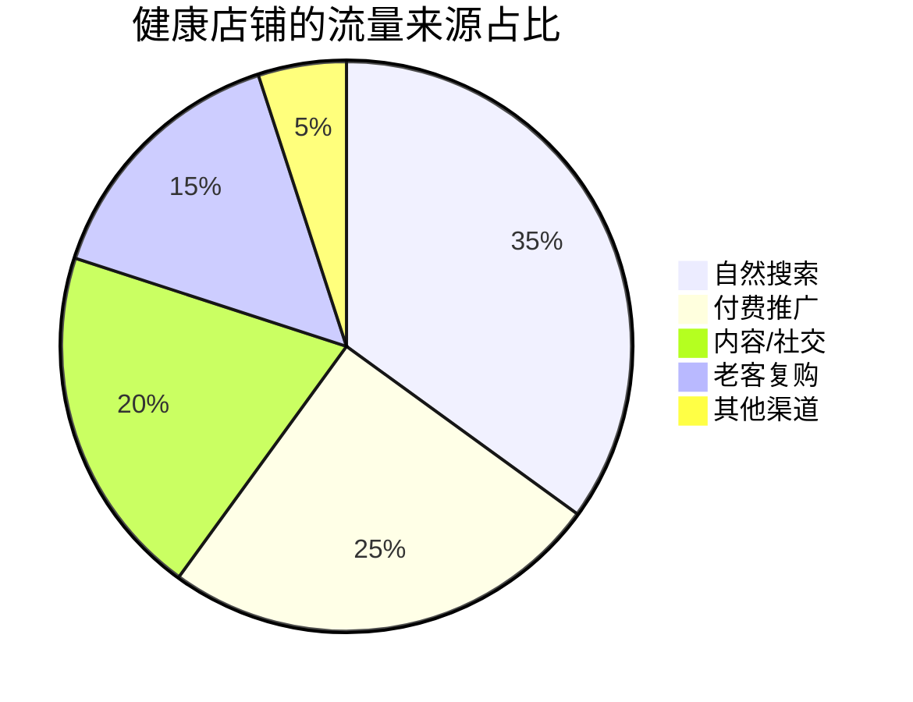
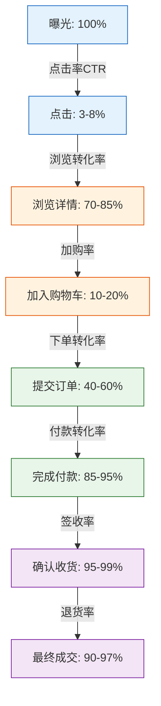
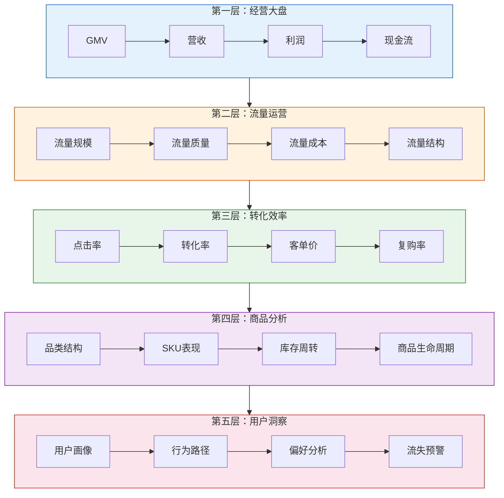
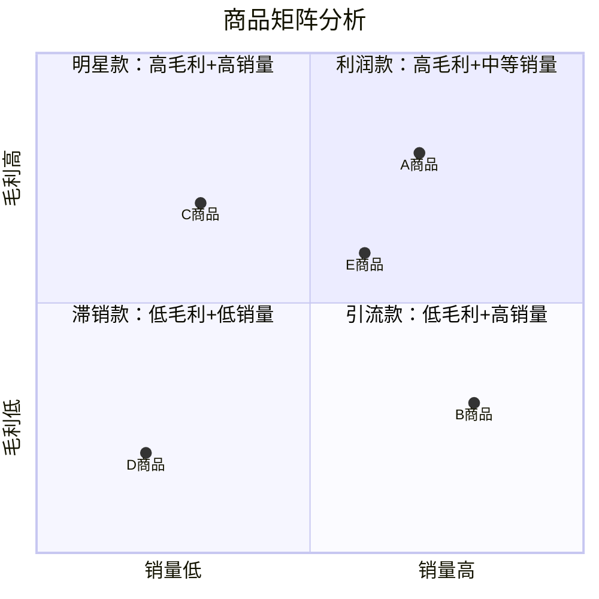
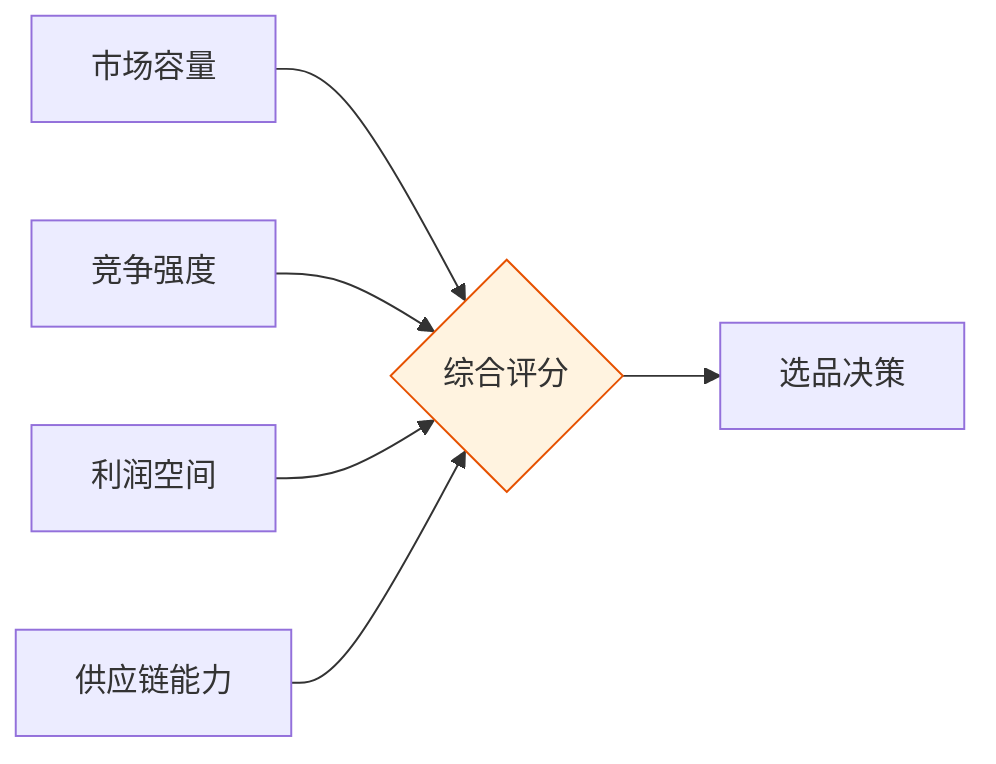
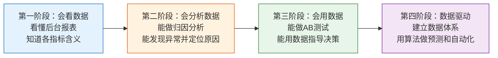

## 六、电商的数据分析框架

数据分析是电商运营的"神经系统"——没有数据支撑的运营决策，本质上就是在赌博。本节将构建一个完整的电商数据分析框架，从底层逻辑到实操方法，帮助你建立系统化的数据思维。

### 6.1 为什么数据分析是电商的生命线

#### 6.1.1 从经验驱动到数据驱动的范式转变

传统零售依赖"老师傅"的经验：什么货好卖、什么时候打折、陈列怎么摆。电商环境完全不同——流量碎片化、竞争白热化、用户行为数字化，靠直觉做决策的容错空间极小。

**数据驱动 vs 经验驱动的对比：**

| 维度 | 经验驱动 | 数据驱动 |
|------|----------|----------|
| 选品 | "我觉得这个好卖" | 基于搜索量、转化率、竞品数据选品 |
| 定价 | 成本加成，拍脑袋定 | 竞品价格带分析 + 价格弹性测试 |
| 推广 | 广撒网，看天吃饭 | ROI追踪，精准投放 |
| 库存 | 多备点总没错 | 销量预测，动态补货 |
| 优化 | 凭感觉调整 | A/B测试，数据验证 |
| 风险 | 出了问题才知道 | 预警指标提前发现 |

#### 6.1.2 数据分析的三个层次

```mermaid
pyramid
    title 电商数据分析金字塔
    "预测性分析: 会怎样？" : 10
    "诊断性分析: 为什么？" : 25
    "描述性分析: 发生了什么？" : 65
```

**第一层：描述性分析（Descriptive Analytics）**——回答"发生了什么"
- 昨天的销售额是多少？
- 哪个SKU卖得最好？
- 退款率是多少？

**第二层：诊断性分析（Diagnostic Analytics）**——回答"为什么发生"
- 销售额下降是因为流量少了还是转化率低了？
- 某个SKU转化率低是详情页问题还是价格问题？
- 退款率上升是产品质量还是物流问题？

**第三层：预测性分析（Predictive Analytics）**——回答"会怎样"
- 下个月的销量预测是多少？
- 这个产品还有多长的生命周期？
- 竞品降价会带来多大影响？

大多数电商卖家停留在第一层，能做好第二层的已经超越80%的竞争者，做到第三层的则可以用算法和模型建立系统性优势。

### 6.2 电商核心数据指标体系

#### 6.2.1 流量指标

流量是电商的"客流量"，是一切转化的起点。

**核心流量指标及计算公式：**

| 指标 | 公式 | 健康基准 | 说明 |
|------|------|----------|------|
| UV（独立访客数） | 去重后的访问用户数 | 视品类而定 | 真实触达用户规模 |
| PV（页面浏览量） | 所有页面的总访问次数 | UV的2-5倍 | 用户浏览深度的参考 |
| 访问深度 | PV / UV | 2-5页 | 越高说明用户兴趣越浓 |
| 跳失率 | 只浏览1页就离开的UV / 总UV | <50% | 越低越好，说明详情页吸引力强 |
| 流量来源占比 | 各渠道UV / 总UV | 健康分布见下文 | 依赖单一渠道是高风险 |
| 新客占比 | 新访客UV / 总UV | 30%-60% | 过低说明拉新不足，过高说明留存差 |
| 客户获取成本(CAC) | 推广总花费 / 新客户数 | <客单价×3 | 越低越好，需控制在LTV可覆盖范围 |

**健康的流量来源分布参考：**



如果付费推广占比超过60%，说明店铺对广告的依赖度过高，一旦停止投放，销量就会断崖式下跌。

#### 6.2.2 转化指标

转化率是电商运营效率的核心体现。

**转化漏斗各层级指标：**



**各转化指标详解：**

**点击率（CTR, Click-Through Rate）**
- 公式：点击次数 / 曝光次数 × 100%
- 搜索场景基准：3%-8%（视品类）
- 推荐场景基准：1%-3%
- 影响因素：主图质量、标题相关性、价格标签、销量标签、活动标签
- 优化方向：主图差异化设计、标题关键词精准匹配、价格竞争力

**加购率（Add-to-Cart Rate）**
- 公式：加购人数 / 详情页访客数 × 100%
- 健康基准：10%-20%
- 影响因素：详情页说服力、价格合理性、赠品策略、紧迫感营造
- 优化方向：详情页卖点重构、价格锚点设置、限时限量策略

**下单转化率（Order Conversion Rate）**
- 公式：下单人数 / 加购人数 × 100%
- 健康基准：40%-60%
- 影响因素：运费政策、支付方式、优惠券、信任感
- 优化方向：满减包邮、多支付方式、信任背书

**付款率（Payment Rate）**
- 公式：付款人数 / 下单人数 × 100%
- 健康基准：85%-95%
- 影响因素：支付体验、价格犹豫、比价行为
- 优化方向：催付机制、限时优惠、简化支付流程

#### 6.2.3 营收指标

**核心营收指标：**

| 指标 | 公式 | 说明 |
|------|------|------|
| GMV（总成交额） | ∑(商品单价 × 销售数量) | 含退货、未付款订单的总额 |
| 实际营收 | GMV - 退款金额 - 未付款金额 | 真实到账的营收 |
| 客单价(AOV) | 总营收 / 订单数 | 单笔订单的平均金额 |
| 连带率 | 销售件数 / 成交笔数 | 每笔订单平均购买件数 |
| UV价值 | 总营收 / 总UV | 每个访客带来的平均营收 |
| 付费UV价值 | 总营收 / 付费UV | 每个付费流量访客的价值 |

**客单价提升的四个杠杆：**

1. **组合销售**：将互补商品打包，如洗面奶+水+乳套装
2. **满减门槛**：设置略高于平均客单价的满减门槛，如客单价80元设满99减10
3. **关联推荐**：在详情页推荐搭配商品，如手机壳+钢化膜
4. **升级销售**：推荐更高价位的替代品，如普通版→豪华版

#### 6.2.4 客户价值指标

**客户生命周期价值（LTV, Lifetime Value）**

LTV是衡量客户长期价值的终极指标，计算公式：

```text
LTV = 客单价 × 购买频次 × 客户生命周期 × 毛利率
```

简化版本（适合快速估算）：
```text
月度LTV = 月均消费金额 × 月均购买次数 × 毛利率
```

**LTV与CAC的关系是电商盈利的核心公式：**

| LTV/CAC比值 | 含义 | 行动建议 |
|-------------|------|----------|
| < 1 | 亏损经营，每获取一个客户就亏钱 | 立即降低获客成本或提高客单价 |
| 1-3 | 微利或盈亏平衡 | 优化转化率和复购率 |
| 3-5 | 健康盈利 | 可以适度扩大投放规模 |
| > 5 | 高利润但可能过于保守 | 可能错过了增长机会，考虑加大投入 |

**RFM模型——客户分层的黄金标准：**

RFM模型通过三个维度将客户分为8个层级：

- **R（Recency）**：最近一次消费时间，越近价值越高
- **F（Frequency）**：消费频率，越频繁越忠诚
- **M（Monetary）**：消费金额，越高越有价值

| 客户类型 | R | F | M | 运营策略 |
|----------|---|---|---|----------|
| 重要价值客户 | 高 | 高 | 高 | VIP维护，专属权益，新品优先 |
| 重要发展客户 | 高 | 低 | 高 | 提高复购频次，会员激励 |
| 重要保持客户 | 低 | 高 | 高 | 召回流失，发放专属优惠券 |
| 重要挽留客户 | 低 | 低 | 高 | 大力度召回，了解流失原因 |
| 一般价值客户 | 高 | 高 | 低 | 提高客单价，推荐高毛利商品 |
| 一般发展客户 | 高 | 低 | 低 | 培养购物习惯，新手引导 |
| 一般保持客户 | 低 | 高 | 低 | 适度召回，低成本维护 |
| 一般挽留客户 | 低 | 低 | 低 | 低成本触达或放弃 |

### 6.3 电商数据分析的五层框架

#### 6.3.1 框架总览



#### 6.3.2 第一层：经营大盘分析

经营大盘是老板和运营负责人每天必看的数据，核心是回答"今天生意怎么样"。

**日报核心指标模板：**

| 指标 | 今日 | 昨日 | 环比 | 上周同期 | 同比 |
|------|------|------|------|----------|------|
| GMV | - | - | -% | -% | -% |
| 订单量 | - | - | -% | -% | -% |
| 客单价 | - | - | -% | -% | -% |
| UV | - | - | -% | -% | -% |
| 转化率 | - | - | -% | -% | -% |
| 付费ROI | - | - | -% | -% | -% |
| 退款率 | - | - | -% | -% | -% |

**关键分析动作：**

1. **异常波动检测**：任何指标日环比变化超过±15%，必须立即排查原因
2. **归因分析**：销售额变化拆解为 流量变化 × 转化率变化 × 客单价变化
3. **目标达成率**：月度/季度目标的进度追踪

**销售额变动的三级归因法：**

```text
销售额 = UV × 转化率 × 客单价

示例：
昨日销售额 = 10000 UV × 3% 转化率 × 100元客单价 = 30,000元
今日销售额 = 12000 UV × 2.5% 转化率 × 105元客单价 = 31,500元

拆解：
- 流量贡献：(12000-10000) × 3% × 100 = +6,000元
- 转化率贡献：12000 × (2.5%-3%) × 100 = -6,000元
- 客单价贡献：12000 × 2.5% × (105-100) = +1,500元
- 总变动：+6,000 - 6,000 + 1,500 = +1,500元 ✓

结论：流量和客单价拉升了营收，但转化率下降抵消了大部分增长。
需要进一步排查转化率下降的原因。
```

#### 6.3.3 第二层：流量运营分析

**流量质量评估矩阵：**

| 流量渠道 | UV | 转化率 | 客单价 | UV价值 | ROI | 判定 |
|----------|-----|--------|--------|--------|-----|------|
| 自然搜索 | 高 | 高 | 中 | 高 | ∞ | 核心渠道，持续优化SEO |
| 直通车 | 中 | 中 | 中 | 中 | 3-5 | 稳定投放，优化关键词 |
| 超级推荐 | 高 | 低 | 低 | 低 | 1-3 | 扩大曝光用，控制预算 |
| 直播 | 高 | 中 | 低 | 中 | 2-4 | 内容引流，配合促销 |
| 内容种草 | 中 | 高 | 高 | 高 | 长期 | 品牌建设，长期投入 |
| 短视频 | 高 | 低 | 低 | 低 | 1-2 | 曝光为主，转化待提升 |

**流量结构健康度诊断：**

- 自然流量占比 < 30%：SEO和内容运营薄弱，过度依赖付费
- 付费流量占比 > 60%：广告依赖症，一旦停止投放销量暴跌
- 单一渠道占比 > 50%：渠道集中风险，需要分散布局
- 新客占比 > 80%：拉新成本高，老客运营缺失
- 老客占比 > 70%：增长见顶，需要加大拉新投入

#### 6.3.4 第三层：转化效率分析

**转化率诊断的"漏斗排查法"：**

当转化率异常下降时，按漏斗从上到下逐层排查：

1. **曝光→点击（CTR下降）**：
   - 检查主图是否有被竞品比下去
   - 标题关键词是否与用户搜索意图匹配
   - 价格标签是否有竞争力
   - 是否有差评标签影响点击

2. **点击→浏览（跳失率上升）**：
   - 首屏是否在3秒内传达核心卖点
   - 价格是否与主图展示一致（避免货不对板）
   - 详情页加载速度是否正常
   - 移动端适配是否良好

3. **浏览→加购（加购率下降）**：
   - 详情页说服力是否足够
   - 价格是否有竞争力
   - 促销活动是否醒目
   - 买家评价和问大家是否正面

4. **加购→下单（下单率下降）**：
   - 是否有运费门槛阻碍下单
   - 优惠券/满减是否容易理解和使用
   - 库存是否充足（预售影响转化）
   - 发货时效是否明确

5. **下单→付款（付款率下降）**：
   - 支付方式是否齐全
   - 是否有催付机制
   - 价格是否在付款前突然变动
   - 是否存在竞争对手低价截流

#### 6.3.5 第四层：商品分析

**商品矩阵分析（波士顿矩阵变体）：**



**四类商品的角色定位：**

| 类型 | 特征 | 运营策略 | 占比建议 |
|------|------|----------|----------|
| 引流款 | 低毛利、高销量 | 吸引流量，带动其他商品销售 | 20-30% |
| 利润款 | 高毛利、中等销量 | 核心盈利来源，重点推广 | 40-50% |
| 形象款 | 高价格、低销量 | 提升店铺调性，拉高价格锚点 | 10-15% |
| 活动款 | 低毛利、冲量 | 大促专用，清库存 | 10-20% |

**SKU健康度评估：**

```text
SKU贡献率 = 单SKU销售额 / 总销售额 × 100%

健康分布（长尾理论）：
- Top 10% SKU 贡献 50-60% 营收（头部效应正常）
- Top 30% SKU 贡献 80-85% 营收
- 长尾70% SKU 贡献 15-20% 营收

异常信号：
- Top 1 SKU 贡献 > 40%：过度依赖单一爆款，风险高
- Top 10% SKU 贡献 < 30%：缺乏爆款，产品力不足
- 长尾SKU贡献 < 5%：SKU过多但动销率低，需要精简
```

**库存周转分析：**

| 指标 | 公式 | 健康基准 | 说明 |
|------|------|----------|------|
| 库存周转率 | 销售成本 / 平均库存金额 | 视品类，快消品>12次/年 | 越高说明库存效率越好 |
| 库存周转天数 | 365 / 库存周转率 | 快消品<30天 | 越短越好 |
| 售罄率 | 已售数量 / 总进货数量 | 季末>85% | 衡量商品是否卖得动 |
| 动销率 | 有销售的SKU数 / 总SKU数 | >70% | 越低说明滞销品越多 |
| 库龄分布 | 各库龄段库存占比 | 90天内>70% | 超龄库存需及时清仓 |

#### 6.3.6 第五层：用户行为分析

**用户行为路径分析：**

通过埋点数据还原用户的典型行为路径，找到优化机会。

**典型购买路径：**
```text
搜索关键词 → 浏览商品列表 → 点击商品 → 浏览详情页
→ 查看评价 → 加入购物车 → 对比其他商品 → 下单 → 付款
```

**路径断裂点分析方法：**

1. 通过热力图分析详情页的浏览深度
2. 通过漏斗分析定位转化流失的关键节点
3. 通过Session回放还原用户的真实行为
4. 通过问卷或评价分析流失原因

**用户分群与精细化运营：**

| 用户群体 | 定义 | 触达方式 | 转化策略 |
|----------|------|----------|----------|
| 潜在客户 | 浏览未加购 | 短信/推送再营销 | 展示销量和评价 |
| 加购未购买 | 有意向未下单 | 催拍/限时优惠 | 优惠券+紧迫感 |
| 首次购买 | 新客 | 7天内跟进 | 满意度调查+复购券 |
| 复购客户 | 2-3次购买 | 会员权益 | 专属折扣+新品推荐 |
| 高价值客户 | 高频高额购买 | 1对1服务 | VIP权益+新品优先体验 |
| 沉睡客户 | 30天+未购买 | 唤醒推送 | 大额优惠券+新品通知 |
| 流失客户 | 90天+未购买 | 短信+电话 | 最大力度优惠召回 |

### 6.4 数据分析工具与实操

#### 6.4.1 平台原生工具

**淘宝/天猫系：**
- **生意参谋**：最核心的数据工具，涵盖流量、转化、商品、客户全维度
  - 流量纵横：流量来源和去向分析
  - 品类罗盘：品类和SKU级别的深度分析
  - 客户画像：用户人群特征分析
  - 市场行情：行业大盘和竞品数据
  - 费用：标准版免费，专业版约9000元/年
- **万相台**：付费推广的数据分析和优化
- **达摩盘**：人群圈选和精准营销

**京东系：**
- **商智**：京东版生意参谋，功能类似
- **京准通**：京东广告投放和数据分析

**拼多多系：**
- **多多数据**：拼多多后台数据分析工具
- **多多情报通**：第三方竞品分析工具

**抖音电商：**
- **抖店罗盘**：抖音电商数据后台
- **巨量百应**：达人带货数据分析
- **巨量算数**：内容趋势和用户洞察

#### 6.4.2 第三方数据工具

| 工具 | 核心功能 | 适用场景 | 价格区间 |
|------|----------|----------|----------|
| 蝉妈妈 | 抖音电商数据 | 直播分析、达人筛选 | 免费-3万/年 |
| 生意参谋竞品版 | 淘系竞品深度分析 | 竞品监控、市场分析 | 约1.2万/年 |
| 店透视 | 多平台竞品数据 | 价格监控、销量追踪 | 几百-几千/年 |
| 知虾 | 跨境电商数据 | Shopee/Lazada选品 | 免费-数千/年 |
| Jungle Scout | 亚马逊数据 | 选品、竞品分析 | $29-84/月 |
| 卖家精灵 | 亚马逊中文数据 | 选品、关键词优化 | ¥300-3000/年 |
| 鲸参谋 | 多平台监控 | 竞品分析、市场趋势 | 免费-万元/年 |

#### 6.4.3 自建数据看板

当业务规模达到一定体量（月GMV > 50万），建议自建数据看板。

**技术方案选型：**

| 方案 | 适用阶段 | 优势 | 劣势 |
|------|----------|------|------|
| Excel/WPS | 起步期 | 零成本、灵活 | 容易出错、无法自动化 |
| 飞书多维表格 | 初创期 | 多人协作、自动化 | 功能有限 |
| Google Data Studio | 成长期 | 免费、可视化好 | 国内访问不稳定 |
| Metabase | 成熟期 | 开源免费、功能强 | 需要技术人员维护 |
| Tableau/PowerBI | 大型企业 | 功能最强大 | 成本高、学习曲线陡 |

**推荐的数据看板结构：**

```text
├── 经营日报（老板看板）
│   ├── 今日GMV/订单量/客单价（实时）
│   ├── 月度目标达成率
│   ├── TOP10商品销售排名
│   └── 异常指标预警
│
├── 流量运营看板（运营看板）
│   ├── 流量来源分布
│   ├── 各渠道ROI
│   ├── 关键词排名变化
│   └── 推广计划效果
│
├── 商品分析看板（商品看板）
│   ├── 品类销售结构
│   ├── SKU动销率
│   ├── 库存周转天数
│   └── 滞销预警
│
└── 客户分析看板（CRM看板）
    ├── 新老客占比
    ├── RFM客户分层
    ├── 复购率趋势
    └── 客户生命周期
```

### 6.5 数据分析实战方法论

#### 6.5.1 选品数据分析

选品是电商成功的起点，数据分析可以大幅降低选品失败率。

**选品四维评估模型：**



**市场容量评估：**

```text
数据来源：
- 淘宝搜索下拉词 + 生意参谋搜索分析
- 抖音巨量算数趋势
- 谷歌趋势（跨境选品）
- 亚马逊BSR排行榜

评估指标：
- 核心词月搜索量 > 10万（大品类）
- 核心词月搜索量 1-10万（中品类）
- 核心词月搜索量 < 1万（小众品类）
- 搜索趋势：近6个月是上升、平稳还是下降
```

**竞争强度评估：**

| 指标 | 低竞争 | 中竞争 | 高竞争 |
|------|--------|--------|--------|
| 搜索结果数 | < 1万 | 1-10万 | > 10万 |
| 头部卖家销量 | < 1000/月 | 1000-1万/月 | > 1万/月 |
| 头部卖家评价数 | < 500 | 500-5000 | > 5000 |
| 品牌集中度 | 无强势品牌 | 2-3个品牌 | 头部品牌垄断 |
| 价格战程度 | 利润充足 | 有一定竞争 | 毛利<15% |

**利润空间计算：**

```text
单品利润 = 售价 - 采购成本 - 物流成本 - 平台佣金 - 推广成本 - 包装成本 - 售后成本

毛利率 = 单品利润 / 售价 × 100%

健康毛利率参考：
- 标品：30-50%
- 非标品/自有品牌：50-70%
- 快消品：20-35%
- 高客单价商品：40-60%

低于这些基准值的商品，除非有极高的复购率或极低的获客成本，否则很难盈利。
```

#### 6.5.2 定价数据分析

**价格带分析法：**

通过分析竞品的价格分布，找到最优定价区间。

```text
操作步骤：
1. 搜索目标关键词，收集前100个商品的价格和销量
2. 按价格区间分组（如0-50, 50-100, 100-200, 200+）
3. 统计每个价格区间的：商品数量、总销量、平均销量
4. 找到"竞争密度适中 + 销量集中"的价格区间
5. 在该区间内选择略低于平均值的定价

示例数据：
价格区间    商品数    总销量    平均销量    竞争密度
0-50元      45       12000    267        高竞争低利润
50-100元    30       25000    833        中竞争高销量 ← 最优区间
100-200元   15       8000     533        低竞争中销量
200元以上    10      3000     300        低竞争低销量

决策：定价79元，处于50-100元区间的中下位置
```

**价格弹性测试：**

价格弹性衡量的是价格变动对销量的影响程度。

```text
价格弹性系数 = 销量变动百分比 / 价格变动百分比

|弹性系数| 含义 | 定价策略 |
|---------|------|----------|
| |E| > 1 | 弹性大，价格敏感 | 适合薄利多销 |
| |E| = 1 | 单位弹性 | 价格变动不影响总营收 |
| |E| < 1 | 弹性小，价格不敏感 | 可以适当提价 |

测试方法：
A/B测试不同价格，每组运行7天以上，确保样本量足够
```

#### 6.5.3 竞品数据分析

**竞品监控的核心维度：**

1. **价格监控**：竞品的价格变动、促销活动、优惠券策略
2. **销量监控**：竞品的日销量、月销量、销量趋势
3. **评价监控**：竞品的评分变化、差评原因、买家关注点
4. **关键词监控**：竞品的标题关键词、搜索排名变化
5. **上新监控**：竞品的新品上架时间、品类扩展方向

**竞品分析报告模板：**

```text
一、竞品概况
- 竞品店铺名称、主营品类、开店时间、粉丝数
- 店铺评分、销量排名、市场占有率

二、产品对比
- 功能对比表
- 价格对比
- 包装对比
- 服务对比

三、运营策略分析
- 推广渠道和投放策略
- 促销活动频率和力度
- 内容营销策略
- 客服响应速度和话术

四、用户评价分析
- 好评关键词TOP10
- 差评关键词TOP10
- 用户最关心的功能/属性

五、可借鉴的点和差异化机会
```

#### 6.5.4 广告投放数据分析

**付费推广核心指标：**

| 指标 | 公式 | 含义 | 优化方向 |
|------|------|------|----------|
| CPM | 费用 / 展现量 × 1000 | 千次展示成本 | 优化人群定向 |
| CPC | 费用 / 点击量 | 单次点击成本 | 优化关键词出价和质量分 |
| CTR | 点击量 / 展现量 | 点击率 | 优化创意图和标题 |
| CVR | 成交量 / 点击量 | 转化率 | 优化详情页和价格 |
| ROI | 成交金额 / 花费 | 投资回报率 | 综合优化 |
| ACOS | 费用 / 成交金额 × 100% | 广告成本占比 | 越低越好 |
| ROAS | 广告带来的收入 / 广告花费 | 广告回报率 | 越高越好 |

**广告投放优化的"三阶法"：**

```text
第一阶段：测试期（1-2周）
- 目标：找到有效的关键词和人群
- 策略：广泛匹配，多关键词测试，小预算跑数据
- 关注指标：CTR、CPC、加购率
- 操作：淘汰CTR < 1% 的关键词，加价CTR > 3% 的关键词

第二阶段：优化期（2-4周）
- 目标：提高转化率，降低获客成本
- 策略：精准匹配，优化出价，测试不同创意
- 关注指标：CVR、ROI、ACOS
- 操作：暂停ROI < 1 的计划，加大ROI > 3 的计划

第三阶段：放量期（持续）
- 目标：在ROI达标的前提下扩大投放规模
- 策略：稳定投放，定期优化，探索新流量
- 关注指标：总ROI、日消耗、新客成本
- 操作：保持ROI在盈亏线以上，逐步提升日预算
```

### 6.6 数据分析常见误区

#### 误区一：只看GMV不看利润

很多卖家被GMV（总成交额）的数字迷惑，以为生意很好，但实际上扣除退货、推广费、平台佣金后可能在亏损。

```text
GMV幻觉示例：
GMV = 100万
- 退款（15%）= -15万
- 推广费（20%）= -20万
- 平台佣金（5%）= -5万
- 物流成本（8%）= -8万
- 商品成本（35%）= -35万
- 包装售后（3%）= -3万
实际利润 = 100 - 86 = 14万（利润率14%）

看似百万营收，实际利润仅14万，还要扣除人工、房租等固定成本。
```

#### 误区二：平均值陷阱

平均值会掩盖真实的分布情况。

```text
陷阱示例：
店铺平均转化率 = 3%，看起来还不错？

但实际上：
- 爆款A转化率 = 8%
- 普通款B转化率 = 2%
- 滞销款C转化率 = 0.5%
- 滞销款D转化率 = 0.3%

如果只看平均值，会误以为所有商品都表现尚可，
实际上C和D严重拉低了整体数据，应该优化或淘汰。
```

正确做法：用中位数和分位数代替平均值，结合分布图看数据的离散程度。

#### 误区三：相关性当因果性

```text
经典案例：
"周末销量高 → 周末要加大推广"

但实际情况可能是：
- 周末用户空闲时间多，自然流量就高
- 加大推广只是锦上添花，ROI反而低于工作日
- 真正的因果关系是"用户有空"→"自然流量高"→"销量高"

验证方法：在某个周末不增加推广预算，观察销量是否仍然高于工作日
```

#### 误区四：忽略数据的时间维度

```text
错误："上个月ROI是5，这个月只有3了，推广效果变差了"

可能的真实原因：
- 上个月是大促月，转化率天然偏高
- 这个月是淡季，全行业ROI都在下降
- 竞品上个月也在大促，竞争格局不同

正确做法：同比对比（与去年同期比）比环比对比（与上个月比）
更能反映真实趋势。
```

#### 误区五：过度依赖单一数据源

平台后台数据和第三方工具数据经常不一致。不要只依赖一个数据源做出关键决策。

```text
数据差异来源：
- 统计口径不同（下单口径 vs 付款口径 vs 签收口径）
- 时间节点不同（自然日 vs 24小时滚动）
- 去重逻辑不同（设备ID vs 账号ID）
- 数据延迟不同（实时 vs T+1）

建议：
- 用同一数据源做趋势分析（保持口径一致）
- 关键决策用多个数据源交叉验证
- 建立自己的数据仓库，统一口径
```

### 6.7 数据分析的进阶应用

#### 6.7.1 销量预测模型

**简单实用的销量预测方法：**

```text
加权移动平均法：
预测值 = 0.5 × 上月实际 + 0.3 × 上上月实际 + 0.2 × 去年同期

示例：
上月销量 = 1000件
上上月销量 = 800件
去年同月销量 = 900件

预测销量 = 0.5 × 1000 + 0.3 × 800 + 0.2 × 900 = 500 + 240 + 180 = 920件

适用场景：日常补货预测
局限性：无法预测大促、突发事件等异常波动
```

**季节性系数修正：**

```text
季节性系数 = 去年该月销量 / 去年月均销量

示例：
去年月均销量 = 1000件
去年11月销量 = 2000件（双11）
季节性系数 = 2000 / 1000 = 2.0

修正后预测 = 基准预测 × 季节性系数
```

#### 6.7.2 归因分析

**多触点归因模型：**

用户从看到广告到最终购买，可能经历了多个触点。如何分配功劳？

| 模型 | 逻辑 | 适用场景 |
|------|------|----------|
| 首次触点 | 100%功劳给第一次接触的渠道 | 评估拉新渠道效果 |
| 末次触点 | 100%功劳给最后一次接触的渠道 | 评估转化渠道效果 |
| 线性归因 | 平均分配给所有触点 | 公平但不够精准 |
| 时间衰减 | 越接近购买的触点分得越多 | 大多数场景最合理 |
| 数据驱动 | 基于历史数据自动分配 | 需要大量数据支撑 |

#### 6.7.3 AB测试框架

**AB测试的标准流程：**

```text
1. 提出假设：修改详情页首屏能否提高转化率？
2. 确定指标：主要指标=加购率，次要指标=页面停留时长
3. 计算样本量：基于当前转化率3%，期望提升10%，置信度95%
   → 每组需要约15,000个UV
4. 随机分组：50%流量走A版本，50%走B版本
5. 运行测试：至少运行7天（覆盖工作日和周末）
6. 分析结果：用统计检验判断差异是否显著
7. 决策上线：P值<0.05则采纳胜出方案

常见错误：
- 样本量不足就下结论
- 同时测试多个变量，无法归因
- 测试期间有大促等外部干扰
- 看到短期差异就停止测试
```

### 6.8 本节小结

电商数据分析不是学几个公式、会用几个工具就够了，它是一种思维方式——用数据代替直觉，用证据代替猜测。

**构建数据分析能力的路径：**



记住：**数据本身没有价值，从数据中提炼出的洞察和行动才有价值。** 不要做一个"看数据的人"，要做一个"用数据做决策的人"。

***
