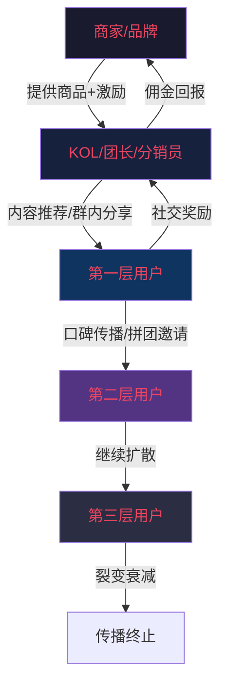
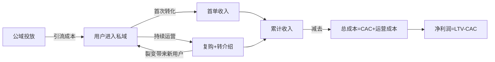
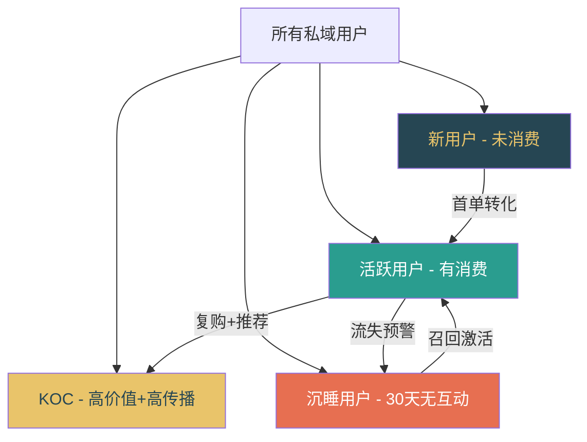
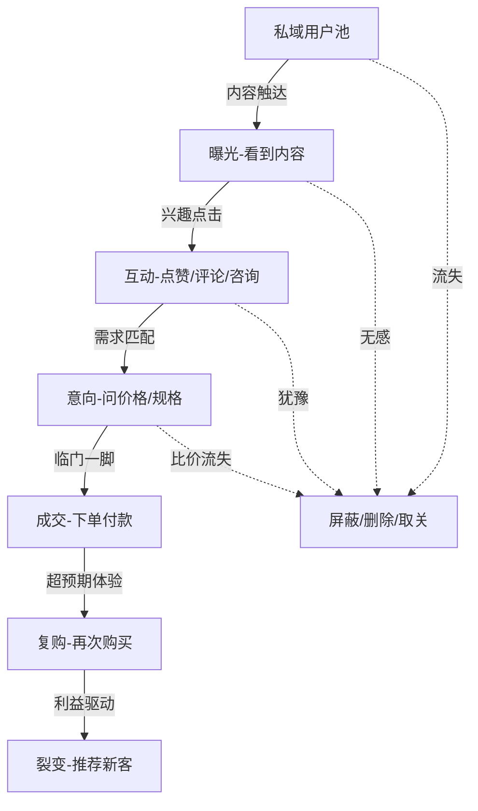

## 七、社交电商与私域流量理论

社交电商是电子商务与社交媒体深度融合的产物，其核心逻辑是将"人找货"的传统电商模式转变为"货找人"的社交推荐模式。私域流量则是社交电商的基础设施——商家自主拥有、可反复触达、无需付费的用户资产。理解这两个概念的本质和运营方法，是掌握新时代电商能力的关键。

### 1. 社交电商的本质与演变

#### 1.1 什么是社交电商

社交电商（Social Commerce）是指依托社交关系链，通过用户之间的互动、分享和推荐来完成商品发现、购买决策和交易转化的商业模式。与传统电商依赖搜索和广告不同，社交电商的信任基础来自人际关系。

传统电商的典型路径：用户有需求 → 打开平台搜索 → 比价下单。社交电商的典型路径：用户刷内容/聊天 → 发现朋友推荐 → 基于信任购买。两者的根本区别在于**购买决策的信任来源**不同：前者信任平台（品牌、评分、销量），后者信任人（朋友、KOL、社群主）。

#### 1.2 社交电商的五种模式

| 模式 | 核心机制 | 代表平台 | 用户角色 | 典型佣金 |
|------|---------|---------|---------|---------|
| 拼团电商 | 多人凑单降价 | 拼多多、淘宝拼团 | 消费者+传播者 | 无佣金，享低价 |
| 内容电商 | 内容种草引导购买 | 小红书、抖音、B站 | 内容创作者 | CPS佣金5%-50% |
| 社群电商 | 社群运营+团购 | 社区团购、微信群团购 | 群主/团长 | 团长佣金10%-20% |
| 分销电商 | 多级分销返佣 | 云集、花生日记 | 分销员 | 一级佣金+团队奖励 |
| 直播电商 | 实时展示+互动 | 淘宝直播、快手 | 主播 | 坑位费+佣金20%-40% |

#### 1.3 社交电商的底层逻辑

社交电商的运转依赖三个核心机制：

**信任传递机制**：社交关系中的信任可以迁移到商品推荐上。当朋友说"这个好用"，你不会像看到广告那样本能地怀疑，因为你知道朋友没有动机骗你（或者骗你的成本太高）。这就是所谓的"信任代理"——推荐人用自己的社交信用为商品背书。

**社交裂变机制**：一个满意的用户可以带来多个新用户，形成指数级传播。裂变的关键公式是：**裂变效果 = 触达人数 × 转化率 × 分享率**。触达人数取决于渠道覆盖，转化率取决于利益设计，分享率取决于社交货币价值（分享后是否显得有品味/有眼光/帮了别人）。

**去中心化分发机制**：传统电商的流量由平台算法控制，商家必须付费购买曝光。社交电商的流量分散在每个用户的社交网络中，商家通过激励用户分享来获取流量，本质上是把"广告费"变成了"用户激励"。



### 2. 私域流量的理论框架

#### 2.1 私域流量 vs 公域流量

私域流量和公域流量的本质区别在于**流量的所有权和触达成本**。

| 维度 | 公域流量 | 私域流量 |
|------|---------|---------|
| 所有权 | 平台所有 | 商家自有 |
| 触达成本 | 每次付费（CPC/CPM） | 边际成本趋近于零 |
| 用户关系 | 弱关系，平台控制 | 强关系，直接连接 |
| 数据资产 | 平台掌握 | 商家掌握 |
| 复购触达 | 需要再次投放 | 可反复免费触达 |
| 典型场景 | 淘宝搜索、抖音推荐 | 微信好友、企业微信群 |
| 流量稳定性 | 受算法和竞价影响 | 相对稳定可控 |

一个直观的比喻：公域流量像在商场租铺位，人流是商场的，你要付租金才能获得曝光；私域流量像自己开了一家店，门口的路是你修的，想什么时候叫顾客来就什么时候叫。

#### 2.2 私域流量的核心资产

私域流量不是简单地把用户加到微信里，它是一套分层的用户资产体系：

**第一层：连接资产**——用户的微信好友、企微好友、社群成员、公众号关注者。这是最基础的触达通道，决定了你能"够得着"多少人。

**第二层：信任资产**——用户对你的信任程度。信任决定了用户愿不愿意听你说话、看你发的内容、参与你的活动。信任需要长期经营，可以通过专业内容、真诚互动、兑现承诺来积累。

**第三层：数据资产**——用户的标签、偏好、购买历史、互动行为。这些数据让你能做精准推荐和个性化服务，是私域流量的核心竞争力。

**第四层：变现资产**——用户愿意为你的推荐买单的意愿和能力。这是最终的价值体现，前面三层的积累都是为了这一层。

#### 2.3 私域流量的经济学模型

理解私域流量的经济价值，需要掌握三个核心指标：

**用户终身价值（LTV, Lifetime Value）**：一个用户在整个生命周期内为你贡献的总利润。计算公式为：

```text
LTV = 客单价 × 购买频次 × 毛利率 × 用户生命周期（年）
```

例如：一个美妆私域用户，客单价200元，每月购买1次，毛利率40%，平均留存2年，则 LTV = 200 × 12 × 0.4 × 2 = 1,920元。

**用户获取成本（CAC, Customer Acquisition Cost）**：获取一个私域用户的总成本，包括引流成本、运营人力成本、工具成本等。

**LTV/CAC 比值**：这是衡量私域是否值得投入的核心指标。比值 > 3 表示健康，说明用户贡献远超获取成本；比值 < 1 则说明私域运营是亏损的。



### 3. 私域流量的搭建体系

#### 3.1 私域流量的载体选择

不同载体有不同的特性和适用场景，选择时需要匹配业务类型和用户习惯：

| 载体 | 优势 | 劣势 | 适用场景 | 容量上限 |
|------|------|------|---------|---------|
| 个人微信号 | 触达率高、互动亲密 | 封号风险、不可多人管理 | 高客单、强信任行业 | 5000好友 |
| 企业微信 | 官方支持、离职继承、标签体系 | 用户感知较"官方" | 中大型企业、标准化服务 | 无明确上限 |
| 微信社群 | 群体互动、氛围营造 | 广告骚扰、信息过载 | 社区团购、快消品 | 500人/群 |
| 公众号 | 内容沉淀、品牌建设 | 打开率下降（约2%-5%） | 内容型品牌、教育 | 无上限 |
| 小程序 | 功能丰富、体验流畅 | 获客依赖导流 | 电商交易、会员服务 | 无上限 |
| 视频号 | 视频内容+直播+社交推荐 | 内容制作门槛 | 品牌传播、直播带货 | 无上限 |

**最佳实践是组合使用**：企微做沉淀（安全可控）+ 社群做互动（氛围活跃）+ 公众号/视频号做内容（持续触达）+ 小程序做转化（交易闭环）。

#### 3.2 私域引流的八大方法

把公域用户引入私域是第一步，以下是经过验证的引流方法：

**方法一：包裹卡引流**。在发货包裹中放入卡片，引导用户扫码加微信领取优惠券/赠品。转化率通常在5%-15%，成本低、可规模化。关键点：卡片设计要有吸引力（利益点清晰），二维码要长期有效（用活码），添加后要有自动欢迎语和首单福利。

**方法二：客服引导**。在售前售后沟通中引导用户添加微信。话术示例："添加专属顾问微信，享受VIP价格+售后优先处理"。转化率取决于客服执行力和话术吸引力。

**方法三：内容引流**。在公域平台发布高质量内容，在个人简介/评论区/私信中引导用户添加微信。适用于小红书、抖音、知乎等内容平台。关键是内容要有价值，让用户有"加了能获得更多"的预期。

**方法四：直播引流**。在直播过程中引导观众加入粉丝群或添加微信。话术示例："加入粉丝群，明天上新提前通知，专属群友价"。直播引流的优势是即时互动，用户冲动添加的概率更高。

**方法五：线下引流**。门店、展会、活动现场引导用户扫码添加。转化率高（面对面信任感强），但规模受限于线下流量。

**方法六：裂变引流**。通过老用户邀请新用户的方式获取私域用户。常见玩法：邀请3人助力得礼品、拼团享低价、分享返现。裂变的核心是**让分享者有面子、被邀请者有实惠**。

**方法七：广告投放引流**。通过朋友圈广告、公众号广告等直接引导用户添加企业微信或进入社群。成本较高但可控，适合有预算的品牌。

**方法八：异业合作引流**。与目标用户重叠但不竞争的品牌互相导流。例如母婴品牌和早教机构交换用户资源。

#### 3.3 用户分层与标签体系

进入私域的用户不能一视同仁，需要建立分层运营体系：



**用户标签体系应包含以下维度**：

- **基础标签**：性别、年龄、地区、职业（来源：注册信息/对话了解）
- **行为标签**：浏览记录、点击偏好、互动频率、社群活跃度（来源：工具追踪）
- **消费标签**：客单价、品类偏好、购买频次、最近购买时间（来源：交易数据）
- **价值标签**：RFM评分（Recency近度、Frequency频度、Monetary金额）、LTV预测（来源：数据分析）

**RFM 模型的实际应用**：将用户按 R（最近消费距今天数）、F（消费频率）、M（消费金额）三个维度各分为高/低两档，组合出8种用户类型：

| 用户类型 | R | F | M | 运营策略 |
|---------|---|---|---|---------|
| 重要价值用户 | 高 | 高 | 高 | VIP服务、专属权益、深度维护 |
| 重要发展用户 | 高 | 低 | 高 | 提升购买频次、定期推送 |
| 重要保持用户 | 低 | 高 | 高 | 召回活动、专属折扣 |
| 重要挽留用户 | 低 | 低 | 高 | 大额优惠券、1对1关怀 |
| 一般价值用户 | 高 | 高 | 低 | 推荐高客单商品、组合套餐 |
| 一般发展用户 | 高 | 低 | 低 | 培养消费习惯、新手引导 |
| 一般保持用户 | 低 | 高 | 低 | 激活提醒、复购激励 |
| 一般挽留用户 | 低 | 低 | 低 | 低成本自动化维护 |

### 4. 私域运营的核心方法

#### 4.1 人设打造

私域运营的本质是"卖人"，用户买的不只是商品，更是对你的信任。一个成功的人设需要三个要素：

**专业度**：你必须是某个领域的专家或深度用户。卖护肤品就要懂成分、懂肤质搭配；卖服装就要懂穿搭、懂面料。专业度体现在日常内容中——能不能回答用户的具体问题，能不能给出有针对性的建议。

**真实感**：人设不能太完美，适度展示生活细节、小缺点、真实感受，反而更可信。每天发精致海报的微商模式已经过时，用户更愿意相信一个"活人"而不是一个"广告机器"。

**一致性**：人设一旦确定就不能频繁更换。今天卖护肤品明天卖零食，用户会困惑"你到底是干嘛的"。一致性体现在内容主题、说话风格、价值主张上。

**朋友圈内容规划（7天示例）**：

| 时间 | 内容类型 | 示例 |
|------|---------|------|
| 周一 8:00 | 生活日常 | 分享周末的某次经历，自然带出使用场景 |
| 周一 12:00 | 产品知识 | 科普一个行业知识点（不卖货） |
| 周二 18:00 | 用户反馈 | 真实用户使用后的反馈截图+点评 |
| 周三 9:00 | 互动提问 | "大家觉得A好还是B好？"引发讨论 |
| 周四 20:00 | 产品推荐 | 软性推荐，重点讲使用体验而非功能参数 |
| 周五 15:00 | 行业观点 | 分享对行业趋势的看法，展示专业度 |
| 周六 10:00 | 促销活动 | 限时优惠/满减/赠品，制造紧迫感 |

**关键比例**：生活内容30% + 专业内容30% + 用户见证20% + 促销内容20%。促销内容不能超过20%，否则用户会屏蔽你。

#### 4.2 社群运营

社群是私域中最活跃的互动场，但也是最容易"死掉"的载体。90%的社群在创建一个月后变成广告群或死群，根本原因是**没有持续提供价值**。

**社群定位四要素**：

1. **人群**：这个群是给谁的？（新客户群、VIP群、兴趣群、地域群）
2. **价值**：用户进群能得到什么？（专属折扣、优先购买权、专业知识、社交圈子）
3. **规则**：群内允许什么、禁止什么？（禁止广告、禁止私加、鼓励分享）
4. **节奏**：每天/每周固定做什么？（早安问候、午间种草、晚间互动、周五福利）

**社群活跃的标准动作**：

| 时间 | 动作 | 目的 |
|------|------|------|
| 每日 9:00 | 早安问候+今日福利预告 | 建立打开习惯 |
| 每日 12:00 | 种草内容/使用教程 | 提供价值 |
| 每日 20:00 | 互动话题/投票/问答 | 提升活跃度 |
| 每周二/四 | 限时秒杀/群专属价 | 促进转化 |
| 每周五 | 本周好物总结 | 内容沉淀 |
| 每月1次 | 线上活动（抽奖/晒单） | 增强粘性 |

**社群生命周期管理**：一个社群从创建到衰退通常经历5个阶段——引入期（拉新+破冰）→ 成长期（建立互动习惯）→ 成熟期（稳定产出价值）→ 衰退期（活跃度下降）→ 沉默期（无人说话）。关键是**在成熟期就开始培育下一个社群**，而不是等到当前群死掉才开始拉新群。

#### 4.3 内容营销

私域内容的核心目的是**建立信任和激发需求**，而不是直接卖货。

**AIDA 内容模型在私域中的应用**：

- **Attention（注意）**：用痛点问题或意外信息抓住注意力。例如："90%的人洗脸都犯了这个错"。
- **Interest（兴趣）**：展开讲原理、讲原因，让用户产生了解的欲望。例如：解释为什么错误的洗脸方式会导致皮肤问题。
- **Desire（欲望）**：展示解决方案和使用效果，让用户想要拥有。例如：展示正确使用产品后的对比效果。
- **Action（行动）**：给出明确的购买指引和限时激励。例如："今天下单送XX，前50名额外加赠YY"。

**高效内容公式**：

- **痛点+解决方案**："夏天T区出油严重？试试这款控油散粉，8小时不脱妆"
- **对比+数据**："用之前毛孔粗大、用之后细腻，坚持28天实测记录"
- **故事+产品**："我是怎么从烂脸到素颜出门的——附产品清单"
- **教程+推荐**："手把手教你3分钟出门妆容，用到的产品都在这里"

#### 4.4 转化与成交

私域转化的核心是**在对的时间、把对的产品、用对的方式、推给对的人**。

**转化漏斗的关键节点**：



**每一层的转化率基准值**（行业平均水平）：

| 环节 | 转化率 | 提升方法 |
|------|--------|---------|
| 曝光→互动 | 3%-8% | 优化标题/封面、发布时间测试 |
| 互动→意向 | 10%-20% | 专业解答、消除顾虑、用户见证 |
| 意向→成交 | 30%-50% | 限时优惠、赠品策略、零风险承诺 |
| 成交→复购 | 20%-40% | 售后跟进、复购提醒、会员权益 |
| 复购→裂变 | 5%-15% | 分享奖励、邀请有礼、口碑激励 |

**促成交的六种策略**：

1. **限时限量**："今天24点截止，仅剩XX件"——制造稀缺感和紧迫感。
2. **从众效应**："已经有328位群友下单了"——降低决策风险。
3. **零风险承诺**："7天无理由退换，不满意全额退款"——消除顾虑。
4. **赠品加码**："买主品送价值XX元的赠品"——提升感知价值。
5. **阶梯优惠**："买2件9折，买3件8折"——提高客单价。
6. **专属身份**："VIP会员专享价"——满足身份认同需求。

### 5. 私域工具与技术栈

#### 5.1 工具选型矩阵

| 需求 | 免费方案 | 付费方案 | 推荐场景 |
|------|---------|---------|---------|
| 用户管理 | 微信标签+备注 | 企业微信+SCRM | <100人用免费，>500人用SCRM |
| 社群管理 | 微信群手动管理 | 微伴助手/艾客 | 群数>5个建议用工具 |
| 内容管理 | 手动排期 | 新榜/蝉妈妈 | 内容团队>2人建议用工具 |
| 数据分析 | Excel手动统计 | 有赞/微盟后台 | 日订单>50建议用系统 |
| 自动回复 | 微信快捷回复 | 企微自动回复+关键词 | 用户咨询量大必须用 |
| 裂变工具 | 手动统计邀请 | 零一裂变/爆汁裂变 | 裂变活动必须用专业工具 |

#### 5.2 SCRM系统核心功能

SCRM（Social Customer Relationship Management）是私域运营的核心工具，相比传统CRM，SCRM增加了社交属性：

- **全渠道用户画像**：整合微信、小程序、商城等多渠道数据，构建360度用户视图
- **自动化SOP**：新用户自动打标签+推送欢迎语+首周跟进流程，减少人工操作
- **智能群发**：按标签分组群发，不同用户收到不同内容，提升相关性
- **互动雷达**：追踪用户对内容的点击行为，识别高意向用户
- **流失预警**：自动识别30天未互动的用户，触发召回动作

#### 5.3 数据分析体系

私域运营必须建立数据驱动的决策习惯，核心看板包含以下指标：

**日报指标**：新增好友数、删除/拉黑数、净增用户数、消息发送数、朋友圈互动数、当日成交额、当日订单数。

**周报指标**：各渠道引流转化率、社群活跃率（发言人数/总人数）、内容互动率（互动人数/触达人数）、转化漏斗各环节转化率。

**月报指标**：私域用户总量及增长率、LTV/CAC比值、复购率、用户留存曲线、各层级用户占比变化、ROI（投入产出比）。

### 6. 社交电商的法律红线与合规经营

社交电商在中国的法律边界非常清晰，踩线的代价极高。以下几条红线必须牢记：

**传销红线**：《禁止传销条例》明确规定，以发展人员数量为主要计酬依据的，构成传销。判断标准——是否需要缴纳入门费、是否以发展下线人数为主要收入来源、是否存在三级以上分佣层级。社交电商最多做两级分销（自己+直接推荐人），超过三级就涉嫌传销。

**虚假宣传**：朋友圈发效果图、用户评价必须真实。使用"最好""第一""治愈"等绝对化用语违反《广告法》，可处20万-100万罚款。

**数据合规**：收集用户信息必须告知用途并获得同意（《个人信息保护法》）。不能未经允许向用户发送营销信息。

**税务合规**：私域收入属于经营所得，需要依法纳税。个人年收入超过一定额度需要办理税务登记。

### 7. 常见误区与纠正

**误区一：把私域当广告渠道**。很多商家把用户加到微信后，每天群发促销信息，结果用户纷纷删除或屏蔽。私域的核心是"关系"而不是"渠道"，正确的做法是先提供价值（知识、服务、情感连接），再自然地推荐产品。

**误区二：盲目追求用户数量**。1000个精准用户的价值远超10000个泛用户。私域运营的人力是有限的，用户越多，人均服务时间越少，体验越差。应该聚焦于高价值用户的深度运营。

**误区三：社群不活跃就发红包**。红包只能带来短暂的活跃，钱花完了群又沉寂了。真正的活跃来自**持续有价值的内容和互动**——用户之所以看群，是因为群里总有有用的信息或有趣的话题。

**误区四：不做用户分层**。给所有用户推一样的内容，就像给所有人开一样的药方——既不精准也不高效。高价值用户觉得自己没有被特殊对待，低价值用户被频繁营销信息骚扰。

**误区五：过度依赖单一平台**。只在一个平台上做私域很危险——平台政策变化、账号被封都会导致全部用户资产归零。应该在多个载体上建立连接，降低单点风险。

**误区六：忽视老用户维护**。获取新用户的成本是维护老用户的5-10倍，但很多商家把80%的精力放在拉新上。私域的最大价值在于复购和转介绍，老用户才是真正的"摇钱树"。

### 8. 实战案例拆解

#### 8.1 完美日记的私域体系

完美日记是社交电商和私域运营的标杆案例。其私域体系包含：

- **小完子人设**：一个爱化妆、爱分享的年轻女孩形象，而非冷冰冰的品牌官方号。朋友圈内容以妆容教程、产品测评、生活日常为主。
- **社群矩阵**：按用户兴趣和购买阶段分群，每群有固定的互动节奏和专属活动。
- **小程序商城**：社群和朋友圈推荐的商品直接在小程序下单，形成闭环。
- **数据驱动**：通过用户行为数据优化推送内容和时间，提升转化率。

结果：完美日记的私域用户超过4800万（包括公众号+社群+企微），私域贡献了约20%的GMV。

#### 8.2 瑞幸咖啡的社群策略

瑞幸咖啡的私域策略更加标准化和可复制：

- **LBS社群**：按门店位置建群，用户进入距离最近的门店群。
- **每日优惠券**：每天在群里发放专属优惠券，培养用户"看群领券"的习惯。
- **新品首发**：新品信息在社群首发，给群成员优先体验感。
- **自动化运营**：大量使用自动化工具，减少人工成本。

结果：瑞幸私域用户超过2000万，每天通过社群触达用户超过1000万人次，社群用户的月消费频次比非社群用户高出30%。

### 9. 进阶：私域流量的精细化运营

#### 9.1 个性化推荐引擎

当私域用户规模超过1000人时，手工推荐已经不可持续，需要建立基于数据的个性化推荐系统：

- **协同过滤**：购买了A商品的用户也购买了B商品 → 向购买了A但未购买B的用户推荐B
- **内容关联**：查看了防晒霜内容的用户 → 推荐晒后修复、卸妆产品
- **生命周期推荐**：新用户推爆款引流款 → 老用户推利润款 → VIP推新品和限量款

#### 9.2 自动化运营SOP

建立标准化的运营流程，确保每个用户在关键节点都能被及时触达：

| 触发条件 | 自动动作 | 目的 |
|---------|---------|------|
| 新添加好友 | 欢迎语+自我介绍+新人福利 | 建立第一印象 |
| 添加后第3天 | 推送一篇干货内容 | 提供价值 |
| 添加后第7天 | 推送首单优惠 | 促进首购 |
| 首单完成后第3天 | 询问使用体验+推荐搭配 | 提升满意度 |
| 30天未互动 | 发送召回内容+专属优惠 | 防止流失 |
| 生日当天 | 生日祝福+生日专属折扣 | 情感连接 |
| 消费满一定金额 | 升级通知+VIP权益介绍 | 提升忠诚度 |

#### 9.3 私域与直播的协同

私域和直播不是二选一，而是互相赋能：

- **私域为直播导流**：在社群和朋友圈预告直播时间和福利，提升直播间初始流量。平台算法会因为初始流量好而给予更多公域推荐。
- **直播为私域引流**：在直播间引导观众加入粉丝群，享受群专属福利。
- **直播内容二次利用**：直播中的精彩片段剪辑成短视频，发布到公域平台继续引流。

这种"公域获客 → 私域沉淀 → 直播转化 → 公域再获客"的飞轮效应，是目前最高效的社交电商运营模型。

### 10. 本章小结

社交电商和私域流量的本质是**将营销费用转化为用户关系投资**。传统电商是"租流量"——今天花钱买流量今天有生意，明天不花钱明天就没了。私域是"养流量"——前期投入时间和精力，后期获得持续免费的触达能力。

核心认知：

1. **信任是私域的核心资产**，没有信任的私域只是一个通讯录
2. **内容是信任的载体**，持续输出有价值的内容才能建立和维持信任
3. **数据是精细化的基础**，没有数据支撑的运营只能靠感觉和运气
4. **合规是长期经营的前提**，踩法律红线的短期收益最终都会加倍奉还
5. **自动化是规模化的关键**，人力无法支撑万级以上用户的精细化运营

掌握社交电商与私域流量的理论和方法，不是为了追风口，而是为了建立一个**不依赖平台、不受算法控制、可持续经营的用户资产**。这是每一个电商从业者都应该具备的核心能力。
