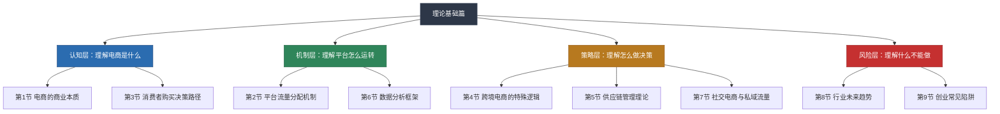
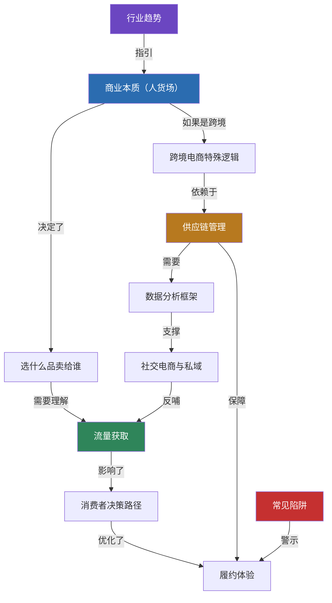

## 八、理论基础篇总结

理论基础篇共九个小节，从"电商是什么"讲到"电商往哪里去"，帮你建立完整的电商认知框架。本节对全篇进行系统梳理：提炼每个小节的核心要义，串联各节之间的逻辑关系，构建从认知到行动的完整知识地图，并给出自检清单帮你判断自己是否真正掌握了这些理论。

### 8.1 全篇知识架构回顾

理论基础篇的九个小节按照"认知→机制→策略→风险"四层逻辑递进，每一层都是下一层的地基：

这四层的关系是：**认知层告诉你"电商是什么"，机制层告诉你"平台怎么运转"，策略层告诉你"怎么做决策"，风险层告诉你"什么不能做"。** 不理解认知层，后面的技巧是无根之木；不理解机制层，运营动作是盲人摸象；不理解策略层，跨境和社交电商会踩大坑；不理解风险层，再好的策略也可能一招致命。

### 8.2 各节核心要义提炼

#### 第1节：电商的商业本质——"人、货、场"模型

**一句话总结**：电商的本质是人（消费者需求）、货（商品价值）、场（平台渠道）三者的高效匹配。

**核心知识点**：

- **"人"的维度**：不是"所有人"，而是"你的目标消费者"。用户画像（年龄、地域、消费能力、消费习惯）决定了选品方向、定价策略和营销话术。画像越精准，流量转化率越高。
- **"货"的维度**：产品力是根本。功能、品质、设计、包装构成产品力的四个支柱。差异化是关键——在同质化竞争中，没有差异化就没有定价权。
- **"场"的维度**：不同平台有不同的流量规则和用户心智。淘宝是"人找货"（搜索驱动），抖音是"货找人"（推荐驱动），拼多多是"人拉人"（社交驱动）。选错了"场"，再好的"人货"也匹配不上。
- **电商 vs 传统商业的本质区别**：信息传递效率更高（全球触达）、交易成本更低（无实体租金）、规模效应更强（边际成本递减）、数据能力更丰富（一切皆可量化）。
- **价值公式**：销售额 = 流量 × 转化率 × 客单价。三个变量缺一不可——流量大但转化低是浪费，转化高但客单价低是辛苦钱，客单价高但没流量是空转。

**实操检验**：拿到任何一个电商项目，能否用"人、货、场"三个维度快速判断其可行性？能否画出目标消费者画像？能否说清楚产品的核心差异化？能否解释为什么选择这个平台而非其他？

#### 第2节：电商平台的流量分配机制——"谁决定谁被看到"

**一句话总结**：平台通过搜索算法、推荐算法和内容分发机制决定流量分配，理解算法逻辑才能"顺着"算法获取流量。

**核心知识点**：

- **搜索流量**：消费者主动搜索关键词，平台根据相关性、销量、评价、店铺权重等因子排序。核心是关键词优化——标题中的关键词决定了你能不能被搜到，权重因子决定了你能排第几。
- **推荐流量**：平台根据用户画像（浏览历史、购买记录、兴趣标签）主动推荐商品。核心是标签匹配——你的商品标签越清晰、越精准，被推荐给目标人群的概率越高。
- **内容流量**：通过短视频、直播、图文等内容形式获取流量。核心是内容质量——完播率、互动率、分享率决定了内容能获得多大曝光。
- **千人千面机制**：同一搜索词，不同用户看到的结果不同。这意味着"刷单"的效果在递减——算法越来越依赖用户个性化行为数据，而非单纯的销量数据。
- **流量成本趋势**：各平台流量成本持续上升是不可逆的趋势。2024年淘宝平均CPC（单次点击成本）约2-5元，亚马逊PPC约$0.5-2.0。降低流量依赖的方法：积累自然搜索流量、建立私域流量池、通过内容营销获取免费流量。

**实操检验**：能否解释你所在平台的搜索排名前5个权重因子？能否说出你的商品主要流量来源及占比？能否区分搜索流量和推荐流量的运营策略差异？

#### 第3节：消费者购买决策路径——"从看到到下单的心理地图"

**一句话总结**：消费者从"产生需求"到"完成购买"再到"分享体验"的完整链路，每个节点都有可优化的转化杠杆。

**核心知识点**：

- **经典模型演进**：AIDMA（传统媒体：注意→兴趣→欲望→记忆→行动）→ AISAS（搜索时代：注意→兴趣→搜索→行动→分享）→ 社交电商模型（发现→信任→决策→裂变）。模型演进的核心变化是：消费者从"被动接收"变为"主动搜索"再变为"社交触发"。
- **决策周期差异**：传统电商1-7天，搜索电商3-30天，社交电商1-3分钟，私域电商几小时到几天。决策周期越短，冲动消费比例越高，退货率也越高。
- **漏斗模型**：曝光(100%) → 点击(2%-5%) → 浏览(60%-80%) → 加购(10%-20%) → 下单(30%-50%) → 付款(80%-95%) → 好评(5%-15%) → 复购(10%-30%)。每个环节的流失都可以优化。
- **心理学杠杆**：社会认同（"已售10万件"）、稀缺效应（"仅剩3件"）、锚定效应（原价999现价299）、损失厌恶（"优惠券即将过期"）、峰终定律（开箱惊喜）——在决策路径的每个节点，都有对应的心理学原理可以利用。
- **多触点归因**：现代消费者的决策路径不是线性的，而是多触点交叉的网状结构。中小卖家用"末次触达"做基础归因，大品牌应建立数据驱动归因体系。
- **LTV/CAC比值**：客户生命周期价值（LTV）/ 获客成本（CAC）> 3 时可以放心加大投放；< 3 时应优先优化复购和客单价。

**实操检验**：能否画出你产品的消费者决策路径？能否说出漏斗中哪个环节流失最严重？是否针对流失最严重的环节设计了优化方案？

#### 第4节：跨境电商的特殊逻辑——"国内经验不能直接复制到海外"

**一句话总结**：跨境电商在物流、支付、语言、文化、法规等维度与国内存在根本性差异，理解这些差异是避免踩坑的前提。

**核心知识点**：

- **物流成本差异**：国内3-5元/单，跨境30-80元/单（FBA头程+尾程约$3-8/件）。物流成本占跨境售价的15%-30%，是国内的5-10倍。
- **退货成本差异**：国内退货率5%-15%（服装30%-40%），跨境退货率15%-30%，但退货物流成本高到很多卖家选择"退款不退货"。
- **资金周转差异**：国内回款周期T+7到T+15，跨境回款周期T+14到T+60（PayPal 21天、亚马逊14天），加上物流时间，资金占用可达60-90天。
- **合规差异**：产品认证（欧盟CE、美国FDA、日本PSE）、知识产权（商标、专利、版权）、税务合规（VAT、关税、所得税）——合规不是"可选项"，而是"生死线"。
- **文化差异**：产品命名、包装设计、营销话术都需要本地化。"直译"是最常见的错误——不是把中文翻译成英文，而是用当地人的语言习惯重新表达。
- **汇率风险**：人民币升值1%，利润可能缩水5%-10%（因为成本在国内以人民币计价，收入在海外以外币计价）。跨境卖家需要预留15%-20%的利润空间应对不确定性。

**实操检验**：能否列出你目标市场的3个核心合规要求？能否说出跨境物流各模式的成本和时效对比？是否计算过汇率波动对你利润率的影响？

#### 第5节：供应链管理理论——"电商的长期竞争力来自供应链"

**一句话总结**：供应链管理是电商运营的底层基础设施，涵盖采购、库存、仓储、物流、逆向物流五大模块，核心理论包括牛鞭效应、推拉结合策略、精益与敏捷供应链。

**核心知识点**：

- **牛鞭效应**：需求信息从下游向上游传递时波动逐级放大。应对策略：信息共享（ERP/WMS系统）、缩短供应链层级（DTC模式）、小批量多频次采购。
- **推拉结合策略**：找到供应链中的"解耦点"，解耦点之前用推式（基于预测备货），解耦点之后用拉式（基于订单驱动）。跨境通常在海外仓采用推式，最后一公里采用拉式。
- **精益 vs 敏捷**：精益供应链适用于功能性产品（需求稳定、生命周期长），追求成本最低；敏捷供应链适用于创新性产品（需求波动大、生命周期短），追求响应最快。SHEIN的"小单快反"是敏捷供应链的极致实践。
- **安全库存公式**：安全库存 = Z × σ × √L（Z=服务水平分位数，σ=日需求标准差，L=补货提前期）。95%服务水平对应Z=1.65。
- **ABC-XYZ分类法**：按销售额贡献（ABC）和需求波动性（XYZ）交叉分类，制定差异化库存策略。A-X类自动补货低安全库存，C-Z类考虑下架或清仓。
- **库存健康指标**：库存周转率（健康值6-12次/年）、现货率（目标>95%）、库销比（健康值1.5-3个月）、滞销率（目标<10%）。
- **供应链金融**：应收账款融资、库存融资、预付款融资、信用融资——将供应链上的真实贸易数据转化为融资能力。

**实操检验**：能否说出你的核心SKU的安全库存量？是否建立了供应商评分体系？能否解释你的库存周转率和库销比是否健康？

#### 第6节：电商的数据分析框架——"一切皆可量化"

**一句话总结**：电商的最大优势是数据丰富，建立科学的数据分析框架覆盖流量、转化、财务三大维度，用数据驱动每一个运营决策。

**核心知识点**：

- **流量指标**：UV（独立访客）、PV（页面浏览）、跳出率、平均停留时长、流量来源占比。核心是区分"流量数量"和"流量质量"——1000个精准UV的价值可能高于10000个泛流量UV。
- **转化指标**：转化率（CVR）、加购率、收藏率、支付转化率、退货率。核心是建立"曝光→点击→浏览→加购→下单→付款→好评→复购"的全链路漏斗监控。
- **财务指标**：毛利率（健康值>30%）、净利率（健康值>10%）、ROI（投入产出比）、ROAS（广告回报率）。核心是计算"真实利润"——扣除产品成本、平台佣金、物流费、广告费、退货损失、人工成本后的净利润。
- **数据复盘节奏**：日报看流量和销量趋势，周报看转化率和广告效率，月报看利润和库存健康度，季度看增长趋势和策略调整方向。
- **常用工具**：生意参谋（淘宝/天猫）、Jungle Scout/Helium 10（亚马逊）、飞瓜数据（抖音/快手）、Google Analytics（独立站）、ERP系统（多平台数据整合）。

**实操检验**：能否说出你店铺过去7天的UV、转化率和客单价？是否建立了日报/周报的数据复盘习惯？能否计算出每个SKU的真实利润率？

#### 第7节：社交电商与私域流量理论——"从流量思维到用户思维"

**一句话总结**：社交电商的本质是信任关系的货币化，私域流量的核心是用户生命周期价值（LTV）的最大化，完整链路是"公域引流→私域沉淀→信任建立→复购变现"。

**核心知识点**：

- **社交电商的本质**：不是"在社交平台上卖货"，而是"先建立信任关系，再通过信任关系变现"。信任来源包括：KOL/博主的专业背书、朋友/熟人的社交推荐、社群主理人的人格背书。
- **私域流量的价值**：私域客户的获客成本是一次性的（引流时投入），但触达成本接近零（发朋友圈/群消息免费）。私域客户的复购率通常是公域的3-5倍，客单价高20%-50%。
- **微信生态组合打法**：公众号（内容沉淀）+ 小程序（交易闭环）+ 企业微信（客户管理）+ 视频号（内容获客）+ 社群（互动运营）——五个工具组合使用，构成完整的私域运营体系。
- **社群运营三板斧**：价值输出（干货内容、独家优惠、情感连接）、互动机制（打卡、话题讨论、抽奖）、分层运营（核心用户VIP群、活跃用户互动群、沉默用户激活群）。
- **社交裂变机制**：拼团（拼多多核心机制，转化率35%-40%）、分销（二级分销合规，三级以上涉嫌传销）、邀请有礼（老带新）、内容裂变（用户晒单→吸引新用户）。

**实操检验**：是否建立了私域流量池（微信群/企业微信）？能否说出你的私域客户数和月均复购率？是否有定期的价值输出和互动机制？

#### 第8节：行业未来趋势——"顺势而为"

**一句话总结**：AI驱动、社交电商深化、全球化与本地化平衡、可持续电商是四大核心趋势，理解趋势才能避免投入即将过时的模式。

**核心知识点**：

- **AI驱动电商变革**：AI选品（ChatGPT/Claude分析市场机会和竞品数据）、AI内容生产（批量生成产品描述、广告素材、短视频脚本）、AI客服（多语言智能客服覆盖全球时区）、AI定价（动态定价算法根据供需实时调价）。AI不会替代电商卖家，但会用AI的卖家会替代不会用的。
- **社交电商持续深化**：直播电商从"野蛮生长"进入"专业化运营"阶段（MCN机构化、主播专业化、供应链标准化）。2024年中国直播电商市场规模超5万亿元，占电商总GMV约33%。
- **全球化与本地化平衡**：跨境电商不是把中国商品"搬"到海外，而是针对目标市场做本地化选品、本地化内容、本地化服务。"全球供应链+本地化运营"是未来跨境的核心模式。
- **可持续电商兴起**：环保包装、碳中和物流、二手循环经济。欧盟已出台相关法规要求电商企业披露碳足迹，这是未来的合规要求而非可选项。
- **全托管模式崛起**：Temu、SHEIN Marketplace等全托管模式降低了卖家的运营门槛，但也压缩了利润空间。适合工厂型卖家，不适合品牌型卖家。

**实操检验**：是否在使用AI工具辅助选品/文案/客服？是否关注了你所在品类的技术和模式变化？是否评估过全托管模式对你的业务影响？

#### 第9节：创业常见陷阱——"知道什么不能做比知道做什么更重要"

**一句话总结**：电商创业有9个致命陷阱——跟风选品、急于求成、忽视数据、过度依赖付费流量、定价错误、库存失控、忽视规则、不做用户运营、单打独斗，每个陷阱都配有真实案例和避坑方法。

**核心知识点**：

- **陷阱一：跟风选品**。别人赚钱不代表你也能——时机、资源、能力各不相同。正确做法：用数据验证（搜索量、竞争度、利润率三维交叉），而非看别人晒单就跟。
- **陷阱二：急于求成**。期望一个月回本，遇到困难就放弃。现实是：新店前3个月淘汰率约70%，存活下来的平均回本周期3-6个月。正确做法：准备6个月运营资金，做好3个月不盈利的心理准备。
- **陷阱三：忽视数据**。凭感觉选品和定价，不看转化率和利润率。正确做法：建立日报/周报数据复盘习惯，每个决策都有数据支撑。
- **陷阱四：过度依赖付费流量**。广告一停销量归零，利润被广告费吞噬。正确做法：付费流量占比控制在30%-50%以内，同步积累自然搜索流量和私域流量。
- **陷阱五：定价错误**。只算产品成本不算隐性成本（平台佣金5%-10%、物流费3%-15%、广告费10%-30%、退货损失3%-10%）。正确做法：用"成本倒推定价法"——先算出所有成本和目标利润率，再倒推出最低售价。
- **陷阱六：库存失控**。要么断货损失平台权重，要么积压占用资金变死库存。正确做法：首批进货控制在30天预估销量内，用安全库存公式科学补货。
- **陷阱七：忽视规则**。一次违规可能导致降权甚至封店。正确做法：开店前通读平台规则，建立合规自查清单。
- **陷阱八：不做用户运营**。只做一锤子买卖，不建立复购体系。正确做法：私域沉淀+会员体系+复购引导。
- **陷阱九：单打独斗**。不加入卖家社群，不学习行业知识。正确做法：加入3-5个高质量卖家社群，每周花2小时学习行业动态。

**实操检验**：你目前踩中了哪些陷阱？能否列出你最大的3个风险点并给出应对方案？

### 8.3 九节之间的逻辑串联

理论基础篇的九个知识点不是孤立的，而是环环相扣的有机整体：

**核心串联逻辑**：

1. **商业本质→流量机制→决策路径**：理解"人货场"后，你需要知道平台如何把你的"货"推给"人"（流量机制），以及"人"从看到到下单的心理过程（决策路径）。这三节构成电商运营的基础认知三角。
2. **跨境逻辑→供应链→数据分析**：做跨境电商，供应链是生死线（物流、库存、合规），数据分析是优化工具（用数据驱动供应链决策）。这三节构成跨境电商的策略支撑三角。
3. **社交电商→全链路闭环**：社交电商和私域流量是"流量机制"的延伸——当公域流量成本持续上升时，私域是降低获客成本的唯一出路。同时，私域运营需要"决策路径"的理论指导（在哪个节点引导用户进入私域）。
4. **趋势→方向，陷阱→底线**：趋势告诉你"往哪里走"，陷阱告诉你"不要走哪里"。两者共同构成风险认知框架。

### 8.4 理论到实践的转化路径

学完理论基础篇后，如何将知识转化为实操能力？以下是分阶段的转化路径：

**第一阶段：建立认知框架（1-3天）**

| 任务 | 具体动作 | 预期产出 |
|------|---------|---------|
| 画"人货场"图 | 用纸笔画出你的目标消费者画像、产品核心卖点、目标平台特征 | 一张清晰的人货场匹配图 |
| 分析目标平台 | 注册目标平台账号，浏览100个同类店铺，记录搜索排名前20的商品特征 | 竞品分析初稿 |
| 理解决策路径 | 以消费者身份走完一次完整购买流程（从搜索到下单到收货），记录每个环节的体验 | 决策路径体验报告 |

**第二阶段：数据验证假设（1-2周）**

| 任务 | 具体动作 | 预期产出 |
|------|---------|---------|
| 选品数据验证 | 用生意参谋/Jungle Scout等工具查询候选品类的搜索量、竞争度、利润率 | 选品数据表 |
| 流量机制验证 | 小额投放测试（200-500元），观察不同关键词/人群的点击率和转化率 | 流量测试报告 |
| 供应链初步对接 | 在1688/工厂联系3-5家供应商，索要样品和报价 | 供应商初步评估表 |

**第三阶段：小规模实操验证（2-4周）**

| 任务 | 具体动作 | 预期产出 |
|------|---------|---------|
| 最小可行店铺 | 选择1个平台，上架3-5个SKU，跑通"选品→上架→出单→发货"全流程 | 正常运营的店铺 |
| 数据复盘习惯 | 每天记录流量、转化、销售额数据，每周做一次全链路复盘 | 数据复盘报表 |
| 私域初步建立 | 将成交客户导入微信群/企业微信，开始积累私域用户池 | 初始私域用户池 |

### 8.5 理论掌握度自检清单

完成理论基础篇学习后，用以下清单自检。如果超过3项回答"否"，建议回看对应章节：

| 序号 | 自检问题 | 对应章节 | 是否掌握 |
|------|---------|---------|---------|
| 1 | 能否用"人货场"框架分析任意电商项目？ | 第1节 | □ |
| 2 | 能否说出目标平台的搜索排名前5个权重因子？ | 第2节 | □ |
| 3 | 能否画出你产品的消费者决策路径？ | 第3节 | □ |
| 4 | 能否列出目标市场的3个核心合规要求？ | 第4节 | □ |
| 5 | 能否计算你核心SKU的安全库存量？ | 第5节 | □ |
| 6 | 能否说出你店铺的UV、转化率、客单价？ | 第6节 | □ |
| 7 | 是否建立了私域流量池并有定期运营？ | 第7节 | □ |
| 8 | 能否说出你所在品类的2个行业趋势？ | 第8节 | □ |
| 9 | 能否列出你当前面临的3个最大风险？ | 第9节 | □ |

### 8.6 从理论基础到核心技巧的衔接

理论基础篇是"道"的层面——帮你理解电商的底层逻辑。接下来的核心技巧篇是"术"的层面——教你具体怎么操作。两者的关系是：

- **理论告诉你"为什么"，技巧告诉你"怎么做"**
- **理论帮你做判断，技巧帮你执行**
- **理论帮你避坑，技巧帮你提效**

进入核心技巧篇之前，确保你已经理解了以下核心公式和模型：

| 公式/模型 | 来源 | 应用场景 |
|-----------|------|---------|
| 销售额 = 流量 × 转化率 × 客单价 | 第1节 | 诊断店铺问题：是流量不够、转化太低还是客单价太低？ |
| AISAS决策路径 | 第3节 | 设计营销内容：在消费者决策的每个节点提供对应内容 |
| 安全库存 = Z × σ × √L | 第5节 | 科学补货：避免断货和积压 |
| LTV/CAC > 3 | 第3节 | 评估获客效率：是否值得加大投放？ |
| 毛利率 > 30% | 第6节 | 定价和选品：低于30%毛利的生意难以持续 |
| 公域引流→私域沉淀→信任建立→复购变现 | 第7节 | 用户运营：从一次性交易到持续复购 |
| ABC-XYZ库存分类 | 第5节 | 库存管理：不同SKU用不同策略 |

掌握了这些理论基础，你就有了一个"判断框架"——面对任何电商决策时，不再是凭感觉拍脑袋，而是有理论支撑、有数据依据、有模型参考地做判断。这正是理论基础篇的价值所在。

***

> **下一步**：进入核心技巧篇，学习选品方法论、Listing优化、流量获取、转化提升等全链路实操技能。
