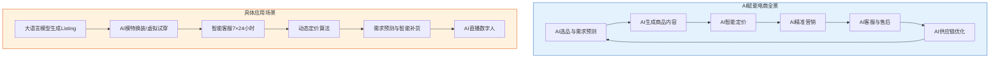
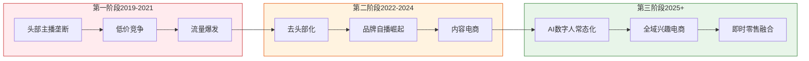
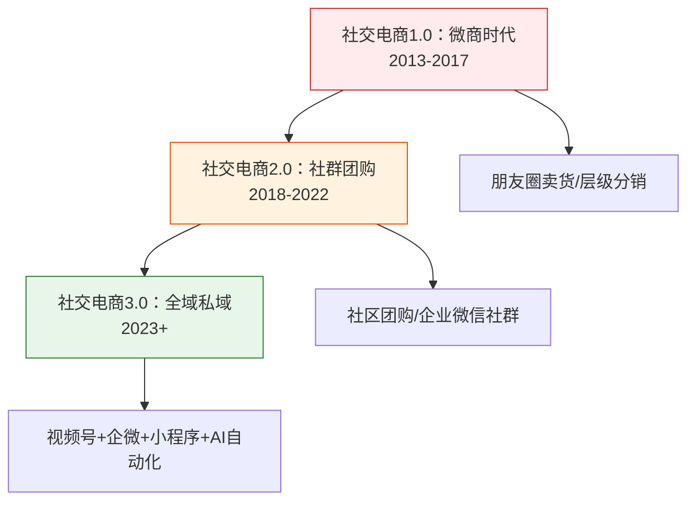
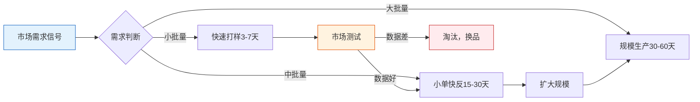
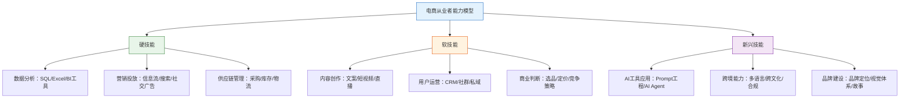

## 七、电商行业的未来趋势

电商行业正处于第五轮技术革命的浪潮之巅。从2003年淘宝诞生到2025年，中国电商渗透率从不到1%飙升至超过35%，年交易规模突破15万亿元。但增长的逻辑已经彻底改变——从"流量红利"转向"效率红利"，从"规模扩张"转向"价值深耕"。理解未来趋势不是预测学，而是识别正在发生的结构性变化，提前布局。

### 1. AI驱动的智能电商：从工具到核心引擎

#### 1.1 AI正在重塑电商的每一个环节

AI不再是电商的"辅助工具"，而是正在成为整个商业链条的核心操作系统。这不是5年后的展望，而是2024-2025年正在发生的现实。

#### 1.2 生成式AI在电商中的具体应用

**商品内容生成：** 传统电商运营中，一个运营人员一天能写5-10个商品的标题和详情页文案。使用大语言模型（如GPT-4、Claude、通义千问），同样的工作量可以缩短到30分钟，且支持多语言同步生成。具体应用场景包括：

- **Listing文案生成：** 输入产品参数和卖点，AI自动生成标题、五点描述、A+页面内容，支持A/B测试多版本
- **多语言本地化：** 跨境卖家使用AI将中文产品描述翻译为英语、日语、德语等，且能自动适配目标市场的表达习惯和搜索关键词
- **图片生成与编辑：** Midjourney、Stable Diffusion生成产品场景图；AI换装工具（如ZMO.ai）让同一款衣服展示在不同体型的虚拟模特上，省去每款衣服拍摄的数万元费用
- **视频内容：** AI数字人直播已进入实用阶段。2024年，京东、淘宝均开放了AI主播工具，中小商家可以7×24小时不间断直播，单个数字人月成本已降至2000-5000元

**智能客服与售后：** AI客服已从"关键词匹配"进化到"上下文理解"。基于大语言模型的客服系统能够：

| 能力维度 | 传统AI客服 | 大模型AI客服 |
|---------|-----------|-------------|
| 理解意图 | 关键词匹配，准确率60-70% | 语义理解，准确率90%+ |
| 多轮对话 | 最多3轮，容易丢失上下文 | 支持10轮+连贯对话 |
| 情绪识别 | 无 | 能识别愤怒/焦虑，自动升级人工 |
| 个性化推荐 | 规则匹配 | 基于用户画像的智能推荐 |
| 处理退货退款 | 需人工审批 | 80%常规退款可自动处理 |
| 多语言 | 需配置多套话术 | 自动检测语言并回复 |

实际案例：某跨境电商卖家接入GPT驱动的客服系统后，客服人力从8人降至2人（仅处理复杂纠纷），客户满意度从78%提升至92%，平均响应时间从5分钟缩短至15秒。

**需求预测与选品：** AI正在改变选品从"经验驱动"到"数据驱动"的转变：

- **趋势预测：** 分析Google Trends、社交媒体热词、搜索指数，提前2-4周预测爆款趋势
- **竞品分析：** AI自动爬取竞品的定价变动、评价关键词、广告投放策略，生成竞争态势报告
- **库存预测：** 基于历史销售数据、季节性因素、促销计划，预测未来30-90天的销量，优化补货节奏，减少滞销和断货

#### 1.3 AI电商的实操建议

**入门级（月销<10万）：**
- 使用通义千问/ChatGPT生成商品标题和描述，人工审核后上架
- 使用Canva AI生成产品主图和海报
- 接入平台自带的AI客服工具（如淘宝智能客服、拼多多机器人客服）

**进阶级（月销10-100万）：**
- 部署大模型API接入自有客服系统，设置分层应答策略
- 使用AI工具进行竞品监控和价格跟踪（如Jungle Scout、Helium 10）
- 引入AI数字人直播作为日间直播间的补充

**专业级（月销100万+）：**
- 训练行业垂直模型，微调选品和定价算法
- 构建AI驱动的全链路自动化运营系统
- 部署AI驱动的供应链预测和智能补货系统

### 2. 直播电商与短视频电商的下一阶段

#### 2.1 直播电商的格局演变

直播电商经历了2019-2021年的爆发式增长后，进入成熟分化阶段。2024年中国直播电商市场规模约5.8万亿元，预计2028年将突破10万亿元。但增长逻辑已变：

#### 2.2 关键趋势解读

**趋势一：品牌自播成为主流。** 2023年品牌自播占比首次超过达人直播，达到55%。原因很直接——头部达人佣金率高达20-40%（坑位费+佣金），品牌自播的综合成本仅为10-15%。品牌自播的核心不是"找一个会说话的主播"，而是构建一套包含内容策划、流量投放、数据复盘的完整运营体系。

**趋势二：短视频种草+直播收割的闭环。** 抖音的"全域兴趣电商"模式已经验证：短视频负责"种草"（曝光和兴趣激发），直播间负责"收割"（转化和成交），商城负责"复购"（搜索和复访）。三者的流量占比约为4:3:3。

**趋势三：AI数字人直播进入实用期。** 2025年主流的AI数字人已经能够实现：
- 自然的口播表达，口型同步准确率>95%
- 根据实时弹幕自动调整话术
- 支持多语言直播（一个数字人同时开中文和英文直播间）
- 成本优势：一个数字人月均成本约3000元，替代一个真人主播的1-3万元月薪

但AI数字人目前的局限也很明显：互动深度不够、无法处理复杂砍价和情绪安抚、观众对纯AI直播的接受度仍在培养中。因此，最优策略是"AI数字人+真人主播"混编排班——AI负责凌晨和上午的低峰时段，真人主播负责晚间的黄金时段。

#### 2.3 短视频电商的内容策略升级

短视频平台（抖音、快手、视频号）的电商生态正从"叫卖式"向"内容型"转变。过去有效的方式是直接展示产品、喊价格、促下单。现在平台算法更倾向于推荐"有价值的内容"，具体表现为：

- **知识型种草：** 如美妆类"教你辨别真假防晒霜"，自然植入产品
- **剧情型种草：** 用生活场景展示产品解决问题的过程
- **测评型种草：** 横向对比多个产品，用数据说话
- **工厂溯源型：** 带观众看生产线，建立信任

**实操建议：** 不同品类适合不同内容策略。标品（如数码配件）适合测评对比，非标品（如服装）适合穿搭展示，功能性产品（如护肤成分党）适合知识科普。

### 3. 跨境电商的结构性变化

#### 3.1 跨境电商的三大核心趋势

**趋势一：全托管模式重塑供应链。** 2022-2024年，Temu、SHEIN、TikTok Shop相继推出全托管/半托管模式，本质上是平台取代了卖家的运营权——卖家只需要供货，平台负责定价、营销、物流、售后。这对供应商来说降低了出海门槛，但也意味着利润空间被平台挤压。全托管模式下的供应商平均毛利率约15-25%，远低于自主运营的30-50%。

**趋势二：品牌出海替代铺货出海。** 过去跨境电商的核心打法是"铺货"——海量SKU、低价竞争、快速测品。现在这条路径的利润越来越薄。越来越多卖家转向"品牌出海"——建立独立站（Shopify/自建站）、投放品牌广告、运营社交媒体粉丝、积累品牌资产。品牌出海的核心指标不再是GMV，而是用户终身价值（LTV）和复购率。

**趋势三：本地化运营成为必修课。** 跨境电商的"信息差红利"已经消失。要在海外市场长期生存，必须做到：

| 本地化维度 | 具体内容 | 工具/方法 |
|-----------|---------|----------|
| 语言本地化 | 不只是翻译，要用当地人的表达方式 | Native speaker审校+AI初译 |
| 支付本地化 | 接入当地主流支付方式 | Stripe、PayPal、本地钱包 |
| 物流本地化 | 海外仓前置，缩短配送时间 | FBA、第三方海外仓、自建仓 |
| 营销本地化 | 用当地社交媒体和KOL | Instagram、TikTok、YouTube |
| 合规本地化 | 符合当地法规（CE/FDA/VAT等） | 专业合规服务商 |
| 售后本地化 | 当地语言客服，当地退换货地址 | 海外客服团队+AI辅助 |

#### 3.2 重点市场机会分析

**东南亚市场：** 人口6.8亿，中位年龄29岁，电商渗透率仅约11%（对比中国的35%）。Lazada、Shopee、TikTok Shop三足鼎立。机会在于：中产阶级崛起带来的品质升级需求、社交电商的高渗透率、中国供应链的价格优势。挑战在于：物流基础设施不完善、支付习惯多样（货到付款占比仍超40%）、各国法规差异大。

**中东/非洲市场：** 人口年轻化程度极高（非洲中位年龄19岁），智能手机普及率快速增长，但电商基础设施薄弱。Noon（中东）、Jumia（非洲）是主要平台。机会在于竞争少、增长快；挑战在于物流成本高、支付信任度低。

**拉美市场：** MercadoLibre占据主导地位，巴西和墨西哥是最大的两个市场。特点是客单价较高（平均$40-60）、分期付款文化浓厚、物流时效要求相对宽松。

#### 3.3 跨境电商实操路径

**新手入门路径（预算5-10万）：**
1. 选择平台托管模式（Temu全托管或TikTok Shop），降低运营门槛
2. 从自身熟悉的品类切入，选3-5个SKU试水
3. 利用1688/拼多多作为供应链，控制采购成本
4. 前3个月目标不是赚钱，是理解海外消费者需求和平台规则

**进阶路径（预算20-50万）：**
1. 建立品牌独立站（Shopify + 品牌视觉体系）
2. 在Amazon/品牌独立站双渠道运营
3. 投放Facebook/Google广告，测试获客成本
4. 建立海外仓（先用第三方FBA，再考虑自建）
5. 积累邮件列表，建立DTC（Direct-to-Consumer）能力

### 4. 社交电商与私域电商的进化

#### 4.1 社交电商的三个阶段

社交电商不是新概念，但正在经历代际升级：

#### 4.2 私域电商的核心运营模型

私域电商的本质是"把一次性交易变成长期关系"。具体运营模型：

**流量获取 → 用户沉淀 → 信任建立 → 转化变现 → 裂变增长**

每个环节的关键动作：

| 环节 | 关键动作 | 转化率基准 |
|------|---------|-----------|
| 流量获取 | 公域平台引流（短视频/直播/搜索） | 公域曝光→加微率 1-3% |
| 用户沉淀 | 企业微信/微信群/公众号/小程序 | 加微后7日留存 60-80% |
| 信任建立 | 朋友圈内容运营/社群价值输出/1对1服务 | 30天信任期，互动率>20% |
| 转化变现 | 限时活动/专属优惠/直播转化 | 私域转化率 5-15%（远高于公域的1-3%） |
| 裂变增长 | 老带新奖励/拼团/分销 | 裂变系数 1.2-1.5（即1个老用户带来0.2-0.5个新用户） |

#### 4.3 私域电商的工具生态

**微信生态私域工具链：**
- **企业微信：** 用户管理中枢，支持自动欢迎语、标签分组、群发消息
- **小程序：** 自建商城或使用有赞/微盟等SaaS工具搭建
- **视频号：** 直播带货+短视频种草，与企微无缝打通
- **公众号：** 内容沉淀和用户教育
- **微信客服：** 统一管理多渠道消息

**抖音私域工具链：**
- **抖音群聊：** 粉丝群运营
- **粉丝群发：** 定向触达
- **抖音商城：** 搜索复购入口
- **私信自动化：** 关键词自动回复

#### 4.4 私域电商的常见误区

**误区一：把私域当广告群。** 很多商家把用户拉进群后就不停发广告、推产品。结果是群消息被屏蔽或退群。正确做法是"80%价值内容+20%商业转化"——分享行业知识、使用技巧、生活内容，偶尔穿插产品推荐。

**误区二：只追求用户数量。** 1000个精准用户的价值远高于10000个泛用户。私域运营的核心指标不是粉丝数，而是互动率、转化率和客单价。

**误区三：忽视用户分层。** 不同用户有不同的需求和消费能力。高净值用户需要VIP专属服务，普通用户需要性价比推荐，潜在用户需要信任建立。没有分层的私域运营等于"对所有人说一样的话"。

### 5. 即时零售与近场电商

#### 5.1 什么是即时零售

即时零售（也叫近场电商）是指消费者在线上下单，商品在30分钟-2小时内送达的零售模式。与传统电商（次日达/三日达）和外卖（30分钟达）不同，即时零售覆盖的是"万物到家"的需求——不仅限于餐饮，还包括日用百货、数码配件、美妆个护、宠物用品等。

#### 5.2 市场规模与格局

2024年中国即时零售市场规模约8000亿元，预计2028年将突破2万亿元，年复合增长率超过25%。主要玩家包括：

- **美团闪购：** 依托美团的配送网络和用户基础，覆盖全品类，日均订单量超1000万
- **京东到家/小时达：** 依托京东的仓储和供应链，主打品质和正品保障
- **饿了么：** 从餐饮外卖扩展到全品类即时配送
- **抖音小时达：** 2024年新入局，利用短视频/直播的流量优势切入

#### 5.3 即时零售的创业机会

对中小商家而言，即时零售是一个增量渠道，核心优势是：

- **低获客成本：** 平台自带流量，不需要自己投放广告
- **高频复购：** 日用消费品的需求天然高频
- **本地化壁垒：** 服务半径3-5公里，竞争格局相对固化
- **毛利率高：** 即时零售的商品溢价空间比传统电商高10-20%（消费者为"快"付费）

**入局路径：**
1. 在美团/饿了么开设线上门店（前置仓或门店模式）
2. 选择高周转、高频次的品类（如日用品、零食、宠物用品）
3. 优化仓储动线，确保30分钟内拣货打包完成
4. 参与平台活动获取初始流量，积累评分和销量

### 6. 可持续电商与绿色消费

#### 6.1 为什么可持续电商是必然趋势

这不是口号，而是由三个硬性驱动力推动的：

**政策驱动：** 欧盟的碳边境调节机制（CBAM）要求出口商品申报碳足迹，中国的"双碳"目标（2030碳达峰、2060碳中和）正在向电商供应链传导。过度包装、高碳物流将面临越来越高的合规成本。

**消费者驱动：** 多项调研显示，Z世代和千禧一代消费者愿意为环保产品支付5-15%的溢价。绿色消费不是小众需求，而是正在成为主流购买决策因素之一。

**成本驱动：** 减少包装材料、优化物流路线、降低退货率——这些"绿色"措施本质上也是降本措施。

#### 6.2 绿色电商的具体实践

**绿色包装：**
- 使用可降解快递袋替代传统塑料袋（成本增加约0.1-0.3元/件）
- 采用"原箱发货"策略，减少二次包装
- 设计可重复使用的包装（如品牌购物袋），提升品牌印象

**绿色物流：**
- 合并配送：同一区域的订单集中配送，减少配送趟次
- 优化仓储布局：缩短配送距离，降低碳排放
- 使用新能源配送车辆

**绿色供应链：**
- 优先选择通过ISO 14001环境管理体系认证的供应商
- 建立产品碳足迹追溯系统
- 推行"以旧换新"和循环经济模式

**绿色营销：**
- 避免"漂绿"（Greenwashing）——不要虚标环保认证
- 如实标注产品的环保属性和认证信息
- 用数据说话（如"本产品减少30%碳排放"，附第三方认证）

### 7. Web3与新型电商形态

#### 7.1 数字资产与电商的融合

Web3概念在电商领域的应用仍处于早期探索阶段，但有几个方向值得关注：

**数字藏品（NFT）与会员体系：** 品牌通过发行数字藏品构建新型会员体系。持有特定NFT的用户可以享受专属折扣、限量商品购买权、线下活动参与权等。虽然2023年NFT市场大幅降温，但其"数字权益凭证"的底层逻辑仍然成立。国内的数字藏品平台（如鲸探、幻核）已经在探索与实体商品的结合。

**区块链溯源：** 利用区块链的不可篡改特性，记录商品从原材料到终端消费者的完整链路。这在奢侈品、高端食品、药品等领域具有明确的商业价值——消费者扫码即可验证商品真伪和来源。

**去中心化社交电商：** 基于区块链的社交电商平台尝试将数据所有权还给用户，用户可以选择性地分享购物数据并获得收益。但目前仍处于概念验证阶段，用户体验和规模化仍有较大差距。

#### 7.2 元宇宙电商的现实评估

元宇宙电商（在虚拟空间中购物）经历了2021-2022年的概念热炒后，2023-2024年进入冷静期。现实情况是：

- **VR/AR购物体验：** 技术尚不成熟，设备普及率低，消费者使用习惯未形成
- **虚拟试穿/试用：** 这是目前最实用的AR电商应用，宜家的IKEA Place、亚马逊的AR View已有较好的用户体验
- **数字人导购：** 在直播间和客服场景已有实际应用，但不是"元宇宙"，而是AI技术

**理性判断：** 元宇宙电商短期内（2025-2028）不会成为主流形态，但AR试穿、3D商品展示、虚拟展厅等"准元宇宙"技术会逐步渗透到电商体验中。建议关注但不必重仓。

### 8. 智能物流与供应链革命

#### 8.1 物流技术的代际升级

电商的竞争最终是供应链的竞争。物流技术正在经历从"人力密集"到"技术密集"的转型：

| 技术领域 | 当前成熟度 | 典型应用 | 对电商的影响 |
|---------|-----------|---------|-------------|
| 自动分拣 | 成熟 | 京东亚洲一号智能仓 | 分拣效率提升5-10倍，错误率<0.01% |
| AGV/AMR机器人 | 成熟 | 菜鸟无人仓、极智嘉 | 拣货效率提升3-5倍，24小时运转 |
| 无人机配送 | 商用初期 | 京东无人机、美团无人机 | 覆盖偏远地区和紧急配送，时效<30分钟 |
| 自动驾驶配送 | 试点阶段 | 美团自动配送车、Nuro | 降低最后一公里配送成本50%+ |
| 智能仓储管理系统 | 成熟 | WMS系统+AI预测 | 库存周转率提升20-30% |

#### 8.2 供应链柔性化趋势

传统供应链是"推式"——工厂生产→渠道分销→消费者购买。未来的供应链是"拉式"——消费者需求驱动→按需生产→精准配送。

**C2M（Consumer to Manufacturer）模式：** 消费者需求直达工厂，省去中间环节。拼多多的"多多工厂"、淘宝的"淘工厂"、京东的"京造"都是C2M的实践。C2M的核心价值是降低库存风险——先有订单再生产，而非先生产再找销路。

**柔性供应链能力评估：**

### 9. 监管政策与合规趋势

#### 9.1 国内电商监管趋势

电商监管正在从"宽松发展期"进入"规范治理期"。重点方向包括：

**数据安全与隐私保护：** 《个人信息保护法》《数据安全法》已经实施，电商平台的用户数据收集、使用、共享面临更严格的合规要求。商家需要关注：用户信息的合法收集方式、数据跨境传输的合规要求、个性化推荐的算法透明度。

**直播电商规范：** 国家市场监管总局持续加强对直播带货的监管，重点打击虚假宣传、价格欺诈、刷单炒信。2024年多起头部主播因违规被处罚的案例表明，合规不是选择题，而是生存条件。

**平台反垄断：** "二选一"已被明令禁止，平台间互联互通逐步推进。商家在多平台运营的阻力在减小。

#### 9.2 跨境电商合规重点

**税务合规：**
- 欧盟VAT改革（2021年7月起）要求所有进口商品缴纳增值税，取消了22欧元以下免税门槛
- 美国各州销售税合规要求日益严格
- 建议使用专业的跨境税务服务商（如TaxJar、Avalara）

**产品合规：**
- 欧盟CE认证、REACH法规、WEEE指令
- 美国FDA认证（食品、药品、化妆品）、FCC认证（电子产品）
- 日本PSE认证、食品卫生法合规

**知识产权：**
- 亚马逊等平台对侵权行为零容忍，一次侵权可能导致店铺永久封禁
- 建议在上架前进行商标和专利检索
- 注册自有商标，建立品牌保护体系

### 10. 电商从业者的应对策略

#### 10.1 能力模型升级

未来的电商从业者需要从"T型人才"向"π型人才"转变——至少在两个领域有深度能力，同时具备广泛的跨领域知识：

#### 10.2 不同阶段的布局建议

**如果你是新手（0-1年经验）：**
- 先跑通一个最小可行的电商闭环（选品→上架→出单→发货→售后）
- 选择一个平台深耕，不要同时铺多个平台
- 花3-6个月理解平台规则和流量逻辑
- 开始学习AI工具，建立效率优势

**如果你是中级卖家（1-3年经验，月销10-100万）：**
- 建立数据驱动的运营体系，用数据而非直觉做决策
- 开始布局私域，把公域流量沉淀为品牌资产
- 尝试跨境出海，分散单一平台风险
- 组建小团队（2-5人），明确分工

**如果你是资深卖家（3年+经验，月销100万+）：**
- 建立品牌壁垒（商标、专利、忠实用户群）
- 布局全渠道（平台+独立站+私域+线下）
- 投资供应链能力（自建仓储、工厂合作、柔性供应链）
- 关注新兴市场和新兴平台的早期红利
- 构建组织能力和人才梯队

#### 10.3 未来3-5年的关键判断

以下是对电商行业未来3-5年的结构性判断，供从业者参考决策：

| 判断 | 确定性 | 建议行动 |
|------|--------|---------|
| AI将大幅降低电商运营的人力成本 | 高 | 尽早拥抱AI工具，建立AI工作流 |
| 品牌化是中小卖家的唯一长期出路 | 高 | 从第一天就开始积累品牌资产 |
| 跨境电商仍有结构性增长机会 | 中高 | 东南亚和中东市场值得重点关注 |
| 直播电商不会消退，但形态会演变 | 高 | 掌握内容能力比掌握直播技巧更重要 |
| 私域电商的价值持续提升 | 高 | 尽早开始用户沉淀和私域运营 |
| 元宇宙电商短期内不会成为主流 | 高 | 关注但不必重仓投入 |
| 即时零售是增量市场 | 中高 | 线下商家和本地服务商重点关注 |
| 合规成本将持续上升 | 高 | 预留合规预算，找专业服务商 |

### 11. 本节小结

电商行业的未来不是某个单一技术或模式的胜利，而是多种趋势叠加形成的"新常态"。AI、社交化、全球化、即时化、绿色化——这些趋势不是孤立的，而是相互交织、相互促进的。

对从业者而言，最重要的不是追逐每一个风口，而是：

1. **建立底层能力：** 数据分析、内容创作、用户理解——这些能力不会过时
2. **拥抱AI：** AI不是竞争对手，而是效率倍增器。越早掌握AI工具的团队，越有竞争优势
3. **注重长期价值：** 品牌、用户关系、供应链能力——这些是穿越周期的核心资产
4. **保持学习：** 电商行业的变化速度远超其他行业，停止学习等于主动淘汰

用一句话总结：**电商的终局不是流量之争，而是效率之争、品牌之争、用户体验之争。**
