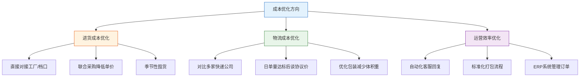
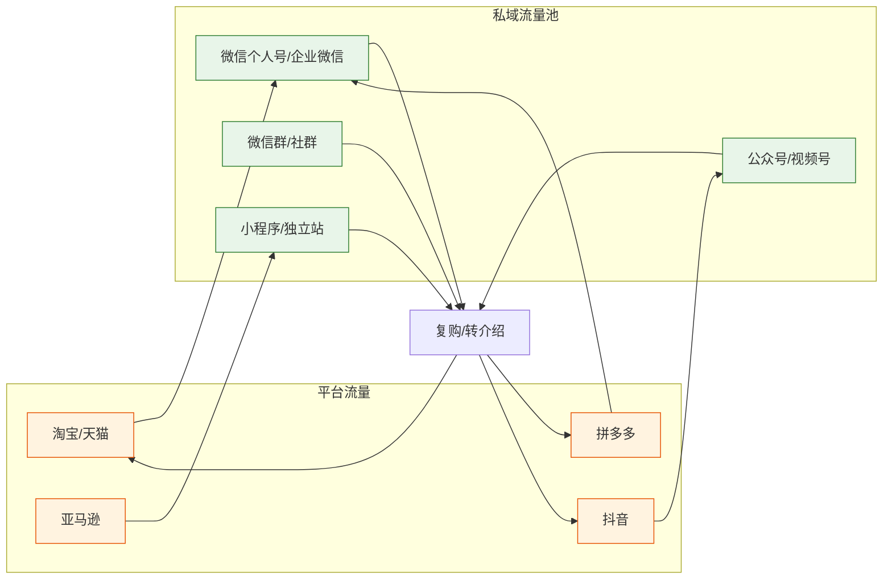
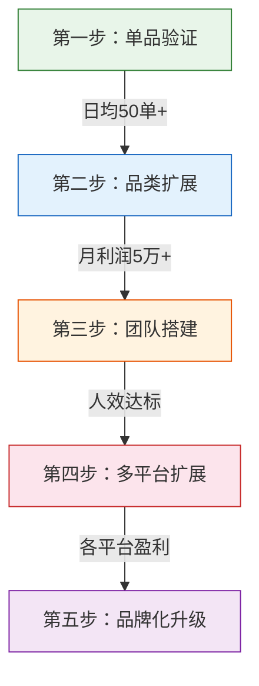
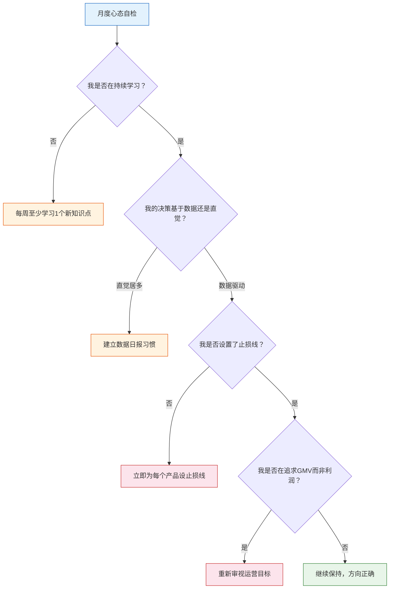
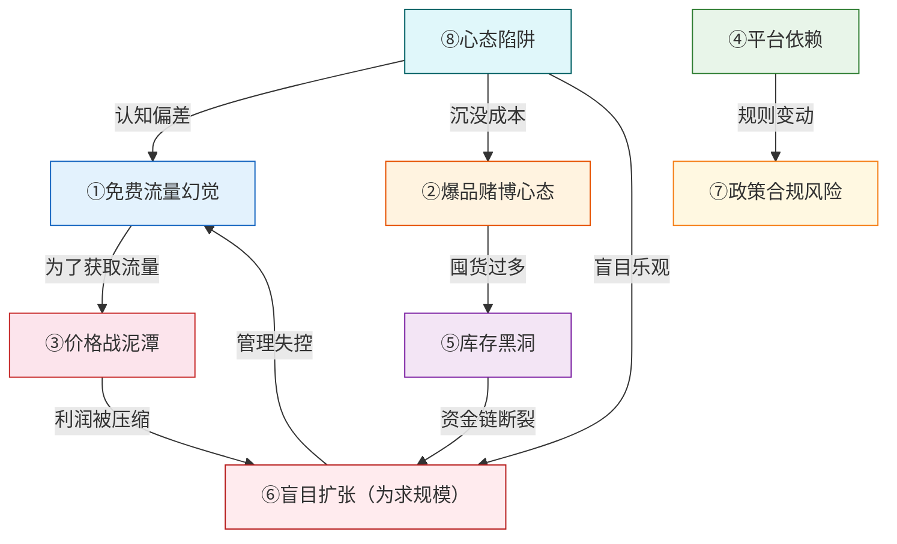

## 八、电商创业的常见陷阱

电商创业的失败率远高于大多数人的想象。根据中国电子商务研究中心的统计，淘宝店铺中约有95%处于不活跃或亏损状态；亚马逊卖家中，只有不到10%能在运营满两年后仍然盈利。这些失败并非源于运气差或市场不好，绝大多数都可以追溯到几个反复出现的结构性陷阱。

理解这些陷阱的底层逻辑，不是为了制造焦虑，而是为了让创业者在投入真金白银之前，建立一套完整的风险识别框架。本节将逐一拆解电商创业中最常见的八大陷阱，从表现形式、形成机制、典型案例到规避方法，构建系统的防御体系。

### 8.1 "免费流量"幻觉——低估流量获取成本

#### 8.1.1 陷阱表现

这是新手最容易踩的第一个坑。很多创业者在入行前的算账方式是这样的：

> 进货成本30元，售价99元，毛利69元，毛利率约70%。如果一天卖100单，月毛利就有20万+，扣掉快递费、包装费，怎么着也能赚10万。

这个计算最大的问题在于：**完全没有计入流量获取成本**。

在2024年的电商环境中，各平台的平均获客成本如下：

| 平台 | 自然流量占比 | 付费流量成本（CPC） | 平均获客成本（单客） |
|------|------------|-------------------|-------------------|
| 淘宝/天猫 | 15%-25% | 1.5-8元/点击 | 15-50元/人 |
| 拼多多 | 20%-35% | 0.5-3元/点击 | 8-25元/人 |
| 抖音电商 | 10%-20% | 0.8-5元/点击 | 20-60元/人 |
| 亚马逊（美国站） | 15%-30% | $0.5-3/点击 | $8-25/人 |
| 独立站 | 0%-5% | $0.3-2/点击 | $15-50/人 |

也就是说，一个售价99元、毛利69元的产品，如果获客成本是30元，实际每单利润只剩39元；如果获客成本是50元（在竞争激烈的类目中很常见），每单利润仅剩19元。再加上退货损耗（服装类目退货率可达30%-50%）、售后成本、平台扣点，很多产品实际上是**卖一单亏一单**。

#### 8.1.2 形成机制

"免费流量幻觉"的根源是**幸存者偏差**。社交媒体上大量的"月入十万"案例让新手误以为流量唾手可得，但这些案例刻意隐藏了以下几个事实：

- **早期红利已不存在**：2015年前后的淘宝、2019年前后的拼多多、2021年前后的抖音，都经历过流量红利期，早期入局者确实能低成本获客。但当平台进入成熟期，流量分配必然走向付费竞价模式。
- **自然流量本质是付费流量的"折扣券"**：平台给予自然流量的底层逻辑是"这个卖家已经证明了转化率高、客单价高、售后率低"。要达到这个证明，前期必须投入大量付费流量做数据积累。
- **隐性成本被忽略**：拍摄、美工、文案、客服、仓储、打包——这些不算在"获客成本"里，但都是运营的必要投入。

#### 8.1.3 规避方法

**方法一：先算流量账，再选品类**

在决定做某个品类之前，用以下公式估算真实利润空间：

```text
单品真实利润 = 售价 - 进货成本 - 物流成本 - 平台扣点 - 退货损耗分摊 - 单客获客成本
```

其中"单客获客成本"不能拍脑袋，要通过实际投放测试3-7天获取真实数据。

**方法二：设定获客成本红线**

不同品类的获客成本红线不同，一般建议：

| 品类 | 建议获客成本上限（占售价比例） |
|------|---------------------------|
| 服装鞋帽 | ≤ 20% |
| 美妆护肤 | ≤ 25% |
| 食品零食 | ≤ 15% |
| 数码3C | ≤ 10% |
| 家居日用 | ≤ 18% |
| 母婴用品 | ≤ 22% |

如果实际获客成本持续高于红线，说明品类竞争过于激烈或选品策略有问题，应该果断止损，而非持续烧钱。

**方法三：构建"流量阶梯"**

不要一开始就All-in付费流量。正确的流量获取顺序是：


每一层的投入都建立在上一层验证成功的基础上。只有自然流量跑通了转化，才值得投付费流量。

---

### 8.2 "一个爆品"赌博心态——选品策略陷阱

#### 8.2.1 陷阱表现

这是电商创业中代价最高的陷阱之一。典型表现是：

- 花大量时间精力找到一个"爆款"产品，ALL-IN押注
- 没有做小规模测试，直接大批量进货
- 没有Plan B，一旦这个产品失败，整个店铺瘫痪
- 被短期销量暴涨蒙蔽，忽略了产品生命周期

一个真实案例：2023年某创业者发现一款"可折叠泡脚桶"在抖音上爆火，未经充分测试就一次性进货5000个（单价28元，总计14万元）。前两周确实日销200+，但第三周开始大量差评涌入（材质异味、折叠关节断裂），退货率飙升至45%。加上竞品涌入导致价格战，售价从89元一路跌到49元，最终亏损超过8万元。

#### 8.2.2 形成机制

这种赌博心态的根源是**对"爆品"概念的误解**。

很多新手把"爆品"理解为"一个能让我一夜暴富的产品"，但实际上，成熟的电商运营者眼中的"爆品"是这样的：

- **它是经过数据验证的产品**：搜索量、转化率、竞争度、利润率都达标
- **它是店铺产品矩阵的一部分**：通常占店铺总销售额的30%-50%，而非100%
- **它有生命周期管理计划**：从引入期、成长期、成熟期到衰退期，每个阶段都有对应策略
- **它的供应链是可控的**：有备选供应商，不会因单一供应源中断而停摆

#### 8.2.3 规避方法

**方法一：建立科学的选品矩阵**

健康的店铺产品结构应该像一个金字塔：

```text
              ┌──────────────┐
              │   利润款(20%) │    ← 高毛利，低流量，品牌溢价
              │    约10-20个  │
              └──────┬───────┘
              ┌──────┴───────┐
              │   流量款(50%) │    ← 引流品，毛利适中，销量大
              │    约20-40个  │
              └──────┬───────┘
         ┌───────────┴───────────┐
         │     测款/储备款(30%)    │  ← 用于测试新趋势，随时准备替换
         │       约30-50个        │
         └───────────────────────┘
```

**方法二：执行"小批量测款"流程**

对于任何新品，严格遵循以下测试流程：

1. **第一步：数据初筛（1-2天）** — 用生意参谋/Jungle Scout等工具分析搜索量、竞争度、价格区间
2. **第二步：样品验证（3-5天）** — 购买3-5个竞品样品，对比质量、包装、卖点
3. **第三步：小批量进货（50-200件）** — 不超过1个月预估销量的50%
4. **第四步：7-14天数据测试** — 用付费流量测试点击率、转化率、收藏加购率
5. **第五步：数据达标后放量** — 只有当转化率超过品类均值1.5倍以上时，才加大投入

**方法三：设止损线**

每个产品设定明确的止损规则：

| 止损指标 | 止损线 | 行动 |
|---------|-------|------|
| 测试期（14天）点击率 | <品类均值0.5倍 | 停止投放，优化主图或换品 |
| 测试期（14天）转化率 | <品类均值 | 停止投放，优化详情页或换品 |
| 退货率 | >品类均值1.5倍 | 暂停上架，排查质量问题 |
| 月亏损额 | >预设预算（如5000元） | 清仓止损 |
| 库存周转天数 | >90天 | 降价清仓，回笼资金 |

---

### 8.3 价格战泥潭——定价策略陷阱

#### 8.3.1 陷阱表现

价格战是电商中最常见也最具破坏性的竞争方式。陷入价格战泥潭的店铺通常呈现以下特征：

- 持续降价但销量没有明显增长
- 利润率从正常的30%-40%一路跌到10%以下
- 为了维持利润，开始降低产品质量或减少服务
- 客户质量持续下降，退货率和差评率上升
- 形成"降价→利润缩水→降品质→差评增多→再降价"的恶性循环

在拼多多上，这个问题尤为突出。很多品类已经进入"成本定价"甚至"亏损定价"模式——卖家不是按"成本+合理利润"定价，而是按"比对手低0.1元"定价。

#### 8.3.2 形成机制

价格战的根本原因是**同质化竞争**。当你的产品和竞品在功能、外观、品质上没有明显差异时，消费者唯一的决策因素就是价格。

从博弈论角度看，价格战是一个典型的"囚徒困境"：

| | 竞品维持价格 | 竞品降价 |
|---|---|---|
| **你维持价格** | 双方利润稳定 | 你销量下降，竞品短期获客 |
| **你降价** | 你短期获客，竞品销量下降 | 双方利润崩溃 |

无论对手怎么做，"降价"看起来都是更优选择，最终导致双方都陷入亏损。

#### 8.3.3 规避方法

**方法一：差异化定价，跳出价格维度**

不要在同一维度上竞争。当你的产品和竞品的差异不是价格时，消费者就不会只看价格选择。差异化的方向包括：

- **功能差异化**：增加一个竞品没有的功能点（如保温杯+温度显示）
- **场景差异化**：针对特定使用场景设计（如办公室用的迷你加湿器）
- **包装差异化**：提升开箱体验，适合送礼场景
- **服务差异化**：延长保修期、提供使用教程、专属客服
- **内容差异化**：通过短视频/图文展示产品真实使用效果

**方法二：成本领先而非价格领先**

真正的成本优势来自供应链效率，而非压缩利润：



**方法三：建立价格护城河**

当你已经做到成本领先，可以在定价上做更聪明的选择：

- **引流款策略**：用1-2个低价引流款吸引客户，通过关联销售利润款实现整体盈利
- **阶梯定价**：设置满减门槛（如满99减10、满199减30），提升客单价
- **会员定价**：通过会员体系给予复购优惠，锁定长期价值

---

### 8.4 流量依赖症——平台依赖陷阱

#### 8.4.1 陷阱表现

很多电商卖家的生意完全寄生在某一个平台或某一种流量渠道上：

- 90%以上的销售额来自单一平台
- 高度依赖付费推广，一旦停投销量断崖式下跌
- 没有私域流量池，客户买完即走，无法二次触达
- 对平台规则变动极度敏感，一次算法调整就可能腰斩

最典型的案例是2021年亚马逊封号潮。那一年，亚马逊以"操纵评论"为由封禁了约5万个中国卖家账号，其中不乏年销过亿的大卖家。据估计，这次封号潮造成的直接经济损失超过千亿元。很多卖家一夜之间从月入百万变成零收入，因为他们所有的客户资产、运营数据、品牌积累全部沉淀在亚马逊平台上。

#### 8.4.2 形成机制

平台依赖的形成是渐进式的，有其"合理"的过程逻辑：

1. **起步期**：选择一个平台深耕，资源集中，这是正确策略
2. **成长期**：在该平台上越做越好，形成路径依赖
3. **成熟期**：平台已经成为"舒适区"，开拓新渠道意味着不确定性
4. **危机期**：平台政策变动、竞争加剧、算法调整，突然发现没有备选方案

关键问题在于：**把"起步期的集中策略"延续成了"全生命周期的依赖"**。

#### 8.4.3 规避方法

**方法一：建立"平台+私域"双轮驱动模型**



核心原则：**每一次平台交易都应该是获取用户触达方式的机会**。具体操作：

- 包裹卡引流：每个包裹放一张卡片，引导客户加微信，附赠优惠券或使用教程
- 售后触点：在售后沟通中提供微信客服入口，解决"平台消息看不及时"的问题
- 内容引流：在公众号/视频号持续产出与品类相关的专业内容，吸引客户关注

**方法二：多平台布局的正确节奏**

不建议同时在5个平台开店。正确的节奏是：

| 阶段 | 主平台 | 辅助渠道 | 重心 |
|------|-------|---------|------|
| 0-6个月 | 选定1个平台深耕 | 无 | 产品和运营验证 |
| 6-12个月 | 主平台稳定出单 | 开设第2个平台 | 测试跨平台运营能力 |
| 12-18个月 | 主平台+第2平台 | 启动私域建设 | 建立多渠道流量矩阵 |
| 18个月以上 | 多平台+私域 | 独立站/自建渠道 | 分散风险，提升利润率 |

**方法三：建立"不可迁移"的核心资产**

以下资产不受单一平台限制，是真正的"护城河"：

- **供应链关系**：与工厂/供应商建立深度合作关系，而非简单的买货关系
- **产品研发能力**：能持续推出新品的能力，而非只靠选品
- **内容资产**：高质量的产品图片、视频、文案，可在任何平台复用
- **客户数据库**：CRM系统中沉淀的客户信息、购买记录、偏好标签

---

### 8.5 库存黑洞——库存管理陷阱

#### 8.5.1 陷阱表现

库存问题是中国电商卖家的第一大"现金杀手"。常见表现：

- 库房里堆满了卖不动的滞销品，资金被牢牢锁死
- 爆款产品突然断货，错过销售黄金期
- 季节性商品判断失误，应季时没货，过季时压仓
- 库存周转率极低，一年只周转2-3次

行业数据显示，中国电商卖家的平均库存周转天数在60-120天之间。意味着投入的货款需要2-4个月才能回笼。对于资金有限的中小卖家来说，这意味着：**一旦选品失误或销售不及预期，现金流就会迅速断裂**。

一个触目惊心的案例：2022年某服装卖家在双十一前进了一批价值30万的冬装，预测销售周期为2个月。但由于天气偏暖+竞品提前降价，实际销售只完成了预期的40%。剩余60%的库存不得不以3-5折清仓，最终这批货的总亏损超过12万元。

#### 8.5.2 形成机制

库存问题的根源是**需求预测的不确定性**和**供应链响应速度的滞后性**之间的矛盾。

- **需求侧不确定**：消费者偏好变化快、竞品促销影响、季节/天气变化、平台活动打乱节奏
- **供给侧有滞后**：从下单到工厂生产到物流入库，通常需要7-30天
- **心理因素放大**：害怕缺货导致过度备货（"宁可多进也不能断货"）

#### 8.5.3 规避方法

**方法一：建立科学的库存管理公式**

```text
安全库存 = 日均销量 × (供应商交期 + 安全天数) × 波动系数
```

其中：
- **日均销量**：取近7天的移动平均值，而非峰值
- **安全天数**：一般设3-7天，高波动品类设7-15天
- **波动系数**：稳定品类用1.2，波动品类用1.5-2.0

**补货触发点 = 安全库存 + 在途库存**
当实际库存降到补货触发点以下时，立即下单补货。

**方法二：采用"小批量、多频次"的进货策略**

| 进货策略 | 优点 | 缺点 | 适用场景 |
|---------|------|------|---------|
| 大批量低频次 | 单价低，物流省 | 资金占用大，风险高 | 已验证的长期爆款 |
| 中批量中频次 | 平衡成本和风险 | 管理复杂度适中 | 大多数成熟店铺 |
| 小批量高频次 | 资金占用少，风险低 | 单价高，物流成本高 | 新品测试期、波动品类 |

对于绝大多数中小卖家，建议**优先选择小批量高频次**，宁可进货成本高一点，也不要冒库存积压的风险。等产品进入成熟期、销量稳定后，再逐步切换到中批量中频次。

**方法三：设置库存预警和清仓机制**

| 库存状态 | 判断标准 | 行动 |
|---------|---------|------|
| 正常 | 库存可售天数 15-60天 | 按计划补货 |
| 预警 | 库存可售天数 60-90天 | 减少进货，关注动销率 |
| 危险 | 库存可售天数 >90天 | 立即启动促销清仓 |
| 断货风险 | 库存可售天数 <7天 | 优先紧急补货，考虑空运 |

---

### 8.6 盲目扩张——规模化的陷阱

#### 8.6.1 陷阱表现

当店铺开始盈利，很多卖家的本能反应是"扩大规模"。但盲目扩张往往是利润蒸发的开始：

- 开设过多平台店铺，管理精力分散，每个店铺都做不好
- 过早招人扩团队，人工成本吞噬利润
- 盲目扩大品类，从专精走向杂货铺，品牌定位模糊
- 囤积大量设备和仓储空间，固定成本飙升
- 追求GMV（成交总额）而非利润，表面繁荣实则亏损

一个典型的扩张失败案例：某卖家在拼多多做到月销30万后，信心膨胀，同时入驻淘宝、京东、抖音，并招了5人团队（运营2人、客服2人、美工1人），月固定支出从8000元飙升到6万元。但由于精力分散，新平台都没做起来，原有的拼多多店铺也因为运营质量下滑导致销量下降30%。半年后，不仅新增的收入无法覆盖新增成本，连原有的利润都被消耗殆尽。

#### 8.6.2 形成机制

盲目扩张的根源是**对"规模经济"的错误理解**。

规模经济有明确的前置条件：

- 产品标准化程度高（可以批量复制）
- 管理体系成熟（有SOP、有数据监控）
- 供应链能力强（能支撑更大体量）
- 团队能力匹配（有人能执行）
- 现金流充裕（能承受扩张期的亏损）

很多卖家在这些条件都不具备的情况下强行扩张，结果是**规模不经济**——体量越大，单位成本反而越高。

#### 8.6.3 规避方法

**方法一：执行"单点突破"原则**

在任何一个维度上取得成功之前，不要在其他维度上扩张。优先级如下：



**方法二：用"人效指标"约束扩张**

在招人扩团队之前，先计算清楚人效：

```text
人效 = 月利润 / 团队人数
```

- **人效 < 1万/人/月**：说明还没到需要招人的阶段，继续单干或用外包
- **人效 1-2万/人/月**：可以考虑招1-2个核心助手
- **人效 > 2万/人/月**：有扩团队的空间，但要循序渐进

**方法三：区分"收入增长"和"利润增长"**

每次扩张决策前，必须算清这笔账：

| 扩张项目 | 新增收入 | 新增成本 | 净利润变化 |
|---------|---------|---------|----------|
| 开新平台 | +3万/月 | 平台费+运营成本2.5万 | +0.5万（风险高） |
| 拓展新品类 | +5万/月 | 进货+推广4.5万 | +0.5万（需验证） |
| 招新员工 | +0（短期无直接收入） | 工资+社保1万 | -1万（需转化） |

如果新增成本大于新增收入，或者净增长微薄且不确定，就应该暂缓扩张。

---

### 8.7 政策与合规风险——平台规则陷阱

#### 8.7.1 陷阱表现

电商运营涉及大量法律法规和平台规则，很多卖家在"不知道"的情况下违规，等收到处罚时才发现：

- **知识产权侵权**：使用了他人的图片、商标、专利设计，被投诉后店铺扣分甚至关店
- **虚假宣传**：使用"最好""第一""100%有效"等绝对化用语，违反《广告法》
- **税务合规**：大量现金交易不入账、不开票，被税务稽查
- **资质缺失**：食品、保健品、化妆品等需要特殊资质的品类，没有相关许可证
- **刷单风险**：被平台检测到虚假交易，降权、罚款甚至封店
- **跨境合规**：不了解目标国的进口法规、产品标准、标签要求，货物被海关扣留

2023年，仅淘宝平台就处理了超过200万条知识产权投诉，处罚了超过50万家店铺。很多中小卖家因为一张侵权图片就被扣48分，直接关店。

#### 8.7.2 关键合规检查清单

**开店前必查清单：**

| 合规项目 | 检查内容 | 风险等级 |
|---------|---------|---------|
| 营业执照 | 经营范围是否覆盖所售品类 | 🔴 高 |
| 品牌授权 | 是否有品牌方的授权书（代理/经销） | 🔴 高 |
| 商标注册 | 自有品牌是否完成商标注册 | 🟡 中 |
| 产品资质 | 3C认证/质检报告/食品经营许可证等 | 🔴 高 |
| 图片版权 | 所有图片是否为自拍或已获授权 | 🟡 中 |
| 广告用语 | 是否含有绝对化用语、虚假功效承诺 | 🟡 中 |
| 税务登记 | 是否完成税务登记，发票开具流程 | 🔴 高 |
| 数据隐私 | 客户信息处理是否符合《个人信息保护法》 | 🟡 中 |

**日常运营合规要点：**

- 每次发布新品前，用"中国商标网"和"企查查"检查是否涉及商标侵权
- 产品详情页中避免使用"最""第一""顶级""100%"等绝对化词语
- 食品/化妆品类产品必须在详情页展示相关资质证书
- 保留所有进货发票和供应商资质文件，至少保存3年
- 定期检查平台规则更新公告（每月至少1次）

#### 8.7.3 规避方法

**方法一：建立合规审查SOP**

每个新品上架前，必须通过以下检查流程：

```text
选品确认 → 商标/专利查询 → 供应商资质审核 → 产品图片版权确认
    → 详情页广告法合规检查 → 产品资质证书准备 → 上架
```

任何一步不通过，暂停上架直到问题解决。

**方法二：购买电商保险**

建议购买以下保险：

- **产品责任险**：覆盖因产品缺陷导致的消费者人身伤害或财产损失
- **退货运费险**：降低退货成本，提升消费者信任
- **账户安全险**：覆盖因平台误判导致的损失（部分平台提供）

---

### 8.8 心态陷阱——创业者的认知误区

#### 8.8.1 陷阱表现

前面七个陷阱更多是技术层面的，而心态陷阱是底层操作系统级别的问题。最常见的几种：

**误区一："做了就要坚持"的沉没成本谬误**

很多创业者在明知项目不可行的情况下，因为"已经投入了这么多"而不愿意及时止损。事实上，继续投入亏损项目的机会成本（时间、资金、精力）远高于直接止损。

正确做法：定期（每月/每季度）用"如果今天从零开始，我还会做这个项目吗？"这个问题来审视自己的业务。如果答案是否定的，就应该果断止损。

**误区二："别人能做我也能做"的盲目对标**

看到别人在某个品类/平台上赚到钱，就认为自己也能复制。但实际上：

- 你看到的是结果，看不到别人背后的资源（资金、供应链、团队、经验）
- 先发优势在电商中非常重要，等你进场时市场可能已经饱和
- 每个人的能力圈不同，适合别人的不一定适合你

**误区三："低价=亲民"的品牌定位误区**

很多新手把"便宜"当作核心卖点。但低价策略有两个致命问题：

- 低价吸引的客户忠诚度最低，他们只看价格，一旦有更便宜的就流失
- 低价压缩利润空间，让你没有余力投入产品升级和品牌建设

正确的做法是从一开始就思考"我的产品比竞品贵的理由是什么"，然后把资源投入到打造这个理由上。

**误区四："先做起来再说"的规划缺失**

没有清晰的商业计划就盲目投入，是很多创业失败的根源。即使是一份简单的计划，也应该回答以下问题：

| 必答问题 | 说明 |
|---------|------|
| 卖什么？ | 具体品类和产品范围 |
| 卖给谁？ | 目标客户画像 |
| 在哪卖？ | 主要平台和渠道 |
| 怎么赚钱？ | 定价策略和利润模型 |
| 需要多少启动资金？ | 首批进货+推广+3个月运营费 |
| 多久能回本？ | 盈亏平衡点在哪里 |
| 最大风险是什么？ | 可能亏损多少，能否承受 |

#### 8.8.2 心态自检框架

建议每月做一次"创业心态自检"：



---

### 8.9 陷阱全景图与自检清单

#### 8.9.1 八大陷阱的关联关系

这八大陷阱并非孤立存在，它们之间有很强的因果关联和放大效应：



注意：**心态陷阱（⑧）是所有其他陷阱的放大器**。认知偏差会让人更容易犯流量幻觉、爆品赌博、盲目扩张的错误；沉没成本谬误会让人在掉入陷阱后无法及时脱身。

#### 8.9.2 创业者自检清单

在每个关键节点（开店前、月度复盘、季度规划时），用以下清单自检：

| 序号 | 自检项目 | 状态 |
|------|---------|------|
| 1 | 我是否清楚每单的真实获客成本？ | ☐ 是 ☐ 否 |
| 2 | 我的店铺是否有至少3个以上的产品线？ | ☐ 是 ☐ 否 |
| 3 | 我是否设置了每个产品的止损线？ | ☐ 是 ☐ 否 |
| 4 | 我的定价是否基于成本核算而非跟竞品比价？ | ☐ 是 ☐ 否 |
| 5 | 我是否在建设私域流量（而非100%依赖平台）？ | ☐ 是 ☐ 否 |
| 6 | 我的库存周转天数是否在60天以内？ | ☐ 是 ☐ 否 |
| 7 | 我的人效（月利润/人数）是否大于1万？ | ☐ 是 ☐ 否 |
| 8 | 我的产品是否有知识产权合规保障？ | ☐ 是 ☐ 否 |
| 9 | 我的决策是否基于数据分析而非感觉？ | ☐ 是 ☐ 否 |
| 10 | 如果今天从零开始，我还会做这个项目吗？ | ☐ 是 ☐ 否 |

如果答案中"否"超过3个，说明你正在至少3个陷阱的边缘或内部，需要立即制定纠正计划。

---

### 8.10 本节小结

电商创业的八大陷阱可以归为三个层面：

| 层面 | 陷阱 | 核心教训 |
|------|------|---------|
| **战略层** | 流量幻觉、爆品赌博、盲目扩张 | 先验证再投入，小步快跑 |
| **运营层** | 价格战、库存黑洞、平台依赖 | 精细化管理，分散风险 |
| **合规层** | 政策合规风险 | 合规是底线，不是可选项 |
| **认知层** | 心态陷阱 | 数据驱动决策，及时止损 |

记住一个核心原则：**电商创业的本质是商业经营，不是赌博**。赌博靠运气，商业靠系统。建立选品系统、流量系统、库存系统、财务系统、合规系统——这些才是让你在电商领域长期生存的根本。

成功的电商创业者和失败的电商创业者之间的差距，往往不在于谁更聪明或更努力，而在于谁更早地认识到了这些陷阱，并在掉进去之前建立了防御机制。

***

> **延伸阅读**：关于选品方法论的详细实操，参见《核心技巧/一、选品方法论》；关于库存管理的具体工具和流程，参见《核心技巧/五、供应链管理技巧》；关于跨境电商的特殊合规要求，参见《核心技巧/六、跨境电商特殊技巧》。
