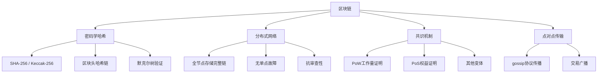
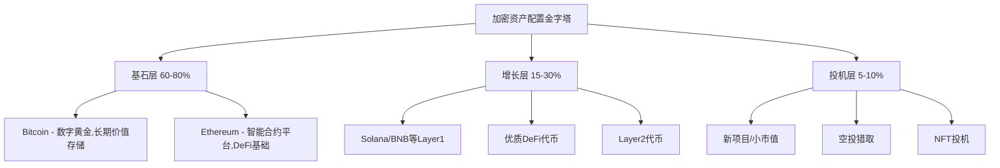
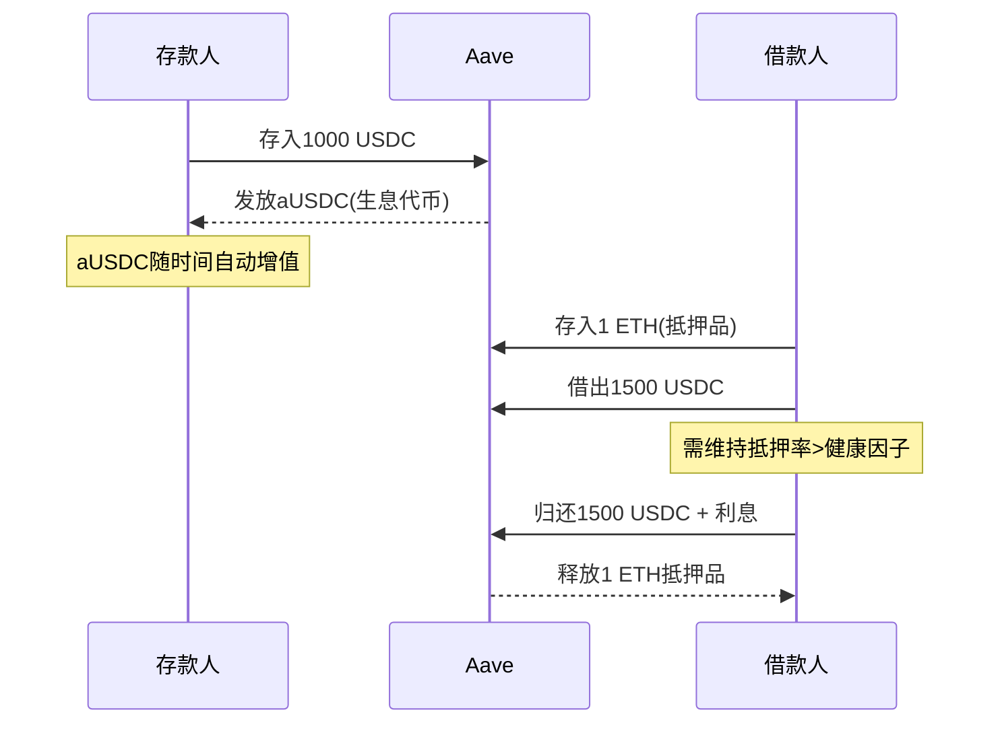

# 第十二章：加密货币与DeFi

> "Bitcoin is a technological tour de force." —— 比尔·盖茨

加密货币和去中心化金融（DeFi）是自互联网以来最具颠覆性的金融创新。比特币从2009年一个密码学极客的实验品，成长为市值超过万亿美元的资产类别；以太坊催生了一个无需许可的全球金融系统，管理着数百亿美元的资产。这些不是泡沫，而是范式转移——虽然过程中充满了投机、骗局和剧烈波动。

本章将从区块链底层原理讲起，覆盖主流加密货币分析、钱包安全、投资策略、DeFi协议机制、NFT生态、链上分析、安全防护、合规税务等完整知识体系，为不同阶段的参与者提供从入门到精通的系统指南。

**重要提示**：加密货币投资风险极高，本章内容仅供学习参考，不构成投资建议。请在充分了解风险后，用自己能够承受损失的资金进行投资。

---

## 12.1 区块链基础与技术原理

### 12.1.1 区块链是什么

区块链本质上是一个**分布式账本**——想象一个村子里所有人共用一本账本，每笔交易全村人都能看到、都能验证，任何人都无法偷偷篡改以前的记录。区块链把"全村人"换成了全球成千上万的计算机节点，把"账本"换成了密码学保护的数据结构。

**核心技术组件**：



**区块结构详解**：

每个区块包含两部分：**区块头**和**交易数据**。区块头存储元数据（版本号、前一区块哈希、默克尔根、时间戳、难度目标、随机数nonce），交易数据则包含该区块打包的所有交易。

区块之间通过"前一区块哈希"字段首尾相连，形成链条。篡改任何一个历史区块，都会导致其后所有区块的哈希失效——这就是区块链"不可篡改"的技术基础。

**哈希函数的魔力**：

哈希函数是区块链的基石。以SHA-256为例，它将任意长度的输入转换为固定的256位输出，具有三个关键特性：

| 特性 | 含义 | 实际意义 |
|------|------|----------|
| 单向性 | 无法从哈希值反推原始数据 | 私钥安全的基础 |
| 雪崩效应 | 输入改变1个比特，输出完全不同 | 任何篡改立即暴露 |
| 抗碰撞 | 找到两个不同输入产生相同哈希极其困难 | 数据完整性保证 |

**共识机制深度对比**：

共识机制解决的是分布式系统中的核心问题：当没有中央权威时，如何让所有节点对"哪条链是正确的"达成一致？

| 维度 | PoW（工作量证明） | PoS（权益证明） | DPoS（委托权益证明） |
|------|-------------------|-----------------|---------------------|
| 代表项目 | 比特币、莱特币 | 以太坊、Cardano | EOS、TRON |
| 安全模型 | 算力即权力 | 质押即权力 | 投票即权力 |
| 能源消耗 | 极高（与小国相当） | 极低（PoW的0.01%） | 极低 |
| 出块时间 | ~10分钟（BTC） | ~12秒（ETH） | ~0.5秒（EOS） |
| 去中心化程度 | 高（但矿池集中） | 中等 | 较低（节点少） |
| 攻击成本 | 需51%算力 | 需51%质押量 | 需控制多数投票节点 |
| 适合场景 | 价值存储 | 通用智能合约平台 | 高性能应用链 |

**以太坊合并（The Merge）**：2022年9月，以太坊从PoW转向PoS，这是加密货币历史上最重大的技术升级之一。合并后以太坊能耗下降约99.95%，同时引入了质押机制——用户质押32个ETH即可成为验证者，通过验证交易获得奖励。

### 12.1.2 主流加密货币

#### Bitcoin（BTC）—— 数字黄金

比特币是加密货币的开创者，也是目前市值最大的加密货币。理解比特币，需要理解它的技术特性和经济模型。

**技术规格**：

| 参数 | 数值 | 说明 |
|------|------|------|
| 总量上限 | 2,100万枚 | 硬编码在协议中，不可更改 |
| 出块时间 | ~10分钟 | 通过难度调整保持稳定 |
| 区块大小 | ~1-4MB | SegWit后实际容量提升 |
| 减半周期 | 约4年（210,000个区块） | 每次减半将区块奖励减半 |
| 当前区块奖励 | 3.125 BTC（2024减半后） | 最终在2140年左右趋近于零 |
| 交易确认 | 6个区块确认为安全 | 约60分钟 |
| 脚本系统 | 非图灵完备 | 有意限制，专注安全 |

**比特币减半历史与价格影响**：

减半是比特币最重要的经济事件——矿工的区块奖励每4年减半一次，新币供给减少，理论上对价格有支撑作用：

| 减半时间 | 区块高度 | 减半前价格 | 减半后1年价格 | 涨幅 |
|----------|----------|-----------|--------------|------|
| 2012年11月 | 210,000 | ~$12 | ~$1,000 | ~83倍 |
| 2016年7月 | 420,000 | ~$650 | ~$2,500 | ~4倍 |
| 2020年5月 | 630,000 | ~$8,600 | ~$57,000 | ~7倍 |
| 2024年4月 | 840,000 | ~$64,000 | 待观察 | - |

历史数据表明减半后12-18个月通常出现牛市，但"过去的回报不代表未来表现"——市场规模、宏观环境、监管政策等因素都在变化。

**比特币的价值来源**：

比特币的价值不来自任何实体资产背书，而是来自**网络共识**——全球数百万人共同相信它有价值，就像黄金一样。具体来说：

- **稀缺性**：2100万枚硬上限，且约400万枚已永久丢失（私钥丢失、发送到错误地址等）
- **去中心化**：没有发行方、没有CEO、没有服务器，运行15年从未停机
- **抗审查**：任何人只要有网络就能发送和接收，不经过任何中介
- **可验证**：所有交易公开透明，任何人都可以独立验证
- **便携性**：只需记住12个助记词就能携带任意金额穿越国境

**比特币的局限性**：

- 交易速度慢（约7 TPS），不适合日常支付
- 能源消耗大（但支持者认为这正是安全性的来源）
- 价格波动剧烈，难以作为计价单位
- 脚本能力有限，无法支持复杂智能合约

#### Ethereum（ETH）—— 世界计算机

以太坊不仅仅是"另一种加密货币"，它是一个可编程的区块链平台——任何人可以在上面部署智能合约，构建去中心化应用（DApp）。

**以太坊的核心创新——智能合约**：

智能合约是部署在区块链上的自动执行程序。以一个简单的例子理解：你和朋友打赌明天是否下雨，赌注是1个ETH。传统方式需要一个双方信任的第三方来托管资金和判定结果；智能合约方式则是写一段代码：读取天气预言机的数据，如果下雨就把2个ETH发给朋友，否则发给你。代码部署后自动执行，没有人为干预的可能。

```solidity
// 极度简化的赌约合约示例
contract WeatherBet {
    address payable player1;
    address payable player2;
    uint betAmount;
    
    function claimWin(bool didRain) external {
        // 实际实现需要预言机和更多安全检查
        if (didRain) {
            player2.transfer(betAmount * 2);
        } else {
            player1.transfer(betAmount * 2);
        }
    }
}
```

**以太坊技术规格**：

| 参数 | 数值 | 说明 |
|------|------|------|
| 出块时间 | ~12秒 | PoS后显著缩短 |
| 共识机制 | PoS + Casper FFG | 2022年9月合并后 |
| 质押要求 | 32 ETH | 成为独立验证者的最低要求 |
| Gas机制 | EIP-1559 | 基础费销毁 + 小费给验证者 |
| 虚拟机 | EVM | 图灵完备，支持复杂计算 |
| 代币标准 | ERC-20/721/1155 | 同质化/NFT/混合代币 |
| Layer 2 | Optimism, Arbitrum, zkSync | 扩展方案，降低Gas费 |

**EIP-1559与通缩机制**：2021年8月实施的EIP-1559改变了以太坊的费用结构——每笔交易的基础费用（Base Fee）被销毁而非给矿工/验证者。在网络活跃时，销毁的ETH可能超过新发行的ETH，使ETH进入通缩状态。这意味着以太坊使用越频繁，ETH的净供应量反而越少。

#### 其他主流公链

| 公链 | 共识机制 | TPS | Gas费 | 定位 | 生态成熟度 |
|------|----------|-----|-------|------|-----------|
| Solana | PoH + PoS | ~65,000 | <$0.01 | 高性能DeFi/游戏 | 高 |
| BNB Chain | PoSA | ~160 | <$0.3 | DeFi + CeFi桥梁 | 高 |
| Avalanche | Snow* | ~4,500 | ~$0.02 | 机构级DeFi | 中高 |
| Cardano | Ouroboros PoS | ~250 | ~$0.2 | 学术驱动开发 | 中 |
| Polkadot | NPoS | ~1,000 | 变动 | 跨链互操作 | 中 |
| Cosmos | Tendermint BFT | ~10,000 | <$0.01 | 应用链生态 | 中 |

#### 稳定币——加密世界的"美元"

稳定币是锚定法币（通常是美元）的加密货币，是加密市场的基础设施。没有稳定币，加密市场将难以运转。

**三大稳定币对比**：

| 维度 | USDT（Tether） | USDC（Circle） | DAI（MakerDAO） |
|------|---------------|----------------|-----------------|
| 发行方 | Tether Limited | Circle + Coinbase | 去中心化协议 |
| 锚定机制 | 法币储备 | 法币储备 | 超额加密资产抵押 |
| 市值 | ~1,100亿 | ~330亿 | ~53亿 |
| 储备透明度 | 季度证明（争议较多） | 月度审计 | 链上完全透明 |
| 监管友好度 | 低 | 高（受美国监管） | 中（去中心化） |
| 主要链 | Omni, ETH, TRON, SOL等 | ETH, SOL等 | 以太坊 |
| 使用场景 | 交易对、转账 | 合规场景、DeFi | DeFi原生场景 |

**如何选择稳定币**：如果你在中心化交易所交易，USDT流动性最好；如果你重视合规和透明度，USDC更安全；如果你在DeFi中操作且追求去中心化，DAI是首选。经验法则是**不要把所有鸡蛋放在一个稳定币篮子里**——分散持有可以降低单一稳定币脱锚的风险。

### 12.1.3 钱包与资产安全

钱包是加密世界最重要的基础设施——你的钱包就是你的银行账户，私钥就是你的密码。区别在于：银行密码忘了可以重置，私钥丢了就永远找不回来了。

#### 钱包类型详解

**私钥、公钥与地址的关系**：

```text
助记词（12/24个英文单词）
    ↓ BIP-39推导
私钥（256位随机数，绝对保密）
    ↓ 椭圆曲线加密
公钥（可公开，用于验证签名）
    ↓ Keccak-256哈希
地址（0x开头，用于收款）
```

**助记词（Mnemonic）**：助记词是私钥的人类可读形式，通常由12个或24个英文单词组成（BIP-39标准）。掌握助记词就等于掌握了该钱包的所有资产。BIP-39词表包含2048个英文单词，12个助记词的可能组合数约为2^128，这是一个天文数字——暴力破解在当前技术下不可行。

**热钱包 vs 冷钱包**：

| 维度 | 热钱包（软件钱包） | 冷钱包（硬件钱包） |
|------|-------------------|-------------------|
| 代表产品 | MetaMask, Phantom, Trust Wallet | Ledger, Trezor, OneKey |
| 联网状态 | 永远联网 | 签名时不联网 |
| 安全性 | 较低（易受恶意软件攻击） | 极高（私钥不离开设备） |
| 便利性 | 极高（随时操作） | 较低（需要物理设备） |
| 适合场景 | 日常交易、小额DeFi交互 | 大额长期存储 |
| 价格 | 免费 | ¥500-2000 |

**MetaMask使用指南**（最常用的以太坊钱包）：

1. **安装**：只从官方网站（metamask.io）或官方浏览器扩展商店下载，假MetaMask是最常见的钓鱼方式之一
2. **创建钱包**：设置强密码（仅用于本地加密，不等于私钥）
3. **备份助记词**：手写在纸上，存放在至少两个物理位置；绝对不要截图、拍照、存在云盘或发送给自己
4. **添加网络**：默认只有以太坊主网，需要手动添加BSC、Polygon等网络
5. **连接DApp**：通过浏览器扩展与DeFi网站交互

**硬件钱包操作要点**：

硬件钱包（如Ledger）的核心价值是：私钥永远不离开硬件设备。当你需要发送交易时，交易数据发到硬件设备上签名，签名结果发回电脑，但私钥本身不会暴露给电脑。

- **购买渠道**：只从官网或授权经销商购买，绝不买二手设备
- **初始化**：收到后先检查包装是否完好，设备是否有预设PIN码（若有则可能是被篡改的）
- **备份助记词**：Ledger会生成24个助记词，手写在官方提供的恢复卡上
- **验证地址**：首次收款前，先发一小笔测试交易确认地址正确
- **固件更新**：定期更新固件，但只通过官方Ledger Live应用更新

**助记词安全存储方案**：

| 方案 | 安全性 | 便利性 | 成本 | 说明 |
|------|--------|--------|------|------|
| 纸质备份 | 中 | 高 | $0 | 最基本，但怕火/水/损坏 |
| 金属助记词板 | 高 | 中 | $30-100 | 防火防水，推荐 |
| 多重分片（Shamir） | 极高 | 低 | 取决于方案 | 将助记词拆分存储在不同位置 |
| 银行保险箱 | 高 | 低 | 年费$50-200 | 物理安全好，但有被冻结风险 |

#### 钱包安全实操清单

**必做事项**：
- 助记词手写在纸上/金属板上，存放在至少两个物理位置
- 使用硬件钱包存储超过1个月工资的加密资产
- 每次转账前确认地址（至少比对首尾各4个字符）
- 使用Etherscan等区块浏览器验证合约地址
- 定期检查钱包授权（revoke.cash），撤销不再使用的授权

**绝不做事项**：
- 绝不在任何网站、聊天中输入助记词（任何要求你输入助记词的都是骗局）
- 绝不截图或数字存储助记词（手机备份、iCloud、微信收藏都不安全）
- 绝不使用来路不明的空投代币（可能包含恶意合约）
- 绝不与陌生人共享屏幕（屏幕共享时可以看到你的操作）
- 绝不在公共WiFi下进行加密货币操作

### 12.1.4 交易所选择

#### 中心化交易所（CEX）

中心化交易所就像加密世界的银行——你把钱存在交易所，交易所帮你撮合交易。优点是方便、快速、交易对丰富；缺点是你不掌握私钥，交易所可能被黑客攻击、可能跑路、可能冻结你的账户。**"Not your keys, not your coins"**——不是你的私钥，就不是你的币。

**全球主流交易所对比**：

| 交易所 | 日均交易量 | 手续费 | 主要优势 | 主要劣势 | 合规状态 |
|--------|-----------|--------|----------|----------|----------|
| Binance（币安） | ~$150亿 | 0.1%（BNB折扣至0.075%） | 币种最多、流动性最好 | 界面复杂、部分国家受限 | 多国牌照，但监管争议不断 |
| OKX（欧易） | ~$50亿 | 0.1%起 | 衍生品丰富、Web3钱包好 | 部分功能学习曲线高 | 多国牌照 |
| Bybit | ~$100亿 | 0.1% | 衍生品体验好、增长快 | 现货深度不如币安 | 新加坡等多国 |
| Coinbase | ~$20亿 | 0.5%（高级0.6%起） | 美国上市公司、最合规 | 费用高、币种少 | 美国SEC监管 |
| Kraken | ~$5亿 | 0.16-0.26% | 安全记录好、欧洲用户多 | 交易量下降 | 美国/欧洲合规 |

**交易所安全评估框架**：

在选择交易所时，用以下框架评估：

1. **历史安全记录**：是否曾被黑客攻击？损失了多少？如何赔付？
2. **储备证明（Proof of Reserves）**：交易所是否公开了链上储备证明？FTX暴雷后这变得尤为重要
3. **冷热钱包比例**：多少资产存在冷钱包？是否有保险基金？
4. **合规牌照**：在运营的国家/地区是否持牌？
5. **KYC要求**：虽然KYC增加了隐私成本，但也意味着交易所在主动配合监管
6. **提现速度和限额**：正常提现需要多久？是否有不合理的提现限制？

**自保原则**：
- 不要在任何交易所存放超过你需要交易的金额
- 交易完成后及时提到自己的钱包
- 开启所有可用的安全措施（2FA、提币白名单、反钓鱼码）
- 记录所有交易所的登录信息和2FA恢复码

#### 去中心化交易所（DEX）

去中心化交易所没有"中介"——交易直接在用户的钱包之间通过智能合约完成。你始终掌控自己的私钥。

**自动做市商（AMM）原理**：

传统交易所使用订单簿（买方挂买单，卖方挂卖单，价格匹配成交）。DEX使用不同的机制——**自动做市商（AMM）**。

以Uniswap的恒定乘积公式为例：在一个ETH/USDC交易池中，流动性提供者存入ETH和USDC，保持 `x * y = k`（两种代币数量的乘积为常数）。当有人用USDC买ETH时，池中ETH减少、USDC增加，ETH的价格自动上升。无需订单簿，价格由数学公式决定。

```text
初始状态：100 ETH × 300,000 USDC = 30,000,000 (k)
用户买入10 ETH：
  剩余 ETH = 90
  需要 USDC = 30,000,000 / 90 - 300,000 = 33,333 USDC
  ETH 隐含价格 = 33,333 / 10 = 3,333 USDC/ETH（高于市场价格，滑点）
```

**主要DEX对比**：

| DEX | 链 | 模式 | 特点 | 日均交易量 |
|-----|-----|------|------|-----------|
| Uniswap V3 | ETH, Arbitrum, Polygon等 | 集中流动性AMM | 流动性效率最高 | ~$10亿 |
| Curve | ETH, 多链 | 专用稳定币AMM | 稳定币兑换滑点最低 | ~$2亿 |
| Raydium | Solana | 订单簿+AMM | Solana生态首选 | ~$3亿 |
| PancakeSwap | BSC | AMM | BSC生态首选、低Gas | ~$1亿 |
| dYdX | 自有链 | 订单簿 | 去中心化衍生品 | ~$5亿 |

**使用DEX的实操步骤**（以Uniswap为例）：

1. 安装MetaMask并充值ETH（用于Gas费）和要交易的代币
2. 访问app.uniswap.org（务必确认URL正确）
3. 连接钱包
4. 选择交易对和数量
5. 检查滑点设置（正常0.5-1%，高波动时可提高到3-5%）
6. 点击Swap，钱包弹出签名确认
7. 确认Gas费合理后签名，等待交易确认

**DEX交易注意事项**：
- **滑点保护**：设置合理的滑点容忍度，过低会导致交易失败，过高可能被MEV三明治攻击
- **合约验证**：在Etherscan上验证代币合约地址，假代币骗局极为常见
- **授权管理**：授权（Approve）操作允许合约使用你的代币，使用完毕后在revoke.cash撤销授权
- **Gas费时机**：以太坊主网Gas费波动大，非紧急交易可在周末/凌晨操作

---

## 12.2 投资策略

### 12.2.1 长期持有策略

#### 定投（DCA）——最适合普通人的策略

定投（Dollar Cost Averaging）是加密货币投资中被验证最有效的策略之一。核心思想很简单：**不试图预测市场时机，而是固定时间、固定金额买入**，通过长期积累平滑成本。

**为什么定投有效**：

假设你每月1号投入1000元购买比特币：
- 牛市时1000元买0.01个BTC
- 熊市时1000元买0.05个BTC
- 平均下来，你的持仓成本低于市场均价

定投消除的最大敌人是**情绪**——牛市时FOMO追高、熊市时恐慌割肉，这是大多数人亏损的根本原因。定投用纪律替代了情绪。

**定投实践指南**：

| 要素 | 建议 | 说明 |
|------|------|------|
| 定投币种 | BTC为主（50-70%），ETH为辅（30-50%） | 主流币长期确定性最高 |
| 定投金额 | 月可投资资金的5%-15% | 根据风险承受能力调整 |
| 定投频率 | 每周或每月 | 每周更平滑，每月更方便 |
| 定投周期 | 至少覆盖一个完整牛熊周期（约4年） | 短于1年的定投效果不稳定 |
| 开始时机 | 现在就开始 | 不需要等"低点"，择时是伪命题 |

**定投进阶策略——价值平均定投（Value Averaging）**：

标准定投是固定金额；进阶版是设定一个目标增长路径，当实际价值低于目标时多投，高于目标时少投甚至卖出。例如设定"每月资产增长2000元"：如果某月市场下跌导致资产低于目标，则投入超过2000元；如果上涨导致超过目标，则投入少于2000元甚至部分卖出。这种策略收益更高，但需要更多操作和心理纪律。

#### 资产配置框架

资产配置是投资中最重要的决定——研究表明，投资组合90%以上的收益差异来自资产配置，而非选股或择时。

**加密资产配置金字塔**：



**三种风险偏好的具体配置**：

| 配置类型 | BTC | ETH | 优质Alt L1 | DeFi代币 | 稳定币 | 适合人群 |
|----------|-----|-----|-----------|---------|--------|----------|
| 保守型 | 50% | 30% | 0% | 0% | 20% | 风险厌恶者、大资金 |
| 平衡型 | 40% | 30% | 15% | 5% | 10% | 大多数投资者 |
| 激进型 | 25% | 25% | 25% | 15% | 10% | 有经验的投资者 |

**配置中的稳定币策略**：保留5-20%的稳定币仓位有两个重要作用：（1）在市场暴跌时有"子弹"抄底；（2）降低组合波动性。稳定币本身也有收益机会——通过DeFi借贷协议（如Aave）存入稳定币，年化收益通常在3-8%。

### 12.2.2 交易策略

#### 技术分析基础

技术分析是通过历史价格和交易量数据来预测未来价格走势的方法。在加密市场中，技术分析的有效性存在争议，但了解基本概念对于理解市场参与者的行为模式很有价值。

**关键K线形态**：

| 形态 | 含义 | 信号 |
|------|------|------|
| 大阳线 | 买方力量强，收盘远高于开盘 | 看涨 |
| 大阴线 | 卖方力量强，收盘远低于开盘 | 看跌 |
| 十字星 | 开盘价≈收盘价，多空均衡 | 趋势可能反转 |
| 锤子线 | 下影线长，上影线短 | 下跌后的反转信号 |
| 吞没形态 | 后一根K线完全包含前一根 | 强反转信号 |

**核心指标**：

- **移动平均线（MA）**：将过去N天的收盘价取平均。MA上穿是"金叉"（看涨信号），MA下穿是"死叉"（看跌信号）。最常用的组合是MA20（短期）和MA60（长期）。
- **RSI（相对强弱指数）**：衡量价格涨跌幅度的比值，范围0-100。RSI>70为超买（可能回调），RSI<30为超卖（可能反弹）。注意：在强趋势中，RSI可能长期停留在超买/超卖区。
- **MACD**：通过两条指数移动平均线的差值来判断趋势方向和强度。MACD线上穿信号线为看涨，下穿为看跌。
- **成交量**：价格变化需要成交量确认。放量上涨是强势信号，缩量上涨可能缺乏后续动力。

**重要提醒**：技术分析不是预测未来的水晶球，它只是一种概率工具。在加密市场中，基本面（项目质量、采用率、宏观环境）和技术面需要结合使用。纯粹依赖技术分析的交易者，在长期来看很少能持续盈利。

#### 趋势交易

趋势交易的核心哲学是**"趋势是你的朋友"**——不预测转折点，而是跟随已确立的趋势方向交易。

**趋势判断**：
- **上升趋势**：高点不断抬高，低点也不断抬高
- **下降趋势**：高点不断降低，低点也不断降低
- **横盘震荡**：价格在区间内来回波动，无明确方向

**趋势交易规则**：
1. 确认趋势方向（使用均线、趋势线、高低点）
2. 在回调到支撑位时入场（上升趋势中）
3. 设置止损在支撑位下方（控制单笔亏损在总资金的1-2%）
4. 在阻力位逐步止盈（不追求卖在最高点）
5. 严格遵守纪律，不临时修改计划

#### 套利交易

套利是利用市场间价格差异获利的策略，理论上是"无风险"的，但实际执行中充满风险。

**常见套利类型**：

| 套利类型 | 原理 | 典型收益 | 风险 |
|----------|------|---------|------|
| 跨交易所套利 | A所BTC=50000，B所=50100 | 0.1-0.5%/笔 | 提币延迟、价格变动 |
| 三角套利 | BTC→ETH→USDT→BTC有价差 | 0.05-0.3%/笔 | 执行速度要求极高 |
| 期现套利 | 期货溢价高于资金费率 | 年化5-20% | 基差风险、爆仓风险 |
| 稳定币套利 | USDC在某处跌至0.99 | 0.1-1%/笔 | 脱锚可能持续 |

### 12.2.3 风险管理——决定生死的关键

在加密市场中，风险管理不是可选项，而是生存的必要条件。无数"曾经赚了10倍"的人最终亏损殆尽，因为他们在风险管理上犯了致命错误。

#### 仓位管理

**凯利公式的简化应用**：

凯利公式告诉你最优下注比例：`f = (bp - q) / b`，其中b是赔率，p是胜率，q=1-p。在加密投资中，由于胜率和赔率都难以精确估计，实际应用时建议取凯利公式结果的一半（半凯利），以降低破产风险。

**实用仓位管理规则**：

| 规则 | 内容 | 原因 |
|------|------|------|
| 总仓位上限 | 加密投资不超过可投资资产的20% | 单一高波动资产类别不宜过重 |
| 单币种上限 | 不超过加密仓位的30% | 避免单一项目暴雷造成致命损失 |
| 单笔亏损上限 | 不超过总加密仓位的2% | 控制单次交易的最大损失 |
| 最大杠杆 | 不超过3倍（新手不建议用杠杆） | 10倍杠杆只需10%反向波动即爆仓 |

#### 止损策略

止损是保护资本的生命线。不设止损就像开车不系安全带——大多数时候没事，但出事一次就够致命。

**止损设置方法**：

| 方法 | 具体操作 | 适合场景 |
|------|----------|----------|
| 固定比例止损 | 入场价下方5-10% | 通用 |
| 技术位止损 | 设置在关键支撑位下方 | 有技术分析基础 |
| ATR止损 | 入场价 - 2×ATR(14) | 根据波动率自适应 |
| 时间止损 | 持有超过X天未达预期则卖出 | 避免资金被套 |

**止损的心理障碍**：
- **损失厌恶**：人们对亏损的痛苦感受是盈利快乐的2-2.5倍，导致不愿承认错误
- **沉没成本**："已经亏了这么多了，不如再等等"——这是最大的陷阱
- **报复心理**：亏损后想加大仓位"扳回来"，通常导致更大亏损
- **锚定效应**：死盯着自己的买入价，忽视市场已经发出的信号

#### 识别和避免常见骗局

加密市场骗局众多，以下是最高频的几种：

**1. Rug Pull（跑路）**

项目方在吸引到足够资金后卷款跑路。典型特征：
- 未经审计的智能合约
- 流动性未锁定（或锁定时间很短）
- 匿名团队
- 代币分配高度集中（前10个地址持有超过50%）
- 社区充斥水军和机器人

**2. 钓鱼攻击**

通过伪造网站、邮件、消息获取你的私钥或授权。防范措施：
- 永远手动输入网址，不点击链接
- 检查URL是否正确（metamask.io vs metarnask.io）
- 不签署你不理解的交易（特别是"SetApprovalForAll"）
- 使用Pocket Universe、Fire等浏览器扩展检测恶意交易

**3. 拉盘砸盘（Pump and Dump）**

组织者先低价建仓，然后在社交媒体宣传"内幕消息"吸引散户买入，价格暴涨后组织者高位卖出。防范：对"保证翻倍"的任何消息保持高度警惕。

**4. 假空投/假赠品**

"发送1个ETH到这个地址，返还10个ETH"——这种骗局存在了多年仍有人上当。记住：**天上不会掉馅饼，任何要求你先付款的"赠品"都是骗局**。

---

## 12.3 DeFi（去中心化金融）

DeFi是加密世界最激动人心的领域——它试图用代码和智能合约重新构建整个金融系统：借贷、交易、保险、衍生品，全部无需许可、无需中介、7×24小时运行。

### 12.3.1 DeFi核心协议

#### 借贷协议

DeFi借贷协议是去中心化的银行——你可以存入资产赚取利息，也可以抵押资产借出资金。

**Aave——借贷协议之王**：

Aave是目前TVL（总锁仓量）最大的借贷协议，支持以太坊、Polygon、Avalanche、Arbitrum等多条链。

| 参数 | 说明 |
|------|------|
| 支持资产 | 超过30种主流代币 |
| 利率模型 | 算法动态利率，随供需变化 |
| 抵押率 | 超额抵押，通常需要150-200% |
| 清算机制 | 抵押率低于阈值时触发清算，清算人获得5-10%奖励 |
| 闪电贷 | 无需抵押即可借贷（同一交易内归还），用于套利和再融资 |
| 安全审计 | 多次审计，运行多年无重大安全事故 |

**Aave借贷实操流程**：



**Compound**：与Aave类似的借贷协议，特点是有自己的治理代币COMP，存款和借款都能获得COMP奖励（流动性挖矿的先驱）。

**闪电贷（Flash Loan）——DeFi独有的创新**：

闪电贷是DeFi中最创新的产品之一——你可以在**一笔交易**内借到任意数量的资金，只要在同一交易结束前还回去（加手续费）。如果还不回去，整笔交易自动回滚，就像从未发生过一样。

闪电贷的实际用途：
- **套利**：发现两个DEX之间的价差，用闪电贷资金在低价所买入、高价所卖出
- **清算**：在借贷协议中清算水下仓位获得清算奖励
- **再融资**：在Aave借出USDC还Compound的借款，利用利率差降低成本

闪电贷揭示了DeFi的一个根本特性：**资金不再是稀缺资源，信息和策略才是**。

#### 流动性提供与AMM

**流动性提供（LP）的收益与风险**：

当你成为流动性提供者（LP），你实质上是在做"做市商"——为交易对提供买卖双方的流动性，赚取交易手续费分成。

**无常损失（Impermanent Loss）——LP必须理解的概念**：

无常损失是LP面临的最大风险之一。当你为ETH/USDC交易对提供流动性时，如果ETH价格上涨，AMM会自动卖出你的ETH（买进USDC）；如果价格下跌，会自动买进ETH（卖出USDC）。结果是：相比你只是简单持有这两种代币，你的资产组合在价格变动时总是表现更差。

| ETH价格变动 | 单纯持有收益 | LP收益（含手续费） | 无常损失 |
|------------|-------------|-------------------|---------|
| ±25% | ±25% | 约±20% + 手续费 | 约0.6% |
| ±50% | ±50% | 约±37% + 手续费 | 约2.0% |
| ±100%（翻倍或腰斩） | ±100% | 约±57% + 手续费 | 约5.7% |
| ±400% | ±400% | 约±133% + 手续费 | 约25% |

无常损失在价格回到原始水平时会消失（所以叫"无常"），但如果在价格偏离时撤出流动性，损失就变成永久的。**手续费收入能否覆盖无常损失，是LP投资的核心决策依据**。

#### 稳定币协议

**MakerDAO与DAI**：

DAI是DeFi中最重要的去中心化稳定币。机制如下：
1. 用户将ETH等资产存入MakerDAO的Vault（金库）
2. 按超额抵押率（通常150%以上）铸造DAI
3. 归还DAI并支付稳定费（利息）后，取回抵押品
4. 如果抵押率低于清算线（150%），抵押品会被拍卖清算

例如：存入价值$3000的ETH，最多铸造$2000的DAI（150%抵押率）。如果ETH价格下跌导致抵押率低于150%，你的ETH将被清算，你还会被收取13%的清算罚金。

**Liquity（LUSD）**：比MakerDAO更去中心化的稳定币协议，0利息（一次性借贷费0.5-5%），110%的超低抵押率，但只支持ETH作为抵押品。

#### 收益聚合器

**Yearn Finance**：DeFi世界的"智能银行"——你存入资金，Yearn自动将资金分配到收益最高的策略中。Yearn的"Vault"是一种自动化策略执行器，由策略师设计、社区审核、智能合约执行。

收益聚合器解决了DeFi的一个核心痛点：DeFi协议众多，收益率随时变化，手动管理太复杂。Yearn帮你自动化这一切，代价是收取一定比例的性能费（通常20%）和管理费（2%）。

### 12.3.2 DeFi收益策略

**收益来源分类**：

| 收益来源 | 说明 | 风险等级 | 典型年化 |
|----------|------|---------|---------|
| 借贷利息 | 存入资产获得的利息 | 低 | 2-8% |
| 交易手续费 | 作为LP获得的手续费分成 | 中 | 5-20% |
| 治理代币奖励 | 流动性挖矿/质押奖励 | 中高 | 10-50% |
| 清算奖励 | 清算水下仓位获得的奖励 | 高 | 变动大 |
| 套利收益 | 利用价差/利率差套利 | 高 | 10-50% |

**收益策略进阶——杠杆挖矿（Leveraged Yield Farming）**：

通过借贷协议借入资产，再将借入的资产提供流动性，从而放大收益。例如：
1. 存入10 ETH作为抵押品
2. 借出5 ETH等值的USDC
3. 用借来的USDC + 自己的一部分ETH在Uniswap提供流动性
4. 赚取LP手续费 + 代币奖励
5. 偿还借贷利息后，剩余为净收益

杠杆挖矿可以将收益放大2-3倍，但同时无常损失和清算风险也被放大。**新手绝对不要尝试杠杆策略**。

### 12.3.3 DeFi安全风险

#### 智能合约风险

DeFi最大的风险不是市场波动，而是**智能合约漏洞**。一旦合约被攻破，资金可能瞬间被清空，且交易不可逆。

**历史重大DeFi黑客事件**：

| 时间 | 项目 | 损失金额 | 漏洞类型 | 教训 |
|------|------|---------|---------|------|
| 2022年3 | Ronin Bridge | $6.25亿 | 私钥泄露 | 跨链桥安全是系统性风险 |
| 2022年2 | Wormhole | $3.26亿 | 验证逻辑漏洞 | 桥合约需要多重审计 |
| 2022年10 | Mango Markets | $1.1亿 | 价格操纵 | 链上预言机需要多源验证 |
| 2021年8 | Poly Network | $6.1亿（已归还） | 合约调用权限 | 权限管理是基础安全 |
| 2020年2 | bZx | $800万 | 闪电贷攻击 | 闪电贷改变了攻击成本 |

**DeFi安全自保清单**：

1. **只使用经过多次审计的协议**：查看合约是否经过Trail of Bits、OpenZeppelin、Consensys Diligence等知名审计公司审计
2. **检查TVL和运行时间**：TVL超过$1亿且运行超过1年的协议相对更安全
3. **不把所有资金放在一个协议中**：即使是最安全的协议也可能出事
4. **关注DeFi安全社区**：rekt.news、PeckShieldAlert、SlowMist等安全公司会实时报告攻击事件
5. **使用DeFi保险**：Nexus Mutual、InsurAce等提供智能合约漏洞保险，年化保费通常2-8%
6. **检查合约是否开源且可验证**：未开源的合约是黑箱，风险极高

#### MEV（最大可提取价值）

MEV是DeFi中一个鲜为人知但影响巨大的问题。验证者（或专门的搜索者）通过重新排序、插入或审查交易来提取额外利润。

**常见MEV攻击**：
- **三明治攻击**：攻击者在你的大额交易前后各插入一笔交易（你买之前先买、你买之后卖出），从你的滑点中获利
- **抢跑交易**：看到你的套利交易后，复制并抢先执行

**防范MEV**：
- 使用Flashbots Protect等MEV保护工具
- 设置较低的滑点容忍度
- 使用私有交易池（如Flashbots的RPC端点）

---

## 12.4 NFT与数字资产

### 12.4.1 NFT技术原理

NFT（Non-Fungible Token，非同质化代币）是区块链上的唯一数字凭证。与BTC/ETH等同质化代币（每个都一样）不同，每个NFT都有唯一的token ID，不可互换。

**NFT的技术标准**：

| 标准 | 链 | 特点 | 用途 |
|------|-----|------|------|
| ERC-721 | 以太坊 | 每个token ID一个合约实例 | 单个NFT（1/1艺术品） |
| ERC-1155 | 以太坊 | 一个合约管理多种代币 | 游戏道具（批量铸造） |
| SPL Token | Solana | Solana原生NFT标准 | Solana生态NFT |
| Metaplex | Solana | Solana最常用的NFT标准 | Solana NFT铸造平台 |

**NFT元数据存储**：

NFT的图片/视频等媒体文件通常不直接存在链上（太贵），而是存储在IPFS或Arweave等去中心化存储上，链上只保存一个指向该文件的URI。这意味着：
- 如果存储节点下线，NFT可能变成"空壳"
- 如果元数据存储在中心化服务器（如AWS），项目方可以随时更改或删除
- 最安全的NFT使用IPFS或Arweave（去中心化、永久存储）

### 12.4.2 NFT市场现状

2021-2022年的NFT狂潮已经退去，市场回归理性。当前NFT市场呈现以下特征：

**值得关注的NFT类别**：

| 类别 | 代表项目 | 价值驱动 | 流动性 |
|------|---------|---------|--------|
| 蓝筹PFP | CryptoPunks, BAYC | 社区+品牌+历史意义 | 中 |
| 生成艺术 | Art Blocks | 艺术价值+算法创新 | 中 |
| 游戏资产 | Illuvium, Star Atlas | 游戏内实用性 | 低-中 |
| 域名NFT | ENS (.eth域名) | 实用性+身份标识 | 高 |
| 现实资产RWA | 房产、债券代币化 | 底层资产价值 | 低 |

**NFT投资的现实检验**：
- 99%的NFT项目最终价值归零
- 即使是蓝筹项目，从高点也下跌了70-90%
- NFT市场流动性极差，可能几天甚至几周无法卖出
- 真正有长期价值的是具有文化意义或实际用途的NFT

### 12.4.3 NFT实操指南

**购买NFT的步骤**：

1. 准备好钱包（MetaMask用于以太坊NFT，Phantom用于Solana NFT）
2. 充值足够的加密货币（购买价格 + Gas费 + 平台手续费2.5%）
3. 访问交易平台（OpenSea、Blur用于以太坊；Magic Eden用于Solana）
4. 搜索目标NFT，**验证合约地址是否正确**（假集合骗局极多）
5. 查看地板价、交易历史、持有者分布
6. 购买或出价
7. 购买后在OpenSea等平台验证NFT是否出现在你的钱包中

**NFT评估框架**：

| 评估维度 | 权重 | 具体指标 |
|----------|------|---------|
| 团队 | 30% | 团队是否公开？过往履历？是否有技术能力？ |
| 社区 | 25% | Discord/Twitter活跃度、持有者忠诚度、真实用户比例 |
| 稀缺性 | 15% | 总量、稀有度分布、是否有特殊属性 |
| 路线图 | 15% | 是否有清晰可行的发展计划？ |
| 流动性 | 15% | 日均交易量、地板价稳定性、买卖盘深度 |

---

## 12.5 链上分析与工具

### 12.5.1 链上分析——"阅读"区块链

区块链的所有交易都是公开透明的，链上分析就是通过解读这些数据来理解市场行为。

**核心链上指标**：

| 指标 | 含义 | 投资参考价值 |
|------|------|------------|
| 活跃地址数 | 每日发送/接收交易的独立地址数 | 反映网络使用率和采用程度 |
| 交易笔数 | 每日链上交易总数 | 反映网络活跃度 |
| 交易所净流入/流出 | 进出交易所的代币数量 | 净流出→看涨（提币存储）；净流入→看卖压 |
| 巨鲸动向 | 大额持仓地址的买卖行为 | 巨鲸行为往往领先市场 |
| MVRV比率 | 市值/已实现市值 | >3.5通常过热，<1通常低估 |
| NVT比率 | 市值/链上交易量 | 过高说明估值偏贵 |
| 资金费率 | 永续合约的资金费率 | 正值过大多头拥挤，负值过大空头拥挤 |

**Dune Analytics实操**：

Dune Analytics是最重要的链上分析平台，允许任何人用SQL查询区块链数据并创建可视化仪表盘。

使用步骤：
1. 访问dune.com，注册账户
2. 浏览已有仪表盘（如"DEX Volume"、"Stablecoin Overview"）
3. 学习基础SQL查询（可直接fork别人的查询修改）
4. 创建自己的仪表盘追踪感兴趣的指标

### 12.5.2 必备工具清单

| 工具类别 | 工具 | 用途 |
|----------|------|------|
| 区块浏览器 | Etherscan, Solscan, BscScan | 查询交易、合约、地址 |
| 钱包 | MetaMask, Phantom, Rabby | 管理资产、连接DApp |
| 硬件钱包 | Ledger, Trezor, OneKey | 冷存储大额资产 |
| 行情分析 | TradingView, CoinGecko | 价格图表、市场数据 |
| 链上分析 | Dune Analytics, Nansen, Arkham | 链上数据可视化 |
| DeFi仪表盘 | DeFi Llama, Zapper | TVL追踪、投资组合管理 |
| 授权管理 | Revoke.cash | 撤销不再使用的代币授权 |
| 安全检测 | GoPlus, Token Sniffer | 检测代币合约安全性 |
| MEV保护 | Flashbots Protect | 防止三明治攻击 |
| 跨链桥 | Stargate, Across, Wormhole | 跨链资产转移 |
| 投资组合追踪 | DeBank, Zapper | 多链资产一览 |

---

## 12.6 合规与税务

### 12.6.1 中国政策法规

**关键政策时间线**：

| 时间 | 文件 | 核心内容 |
|------|------|---------|
| 2013年12月 | 五部委《关于防范比特币风险的通知》 | 比特币不是货币，金融机构不得开展相关业务 |
| 2017年9月 | 七部委《关于防范代币发行融资风险的公告》 | 全面禁止ICO，关闭境内交易所 |
| 2021年5月 | 国务院金融委会议 | 打击比特币挖矿和交易行为 |
| 2021年9月 | 十部委《关于进一步防范和处置虚拟货币交易炒作风险的通知》 | 全面禁止加密货币相关业务，定性为非法金融活动 |

**当前法律框架下的个人处境**：

- 个人持有加密货币本身不违法（法律未禁止个人持有）
- 个人之间的场外交易（OTC）处于灰色地带——法院在实际判决中承认加密货币具有"虚拟财产"属性，但相关业务活动被明确禁止
- 交易所和OTC商家被全面禁止运营
- 挖矿被全面禁止
- 加密货币不具有法定货币地位

**实务建议**：
- 了解政策，不做违法的加密货币相关业务
- 个人投资风险自担，不受法律保护
- 保留所有交易记录，以备不时之需
- 不要参与任何形式的ICO/IEO/IDO
- 小心OTC交易中的"黑钱"风险——你的银行账户可能因收到涉案资金被冻结

### 12.6.2 海外合规框架

**全球主要监管框架**：

| 国家/地区 | 监管机构 | 核心法规 | 对个人投资者的影响 |
|-----------|---------|---------|-------------------|
| 美国 | SEC/CFTC/IRS | 证券法+税法 | 加密收益需报税，部分代币可能被认定为证券 |
| 欧盟 | ESMA | MiCA法规（2024年实施） | 统一监管框架，交易所需要持牌 |
| 日本 | FSA | 资金结算法 | 交易所严格监管，收益税率最高55% |
| 新加坡 | MAS | PSA支付服务法 | 相对友好，但收紧散户保护 |
| 香港 | SFC | 虚拟资产服务提供者制度 | 2023年起开放散户交易，交易所需持牌 |

### 12.6.3 税务基础

**加密货币的常见应税事件**（以美国为例，各国不同）：

| 事件 | 税种 | 说明 |
|------|------|------|
| 卖出加密货币 | 资本利得税 | 持有超过1年为长期（税率较低），不到1年为短期 |
| 用加密货币购买商品 | 资本利得税 | 视为"卖出"，需要计算利得 |
| 收到空投 | 所得税 | 按收到时的市场价值计为收入 |
| DeFi收益（利息、LP奖励） | 所得税 | 按收到时的市场价值计为收入 |
| 挖矿/Staking奖励 | 所得税 | 按收到时的市场价值计为收入 |
| 换币（BTC换ETH） | 资本利得税 | 视为"卖出BTC+买入ETH" |

**税务记录管理**：

无论你在哪个国家进行加密货币交易，都应该从第一天起就做好记录：
- 每笔买入的日期、数量、价格（成本基础）
- 每笔卖出的日期、数量、价格
- 所有DeFi交互记录
- 所有空投和奖励记录

专业工具：Koinly、CoinTracker、TokenTax等可以自动从交易所和链上导入交易记录，计算应税金额。

### 12.6.4 反洗钱合规

**KYC（了解你的客户）流程**：

几乎所有合规的中心化交易所都要求KYC：
- 身份证件（护照/身份证/驾照）
- 自拍验证（人脸识别）
- 地址证明（部分交易所要求）
- 资金来源说明（大额用户）

**OTC交易的风险**：

在中国大陆，由于交易所全面退出，很多用户转向场外交易（OTC）。OTC最大的风险是**收到"黑钱"**——如果对方用涉案资金（诈骗、洗钱所得）向你购买USDT，你的银行账户可能被公安机关冻结（"冻卡"），解冻过程极其漫长。

OTC安全建议：
- 只与信誉良好的长期商家交易
- 避免大额、频繁的法币出入金
- 使用专门的银行卡，不与日常使用卡混用
- 保留所有聊天记录和转账凭证

---

## 12.7 安全防护——加密世界的生存指南

安全是加密世界的第一优先级。与传统金融不同，加密货币交易不可逆，没有客服可以帮你"撤回"一笔交易，也没有存款保险来赔偿你的损失。

### 12.7.1 常见攻击方式

**钓鱼攻击（最常见）**：

| 钓鱼方式 | 如何识别 | 如何防范 |
|----------|---------|---------|
| 假网站 | URL与官方网站有细微差别 | 手动输入URL，收藏正确网址 |
| 假App | 应用商店中存在仿冒应用 | 只从官网链接下载 |
| 假客服 | 主动联系你称"账户异常" | 官方永远不会主动联系你 |
| 假空投 | 钱包里出现不明代币 | 不要与不明代币交互 |
| 恶意签名 | 要求签署"SetApprovalForAll" | 仔细阅读签名内容，不确定就不签 |
| 社交工程 | 假投资群、假KOL推荐 | 不相信"保证收益"的任何信息 |

**私钥泄露路径**：
- 助记词存储在联网设备上（手机照片、云笔记、邮件）
- 在假网站输入助记词
- 屏幕共享时暴露助记词
- 恶意软件截取剪贴板内容
- 社交工程骗取

### 12.7.2 安全操作规范

**操作前检查清单**：

```text
□ 网站URL是否正确？（逐字检查）
□ 合约地址是否在Etherscan上验证？
□ 交易签名内容是否理解？（特别是授权类操作）
□ Gas费是否异常高？（可能被操纵）
□ 滑点设置是否合理？
□ 是否使用MEV保护？
□ 授权是否在完成后撤销？
```

**定期安全审计**：
- 每月检查一次钱包授权（revoke.cash）
- 每季度更新一次交易所密码和2FA
- 不再使用的交易所账户及时提币并注销
- 检查是否有不明代币出现在钱包中（不要交互）

### 12.7.3 心理安全——克服人性弱点

加密市场最大的风险不是黑客，而是你自己的情绪：

| 情绪陷阱 | 表现 | 应对策略 |
|----------|------|----------|
| FOMO（错失恐惧） | 看到别人赚钱就追高 | 提前制定策略，不临时决策 |
| FUD（恐惧、不确定、怀疑） | 听到坏消息就恐慌卖出 | 区分噪音和信号，关注基本面 |
| 损失厌恶 | 亏损时不愿止损 | 设置自动止损，不看盘 |
| 过度自信 | 连续盈利后加大赌注 | 严格遵守仓位管理规则 |
| 锚定效应 | 死盯自己的成本价 | 只关注当前市场价值和未来预期 |
| 确认偏误 | 只关注支持自己判断的信息 | 主动寻找反面观点 |

---

## 12.8 进阶话题

### 12.8.1 Layer 2扩展方案

以太坊主网的Gas费经常高达几十甚至上百美元，Layer 2是解决这个问题的主要方案——在以太坊之上构建的"二层网络"，继承以太坊的安全性，但大幅降低交易成本。

**主要L2对比**：

| L2 | 类型 | TVL | Gas费 | TPS | 特点 |
|----|------|-----|-------|-----|------|
| Arbitrum | Optimistic Rollup | ~$160亿 | <$0.1 | ~4,000 | 生态最成熟 |
| Optimism | Optimistic Rollup | ~$80亿 | <$0.1 | ~4,000 | OP Stack生态 |
| zkSync Era | ZK Rollup | ~$10亿 | <$0.05 | ~2,000 | ZK技术路线 |
| Starknet | ZK Rollup | ~$8亿 | <$0.05 | ~3,000 | 自有虚拟机 |
| Base | Optimistic Rollup | ~$20亿 | <$0.01 | ~4,000 | Coinbase支持 |

**L2使用指南**：
1. 通过官方桥接或跨链桥（如Stargate、Across）将资产从以太坊主网转移到L2
2. 在L2上使用DeFi协议（Uniswap、Aave等都有L2版本）
3. Gas费通常比主网低10-100倍
4. 从L2提款回主网通常需要等待7天（Optimistic Rollup）或几分钟（ZK Rollup）

### 12.8.2 空投策略

空投是项目方将代币免费分发给早期用户的行为，是加密世界中一种独特的获客和社区建设方式。历史上，一些空投价值不菲：

| 项目 | 空投时间 | 每地址价值 | 参与成本 |
|------|---------|-----------|---------|
| Uniswap | 2020年9月 | ~$1,200（后涨至$18,000+） | 免费 |
| ENS | 2021年11月 | ~$5,000-50,000 | 注册域名几美元 |
| Optimism | 2022年5月 | ~$1,000-5,000 | 使用L2几美元 |
| Arbitrum | 2023年3月 | ~$1,000-10,000 | 使用L2几美元 |
| Jito | 2023年12月 | ~$5,000-50,000 | 使用Solana DeFi |

**空投猎取的基本策略**：
1. 关注尚未发币的热门协议（L2、跨链桥、新公链等）
2. 真实使用这些协议（交易、提供流动性、质押等）
3. 保持持续的链上活动（而非一次性的"刷量"）
4. 使用多个链（以太坊、L2、Solana等）
5. 注意：很多项目会女巫攻击检测（Sybil detection），批量使用机器人操作的钱包可能会被取消空投资格

### 12.8.3 RWA（现实世界资产代币化）

RWA是将传统金融资产（国债、房产、私募股权等）代币化放在链上的趋势，被视为DeFi的下一个增长引擎。

**当前RWA规模**：
- 链上美国国债代币化规模超过$20亿（代表项目：Ondo Finance、Franklin Templeton）
- 房地产代币化仍在早期（代表项目：RealT）
- 私募信贷代币化增长中（代表项目：Centrifuge、Goldfinch）

RWA的意义在于：它将DeFi的效率（24/7交易、全球可访问、透明结算）与传统资产的稳定性（固定收益、有实物背书）结合起来。

---

## 推荐资源

### 学习路径

| 阶段 | 推荐资源 | 说明 |
|------|---------|------|
| 入门 | 比特币白皮书（9页） | 中本聪原著，简洁清晰 |
| 入门 | 以太坊白皮书 | Vitalik的愿景文档 |
| 进阶 | 《Mastering Bitcoin》Andreas Antonopoulos | 比特币技术圣经 |
| 进阶 | 《Mastering Ethereum》Andreas & Gavin | 以太坊技术详解 |
| 深入 | Ethereum.org官方文档 | 最权威的以太坊学习资源 |
| 深入 | DeFi Llama学习资源 | DeFi数据分析入门 |
| 持续关注 | Bankless（播客+Newsletter） | 加密行业深度分析 |
| 持续关注 | The Block Research | 专业研报 |
| 中文 | 非小号（feixiaohao.com） | 中文行情数据 |
| 中文 | Odaily星球日报 | 中文加密新闻 |

### 必备平台

| 类别 | 平台 | 网址 | 用途 |
|------|------|------|------|
| 行情数据 | CoinMarketCap | coinmarketcap.com | 价格、市值、交易量 |
| 行情数据 | CoinGecko | coingecko.com | 更全面的数据 |
| DeFi数据 | DeFi Llama | defillama.com | TVL、收益率、空投信息 |
| 链上分析 | Dune Analytics | dune.com | 自定义链上数据查询 |
| NFT | OpenSea | opensea.io | 以太坊NFT交易 |
| NFT | Magic Eden | magiceden.io | SolanaNFT交易 |
| 代币检测 | Token Sniffer | tokensniffer.com | 检测代币合约安全性 |
| 授权管理 | Revoke.cash | revoke.cash | 撤销代币授权 |

---

**本章小结**：

加密货币和DeFi是一个仍在快速演进的领域。无论你是想参与投资、学习技术，还是仅仅保持对前沿科技的了解，以下原则都是不变的：

1. **学习先行**：在投入真金白银之前，花足够的时间学习基础概念。理解私钥管理、Gas费、滑点、无常损失等核心概念，能帮你避免绝大多数新手错误
2. **安全第一**：加密资产的保管责任完全在你身上。硬件钱包、助记词备份、授权管理是必须掌握的基本功
3. **风险可控**：只用你能承受损失的资金投资。不要借钱、不要加高杠杆、不要all-in
4. **长期视角**：短期市场由情绪驱动，长期由技术和采用率驱动。定投+长期持有是最适合大多数人的策略
5. **持续关注**：这个领域变化极快，今天的新技术可能明天就过时。保持学习的习惯，关注可靠的信息源
6. **合规意识**：了解并遵守你所在国家/地区的法律法规，做好税务记录

加密市场仍在早期发展阶段，机会与风险并存。谨慎参与，理性投资，保护好自己的资产安全。
