# 第12章 加密货币与DeFi

## 章节定位：从旁观者到理性参与者的认知升级

2009年1月3日，中本聪在比特币创世区块中留下了一句话："The Times 03/Jan/2009 Chancellor on brink of second bailout for banks"（泰晤士报2009年1月3日 财政大臣即将对银行进行第二次紧急救助）。这句话不仅是对当时金融危机的讽刺，也奠定了加密货币诞生的哲学基础——对传统金融体系的不信任，以及对去中心化价值网络的追求。

从比特币诞生至今，加密货币市场经历了从几美分到数万美元的惊人增长，也经历了多次80%以上的暴跌。以太坊的智能合约催生了整个DeFi生态，NFT重新定义了数字资产的所有权，稳定币成为了全球支付的新基础设施。截至2025年，全球加密货币市值已超过3万亿美元，链上锁仓资产（TVL）超过1500亿美元。

然而，这个领域的风险同样触目惊心。2022年LUNA/UST崩盘，一个市值超过400亿美元的项目在几天内归零；FTX交易所暴雷，用户数十亿美元资产一夜蒸发；每年有数百个DeFi协议遭遇黑客攻击，总损失超过数十亿美元。**每一个暴富故事的背后，都有无数个血本无归的惨痛案例。**

本章的核心使命不是教你"炒币暴富"——任何承诺加密货币投资能快速致富的人，不是骗子就是疯子。我们要做的是：帮你建立对加密货币和DeFi的理性认知框架，理解底层技术和价值逻辑，掌握经过市场验证的投资策略和风险管理方法。你可以选择不参与，但不应该在不了解的情况下盲目参与。

**本章的底层假设：** 加密货币是可以系统学习的知识领域，而非纯粹的赌博或投机。理解区块链技术原理、代币经济模型、链上数据分析、安全存储方法，这些知识不仅能帮助你做出更理性的投资决策，也能让你在Web3时代具备基本的数字素养。

## 知识体系全景图

```mermaid
graph TD
    A[第12章 加密货币与DeFi] --> B[理论基础]
    A --> C[核心技巧]
    A --> D[实战案例]
    A --> E[常见误区]
    A --> F[练习方法]
    A --> G[深度拓展]

    B --> B1[区块链技术原理]
    B --> B2[主流加密资产分析]
    B --> B3[交易所基础设施]
    B --> B4[加密货币投资理论]
    B --> B5[DeFi理论基础]
    B --> B6[NFT理论基础]
    B --> B7[Layer2与扩容技术]
    B --> B8[链上数据分析基础]
    B --> B9[宏观经济视角]
    B --> B10[安全存储技术]

    C --> C1[安全入门技巧]
    C --> C2[定投策略]
    C --> C3[仓位管理]
    C --> C4[技术分析基础]
    C --> C5[DeFi参与技巧]
    C --> C6[项目分析框架]
    C --> C7[信息获取渠道]
    C --> C8[合约交易技巧]
    C --> C9[跨链与桥接安全]
    C --> C10[安全防护清单]
    C --> C11[税务合规]

    D --> D1[比特币定投长期收益]
    D --> D2[DeFi流动性挖矿实践]
    D --> D3[NFT投资成败]
    D --> D4[FTX崩盘事件]
    D --> D5[DeFi协议被黑]
    D --> D6[普通人参与方式]
    D --> D7[矿工转型之路]
    D --> D8[安全事件应对]
    D --> D9[实用参与指南]

    style A fill:#1a73e8,color:#fff
    style B fill:#34a853,color:#fff
    style C fill:#fbbc04,color:#000
    style D fill:#ea4335,color:#fff
    style E fill:#ff6d01,color:#fff
    style F fill:#46bdc6,color:#fff
    style G fill:#7b1fa2,color:#fff
```

## 核心问题框架

本章围绕六个层层递进的核心问题展开，从认知到实操，从理论到风险管理：

| 序号 | 核心问题 | 对应模块 | 能力层级 |
|:----:|----------|----------|----------|
| 1 | 区块链和加密货币的本质是什么？ | 理论基础·区块链原理 | 认知层：理解去中心化网络的运作机制 |
| 2 | 比特币和以太坊凭什么有价值？ | 理论基础·主流资产分析 | 价值层：建立加密资产的估值逻辑 |
| 3 | DeFi如何运作？有哪些机会？ | 理论基础·DeFi + 核心技巧·DeFi | 理解层：掌握去中心化金融的核心机制 |
| 4 | 如何安全地购买、存储加密货币？ | 核心技巧·安全入门 + 安全存储 | 操作层：建立安全的操作流程 |
| 5 | 如何制定投资策略和管理风险？ | 核心技巧·定投/仓位/技术分析 | 决策层：形成纪律性的投资体系 |
| 6 | 如何识别骗局和规避重大风险？ | 常见误区 + 安全防护 | 防御层：建立风险意识和纠错机制 |

这六个问题的顺序不能颠倒。不理解区块链原理就去投资加密货币，如同不懂发动机原理就去赛车——也许能跑几圈，但迟早会翻车。

## 读者自评：你处在哪个阶段？

在开始学习之前，花两分钟评估自己的认知水平，有助于确定阅读重点：

**入门级（A类）——建议从理论基础开始逐节精读**

- 听说过比特币和加密货币，但不清楚区块链是什么
- 不知道如何购买加密货币，也没有数字钱包
- 分不清代币（Token）和加密货币（Cryptocurrency）的区别
- 对DeFi、NFT、Layer2等概念完全陌生
- 看到"私钥""助记词""Gas费"等术语一头雾水

**进阶级（B类）——可快速浏览理论基础，重点学习核心技巧和DeFi部分**

- 了解区块链基本原理，知道比特币和以太坊的区别
- 已经拥有数字钱包，曾购买或持有过加密货币
- 知道什么是交易所，使用过至少一个中心化或去中心化交易所
- 听说过DeFi但不清楚具体如何参与
- 经历过至少一次市场大幅波动，对风险有初步感知

**实战级（C类）——跳过基础，直接进入案例分析和深度拓展**

- 有1年以上加密货币投资经验
- 使用过DeFi协议（如Uniswap、Aave、Compound等）
- 理解无常损失、清算、MEV等进阶概念
- 能独立分析一个项目的基本面和代币经济学
- 希望完善策略细节、突破认知瓶颈

## 内容结构详解

### 一、理论基础篇：认知的地基

理论是行动的指南针。加密货币领域的信息噪声极大——社交媒体上充斥着"百倍币""财富密码""下一个比特币"的噪音，而真正有价值的知识被淹没在投机狂热中。这一部分的目标是帮你建立过滤噪声的认知框架。

**10个核心主题：**

1. **区块链技术原理：去中心化信任的底层逻辑** ——从分布式账本的概念讲起，详解哈希函数、非对称加密、Merkle树等密码学基础。解释工作量证明（PoW）、权益证明（PoS）、委托权益证明（DPoS）等共识机制的原理和权衡。理解这些，你就能判断一个区块链项目的技术是否扎实，而不是只看白皮书里的花哨术语。

2. **主流加密资产分析：比特币、以太坊与竞争链** ——比特币为什么被称为"数字黄金"？它的价值来自稀缺性（2100万枚上限）还是网络效应？以太坊的智能合约为什么能催生整个DeFi生态？Solana、Avalanche等竞争链试图解决什么问题？本节通过对比分析，帮你建立评估不同加密资产的框架。

3. **交易所基础设施：中心化与去中心化的权衡** ——中心化交易所（CEX）如Binance、OKX、Coinbase的运作机制和风险；去中心化交易所（DEX）如Uniswap、dYdX的技术原理和使用方法。详解"不是你的私钥，就不是你的币"背后的逻辑，以及FTX崩盘给我们的教训。

4. **加密货币投资理论：从传统金融到加密世界** ——有效市场假说在加密市场的适用性、加密资产的收益来源（网络增长、手续费收入、代币销毁）、加密资产与传统资产的相关性分析、加密货币在资产配置中的角色。

5. **DeFi理论基础：去中心化金融的运作机制** ——自动做市商（AMM）的数学原理、借贷协议的超额抵押机制、流动性挖矿的激励设计、稳定币的三种类型（法币抵押、加密抵押、算法稳定币）。理解这些机制，你才能判断一个DeFi协议的收益率是否可持续。

6. **NFT理论基础：数字资产所有权的革命** ——ERC-721和ERC-1155标准的技术差异、NFT的价值来源（实用性vs收藏性vs投机性）、NFT市场的流动性特征和定价逻辑。

7. **Layer2与扩容技术：解决区块链的"堵车"问题** ——为什么以太坊主网经常拥堵且Gas费高昂？Rollup（乐观Rollup和ZK-Rollup）、状态通道、侧链等扩容方案的技术原理和权衡。Layer2生态的发展现状和投资机会。

8. **链上数据分析基础：用数据透视市场** ——链上数据是加密市场独有的透明优势。本节教你使用链上分析工具（如Glassnode、Dune Analytics、Nansen），通过活跃地址数、巨鲸持仓变化、交易所净流入流出等指标判断市场情绪和趋势。

9. **加密货币的宏观经济视角：加密资产与全球金融的关系** ——美联储加息/降息如何影响加密市场？比特币与美股的相关性在什么条件下会增强或减弱？加密货币是否真的能对冲通胀？通过宏观视角理解加密市场的周期性。

10. **加密货币的安全存储技术：保护你的数字资产** ——热钱包与冷钱包的技术原理和安全差异、硬件钱包（Ledger、Trezor）的工作机制、多重签名钱包的设置方法、助记词和私钥的安全管理、常见攻击手段和防御措施。

### 二、核心技巧篇：投资的工具箱

理论告诉你"为什么"，技巧告诉你"怎么做"。这一部分是全章最实用的内容，每个技巧都经过市场验证，可以直接应用到实际操作中。

**11个核心主题：**

1. **安全入门技巧：从零开始的第一步** ——如何选择和注册交易所（KYC流程、费率对比、安全性评估）、如何创建和备份钱包、第一笔购买的完整操作流程、常见的新手陷阱和避坑指南。这是一切的起点——如果安全基础没打好，后面的一切都是空谈。

2. **定投策略：最适合普通人的加密投资方法** ——为什么定投优于一次性投入？历史数据回测显示，即使在2021年高点开始定投比特币，到2024年也能实现正收益。本节详解定投的频率选择（周投vs月投）、金额设定、标的筛选、止盈策略，以及定投过程中的心理管理。

3. **仓位管理：控制风险的核心** ——加密货币的波动率是股票的5-10倍，仓位管理的重要性被放大到极致。详解凯利公式在加密投资中的应用、分批建仓策略、不同市场环境下的仓位调整、"永远留有子弹"的资金管理原则。

4. **技术分析基础：读懂市场的"情绪语言"** ——移动平均线、RSI、MACD在加密市场的应用特点、加密市场技术分析的特殊性（24/7交易、缺乏涨跌停、巨鲸操纵影响）、K线形态识别、成交量分析。同时明确技术分析的局限性——在加密市场中，基本面变化（如监管政策、技术升级）往往比技术形态更具决定性。

5. **DeFi参与技巧：从流动性挖矿到质押收益** ——如何在Uniswap上提供流动性和计算无常损失、如何在Aave/Compound上借贷、如何参与流动性挖矿并评估协议安全性、如何通过质押获取被动收入。每个操作都配有详细的步骤说明和风险提示。

6. **项目分析框架：如何评估一个加密项目** ——团队背景、技术实力、代币经济学（Tokenomics）、社区活跃度、合作伙伴、审计报告、竞品分析……本节提供一套完整的项目评估清单，帮你从数百个项目中筛选出真正有价值的标的。

7. **信息获取渠道：如何在信息洪流中找到有价值的内容** ——加密市场的信息噪声极高。本节推荐经过验证的信息来源：链上数据平台（Glassnode、Dune）、行业媒体（The Block、CoinDesk）、社区渠道（Twitter/X、Discord）、研究报告（Messari、Delphi Digital）。同时教你如何识别"付费推广"和"庄家喊单"。

8. **合约交易技巧：高风险工具的理性使用** ——永续合约、杠杆交易的原理和风险、资金费率的含义和利用、止盈止损的设置方法、合约交易中的常见陷阱。本节的核心观点是：合约交易是专业工具，不适合绝大多数投资者，但了解其原理有助于理解市场结构。

9. **跨链技术与桥接安全：多链世界的操作指南** ——跨链桥的工作原理、历史安全事件分析（Wormhole被盗3.2亿美元、Ronin Bridge被盗6亿美元）、如何安全地进行跨链操作、主流跨链桥的对比和选择建议。

10. **安全防护清单：你的加密资产安全检查表** ——从私钥管理到防钓鱼、从交易所安全设置到智能合约授权管理，提供一份可以逐项检查的安全清单。每一个安全漏洞都可能导致资产的永久损失，安全意识不是可选项，而是必选项。

11. **税务合规与加密货币：合法合规的投资底线** ——不同国家/地区对加密货币的税务处理方式、交易记录的保存方法、常见税务误区、如何在合法框架内进行税务规划。特别说明中国大陆目前的监管政策和法律风险。

### 三、实战案例篇：真实的投资故事

理论和技巧最终要在真实市场中验证。本部分通过9个精心挑选的案例，覆盖加密市场最常见的投资策略和典型风险。每个案例都不是简单的"成功故事"或"失败案例"，而是完整的决策过程还原——包括入场逻辑、持有过程中的心理变化、应对市场波动的策略调整，以及最终的收益分析和经验教训。

| 序号 | 案例名称 | 核心策略 | 关键教训 |
|:----:|----------|----------|----------|
| 1 | 比特币定投的长期收益 | 定时定额+长期纪律 | 时间是定投的朋友，但前提是你能在暴跌中坚持 |
| 2 | DeFi流动性挖矿实践 | 提供流动性+挖矿收益 | 高收益背后是无常损失和智能合约风险 |
| 3 | NFT投资的成功与失败 | 稀缺性+社区价值 | NFT流动性极差，"纸面财富"不等于"真实收益" |
| 4 | 交易所安全事件：FTX崩盘 | 信任与验证 | "不是你的私钥，就不是你的币"不是口号 |
| 5 | DeFi协议被黑 | 安全事件分析 | 审计报告不等于零风险，协议安全是动态博弈 |
| 6 | 普通人参与加密货币的不同方式 | 多元化参与路径 | 除了直接买卖，还有质押、空投、开发等多种方式 |
| 7 | 比特币矿工的转型之路 | 从挖矿到多元布局 | 理解加密行业的职业路径和收入来源 |
| 8 | DeFi协议的安全事件应对 | 危机管理与资金恢复 | 了解安全事件后的应对流程和社区治理机制 |
| 9 | 普通人参与加密货币的实用指南 | 综合实操指南 | 将前面的知识整合成可执行的行动计划 |

### 四、常见误区篇：加密投资者的"十八般错"法

揭示加密货币投资中最常见、代价最高的错误：

- **追涨杀跌**：在FOMO（Fear of Missing Out）情绪驱动下高价买入，在恐慌中低价卖出。数据显示，2021年牛市高点入场的投资者中，超过80%在2022年亏损离场。
- **All in单一币种**：把所有资金押注在一个项目上，不理解分散投资的基本原则。LUNA的持有者可以告诉你这意味着什么。
- **忽视安全**：不备份助记词、在不安全的网络环境下操作、授权过多的智能合约权限。每年因为安全疏忽损失的加密资产达数十亿美元。
- **盲目追新项目**：被"百倍币""千倍币"的叙事吸引，不了解项目的实际技术和团队背景。绝大多数新项目最终都会归零。
- **不了解监管政策**：不清楚所在地区对加密货币的法律态度，在税务和合规方面留下隐患。
- **过度使用杠杆**：在波动率极高的市场中使用合约交易，一次剧烈波动就可能导致爆仓归零。
- **忽视退出策略**：只知道买入不知道卖出，没有明确的止盈和止损计划。

每个误区都配有具体的数据说明和可执行的纠正方法。记住这条铁律：**在加密市场中，活下来比赚大钱更重要。** 保护好本金，才有机会等到下一个牛市。

### 五、练习方法篇：从学习到实践的渐进训练

投资能力是"练"出来的，不是"看"出来的。本部分提供一套完整的训练体系：

- **认知建设阶段**（第1-2周）：阅读理论基础，理解区块链原理和技术生态，建立基本概念框架
- **模拟操作阶段**（第3-4周）：在测试网上使用DeFi协议，熟悉钱包操作和交易流程，不涉及真实资金
- **小额实操阶段**（第5-8周）：用可承受亏损的小额资金进行真实操作，体验完整的购买、存储、交易流程
- **策略实践阶段**（第9周起）：根据学到的投资策略，制定并执行自己的投资计划，持续记录和复盘

配套工具包括：投资决策记录模板、项目分析清单、安全检查表、收益追踪表格、复盘日志模板。

### 六、深度拓展篇：进阶者的认知边界突破

为已完成基础学习、希望进一步提升的读者准备的高级内容：

- **MEV（最大可提取价值）**：理解区块生产者如何通过排序交易获利，以及这对普通用户的影响
- **链上治理与DAO**：去中心化治理的机制设计、投票权的分配、治理代币的价值分析
- **加密货币的法律框架**：全球主要国家/地区的监管态度对比、合规交易所的选择、法律风险的识别
- **Web3技术栈**：从智能合约开发到DApp架构，理解Web3的技术全貌
- **加密市场周期分析**：历史牛熊周期的规律总结、比特币减半周期与价格的关系、宏观环境对加密市场的影响

## 学习路径规划

**推荐阅读节奏：**

| 阶段 | 内容 | 预计时间 | 学习方式 |
|:----:|------|----------|----------|
| 第一阶段 | 理论基础 | 2-3天 | 精读+做笔记，重点理解区块链原理和DeFi机制 |
| 第二阶段 | 核心技巧 | 5-7天 | 边学边练，先在测试网操作再用小额实盘 |
| 第三阶段 | 实战案例 | 3-4天 | 对照自己的认知和经历思考，提取可复用的经验 |
| 第四阶段 | 常见误区 | 1-2天 | 自查自纠，列出自己的风险清单 |
| 第五阶段 | 练习方法 | 持续执行 | 逐项执行，建立投资决策日志 |
| 第六阶段 | 深度拓展 | 按需学习 | 选择感兴趣的主题深入研究 |

**预计总学习时间：** 2-3周基础学习 + 持续的实践和复盘。加密货币领域变化极快，持续学习是必修课。

## 学习目标

完成本章全部学习和练习后，你将具备以下能力：

1. **技术理解力**：解释区块链的工作原理、共识机制的权衡、智能合约的执行逻辑，能看穿技术包装下的空壳项目
2. **资产分析力**：独立评估主流加密资产的投资价值，理解代币经济学、网络效应、生态发展等核心价值驱动因素
3. **策略执行力**：制定并执行适合自己的投资策略，包括定投计划、仓位管理规则、止盈止损纪律
4. **风险防御力**：识别常见的投资陷阱和诈骗手段，建立完整的安全防护体系，保护数字资产安全
5. **DeFi操作力**：理解去中心化金融的核心机制，能在评估风险后参与流动性提供、借贷、质押等DeFi活动
6. **合规意识力**：了解加密货币投资的法律和税务要求，在合法合规的框架内进行投资活动

## 适合人群

本章适合以下读者：

- **零基础好奇者**：听说过加密货币但不了解，想建立基本认知框架
- **谨慎的潜在投资者**：想参与加密货币投资但不知道如何安全开始
- **已有经验的持有者**：已经在投资但缺乏系统方法，想补全知识体系
- **DeFi探索者**：对去中心化金融感兴趣，想了解其运作机制和参与方式
- **技术背景人士**：有编程或金融背景，想深入理解区块链技术的应用和投资逻辑

**不适合的读者：** 想要"一夜暴富"的人、不愿意花时间学习基础知识的人、用借来的钱或生活必需资金投资的人、期望"别人告诉我买什么"而不愿独立思考的人。

## 前置知识要求

本章假设读者具备以下基础（不具备也不影响阅读，但建议补充）：

- 基本的数学运算能力（百分比、复利计算）
- 对银行账户、在线支付的基本了解
- 基本的网络操作能力（会使用浏览器和手机App）

**不需要的前置知识：** 计算机科学学位、密码学知识、金融学专业背景、编程能力。本章所有技术概念都用通俗语言讲解，专业术语首次出现时都会给出明确定义和类比说明。

## 重要风险提示

> **加密货币投资风险极高，请务必在充分了解风险后做出自己的决策。** 以下几条是不可逾越的红线：
>
> 1. **永远不要借钱投资加密货币** ——杠杆在高波动市场中是双刃剑，一次失误可能导致倾家荡产
> 2. **永远不要投入你承受不起亏损的钱** ——如果这笔钱亏掉会影响你的正常生活，那就不该进入这个市场
> 3. **永远不要把所有资产投入加密货币** ——加密货币只应该是你整体资产配置中的一小部分
> 4. **永远不要相信"稳赚不赔""百倍回报"的承诺** ——任何这么说的人，要么是骗子，要么是想让你接盘
> 5. **永远不要忽视安全** ——私钥管理、钱包安全、交易所选择，每一个环节都可能成为资产损失的漏洞
> 6. **中国大陆目前禁止加密货币交易和挖矿** ——请了解并遵守当地法律法规，注意法律风险

## 阅读建议

1. **按顺序阅读**：理论基础是后续所有内容的地基，不可跳过。即使是有经验的投资者，也建议快速回顾理论部分，查漏补缺。特别是DeFi理论基础和安全存储技术，是很多人忽略但极其重要的知识。

2. **带问题阅读**：每读完一节，问自己三个问题——"这一节的核心观点是什么？""这个观点的证据/逻辑是什么？""如果我明天就应用这个知识，具体应该怎么做？"

3. **边学边练**：核心技巧部分不要只"看懂"就跳过，要在测试网或用小额资金实际操作一遍。加密货币操作和游泳一样，不下水永远学不会。

4. **重视安全章节**：安全不是"读完就算"的知识点，而是需要反复检查和实践的行为习惯。建议将安全防护清单打印出来，每次操作前对照检查。

5. **建立投资决策日志**：从阅读本章开始，记录你的每一个投资决策及其逻辑。这是你最宝贵的学习资料——回看决策日志能帮你发现自己反复犯的错误。

6. **预计完整学习和练习需要2-3周时间**，但加密货币领域变化极快，新技术、新协议、新叙事层出不穷。保持持续学习的习惯，比掌握任何单一知识点都重要。
