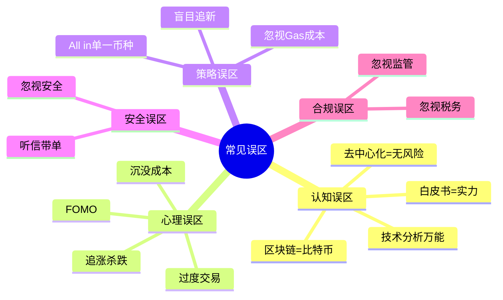

# 第12章 加密货币与DeFi——常见误区

## 为什么误区比风险更可怕

风险是已知的——你知道比特币可能跌50%，你知道DeFi可能被黑。但误区是**你不知道自己不知道的东西**。风险可以对冲，误区只能被识别后消除。

加密货币市场中，90%的散户亏损并非因为市场本身，而是因为陷入了可预见的行为陷阱。这些陷阱之所以致命，是因为它们往往披着"合理"的外衣：追涨杀跌看起来是"顺势而为"，All in看起来是"信念坚定"，听信带单看起来是"学习借鉴"。

本章系统梳理加密货币投资中最常见的15个误区，每个误区不仅告诉你"错在哪"，更解释"为什么你会犯这个错"以及"具体怎么改"。



---

## 第一部分：认知误区

认知误区是最底层的错误——你对这个领域的基本理解就是错的，后续所有决策都会偏离方向。

### 误区一：技术分析是赚钱的万能钥匙

#### 错误表现

刚接触加密货币的人，往往最先学的就是K线图和各种技术指标。他们相信MACD金叉就是买入信号，RSI超卖就该抄底，布林带收窄就是突破前兆。常见表现：

- 花大量时间研究各种技术指标组合
- 同时叠加十几个指标到一张图上
- 根据短期K线形态频繁交易
- 相信存在"圣杯指标"能精准预测涨跌
- 花钱购买"技术分析大师"的课程

#### 为什么这是误区

**加密市场的特殊性**：传统金融市场的技术分析建立在大量机构参与者、成熟做市商和相对稳定的交易时间之上。加密货币市场7×24小时不间断交易，参与者以散户为主，且存在大量机器人和巨鲸操纵，技术分析的有效性大幅下降。

**指标的自相矛盾**：同一张K线图上，MACD可能给出买入信号，RSI却显示超买，布林带提示中性。不同指标之间经常互相矛盾，你选择相信哪个，本质上已经是主观判断而非客观分析。

**幸存者偏差**：你看到的"技术分析大神"发的精准预测截图，是他们发了100次预测后碰对的那一次。没有人会把99次错误预测晒出来。

**有效市场假说的约束**：在流动性充足的市场中，所有公开信息（包括K线形态、技术指标）已经被市场价格充分反映。你能看到的形态，成千上万的交易者和算法也看到了。

**数据验证**：学术研究反复表明，技术指标在扣除交易成本后的超额收益接近于零。2019年Journal of Finance的一篇论文分析了比特币市场的技术交易策略，发现绝大多数策略在样本外测试中无法跑赢简单的买入持有策略。

#### 正确做法

| 用途 | 适用场景 | 局限性 |
|------|----------|--------|
| 判断支撑/阻力位 | 大周期（周线/月线）的关键价位 | 小周期的支撑阻力容易被假突破 |
| 确认趋势方向 | 配合基本面判断大趋势 | 不能单独作为交易依据 |
| 寻找入场时机 | 已经决定买入后，选择相对低位入场 | 不应该用来决定"要不要买" |
| 风险管理 | 通过波动率设置止损位 | 止损可能被扫掉后价格回来 |

技术分析的正确定位是**辅助工具**，不是决策核心。它应该用来优化已经通过基本面分析做出的决策的执行细节，而不是作为独立的交易系统。

---

### 误区二：去中心化等于绝对安全

#### 错误表现

很多人选择DeFi就是因为"去中心化"，认为去中心化就意味着安全、公平、不可被操控。常见表现：

- 认为DeFi协议不可能被攻击
- 认为去中心化交易所不会跑路
- 认为智能合约代码即法律，不会出错
- 把"去中心化"当作尽职调查的替代品
- 忽略DeFi协议背后的开发团队和治理结构

#### 为什么这是误区

**去中心化是光谱，不是开关**：没有任何协议是100%去中心化的。Uniswap的治理权集中在少数大户手中，Lido的验证者集中度引发过严重争议，很多号称"去中心化"的协议其实有管理员密钥可以随时暂停或修改合约。

**代码有漏洞**：智能合约由人编写，人会犯错。2022年DeFi领域因智能合约漏洞损失超过30亿美元。The DAO事件（2016年，6000万美元）、Wormhole攻击（2022年，3.26亿美元）、Ronin Bridge攻击（2022年，6.25亿美元）——这些都是"去中心化"协议的重大安全事故。

**治理攻击**：持有足够多的治理代币就可以控制协议。2022年Beanstalk协议被治理攻击，攻击者通过闪电贷获取了足够的投票权，通过了一个将协议资金转入自己地址的提案，损失1.82亿美元。

**预言机风险**：DeFi协议依赖预言机获取价格数据。如果预言机被操控或出错，整个协议的清算机制可能崩溃。

#### 正确做法

- **区分"去中心化程度"**：评估一个协议时，检查管理员密钥是否存在、多签钱包的签名者是谁、治理代币的分布是否集中
- **审计不等于安全**：通过审计的合约仍然可能有漏洞，很多被黑的合约都通过了知名审计公司的审计。关注审计报告中的高危和中危发现是否已修复
- **保险机制**：考虑使用Nexus Mutual、InsurAce等DeFi保险协议对冲智能合约风险
- **小额试探**：不要一次性将大量资金投入任何DeFi协议，先用小金额测试
- **监控TVL变化**：如果一个协议的TVL（总锁仓量）突然大幅下降，可能意味着有人发现了漏洞在撤资

---

### 误区三：区块链等于比特币

#### 错误表现

很多刚入门的人把区块链和比特币画等号，认为区块链只是比特币的底层技术，除此之外没有其他价值。或者反过来，认为所有基于区块链的东西都和比特币一样有价值。

#### 为什么这是误区

**概念层级混淆**：区块链是一种技术，比特币是基于这种技术的一种应用。就像互联网是一种技术，电子邮件是基于互联网的一种应用。把区块链等同于比特币，就像把互联网等同于电子邮件。

**不同区块链差异巨大**：比特币、以太坊、Solana、Avalanche等公链在共识机制、吞吐量、智能合约能力、去中心化程度等方面有根本性差异。它们的应用场景和风险特征完全不同。

**技术价值≠代币价值**：区块链技术在供应链管理、数字身份、投票系统等领域有真实的应用价值，但这不意味着每条链上的代币都值得投资。

#### 正确做法

- **建立技术全景图**：了解Layer1（基础链）、Layer2（扩容方案）、侧链、应用链的区别
- **分别评估**：对每条链的去中心化程度、安全性、可扩展性（即"区块链三难"的取舍）进行独立评估
- **关注应用场景**：不要因为"用了区块链技术"就认为有价值，关注它解决了什么具体问题

---

### 误区四：白皮书写得好就是好项目

#### 错误表现

很多人看完项目的白皮书就被"革命性技术"打动，认为写得越专业的项目越值得投资。

#### 为什么这是误区

**白皮书可以外包撰写**：一份看起来很专业的白皮书，可能只需要几千美元就能找人写出来。有专门的团队提供白皮书撰写、路线图设计、团队包装等一条龙服务。

**愿景≠实现能力**：白皮书描述的是"想做什么"，而不是"能做到什么"。从愿景到产品之间隔着巨大的技术和执行鸿沟。

**典型骗局模式**：很多跑路项目的白皮书都写得非常漂亮，包含复杂的技术术语和宏大的愿景。BitConnect、OneCoin、PlusToken等历史上最大的加密骗局，白皮书都堪称"教科书级别"。

#### 正确做法

评估一个项目应该看**执行证据**而非愿景描述：

| 评估维度 | 白皮书（弱信号） | 执行证据（强信号） |
|----------|------------------|-------------------|
| 技术能力 | 声称使用某种先进技术 | GitHub有活跃的代码提交记录 |
| 团队实力 | 列出团队成员的头衔 | 团队成员有可验证的行业履历 |
| 社区支持 | 声称有强大社区 | Discord/Twitter有真实的活跃讨论 |
| 路线图 | 列出宏大的开发计划 | 过往路线图的里程碑是否按时完成 |
| 合作伙伴 | 声称与某大公司合作 | 合作方有官方公告确认 |

---

## 第二部分：心理误区

心理误区是最难克服的，因为它们根植于人类进化了数百万年的本能反应。市场波动会触发你的杏仁核（大脑的恐惧中心），让你做出本能的、错误的决策。

### 误区五：追涨杀跌

#### 错误表现

"涨了就买，跌了就卖"——这是加密市场中最普遍、最致命的行为模式。具体表现为：

- 比特币从3万美元涨到6万美元时兴奋入场，从6万跌到3万时恐慌割肉
- 看到某个山寨币一天涨了50%，立刻追入，第二天跌了30%又卖出
- 在牛市末期重仓入场，在熊市最深处清仓离场
- 每次亏损后告诉自己"下次不追了"，但下次又重复

#### 为什么这是误区

**信息滞后**：当你看到价格大涨的新闻时，涨幅已经发生。你是被已经赚钱的人"通知"入场的，本质上是在为他们的利润接盘。散户获取信息的速度永远比不过机构、做市商和链上监控机器人。

**情绪放大效应**：加密市场的波动率是传统股市的5-10倍。比特币单日涨跌20%是常态，山寨币单日翻倍或归零也时有发生。这种极端波动会把你的情绪系统推到极限，让你做出平时不会做的决策。

**止损缺失**：追涨时往往没有预设止损位，跌了之后安慰自己"会涨回来的"，结果越套越深。当亏损超过20%时，损失厌恶心理会让你更加不愿意卖出。

**真实数据**：加密货币交易所的数据分析显示，约70-80%的散户交易者在追涨杀跌的操作中亏损。2021年牛市顶部（BTC 69000美元）的链上数据显示，大量新地址在60000-69000美元区间买入，随后在30000-40000美元区间割肉。

#### 正确做法

**定投策略——用纪律对抗情绪**：

定投（Dollar Cost Averaging）的核心不是"择时"，而是"去择时化"。你不需要判断市场底部在哪里，只需要按照固定的时间间隔持续买入。

```text
定投实操模板：
─────────────
资金总额：12万元
定投周期：每周一次
每次金额：12万 ÷ 52周 ≈ 2300元/周
标的分配：
  - BTC 60%：1380元/周
  - ETH 30%：690元/周
  - 其他 10%：230元/周
执行工具：交易所定投功能（Binance DCA、OKX定投计划）
```

**逆向指标参考**：

| 指标 | 恐慌信号（考虑买入） | 贪婪信号（考虑减仓） |
|------|---------------------|---------------------|
| 恐惧贪婪指数 | <20（极度恐惧） | >80（极度贪婪） |
| 社交媒体情绪 | "比特币归零"刷屏 | "这次不一样"刷屏 |
| 交易所流入量 | 大量BTC转入（准备卖出）后价格企稳 | 大量稳定币转入（准备买入） |
| 身边人态度 | 朋友劝你别买 | 从不关心投资的朋友问你怎么买币 |

**分批建仓计划**：即使看好某个资产，也不要一次性买入。分3-5批在不同价位建仓，降低平均成本。

---

### 误区六：FOMO（错失恐惧症）

#### 错误表现

"别人在赚钱，我不能错过"——FOMO是追涨杀跌的催化剂，但比追涨杀跌更隐蔽，因为它伪装成了"抓住机会"。

具体表现：
- 看到推特上有人晒收益截图，立刻买入同款币种
- 朋友说"我翻了10倍"，当天就开仓
- 新币上线第一天就冲进去
- 已经计划好的投资策略，因为FOMO临时改变
- 在最高点附近大量买入，理由是"不买就没了"

#### 为什么这是误区

**社交媒体的幸存者偏差**：你看到的"别人赚钱"是经过筛选的信息。亏损的人不会发推特，你看到的100条晒单背后，可能是10万个人的亏损。

**FOMO的神经科学**：研究表明，FOMO激活的大脑区域与成瘾反应相同。当你看到别人赚钱时，大脑会分泌多巴胺，产生"我也要"的冲动，这种冲动会绕过理性思考。

**零和博弈的本质**：加密市场（尤其是短期交易）是零和博弈。你赚的钱来自别人亏的钱。当所有人都FOMO入场时，市场通常已经接近顶部——因为愿意买入的人已经在买了。

**经典案例**：2021年5月，柴犬币（SHIB）在马斯克推特效应下暴涨，大量散户在高位FOMO入场。随后SHIB从高点下跌超过80%，很多FOMO入场的投资者被套至今。类似的故事在DOGE、PEPE、各种meme币上反复上演。

#### 正确做法

- **建立"冷却期"规则**：产生买入冲动后，强制等待24小时再决策。你会发现大部分冲动在24小时后消退
- **写下买入理由**：每次买入前必须写下买入理由。如果理由只有"别人在赚钱"或"涨了很多"，那就不要买
- **限制信息输入**：减少刷加密推特和群聊的时间，过多的他人收益信息是FOMO的燃料
- **使用条件单**：提前设置好想要买入的价格，用限价单而不是市价单。价格到了就执行，没到就不买
- **记住一句话**：加密市场永远有机会，错过一次不代表错过一切。但一次FOMO可能让你亏损50%以上

---

### 误区七：过度交易

#### 错误表现

"每天都要交易"——很多人把投资当成上班打卡，觉得不交易就是"浪费时间"。

具体表现：
- 每天打开交易App超过20次
- 赚了5%就想卖，亏了5%就想割
- 一天之内对同一个币种买卖多次
- 把大量时间花在盯盘上，影响工作和生活
- 频繁切换仓位，看到别的币涨了就卖掉手里的去追

#### 为什么这是误区

**交易成本的隐性侵蚀**：假设你每天交易一次，每次交易手续费0.1%（单边），一年250个交易日的总手续费就是0.1% × 2 × 250 = 50%。这意味着你必须每年赚50%才能保本——这已经是顶级基金经理都很难达到的收益。

**每次交易都是犯错的机会**：交易次数越多，做出错误决策的概率越高。假设你每次交易的胜率是55%（已经很高了），连续交易10次的胜率约为55%^10 ≈ 0.25%——你几乎确定会犯错。

**错过大行情**：过度交易的人往往在大行情启动前被洗出局。比特币历史上最大的几次涨幅都发生在很短的时间窗口内——如果你错过了涨幅最大的10天，10年收益率会从20000%降至不到100%。

**心理消耗**：持续盯盘和频繁交易会导致决策疲劳（Decision Fatigue），让你在真正需要理性判断的时候反而做出更差的决策。

#### 正确做法

**交易频率的正确选择**：

| 投资策略 | 建议交易频率 | 适合人群 | 代表性方法 |
|----------|-------------|---------|-----------|
| 长期持有 | 每月/每季度 | 大多数投资者 | 定投BTC/ETH，长期不动 |
| 中期趋势 | 每周/每月 | 有一定经验的投资者 | 根据宏观趋势调仓 |
| 短期波段 | 每周几笔 | 经验丰富的交易者 | 基于明确信号的波段操作 |
| 日内交易 | 每天多笔 | 专业交易员（不推荐散户） | 需要专业工具和充足资金 |

对于99%的投资者，最优策略是**减少交易频率到每月甚至每季度**。把省下来的时间用于学习和研究，而不是盯盘。

**具体行动**：
- 卸载手机上的交易App，只在电脑上交易
- 关闭价格提醒通知
- 设置固定的"交易日"（比如每月1号检查一次仓位）
- 将精力投入到研究和学习中，而不是交易执行中

---

### 误区八：沉没成本谬误

#### 错误表现

"已经亏了这么多了，不能卖"——很多人在亏损后不愿意止损，因为觉得"卖了就真的亏了"，或者"已经投入这么多时间和钱了，不能放弃"。

具体表现：
- 币价跌了80%还不卖，理由是"已经亏了80%，再跌也无所谓"
- 一个项目已经明显不行了，但因为"研究了这么久"而不愿放弃
- 亏损后加倍投入（"摊低成本"），结果越陷越深
- 把"持有亏损仓位"等同于"没有亏损"

#### 为什么这是误区

**沉没成本是已经发生的成本，不应该影响未来的决策**。你买入的价格只对你自己有意义，市场不关心你花了多少钱买入。一个币从10美元跌到2美元，无论你之前花10美元还是花1美元买入，它当前的合理价值是一样的。

**"回本思维"的陷阱**：很多人买入一个亏损的币后，目标变成了"回本就卖"。但市场没有义务让你回本。一个币跌了80%后，需要涨400%才能回本——这不是"等一等"就能实现的。

**资金的机会成本**：你被套在一个没有前景的币里的资金，如果投入到更有潜力的资产中，可能已经在赚钱。持有亏损资产的隐性成本远大于显性亏损。

#### 正确做法

- **建立止损纪律**：在买入时就设定止损位（比如-15%到-25%），触及止损位必须执行
- **定期审视持仓**：每隔一个月问自己一个问题——"如果我现在空仓，我会以当前价格买入这个币吗？"如果答案是否，就应该卖出
- **区分"暂时亏损"和"基本面恶化"**：BTC从6万跌到3万可能是市场周期（基本面未变），但某个小币从1跌到0.01很可能是项目失败（基本面恶化），两者应对方式不同
- **记录交易日志**：记录每次买入/卖出的理由，定期回顾，识别自己的沉没成本模式

---

## 第三部分：策略误区

策略误区是投资方法论层面的错误，通常源于对风险的系统性低估和对收益的系统性高估。

### 误区九：All in单一币种

#### 错误表现

"把所有钱都押在一个币上"——很多人的加密投资组合只有1个币种。

常见表现：
- 全仓比特币，认为"比特币永远不会倒"
- 全仓某个山寨币，认为"这个币会是下一个比特币"
- 因为某个币涨了就重仓甚至全仓
- 借钱甚至贷款投资单一币种

#### 为什么这是误区

**非对称风险**：在加密市场，归零的风险是真实存在的。即使是Top 10的币种，也可能在一轮熊市中跌去95%以上（LUNA从119美元跌到0.000001美元，FTT从85美元跌到1美元）。全仓一个币意味着你承担了该币种的全部特异性风险。

**心理压力**：全仓一个币会带来巨大的心理波动。当这个币下跌20%时，你的总资产缩水20%，这种压力会影响你的判断力，导致在最不应该卖出的时候卖出。

**没有对冲机制**：分散投资的本质不是"多买几个币"，而是构建一个在不同市场环境下都能保持一定稳定性的组合。全仓单一资产没有对冲。

#### 正确做法

**合理的资产配置框架**：

```text
加密资产配置建议（以10万元为例）：
──────────────────────────────────
核心仓位（60-70%）：6-7万元
  ├── BTC：40%（4万元）——数字黄金，长期价值储存
  └── ETH：20-30%（2-3万元）——智能合约平台龙头

成长仓位（15-25%）：1.5-2.5万元
  ├── Layer2（ARB/OP等）：5-8%
  ├── DeFi蓝筹（UNI/AAVE等）：5-8%
  └── 其他主流公链（SOL/AVAX等）：5-8%

探索仓位（5-10%）：0.5-1万元
  └── 高风险高收益的小市值项目

稳定币储备（10-15%）：1-1.5万元
  └── USDT/USDC——用于抄底机会和风险管理
```

**关键原则**：
- 单一币种不超过总仓位的30%
- 探索仓位的任何单一项目不超过总资产的3%
- 任何项目的亏损不超过总资产的1%（通过止损控制）
- 只用闲钱投资——即使全部归零也不影响生活

---

### 误区十：盲目追新项目

#### 错误表现

"新项目涨得快"——很多人沉迷于追逐新概念和新项目的早期涨幅。

具体表现：
- 参与各种ICO、IDO、IEO，来者不拒
- 追逐最新概念（AI+Crypto、DePIN、RWA等），频繁换仓
- 不研究项目基本面，只看"故事"好不好听
- 听群里的"大佬"推荐就冲
- 认为"早期参与=低价筹码=必然赚钱"

#### 为什么这是误区

**90%以上的新项目会失败**：根据CoinGecko的统计，2014-2023年间上线的加密项目中，超过50%已经停止交易（归零）。在存活的项目中，跑赢BTC和ETH的不到10%。

**信息不对称**：你在群里看到的"一级市场机会"，很可能已经是项目方刻意制造的散户接盘窗口。真正的早期投资发生在私募轮，参与者是VC和项目方关系网络，散户能参与的时候往往已经是最后几棒。

**概念≠价值**：每个周期都有新概念——2017年的ICO、2020-2021年的DeFi Summer和NFT、2023年的LSD和BRC-20。概念热度退去后，绝大多数项目归零。真正存活下来的只有极少数。

**经典案例**：2017年ICO热潮中的项目，绝大多数已经归零或接近归零。EOS募集了40亿美元，到2024年价格不到最高点的10%。ICP（Internet Computer）上线时市值一度进入前5，随后从最高点下跌超过99%。

#### 正确做法

**项目评估清单（DYOR框架）**：

```text
□ 团队背景
  - 核心团队成员是否有可验证的行业履历？
  - 团队是否公开身份（doxxed）？
  - 团队过往项目表现如何？

□ 技术评估
  - GitHub代码是否活跃更新？
  - 技术方案是否有创新性或解决了实际问题？
  - 是否经过知名审计公司审计？

□ 代币经济学
  - 代币分配是否合理？团队/VC占比是否过高？
  - 解锁时间表是什么？近期是否有大量解锁？
  - 代币的实际用途是什么？是否有持续的需求？

□ 社区与生态
  - 社区是真实的活跃讨论还是机器人刷屏？
  - 链上活跃地址数和交易量趋势如何？
  - 是否有真实的用户和应用场景？

□ 风险信号（红旗）
  ⚠ 承诺固定或高额回报
  ⚠ 团队匿名且无过往记录
  ⚠ 白皮书抄袭或过于空洞
  ⚠ 社区管理删负面评论
  ⚠ 过度依赖营销而非技术
```

---

### 误区十一：忽视Gas费和交易成本

#### 错误表现

很多人在DeFi操作中只关注收益率，忽略了Gas费、滑点、跨链手续费等交易成本的累积影响。

具体表现：
- 在以太坊网络拥堵时频繁进行小额交易，Gas费比交易金额还高
- 不设置滑点保护，被三明治攻击（Sandwich Attack）收割
- 频繁在不同链之间跨桥，每次都要付手续费
- 追求高APY但忽略无常损失和各种隐性费用

#### 为什么这是误区

**Gas费的隐性侵蚀**：以太坊网络上的单次Swap操作Gas费在5-50美元之间波动（拥堵时更高）。如果你的操作金额只有几百美元，一次Swap的手续费就可能吃掉1-10%的本金。

**无常损失被低估**：在AMM（自动做市商）提供流动性时，如果两种代币的价格变化幅度不同，你会遭受无常损失。很多高APY的流动性池，扣除无常损失后的实际收益可能为负。

**成本计算示例**：

```text
场景：在以太坊上进行一次200美元的Swap
──────────────────────────────────
Gas费（中等拥堵）：15美元
滑点（0.5%）：1美元
协议手续费（0.3%）：0.6美元
──────────────────────────────────
总成本：16.6美元
成本占比：16.6 / 200 = 8.3%

如果这个操作一年做50次：
总成本 = 16.6 × 50 = 830美元
你的200美元本金需要赚415%才能覆盖成本
```

#### 正确做法

- **批量操作**：减少交易次数，攒够一定金额再操作
- **选择低Gas时段**：以太坊网络在UTC时间凌晨（北京时间上午）通常Gas最低
- **使用Layer2**：Arbitrum、Optimism、Base等Layer2网络的Gas费是主网的1/10到1/100
- **设置滑点保护**：在Swap时设置合理的滑点容忍度（通常0.5-1%），防止三明治攻击
- **计算真实收益率**：在参与任何DeFi协议前，把所有成本（Gas、滑点、协议费、无常损失）算进去，看净收益是否为正
- **使用聚合器**：1inch、Paraswap等DEX聚合器可以帮你找到最优路径，降低交易成本

---

## 第四部分：安全误区

安全误区直接威胁你的资产安全。在加密世界中，没有银行、没有客服、没有退款——出了问题就是永久损失。

### 误区十二：忽视资产安全

#### 错误表现

"安全不重要，能赚钱就行"——很多人的安全意识停留在传统互联网的水平。

常见表现：
- 所有资产都放在交易所，不了解"不是你的私钥就不是你的币"
- 不开或只开一种双重验证（2FA）
- 助记词拍照存在手机相册里，或者截图存在云盘
- 在公共WiFi下进行交易操作
- 在搜索引擎直接点击交易所链接（可能进入钓鱼网站）
- 所有网站使用同一个密码
- 不区分"热钱包"和"冷钱包"的使用场景

#### 为什么这是误区

**FTX的教训**：2022年11月，全球第二大加密交易所FTX在48小时内崩盘，价值80亿美元的用户资产被冻结。无数人因此失去了毕生积蓄。"把钱放在大交易所就安全"这个假设被彻底打破——FTX之前，还有Mt.Gox（2014年，85万BTC丢失）、QuadrigaCX（2019年，创始人"死亡"后1.5亿美元无法取出）。

**不可逆性**：加密资产的转账没有撤回机制。一旦你把币转到错误地址、被钓鱼网站骗走私钥、或者签名了一个恶意合约，这些资产就永远消失了。没有银行可以冻结交易，没有警察可以追回资金。

**钓鱼攻击的进化**：现在的钓鱼攻击已经非常精密——假冒交易所客服电话、伪造的空投领取页面、伪装成常见DeFi协议的假网站、恶意浏览器插件。2023年加密领域因钓鱼攻击损失超过3亿美元。

#### 正确做法

**安全等级分层**：

| 资产等级 | 存储方式 | 适用场景 | 推荐工具 |
|----------|---------|---------|---------|
| 大额长期持有 | 硬件冷钱包 | BTC/ETH长期储存 | Ledger、Trezor |
| 中等金额日常使用 | 移动端热钱包 | 日常DeFi交互 | MetaMask、Rabby |
| 小额测试 | 浏览器钱包 | 新协议测试 | MetaMask子账户 |
| 交易资金 | 交易所 | 买卖交易 | 主流CEX（分散存放） |

**必做安全清单**：

```text
□ 助记词安全
  - 手写在纸上（至少两份），存放在不同物理位置
  - 绝不拍照、截图、云存储、发给任何人
  - 考虑使用金属助记词板防火防水

□ 账户安全
  - 所有交易所和重要账户开启2FA（优先使用Authenticator App，不要用短信验证）
  - 每个平台使用不同的强密码
  - 定期检查已授权的合约和设备

□ 操作安全
  - 书签保存常用网站地址，不通过搜索引擎点击
  - 交易前反复确认收款地址（对比前6位和后6位）
  - 不在公共WiFi下进行任何加密资产操作
  - 签名交易前仔细阅读签名内容，不盲签

□ 环境安全
  - 交易用的设备不安装来路不明的软件
  - 定期更新操作系统和浏览器
  - 考虑使用专门的设备进行加密资产操作
```

---

### 误区十三：听信"老师带单"

#### 错误表现

"跟着老师买就能赚钱"——很多人把决策权交给所谓的"交易大师"或"带单社区"。

具体表现：
- 加入付费社群（年费几百到几万元），等待"老师"发买卖信号
- 在交易所跟单功能中跟随"明星交易员"
- 相信"月收益30%""保证不亏"的承诺
- 把自己的交易所API密钥交给他人或跟单机器人
- 因为"老师"之前说对了几次就深信不疑

#### 为什么这是误区

**商业模式的真相**：这些"老师"的收入来源是会员费和返佣，而不是交易收益。如果他们真的能稳定盈利，最理性的做法是用自己的钱交易，而不是卖课和带单。一个能稳定月收益10%的人，10万元本金10年后会变成9270亿元——他们不需要你那几千块的会员费。

**拉高出货（Pump and Dump）**：很多"带单老师"会提前买入某个小市值币种，然后推荐给会员，等会员买入推高价格后卖出获利。你是他们的退出流动性。

**API密钥的风险**：把交易所API密钥交给跟单服务，等于把你的账户控制权完全交给他人。即使是合法的跟单服务，也可能因为技术故障、被黑客攻击或内部人员作恶而损失你的资金。

**概率游戏**：假设一个"老师"有1000个会员，他推荐10个不同的币种给100个不同的小组。总有几个小组会得到正确的推荐，这些小组的成员就成了他的"成功案例"和"口碑宣传"。

#### 正确做法

- **投资教育**：花时间学习基本面分析、技术分析基础、风险管理理论，这些知识是可复用的
- **独立决策**：可以参考多方观点（研究报告、链上数据分析、社区讨论），但最终决策必须自己做
- **验证信息源**：如果真的要参考某个分析师的观点，先回溯验证他们过去1-2年的公开预测准确率
- **绝不交出API密钥**：任何要求你提供交易所API密钥的服务都应该高度警惕
- **记住**：在加密市场，没有人有义务帮你赚钱，但所有人都有动机从你身上赚钱

---

## 第五部分：合规误区

合规问题短期内可能不会爆发，但一旦被追究，后果往往非常严重。

### 误区十四：忽视监管政策

#### 错误表现

"监管不影响我"——很多人不了解或者故意忽视所在地区的加密货币监管政策。

具体表现：
- 不了解所在国家/地区对加密货币的法律定义和监管框架
- 使用VPN绕过交易所的地区限制
- 不了解反洗钱（AML）和了解你的客户（KYC）规定的含义
- 认为"去中心化"就不受监管
- 不关注监管政策变化

#### 为什么这是误区

**法律风险是真实的**：中国2021年全面禁止加密货币交易和挖矿，参与者面临资产冻结和法律风险。美国SEC对多个项目提起诉讼（Ripple、Coinbase、Binance），持有相关代币的投资者面临不确定性。印度曾对加密货币收益征收30%的税和1%的源头扣税。

**交易所合规压力**：全球交易所面临越来越严格的合规要求，包括KYC、交易监控、可疑活动报告等。你的交易记录可能被提交给税务和执法机关。

**政策变化的突然性**：监管政策可能在短时间内发生根本性变化。2021年中国禁令发布后，大量矿工和交易所用户被迫在极短时间内转移资产，很多人因为来不及操作而遭受损失。

#### 正确做法

**主要地区监管框架概览**：

| 地区 | 当前态度 | 关键规定 | 风险等级 |
|------|---------|---------|---------|
| 中国大陆 | 全面禁止交易和挖矿 | 个人持有不违法但交易不受保护 | 高 |
| 美国 | 严格监管，分类不明确 | SEC执法行动频繁，税务申报要求严格 | 中高 |
| 欧盟 | 立法框架逐步完善（MiCA） | 要求交易所合规运营，反洗钱规定 | 中 |
| 日本 | 相对友好，有明确法律框架 | 交易所需要牌照，收益税率最高55% | 中低 |
| 新加坡 | 逐步收紧 | 需要牌照，禁止向散户营销 | 中 |
| 香港 | 逐步开放 | 2023年起允许散户交易持牌交易所代币 | 中低 |

**具体行动**：
- 了解所在地区最新的加密货币法律法规
- 选择合规的交易所（有当地牌照或接受监管的）
- 如实完成KYC认证
- 保留所有交易记录（导出CSV并备份）
- 关注监管政策动态（订阅CoinDesk、The Block等媒体的监管新闻）

---

### 误区十五：忽视税务问题

#### 错误表现

"加密货币不用交税"——很多人完全忽视加密货币的税务义务。

具体表现：
- 从不记录交易收益和亏损
- 不了解所在地区对加密货币的税务处理方式
- 以为交易所不会向税务机关报告
- 不知道质押收益、空投、挖矿收入也需要纳税
- 认为"没人查得到"

#### 为什么这是误区

**监管技术在进步**：链上分析工具（Chainalysis、Elliptic等）已经非常成熟，税务机关可以追踪链上交易。美国IRS已经与多家链上分析公司合作，识别未申报的加密货币收益。交易所的KYC数据也让税务机关可以直接匹配身份和交易记录。

**处罚力度大**：在美国，不申报加密货币收益可能面临最高75%的罚款和刑事起诉。2023年IRS向超过10000名加密货币持有者发出了警告信。在其他发达国家，处罚力度也在加大。

**税务处理的复杂性**：加密货币的税务处理比传统资产复杂得多——每次Swap、每次DeFi操作、每次空投领取、每次质押收益都可能触发应税事件。不记录就无法正确申报。

**中国用户注意**：虽然中国目前禁止加密货币交易，但如果通过海外交易所进行交易，理论上仍需缴纳个人所得税（资本利得）。虽然目前执法力度较低，但随着监管完善，未来追溯征税的可能性存在。

#### 正确做法

**税务记录工具**：

| 工具 | 功能 | 适用地区 |
|------|------|---------|
| Koinly | 自动计算税务，支持多链 | 全球（对美国/欧盟/澳洲最完善） |
| CoinTracker | 与TurboTax集成 | 美国 |
| TokenTax | 专业税务报告 | 全球 |
| 手动记录（CSV） | 基础但可靠的方案 | 全球 |

**必记录的信息**：

```text
每笔交易应记录：
- 交易日期和时间
- 交易类型（买入/卖出/Swap/转账/质押/空投）
- 买入/卖出的币种和数量
- 交易时的法币价格（或等值法币）
- 交易手续费
- 交易平台
- 交易对手地址（如适用）

建议：每月导出一次交易所交易记录并备份
```

**合法节税策略**（适用于有明确税务规定的地区）：
- **税务亏损收割（Tax Loss Harvesting）**：在亏损时卖出，用亏损抵消其他收益
- **长期持有优惠**：很多国家对持有超过一年的资产给予较低税率
- **捐赠**：在某些地区，捐赠加密资产可以享受税务减免
- **咨询专业人士**：如果交易量大或涉及复杂操作，聘请专业的加密货币税务顾问

---

## 自测：你陷入了几个误区？

在阅读完所有误区后，用以下检查清单评估自己的状况。诚实回答，每个"是"计1分：

```text
认知层面（每题1分）                              是/否
──────────────────────────────────────────────
1. 我主要依靠技术指标做交易决策                    [ ]
2. 我认为DeFi协议因为去中心化所以是安全的            [ ]
3. 我不太了解区块链和比特币的区别                    [ ]
4. 我主要通过阅读白皮书来评估项目                    [ ]

心理层面（每题1分）                              是/否
──────────────────────────────────────────────
5. 我有至少3次追涨杀跌的经历                       [ ]
6. 我因为看到别人赚钱而买入过某个币                   [ ]
7. 我每天查看行情超过10次                          [ ]
8. 我目前持有亏损超过50%但不愿卖出的币               [ ]

策略层面（每题1分）                              是/否
──────────────────────────────────────────────
9. 我的投资组合中单一币种占比超过50%                 [ ]
10. 我买入过不了解基本面的"热门新项目"               [ ]
11. 我不清楚自己的交易总成本（Gas+手续费+滑点）        [ ]

安全层面（每题1分）                              是/否
──────────────────────────────────────────────
12. 我的大部分资产存放在交易所                       [ ]
13. 我曾跟随"带单老师"的推荐买卖                    [ ]

合规层面（每题1分）                              是/否
──────────────────────────────────────────────
14. 我不清楚所在地区对加密货币的监管政策               [ ]
15. 我从未记录过加密货币交易的税务信息                [ ]

评分：
0-3分：认知健康，继续保持警惕
4-7分：存在明显误区，需要立即调整
8-11分：高风险状态，建议暂停交易，系统学习后再操作
12-15分：极度危险，很可能正在或即将遭受重大损失
```

---

## 总结

### 误区分类与应对框架

| 误区类型 | 核心问题 | 应对原则 | 具体工具 |
|----------|---------|---------|---------|
| 认知误区 | 对市场的基本理解有偏差 | 持续学习，验证假设 | 链上数据分析、研究报告 |
| 心理误区 | 情绪驱动决策 | 用纪律和系统替代情绪 | 定投计划、冷却期规则、交易日志 |
| 策略误区 | 风险管理不当 | 构建系统化的投资框架 | 资产配置表、DYOR清单、成本计算器 |
| 安全误区 | 资产保护意识薄弱 | 安全第一，分层管理 | 冷钱包、2FA、助记词离线备份 |
| 合规误区 | 忽视法律和税务风险 | 合规操作，主动记录 | 税务工具、监管新闻订阅 |

### 避免误区的五条核心原则

1. **学习为先**：不理解的东西不碰。花在学习上的时间，远比花在盯盘上的时间回报率高
2. **风险控制**：只用闲钱，分散投资，设定止损。活着比赚钱重要
3. **安全第一**：保护好私钥和助记词，使用冷钱包存储大额资产。在加密世界，安全就是一切
4. **合规操作**：了解并遵守所在地区的法律法规，保留交易记录，如实申报税务
5. **长期思维**：忽略短期波动，用3-5年的时间框架思考投资。大多数人亏损的原因不是买错了，而是在错误的时间卖出

> **最后的忠告**：加密货币市场最大的确定性就是不确定性。没有人能持续预测市场走势，没有项目是绝对安全的，没有任何策略能保证盈利。你能做的是管理好风险、保护好资产、持续学习、保持理性——这些才是长期在这个市场生存并盈利的基础。
