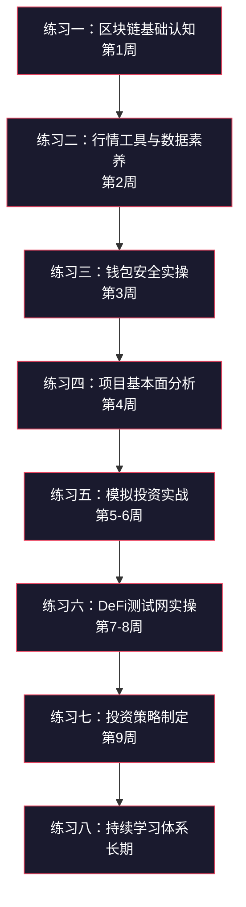
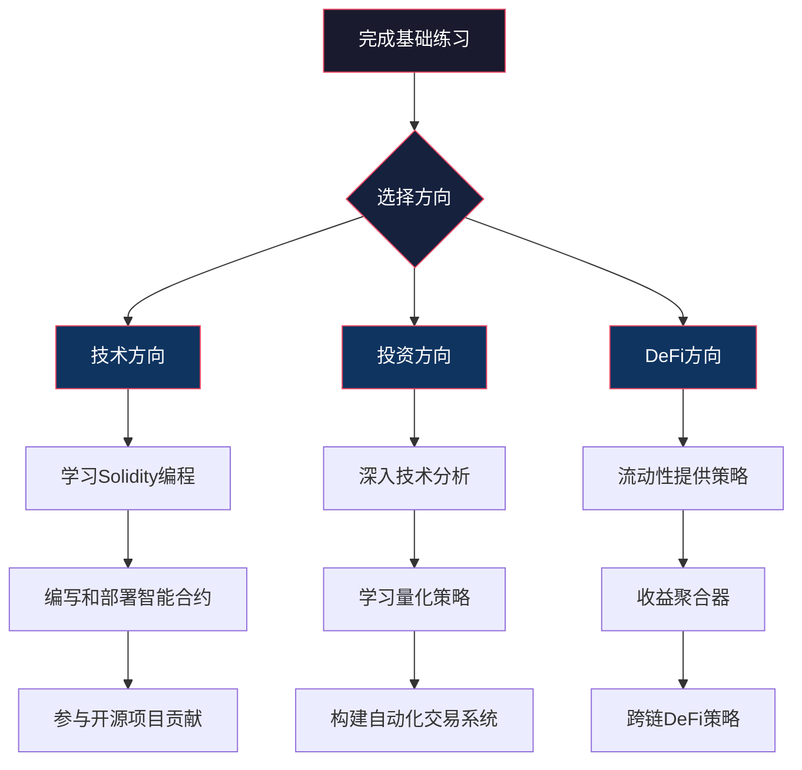

# 第12章 加密货币与DeFi——练习方法

> 纸上得来终觉浅，绝知此事要躬行。加密货币是一个高度实操的领域，光靠理论学习无法真正理解链上交互、Gas机制、DeFi协议运作等核心概念。本章提供8个递进式练习，覆盖从零基础认知到实盘操作的完整路径。每个练习都有明确的目标、具体的操作步骤、可验证的产出物，以及常见踩坑提示。

## 练习总览与学习路线



| 练习 | 周期 | 核心技能 | 前置要求 | 难度 |
|------|------|----------|----------|------|
| 一：区块链基础认知 | 第1周 | 概念理解、白皮书阅读 | 无 | ★☆☆☆☆ |
| 二：行情工具与数据素养 | 第2周 | 数据查询、市场观察 | 练习一 | ★★☆☆☆ |
| 三：钱包安全实操 | 第3周 | 钱包创建、安全操作 | 练习一 | ★★☆☆☆ |
| 四：项目基本面分析 | 第4周 | 信息收集、报告撰写 | 练习一、二 | ★★★☆☆ |
| 五：模拟投资实战 | 第5-6周 | 策略执行、仓位管理 | 练习一至四 | ★★★☆☆ |
| 六：DeFi测试网实操 | 第7-8周 | 链上交互、协议使用 | 练习三 | ★★★★☆ |
| 七：投资策略制定 | 第9周 | 策略设计、风控规划 | 练习一至六 | ★★★★☆ |
| 八：持续学习体系 | 长期 | 信息筛选、迭代优化 | 全部 | ★★★★★ |

---

## 练习一：区块链基础认知（第1周）

### 目标

理解区块链和加密货币的核心技术原理，能够用自己的语言解释去中心化、共识机制、智能合约等概念，建立判断项目技术可信度的基础能力。

### 为什么这个练习重要

很多人进入加密货币市场后，因为不理解底层技术而成为"韭菜"——看不懂项目白皮书就盲目投资，不理解Gas费机制就频繁操作导致亏损，不了解共识机制就轻信"下一个比特币"的宣传。技术认知是所有后续操作的地基，地基不牢，地动山摇。

### 操作步骤

#### 第一步：精读比特币白皮书（第1天）

比特币白皮书仅9页，却是理解整个加密货币世界的基石。不要泛读，要逐段精读。

**阅读方法**：

1. 下载原文：访问 `https://bitcoin.org/bitcoin.pdf`
2. 准备一个笔记本（实体或电子），按章节做笔记
3. 第一遍通读，标记不理解的术语
4. 第二遍精读，逐段用自己的话复述

**重点章节与核心要点**：

| 章节 | 核心问题 | 阅读要点 |
|------|----------|----------|
| 1. Introduction | 为什么需要比特币？ | 理解"点对点电子现金系统"的动机：消除对可信第三方的依赖 |
| 2. Transactions | 交易如何工作？ | 理解UTXO模型：每笔交易的输入是上一笔交易的输出，形成链式结构 |
| 3. Timestamp Server | 如何防止篡改？ | 理解哈希链：每个区块包含前一个区块的哈希值，改一个就要改全部 |
| 4. Proof-of-Work | 如何达成共识？ | 理解工作量证明：通过计算难题来决定记账权，攻击成本极高 |
| 5. Network | 节点如何协作？ | 理解最长链原则：所有节点接受最长的有效链，保证一致性 |
| 6. Incentive | 矿工为什么愿意参与？ | 理解区块奖励和手续费的经济激励机制 |
| 7. Reclaiming Disk Space | 如何节省存储？ | 理解默克尔树：只保留区块头，验证交易时用默克尔证明 |
| 11. Calculations | 安全性如何保证？ | 理解概率论证：攻击者要追赶诚实链的概率随确认数指数下降 |

**自测题**（读完后尝试回答，不要查资料）：

1. 如果有人篡改了区块链中间某一笔交易的金额，会发生什么？为什么？
2. 比特币网络如何防止双重支付（同一笔钱花两次）？
3. 工作量证明的难度调整机制如何保证出块速度稳定在10分钟左右？
4. 为什么说比特币是"伪匿名"而非"完全匿名"？

#### 第二步：学习以太坊核心概念（第2-3天）

以太坊将区块链从"记账本"升级为"全球计算机"。理解智能合约是以太坊的核心。

**学习路径**：

**2.1 智能合约基础**

智能合约是部署在区块链上的程序代码，一旦部署就不可修改，自动执行预设逻辑。用一个类比理解：

```text
传统合同：双方签纸质协议 → 违约 → 打官司 → 法院强制执行
智能合约：代码即法律 → 条件触发 → 自动执行 → 无需信任第三方
```

理解智能合约的关键属性：
- **不可篡改**：部署后代码无法修改（这是优势也是风险）
- **确定性**：相同输入必定产生相同输出
- **透明性**：所有人可以查看合约代码
- **可组合性**：合约之间可以互相调用，形成DeFi乐高

**2.2 以太坊虚拟机（EVM）**

EVM是以太坊的执行环境，所有智能合约都在EVM中运行。理解以下概念：

- **Gas**：执行操作需要消耗的计算资源单位，不是货币单位而是"燃料"
- **Gas Price**：每单位Gas的价格（以Gwei计），1 ETH = 10^9 Gwei
- **Gas Limit**：你愿意为这笔交易消耗的最大Gas数量
- **交易费 = Gas Used × Gas Price**：实际消耗的Gas乘以单价

用一个具体例子理解Gas机制：

```text
场景：在Uniswap上用ETH兑换USDC

操作步骤的Gas消耗（大致值）：
- 授权（Approve）：约46,000 Gas
- 兑换（Swap）：约150,000 Gas
- 总Gas消耗：约196,000 Gas

如果Gas Price = 20 Gwei：
交易费 = 196,000 × 20 Gwei = 3,920,000 Gwei = 0.00392 ETH
如果ETH价格 = $3,000，则交易费 ≈ $11.76

如果Gas Price = 100 Gwei（网络拥堵时）：
交易费 = 196,000 × 100 Gwei = 0.0196 ETH ≈ $58.80
```

**2.3 代币标准**

以太坊上最常用的代币标准：

| 标准 | 名称 | 用途 | 特点 |
|------|------|------|------|
| ERC-20 | 同质化代币 | 通证、治理代币、稳定币 | 每个代币完全相同，可互换 |
| ERC-721 | 非同质化代币（NFT） | 数字艺术品、游戏道具 | 每个代币独一无二 |
| ERC-1155 | 多重代币 | 游戏物品 | 一个合约管理多种代币 |
| ERC-4626 | 代币化金库 | DeFi收益聚合 | 标准化收益金库接口 |

**2.4 阅读以太坊官方文档**

访问 `https://ethereum.org/en/developers/docs/`，重点阅读以下页面：
- Introduction to Ethereum（以太坊简介）
- Accounts（账户模型：EOA vs 合约账户）
- Transactions（交易结构）
- Smart contracts（智能合约）
- Gas（Gas机制详解）

#### 第三步：对比学习主流区块链（第4-5天）

不要只盯着比特币和以太坊，了解不同链的设计哲学有助于形成全局视角。

**核心对比框架**：

| 维度 | 比特币 | 以太坊 | Solana | BNB Chain |
|------|--------|--------|--------|-----------|
| 定位 | 数字黄金/价值存储 | 全球计算机/DApp平台 | 高性能公链 | 交易所生态链 |
| 共识机制 | PoW | PoS（2022年后） | PoH + PoS | PoSA |
| 出块时间 | ~10分钟 | ~12秒 | ~0.4秒 | ~3秒 |
| TPS | ~7 | ~15-30（L1） | ~65,000 | ~160 |
| 智能合约 | 不支持（基础层） | 支持（Solidity） | 支持（Rust） | 支持（Solidity兼容） |
| 费用模型 | 按交易大小 | Gas（EIP-1559燃烧） | 极低固定费 | 低Gas |
| 去中心化程度 | 最高 | 高 | 中等 | 较低 |

**学习每个链时问自己三个问题**：
1. 这条链解决了什么问题？（性能瓶颈、费用、特定场景）
2. 它牺牲了什么来换取这些优势？（通常在"不可能三角"中做取舍）
3. 生态中有哪些代表性应用？

#### 第四步：综合测试与笔记整理（第6-7天）

**概念理解测试**（不看资料，手写回答，每题至少200字）：

1. 用一个生活中的例子解释区块链的去中心化特性
2. 对比PoW和PoS的优缺点，解释以太坊为什么要从PoW转向PoS
3. 什么是智能合约？举一个实际应用场景并解释其运作流程
4. 私钥、公钥、地址之间的关系是什么？为什么丢失私钥等于丢失资产？
5. 解释ERC-20代币和原生代币（如ETH）的区别

**输出物**：
- 完整的学习笔记（建议使用Markdown格式，方便后续整理）
- 概念思维导图（手绘或使用XMind等工具）
- 5道自测题的书面回答

### 常见错误

- **只看科普视频不读原文**：科普视频为了传播会过度简化，白皮书和技术文档才是准确信息源
- **急于进入实操**：基础不扎实就去做交易，大概率交学费
- **只关注价格不关注技术**：理解技术才能判断一个项目是否真的有价值
- **混淆概念**：区块链≠比特币≠加密货币，这三个概念有包含关系但不等同

---

## 练习二：行情工具与数据素养（第2周）

### 目标

熟练使用主流行情和数据平台，能够独立查询链上数据，培养对市场数据的敏感度和解读能力。

### 为什么这个练习重要

加密货币市场的信息密度极高，每天有海量数据产生。不会使用工具的人只能被动接受别人的观点，会使用工具的人可以自己验证信息、发现机会。数据素养是区分"投资者"和"赌徒"的关键分水岭。

### 操作步骤

#### 第一步：注册并熟悉数据平台（第1天）

**必备平台一览**：

| 平台 | 网址 | 核心功能 | 免费/付费 |
|------|------|----------|-----------|
| CoinMarketCap | coinmarketcap.com | 市值排名、价格、交易量 | 免费 |
| CoinGecko | coingecko.com | 详细币种数据、开发者数据 | 免费 |
| DefiLlama | defillama.com | DeFi TVL、收益率、桥接数据 | 免费 |
| TradingView | tradingview.com | K线图表、技术指标 | 基础免费 |
| Dune Analytics | dune.com | 链上数据自定义查询 | 基础免费 |
| Etherscan | etherscan.io | 以太坊区块浏览器 | 免费 |
| DeBank | debank.com | 多链钱包资产追踪 | 免费 |

**第一天任务**：

在每个平台完成以下操作：
1. 注册账号（如需要），熟悉界面布局
2. 找到BTC和ETH的主页，了解各个数据字段的含义
3. 保存书签，方便日后快速访问

**关键数据字段解读**：

| 字段 | 含义 | 观察要点 |
|------|------|----------|
| Market Cap（市值） | 当前价格 × 流通供应量 | 市值越大，操纵难度越高 |
| 24h Volume（24小时交易量） | 过去24小时的总成交额 | 量价配合是判断趋势的关键 |
| FDV（完全稀释市值） | 当前价格 × 总供应量 | 与当前市值对比，差距大说明未来有大量解锁 |
| Circulating Supply（流通量） | 当前市场上流通的数量 | 流通比例低的项目要注意解锁抛压 |
| TVL（总锁仓量） | DeFi协议中锁定的资产总值 | TVL越高说明协议被使用越多 |

#### 第二步：建立每日行情观察习惯（第2-6天）

每天花15-20分钟完成以下观察流程：

**晨间观察清单**（建议固定时间，如每天早上9点）：

```text
1. 整体市场
   - BTC价格：$______  24h涨跌：______%
   - ETH价格：$______  24h涨跌：______%
   - 加密市场总市值：$______万亿
   - BTC市占率（Dominance）：______%
   - 恐惧贪婪指数：______（0-100）

2. 涨跌榜
   - 涨幅前5：________________
   - 跌幅前5：________________
   - 成交量前5：________________

3. 重大事件
   - 今天有什么重要新闻？________________
   - 有没有大额链上转账？________________
   - 有没有代币解锁事件？________________
```

**恐惧贪婪指数解读**：

| 区间 | 含义 | 历史参考 |
|------|------|----------|
| 0-25 | 极度恐惧 | 往往是较好的买入时机（但不绝对） |
| 25-45 | 恐惧 | 市场情绪低迷，可能存在机会 |
| 45-55 | 中性 | 观望为主 |
| 55-75 | 贪婪 | 需要警惕，考虑减仓 |
| 75-100 | 极度贪婪 | 历史上往往是阶段性顶部附近 |

**重要提示**：恐惧贪婪指数是辅助参考工具，不是买卖信号。单一指标不能作为决策依据。

#### 第三步：学习使用区块浏览器（第3-4天）

区块浏览器是观察链上活动的窗口，学会使用它就等于学会了"读取区块链账本"。

**Etherscan核心功能实操**：

**3.1 查询交易**

1. 访问 etherscan.io
2. 在搜索框输入任意交易哈希（可以在Twitter或新闻中找到）
3. 理解交易详情页面的每个字段：
   - **Status**：Success/Failed/Pending（成功/失败/待确认）
   - **Block**：交易被打包的区块号
   - **From**：发送地址
   - **To**：接收地址（如果是合约交互，这里显示合约地址）
   - **Value**：转账金额
   - **Transaction Fee**：实际支付的手续费
   - **Gas Used × Gas Price**：Gas消耗明细

**3.2 查询地址**

1. 搜索任意以太坊地址
2. 查看地址的：
   - ETH余额
   - 代币持仓（Token Holdings）
   - 交易历史（Transactions）
   - 内部交易（Internal Transactions）

**3.3 查询合约**

1. 搜索一个知名合约地址，如Uniswap V3 Router
2. 查看合约的：
   - 源代码（Contract → Code，已验证的合约）
   - ABI（Application Binary Interface）
   - 读取函数（Read Contract）：任何人都可以调用
   - 写入函数（Write Contract）：需要连接钱包并签名

**3.4 使用Gas Tracker**

访问 etherscan.io/gastracker：
- 查看当前推荐的Gas价格（低/中/高优先级）
- 观察Gas价格的历史趋势
- 了解何时Gas较低（通常是非美国交易时间）

#### 第四步：使用DefiLlama追踪DeFi生态（第5-6天）

DefiLlama是DeFi领域最权威的数据聚合平台。

**核心功能实操**：

1. **TVL排行**：访问 defillama.com，查看各链和各协议的TVL排名
   - 理解TVL的意义：锁仓越多 → 使用越多 → 通常更可信
   - 注意区分不同链上的TVL

2. **收益率对比**：访问 defillama.com/yields
   - 查看各协议的存款收益率（APY）
   - 理解APY和APR的区别：APY考虑复利，APR不考虑
   - 注意：超高APY（>100%）通常伴随高风险

3. **稳定币仪表盘**：访问 defillama.com/stablecoins
   - 查看各稳定币的市值和发行量变化
   - USDT、USDC、DAI的市场份额对比

4. **桥接数据**：访问 defillama.com/bridge
   - 查看各桥的锁仓量和交易量
   - 理解跨链桥是黑客攻击的高发区域

**产出物**：
- 5天的每日行情观察记录（使用上面的模板）
- 一份周度市场总结（500字以上，包含数据截图）
- 一份常用工具书签清单（附平台说明）

### 常见错误

- **数据过载**：试图跟踪所有数据导致信息焦虑。初期只关注BTC、ETH和市值前10的币种即可
- **混淆相关性和因果性**：两个数据同时变化不代表它们有因果关系
- **忽视数据源质量**：小平台的数据可能不准确，优先使用CoinMarketCap、CoinGecko等权威来源
- **只看价格不看量**：没有成交量支撑的价格变动通常不可持续

---

## 练习三：钱包安全实操（第3周）

### 目标

独立完成加密钱包的创建、备份、使用全流程，掌握钱包安全的核心原则和操作规范，能够识别常见的钱包安全威胁。

### 为什么这个练习重要

加密货币的安全完全依赖于私钥管理。银行账户丢了可以找回，加密钱包的私钥或助记词一旦丢失或泄露，资产将永久丢失且无法追回。据统计，约20%的比特币因私钥丢失而永久锁死。安全不是可选项，是生存条件。

### 操作步骤

#### 第一步：理解钱包的工作原理（第1天）

**钱包的本质**：

钱包并不"存储"你的加密货币——你的资产始终在区块链上。钱包存储的是**私钥**，私钥是用来证明你对区块链上某笔资产拥有所有权的唯一凭证。

```text
类比理解：
区块链 = 全球共享的银行系统（所有人的账户余额都公开记录）
私钥 = 你银行账户的密码（只有你知道）
钱包APP = 你手机上的银行APP（帮你操作账户的工具）
助记词 = 私钥的可读备份（12或24个英文单词）
```

**钱包类型对比**：

| 类型 | 代表产品 | 安全性 | 便利性 | 适用场景 |
|------|----------|--------|--------|----------|
| 浏览器插件钱包 | MetaMask、Phantom | 中 | 高 | 日常DApp交互 |
| 手机钱包 | Trust Wallet、Rainbow | 中 | 高 | 移动端操作 |
| 硬件钱包 | Ledger、Trezor | 高 | 低 | 大额资产长期存储 |
| 网页钱包 | MyEtherWallet | 低-中 | 中 | 不推荐日常使用 |
| 多签钱包 | Safe（原Gnosis Safe） | 高 | 低 | 团队/机构资产管理 |

**核心安全原则**：

1. **私钥即资产**：谁拥有私钥，谁就拥有资产
2. **助记词 = 私钥**：助记词可以恢复所有私钥，等同于最高权限
3. **永远不要数字化存储助记词**：不要截图、不要拍照、不要存在云笔记、不要发到微信
4. **物理备份**：手写在纸上，存放在安全的物理位置（防火保险箱最佳）

#### 第二步：创建MetaMask钱包（第2天）

**详细操作流程**：

**2.1 下载安装**

```text
重要：只从官方渠道下载！
官方网站：https://metamask.io
浏览器：Chrome/Brave/Firefox 扩展商店搜索 "MetaMask"
手机：App Store / Google Play 搜索 "MetaMask"

⚠️ 钓鱼警告：不要点击搜索引擎广告中的下载链接，
不要使用来历不明的安装包，不要安装名称类似的仿冒插件。
```

**2.2 创建新钱包**

1. 打开MetaMask，点击"创建新钱包"
2. 设置密码（此密码仅用于解锁本设备上的MetaMask，不是私钥）
3. 密码要求：至少8位，包含大小写字母和数字
4. **观看安全视频**（MetaMask会播放一段安全提示，认真看完）

**2.3 备份助记词（最关键的一步）**

```text
⚠️ 这是整个过程中最重要的一步，务必认真对待！

1. MetaMask会显示12个英文单词（BIP-39标准助记词）
2. 按顺序手写在纸上（不是截图！不是复制粘贴！）
3. 手写完成后，MetaMask会要求你按顺序选择单词验证
4. 验证通过后，助记词备份完成

助记词保管规范：
✅ 手写在专用纸上（至少两份）
✅ 存放在不同的物理位置（如家中保险箱 + 父母家）
✅ 可以使用金属助记词板（防火防水，如Cryptosteel）
✅ 每次大额操作前验证助记词是否完好

❌ 不要存在手机备忘录
❌ 不要存在电脑文件中
❌ 不要存在任何联网的设备或云服务
❌ 不要拍照或截图
❌ 不要告诉任何人（包括"客服"、"技术支持"）
❌ 不要在任何网站输入助记词（除非100%确认是官方恢复流程）
```

**2.4 验证钱包**

创建完成后，执行以下验证：

```text
1. 点击MetaMask顶部的账户名 → 复制地址
2. 访问 etherscan.io → 粘贴地址 → 确认能找到（新地址余额为0是正常的）
3. 关闭浏览器，重新打开MetaMask → 输入密码解锁 → 确认地址一致
4. 在MetaMask设置 → 安全与隐私 → 显示助记词 → 对比与手写版本一致
```

#### 第三步：熟悉钱包核心操作（第3-4天）

**3.1 添加网络**

MetaMask默认连接以太坊主网。添加其他常用网络：

```text
添加网络步骤：
设置 → 网络 → 添加网络 → 手动添加

常用网络参数：

以太坊主网（默认已添加）
- 网络名称：Ethereum Mainnet
- RPC URL：https://eth-mainnet.g.alchemy.com/v2/demo
- 链ID：1
- 符号：ETH
- 区块浏览器：https://etherscan.io

Polygon PoS
- 网络名称：Polygon Mainnet
- RPC URL：https://polygon-rpc.com
- 链ID：137
- 符号：MATIC
- 区块浏览器：https://polygonscan.com

Arbitrum One
- 网络名称：Arbitrum One
- RPC URL：https://arb1.arbitrum.io/rpc
- 链ID：42161
- 符号：ETH
- 区块浏览器：https://arbiscan.io

Sepolia测试网
- 网络名称：Sepolia Test Network
- RPC URL：https://rpc.sepolia.org
- 链ID：11155111
- 符号：SepoliaETH
- 区块浏览器：https://sepolia.etherscan.io
```

**3.2 添加代币**

```text
步骤：
1. 在MetaMask底部点击"导入代币"
2. 输入代币合约地址（从CoinGecko或Etherscan获取）
3. 代币符号和精度会自动填充
4. 点击"添加"

示例：添加USDT
- 合约地址：0xdAC17F958D2ee523a2206206994597C13D831ec7
- 符号：USDT
- 精度：6

⚠️ 注意：添加代币只是让你能在钱包中看到余额，
不涉及任何交易或授权操作，是完全安全的。
```

**3.3 发送和接收代币**

```text
接收代币：
1. 点击MetaMask顶部的账户名 → 复制地址
2. 将地址发送给付款方
3. 等待交易确认（可在Etherscan上追踪）

发送代币：
1. 点击"发送"
2. 粘贴接收地址（⚠️ 仔细核对前6位和后6位）
3. 输入金额
4. 选择Gas费级别（低/市场/高）
5. 确认交易详情 → 点击"确认"

⚠️ 发送前的检查清单：
□ 地址是否正确？（对比前6位和后6位）
□ 网络是否正确？（不要在BSC上发ETH到以太坊地址）
□ 金额是否正确？
□ Gas费是否合理？
□ 是否理解这笔交易做什么？（合约交互时特别重要）
```

#### 第四步：安全威胁识别与防护（第5-6天）

**4.1 常见钓鱼手法**

| 攻击方式 | 表现形式 | 防范方法 |
|----------|----------|----------|
| 假网站 | 与官方网站极其相似的钓鱼域名（如metamask.io改成metamask.io） | 手动输入网址，不点击搜索广告 |
| 假客服 | Twitter/Telegram冒充官方客服，要求提供助记词 | 任何索要助记词的都是骗子，100% |
| 假空投 | 钱包收到莫名代币，引导你去特定网站"领取" | 不与不明代币交互，不连接不明网站 |
| 恶意签名 | 签署看似正常的交易，实际是授权转走资产 | 仔细阅读MetaMask弹出的签名请求 |
| 假APP | 应用商店中的仿冒钱包APP | 只从官方网站链接下载 |
| 社交工程 | 通过Discord/Twitter私信建立信任后引导操作 | 不回复私信中的链接和请求 |

**4.2 授权管理实操**

当你在DEX上交易或在DeFi协议中存入资产时，通常需要先"授权"（Approve）合约使用你的代币。这个授权可能持续存在，成为安全隐患。

```text
查看和撤销授权：
1. 访问 https://revoke.cash
2. 连接钱包
3. 查看所有已授权的合约
4. 对不认识的或不再使用的授权执行撤销（Revoke）

撤销授权需要支付少量Gas费，但这是值得的安全投资。
建议每月检查一次授权状态。
```

**4.3 硬件钱包入门（了解）**

如果你持有较大金额的加密资产（通常建议超过1万元人民币），强烈建议使用硬件钱包：

```text
硬件钱包的工作原理：
1. 私钥永远不离开硬件设备
2. 交易在设备上签名，签名后的数据发回电脑
3. 即使电脑被入侵，攻击者也无法获取私钥
4. 每笔交易都需要在设备上物理按键确认

主流硬件钱包：
- Ledger Nano S Plus：约600元人民币，支持多链
- Ledger Nano X：约1000元，支持蓝牙连接手机
- Trezor Model One：约500元，开源固件
- Trezor Model T：约1500元，触摸屏操作

购买渠道：
⚠️ 只从官方网站购买！不要在二手平台或第三方店铺购买！
已有多起案例：二手硬件钱包被预置后门，资产被盗。
```

#### 第五步：安全知识测试（第7天）

不看资料，回答以下问题：

1. 助记词丢失后还能找回资产吗？为什么？
2. 收到一个陌生代币，显示价值1000美元，应该怎么做？
3. 有人说能帮你追回被骗的加密资产，要求你先转一笔"手续费"，这是什么骗局？
4. 在DeFi协议中存款后，为什么建议撤销授权？
5. 为什么硬件钱包比软件钱包安全？它的安全边界在哪里？

**产出物**：
- 已创建并完成备份的MetaMask钱包（测试网或极小额主网）
- 安全操作规范文档（自己整理的安全检查清单）
- 助记词的物理备份（存放在安全位置）

---

## 练习四：项目基本面分析（第4周）

### 目标

掌握加密项目基本面分析的完整框架，能够独立完成一个项目的调研报告，具备识别"垃圾项目"和"优质项目"的基本判断能力。

### 为什么这个练习重要

加密货币市场中超过90%的项目最终会归零或大幅贬值。基本面分析是帮你从几千个项目中筛选出少数有价值项目的核心技能。这不是要你成为专业的分析师，而是要你能识别明显的红旗（Red Flags），避免踩坑。

### 操作步骤

#### 第一步：选择3个分析对象（第1天）

从以下范围中选择3个项目：

| 项目类型 | 推荐选项 | 分析目的 |
|----------|----------|----------|
| 主流公链 | ETH、SOL、AVAX、ADA | 学习分析成熟项目的框架 |
| DeFi协议 | UNI、AAVE、MKR、LDO | 理解协议收入和治理代币价值 |
| 新兴叙事 | 按当前市场热点选择 | 学习判断新项目的可信度 |

**选题原则**：
- 优先选择有足够公开信息的项目
- 不要选择你已经非常了解的项目（分析的过程比结论更重要）
- 至少包含一个你完全不了解的项目（强制学习新领域）

#### 第二步：基本面分析四维度（第2-4天）

每个项目用以下框架进行系统分析：

**维度一：团队与治理**

```text
信息来源：
- 项目官网的 Team 页面
- LinkedIn 搜索创始人和核心成员
- Crunchbase 查询融资历史
- Twitter/GitHub 查看活跃度

分析要点：
1. 创始人背景
   - 之前做过什么项目？成功还是失败？
   - 是否有区块链/金融/技术背景？
   - 是否公开身份（Doxxed）还是匿名？

2. 团队实力
   - 核心开发人员数量和技术背景
   - 是否有知名投资人/顾问背书
   - 团队成员的LinkedIn是否真实且完整

3. 治理机制
   - 是中心化团队控制还是去中心化治理？
   - 治理代币的投票权分布
   - 是否有多签钱包控制关键资金

⚠️ 红旗信号：
- 团队完全匿名且没有过往信誉
- 创始人有已知的欺诈前科
- 核心团队频繁更换
- 治理高度集中，少数地址控制多数投票权
```

**维度二：技术评估**

```text
信息来源：
- GitHub 仓库（搜索项目名称或代币名称）
- 技术白皮书
- 审计报告（在项目官网或 DeFi Safety 查找）
- 开发者文档

分析要点：
1. 代码质量
   - GitHub 提交频率：每周有活跃提交是基本要求
   - 贡献者数量：1人维护的项目风险极高
   - Star/Fork数量：反映开发者社区关注度
   - 最近一次提交时间：超过3个月无更新要警惕

2. 安全审计
   - 是否经过知名审计公司审计（Trail of Bits, OpenZeppelin, Certora等）
   - 审计报告是否公开可查
   - 审计发现的高危漏洞是否已修复
   - 是否有Bug赏金计划（Immunefi等平台）

3. 技术创新
   - 相比现有方案有什么改进？
   - 技术方案是否经过充分验证？
   - 是否只是复制（Fork）了其他项目的代码？

⚠️ 红旗信号：
- GitHub仓库是私有的或根本没有
- 代码只是Fork了知名项目，没有任何有意义的修改
- 没有经过任何安全审计
- 审计报告中的高危漏洞未修复就上线
```

**维度三：代币经济学（Tokenomics）**

```text
分析要点：
1. 供应机制
   - 总供应量：是固定还是通胀的？
   - 流通量占总供应量的比例
   - 通胀/通缩机制（如EIP-1559燃烧）

2. 分配方案
   - 团队/投资者/社区/生态各占多少比例？
   - 团队和投资者份额是否有锁仓期（Vesting）？
   - 锁仓期多长？解锁节奏如何？

3. 代币效用（Utility）
   - 代币在生态中有什么实际用途？
   - 是否用于治理投票？
   - 是否用于支付Gas费或获得费用折扣？
   - 是否可以质押获得收益？

4. 价值捕获
   - 协议收入是否与代币价值相关？
   - 代币持有者如何从协议成功中获益？
   - 是否有回购/销毁机制？

计算FDV/Revenue比（完全稀释市值/年化收入）：
- < 20：可能被低估
- 20-100：合理区间
- > 100：可能被高估，需要其他因素支撑
- 无收入的纯治理代币：估值逻辑完全不同
```

**维度四：社区与生态**

```text
信息来源：
- Twitter/X：搜索项目名称和代币符号
- Discord/Telegram：加入官方社区
- Dune Analytics：查看链上活跃地址数
- DeFiLlama：查看TVL变化趋势

分析要点：
1. 社区规模和质量
   - Twitter粉丝数和互动率（不是买粉）
   - Discord/Telegram成员数和活跃度
   - 社区讨论的质量（是技术讨论还是喊单）

2. 生态发展
   - 有多少DApp/集成？
   - 开发者生态是否健康？
   - 是否有黑客松或Grants计划？

3. 合作伙伴
   - 与哪些知名项目有集成？
   - 是否获得知名机构投资？
   - 合作是否带来实际用户增长？

⚠️ 红旗信号：
- 社区只有喊单和价格讨论
- 质疑或批评在社区中被删除或封禁
- Twitter互动以机器人账号为主
- 生态合作伙伴都是不知名的小项目
```

#### 第三步：撰写项目分析报告（第5-6天）

为每个项目撰写一份800-1000字的分析报告，使用以下模板：

```markdown
# [项目名称] 基本面分析报告

## 一句话概述
用一句话描述这个项目做什么。

## 基本信息
- 代币符号：___
- 当前市值：$___
- FDV：$___
- 流通量/总供应量：___
- 上线时间：___
- 官网：___

## 团队评分（1-5分）：___
评分理由：___

## 技术评分（1-5分）：___
评分理由：___

## 代币经济学评分（1-5分）：___
评分理由：___

## 社区生态评分（1-5分）：___
评分理由：___

## 核心优势（至少3点）
1. ___
2. ___
3. ___

## 主要风险（至少3点）
1. ___
2. ___
3. ___

## 红旗信号（如有）
___

## 综合判断
投资建议类型：不建议/观察/可小仓位/可配置
理由：___
```

#### 第四步：项目对比与复盘（第7天）

制作三个项目的对比表格：

| 维度 | 项目A | 项目B | 项目C |
|------|-------|-------|-------|
| 团队评分 | | | |
| 技术评分 | | | |
| 代币经济学评分 | | | |
| 社区生态评分 | | | |
| 综合评分 | | | |
| 最大优势 | | | |
| 最大风险 | | | |

**产出物**：
- 3份项目分析报告（每份800-1000字）
- 项目对比表格
- 你在分析过程中发现的最有价值的信息源清单

### 常见错误

- **只看价格和市值**：市值高不等于项目好，市值低不等于项目差
- **被营销话术迷惑**：官网做得好看不代表项目靠谱
- **忽视代币解锁时间表**：大量代币解锁会导致抛压
- **不做横向对比**：单独看一个项目看不出好坏，要和同类项目对比
- **过度依赖单一信息源**：项目方的自述必然偏向正面，需要多源交叉验证

---

## 练习五：模拟投资实战（第5-6周）

### 目标

在不投入真实资金的条件下，完整模拟投资决策的全流程——从建仓、持仓、调仓到复盘——培养纪律性和风险管理意识。

### 为什么这个练习重要

模拟投资的最大价值不是"预测对了多少"，而是经历完整的情绪周期：看到浮盈时的兴奋、看到浮亏时的焦虑、市场暴跌时的恐惧、踏空时的后悔。只有经历过这些情绪，才能在真正投入资金时保持理性。

### 操作步骤

#### 第一步：建立模拟投资框架（第1天）

**模拟条件设定**：

```text
模拟投资设定表
─────────────────────────────
初始资金：¥100,000（虚拟）
投资期限：3个月
开始日期：____年__月__日
结束日期：____年__月__日
─────────────────────────────
投资标的（3-5个）：
1. BTC - 配置比例：___%
2. ETH - 配置比例：___%
3. [项目A] - 配置比例：___%
4. [项目B] - 配置比例：___%
5. 现金/稳定币 - 配置比例：___%
─────────────────────────────
投资策略：定投 / 一次性建仓 / 分批建仓
定投频率（如适用）：每周 / 每两周 / 每月
─────────────────────────────
```

**投资策略选择指南**：

| 策略 | 适合人群 | 操作复杂度 | 情绪压力 |
|------|----------|------------|----------|
| 定投（DCA） | 新手、上班族 | 低 | 低 |
| 价值投资 | 有研究能力的投资者 | 中 | 中 |
| 趋势跟踪 | 有技术分析基础 | 高 | 高 |
| DeFi收益 | 有技术基础的投资者 | 高 | 中 |

对于首次模拟投资，**强烈建议选择定投策略**。原因：
1. 操作简单，容易坚持
2. 不需要择时，减少决策疲劳
3. 自动平滑买入成本
4. 最接近大多数人实际会采用的策略

#### 第二步：制定投资计划书（第2天）

编写一份正式的投资计划书（即使是模拟的也要认真对待）：

```markdown
# 模拟投资计划书

## 一、投资目标
- 收益目标：___%（3个月）
- 最大可接受亏损：___%
- 跑赢/跑输BTC基准

## 二、资产配置
| 资产 | 比例 | 选择理由 | 目标价 |
|------|------|----------|--------|
| BTC | 40% | 数字黄金，核心配置 | - |
| ETH | 30% | DeFi基础设施 | - |
| UNI | 10% | DEX龙头 | - |
| 稳定币 | 20% | 等待机会/控制风险 | - |

## 三、买入策略
- 定投频率：每周一
- 每次定投金额：¥____
- 特殊情况加仓条件：BTC跌破$___时额外加仓¥____

## 四、卖出策略
- 止盈：单个资产盈利超过___%时卖出___%
- 止损：单个资产亏损超过___%时卖出___%
- 时间止盈：3个月到期后根据市场情况决定

## 五、风险管理
- 任何时候单一资产占比不超过___%
- 稳定币比例不低于___%
- 单周最大亏损超过___%时暂停操作并复盘

## 六、记录规范
每次操作必须记录：
- 操作时间
- 操作类型（买入/卖出）
- 资产名称和数量
- 价格
- 操作理由
- 当时的市场情绪
```

#### 第三步：执行模拟投资（第3-30天）

**每周操作流程**（建议固定在每周一执行）：

```text
1. 查看当前持仓状态
   - 各资产当前价格
   - 各资产当前占比
   - 总资产价值

2. 判断是否需要调仓
   - 是否触发止盈/止损条件？
   - 定投金额是否需要执行？
   - 配置比例是否偏离计划超过5%？

3. 记录操作
   - 填写操作记录表
   - 记录操作理由（这点极其重要）

4. 周度复盘笔记
   - 本周市场发生了什么？
   - 我做了什么操作？为什么？
   - 我的情绪如何？是否影响了决策？
   - 下周需要注意什么？
```

**操作记录表模板**：

| 日期 | 操作 | 资产 | 数量 | 价格 | 金额 | 理由 | 当时情绪 |
|------|------|------|------|------|------|------|----------|
| | | | | | | | |

#### 第四步：复盘总结（第31-35天）

**复盘分析框架**：

```text
1. 收益分析
   - 总收益率：___%
   - 各资产收益率：BTC ___%, ETH ___%, ...
   - 与BTC基准对比：跑赢/跑输___%
   - 最大回撤：___%（从最高点到最低点）

2. 策略评估
   - 定投策略的平均买入成本 vs 期末价格
   - 止盈止损策略是否被触发？触发后结果如何？
   - 配置比例是否合理？是否需要调整？

3. 行为分析
   - 是否严格按照计划执行？偏离了几次？
   - 每次偏离的原因是什么？
   - 情绪对决策的影响有多大？
   - 有哪些"冲动操作"？结果如何？

4. 认知升级
   - 学到了哪些新知识？
   - 哪些判断是对的？为什么对？
   - 哪些判断是错的？为什么错？
   - 如果重新来过，会怎样调整策略？
```

**产出物**：
- 模拟投资计划书
- 4周的操作记录表
- 每周的复盘笔记
- 最终的复盘总结报告（1000字以上）

### 常见错误

- **模拟时不认真**：因为不是真钱就随意操作，失去了模拟的价值
- **过于频繁操作**：模拟投资不是"模拟交易"，不需要每天操作
- **事后修改记录**：模拟投资的价值在于诚实记录，修改记录就是自欺欺人
- **只看收益不看过程**：赚钱的操作未必是对的，亏钱的操作未必是错的——要看决策质量
- **模拟结果好就立刻实盘**：3个月的模拟期太短，至少经历一轮完整涨跌周期再说

---

## 练习六：DeFi测试网实操（第7-8周）

### 目标

在测试网上完整体验DeFi核心协议的操作流程，理解流动性、借贷、质押等DeFi原语的工作原理，建立对DeFi风险的直观认知。

### 为什么这个练习重要

DeFi（去中心化金融）是加密货币生态中最具创新性的领域，但也是操作门槛最高、风险最大的领域。直接用真金白银在主网上操作DeFi，一个错误就可能损失全部资金。测试网提供了一个零成本试错的环境，让你在安全条件下理解DeFi的运作机制。

### 操作步骤

#### 第一步：准备测试网环境（第1天）

**1.1 切换到Sepolia测试网**

```text
在MetaMask中添加Sepolia测试网：
方法一（推荐）：访问 https://sepoliafaucet.net → 自动添加网络
方法二：手动添加
  设置 → 网络 → 添加网络 → 手动添加
  网络名称：Sepolia
  RPC URL：https://rpc.sepolia.org
  链ID：11155111
  符号：SepoliaETH
  浏览器：https://sepolia.etherscan.io
```

**1.2 获取测试ETH**

测试ETH没有真实价值，但测试网上的操作需要消耗测试ETH作为Gas费。

```text
常用测试币水龙头（Faucet）：

1. Alchemy Faucet（推荐）
   - 访问：https://sepoliafaucet.net
   - 需要注册Alchemy账号（免费）
   - 每天可领取0.5 SepoliaETH
   
2. Infura Faucet
   - 访问：https://www.infura.io/faucet/sepolia
   - 需要注册Infura账号（免费）

3. QuickNode Faucet
   - 访问：https://faucet.quicknode.com/ethereum/sepolia
   - 需要连接钱包

提示：如果一个水龙头额度用完，可以试其他的。
确保MetaMask当前网络是Sepolia，否则会收到主网地址。
```

**1.3 验证测试网环境**

```text
验证清单：
□ MetaMask网络显示为 "Sepolia Test Network"
□ 钱包中有大于0的SepoliaETH余额
□ 在 sepolia.etherscan.io 输入你的地址可以看到余额
□ 余额确认后再进行下一步操作
```

#### 第二步：体验DEX（去中心化交易所）（第2-3天）

**2.1 什么是DEX**

DEX（Decentralized Exchange）是不依赖中心化机构撮合交易的交易所。交易通过智能合约自动执行，用户始终掌控自己的资产。

最主流的DEX模型是AMM（自动做市商）：

```text
传统交易所（订单簿模型）：
买方出价 ←→ 卖方出价 → 撮合成交

AMM（自动做市商模型）：
用户 ←→ 流动性池（由LP提供） → 按公式自动定价

核心公式（恒定乘积做市商）：
x × y = k
x = 代币A的数量，y = 代币B的数量，k = 常数

当你用代币A兑换代币B时：
- 你向池子放入代币A → x增加
- 你从池子取出代币B → y减少
- 为了保持k不变，价格自动调整
```

**2.2 测试网DEX实操**

在Sepolia测试网上体验Uniswap（测试网版本）：

```text
操作流程：

1. 访问 Uniswap 测试网版本
   - URL：https://app.uniswap.org
   - 确保MetaMask已切换到Sepolia网络
   - 页面顶部应显示 "Sepolia" 网络标识

2. 兑换代币（Swap）
   - 选择输入代币（如SepoliaETH）
   - 选择输出代币（如测试网USDC）
   - 输入兑换数量
   - 查看价格影响（Price Impact）和最少获得数量
   - 点击 "Swap" → MetaMask弹出确认 → 确认交易
   - 等待交易确认（通常几秒到几分钟）
   - 在Etherscan上查看交易详情

3. 理解Swap交易中的关键指标
   - Price Impact（价格影响）：你的交易对价格的影响程度
     → 大额交易的Price Impact会很高，意味着滑点损失大
   - Slippage Tolerance（滑点容忍度）：你接受的最大价格偏差
     → 默认0.5%，市场波动大时需要调高
   - Minimum Received（最少获得数量）：考虑滑点后你最少能拿到多少

4. 添加流动性（进阶操作）
   - 在Uniswap上选择 "Pool" → "New Position"
   - 选择交易对（如 ETH/USDC）
   - 设置价格范围（集中流动性V3模型）
   - 存入两种代币
   - 确认交易
   - 理解无常损失（Impermanent Loss）的概念
```

**2.3 理解无常损失**

无常损失是流动性提供者（LP）面临的核心风险：

```text
无常损失的简单解释：

假设你为 ETH/USDC 池子提供流动性：
- 初始：1 ETH ($3000) + 3000 USDC = $6000
- 如果ETH涨到 $6000：
  → 你的池子中 ETH 变少、USDC 变多（AMM自动再平衡）
  → 最终可能是 0.707 ETH + 4243 USDC = $8485
  → 如果你只是持有不动：1 ETH ($6000) + 3000 USDC = $9000
  → 无常损失 = $9000 - $8485 = $515（约5.7%）

无常损失的特点：
- 只有在你取出流动性时才"实现"
- 价格回到初始比例时，无常损失消失
- 涨跌幅度越大，无常损失越大
- 收取的交易手续费可以部分或全部抵消无常损失
```

#### 第三步：体验借贷协议（第4-5天）

**3.1 什么是DeFi借贷**

DeFi借贷协议允许用户无需许可地借入和借出资产，利率由供需关系自动调节。

```text
核心概念：

存款人（Lender）：
- 将资产存入协议 → 获得利息收入
- 存入的资产被其他人借走
- 获得计息代币（如aToken），代表你的存款+利息

借款人（Borrower）：
- 存入抵押品（通常需要超额抵押，如150%）
- 借出其他资产
- 支付利息
- 如果抵押品价值跌破清算线，会被清算

清算（Liquidation）：
- 当 借款金额/抵押品价值 > 清算阈值 时触发
- 清算人可以替你还债，同时获得你的部分抵押品作为奖励
- 清算罚金通常在5%-15%
```

**3.2 测试网借贷实操**

```text
在Sepolia测试网体验Aave（如果有测试网版本）或类似协议：

操作流程：

1. 存入资产（Supply）
   - 选择要存入的资产（如SepoliaETH）
   - 输入存款金额
   - 授权合约使用你的代币（首次需要Approve）
   - 确认存款交易
   - 观察你获得的aToken余额

2. 查看可借额度
   - 存入资产后，协议会根据抵押因子计算你的可借额度
   - 通常可借额度 = 存入价值 × 抵押因子（如75%）
   - ETH的抵押因子通常在75-80%

3. 借出资产（Borrow）
   - 选择要借出的资产
   - 输入借出金额（不要借满，留足安全边际）
   - 选择利率类型：稳定利率 vs 浮动利率
   - 确认借贷交易

4. 监控健康因子（Health Factor）
   - 健康因子 = 抵押品价值 × 清算阈值 / 借款价值
   - 健康因子 < 1 → 触发清算
   - 建议保持在 2.0 以上

5. 还款（Repay）
   - 选择要还的资产和金额
   - 确认还款交易
   - 检查健康因子是否恢复

6. 取回存款（Withdraw）
   - 还清借款后，可以取回抵押品
   - 确认取回交易
```

#### 第四步：体验质押（Staking）（第6天）

```text
什么是质押（Staking）：
- 将代币锁定在协议中，参与网络验证或治理
- 获得质押奖励（类似存款利息）
- 帮助保护网络安全

在测试网上体验：
1. 选择一个支持质押的协议
2. 质押代币
3. 查看质押奖励
4. 了解解除质押的锁定期（Unbonding Period）

不同类型的质押：
- 原生质押：直接参与网络验证（如ETH 32个起）
- 委托质押：通过验证者间接参与（如Cosmos生态）
- 流动质押：获得质押凭证代币（如Lido的stETH）
```

#### 第五步：总结与风险管理（第7天）

**DeFi操作总结模板**：

```markdown
# DeFi测试网实操总结

## 一、操作回顾
### DEX体验
- 兑换了哪些代币？
- 交易费用感受如何？
- 滑点设置是否合理？

### 借贷体验
- 存入了什么？借出了什么？
- 健康因子的变化规律？
- 利率是如何变化的？

### 质押体验
- 质押流程是否顺畅？
- 解除质押的等待时间？

## 二、关键认知
1. Gas费是DeFi操作的隐性成本
2. 智能合约风险是DeFi最大的系统性风险
3. 超额抵押意味着DeFi借贷的资本效率较低
4. 流动性挖矿的高收益往往不可持续

## 三、风险清单
| 风险类型 | 描述 | 防范措施 |
|----------|------|----------|
| 智能合约风险 | 合约漏洞导致资金损失 | 只使用经过审计的协议 |
| 清算风险 | 抵押品价格下跌被清算 | 保持高健康因子 |
| 无常损失 | LP提供流动性的隐性成本 | 选择稳定币对或单边质押 |
| 预言机风险 | 价格数据被操纵导致异常清算 | 使用去中心化预言机的协议 |
| 治理攻击 | 恶意提案通过导致协议被掏空 | 关注治理投票 |
```

**产出物**：
- DeFi操作笔记（每个操作的截图和交易哈希）
- DeFi操作总结报告
- 个人DeFi风险评估清单

### 常见错误

- **在主网上直接操作**：新手必须先在测试网练习，不要跳步
- **不理解就授权**：签署不了解的交易请求是最常见的资产丢失原因
- **追逐超高APY**：年化1000%+的收益通常意味着极高的风险或代币通胀
- **忽略Gas费**：小额操作的Gas费可能超过操作本身的收益
- **低估智能合约风险**：即使是知名协议也可能存在未发现的漏洞

---

## 练习七：投资策略制定（第9周）

### 目标

基于前8周的学习和实践，制定一份适合自己的、可执行的加密货币投资策略，包括资产配置、买卖规则、风控机制和复盘流程。

### 操作步骤

#### 第一步：评估个人投资画像（第1天）

**风险承受能力评估**：

```text
请如实回答以下问题（没有标准答案，关键是诚实面对自己）：

1. 如果你的投资组合一天内下跌20%，你会：
   A. 立即全部卖出 → 风险偏好：保守
   B. 感到焦虑但不操作 → 风险偏好：中等
   C. 看看是否应该加仓 → 风险偏好：积极

2. 你的投资期限是：
   A. 少于1年 → 短期
   B. 1-3年 → 中期
   C. 3年以上 → 长期

3. 你可以投入多少资金（占总可投资资产的比例）：
   A. 少于5% → 小额试水
   B. 5-15% → 适度配置
   C. 超过15% → 重度配置

4. 你每天可以花多少时间关注市场：
   A. 少于15分钟 → 被动型
   B. 15-60分钟 → 适度关注
   C. 超过1小时 → 主动型

根据你的回答，参考以下投资策略匹配：
```

| 投资者画像 | 推荐策略 | 资产配置 | 操作频率 |
|------------|----------|----------|----------|
| 保守/短期/小额/被动 | 纯定投 | BTC 60% + ETH 30% + 稳定币 10% | 每月1次 |
| 中等/中期/适度/适度 | 核心+卫星 | BTC 40% + ETH 30% + Alt 20% + 稳定币 10% | 每周1次 |
| 积极/长期/重度/主动 | 多策略组合 | BTC 30% + ETH 25% + Alt 25% + DeFi 15% + 稳定币 5% | 每日关注 |

#### 第二步：制定投资策略文档（第2-3天）

```markdown
# 我的加密货币投资策略 v1.0

## 一、投资目标
- 年化收益目标：___%
- 最大回撤容忍度：___%
- 投资期限：___年
- 跑赢基准：BTC / ETH / 无

## 二、资产配置
| 资产类别 | 目标比例 | 允许偏离 | 标的 |
|----------|----------|----------|------|
| 核心持仓 | ___% | ±5% | BTC |
| 次核心持仓 | ___% | ±5% | ETH |
| 卫星持仓 | ___% | ±3% | 2-3个DeFi代币 |
| 现金储备 | ___% | 不低于___% | USDC/USDT |

## 三、买入规则
### 定投规则
- 频率：每周/每两周/每月
- 金额：¥____/期
- 优先买入：比例最高的标的

### 加仓规则
- 当BTC从近期高点回撤___%时，额外加仓¥____
- 当市场恐惧贪婪指数低于___时，额外加仓¥____
- 加仓资金来源：现金储备

### 禁止买入的情况
- 贪婪指数高于___
- 已配置资金超过总预算的___%
- 不了解的项目（没有完成基本面分析）

## 四、卖出规则
### 止盈规则
- 单资产盈利超过___%时，卖出___%（落袋为安）
- 单资产盈利超过___%时，再卖出___%
- 剩余仓位转为长期持有

### 止损规则
- 单资产亏损超过___%时，卖出___%
- 总投资组合亏损超过___%时，暂停所有操作并复盘

### 调仓规则
- 每___个月检查一次资产配置
- 偏离目标比例超过允许范围时调仓
- 调仓时优先卖出涨得多的，买入跌得多的（逆向调仓）

## 五、安全规则
- 主要资产存储在硬件钱包
- 交易所只保留___%的资金用于交易
- 每月检查一次授权状态
- 助记词备份存放于___
- 单日亏损超过¥____时暂停操作

## 六、复盘机制
- 每周：记录本周操作和情绪
- 每月：检查资产配置偏离情况
- 每季度：全面复盘，评估策略有效性
- 触发条件：单次亏损超过___%时立即复盘
```

#### 第三步：压力测试（第4-5天）

在执行策略之前，先用历史数据做压力测试：

```text
压力测试场景：

场景一：2022年Luna/UST崩盘
- 你的策略在这种情况下会怎样？
- 持仓中是否有类似的算法稳定币项目？
- 止损线能否及时触发？

场景二：2022年FTX交易所暴雷
- 你的资产中有多少在中心化交易所？
- 交易所选择是否足够分散？
- 如果交易所无法提币，你能承受多少损失？

场景三：2021年5月中国全面禁止挖矿
- 政策变化会影响你的策略吗？
- 你是否了解所在地区的监管环境？

场景四：2020年3月12日"黑色星期四"
- BTC一天内从$8000跌到$3800（-52%）
- 你的止损线在哪里？
- 你有勇气在暴跌时加仓吗？

对每个场景，写下：
1. 你的策略会如何应对？
2. 最坏情况下的损失是多少？
3. 需要怎样调整策略来应对？
```

#### 第四步：实盘准备（第6-7天）

```text
实盘前的准备清单：

资金准备：
□ 决定投入的总金额（必须是"可以全部亏掉不影响生活"的钱）
□ 资金已经到位（不要借钱投资）
□ 了解购买渠道的费用（交易所交易费、OTC溢价等）

账户准备：
□ 已注册合规的交易所账号
□ 已完成身份认证（KYC）
□ 已设置双因素认证（2FA）
□ 已绑定硬件钱包（如适用）

知识准备：
□ 理解你买的每一个资产
□ 熟悉交易所的操作流程
□ 了解基本的税务义务
□ 知道如何转移资产到冷钱包

心理准备：
□ 接受可能全部亏损
□ 不会因为投资影响日常工作和生活
□ 有明确的投资计划并承诺遵守
□ 知道何时应该暂停和复盘
```

**产出物**：
- 风险评估问卷及分析
- 投资策略文档（完整版）
- 压力测试分析报告
- 实盘准备清单

---

## 练习八：持续学习体系（长期）

### 目标

建立一套可持续运转的信息获取、学习和迭代系统，确保你在快速变化的加密货币领域保持知识更新。

### 日常习惯（每天15分钟）

```text
晨间例行（可设定为早上的固定时间）：
□ 查看BTC和ETH价格及24h变化
□ 快速浏览1-2条行业新闻
□ 检查投资组合状态（使用DeBank或Zapper等工具）
□ 如有持仓变动，记录在投资日记中

晚间回顾（可选，5分钟）：
□ 今天的市场有什么值得注意的变化？
□ 我今天学到了什么新东西？
□ 我的投资策略是否需要调整？
```

### 周度学习（每周1小时）

```text
阅读任务：
□ 阅读1篇深度分析文章
  推荐来源：Bankless, The Block, Delphi Digital, Messari
□ 观看1个学习视频
  推荐频道：Whiteboard Crypto, Finematics, Coin Bureau
□ 阅读1份链上数据分析报告
  推荐平台：Dune Analytics 社区Dashboard

输出任务：
□ 写1篇周度学习笔记（200字以上）
□ 更新项目研究列表中的信息
□ 复盘本周投资操作
```

### 月度复盘（每月2小时）

```text
投资复盘：
□ 计算月度收益率
□ 对比BTC基准
□ 检查资产配置偏离
□ 评估是否有需要卖出或买入的标的

知识更新：
□ 阅读1份月度行业报告
  推荐来源：Messari, CoinShares, Glassnode
□ 了解本月的重大行业事件
□ 学习1个新的技术概念或协议

策略迭代：
□ 评估投资策略的有效性
□ 根据新信息调整策略
□ 更新投资策略文档版本号
```

### 优质信息源推荐

**免费资源**：

| 类型 | 资源 | 语言 | 更新频率 | 特点 |
|------|------|------|----------|------|
| 白皮书 | bitcoin.org/bitcoin.pdf | 英文 | 一次性 | 区块链的"圣经" |
| 官方文档 | ethereum.org/en/developers/docs | 英文/中文 | 持续更新 | 以太坊技术权威来源 |
| 链上数据 | Dune Analytics | 英文 | 实时 | 自定义查询能力 |
| DeFi数据 | DefiLlama | 英文 | 实时 | DeFi领域的标准数据源 |
| 视频教程 | Whiteboard Crypto (YouTube) | 英文 | 每周 | 用动画解释复杂概念 |
| 中文社区 | 登链社区 (learnblockchain.cn) | 中文 | 持续更新 | 中文技术社区 |
| 新闻聚合 | The Block, CoinDesk | 英文 | 每日 | 行业新闻速报 |
| 恐惧贪婪指数 | alternative.me/crypto/fear-and-greed-index | 英文 | 每日 | 市场情绪指标 |

**付费资源（按优先级）**：

| 资源 | 费用 | 适合人群 | 核心价值 |
|------|------|----------|----------|
| Messari Pro | $25/月 | 研究型投资者 | 深度研报、数据工具 |
| Glassnode | $29/月起 | 数据驱动投资者 | 链上指标、高级图表 |
| Delphi Digital | $100/月 | 专业投资者 | 机构级研报 |
| Bankless会员 | $15/月 | DeFi爱好者 | 策略、教程、社区 |

### 学习路径升级建议

当基础练习全部完成后，根据兴趣方向选择深入学习：



---

## 90天加密货币学习计划总览

| 阶段 | 时间 | 核心任务 | 里程碑 |
|------|------|----------|--------|
| **基础认知** | 第1-4周 | 区块链原理、行情工具、钱包安全、项目分析 | 能独立分析一个项目的基本面 |
| **策略实践** | 第5-8周 | 模拟投资、DeFi实操、策略制定 | 完成一份可执行的投资策略文档 |
| **实盘入门** | 第9-12周 | 小额实盘、持续学习、策略迭代 | 在真实市场中执行策略并复盘 |

**关键提醒**：
- 不要跳过任何阶段，每个阶段的知识都是后续阶段的基础
- 模拟投资至少做满一个完整周期（3个月）
- 实盘初期投入金额不要超过你"可以全部亏掉"的金额
- 加密货币投资不适合所有人，不适合就不要参与

---

## 安全检查清单

### 投资前

- [ ] 了解所在地区关于加密货币的法律法规
- [ ] 确认投入的资金是闲置资金，亏损不影响生活
- [ ] 理解你要买的每一个资产（不能用一句话说清楚的不要买）
- [ ] 了解税务义务（资本利得税、申报要求等）
- [ ] 已学习基本的安全知识（助记词保管、钓鱼识别等）
- [ ] 选择合规、信誉良好的交易所
- [ ] 设置强密码和双因素认证（2FA）

### 投资中

- [ ] 主要资产存储在硬件钱包或冷钱包
- [ ] 交易所只保留交易所需的最小金额
- [ ] 每月检查一次合约授权状态（revoke.cash）
- [ ] 定期备份助记词（物理存储，多处保管）
- [ ] 不在公共WiFi下进行资产操作
- [ ] 不向任何人透露持仓信息
- [ ] 遵守投资计划，不冲动操作

### 投资后

- [ ] 记录所有交易（时间、价格、数量、原因）
- [ ] 如实申报税务（不同地区要求不同）
- [ ] 定期复盘投资表现（至少每月一次）
- [ ] 持续学习行业新知识
- [ ] 关注监管政策变化
- [ ] 评估是否需要调整策略
