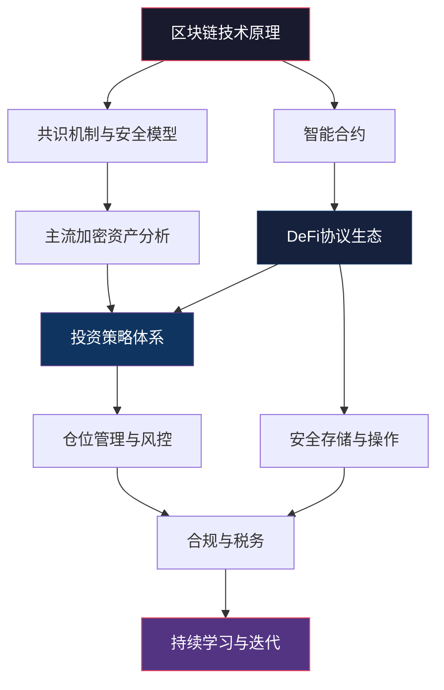
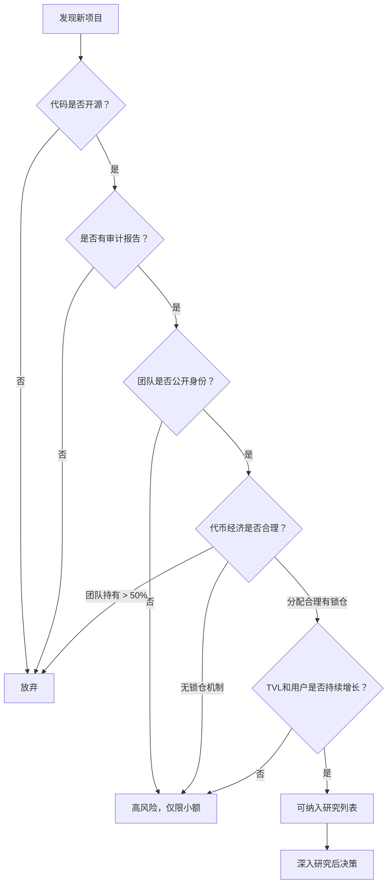

# 第12章 加密货币与DeFi——本章小结

本章从区块链底层技术原理出发，系统梳理了加密资产的估值逻辑、投资策略体系、DeFi协议机制、安全与合规框架，以及实战案例中的经验教训。本小结不是简单重复前文内容，而是站在更高的视角，将离散的知识点串联成一个完整的认知框架，帮助你建立"从原理到行动"的决策链路。

## 一、全章知识体系总览

本章涵盖的核心知识模块及其逻辑关系如下：

整个知识体系呈金字塔结构：底层是技术原理（理解"是什么"），中层是投资方法（掌握"怎么做"），顶层是风险管理（知道"什么不能做"）。三个层次缺一不可——只懂技术不懂投资，会被市场淘汰；只懂投资不懂技术，会成为被收割的韭菜；忽视风险管理，前面的一切都会归零。

## 二、核心知识点回顾与深层解析

### 2.1 区块链：不只是"分布式数据库"

本章开篇讲区块链时，强调了去中心化、不可篡改、透明可验证三大特性。但理解区块链的关键不在于记住这三个词，而在于理解**为什么**这三个特性组合在一起能产生颠覆性的价值。

**信任成本的革命**：传统金融体系的运转依赖大量中介机构——银行、清算所、审计师、监管机构——它们的本质功能都是"建立信任"。这些机构消耗了巨大的社会资源。区块链第一次用密码学和博弈论替代了这些中介的信任功能。一个交易不需要银行确认、不需要审计师审计、不需要律师见证，网络本身通过数学保证了交易的有效性。

**共识机制的本质**：PoW和PoS不是简单的"记账规则"，它们是博弈论在分布式系统中的工程实现。PoW用物理算力作为"投票权重"，篡改的代价是真实世界的电力消耗；PoS用经济利益作为"投票权重"，作恶会导致质押资产被罚没。理解这一本质，你就能判断任何新共识机制的安全性——它是否让作恶的经济代价足够高。

### 2.2 主流加密资产：价值逻辑的分野

本章分析了三类核心资产，它们代表了三种完全不同的价值主张：

| 维度 | 比特币（BTC） | 以太坊（ETH） | 稳定币（USDT/USDC/DAI） |
|------|---------------|---------------|-------------------------|
| 核心价值主张 | 数字稀缺性（数字黄金） | 可编程经济基础设施 | 价格稳定的链上美元 |
| 估值锚定 | 供给固定（2100万）+ 网络效应 | 生态规模 + 费用收入 | 1:1 法币锚定 |
| 增长驱动 | 机构采用、减半周期、宏观环境 | DeFi/NFT/GameFi生态增长 | DeFi整体规模扩张 |
| 主要风险 | 监管打压、技术替代 | 竞争链分流、升级失败 | 发行方信用、监管取缔 |
| 适合角色 | 资产配置的"压舱石" | 生态参与的"入场券" | 交易和收益的"中间层" |

**关于比特币的"数字黄金"叙事**：比特币的稀缺性（2100万上限、每四年减半）确实类似于黄金，但它比黄金多了两个关键优势——可以无限分割（最小单位0.00000001 BTC，即1聪）和可以全球即时转移。同时也有一个根本劣势——没有数千年的文化共识作为价值基础。比特币的"数字黄金"地位能否长期稳固，取决于未来几十年的共识积累。

**以太坊的"超声波货币"叙事**：自EIP-1559引入Gas费销毁机制后，以太坊在网络活跃时会变成通缩资产。这个特性使ETH不仅是"平台燃料"，还具备了类似比特币的价值存储潜力。但以太坊的估值更依赖于生态的实际使用量——如果DeFi和NFT热度下降，ETH的价值基础就会动摇。

### 2.3 投资策略：不要用战术的勤奋掩盖战略的懒惰

本章介绍了多种投资策略，但策略本身不是重点，重点是**理解每种策略适用的前提条件**。

**定投策略的本质**：定投不是"懒人投资法"，而是一种主动的风险管理决策。它承认"没有人能持续准确预测市场"这个事实，通过时间分散来平滑入场成本。定投的核心纪律是——在市场暴跌时不要停止定投，甚至应该加大投入。2022年加密市场大跌时坚持定投BTC的人，在2024-2025年获得了丰厚回报。

**仓位管理的数学基础**：凯利公式 f = (bp - q) / b 告诉我们一个关键信息——即使你有正期望值的机会，也不应该全仓投入。假设某交易策略的胜率是60%、盈亏比是2:1，凯利公式计算出的最优仓位是40%。超过这个比例，长期来看反而会降低总收益。这就是为什么"全仓梭哈"即使方向正确，长期来看也是错误的策略。

**止盈止损的执行纪律**：知道应该止损和真正执行止损之间有巨大的鸿沟。行为金融学告诉我们，人对"割肉"的痛苦感是"落袋为安"快乐感的2.5倍（损失厌恶）。克服这种偏差的方法是**在买入时就写好止损价位**，然后用限价单自动执行，把决策和执行分离。

### 2.4 DeFi：金融乐高的机会与陷阱

DeFi是本章最复杂也最具前瞻性的部分。理解DeFi，需要掌握以下几个关键模型：

**AMM模型的数学直觉**：Uniswap的恒定乘积公式 x × y = k 看起来简单，但蕴含深刻的设计哲学。当某个代币被大量买入时，池中该代币数量减少，价格自动上升——这模拟了真实市场中供需关系决定价格的机制。理解这个公式，你就能理解为什么大额交易会产生滑点，为什么流动性深度如此重要。

**无常损失的精确计算**：假设你在Uniswap上提供了ETH/USDC的流动性。当ETH价格翻倍时，你的资产组合价值会比单纯持有少约5.7%。这不是"损失"而是"少赚"，但在心理上同样痛苦。无常损失的大小与价格变化幅度的平方根成正比——价格变化越大，损失越大。

**借贷协议的利率机制**：Aave和Compound的利率不是人为设定的，而是由利用率（总借款/总供给）自动决定的。当利用率低于最优值时，利率随利用率线性增长；超过最优值后，利率急剧上升。这种设计的目的很明确——当流动性紧张时，高利率吸引存款、抑制借款，自动恢复平衡。

**收益的真实来源**：DeFi的高APY（年化收益率）并不神秘。它来自三个层次——交易手续费（真实收入）、代币激励（补贴收入，不可持续）、杠杆循环（风险放大）。辨别一个DeFi机会是否可靠，关键看收益中真实收入占多大比例。如果收益主要来自代币激励，那么代币价格下跌时，APY会急剧下降甚至变为负数。

### 2.5 安全与合规：活下来才能赚钱

安全部分是本章最不应该被跳过的内容。加密货币世界的损失是不可逆的——没有银行可以帮你撤销交易，没有保险可以覆盖大部分损失。

**私钥管理的铁律**：私钥和助记词是你对资产的唯一控制凭证。一旦泄露，资产在几秒内就会被转走。一旦丢失，资产将永久锁死在链上。硬件钱包（Ledger、Trezor）的价值不在于技术有多先进，而在于它强制将私钥与互联网隔离——这消除了绝大部分远程攻击的可能。

**交易所风险的量化认知**：Mt. Gox丢失了85万BTC（当时价值约4.5亿美元），FTX挪用了约80亿美元的用户资金。这些不是"小概率事件"——加密货币历史上平均每2-3年就会发生一次重大的交易所安全事件。应对策略很明确：交易完成后，大额资产立即提到冷钱包；在交易所只保留近期交易需要的金额。

**中国的监管现实**：2021年9月，中国人民银行等十部委联合发布公告，将虚拟货币相关业务活动定性为非法金融活动。个人持有加密货币本身并不违法，但通过国内渠道进行交易、OTC兑换、为他人提供交易服务等行为，都存在明确的法律风险。在做出任何参与决策前，必须充分了解这一法律框架。

## 三、从案例中学到的关键教训

本章实战案例篇展示了多个真实场景，提炼出以下核心教训：

### 3.1 关于比特币定投

比特币定投案例证明了一个简单但反直觉的事实——在市场恐慌时坚持定投的人，往往获得了最好的长期回报。2018-2019年熊市期间坚持定投的投资者，在2021年牛市中获得了5-8倍的回报。而那些在2021年高点FOMO入场的人，到2022年底亏损超过70%。

**定投的隐含前提**：定投策略默认你选择的资产长期会上涨。这个前提对比特币和以太坊在过去十几年是成立的，但不代表未来必然如此。定投不是"无脑买入"，而是"在有正期望值的前提下，用纪律对抗情绪"。

### 3.2 关于DeFi的收益与风险

DeFi流动性挖矿案例揭示了一个关键模式——高APY往往意味着高风险。当一个新协议提供1000%+的APY时，你应该问的第一个问题不是"我能赚多少"，而是"这个收益从哪里来"。如果答案是"来自协议自己发行的代币"，那么这个代币的价格大概率会持续下跌，最终APY会变得毫无意义。

**DeFi参与的安全检查清单**：

| 检查项 | 安全做法 | 危险信号 |
|--------|----------|----------|
| 智能合约审计 | 有知名审计机构报告 | 无审计或审计机构不知名 |
| TVL（总锁仓量） | 超过1亿美元且稳定增长 | TVL极低或快速下降 |
| 代码开源 | 合约代码在Etherscan可查 | 代码不透明 |
| 团队信息 | 核心团队公开身份 | 完全匿名团队 |
| 运行时间 | 主网运行超过6个月 | 刚上线的新协议 |
| 经济模型 | 收益来源清晰可持续 | 高APY无真实收入支撑 |

### 3.3 关于交易所安全事件

FTX崩盘事件教会我们两件事：第一，即使是全球排名前三的交易所也可能一夜之间倒闭；第二，"储备证明"（Proof of Reserves）不是万能的——FTX在崩盘前也声称有足够的储备。

**交易所选择的安全边际**：不把所有资产放在同一家交易所，是分散风险的基本操作。更高级的做法是定期关注交易所的钱包地址（通过链上数据），确认交易所确实持有其声称的资产数量。

## 四、认知偏差自检清单

本章常见误区篇揭示了十种典型错误。这里将它们整合为一个可执行的自检清单，定期对照：

**决策偏差**（每次交易前检查）：
- 我是否因为价格上涨才想买入？（追涨/FOMO）
- 我是否因为价格下跌才想卖出？（恐慌抛售）
- 我是否只关注了支持我观点的信息？（确认偏差）
- 我是否高估了自己对市场的判断能力？（过度自信）
- 我是否在试图"抓住每一个机会"？（过度交易）

**仓位偏差**（每周检查）：
- 加密资产是否超过总资产的20%？
- 单一币种是否超过加密仓位的30%？
- 是否在使用超过3倍的杠杆？
- 是否有超过80%的资产放在交易所？
- 是否有超过50%的仓位集中在新项目？

**安全偏差**（每月检查）：
- 冷钱包助记词是否安全备份在物理位置？
- 交易所是否开启了所有安全验证（2FA、提币白名单）？
- 是否在过去一个月点击过可疑链接？
- 是否在不安全的网络环境下操作过钱包？

## 五、投资健康度评估框架

下表提供了一套量化评估标准，用于定期审视自己的投资状态：

| 维度 | 健康指标 | 警戒线 | 危险线 |
|------|----------|--------|--------|
| 资产占比 | 加密资产 ≤ 10%-20%总资产 | 30%-50% | > 50% |
| 集中度 | 单一币种 ≤ 30%加密仓位 | 50%-80% | > 80%（All in） |
| 杠杆使用 | 不使用或 ≤ 2倍 | 3-5倍 | > 5倍 |
| 存储方式 | ≥ 80%大额资产在冷钱包 | 50%在冷钱包 | 全部在交易所 |
| 投资期限 | ≥ 3年 | 1-3年 | < 1年（短期投机） |
| 信息来源 | 独立研究 + 多源验证 | 主要靠社群消息 | 只听"老师带单" |
| 情绪管理 | 有交易计划且严格执行 | 偶尔情绪化交易 | 频繁追涨杀跌 |
| 合规意识 | 了解法规、保留记录 | 部分了解 | 完全忽视 |

**评估方法**：每周对照此表打分，任何一项触及危险线都需要立即调整。如果同时有3项以上触及警戒线，说明投资行为已经失控，建议暂停交易，重新审视策略。

## 六、项目评估决策树

面对一个新的加密项目，用以下决策流程快速筛选：

这个决策树的核心逻辑是**用排除法**——先排除明显的危险信号，再对通过筛选的项目进行深入研究。大部分新项目会在前两步就被排除，这正是决策树的价值——帮你节省时间，避免在高风险项目上浪费精力。

## 七、项目评估关键指标

| 评估维度 | 优质项目特征 | 危险信号 |
|----------|-------------|----------|
| 团队 | 公开身份、行业经验、过往项目可查 | 匿名团队、虚假简历、无法验证 |
| 技术 | 代码开源、定期更新、多轮审计 | 代码不透明、无审计、复制粘贴 |
| 社区 | 有建设性讨论、开发者活跃 | 只喊单、无技术讨论、机器人刷量 |
| 代币经济 | 合理分配、长期锁仓、销毁机制 | 团队持有过高、无锁仓、无限增发 |
| 实际应用 | 有真实用户和使用场景 | 无实际应用、纯投机 |
| 历史记录 | 运行稳定、无安全事故 | 曾被攻击、曾跑路、频繁出问题 |

## 八、学习路径与持续进阶

### 8.1 分阶段学习路径

**入门阶段（1-4周）**：建立基本认知，理解区块链和加密货币的核心概念。关键产出——能够用自己的话向一个完全不懂的人解释"什么是比特币"和"什么是区块链"。

**基础阶段（1-3个月）**：掌握投资工具和基本策略。关键产出——完成模拟投资，建立交易记录习惯，制定初步的投资策略文档。

**进阶阶段（3-6个月）**：深入DeFi协议、链上数据分析、代币经济学研究。关键产出——能够独立评估一个DeFi协议的安全性和收益合理性，能够使用链上数据辅助投资决策。

**专业阶段（6个月以上）**：形成自己的投资体系，持续迭代。关键产出——有明确的投资框架、风控体系和复盘机制，能够在不同市场环境下灵活调整策略。

### 8.2 核心学习资源

**必读经典**：
- 《精通比特币》（Mastering Bitcoin）——Andreas M. Antonopoulos，理解比特币技术细节的最佳入门书
- 《The Bitcoin Standard》——Saifedean Ammous，从经济学视角理解比特币的价值
- 《精通以太坊》（Mastering Ethereum）——Andreas M. Antonopoulos，理解智能合约和DeFi的技术基础
- 比特币白皮书（bitcoin.org/bitcoin.pdf）——9页纸，30分钟可读完，一切的起点

**数据平台**：
- CoinMarketCap / CoinGecko——加密货币行情数据和市值排名
- DeFi Pulse / DefiLlama——DeFi协议TVL和数据追踪
- Dune Analytics——链上数据自定义查询和可视化
- 非小号——中文加密货币数据聚合

**实操工具**：
- MetaMask——最主流的以太坊钱包，浏览器插件和移动端
- Ledger / Trezor——硬件钱包，大额资产必备
- TradingView——专业行情图表和技术分析
- Etherscan——以太坊区块浏览器，查看合约和交易

### 8.3 持续学习的习惯框架

加密货币领域的知识更新速度极快，保持学习是基本要求：

- **每日**（15分钟）：查看持仓币种价格变动，阅读1-2条行业新闻
- **每周**（1小时）：阅读1篇深度分析文章或研究报告，复盘本周交易操作
- **每月**（2小时）：审视投资组合表现，更新项目研究笔记，关注监管政策变化
- **每季度**：全面评估投资策略的有效性，调整资产配置比例

## 九、行动清单

### 今天就能做的三件事

1. **阅读比特币白皮书**——全文仅9页，30-60分钟可以读完。这是理解整个加密货币世界的起点。不需要懂数学，中本聪用平实的语言解释了核心原理。
2. **注册一个行情查看平台**——CoinMarketCap或CoinGecko，免费且无需KYC。每天花5分钟看看BTC和ETH的价格变化，培养市场感觉。
3. **评估自己的风险承受能力**——诚实地回答这个问题："如果我投入的钱全部归零，我的生活会受到多大影响？"如果答案是"会影响基本生活"，那么你目前还不适合投资加密货币。

### 本周要做的三件事

1. **深入了解比特币和以太坊的区别**——不只是价格不同，而是技术架构、共识机制、价值逻辑的根本差异。这决定了你在两者之间如何分配仓位。
2. **了解所在地区的法律法规**——在中国，个人持有加密货币不违法，但交易和挖矿被全面禁止。在做出任何参与决策前，必须清楚自己面临什么法律风险。
3. **制定一个初步的投资计划**——不急着执行，先写下来：投入多少、买什么、怎么买、什么时候卖。有了计划才能执行纪律。

### 本月要完成的三件事

1. **学习钱包安全知识并实操**——创建MetaMask钱包，理解助记词、私钥、地址的关系，练习发送和接收操作（可以在测试网上进行）。
2. **完成至少一个项目的基本面分析**——选择BTC或ETH，用本章教的分析框架进行完整分析，写一份500字的研究笔记。
3. **制定正式的投资策略和风控方案**——明确仓位上限、止损规则、存储方案，形成书面文档。

### 持续坚持的事

1. **执行定投策略**（如决定参与）——选定标的、确定金额、设定频率，然后坚持执行。不因短期涨跌改变计划。
2. **持续学习和更新认知**——这个领域的知识每6个月就会有重大更新。保持学习不是可选项，而是必选项。
3. **定期复盘**——每月回顾一次投资表现，每季度评估一次策略有效性。记录每次操作的理由和结果，从错误中学习。

## 十、本章核心金句

> "Bitcoin is a technological tour de force." —— 比尔·盖茨

> "Not your keys, not your coins." —— 加密货币社区共识（不是你的私钥，就不是你的币。这句话在FTX崩盘后被反复验证。）

> "在加密货币市场，活得久比赚得多更重要。" —— 这不是鸡汤，而是数学事实。亏损50%后需要涨100%才能回本，亏损90%需要涨900%才能回本。生存永远是第一优先级。

> "只投资你理解的东西，只用你能承受损失的钱。" —— 沃伦·巴菲特的投资原则，同样适用于加密货币。

> "DYOR（Do Your Own Research）。" —— 自己做研究，不要听别人喊单。这个领域的信息噪音极大，只有独立思考才能穿越噪音。

## 十一、下一章预告

在下一章中，我们将深入探讨**个人财务管理工具**，包括：

1. 记账工具和方法——如何用技术手段自动化个人财务管理
2. 个人财务报表制作——像管理公司一样管理自己的财务
3. 税务筹划技巧——合法节税的具体方法
4. 保险规划——用保险转移不可承受的风险
5. 信用管理——信用是现代金融体系中最重要的无形资产

无论你是否参与加密货币投资，良好的个人财务管理都是搞钱的基础。加密货币只是资产配置的一个选项，而个人财务管理是一切财务决策的地基。
