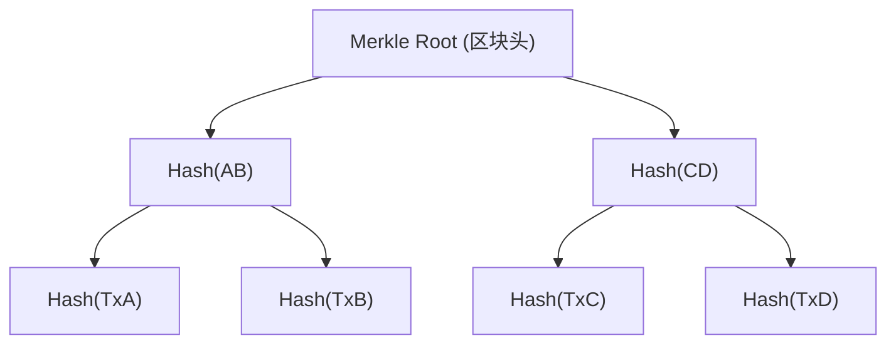
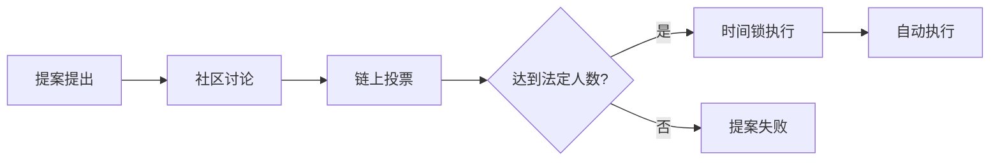

# 第12章 深度拓展：加密货币与DeFi的进阶知识

本章是整本书技术纵深最大的一节。前面的章节帮你在"是什么"和"怎么做"层面建立了认知框架，这里要回答的是"为什么这样设计"和"下一步会走向哪里"。如果你只打算买几个币放着，粗读即可；如果你想真正理解这个行业的底层逻辑——为什么Uniswap要这样定价、为什么以太坊要转PoS、为什么一条桥能丢5亿美元——请逐字读完。

---

## 一、区块链核心技术原理

### 1.1 数据结构：区块、链与Merkle树

区块链的"区块"和"链"两个字拆开看，每个区块由**区块头（Block Header）**和**区块体（Block Body）**组成。

**区块头**存储元数据，包括：

| 字段 | 作用 | 比特币示例 |
|------|------|-----------|
| Parent Hash | 指向前一区块的SHA-256哈希 | 32字节 |
| Merkle Root | 所有交易的默克尔树根哈希 | 32字节 |
| Timestamp | 出块时间戳 | 4字节 |
| Difficulty Target | 当前挖矿难度目标 | 4字节 |
| Nonce | 矿工尝试的随机数 | 4字节 |

**区块体**存储交易列表。比特币每个区块大小上限约4MB（SegWit后），以太坊通过Gas上限（当前约3000万Gas）控制单区块容量。

**Merkle树**是区块内部的关键数据结构。将所有交易两两配对、递归哈希，最终生成一个根哈希。这使得轻节点（SPV节点）无需下载完整区块链，只需获取区块头和一条Merkle证明路径（约几十个哈希值），就能验证某笔交易是否被包含在某个区块中。比特币区块头仅80字节，一年的区块头数据约42MB，而完整区块链超过500GB——Merkle树让轻量验证成为可能。



**UTXO模型 vs 账户模型**是两种根本不同的记账方式：

| 维度 | UTXO（比特币） | 账户模型（以太坊） |
|------|---------------|-------------------|
| 基本单元 | 未花费交易输出 | 账户余额 |
| 状态表示 | 一组UTXO的集合 | 全局状态树中的账户 |
| 并行性 | 天然支持（不同UTXO可并行验证） | 需要额外处理（同一账户的交易串行） |
| 隐私性 | 每次交易可使用新地址，隐私较好 | 所有交易关联同一地址，容易追踪 |
| 智能合约 | 不原生支持（需扩展如RSK） | 原生支持 |
| 状态膨胀 | UTXO集合持续增长 | 可通过状态清理缓解 |

### 1.2 共识机制深度对比

共识机制决定了谁有权写入新区块，以及网络如何就"哪条链是正确的"达成一致。

**工作量证明（PoW）**的核心逻辑：算力即投票权。矿工不断尝试不同的Nonce值，计算SHA-256(SHA-256(block_header))，直到结果小于难度目标。比特币当前难度约为78万亿（78T），意味着哈希结果的前约74位必须是零。全网算力约600 EH/s（每秒6×10²⁰次哈希），这意味着找到一个有效区块平均需要约10分钟。

PoW的**51%攻击**成本计算：以比特币为例，600 EH/s的51%需要约307 EH/s的算力。当前最先进的矿机（如Antminer S21 XP）算力约270 TH/s，功耗约3610W。需要约113万台这样的矿机，硬件成本约25亿美元，每天电费约3000万美元。而且即使攻击成功，比特币价格崩盘会让攻击者的收益归零——这是PoW的经济安全模型。

**权益证明（PoS）**以太坊在2022年9月完成"The Merge"从PoW转为PoS。验证者需要质押32 ETH成为验证者。每个slot（12秒）随机选择一个验证者提议区块，另有委员会（至少128个验证者）对该区块投票确认。安全性基于经济惩罚——验证者如果作恶（双重签名、长期离线），质押的ETH会被罚没（slashing）。

PoS相比PoW的优势：能耗降低约99.95%；出块时间更稳定（12秒 vs ~10分钟）；确认速度更快（2个epoch约12.8分钟达到最终性）。

PoS的争议点：财富集中——质押量前10的实体控制了约30%的质押ETH；Nothing-at-Stake问题（通过slashing机制解决）；长程攻击（通过weak subjectivity checkpoint解决）。

**其他共识机制简表**：

| 机制 | 代表项目 | TPS | 去中心化程度 | 适用场景 |
|------|---------|-----|-------------|---------|
| DPoS | EOS, TRON | ~4000 | 中等（21-101个超级节点） | 高性能公链 |
| PoA | VeChain, xDai | ~1000+ | 低（已知权威节点） | 联盟链/企业链 |
| PoH+PoS | Solana | ~65000 | 中等 | 高频交易应用 |
| DAG | IOTA, Hedera | ~10000+ | 不等 | IoT/企业应用 |
| BFT变种 | Tendermint/Cosmos | ~10000 | 中等（150-200验证者） | 应用链生态 |

### 1.3 智能合约：从原理到安全

智能合约是部署在区块链上的、不可篡改的、自动执行的代码。以太坊的智能合约用Solidity语言编写，编译为EVM字节码后部署。

**EVM（以太坊虚拟机）**是一个基于栈的虚拟机，拥有256位字长（为适配椭圆曲线运算）。它是一个沙箱环境——合约之间可以相互调用，但无法直接访问文件系统、网络或其他外部资源。这种隔离性是安全的基础，也是局限性的来源。

**Gas机制**是防止计算资源滥用的经济手段。每个EVM操作码都有固定的Gas成本（如ADD=3 Gas，SSTORE=20000 Gas写入新存储）。用户为Gas出价（Gwei），矿工/验证者优先打包Gas Price高的交易。以太坊EIP-1559引入了Base Fee（被销毁）+ Priority Tip（归验证者）的双层定价模型，Base Fee根据上一区块的Gas使用率自动调整（目标50%利用率，波动上限12.5%）。

**智能合约安全**是DeFi领域最关键的技术问题。历史上的重大安全事件大多源于以下漏洞类型：

| 漏洞类型 | 原理 | 经典案例 | 损失金额 |
|----------|------|---------|----------|
| 重入攻击（Reentrancy） | 外部调用未更新状态就转账，攻击者递归调用提款函数 | The DAO (2016) | 6000万美元（360万ETH） |
| 整数溢出/下溢 | uint256类型运算超过范围后回绕 | BEC代币 (2018) | 代币价值归零 |
| 预言机操纵 | 通过操控价格输入来获取不正当利润 | bZx (2020) | 800万美元 |
| 签名重放 | 跨链或跨合约重复使用有效签名 | Poly Network (2021) | 6.1亿美元（后归还） |
| 闪电贷攻击 | 在单笔交易内借入巨量资金操控价格 | Cream Finance (2021) | 1.3亿美元 |
| 逻辑漏洞 | 合约业务逻辑存在设计缺陷 | Wormhole (2022) | 3.2亿美元 |

**防范措施**：
- 使用OpenZeppelin等经过审计的库，避免从零写合约
- 使用Checks-Effects-Interactions模式（先检查条件、再更新状态、最后转账）
- 引入ReentrancyGuard防重入锁
- 使用Chainlink等去中心化预言机而非单源价格
- 部署前进行专业审计（Trail of Bits、OpenZeppelin、Consensys Diligence等）
- 使用形式化验证工具（Certora、KEVM）证明关键属性

---

## 二、Layer 2扩容技术深度解析

以太坊主网（Layer 1）当前约15-30 TPS，远不足以支撑大规模应用。Layer 2的核心思想是将计算和存储移到链下，只将最终结果或证明提交到主网，从而继承主网的安全性。

### 2.1 Rollup技术

Rollup是当前以太坊扩容的核心路线图。核心思想：在链下执行交易，将交易数据（或证明）压缩后发布到L1。

**Optimistic Rollup**（Optimism, Arbitrum）：

- 假设所有交易默认有效（"乐观"地信任）
- 设置7天的挑战期，任何人可以提交**欺诈证明（Fraud Proof）**挑战无效交易
- 交易数据以calldata形式发布到L1，确保数据可用性
- 优势：兼容EVM，开发者迁移成本低
- 劣势：提款需等待7天挑战期（可通过流动性桥接服务缩短）

Arbitrum通过多轮交互式欺诈证明优化了挑战效率——挑战者和断言者通过二分查找逐步缩小争议范围，最终只需在L1上重新执行单条指令。

**ZK Rollup**（zkSync Era, StarkNet, Polygon zkEVM, Scroll）：

- 每批交易生成一个**零知识证明（ZK Proof）**，L1验证者只需验证这个证明
- 证明验证的计算成本远低于重新执行所有交易
- 优势：提款无需等待（证明即最终性），安全性更强
- 劣势：生成证明的计算成本高，EVM兼容性实现难度大

ZK证明的核心类型：
- **zk-SNARK**（Zero-Knowledge Succinct Non-Interactive Argument of Knowledge）：证明小、验证快，但需要可信设置（Trusted Setup）
- **zk-STARK**（Scalable Transparent Argument of Knowledge）：不需要可信设置，证明较大但抗量子计算

**Rollup经济模型**：L2 sequencer（排序器）负责收集交易、排序、生成批次并提交到L1。当前大多数L2的sequencer是中心化的（由运营团队控制），这意味着存在审查风险和单点故障。去中心化sequencer是各L2项目的核心技术路线之一。

### 2.2 Validium与数据可用性

**Validium**与ZK Rollup类似，但不将交易数据发布到L1，而是存储在链下（如IPFS或专用数据可用性委员会）。这大幅降低了L1数据成本，但牺牲了一定的数据可用性保证。

**数据可用性（Data Availability）问题**是扩容方案的核心挑战之一：如果交易数据不公开，用户就无法独立验证状态转换是否正确，也无法在运营商作恶时重建状态。

以太坊的**Danksharding**路线图（通过EIP-4844 "Proto-Danksharding"开始）引入了**Blob交易**——一种新的交易类型，携带约128KB的二进制大对象数据。Blob数据不被EVM直接访问，只保留约18天，其存在性通过KZG承诺验证。这使得Rollup提交数据的成本降低约10-100倍。

### 2.3 跨链桥安全

跨链桥连接不同区块链，是多链生态的关键基础设施，也是黑客攻击的重灾区。2022年跨链桥安全事件损失超过20亿美元。

**桥的主要类型**：
- **信任型桥**（如WBTC）：由中心化托管方管理资产，安全性取决于托管方
- **轻客户端桥**（如IBC）：在目标链上运行源链的轻客户端，验证源链的区块头和证明
- **乐观桥**（如Arbitrum Bridge）：类似Optimistic Rollup，设有挑战期
- **ZK桥**：使用零知识证明验证跨链消息，安全性最高但技术难度最大

**常见攻击向量**：私钥泄露（Ronin Bridge，6.25亿美元）、智能合约逻辑漏洞（Wormhole，3.2亿美元）、预言机操纵、验证者合谋。

---

## 三、加密货币的经济学分析

### 3.1 加密货币的货币属性

从经济学角度检验加密货币是否满足货币的三大功能：

**价值储存（Store of Value）**：比特币支持者将其称为"数字黄金"，其2100万枚的固定供应量理论上可对抗法币通胀。但比特币的历史最大回撤超过83%（2017年12月~2018年12月，从约20000美元跌至约3200美元），年化波动率常年在60%-80%，远超黄金的15%-20%。稳定币（USDT、USDC）通过1:1锚定美元解决了波动性问题，但引入了对手方风险和信任假设。

**交换媒介（Medium of Exchange）**：比特币约7 TPS，以太坊约15-30 TPS，远低于Visa的约65000 TPS。Layer 2方案（闪电网络、Rollup）在解决这个问题，但增加了复杂性和桥接成本。比特币每笔交易确认约10分钟（6个区块确认约1小时），以太坊约12-15秒。

**计价单位（Unit of Account）**：绝大多数商品和服务仍以法币计价。萨尔瓦多在2021年将比特币定为法定货币，但实际使用率极低（据调查仅约20%的商户接受比特币支付）。

### 3.2 代币经济学（Tokenomics）

代币经济学决定了一个项目的长期价值走向。设计不良的代币经济学是90%以上加密项目失败的根本原因。

**供给机制分类**：

| 类型 | 机制 | 代表 | 经济效应 |
|------|------|------|---------|
| 固定供给 | 总量上限，逐步减半释放 | BTC（2100万） | 稀缺性溢价，长期通缩压力 |
| 通胀型 | 无上限，持续增发 | 早期ETH | 激励参与者，但稀释持币者 |
| 通缩型 | 销毁机制大于增发 | ETH（EIP-1559后） | 供应量持续减少，价格支撑 |
| 弹性供给 | 算法调节供应量 | AMPL, ESD | 价格锚定，但易死亡螺旋 |
| ve代币 | 锁仓换取投票权+收益 | CRV, AURA | 深度绑定长期参与者 |

**需求侧分析**：代币需求通常来自三个层面——投机需求（基于预期的买入，占大多数代币需求的50-90%）、使用需求（Gas费、治理投票、获取服务）和质押需求（网络安全、收益获取）。一个健康的代币经济模型应该让使用需求和质押需求逐步取代投机需求。

**分配机制的风险评估**：

| 分配方式 | 风险点 | 审查要点 |
|----------|--------|---------|
| 预挖（Pre-mine） | 团队持有过多份额 | 团队持仓占比、锁仓期和释放计划 |
| VC投资轮 | 早期投资者成本极低 | 解锁时间表、集中抛压 |
| 空投（Airdrop） | 短期投机者大量抛售 | 空投占比、领取条件 |
| 流动性挖矿 | 收益递减后用户流失 | 排放计划、是否可持续 |

**代币解锁时间表**是分析代币供给压力的关键工具。项目方和早期投资者的代币通常有1-4年的锁定期，每月线性释放。大型解锁事件（如FTT、DYDX、APT的大额解锁）往往在解锁前1-2周就开始产生抛压预期，导致价格下跌。

### 3.3 加密货币估值模型

加密货币估值仍处于早期探索阶段，以下模型各有适用范围和局限性：

**NVT比率（Network Value to Transactions）**：NVT = 市值 / 链上日交易量。类比股票的P/E比率。NVT > 90-100通常表示过热，NVT < 30-40可能表示低估。局限性：链上交易量不等于经济活动，且不同链的交易性质差异大。

**梅特卡夫定律应用**：V = k × n²（n为网络活跃用户数）。通过活跃地址数、交易笔数、每日活跃用户（DAU）等指标评估。研究者曾用此模型成功拟合比特币2010-2017年的价格走势，但后来偏离加大。

**收益贴现模型（DCF变体）**：适用于有明确现金流的DeFi协议代币。例如Uniswap的手续费收入、Aave的利差收入、GMX的交易手续费等。将未来协议收入按合理的折现率（通常30%-50%，反映高风险）贴现到当前。

**S2F模型（Stock-to-Flow）**：由PlanB提出，认为比特币价格与其存量/流量比（Stock-to-Flow Ratio）高度相关。比特币每次减半后S2F翻倍。该模型在2019-2021年预测较为准确，但2022年后显著偏离，引发争议。

**生产成本模型**：对于PoW币种，挖矿的边际生产成本构成价格的一个重要支撑位。当价格跌破全网平均挖矿成本时，部分矿工会关机，算力下降，难度调整后成本降低，形成动态平衡。比特币减半后生产成本翻倍，历史上每次减半后12-18个月都出现了大幅上涨。

---

## 四、DeFi协议的数学模型

### 4.1 自动化做市商（AMM）

AMM是去中心化交易所的核心定价引擎，用数学公式取代传统的订单簿撮合。

**恒定乘积做市商（Constant Product Market Maker）**：Uniswap V2采用 x × y = k 的公式。

推导过程：流动性池中x代币数量为x，y代币数量为y，k为常数。当交易者用Δx的x代币换取Δy的y代币时：

```text
(x + Δx) × (y - Δy) = k
Δy = y·Δx / (x + Δx)
```

**价格影响（Price Impact）**：交易量占池子比例越大，价格偏离越严重。假设一个ETH/USDC池子各有1000 ETH和2,000,000 USDC（即1 ETH = 2000 USDC）：
- 买1 ETH：价格影响 ≈ 0.1%，成交均价 ≈ 2002 USDC
- 买10 ETH：价格影响 ≈ 1.0%，成交均价 ≈ 2020 USDC
- 买100 ETH：价格影响 ≈ 9.1%，成交均价 ≈ 2182 USDC

**无常损失（Impermanent Loss, IL）**：当池中两种代币的价格比率发生变化时，LP的资产价值会低于简单持有（HODL）两种代币的组合。公式推导：

```text
IL = 2√r / (1+r) - 1
其中 r = 价格变化比率（P_new/P_old）
```

| 价格变化幅度 | 无常损失 |
|-------------|---------|
| ±25% | -0.6% |
| ±50% | -2.0% |
| ±100%（翻倍或减半） | -5.7% |
| ±200% | -13.4% |
| ±500% | -25.5% |

无常损失之所以叫"impermanent"，是因为如果价格回到初始比率，损失会消失。但如果LP在价格偏离期间撤出流动性，损失就变成了永久的。

**集中流动性（Uniswap V3）**：LP可以将流动性集中在特定价格区间（如ETH在$1800-$2200之间），而非分布在0到正无穷。这使得资本效率提高了约4000倍（对于1个tick的流动性范围），但也意味着价格一旦超出区间，该LP仓位就变成纯持仓（不再赚取手续费，且持仓比例完全偏向一个代币）。

**StableSwap模型（Curve Finance）**：专为稳定币设计。公式结合了恒定和与恒定乘积：

```text
A·n^n·Σx_i + D = A·D·n^n + D^(n+1)/(n^n·Πx_i)
```

参数A（Amplification Parameter）控制曲线的形状——A越大，曲线越接近恒定和（x+y=k），在1:1附近提供极低滑点；A越小，曲线越接近恒定乘积。Curve的3pool（DAI/USDC/USDT）A值约2000，使得百万美元级别的稳定币兑换滑点仅约0.01%。

### 4.2 借贷协议的利率模型

DeFi借贷协议（Aave、Compound、Morpho）用算法自动调整利率，取代传统银行的人工定价。

**核心公式**：利率是资金利用率U的分段函数。

```text
U = 总借款 / 总供给

当 U < U_optimal 时：
  R_borrow = R_base + (U / U_optimal) × R_slope1

当 U ≥ U_optimal 时：
  R_borrow = R_base + R_slope1 + ((U - U_optimal) / (1 - U_optimal)) × R_slope2
```

以Aave V3的USDC市场为例：
- R_base = 0%
- U_optimal = 90%
- R_slope1 = 4%
- R_slope2 = 75%

当U=80%时：R_borrow = 0% + (80%/90%) × 4% ≈ 3.56%
当U=95%时：R_borrow = 4% + (5%/10%) × 75% = 41.5%
当U=99%时：R_borrow = 4% + (9%/10%) × 75% = 71.5%

这种**曲棍球棍形**利率曲线的设计目的：在利用率低时激励借款（低利率），在利用率高时激励存款并抑制借款（利率急剧上升），保护协议流动性安全。

**存款利率**：R_supply = R_borrow × U × (1 - 储备金因子)
其中储备金因子（Reserve Factor，通常10%-30%）是协议抽取的利差，用于协议财库。

### 4.3 清算机制与MEV

**清算**是借贷协议的安全网。当借款人的健康因子（Health Factor）低于1时：

```text
Health Factor = (抵押品价值 × 清算阈值) / 借款价值
```

清算流程：
1. 清算人（通常是MEV机器人）发现Health Factor < 1的仓位
2. 清算人替借款人偿还部分或全部债务（最多50%）
3. 清算人以折扣（清算奖金，通常5%-10%）获得借款人的抵押品
4. 借款人损失抵押品+惩罚金，但剩余抵押品和借款额度被重置

**MEV（Maximal Extractable Value）**是DeFi中一个极为重要但常被忽视的概念。MEV指验证者/区块构建者通过操纵交易顺序所能提取的最大价值。

主要的MEV类型：
- **三明治攻击（Sandwich Attack）**：在用户的Swap交易前后分别插入买入和卖出交易，利用用户的滑点设置获利。据统计，以太坊上的三明治攻击每天提取数十万到数百万美元
- **套利**：利用不同DEX之间的价格差异进行无风险套利
- **清算**：监控借贷协议的Health Factor，在清算触发时抢先执行清算交易
- **Back-running**：在大额交易后立即执行反向交易获利

Flashbots的SUAVE和以太坊的PBS（Proposer-Builder Separation）正在试图将MEV的提取过程规范化，减少对普通用户的伤害。

---

## 五、零知识证明与隐私技术

### 5.1 零知识证明基础

零知识证明（Zero-Knowledge Proof, ZKP）是一种密码学协议，允许证明者向验证者证明某个陈述为真，而不泄露任何额外信息。

ZKP的三个核心属性：
- **完备性（Completeness）**：如果陈述为真，诚实的证明者可以说服验证者
- **健全性（Soundness）**：如果陈述为假，恶意证明者无法欺骗验证者
- **零知识性（Zero-Knowledge）**：验证者除了"陈述为真"之外，不获得任何其他信息

在区块链领域的应用场景：
- **ZK Rollup**：用ZKP证明L2状态转换的正确性（zkSync, StarkNet）
- **隐私交易**：隐藏交易的发送者、接收者和金额（Zcash的zk-SNARK, Tornado Cash）
- **身份验证**：证明自己满足某些条件（如年龄>18岁），而无需透露具体年龄
- **可验证计算**：证明某个计算结果正确，而无需重新执行计算

### 5.2 隐私币技术对比

| 特性 | Monero (XMR) | Zcash (ZEC) | Tornado Cash |
|------|-------------|-------------|--------------|
| 隐私技术 | 环签名+隐匿地址+RingCT | zk-SNARK | 零知识证明+混币池 |
| 隐私程度 | 默认全匿名 | 可选匿名（透明或屏蔽交易） | 混币匿名 |
| 可审计性 | 不支持 | 支持查看密钥 | 不支持 |
| 监管状态 | 多交易所下架 | 合规性较好 | 被美国OFAC制裁 |
| 链上分析抗性 | 极强 | 强（屏蔽交易） | 中等（可追踪池外资金流） |

---

## 六、链上数据分析

链上数据分析是加密货币投资中最被低估的分析工具。与传统金融市场不同，区块链上的每一笔交易都是公开透明的，这为投资者提供了前所未有的数据洞察。

### 6.1 关键链上指标

**网络活跃度指标**：
- **活跃地址数（Active Addresses）**：每日/每周参与交易的唯一地址数，反映网络使用率
- **新增地址数**：衡量网络的采用速度
- **交易笔数**：反映网络的实际使用频率（需排除刷量交易）
- **大额交易笔数**：追踪"聪明钱"的动向

**持币分布指标**：
- **持仓集中度**：前10/100/1000地址持有的供应量占比
- **巨鲸动向**：大额转入交易所通常意味着抛售意图，大额从交易所转出通常意味着长期持有
- **长期持有者 vs 短期持有者**：链上分析工具将持币超过155天的地址定义为长期持有者

**成本基础指标**：
- **MVRV比率（Market Value to Realized Value）**：市值 / 已实现市值。已实现市值是每个UTXO最后一次移动时的价格之和。MVRV > 3.5通常表示市场过热，MVRV < 1表示大多数持币者处于亏损状态
- **SOPR（Spent Output Profit Ratio）**：卖出价格 / 买入价格的链上平均值。SOPR > 1表示链上卖出者平均盈利，< 1表示平均亏损

### 6.2 链上分析工具

| 工具 | 用途 | 特点 |
|------|------|------|
| Etherscan | 以太坊区块浏览器 | 基础查询，免费 |
| Dune Analytics | SQL查询链上数据 | 社区驱动的仪表板，强大灵活 |
| Nansen | 智能钱包标签追踪 | 标注了"Smart Money"地址，付费 |
| Glassnode | 链上指标平台 | 专业级指标（MVRV、SOPR等） |
| Arkham Intelligence | 实体识别和追踪 | 识别交易所、基金、项目的钱包 |
| DeFiLlama | DeFi TVL追踪 | 免费，覆盖所有主要链 |
| Token Terminal | 协议收入和估值 | 类似DeFi的Bloomberg Terminal |

---

## 七、NFT的价值评估框架

### 7.1 NFT的价值来源

NFT的价值是多重因素的叠加，不能简单地用"稀缺性"解释：

**稀缺性**：链上铸造数量是最基础的约束。CryptoPunks（10000个）的地板价远高于无上限铸造的项目。但稀缺性不等于价值——一个只有1个的垃圾NFT仍然不值钱。

**艺术/文化价值**：数字艺术NFT的价值取决于创作者声誉、作品创意、艺术史地位。Beeple的"Everydays: The First 5000 Days"以6934万美元成交，反映了数字艺术作为新兴资产类别的认可。

**实用性（Utility）**：NFT作为会员卡（如BAYC的社区访问权）、游戏资产（如Axie Infinity的战斗角色）、活动门票（如YellowHeart的演唱会NFT票）等，其价值与实用性直接挂钩。

**社区/社交价值**：NFT头像已经成为Web3的社交货币。持有BAYC、CryptoPunks等蓝筹NFT在Web3社区中类似于持有奢侈品牌，是一种身份信号。

**版税收入**：NFT创作者可以在智能合约中设定版税比例（通常2.5%-10%），每次二级市场交易自动获得版税。高交易量的NFT系列能为创作者带来持续收入。

### 7.2 NFT估值方法论

**可比销售法**：参考同系列或相似系列的最近成交价。核心变量：稀有度排名（可用Rarity Sniper等工具计算）、属性稀有度（特定特征的出现概率）、最近成交时间。

**特征定价法**：用回归分析量化每个属性对价格的影响。例如，对于BAYC，金色毛皮（Golden Fur）特征的出现率仅约0.46%，可能对应数万美元的价格溢价。通过多变量回归模型可以量化每个特征的边际贡献。

**地板价乘数法**：NFT价格 = 地板价 × 稀有度乘数。这是最简单但实用的方法。稀有度乘数通常在1.5x-10x之间，极度稀有的NFT可以达到50x-100x。

### 7.3 NFT的风险

- **流动性风险**：NFT市场流动性极低，想卖时可能无人接盘
- **估值风险**：NFT定价高度主观，缺乏标准化估值方法
- **智能合约风险**：NFT合约可能包含后门或权限过大
- **版权风险**：购买NFT通常不等于获得版权（除非明确约定）
- **平台风险**：NFT元数据通常存储在IPFS或中心化服务器上，如果离线，NFT可能变成"空壳"

---

## 八、DAO治理与去中心化组织

### 8.1 DAO的治理模型

DAO（Decentralized Autonomous Organization）是通过智能合约执行治理决策的组织形式。核心治理流程：



**投票机制对比**：

| 机制 | 原理 | 优势 | 劣势 |
|------|------|------|------|
| 一币一票 | 代币持有量=投票权 | 简单直接 | 富者垄断，容易被巨鲸操控 |
| 时间加权投票（ve） | 锁仓时间越长，投票权越大 | 激励长期参与 | 降低流动性参与 |
| 二次方投票 | 投票成本=票数² | 保护少数派 | 可被Sybil攻击 |
| 委托投票 | 将投票权委托给信任的代表 | 提高参与率 | 代表集中化风险 |
| 乐观治理 | 提案默认通过，只有反对票才能阻止 | 效率高 | 需要活跃的反对声音 |

**ve代币经济学（Vote-Escrowed）**由Curve Finance首创：用户锁定CRV代币最长4年，获得veCRV。锁仓时间越长，veCRV越多（最多1:1，锁4年）。veCRV持有者有权投票决定CRV排放分配给哪些流动性池——这赋予了veCRV极大的"贿赂"价值。Convex Finance、Aura Finance等"元治理"协议通过聚合大量veCRV来控制Curve的排放方向，形成了复杂的治理权力市场。

### 8.2 DAO面临的治理困境

**投票参与率低**：大多数DAO的提案投票参与率不到10%。低参与率意味着少数活跃参与者就能决定结果，违背了去中心化的初衷。

**治理攻击**：攻击者可以在治理投票开始前通过闪电贷借入大量代币进行投票，投票结束后归还。解决方案包括设置投票快照区块、要求代币在投票前锁定一段时间等。

**委托集中化**：在委托投票模式下，投票权往往集中在少数知名人物手中，形成事实上的寡头治理。

---

## 九、真实世界资产（RWA）代币化

RWA代币化是2023-2025年DeFi领域最重要的趋势之一。将链下资产（国债、房地产、大宗商品、应收账款）代币化后搬到链上，可以让DeFi协议获取数百万亿美元的资产规模。

### 9.1 RWA的当前格局

截至2025年中，链上RWA总规模（不含稳定币）约150-200亿美元，主要分布在：

| 资产类别 | 代表协议 | 规模 | 特点 |
|----------|---------|------|------|
| 美国国债 | Ondo Finance, Franklin Templeton | ~80亿美元 | 低风险、固定收益 |
| 私人信贷 | Centrifuge, Goldfinch, Maple | ~50亿美元 | 高收益、信用风险 |
| 房地产 | RealT, Parcl | <5亿美元 | 门槛降低、流动性改善 |
| 大宗商品 | Paxos Gold (PAXG), Tether Gold | ~10亿美元 | 黄金锚定 |

**代币化国债**是当前增长最快的RWA类别。Ondo的USDY（美国国债收益代币）年化收益约4.5%-5%，通过智能合约将基金持仓份额代币化，持有者获得链上流通的收益型代币。

### 9.2 RWA的技术与法律挑战

- **预言机问题**：链下资产的价格需要可靠的预言机输入，但不存在像加密资产那样的链上实时价格
- **法律执行**：代币持有者在法律上是否有权追索标的资产？这取决于代币的法律结构（证券、债权还是权益份额）
- **合规要求**：RWA代币通常有KYC/AML要求，与DeFi的无许可精神存在张力
- **跨司法管辖区**：资产可能在一个国家，代币发行在另一个国家，投资者在第三个国家——法律适用性复杂

---

## 十、加密货币监管全球比较

### 10.1 主要司法管辖区

**美国**：多头监管格局——SEC将大多数代币视为证券（应用Howey Test：投资金钱、共同企业、期望利润、主要来自他人努力），CFTC将比特币视为商品，FinCEN负责反洗钱，IRS将加密货币视为应税财产。各州还有额外要求（纽约BitLicense、怀俄明州DAO法案）。2024年比特币现货ETF的获批是重要里程碑，但SEC对以太坊及其他代币的态度仍不确定。

**欧盟MiCA（Markets in Crypto-Assets Regulation）**：2024年12月全面生效。MiCA是全球最全面的加密资产监管框架，涵盖：
- 发行和交易加密资产的规则
- 加密资产服务提供商（CASP）的牌照要求
- 稳定币的储备要求和赎回义务
- 市场操纵和内幕交易的禁止

**中国**：2021年全面禁止加密货币交易和挖矿，但对区块链技术本身持积极态度（BSN、数字人民币）。

**日本**：全球最早系统监管加密货币的国家之一。《资金结算法》定义加密货币为支付手段，FSA监管交易所。要求交易所将客户资产与自有资产分离，并大部分存储在冷钱包中。

**新加坡**：《支付服务法》监管加密服务，MAS发放牌照。对创新持开放但审慎态度——2022年后收紧了零售投资者保护规则，禁止交易所向散户提供杠杆和借贷服务。

**香港**：2023年起重新定位为加密货币中心，SFC推出虚拟资产交易平台发牌制度，允许散户交易比特币和以太坊。加速器计划吸引Web3企业落户。

**迪拜/阿联酋**：VARA（虚拟资产监管局）建立专门的虚拟资产监管框架，对交易所、托管、DeFi等分类监管。

### 10.2 监管趋势

**稳定币监管**是全球共识。欧盟MiCA要求稳定币发行方持有等值储备并定期审计，美国正在推进相关立法。Tether（USDT）虽然市值最大（超1000亿美元），但其储备构成的透明度一直受到质疑。

**CBDC（央行数字货币）**：全球超过130个国家在研究CBDC。中国数字人民币（e-CNY）已在多个城市大规模试点，累计交易额超万亿元。欧洲央行的数字欧元处于设计阶段。CBDC可能改变支付格局，但与加密货币的核心理念（去中心化、抗审查）截然相反。

---

## 十一、Web3的未来展望

### 11.1 Web3的技术栈

| 层次 | 功能 | 代表项目 |
|------|------|---------|
| L1 公链 | 全局共识和安全 | Ethereum, Solana, Cosmos |
| L2 扩容 | 高性能执行 | Arbitrum, zkSync, Base |
| 存储 | 去中心化数据存储 | IPFS, Filecoin, Arweave |
| 身份 | 可验证数字身份 | ENS, Spruce ID, Worldcoin |
| 预言机 | 链下数据输入 | Chainlink, Pyth, API3 |
| 跨链 | 多链互操作 | LayerZero, Wormhole, IBC |
| 隐私 | 数据隐私保护 | Aztec, Secret Network |

### 11.2 值得关注的技术趋势

**账户抽象（Account Abstraction）**：ERC-4337让智能合约账户成为一等公民。用户不再需要管理私钥和Gas费——可以使用社交恢复（家人朋友帮你找回账户）、代付Gas（dApp为你支付）、批量交易（一次签名完成多步操作）。这是改善Web3用户体验的最重要技术。

**意图（Intents）**：用户不指定"怎么做"，只声明"要做什么"。例如："我要用100 USDC买到尽可能多的ETH"，由求解器（Solver）网络来找到最优执行路径。UniswapX、1inch Fusion、CoW Swap都在这个方向上探索。

**全同态加密（FHE）**：允许在加密数据上直接进行计算，结果解密后与在明文上计算一致。如果FHE变得实用，将彻底解决区块链的隐私问题——交易可以完全保密，但仍然可验证。

### 11.3 Web3面临的核心挑战

**可扩展性悖论**：去中心化、安全性、可扩展性三者最多同时满足两个（区块链不可能三角）。以太坊的路线图试图通过Danksharding+Rollup同时满足三者，但尚未完全实现。

**用户体验鸿沟**：注册钱包、购买Gas代币、理解交易确认、保管私钥——每一个步骤都在流失普通用户。账户抽象和智能钱包正在解决这个问题，但距离Web2的体验还有很大差距。

**监管不确定性**：全球监管框架碎片化。一个项目可能在美国被认定为证券、在欧盟需要MiCA牌照、在中国被完全禁止——合规成本极高。

**安全挑战持续**：2022年DeFi领域因黑客攻击损失约38亿美元，2023年约18亿美元，2024年约15亿美元。虽然损失在减少，但绝对数字仍然惊人。智能合约审计、bug赏金、形式化验证、保险协议（Nexus Mutual, InsurAce）正在建立多层防护，但安全是持续的对抗过程，不存在一劳永逸的解决方案。

---

## 十二、常见误区与认知陷阱

在加密货币的深度学习过程中，以下认知陷阱最容易让技术理解产生偏差：

**误区一："区块链是不可篡改的"**——准确地说是"篡改成本极高"。51%攻击在理论上可行，小型链（如Ethereum Classic）多次遭受51%攻击。比特币的不可篡改性取决于全网算力的去中心化程度。

**误区二："DeFi完全去中心化"**——大多数DeFi协议都有管理密钥（admin key），协议升级需要多签钱包批准。Uniswap Labs可以（且已经）限制某些地址访问其前端。真正的去中心化是一个光谱，而非二元状态。

**误区三："代码即法律"**——The DAO事件后，以太坊社区通过硬分叉回滚了黑客的交易，证明了代码之上还有社区共识。当损失足够大、影响足够广时，"不可篡改"的规则是可以被推翻的。

**误区四："TPS越高越好"**——Solana的65000 TPS在纸面上远超以太坊的15-30 TPS，但高TPS意味着节点硬件要求更高（Solana验证者需要128GB内存+高速SSD），这导致节点数量减少、去中心化程度降低。评价一条链需要综合考虑吞吐量、去中心化、安全性、生态丰富度等多个维度。

**误区五："稳定币是稳定的"**——算法稳定币UST在2022年5月脱锚至接近0美元，导致约400亿美元的LUNA/UST系统崩盘。即使法币支撑的稳定币也存在储备风险（Tether的储备中包含商业票据和担保贷款等非现金资产）。

---

## 十三、本章小结

加密货币与DeFi是一个技术密度极高、演进速度极快的领域。本章从区块链底层技术原理出发，逐层展开了Layer 2扩容方案、代币经济学分析框架、DeFi协议的数学模型、零知识证明、链上数据分析方法、NFT估值体系、DAO治理机制、RWA代币化趋势、全球监管格局以及Web3的技术愿景。

几个关键认知：
1. **技术是基础，但不是全部**——再精妙的数学模型也需要合理的经济激励设计来支撑
2. **安全是第一性原则**——每一条新闻里的黑客攻击都可以追溯到具体的代码或设计缺陷
3. **去中心化是光谱**——从完全中心化到完全去中心化，项目在这个光谱上的选择决定了它的信任模型和风险特征
4. **监管是现实约束**——技术上能做到的事情，不代表法律上允许做
5. **持续学习是唯一策略**——这个领域的知识半衰期约6-12个月，一年前的最佳实践可能已经是过时的常识
