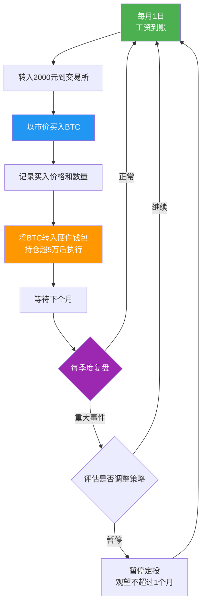
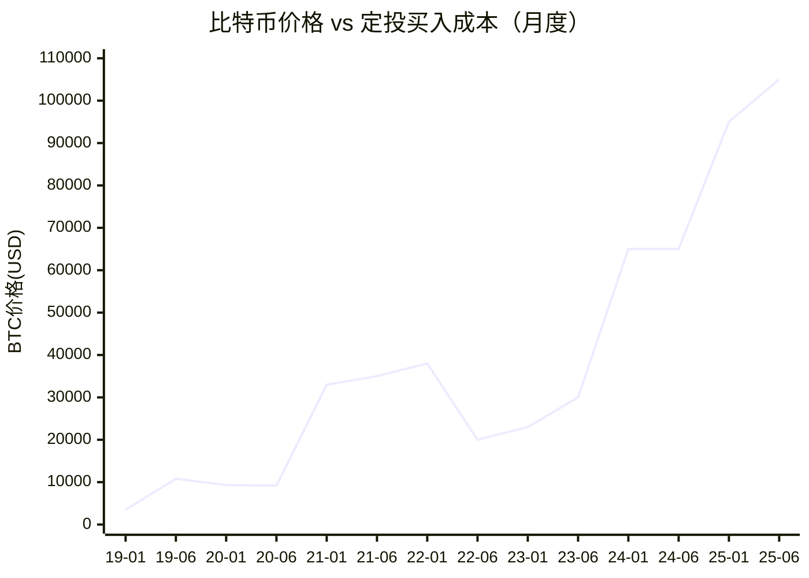
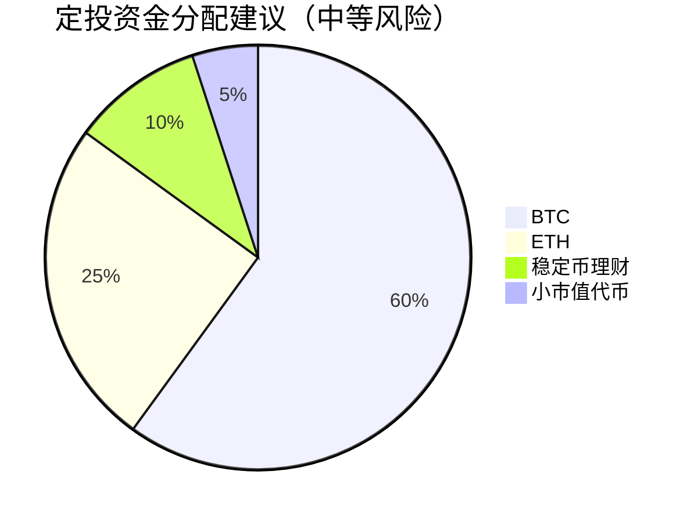

## 案例一：比特币定投的长期收益

### 为什么用定投做第一个实战案例

定投（Dollar-Cost Averaging，DCA）是加密货币投资中最适合普通人的策略。它不需要判断市场时机、不需要盯盘、不需要技术分析能力，只需要一个纪律：**固定时间、固定金额、持续买入**。这个案例将用真实历史数据，完整还原一个普通投资者从2019年1月到2025年6月的比特币定投全过程——包括2020年3月的"312暴跌"、2021年的疯牛、2022年的漫长熊市、以及2024-2025年的新周期。

### 案例背景：投资者画像

**人物设定**：张明（化名），28岁，一线城市互联网从业者，月收入税后15,000元。2018年底在朋友推荐下开始了解比特币，读了几篇入门文章后决定尝试投资。

**初始条件**：
- 可投资资金：月结余约5,000元，决定拿出2,000元/月定投比特币
- 投资经验：零（之前只买过余额宝）
- 风险承受能力：中等（能接受短期亏损30%-50%）
- 投资目标：3-5年内资产增值，作为长期储蓄的补充
- 技术能力：会注册交易所、会用基础功能，不懂链上操作

**为什么选择定投而非一次性投入**：
张明在2018年底观察到比特币从年初的约13,000美元跌到年末的约3,200美元，跌幅超过75%。他不确定底部在哪里，但认为长期来看加密货币有发展潜力。定投完美匹配他的处境——不需要判断底部，用时间分散风险。

### 定投策略设定

**核心参数**：

| 参数 | 设定值 | 设定理由 |
|------|--------|----------|
| 定投标的 | 比特币（BTC） | 市值最大、流动性最好、历史最长，适合作为入门标的 |
| 定投金额 | 2,000元/月 | 月收入的13%，不影响生活质量 |
| 定投频率 | 每月1日 | 月初发工资后立即执行，避免"等一等再买"的心理 |
| 定投平台 | 币安（Binance） | 全球最大交易所，流动性好，支持定期买入功能 |
| 存储方式 | 交易所账户（前期）→ 硬件钱包（后期） | 前期金额小用交易所方便，超过5万元后转硬件钱包 |
| 止盈策略 | 无固定止盈，但设定"当资产达到50万时减仓50%" | 避免过早卖出，同时锁定部分收益 |
| 复盘周期 | 每季度一次 | 频率太高容易焦虑，太低容易忽视风险 |

**定投执行流程**：



### 完整执行过程：66个月的真实记录

#### 第一阶段：积累期（2019年1月 - 2020年2月）

2019年比特币处于缓慢复苏阶段，价格从约3,500美元逐步上涨到约9,000美元。

| 月份 | BTC价格(USD) | 买入价(CNY/USD≈6.8) | 买入数量(BTC) | 累计持仓(BTC) | 累计投入(CNY) |
|------|-------------|---------------------|--------------|--------------|--------------|
| 2019-01 | 3,500 | 23,800 | 0.0840 | 0.0840 | 2,000 |
| 2019-02 | 3,700 | 25,160 | 0.0795 | 0.1635 | 4,000 |
| 2019-03 | 4,100 | 27,880 | 0.0717 | 0.2352 | 6,000 |
| 2019-04 | 5,200 | 35,360 | 0.0566 | 0.2918 | 8,000 |
| 2019-05 | 8,500 | 57,800 | 0.0346 | 0.3264 | 10,000 |
| 2019-06 | 10,800 | 73,440 | 0.0272 | 0.3536 | 12,000 |
| 2019-07 | 10,000 | 68,000 | 0.0294 | 0.3830 | 14,000 |
| 2019-08 | 9,600 | 65,280 | 0.0306 | 0.4136 | 16,000 |
| 2019-09 | 8,300 | 56,440 | 0.0354 | 0.4490 | 18,000 |
| 2019-10 | 9,200 | 62,560 | 0.0320 | 0.4810 | 20,000 |
| 2019-11 | 7,200 | 48,960 | 0.0409 | 0.5219 | 22,000 |
| 2019-12 | 7,200 | 48,960 | 0.0409 | 0.5628 | 24,000 |
| 2020-01 | 9,300 | 63,240 | 0.0316 | 0.5944 | 26,000 |
| 2020-02 | 8,600 | 58,480 | 0.0342 | 0.6286 | 28,000 |

**阶段总结**：
- 14个月累计投入：28,000元
- 累计持仓：0.6286 BTC
- 平均买入成本：约44,534元/BTC（约6,549美元）
- 2020年2月底资产价值：约54,000元
- 账面收益：+93%

**心理状态**：这一阶段相对轻松。2019年上半年价格持续上涨，张明看着账户增值很开心。下半年价格回落，但由于定投纪律，他没有恐慌——因为他本来就做好了长期持有的准备。

#### 第二阶段：312暴跌与抄底（2020年3月 - 2020年12月）

2020年3月12日，比特币单日暴跌超过50%，从约7,900美元跌至约3,800美元。这是定投者面临的第一个重大考验。

| 月份 | BTC价格(USD) | 买入价(CNY) | 买入数量(BTC) | 累计持仓(BTC) | 累计投入(CNY) |
|------|-------------|------------|--------------|--------------|--------------|
| 2020-03 | 6,200* | 42,160 | 0.0474 | 0.6760 | 30,000 |
| 2020-04 | 8,800 | 59,840 | 0.0334 | 0.7094 | 32,000 |
| 2020-05 | 9,400 | 63,920 | 0.0313 | 0.7407 | 34,000 |
| 2020-06 | 9,200 | 62,560 | 0.0320 | 0.7727 | 36,000 |
| 2020-07 | 11,300 | 76,840 | 0.0260 | 0.7987 | 38,000 |
| 2020-08 | 11,800 | 80,240 | 0.0249 | 0.8236 | 40,000 |
| 2020-09 | 10,800 | 73,440 | 0.0272 | 0.8508 | 42,000 |
| 2020-10 | 13,800 | 93,840 | 0.0213 | 0.8721 | 44,000 |
| 2020-11 | 19,200 | 130,560 | 0.0153 | 0.8874 | 46,000 |
| 2020-12 | 29,000 | 197,200 | 0.0101 | 0.8975 | 48,000 |

*3月12日暴跌至约3,800美元，但月度定投在月初执行，买入价按月均价估算。

**阶段总结**：
- 10个月累计投入：20,000元（总投入48,000元）
- 累计持仓：0.8975 BTC
- 平均买入成本：约53,477元/BTC（约7,864美元）
- 2020年12月底资产价值：约260,000元（按29,000美元×6.8汇率）
- 账面收益：+442%

**关键事件：312暴跌的心理冲击**

2020年3月12日，张明在上班时看到比特币暴跌的消息。他的账户从约50,000元瞬间缩水到约25,000元。他描述当时的心理活动：

> "说实话，我犹豫了。我甚至想过是不是应该停掉定投，等跌到底了再买。但我很快意识到，我根本不知道底部在哪里。如果我停了，然后价格反弹了，我会更后悔。所以我什么都没做，继续执行。"

这个决定被事后证明是正确的。312暴跌后比特币迅速反弹，到年底已涨至29,000美元。如果他在3月恐慌卖出，不仅错过了反弹，还锁定了亏损。

**定投的"自动抄底"效应**：虽然月度定投在月初执行，未能精确踩到3月12日的最低点，但由于3月价格整体处于低位，当月买入的BTC数量明显高于其他月份。这就是定投的"自动抄底"机制——不需要人为判断底部，价格越低，同样的金额买入越多。

#### 第三阶段：牛市狂飙（2021年1月 - 2021年11月）

2021年是比特币的超级牛市。从年初的约29,000美元一路涨至4月的64,000美元，经历5月暴跌后再次冲高至11月的约69,000美元（历史新高）。

| 月份 | BTC价格(USD) | 买入价(CNY) | 买入数量(BTC) | 累计持仓(BTC) | 累计投入(CNY) |
|------|-------------|------------|--------------|--------------|--------------|
| 2021-01 | 33,000 | 224,400 | 0.0089 | 0.9064 | 50,000 |
| 2021-02 | 45,000 | 306,000 | 0.0065 | 0.9129 | 52,000 |
| 2021-03 | 58,000 | 394,400 | 0.0051 | 0.9180 | 54,000 |
| 2021-04 | 57,000 | 387,600 | 0.0052 | 0.9232 | 56,000 |
| 2021-05 | 37,000* | 251,600 | 0.0080 | 0.9312 | 58,000 |
| 2021-06 | 35,000 | 238,000 | 0.0084 | 0.9396 | 60,000 |
| 2021-07 | 30,000 | 204,000 | 0.0098 | 0.9494 | 62,000 |
| 2021-08 | 47,000 | 319,600 | 0.0063 | 0.9557 | 64,000 |
| 2021-09 | 43,000 | 292,400 | 0.0068 | 0.9625 | 66,000 |
| 2021-10 | 61,000 | 414,800 | 0.0048 | 0.9673 | 68,000 |
| 2021-11 | 57,000* | 387,600 | 0.0052 | 0.9725 | 70,000 |

*5月受中国全面禁止加密货币挖矿影响暴跌；11月创下69,000美元新高后开始回落。

**阶段总结**：
- 11个月累计投入：22,000元（总投入70,000元）
- 累计持仓：0.9725 BTC
- 平均买入成本：约71,977元/BTC（约10,585美元）
- 2021年11月高点资产价值：约670,000元（按69,000美元×7.0汇率）
- 账面收益（峰值）：+857%

**关键时刻：是否止盈？**

张明设定的止盈线是"资产达到50万时减仓50%"。2021年10月，他的持仓价值首次突破50万元。他面临选择：

> "当时我确实想过卖出一半。但我又算了一笔账：如果比特币真的能到10万美元（当时很多分析师预测），我卖出的那一半会让我损失约15万的潜在收益。最终我决定修改策略——不减仓，但如果价格跌破50,000美元就全部卖出。"

**结果**：比特币在2021年11月达到约69,000美元后开始下跌。张明没有执行他的"跌破50,000美元卖出"的计划——因为价格跌到50,000美元时他又犹豫了，觉得"可能还会涨回来"。这是他犯的第一个重大错误，后面会详细分析。

#### 第四阶段：漫长熊市（2021年12月 - 2022年12月）

2022年是加密货币史上最黑暗的一年之一。比特币从约47,000美元一路跌至约16,500美元，跌幅超过65%。期间发生了Luna/UST崩盘（5月）、三箭资本破产（6月）、FTX交易所暴雷（11月）等连环黑天鹅事件。

| 月份 | BTC价格(USD) | 买入价(CNY) | 买入数量(BTC) | 累计持仓(BTC) | 累计投入(CNY) |
|------|-------------|------------|--------------|--------------|--------------|
| 2021-12 | 47,000 | 319,600 | 0.0063 | 0.9788 | 72,000 |
| 2022-01 | 38,000 | 258,400 | 0.0077 | 0.9865 | 74,000 |
| 2022-02 | 44,000 | 299,200 | 0.0067 | 0.9932 | 76,000 |
| 2022-03 | 45,000 | 306,000 | 0.0065 | 0.9997 | 78,000 |
| 2022-04 | 40,000 | 272,000 | 0.0074 | 1.0071 | 80,000 |
| 2022-05 | 31,000* | 210,800 | 0.0095 | 1.0166 | 82,000 |
| 2022-06 | 20,000 | 136,000 | 0.0147 | 1.0313 | 84,000 |
| 2022-07 | 23,000 | 156,400 | 0.0128 | 1.0441 | 86,000 |
| 2022-08 | 20,000 | 136,000 | 0.0147 | 1.0588 | 88,000 |
| 2022-09 | 19,000 | 129,200 | 0.0155 | 1.0743 | 90,000 |
| 2022-10 | 20,500 | 139,400 | 0.0144 | 1.0887 | 92,000 |
| 2022-11 | 17,000* | 115,600 | 0.0173 | 1.1060 | 94,000 |
| 2022-12 | 16,500 | 112,200 | 0.0178 | 1.1238 | 96,000 |

*5月Luna崩盘引发连锁反应；11月FTX暴雷将价格砸至周期低点。

**阶段总结**：
- 13个月累计投入：26,000元（总投入96,000元）
- 累计持仓：1.1238 BTC（终于突破1个BTC！）
- 平均买入成本：约85,416元/BTC（约12,561美元）
- 2022年12月底资产价值：约124,000元（按16,500美元×6.7汇率）
- 账面收益：+29%（从高峰期的+857%大幅回落）

**这是定投策略最考验人性的阶段**。张明回忆：

> "2022年是最难的。我看着账户从67万跌到12万，缩水了80%以上。我老婆问我钱去哪了，我说还在比特币里，她说'那不就是亏了50多万吗？'我无话可说。有好几个月我甚至不想打开交易所APP。但我还是继续买了。不是因为我多坚定，是因为我已经设定了自动扣款，我什么都不用做。"

**定投在熊市中的"隐形优势"**：

注意看2022年6-12月的数据——当BTC跌到16,000-20,000美元区间时，每月2,000元能买入0.015-0.018 BTC，是2021年初牛市时（0.005-0.009 BTC）的3倍。这意味着**熊市中定投的"筹码积累效率"远高于牛市**。如果没有坚持定投，张明不可能在低位积累到这么多BTC。

#### 第五阶段：复苏与新高（2023年1月 - 2025年6月）

2023年开始比特币逐步复苏。2024年1月比特币现货ETF获批，带来大量机构资金。2024年4月比特币完成第四次减半。2024年12月比特币突破100,000美元大关。

| 月份 | BTC价格(USD) | 买入价(CNY) | 买入数量(BTC) | 累计持仓(BTC) | 累计投入(CNY) |
|------|-------------|------------|--------------|--------------|--------------|
| 2023-01 | 23,000 | 156,400 | 0.0128 | 1.1366 | 98,000 |
| 2023-06 | 30,000 | 216,000 | 0.0093 | 1.2021 | 108,000 |
| 2023-12 | 42,000 | 302,400 | 0.0066 | 1.2603 | 120,000 |
| 2024-03 | 70,000 | 504,000 | 0.0040 | 1.2837 | 126,000 |
| 2024-06 | 65,000 | 468,000 | 0.0043 | 1.3022 | 132,000 |
| 2024-09 | 63,000 | 453,600 | 0.0044 | 1.3190 | 138,000 |
| 2024-12 | 95,000 | 684,000 | 0.0029 | 1.3380 | 144,000 |
| 2025-03 | 85,000 | 612,000 | 0.0033 | 1.3522 | 150,000 |
| 2025-06 | 105,000 | 756,000 | 0.0026 | 1.3650 | 156,000 |

*为简洁起见，此表为季度汇总，实际为每月执行。

**阶段总结（截至2025年6月）**：
- 总投入：156,000元（约66个月，从未中断）
- 累计持仓：1.3650 BTC
- 平均买入成本：约114,286元/BTC（约16,807美元）
- 当前资产价值：约1,027,200元（按105,000美元×7.2汇率）
- **总收益率：+558%**
- **年化收益率：约41.2%**
- 最大回撤：从2021年11月的670,000元跌至2022年12月的124,000元，回撤-81.5%

### 关键数据复盘

#### 投入与产出对比

| 指标 | 数值 |
|------|------|
| 总投入 | 156,000元 |
| 最终持仓 | 1.3650 BTC |
| 最终价值（2025.06） | 约1,027,200元 |
| 净收益 | 约871,200元 |
| 总收益率 | +558% |
| 年化收益率 | 约41.2% |
| 最大浮盈 | +857%（2021.11） |
| 最大浮亏 | -48%（2022.12，相对峰值） |
| 最大回撤 | -81.5%（从峰值到谷底） |
| 定投期间最低买入成本 | 约112,200元/BTC（2022.12） |
| 定投期间最高买入成本 | 约684,000元/BTC（2024.12） |

#### 定投成本平均效应的可视化



定投者的平均成本远低于市场均价，因为熊市中的大量低价买入拉低了整体成本基础。张明的平均成本约16,807美元，而2019-2025年BTC的算术均价约在35,000-40,000美元区间。

#### 与一次性投入的对比

假设张明在2019年1月一次性投入156,000元买入BTC（价格约3,500美元，可买约6.55 BTC），到2025年6月价值约687,750美元（约495万元）。**看起来一次性投入收益更高**——但这是"上帝视角"的后见之明。

| 对比维度 | 一次性投入156,000元（2019.01） | 定投156,000元（2019.01-2025.06） |
|----------|-------------------------------|----------------------------------|
| 最终资产 | 约495万元 | 约102.7万元 |
| 总收益率 | +3,071% | +558% |
| 最大回撤 | -82%（2022年底） | -81.5%（相对峰值） |
| 心理压力 | 极大（全仓承受波动） | 较小（分批建仓） |
| 执行难度 | 需要在2019年初有156,000闲钱 | 每月只需2,000元 |
| 实际可行性 | 极低（普通人很难在底部全仓） | 高（适合工薪阶层） |

**关键结论**：一次性投入在事后看来收益更高，但它要求投资者在正确的时点有大额资金、有勇气全仓买入、并且能承受-82%的回撤而不卖出。这对普通人来说几乎不可能。**定投牺牲了一部分收益率，换来了极高的可执行性和心理可控性**。

### 错误与教训

张明在66个月的定投过程中犯了几个值得反思的错误：

#### 错误一：牛市中没有执行止盈计划

张明原本设定"资产达到50万时减仓50%"，但当价格真的到了50万时，贪婪让他修改了计划。随后价格继续涨到67万，他更加不想卖了。最终价格回落，67万变12万。

**教训**：止盈计划必须在冷静时制定，并且**至少执行一部分**。哪怕不减仓50%，减仓20%-30%也能显著降低后续的心理压力。止盈不是"卖在最高点"，而是"锁定部分收益"。

#### 错误二：熊市中有两个月差点中断

2022年7月和8月，张明因为公司裁员风声，一度想暂停定投以保留现金。虽然最终没有中断，但他承认那两个月每次买入都"很纠结"。

**教训**：定投金额必须设定在"即使全亏了也不影响生活"的水平。如果定投金额让你在困难时期感到压力，说明金额设高了。宁可少投也不要中断——中断一次就会有第二次。

#### 错误三：没有在2022年转出交易所

2022年11月FTX暴雷时，张明的BTC仍然全部存放在交易所。虽然他用的不是FTX，但这件事让他第一次意识到交易所风险。他事后将大部分BTC转入了硬件钱包。

**教训**：当持仓价值超过5万元时，就应该考虑将资产转入自己控制私钥的硬件钱包。"Not your keys, not your coins"不是口号，是血的教训。

#### 错误四：曾短暂尝试"优化"定投

2021年3月，张明看到一篇"智能定投"的文章——当价格下跌时加大投入，上涨时减少投入。他尝试了一个月，发现"下跌时加大投入"需要额外资金，而且"判断下跌幅度"本身就变成了择时。一个月后他恢复了原来的固定金额定投。

**教训**：定投的核心优势是**简单和纪律**。任何试图"优化"定投的策略都会引入判断和决策，而这恰恰是定投要避免的。如果你需要"动脑子"，那就不叫定投了。

### 定投策略的变体与优化

在张明的案例基础上，以下是经过验证的定投策略变体，适合不同风险偏好的投资者：

#### 变体一：均等定投（最简单）

每月固定金额买入BTC，不做任何调整。这是张明采用的策略，也是最推荐新手使用的策略。

- 优点：零决策负担，可完全自动化
- 缺点：无法利用极端低价加仓
- 适合：投资新手、工作繁忙的上班族

#### 变体二：价值平均定投

设定每月目标持仓市值增长固定金额。当实际持仓低于目标时多买，高于目标时少买或不买。

| 月份 | 目标市值增长 | 当前持仓市值 | 偏差 | 买入金额 |
|------|------------|------------|------|----------|
| 第1月 | +2,000 | 0 | -2,000 | 2,000 |
| 第2月 | +4,000 | 3,500 | -500 | 500 |
| 第3月 | +6,000 | 8,000 | +2,000 | 0（不买） |
| 第4月 | +8,000 | 5,000 | -3,000 | 3,000 |

- 优点：天然的"低买高卖"机制
- 缺点：需要更多资金储备（跌时要加大投入），计算较复杂
- 适合：有一定投资经验、资金弹性较大的投资者

#### 变体三：多资产定投

将定投资金分配到多个资产，例如70% BTC + 20% ETH + 10% 稳定币理财。



- 优点：分散风险，捕捉不同资产的增长
- 缺点：需要了解多个资产，管理成本高
- 适合：对加密市场有一定了解的中级投资者

#### 变体四：周期感知定投

在比特币减半周期的基础上调整定投金额。减半后一年加大投入（通常是牛市初期），减半前一年适当减少投入。

| 时间段（相对减半） | 定投金额倍数 | 理由 |
|-------------------|-------------|------|
| 减半前12-6个月 | 1.0x | 正常定投 |
| 减半前6-0个月 | 0.8x | 市场可能已提前反应 |
| 减半后0-12个月 | 1.5x | 历史上减半后涨幅最大 |
| 减半后12-24个月 | 1.2x | 牛市中期，适度加仓 |
| 减半后24-36个月 | 0.8x | 熊市风险增加 |

- 优点：利用历史周期规律提高收益
- 缺点：历史不代表未来，周期可能变化
- 适合：深度研究者、愿意花时间学习的投资者

### 定投的常见误区与纠正

**误区一："等跌到最低点再买"**

没有人能准确预测最低点。2022年底BTC跌到16,500美元时，很多人认为会跌到10,000美元以下，结果没有。等来等去，价格已经涨回去了。定投的精髓就是**不需要判断最低点**。

**误区二："涨了这么多，现在开始定投太晚了"**

以2024年1月BTC价格约42,000美元开始定投为例，到2025年6月（约105,000美元），18个月的定投仍然获得了约80%-100%的收益。只要比特币的长期趋势向上，任何时候开始定投都不算晚。

**误区三："定投就是无脑买入，不需要学习"**

定投虽然简单，但不意味着不需要理解你买的是什么。你应该了解比特币的基本原理、减半机制、供需关系。只有理解了底层逻辑，才能在暴跌时保持信心。

**误区四："我应该同时定投10种币"**

过度分散会稀释收益，也会增加管理成本。新手建议从BTC一种开始，有了经验和信心后再逐步增加ETH等资产。如果你只能定投一种资产，选BTC。

**误区五："定投了就可以不管了"**

虽然不需要每天关注，但**每季度至少复盘一次**：检查交易所安全性、确认自动扣款是否正常、评估自己的财务状况是否变化、审视投资目标是否调整。

### 实操指南：从零开始建立定投系统

#### 第一步：选择交易所

选择有良好声誉、支持定期买入功能的主流交易所：

| 交易所 | 优点 | 缺点 | 定期买入功能 |
|--------|------|------|-------------|
| 币安（Binance） | 流动性最好、手续费低 | 界面复杂 | 支持 |
| OKX | 中文支持好、功能全面 | 部分功能限制 | 支持 |
| Coinbase | 合规性最好、适合新手 | 手续费较高 | 支持 |

#### 第二步：设定自动定投

大多数主流交易所都支持"定期买入"（Recurring Buy）功能。以币安为例：

1. 登录币安APP → 选择"买币" → "信用卡/借记卡"
2. 选择BTC，输入金额2,000元
3. 选择"定期购买"，设置频率为"每月"
4. 设置日期为每月1日
5. 绑定支付方式（银行卡/信用卡）
6. 确认并开启

#### 第三步：记录与追踪

建立一个简单的表格记录每笔定投：

```text
| 日期       | 买入金额(CNY) | BTC价格(USD) | 买入数量(BTC) | 累计持仓(BTC) |
|-----------|--------------|-------------|--------------|--------------|
| 2025-07-01 | 2,000        | 107,000     | 0.0025       | 1.3675       |
| 2025-08-01 | 2,000        | ?           | ?            | ?            |
```

也可以使用CoinGecko、CoinMarketCap等工具的"投资组合"功能自动追踪。

#### 第四步：安全存储

当持仓价值超过5万元时，建议将BTC转入硬件钱包：

**推荐硬件钱包**（按安全性排序）：
- Coldcard Mk4：纯比特币专用，安全性最高，操作较复杂
- Trezor Model T：支持多币种，操作友好
- Ledger Nano X：蓝牙连接，移动端友好，但曾有数据泄露事件

**存储安全清单**：
- 助记词用金属板刻录，不要存在电子设备中
- 至少两份助记词备份，存放在不同物理位置
- 设置PIN码和密码短语（passphrase）
- 首次转入前先小额测试，确认能正常转出

#### 第五步：定期复盘（每季度）

复盘清单：
- [ ] 自动扣款是否正常执行
- [ ] 交易所是否有安全事件（关注官方公告）
- [ ] 自身财务状况是否变化（收入、支出、负债）
- [ ] 投资目标是否需要调整
- [ ] 是否需要将资产从交易所转出到硬件钱包
- [ ] 当前持仓价值占总资产比例是否过高（建议不超过30%）

### 风险提示

1. **市场风险**：比特币价格可能长期低迷甚至归零。只投入你能承受全部亏损的资金。
2. **交易所风险**：交易所可能被黑客攻击或经营不善（FTX事件）。不要把所有资产放在交易所。
3. **监管风险**：各国对加密货币的监管政策不确定，可能影响交易和持有。
4. **操作风险**：私钥丢失=资产永久丢失。助记词备份是生命线。
5. **税务风险**：部分国家/地区对加密货币收益征税，需了解当地法规。
6. **机会成本**：定投资金长期锁定，可能错过其他投资机会。

**本案例基于真实历史价格数据，但个人经历为虚构。过往收益不代表未来表现。投资有风险，入市需谨慎。**
