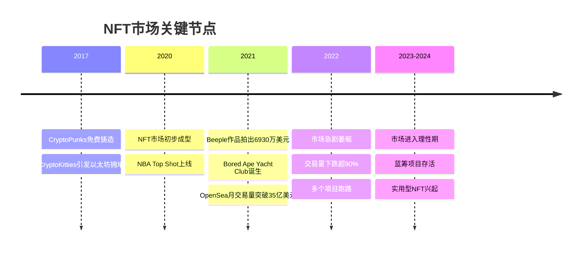
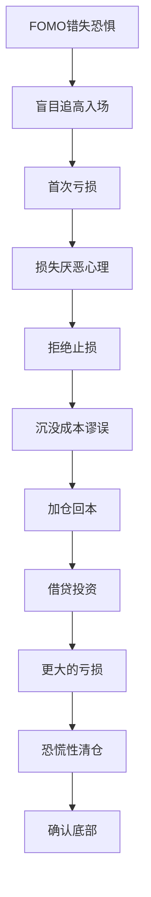
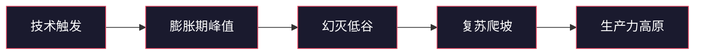

## 案例三：NFT投资的成功与失败

NFT（非同质化代币）是加密货币领域最具争议性的赛道之一。它曾在2021年创造单日交易量超过4亿美元的纪录，也曾在2022-2023年经历超过95%的交易量暴跌。本节通过两个真实案例——一个成功的蓝筹NFT早期投资者和一个在NFT泡沫中亏损惨重的投机者——完整呈现NFT投资的收益逻辑与风险陷阱。

### 一、NFT市场全景概览

#### 1.1 什么是NFT

NFT（Non-Fungible Token）是存储在区块链上的唯一数字资产凭证。与比特币、以太坊等同质化代币不同，每个NFT都是独一无二的，无法与另一个NFT进行等价交换。

NFT的核心技术特性：

| 特性 | 说明 | 实际意义 |
|------|------|----------|
| 唯一性 | 每个NFT拥有独特的tokenID和元数据 | 可验证数字资产的真实性和稀缺性 |
| 不可分割 | 通常不能像比特币那样拆分交易 | 适合代表完整的数字/实物资产 |
| 可编程性 | 通过智能合约实现版税、解锁等功能 | 创作者可持续获得二级市场收益 |
| 可验证性 | 所有交易记录公开透明 | 任何人都可以查验所有权历史 |
| 可互操作性 | 遵循统一标准（ERC-721/1155） | 可在不同平台间转移和交易 |

#### 1.2 NFT市场发展历程



#### 1.3 NFT的主要类型

| 类型 | 代表项目 | 特点 | 投资逻辑 |
|------|----------|------|----------|
| PFP（头像类） | BAYC、CryptoPunks、Azuki | 社区驱动，身份象征 | 社区价值+品牌效应 |
| 艺术类 | Art Blocks、生成艺术 | 创作者声誉驱动 | 艺术价值+稀缺性 |
| 游戏类 | Axie Infinity、Illuvium | 游戏内资产+Play-to-Earn | 游戏生态增长 |
| 土地/元宇宙 | Decentraland、The Sandbox | 虚拟空间所有权 | 元宇宙概念炒作 |
| 实用型 | ENS域名、会员通行证 | 功能性价值 | 实际使用需求 |
| 音乐类 | Royal、Sound.xyz | 版权收益分享 | 版税现金流 |

### 二、成功案例：蓝筹NFT的早期布局

#### 2.1 案例背景

**投资者画像**：化名"链上老陈"，28岁，计算机专业背景，2019年接触加密货币。月可支配投资资金约5万元人民币，风险承受能力较强。

**投资时间线**：2021年1月至2022年6月，总投入约35万元人民币。

**投资策略核心**：聚焦蓝筹项目，控制仓位，利用信息差在早期发现价值。

#### 2.2 详细操作过程

##### 第一阶段：研究与试水（2021年1月-3月）

链上老陈并没有一开始就大举投入。他花了两个月时间做基础研究：

**研究内容清单**：

1. **技术层面**：深入理解ERC-721和ERC-1155标准，学习如何在Etherscan上验证合约
2. **市场层面**：追踪OpenSea的交易数据，分析哪些项目在持续成交而非短期炒作
3. **社区层面**：加入多个NFT项目的Discord和Twitter社区，观察社区活跃度和质量
4. **工具层面**：掌握Dune Analytics、Nansen、NFTGo等数据分析工具

**试水操作**：

- 以0.08 ETH（约1000元）铸造了一个冷门艺术项目
- 在OpenSea上挂单、竞价、取消，熟悉整个交易流程
- 体验了从MetaMask签名到Gas费设置的全部环节
- 第一笔投资最终以0.05 ETH卖出，亏损约400元

> 链上老陈的反思："第一笔交易的亏损非常有价值。它让我理解了NFT的流动性陷阱——你以为随时能卖，但实际上买家出价可能远低于地板价。"

##### 第二阶段：核心布局（2021年4月-9月）

在完成研究和试水后，链上老陈开始系统性布局：

**操作记录**：

| 时间 | 项目 | 买入价 | 数量 | 总成本 | 操作逻辑 |
|------|------|--------|------|--------|----------|
| 2021.04 | Bored Ape Yacht Club | 0.08 ETH | 3个 | 约5000元 | 新项目铸造，团队背景（Yuga Labs）+ 独特艺术风格 |
| 2021.06 | Art Blocks Curated | 2-5 ETH | 2个 | 约6万元 | 生成艺术赛道头部，创作者声誉+技术稀缺性 |
| 2021.07 | CryptoPunks | 25 ETH | 1个 | 约5万元 | NFT鼻祖项目，历史地位+收藏价值 |
| 2021.08 | Azuki | 1.5 ETH | 2个 | 约7万元 | 日系动漫风格差异化+高质量团队 |
| 2021.09 | ENS 3位数域名 | 2-8 ETH | 5个 | 约12万元 | 实用型NFT，域名具有长期使用价值 |

**决策框架**——链上老陈评估NFT项目的五维模型：

```text
项目评分 = 团队权重(25%) + 社区权重(25%) + 稀缺性权重(20%) 
         + 实用性权重(15%) + 市场时机权重(15%)
```

每个维度的评估标准：

| 维度 | 高分标准 | 低分标准 |
|------|----------|----------|
| 团队(25%) | 公开身份、有成功经历、持续交付 | 匿名、无过往记录、承诺过多 |
| 社区(25%) | Discord日活高、讨论质量好、持有者互动频繁 | 机器人刷量、纯投机讨论、大量抛售信号 |
| 稀缺性(20%) | 总量有限、稀有特征明确、有燃烧机制 | 总量过大、稀有度无意义、可无限增发 |
| 实用性(15%) | 持有者有实际权益（空投、游戏、通行证） | 纯粹图片、无后续路线图 |
| 市场时机(15%) | 新兴赛道、情绪低点、链上数据健康 | 过热赛道、恐慌抛售、大户集中出货 |

##### 第三阶段：动态管理（2021年10月-2022年6月）

**盈利了结策略**：

链上老陈采用"阶梯式止盈"策略：

- 当单个NFT涨幅超过200%时，卖出1个（收回本金）
- 当单个NFT涨幅超过500%时，再卖出1个（锁定利润）
- 保留最后1个作为"免费筹码"，长期持有

**实际卖出记录**：

| 项目 | 卖出时间 | 卖出价 | 持有收益 | 备注 |
|------|----------|--------|----------|------|
| BAYC ×1 | 2021.10 | 30 ETH | 约25万元 | 涨幅375倍，用于回收初始成本 |
| BAYC ×1 | 2021.12 | 80 ETH | 约130万元 | 高点套现，锁定利润 |
| CryptoPunks | 2022.01 | 65 ETH | 约40万元 | 市场见顶信号出现 |
| Azuki ×1 | 2022.03 | 25 ETH | 约20万元 | NFT市场整体走弱 |
| ENS域名 ×3 | 2022.04 | 5-15 ETH | 约15万元 | 变现以降低风险敞口 |

#### 2.3 成果数据

| 指标 | 数据 |
|------|------|
| 总投入 | 约35万元人民币 |
| 累计卖出回收 | 约280万元人民币 |
| 剩余持仓价值（2024年估算） | 约30万元（BAYC、Art Blocks、ENS域名各1个） |
| 净利润 | 约275万元人民币 |
| 投资回报率 | 约786% |
| 持有时间 | 约18个月 |
| 最大单笔盈利 | BAYC卖出，约130万元 |

#### 2.4 成功因素复盘

**1. 信息优势构建**

链上老陈并不是"运气好"。他在投资前投入了大量时间建立信息优势：

- 每天花2-3小时在Discord和Twitter上跟踪项目动态
- 使用Nansen追踪"Smart Money"（聪明钱）的钱包动向
- 通过Dune Analytics自建Dashboard监测链上数据
- 与社区中的其他深度玩家建立私交，形成信息交流网络

**2. 严格的仓位管理**

| 仓位层级 | 占比 | 用途 |
|----------|------|------|
| 蓝筹核心仓 | 60% | BAYC、CryptoPunks等头部项目 |
| 中等风险仓 | 25% | Art Blocks、Azuki等潜力项目 |
| 投机实验仓 | 15% | 新项目铸造、小众艺术 |

总NFT投资占其总投资资产的比例不超过30%，保证即使NFT市场归零，也不会影响生活。

**3. 逆向思维**

在2021年初市场尚未全面爆发时入场，在2021年底至2022年初市场极度狂热时逐步离场。这与大多数散户"追涨杀跌"的行为模式完全相反。

### 三、失败案例：NFT投机的代价

#### 3.1 案例背景

**投资者画像**：化名"小王"，25岁，互联网运营从业者，2021年8月通过社交媒体接触到NFT。月收入约8000元，储蓄约15万元。

**投资时间线**：2021年8月至2022年5月，总投入约12万元人民币（其中8万元为借款）。

**投资心态**：FOMO（错失恐惧）驱动，看到别人在NFT上赚了几十倍，想快速实现财富自由。

#### 3.2 详细操作过程

##### 第一阶段：盲目入场（2021年8月-10月）

小王在Twitter上看到大量NFT暴富故事后，匆忙开始投资：

**错误操作记录**：

| 时间 | 项目 | 买入价 | 买入原因 | 结局 |
|------|------|--------|----------|------|
| 2021.08 | 某PFP项目 | 0.5 ETH | KOL推荐，"百倍潜力" | 项目方跑路，归零 |
| 2021.09 | 某元宇宙土地 | 2 ETH | "元宇宙是未来" | 项目无人开发，无法出售 |
| 2021.09 | 某动物主题NFT | 1 ETH | 社区"喊单"氛围 | 地板价跌至0.01 ETH |
| 2021.10 | 某"实用型"NFT | 3 ETH | 承诺空投代币 | 代币上线即暴跌98% |

##### 第二阶段：加仓回本（2021年11月-2022年2月）

亏损后，小王没有冷静反思，而是产生了"回本心态"——这是投机者最常见的致命心理陷阱。

**加仓操作**：

- 从银行贷款5万元，从朋友处借款3万元
- 全部投入新一批NFT项目，期望"翻本"
- 追涨了多个已经暴涨的项目
- 在社区中频繁看到"钻石手（Diamond Hands）"的口号，拒绝止损

**具体追涨记录**：

| 项目 | 买入价 | 最高价（买入时） | 最终价值 |
|------|--------|------------------|----------|
| 某热门PFP | 5 ETH | 8 ETH | 0.3 ETH |
| 某游戏NFT | 3 ETH | 6 ETH | 项目停运 |
| 某联名NFT | 4 ETH | 7 ETH | 0.1 ETH |

##### 第三阶段：被迫清仓（2022年3月-5月）

2022年NFT市场全面崩盘，小王面临贷款还款压力，被迫在底部清仓：

- 持有的NFT平均下跌90%以上
- 总亏损约10.5万元
- 剩余1.5万元的NFT无法出售（流动性枯竭）
- 背负3万元债务需在12个月内还清

#### 3.3 失败数据

| 指标 | 数据 |
|------|------|
| 总投入 | 约12万元（含借款8万元） |
| 最终回收 | 约1.5万元 |
| 净亏损 | 约10.5万元 |
| 亏损比例 | 约87.5% |
| 债务总额 | 约8万元（需连本带息偿还） |
| 影响时间 | 用约18个月还清贷款 |
| 心理影响 | 严重焦虑，影响工作和人际关系 |

#### 3.4 失败原因深度分析

**1. 认知缺陷：不理解NFT的定价逻辑**

小王把NFT当成了股票来炒，但NFT的定价机制与股票完全不同：

| 对比维度 | 股票 | NFT |
|----------|------|-----|
| 基本面 | 公司营收、利润、资产 | 社区活跃度、团队交付、品牌价值 |
| 估值方法 | P/E、DCF等成熟模型 | 几乎没有公认估值模型 |
| 流动性 | 连续竞价交易，随时可卖 | 需要找到愿意出价的买家 |
| 监管保护 | 证券法保护、信息披露要求 | 几乎无监管保护 |
| 价格发现 | 机构+散户博弈 | 庄家操控+社区情绪 |

**2. 心理陷阱：行为金融学视角**

小王踩中了几乎所有典型的投资心理陷阱：



每个心理陷阱的具体表现：

| 心理陷阱 | 表现 | 正确应对 |
|----------|------|----------|
| FOMO | "别人赚了几十倍，我也要" | 设定冷静期，至少研究48小时再决定 |
| 损失厌恶 | "亏了不甘心卖，等回本" | 设定止损线，亏损超过30%强制卖出 |
| 沉没成本 | "已经亏了这么多，不能白亏" | 每笔交易独立决策，不考虑已亏损金额 |
| 从众效应 | "社区都说要钻石手" | 独立分析，社区共识≠正确决策 |
| 过度自信 | "这次我研究过了，不会错" | 单笔投资不超过总资产10% |
| 禀赋效应 | "我持有的就是好项目" | 定期重新评估，用卖出标准审视持仓 |

**3. 仓位管理完全缺失**

| 对比项 | 链上老陈（成功者） | 小王（失败者） |
|--------|-------------------|---------------|
| NFT占总资产比例 | <30% | 80%（含借款） |
| 是否使用杠杆 | 否 | 是（8万借款） |
| 单项目最大投入 | 总资金15% | 总资金40% |
| 止损机制 | 有，亏损30%触发 | 无，"钻石手" |
| 止盈机制 | 阶梯式止盈 | 无，期望无限上涨 |

**4. 信息劣势**

- 没有使用链上分析工具，完全依赖Twitter和Discord中的情绪信号
- 无法区分真正的"Smart Money"动向和庄家操纵
- 缺乏判断项目方是否在"软跑路"的能力
- 不了解NFT市场的周期性规律

### 四、成功与失败的对比分析

#### 4.1 关键差异总结

| 对比维度 | 成功案例（链上老陈） | 失败案例（小王） |
|----------|---------------------|-----------------|
| 入场时机 | 早期（2021年初），市场尚冷 | 中后期（2021年8月），市场已热 |
| 投入资金 | 闲钱，不影响生活 | 借款，有还款压力 |
| 研究深度 | 2个月基础研究+持续跟踪 | 看到暴富故事直接入场 |
| 项目选择 | 蓝筹为主，有明确评估框架 | KOL推荐为主，无筛选标准 |
| 持有策略 | 阶梯止盈+长期持有底仓 | 不卖，等回本 |
| 信息来源 | 链上数据+Smart Money追踪 | 社交媒体情绪+社区喊单 |
| 风险意识 | 做好归零准备 | 认为"不可能跌太多" |
| 情绪管理 | 理性决策，不被FOMO驱动 | 贪婪和恐惧交替支配 |

#### 4.2 NFT投资的核心公式

成功的NFT投资可以用以下框架概括：

```text
NFT投资收益 = 信息优势 × 仓位管理 × 情绪控制 × 市场周期位置
```

四个因子缺一不可：
- **信息优势**决定你能否在早期发现好项目
- **仓位管理**决定你能否在市场波动中存活
- **情绪控制**决定你能否执行既定策略
- **市场周期位置**决定你的策略是否适配大环境

### 五、NFT投资实战方法论

#### 5.1 项目评估清单

在投资任何NFT项目前，逐项检查以下内容：

**团队评估（权重25%）**：

- [ ] 创始人是否公开身份（Doxxed）
- [ ] 团队是否有过往成功项目经历
- [ ] 技术团队是否有区块链开发经验
- [ ] 路线图是否具体且可执行（避免"即将"、"未来"等模糊表述）
- [ ] 团队钱包是否有异常转账记录

**社区评估（权重25%）**：

- [ ] Discord日活跃用户数（非总人数）
- [ ] 社区讨论质量（技术讨论 vs 纯喊单）
- [ ] Twitter互动率（真实互动 vs 机器人刷量）
- [ ] 持有者地址分布（集中度越低越健康）
- [ ] 二次创作和社区自发活动数量

**技术评估（权重20%）**：

- [ ] 合约是否开源且经过审计
- [ ] 是否采用延迟揭示（Lazy Reveal）防止RNG操纵
- [ ] 元数据是否存储在IPFS/Arweave（而非中心化服务器）
- [ ] 是否存在铸币上限操控的可能
- [ ] 版税机制是否合理（通常2.5%-10%）

**经济模型评估（权重15%）**：

- [ ] 总供应量是否合理（1000-10000较为常见）
- [ ] 是否有销毁/通缩机制
- [ ] 持有者权益是否明确（空投、通行证、游戏功能等）
- [ ] 团队持仓比例（超过20%需警惕）
- [ ] 是否有可持续的收入来源（而非仅靠新买家）

**市场评估（权重15%）**：

- [ ] 当前NFT市场整体情绪（牛市/熊市/震荡）
- [ ] 同类项目的地板价走势
- [ ] OpenBlur等聚合平台的挂单/成交比例
- [ ] Smart Money是否在布局

#### 5.2 交易流程与工具

**铸造（Mint）阶段**：

1. 通过项目官方Twitter获取铸造链接（注意验证是否为官方账号）
2. 连接专用钱包（不要用存放主要资产的钱包）
3. 检查合约地址与官方公布是否一致
4. 设置合理的Gas费上限，防止Gas战争
5. 铸造后立即在OpenSea/Rarible验证是否显示

**二级市场交易阶段**：

推荐工具清单：

| 工具 | 用途 | 免费/付费 |
|------|------|----------|
| OpenSea | 最大的NFT交易市场 | 免费 |
| Blur | 专业交易者聚合器，零手续费 | 免费 |
| NFTGo | NFT数据分析、稀有度查询 | 基础免费 |
| Nansen | Smart Money追踪 | 付费 |
| Dune Analytics | 自定义链上数据仪表盘 | 免费 |
| Rarity Sniper | NFT稀有度排名 | 免费 |
| Etherscan | 合约验证和交易追踪 | 免费 |
| DeBank | 多链钱包资产追踪 | 免费 |

#### 5.3 风险控制框架

**硬性规则（不可违反）**：

| 规则 | 具体标准 | 理由 |
|------|----------|------|
| 总仓位限制 | NFT投资≤可投资资产的20% | NFT流动性差，需控制整体风险 |
| 单项目限制 | 单项目≤NFT仓位的30% | 防止单一项目归零造成毁灭性损失 |
| 杠杆禁令 | 绝不借钱买NFT | NFT流动性极差，借贷=定时炸弹 |
| 止损线 | 单项目亏损50%强制卖出 | 沉没成本不是继续持有的理由 |
| 止盈线 | 单项目涨幅300%卖出50% | 落袋为安，用利润继续博弈 |

**软性规则（根据情况调整）**：

- 优先投资有实际使用价值的NFT（域名、通行证、游戏资产），而非纯图片
- 铸造优于二级市场买入（成本更低，但需更严格筛选）
- 牛市中后期减少投入，熊市中后期增加投入
- 每周花固定时间研究（如5小时），不被市场情绪影响投入时间

#### 5.4 常见NFT骗局识别

| 骗局类型 | 具体手法 | 识别方法 |
|----------|----------|----------|
| Rug Pull（跑路） | 项目方铸造后消失，不再更新 | 检查团队身份、合约是否有Owner特权 |
| 洗盘交易（Wash Trading） | 项目方自己买卖制造虚假成交量 | 使用NFTGo查看买家地址关联性 |
| 钓鱼攻击 | 假网站/假空投诱导签名 | 永远从官方渠道获取链接，检查URL |
| 冒充项目 | 仿冒蓝筹项目的名称和图片 | 检查合约地址是否为官方合约 |
| FOMO制造 | KOL付费喊单后项目方出货 | 追踪KOL钱包，看是否在喊单前已建仓 |
| 虚假稀有度 | 宣传"超稀有"特征但实际很常见 | 使用Rarity Sniper等工具独立验证 |

### 六、NFT市场的周期性规律

#### 6.1 市场周期模型

NFT市场遵循"炒作周期"（Gartner Hype Cycle）的变体：



| 阶段 | 特征 | 投资策略 |
|------|------|----------|
| 技术触发 | 新概念出现，少数早期玩家 | 小额试水，建立认知 |
| 膨胀期 | 交易量暴涨，媒体大量报道，FOMO蔓延 | 谨慎参与，分批止盈 |
| 幻灭低谷 | 交易量暴跌90%+，项目大量死亡 | 精选优质项目，逢低布局 |
| 复苏爬坡 | 实用型项目存活，市场结构优化 | 加大仓位，长期持有 |
| 生产力高原 | NFT融入日常（游戏、身份、票务） | 享受生态增长红利 |

#### 6.2 周期中的关键指标

| 指标 | 数据来源 | 健康范围 | 危险信号 |
|------|----------|----------|----------|
| 日交易量 | OpenSea/Dune | 稳定增长 | 单日暴涨500%+ |
| 独立买家数 | NFTGo | 与交易量同步增长 | 交易量增但买家数不增（洗盘） |
| 地板价趋势 | 各项目OpenSea页面 | 缓慢上升 | 地板价快速拉升后暴跌 |
| 持有者分布 | Nansen | 高度分散 | 前10地址持有超过30% |
| 新项目铸造数 | Dune | 温和增长 | 每日新项目数暴增（供给过剩） |
| Gas费 | Etherscan | 正常范围 | Gas费暴涨（网络拥堵，成本过高） |

### 七、NFT投资的进阶思考

#### 7.1 NFT的真正价值来源

很多人把NFT等同于"图片"，这是一个根本性的认知错误。NFT的价值来源于三个层面：

**第一层：数字所有权证明**

NFT本质上是一种技术标准，用于证明数字资产的所有权。这可以应用于：
- 数字艺术品的所有权
- 游戏内资产的所有权
- 虚拟土地的所有权
- 音乐版权的份额证明
- 身份凭证和学历证明

**第二层：社区成员资格**

蓝筹NFT项目（如BAYC）的核心价值不在图片本身，而在于它代表的社区成员资格。持有BAYC意味着：
- 进入一个高净值人群的社交网络
- 获得后续空投和权益（如Otherside元宇宙土地）
- 参与社区决策的投票权
- 一种身份标识和社会信号

**第三层：可编程权益**

通过智能合约，NFT可以携带复杂的权益逻辑：
- 创作者在每次二级市场交易中获得版税（通常5-10%）
- 持有者自动获得新代币空投
- 解锁特定内容或功能的钥匙
- 作为DeFi协议中的抵押品

#### 7.2 NFT与传统投资的比较

| 对比维度 | 股票 | 房地产 | 艺术品 | NFT |
|----------|------|--------|--------|-----|
| 流动性 | 高 | 低 | 低 | 低到极低 |
| 估值基础 | 公司盈利 | 地段+租金 | 艺术家声誉 | 社区+实用性 |
| 监管程度 | 高 | 高 | 中 | 极低 |
| 入场门槛 | 低 | 高 | 高 | 低到中 |
| 波动性 | 中 | 低 | 中 | 极高 |
| 长期收益来源 | 企业增长 | 租金+增值 | 艺术家成名 | 生态增长 |
| 适合人群 | 广泛 | 稳健型 | 专业收藏家 | 高风险偏好者 |

#### 7.3 未来展望

NFT赛道正在经历从"投机驱动"到"实用驱动"的转型。以下方向值得关注：

1. **游戏资产（Gaming NFT）**：当大型游戏真正集成区块链时，游戏内资产NFT将有巨大需求
2. **身份与凭证**：学历、证书、执照的链上验证
3. **现实世界资产代币化（RWA）**：房产、债券、大宗商品的NFT化
4. **社交NFT**：社交图谱、声誉系统、创作者经济
5. **AI生成NFT**：AI创作+区块链确权的新范式

### 八、实战检查清单

在进行任何NFT投资前，请逐项确认：

**投资前**：
- [ ] 已完成至少20小时的基础知识学习
- [ ] 已在测试网或小额交易中熟悉完整操作流程
- [ ] 已设定明确的投资预算（闲钱，不借款）
- [ ] 已设定止损和止盈的量化标准
- [ ] 已准备好专用投资钱包（与主要资产隔离）
- [ ] 已了解当地关于数字资产的税务规定

**选择项目时**：
- [ ] 已完成五维评估框架的逐项检查
- [ ] 已在Etherscan验证合约地址
- [ ] 已查看Nansen/NFTGo的Smart Money动向
- [ ] 已评估当前市场周期位置
- [ ] 已计算该笔投资占总投资资产的比例

**持有期间**：
- [ ] 每周至少检查一次项目动态（团队更新、社区变化）
- [ ] 设置价格提醒，接近止损/止盈线时自动通知
- [ ] 定期重新评估项目基本面是否发生变化
- [ ] 不因社区情绪改变既定策略

**卖出时**：
- [ ] 有明确的卖出理由（非情绪驱动）
- [ ] 分批卖出，不一次性全部清仓
- [ ] 卖出后及时将利润转回法币或稳定币（锁定收益）
- [ ] 记录每笔交易，为税务申报做准备

### 九、经验总结

从这两个案例中，我们可以提炼出NFT投资的核心经验：

**成功者的特质**：
1. 把NFT投资当作一项严肃的金融活动，而非赌博
2. 在投资前投入大量时间建立信息优势和分析能力
3. 严格执行仓位管理和风控纪律
4. 在市场狂热时保持冷静，在市场恐慌时保持理性
5. 理解NFT的真正价值来源，而非仅追逐价格

**失败者的共同模式**：
1. FOMO驱动入场，缺乏基础研究
2. 用借来的钱投资，放大了风险
3. 没有止损机制，"钻石手"变成了"石头手"
4. 依赖社交媒体信号，而非独立分析
5. 亏损后加仓回本，陷入恶性循环

**最终忠告**：

> NFT市场是一个零和博弈场。每一个暴富故事的背后，都有无数个亏损的故事。在投入真金白银之前，请确保你已经建立了足够的认知基础、风控框架和心理准备。如果你无法承受全部亏损，请不要投资NFT。
