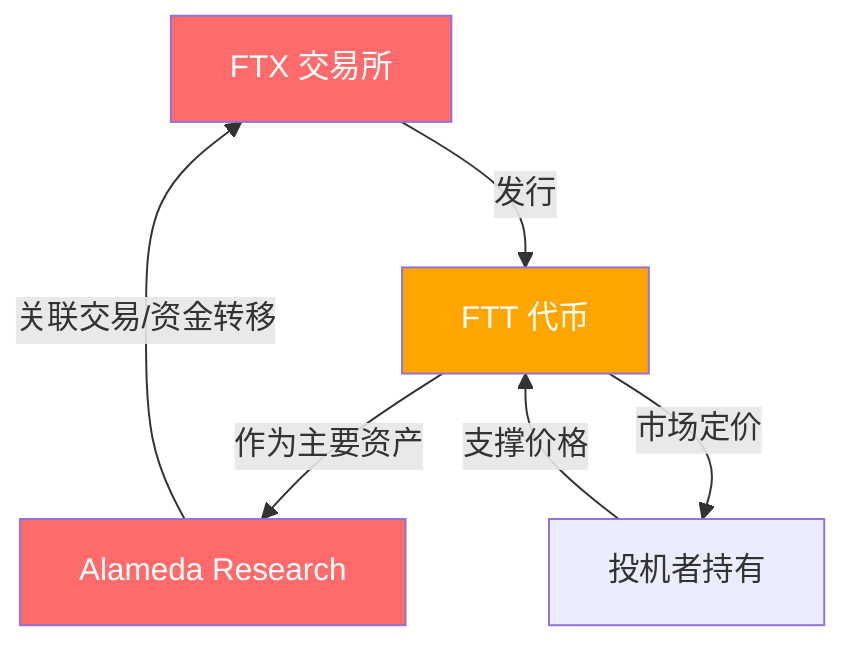
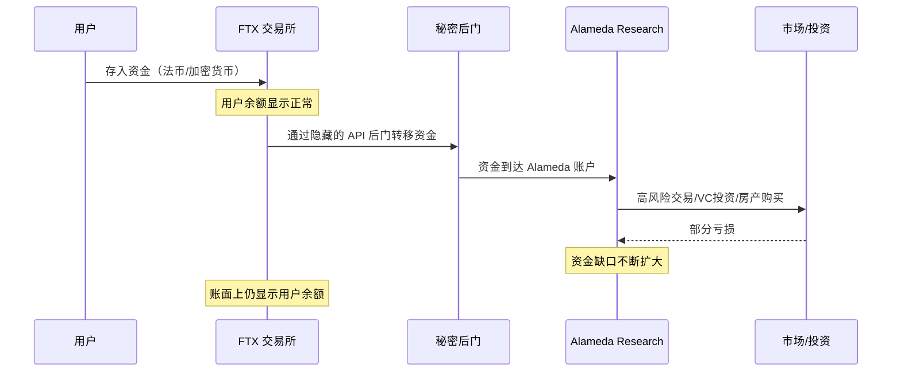
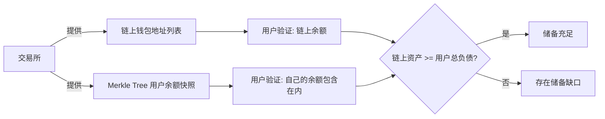

## 案例四：交易所安全事件——FTX崩盘

FTX 的崩盘是加密货币历史上最具破坏性的中心化交易所（CEX）倒闭事件，没有之一。它不是黑客攻击导致的技术安全事故，而是一场由内部挪用、关联交易和财务欺诈引发的人祸。2022年11月，全球第二大加密货币交易所在短短72小时内从行业巨头沦为破产废墟，约80亿美元用户资产不翼而飞。理解 FTX 崩盘，是每一个加密货币参与者的必修课——它揭示的不是技术漏洞，而是人性弱点、监管缺失和中心化信任的根本性缺陷。

### 一、FTX 的崛起：从零到全球第二的神话

#### 1.1 创始人与团队背景

FTX 由 Sam Bankman-Fried（SBF）于 2019 年 5 月在安提瓜和巴布达注册成立，总部设在香港，后迁至巴哈马。SBF 毕业于麻省理工学院（MIT）物理学系，曾在 Jane Street Capital 担任国际 ETF 交易员。2017 年，他创立了量化交易公司 Alameda Research，利用日本与美国比特币市场的价差进行套利，日交易量一度达到 2.5 亿美元。

FTX 的核心团队大多来自 Alameda Research 和华尔街量化基金，这种"交易员建交易所"的基因，让 FTX 在产品设计上极度贴合专业交易者需求：

| 特色功能 | 说明 | 对行业的意义 |
|----------|------|-------------|
| 永续合约（Perpetual Futures） | 无到期日的期货合约，支持高达 20 倍杠杆 | 推动了衍生品交易的爆发式增长 |
| MOVE 合约 | 基于比特币价格波动幅度的合约产品 | 创新性地将波动率本身作为交易标的 |
| 现货杠杆代币（Tokenized Leverage） | 自动管理杠杆的 ERC-20 代币 | 降低了杠杆交易的操作门槛 |
| 竞争对手清算机制优化 | 减少自动减仓（ADL）对盈利用户的冲击 | 提升了大户交易体验 |
| 子账户体系 | 单一账户下管理多个独立子账户 | 满足了机构客户的风控需求 |

#### 1.2 融资与估值飙升

FTX 的融资速度在加密行业史无前例：

| 时间 | 轮次 | 金额 | 估值 | 主要投资方 |
|------|------|------|------|-----------|
| 2019年8月 | 种子轮 | 800万美元 | 未披露 | Proof of Capital, Consensus Lab |
| 2020年3月 | A轮 | 1,600万美元 | 未披露 | Galois Capital, One Block |
| 2020年12月 | B轮 | 9,000万美元 | 18亿美元 | Temasek（淡马锡）, Paradigm |
| 2021年7月 | B+轮 | 9亿美元 | 180亿美元 | SoftBank（软银）, Sequoia Capital |
| 2021年10月 | B++轮 | 4.2亿美元 | 250亿美元 | Tiger Global, BlackRock |
| 2022年1月 | C轮 | 4亿美元 | 320亿美元 | SoftBank, Temasek |

在巅峰时期，FTX 拥有超过 100 万注册用户，日交易量超过 100 亿美元，按估值计算是全球第二大加密交易所（仅次于 Binance）。SBF 个人身家一度达到 260 亿美元，被《福布斯》列为"加密行业首富"。

#### 1.3 营销攻势与品牌塑造

FTX 在品牌建设上的投入堪称疯狂：

- **体育赞助**：以 1.35 亿美元买下迈阿密热火队主场冠名权（FTX Arena），签约汤姆·布雷迪、斯蒂芬·库里等体育明星作为品牌大使
- **政治捐款**：SBF 向美国民主党候选人的捐款超过 4,000 万美元，成为 2022 年美国中期选举的第二大个人捐款人
- **行业救援**：在 2022 年加密寒冬中，FTX 先后收购了 BlockFi、Liquid Global 等陷入困境的公司，塑造了"行业救世主"形象
- **媒体曝光**：SBF 频繁出现在国会听证会、达沃斯论坛和主流财经媒体上，成为加密行业的"门面人物"

这种全方位的品牌包装，让 FTX 获得了远超其实际安全水平和财务透明度的信任——而这正是整个骗局得以维持的关键。

### 二、崩盘始末：72小时的连锁反应

#### 2.1 第一阶段：导火索——CoinDesk 报道（2022年11月2日）

2022 年 11 月 2 日，CoinDesk 记者 Ian Allison 发表了一篇改变加密行业格局的报道。该报道获得了 Alameda Research 的资产负债表内部文件，揭露了一个惊人的事实：

Alameda Research 的 146 亿美元资产中，有 58.2 亿美元（约 40%）是 FTT 代币——即 FTX 交易所自己发行的平台代币。更关键的是，Alameda 的负债为 80 亿美元，而其最大资产就是这些流动性极差的 FTT 代币。

这意味着：FTX 和 Alameda 之间存在深度的资金关联。FTX 发行的代币成为了自家关联公司的主要资产，形成了一个自我循环的"价值幻觉"。



#### 2.2 第二阶段：Binance 的致命一击（2022年11月6日）

CoinDesk 报道发布后的四天内，市场虽然震动但尚未崩溃。真正的"死亡螺旋"始于 2022 年 11 月 6 日——Binance CEO 赵长鹏（CZ）在推特上宣布：

> "作为 Binance 退出 FTX 股权的一部分，Binance 收到了大约 21 亿美元等值的 BUSD 和 FTT。由于最近的曝光，我们决定清算账面上剩余的 FTT。"

CZ 的这条推特同时触发了三重效应：

1. **市场恐慌**：Binance 手中持有价值 21 亿美元的 FTT，大规模抛售预期直接击穿了 FTT 的价格支撑
2. **挤兑效应**：用户开始大规模从 FTX 提取资金，24 小时内提币请求达到 60 亿美元
3. **流动性枯竭**：FTX 的储备金根本无法覆盖如此大规模的提币需求

#### 2.3 第三阶段：垂死挣扎与最终崩盘（2022年11月7-11日）

事件时间线如下：

| 日期 | 时间（约） | 事件 |
|------|-----------|------|
| 11月6日 | 14:00 | CZ 宣布将清算 FTT 持仓 |
| 11月6日 | 16:00 | Alameda CEO Caroline Ellison 回复称愿以 22 美元/枚回购 FTT |
| 11月6日 | 晚间 | FTT 价格从 22 美元暴跌至 15 美元 |
| 11月7日 | 全天 | FTX 出现严重提币延迟，用户恐慌加剧 |
| 11月7日 | 晚间 | SBF 发推称"交易所资产完好，我们足够覆盖用户余额" |
| 11月8日 | 06:00 | FTX 暂停所有法币提币通道 |
| 11月8日 | 10:00 | SBF 宣布与 Binance 达成收购意向（无约束力） |
| 11月8日 | 下午 | CZ 确认签署意向书，但需进行尽职调查 |
| 11月8日 | 晚间 | FTT 价格跌至 5 美元以下 |
| 11月9日 | 14:00 | Binance 宣布放弃收购，称"问题超出我们的控制范围" |
| 11月9日 | 晚间 | FTT 跌至 2.5 美元，跌幅超 90% |
| 11月10日 | 全天 | 巴哈马证券委员会冻结 FTX 巴哈马子公司资产 |
| 11月10日 | 晚间 | SBF 发推试图解释，但措辞充满矛盾和推卸 |
| 11月11日 | 04:30 | FTX、FTX US、Alameda Research 同时在美国申请 Chapter 11 破产保护 |
| 11月11日 | 05:00 | SBF 辞去 CEO 职位，John J. Ray III 被任命为新 CEO |

#### 2.4 第四阶段：破产清算与资产追回

John J. Ray III 是一位经验丰富的破产律师，此前最出名的业绩是处理 2001 年安然（Enron）丑闻的清算工作。他在接手 FTX 后提交给法院的第一份声明中说出了那句被广泛引用的话：

> "在我的职业生涯中，我从未见过如此彻底的公司治理失败，以及如此完全缺乏可信赖的财务信息。"

Ray 团队的调查发现的财务状况令人震惊：

| 项目 | 金额 | 说明 |
|------|------|------|
| 用户声称的资产 | 约 80 亿美元 | 用户在 FTX 平台上的总资产 |
| 实际可追回资产 | 约 14-20 亿美元 | 现金、加密货币、投资等 |
| 资金缺口 | 约 60-66 亿美元 | 被挪用、挥霍或下落不明 |
| 被挪用至 Alameda | 约 80 亿美元 | 用户资金被转移至 Alameda |
| Alameda 投资亏损 | 超过 50 亿美元 | 失败的交易和投资 |

### 三、崩盘根因深度剖析

#### 3.1 资金挪用：用户资金与公司资金的"致命混同"

FTX 崩盘最核心的原因是：**用户存入 FTX 的资金被系统性地转移至 Alameda Research 用于自营交易和投资。**

传统交易所（无论证券还是加密）的核心原则是：用户资金必须与交易所自有资金严格分离，交易所只是"托管人"，不得挪用用户资产。FTX 从根本上违反了这一原则。

具体操作路径：



法庭文件显示，FTX 的代码中存在一个"allow negative"的隐藏特性，允许 Alameda 的账户在没有足够保证金的情况下进行交易，甚至可以提取超过账户余额的资金。这个后门是 SBF 亲自下令添加的。

#### 3.2 FTT 代币：精心设计的"空气支撑"

FTT 代币是 FTX 生态的核心，但其本质是一个几乎没有内在价值的平台代币：

- **没有治理权**：不同于 Uniswap 的 UNI 代币，FTT 持有者对交易所决策没有任何影响力
- **回购销毁计划不可持续**：FTX 承诺用交易手续费的三分之一回购并销毁 FTT，但当交易量下降时，回购力度必然减弱
- **流动性极差**：虽然名义上市值很高，但实际流通量很小，大部分被 FTX 和 Alameda 锁定
- **自我定价循环**：FTX 和 Alameda 持有大量 FTT，通过不卖出来维持价格，形成虚假的价值支撑

FTT 的运作模式可以用一个简单的数学游戏来理解：

> 假设你发行了 1000 个代币，自己持有 800 个，市场流通 200 个。如果有一个人以 10 美元买了一个，你的"市值"就是 10,000 美元，你的"持仓价值"就是 8,000 美元。但如果你试图卖出哪怕 100 个，价格可能跌到 1 美元。这就是 FTT 的困境——它的"价值"建立在不卖出的基础上。

#### 3.3 公司治理的全面崩塌

法庭文件和后续调查揭示了 FTX/Alameda 内部管理的荒唐程度：

**财务管理方面：**
- 没有专门的会计部门，使用 QuickBooks（小企业会计软件）管理数十亿美元的业务
- 没有董事会审批的资金调动流程，SBF 可以单方面决定任何金额的资金转移
- 使用 Slack 和 Signal 等即时通讯软件中的"阅后即焚"功能处理财务指令
- 没有银行对账单的定期核对流程
- 子公司之间的资金转移没有正式的贷款协议或合同

**人员管理方面：**
- 核心团队成员大多是 SBF 的大学同学或在巴哈马合住的室友
- SBF 与 Alameda CEO Caroline Ellison 曾经是恋人关系
- FTX 高管团队平均年龄不到 30 岁，缺乏传统金融行业的合规管理经验
- 公司文化极度崇尚"有效利他主义"（Effective Altruism），但实际上用这个概念为高风险行为提供道德合理化

**技术管理方面：**
- 使用单一签名的加密钱包（而非多签钱包）管理数十亿美元资产
- 后端系统没有完善的审计日志
- 关键 API 权限（如"allow negative"）没有多人审批机制

#### 3.4 监管套利与合规缺失

FTX 刻意利用了全球加密监管的灰色地带：

- **注册地与运营地分离**：FTX 注册在安提瓜，运营在巴哈马，面向全球用户（包括禁止使用的美国用户通过 VPN 接入）
- **FTX 与 FTX US 的"防火墙"是假的**：虽然声称 FTX US 是独立运营的合规实体，但实际上资金在两个实体之间频繁流动
- **审计形式大于实质**：FTX 的审计公司 Armanino 和 Prager Metis 都是中小型事务所，缺乏处理大型加密交易所的经验，且审计仅覆盖 FTX 的"非美国业务"
- **游说取代合规**：SBF 将大量资源投入到政治捐款和游说中，试图影响立法方向，而非实际遵守现有法规

#### 3.5 行业生态的共谋与失职

FTX 的崛起和崩盘不仅仅是 SBF 个人的问题，整个行业生态系统都难辞其咎：

| 角色 | 失职表现 | 应有的行为 |
|------|---------|-----------|
| 知名 VC（红杉、软银、淡马锡） | 在未充分尽职调查的情况下投入数十亿美元 | 要求查看完整的财务报表、内控审计报告和资金隔离证明 |
| 做市商和交易对手 | 为 FTT 提供流动性，间接维持了虚假定价 | 评估 FTT 的真实流动性深度，对可疑交易量保持警惕 |
| 审计公司（Armanino、Prager Metis） | 发布了有限但被误解为全面的审计报告 | 在报告中明确声明审计范围的局限性，或拒绝出具意见 |
| 行业媒体 | 过度聚焦于 SBF 的"天才创始人"叙事 | 深入调查 FTX/Alameda 的关联交易和资金流动 |
| 监管机构（SEC、CFTC） | 对加密交易所的监管长期处于模糊地带 | 早期介入调查，建立明确的交易所运营标准 |

### 四、对投资者的核心教训

#### 4.1 识别交易所风险的检查清单

在选择中心化交易所时，投资者应系统性地评估以下维度：

**透明度与审计：**
- 是否定期发布储备金证明（Proof of Reserves, PoR）？
- 储备金证明是否由独立第三方审计？
- 是否公开冷/热钱包地址供用户验证？
- 是否有定期的外部审计报告？

**合规与牌照：**
- 持有哪些司法管辖区的运营牌照？
- 是否在主要市场（美国、欧盟、日本等）合规运营？
- 是否配合监管机构的审查要求？
- 是否有反洗钱（AML）和了解客户（KYC）流程？

**资金安全机制：**
- 是否使用多重签名钱包（Multi-Sig）管理用户资产？
- 是否建立了保险基金应对安全事件？
- 是否将用户资产与公司运营资金严格分离？
- 是否支持用户自行验证资产的存在性？

**团队与治理：**
- 核心团队的背景和资历是否透明？
- 是否有独立的董事会成员？
- 是否有明确的资金调动审批流程？
- 创始团队是否有过度集中的权力？

**财务健康：**
- 是否公开收入来源和盈利模式？
- 交易量是否真实（通过链上数据分析交叉验证）？
- 是否存在自发行代币占资产比例过高的问题？
- 是否有关联公司之间的不透明资金往来？

#### 4.2 交易分散与资金管理策略

即使交易所看起来是安全的，也不应该将所有资金集中在单一平台。以下是经过实践验证的资金管理策略：

**"热-温-冷"三层资金管理模型：**

| 层级 | 用途 | 资金比例 | 存放位置 | 安全等级 |
|------|------|---------|---------|---------|
| 热层 | 日常交易 | 10-20% | 交易所 | 低（依赖交易所安全） |
| 温层 | 中期持仓/DeFi | 30-40% | 自托管钱包 + 硬件钱包 | 中 |
| 冷层 | 长期存储 | 40-60% | 离线硬件钱包/多签方案 | 高 |

**提币决策的触发条件：**

当出现以下任何一个信号时，应立即将交易所资产转移至自托管钱包：

1. 交易所延迟提币处理超过 24 小时（非网络拥堵原因）
2. 交易所突然修改提币规则或限制
3. 关于交易所财务状况的负面报道出现
4. 交易所的平台代币价格异常波动
5. 交易所高管大规模抛售平台代币
6. 交易所突然更换审计公司
7. 交易所高管的社交媒体发言出现异常（如 SBF 在崩盘前删推）

#### 4.3 自托管钱包：从"可选"到"必修"

FTX 崩盘后，"Not your keys, not your coins"（不是你的私钥，就不是你的币）这句加密行业的老话终于从口号变成了共识。

自托管方案对比：

| 方案 | 安全性 | 易用性 | 适合人群 | 典型产品 |
|------|--------|--------|---------|---------|
| 移动钱包 | 中 | 高 | 日常小额支付 | Trust Wallet, MetaMask Mobile |
| 浏览器钱包 | 中 | 高 | DeFi 交互 | MetaMask, Rabby |
| 硬件钱包 | 高 | 中 | 大额存储 | Ledger, Trezor, GridPlus |
| 多签钱包 | 最高 | 低 | 机构/超大额 | Safe (Gnosis Safe), Casa |
| 纸钱包 | 高（如保管得当） | 最低 | 极长期存储 | 离线生成并打印 |

### 五、FTX 崩盘后的行业变革

#### 5.1 储备金证明（Proof of Reserves）成为行业标准

FTX 崩盘后，主流交易所纷纷开始提供储备金证明，这是行业透明度方面最大的进步之一。

储备金证明的基本原理：



但 PoR 并非万能药，它有明确的局限性：

- **只展示资产，不展示负债**：交易所可能有未披露的外部借款
- **快照时点可以操纵**：交易所可以在审计快照时临时借入加密货币，审计结束后立即归还
- **不包括法币资产**：大部分 PoR 仅覆盖链上加密资产，法币存款无法通过链上验证
- **无法证明资产所有权**：交易所展示的钱包地址可能不全是交易所控制的

#### 5.2 监管加速推进

FTX 事件直接推动了全球加密监管的加速：

| 地区 | 监管进展 | 核心内容 |
|------|---------|---------|
| 美国 | SEC 和 DOJ 加强执法力度 | SBF 被起诉 13 项罪名，交易所合规要求提升 |
| 欧盟 | MiCA（加密资产市场法规）加速落地 | 要求交易所持有储备金、获得牌照、实施投资者保护 |
| 日本 | 强化用户资产隔离要求 | 日本用户在 FTX 崩盘中受到的损失相对较小，因为日本要求交易所将用户资产存放在信托账户 |
| 新加坡 | 收紧散户杠杆交易限制 | 限制散户使用杠杆和借贷进行加密货币交易 |
| 香港 | 发布虚拟资产交易平台牌照制度 | 要求交易所满足资本充足率、资产托管、反洗钱等要求 |

日本的案例尤其值得关注：由于日本金融厅（FSA）要求 FTX 日本子公司将用户资产存放在信托银行的隔离账户中，在全球 FTX 崩盘后，FTX Japan 的用户资产基本得到了全额保护。这证明了严格监管对用户保护的有效性。

#### 5.3 自托管与 DeFi 的叙事强化

FTX 崩盘后，加密行业的叙事重心发生了显著转变：

- **硬件钱包销量激增**：Ledger 在崩盘后一周的销售额增长了 300%
- **DeFi 协议 TVL 相对稳定**：与中心化交易所的资金外逃相比，去中心化协议的资金流出相对温和
- **DEX 交易量占比上升**：Uniswap、Curve 等去中心化交易所的日交易量在崩盘后一度超过部分中小型 CEX
- **链上透明度的价值被重新认识**：DeFi 协议的代码开源、资金可审计的特点在对比中显得尤为重要

### 六、SBF 的审判与法律后果

#### 6.1 刑事审判

2023 年 10 月至 11 月，SBF 在纽约南区联邦法院受审。检察官指控其犯有以下罪行：

| 罪名 | 说明 | 最高刑期 |
|------|------|---------|
| 电信欺诈（2 项） | 对客户和贷款人实施欺诈 | 20 年/项 |
| 共谋实施电信欺诈（2 项） | 与他人合谋实施欺诈 | 20 年/项 |
| 共谋洗钱 | 通过复杂交易路径转移非法所得 | 20 年 |
| 共谋实施商品欺诈 | 欺骗性地操作商品（加密货币）市场 | 5 年 |
| 共谋实施证券欺诈 | 欺骗性地销售 FTT 等证券 | 5 年 |
| 串谋进行非法政治捐款 | 通过 straw donor 方式绕过捐款限额 | 5 年 |
| 串谋经营未授权汇款业务 | 在未获得许可的情况下经营汇款业务 | 5 年 |

2023 年 11 月 2 日，陪审团在不到 5 小时的审议后，裁定 SBF 七项罪名全部成立。

2024 年 3 月 28 日，法官 Lewis Kaplan 判处 SBF 25 年联邦监禁，并没收 110.2 亿美元资产。这是加密货币历史上对个人最严厉的刑事判决。

#### 6.2 其他关键人物的法律后果

| 人物 | 角色 | 指控/认罪 | 结果 |
|------|------|---------|------|
| Caroline Ellison | Alameda CEO | 认罪：电信欺诈、洗钱等 7 项 | 配合检方作证，等待判刑 |
| Gary Wang | FTX CTO/联合创始人 | 认罪：电信欺诈等 4 项 | 配合检方作证，等待判刑 |
| Nishad Singh | FTX 工程主管 | 认罪：电信欺诈等 6 项 | 配合检方作证，等待判刑 |
| Ryan Salame | FTX Digital Markets CEO | 认罪：非法政治捐款、经营未授权业务 | 被判处 7.5 年监禁 |
| Daniel Friedberg | FTX 首席监管官 | 未被起诉 | 出庭作证指证 SBF |

Caroline Ellison 的证词尤为关键，她详细描述了 SBF 如何指示她挪用 FTX 用户资金到 Alameda，以及 SBF 对风险的漠视态度。她在证词中说："Sam 告诉我，Alameda 的账户可以提取比账户余额更多的资金，他解释说这是因为 FTX 的系统允许这样操作。"

### 七、历史同类事件对比

FTX 并非加密行业第一个崩盘的交易所，但其影响远超前辈。以下是主要交易所安全/欺诈事件的对比：

| 交易所 | 时间 | 类型 | 用户损失 | 根本原因 | 后续影响 |
|--------|------|------|---------|---------|---------|
| Mt. Gox | 2014 年 | 黑客攻击+管理不善 | 约 85 万 BTC（约 4.5 亿美元） | 交易所安全措施薄弱，热钱包私钥泄露 | 推动了冷存储和安全标准的建立 |
| Bitfinex | 2016 年 | 黑客攻击 | 约 12 万 BTC（约 7,200 万美元） | 多签名安全方案被绕过 | 推动了多签技术的改进 |
| QuadrigaCX | 2019 年 | 疑似欺诈 | 约 1.9 亿美元 | 创始人去世后发现资金被挪用 | 推动了对交易所财务独立审计的需求 |
| FTX | 2022 年 | 系统性欺诈 | 约 80 亿美元 | 内部挪用、关联交易、公司治理失败 | 推动了储备金证明、监管加速、自托管意识 |

从规模和影响来看，FTX 的崩盘是一个量级的跃升。Mt. Gox 涉及的金额约为 4.5 亿美元，而 FTX 的资金缺口超过 80 亿美元——增长了超过 17 倍。

### 八、投资者风险评估框架

基于 FTX 教训，构建系统性的交易所风险评估方法：

#### 8.1 定量风险指标

| 指标 | 低风险阈值 | 高风险阈值 | 数据来源 |
|------|-----------|-----------|---------|
| 平台代币占储备比例 | <10% | >30% | 储备金证明报告 |
| 审计公司规模 | 四大或知名中型所 | 不知名小型所 | 交易所公开信息 |
| 日均交易量/储备金比 | <5:1 | >20:1 | 链上分析平台 |
| 热钱包资金占比 | <5% | >20% | 链上监控 |
| 用户投诉增长率 | 平稳 | 突增 | 社交媒体/论坛 |
| 高管异常行为 | 无 | 大量抛售/辞职 | 新闻报道/链上数据 |

#### 8.2 定性风险信号

需要警惕的红色信号（Red Flags）：

1. **过度营销**：营销支出与业务规模不成正比，大量赞助体育赛事、名人代言
2. **透明度不足**：不愿公开钱包地址、审计报告不完整、不接受第三方验证
3. **关联公司复杂**：存在大量不透明的关联公司，资金在关联公司之间频繁流动
4. **创始人过度包装**：媒体形象过于完美，"天才叙事"过于突出
5. **监管规避**：刻意选择监管薄弱的司法管辖区注册，回避主要市场的合规要求
6. **技术细节模糊**：不公开安全架构细节，对安全问题的回应含糊其辞
7. **过度政治投入**：大量资源用于游说和政治捐款而非合规建设

### 九、实用工具与自查方法

#### 9.1 链上监控工具

| 工具 | 功能 | 链接 |
|------|------|------|
| Nansen | 追踪交易所钱包的资金流动 | nansen.ai |
| Arkham Intelligence | 标注交易所及相关实体的链上地址 | arkham.intelligence |
| DefiLlama | 监控 DeFi 协议 TVL 变化 | defillama.com |
| Coinglass | 追踪交易所衍生品持仓和资金费率 | coinglass.com |
| Proof of Reserves 追踪 | 各交易所储备金证明的汇总对比 | nansen.ai/pow |

#### 9.2 个人安全检查清单

定期执行以下检查，确保自己的加密资产安全：

```text
□ 资产分布检查
  □ 单一交易所资产是否超过总资产的 20%？
  □ 是否有自托管的冷钱包存储长期资产？
  □ 是否记录了所有钱包的助记词/私钥的备份位置？

□ 交易所健康检查（每月一次）
  □ 提币是否正常，处理时间是否正常？
  □ 是否有最新的储备金证明发布？
  □ 是否有关于该交易所的负面新闻？
  □ 平台代币价格是否异常波动？

□ 安全设置检查
  □ 是否启用了双因素认证（2FA），且不是短信 2FA？
  □ 提币白名单是否启用？
  □ 登录 IP 限制是否启用？
  □ API 密钥权限是否最小化（仅交易，不开启提币）？

□ 信息卫生检查
  □ 交易所登录密码是否唯一（不与其他网站重复）？
  □ 是否使用了专门的邮箱注册交易所？
  □ 是否在钓鱼网站上输入过凭证？
```

### 十、FTX 崩盘的深层启示

#### 10.1 中心化信任的根本性缺陷

FTX 崩盘最根本的教训是：**中心化交易所本质上要求用户放弃对自己资产的控制权，将信任寄托在一个不透明的第三方身上。** 这与加密货币"去中心化"的初衷形成了尖锐的矛盾。

区块链技术的核心价值主张就是"无需信任第三方"（trustless），但在实践中，绝大多数用户仍然选择将资产存放在中心化交易所——因为它们更方便、更快捷、交易体验更好。这种便利性的代价，就是将自己的命运交到了别人手中。

FTX 的故事证明，即使是有顶级投资者背书、拥有数百万用户、在国会作证的交易所，也可能在内部运行着一个精心设计的欺诈系统。**规模和声誉不是安全的保证，透明度和可验证性才是。**

#### 10.2 "代码即法律"的局限性

FTX 崩盘还揭示了一个重要事实：**区块链和智能合约的"无需信任"特性，只适用于链上的操作。** 当资产离开区块链进入中心化交易所的数据库时，区块链的所有安全特性都失效了。

在 FTX 的案例中，用户将加密货币存入 FTX 的那一刻，这些资产的控制权就完全转移到了 FTX 手中。FTX 可以将这些资产做任何事——挪用、出借、抵押——而用户在链上无法发现任何异常，因为交易所内部的记账系统与区块链完全隔离。

#### 10.3 走向更安全的加密生态

FTX 崩盘虽然惨痛，但也推动了行业的自我净化。未来更安全的加密资产生态可能包括：

- **完全链上的交易所（DEX）**：通过智能合约实现交易撮合和资产结算，消除中心化托管的风险
- **可验证的储备金系统**：实时、可编程、不可篡改的储备金证明，而非定期的快照审计
- **去中心化身份（DID）与链上信用**：在不泄露隐私的前提下，验证交易所的运营历史和信用记录
- **监管科技（RegTech）的成熟**：使用链上分析工具实现自动化的合规监控，减少人工监管的滞后性
- **用户教育的普及**：越来越多的用户理解自托管的重要性和操作方法

FTX 的废墟之上，一个更透明、更去中心化、更强调用户自主权的加密生态正在缓慢但坚定地成形。对每一个投资者而言，理解 FTX 教训的意义不仅在于避免下一次损失，更在于认识一个根本真理：**在加密世界中，最安全的资产是你自己掌控的资产。**
