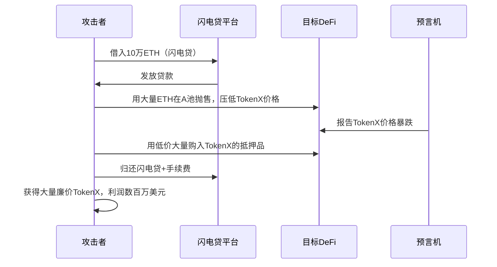
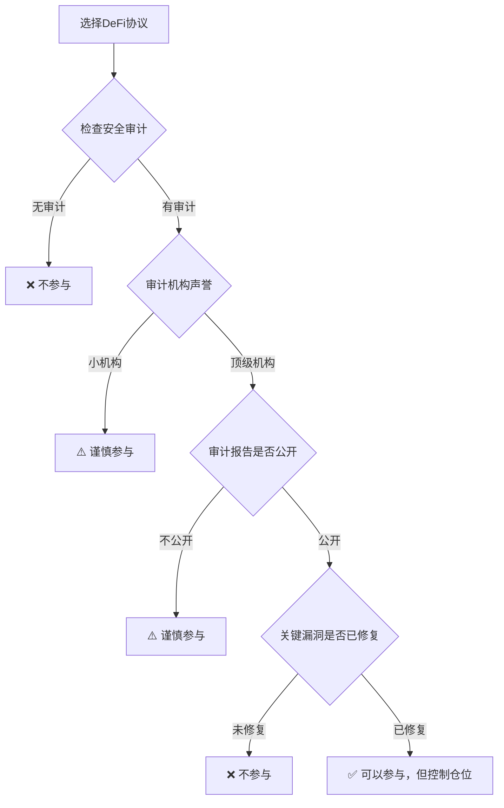

## 案例五：DeFi协议被黑——从The DAO到Ronin Bridge的攻防启示

DeFi（去中心化金融）协议的核心卖点是"代码即法律"——无需信任中介，一切由智能合约自动执行。但代码也是人写的，人写的代码就有漏洞。从2016年The DAO事件导致以太坊硬分叉，到2022年Ronin Bridge被盗6.25亿美元，DeFi安全事件从未停止。本案例将系统梳理DeFi协议被黑的核心攻击手法、经典事件复盘、用户自保策略，以及事件发生后的应对流程。

### 一、为什么DeFi协议成为黑客的"提款机"

#### 1.1 DeFi协议的资金特征

DeFi协议与传统金融机构有本质区别，这使得它成为攻击者的理想目标：

| 特征 | 传统金融机构 | DeFi协议 |
|------|------------|---------|
| 资金存储 | 分散在多个隔离账户 | 集中在智能合约中，TVL可能高达数十亿美元 |
| 转账审批 | 人工审核、多级审批 | 合约自动执行，无人工干预 |
| 资金回滚 | 银行可以冻结/撤销交易 | 链上交易不可逆（除非硬分叉） |
| 攻击暴露 | 攻击者需要突破多层物理/网络隔离 | 只需找到一个合约漏洞 |
| 监管保护 | 存款保险、法律救济 | 几乎没有法律保护，追回资金极为困难 |

一个部署在以太坊上的DeFi协议，其所有资金都锁在智能合约地址中。攻击者不需要"入侵服务器"，只需要找到合约代码中的逻辑漏洞，发起一笔合法的链上交易，就能把资金转走。而且这笔交易一旦上链，就是铁板钉钉——没有任何人可以单方面撤销。

#### 1.2 DeFi安全事件的规模

根据DefiLlama的统计，2020年至2024年间，DeFi领域因黑客攻击和漏洞利用造成的累计损失超过**80亿美元**。以下是年度损失趋势：

| 年份 | 重大事件数量 | 估算总损失（美元） |
|------|------------|-----------------|
| 2020 | ~15起 | ~1.2亿 |
| 2021 | ~80起 | ~13亿 |
| 2022 | ~170起 | ~38亿 |
| 2023 | ~160起 | ~17亿 |
| 2024 | ~130起 | ~12亿 |

损失金额在2022年达到峰值，主要原因是Ronin Bridge（6.25亿）、Wormhole（3.26亿）、Nomad Bridge（1.9亿）等几起超大额事件。此后虽然行业安全意识提升，但攻击手法也在不断进化。

#### 1.3 DeFi攻击的经济学分析

从攻击者的视角来看，DeFi攻击具有极高的"性价比"：


- **成本低**：攻击者可能只需支付几十美元的Gas费（如果使用闪电贷甚至不需要自有资金）
- **收益高**：单次攻击收益可达数千万甚至数亿美元
- **风险低**：通过Tornado Cash等混币器和跨链桥洗钱，追踪难度极大
- **速度快**：从发现漏洞到资金到手，可能只需要几分钟

### 二、六大核心攻击手法详解

#### 2.1 重入攻击（Reentrancy Attack）

**原理**：当合约A调用合约B的函数时，B可以在A完成状态更新之前回调A的函数，从而多次提取资金。这是最经典的DeFi攻击手法，2016年The DAO事件就是由此导致。

**技术机制详解**：

智能合约的执行遵循"检查-生效-交互"（Checks-Effects-Interactions）模式。重入攻击发生在"交互"阶段——在外部调用完成之前，合约的状态（如余额）尚未更新，攻击者利用这个时间窗口反复调用提款函数。

```solidity
// 漏洞合约示例
contract VulnerableVault {
    mapping(address => uint256) public balances;

    function deposit() external payable {
        balances[msg.sender] += msg.value;
    }

    // 漏洞：先发送ETH，再更新余额
    function withdraw() external {
        uint256 balance = balances[msg.sender];
        require(balance > 0, "No funds");
        // 外部调用——攻击者在这里重入
        (bool success, ) = msg.sender.call{value: balance}("");
        require(success, "Transfer failed");
        // 余额更新在外部调用之后——为时已晚
        balances[msg.sender] = 0;
    }
}

// 攻击合约
contract Attacker {
    VulnerableVault vault;

    function attack() external payable {
        vault.deposit{value: 1 ether}();
        vault.withdraw();
    }

    // 攻击者合约的receive函数——在收到ETH时重入
    receive() external payable {
        if (address(vault).balance >= 1 ether) {
            vault.withdraw(); // 再次提款，因为余额尚未清零
        }
    }
}
```

**防御方法**：
- **重入锁（ReentrancyGuard）**：OpenZeppelin提供的`nonPentrant`修饰符，同一函数在同一交易中不能被重入调用
- **检查-生效-交互模式**：先更新状态变量，再进行外部调用
- **使用transfer()或send()**：这些方法限制了Gas转发（2300 Gas），不足以执行重入逻辑，但不推荐作为唯一防御

#### 2.2 闪电贷攻击（Flash Loan Attack）

**原理**：闪电贷允许用户在同一交易中借入巨量资金（无需抵押），只要在交易结束前归还即可。攻击者利用闪电贷获得大量资金，操纵价格预言机或治理投票，从协议中套利。

**攻击流程**：



**经典案例——bZx闪电贷攻击（2020年2月）**：

攻击者在单笔交易中完成以下操作：
1. 从dYdX闪电贷借入10,000 ETH
2. 用5,500 ETH在Compound做多ETH
3. 用1,300 ETH在bZx做空ETH（通过Synthetix上的sETH）
4. 利用Uniswap的低流动性操纵sETH价格
5. bZx仓位因价格操纵获得异常利润
6. 归还闪电贷

最终攻击者在一笔交易中净赚约**35万美元**。

**防御方法**：
- 使用去中心化预言机（如Chainlink多源聚合）而非单一DEX价格
- 引入TWAP（时间加权平均价格）而非即时价格
- 对大额操作设置滑点保护和交易量限制
- 关键治理操作设置时间锁（Time Lock）

#### 2.3 预言机操纵（Oracle Manipulation）

**原理**：DeFi协议依赖预言机获取资产价格。如果预言机数据源可被操纵（比如使用单一DEX的现货价格），攻击者就可以通过大量买卖操纵价格，从借贷协议中借出远超抵押品价值的资金。

**最典型的操纵目标——链上现货价格**：

许多早期DeFi协议直接使用Uniswap等DEX的即时价格作为预言机。攻击者可以用闪电贷获取大量资金，在流动性较薄的交易对中进行大额交易，瞬间改变价格，然后利用这个被操纵的价格在目标协议中获利。

**经典案例——Mango Markets攻击（2022年10月）**：

攻击者Avraham Eisenger的操作：
1. 在Mango Markets的MNGO永续合约市场建立大量多头仓位
2. 在其他交易所同时大量买入MNGO，推高价格
3. Mango的预言机跟随现货价格上涨，攻击者的多头仓位大幅浮盈
4. 利用浮盈作为抵押，从Mango借出约1.14亿美元的各种资产
5. 最终协议金库被掏空

攻击者后来公开身份，声称这是"合法的高利润交易策略"，最终被FBI逮捕并以电信欺诈罪起诉。

**防御方法**：
- 使用Chainlink等去中心化多节点预言机
- 引入TWAP机制，平滑价格波动
- 对预言机价格设置合理的偏差阈值（如不超过20%）
- 监控异常价格波动并触发紧急暂停

#### 2.4 跨链桥攻击（Bridge Exploit）

**原理**：跨链桥连接不同区块链，通常由一组验证者或一个多重签名钱包控制锁定在桥合约中的大量资产。攻击者瞄准验证者私钥或合约逻辑漏洞，直接提取桥中的锁定资产。

**为什么跨链桥是"高价值目标"**：

跨链桥的安全模型通常依赖于少数几个验证节点或一个M-of-N多重签名钱包。这意味着攻击者不需要攻破整条链的共识，只需要突破桥的验证机制即可。同时，桥合约中通常锁有大量资产，因为用户跨链转移的资产都集中在这里。

**经典案例——Ronin Bridge攻击（2022年3月）**

Ronin Bridge是Axie Infinity游戏使用的跨链桥，连接以太坊和Ronin侧链。

| 项目 | 详情 |
|------|------|
| 损失金额 | 173,600 ETH + 2550万 USDC，总计约6.25亿美元 |
| 攻击方式 | 社会工程学攻击，获取了5个验证者中4个的私钥 |
| 验证者分布 | Sky Mavis（Axie开发公司）运行4个，Axie DAO运行1个 |
| 发现时间 | 攻击发生6天后才被发现（用户无法提款时才暴露） |
| 攻击者身份 | 美国FBI认定为朝鲜Lazarus Group |
| 资金追回 | 仅追回约3000万美元（通过交易所冻结） |

**攻击过程**：
1. Lazarus Group通过LinkedIn联系Sky Mavis员工，发送伪造的招聘offer（PDF文件中嵌入恶意软件）
2. 员工打开恶意文件后，其电脑被植入后门
3. 攻击者通过后门获取了Sky Mavis内部网络的访问权限
4. 从网络中获取了4个验证者节点的私钥
5. 使用4/5的签名权限，向Ronin Bridge合约发起提款交易
6. 将173,600 ETH和2550万 USDC转入攻击者控制的地址

**教训**：
- 验证者密钥不应由单一组织控制（中心化风险）
- 异常大额提款应有延迟执行和人工审核机制
- 6天未发现说明监控机制严重不足

#### 2.5 合约逻辑漏洞（Logic Bugs）

**原理**：智能合约的业务逻辑存在设计缺陷，导致资金计算、权限验证或状态管理出现错误。这类漏洞种类繁多，常见的包括：

- **精度丢失**：整数除法导致的精度损失被利用
- **访问控制缺失**：关键函数没有权限验证，任何人都能调用
- **初始化漏洞**：合约可以被重复初始化，攻击者抢占初始化权
- **签名重放**：同一签名可以被多次使用

**经典案例——Wormhole桥攻击（2022年2月）**

| 项目 | 详情 |
|------|------|
| 损失金额 | 120,000 ETH，当时约3.26亿美元 |
| 漏洞类型 | 签名验证绕过 |
| 攻击链 | Solana → 以太坊 |

攻击者发现Wormhole的Solana端合约在验证签名时，可以使用一个过时的系统指令来伪造验证者签名。攻击者利用这个漏洞，构造了一个看似由合法验证者签名的消息，从Wormhole的Solana合约中铸造了120,000个wrapped ETH（wETH），然后兑换为真正的ETH。

**具体技术细节**：
- Wormhole在升级合约时，旧的签名验证函数仍然可以被调用
- 攻击者找到了一种方法，通过调用旧的`verify_signatures`函数，使用伪造的签名通过验证
- 合约没有检查签名的来源是否是当前活跃的验证者集合

**后果**：Jump Crypto（Wormhole的开发方）不得不自掏腰包补充了120,000 ETH到桥合约中，以维持系统的偿付能力。

#### 2.6 治理攻击（Governance Attack）

**原理**：DeFi协议通常通过治理代币进行去中心化治理。攻击者通过闪电贷获取大量治理代币，在单个交易中发起并通过恶意提案，例如将协议金库的资金转移给自己。

**经典案例——Beanstalk攻击（2022年4月）**

| 项目 | 详情 |
|------|------|
| 损失金额 | 约1.82亿美元 |
| 攻击方式 | 闪电贷 + 治理提案 |
| 攻击耗时 | 从提案到执行在同一交易中完成 |

攻击者的操作：
1. 通过闪电贷借入大量资金
2. 用借来的资金购买足够的BEAN治理代币
3. 立即发起两个恶意提案（BIP-18和BIP-19），将协议金库资金转移到攻击者地址
4. 使用治理代币投票通过提案
5. 执行提案，资金到账
6. 归还闪电贷

**根本原因**：Beanstalk的治理机制没有设置提案等待期（cooling period），提案可以在同一区块内发起、投票和执行，完全没有给社区反应的时间。

### 三、真实案例深度复盘——Poly Network跨链攻击

#### 3.1 事件概述

2021年8月10日，跨链协议Poly Network遭受攻击，攻击者从以太坊、BSC和Polygon三条链上共转移了约6.11亿美元的资产。这是当时DeFi历史上最大的黑客攻击事件。

| 链 | 被盗资产 |
|----|---------|
| 以太坊 | 2,730万美元（主要是USDT、USDC、DAI、WBTC、WETH等） |
| BSC | 2.53亿美元（主要是BNB、USDT、BTCB等） |
| Polygon | 8500万美元（主要是USDC） |

#### 3.2 漏洞根源

Poly Network使用了一个名为"EthCrossChainManager"的合约来管理跨链消息的验证和执行。漏洞在于该合约的`putCurEpochConPubKeyBytes`函数——这个本应只有管理员才能调用的函数，实际上可以被任何人通过精心构造的跨链消息来调用。

攻击步骤：
1. 攻击者构造了一条特殊的跨链消息
2. 消息的目标是调用`putCurEpochConPubKeyBytes`，将验证者公钥替换为攻击者自己的公钥
3. 跨链管理合约验证通过了这条消息（因为旧公钥仍然有效）
4. 攻击者获得了控制跨链消息验证的权限
5. 利用新的权限，构造虚假的跨链提款消息
6. 从各链的锁定合约中提取资金

#### 3.3 魔幻结局——"白帽黑客"归还资金

这起事件最戏剧性的地方在于后续发展：

- **8月10日**：攻击发生，Poly Network公开呼吁攻击者归还资金
- **8月11日**：攻击者开始归还资金，声称"攻击只是为了好玩"，并在链上交易备注中与Poly Network对话
- **8月12日**：攻击者将剩余资金转移到一个需要Poly Network和攻击者双方签名的多签钱包
- **8月23日**：攻击者归还了全部私钥，所有资金被追回
- **后续**：Poly Network聘请攻击者为"首席安全顾问"，并为其提供40万美元的赏金

**分析**：
- 攻击者选择在Tornado Cash被制裁之前归还资金，可能是因为担心被追踪
- 三条链的资产转移都留下了完整的链上记录，洗钱难度极大
- 资金金额巨大，无论通过哪个交易所变现都会被标记和冻结
- 归还资金可能比试图洗钱更"划算"

#### 3.4 对普通投资者的启示



### 四、用户自保策略——如何在DeFi世界中保护自己的资产

#### 4.1 投资前的安全检查清单

在将资金存入任何DeFi协议之前，按以下清单逐项检查：

| 检查项 | 合格标准 | 风险信号 |
|--------|---------|---------|
| 智能合约审计 | 至少1家知名审计机构（Certik、Trail of Bits、OpenZeppelin、Consensys Diligence）审计 | 无审计或审计机构不知名 |
| 审计报告 | 公开可查，关键漏洞已修复 | 报告不公开，或发现的高危漏洞标记为"已确认"但未修复 |
| 代码开源 | 合约源码在Etherscan上已验证 | 合约未开源或未验证 |
| 运行时间 | 主网运行超过6个月 | 刚上线不到1个月 |
| TVL稳定性 | TVL稳定增长，无异常大幅波动 | TVL短期内暴涨或暴跌 |
| 团队身份 | 团队成员身份公开可查 | 完全匿名团队 |
| 治理机制 | 有时间锁，重大变更有延迟期 | 治理可以立即执行 |
| 资金管理 | 使用多签钱包，公开地址 | 资金由单一EOA地址控制 |
| Bug Bounty | 有公开的赏金计划 | 没有安全赏金计划 |

#### 4.2 分散风险的具体策略

**不要把所有鸡蛋放在一个篮子里**——这句话在DeFi中尤为重要。具体操作：

**协议分散**：将资金分配到多个不同的协议中，即使一个协议被黑，损失也被控制在可接受范围内。

```text
资产配置示例（10万美元DeFi资产）：
├── Aave V3（借贷）    —— 30% = 3万美元
├── Lido（质押）       —— 25% = 2.5万美元
├── Uniswap V3（LP）   —— 15% = 1.5万美元
├── Curve（稳定币池）   —— 15% = 1.5万美元
├── MakerDAO（DAI铸造） —— 10% = 1万美元
└── 冷钱包（不参与DeFi）—— 5%  = 0.5万美元
```

**链分散**：不要把所有资金都放在同一条链上。以太坊主网的安全性最高，但L2和其他L1的风险模型不同。

**时间分散**：不要一次性将全部资金投入DeFi。采用DCA（定期定额投入）策略，分批进入。

#### 4.3 监控和预警工具

| 工具 | 功能 | 使用方式 |
|------|------|---------|
| [Rekt](https://rekt.news) | DeFi安全事件数据库，按损失金额排名 | 定期阅读，了解常见攻击模式 |
| [DeFi Llama](https://defillama.com) | 追踪协议TVL、审计状态 | 监控你参与的协议TVL是否有异常波动 |
| [Tenderly](https://tenderly.co) | 交易模拟和合约监控 | 在执行大额操作前先模拟交易 |
| [Forta](https://forta.org) | 去中心化安全监控网络 | 订阅你参与的协议的安全警报 |
| [SlowMist](https://slowmist.com) | 安全威胁情报 | 关注推特获取实时安全预警 |
| [BlockSec](https://blocksec.com) | 交易监控和攻击检测 | 设置大额资金异动提醒 |

#### 4.4 紧急响应手册

如果你参与的DeFi协议遭受攻击，按以下步骤立即行动：

**第一步：确认事件（0-5分钟）**
- 查看你关注的协议的官方推特和Discord
- 在Rekt News、PeckShield Alert、BlockSec等渠道核实
- 不要恐慌——先确认是真实攻击还是FUD（恐慌情绪）

**第二步：评估影响（5-15分钟）**
- 确认你存入资金的具体合约是否受到影响
- 检查你的钱包中是否仍持有相关代币（有些攻击会导致代币价值归零）
- 如果协议暂停了提款，记录你存入的金额和时间

**第三步：保护剩余资产（15-30分钟）**
- **如果协议尚未暂停**：立即撤销对该协议合约的所有授权（approve），使用revoke.cash
- **如果代币还在钱包中**：将代币转移到安全地址
- **如果有抵押借贷仓位**：评估是否需要补充抵押品以避免清算（注意：在被攻击的协议上补充抵押品可能无意义）

**第四步：记录和索赔（1-7天）**
- 截图保存所有交易记录
- 记录你在攻击前的持仓详情（代币种类、数量、交易哈希）
- 关注协议官方的后续公告，有些团队会推出补偿方案
- 加入受影响用户的社区讨论群组

### 五、行业安全基础设施的演进

#### 5.1 安全审计行业现状

安全审计是DeFi协议的第一道防线，但审计并非万能：

| 维度 | 优势 | 局限 |
|------|------|------|
| 代码审查 | 能发现已知类型的漏洞 | 无法覆盖所有逻辑分支 |
| 形式化验证 | 数学证明代码的正确性 | 成本高、只适用于核心逻辑 |
| 模糊测试 | 通过随机输入发现边界情况 | 不保证覆盖率 |
| 经济模型审计 | 分析代币经济学和激励机制 | 无法预测所有攻击者行为 |

知名审计机构及其特点：
- **Trail of Bits**：以太坊基金会长期合作方，擅长底层协议审计
- **OpenZeppelin**：开源安全库的维护者，深度参与DeFi标准制定
- **Consensys Diligence**：ConsenSys旗下，提供形式化验证服务
- **Certik**：使用AI辅助审计，审计数量行业第一
- **Spearbit**：专注于复杂DeFi协议的经济安全审计

#### 5.2 保险协议——风险对冲工具

DeFi保险协议允许用户为智能合约漏洞造成的损失投保：

| 保险协议 | 机制 | 覆盖范围 | 保费范围 |
|---------|------|---------|---------|
| Nexus Mutual | 互助保险，成员投票决定理赔 | 智能合约漏洞、预言机失败 | 年化2-8% |
| InsurAce | 去中心化保险市场 | 智能合约、稳定币脱锚 | 年化3-12% |
| Unslashed | 参数化保险 | 自动触发赔付 | 年化5-10% |

**使用保险的注意事项**：
- 保险协议本身也可能被攻击（Nexus Mutual在2020年遭到了针对其CEO的社会工程学攻击）
- 理赔流程可能需要数周到数月
- 并非所有类型的损失都被覆盖（如治理攻击、市场操纵通常不赔）
- 保费会随着被保协议的风险评估而变化

#### 5.3 安全技术的前沿发展

**账户抽象（Account Abstraction, ERC-4337）**：允许用户设置更灵活的安全规则，例如每日提取上限、多签确认、社交恢复等，即使私钥泄露也能限制损失。

**MEV保护**：Flashbots等项目正在开发防止MEV（最大可提取价值）攻击的工具，保护用户免受三明治攻击和交易排序操纵。

**零知识证明在安全中的应用**：ZK技术可以实现隐私保护的同时验证交易的正确性，减少攻击面。

**跨链安全标准**：行业正在推动跨链桥的安全标准，包括多验证者分布、延迟提款、异常检测等机制。

### 六、DeFi安全的哲学思考

#### 6.1 "代码即法律"的局限

DeFi的核心理念是"代码即法律"——智能合约一旦部署，就按照代码逻辑自动执行，没有人为干预。但现实证明这个理念存在根本性矛盾：

- **代码有漏洞**：再严格的审计也无法保证100%安全
- **无法区分"合法利用"和"攻击"**：从合约角度看，攻击者的交易和正常用户的交易没有区别
- **不可逆性是一把双刃剑**：保护了协议免受审查，也保护了攻击者的战利品

#### 6.2 中心化与去中心化的平衡

Ronin Bridge攻击揭示了一个悖论：完全去中心化的桥效率太低、成本太高；而中心化的桥虽然高效，但集中了风险。行业正在探索折中方案：

- **乐观验证**：交易默认通过，但有一个挑战期（类似Optimistic Rollup）
- **ZK验证**：使用零知识证明验证跨链消息的有效性
- **分布式验证者集合**：验证者分布在不同实体和地理位置

#### 6.3 给普通投资者的最终建议

1. **理解你参与的是什么**：不要盲目追逐高APY，搞清楚收益来源
2. **安全检查是必修课**：审计报告、代码开源、运行时间、团队背景——缺一不可
3. **分散是最朴素也是最有效的策略**：协议分散、链分散、时间分散
4. **保持警觉但不要过度恐惧**：DeFi安全事故是客观存在的风险，但通过合理配置可以将其控制在可接受范围
5. **持续学习安全知识**：关注安全社区动态，了解最新的攻击手法和防御策略
6. **永远只投入你能承受损失的资金**：这不是套话——在DeFi世界中，这条原则的重要性远超传统投资

### 七、关键数据速查表

| 经典事件 | 时间 | 损失金额 | 攻击类型 | 资金追回 |
|---------|------|---------|---------|---------|
| The DAO | 2016年6月 | 360万ETH（约6000万美元） | 重入攻击 | 通过以太坊硬分叉回滚 |
| bZx | 2020年2月 | ~100万美元 | 闪电贷+预言机操纵 | 无 |
| Harvest Finance | 2020年10月 | 3400万美元 | 闪电贷+预言机操纵 | 部分（攻击者退还250万） |
| Cream Finance | 2021年10月 | 1.3亿美元 | 闪电贷+价格操纵 | 无 |
| Poly Network | 2021年8月 | 6.11亿美元 | 合约逻辑漏洞 | 全部追回（白帽归还） |
| Wormhole | 2022年2月 | 3.26亿美元 | 签名验证绕过 | Jump Crypto自掏腰包补回 |
| Ronin Bridge | 2022年3月 | 6.25亿美元 | 社工+验证者密钥泄露 | 约3000万（交易所冻结） |
| Beanstalk | 2022年4月 | 1.82亿美元 | 闪电贷+治理攻击 | 无 |
| Mango Markets | 2022年10月 | 1.14亿美元 | 预言机操纵 | 部分（谈判归还6700万） |
| Euler Finance | 2023年3月 | 1.97亿美元 | 闪电贷+合约漏洞 | 全部追回（攻击者归还） |
| Mixin Network | 2023年9月 | 2亿美元 | 云服务商数据库被入侵 | 部分 |

### 八、总结

DeFi协议被黑不是偶然事件，而是整个生态系统必须面对的结构性风险。每一次重大攻击事件都在推动行业安全标准的提升：The DAO催生了智能合约安全审计行业，Ronin Bridge推动了跨链桥的安全重构，Wormhole事件加速了形式化验证工具的普及。

对于投资者而言，关键是建立正确的风险认知：DeFi的高收益伴随着高风险，安全检查和分散配置不是可选项，而是必修课。在代码即法律的世界里，你就是自己资产的唯一守门人。

> **核心记忆点**：DeFi攻击损失累计超80亿美元。六大攻击手法：重入攻击、闪电贷攻击、预言机操纵、跨链桥攻击、合约逻辑漏洞、治理攻击。自保三板斧：审计检查 + 分散配置 + 紧急响应预案。
