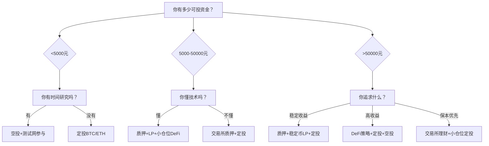

## 案例六：普通人参与加密货币的不同方式

### 案例背景

加密货币市场参与者类型多样，从完全不懂技术的上班族，到有一定技术基础的开发者，再到资金充裕的投资者，每个人都有不同的起点、风险偏好和可用时间。本案例通过四个真实场景，展示不同背景的普通人如何找到适合自己的参与方式。

**四位参与者的画像对比：**

| 维度 | 小李（保守型） | 阿杰（进取型） | 王姐（稳健型） | 陈工（技术型） |
|------|--------------|--------------|--------------|--------------|
| 年龄 | 25岁 | 30岁 | 42岁 | 28岁 |
| 职业 | 国企职员 | 自由设计师 | 小学教师 | 后端开发 |
| 月可投资金 | 2000元 | 5000-10000元 | 3000元 | 8000元 |
| 技术基础 | 零 | 略懂 | 零 | 扎实 |
| 风险偏好 | 极低 | 高 | 中低 | 中高 |
| 每日可用时间 | 15分钟 | 1-2小时 | 30分钟 | 2-3小时 |

### 参与方式一：定投主流币——小李的"懒人策略"

小李是典型的工薪族，对区块链技术了解不多，但看好加密货币的长期发展。他选择最简单的参与方式：定期定额买入比特币和以太坊。

#### 具体执行方案

**第一步：选择平台与设置**

小李选择了合规且操作简单的平台。他优先考虑的因素包括：是否支持人民币出入金、手续费率、平台安全记录和客服响应速度。注册后完成KYC身份验证，绑定银行卡。

**第二步：确定定投参数**

```text
定投策略配置：
┌─────────────────────────────────────┐
│ 标的分配：                           │
│   比特币（BTC）：60%                  │
│   以太坊（ETH）：40%                  │
│                                     │
│ 定投频率：每月1日 + 15日（分两次）     │
│ 每次金额：1000元                      │
│ 定投周期：至少坚持2年                 │
│ 止盈策略：整体盈利50%时减仓20%        │
│ 止损策略：不设止损（长期持有）         │
└─────────────────────────────────────┘
```

**第三步：执行纪律**

小李设置了银行自动转账，每月1日和15日自动从工资卡划转1000元到交易平台。他使用平台的"定期买入"功能，避免手动操作带来的犹豫和情绪干扰。每周日晚上花15分钟查看一次持仓情况，不做任何操作。

#### 12个月执行记录

| 月份 | BTC买入价（元） | ETH买入价（元） | 累计投入 | 当日盈亏 |
|------|----------------|----------------|---------|---------|
| 第1月 | 285,000 | 18,200 | 2,000 | -5% |
| 第3月 | 292,000 | 19,500 | 6,000 | +3% |
| 第6月 | 310,000 | 21,000 | 12,000 | +12% |
| 第9月 | 278,000 | 16,800 | 18,000 | -8% |
| 第12月 | 345,000 | 24,500 | 24,000 | +28% |

#### 关键经验

1. **不看盘是最大的优势**。小李因为工作忙碌，反而避免了频繁操作的亏损。定投的核心逻辑是用时间换空间，频繁看盘只会增加焦虑。
2. **分批投入降低择时风险**。每月分两次买入，平滑了价格波动。如果一次性投入24000元，恰好买在高点则损失更大。
3. **主流币是新手的最优解**。比特币和以太坊的流动性和安全性远高于小币种，适合刚入场的普通人。

#### 需要警惕的坑

- 不要因为"便宜"去买入不知名的山寨币
- 不要因为短期暴跌而停止定投（暴跌反而是低价买入的机会）
- 不要把所有积蓄投入，只用闲钱投资
- 不要轻信任何"带单老师"或"内部消息"

---

### 参与方式二：参与空投与测试网——阿杰的"零成本策略"

阿杰是自由设计师，时间灵活，资金有限但愿意花时间研究。他选择通过参与区块链项目的测试网和空投活动来积累加密资产，几乎不需要投入本金。

#### 空投的本质与逻辑

空投是区块链项目早期推广的常见方式。项目方将代币免费分发给早期用户，目的是：
- 培养初始用户群体
- 去中心化代币分布
- 制造社区话题和传播效应

用户需要做的是在项目早期阶段使用其产品，留下链上行为记录。当项目发币时，这些早期用户往往能获得可观的代币奖励。

#### 阿杰的空投执行流程

**阶段一：基础设施搭建（第1周）**

```bash
# 需要准备的工具清单
1. 钱包：MetaMask（浏览器插件+手机App）
2. 硬件钱包：Ledger Nano S Plus（存放大额资产）
3. 浏览器：Chrome + MetaMask插件
4. 链上分析：Etherscan、Dune Analytics
5. 信息源：Twitter/X、Discord、Telegram项目群
6. 笔记工具：Notion（记录每个项目的参与情况）
```

**阶段二：项目筛选与参与（持续进行）**

阿杰建立了一套筛选标准来评估哪些项目值得参与：

| 评估维度 | 高价值信号 | 低价值信号 |
|---------|-----------|-----------|
| 团队背景 | 知名机构投资、公开团队 | 匿名团队、无知名投资 |
| 融资规模 | 融资超过1000万美元 | 未披露融资或金额极小 |
| 产品状态 | 已有可用产品、有真实用户 | 仅有白皮书、无产品 |
| 社区活跃度 | Discord人数>5万、日活高 | 社区冷清、机器人刷量 |
| 竞品对标 | 赛道有成功先例（如Uniswap） | 赛道无成功案例 |

**阶段三：多链参与策略**

阿杰不局限于以太坊主网，而是主动探索新兴公链生态：

```text
参与路线图：
第1-2月：以太坊主网 DeFi 协议（Uniswap、Aave、Compound）
第3-4月：Layer2 生态（Arbitrum、Optimism、zkSync）
第5-6月：新兴 L1（Solana、Sui、Aptos 生态项目）
第7-8月：跨链桥和基础设施类项目
第9-12月：重点关注有明确空投预期的项目
```

#### 实际收益记录

阿杰在12个月内参与了约40个项目的测试或早期使用：

| 项目 | 参与成本 | 获得代币 | 变现价值 | 耗时 |
|------|---------|---------|---------|------|
| 项目A（L2） | Gas费约200元 | 12,000枚 | 约8,500元 | 3小时 |
| 项目B（DEX） | Gas费约150元 | 800枚 | 约3,200元 | 2小时 |
| 项目C（跨链桥） | Gas费约300元 | 50枚 | 约15,000元 | 5小时 |
| 其他37个项目 | 合计约2,000元 | 部分有价值 | 合计约12,000元 | 约80小时 |
| **合计** | **约2,650元** | — | **约38,700元** | **约90小时** |

折合时薪约400元/小时，远超阿杰的设计时薪。但需注意，这包含了大量研究和等待时间，且结果分布极不均匀——排名前3的项目贡献了70%的收益。

#### 空投参与的核心技巧

1. **交互深度比钱包数量重要**。项目方会筛选"真实用户"，单一地址深度交互（多次交易、多协议使用）远比创建100个钱包刷交互有效。
2. **不要忽视测试网**。测试网不需要Gas费，但测试网活动往往是项目方筛选早期用户的依据。
3. **保持耐心**。从项目测试到发币通常需要6-18个月，不要因为短期没有回报就放弃。
4. **做好税务记录**。空投代币在多数司法管辖区被视为应税收入，需要记录获取时的公允市场价值。

---

### 参与方式三：质押与流动性提供——王姐的"睡后收入策略"

王姐是小学教师，风险偏好较低，希望在保住本金的前提下获得稳定收益。她选择了质押（Staking）和流动性提供（LP）两种被动收入方式。

#### 质押的基本原理

质押是将代币锁定在区块链网络中，参与网络的共识机制（如PoS权益证明），作为回报获得区块奖励和交易手续费分成。类比理解：质押就像银行定期存款，你把钱存进去，银行付你利息。

#### 王姐的质押方案

**方案一：交易所质押（入门级）**

最简单的方式是在交易所内质押，操作门槛极低：

```text
操作步骤：
1. 登录交易所 → 进入"理财"或"Earn"页面
2. 选择质押产品（如ETH 2.0质押、SOL质押）
3. 输入质押数量 → 确认
4. 等待收益自动发放

注意事项：
- 交易所质押年化约3%-8%
- 存在平台风险（交易所可能出问题）
- 锁定期因产品而异，部分支持随时赎回
- 收益每日或每周发放
```

**方案二：链上质押（进阶级）**

直接在区块链上质押，收益更高但操作更复杂：

| 质押方式 | 年化收益 | 操作难度 | 风险等级 | 最低门槛 |
|---------|---------|---------|---------|---------|
| 交易所质押 | 3%-5% | ★☆☆☆☆ | 中（平台风险） | 无最低限制 |
| Lido流动质押 | 3.5%-5% | ★★☆☆☆ | 低-中 | 无最低限制 |
| Rocket Pool | 4%-5.5% | ★★★☆☆ | 低-中 | 0.01 ETH |
| 独立验证节点 | 4%-7% | ★★★★★ | 低 | 32 ETH |

王姐最终选择了Lido质押以太坊。她将5万元闲钱中的2万元兑换为ETH，通过Lido协议质押，获得stETH（质押凭证代币）。stETH可以随时交易卖出，解决了传统质押的流动性问题。

**方案三：稳定币流动性提供**

王姐另外2万元投入了Curve Finance的3pool（DAI/USDC/USDT）流动性池：

```text
Curve 3pool 基本参数：
- 组成：DAI + USDC + USDT（三种美元稳定币）
- 年化收益：基础APY约2%-4% + CRV代币奖励约3%-8%
- 无常损失：几乎为零（三种资产价格锚定1美元）
- 风险：智能合约风险 + 协议治理风险
- 操作链：以太坊主网（Gas费较高）或Arbitrum（Gas费低）
```

#### 王姐12个月的收益情况

| 资产配置 | 投入金额 | 年化收益 | 12个月收益 | 备注 |
|---------|---------|---------|-----------|------|
| Lido ETH质押 | 20,000元 | 4.2% | 840元 | ETH价格变动另算 |
| Curve稳定币LP | 20,000元 | 6.5% | 1,300元 | 含CRV奖励 |
| 平台活期理财 | 10,000元 | 2.0% | 200元 | 应急备用 |
| **合计** | **50,000元** | **4.7%平均** | **2,340元** | — |

收益看似不高，但王姐的目标不是暴富，而是在可控风险下让资产不贬值。同期银行定期存款利率约1.5%，她的链上收益是银行的3倍。

#### 质押与LP的风险清单

```text
风险等级排序（从高到低）：
┌─────────────────────────────────────────────────┐
│ 1. 智能合约被攻击（最高风险）                      │
│    应对：只使用经过审计、运行时间长的协议            │
│                                                   │
│ 2. 无常损失（IL）                                 │
│    应对：选择稳定币对或相关性高的资产对              │
│                                                   │
│ 3. 代币价格下跌                                   │
│    应对：分散配置、设定止损线                       │
│                                                   │
│ 4. 协议治理攻击或Rug Pull                         │
│    应对：查看团队背景、TVL规模、社区治理情况         │
│                                                   │
│ 5. 链上Gas费侵蚀收益                             │
│    应对：使用Layer2网络或等Gas低时操作              │
└─────────────────────────────────────────────────┘
```

---

### 参与方式四：DeFi挖矿与收益聚合——陈工的"技术杠杆策略"

陈工是后端开发工程师，熟悉智能合约和链上交互。他利用技术优势，采用更复杂的策略获取超额收益。

#### 收益聚合器的运作原理

收益聚合器（Yield Aggregator）是自动优化DeFi收益的协议。用户存入资产，协议自动在不同策略间切换以获取最高收益。类比理解：它像一个智能理财顾问，帮你自动调整投资组合。

#### 陈工的策略矩阵

**策略一：杠杆挖矿**

```text
杠杆挖矿流程（以Aave + Uniswap为例）：
1. 存入10,000 USDC作为抵押品到Aave
2. 借出5,000 USDC（50% LTV）
3. 将借出的USDC和等值ETH组成LP存入Uniswap
4. 获得LP代币后，存回Aave作为额外抵押品
5. 再次借出USDC，重复循环
6. 最终杠杆约2-3倍，收益放大但风险也放大

年化收益预期：15%-40%（取决于市场波动和挖矿奖励）
风险：清算风险、无常损失、Gas费侵蚀
```

**策略二：收益聚合器自动复投**

陈工使用Yearn Finance和Beefy Finance自动复投挖矿收益：

| 平台 | 策略类型 | 年化收益 | 自动复投频率 | 管理费 |
|------|---------|---------|-------------|-------|
| Yearn V3 | 稳定币策略 | 5%-12% | 每日 | 2%绩效费 |
| Beefy | LP自动复投 | 10%-25% | 每小时 | 0.5%管理费 |
| Convex | Curve增强 | 8%-15% | 按需 | 16%绩效费 |

**策略三：跨协议套利**

陈工编写了简单的监控脚本，追踪不同协议间的利率差异：

```python
# 简化的利率监控逻辑（伪代码）
protocols = {
    "aave_apy": get_aave_supply_apy("USDC"),
    "compound_apy": get_compound_supply_apy("USDC"),
    "venus_apy": get_venus_supply_apy("USDC"),
}

# 当利差超过阈值时发出警报
spread = max(protocols.values()) - min(protocols.values())
if spread > 1.5:  # 利差超过1.5%
    alert(f"发现套利机会：利差{spread:.2f}%")
    # 需要人工判断是否执行，因为涉及Gas费和时间成本
```

#### 陈工的实际收益与成本

| 项目 | 金额 | 说明 |
|------|------|------|
| 初始投入 | 80,000元 | 12个月累计投入 |
| 总收益 | 约18,500元 | 平均年化约23% |
| Gas费支出 | 约2,800元 | 链上操作的交易费 |
| 策略管理时间 | 约150小时 | 研究+执行+监控 |
| 净收益 | 约15,700元 | 扣除Gas费后 |

#### 陈工踩过的坑

1. **杠杆清算**：2024年某次市场暴跌30%，杠杆仓位被清算，单次损失约5000元。此后将杠杆倍数从3倍降到2倍。
2. **智能合约漏洞**：参与的一个小型协议被黑，投入的3000元全部损失。此后只使用TVL超过1亿美元的头部协议。
3. **Gas费陷阱**：在以太坊主网高峰期操作，单笔交易Gas费高达500元。后改为在Arbitrum等L2上操作，Gas费降到5元以下。

---

### 四种方式的综合对比

| 对比维度 | 定投主流币 | 空投与测试网 | 质押与LP | DeFi挖矿 |
|---------|-----------|------------|---------|----------|
| 资金门槛 | 低（100元起） | 极低（0-500元） | 中（5000元起） | 高（5万元起） |
| 时间投入 | 极低（15分钟/周） | 高（5-10小时/周） | 低（30分钟/周） | 中高（3-5小时/周） |
| 技术要求 | 无 | 低-中 | 低 | 高 |
| 预期年化 | 30%-100%（含币价） | 不确定（高风险高回报） | 5%-15% | 15%-40% |
| 最大风险 | 币价暴跌50%+ | 投入时间无回报 | 智能合约被攻击 | 杠杆清算+合约风险 |
| 适合人群 | 所有人 | 时间充裕者 | 保守型投资者 | 技术型投资者 |
| 学习曲线 | 平缓 | 中等 | 平缓 | 陡峭 |

### 选择参与方式的决策框架



### 普通人参与加密货币的安全底线

无论选择哪种方式，以下安全准则必须遵守：

**资产安全**
- 交易所只放交易用的资金，大额资产转到硬件钱包
- 私钥和助记词手写备份，不存储在联网设备上
- 不同平台使用不同密码，开启双因素认证（2FA）
- 定期检查授权的合约许可，撤销不再使用的授权

**资金管理**
- 只用闲钱投资，绝不借钱炒币
- 单一资产不超过总资产的30%
- 设定最大亏损线（如总资产的20%），触及后暂停操作
- 保留至少3个月生活费的现金储备在银行

**信息安全**
- 不点击任何来源不明的链接
- 不在非官方网站输入钱包助记词
- 定期检查钱包是否有异常授权
- 警惕私信中的"空投领取"链接

**心理管理**
- 接受波动是常态，不要因为短期亏损恐慌卖出
- 不要因为别人赚钱就FOMO（恐惧错过）追高
- 记录每次操作的理由，定期复盘
- 如果持仓让你睡不好觉，说明仓位太重了

---

> **核心启示**：加密货币不是只有"炒币"一种参与方式。普通人完全可以在自己能力圈范围内，选择风险可控、时间投入合理的方式参与。定投适合所有人，空投适合时间充裕者，质押适合保守投资者，DeFi策略适合技术型玩家。关键是找到与自己风险偏好、技术水平和可用时间匹配的方式，然后坚持执行。
