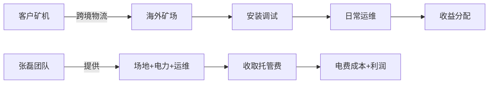
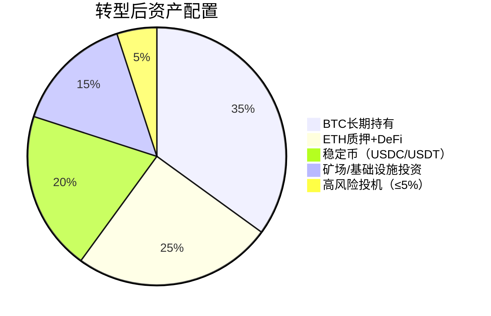

## 案例七：比特币矿工的转型之路

比特币挖矿曾是加密货币行业最"稳赚"的生意——买到矿机、接上电源、连上矿池，就能持续产出比特币。但从2020年开始，三次减半叠加、能源成本飙升、合规监管收紧、全网算力指数级增长，让大量中小矿工的利润空间被压缩到几乎为零。这个案例完整记录了一位中型矿工（管理约500台矿机、年耗电量约600万度）从纯挖矿到多元化经营的转型全过程，包括他踩过的每一个坑和最终跑通的商业模式。

### 一、行业背景：为什么矿工必须转型

#### 1.1 比特币挖矿的经济学模型

比特币挖矿的本质是用算力竞争记账权，获取区块奖励和交易手续费。收入公式非常简单：

**挖矿日收入 = (矿机算力 / 全网算力) × 日产出比特币数 × 比特币价格**

成本侧则包含五大要素：

| 成本项 | 占比（典型值） | 特点 |
|--------|---------------|------|
| 电费 | 60%-75% | 刚性支出，决定生死线 |
| 矿机折旧 | 10%-20% | 矿机寿命约3-5年，迭代快 |
| 场地租金 | 5%-10% | 含机房建设、散热系统 |
| 运维人力 | 3%-8% | 7×24小时监控、故障维修 |
| 矿池费用 | 1%-3% | PPS/PPLNS等模式差异大 |

利润 = 收入 - 上述五项之和。当比特币价格下跌、减半导致出块奖励腰斩、或电费上涨时，利润可能瞬间转负。

#### 1.2 三次减半的累积冲击

| 减半时间 | 区块奖励 | 价格区间（减半后1年） | 对矿工的影响 |
|----------|---------|---------------------|-------------|
| 2012年11月 | 50→25 BTC | $100-$1,100 | 价格暴涨覆盖了奖励下降 |
| 2016年7月 | 25→12.5 BTC | $600-$20,000 | 价格上涨大幅抵消影响 |
| 2020年5月 | 12.5→6.25 BTC | $8,700-$64,000 | 价格上涨勉强覆盖，但竞争加剧 |
| 2024年4月 | 6.25→3.125 BTC | $60,000-$100,000+ | 收益再次腰斩，低效矿机出局 |

每次减半都淘汰一批效率最低的矿工。到2024年减半后，只有电价低于0.04美元/度（约0.28元人民币/度）的矿场才能维持正利润，而国内民用电价普遍在0.5-0.8元/度，工业电价也在0.3-0.6元/度。这意味着**纯依赖国内电力挖矿的模式已经不可持续**。

#### 1.3 案例主角的初始状态

**张磊**（化名），2017年入场，最初投入80万元购买100台蚂蚁S9矿机，在四川某水电站附近自建矿场。到2021年，他的矿场扩展到500台矿机（型号已迭代至S19 Pro），月均产出约2.5个比特币，扣除电费后月净利润约8-12万元（以当时币价计）。

但2021年6月国内全面禁止挖矿后，他面临三个选择：

1. **关停矿场，清退出场**——认亏离场
2. **出海继续挖矿**——搬到哈萨克斯坦、美国德州或中东
3. **原地转型**——利用已有的技术能力、设备资产和行业资源，转向其他赛道

他最终选择了第三条路——并非一步到位，而是经历了一系列试错后找到了适合自己的方向。

### 二、转型路径一：从PoW挖矿到PoS质押

#### 2.1 为什么质押是最自然的第一步

对于矿工来说，从工作量证明（PoW）挖矿转向权益证明（PoS）质押，有天然的过渡优势：

- **已有加密资产**：多年挖矿积累的比特币和以太坊可以直接质押
- **理解共识机制**：PoW和PoS都是共识算法，底层逻辑相通
- **硬件可复用**：服务器可以转为验证节点运行

2022年9月以太坊完成The Merge（从PoW转向PoS）后，全网算力瞬间"失业"，大量以太坊矿工被迫转型。张磊虽然主挖比特币，但也持有约120个ETH，这部分资产自然成了质押的起点。

#### 2.2 质押的具体操作路径

张磊的质押实践经历了三个阶段：

**阶段一：直接质押（2022年10月-2023年3月）**

以太坊信标链要求32 ETH才能运行独立验证节点。张磊有120 ETH，可以运行3个验证节点（剩余24 ETH留作gas费和备用）。

```yaml
硬件配置（验证节点服务器）:
  CPU: Intel i7-12700（或同级AMD）
  内存: 32GB DDR4
  存储: 2TB NVMe SSD（以太坊全链数据约1TB+，需留余量）
  网络: 稳定宽带，上行≥10Mbps，无流量限制
  电源: UPS不间断电源

软件栈:
  执行层客户端: Geth 或 Nethermind
  共识层客户端: Lighthouse 或 Prysm
  操作系统: Ubuntu 22.04 LTS
```

每个验证节点年化收益约4%-5%（以ETH计），120 ETH年收益约14-18 ETH。折合人民币约15-25万元/年（按当时价格）。

**阶段二：加入流动性质押（2023年3月-2023年9月）**

独立质押需要技术运维能力，且资金被锁定无法灵活使用。张磊将其中60 ETH转入Lido协议，获得stETH（流动性质押代币）。stETH可以在DeFi中继续使用，相当于"一份资产两份收益"：

- 质押收益：约4% APY
- stETH在Aave中借出USDC，再存入Curve的stETH-ETH池，获得交易手续费+CRV奖励
- 综合年化：约8%-12%

**阶段三：参与再质押生态（2024年初至今）**

2024年EigenLayer上线后，张磊将部分stETH存入EigenLayer进行"再质押"（Restaking），为新兴的AVS（主动验证服务）提供安全担保，额外获得EIGEN代币奖励。这一步收益更高但风险也更大，他只投入了总资产的20%。

#### 2.3 质押转型的关键指标

| 指标 | 纯挖矿时期 | 质押转型后 |
|------|-----------|-----------|
| 月均收益（折人民币） | 8-12万元 | 3-5万元 |
| 电力成本 | 4-6万元/月 | 约2000元/月（服务器） |
| 净利润率 | 40%-50% | 70%-80% |
| 资产流动性 | 差（矿机为沉没成本） | 好（stETH可随时卖出） |
| 技术门槛 | 中（矿机运维） | 中高（节点运维+DeFi操作） |
| 监管风险 | 高（国内禁止挖矿） | 中（质押处于灰色地带） |

**转型心得**：质押收益的绝对值低于挖矿高峰期，但利润率更高、成本更低、风险更可控。最核心的优势是——不再受电价波动和政策影响。

### 三、转型路径二：矿机托管与基础设施服务

#### 3.1 从"自己挖"到"帮别人挖"

张磊在四川和新疆都建过矿场，积累了丰富的矿场建设经验——电力接入、散热设计、网络架构、安防监控、远程运维。这些能力在出海潮中非常有价值。

2021年禁矿令后，大量矿工需要将矿机运往海外（哈萨克斯坦、俄罗斯、美国、中东），但他们面临三个痛点：

1. **矿机运输**：跨境物流复杂，关税、清关、保险都是坑
2. **矿场建设**：海外建场需要当地资源，语言不通、法律不熟
3. **远程运维**：矿机到了海外，出故障谁来修？

张磊看到了这个机会，转型做矿机托管服务商（Mining Hosting）。他联合两位合伙人，在哈萨克斯坦阿克托别市租下了一个废弃工厂，改造为容量50MW的矿场。

#### 3.2 托管服务的商业模型



**收费模式**：

| 服务类型 | 收费标准 | 包含内容 |
|----------|---------|---------|
| 基础托管 | 0.045-0.055美元/度 | 场地+电力+网络+基础运维 |
| 全托管 | 0.06-0.07美元/度 | 基础+7×24值班+故障维修+月度报告 |
| 定制方案 | 面议 | 矿机采购+运输+建场+运营一站式 |

对比：国内禁矿前平均电价约0.25-0.35元人民币/度，哈萨克斯坦工业电价约0.2-0.3元人民币/度（2022年报价），但考虑跨境运输和运维成本，总拥有成本（TCO）与国内基本持平。

#### 3.3 托管业务的规模化挑战

张磊的托管业务在2022年下半年启动，初期只有20台客户的矿机试运行。到2023年中，托管规模达到2000台（约60MW容量利用率60%），月流水约30万美元。

但规模化带来了新的问题：

**电力供应不稳定**：哈萨克斯坦电网老化，2022年冬季多次停电，每次停电导致客户矿机停机，按合同需赔偿停机损失。张磊后来投入50万美元采购了柴油发电机组作为备用电源。

**合规成本上升**：哈萨克斯坦2023年开始对加密货币挖矿征税（按用电量征收附加费），并要求矿场注册备案。合规成本约占总成本的5%-8%。

**客户纠纷**：部分客户对矿机损坏、停机时间、收益分配产生争议。张磊建立了标准化的服务等级协议（SLA），明确了99.5%可用性保证和赔偿条款。

**汇率风险**：托管费以美元计价，但当地成本以坚戈（KZT）支付。2022年哈萨克斯坦坚戈贬值约15%，直接侵蚀了利润。

#### 3.4 托管业务的关键数据（截至2024年）

| 指标 | 数值 |
|------|------|
| 矿场容量 | 50MW |
| 托管矿机数 | 约3500台 |
| 客户数 | 约40个（机构为主） |
| 月均收入 | 约35万美元 |
| 月均成本 | 约25万美元（含电力、人力、运维） |
| 月净利润 | 约10万美元 |
| 回本周期 | 约18个月（含初期建设投入120万美元） |

### 四、转型路径三：矿工技能向Web3基础设施迁移

#### 4.1 矿工的隐藏技能栈

很多矿工没有意识到，多年挖矿积累的能力在Web3行业有广泛需求：

| 矿工技能 | Web3对应需求 | 具体岗位/业务 |
|----------|-------------|-------------|
| 服务器运维 | 节点运行服务 | RPC节点提供商、全节点托管 |
| 电力管理 | 数据中心运营 | Web3云服务商、AI算力租赁 |
| 散热工程 | 高密度计算环境 | GPU服务器托管（AI训练） |
| 网络架构 | 分布式系统 | 去中心化存储节点（Filecoin、Arweave） |
| 7×24值班 | 链上监控 | 区块链浏览器运维、安全监控 |

张磊选择的方向是**RPC节点服务**和**AI算力租赁**。

#### 4.2 RPC节点服务

RPC（远程过程调用）节点是DApp与区块链之间的桥梁。每次用户在Uniswap上交易、在Aave上借贷、在OpenSea上买卖NFT，背后都需要RPC节点来读写链上数据。

公共RPC节点（如Infura免费版）速度慢、限制多，专业DApp需要付费的专用RPC服务。这个市场需求巨大：

- 以太坊上每天约100万笔交易，每笔交易至少需要1次RPC调用
- 全球RPC市场年增长率超过50%
- 主要玩家：Infura、Alchemy、QuickNode、Ankr

张磊用挖矿退役的服务器，在以太坊、Arbitrum、Optimism、BSC、Polygon五条链上运行全节点，为中小型DApp团队提供RPC服务。初期投入约20万元（服务器改造+SSD升级+带宽扩容），月收入约3-5万元。

```yaml
RPC节点服务器配置:
  CPU: AMD EPYC 7763（64核）或同级
  内存: 512GB DDR4 ECC
  存储: 4×4TB NVMe SSD（RAID 10，共8TB可用）
  带宽: 1Gbps对称，不限流量
  链数据: 以太坊全节点约1.2TB（2024年底）

成本结构:
  硬件折旧: ~5000元/月
  带宽: ~3000元/月
  电力: ~2000元/月
  运维人力: ~10000元/月（兼职）
  总成本: ~20000元/月
```

#### 4.3 AI算力租赁（矿机的第二生命）

2023年AI大模型爆发后，GPU算力需求激增。张磊注意到，比特币ASIC矿机无法用于AI计算（专用芯片不通用），但他矿场中闲置的GPU矿机（以太坊时代遗留的RTX 3080/3090集群）可以改造为AI训练/推理节点。

操作步骤：

1. **评估硬件**：RTX 3090单卡24GB显存，可以跑7B-13B参数的模型推理，或做LoRA微调
2. **搭建平台**：接入Vast.ai或RunPod等GPU租赁平台，出租闲置算力
3. **定价策略**：RTX 3090租赁价格约0.2-0.4美元/小时，比云端便宜50%-70%
4. **运维优化**：安装NVIDIA驱动、CUDA、Docker，配置自动部署脚本

张磊将20张RTX 3090接入Vast.ai，月均收入约2-3万元，电费约0.8万元，净利润约1.5-2万元。虽然利润不高，但盘活了闲置资产。

### 五、转型过程中踩过的坑

#### 5.1 坑一：盲目追求"高收益"DeFi

转型初期，张磊被各种"年化100%+"的DeFi项目吸引，投入了约50万元参与流动性挖矿。结果：

- **无常损失**：在Uniswap V2的ETH-USDC池中，ETH价格波动导致无常损失约15%
- **代币归零**：参与的三个DeFi项目代币在三个月内跌去90%
- **合约漏洞**：其中一个项目被闪电贷攻击，池子被掏空

**教训**：DeFi收益必须用风险调整后的视角看待。"年化100%"意味着项目方在用代币通胀补贴你的收益，当补贴结束（代币价格归零），你的本金也会损失。稳健的做法是只参与头部协议（Aave、Compound、Curve、Lido），年化4%-15%虽然不高，但本金安全。

#### 5.2 坑二：出海建场低估合规风险

哈萨克斯坦的矿场合规要求比预想的复杂：

- **电力合同**：当地电力公司要求预付3个月电费保证金，约15万美元
- **税务注册**：需要注册当地公司，聘请本地会计师和律师，年费约3万美元
- **环保要求**：矿场噪音和热排放需要环评，额外支出约5万美元
- **签证问题**：中国员工需要工作签证，办理周期长且有配额限制

**教训**：出海前必须做完整的法律尽调。建议聘请当地律所出具合规报告，费用约2-5万美元，远低于事后被罚款或关停的损失。

#### 5.3 坑三：忽视税务合规

2022年张磊在国内的挖矿收益和质押收益均未申报纳税。2023年税务部门通过链上数据分析（交易所KYC信息+链上地址关联）锁定了他的账户，要求补缴个人所得税约30万元，外加滞纳金。

**关键认知**：虽然中国禁止加密货币交易，但**挖矿收益和质押收益在税法上仍属于"个人所得"**，需要按"财产转让所得"或"偶然所得"缴纳20%的个人所得税。链上交易完全透明，交易所KYC信息可以被税务部门调取。

#### 5.4 坑四：安全意识薄弱

2023年初，张磊的热钱包被盗，损失约8个ETH（当时约10万元）。原因是他在一台用于日常操作的电脑上存储了私钥明文，该电脑感染了木马。

**整改措施**：

1. 所有大额资产转入硬件钱包（Ledger Nano X + Trezor Model T双备份）
2. 日常操作使用单独的"干净"电脑，不安装任何非必要软件
3. 私钥使用Shamir秘密分享方案（SSSS），分为3份，存储在不同物理位置
4. 设置多签钱包（Gnosis Safe），任何超过1万美元的转账需要2/3签名

### 六、转型成功的关键因素

回顾张磊两年多的转型历程，以下因素至关重要：

#### 6.1 资产配置：不把鸡蛋放在一个篮子里

张磊最终的资产分配：



关键原则：
- **永远保留6个月运营资金**在稳定币中，不参与任何DeFi
- **质押资产不超过总资产的30%**，避免单一协议风险
- **投机仓位严格控制在5%以内**，即使全部归零也不影响生活

#### 6.2 技能持续升级

张磊转型期间自学的技术栈：

| 技能 | 学习资源 | 投入时间 | 实际应用 |
|------|---------|---------|---------|
| Solidity基础 | CryptoZombies + 官方文档 | 2个月 | 理解合约逻辑，避免被项目方忽悠 |
| DeFi协议原理 | 各协议白皮书 + Bankless | 持续 | 评估项目安全性 |
| 服务器运维 | 从矿机运维自然迁移 | 已有基础 | RPC节点服务 |
| 跨境物流 | 实操摸索 | 3个月 | 矿机运输托管业务 |
| 链上数据分析 | Dune Analytics + Nansen | 1个月 | 追踪资金流向，辅助投资决策 |

#### 6.3 人脉网络

矿工圈子本身就是有价值的行业网络。张磊通过矿工社群获得了：
- 托管业务的第一批客户（原矿机供应商的其他客户）
- 哈萨克斯坦矿场的合作伙伴（矿工群里的老乡介绍）
- RPC客户（通过GitHub上的Web3开发者社区获取）

### 七、给矿工转型者的实用建议

#### 7.1 转型前的自我评估清单

在决定转型路径前，先回答以下问题：

- [ ] 你目前有多少加密资产（BTC+ETH+稳定币）？——决定是否有足够的启动资金
- [ ] 你的电力成本是多少？——低于0.03美元/度可以继续挖，高于则必须转型
- [ ] 你有技术团队还是单打独斗？——托管和RPC需要团队，质押可以个人操作
- [ ] 你所在地区的监管环境如何？——中国大陆基本全面禁止，需出海或转向非挖矿业务
- [ ] 你能承受多大的亏损？——决定激进还是保守策略

#### 7.2 推荐的分步转型路径

**第一步（0-3个月）：止损+盘点**
- 停止亏损矿机的运行
- 盘点所有资产（加密资产、矿机残值、场地租约）
- 将30%-50%的加密资产转入硬件钱包冷存储

**第二步（3-6个月）：试水+验证**
- 选择1-2个方向小规模试水（质押最安全，RPC门槛最低）
- 参与行业社群，了解最新趋势
- 开始学习链上分析和DeFi基础

**第三步（6-12个月）：聚焦+规模化**
- 确定主力方向，加大投入
- 建立标准化的运营流程
- 招募关键岗位（运维、商务）

**第四步（12个月+）：多元化+护城河**
- 在主力方向稳定盈利后，扩展第二曲线
- 建立品牌和口碑（行业会议、技术博客、社群影响力）
- 积累可复用的知识产权（运维脚本、分析工具、流程文档）

#### 7.3 每条转型路径的门槛对比

| 转型方向 | 资金门槛 | 技术门槛 | 时间投入 | 风险等级 | 预期回报 |
|----------|---------|---------|---------|---------|---------|
| PoS质押 | 低（32 ETH起） | 中 | 低 | 低 | 4%-8% APY |
| 流动性质押+DeFi | 低（任意金额） | 中高 | 中 | 中 | 8%-15% APY |
| 矿机托管 | 高（100万+） | 中 | 高 | 中高 | 月10-20%利润 |
| RPC节点服务 | 中（20-50万） | 中高 | 中 | 低 | 月3-8万收入 |
| AI算力租赁 | 低（有闲置GPU即可） | 低 | 低 | 低 | 月1-3万收入 |
| 链上数据分析 | 低 | 高 | 高 | 低 | 按项目收费 |

### 八、行业的未来趋势与矿工的长期定位

#### 8.1 比特币挖矿不会消亡，但会高度集中

比特币网络的安全性依赖算力，而算力最终会集中在电价最低、合规最友好的地区（美国德州、中东、北欧、巴拉圭）。中小矿工的生存空间将越来越小，除非找到差异化的竞争点。

#### 8.2 矿工向"Web3基础设施运营商"转型是大势所趋

区块链行业需要的不仅仅是算力，还有节点运行、数据存储、跨链桥接、预言机服务等基础设施。矿工拥有的硬件运维能力、7×24值班体系、电力管理经验，恰好是这些服务的核心竞争力。

#### 8.3 AI与Crypto的融合带来新机会

AI模型训练需要大量GPU算力，而加密货币矿场拥有现成的电力和散热基础设施。2024年已有多个矿企（如Core Scientific、Hut 8）宣布转型为AI数据中心。对中小矿工来说，接入GPU租赁平台（Vast.ai、RunPod、io.net）是最低成本的切入点。

### 九、案例启示

张磊的转型故事并非个例。2021年中国禁矿后，数以万计的矿工面临同样的抉择。成功转型者的共同特征是：

1. **不恋旧**：接受挖矿利润下降的事实，不幻想"币价涨回来就好了"
2. **快行动**：在资产还有价值时就开始转型，而不是等到弹尽粮绝
3. **复用能力**：把挖矿积累的技术和资源转化为新的竞争优势
4. **控制风险**：转型期不是all-in的时候，保留安全垫比追求高收益更重要
5. **持续学习**：Web3行业变化极快，6个月前的最佳策略可能已经过时

比特币矿工的转型之路，本质上是一堂关于**适应性生存**的课——当外部环境剧变时，最宝贵的资产不是矿机和电力，而是多年积累的行业认知、技术能力和人脉网络。这些无形资产，才是穿越周期的真正护城河。
