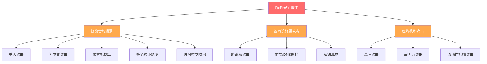
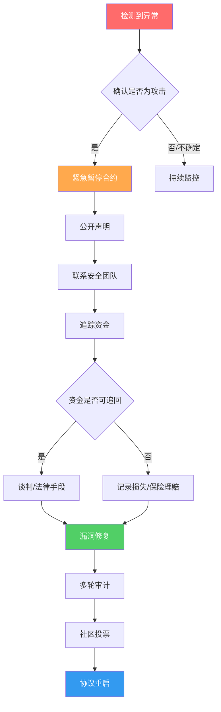

## 案例八：DeFi协议的安全事件应对

### 案例背景

DeFi（去中心化金融）协议通过智能合约实现了无需中介的金融服务，但代码即法律的特性也意味着——一旦合约存在漏洞，攻击者可以在几分钟内窃取数千万甚至数亿美元的资产。据 DeFi Llama 统计，2020年至2025年间，DeFi领域因安全事件累计损失超过 **80亿美元**，涉及数百个协议。

本案例以2023年 **Euler Finance** 遭受约1.97亿美元攻击事件为主线，结合 **Curve Finance**（2023年7月，约7000万美元）、**Ronin Bridge**（2022年3月，6.25亿美元）等经典安全事件，系统讲解DeFi安全事件的完整应对流程——从攻击发生的第一时间响应，到资金追回、协议修复、社区治理决策，再到普通用户的自我保护策略。

#### 为什么这个案例值得深入研究

DeFi安全事件不是"会不会发生"的问题，而是"什么时候发生"的问题。每一个DeFi参与者——无论是协议开发者、流动性提供者还是普通用户——都必须理解安全事件的应对机制。这不仅关系到资金安全，更关系到你能否在危机中做出理性决策，而不是在恐慌中遭受不必要的损失。

---

### 一、DeFi安全事件的攻击类型全解

在深入具体案例之前，必须先理解DeFi安全事件的主要攻击类型。不同类型的攻击，其应对策略完全不同。

#### 1.1 智能合约漏洞利用

这是最常见的攻击类型，攻击者利用合约代码中的逻辑缺陷进行攻击。

| 攻击手法 | 原理 | 典型案例 | 损失规模 |
|----------|------|----------|----------|
| 重入攻击（Reentrancy） | 在状态更新前反复调用提款函数 | The DAO（2016） | 6000万美元 |
| 闪电贷攻击 | 利用无抵押借贷操纵价格 | bZx（2020） | 800万美元 |
| 预言机操纵 | 操纵价格预言机获取不当利润 | Mango Markets（2022） | 1.14亿美元 |
| 签名验证缺陷 | 伪造或重放交易签名 | Wormhole（2022） | 3.26亿美元 |
| 访问控制缺陷 | 合约权限管理不当 | Poly Network（2021） | 6.1亿美元 |
| 数学运算溢出 | 整数溢出/下溢导致计算错误 | SushiSwap（2021） | 300万美元 |
| 逻辑错误 | 合约业务逻辑存在漏洞 | Euler Finance（2023） | 1.97亿美元 |

#### 1.2 基础设施层攻击

这类攻击不直接针对智能合约，而是攻击支撑DeFi运行的底层基础设施。

**跨链桥攻击：** 跨链桥是DeFi安全事件的重灾区。由于桥接合约需要锁定大量资产，且验证机制复杂，成为攻击者的首选目标。Ronin Bridge（Axie Infinity的侧链桥）被攻击者通过社会工程获取了5/9的验证者私钥，盗取6.25亿美元；Wormhole跨链桥因签名验证漏洞被盗3.26亿美元。

**前端攻击：** 攻击者不攻击合约本身，而是攻击协议的前端网站。例如2022年9月，Curve Finance的前端DNS被劫持，用户被导向恶意合约，损失约57.5万美元。这类攻击让用户误以为自己在与合法合约交互，实际签署的是授权攻击者转移资产的交易。

**私钥泄露：** 协议团队或多签钱包的私钥被泄露。Multichain（2023年7月）因CEO被逮捕、服务器私钥被获取，导致1.26亿美元资产被转移。

#### 1.3 经济机制攻击

这类攻击不利用代码漏洞，而是利用协议经济设计的缺陷。

**治理攻击：** 通过闪电贷获取大量治理代币，临时获得投票权通过恶意提案。Beanstalk（2022年4月）被攻击者通过闪电贷借入大量代币，通过恶意治理提案转移了1.82亿美元。

**三明治攻击（Sandwich Attack）：** MEV机器人在用户的交易前后分别插入自己的交易，通过操纵价格获利。虽然单笔金额不大，但在以太坊上每天造成的用户损失估计达数百万美元。



---

### 二、核心案例：Euler Finance攻击事件全记录

#### 2.1 事件概况

**时间：** 2023年3月13日

**协议简介：** Euler Finance是一个基于以太坊的非托管借贷协议，允许用户借出和借入多种加密资产。与Aave、Compound不同，Euler支持无许可上市（任何ERC-20代币都可以作为抵押品），并采用了多层资产分类系统（隔离层、跨层、抵押层）来管理风险。

**攻击损失：** 约1.97亿美元，涉及DAI、USDC、WBTC、WETH和stETH五种资产。

**攻击手法：** 攻击者利用Euler合约中`donateToReserves`函数的闪电贷漏洞，通过精心构造的交易序列，在不触发清算的情况下操纵eToken余额，非法提取资产。

#### 2.2 攻击时间线

| 时间（UTC） | 事件 |
|------------|------|
| 08:26 | 攻击者首次交易，通过闪电贷借入大量DAI |
| 08:31 | 利用捐赠函数漏洞操纵eToken余额 |
| 08:36 | 继续提取资产，累计约1.97亿美元 |
| 09:15 | Euler社区成员在Discord中发出警报 |
| 09:30 | Euler官方确认安全事件，暂停合约 |
| 10:00 | 链上分析师开始追踪资金流向 |
| 12:00 | Euler发布公开声明，联系安全团队 |
| 3月14日 | 攻击者开始通过Tornado Cash混币转移资金 |
| 3月18日 | Euler向攻击者发出最后通牒：归还90%资金免于法律追究 |
| 3月20日 | 攻击者归还约5800万美元（第一批） |
| 4月3日 | 攻击者归还剩余全部资金 |
| 4月4日 | Euler确认所有资金已追回 |

#### 2.3 攻击技术原理

Euler合约的核心漏洞在于`donateToReserves`函数未正确检查调用者的债务状态。攻击流程如下：

```text
攻击者操作流程（简化）：

1. 闪电贷借入 3000万 DAI
2. 将 DAI 存入 Euler，获得 eDAI（存款凭证）
3. 创建一个杠杆化的债务仓位（借入 eDAI 并再次存入）
4. 调用 donateToReserves，将部分 eDAI 捐赠给储备金
   → 关键漏洞：此函数未检查调用者的流动性是否充足
   → 导致攻击者的 eDAI 余额变为负数（underflow）
5. 由于余额下溢，攻击者的账户显示拥有巨额 eDAI
6. 用这些"凭空产生"的 eDAI 赎回真实的 DAI
7. 偿还闪电贷，保留利润
```

这个漏洞的本质是**整数下溢未被正确处理**加上**流动性检查缺失**的组合漏洞。单独来看，Euler合约使用了SafeMath库防止整数溢出，但在特定的函数调用序列中，安全检查被绕过了。

#### 2.4 Euler的应对措施

**第一阶段：紧急响应（0-24小时）**

1. **暂停合约：** Euler团队在确认攻击后，迅速通过治理机制暂停了协议的核心功能（存款、提款、借贷），防止进一步损失。
2. **安全团队介入：** 联系了Chainalysis、TRM Labs等区块链分析公司追踪资金流向。
3. **公开沟通：** 在Twitter和Discord上发布声明，承认安全事件并说明正在调查。
4. **联系攻击者：** 通过链上消息向攻击者地址发送信息，要求谈判。

**第二阶段：资金追回（1-21天）**

Euler采取了"胡萝卜加大棒"的策略：

- **胡萝卜：** 提出bug bounty奖励方案，如果攻击者归还90%资金，将获得约10%作为"白帽奖励"（约1970万美元），且不追究法律责任。
- **大棒：** 明确表示已与执法部门合作，如果不归还资金将面临刑事起诉。
- **社区施压：** 链上分析师追踪到攻击者与一个已KYC的交易所账户存在关联，增加了攻击者的身份暴露风险。

最终，攻击者在3周内分批归还了全部1.97亿美元。这一结果在DeFi历史上是罕见的——大多数攻击事件中，被盗资金无法追回。

**第三阶段：协议修复与重启（3-8周）**

1. **漏洞修复：** 对`donateToReserves`函数添加了正确的流动性检查，并对所有类似的边界条件进行了全面审计。
2. **多轮审计：** 由Sherlock、Halborn、Solidified等多家审计公司进行独立审计。
3. **社区治理投票：** 通过DAO投票决定是否重启协议、是否对受影响用户进行补偿。
4. **协议重启：** 2023年4月，Euler在完成审计和修复后重启协议，受影响用户获得全额补偿。

---

### 三、对比案例：Curve Finance攻击事件

#### 3.1 事件概况

**时间：** 2023年7月30日

**攻击类型：** Vyper编译器重入漏洞

**损失：** 约7000万美元（多个Curve池受影响）

**关键区别：** 这不是Curve合约逻辑的漏洞，而是底层编程语言编译器（Vyper 0.2.15-0.3.0版本）的重入防护机制失效。这意味着任何使用受影响Vyper版本的DeFi协议都面临同样的风险。

#### 3.2 影响范围

| 受影响池 | 损失金额 | 资产类型 |
|----------|----------|----------|
| CRV/ETH池 | 约500万美元 | CRV + ETH |
| alETH/ETH池 | 约1360万美元 | ETH相关 |
| msETH/ETH池 | 约690万美元 | ETH相关 |
| pETH/ETH池 | 约1140万美元 | ETH相关 |
| JPEG'd池 | 约1150万美元 | JPEG'd相关 |
| 其他池 | 约2000万美元 | 多种资产 |

#### 3.3 Curve的应对

Curve的应对体现了去中心化协议的典型危机管理方式：

1. **透明沟通：** Curve创始人Michael Egorov在Twitter上实时更新情况，没有试图掩盖问题。
2. **社区自救：** Curve社区迅速识别受影响的池子，用户紧急撤出未受影响池的流动性。
3. **白帽追回：** 部分攻击者主动归还了资金（其中一位"白帽"攻击者归还了约523万美元的ETH）。
4. **生态协作：** Vyper编译器团队紧急发布补丁，多个使用Vyper的协议同步修复。

---

### 四、DeFi安全事件应对的通用框架

通过分析多个案例，可以总结出一套通用的DeFi安全事件应对框架。

#### 4.1 协议方应对框架



**核心原则：**

| 阶段 | 关键动作 | 常见错误 |
|------|----------|----------|
| 检测（0-30分钟） | 链上监控告警、社区报告确认 | 忽视异常交易、延迟确认 |
| 响应（30分钟-2小时） | 暂停合约、公开声明 | 试图隐瞒、信息不透明 |
| 调查（2-24小时） | 资金追踪、漏洞定位 | 仓促下结论、指责错误对象 |
| 追回（1天-数周） | 谈判/法律手段/bug bounty | 威胁过激导致攻击者加速转移 |
| 修复（数周-数月） | 漏洞修复、审计、社区投票 | 草率重启、跳过审计 |
| 重启（数月） | 恢复运营、补偿用户 | 缺乏补偿方案、信任修复不足 |

#### 4.2 用户方应对框架

当用户参与的DeFi协议遭受攻击时，应按以下优先级行动：

**第一步：确认信息（5分钟内）**

1. 检查协议官方Twitter/Discord是否有安全声明
2. 在DeFi Llama、Rekt.news等平台确认是否有安全事件报道
3. 查看自己的钱包是否仍有授权给该合约的权限
4. **不要**在未确认的情况下执行任何交易——恐慌操作可能造成更大损失

**第二步：保护剩余资产（15分钟内）**

1. **撤销授权：** 使用 Revoke.cash 或 Etherscan 的 Token Approval 功能撤销对该协议合约的所有授权。这一步至关重要——即使合约已被攻击，如果你还有授权，攻击者可能利用你的授权进一步转移你的资产。
2. **提取未受影响的资产：** 如果协议仍有部分功能可用（例如某些池未受影响），尽快提取。
3. **检查关联协议：** 如果你使用了该协议的衍生品（如抵押借贷头寸），评估是否需要平仓以避免清算。

**第三步：记录和追踪（1-24小时）**

1. 记录你在该协议中的所有仓位和交易历史
2. 关注协议方的补偿方案公告
3. 加入社区讨论，了解最新进展
4. 如果涉及大额资金，考虑咨询法律专业人士

**第四步：学习和调整（1-7天）**

1. 分析安全事件的原因，评估自己是否需要调整投资策略
2. 检查其他参与的协议是否存在类似风险
3. 更新自己的安全防护清单

---

### 五、安全事件中的链上追踪技术

#### 5.1 资金追踪工具

| 工具 | 功能 | 适用场景 |
|------|------|----------|
| Etherscan | 交易查询、地址追踪 | 基础链上查询 |
| Arkham Intelligence | 地址标签、实体识别 | 识别攻击者关联地址 |
| Chainalysis | 专业区块链取证 | 执法/合规级别的追踪 |
| Tenderly | 交易模拟、调试 | 分析攻击的技术细节 |
| BlockSec | 实时安全监控 | 协议方的实时告警 |

#### 5.2 资金流向分析

攻击者转移资金的常见路径：

```text
被盗资金典型流转路径：

攻击合约 → 中间地址（多层跳转）→ Tornado Cash/混币器
    ↓
或者：攻击合约 → 跨链桥 → 其他链 → DEX兑换 → 中心化交易所（如未KYC）
    ↓
或者：攻击合约 → 隐私币（如通过THORChain兑换为BTC）
```

**关键发现：** 随着链上分析技术的进步和交易所KYC要求的加强，攻击者"洗白"资金的难度越来越大。Euler案例中，攻击者正是因为身份暴露风险才选择归还资金。2023年后，越来越多的安全事件中攻击者选择归还部分或全部资金，这与链上追踪能力的提升直接相关。

#### 5.3 资金冻结的现实

需要明确的是：**区块链上的资金无法被"冻结"。** 这与传统金融系统有本质区别。银行可以冻结账户，但区块链的去中心化特性意味着没有任何单一实体可以阻止交易。

但有例外情况：

- **USDC/USDT发行方：** Circle（USDC）和Tether（USDT）可以冻结其稳定币的特定地址。在多次安全事件中，这两家公司都在执法部门要求下冻结了被盗资金中的USDC/USDT部分。
- **交易所配合：** 如果被盗资金流入KYC交易所，交易所可以冻结相关账户。
- **跨链桥暂停：** 部分跨链桥有暂停机制，可以在紧急情况下暂停跨链操作。

---

### 六、预防策略：如何在安全事件发生前做好准备

#### 6.1 分散风险的仓位管理

**核心原则：不要把所有资产放在一个协议中。**

| 分散维度 | 建议 | 理由 |
|----------|------|------|
| 协议分散 | 单一协议不超过总资产的20% | 单一协议被黑不影响整体 |
| 链分散 | 资产分布在2-3条链上 | 避免单链基础设施故障 |
| 资产类型分散 | 稳定币+主流币+DeFi代币 | 不同资产的风险特征不同 |
| 时间分散 | 定投/分批进入 | 避免在单一时间点暴露全部风险 |

#### 6.2 协议安全评估清单

在将资金存入任何DeFi协议之前，完成以下检查：

**合约层面：**
- 合约是否经过至少2家知名审计公司的审计？（如Trail of Bits、OpenZeppelin、Consensys Diligence）
- 审计报告是否公开可查？审计发现的问题是否已修复？
- 合约是否已开源？代码是否在Etherscan上验证？
- 合约部署时间是否超过6个月？（新合约风险更高）

**团队层面：**
- 核心团队成员是否公开身份（Doxxed）？
- 团队是否有可追溯的开发历史？
- 是否有bug bounty计划？奖励金额是否合理？（通常应为TVL的1-5%）

**机制层面：**
- 是否有紧急暂停机制？暂停权限是否由多签控制？
- 多签钱包的签名者数量和阈值是否合理？（推荐3/5或4/7）
- 治理代币的分配是否合理？是否有团队大量持仓的风险？

**TVL和运营层面：**
- TVL（总锁定价值）是否稳定增长？突然的TVL暴增可能预示风险。
- 协议运行时间是否足够长？经历过市场极端波动而未出问题的协议更可靠。
- 社区活跃度如何？Discord/Twitter是否有持续的技术讨论？

#### 6.3 授权管理

**最重要的安全习惯：定期审查和撤销不必要的合约授权。**

当你与DeFi协议交互时，通常需要授权合约使用你的代币。这个授权如果没有主动撤销，即使你已经不再使用该协议，合约仍然可以转移你的代币。

```text
授权审查操作步骤：

1. 访问 revoke.cash
2. 连接你的钱包
3. 查看所有已授权的合约列表
4. 对每个授权评估：
   - 是否仍在使用该协议？→ 保留
   - 已不再使用？→ 撤销
   - 授权金额是否为"无限"？→ 考虑改为实际需要的金额
5. 对不熟悉的合约授权，立即撤销
```

#### 6.4 保险和对冲策略

DeFi保险可以在安全事件发生时提供一定程度的补偿：

| 保险类型 | 代表项目 | 覆盖范围 | 保费（年化） |
|----------|----------|----------|------------|
| 协议保险 | Nexus Mutual | 智能合约漏洞 | 2-10% |
| 参数保险 | InsurAce | 多种DeFi风险 | 3-8% |
| 自保基金 | 自行预留 | 全部 | 0%（自行管理） |
| 协议内置保险 | 部分借贷协议 | 清算保护 | 隐含在利率中 |

**实际建议：** 对于大多数普通用户，与其购买DeFi保险（保费高、理赔条件严格），不如采用**自保策略**——将总资产的10-20%保留为安全储备金，专门用于应对可能的安全事件损失。同时通过协议分散将单一协议的风险控制在可承受范围内。

---

### 七、DeFi安全事件的法律与监管维度

#### 7.1 全球监管趋势

DeFi安全事件越来越多地受到监管关注。主要趋势包括：

- **美国SEC/CFTC：** 已对多个DeFi项目采取执法行动，但主要针对未注册证券发行，对黑客攻击的追诉仍以FBI/DOJ为主。
- **欧盟MiCA：** 2024年生效的《加密资产市场法规》对DeFi协议提出了合规要求，但对去中心化程度较高的协议执行力度有限。
- **国际合作：** Chainalysis等公司与全球执法机构合作，帮助追踪和冻结被盗资金。

#### 7.2 用户的法律途径

如果在DeFi安全事件中遭受损失，用户的法律途径包括：

1. **集体诉讼：** 如果协议团队有明确的过失（如未审计、忽视已知漏洞），用户可以发起集体诉讼。但匿名团队和去中心化组织的法律追诉非常困难。
2. **举报和配合：** 向IC3（FBI互联网犯罪投诉中心）或其他执法机构举报，配合调查。
3. **保险理赔：** 如果购买了DeFi保险，按照保险协议提交理赔申请。
4. **协议补偿：** 许多协议在安全事件后会通过DAO投票决定补偿方案，这是最常见的追回途径。

---

### 八、经验总结与核心教训

#### 8.1 案例数据对比

| 对比维度 | Euler Finance | Curve Finance | Ronin Bridge |
|----------|--------------|---------------|--------------|
| 损失金额 | 1.97亿美元 | ~7000万美元 | 6.25亿美元 |
| 攻击类型 | 合约逻辑漏洞 | 编译器漏洞 | 私钥泄露 |
| 资金追回 | 100% | 部分 | FBI追回约3000万 |
| 追回耗时 | 3周 | 部分未追回 | 大部分未追回 |
| 协议重启 | 已重启 | 未中断 | 已重启 |
| 关键因素 | 身份暴露风险 | 白帽归还 | 执法介入 |

#### 8.2 核心教训

**对协议开发者：**

1. **审计不是终点：** Euler经过了多次审计仍未发现漏洞。审计是必要条件，但不是充分条件。需要结合形式化验证、持续监控、bug bounty等多层防护。
2. **紧急响应能力比预防更重要：** 安全事件不可能100%避免。拥有快速暂停合约、追踪资金、与社区沟通的能力，比追求完美安全更重要。
3. **透明沟通赢得信任：** Euler在事件中保持透明，最终赢得了社区信任并成功重启。试图隐瞒只会加速信任崩塌。
4. **bug bounty是最佳投资：** Euler最终通过bug bounty机制追回了全部资金。高额的bug bounty可以激励白帽黑客在攻击者之前发现漏洞。

**对普通用户：**

1. **安全事件是常态，不是例外：** 不要把DeFi视为"存银行"。将安全事件损失纳入你的投资回报预期中。
2. **分散是最好的保险：** 任何单一协议的安全事件都不应该让你损失超过总资产的20%。
3. **授权管理是你的第一道防线：** 定期审查授权，撤销不必要的授权，限制授权金额。
4. **恐慌是最大的敌人：** 安全事件发生时，先确认信息再行动。盲目恐慌撤资可能造成更大的无常损失或滑点损失。
5. **关注安全信息源：** 关注 PeckShield Alert、BlockSec、Certik Alert 等安全监控账号，第一时间获取安全事件信息。

#### 8.3 DeFi安全的未来趋势

- **AI驱动的实时监控：** 越来越多的协议部署AI驱动的异常交易检测系统，能在攻击发生的秒级内识别并暂停可疑交易。
- **形式化验证：** 使用数学方法证明合约代码的正确性，从根本上减少漏洞。Runtime Verification等公司已在为大型DeFi协议提供形式化验证服务。
- **账户抽象（ERC-4337）：** 通过账户抽象实现更灵活的安全机制，如社交恢复、交易限额、白名单等。
- **链上保险创新：** 参数化保险和相互保险模式正在发展，有望降低DeFi保险的成本和理赔门槛。
- **监管明确化：** 全球监管框架逐步完善，DeFi协议的安全标准和合规要求将更加明确。
