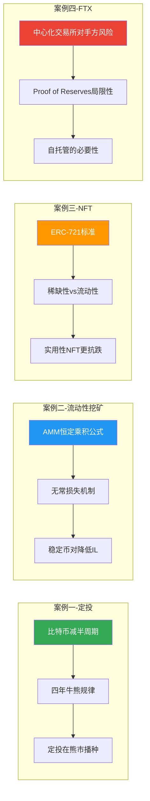
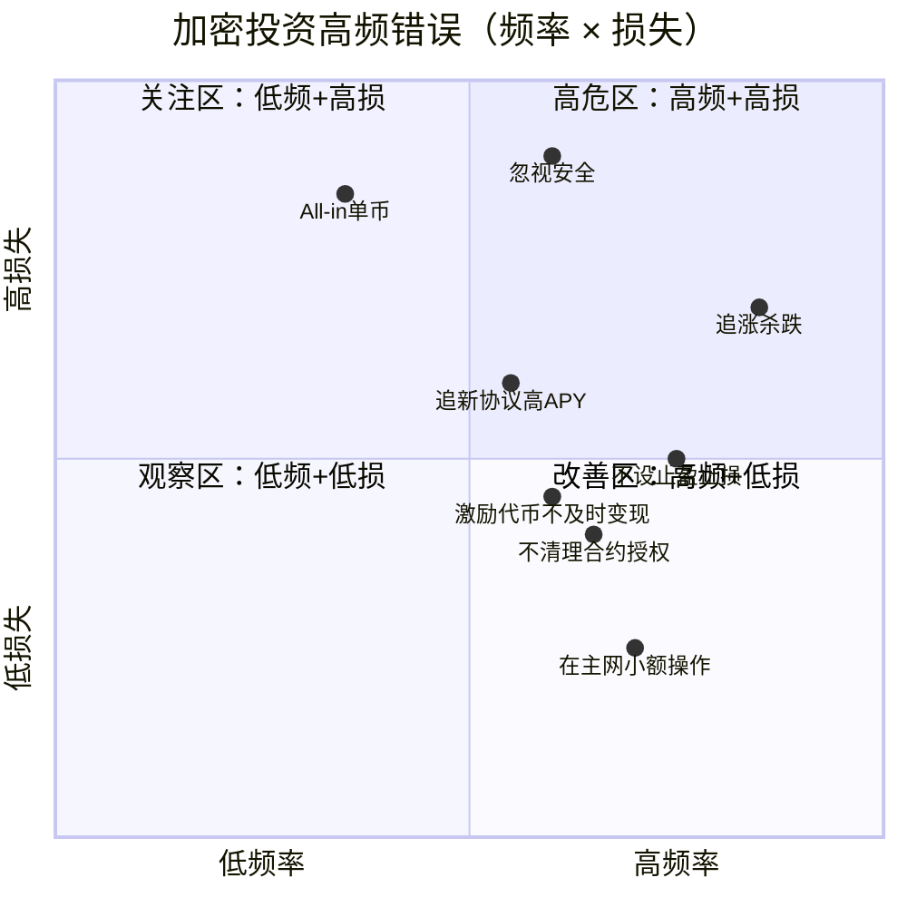

## 案例总结与启示

前八个案例涵盖了加密货币投资中最典型的场景——从最保守的定投策略到最惊心动魄的交易所崩盘，从流动性挖矿的实操细节到DeFi协议被黑后的危机应对。每一个案例都不是孤立的故事，而是加密市场运作规律的切片。本节将这八个案例横向对比、纵向深挖，提炼出贯穿所有案例的核心规律、决策框架和行动原则。

### 九大案例全景回顾

在进入深度分析之前，先用一张表回顾八个案例的核心要素：

| 序号 | 案例名称 | 核心策略 | 最终结果 | 关键转折点 |
|:----:|----------|----------|----------|------------|
| 1 | 比特币定投 | 定时定额买入BTC | 长期正收益 | 2022年暴跌中坚持定投 vs 恐慌卖出 |
| 2 | DeFi流动性挖矿 | 稳定币对+Layer2 | 年化约26.5% | 从主网迁移到L2，Gas费降低90% |
| 3 | NFT投资 | 稀缺性+社区判断 | 成败参半 | 流动性枯竭时无法变现，纸面财富归零 |
| 4 | FTX崩盘 | 交易所信任 | 资产全部冻结 | 中心化交易所的对手方风险爆发 |
| 5 | DeFi协议被黑 | 高收益协议参与 | 部分资金损失 | 合约漏洞被利用，资金在数分钟内被转走 |
| 6 | 普通人参与方式 | 多元化路径探索 | 因方式而异 | 认识到"参与"不等于"炒币" |
| 7 | 矿工转型 | 从挖矿到多元布局 | 收入结构改善 | 算力竞争加剧迫使业务转型 |
| 8 | 安全事件应对 | 危机管理与恢复 | 部分追回资金 | 快速响应和社区协作是关键 |

### 案例间的底层逻辑：五个核心主题

将八个案例拆解后，所有成功和失败都围绕以下五个核心主题展开：

```mermaid
graph TD
    A[八大案例的五个核心主题] --> B[安全是底线]
    A --> C[认知决定收益上限]
    A --> D[纪律比策略更重要]
    A --> E[风险管理和收益追求的平衡]
    A --> F[持续适应市场变化]

    B --> B1[FTX崩盘：中心化信任的代价]
    B --> B2[DeFi被黑：智能合约风险]
    B --> B3[安全事件应对：快速反应能力]

    C --> C1[定投：理解周期的价值]
    C --> C2[流动性挖矿：理解AMM和无常损失]
    C --> C3[NFT：区分价值和投机]

    D --> D1[定投：暴跌中坚持纪律]
    D --> D2[流动性挖矿：及时卖出激励代币]
    D --> D3[仓位管理：永远留有子弹]

    E --> E1[稳定币对 vs 高收益池]
    E --> E2[冷钱包 vs 热钱包]
    E --> E3[集中化 vs 去中心化]

    F --> F1[矿工转型：适应算力竞争]
    F --> F2[L2迁移：适应Gas费变化]
    F --> F3[普通人参与：找到适合自己的路径]

    style A fill:#1a73e8,color:#fff
    style B fill:#ea4335,color:#fff
    style C fill:#34a853,color:#fff
    style D fill:#fbbc04,color:#000
    style E fill:#ff6d01,color:#fff
    style F fill:#7b1fa2,color:#fff
```



#### 主题一：安全是底线，不是加分项

FTX崩盘（案例四）和DeFi协议被黑（案例五）是两个最惨痛的教训。它们的共同点是：**参与者在追求收益的过程中，低估了安全风险的毁灭性。**

FTX用户的资产在一夜之间被冻结，至今仍有大量用户未获得全额赔付。DeFi协议被黑的案例中，资金在几分钟内通过跨链桥被转移到多个链上，追回的可能性微乎其微。安全事件应对案例（案例八）告诉我们，即使反应迅速、社区协作，能追回的资金也往往只是损失的一小部分。

**安全问题的残酷之处在于它的不对称性**：你做对了99次安全操作不会获得额外回报，但做错1次可能损失全部本金。这意味着安全不是"做了就好"的一次性任务，而是需要反复检查、持续维护的行为习惯。

从案例中提炼的安全原则：

| 原则 | 来源案例 | 具体行动 |
|------|----------|----------|
| 不是你的私钥，就不是你的币 | FTX崩盘 | 长期资产存冷钱包，交易所只放交易资金 |
| 审计不等于安全 | DeFi被黑 | 查审计报告+运行时间+TVL规模+团队背景 |
| 分散是生存的基础 | 全部案例 | 单一平台/协议敞口不超过总资产40% |
| 快速反应能力需要提前准备 | 安全事件应对 | 提前了解紧急操作流程，关注安全预警账号 |
| 安全习惯比安全知识更重要 | 全部案例 | 每次操作前检查合约地址、定期清理授权 |

#### 主题二：认知水平决定收益天花板

比特币定投案例（案例一）的核心启示是：理解周期的人能在暴跌中坚持甚至加仓，不理解的人在底部割肉离场。流动性挖矿案例（案例二）的核心启示是：理解AMM机制和无常损失的人选择稳定币对稳健获利，不理解的人冲进高APY池子被无常损失吞噬收益。NFT案例（案例三）的核心启示是：能区分"有实用价值的NFT"和"纯投机NFT"的人控制了损失，不能区分的人把"纸面财富"当成了真金白银。

**认知不是一次性的学习成果，而是需要持续更新的动态知识体系。** 加密市场每隔6-12个月就会出现新的叙事和技术范式（从DeFi Summer到NFT狂潮到Layer2爆发到AI+Crypto），停留在旧认知中的人会被市场淘汰。

各案例涉及的核心认知点：



#### 主题三：纪律比策略更重要

八个案例中，几乎每一个成功案例都归功于纪律性执行，每一个失败案例都可以追溯到纪律的松懈。

定投案例中，2022年比特币从69,000美元跌至15,000美元，严格执行定投计划的人在2024年获得了丰厚回报，而在恐慌中停止定投甚至卖出的人错过了底部筹码。流动性挖矿案例中，张工严格按照"激励代币每周卖出70%"的纪律执行，避免了GRAIL暴跌57%时的大部分损失——但剩余30%的持仓仍然亏了340元，说明纪律还需要更果断。

**纪律之所以难以执行，是因为它经常与直觉相悖：**

| 场景 | 直觉反应 | 纪律要求 | 来源案例 |
|------|----------|----------|----------|
| 暴跌50% | 恐慌卖出止损 | 继续定投甚至加仓 | 案例一 |
| 新协议APY 1000% | 冲进去赚快钱 | 只用经过审计的成熟协议 | 案例二、五 |
| NFT翻倍 | 加仓或持有等更高 | 设定止盈点果断卖出 | 案例三 |
| 交易所传出负面消息 | 可能没事，再等等 | 立即提取所有资产到自托管钱包 | 案例四 |
| 协议疑似被黑 | 观望确认再行动 | 立即撤出资金，宁可多付Gas | 案例五、八 |
| 挖矿代币免费获得 | 留着等涨 | 及时变现，免费≠无风险 | 案例二 |

#### 主题四：风险管理和收益追求的永恒博弈

加密市场的本质特征是**高波动、高收益、高风险三位一体**。不可能只享受高收益而回避高风险——任何声称能做到这一点的产品，几乎都是骗局。

案例中的风险管理实践：

**层次化风险配置**（来自案例一和案例二的综合）：

| 层次 | 占比 | 风险等级 | 策略 | 预期年化 |
|------|------|----------|------|----------|
| 安全垫 | 40%-50% | 极低 | 冷钱包持有BTC/ETH + 稳定币存款 | 3%-8% |
| 核心仓位 | 30%-40% | 低-中 | 成熟DeFi协议稳定币对挖矿 | 8%-20% |
| 进取仓位 | 10%-20% | 中-高 | ETH相关对、Layer2新协议 | 15%-40% |
| 试错资金 | 5%-10% | 高 | 新协议、新叙事探索 | 不设预期，允许全部亏损 |

**止损机制**（来自案例三、五的教训）：

- 单一资产亏损超过30%触发复审（不是机械止损，而是重新评估投资逻辑是否变化）
- 单一协议TVL下降超过50%考虑撤出
- 合约被利用的消息出现后15分钟内撤出资金（不论真假，先撤再查）
- 每月底检查所有持仓，卖出"说不清楚为什么要持有"的资产

#### 主题五：市场在变，适应能力是生存之本

矿工转型案例（案例七）是最直观的例证：当算力竞争加剧、挖矿利润被压缩时，固守旧模式的矿工被淘汰，及时转型（转向质押、DeFi参与、算力服务等）的矿工生存下来并找到了新的增长点。

流动性挖矿案例中，张工从以太坊主网迁移到Arbitrum，也是对市场变化的主动适应——Layer2的成熟让小资金投资者也能参与DeFi而不被Gas费吞噬收益。

**适应能力的核心是保持学习的习惯和改变的勇气：**

- **技术层面**：关注新链、新协议、新工具的发展，但不盲目追逐
- **策略层面**：定期回顾和调整投资策略，市场环境变了策略也要变
- **认知层面**：承认自己的认知局限，愿意在新证据面前改变观点
- **行为层面**：不因为"一直这么做"就拒绝改变，过去的成功策略可能在未来失效

### 从案例中提炼的决策框架

基于八个案例的正反面经验，我们可以构建一个加密货币投资的决策框架。这个框架不是"保证赚钱的公式"——这样的公式不存在——而是一个帮助你在面对具体决策时减少情绪化、增加系统性的思考工具。

#### 入场决策检查清单

在投入任何资金之前，逐项检查：

```text
入场决策检查清单
├── 认知准备
│   ├── □ 我能用自己的话解释这个投资标的的基本原理吗？
│   ├── □ 我了解这个标的的主要风险（不是只看收益）吗？
│   ├── □ 我知道在什么条件下应该退出吗？
│   └── □ 我的信息来源是否多元（不只是某个人或某个群推荐）？
├── 资金准备
│   ├── □ 这笔钱亏完不会影响我的正常生活吗？
│   ├── □ 这笔钱不是借来的吗？
│   ├── □ 我的总资产中加密货币占比合理吗（建议<20%）？
│   └── □ 我有足够的应急储备金（不包含这笔投资）吗？
├── 安全准备
│   ├── □ 我使用的平台/协议经过审计且运行时间超过6个月吗？
│   ├── □ 我的钱包安全措施到位（助记词备份、硬件钱包等）吗？
│   ├── □ 我知道如何在紧急情况下快速撤出资金吗？
│   └── □ 我了解这个平台/协议出现安全事件后的应对流程吗？
└── 心理准备
    ├── □ 如果明天这笔投资跌50%，我能保持冷静吗？
    ├── □ 我有没有被FOMO情绪驱动（别人赚钱了我也要快点上车）？
    └── □ 我能承受最坏的情况（全部亏损）吗？
```

如果以上任何一项的答案是"否"或"不确定"，暂停入场，先解决这个问题。

#### 持仓期间的监控框架

入场之后，持续监控是避免"温水煮青蛙"式损失的关键：

| 监控频率 | 监控内容 | 行动标准 | 对应案例教训 |
|----------|----------|----------|-------------|
| 每日 | 头寸状态、价格是否在预设区间 | 偏离设定区间超过20%触发复审 | 案例二：V3头寸脱出区间导致零收益 |
| 每周 | 激励代币收益、Gas费消耗、合约授权 | 激励代币及时变现，清理无用授权 | 案例二：GRAIL暴跌导致持仓亏损 |
| 每月 | 各持仓的收益/风险比、整体仓位分布 | 单一持仓超过40%时再平衡 | 全部案例：分散是生存基础 |
| 每季度 | 投资策略有效性、市场环境变化 | 策略连续两季度跑输基准时调整 | 案例七：矿工因市场变化被迫转型 |
| 紧急 | 安全预警、合约异常、平台负面消息 | 15分钟内评估，必要时立即撤出 | 案例四、五：安全事件的窗口期极短 |

#### 退出决策矩阵

何时卖出/撤出是投资中最难的决策之一。以下矩阵帮助你系统化地思考退出时机：

| 退出类型 | 触发条件 | 行动方式 | 紧急程度 |
|----------|----------|----------|----------|
| 止盈退出 | 收益达到预设目标（如+100%） | 分批卖出，先回收本金 | 中——可以等合适时机 |
| 止损退出 | 亏损达到预设上限（如-30%）或投资逻辑被证伪 | 立即全部卖出 | 高——不要心存侥幸 |
| 安全退出 | 协议疑似被黑、交易所传出负面消息 | 立即撤出到自托管钱包 | 极高——15分钟内行动 |
| 策略退出 | 市场环境变化导致原策略失效 | 有计划地分批撤出 | 中——给自己1-2周调整 |
| 机会成本退出 | 发现明显更好的投资机会 | 卖出旧仓位，转入新机会 | 低——确保新机会经过充分研究 |

### 八大案例中的高频错误

将所有案例中的错误汇总，按照"出现频率×损失程度"排序：



**第一梯队错误（高频+高损）——必须避免：**

1. **追涨杀跌**：2021年牛市高点入场的投资者中超过80%在2022年亏损离场。解决方法：制定入场计划（定投或分批建仓），不因市场情绪改变计划。

2. **忽视安全基础**：不备份助记词、使用弱密码、在不安全网络下操作。每年因安全疏忽损失的资产达数十亿美元。解决方法：参照安全防护清单，逐项检查。

3. **追新协议高APY**：看到1000% APY就冲进去，不评估合约安全性。新协议的高APY来自代币通胀和风险溢价，一旦被黑损失远超收益。解决方法：只使用运行6个月以上、经过至少两次审计的协议。

**第二梯队错误（出现频率较高或损失较大）——需要警惕：**

4. **All-in单一标的**：把所有资金押在比特币、以太坊或某个山寨币上。LUNA的持有者是这个错误的极端案例——市值400亿美元的项目几天内归零。解决方法：遵循层次化风险配置框架。

5. **不设止盈止损**：只知道买入不知道卖出。很多人在2021年比特币涨到6万美元时账面浮盈数倍，但没有止盈计划，最终在2022年跌回原点甚至亏损。解决方法：入场时同时设定退出条件。

6. **激励代币不及时变现**：把"免费获得"的挖矿代币当免费午餐，不理解代币通胀机制。案例二中GRAIL两周暴跌57%。解决方法：制定激励代币的卖出计划并严格执行。

7. **不清理合约授权**：DeFi交互中授权过多的合约权限，成为黑客攻击的入口。解决方法：每周用Revoke.cash检查并清理不必要的授权。

### 不同投资风格的案例启示对照

不同类型的投资者能从案例中学到不同的教训：

| 投资风格 | 最相关的案例 | 核心启示 | 行动建议 |
|----------|-------------|----------|----------|
| 保守型（求稳） | 案例一（定投）、案例二（稳定币挖矿） | 时间和纪律是保守策略最好的朋友 | BTC/ETH定投 + 稳定币对DeFi，年化15%-25%足够 |
| 进取型（求增长） | 案例二（流动性挖矿）、案例六（多元参与） | 高收益需要高认知和高纪律支撑 | 成熟DeFi协议 + Layer2生态探索，严格风控 |
| 技术型（开发背景） | 案例七（矿工转型）、案例六（多元参与） | 技术优势可以转化为独特的收益来源 | 节点运营、协议开发、链上数据分析服务 |
| 被动型（不想花太多时间） | 案例一（定投） | 最简单的策略往往是最有效的 | 定投BTC/ETH，每月15分钟操作 |
| 主动型（愿意深度参与） | 案例二（流动性挖矿）、案例五（DeFi风险） | 深度参与意味着深度风险管理 | DeFi全流程操作，建立安全检查体系 |

### 案例对新手的行动指南

如果你是第一次接触加密货币投资，八个案例可以浓缩为以下行动步骤：

**第一步：安全先行（第1周）**

1. 购买一个硬件钱包（Ledger或Trezor），预算约500-1000元
2. 在可靠的中心化交易所（如OKX、Binance）完成KYC注册
3. 创建MetaMask热钱包，备份助记词到物理介质（不要截图、不要云存储）
4. 了解基本安全规则：不点陌生链接、不告诉任何人助记词、操作前核对合约地址

**第二步：小额试水（第2-4周）**

1. 投入你能完全承受亏损的金额（建议500-2000元）
2. 完成第一笔购买（建议从BTC或ETH开始）
3. 将资产从交易所提现到自己的钱包，体验一次完整的链上转账
4. 记录每一步操作和感受——这是你投资日志的第一页

**第三步：建立认知（第5-8周）**

1. 学习本章理论基础部分，重点理解区块链原理和DeFi机制
2. 在测试网（如Sepolia）上体验DeFi操作，零成本积累经验
3. 开始关注链上数据平台（DefiLlama、Dune），培养数据感
4. 不急于加大投入——认知不到位时投入越多风险越大

**第四步：制定计划（第9-12周）**

1. 根据自己的风险偏好选择投资风格
2. 制定定投计划（标的、金额、频率）并写下来
3. 设定止盈止损条件并写下来
4. 建立安全检查清单并打印出来

**第五步：执行与复盘（持续）**

1. 严格执行计划，不因短期波动改变策略
2. 每月回顾一次投资日志，检查是否有情绪化决策
3. 每季度评估一次策略有效性
4. 持续学习，关注市场变化但不追逐热点

### 案例揭示的市场规律

跨越八个案例，我们可以总结出几条加密市场的底层规律：

**规律一：周期是加密市场最大的确定性**

比特币减半周期（约四年一次）与牛熊交替高度相关。2012年减半→2013年牛市，2016年减半→2017年牛市，2020年减半→2021年牛市，2024年减半→后续牛市预期。定投案例的核心逻辑就是利用这个规律——在熊市播种，等牛市收获。

但规律不等于保证。每一轮周期的驱动力不同，持续时间和幅度也不同。刻舟求剑式的"四年一定涨"是危险的，理解周期背后的逻辑（供给减少+需求增长+流动性环境）比记忆历史数据更重要。

**规律二：去中心化程度和安全性往往成正比，但和易用性成反比**

FTX崩盘证明了中心化平台的风险，但完全去中心化的操作门槛又劝退了大多数人。现实中的最优解是在这个光谱上找到适合自己的位置：

| 位置 | 代表 | 安全性 | 易用性 | 适合人群 |
|------|------|--------|--------|----------|
| 完全中心化 | CEX现货交易 | 低（对手方风险） | 高 | 入门者（小资金试水） |
| 中心化+自托管 | CEX购买→提到冷钱包 | 中 | 中 | 大多数投资者 |
| 去中心化为主 | DEX交易+自托管 | 高 | 低 | 有经验的投资者 |
| 完全去中心化 | 自建节点+硬件签名 | 最高 | 最低 | 极客/大资金持有者 |

**规律三：信息不对称是散户最大的敌人**

机构投资者拥有链上分析团队、项目方早期接触渠道、量化交易系统，散户在信息获取上天然处于劣势。但散户也有机构不具备的优势——灵活性（可以快速进出，不受基金锁定期限制）和选择权（可以只参与自己真正理解的项目，不被业绩压力驱动冒险）。

散户的信息策略应该是：**不追求比机构更早获取信息，而是追求比其他散户更理性地解读信息。** 关注链上数据而非社交媒体喊单，关注项目基本面而非价格短期波动，关注长期趋势而非短期叙事。

### 从"知道"到"做到"的差距

八个案例最大的启示或许是：**在加密货币投资中，"知道"和"做到"之间的差距比任何其他领域都大。**

每个人都知道"低买高卖"，但90%的人实际做的是"高买低卖"。每个人都知道"不要All-in"，但牛市中总有大量人满仓甚至加杠杆。每个人都知道"安全第一"，但很多人连助记词都没有备份。

这个差距的根源不是知识不足，而是人性弱点——贪婪、恐惧、从众、过度自信。克服这些弱点不是靠读更多文章，而是靠建立系统化的决策机制（本节提供的检查清单和决策矩阵），并通过实际操作不断强化纪律性。

最后一个忠告来自所有案例的共同结论：**在加密市场中，活下来比赚大钱更重要。** 保护好本金，你永远有机会等到下一个牛市。但如果本金没了，所有的机会都与你无关。
