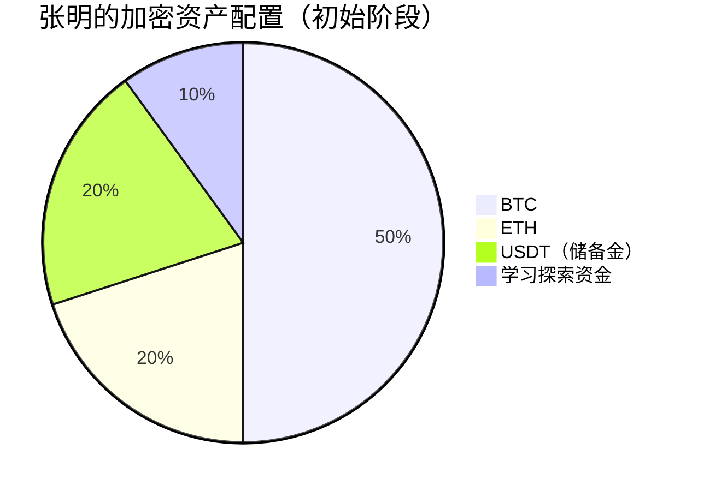
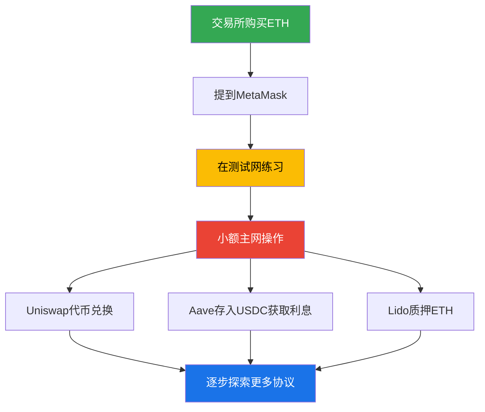
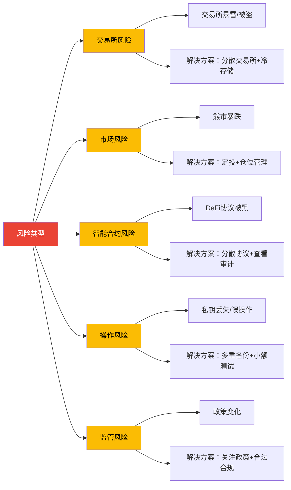
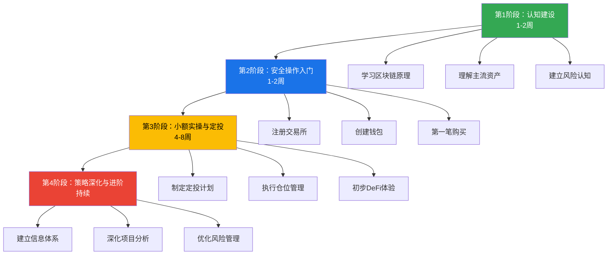

## 案例九：普通人参与加密货币的实用指南

### 案例定位

本案例是全章实战案例的收官之作。前面八个案例分别展示了定投、流动性挖矿、NFT投资、交易所暴雷、DeFi协议被黑、参与方式对比、矿工转型、安全事件应对等具体场景。本案例的核心使命不同——**它是整合性、可执行的行动手册**，把前面所有知识串联成一条从零到有的完整路径，让一个完全没有接触过加密货币的普通人，能够安全、理性、有节奏地参与加密货币市场。

这不是一个"暴富故事"，而是一个"不亏钱、慢慢学、稳步前进"的系统方法。

### 案例主角画像

**人物设定：** 张明，30岁，二线城市互联网公司产品经理，月薪15000元，有一定储蓄习惯（每月能存3000-5000元），听说过比特币但从未参与过任何加密货币投资。对区块链技术一无所知，但有基本的手机/电脑操作能力，使用过支付宝、微信支付等数字支付工具。

**核心诉求：** "我想了解一下加密货币，但不想赌博，不想亏大钱，有没有一种安全、理性的方式让我慢慢参与？"

**约束条件：**

- 没有技术背景，不懂编程
- 可投入的闲置资金有限（初始预算10000元）
- 工作时间固定，没有精力盯盘
- 风险偏好中低，能接受短期20%-30%的浮亏，但不能接受归零

### 第一阶段：认知建设（第1-2周）

#### 1.1 理解"为什么要参与"和"为什么不能盲目参与"

在做任何操作之前，张明需要先回答两个根本问题：

**为什么要参与？** 加密货币是过去15年增长最快的资产类别之一。比特币从2009年的几乎零价值涨到2025年的数万美元，年化收益率远超股票、房地产和黄金。更重要的是，区块链技术正在重塑金融基础设施——跨境支付、去中心化借贷、数字身份等领域都在发生深刻变革。即使你选择不投资，了解这个领域也能提升你的数字素养。

**为什么不能盲目参与？** 2022年LUNA/UST崩盘，市值400亿美元的项目几天内归零。FTX交易所暴雷，用户数十亿美元资产一夜蒸发。每年数百个DeFi协议遭黑客攻击。**加密市场的风险不亚于其收益，不了解就参与等于裸奔。**

张明的认知建设路径：

```text
第1天：阅读区块链技术原理（理解去中心化、哈希、共识机制等基础概念）
第2天：阅读主流加密资产分析（理解BTC、ETH的价值逻辑和差异）
第3天：阅读交易所基础设施（理解CEX和DEX的区别、"不是你的私钥就不是你的币"）
第4天：阅读DeFi理论基础（理解AMM、借贷协议、稳定币的基本机制）
第5天：阅读安全存储技术（理解热钱包/冷钱包、助记词、私钥管理）
第6-7天：浏览常见误区章节，建立风险清单
```

#### 1.2 关键认知框架

张明在这个阶段需要建立的五个核心认知：

| 认知编号 | 核心认知 | 常见错误理解 | 正确理解 |
|:--------:|----------|-------------|----------|
| C1 | 加密货币不是股票 | 买币就是投资公司 | 加密货币是网络协议的价值载体，其价值来自网络效应和实用性 |
| C2 | 波动是常态 | 暴跌说明市场要崩盘 | 加密市场80%以上的回调发生过多次，长期持有者需要接受高波动 |
| C3 | 安全重于收益 | 先赚钱再考虑安全 | 安全是前提条件，私钥丢失=资产永久丢失，无法找回 |
| C4 | 没有稳赚不赔 | 这个项目保证收益 | 任何承诺保本保收益的项目都是骗局，无一例外 |
| C5 | 监管因地区而异 | 加密货币全球合法 | 不同国家政策差异巨大，中国大陆目前禁止加密货币交易和挖矿 |

#### 1.3 工具准备清单

| 工具类别 | 推荐选择 | 用途 | 注意事项 |
|---------|---------|------|---------|
| 交易所（CEX） | Binance、OKX、Coinbase | 法币入金、现货交易 | 选择头部交易所，完成KYC，开启所有安全设置 |
| 钱包 | MetaMask（浏览器插件）、Trust Wallet（手机） | 存储代币、交互DeFi | 助记词必须手写备份到物理介质，绝不截图或云存储 |
| 硬件钱包 | Ledger Nano S Plus / Trezor Model One | 冷存储大额资产 | 只从官方网站购买，不接受二手 |
| 链上数据 | CoinGecko、CoinMarketCap | 查看币价、市值、交易量 | 免费版本已足够入门使用 |
| 学习资源 | 本章理论基础篇 + 核心技巧篇 | 系统学习 | 不要只看社交媒体上的"喊单"内容 |

### 第二阶段：安全操作入门（第3-4周）

#### 2.1 注册交易所并完成KYC

KYC（Know Your Customer，了解你的客户）是正规交易所的身份验证流程。这是合规要求，也是保护用户资金安全的基础。

**操作步骤：**

1. **选择交易所**：根据你所在地区选择合规的交易所。中国用户常用Binance、OKX（需使用海外版本）；美国用户可选Coinbase、Kraken；欧洲用户可选Bitstamp、Kraken
2. **注册账户**：使用真实邮箱和手机号注册，设置强密码（推荐使用密码管理器生成20位以上随机密码）
3. **完成KYC**：提交身份证件（护照/身份证）和人脸识别验证。通常1-3个工作日内审核完成
4. **开启安全设置**：
   - 启用两步验证（2FA），推荐使用Google Authenticator或Authy，**不要使用短信验证**（短信可能被SIM卡劫持攻击）
   - 设置提现白名单（只允许提现到你预先设定的地址）
   - 开启登录IP变动通知
   - 绑定反钓鱼码（交易所发给你的邮件会包含你设定的专属码）

**安全检查清单：**

- [ ] 密码强度≥20位，包含大小写字母、数字和特殊符号
- [ ] 2FA已启用（使用Authenticator App，非短信）
- [ ] 提现白名单已设置
- [ ] 登录通知已开启
- [ ] 反钓鱼码已设置
- [ ] API Key未创建（除非你明确需要）

#### 2.2 创建和备份钱包

钱包是加密货币世界的"银行账户"，但与银行账户有一个根本区别：**没有任何客服可以帮助你找回密码（助记词）**。丢失助记词=永久丢失资产。

**热钱包创建流程（以MetaMask为例）：**

1. 从官方网站（metamask.io）下载浏览器插件或手机App。**注意：只从官方网站下载，不要搜索下载，搜索结果中可能存在钓鱼软件**
2. 创建新钱包，设置钱包密码（这是本地登录密码，不是助记词）
3. 系统生成12个英文单词的助记词（Seed Phrase）
4. **备份助记词**：按顺序手写到纸上（不要截图、不要拍照、不要存在任何电子设备上），存放在安全的地方
5. 系统会要求你按顺序重新输入助记词，确认备份正确

**助记词备份的铁律：**

```text
1. 手写到纸上，至少两份，存放在不同物理位置
2. 绝不截图、绝不用手机拍照、绝不存储在云盘/邮箱/笔记软件
3. 绝不告诉任何人你的助记词（包括"客服""技术支持"）
4. 考虑使用金属助记词板（防火防水），用于长期存储
5. 定期检查备份是否完好可读
```

**冷钱包创建流程（以Ledger为例）：**

1. 只从官方网站（ledger.com）购买硬件钱包，绝不购买二手设备
2. 开箱后检查包装是否完好，设备是否为全新状态
3. 按照设备说明书初始化，设置PIN码（4-8位数字）
4. 设备生成24个英文单词的助记词，按顺序手写备份
5. 在Ledger Live应用中安装对应的区块链应用（如Bitcoin App、Ethereum App）
6. 创建账户，将少量代币转入测试，确认能正常收款和转账

#### 2.3 第一笔加密货币购买

以通过中心化交易所购买比特币为例：

**步骤一：法币入金**

- 在交易所的"法币交易"或"快捷买币"页面，使用银行卡/支付宝等方式购买USDT（与美元1:1锚定的稳定币）
- 首次购买建议金额：500-1000元（试水，不要一上来就大额投入）
- 入金到账时间：通常即时到几分钟

**步骤二：现货交易**

- 在交易所的"现货交易"页面，搜索BTC/USDT交易对
- 选择"限价单"（指定价格买入）或"市价单"（按当前最优价格立即成交）
- 输入购买金额，确认交易

**步骤三：提币到个人钱包**

- 在交易所的"提现"页面，输入你的钱包地址（从MetaMask复制以太坊地址，或从Ledger复制比特币地址）
- **首次提币先小额测试**：先转一笔小额（如等值100元），确认到账后再转大额
- 确认网络类型：以太坊代币选ERC-20，比特币选Bitcoin网络，BSC链代币选BEP-20。**网络选错=资产丢失**
- 等待区块链确认（通常10-30分钟）

**第一笔购买的完整记录模板：**

| 记录项 | 填写内容 |
|-------|---------|
| 购买日期 | 2026-06-25 |
| 购买币种 | BTC |
| 购买金额 | 1000 USDT |
| 买入价格 | $67,500/BTC |
| 购买数量 | 0.0148 BTC |
| 购买平台 | Binance |
| 存储位置 | Ledger Nano S Plus |
| 钱包地址 | bc1q...（记录前6位即可） |
| 交易哈希 | 0xabc...（可在区块链浏览器查询） |

### 第三阶段：小额实操与定投启动（第5-8周）

#### 3.1 制定定投计划

定投（Dollar-Cost Averaging，DCA）是历史数据证明最适合普通人的加密货币投资策略。其核心逻辑是：**通过固定时间、固定金额的买入，平滑价格波动，降低择时风险。**

**张明的定投计划：**

| 参数 | 设定值 | 设定理由 |
|------|-------|---------|
| 月投资金额 | 1000元 | 约为月收入的6.7%，不影响日常生活 |
| 定投频率 | 每周250元（每周一） | 周投比月投更能平滑短期波动 |
| 投资标的 | BTC 70% + ETH 30% | 以主流资产为主，降低风险 |
| 定投平台 | Binance/OKX | 头部交易所，支持自动定投功能 |
| 存储策略 | 每积累5000元就提到Ledger | 减少交易所存币量，降低交易所风险 |
| 止盈规则 | 整体盈利100%时卖出50% | 锁定利润，保留上涨空间 |
| 止损规则 | 不设固定止损（定投策略本身不需要） | 定投依靠时间换空间，下跌反而是低价买入的机会 |
| 投资周期 | 至少坚持12个月（跨过一个完整市场周期） | 短期定投效果有限，长期才能体现策略优势 |

#### 3.2 定投的数学逻辑

为什么定投优于一次性投入？用具体数字说明：

假设张明每月定投1000元购买BTC，持续12个月：

| 月份 | BTC价格 | 投入金额 | 购买数量 | 累计投入 | 累计持有 | 持仓价值 |
|:----:|--------:|---------:|---------:|---------:|---------:|---------:|
| 1 | 70,000 | 1,000 | 0.0143 | 1,000 | 0.0143 | 1,001 |
| 2 | 55,000 | 1,000 | 0.0182 | 2,000 | 0.0325 | 1,788 |
| 3 | 40,000 | 1,000 | 0.0250 | 3,000 | 0.0575 | 2,300 |
| 4 | 35,000 | 1,000 | 0.0286 | 4,000 | 0.0861 | 3,014 |
| 5 | 30,000 | 1,000 | 0.0333 | 5,000 | 0.1194 | 3,582 |
| 6 | 28,000 | 1,000 | 0.0357 | 6,000 | 0.1551 | 4,343 |
| 7 | 32,000 | 1,000 | 0.0313 | 7,000 | 0.1864 | 5,965 |
| 8 | 38,000 | 1,000 | 0.0263 | 8,000 | 0.2127 | 8,083 |
| 9 | 45,000 | 1,000 | 0.0222 | 9,000 | 0.2349 | 10,571 |
| 10 | 52,000 | 1,000 | 0.0192 | 10,000 | 0.2541 | 13,213 |
| 11 | 60,000 | 1,000 | 0.0167 | 11,000 | 0.2708 | 16,248 |
| 12 | 65,000 | 1,000 | 0.0154 | 12,000 | 0.2862 | 18,603 |

**分析：** 如果张明在第1个月一次性投入12000元买入BTC（价格70000），他只能买到0.1714个BTC。而通过定投，他在价格低迷时买入更多份额（第5-6个月低价时买的数量是第1个月的2倍以上），最终持有0.2862个BTC，持仓价值18603元，收益率55%。

**关键洞见：** 定投在下跌行情中表现尤其出色——价格越低，同样的金额能买到更多代币。这正是定投的核心优势：**恐惧别人所恐惧的，把下跌变成低成本建仓的机会。**

#### 3.3 仓位管理原则

张明初始预算10000元，加上每月定投1000元，需要建立清晰的仓位管理规则：



**仓位管理的五条铁律：**

1. **核心仓位（BTC+ETH）占总资产70%以上**：主流资产波动相对可控，长期看有基本面支撑
2. **储备金不低于总资产20%**：留有"子弹"，在极端行情（如暴跌50%）时可以加仓
3. **学习探索资金不超过总资产10%**：可以小金额尝试新项目，但绝不影响核心仓位
4. **单一代币仓位不超过总资产50%**：即使是BTC，也不要All in
5. **总资产中加密货币配置不超过个人可投资资产的30%**：保持整体资产配置的平衡

#### 3.4 DeFi初步体验

在中心化交易所操作熟练后（约第6-8周），张明可以尝试DeFi操作。**注意：DeFi操作必须先在测试网上练习。**

**推荐的DeFi入门路径：**



**第一次DeFi操作（以Uniswap兑换为例）：**

1. 在MetaMask中连接以太坊主网
2. 访问Uniswap官网（app.uniswap.org），确认域名正确
3. 点击"Connect Wallet"连接MetaMask
4. 选择要兑换的代币对（如ETH → USDC）
5. 输入兑换金额，查看预计获得的数量和滑点
6. 首次使用某代币需要"Approve"（授权），这需要支付一笔Gas费
7. 确认兑换，等待交易上链
8. **Gas费提醒**：以太坊主网Gas费可能在5-50美元之间波动。如果Gas费过高，可以等待网络不拥堵时操作（通常UTC时间凌晨2-6点Gas费较低），或使用Layer2网络（如Arbitrum、Optimism）降低费用

### 第四阶段：策略深化与进阶（第9周起）

#### 4.1 信息获取体系

加密市场的信息噪声极高，建立高效的信息获取体系至关重要：

**信息分层模型：**

| 层级 | 信息类型 | 来源 | 频率 | 重要性 |
|:----:|---------|------|------|:------:|
| L1 | 宏观政策 | 各国监管公告、央行声明 | 实时 | ★★★★★ |
| L2 | 链上数据 | Glassnode、Dune Analytics、Nansen | 每日 | ★★★★★ |
| L3 | 行业动态 | The Block、CoinDesk、Messari | 每日 | ★★★★ |
| L4 | 项目更新 | 项目官方博客、GitHub、Discord | 每周 | ★★★ |
| L5 | 社区讨论 | Twitter/X、Reddit、Telegram | 每日浏览 | ★★ |
| L6 | 价格图表 | TradingView | 需要时查看 | ★★ |

**每日信息检查清单（15分钟）：**

1. 快速浏览CoinGecko/CoinMarketCap，查看BTC和ETH的24小时涨跌幅和成交量
2. 检查链上数据异常（交易所大额流入流出、巨鲸地址变动）
3. 浏览The Block或CoinDesk的头条新闻
4. 检查自己持仓代币的官方公告

#### 4.2 项目分析实操

当张明想投资一个新项目（如某个DeFi协议的治理代币）时，需要执行以下分析流程：

**项目分析清单：**

| 分析维度 | 检查项 | 评估标准 | 权重 |
|---------|--------|---------|:----:|
| 团队 | 创始人背景、过往经历 | 是否有可验证的行业经验 | 20% |
| 技术 | GitHub活跃度、代码质量、审计报告 | 至少有1家知名审计机构的审计报告 | 20% |
| 代币经济学 | 总量、流通量、解锁计划、通胀率 | 解锁计划是否合理，是否有大量未解锁代币待释放 | 20% |
| 社区 | Discord/Twitter活跃度、开发者参与度 | 真实活跃用户数量（非机器人） | 10% |
| TVL | 协议锁仓量、增长趋势 | TVL是否持续增长，是否有巨鲸集中持仓 | 15% |
| 竞品 | 同赛道项目的市场份额和差异化 | 是否有独特的技术优势或市场定位 | 15% |

**红旗清单（出现任何一项即需高度警惕）：**

- 团队匿名且无过往项目经历
- 承诺固定收益或保本
- 代币总量巨大（万亿级别）且有大量预留给"团队"
- 审计报告来自不知名的小型审计公司
- 社区充斥大量机器人账号
- GitHub代码库空或长期不更新
- 白皮书充满技术术语但缺乏具体技术方案

#### 4.3 风险管理升级

随着持仓和操作的增加，张明需要更精细的风险管理：

**风险矩阵：**



**定期安全检查（每月执行一次）：**

- [ ] 检查交易所账户的登录历史和API Key
- [ ] 审查所有DeFi协议的授权（使用revoke.cash撤销不必要的授权）
- [ ] 确认硬件钱包固件为最新版本
- [ ] 检查助记词备份是否完好
- [ ] 确认2FA绑定设备正常工作
- [ ] 检查邮箱是否收到可疑的钓鱼邮件
- [ ] 更新交易所提现白名单（如有新增钱包地址）

### 模拟实战推演：张明的12个月投资旅程

以下是张明按照上述计划执行12个月后的模拟复盘：

#### 第1-3月：建立基础

| 行动 | 结果 | 心理状态 |
|------|------|---------|
| 完成认知学习 | 理解了区块链基本原理、BTC和ETH的区别、钱包和助记词的重要性 | 从完全陌生到有了基本框架 |
| 注册交易所，完成KYC | Binance账户开通，2FA和提现白名单设置完毕 | 对安全流程有了切身体会 |
| 第一笔购买：500元BTC | 买入时有点紧张，提币到MetaMask时反复确认地址 | 经历了完整的"买入-提币"流程 |
| 启动定投：每周250元 | 8周投入2000元，BTC平均成本低于当时价格 | 对价格波动开始脱敏 |

#### 第4-6月：深入学习

| 行动 | 结果 | 心理状态 |
|------|------|---------|
| 学习DeFi理论，在测试网练习 | 在Goerli测试网上完成了Uniswap兑换、Aave存款 | 操作熟练度大幅提升 |
| 第一次主网DeFi操作 | 用0.01 ETH在Uniswap上换了USDC，Gas费花了$8 | 体验了"去中心化交易"的真实感受 |
| 购买Ledger硬件钱包 | 将所有BTC和ETH提到Ledger冷存储 | 感觉资产安全有了保障 |
| 继续定投 | 累计投入4000元，持仓约0.06 BTC + 0.15 ETH | 开始适应市场波动 |

#### 第7-9月：策略执行

| 行动 | 结果 | 心理状态 |
|------|------|---------|
| 经历一轮20%回调 | BTC从70000跌到56000，浮亏约800元 | 紧张但没有恐慌卖出（认知建设起了作用） |
| 在回调中执行定投 | 低价买入更多BTC，平均成本进一步降低 | 理解了"下跌是定投的朋友" |
| 开始使用Aave存入USDC | 年化约3-5%，收益不高但体验了DeFi借贷协议 | 对DeFi有了实操理解 |
| 阅读链上数据 | 发现交易所BTC净流出持续增加（看涨信号） | 开始建立数据驱动的判断能力 |

#### 第10-12月：总结复盘

| 行动 | 结果 | 心理状态 |
|------|------|---------|
| 完成12个月定投 | 总投入12000元，持仓市值约18000元，收益率50% | 对策略有效性有了信心 |
| 执行止盈规则 | 盈利超过100%目标时卖出50%（实际操作在第11个月部分止盈） | 学会了"该贪心时贪心，该恐惧时恐惧" |
| 编写投资决策日志 | 记录了每一次买入卖出的逻辑和心理状态 | 回看日志发现自己最大的敌人是情绪 |
| 制定下一阶段计划 | 增加DeFi仓位比例，尝试更多协议 | 从"被动学习"转变为"主动探索" |

### 普通人参与加密货币的常见陷阱与避坑指南

#### 陷阱一：信息过载导致行动瘫痪

**症状：** 加密货币领域的信息量巨大，各种术语、项目、策略让人眼花缭乱。很多人在"学习"了几个月后仍然没有做出任何实际行动。

**解决方法：** 采用"最小可行行动"（Minimum Viable Action）原则。不要试图在行动之前掌握所有知识。完成第一阶段认知建设后（约2周），立即执行第一笔小额购买。**在加密货币领域，50%的知识来自书本，50%来自实操。** 不下水永远学不会游泳。

#### 陷阱二：社交媒体的FOMO陷阱

**症状：** 看到别人在Twitter上晒百倍币收益，忍不住把所有资金投进去。2021年大量新手在BTC 69000美元时All in，随后经历75%的暴跌。

**解决方法：** 理解社交媒体的幸存者偏差——你看到的都是赚钱的人，亏钱的人不会出来晒。执行纪律性的定投计划，不受社交媒体情绪影响。**每天检查价格的次数不超过2次。**

#### 陷阱三：把交易所当银行

**症状：** 将所有资产存放在交易所，不做冷存储。FTX暴雷前，无数用户将数百万美元存放在交易所中，一夜之间化为乌有。

**解决方法：** 遵循"交易所只留交易资金"原则。超过你愿意承受损失的金额，必须提到个人钱包（优先硬件钱包）。**记住这条铁律：不是你的私钥，就不是你的币。**

#### 陷阱四：忽视小金额的安全

**症状：** "就几百块钱，放交易所无所谓""就不备份助记词了，反正没多少钱"。当资产增长到几万甚至几十万时，这些习惯已经根深蒂固，改不过来。

**解决方法：** 从第一天起就按照正确流程操作，无论金额大小。好的习惯在小额时养成，大额时才能受益。

#### 陷阱五：追涨杀跌

**症状：** 涨了觉得还会涨（贪婪），跌了觉得还会跌（恐惧）。数据显示，2021年牛市高点入场的投资者中超过80%在2022年亏损离场。

**解决方法：** 定投策略天然规避了这个问题——无论涨跌都买，机械执行。如果你发现自己经常想手动操作，说明你需要减少看盘频率。

#### 陷阱六：盲目参与空投和"撸毛"

**症状：** 看到别人通过交互新协议获得空投（如ARB、OP、STRK等），也盲目去"刷"各种协议。不仅浪费Gas费，还可能遇到钓鱼网站。

**解决方法：** 空投不是"免费午餐"。参与前评估：协议是否可靠？需要多少Gas费成本？是否需要连接主钱包（建议创建专门的空投子钱包）？**绝不为了刷空投而将大量资金转入未经验证的合约。**

### 中国大陆用户的特别注意事项

**法律风险提示：** 中国大陆目前禁止加密货币交易和挖矿。2021年9月，中国人民银行等十部委联合发布《关于进一步防范和处置虚拟货币交易炒作风险的通知》，明确虚拟货币相关业务活动属于非法金融活动。

**对普通个人的影响：**

- 个人持有加密货币本身不违法，但交易和兑换存在法律风险
- 银行卡可能因频繁的加密货币相关交易被冻结（"冻卡"风险）
- 使用VPN访问海外交易所存在合规灰色地带
- 加密货币收益的税务处理尚不明确
- P2P交易（C2C）中可能涉及洗钱风险

**降低风险的建议：**

1. 不要使用工资卡进行加密货币相关交易，使用独立的银行卡
2. 避免频繁的大额法币出入金
3. 保留所有交易记录，以备未来可能的合规要求
4. 密切关注政策变化，保持对监管动态的敏感性
5. **如果政策进一步收紧，要有随时退出的准备和计划**

### 总结：普通人的加密货币参与路线图



**张明12个月的核心收获：**

| 维度 | 起步状态 | 12个月后 |
|------|---------|---------|
| 知识水平 | 完全不了解区块链 | 能解释区块链原理、DeFi机制、代币经济学 |
| 操作能力 | 不会使用钱包 | 熟练使用CEX、DEX、借贷协议、质押 |
| 安全意识 | 不知道助记词是什么 | 完整的安全操作流程，冷存储+2FA+多重备份 |
| 投资纪律 | 无任何策略 | 定投+仓位管理+止盈规则 |
| 风险认知 | "加密货币=赌博" | 理解风险来源，有系统性的风险管理方法 |
| 资产状况 | 初始10000元 | 持仓约18000元，收益率约50% |

**最后的忠告：** 加密货币不是"快钱"的代名词。它是一种需要认真学习、谨慎操作、长期坚持的投资领域。普通人参与加密货币的最实用指南可以浓缩为三句话：

1. **先学后做** —— 不理解的东西不要碰
2. **小步快跑** —— 用小额资金积累经验，不要一上来就All in
3. **纪律为王** —— 定投、仓位管理、安全操作，执行比判断更重要

你不需要成为加密货币专家才能参与这个市场，但你必须成为一个有纪律的参与者。在加密市场中，**活下来比赚大钱更重要**——保护好本金，才有机会等到下一个牛市。
