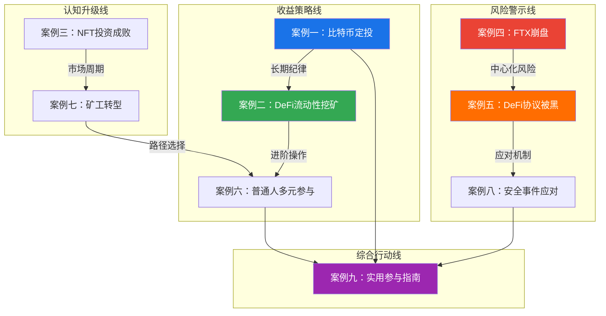

## 最终总结：九个案例背后的统一逻辑

九个案例讲完了。从比特币定投到DeFi流动性挖矿，从NFT的暴涨暴跌到FTX的轰然崩盘，从矿工的艰难转型到普通人的多元参与路径——这些看似独立的故事，背后有一套统一的决策逻辑和风险认知框架。本节不是简单重复前文内容，而是站在更高的视角，将九个案例串联成一个完整的认知体系，帮你建立面对任何加密货币决策时都能调用的"思维操作系统"。

### 一、九个案例的核心图谱



九个案例可以分为三条主线：

| 主线 | 包含案例 | 核心主题 | 给读者的启示 |
|------|----------|----------|--------------|
| **收益策略线** | 案例一、二、六 | 如何在控制风险的前提下获取收益 | 从简单到复杂，逐步提升参与深度 |
| **风险警示线** | 案例四、五、八 | 加密世界有哪些致命风险，如何应对 | 风险认知比收益追求更重要 |
| **认知升级线** | 案例三、七、九 | 市场周期、行业变迁与个人定位 | 理解行业演进，找到适合自己的位置 |

### 二、跨案例的六大核心规律

#### 规律一：安全是所有策略的前提，不是可选项

这条规律贯穿全部九个案例，没有任何例外。

| 案例 | 安全问题 | 后果 | 教训 |
|------|----------|------|------|
| 案例一（定投） | 交易所选择不当 | 资金被冻结或无法提币 | 选合规、有储备证明的交易所 |
| 案例二（流动性挖矿） | 智能合约未审计 | 潜在资金损失风险 | 只用经过多次审计、运行6个月以上的协议 |
| 案例四（FTX崩盘） | 将大量资产放在中心化交易所 | 数十亿美元用户资产无法提取 | 大额资产必须自托管，冷钱包存储 |
| 案例五（DeFi被黑） | 协议合约漏洞 | 流动性池被抽干 | 分散协议敞口，单协议不超40% |
| 案例八（安全事件应对） | 缺乏应急计划 | 错过最佳撤退窗口 | 提前制定应急方案，设置链上监控告警 |

**安全的三层架构：**

```text
第一层：资产安全
├── 冷钱包存储长期资产（Ledger/Trezor）
├── 热钱包仅放操作资金（不超过总资产20%）
├── 助记词物理备份，分散存放
└── 定期清理合约授权（Revoke.cash）

第二层：操作安全
├── 书签访问所有DeFi网站（防钓鱼）
├── 不点击任何社交媒体中的链接
├── 交易前核对合约地址（Etherscan验证）
├── 不在公共WiFi下操作
└── 使用专用浏览器（仅装MetaMask）

第三层：认知安全
├── 理解每个操作的风险再执行
├── 不参与不理解的协议或产品
├── 保持对"高APY"的天然警惕
└── 建立安全检查清单，每次操作前过一遍
```

#### 规律二：收益和风险永远成正比，但可以通过策略优化比值

九个案例中的所有投资行为，都可以放在下面这张风险-收益矩阵中定位：

| 策略 | 典型年化 | 风险等级 | 适用场景 | 代表案例 |
|------|----------|----------|----------|----------|
| 交易所活期理财 | 1%-3% | 极低 | 闲置稳定币存放 | 案例九 |
| 比特币定投 | 历史平均30%-50%/周期 | 低-中 | 长期价值存储 | 案例一 |
| 稳定币流动性挖矿 | 5%-15% | 低 | 稳健被动收入 | 案例二 |
| 主流币对LP | 10%-30% | 中 | 进阶DeFi参与者 | 案例二 |
| NFT投资 | -100%到+1000% | 极高 | 深度了解社区和文化的玩家 | 案例三 |
| 新项目早期参与 | -90%到+10000% | 极高 | 有判断力的行业老手 | 案例五 |
| 矿业投资 | 取决于币价和电费 | 高 | 有资源优势的参与者 | 案例七 |

**核心认知**：不存在"高收益低风险"的策略。如果你看到年化500%的流动性挖矿池，要么是代币激励在快速膨胀（不可持续），要么是合约存在未发现的漏洞（随时归零）。真正聪明的做法是**优化风险收益比**——通过分散、对冲、选择成熟协议，用可接受的风险换取合理的收益。

#### 规律三：纪律性比判断力更重要

回顾九个案例中的成功者和失败者，最大的差异不是"谁更聪明"或"谁消息更灵通"，而是**谁更能执行纪律**。

**定投的纪律**（案例一）：在2022年市场暴跌60%时继续定投的人，到2024年获得了远超平均水平的回报。那些在暴跌时停止定投的人，错过了最低价的筹码。定投的核心不是"选对时机"，而是"不选时机"。

**止损的纪律**（案例三、四）：FTX暴雷前已有信号（Alameda资产负债表泄露），但大多数用户没有预设的止损规则，等到确认暴雷时已经无法提币。设定一条明确的规则——"当交易所出现重大负面消息时，立即提币50%到冷钱包"——比任何事后分析都有用。

**变现的纪律**（案例二）：张工在流动性挖矿中每周卖出激励代币的70%，这个看似"浪费"的策略让他避免了GRAIL暴跌57%时的大部分损失。"免费获得的代币不是真免费"——这是一条用真金白银换来的教训。

**空仓的纪律**：所有案例中都没有提到一个关键能力——**不操作的能力**。当市场处于极端状态（极度贪婪或极度恐惧）时，最好的策略往往是"什么都不做"。频繁操作在加密市场中是最大的隐性成本——每次操作都有Gas费、滑点、情绪消耗。

#### 规律四：认知深度决定收益上限

加密市场的参与者可以分为四层：

| 层级 | 特征 | 典型行为 | 长期结果 |
|------|------|----------|----------|
| **赌徒层** | 听消息买卖，不理解底层逻辑 | 追涨杀跌、All in单一币种、使用高杠杆 | 绝大多数人亏损离场 |
| **散户层** | 有基本认知但缺乏系统方法 | 知道定投但执行不坚定、选交易所不看安全记录 | 小赚小亏，长期跑输大盘 |
| **玩家层** | 理解技术原理和市场机制 | 制定策略并执行、使用DeFi协议、做好安全防护 | 多数能在周期中获利 |
| **猎手层** | 深度理解行业、有信息和资源优势 | 参与早期项目、开发套利策略、构建链上监控体系 | 持续创造超额收益 |

九个案例涵盖了从散户层到玩家层的完整跃迁路径。关键的跃迁节点：

- **散户→玩家**：理解无常损失、学会使用硬件钱包、制定投资策略并坚持执行
- **玩家→猎手**：掌握链上数据分析、理解MEV和套利机制、参与协议治理和社区建设

#### 规律五：市场周期是最大的确定性

加密市场有清晰的四年周期（与比特币减半高度相关），九个案例中的成败几乎都可以用"在周期中的位置"来解释：

| 周期阶段 | 市场特征 | 正确策略 | 错误策略 | 对应案例教训 |
|----------|----------|----------|----------|--------------|
| **积累期**（熊市末期） | 价格低迷，情绪悲观，媒体冷淡 | 定投主流币，布局优质协议 | 恐慌卖出，远离市场 | 案例一：暴跌时坚持定投 |
| **上涨期**（牛市初期） | 价格回升，资金流入，叙事重建 | 持有为主，适度参与DeFi | 过早卖出，频繁换仓 | 案例二：稳定获取LP收益 |
| **狂热期**（牛市顶峰） | 价格暴涨，FOMO情绪，大量新人入场 | 逐步减仓，锁定利润 | 加大投入，追高新项目 | 案例三：NFT在狂热期高位接盘 |
| **崩盘期**（熊市初期） | 价格暴跌，恐慌蔓延，暴雷频发 | 极速撤退，转为现金/稳定币 | "抄底"接飞刀，不设止损 | 案例四：FTX崩盘前未及时提币 |

**一条可执行的规则**：当你的出租车司机、理发师、父母开始问你"怎么买比特币"时，市场大概率接近顶部；当主流媒体标题是"加密货币已死"时，市场大概率接近底部。

#### 规律六：自托管是最终的安全底线

"不是你的私钥，就不是你的币"——这句话在案例四（FTX崩盘）中得到了最残酷的验证。自托管不仅是一种技术选择，更是一种认知立场：

| 存储方式 | 安全性 | 便利性 | 适用场景 | 信任对象 |
|----------|--------|--------|----------|----------|
| 中心化交易所 | 低（依赖交易所信用） | 最高 | 频繁交易的小额资金 | 交易所 |
| 热钱包（MetaMask等） | 中（需防钓鱼和恶意软件） | 高 | DeFi操作资金 | 自己的操作习惯 |
| 硬件钱包（Ledger/Trezor） | 高 | 低 | 长期持有的核心资产 | 自己的物理保管 |
| 多签钱包 | 最高 | 最低 | 大额资金、团队金库 | 多方共识 |

**分层存储方案（推荐）：**

```text
总资产分配：
├── 60% 硬件钱包（长期持有，不频繁操作）
│   ├── BTC 40%
│   └── ETH 20%
├── 20% 热钱包（DeFi操作资金）
│   ├── 稳定币对挖矿 12%
│   └── 其他DeFi操作 8%
├── 10% 合规交易所（交易用途）
│   └── 法币出入金 + 短线交易
└── 10% 冷存储备份（极端情况的安全垫）
    └── 助记词钢板刻录，银行保险箱
```

### 三、从案例到行动：分层决策框架

面对任何加密货币相关决策，用下面的框架逐层过滤：

```mermaid
flowchart TD
    START[收到一个加密货币投资机会] --> Q1{我理解这个资产<br/>的基本面吗？}
    Q1 -->|否| STOP1[不投。先学习。]
    Q1 -->|是| Q2{这个策略的风险<br/>我能承受吗？}
    Q2 -->|否| STOP2[不投。调整仓位或放弃。]
    Q2 -->|是| Q3{我有明确的<br/>退出计划吗？}
    Q3 -->|否| STOP3[先制定止损止盈规则再投。]
    Q3 -->|是| Q4{资金是闲钱吗？<br/>亏完影响生活吗？}
    Q4 -->|否| STOP4[不投。先保证生活安全。]
    Q4 -->|是| Q5{安全措施到位了吗？<br/>钱包/合约/授权？]
    Q5 -->|否| STOP5[先完成安全配置再操作。]
    Q5 -->|是| EXEC[执行投资，记录决策日志]

    style STOP1 fill:#ea4335,color:#fff
    style STOP2 fill:#ea4335,color:#fff
    style STOP3 fill:#ff6d01,color:#fff
    style STOP4 fill:#ea4335,color:#fff
    style STOP5 fill:#ff6d01,color:#fff
    style EXEC fill:#34a853,color:#fff
```

任何一步没有通过，都应该停下来，而不是"先投了再说"。这个框架的价值在于——它把冲动决策变成了流程化决策，大幅降低了犯错概率。

### 四、九类典型错误与纠正方法

从九个案例中提炼出最常见的错误模式，每一条都有对应的纠正方法：

| 错误类型 | 具体表现 | 来源案例 | 纠正方法 |
|----------|----------|----------|----------|
| **FOMO追高** | 看到别人赚钱就冲进去，不评估风险 | 案例三（NFT）、案例五（新协议） | 强制冷却24小时再决策；用小额试水代替大额投入 |
| **忽视安全** | 助记词拍照存手机、在交易所存大量资产 | 案例四（FTX）、案例五（被黑） | 安全检查清单逐项过；硬件钱包+物理备份 |
| **盲目信任** | 相信"大所不会倒"、"审计过的就安全" | 案例四（FTX）、案例五（协议被黑） | "信任但验证"：查看储备证明、阅读审计报告摘要、监控链上异常 |
| **不设止损** | 买入后不设止损，被动等待"回本" | 案例三（NFT套牢） | 买入时就写好止损价；用限价单自动执行 |
| **过度杠杆** | 用借来的钱或高倍合约投资 | 案例四相关 | 永远不借钱投资；合约杠杆不超过3倍 |
| **忽视无常损失** | 只看APY不看IL，提供流动性反而亏钱 | 案例二 | 理解IL计算公式；优先选择稳定币对或高相关性对 |
| **路径依赖** | 只会一种操作方式，市场变化时不知所措 | 案例七（矿工转型） | 学习多种参与方式（定投、LP、质押、空投）；定期复盘调整策略 |
| **信息茧房** | 只在自己的社交圈获取信息，错过风险信号 | 案例四、五 | 建立多元信息源（链上数据+行业媒体+安全预警） |
| **锚定效应** | 在某个价格买入后，固执等待回到该价格 | 案例三、案例五 | 问自己："如果现在空仓，我会在这个价格买入吗？"如果答案是"不会"，就应该卖出 |

### 五、可复用的实操清单

将九个案例的经验浓缩为三份可直接使用的清单：

#### 清单一：投资前检查表

```text
□ 我能用一句话解释这个资产/协议的价值主张
□ 我了解这个投资的最大可能亏损是多少
□ 这笔钱亏完不会影响我的正常生活
□ 我有明确的止损价位（写下来）
□ 我有明确的止盈目标（写下来）
□ 我了解参与这个投资需要的操作步骤
□ 我的钱包和交易所安全设置已就绪
□ 我知道如何退出（卖出/撤出流动性/提币）
```

#### 清单二：安全检查表（每月一次）

```text
□ 硬件钱包固件已更新到最新版本
□ 已使用 Revoke.cash 清理无用合约授权
□ 交易所开启了双因素认证（2FA）
□ 助记词备份仍然安全可读（物理检查）
□ 热钱包余额在预期范围内（未超配）
□ 没有在新设备上登录过钱包或交易所
□ 检查了关注的安全预警账号的近期消息
□ 确认没有授权过任何可疑的合约
```

#### 清单三：风险事件应急表

当出现以下情况时，按对应行动立即执行：

| 触发事件 | 第一时间行动 | 后续行动 |
|----------|-------------|----------|
| 交易所出现负面新闻 | 将50%资产提至冷钱包 | 持续跟踪消息，准备全部撤出 |
| 持有的协议出现安全警报 | 撤出该协议全部资金 | 等待官方调查结果后再决定是否返回 |
| 市场单日暴跌超过20% | 不操作，冷静24小时 | 评估是否是系统性风险，决定是否减仓 |
| 收到可疑链接或消息 | 不点击，不回复 | 核实来源，举报诈骗 |
| 助记词可能泄露 | 立即创建新钱包转移资产 | 旧钱包永不使用 |

### 六、不同参与路径的推荐方案

根据你的风险承受能力和投入时间，选择最适合的参与路径：

| 参与者画像 | 推荐策略 | 预期年化 | 每周时间投入 | 核心工具 |
|------------|----------|----------|-------------|----------|
| **保守型**（不想花太多精力） | BTC/ETH定投 + 稳定币理财 | 5%-15% | 30分钟 | 合规交易所、自动定投工具 |
| **稳健型**（愿意学习基础DeFi） | 定投 + 稳定币对LP挖矿 | 10%-25% | 2-3小时 | MetaMask+Ledger、Curve、Aave、DeBank |
| **进取型**（有技术基础和风险承受力） | 定投 + 多策略DeFi + 适度新项目参与 | 15%-40% | 5-8小时 | 全套DeFi工具链、Dune Analytics、链上监控 |
| **专业型**（全职投入或有行业资源） | 以上全部 + 套利策略 + 项目孵化 | 30%+ | 全职 | 自建交易机器人、MEV策略、DAO治理参与 |

**无论选择哪种路径，以下三条底线不可逾越：**

1. **永远只用闲钱投资** ——亏完不影响生活的钱
2. **永远保持资产自托管** ——核心资产在自己的硬件钱包里
3. **永远保持学习** ——加密市场变化极快，半年不学习就会被淘汰

### 七、全章知识回顾：从理论到行动的完整闭环

回顾第12章的完整学习路径，九个实战案例是整个知识体系的"试金石"——它们验证了理论基础和核心技巧中的每一个关键观点：


| 理论知识 | 对应案例验证 | 反馈到行动 |
|----------|-------------|------------|
| 区块链共识机制（理论基础·第一章） | 案例七：矿工从PoW到PoS的转型 | 理解共识机制变化对投资标的影响 |
| 代币经济学（理论基础·第二章） | 案例二：激励代币的通胀与贬值 | 评估DeFi收益时考虑代币稀释因素 |
| 交易所安全模型（理论基础·第三章） | 案例四：FTX挪用用户资金 | 大额资产必须自托管 |
| AMM与无常损失（理论基础·第五章） | 案例二：张工的LP实践 | 选择稳定币对或高相关性对降低IL |
| NFT价值逻辑（理论基础·第六章） | 案例三：NFT暴涨暴跌 | 理解流动性陷阱，不投自己不理解的资产 |
| 定投策略（核心技巧·第二章） | 案例一：比特币长期定投 | 在熊市坚持定投，在牛市逐步减仓 |
| 仓位管理（核心技巧·第三章） | 案例二：张工的资金分层 | 60%基本盘+30%进取+10%试错 |
| 安全防护（核心技巧·第十章） | 案例五、八：被黑与应对 | 三层安全架构+应急清单 |
| 项目分析框架（核心技巧·第六章） | 案例五：新协议的安全评估 | 审计+运营时间+TVL+团队透明度 |

### 八、写在最后：给不同阶段读者的话

**给入门者：** 你不需要理解所有案例中的每一个细节。从案例一（比特币定投）开始，用最小的成本（每月几百元）开始实践。记住：在加密市场中，活下来比赚大钱重要一万倍。先学会不亏钱，再学习如何赚钱。

**给进阶者：** 案例二（DeFi流动性挖矿）是你的最佳参考。从稳定币对LP开始，逐步扩展到更复杂的策略。重点是建立系统化的投资流程——用清单替代冲动，用纪律替代直觉。你和"赌徒"的最大区别不是知识量，而是执行力。

**给老手：** 案例四（FTX崩盘）和案例五（DeFi被黑）提醒我们——无论经验多丰富，风险永远存在。定期回顾安全检查表，保持对新威胁的敏感度。同时，案例七（矿工转型）告诉我们，行业在不断演进，固守一种参与方式是危险的，持续学习和适应才是长期生存的关键。

**给所有人：** 加密货币不是一个"快钱"市场，而是一个需要持续学习、严格纪律和深度认知的领域。本章提供的知识框架和实操工具，只是你旅程的起点。真正的学习发生在你按下"确认交易"按钮的那一刻——每一次操作、每一次盈亏、每一次复盘，都在塑造你的投资能力。

最后重申本章开篇的那句话：**你可以选择不参与，但不应该在不了解的情况下盲目参与。** 无论你最终是否决定进入加密市场，理解这个领域的技术原理和运作逻辑，本身就是一种有价值的数字素养。在Web3时代，这种素养可能比任何单一的投资收益都更有价值。
