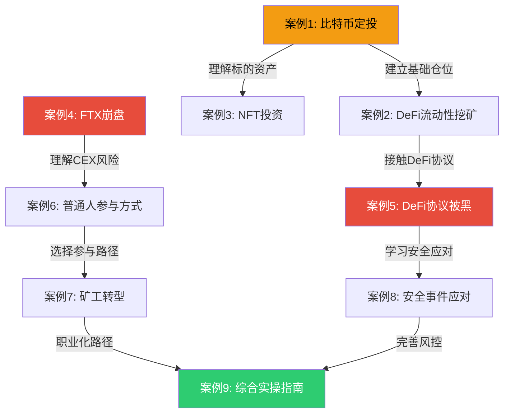
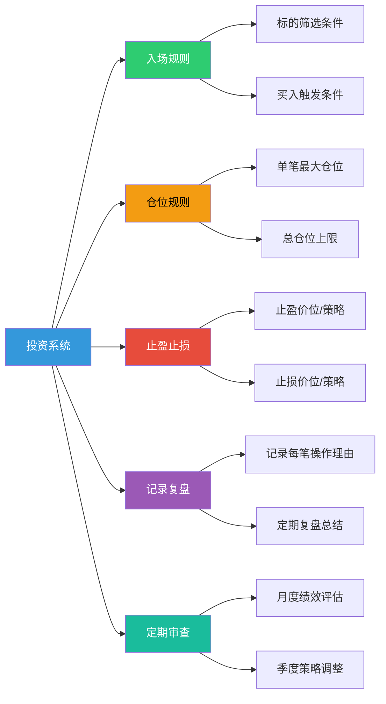
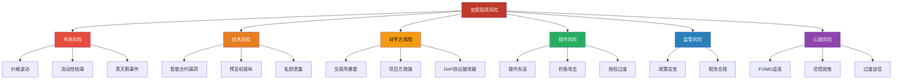
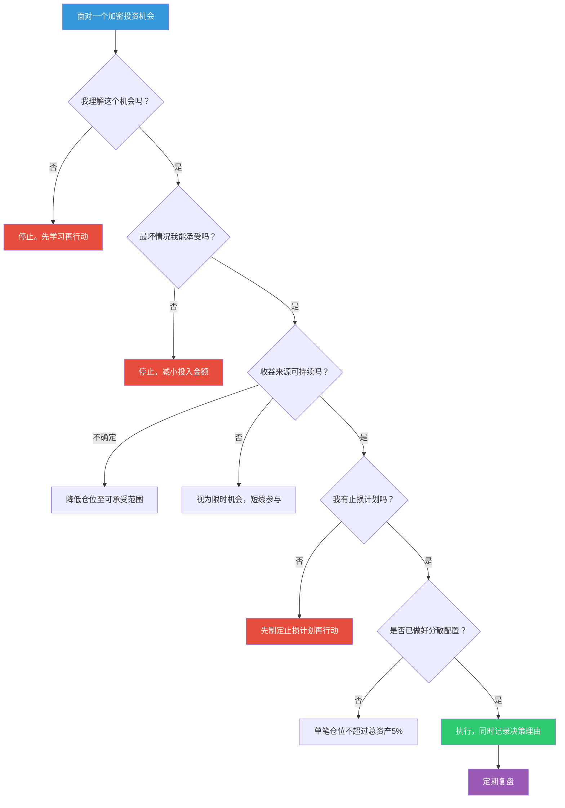

## 案例总结与启示

本篇是实战案例部分的收尾章节。前面九个案例分别展示了比特币定投、DeFi流动性挖矿、NFT投资、交易所崩盘（FTX）、DeFi协议被黑、普通人参与方式、矿工转型、安全事件应对、综合实操指南等真实场景。本篇不再重复单个案例的细节，而是站在全局视角，将九个案例中的决策逻辑、风险模式、心理博弈和操作经验提炼为可复用的认知框架。

**本篇的定位：** 如果说前面的案例是"一颗一颗的珍珠"，本篇就是把这些珍珠串成项链的那根线。读完本篇，你应该能回答一个核心问题——**面对加密市场的任何场景，我应该用什么思维框架来做决策？**

---

### 一、九个案例的全景回顾

先用一张表快速回顾所有案例的核心信息，建立全局认知：

| 序号 | 案例名称 | 核心策略 | 关键成果/教训 | 涉及的主要风险 |
|:----:|----------|----------|---------------|----------------|
| 1 | 比特币定投长期收益 | 定时定额+长期纪律 | 2018-2019年定投，2021年获5-8倍回报 | 选错标的、熊市恐慌停止定投 |
| 2 | DeFi流动性挖矿 | 提供流动性+挖矿收益 | 年化15%-30%（扣除无常损失后） | 无常损失、智能合约风险、代币归零 |
| 3 | NFT投资成败 | 稀缺性+社区价值 | 少数项目百倍回报，多数项目归零 | 流动性枯竭、项目跑路、审美疲劳 |
| 4 | FTX交易所崩盘 | 信任与验证 | 用户数十亿美元资产一夜蒸发 | CEX对手方风险、挪用用户资金 |
| 5 | DeFi协议被黑 | 安全事件分析 | 单次事件损失数亿至数十亿美元 | 合约漏洞、预言机操纵、闪电贷攻击 |
| 6 | 普通人参与方式 | 多元化参与路径 | 质押、空投、开发等多路径收益 | 机会成本、认知门槛、时间投入 |
| 7 | 矿工转型之路 | 从挖矿到多元布局 | 挖矿→质押→DeFi→生态建设 | 算力集中化、能源成本、政策风险 |
| 8 | 安全事件应对 | 危机管理与资金恢复 | 部分资金通过社区治理追回 | 响应延迟、信息不对称、二次诈骗 |
| 9 | 综合实操指南 | 整合实操行动框架 | 从认知到执行的完整路径 | 信息过载、行动瘫痪、缺乏体系 |

#### 案例之间的内在逻辑

九个案例并非随机排列，它们之间存在清晰的递进和互补关系：



**解读路径：**
- **左侧（案例1→2→3）**：投资策略的递进——从最保守的定投，到中等风险的流动性挖矿，到高风险的NFT投机
- **右侧（案例4→5→8）**：风险认知的深化——从交易所层面的风险，到协议层面的风险，到危机应对能力
- **底部（案例6→7→9）**：参与方式的拓展——从简单的买卖，到职业化路径，到系统化的行动框架

---

### 二、跨案例的六大核心教训

从九个案例中提炼出六条反复出现、被市场验证的核心教训。每条教训都不仅是一个"道理"，而是一个可以立即应用的决策规则。

#### 教训一：风险优先，收益次之

**案例佐证：** 案例1（定投）证明了"活下来才有回报"——在2018年熊市中坚持定投的人，最终获得了5-8倍回报。而那些在2021年高点FOMO入场的人，到2022年底亏损超过70%。案例4（FTX）和案例5（DeFi被黑）则从反面证明——一次重大损失可能永久终结你的投资生涯。

**量化理解：** 亏损和回本之间存在严重的不对称性——

| 亏损幅度 | 回本所需涨幅 | 难度等级 |
|---------|-------------|---------|
| -10% | +11% | 容易 |
| -20% | +25% | 可接受 |
| -50% | +100% | 困难 |
| -70% | +233% | 极其困难 |
| -90% | +900% | 几乎不可能 |

**决策规则：** 在评估任何加密投资机会时，第一个问题永远是"最坏情况下我会亏多少？"而不是"我能赚多少？"如果最坏情况是你无法承受的，无论预期收益多高，都不应该参与。

**实操检查清单：**
- 这笔投资全部归零，是否影响我的正常生活？（如果答案是"是"，立即停止）
- 我是否设置了明确的止损价位？（没有止损计划 = 没有投资计划）
- 我的总资产中，加密货币占比是否超过了20%？（超过则需要减仓）

#### 教训二：理解你参与的东西，不懂就不碰

**案例佐证：** 案例2（流动性挖矿）中，张工在参与之前系统学习了AMM原理、无常损失计算、合约审计报告阅读。这让他能够在高APY的诱惑面前保持理性，选择了稳定币对而非高波动对，最终实现了正收益。反观案例3（NFT）中，许多投资者在不了解NFT流动性特征的情况下盲目追高，最终"纸面财富"无法变现。

**DeFi参与前的必答题：**

| 问题 | 不知道答案的风险 |
|------|-----------------|
| 这个协议的收益来自哪里？ | 可能参与了一个"庞兹"式的代币激励模型 |
| 智能合约是否经过审计？审计机构是谁？ | 可能将资金存入有漏洞的合约 |
| 如果协议被黑，有什么补救措施？ | 可能血本无归且无处索赔 |
| 代币激励的来源和通胀率是多少？ | 可能高估了真实收益率 |
| 退出时的流动性如何？ | 可能无法及时撤出资金 |

**决策规则：** 如果你无法用自己的话向一个外行解释某个DeFi协议的运作机制，那么你不应该把真金白银投入其中。先用测试网操作，理解全流程后再用小额真金试水。

#### 教训三：不是你的私钥，就不是你的币

**案例佐证：** 案例4（FTX崩盘）是这条教训最惨痛的注脚。FTX曾是全球排名前三的交易所，创始人SBF曾登上《福布斯》封面。然而2022年11月，FTX在短短几天内崩盘，用户约80亿美元的资产被挪用。更早的Mt. Gox事件（2014年丢失85万BTC）已经证明过同样的道理——但人类的记忆力是短暂的。

**CEX风险的数学认知：** 加密货币历史上，平均每2-3年就会发生一次重大的交易所安全事件——

| 时间 | 交易所 | 事件 | 用户损失 |
|------|--------|------|---------|
| 2014 | Mt. Gox | 被盗+管理混乱 | 85万BTC（当时约4.5亿美元） |
| 2019 | QuadrigaCX | 创始人"死亡"（私钥丢失） | 约1.9亿美元 |
| 2022 | FTX | 挪用用户资金 | 约80亿美元 |
| 2023 | 多家小型CEX | 跑路、冻结提币 | 数亿美元 |

**决策规则：**
- 交易所只放交易需要的金额（建议不超过总资产的10%-20%）
- 大额资产（超过1个月不交易的部分）必须提到冷钱包
- 分散存放：不在同一交易所放超过总资产的10%
- 定期关注交易所的链上钱包地址，验证其偿付能力

**硬件钱包的选择逻辑：**

| 场景 | 推荐方案 | 理由 |
|------|---------|------|
| 资产 < 1万元 | 手机热钱包（MetaMask/Trust Wallet） | 成本为零，安全性够用 |
| 资产 1-10万元 | 入门级硬件钱包（Ledger Nano S Plus） | 约500元，性价比最高 |
| 资产 10-100万元 | 中端硬件钱包（Ledger Nano X / Trezor Model T） | 蓝牙/触屏，体验更好 |
| 资产 > 100万元 | 多签钱包（Gnosis Safe）+ 硬件钱包 | 多重签名，防止单点失败 |

#### 教训四：高收益必然伴随高风险，没有例外

**案例佐证：** 案例2（流动性挖矿）中，新协议动辄提供1000%+的APY，但这些收益几乎全部来自协议自发行的代币激励。当TVL增长导致代币稀释、或代币价格暴跌时，APY会急剧下降甚至变为负数。案例5（DeFi被黑）则从另一个角度说明——即使是经过审计的协议，也可能因为新型攻击手法而被攻破。

**收益来源的三层分类：**

| 收益层级 | 来源 | 可持续性 | 典型年化 | 风险等级 |
|---------|------|---------|---------|---------|
| 第一层：真实收入 | 交易手续费、借贷利息、MEV | 高（取决于使用量） | 2%-15% | 低-中 |
| 第二层：代币激励 | 协议发放的治理代币 | 中-低（通胀稀释） | 10%-100%+ | 中-高 |
| 第三层：杠杆叠加 | 通过借贷协议放大收益 | 取决于底层收益 | 放大倍数×基础 | 高-极高 |

**决策规则：** 当一个DeFi机会的APY超过50%时，你需要认真追问收益来源。如果收益主要来自第二层或第三层，那么你需要将其视为"限时补贴"而非"稳定收入"。真正的可持续收益，通常在2%-15%之间——这在传统金融中已经是非常不错的回报。

**APY陷阱识别清单：**
- APY > 100%且运行不足3个月 → 大概率是代币激励驱动，不可持续
- 收益来源无法在链上验证 → 可能是"庞兹"结构（用后来者的钱付先来者）
- TVL快速下降但APY仍在高位 → 代币价格在暴跌，名义APY具有欺骗性
- 需要锁仓才能获得高收益 → 锁仓期间可能发生合约被黑、代币归零等不可控事件

#### 教训五：不要把鸡蛋放在一个篮子里

**案例佐证：** 案例4（FTX）证明了交易所层面的集中风险；案例5（DeFi被黑）证明了协议层面的集中风险；案例3（NFT）证明了资产类别层面的集中风险。分散投资不是"不够大胆"，而是数学上的最优策略。

**分散投资的四个维度：**

| 维度 | 具体做法 | 目标 |
|------|---------|------|
| 资产类别分散 | BTC + ETH + 稳定币 + 少量山寨币 | 避免单一资产归零 |
| 协议分散 | 不在同一DeFi协议放超过30%的DeFi仓位 | 避免协议被黑导致重大损失 |
| 交易所分散 | 不在同一交易所放超过10%总资产 | 避免交易所暴雷 |
| 链生态分散 | 以太坊 + L2 + 少量竞争链 | 避免单链生态崩溃 |

**推荐的加密资产配置框架（适合保守型投资者）：**

| 资产 | 配置比例 | 角色定位 | 理由 |
|------|---------|---------|------|
| BTC | 50%-60% | 核心持仓（数字黄金） | 市值最大、共识最强、历史回报最好 |
| ETH | 20%-30% | 生态参与（可编程资产） | DeFi基础设施、通缩机制 |
| 稳定币 | 10%-20% | 安全垫+待部署资金 | 市场暴跌时的"子弹" |
| 小币种/NFT | 0%-10% | 高风险投机 | 仅用可承受亏损的资金 |

**注意：** 这个框架是"起点"而非"终点"。激进型投资者可以提高小币种比例，保守型投资者可以增加稳定币比例。关键原则是——**任何单一资产的归零都不应该对你造成毁灭性打击。**

#### 教训六：建立系统，不要依赖直觉

**案例佐证：** 案例1（定投）的核心价值不在于"买了比特币"，而在于"用系统替代了情绪决策"。案例9（综合指南）则将这一理念推向极致——从分析技能、确定方向、建立品牌到获取客户，每一步都有明确的流程和检验标准。

**投资系统的核心组件：**



**为什么系统优于直觉：**
- 人类在面对涨跌时会产生不可靠的情绪反应——涨时贪婪（想买更多），跌时恐惧（想割肉）
- 行为金融学证明，人对"割肉"的痛苦感是"落袋为安"快乐感的2.5倍（损失厌恶）
- 系统化交易将"决策"和"执行"分离——你在冷静时制定规则，在波动时机械执行
- 记录和复盘让你能够发现自己的行为模式（比如总是追涨、总是止损太晚）

**决策规则：** 在任何一笔交易之前，写下——（1）我为什么买？（2）什么情况下卖？（3）最多亏多少？如果写不出这三个答案，这笔交易就不应该执行。

---

### 三、不同投资者类型的案例启示矩阵

不同类型的投资者从同一案例中获得的启示是不同的。以下矩阵帮助你找到与自己最相关的案例教训：

| 投资者类型 | 最相关的案例 | 核心启示 | 行动优先级 |
|-----------|-------------|---------|-----------|
| **完全新手** | 案例1（定投）、案例9（实操指南） | 从最简单的方式开始，用小资金积累经验 | 先学安全，再学操作，最后学策略 |
| **小额投资者**（<5万元） | 案例1（定投）、案例6（参与方式） | 定投BTC/ETH是最优策略，尝试质押获取被动收益 | 建立定投纪律，学习钱包安全 |
| **中等投资者**（5-50万元） | 案例2（流动性挖矿）、案例3（NFT） | DeFi可以参与但需理解风险，NFT需极度谨慎 | 学习DeFi基础，用5%-10%资金试水 |
| **大额投资者**（>50万元） | 案例4（FTX）、案例5（DeFi被黑） | 安全存储和分散配置是第一优先级 | 硬件钱包+多签+分散交易所 |
| **技术人员** | 案例7（矿工转型）、案例5（DeFi被黑） | 技术背景是巨大优势，可通过开发/审计参与生态 | 学习智能合约安全，考虑生态建设 |
| **全职从业者** | 案例7（矿工转型）、案例8（安全事件应对） | 行业内部视角能发现普通投资者看不到的机会和风险 | 建立行业人脉，关注底层趋势 |

---

### 四、从案例中提炼的风险管理框架

将九个案例中出现的所有风险类型整合为一个统一的风险管理框架。这个框架覆盖了加密投资中可能遇到的所有风险维度。

#### 4.1 风险分类全景



#### 4.2 各类风险的应对策略

| 风险类型 | 案例来源 | 发生概率 | 影响程度 | 应对策略 |
|---------|---------|---------|---------|---------|
| **价格暴跌** | 案例1、3 | 高（每1-2年一次30%+回调） | 中-高 | 定投平滑成本、仓位管理、止损纪律 |
| **交易所暴雷** | 案例4 | 低（每2-3年一次重大事件） | 极高 | 冷钱包存储、分散交易所、不放大量资金 |
| **智能合约被黑** | 案例5、8 | 中（每年数十起重大事件） | 高 | 选择审计过的协议、分散协议、控制仓位 |
| **私钥/助记词丢失** | 案例4（隐含） | 低 | 极高（不可恢复） | 多重备份、金属助记词板、安全存储位置 |
| **钓鱼攻击** | 案例8 | 中 | 中-高 | 验证URL、不点击可疑链接、使用硬件钱包确认交易 |
| **NFT流动性枯竭** | 案例3 | 高 | 高 | 仅参与蓝筹项目、控制NFT仓位比例 |
| **监管政策变化** | 案例6、7 | 中 | 中-高 | 了解当地法规、保留交易记录、做好合规准备 |
| **心理偏差导致的错误决策** | 案例1、3 | 极高 | 中-高 | 建立投资系统、严格执行纪律、定期复盘 |

#### 4.3 风险管理的"三道防线"

从九个案例中总结出一个三层防线模型，确保即使某一层失效，也不会导致灾难性后果：

**第一道防线：认知防线（避免犯错）**
- 理解你参与的东西（教训二）
- 识别高收益陷阱（教训四）
- 了解监管法律环境
- 代表案例：案例2中张工因为理解无常损失，选择了稳定币对

**第二道防线：结构防线（限制损失）**
- 分散投资（教训五）
- 冷钱包存储（教训三）
- 仓位管理（教训一）
- 代表案例：案例4中，不在FTX存放大量资产的投资者损失有限

**第三道防线：应急防线（事后补救）**
- 安全事件发生后的响应流程（案例8）
- 社区治理和法律途径
- 保险和对冲工具
- 代表案例：案例8中，部分用户通过快速响应和社区治理追回了部分资产

---

### 五、案例中的心理博弈分析

加密市场的波动不仅是价格的波动，更是人心的波动。从九个案例中，可以识别出反复出现的心理模式。

#### 5.1 牛市中的心理陷阱

| 心理偏差 | 表现 | 案例来源 | 纠正方法 |
|---------|------|---------|---------|
| **FOMO（错失恐惧）** | "别人赚钱了我也要买" | 案例1（2021年高点入场者） | 制定买入计划，不受市场情绪影响 |
| **锚定效应** | "BTC曾经到过6万，现在4万很便宜" | 案例1、3 | 用基本面估值，不参考历史高点 |
| **确认偏差** | 只关注支持自己观点的信息 | 案例3（NFT投资者忽略流动性警告） | 主动寻找反对意见 |
| **过度自信** | "我已经很懂了，可以加杠杆" | 案例2、5 | 记录每次判断的准确率 |
| **沉没成本** | "我已经亏了这么多，不能卖" | 案例3、5 | 只看未来期望值，不看已投入成本 |

#### 5.2 熊市中的心理陷阱

| 心理偏差 | 表现 | 案例来源 | 纠正方法 |
|---------|------|---------|---------|
| **恐慌抛售** | "还会跌更多，赶紧跑" | 案例1（2018年离场者） | 严格执行止损纪律，不临时决策 |
| **过度悲观** | "加密货币完了，永远不会涨回来" | 案例1（2018-2019年） | 回顾历史周期数据 |
| **选择性关注** | 只看负面新闻 | 案例4（FTX后全面否定加密） | 保持多元信息来源 |
| **损失厌恶** | 割肉的痛苦>止盈的快乐 | 案例1、3 | 在买入时就写好止损价，用限价单自动执行 |

#### 5.3 心理纪律的实操方法

**交易前的"冷静清单"（每次交易前必须完成）：**

```text
□ 我是否因为价格涨了才想买？（FOMO检查）
□ 我是否因为价格跌了才想卖？（恐慌检查）
□ 这笔交易的逻辑，在我冷静时是否成立？（理性检查）
□ 我是否只看了支持自己观点的信息？（确认偏差检查）
□ 最坏情况下，我能承受这笔亏损吗？（风险检查）
□ 这笔交易符合我的投资计划吗？（纪律检查）
```

如果任何一项答案为"否"，暂停交易，等24小时后再决定。

---

### 六、给不同阶段投资者的行动指南

#### 6.1 零基础入门者（从未买过加密货币）

**最相关的案例：** 案例1（定投）、案例9（实操指南）

**30天行动计划：**

| 时间 | 行动 | 产出 |
|------|------|------|
| 第1-3天 | 阅读比特币白皮书（9页），理解区块链基础概念 | 能用自己的话解释"什么是比特币" |
| 第4-7天 | 注册CoinMarketCap，每天观察BTC和ETH价格5分钟 | 建立价格感知 |
| 第8-10天 | 阅读本章安全入门章节，了解钱包和交易所基础 | 理解"不是你的私钥就不是你的币" |
| 第11-14天 | 在测试网创建MetaMask钱包，练习发送/接收操作 | 完成测试网操作 |
| 第15-20天 | 完成交易所KYC，用小额资金（500元以内）购买第一笔BTC | 完成第一笔真实交易 |
| 第21-25天 | 将BTC从交易所提到自己的钱包 | 体验完整的"提币"流程 |
| 第26-30天 | 制定定投计划（金额、频率、标的），开始执行 | 投资计划文档 |

**红线：** 前30天不碰合约交易、不参与DeFi、不购买NFT、不听任何"老师带单"。

#### 6.2 有一定经验的持有者

**最相关的案例：** 案例2（流动性挖矿）、案例6（参与方式）

**进阶方向：**
1. 学习DeFi基础——从最简单的质押（Staking）开始，理解链上收益的来源
2. 尝试流动性提供——用不超过5%的资产在稳定币对（USDC/USDT）中提供流动性
3. 学习链上数据分析——使用Dune Analytics和DefiLlama观察协议数据
4. 完善安全体系——购买硬件钱包、设置提币白名单、管理合约授权

**进阶红线：** DeFi仓位不超过总资产的20%；不参与未经审计的新协议；不使用超过2倍杠杆。

#### 6.3 高级玩家

**最相关的案例：** 案例5（DeFi被黑）、案例7（矿工转型）、案例8（安全事件应对）

**深度方向：**
1. 学习智能合约安全——理解常见的攻击向量（重入攻击、闪电贷、预言机操纵）
2. 参与链上治理——持有治理代币，参与DAO投票
3. 探索生态建设——开发DApp、提供安全审计服务、参与社区贡献
4. 构建多链策略——在以太坊L2、Solana等多条链上配置资产

---

### 七、案例总结的核心框架图

将本篇所有内容整合为一个决策框架，在面对任何加密投资决策时可以调用：



---

### 八、写在最后：活下来，才有故事可讲

九个案例，九段真实经历。它们的共同主题不是"暴富"，而是"生存"。

比特币定投案例的主人公在2018年熊市中坚持了18个月，才等来2021年的收获。DeFi流动性挖矿的张工花了一个月系统学习，才敢投入第一笔资金。FTX崩盘中的幸存者，是那些从不把大量资产存放在交易所的人。矿工转型者，在算力军备竞赛中及时转向，才避免了被淘汰的命运。

加密市场是一个**高波动、高风险、高信息噪声**的环境。在这个环境中，最常见的失败原因不是"运气不好"，而是——

1. **不懂装懂**：不理解底层机制就投入资金
2. **贪心不足**：追求不合理的高收益，忽视对等的风险
3. **心存侥幸**：认为"这次不一样"，忽视历史教训
4. **缺乏纪律**：有计划但不执行，有止损但不遵守
5. **过度集中**：把所有鸡蛋放在一个篮子里

这五条错误，在本篇的九个案例中反复出现。如果你能真正将这六条教训内化为行为习惯，你已经在认知上超越了绝大多数加密市场参与者。

**最后的忠告：** 这个领域的知识每6个月就会有重大更新。本篇的框架和方法是当前市场环境下的最佳实践，但市场在变、技术在变、监管在变。保持学习、保持谦逊、保持纪律——这三样东西，比任何具体的交易策略都更有价值。

> **"在加密货币市场，活得久比赚得多更重要。"**
>
> 亏损50%后需要涨100%才能回本，亏损90%需要涨900%才能回本。数学不会骗人。保护好本金，才有机会等到下一个机会。
