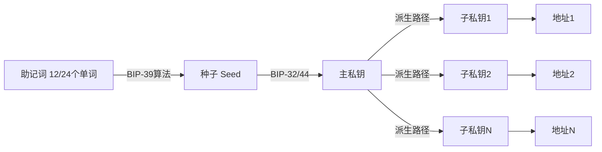
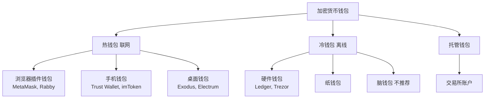
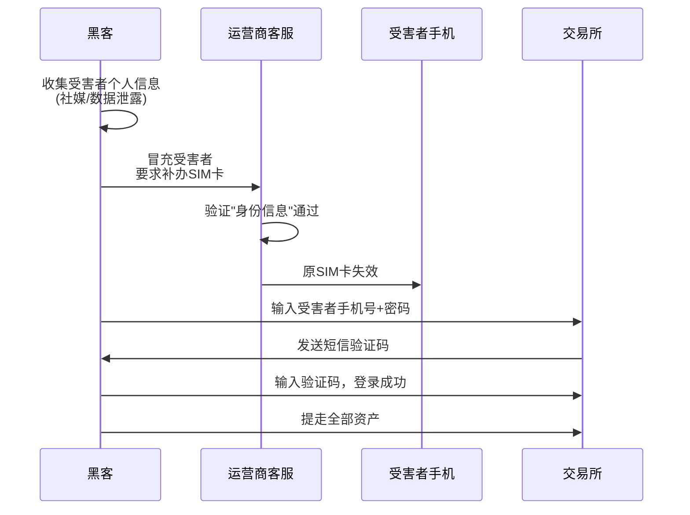
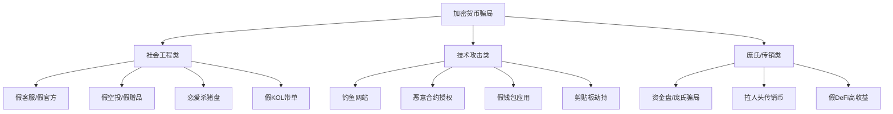
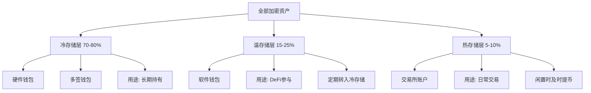

## 一、安全入门技巧

在加密货币的世界里，安全不是一个"可选项"，而是你参与这个生态的第一道门槛。与传统银行体系不同，加密货币领域没有"客服帮你找回密码"、没有"银行冻结可疑交易"、没有"存款保险赔付损失"。**你就是自己的银行，这意味着你同时承担了银行行长和安保人员的双重角色。**

本节将从零开始，帮你建立完整的加密货币安全认知框架。无论你是刚听说比特币的新手，还是已经开始接触DeFi的进阶用户，这些基础知识都是你资产安全的基石。

### 1. 为什么加密货币安全如此重要

#### 1.1 不可逆性：交易一旦发出，无法撤回

传统银行转账如果转错了人，你可以联系银行申请撤回。信用卡被盗刷，你可以申请拒付。但在区块链上，每一笔交易都是**不可逆的**。一旦交易被确认并上链，无论你转错了地址、转错了金额、还是被骗转了出去，这笔资产就永久离开了你的控制。

这不是设计缺陷，而是区块链的核心特性——去中心化系统中没有一个"超级管理员"可以修改交易记录。这个特性保证了系统的抗审查性和可信性，但也意味着**个人必须承担全部安全责任**。

#### 1.2 匿名性：追回资产极其困难

区块链地址是伪匿名的。虽然所有交易记录都公开可查（你可以在区块链浏览器上看到每一笔转账），但地址背后的真实身份通常是未知的。即使你被黑客盗走了资产，执法部门也需要大量的链上分析和技术手段才有可能追踪到犯罪分子，且成功追回的概率极低。

根据Chainalysis的数据，2024年全球加密货币犯罪造成的损失超过23亿美元，但通过执法追回的比例不到10%。**预防永远比补救更重要。**

#### 1.3 目标吸引力：加密资产是黑客的首选目标

加密货币具有以下特征，使其成为黑客的理想目标：

- **高价值**：单个比特币价值数万美元，一个钱包可能包含价值数十万甚至数百万美元的资产
- **高流动性**：盗取后可以通过去中心化交易所、混币器等渠道快速变现
- **低追诉率**：跨国执法困难，许多司法管辖区缺乏相关法律框架
- **技术门槛**：普通用户的安全意识和技术能力往往不足以应对复杂的攻击手段

### 2. 私钥与助记词：一切安全的根基

#### 2.1 什么是私钥

私钥（Private Key）是一串256位的随机数，通常以64位十六进制字符串表示。它是你在区块链上控制资产的**唯一凭证**。拥有私钥，就拥有对应地址上所有资产的完全控制权。

```text
# 私钥示例（仅供演示，切勿使用）
私钥: E9873D79C6D87DC0FB6A5778633389F4453213303DA61F20BD67FC233AA33262
对应地址: 0xAb5801a7D398351b8bE11C439e05C5B3259aeC9B
```

**核心原则：谁掌握了私钥，谁就掌握了资产。** 丢失私钥意味着永久失去资产，泄露私钥意味着资产随时可能被盗。

#### 2.2 什么是助记词

助记词（Mnemonic Phrase / Seed Phrase）是私钥的人类可读形式，由BIP-39标准定义。它由12个或24个英文单词组成，按照特定顺序排列，可以从确定性地推导出私钥。

```text
# 助记词示例（仅供演示，切勿使用）
abandon ability able about above absent absorb abstract
absurd abuse access accident account accuse achieve acid
```

助记词的设计初衷是让普通用户更容易备份和恢复钱包。相比一串无意义的十六进制字符，12个英文单词更容易抄写和记忆（虽然我们**强烈不建议**仅靠记忆来保存）。



#### 2.3 助记词的安全存储

助记词的安全存储是加密货币安全中最基础、也最重要的环节。以下是按安全等级排列的存储方案：

| 安全等级 | 存储方式 | 优点 | 缺点 | 适用场景 |
|---------|---------|------|------|---------|
| ★☆☆☆☆ | 手机备忘录 | 方便 | 设备丢失/被黑即丢失 | 绝不推荐 |
| ★★☆☆☆ | 纸张手写 | 离线存储 | 易损坏、可被发现 | 临时小额 |
| ★★★☆☆ | 金属助记词板 | 防火防水 | 仍有物理被盗风险 | 中额长期存储 |
| ★★★★☆ | 多地分散存储 | 单点损失可控 | 管理复杂 | 大额资产 |
| ★★★★★ | 多签+硬件钱包 | 极高安全性 | 技术门槛高 | 大额长期存储 |

**助记词安全的铁律：**

1. **永远不要截图或拍照保存**：手机可能被入侵，云相册可能被同步到云端
2. **永远不要通过网络传输**：不要发微信、邮件、网盘，任何联网设备都可能被监听
3. **永远不要输入到任何网站或应用**：除了你自己的钱包恢复界面，任何要求输入助记词的都是骗局
4. **至少准备两份物理备份**：分别存放在不同的安全地点（如家中保险箱和银行保管箱）
5. **考虑使用金属助记词板**：纸质备份容易被火灾、水灾损坏

### 3. 钱包安全：选择与使用

#### 3.1 钱包的分类

加密货币钱包按照是否联网，分为热钱包和冷钱包两大类：



**热钱包（Hot Wallet）**：始终连接互联网的钱包。优点是使用方便，适合日常小额交易和DeFi交互。缺点是私钥存储在联网设备上，面临被黑客入侵的风险。

**冷钱包（Cold Wallet）**：离线存储私钥的钱包。优点是私钥从不触网，安全性极高。缺点是使用不够便捷，每次交易都需要物理操作。

**托管钱包（Custodial Wallet）**：由第三方（如交易所）代为保管私钥。优点是使用门槛低，丢失密码可以找回。缺点是"不是你的私钥，就不是你的币"——你实际上并不真正拥有这些资产。

#### 3.2 钱包选择建议

| 用户类型 | 推荐方案 | 理由 |
|---------|---------|------|
| 纯新手，小额试水 | 交易所托管 + 学习使用热钱包 | 降低入门门槛，边学边用 |
| 有一定经验，资产<5万 | 热钱包（MetaMask/Rabby）为主 | 兼顾便利性和DeFi参与 |
| 中等资产 5-50万 | 热钱包+硬件钱包组合 | 日常用热钱包，大额存硬件钱包 |
| 大额资产 >50万 | 硬件钱包+多签方案 | 安全性优先 |
| 长期持有（HODL） | 硬件钱包冷存储 | 设好后不再触碰 |

#### 3.3 MetaMask安全配置实操

MetaMask是最常用的以太坊系钱包，以下是安全配置的关键步骤：

**步骤一：从官方渠道下载**

```text
# 正确的下载地址
官方Chrome商店: https://chrome.google.com/webstore/detail/metamask/nkbihfbeogaeaoehlefnkodbefgpgknn
官方网站: https://metamask.io

# 危险信号（钓鱼网站特征）
- 域名拼写变体: metarnask.io, metamask.io.com
- 搜索引擎广告位（骗子会购买广告）
- 社交媒体私信中的"官方下载链接"
```

**步骤二：创建钱包并安全备份助记词**

1. 点击"创建钱包"，同意使用条款
2. 设置一个**强密码**（至少12位，含大小写字母、数字、特殊字符）
3. 系统会显示12个助记词单词——**立即用纸笔抄写，不要截图**
4. 按顺序验证助记词
5. 将抄写的助记词存放在安全的物理位置

**步骤三：启用安全设置**

```text
# MetaMask安全设置路径
设置 → 安全与隐私

# 必须开启的选项：
✓ 自动锁定定时器（建议设为5分钟）
✓ 显示助记词确认（防止误操作）
✗ 关闭"参与MetaMask数据分析"（减少数据暴露）
```

**步骤四：添加自定义RPC节点时的安全检查**

```text
# 不要随意添加来路不明的RPC节点
# 正确做法：只使用知名RPC提供商

# 推荐的RPC提供商
- Infura (infura.io)
- Alchemy (alchemy.com)  
- Ankr (ankr.com)
- QuickNode (quicknode.com)

# 危险信号
- Discord/Telegram群里有人发"更快的RPC节点"
- 要求你添加特定RPC才能领取空投
```

#### 3.4 硬件钱包入门

硬件钱包是将私钥存储在专用安全芯片中的物理设备，交易签名在设备内部完成，私钥永不离开设备。

**主流硬件钱包对比：**

| 特性 | Ledger Nano S Plus | Ledger Nano X | Trezor Model One | Trezor Model T |
|------|-------------------|---------------|-----------------|----------------|
| 价格 | ~$79 | ~$149 | ~$69 | ~$219 |
| 支持币种 | 5500+ | 5500+ | 1000+ | 1000+ |
| 连接方式 | USB | USB+蓝牙 | USB | USB+触屏 |
| 安全芯片 | ✅ | ✅ | ❌ | ❌ |
| 开源固件 | 部分 | 部分 | ✅ | ✅ |
| 适合人群 | 入门用户 | 移动用户 | 注重开源 | 高级用户 |

**硬件钱包购买安全须知：**

1. **只从官方网站或授权经销商购买**：不要在淘宝、闲鱼、二手市场购买，可能被植入后门
2. **检查包装密封**：收到后检查是否有拆封痕迹
3. **首次使用时设备不应有助记词**：如果设备已经预设了助记词，说明是被预配置过的恶意设备
4. **立即更新固件**：使用最新版本的官方固件

### 4. 交易所账户安全

#### 4.1 交易所的选择

选择交易所时，安全性应优先于交易费率和上币数量。以下是评估交易所的关键指标：

| 评估维度 | 具体指标 | 重要性 |
|---------|---------|--------|
| 合规性 | 是否持有主流国家牌照（美国MSB、日本FSA等） | ★★★★★ |
| 透明度 | 是否公布储备金证明（Proof of Reserves） | ★★★★★ |
| 安全历史 | 是否发生过重大安全事故及应对表现 | ★★★★☆ |
| 冷热钱包比例 | 冷存储比例是否足够高 | ★★★★☆ |
| 保险基金 | 是否有用户资产保险机制 | ★★★☆☆ |
| 双重认证 | 支持哪些2FA方式 | ★★★★★ |
| 提币审核 | 大额提币是否有额外验证 | ★★★★☆ |

**目前主流交易所的安全评级参考（2025年）：**

- **Binance**：全球最大交易量，SAFU保险基金，储备金证明，多国牌照
- **Coinbase**：美国上市公司，FDIC保险覆盖部分美元资产，合规性最强
- **OKX**：储备金证明，链上资产透明度较高
- **Kraken**：从未被黑客成功入侵，安全记录优秀

#### 4.2 交易所账户安全配置清单

**第一优先级：必须立即设置**

1. **强密码**：至少16位，使用密码管理器生成和管理
2. **双重认证（2FA）**：使用TOTP应用（如Google Authenticator或Authy），**不要使用短信验证**
3. **提币白名单**：只允许提币到预先设置的地址
4. **反钓鱼码**：设置后，交易所发送的每封邮件都会包含你的专属代码

**第二优先级：建议尽快设置**

5. **登录IP白名单**：限制只有特定IP可以登录
6. **设备管理**：定期检查并移除不常用的登录设备
7. **API密钥安全**：如果使用API交易，设置IP白名单和最小权限

**第三优先级：进阶安全**

8. **独立邮箱**：为交易所注册专用邮箱，不用于其他任何用途
9. **独立设备**：条件允许时，用专用设备进行交易所操作
10. **定期审计**：每月检查一次账户安全设置和登录记录

#### 4.3 为什么不应该用短信2FA

短信2FA（SMS-based Two-Factor Authentication）看似方便，实际上是安全性最差的2FA方式：

**SIM卡劫持攻击（SIM Swapping）：**



这种攻击在美国已经造成了数亿美元的损失。2022年，一名15岁的少年通过SIM卡劫持在一天内盗取了价值2400万美元的加密货币。

**正确的2FA选择优先级：**

1. **硬件安全密钥（YubiKey等）**：最安全，物理设备不可远程复制
2. **TOTP应用（Google Authenticator/Authy/2FAS）**：推荐，基于时间的一次性密码
3. **推送通知验证**：较好，依赖特定设备
4. **短信验证码**：最不安全，仅比没有2FA好

### 5. 防骗入门：识别常见骗局

#### 5.1 骗局类型全景

加密货币领域的骗局层出不穷，但核心手法可以归纳为以下几类：



#### 5.2 钓鱼攻击的识别

钓鱼攻击是加密货币领域最常见的攻击方式。攻击者通过伪造官方网站、邮件或消息，诱导用户输入私钥或签署恶意交易。

**识别钓鱼网站的关键技巧：**

```text
# 域名相似性钓鱼（同形异义字攻击）
真实域名: uniswap.org
钓鱼域名: uniswap.org (使用西里尔字母а替换拉丁字母a)
钓鱼域名: uniswap-app.org
钓鱼域名: uniswapp.org
钓鱼域名: app-uniswap.org

# 验证方法
1. 直接在浏览器地址栏输入域名，不要通过搜索引擎点击
2. 检查HTTPS证书是否有效
3. 使用书签保存常用网站
4. 安装ScamSniffer等防钓鱼浏览器插件
```

**钓鱼邮件的识别特征：**

- 发件人邮箱域名与官方不完全一致（如 `support@uniswap.org` vs `support@uni-swap.org`）
- 制造紧迫感："你的账户将在24小时内被冻结"
- 要求你"验证钱包"或"领取空投"并输入助记词
- 包含可疑链接（鼠标悬停查看真实URL）
- 语法或拼写错误（虽然AI时代这个特征越来越不可靠）

#### 5.3 恶意合约授权

这是新手最容易中招的骗局之一。在DeFi交互中，你需要"授权"（Approve）合约使用你的代币。恶意合约会请求**无限授权**，一旦你签署了授权交易，合约就可以随时转走你钱包中该种代币的全部余额。

**安全操作原则：**

1. **永远不要签署你不理解的交易**：如果你看不懂交易内容，不要签名
2. **使用有限授权代替无限授权**：只授权实际需要的金额
3. **定期检查并撤销不必要的授权**：使用 [revoke.cash](https://revoke.cash) 或 [approved.zone](https://approved.zone) 检查你的授权记录
4. **警惕"Claim"类签名请求**：许多钓鱼网站伪装成空投领取页面

```text
# 如何检查和撤销合约授权（以revoke.cash为例）
1. 访问 https://revoke.cash
2. 连接你的钱包
3. 查看所有已授权的合约列表
4. 对于不认识或不再使用的授权，点击"Revoke"
5. 确认撤销交易（需要支付少量Gas费）
```

#### 5.4 "太好而不真实"的信号

以下任何一条出现，都应该立刻提高警惕：

- **承诺固定高收益**："每天1%，稳赚不赔"——没有合法投资能保证固定高收益
- **要求你先转账才能领取**："先转0.1个ETH到这个地址，获得10倍回报"
- **冒充名人/官方**："Elon Musk双倍返还活动"——这种骗局在推特上极为常见
- **制造紧迫感**："仅限前100名""活动24小时后结束"
- **信息来源不透明**：白皮书写不清楚、团队匿名、代码不开源

### 6. 交易安全基础

#### 6.1 发送交易前的安全检查

每一笔链上交易发出前，都应该进行以下检查：

```text
# 交易前安全检查清单

□ 收款地址是否正确？（检查首尾各4个字符）
□ 金额是否正确？（注意小数点位置）
□ 选择的网络是否正确？（ETH主网 vs BSC vs Polygon...）
□ Gas费是否合理？（异常高的Gas可能意味着复杂合约交互）
□ 这笔交易的具体操作是什么？（Transfer? Approve? Swap?）
□ 交易对手方合约是否可信？（检查合约地址是否经过验证）
```

#### 6.2 小额测试原则

在进行大额转账或首次与新合约交互时，**始终先进行小额测试**：

1. 发送一笔小额交易（如$10等值）
2. 确认交易成功到达目标地址/正确执行
3. 确认无异常后再发送大额交易

这个习惯可能让你多花几美元的Gas费，但可以避免因地址错误、网络选错或合约问题造成的大额损失。

#### 6.3 网络选择与跨链安全

许多代币同时存在于多个区块链上（如USDT同时在Ethereum、BSC、Tron、Polygon等链上），发送时必须选择正确的网络。

```text
# 常见的网络选择错误

❌ 在ERC-20（以太坊）网络发送USDT到TRC-20（波场）地址
❌ 在BSC网络发送代币到只支持ETH主网的交易所充值地址
❌ 使用Arbitrum/Optimism等L2网络发送到不支持L2的地址

# 正确做法
1. 确认接收方支持的网络（在交易所充值页面查看）
2. 选择与接收方一致的网络
3. 如不确定，优先选择主流网络（如ERC-20）
4. 进行小额测试后再发大额
```

### 7. 安全思维与习惯养成

#### 7.1 零信任原则

在加密货币世界中，应采用"零信任"安全模型：

- **不信任任何主动联系你的人**：无论对方自称是客服、官方、还是"热心网友"
- **不信任任何未经验证的链接**：即使来自"朋友"（他的账号可能被盗了）
- **不信任任何"保证收益"的承诺**：如果收益是保证的，为什么需要你的钱？
- **不信任任何要求你"紧急操作"的信息**：制造紧迫感是骗子的经典手法

#### 7.2 分层管理资产

不要把所有资产放在同一个钱包或交易所中。采用分层管理策略：



**分层管理的核心逻辑：**
- 长期不动的资产放冷存储，安全性最高
- 需要参与DeFi的资产放软件钱包，定期将收益转入冷存储
- 交易所只留日常交易需要的金额，闲置资产尽快提到自己的钱包

#### 7.3 信息卫生

在加密货币领域，你的信息本身就是攻击面：

- **不要公开你的持仓**：社交媒体上晒仓位等于告诉黑客"这里有钱"
- **不要使用同一用户名跨平台**：攻击者会从一个平台的数据泄露中获取你的信息
- **使用专用邮箱**：为加密货币相关服务注册专用邮箱，不与其他用途混用
- **启用邮箱的最高安全级别**：邮箱是所有账户的"万能钥匙"，一旦被攻破，所有关联账户都面临风险
- **谨慎参与社区活动**：许多"测试网活动"和"社区奖励"要求连接钱包，可能包含恶意操作

### 8. 新手安全快速上手清单

如果你刚开始接触加密货币，以下是按优先级排列的安全行动清单：

**第一周：基础安全（必须完成）**

| 序号 | 行动 | 预计时间 | 重要性 |
|------|------|---------|--------|
| 1 | 注册交易所时使用强密码+TOTP 2FA | 10分钟 | ★★★★★ |
| 2 | 为交易所注册专用邮箱 | 15分钟 | ★★★★★ |
| 3 | 设置交易所反钓鱼码 | 5分钟 | ★★★★☆ |
| 4 | 安装MetaMask，创建钱包 | 15分钟 | ★★★★★ |
| 5 | 将助记词抄写在纸上并安全存放 | 10分钟 | ★★★★★ |
| 6 | 设置MetaMask自动锁定 | 2分钟 | ★★★★☆ |

**第一个月：进阶安全**

| 序号 | 行动 | 预计时间 | 重要性 |
|------|------|---------|--------|
| 7 | 学会检查合约地址和交易详情 | 30分钟 | ★★★★★ |
| 8 | 安装防钓鱼插件（ScamSniffer） | 5分钟 | ★★★★☆ |
| 9 | 学会使用区块链浏览器查看交易 | 30分钟 | ★★★★☆ |
| 10 | 购买硬件钱包（如果资产超过5万） | $79-149 | ★★★★☆ |
| 11 | 学会检查和撤销合约授权 | 20分钟 | ★★★★★ |

**持续习惯：**

| 频率 | 行动 |
|------|------|
| 每次交易前 | 检查地址、网络、金额、合约 |
| 每周 | 检查交易所登录记录 |
| 每月 | 检查合约授权状态 |
| 每季度 | 审查安全配置，更新密码 |
| 发现可疑活动 | 立即转移资产到安全地址 |

### 9. 常见安全误区

**误区一："交易所比自己保管更安全"**

2022年FTX崩盘时，数百万用户的数十亿美元资产一夜蒸发。"不是你的私钥，就不是你的币"不是一句空话——它是无数血泪教训的总结。交易所可以被黑客攻击、可以倒闭、可以跑路、可以被监管冻结。长期存储的资产应该放在自己控制的钱包中。

**误区二："我没有什么资产，不会被黑客盯上"**

黑客攻击通常是自动化的、批量的。他们不会先查看你的余额再决定是否攻击——他们用脚本扫描数百万个地址，有漏洞就利用，有授权就转走。不要因为资产少就忽视安全。

**误区三："助记词存在手机最安全"**

手机是最不安全的存储设备之一。手机可能丢失、被盗、被植入恶意软件、被系统备份到云端。甚至一些看似无害的应用也可能读取你的相册和剪贴板。助记词必须离线存储。

**误区四："开源钱包一定安全"**

开源确实意味着代码可以被审查，但这不等于代码一定被审查过。此外，你从应用商店下载的版本是否与开源仓库的代码一致？供应链攻击（compromised build）在加密货币领域时有发生。始终从官方渠道下载，验证下载包的哈希值。

**误区五："硬件钱包100%安全"**

硬件钱包极大提升了安全性，但并非绝对安全。恶意合约仍然可以诱导你签署不利的交易——硬件钱包只保证私钥不泄露，不保证你签署的每一笔交易都是安全的。在硬件钱包的屏幕上仔细核对交易详情是你的责任。

### 10. 进阶安全思路

#### 10.1 多签钱包

多签（Multi-Signature）钱包要求多个私钥中的至少N个签名才能执行交易（如2-of-3，3-of-5）。即使一个私钥被泄露，攻击者也无法单独转走资产。

```text
# Gnosis Safe 多签钱包示例（2-of-3配置）
签名者1: 你的硬件钱包 A
签名者2: 你的硬件钱包 B（存放在不同地点）
签名者3: 你信任的家人/朋友的硬件钱包

# 执行交易需要至少2个签名者确认
# 即使A被盗，攻击者只有1个签名，无法操作
# 即使B丢失，你仍然可以用A+C完成操作
```

#### 10.2 地址监控

使用链上监控工具，在资产被移动时立即收到警报：

- **Etherscan Watch List**：监控特定地址的交易
- **DeBank**：一站式查看多链资产和授权状态
- **Revoke.cash**：定期检查和清理合约授权
- **Tenderly**：高级交易模拟和告警

#### 10.3 应急预案

提前制定安全事件应急预案，而不是等到出事才手忙脚乱：

```text
# 应急预案模板

1. 发现私钥/助记词可能泄露
   → 立即将所有资产转移到新钱包（先大额后小额）
   → 撤销旧钱包的所有合约授权
   → 检查是否有授权的DApp需要更新地址

2. 发现交易所账户异常
   → 立即冻结账户（如交易所支持）
   → 修改密码和2FA
   → 联系交易所客服
   → 检查关联邮箱是否被入侵

3. 疑似签署恶意交易
   → 立即撤销该合约的所有授权
   → 将剩余资产转移到新钱包
   → 在revoke.cash检查完整的授权列表
```

---

> **安全不是一次性的工作，而是一种持续的习惯。** 在加密货币领域，你的安全意识和操作习惯直接决定了你的资产命运。花在安全上的每一分钟，都可能帮你避免数万甚至数十万的损失。接下来的章节将深入更高级的安全技术和策略，但本节的这些基础原则，将是你在整个加密货币旅程中最重要的安全基石。
