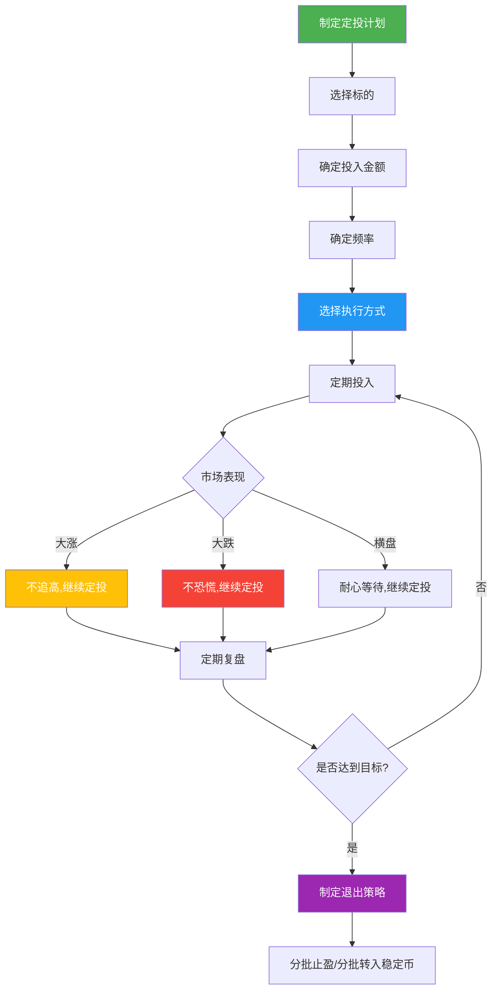
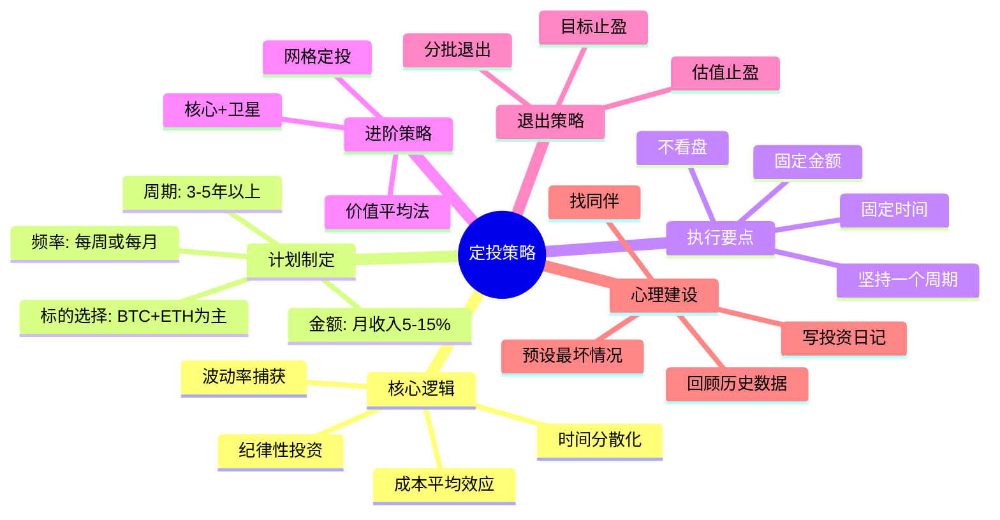

## 二、定投策略

定投（Dollar-Cost Averaging, DCA）是加密货币投资中最被低估的策略。它的核心优势不在于收益最大化，而在于**以最低的认知成本获取市场平均回报**，同时将情绪干扰降到零。对于大多数没有时间盯盘、没有能力择时的普通投资者来说，定投不是"次优选择"，而是**最优选择**。

### 2.1 定投的底层逻辑

#### 2.1.1 什么是定投

定投的本质是**时间分散化投资**——将一笔大额投资拆分为多笔小额投资，在固定的时间间隔内持续买入，不判断市场方向，不预测价格走势。

与一次性投入（Lump Sum）相比，定投的数学本质是**波动率捕获**：

- 当价格下跌时，同样的金额买入更多数量
- 当价格上涨时，同样的金额买入更少数量
- 长期下来，持仓成本被"平均"在一个相对较低的水平

这就是所谓的**成本平均效应**（Cost Averaging Effect）。

#### 2.1.2 定投 vs 一次性投入

| 维度 | 定投（DCA） | 一次性投入（Lump Sum） |
|------|------------|----------------------|
| 适用场景 | 不确定市场方向 | 明确看涨或价格低估 |
| 心理压力 | 低，每次投入金额小 | 高，全部资金暴露 |
| 下行保护 | 有，下跌时自动加仓 | 无，可能买在高点 |
| 上行收益 | 较低，上涨时买入变少 | 较高，满仓享受上涨 |
| 认知要求 | 极低，机械执行 | 较高，需要择时能力 |
| 回撤承受 | 温和，成本被平均 | 激烈，可能浮亏50%+ |
| 历史胜率（BTC） | 约65-70%周期正收益 | 约55-60%（取决于入场点） |

**关键结论**：如果你无法准确判断市场底部，定投的长期表现往往优于"择时"操作。学术研究（Vanguard, 2012）表明，在约67%的情况下一次性投入优于定投，但那是在股票市场。加密市场的波动率是股票的3-5倍，定投的优势因此被放大。

#### 2.1.3 定投的数学原理

设第 $i$ 期投入金额为 $C$（固定），价格为 $P_i$，则买入数量为 $Q_i = C / P_i$。

定投N期后的平均成本：

$$\bar{P} = \frac{N \cdot C}{\sum_{i=1}^{N} Q_i} = \frac{N}{\sum_{i=1}^{N} \frac{1}{P_i}}$$

这就是**调和平均数**，它天然低于算术平均数。换句话说，只要价格有波动，定投的平均成本就一定低于这段时间的平均价格。

**实例演算**：假设3个月分别以100、50、100的价格买入，每月投入1000元：
- 第1月：买入 10 个
- 第2月：买入 20 个（低价多买）
- 第3月：买入 10 个
- 平均成本 = 3000 / 40 = **75元**
- 而算术平均价格 = (100+50+100)/3 = 83.3元
- 定投节省了 10% 的成本

#### 2.1.4 定投策略执行流程图



### 2.2 定投的历史数据验证

#### 2.2.1 比特币定投回测（2017-2025）

以比特币为例，从不同起点开始每月定投1000元人民币：

| 起始时间 | 定投时长 | 总投入 | 2025年6月价值 | 累计回报 | 年化回报 |
|---------|---------|-------|-------------|---------|---------|
| 2017年1月 | 8.5年 | 10.2万 | 约85-110万 | 730%-980% | 约28%-32% |
| 2020年1月 | 5.5年 | 6.6万 | 约35-50万 | 430%-660% | 约35%-42% |
| 2021年1月（高点附近） | 4.5年 | 5.4万 | 约18-28万 | 230%-420% | 约30%-45% |
| 2022年1月（熊市开始） | 3.5年 | 4.2万 | 约15-22万 | 257%-424% | 约45%-60% |
| 2022年11月（FTX崩盘后） | 2.5年 | 3万 | 约12-18万 | 300%-500% | 约70%-100% |

**核心发现**：
1. **任何时间开始定投，只要坚持足够久，都是正收益**——这是比特币长期增长趋势决定的
2. **熊市开始定投的回报率最高**——因为低价区间买入了更多筹码
3. **牛市高点开始定投也不亏**——只是回报率较低，但时间会弥补

#### 2.2.2 以太坊定投回测

| 起始时间 | 总投入 | 2025年6月价值 | 累计回报 |
|---------|-------|-------------|---------|
| 2020年1月 | 6.6万 | 约25-40万 | 280%-500% |
| 2021年1月 | 5.4万 | 约12-20万 | 120%-270% |
| 2022年1月 | 4.2万 | 约10-16万 | 138%-280% |

以太坊的波动比比特币更大，定投的成本平均效应也更明显。

#### 2.2.3 定投 vs 择时的胜率

根据对2015-2025年BTC数据的分析：

- **随机择时**（随机选一天买入）：约45%的概率买在当月低点附近
- **定投**：100%的概率覆盖所有价格区间
- **"等抄底"策略**：约30%的人因为一直等待而错过最佳买点

结论：**择时的胜率远低于定投**，除非你有可靠的链上数据支撑判断。

### 2.3 定投计划制定

#### 2.3.1 标的选择

**核心原则**：定投标的必须是你愿意持有3-5年以上的资产。这意味着它必须有长期存活的确定性。

**保守型组合（适合新手/风险厌恶型）**：

| 资产 | 配比 | 逻辑 |
|------|------|------|
| BTC | 70% | 数字黄金，共识最强，长期确定性最高 |
| ETH | 30% | 智能合约平台龙头，生态最丰富 |

**平衡型组合（适合有一定认知的投资者）**：

| 资产 | 配比 | 逻辑 |
|------|------|------|
| BTC | 50% | 核心仓位 |
| ETH | 30% | 生态龙头 |
| SOL | 10% | 高性能公链代表 |
| 稳定币理财 | 10% | 作为"干粉"储备，等待机会 |

**激进型组合（适合高风险承受能力者）**：

| 资产 | 配比 | 逻辑 |
|------|------|------|
| BTC | 35% | 底仓 |
| ETH | 25% | 生态 |
| SOL/BNB等 | 15% | 公链赛道 |
| DeFi蓝筹（AAVE/UNI等） | 10% | 协议层价值 |
| 高潜力小市值 | 5% | 博弈超额收益 |
| 稳定币 | 10% | 储备 |

**绝对不要定投的标的**：
- 没有实际用途的Meme币（DOGE/SHIB等可以少量投机，但不适合定投）
- 上线不到1年的新项目
- 交易量极低的小市值币
- 没有审计的DeFi协议代币

#### 2.3.2 金额确定

**核心公式**：

```text
定投金额 = (月可支配收入 - 应急储备金分摊) × 风险分配比例
```

**具体建议**：

| 月收入水平 | 建议定投金额 | 占收入比 | 说明 |
|-----------|------------|---------|------|
| 5000元以下 | 200-500元 | 4%-10% | 先保证生活，小额参与 |
| 5000-10000元 | 500-1500元 | 5%-15% | 可以适度加大投入 |
| 10000-30000元 | 1500-5000元 | 10%-17% | 有一定余量 |
| 30000元以上 | 5000-15000元 | 10%-15% | 不建议超过15% |

**红线**：
- 定投金额不能影响日常生活质量
- 必须保留至少3个月生活费的应急储备金
- 不能借钱定投，不能用信用卡定投
- 不能挪用房租、学费等刚性支出

#### 2.3.3 频率选择

| 频率 | 适合人群 | 优势 | 劣势 |
|------|---------|------|------|
| 每周定投 | 自由职业者/收入不稳定 | 分散效果最好，平滑成本 | 操作频繁，手续费略高 |
| 双周定投 | 收入较稳定 | 平衡分散和便利 | 中等操作频率 |
| 每月定投 | 工薪族/固定工资 | 最方便，与收入周期匹配 | 分散效果略弱 |
| 每季度定投 | 资金量大的投资者 | 操作最少 | 分散效果最差 |

**实测数据**：对BTC 2020-2025年数据回测，每周、双周、每月定投的最终收益差距在**3%以内**。频率不是关键因素，**坚持才是**。

#### 2.3.4 定投周期

- **最短周期**：3年（覆盖至少一个减半周期）
- **建议周期**：5年以上（跨越完整的牛熊转换）
- **理想周期**：8-10年（覆盖2个减半周期，享受复利最大化）

**比特币减半周期与定投关系**：

| 减半时间 | 减半后高点 | 距减半时间 | 从减半前1年开始定投的回报 |
|---------|-----------|-----------|---------------------|
| 2012年11月 | 2013年12月 | 约13个月 | 极高（数千%） |
| 2016年7月 | 2017年12月 | 约17个月 | 约1500-2000% |
| 2020年5月 | 2021年11月 | 约18个月 | 约500-800% |
| 2024年4月 | 2025年? | ? | 进行中 |

### 2.4 定投执行要点

#### 2.4.1 执行纪律（最重要）

定投的全部价值建立在一个前提上：**持续执行，不间断**。以下纪律是铁律：

**铁律一：固定时间，雷打不动**
- 选定一个日期（如每月1号/15号），永远不改
- 不因为"感觉要涨了"提前买入
- 不因为"感觉要跌了"推迟买入
- 设日历提醒，把定投当成"交水电费"一样例行公事

**铁律二：固定金额，不增不减**
- 不因为涨了就少买（"等跌了再买"）
- 不因为跌了就多买（"抄底机会"）——除非你执行的是价值平均策略
- 唯一调整时机：年度复盘时根据收入变化调整

**铁律三：不看盘，不看新闻**
- 定投的最大敌人是"知道价格"
- 建议：定投日买入后关闭App，一个月后再看
- 如果忍不住看，设一个规则：只在定投日看一次

**铁律四：至少坚持一个完整周期**
- 第一年大概率是亏损的（买入成本在积累）
- 第二年可能更痛苦（熊市加深）
- 第三年开始回本并盈利
- 绝大多数人在第12-18个月放弃——这恰恰是最可惜的

#### 2.4.2 进阶策略：价值平均法（Value Averaging）

价值平均法是定投的升级版，核心思想是**设定目标资产增长路径，实际投入金额根据偏离程度动态调整**。

**计算公式**：

```text
第n期目标价值 = n × 每期目标增长额
第n期应投金额 = 第n期目标价值 - 第n期实际持仓价值
```

**实例**：目标每月资产增长2000元

| 月份 | 目标价值 | 实际持仓 | 应投金额 | 说明 |
|------|---------|---------|---------|------|
| 1月 | 2000 | 0 | 2000 | 首次投入 |
| 2月 | 4000 | 2500（涨了） | 1500 | 少买 |
| 3月 | 6000 | 3000（跌了） | 3000 | 多买 |
| 4月 | 8000 | 5000 | 3000 | 继续多买 |
| 5月 | 10000 | 12000（大涨） | -2000 | 卖出部分 |

**优势**：比普通定投更"聪明"，自动实现低买高卖
**劣势**：需要更多资金储备（大跌时要投入更多），执行更复杂
**适合**：有一定资金余量、能严格执行纪律的投资者

#### 2.4.3 进阶策略：网格定投

网格定投将价格区间划分为多个网格，不同价格区间投入不同金额。

**示例网格（BTC）**：

| 价格区间（美元） | 定投倍数 | 逻辑 |
|----------------|---------|------|
| 100,000+ | 0.5x | 高位少买 |
| 80,000-100,000 | 1x | 正常定投 |
| 60,000-80,000 | 1.5x | 适度加量 |
| 40,000-60,000 | 2x | 大幅加量 |
| <40,000 | 3x | 极端低估，重仓 |

**执行方式**：
1. 设定基准定投金额（如每月1000元）
2. 定投日查看当前价格所在的网格
3. 按对应倍数执行
4. 每季度调整一次网格参数

#### 2.4.4 进阶策略：核心+卫星

这是最适合有一定经验投资者的策略：

**核心仓位（70-80%）**：标准DCA，每周/月固定投入BTC+ETH
**卫星仓位（20-30%）**：根据市场情况灵活操作

卫星仓位的操作规则：
- 牛市中后期：停止卫星投入，将卫星仓位转入稳定币
- 熊市中后期：加大卫星投入，买入被低估的优质项目
- 极端恐慌（如交易所暴雷、监管打击）：用卫星仓位抄底

### 2.5 定投工具与平台

#### 2.5.1 自动定投工具

| 平台 | 自动定投 | 支持币种 | 手续费 | 适合人群 |
|------|---------|---------|--------|---------|
| Binance定投计划 | 支持 | BTC/ETH/主流币 | 0.1%（用BNB） | 国内用户首选 |
| OKX定投 | 支持 | 主流币 | 0.1% | 国内用户 |
| Coinbase Recurring | 支持 | 主流币 | 1.49%（较贵） | 欧美用户 |
| Kraken | 支持 | 主流币 | 0.9% | 欧美用户 |
| River（BTC专精） | 支持 | 仅BTC | 0%（零手续费） | BTC纯定投者 |
| Swan Bitcoin | 支持 | 仅BTC | 0.99% | BTC定投 |

**国内用户推荐**：Binance或OKX的定投计划，设置一次后自动执行。

#### 2.5.2 手动定投模板

如果平台不支持自动定投，可以用以下方式半自动化：

**交易所API + 脚本**：
```python
# 示例：使用Binance API自动购买BTC
import ccxt
import schedule
import time

exchange = ccxt.binance({
    'apiKey': 'YOUR_API_KEY',
    'secret': 'YOUR_SECRET',
    'options': {'defaultType': 'spot'}
})

def buy_btc():
    """每周一执行：用USDT购买价值100美元的BTC"""
    try:
        order = exchange.create_market_buy_order(
            'BTC/USDT', 
            None,  # 不指定数量
            params={'quoteOrderQty': 100}  # 按USDT金额下单
        )
        print(f"购买成功: {order['filled']} BTC @ {order['average']} USDT")
    except Exception as e:
        print(f"购买失败: {e}")

# 每周一早上9点执行
schedule.every().monday.at("09:00").do(buy_btc)

while True:
    schedule.run_pending()
    time.sleep(60)
```

#### 2.5.3 记账与追踪工具

定投需要长期追踪持仓成本和收益：

| 工具 | 类型 | 功能 | 推荐度 |
|------|------|------|--------|
| CoinGecko | 网页/App | 投资组合追踪，手动录入 | ★★★★ |
| CoinMarketCap | 网页/App | 同上 | ★★★★ |
| Koinly | 网页 | 自动同步交易所，税务报告 | ★★★★★ |
| Accointing | 网页 | 同上 | ★★★★ |
| Excel/Google Sheets | 表格 | 完全自定义，灵活 | ★★★ |

**推荐方案**：用交易所自带的定投功能执行，用CoinGecko或Koinly追踪整体收益。

### 2.6 定投中的心理陷阱与应对

#### 2.6.1 常见心理陷阱

**陷阱一：追涨杀跌**
- 表现：涨了想加仓，跌了想停止定投
- 本质：人类的损失厌恶（Loss Aversion）——亏损的痛苦是盈利快感的2.5倍
- 应对：设自动执行，不看价格

**陷阱二：锚定效应**
- 表现："BTC现在8万太贵了，等跌到6万再买"
- 本质：用过去的价格作为"合理价格"的锚点
- 应对：理解BTC的长期增长趋势，当前价格可能永远回不去了

**陷阱三：确认偏误**
- 表现：只看利好消息，忽略利空信号
- 本质：选择性接收信息来确认自己的决策
- 应对：定投的美妙之处在于——你不需要判断对错，只需要坚持

**陷阱四：沉没成本谬误**
- 表现："我已经亏了3万了，不能卖，必须等回本"
- 本质：用过去的投入来决定未来的决策
- 应对：定期复盘基本面，如果基本面变了（项目出问题），果断止损

**陷阱五：过度自信**
- 表现："定投赚了，我太厉害了，应该加大投入/开始炒短线"
- 本质：把市场上涨的β收益当成自己的α能力
- 应对：严格遵守定投纪律，不要因为短期成功而改变策略

#### 2.6.2 心理韧性训练

在熊市中坚持定投是最难的。以下是具体的心理建设方法：

1. **预设最坏情况**：在开始定投前，就接受"可能浮亏50%以上"的现实
2. **写投资日记**：在牛市时写下"如果跌了我会怎么做"，熊市时拿出来读
3. **找同伴**：加入定投社群，互相鼓励，减少孤独感
4. **回顾历史**：每次想放弃时，回顾之前的回测数据
5. **设定下限**：提前设定"无论亏损多少，至少定投3年"的承诺

### 2.7 定投退出策略

定投不是"永远不卖"。你需要一个明确的退出计划。

#### 2.7.1 止盈策略

**策略一：目标止盈法**
- 设定目标：如"总回报达到300%时开始分批卖出"
- 执行：达到目标后，每月卖出持仓的10%
- 优点：简单明确
- 缺点：可能过早卖出（如果市场继续涨）

**策略二：估值止盈法**
- 使用指标判断市场是否过热：
  - BTC市值占比（Dominance）低于40% → 市场过热
  - 恐惧贪婪指数>80（极度贪婪）→ 考虑减仓
  - 交易所BTC余额大幅增加 → 大户在准备卖出
  - 全网合约资金费率持续>0.1% → 杠杆过高
- 执行：当2个以上指标触发时，开始分批卖出

**策略三：定投反向法**
- 牛市时将定投金额转入稳定币
- 例如：原定投1000元/月，牛市期间改为500元买BTC + 500元存稳定币
- 本质上是"牛市减仓，熊市加仓"的自动化版本

#### 2.7.2 分批退出计划


**关键原则**：
- 永远不要一次性全部卖出
- 分3-5次退出，每次间隔至少1-2周
- 保留10-30%作为"永不卖出"的长期仓位
- 卖出后转入稳定币理财（年化5-10%），等待下次定投机会

### 2.8 定投的常见误区

#### 误区一："定投什么币都行"
**真相**：定投的前提是标的长期有价值。99%的山寨币会归零，定投归零币只会让你稳定地亏钱。只定投有真实价值、长期存活概率高的标的。

#### 误区二："定投不需要学习"
**真相**：定投降低了择时的要求，但不能降低认知的要求。你需要理解为什么选这个标的、它的长期逻辑是什么、在什么情况下应该调整策略。

#### 误区三："跌了就加仓，越跌越买"
**真相**：这是价值平均法的思路，但前提是"标的会回来"。对于BTC和ETH，历史数据支持这个假设。但对于小市值币，越跌越买可能是通往归零的路。

#### 误区四："定投收益太低，不如炒短线"
**真相**：统计数据表明，90%的短线交易者长期亏损。定投的年化30-50%回报（在加密市场）已经是绝大多数交易者无法企及的水平。

#### 误区五："牛市应该停止定投"
**真相**：牛市停止定投意味着你在最应该积累筹码的时候停止了。正确的做法是：减少投入金额（如降到50%），而不是完全停止。

#### 误区六："定投就是完全不看"
**真相**：完全不看也不对。建议每季度复盘一次：标的的基本面有没有变化？团队还在运营吗？生态还在增长吗？如果基本面恶化，应该果断切换标的。

### 2.9 定投实战案例

#### 案例一：工薪族小王的BTC定投

**背景**：28岁程序员，月入15000元，2021年3月开始定投
**策略**：每月15号发工资后，自动买入1000元BTC
**过程**：
- 2021年3月-11月：BTC从5万美元涨到6.9万美元，持仓浮盈
- 2021年11月-2022年11月：BTC从6.9万跌到1.5万美元，浮亏60%+
- 2022年11月-2024年3月：BTC从1.5万涨到7.3万美元，回本并盈利
- 2024年3月-2025年：BTC在8-10万美元区间

**结果**：
- 总投入：约4.8万元（48个月 × 1000元）
- 2025年6月价值：约15-18万元
- 累计回报：210-275%
- 最痛苦时刻：2022年11月浮亏超过50%，但他坚持了下来

**教训**：最痛苦的时候恰恰是定投成本最低的时候。如果他在2022年11月停止定投，回报率会低得多。

#### 案例二：家庭主妇小李的组合定投

**背景**：35岁，家庭月入25000元，2022年1月开始定投
**策略**：每月定投2000元，60% BTC + 40% ETH
**过程**：经历了完整的2022年熊市（Luna崩盘、三箭资本破产、FTX暴雷）
**结果**：
- 总投入：约7.8万元
- 2025年6月价值：约22-30万元
- 累计回报：180-285%

**关键**：她在FTX暴雷（2022年11月）时恐慌了，但老公让她回顾了定投计划书，最终坚持了下来。

### 2.10 本节总结



**定投的本质**：用纪律对抗人性，用时间换空间，用简单战胜复杂。

它不是最聪明的策略，但对大多数人来说，它是最正确的策略。

**行动清单**：
1. 今天：确定定投金额（不超过月收入的10%）
2. 今天：选择平台并注册（推荐Binance或OKX）
3. 今天：设置自动定投计划
4. 设日历提醒：每季度复盘一次
5. 写一份定投承诺书：明确周期、金额、不中途放弃
6. 关闭价格通知，减少查看频率

