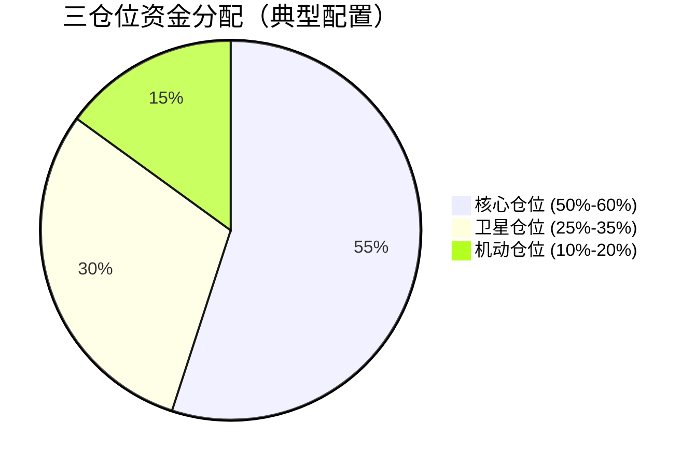
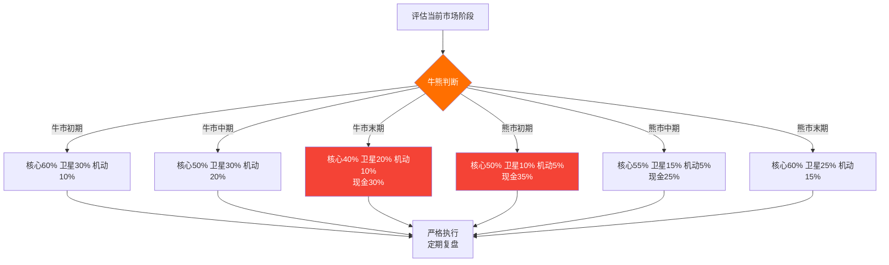

## 三、仓位管理

仓位管理是加密货币投资中**决定生死**的核心技能。如果说定投策略解决了"买什么、什么时候买"的问题，那么仓位管理解决的是"买多少、怎么分配、何时调整"的问题。同样的行情，仓位管理得当的人可以稳健盈利，而仓位失控的人却可能倾家荡产。

### 3.1 为什么仓位管理比择时更重要

很多新手把精力全部放在"判断涨跌"上，却忽略了仓位管理。事实上，即便是专业交易员，长期胜率也很难超过55%。真正让他们盈利的，不是判断对了多少次，而是**对的时候赚多少、错的时候亏多少**——这就是仓位管理的核心价值。

**仓位管理的三大作用**：

| 作用 | 说明 | 反面案例 |
|------|------|----------|
| 控制单笔亏损上限 | 确保任何一次交易的亏损不会伤及根本 | 2022年LUNA崩盘，全仓押注者一夜归零 |
| 优化风险收益比 | 让盈利仓位贡献更多，亏损仓位损失更少 | 涨了就加仓、跌了就死扛的"倒金字塔" |
| 保持长期存活 | 即使连续亏损也不会被淘汰出局 | 10倍杠杆连错两次，本金损失75% |

一个残酷的事实是：**亏损50%需要盈利100%才能回本**。这就是为什么仓位管理的第一原则永远是"不要大亏"。

| 亏损幅度 | 回本所需涨幅 | 难度等级 |
|----------|-------------|----------|
| -10% | +11.1% | 容易 |
| -20% | +25% | 一般 |
| -30% | +42.9% | 较难 |
| -50% | +100% | 困难 |
| -70% | +233% | 极难 |
| -90% | +900% | 几乎不可能 |

### 3.2 仓位管理的核心原则

#### 原则一：永远不满仓

满仓意味着你失去了所有灵活性。市场暴跌时没有子弹抄底，发现好机会时没有资金参与，遇到突发风险时只能被动承受。

**建议仓位上限**：

| 市场环境 | 加密资产占比（总资产） | 说明 |
|----------|----------------------|------|
| 牛市中期 | 40%-60% | 可以适当激进，但留足现金 |
| 牛市末期 | 20%-40% | 逐步减仓，锁定利润 |
| 熊市初期 | 10%-20% | 大幅降低风险敞口 |
| 熊市末期 | 20%-30% | 开始分批建仓，等待反转 |

#### 原则二：单笔亏损不超过总资金的2%

这是职业交易员的铁律。假设你有10万元本金，单笔交易的最大亏损不应超过2000元。这意味着如果你在某个价位买入，止损位的距离就决定了你能买多少。

**单笔仓位计算公式**：

```text
单笔仓位 = 可承受亏损金额 ÷ (买入价 - 止损价)

举例：
- 本金：100,000元
- 可承受亏损：100,000 × 2% = 2,000元
- BTC买入价：$60,000
- 止损价：$57,000（跌幅5%）
- 单笔仓位 = 2,000 ÷ 0.05 = 40,000元

即最多投入40,000元买入BTC，若跌破$57,000止损，亏损刚好为2,000元。
```

#### 原则三：分散但不过度分散

分散投资降低非系统性风险，但过度分散会导致研究精力分散、管理成本上升、收益被稀释。

**持仓数量建议**：

| 资金规模 | 建议持仓数 | 说明 |
|----------|-----------|------|
| < 5万元 | 2-3个 | 集中研究，深度理解 |
| 5-20万元 | 3-5个 | 核心+卫星配置 |
| 20-100万元 | 5-8个 | 适度分散，覆盖主流赛道 |
| > 100万元 | 8-12个 | 充分分散，但不超过15个 |

#### 原则四：根据确定性调整仓位

你对一个判断越有把握，仓位可以越重；越不确定，仓位越轻。这里的"确定性"不是自信程度，而是基于研究和数据得出的客观概率。

| 确定性等级 | 仓位比例 | 判断标准 |
|-----------|---------|---------|
| 极高 | 满仓位的80%-100% | 多个独立信号确认，基本面+技术面+链上数据一致 |
| 较高 | 满仓位的60%-80% | 主要信号确认，少数指标存疑 |
| 一般 | 满仓位的30%-60% | 信号混合，方向大致明确但节奏不确定 |
| 较低 | 满仓位的10%-30% | 试探性建仓，等待更多确认 |
| 极低 | 观望不参与 | 信号混乱，方向不明 |

### 3.3 三仓位管理模型

"三仓位"模型是将总资金划分为三个独立的仓位，分别承担不同的投资任务。这是从传统金融市场引入、经过加密货币市场验证的经典框架。

#### 三仓位的定义与职责



**核心仓位（Core Position）——50%-60%**

核心仓位的任务是**长期持有、穿越周期**。这部分资金投入你最有信心的资产，不因短期波动而动摇。

核心仓位的特征：
- **资产选择**：BTC、ETH等经过多轮牛熊验证的头部资产
- **持有周期**：至少跨越一个完整牛熊周期（3-5年）
- **操作频率**：极低，可能一年只调整1-2次
- **止损策略**：不设传统止损，但设定"逻辑止损"——当投资论点被证伪时才考虑卖出
- **收益目标**：获取市场β收益（跟随市场整体上涨）

核心仓位的建仓方式：


**卫星仓位（Satellite Position）——25%-35%**

卫星仓位的任务是**捕捉中期趋势，增强收益**。这部分资金用于中等确定性的交易机会，周期较短，操作相对灵活。

卫星仓位的特征：
- **资产选择**：SOL、AVAX等公链代币，以及热门赛道龙头（DeFi、Layer2、AI等）
- **持有周期**：数周到数月
- **操作频率**：中等，根据趋势调整
- **止损策略**：严格止损，单笔亏损不超过卫星仓位的5%
- **收益目标**：获取超额α收益（跑赢BTC/ETH）

卫星仓位的管理规则：
1. **分批建仓**：分3-4批进入，避免一次性买在高点
2. **移动止损**：盈利超过15%后，将止损上移到成本价（保本止损）
3. **目标止盈**：达到预设目标价后，分批卖出（先回本，再让利润奔跑）
4. **定期轮动**：每季度评估一次，淘汰弱势资产，纳入新的强势资产

**机动仓位（Tactical Position）——10%-20%**

机动仓位的任务是**捕捉短期机会，灵活应变**。这部分资金用于高确定性的短期交易、打新、空投参与等。

机动仓位的特征：
- **资产选择**：新上线代币、短期催化剂事件标的、DeFi挖矿
- **持有周期**：数天到数周
- **操作频率**：高，但总交易次数仍需控制
- **止损策略**：严格且快速，单笔亏损不超过机动仓位的3%
- **收益目标**：快速周转，积小胜为大胜

机动仓位的操作纪律：
1. **不恋战**：任何机动仓位的持仓不超过30天
2. **不追高**：只在突破确认后或回调到位后入场
3. **快进快出**：达到目标收益或触发止损时，立即执行
4. **记录复盘**：每笔交易记录入场理由、出场结果、复盘总结

#### 三仓位的动态调整

三仓位不是一成不变的，需要根据市场周期和个人情况进行动态调整。



**仓位之间的资金流动规则**：

| 操作 | 触发条件 | 操作方式 |
|------|---------|---------|
| 机动→现金 | 机动仓位单月亏损达10% | 暂停机动交易，转为现金等待 |
| 卫星→核心 | 卫星仓位某资产持仓超过6个月且基本面未变 | 转为核心持仓，降低操作频率 |
| 核心→现金 | 核心资产投资论点被证伪 | 分批卖出，不一次性清仓 |
| 现金→机动 | 市场出现高确定性短期机会 | 从现金中划拨到机动仓位 |
| 机动→卫星 | 机动仓位的短线标的展现中长期价值 | 转为卫星持仓，调整止损和目标 |

### 3.4 仓位管理的实用工具

#### 凯利公式的加密货币适配

凯利公式（Kelly Criterion）是理论上最优的仓位计算方法，但在实际应用中需要进行调整。

**原始凯利公式**：

```text
f* = (bp - q) / b

其中：
f* = 最优仓位比例
b  = 盈亏比（盈利/亏损）
p  = 胜率
q  = 败率（1 - p）
```

**加密货币实战调整**：由于加密市场波动极大，直接使用凯利公式会导致仓位过重。实战中建议使用**半凯利**（Half Kelly）或**四分之一凯利**（Quarter Kelly）。

**计算示例**：

假设你的交易策略统计如下：
- 历史胜率：45%
- 平均盈利：25%
- 平均亏损：10%
- 盈亏比 b = 25/10 = 2.5

```text
凯利比例 = (2.5 × 0.45 - 0.55) / 2.5 = 0.23 = 23%
半凯利 = 23% / 2 ≈ 11.5%
四分之一凯利 = 23% / 4 ≈ 5.75%

建议：使用半凯利（11.5%），即每笔交易投入总资金的11.5%
```

#### 仓位记录模板

每次交易都应记录以下信息，用于事后复盘和策略优化。

```markdown
## 交易记录模板

### 基本信息
- 日期：____
- 资产：____
- 方向：做多 / 做空
- 仓位类型：核心 / 卫星 / 机动

### 入场
- 入场价格：____
- 入场金额：____（占总资金____%）
- 入场理由：____
- 确定性等级：高 / 中 / 低

### 风控设置
- 止损价格：____（亏损____%）
- 止损金额：____（占总资金____%）
- 止盈目标1：____（盈利____%）
- 止盈目标2：____（盈利____%）

### 出场
- 出场价格：____
- 出场原因：____
- 实际盈亏：____（____%）
- 持仓时间：____

### 复盘
- 判断是否正确：是 / 否
- 操作是否规范：是 / 否
- 可改进之处：____
```

### 3.5 常见仓位管理错误

#### 错误一：越跌越买的"摊平成本"陷阱

很多投资者在资产下跌时不断加仓，美其名曰"摊低成本"。在股票市场中，优质公司跌多了确实可以加仓；但在加密货币市场，很多代币会**永久性下跌**——从最高点跌去99%后，再跌99%的案例比比皆是。

**正确做法**：
- 核心仓位（BTC/ETH）：可以逢跌加码，但要设定最大仓位上限
- 卫星仓位：跌破止损位必须止损，不摊平
- 机动仓位：绝对不摊平，亏了就认

#### 错误二：盈利时急于卖出，亏损时死扛不放

这是行为金融学中的"处置效应"——人们倾向于过早卖出盈利资产、过久持有亏损资产。

**正确做法**：
- 盈利仓位：用移动止损保护利润，让利润奔跑
- 亏损仓位：严格止损，不抱幻想
- 具体规则：亏损仓位超过止损线，当天必须执行；盈利仓位没有达到目标，不主动卖出

#### 错误三：频繁调整仓位

频繁买卖会导致：
- 交易手续费侵蚀利润（加密货币交易手续费通常0.1%-0.5%）
- 情绪消耗，判断力下降
- 错过大行情（频繁换仓可能在震荡中被反复止损）

**正确做法**：
- 核心仓位：一年调整不超过2次
- 卫星仓位：一个月调整不超过2次
- 机动仓位：虽然操作频繁，但总持仓不超过5个

#### 错误四：忽略仓位之间的相关性

你以为持有BTC、ETH、SOL是分散投资，但在市场暴跌时，它们往往同涨同跌——这就是**正相关性风险**。

**正确做法**：
- 考虑加入与加密市场弱相关的资产（如稳定币理财、链上国债等）
- 同赛道持仓不超过总仓位的30%
- 在极端行情中，用稳定币对冲部分风险

#### 错误五：没有为黑天鹅留仓位

加密货币市场的黑天鹅事件频率远高于传统市场：交易所暴雷、项目方跑路、监管突袭、智能合约被黑……

**正确做法**：
- 始终保留10%-20%的稳定币仓位
- 不把所有资产放在同一个交易所
- 热钱包资产不超过总资产的20%，大额资产使用冷钱包
- 对单一资产的敞口不超过总资产的25%

### 3.6 进阶：量化思维下的仓位管理

#### 波动率调整仓位

不同资产的波动率差异巨大。BTC的日波动率通常在2%-5%，而小市值代币的日波动率可能达到10%-30%。用固定金额管理不同波动率的资产是不合理的。

**波动率调整公式**：

```text
调整后仓位 = 基准仓位 × (基准波动率 / 该资产波动率)

示例：
- 基准仓位：50,000元（针对BTC）
- BTC 20日波动率：3%
- 某山寨币20日波动率：12%
- 调整后仓位 = 50,000 × (3% / 12%) = 12,500元

即：波动率是BTC 4倍的山寨币，仓位应缩减为BTC仓位的1/4
```

#### 多时间框架仓位协同

将不同时间框架的信号与仓位类型对应：

| 时间框架 | 对应仓位 | 分析周期 | 持仓周期 |
|----------|---------|---------|---------|
| 月线/周线 | 核心仓位 | 月度 | 1-5年 |
| 日线/4小时 | 卫星仓位 | 周度 | 1-6个月 |
| 1小时/15分钟 | 机动仓位 | 每日 | 1-30天 |

#### 仓位管理的心理账户

把总资金想象成三个独立的"心理账户"，每个账户有独立的目标和规则，互不干扰。当机动仓位亏损时，不要从核心仓位中抽调资金来"补救"——这是纪律底线。

**具体操作**：
1. 在交易所中使用不同的子账户或标签来区分三个仓位
2. 每个仓位独立记账、独立复盘
3. 资金流动只在预设条件下触发（见3.3节的流动规则表）
4. 每月底汇总一次总账，评估整体表现

### 3.7 不同资金规模的仓位管理方案

#### 小资金（1万-5万元）

| 要素 | 建议 |
|------|------|
| 资产数量 | 2-3个 |
| 核心仓位 | 70% BTC |
| 卫星仓位 | 20% ETH |
| 机动仓位 | 10% 用于学习实践 |
| 止损幅度 | 核心不设止损（长期持有），卫星10%止损 |
| 重点 | 以学习为主，不要追求暴利 |

#### 中等资金（5万-50万元）

| 要素 | 建议 |
|------|------|
| 资产数量 | 3-5个 |
| 核心仓位 | 50% BTC + ETH |
| 卫星仓位 | 30% 公链/赛道龙头 |
| 机动仓位 | 15% 短线机会 |
| 现金 | 5% 预留 |
| 止损幅度 | 核心20%，卫星10%，机动5% |
| 重点 | 建立系统，严格执行纪律 |

#### 大资金（50万元以上）

| 要素 | 建议 |
|------|------|
| 资产数量 | 5-8个 |
| 核心仓位 | 45% BTC + ETH（冷钱包存储） |
| 卫星仓位 | 25% 多赛道分散 |
| 机动仓位 | 10% 短线 + DeFi |
| 稳定币理财 | 15% 获取无风险收益 |
| 现金 | 5% 预留 |
| 止损幅度 | 核心25%，卫星10%，机动5% |
| 重点 | 资产安全第一，多交易所分散，冷钱包为主 |

### 3.8 仓位管理检查清单

每次调整仓位前，过一遍这个清单：

- [ ] 这次操作属于哪个仓位（核心/卫星/机动）？
- [ ] 单笔亏损是否控制在该仓位规则内？
- [ ] 总仓位是否超过了当前市场阶段的上限？
- [ ] 是否与已有持仓存在过高的相关性？
- [ ] 是否保留了足够的现金/稳定币？
- [ ] 止损位是否已经设定并愿意执行？
- [ ] 入场理由是否经得起推敲（不跟风、不FOMO）？
- [ ] 这笔交易的预期盈亏比是否大于2:1？

**记住**：仓位管理的目的不是让你赚最多的钱，而是让你在市场中**活得足够久**，久到能等到属于你的大机会。在加密货币这个高波动市场中，活着本身就是最大的优势。
