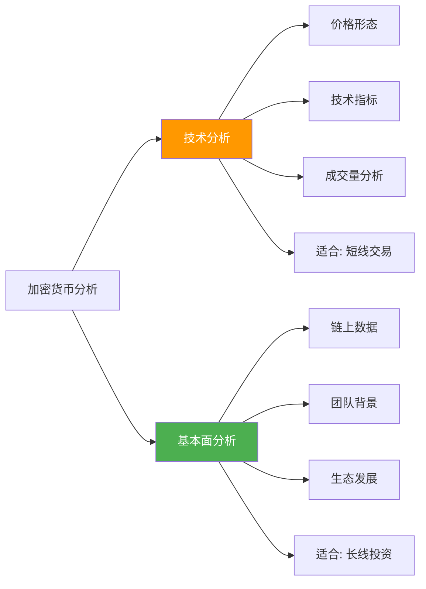
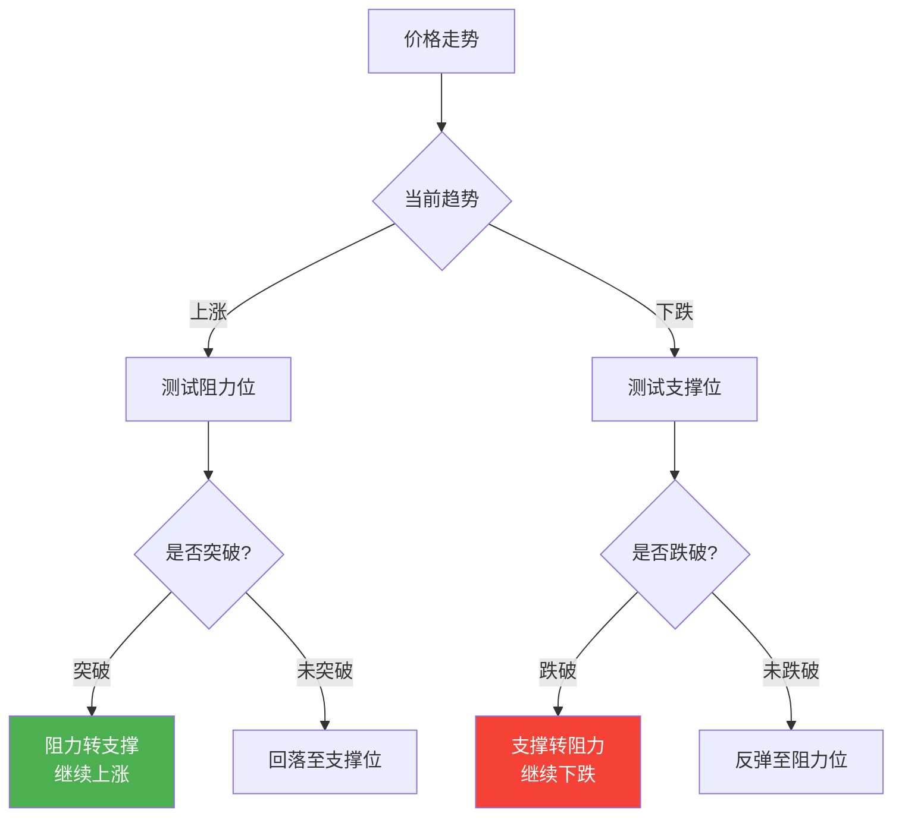
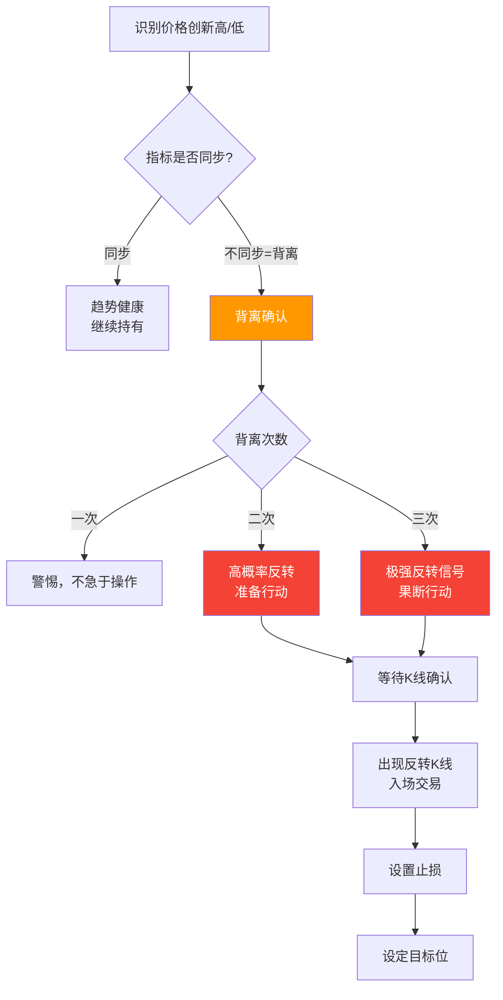

## 四、技术分析基础

技术分析是加密货币交易中最广泛使用的决策工具之一。与基本面分析关注项目价值不同，技术分析专注于价格和成交量的历史数据，试图从中发现规律并预测未来走势。在加密市场中，由于基本面信息高度不对称、项目估值缺乏共识，技术分析的重要性甚至超过传统金融市场。

本节将系统性地讲解技术分析的理论基础、核心工具和实操方法，帮助你建立一套可执行的交易分析框架。

### 4.1 技术分析的理论基础

#### 4.1.1 三大基本假设

技术分析建立在三个核心假设之上，理解这些假设是正确使用技术分析的前提：

**假设一：市场行为包容一切信息**

技术分析认为，所有可能影响资产价格的因素——基本面、政策面、情绪面、资金面——都已经反映在价格中。因此，不需要分析这些因素本身，只需要分析价格走势。

这个假设在加密市场中尤其有道理：消息面变化极快，散户往往在消息公布时已经被"收割"。但需要注意，这个假设并非完美——加密市场存在严重的内幕交易和信息不对称，重大黑天鹅事件（如交易所暴雷）发生时，价格会出现技术分析无法预判的剧烈跳空。

**假设二：价格以趋势方式演变**

价格不会随机游走，而是沿着一定趋势运动。趋势一旦形成，往往会持续一段时间，直到有明确的反转信号。这个假设使得"顺势交易"成为可能。

在加密市场中，趋势效应特别明显：牛市中几乎所有币都涨，熊市中几乎所有币都跌。比特币的趋势通常会引领整个市场。

**假设三：历史会重演**

人类的心理和行为模式具有重复性。过去出现过的价格形态和交易行为，未来大概率还会以类似方式出现。这一假设基于行为金融学——投资者的贪婪和恐惧是不变的。

#### 4.1.2 技术分析的局限性

了解局限性同样重要，避免盲目迷信技术分析：

| 局限性 | 说明 | 加密市场的特殊性 |
|--------|------|-----------------|
| 滞后性 | 所有指标都是基于历史数据计算的 | 加密市场24/7交易，变化速度更快 |
| 假信号 | 指标可能发出错误信号 | 市场操纵严重，假突破频繁 |
| 自我实现预言 | 大量交易者使用相同指标会强化信号 | 庄家利用这一点制造"画线"陷阱 |
| 无法预测黑天鹅 | 突发事件会打破所有技术形态 | 监管政策、交易所事件、黑客攻击频繁 |
| 不同时间框架矛盾 | 日线看涨但周线看跌 | 需要建立多时间框架分析体系 |

#### 4.1.3 技术分析 vs 基本面分析

在加密货币交易中，两种分析方法各有适用场景：



**实用建议**：不要二选一，而是结合使用。用基本面筛选标的（选什么币），用技术分析选择时机（什么时候买、什么时候卖）。

### 4.2 K线图基础

K线（蜡烛图）是技术分析的基本载体。读懂K线是所有后续分析的前提。

#### 4.2.1 K线的构成

每根K线由四个价格数据构成：

```text
    │          ← 上影线（最高价 - 收盘价或开盘价）
  ┌─┴─┐
  │   │        ← 实体（开盘价与收盘价之间）
  │   │
  └─┬─┘
    │          ← 下影线（最低价 - 开盘价或收盘价）
```

- **阳线（绿色/白色）**：收盘价 > 开盘价，表示上涨
- **阴线（红色/黑色）**：收盘价 < 开盘价，表示下跌
- **实体长度**：实体越长，买卖力量越强
- **影线长度**：影线越长，反转信号越强

> **注意**：不同交易所的颜色设置可能不同。建议统一设置为"绿涨红跌"，与国内习惯一致。部分交易所（如Bybit）默认为"红涨绿跌"，初学者容易混淆。

#### 4.2.2 常见K线形态

**单根K线形态**：

| 形态名称 | 外观特征 | 含义 | 出现位置 |
|----------|---------|------|---------|
| 大阳线 | 实体很长，影线很短 | 强烈看涨，买方主导 | 任何位置 |
| 大阴线 | 实体很长，影线很短 | 强烈看跌，卖方主导 | 任何位置 |
| 十字星 | 实体极小，上下影线 | 多空平衡，可能反转 | 趋势末端 |
| 锤子线 | 下影线很长，实体在上方 | 看涨反转信号 | 下跌趋势底部 |
| 上吊线 | 与锤子线外形相同 | 看跌反转信号 | 上涨趋势顶部 |
| 射击之星 | 上影线很长，实体在下方 | 看跌反转信号 | 上涨趋势顶部 |
| 倒锤子线 | 与射击之星外形相同 | 看涨反转信号 | 下跌趋势底部 |
| 吞没形态 | 后一根K线完全覆盖前一根 | 强烈反转信号 | 趋势末端 |

**多根K线组合形态**：

| 形态名称 | K线数量 | 构成 | 含义 |
|----------|---------|------|------|
| 早晨之星 | 3根 | 大阴线 + 十字星/小实体 + 大阳线 | 底部反转看涨 |
| 黄昏之星 | 3根 | 大阳线 + 十字星/小实体 + 大阴线 | 顶部反转看跌 |
| 三只乌鸦 | 3根 | 连续三根大阴线 | 强烈看跌 |
| 红三兵 | 3根 | 连续三根大阳线 | 强烈看涨 |
| 孕线 | 2根 | 前一根大实体，后一根被包含 | 犹豫不决，可能反转 |

#### 4.2.3 不同K线变体

| K线类型 | 特点 | 适用场景 |
|---------|------|---------|
| 标准K线 | 传统蜡烛图，最常用 | 通用分析 |
| Heikin-Ashi | 平均K线，过滤噪音 | 趋势识别 |
| Renko | 只关注价格变化幅度 | 过滤震荡 |
| 点数图 | 只关注价格，忽略时间 | 识别支撑阻力 |

**Heikin-Ashi K线的计算方式**：

```text
HA收盘价 = (开盘价 + 最高价 + 最低价 + 收盘价) / 4
HA开盘价 = (前一根HA开盘价 + 前一根HA收盘价) / 2
HA最高价 = max(最高价, HA开盘价, HA收盘价)
HA最低价 = min(最低价, HA开盘价, HA收盘价)
```

Heikin-Ashi的优势在于能够平滑价格波动，更清晰地显示趋势方向。连续的绿色HA K线表示强势上涨趋势，连续的红色表示强势下跌趋势。但缺点是存在滞后性，不适合精确捕捉反转点。

### 4.3 支撑位与阻力位

支撑位和阻力位是技术分析中最基础、最重要的概念。几乎所有交易策略都围绕这两个概念展开。

#### 4.3.1 什么是支撑位和阻力位

- **支撑位**：价格下跌到某个水平后受到买方力量支撑，停止下跌甚至反弹的位置。可以理解为"地板"。
- **阻力位**：价格上涨到某个水平后受到卖方压力，停止上涨甚至回落的位置。可以理解为"天花板"。

支撑和阻力角色互换原则：当支撑位被有效跌破后，会转变为阻力位；当阻力位被有效突破后，会转变为支撑位。这是技术分析中最可靠的规律之一。



#### 4.3.2 如何识别支撑阻力位

**方法一：历史价格密集区**

价格在某个区间反复停留、多次触及，该区域就形成了支撑或阻力。触及次数越多，支撑/阻力越强。

**方法二：整数关口**

心理整数关口（如BTC的$60,000、$70,000）往往天然构成支撑或阻力。大量交易者会在整数位设置挂单，导致价格在此处反复。

**方法三：前期高点和低点**

前期的高点是天然的阻力位，前期的低点是天然的支撑位。当价格再次接近这些位置时，交易者会参考历史做出决策。

**方法四：斐波那契回撤位**

基于斐波那契数列计算的关键价位。从一段明显趋势的起点到终点，计算以下回撤比例：

| 斐波那契比率 | 含义 | 使用方法 |
|-------------|------|---------|
| 0.236 (23.6%) | 浅回撤 | 强势趋势中的回调目标 |
| 0.382 (38.2%) | 正常回撤 | 健康回调的常见位置 |
| 0.500 (50.0%) | 中位回撤 | 趋势中继的参考位置 |
| 0.618 (61.8%) | 深回撤 | 黄金分割率，极重要的支撑阻力 |
| 0.786 (78.6%) | 极深回撤 | 趋势可能已经反转的警告 |

**斐波那契回撤位使用步骤**：

1. 在图表上选择一段明显趋势的起点和终点
2. 上涨趋势：从低点拉到高点，回撤位作为支撑参考
3. 下跌趋势：从高点拉到低点，回撤位作为阻力参考
4. 关注0.382和0.618这两个最重要位置的反应

**方法五：趋势线**

将多个低点（上升趋势）或多个高点（下降趋势）用直线连接，形成趋势线。趋势线本身构成动态的支撑或阻力。

**绘制规则**：
- 至少需要两个点才能画出趋势线
- 第三个点验证趋势线的有效性
- 触及次数越多，趋势线越有效
- 有效趋势线被突破后，原支撑转阻力或反之

#### 4.3.3 支撑阻力的强弱判断

不是所有支撑阻力位都一样重要。判断强弱的依据：

| 强弱因素 | 强支撑/阻力 | 弱支撑/阻力 |
|----------|-----------|-----------|
| 触及次数 | 多次触及均有效 | 仅触及1-2次 |
| 停留时间 | 长时间在此区域整理 | 快速穿过 |
| 成交量 | 触及位置放大量 | 缩量触及 |
| 时间距离 | 近期形成的 | 很久以前形成的 |
| K线反应 | 长影线、吞没形态 | 小实体K线 |

### 4.4 趋势分析

#### 4.4.1 趋势的定义

趋势是价格运动的总体方向。技术分析的核心目标之一就是识别趋势并顺势交易。

**道氏理论中的趋势分类**：

| 趋势类型 | 持续时间 | 特征 | 交易策略 |
|----------|---------|------|---------|
| 主要趋势 | 数月到数年 | 大方向，如牛市或熊市 | 长线持仓 |
| 中期趋势 | 数周到数月 | 主要趋势中的回调 | 波段交易 |
| 短期趋势 | 数天到数周 | 日常波动 | 短线交易 |

**上升趋势的定义**：价格形成一系列更高的高点（Higher High, HH）和更高的低点（Higher Low, HL）。

**下降趋势的定义**：价格形成一系列更低的低点（Lower Low, LL）和更低的高点（Lower High, LH）。

**盘整（横盘震荡）**：价格在一定区间内上下波动，没有明显的高低点排列规律。

#### 4.4.2 趋势线的画法与使用

**上升趋势线**：
1. 找到两个或更多的有效低点
2. 用直线从左下向右上连接
3. 价格回调到趋势线附近时，可能是买入机会
4. 趋势线被有效跌破，可能是趋势结束的信号

**下降趋势线**：
1. 找到两个或更多的有效高点
2. 用直线从左上向右下连接
3. 价格反弹到趋势线附近时，可能是卖出机会
4. 趋势线被有效向上突破，可能是趋势结束的信号

**趋势通道**：

在趋势线的对面画一条平行线，形成价格通道。价格在通道内运动时，可以在通道下轨买入、上轨卖出。

> **实战经验**：加密市场的趋势线突破经常是假突破。建议用收盘价（而非影线）确认突破，且等待一根完整K线收盘在突破位置之外。

#### 4.4.3 移动平均线（MA）

移动平均线是最基础也是最实用的趋势跟踪指标。它通过计算一段时间内收盘价的平均值来平滑价格波动。

**常见周期**：

| 周期 | 名称 | 主要用途 |
|------|------|---------|
| MA7 | 超短期均线 | 识别短期动量变化 |
| MA20 | 短期均线（月线） | 短线交易参考 |
| MA50 | 中期均线 | 中线趋势判断 |
| MA100 | 中长期均线 | 牛熊分界参考 |
| MA200 | 长期均线（年线） | 判断长期趋势方向 |

**常见的均线交易信号**：

| 信号 | 构成 | 含义 |
|------|------|------|
| 金叉 | 短期MA上穿长期MA | 看涨信号 |
| 死叉 | 短期MA下穿长期MA | 看跌信号 |
| 多头排列 | MA7 > MA20 > MA50 > MA200 | 强势上涨趋势 |
| 空头排列 | MA7 < MA20 < MA50 < MA200 | 强势下跌趋势 |
| 均线粘合 | 多条均线接近重合 | 即将选择方向 |
| 价格回踩均线 | 价格回调到MA附近获支撑 | 趋势延续信号 |

**SMA vs EMA**：

- **SMA（简单移动平均）**：等权重计算，更平滑但滞后性更强
- **EMA（指数移动平均）**：近期数据权重更高，对价格变化更敏感

加密货币交易中常用EMA，因为市场变化快，需要更灵敏的指标。推荐组合：EMA12 和 EMA26（这也是MACD的基础）。

#### 4.4.4 MACD指标

MACD（Moving Average Convergence Divergence，移动平均收敛发散指标）是最流行的趋势跟踪+动量指标之一。

**构成**：

```text
MACD线 = EMA12 - EMA26
信号线 = MACD线的EMA9
柱状图 = MACD线 - 信号线
```

**核心信号**：

| 信号 | 条件 | 含义 | 可靠性 |
|------|------|------|--------|
| 金叉 | MACD线上穿信号线 | 看涨，买入信号 | 较高 |
| 死叉 | MACD线下穿信号线 | 看跌，卖出信号 | 较高 |
| 零轴上方金叉 | MACD在0以上金叉 | 强势看涨 | 高 |
| 零轴下方死叉 | MACD在0以下死叉 | 强势看跌 | 高 |
| 柱状图由负转正 | 绿柱出现 | 多方力量增强 | 中等 |
| 柱状图由正转负 | 红柱出现 | 空方力量增强 | 中等 |

**MACD背离**（在4.6节详细讨论）是比金叉死叉更强的信号。

### 4.5 常用技术指标

#### 4.5.1 RSI（相对强弱指标）

RSI衡量一段时间内上涨幅度与下跌幅度的相对大小，用于判断超买超卖状态。

**计算公式**：

```text
RSI = 100 - 100 / (1 + RS)
RS = N日内平均涨幅 / N日内平均跌幅
常用N = 14
```

**RSI的解读**：

| RSI区间 | 状态 | 含义 | 操作思路 |
|---------|------|------|---------|
| > 80 | 严重超买 | 上涨过度，可能回调 | 考虑卖出/减仓 |
| 70-80 | 超买 | 上涨动能可能减弱 | 关注卖出信号 |
| 50 | 中性线 | 多空平衡 | 观望 |
| 20-30 | 超卖 | 下跌过度，可能反弹 | 关注买入信号 |
| < 20 | 严重超卖 | 下跌过度，可能见底 | 考虑买入/加仓 |

**重要提醒**：在强势趋势中，RSI可以长时间停留在超买或超卖区域。牛市中RSI超过70并不代表必须卖出，可能价格继续创新高。RSI超买不等于卖出信号，需要结合趋势判断。

#### 4.5.2 布林带（Bollinger Bands）

布林带由三条线组成，用于衡量价格波动的范围和趋势方向。

**构成**：

```text
中轨 = MA20
上轨 = MA20 + 2 × 标准差
下轨 = MA20 - 2 × 标准差
```

**交易信号**：

| 现象 | 含义 | 操作建议 |
|------|------|---------|
| 价格触及上轨 | 短期可能超买 | 观察是否突破 |
| 价格触及下轨 | 短期可能超卖 | 观察是否跌破 |
| 布林带收窄 | 波动率降低，即将变盘 | 准备迎接大行情 |
| 布林带扩张 | 波动率增大，趋势展开 | 顺势交易 |
| 价格沿上轨运行 | 强势上涨趋势 | 持有多仓 |
| 价格沿下轨运行 | 强势下跌趋势 | 持有空仓或观望 |

**布林带收窄→扩张**是一个非常实用的交易信号。当布林带长时间收窄后突然扩张，往往预示着大行情的启动。关键是方向判断——结合成交量和趋势方向来判断扩张方向。

#### 4.5.3 成交量（Volume）

成交量是价格运动的"燃料"，是验证价格走势可靠性的关键指标。

**量价关系分析**：

| 价格 | 成交量 | 含义 | 可靠性 |
|------|--------|------|--------|
| 上涨 + 放量 | 买方力量强劲 | 趋势健康 | 高 |
| 上涨 + 缩量 | 买方力量减弱 | 上涨动能不足 | 中等 |
| 下跌 + 放量 | 卖方力量强劲 | 趋势健康（看跌） | 高 |
| 下跌 + 缩量 | 卖方力量减弱 | 可能见底 | 中等 |
| 突破 + 放量 | 真突破概率高 | 高 |
| 突破 + 缩量 | 假突破概率高 | 低 |

**OBV（能量潮）指标**：

OBV通过累计成交量来判断资金流向。如果收盘价上涨，当日成交量计入OBV；如果下跌，当日成交量从OBV中扣除。

- OBV创新高：资金持续流入，看涨
- OBV创新低：资金持续流出，看跌
- 价格创新高但OBV未创新高：顶背离，上涨可能结束
- 价格创新低但OBV未创新低：底背离，下跌可能结束

#### 4.5.4 KDJ指标

KDJ是常用的摆动指标，特别适合判断短期超买超卖和转折点。

**构成**：

```text
K值 = 2/3 × 前一日K值 + 1/3 × RSV
D值 = 2/3 × 前一日D值 + 1/3 × K值
J值 = 3K - 2D
RSV = (收盘价 - N日最低价) / (N日最高价 - N日最低价) × 100
常用N = 9
```

**KDJ信号**：

| 信号 | 条件 | 含义 |
|------|------|------|
| 金叉 | K线上穿D线 | 看涨，J < 20时更有效 |
| 死叉 | K线下穿D线 | 看跌，J > 80时更有效 |
| 超买 | J > 100 | 短期可能回调 |
| 超卖 | J < 0 | 短期可能反弹 |

KDJ在震荡市中表现优秀，但在趋势市中会频繁发出假信号。建议配合趋势指标（如MA）一起使用。

#### 4.5.5 ATR（真实波动幅度均值）

ATR衡量价格的波动程度，不预测方向，只衡量波动大小。

**用途**：

| 用途 | 方法 |
|------|------|
| 设置止损 | 止损距离 = N × ATR（常用N=2） |
| 仓位计算 | 每单位仓位风险 = 账户资金 × 风险比例 / ATR |
| 过滤假突破 | 突破幅度需超过1倍ATR才视为有效 |
| 波动率比较 | 比较不同币种的波动大小 |

**ATR止损法**：

这是专业交易者最常用的止损方法。入场后将止损设置在入场价 ± 2×ATR的位置。ATR自动适应市场波动：波动大时止损更宽，波动小时止损更窄。

### 4.6 经典图表形态

图表形态是价格在K线图上形成的特定图形，用于预判后续走势方向。

#### 4.6.1 反转形态

反转形态出现在趋势末端，预示趋势即将改变方向。

**头肩顶/底**：

头肩顶是最经典的顶部反转形态，由三个高点组成，中间最高（头），两侧较低且大致等高（左肩和右肩）。

```text
        头
       /  \
      /    \
左肩/      \右肩
  /   颈线   \
───────────────→ 突破颈线 = 确认反转
```

**交易策略**：
1. 识别左肩和头部的形成
2. 右肩形成时开始警惕
3. 价格跌破颈线（放量）确认反转
4. 目标位：从头部到颈线的距离，等距向下测量
5. 止损：设置在右肩上方

**双顶/双底**：

双顶（M形态）和双底（W形态）是最常见的反转形态。

| 形态 | 外观 | 成交量特征 | 目标位 |
|------|------|-----------|--------|
| 双顶 | M形 | 第二个顶成交量更小 | 从顶到颈线等距下移 |
| 双底 | W形 | 第二个底成交量更小 | 从底到颈线等距上移 |

**圆弧顶/底**：

价格缓慢地、弧线形地转向。圆弧底在加密市场中较为常见，形态完成后往往有非常强的趋势行情。

#### 4.6.2 持续形态

持续形态出现在趋势中途，表示经过短暂整理后趋势将继续。

**三角形整理**：

| 类型 | 形态 | 突破方向 | 出现位置 |
|------|------|---------|---------|
| 对称三角形 | 上下边收窄 | 双向，通常顺原趋势 | 任何位置 |
| 上升三角形 | 上边平，下边上移 | 通常向上突破 | 上涨趋势中 |
| 下降三角形 | 下边平，下边下移 | 通常向下突破 | 下跌趋势中 |

**旗形和楔形**：

旗形是短暂的、与主趋势方向相反的小幅整理，形似旗帜。旗形整理后的突破，往往延续原有趋势。旗形通常在趋势的前半段出现，持续时间1-3周。

**楔形**：

- 上升楔形（两条向上收敛的线）：看跌信号
- 下降楔形（两条向下收敛的线）：看涨信号

楔形出现在上涨趋势中通常意味着顶部形成；出现在下跌趋势中通常意味着底部形成。

#### 4.6.3 形态交易的注意事项

1. **等待确认**：形态完成前不要提前入场，等待突破确认
2. **关注成交量**：真正的突破必须伴随成交量放大
3. **目标位测量**：每种形态都有对应的测量方法，目标位只是参考
4. **形态越大越有效**：持续时间越长、幅度越大的形态，突破后行情越大
5. **形态可能失败**：任何形态都可能失败，必须设置止损

### 4.7 背离分析

背离是技术分析中可靠性最高的信号之一，指价格走势与技术指标走势出现不一致。

#### 4.7.1 背离的类型

| 背离类型 | 价格 | 指标 | 含义 | 可靠性 |
|---------|------|------|------|--------|
| 顶背离 | 创新高 | 未创新高 | 上涨动能减弱 | 高 |
| 底背离 | 创新低 | 未创新低 | 下跌动能减弱 | 高 |
| 隐藏顶背离 | 未创新高 | 创新高 | 下跌趋势延续 | 中等 |
| 隐藏底背离 | 未创新低 | 创新低 | 上涨趋势延续 | 中等 |

**适合检测背离的指标**：

- **RSI**：最常用，14日RSI的背离信号可靠性较高
- **MACD**：MACD柱状图或MACD线的背离
- **OBV**：成交量背离，往往领先于价格
- **Stochastic**：KDJ指标的背离

#### 4.7.2 背离交易策略

**基本背离交易流程**：



**重要规则**：
- 背离信号需要K线形态确认，不要仅凭背离就下单
- 多次背离比单次背离更可靠
- 背离只预示趋势可能结束，不预示反转幅度
- 高级别时间框架（日线、周线）的背离比低级别更可靠

### 4.8 多时间框架分析

#### 4.8.1 为什么要看多个时间框架

不同时间框架展示不同级别的趋势。只看单一时间框架容易"一叶障目"——5分钟图上的趋势，在日线图上可能只是一个小波动。

**时间框架体系**：

| 时间框架 | 用途 | 适合交易风格 |
|---------|------|-------------|
| 月线/周线 | 判断大趋势方向 | 长线投资 |
| 日线 | 中期趋势和主要支撑阻力 | 波段交易 |
| 4小时 | 短期趋势和入场时机 | 短线交易 |
| 1小时 | 精确入场点位 | 日内交易 |
| 15分钟/5分钟 | 超短线入场 | 高频交易 |

#### 4.8.2 三屏分析法

三屏分析法（Triple Screen）是亚历山大·埃尔德提出的方法，用三个不同时间框架来过滤信号：

| 屏幕 | 时间框架 | 分析内容 | 决策 |
|------|---------|---------|------|
| 第一屏 | 长期（如周线） | 判断大趋势方向 | 顺势方向 |
| 第二屏 | 中期（如日线） | 用指标寻找反向交易机会 | 确认入场区域 |
| 第三屏 | 短期（如4小时） | 精确入场和止损 | 执行交易 |

**操作流程**：
1. 周线确认大趋势（做多还是做空）
2. 日线等待回调到支撑/阻力区域，用RSI确认超买超卖
3. 4小时图上用突破信号精确入场

> **经验法则**：时间框架之间的比例大约为4-5倍。例如日线→4小时→1小时；周线→日线→4小时。

### 4.9 构建个人交易系统

技术分析的最终目的是建立一套可执行、可复制、可优化的交易系统。没有任何单一指标是万能的，必须将多个工具组合使用。

#### 4.9.1 交易系统的基本框架

一个完整的交易系统需要回答以下问题：

| 问题 | 需要确定的内容 | 对应工具 |
|------|--------------|---------|
| 买什么？ | 选择交易标的 | 基本面分析 + 相对强弱 |
| 什么方向？ | 做多还是做空 | 趋势分析（MA、趋势线） |
| 什么时候买？ | 入场时机 | K线形态 + 指标信号 |
| 买多少？ | 仓位大小 | ATR + 风险管理 |
| 止损设在哪里？ | 最大亏损 | 支撑阻力 + ATR |
| 止盈设在哪里？ | 目标利润 | 阻力位 + 风险回报比 |
| 什么时候卖？ | 持仓管理 | 移动止损 + 信号反转 |

#### 4.9.2 示例：趋势跟踪系统

以下是一个基于趋势跟踪的完整交易系统示例：

**入场条件（全部满足才入场）**：
1. 日线EMA20在EMA50之上（确认上升趋势）
2. 价格回调到EMA20附近（回踩支撑）
3. RSI从超卖区回升到40以上（动量恢复）
4. 4小时图出现阳线吞没形态（K线确认）
5. 入场K线成交量高于前5根K线平均量（放量确认）

**止损设置**：
- 入场价下方1.5倍ATR处
- 同时不能低于回调低点

**止盈策略**：
- 目标1：风险回报比1:1时，止盈50%
- 目标2：风险回报比1:2时，止盈30%
- 剩余仓位使用移动止损（跟踪止损）

**仓位计算**：
```text
单笔最大风险 = 账户总资金 × 2%
止损距离 = 入场价 - 止损价
仓位大小 = 单笔最大风险 / 止损距离
```

**示例**：
- 账户：10,000 USDT
- 单笔最大风险：10,000 × 2% = 200 USDT
- BTC入场价：65,000 USDT
- 止损价：63,000 USDT（止损距离2,000 USDT）
- 仓位大小：200 / 2,000 = 0.1 BTC（约6,500 USDT）

#### 4.9.3 交易系统的回测与优化

在用真金白银之前，先用历史数据回测你的系统：

**回测步骤**：
1. 定义明确的入场和出场规则（不能含糊）
2. 选择至少6个月的历史数据
3. 逐根K线检查是否满足条件
4. 记录每笔交易的入场价、止损价、止盈价、持仓时间
5. 计算关键指标

**核心评估指标**：

| 指标 | 公式 | 健康范围 |
|------|------|---------|
| 胜率 | 盈利次数 / 总交易次数 | > 40% |
| 盈亏比 | 平均盈利 / 平均亏损 | > 1.5:1 |
| 期望值 | 胜率 × 平均盈利 - 败率 × 平均亏损 | > 0 |
| 最大回撤 | 峰值到谷值的最大损失 | < 20% |
| 夏普比率 | 年化收益 / 年化波动率 | > 1.0 |

> **回测陷阱**：过度优化（曲线拟合）是回测中最常见的错误。如果一个系统在回测中表现完美但在实盘中表现糟糕，很可能是过度优化了。解决方法：用训练集优化参数，用测试集验证效果。

#### 4.9.4 交易日志

记录每一笔交易是提升交易水平的关键。交易日志至少包含：

```text
日期：2024-01-15
标的：BTC/USDT
方向：做多
入场价：42,500
止损价：41,200
止盈目标：45,100
仓位：0.5 BTC
入场理由：EMA金叉 + 回踩支撑 + RSI底背离
实际出场价：44,800
盈亏：+2,300 USDT (+5.4%)
执行评价：入场时机好，但提前止盈了（目标未到）
教训：应该使用移动止损而不是提前手动止盈
```

### 4.10 加密货币技术分析的特殊性

加密市场的技术分析与传统市场有显著不同，需要注意以下特殊因素：

#### 4.10.1 24/7不间断交易

加密市场没有休市，价格随时在变动。这意味着：
- 周末和节假日也会出现大行情
- 跳空缺口较少（因为不间断交易），但重大事件时仍会出现
- 身体和心理需要休息，但市场不需要。建议设置价格警报而不是24小时盯盘

#### 4.10.2 比特币的主导地位

比特币的走势几乎影响所有山寨币。分析任何山寨币时，必须先分析比特币的趋势方向。

| BTC趋势 | 山寨币表现 | 操作策略 |
|---------|-----------|---------|
| BTC强势上涨 | 山寨币可能滞后但跟随 | 可以持有山寨币 |
| BTC横盘震荡 | 山寨币可能活跃（山寨季） | 小仓位尝试山寨币 |
| BTC下跌 | 山寨币跌得更多 | 减少山寨币仓位或空仓 |

**比特币市占率（BTC.D）** 是判断山寨季的重要指标：
- BTC.D上升：资金流向BTC，山寨币表现差
- BTC.D下降：资金流向山寨币，山寨季可能到来

#### 4.10.3 永续合约资金费率

加密市场的永续合约有独特的资金费率机制，它本身就是一种技术分析工具：

| 资金费率 | 市场状态 | 含义 |
|---------|---------|------|
| 极高正值（>0.1%） | 多头拥挤 | 可能见顶，回调风险大 |
| 正常正值（0.01%-0.03%） | 正常看涨 | 趋势健康 |
| 接近0 | 中性 | 多空平衡 |
| 负值 | 空头占优 | 可能见底，反弹概率增加 |
| 极高负值（<-0.1%） | 空头极度拥挤 | 可能见底反弹 |

#### 4.10.4 流动性差异

加密市场的流动性远不如传统金融市场，尤其是一些中小市值代币。流动性差意味着：
- 大单可以造成剧烈价格波动（滑点大）
- 技术形态更容易被人为制造（画线）
- 止损可能在极端行情中无法以预期价格成交（滑穿）
- 建议优先选择日交易量 > 1亿美元的标的进行技术分析

### 4.11 常见误区与纠正

| 误区 | 正确理解 |
|------|---------|
| 技术分析能预测未来 | 技术分析只能提高概率，不能确定性预测 |
| 指标越多越好 | 指标过多会产生矛盾信号，3-5个足矣 |
| 超买就必须卖 | 强趋势中指标可以长期超买/超卖 |
| 背离一定会反转 | 背离只是预警，需要K线确认 |
| 形态完成一定会走 | 任何形态都可能失败 |
| 只看一个时间框架 | 必须多时间框架确认 |
| 追求完美入场点 | 模糊的正确好过精确的错误 |
| 忽视成交量 | 没有量确认的信号不可靠 |
| 回撤中逆势交易 | 逆势交易是亏损最快的方式 |
| 频繁交易 | 交易次数越多，犯错越多，手续费侵蚀越大 |

### 4.12 推荐学习路径

| 阶段 | 学习内容 | 建议时间 | 练习方法 |
|------|---------|---------|---------|
| 入门 | K线基础、支撑阻力、趋势线 | 1-2周 | 在图表上标注识别 |
| 基础 | MA、RSI、MACD、成交量 | 2-4周 | 回测简单信号 |
| 进阶 | 图表形态、背离、多时间框架 | 1-2月 | 模拟盘交易 |
| 实战 | 构建交易系统、回测优化 | 2-3月 | 小资金实盘验证 |
| 精通 | 仓位管理、情绪控制、系统迭代 | 持续 | 真实交易复盘 |

**推荐学习资源**：

- 《日本蜡烛图技术》（Steve Nison）：K线分析的权威教材
- 《技术分析》（Martin Pring）：技术分析全面入门
- 《以交易为生》（Alexander Elder）：交易系统构建方法
- TradingView：最好的免费图表分析平台，支持加密货币
- CoinGlass：加密货币专业数据平台（资金费率、爆仓数据等）

> **最后的忠告**：技术分析是工具，不是圣杯。它能提高你的胜率，但不能保证每笔交易都盈利。交易的核心永远是风险管理——控制亏损，让利润奔跑。在加密市场中，这一点尤为重要，因为波动性远超传统市场。

***
