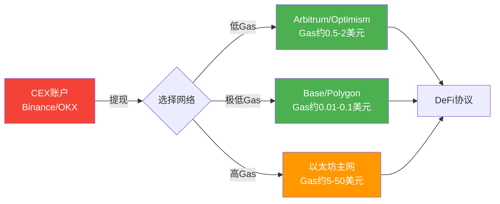
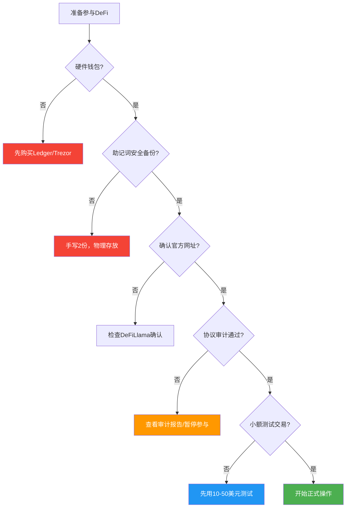
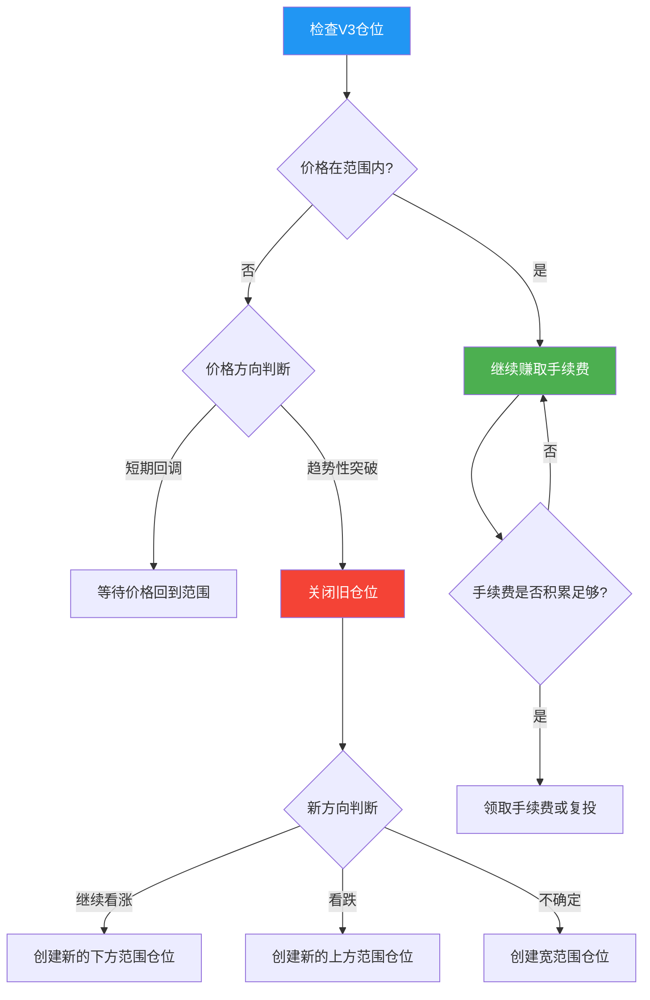
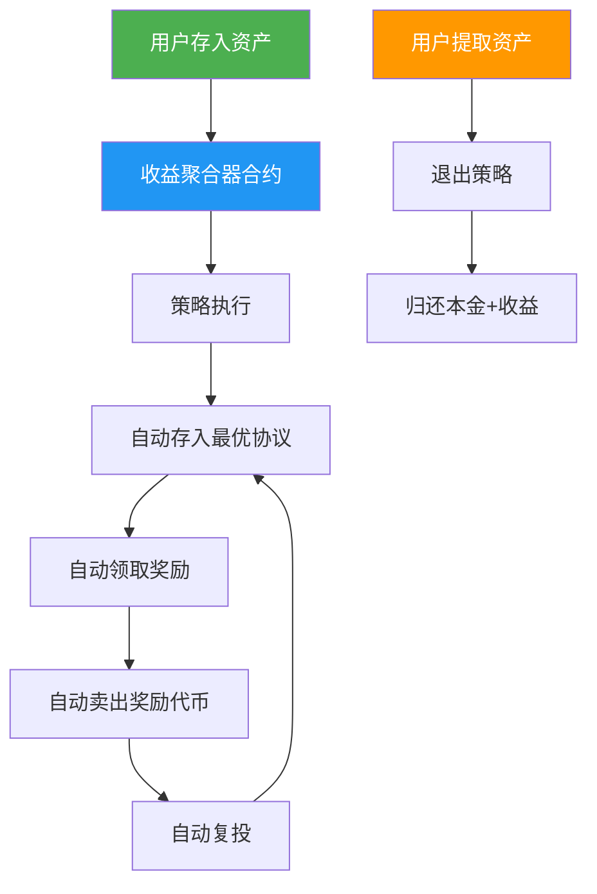
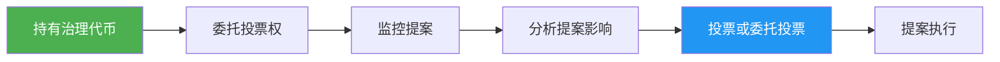
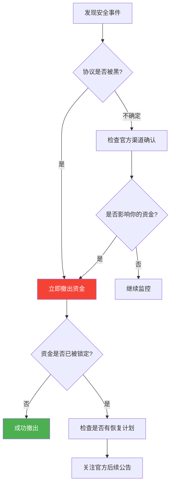
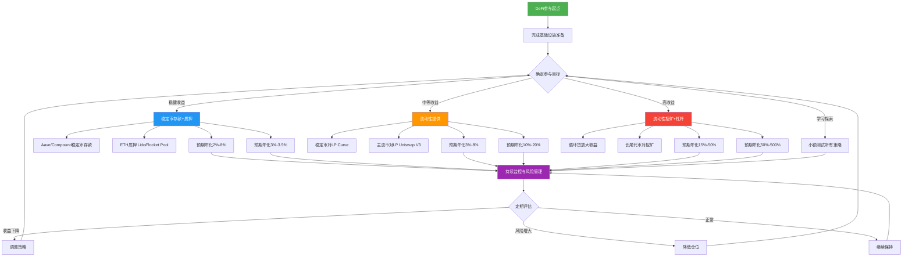

## 五、DeFi参与技巧

DeFi理论基础（见理论基础章节）帮你理解了AMM公式、超额抵押借贷、无常损失的数学原理。本章是"动手篇"——从准备钱包、第一次提供流动性、第一次借贷，到高级的收益聚合、多协议策略和风险对冲，每一步都给出具体操作路径、工具选择和注意事项。

### 5.1 DeFi参与前的准备工作

在与任何DeFi协议交互之前，需要完成基础设施搭建。这一步决定了后续所有操作的安全底线。

#### 5.1.1 钱包配置

**钱包选择矩阵**：

| 钱包类型 | 代表产品 | 安全性 | 便捷性 | 适用场景 |
|---------|---------|-------|-------|---------|
| 硬件钱包 | Ledger Nano X / Trezor Model T | ★★★★★ | ★★☆ | 大额资产长期存储 |
| 浏览器插件钱包 | MetaMask / Rabby | ★★★☆☆ | ★★★★★ | 日常DeFi交互 |
| 移动端钱包 | Rainbow / Trust Wallet | ★★★☆☆ | ★★★★☆ | 移动端操作 |
| 多签钱包 | Safe（原Gnosis Safe） | ★★★★★ | ★★☆ | 团队/DAO资金管理 |
| 智能合约钱包 | Argent / Safe Smart Account | ★★★★☆ | ★★★★ | 社交恢复、白名单 |

**MetaMask标准配置流程**：

1. 从官方站点 metamask.io 下载（注意辨别钓鱼网站，检查SSL证书和域名）
2. 创建新钱包，设置强密码（16位以上，含大小写字母+数字+特殊符号）
3. **备份助记词**：手写在纸上，存放在至少2个物理位置。禁止截图、禁止云存储、禁止通过任何数字方式保存
4. 添加常用网络（不要在DeFi操作中使用主网，优先使用Layer2）：

```yaml
Arbitrum One:
  RPC URL: https://arb1.arbitrum.io/rpc
  Chain ID: 42161
  Currency Symbol: ETH

Optimism:
  RPC URL: https://mainnet.optimism.io
  Chain ID: 10
  Currency Symbol: ETH

Base:
  RPC URL: https://mainnet.base.org
  Chain ID: 8453
  Currency Symbol: ETH

Polygon:
  RPC URL: https://polygon-rpc.com
  Chain ID: 137
  Currency Symbol: MATIC
```

**Rabby钱包的进阶优势**：Rabby（由DeBank团队开发）在安全性上做了几个MetaMask没有的改进——交易前预览显示实际资产变化（比如"你将收到多少代币"）、自动检测已知钓鱼合约、支持硬件钱包直接连接。对于频繁进行DeFi操作的用户，推荐将Rabby作为主力钱包。

**硬件钱包的最佳实践**：

- Ledger/Trezor购买后第一时间更新固件到最新版本
- 与MetaMask/Rabby配对使用（硬件钱包签名，软件钱包做界面）
- 设置PIN码 + Passphrase（第25个助记词，相当于创建隐藏钱包）
- 大额操作时逐字核对设备屏幕上显示的目标地址，不信任电脑屏幕

#### 5.1.2 链上资金准备

**资金从中心化交易所转入DeFi的标准路径**：



**关键原则**：初次操作时不要为了省几美元Gas费在不同Layer2之间跨链转移。先选定一条链（推荐Arbitrum或Base），在该链上完成所有学习和实验，熟悉后再扩展到多链。

**Gas费管理**：

| 链 | 代币 | 一笔DeFi操作Gas费 | 如何获取Gas代币 |
|---|------|-------------------|----------------|
| 以太坊主网 | ETH | $5-$80 | CEX提现 |
| Arbitrum | ETH | $0.3-$2 | CEX提现（选Arbitrum网络） |
| Optimism | ETH | $0.2-$1.5 | CEX提现（选Optimism网络） |
| Base | ETH | $0.01-$0.5 | CEX提现（选Base网络） |
| Polygon | MATIC | $0.01-$0.1 | CEX提现或桥接 |

**监控Gas费的工具**：etherscan.io/gastracker、ultrasound.money。在网络不拥堵时（通常UTC凌晨，即北京时间早上8-10点）执行大额操作可以节省50%以上的Gas费。

#### 5.1.3 安全检查清单

在第一次与任何DeFi协议交互前，逐项确认：



### 5.2 流动性挖矿（Liquidity Mining）

流动性挖矿是DeFi中收益潜力最大、但操作也最复杂的策略。本节从基础的LP添加到进阶的集中流动性管理，逐步展开。

#### 5.2.1 流动性挖矿入门：Uniswap V2风格操作

最基础的流动性提供方式是在AMM中存入一对代币，获得LP代币，然后质押LP代币获取奖励。

**完整操作流程（以Uniswap V2为例）**：

**第一步：选择代币对**

| 代币对类型 | 示例 | 预期手续费年化 | 无常损失风险 | 难度 |
|-----------|------|-------------|------------|------|
| 稳定币/稳定币 | USDC/USDT | 1%-5% | 极低（几乎为零） | 入门 |
| ETH/稳定币 | ETH/USDC | 5%-20% | 中等 | 入门 |
| 主流币/主流币 | ETH/WBTC | 3%-10% | 低 | 入门 |
| 蓝筹/长尾 | ETH/某治理代币 | 20%-100% | 高 | 进阶 |
| 新代币/新代币 | TokenA/TokenB | 100%-1000% | 极高 | 高级 |

**新手强烈建议从稳定币对（USDC/USDT）开始**，因为无常损失几乎为零，你只需要理解"存入代币→获得手续费分成"的核心流程。

**第二步：添加流动性**

1. 连接钱包到 app.uniswap.org（确认网址正确）
2. 选择"Pool"（资金池）选项卡
3. 点击"New Position"（V3）或"Add Liquidity"（V2）
4. 选择代币对（如USDC和ETH）
5. 输入存入金额——AMM要求两种代币按当前市价等值配比。存入1 ETH时，需要同时存入等值的USDC
6. 确认交易并签名

**第三步：获得LP代币**

添加流动性后，钱包会收到LP代币（如UNI-V2 ETH/USDC LP）。这个代币代表你在流动性池中的份额，它本身可以自由转让、出售或在其他DeFi协议中使用。

**第四步：质押LP代币获取额外奖励**

部分流动性池有额外的代币激励计划，需要将LP代币质押到奖励合约中：

1. 前往协议的"Farming"或"Staking"页面
2. 选择对应的LP代币
3. 点击"Stake"并确认交易
4. 定期领取奖励代币（注意Gas费，小额奖励不要频繁领取）

#### 5.2.2 无常损失实战计算

理论基础章节给出了无常损失的数学公式。这里用一个真实的完整案例说明如何计算净收益：

**场景设定**：

- 初始投入：10 ETH + 30,000 USDC（假设ETH价格$3,000，总价值$60,000）
- 持续时间：6个月
- 6个月后ETH价格涨到$4,500（涨50%）

**计算过程**：

```text
步骤1：计算无常损失
  价格变动倍数 r = 4500/3000 = 1.5
  无常损失比例 = 2√r / (1+r) - 1
              = 2×√1.5 / (1+1.5) - 1
              = 2×1.2247 / 2.5 - 1
              = 0.9798 - 1
              = -2.02%

步骤2：计算LP组合价值
  6个月后LP中的资产：约7.3 ETH + 约32,754 USDC
  LP总价值 = 7.3 × 4500 + 32,754 = 65,604美元

步骤3：对比简单持有
  简单持有价值 = 10 × 4500 + 30,000 = 75,000美元
  无常损失绝对值 = 75,000 - 65,604 = 9,396美元（即12.53%）

步骤4：加上手续费收益
  假设该池6个月手续费年化15%，则手续费收益 = 60,000 × 15% × 6/12 = 4,500美元
  
步骤5：净收益对比
  LP净收益 = 65,604 - 60,000 + 4,500 = 10,104美元（16.84%净收益）
  简单持有收益 = 75,000 - 60,000 = 15,000美元（25%收益）
  
  结论：在这个场景下，简单持有反而比提供流动性多赚4,896美元
```

**关键教训**：当预期代币价格将大幅上涨时，提供流动性不如直接持有。流动性挖矿更适合**横盘震荡**或**缓慢上涨**的市场环境。

**无常损失速查表**（价格变动 vs 损失比例）：

| 价格变动 | 无常损失 | 是否值得做LP |
|---------|---------|------------|
| ±10% | 0.11% | 值得，手续费可以覆盖 |
| ±25% | 0.6% | 值得，手续费大概率覆盖 |
| ±50% | 2.0% | 需要高手续费率才能覆盖 |
| ±100%（翻倍或腰斩） | 5.7% | 大部分情况不划算 |
| ±200% | 13.4% | 几乎不划算 |
| ±500% | 25.5% | 绝对不划算 |

#### 5.2.3 Uniswap V3集中流动性实战

V3的集中流动性允许LP将资金集中在特定价格范围，大幅提升资金效率。但操作难度也显著增加。

**价格范围选择策略**：

| 策略 | 价格范围 | 资金效率 | 风险 | 适合场景 |
|------|---------|---------|------|---------|
| 宽范围 | ±50% | 低 | 低 | 被动管理、不想频繁调仓 |
| 中等范围 | ±20% | 中 | 中 | 大部分DeFi参与者的最佳平衡点 |
| 窄范围 | ±5% | 极高 | 高 | 预期价格横盘、积极管理者 |
| 单边范围 | 纯买/卖 | 特定方向 | 极高 | 定投/分批建仓策略 |

**Uniswap V3仓位管理的核心流程**：

1. 在 app.uniswap.org 选择 "New Position"
2. 选择代币对和费率等级（0.01%稳定币对、0.05%主流币对、0.3%一般币对、1%长尾币对）
3. 设置价格范围下限和上限
4. 系统自动计算需要存入的两种代币数量
5. 确认并签名交易
6. 监控仓位状态——如果价格移出范围，需手动调整

**费率等级选择原则**：

```text
0.01%费率：稳定币对（USDC/USDT, DAI/USDC）
  → 交易量大但每笔手续费极低，适合资金量大的LP
  
0.05%费率：主流交易对（ETH/USDC, WBTC/ETH）
  → 最常用的费率等级，流动性和收益的平衡点
  
0.3%费率：一般交易对
  → 交易量相对较低，但每笔手续费更高
  
1%费率：波动大的长尾代币对
  → 用来补偿较高的无常损失风险
```

**V3仓位调仓决策树**：



**V3管理工具推荐**：

- **Arrakis Finance**（原Gelato Network）：自动管理V3仓位，根据价格变化自动调仓
- **Gamma Strategies**：主动管理的V3流动性策略金库
- **Charm Finance**：提供Alpha Vault，自动优化V3仓位范围
- **DeFi Llama**：查看各池子的TVL、交易量、APR等数据

#### 5.2.4 Curve生态：稳定币挖矿详解

Curve Finance是稳定币流动性挖矿的最佳场所，因为StableSwap公式使无常损失极小。

**Curve挖矿的收益层次**：

```text
第1层：交易手续费（基础收益）
  → Curve池的交易手续费通常为0.04%，按LP比例分配

第2层：CRV代币激励（veCRV boost）
  → 质押CRV获得veCRV，可以将CRV奖励提升最高2.5倍

第3层：额外代币激励
  → 部分池子有协议方额外提供的代币奖励（如LDO、FXS等）

第4层：Convex Finance加成（进阶）
  → 将Curve LP存入Convex，无需锁仓CRV即可获得boosted CRV奖励
```

**Curve实操步骤**：

1. 前往 curve.fi，连接钱包
2. 选择一个稳定币池（如3pool: DAI/USDC/USDT）
3. 存入一种或多种稳定币（可以只存USDC，合约自动配比）
4. 获得LP代币（如3CRV）
5. **关键决策**：将LP代币质押到Curve的Gauge中获取CRV奖励，还是存入Convex Finance获取更高收益？
   - Curve Gauge：需要锁仓CRV获得veCRV才能获得最高boost
   - Convex Finance：无需持有CRV，Convex帮你集体boost，但收取16%的收益作为服务费

**Convex Finance操作流程**：

1. 前往 convexfinance.com
2. 选择对应的Curve池
3. 存入Curve LP代币
4. 同时获得CRV奖励 + CVX奖励 + 交易手续费分成
5. 可以进一步质押CVX获取更多收益

### 5.3 借贷协议实战

借贷协议是DeFi中TVL最大的赛道之一，也是获取收益最稳健的方式。核心操作是"存款赚息"和"抵押借款"。

#### 5.3.1 存款赚息操作指南

**Aave V3存款完整流程**：

1. 前往 app.aave.com，选择网络（建议从Arbitrum或Base开始）
2. 连接钱包
3. 在"Supply"列找到你想存入的资产（如USDC）
4. 点击"Supply"，输入金额
5. 首次操作需要先"Approve"（授权合约使用你的代币）
6. 确认供应交易
7. 收到对应的aToken（如aUSDC），aToken余额会随利息自动增长

**存款策略选择**：

| 策略 | 选择资产 | 预期年化 | 风险 | 适合人群 |
|------|---------|---------|------|---------|
| 稳定币存款 | USDC/USDT/DAI | 2%-8% | 最低 | 保守型，追求稳定收益 |
| ETH存款 | ETH/WETH | 0.5%-5% | 低 | 看好ETH但不想卖 |
| 多资产分散 | USDC+ETH+WBTC | 2%-6% | 低 | 平衡型投资者 |
| 高利用率时刻 | 任何高利用率资产 | 10%-30% | 中 | 捕捉短期高利率窗口 |

**利率观察与择时技巧**：

Aave的利率由资金利用率决定，以下时刻通常利率较高：

- 市场剧烈波动时（大量人借币做空/做多）
- 新代币上线、空投发放期间（借贷需求暴涨）
- 特定资产利用率接近100%时（利率可能飙升到30%+）

使用工具 aavescan.com 可以实时查看各资产的历史利率曲线和当前利用率。

#### 5.3.2 抵押借款操作与管理

**抵押借款的典型用途**：

| 用途 | 操作 | 风险等级 | 说明 |
|------|------|---------|------|
| 杠杆做多 | 抵押ETH → 借USDC → 买更多ETH → 再抵押 → 循环 | 高 | ETH涨则收益放大，跌则可能被清算 |
| 杠杆做空 | 抵押USDC → 借ETH → 卖出ETH → 等价格下跌后买回还债 | 高 | 适合看空市场时 |
| 获取流动性不卖币 | 抵押ETH → 借USDC用于消费/投资 | 中 | 保留ETH仓位的同时获得流动资金 |
| 循环贷挖矿 | 抵押→借出→再抵押→赚取利差+代币激励 | 中-高 | 需要借款利率 < 存款利率+激励 |

**Aave V3借款操作**：

1. 先在Aave存入抵押资产（如5 ETH）
2. 系统显示你的最大借款额度（如5 ETH × $3,000 × 80% = $12,000）
3. **不要借到上限**——建议只借最大额度的50%（如$6,000）
4. 选择借入资产和金额
5. 确认交易

**健康因子管理策略**：

```text
健康因子 = (抵押物价值 × 清算阈值) / 借款价值

安全等级划分：
  HF > 2.0  → 绿色区域，非常安全
  HF 1.5-2.0 → 黄色区域，正常范围
  HF 1.2-1.5 → 橙色区域，需要密切关注
  HF 1.0-1.2 → 红色区域，随时可能被清算
  HF < 1.0   → 已触发清算
  
建议：日常保持 HF > 2.0，最低不低于 1.5
```

**清算预警设置**：

- **DeFi Saver**（app.defisaver.com）：支持自动化保护，当健康因子低于阈值时自动还款或添加抵押物
- **Hal.xyz**：设置自定义告警，当健康因子下降到指定值时发送邮件/Telegram通知
- **DeBank**：聚合多链仓位监控，一目了然所有借贷仓位状态

#### 5.3.3 循环贷（Looping）策略详解

循环贷是一种通过反复存入-借出操作放大收益（和风险）的策略。

**ETH杠杆做多循环贷示例**：

```text
初始资金：10 ETH（价值$30,000）

第1轮：
  存入 10 ETH → 借出 $15,000 USDC（50% LTV）
  买入 5 ETH → 总持仓 15 ETH

第2轮：
  存入 5 ETH → 借出 $7,500 USDC
  买入 2.5 ETH → 总持仓 17.5 ETH

第3轮：
  存入 2.5 ETH → 借出 $3,750 USDC
  买入 1.25 ETH → 总持仓 18.75 ETH

...（理论上无限循环，实际受Gas费和最小借款额限制）

实际效果（3轮循环后）：
  原始仓位：10 ETH
  放大后仓位：18.75 ETH（1.875倍杠杆）
  借款总额：$26,250 USDC
  健康因子：约1.52（需要密切关注）
```

**自动化循环贷工具**：

- **DeFi Saver**：一键创建杠杆仓位，自动管理健康因子，支持自动清算保护
- **Instadapp**：提供智能账户，一键执行复杂的多步骤DeFi操作
- **Summer.fi**（原Oasis.app）：MakerDAO生态的杠杆管理工具

**循环贷的风险警示**：

- ETH价格下跌20%时，1.875倍杠杆实际损失约37.5%
- 健康因子可能快速跌破清算线
- Gas费会侵蚀循环贷的收益（每一轮循环都要支付Gas费）
- 借款利率是浮动的，如果利率上升，策略可能从盈利变为亏损

### 5.4 质押（Staking）实操指南

质押是DeFi中最简单的收益获取方式——将代币锁定在协议中获取稳定回报。

#### 5.4.1 ETH质押方案对比

以太坊从PoW转向PoS后，ETH持有者可以通过质押获取收益。目前有多种参与方式：

| 方案 | 最低门槛 | 预期年化 | 流动性 | 操作难度 | 推荐人群 |
|------|---------|---------|-------|---------|---------|
| Solo Staking | 32 ETH | 3.5%-4.5% | 锁定（提款队列） | 高（需要运行节点） | 技术能力强的巨鲸 |
| Lido stETH | 无最低限制 | 3%-3.5% | 流动代币stETH | 低 | 大多数用户 |
| Rocket Pool rETH | 无最低限制 | 3%-3.5% | 流动代币rETH | 低 | 偏好去中心化的用户 |
| CEX质押 | 无最低限制 | 2.5%-3.5% | 平台控制 | 极低 | 不想管私钥的用户 |

**Lido流动性质押操作**：

1. 前往 stake.lido.io
2. 连接钱包
3. 输入要质押的ETH数量
4. 确认交易，收到等量的stETH
5. stETH余额每天自动增长（反映质押收益）
6. 如需流动性：在Curve的stETH/ETH池兑换回ETH，或在Aave中用stETH作为抵押物

**stETH vs rETH的关键区别**：

- **stETH**：变基（Rebasing）代币，每天你的钱包余额增加（反映收益），但与DeFi协议交互时需要包装为wstETH
- **rETH**：价值累积代币，钱包数量不变但每个rETH代表的ETH价值持续增长，无需包装即可在DeFi中使用

#### 5.4.2 Restaking（再质押）进阶

Restaking是2024年后兴起的新范式——将已质押的ETH再次质押，为其他协议提供安全性，获取额外收益。

**EigenLayer Restaking操作**：

1. 将ETH通过Lido质押获得stETH
2. 将stETH包装为wstETH
3. 前往 app.eigenlayer.xyz
4. 将wstETH存入EigenLayer的Restaking合约
5. 同时获得Lido质押收益 + EigenLayer积分（未来可能有代币奖励）

**Restaking的风险叠加**：

```text
普通ETH质押风险：
  - 以太坊共识层风险
  - Lido智能合约风险

Restaking后风险叠加：
  - 以太坊共识层风险
  - Lido智能合约风险
  - EigenLayer智能合约风险
  - AVS（主动验证服务）的罚没风险（Slashing）
  
收益增加约1%-3%，但风险层增加2层。是否值得取决于个人风险偏好。
```

#### 5.4.3 其他PoS代币质押

各主要PoS链的质押方式：

| 链/代币 | 质押方式 | 预期年化 | 注意事项 |
|--------|---------|---------|---------|
| SOL（Solana） | 委托给验证者 | 6%-7% | 需选择可靠的验证者，取消委托有冷却期 |
| ATOM（Cosmos） | 委托给验证者 | 15%-20% | 21天解绑期，期间不产生收益 |
| DOT（Polkadot） | NPoS提名 | 10%-14% | 28天解绑期 |
| AVAX（Avalanche） | 委托给验证者 | 7%-9% | 需要最低25 AVAX，委托有锁定期 |
| MATIC（Polygon） | 委托给验证者 | 4%-6% | 需要MATIC在以太坊主网上操作 |

**选择验证者的关键指标**：

- 正常运行时间（Uptime）：应高于99%
- 佣金率：通常5%-10%，越低你获得的收益越高
- 总质押量：避免选择过大（中心化风险）或过小（可能不稳定）的验证者
- 社区声誉：查看验证者的社交媒体活跃度和历史表现

### 5.5 DEX交易优化技巧

在DeFi中交易代币远不止"选择代币对→输入数量→确认"那么简单。优化交易路径可以显著降低成本。

#### 5.5.1 使用DEX聚合器

**为什么需要聚合器？** 不同DEX的同一代币对价格可能有1%-3%的差异。聚合器自动扫描所有流动性来源，找到最优价格。

**1inch操作流程**：

1. 前往 app.1inch.io
2. 选择网络
3. 输入卖出代币和买入代币
4. 1inch自动显示最优路由（可能是多个DEX的组合）
5. 检查价格影响和报价是否合理
6. 确认交易

**聚合器对比**：

| 聚合器 | 支持链 | 特点 | 推荐场景 |
|-------|-------|------|---------|
| 1inch | 多链 | 最大的流动性来源网络，Fusion模式防MEV | 通用交易 |
| Paraswap | 多链 | 可选MEV保护 | 大额交易 |
| CoW Swap | 以太坊 | 批量拍卖，天然防MEV | 以太坊主网大额交易 |
| Jupiter | Solana | Solana生态必备，路由最优 | Solana链上交易 |
| Bebop | 多链 | P2P撮合，零滑点 | 超大额交易 |

#### 5.5.2 MEV防护策略

MEV（最大可提取价值）是DeFi交易者面临的隐形成本。最常见的MEV形式是三明治攻击——攻击者在你的交易前后各插一笔交易，让你以更差的价格成交。

**防护方法对比**：

| 方法 | 原理 | 效果 | 适用场景 |
|------|------|------|---------|
| 低滑点设置 | 设置0.5%-1%的滑点上限 | 交易可能失败但不会被抢跑 | 小额交易 |
| Flashbots Protect | 交易通过私密通道发送给验证者 | 避免进入公开内存池 | 以太坊主网交易 |
| MEV Blocker | 由Beaverbuild提供的免费私密交易 | 完全避免三明治攻击 | 以太坊主网 |
| CoW Swap | 批量订单+链下撮合 | 天然防止MEV | 以太坊主网 |
| 使用Layer2 | L2的MEV问题较轻 | 减少MEV发生概率 | 日常交易 |

**在MetaMask中设置私密交易**：

1. 安装 MEV Blocker 浏览器扩展
2. 在MetaMask设置中将RPC URL替换为MEV Blocker提供的RPC端点
3. 所有交易自动通过私密通道发送

#### 5.5.3 跨链桥接操作

当需要将资产从一条链转移到另一条链时，使用跨链桥。

**跨链桥分类与选择**：

| 类型 | 代表 | 安全性 | 速度 | 费用 |
|------|------|-------|------|------|
| 官方桥 | Arbitrum Bridge、Optimism Bridge | 最高 | 慢（7天挑战期） | 仅Gas费 |
| 第三方桥 | Stargate、Across、Synapse | 较高 | 快（分钟级） | 0.05%-0.3% |
| 聚合桥 | Bungee、Socket | 较高 | 快 | 最优价格路由 |
| 跨链消息 | LayerZero、Wormhole | 中等 | 快 | 取决于实现 |

**跨链桥安全注意事项**：

- 优先使用官方桥或经过长时间验证的第三方桥
- 避免使用TVL低于1000万美元的桥
- 首次使用新桥时先用小额测试（$10-$50）
- 查看DeFi Llama的Bridge板块，查看各桥的TVL和历史安全事件

### 5.6 收益聚合器与自动化策略

收益聚合器（Yield Aggregator）自动执行复杂的收益优化策略，省去手动操作的麻烦。

#### 5.6.1 收益聚合器工作原理



**核心价值**：
- **自动复投**：收益自动重新投入，实现复利效应
- **Gas费优化**：集体操作，平摊Gas成本（100个用户复投一次的Gas费由100人分摊）
- **策略执行**：专业策略师设计的优化策略，通常优于个人手动操作

#### 5.6.2 主流收益聚合器对比

| 聚合器 | 链 | 策略类型 | 费用结构 | 特色 |
|-------|---|---------|---------|------|
| Yearn Finance | 以太坊 | 多策略 | 2%管理费 + 20%绩效费 | DeFi聚合器鼻祖，策略透明 |
| Beefy Finance | 多链 | 自动复投 | 0.5%-4.5%绩效费 | 链最多、策略最多 |
| AutoFarm | 多链 | 自动复投 | 无管理费，低绩效费 | 费用最低 |
| Harvest Finance | 以太坊+BSC | 自动复投 | 无管理费，30%绩效费 | FARM代币激励 |

**选择聚合器的评估框架**：

1. **策略是否可验证**：在区块链上能否看到策略合约的逻辑？
2. **审计状态**：至少1家知名审计公司审计
3. **TVL趋势**：TVL稳定或增长，而非持续流出
4. **团队背景**：是否公开身份，是否有成功历史
5. **保险/保障**：是否提供任何资金保障机制

#### 5.6.3 自动化DeFi策略工具

除了收益聚合器，还有一些工具提供自动化的DeFi管理：

**DeFi Saver**：
- 自动清算保护（健康因子低于阈值时自动还款或添加抵押物）
- 一键杠杆/去杠杆
- MakerDAO、Aave、Compound的自动化策略

**Instadapp**：
- 智能账户管理，将多个DeFi操作封装为单笔交易
- 一键杠杆、债务迁移
- 支持多链

**Idle Finance**：
- 自动在多个借贷协议间分配资金，始终获取最高利率
- 比手动在Aave、Compound之间切换更高效

### 5.7 治理参与与投票

持有DeFi治理代币后，你有权利参与协议的治理决策——这是一个常被忽略但对长期收益有重要影响的参与方式。

#### 5.7.1 治理参与的基本流程



**治理参与的实际步骤**：

1. **获取治理代币**：通过流动性挖矿奖励、空投或直接购买获得（如UNI、AAVE、COMP、MKR）
2. **委托投票权**：大多数DeFi治理系统允许你将投票权委托给活跃的治理参与者。如果你没有时间研究每个提案，委托给值得信任的代表是合理的选择
3. **监控提案**：
   - Uniswap：gov.uniswap.org
   - Aave：governance.aave.org
   - MakerDAO：vote.makerdao.com
   - Compound：compound.finance/governance
4. **投票**：连接钱包，对每个提案投赞成/反对票

**为什么治理参与重要？** 治理提案可能直接影响你的收益——例如调整利率参数、分配国库资金、更改费用结构等。不参与治理就等于让别人替你决定这些关键事项。

#### 5.7.2 治理代币的价值捕获

理解治理代币为什么有价值，有助于做出更好的投资决策：

| 价值来源 | 示例 | 说明 |
|---------|------|------|
| 治理权 | UNI持有者决定协议发展方向 | 决定费用开关、激励分配等 |
| 费用分成 | MKR持有者获得稳定费收入 | 协议收入直接分配给代币持有者 |
| 质押收益 | AAVE安全模块质押者承担风险获取奖励 | 类似保险机制 |
| 投票激励 | veCRV持有者获得boosted收益 | 治理参与直接提升DeFi收益 |

### 5.8 DeFi风险管理实战

参与DeFi不只是追求收益，更重要的是控制风险。本节提供可操作的风险管理框架。

#### 5.8.1 仓位分散策略

**协议分散原则**：

```text
单协议占比上限规则：
  - 总DeFi资金 < $10,000：单协议不超过50%
  - 总DeFi资金 $10,000-$100,000：单协议不超过30%
  - 总DeFi资金 > $100,000：单协议不超过20%

分散维度：
  1. 协议分散：不把所有资金放在Aave一个协议
  2. 链分散：不把所有资金放在以太坊一条链
  3. 资产分散：不把所有资金换成同一种稳定币
  4. 策略分散：不只使用一种DeFi策略
```

**推荐的DeFi资金分配框架**：

| 比例 | 用途 | 预期年化 | 风险等级 |
|------|------|---------|---------|
| 40% | 稳定币存款（Aave/Compound） | 2%-5% | 低 |
| 20% | ETH质押（Lido/Rocket Pool） | 3%-3.5% | 低 |
| 20% | 稳定币LP（Curve/Convex） | 3%-8% | 低-中 |
| 15% | 主流币对LP（Uniswap V3） | 10%-20% | 中 |
| 5% | 高收益策略（新协议挖矿等） | 30%-100% | 高 |

#### 5.8.2 协议风险监控

**日常监控清单**：

- [ ] 每日检查DeFi Llama的TVL变化（突降5%+需要警惕）
- [ ] 关注协议官方Twitter/Discord的安全公告
- [ ] 使用DeBank检查所有仓位的健康状态
- [ ] 确认借贷仓位的健康因子高于安全阈值
- [ ] 检查稳定币价格是否偏离$1超过0.5%

**紧急情况处理流程**：



#### 5.8.3 DeFi保险

对于大额DeFi仓位，可以考虑购买保险来降低智能合约风险：

| 保险协议 | 机制 | 覆盖范围 | 费用 |
|---------|------|---------|------|
| Nexus Mutual | 共济基金，会员投票理赔 | 智能合约被黑、预言机失败 | 年化2%-10% |
| InsurAce | 去中心化保险协议 | 智能合约风险、稳定币脱锚 | 年化2%-8% |
| Unslashed Finance | 参数化保险 | 自动触发赔付 | 年化1%-5% |

**保险购买决策**：

- 存款 <$5,000：保险费用不划算，通过分散协议来管理风险
- 存款 $5,000-$50,000：考虑为核心仓位购买保险
- 存款 >$50,000：强烈建议购买保险，覆盖至少50%的仓位

### 5.9 DeFi税务合规提醒

不同国家对DeFi收益的税务处理不同。以下是一般性原则（请咨询当地税务专业人士获取具体建议）：

| DeFi活动 | 税务处理（一般原则） |
|---------|-----------------|
| 质押奖励 | 视为收入，收到时按市价计税 |
| 流动性挖矿奖励 | 视为收入，收到时按市价计税 |
| 交易手续费收益 | 视为收入 |
| 借贷利息收入 | 视为收入 |
| 代币兑换（包括LP铸造/赎回） | 可能触发资本利得/损失 |
| 无常损失 | 取决于当地税法，可能不被认可为损失 |

**链上记录工具**：

- **Koinly**：自动导入多链交易记录，生成税务报告
- **TokenTax**：支持DeFi操作的税务计算
- **Rotki**：开源的加密资产追踪和税务工具

### 5.10 DeFi参与完整决策流程图

将本章所有策略整合为一个完整的决策流程：



### 5.11 常见误区与纠正

| 误区 | 真相 | 后果 |
|------|------|------|
| "年化100%很安全，TVL很高" | TVL高不代表安全，高收益必然伴随高风险 | 可能损失全部本金 |
| "存入DeFi的钱等于银行存款" | DeFi没有存款保险，智能合约漏洞可能损失全部 | 无法追回损失 |
| "MetaMask上显示的代币都是合法的" | 任何人都可以创建同名代币，钓鱼代币遍地 | 误买假币损失资金 |
| "Gas费越低越好，随便设置" | Gas费太低交易可能卡住甚至失败 | 交易长时间pending或失败浪费Gas |
| "助记词存在手机备忘录很方便" | 手机被盗/被黑就等于钱包被盗 | 全部资产丢失 |
| "被授权的合约是安全的" | 恶意合约可能通过授权转走你的代币 | 无限授权等于无限风险 |
| "DeFi收益是固定利率" | 几乎所有DeFi利率都是浮动的，受市场供需影响 | 实际收益可能远低于预期 |

### 5.12 实用工具速查表

| 用途 | 工具 | 网址 | 说明 |
|------|------|------|------|
| 多链仓位监控 | DeBank | debank.com | 一站式查看所有链上资产和仓位 |
| TVL数据 | DeFi Llama | defillama.com | 全链TVL聚合数据 |
| 以太坊数据 | Etherscan | etherscan.io | 交易查询、合约验证 |
| Gas费监控 | etherscan.io/gastracker | - | 查看当前和历史Gas费 |
| 交易路由 | 1inch | 1inch.io | DEX聚合器 |
| 收益比较 | DeFi Llama Yield | defillama.com/yields | 跨协议收益对比 |
| 稳定币监控 | Stablecoinstats | stablecoinstats.app | 稳定币价格和市值 |
| 链上分析 | Dune Analytics | dune.com | 自定义链上数据仪表盘 |
| 清算监控 | DeFi Saver | defisaver.com | 自动清算保护 |
| 治理追踪 | Tally | tally.xyz | 多协议治理提案追踪 |

***
