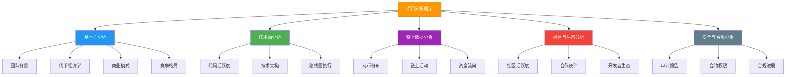
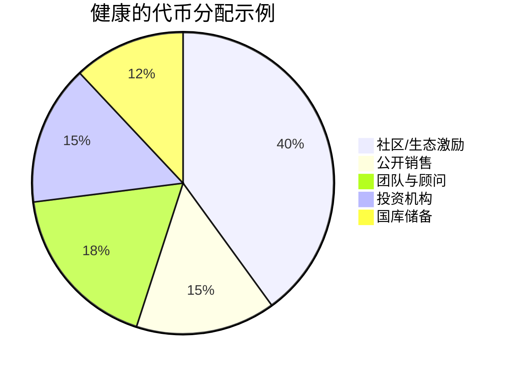
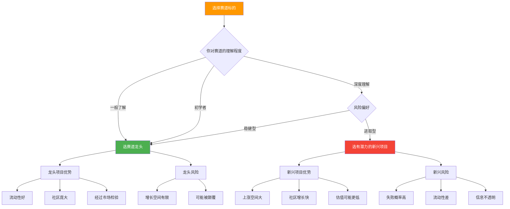
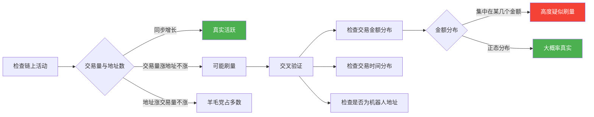
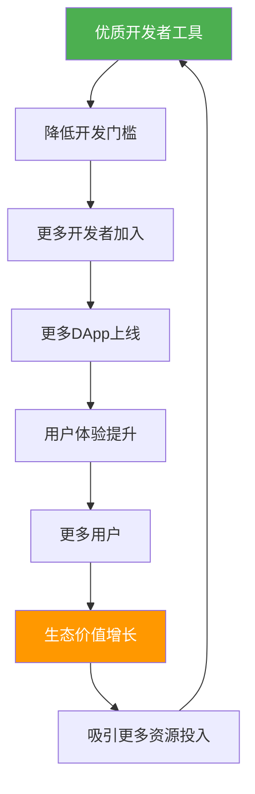
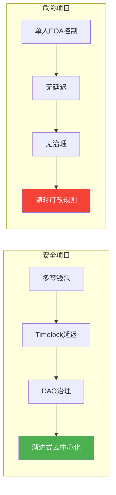
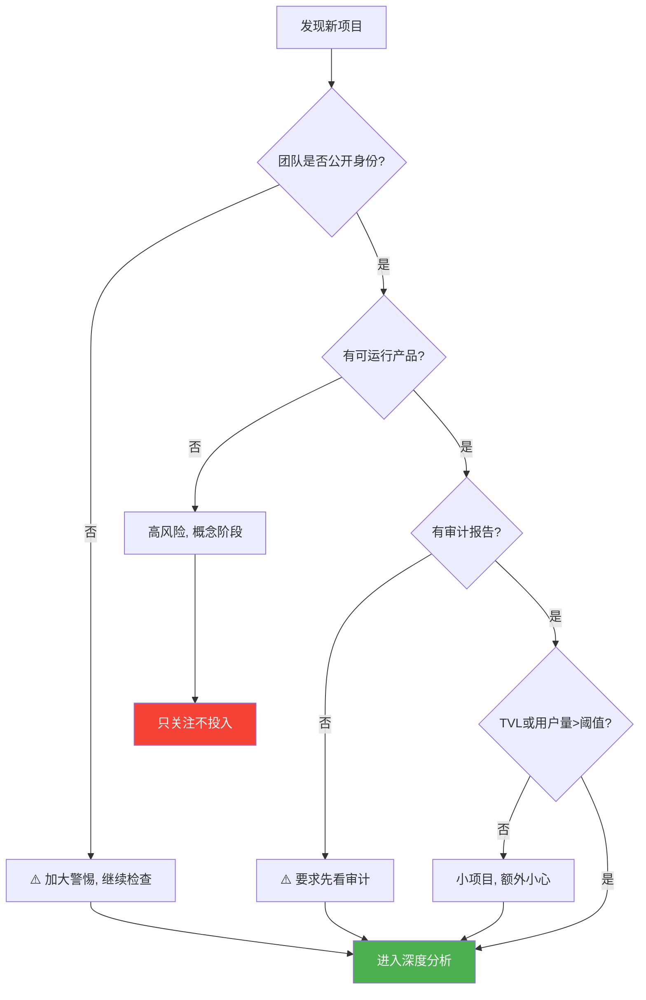
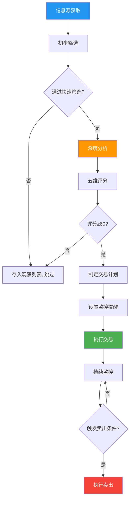

## 六、项目分析框架

在加密货币市场中，项目分析能力是区分"投资者"和"赌徒"的核心分水岭。据统计，2023年全年有超过11,000个加密项目被创建，其中超过95%在上线一年内归零或接近归零。没有系统化的分析框架，你的每一笔投入本质上都是在掷骰子。

本节提供一套完整的、经过实战验证的项目分析框架，涵盖基本面、技术面、链上数据、社区生态、安全审计五个维度，帮助你在投入真金白银之前做出理性判断。

### 6.1 为什么需要项目分析框架

#### 6.1.1 加密市场的特殊风险

传统金融市场有监管机构、信息披露制度、审计要求等多重保护。加密市场目前处于"狂野西部"阶段，存在以下特殊风险：

| 风险类型 | 传统金融 | 加密市场 |
|---------|---------|---------|
| 信息不对称 | 有SEC等机构要求披露 | 项目方可以匿名，无强制披露 |
| 操纵风险 | 有内幕交易法约束 | 洗盘、拉高出货极为常见 |
| 技术风险 | 证券系统经过数十年验证 | 智能合约漏洞频发 |
| 流动性风险 | 做市商制度保障 | 大额交易可能无法成交 |
| 跑路风险 | 银行存款有保险 | 私钥即一切，项目方可随时消失 |

#### 6.1.2 分析框架的价值

系统化分析框架能做到三件事：

1. **筛选过滤**：从海量项目中快速排除明显不靠谱的标的，节省时间
2. **风险量化**：将模糊的"感觉不对"转化为可量化的风险指标
3. **决策依据**：在贪婪和恐惧之间提供理性的锚点，避免情绪化决策

### 6.2 五维分析框架总览



每个维度满分20分，总分100分。根据最终评分做出决策：

| 评分区间 | 等级 | 建议操作 |
|---------|------|---------|
| 80-100分 | A级 | 可以重点研究，适合长期持有 |
| 60-79分 | B级 | 可以小仓位参与，需持续监控 |
| 40-59分 | C级 | 风险较高，仅适合投机性短期操作 |
| 20-39分 | D级 | 不建议参与，潜在风险过大 |
| 0-19分 | F级 | 高概率是骗局或垃圾项目，远离 |

### 6.3 第一维度：基本面分析（20分）

基本面分析是项目分析的根基，回答的是"这个项目到底在做什么、谁在做、靠不靠谱"。

#### 6.3.1 团队背景评估（6分）

**核心原则：看人比看项目更重要。** 加密行业中有太多技术优秀但团队跑路的案例，也有不少技术平庸但团队靠谱最终做大的项目。

**评估清单：**

**创始团队（3分）**
- 真实身份：创始团队是否公开真实身份（Doxxed）？匿名团队风险显著更高
- 行业履历：是否有区块链或相关技术领域的从业经历？在哪些公司/项目工作过？
- 历史记录：创始人的过往项目是成功还是失败？是否有负面记录？
- 社交媒体：Twitter/GitHub/LinkedIn是否活跃且有真实互动？账号注册时间、粉丝质量如何？
- 媒体曝光：是否有主流媒体的采访报道？参加过哪些行业会议？

**投资机构（1.5分）**
- 知名度：是否有头部VC投资？（如a16z、Paradigm、Polychain、Binance Labs等）
- 投资金额：融资总额和轮次分布
- 锁仓条件：投资机构的代币是否有锁仓期？锁仓多长时间？
- 投资组合：该VC过往投资的项目成功率如何？

**顾问团队（1.5分）**
- 顾问是否深度参与还是仅挂名？
- 顾问在行业内的真实影响力如何？
- 顾问是否持有大量代币？

**实战技巧：**

```text
# 快速验证团队背景的方法

1. LinkedIn验证
   - 搜索创始人姓名 + 公司名
   - 检查工作经历是否与项目宣称一致
   - 查看推荐信和同事评价

2. GitHub验证
   - 检查代码提交历史（是持续提交还是突击提交）
   - 查看star/fork/contributor数量
   - 检查代码质量和技术实现是否与白皮书一致

3. 链上验证
   - 用Etherscan查看项目方钱包地址
   - 检查是否有异常大额转账
   - 验证代币分配是否与白皮书一致
```

#### 6.3.2 代币经济学分析（6分）

代币经济学（Tokenomics）是决定一个项目代币长期价值的核心因素。即使产品做得再好，如果代币设计有致命缺陷，价格也很难上涨。

**供给端分析（3分）：**

| 分析要素 | 健康指标 | 危险信号 |
|---------|---------|---------|
| 总供应量 | 固定供应或明确的通缩机制 | 无限增发，无上限 |
| 流通比例 | 上线时流通>20% | 上线时流通<5%，大量未解锁 |
| 解锁计划 | 线性释放，12-48个月 | 集中解锁，cliff期后一次性释放 |
| 团队占比 | 团队<20%，有12个月以上锁仓 | 团队>30%，锁仓期短或无锁仓 |
| 通胀率 | 年化<10%且有销毁机制 | 年化>20%且无销毁机制 |

**需求端分析（3分）：**

- **实际用途**：代币在生态中是否有真实使用场景？（治理、支付Gas、质押、折扣等）
- **价值捕获**：协议收入是否会回流到代币持有者？（回购销毁、分红、质押奖励）
- **持有激励**：长期持有代币有哪些好处？锁仓是否有额外收益？
- **需求刚性**：代币需求是"必须的"还是"可选的"？使用协议是否必须持有该代币？

**代币分配饼图评估模板：**



**警惕以下分配模式：**
- 团队 + 投资机构占比超过50%：散户利益难以保障
- "私募轮"占比过大且折扣过低：早期投资者有极强的抛售动力
- "生态激励"占比过大但无明确释放计划：可能被项目方挪用

#### 6.3.3 商业模式与价值主张（4分）

**关键问题清单：**

1. **解决什么问题？** 该项目是解决真实痛点还是"拿着锤子找钉子"？
2. **目标用户是谁？** 是面向普通用户还是开发者？用户获取成本如何？
3. **收入模式是什么？** 协议如何产生收入？收入来源是否可持续？
4. **护城河在哪？** 网络效应、技术壁垒、品牌认知、切换成本中的哪些？
5. **市场规模有多大？** 所在赛道的TAM/SAM/SOM分别是多少？

**商业模式成熟度评估：**

| 层级 | 特征 | 风险等级 |
|------|------|---------|
| L1 已验证 | 有持续的协议收入，用户量稳定增长 | 低 |
| L2 早期验证 | 有收入但波动大，用户量在增长 | 中低 |
| L3 产品可用 | 产品上线但收入有限，依赖补贴 | 中 |
| L4 概念阶段 | 仅有白皮书或测试网 | 高 |
| L5 纯叙事 | 只有愿景和PPT，无任何可运行产品 | 极高 |

#### 6.3.4 竞争格局分析（4分）

**分析步骤：**

1. **定位赛道**：该项目属于哪个赛道？（Layer1、Layer2、DeFi、NFT、GameFi、RWA、AI+Crypto等）
2. **识别竞品**：同赛道的直接竞品有哪些？各自的市场份额如何？
3. **差异化评估**：该项目与竞品相比，核心差异是什么？是技术差异还是商业模式差异？
4. **竞争优势持久性**：这种差异化优势能持续多久？竞品是否容易复制？

**赛道龙头 vs 新兴项目的选择策略：**



### 6.4 第二维度：技术面分析（20分）

技术分析不是看K线图，而是评估项目的技术实力和代码质量。在加密世界中，代码就是法律，技术就是产品的基础。

#### 6.4.1 代码活跃度评估（7分）

**评估指标：**

| 指标 | 健康标准 | 数据来源 |
|------|---------|---------|
| 每周代码提交数 | ≥5次/周 | GitHub/GitLab |
| 活跃贡献者 | ≥3个持续贡献者 | GitHub Contributors |
| 代码审查 | PR有review和讨论 | GitHub PR列表 |
| Issue响应 | 48小时内有回复 | GitHub Issues |
| 版本发布 | 每月至少1次版本更新 | GitHub Releases |

**代码质量红旗：**

- 代码仓库为空或只有README：项目可能没有技术团队
- 代码提交集中在上线前突击：可能是外包或临时搭建
- 核心代码是fork其他项目且修改极少：缺乏技术原创性
- 没有任何测试代码：质量管控不到位
- GitHub上只有前端代码，核心合约代码不在公开仓库：不透明

**验证方法：**

```bash
# 使用GitHub API检查项目活跃度
# 替换 <owner> 和 <repo> 为实际值

# 查看最近30天的提交数量
curl -s "https://api.github.com/repos/<owner>/<repo>/commits?per_page=100&since=$(date -d '30 days ago' -I)" | jq 'length'

# 查看贡献者列表
curl -s "https://api.github.com/repos/<owner>/<repo>/contributors?per_page=10" | jq '.[].login'

# 查看最近的release
curl -s "https://api.github.com/repos/<owner>/<repo>/releases?per_page=5" | jq '.[].tag_name'
```

#### 6.4.2 技术架构评估（7分）

**智能合约项目评估要点：**

1. **编程语言选择**
   - Solidity：以太坊生态主流，开发者多，工具链成熟
   - Rust：Solana/Polkadot生态，性能好但开发门槛高
   - Move：Sui/Aptos生态，安全性设计理念先进
   - Vyper：以太坊生态的备选，更注重安全性

2. **架构设计**
   - 是否采用模块化设计？（便于升级和维护）
   - 是否有代理模式（Proxy Pattern）？升级权限由谁控制？
   - 是否经过形式化验证？
   - Gas优化是否到位？

3. **技术创新点**
   - 是真正解决了技术难题还是旧技术的重新包装？
   - 技术方案是否有学术论文支撑？
   - 是否申请了专利？

#### 6.4.3 路线图执行追踪（6分）

**评估方法：**

1. 获取项目历史路线图（官网、Medium、Blog）
2. 逐项核对每个里程碑是否按时完成
3. 计算"执行率" = 已完成里程碑 / 总承诺里程碑

| 执行率 | 评价 | 说明 |
|-------|------|------|
| ≥80% | 优秀 | 团队执行力强，承诺可信 |
| 60%-79% | 良好 | 有延迟但基本能完成 |
| 40%-59% | 一般 | 执行力存疑，需持续关注 |
| <40% | 差 | 可能在画饼，谨慎对待 |

**注意事项：**
- 完全按时完成的项目反而是少数，适度延迟是正常的
- 关注延迟的原因：是技术难题还是团队管理问题？
- 警惕频繁修改路线图、删除历史承诺的行为

### 6.5 第三维度：链上数据分析（20分）

链上数据是加密项目分析的独特优势——所有交易、持仓、资金流向都是公开透明的。善用链上数据，可以发现传统金融中完全无法获取的信息。

#### 6.5.1 持币分布分析（7分）

**核心指标：**

**集中度指标**
- 前10个地址持币占比：>50%为高集中度，有操控风险
- 前50个地址持币占比：>80%表示散户参与度低
- 前100个地址持币变化：持续增加可能是鲸鱼吸筹，持续减少可能是出货

**活跃度指标**
- 持币地址数：持续增长是健康信号，持续下降是危险信号
- 日活跃地址数（DAA）：反映实际使用情况
- 新地址增长率：反映项目的吸引力

**大户行为追踪**

```text
# 使用 Etherscan API 检查大户持仓
# 查看ERC-20代币的持币分布

# 步骤1：获取代币持币者列表
# Etherscan → Token → Token Holders

# 步骤2：追踪大户钱包
# 点击大户地址 → 查看交易历史
# 重点关注：
# - 是否在持续买入（吸筹信号）
# - 是否在转入交易所（可能准备卖出）
# - 是否在转入DEX流动性池（可能提供流动性或准备rug pull）

# 步骤3：使用 Dune Analytics 查看高级指标
# 搜索相关Dashboard或自己编写SQL查询
```

**大户行为模式识别：**

| 行为模式 | 链上表现 | 信号含义 |
|---------|---------|---------|
| 吸筹 | 从交易所提币到冷钱包，持续小额买入 | 看好后市 |
| 出货 | 大量转入交易所，分批卖出 | 看空后市 |
| 做市 | 在DEX添加大额流动性 | 对项目有信心 |
| Rug准备 | 从流动性池撤出资金 | 危险！可能跑路 |
| 洗盘 | 钱包之间互相转移 | 制造虚假活跃度 |

#### 6.5.2 链上活动分析（7分）

**DeFi项目关键指标：**

| 指标 | 含义 | 健康趋势 |
|------|------|---------|
| TVL（总锁仓量） | 用户信任的直接体现 | 稳定增长 |
| 日交易量 | 实际使用频率 | 与TVL正相关 |
| 用户数 | 生态规模 | 持续增长 |
| 收入 | 协议盈利能力 | 可覆盖运营成本 |
| 资金利用率 | 借贷协议的资金使用效率 | 60%-80%为佳 |
| 清算事件 | 市场风险暴露程度 | 无异常集中清算 |

**警惕"伪活跃"：**

- 交易量突然暴涨但地址数不变：可能是刷量
- TVL增长但交易量不增长：可能是激励带来的"挖提卖"
- 大量小额交易集中在少数地址：可能是机器人刷交易量

**验证真实活跃度的方法：**



#### 6.5.3 资金流向分析（6分）

**交易所资金流向：**
- 净流入交易所：市场可能准备抛售（看跌信号）
- 净流出交易所：市场在积累（看涨信号）
- 大额转入交易所后立即提走：可能是场外交易结算

**稳定币流动：**
- USDT/USDC大量流入交易所：可能有新资金准备入场
- 稳定币市值增长：整体市场信心增强
- DAI/FRAX等去中心化稳定币增长：DeFi生态在扩张

### 6.6 第四维度：社区与生态分析（20分）

在加密世界中，社区就是护城河。一个项目的代码可以被fork，但社区无法复制。

#### 6.6.1 社区活跃度评估（7分）

**评估维度：**

| 平台 | 关注指标 | 权重 |
|------|---------|------|
| Twitter/X | 粉丝数、互动率（点赞/转发/评论比）、真实粉丝比例 | 30% |
| Discord | 在线人数、消息频率、频道细分程度、MOD响应速度 | 25% |
| Telegram | 群组人数、消息质量（讨论vs水群）、管理员活跃度 | 20% |
| Reddit | 帖子数、评论质量、subreddit订阅者增长 | 15% |
| Forum/Governance | 提案数量、投票参与率、讨论深度 | 10% |

**社区质量判断方法：**

1. **看讨论内容**
   - 健康社区：讨论技术进展、使用体验、治理提案
   - 不健康社区：只讨论价格、喊单、FUD

2. **看互动模式**
   - 健康互动：用户帮助新用户、分享使用心得、提出改进建议
   - 不健康互动：大量机器人、水军、无意义表情包

3. **看社区治理**
   - 健康治理：有正式的治理流程，社区提案能得到执行
   - 不健康治理：项目方独断，社区只有"同意"的声音

**警惕"虚假繁荣"信号：**
- Twitter粉丝数十万但每条推文只有个位数互动
- Discord在线人数多但发言都是"to the moon"、"LFG"
- Telegram群禁言或只允许正面评论
- 社区管理员频繁删除质疑性问题

#### 6.6.2 合作伙伴关系分析（7分）

**合作关系真实性验证：**

不是所有"合作"都是真合作。很多项目方会模糊表述来夸大合作规模。

| 合作层级 | 特征 | 可信度 |
|---------|------|-------|
| 技术集成 | 有代码层面的互操作，可在链上验证 | ★★★★★ |
| 投资关系 | 有公开的投资轮次和金额披露 | ★★★★ |
| 战略合作 | 有联合产品或联合活动 | ★★★ |
| 生态入驻 | 在对方平台上架或接入 | ★★ |
| 社交互动 | 仅在社交媒体上互相提及 | ★ |

**验证步骤：**
1. 在合作方的官方渠道（官网、博客、Twitter）交叉验证
2. 检查是否有实质性的产品集成或代码交互
3. 查看合作公告的发布时间和后续执行情况
4. 注意"合作"和"使用"的区别：用某个基础设施不等于战略合作

#### 6.6.3 开发者生态分析（6分）

**开发者数量是区块链生态最重要的先行指标之一。**

**评估指标：**
- 月活开发者数量（Electric Capital Developer Report）
- 新增开发者增长率
- 生态内DApp数量和质量
- 开发者工具完善程度（SDK、文档、教程）
- Hackathon参与人数和项目质量

**开发者生态良性循环：**



### 6.7 第五维度：安全与合规分析（20分）

安全是加密项目的底线。再好的项目，如果安全出了问题，一切都归零。

#### 6.7.1 审计报告评估（7分）

**审计报告阅读要点：**

1. **审计机构声誉**
   - Tier 1：Trail of Bits、OpenZeppelin、Consensys Diligence、Certora
   - Tier 2：PeckShield、SlowMist、CertiK、Quantstamp
   - 注意：审计机构的品牌不能替代审计质量，要看具体报告内容

2. **审计范围**
   - 是否覆盖所有核心合约？
   - 审计时间是否足够？（复杂项目至少需要2-4周）
   - 是否有多次审计？（至少2家不同审计机构）

3. **漏洞分类统计**

   | 严重程度 | 含义 | 处理要求 |
   |---------|------|---------|
   | Critical | 可直接导致资金损失 | 必须修复后才能上线 |
   | High | 在特定条件下可被利用 | 强烈建议修复 |
   | Medium | 存在安全隐患 | 应该修复 |
   | Low | 代码质量问题 | 建议修复 |
   | Informational | 改进建议 | 可选修复 |

4. **修复验证**
   - 项目方是否修复了所有Critical和High级别的漏洞？
   - 是否有修复后的复审？
   - 修复是否引入了新的问题？

#### 6.7.2 合约权限分析（7分）

**合约权限是项目安全的关键。** 很多项目的"去中心化"只是营销话术，实际控制权高度集中在项目方手中。

**需要检查的关键权限：**

| 权限类型 | 危险程度 | 说明 |
|---------|---------|------|
| Mint权限 | 🔴 极高 | 可以无限增发代币 |
| Pause权限 | 🟠 高 | 可以随时暂停合约功能 |
| Blacklist权限 | 🟠 高 | 可以冻结任何地址的资产 |
| 升级权限 | 🔴 极高 | 可以替换合约逻辑 |
| 修改费率权限 | 🟡 中 | 可以提高交易手续费 |
| 修改参数权限 | 🟡 中 | 可以修改关键参数 |
| Timelock | 🟢 低（正面） | 权限变更有延迟，给用户反应时间 |
| 多签 | 🟢 低（正面） | 需要多个签名才能执行操作 |

**验证方法：**

```text
# 检查合约权限的步骤

1. 在区块浏览器上找到合约地址
2. 点击"Contract" → "Read Contract"
3. 检查以下函数：
   - owner()：返回合约拥有者地址
   - admin()：返回管理员地址
   - governance()：返回治理地址
   - pendingOwner()：是否有待转移的owner权限

4. 检查"Write Contract"中的可调用函数
   - 哪些函数需要特殊权限？
   - 这些权限由谁控制？

5. 使用 https://app.blocksec.com 或类似工具
   - 自动扫描合约权限
   - 检查是否有隐藏的后门
```

**安全最佳实践对比：**



#### 6.7.3 合规进展分析（6分）

**合规评估要素：**

1. **法律实体**
   - 是否有明确的法律实体（基金会、公司等）？
   - 注册在哪个司法管辖区？（瑞士、新加坡、开曼群岛等对加密友好）
   - 法律团队是否专业？

2. **监管态度**
   - 是否主动与监管机构沟通？
   - 是否获得任何运营牌照？
   - 是否被SEC等机构列入观察名单或发出警告？

3. **用户保护措施**
   - 是否有KYC/AML程序？（对中心化组件）
   - 是否有保险基金？（对DeFi协议）
   - 是否有Bug Bounty计划？奖励金额是否合理？

### 6.8 实战分析流程

将上述五个维度整合为一个可执行的分析流程：

#### 6.8.1 快速筛选（5分钟）



#### 6.8.2 深度分析（2-4小时）

按以下顺序逐项检查：

1. **基本面（40分钟）**
   - 阅读白皮书的核心章节（不是全部，重点看技术方案和代币经济学）
   - 调查团队背景（LinkedIn、GitHub、过往项目）
   - 分析代币分配和解锁计划
   - 评估商业模式的可持续性

2. **技术面（30分钟）**
   - 检查GitHub代码仓库活跃度
   - 阅读技术文档，评估架构设计
   - 核对路线图执行情况

3. **链上数据（30分钟）**
   - 使用Dune/Nansen/Glassnode查看持币分布
   - 分析TVL变化趋势
   - 追踪大户钱包行为

4. **社区生态（20分钟）**
   - 浏览Twitter/Discord/Telegram社区
   - 评估社区讨论质量和活跃度
   - 验证合作伙伴关系的真实性

5. **安全合规（20分钟）**
   - 阅读审计报告的关键发现
   - 检查合约权限设置
   - 确认法律实体和合规状态

#### 6.8.3 评分与决策

**五维评分模板：**

```markdown
## [项目名称] 分析报告

### 基本面分析：__/20
- 团队背景：__/6  [简要说明]
- 代币经济学：__/6  [简要说明]
- 商业模式：__/4  [简要说明]
- 竞争格局：__/4  [简要说明]

### 技术面分析：__/20
- 代码活跃度：__/7  [简要说明]
- 技术架构：__/7  [简要说明]
- 路线图执行：__/6  [简要说明]

### 链上数据分析：__/20
- 持币分布：__/7  [简要说明]
- 链上活动：__/7  [简要说明]
- 资金流向：__/6  [简要说明]

### 社区与生态分析：__/20
- 社区活跃度：__/7  [简要说明]
- 合作伙伴：__/7  [简要说明]
- 开发者生态：__/6  [简要说明]

### 安全与合规分析：__/20
- 审计报告：__/7  [简要说明]
- 合约权限：__/7  [简要说明]
- 合规进展：__/6  [简要说明]

### 总分：__/100

### 结论：[是否值得投入，建议仓位比例，注意事项]
```

### 6.9 红旗清单：遇到以下情况立即远离

在项目分析中，有些信号是绝对的"一票否决"项。无论项目其他方面多好，只要出现以下任一情况，都应该直接排除：

#### 🔴 致命红旗（一票否决）

1. **匿名团队 + 无审计 + 大量预挖**
   这是跑路项目的经典三件套

2. **合约有隐藏的Mint功能或后门**
   项目方可以随时增发代币或抽走资金

3. **代币分配中团队/早期投资者占比>60%且锁仓期<6个月**
   上线即抛售的概率极高

4. **白皮书抄袭其他项目，仅修改品牌名**
   说明团队没有原创能力

5. **承诺固定高回报（如"保证月化10%"）**
   这是庞氏骗局的典型特征

#### 🟠 严重红旗（需高度警惕）

6. **社区禁止负面讨论，质疑者被踢出群组**
   健康的项目欢迎批评和反馈

7. **创始人频繁炫耀奢侈生活而非项目进展**
   关注点在个人享受而非产品建设

8. **多个审计报告但只有"Informational"级别发现**
   可能是购买的"纸面审计"

9. **路线图过于宏大但执行率极低**
   擅长画饼但不擅长执行

10. **代币价格与基本面严重脱节**
    短期暴涨可能意味着操纵

### 6.10 常见分析误区

#### 误区一："有大机构投资就安全"

**现实**：FTX有红杉资本、软银、贝莱德等顶级机构投资，照样崩盘。机构投资只能说明项目在某个时间点通过了机构的尽调，不能保证未来不会出问题。机构也会犯错，而且机构往往有更好的退出渠道——当项目出问题时，机构可以比散户更快地撤出资金。

**正确做法**：将机构投资作为加分项而非决定因素，仍需独立分析。

#### 误区二："TVL高就是好项目"

**现实**：TVL可以通过高额补贴人为拉高。很多项目通过发放代币奖励来吸引TVL，一旦奖励减少，TVL会迅速崩塌。这种"挖提卖"模式不具备可持续性。

**正确做法**：关注TVL的质量——是靠真实收益吸引的还是靠代币激励？激励减少后TVL的留存率是多少？

#### 误区三："市值低就有上涨空间"

**现实**：低市值可能意味着项目没有被市场认可，而不是"被低估"。很多低市值项目之所以低，是因为基本面确实很差。

**正确做法**：用相对估值指标（如FDV/TVL、FDV/Revenue、FDV/用户数）与同赛道项目对比，而不是单纯看绝对市值。

#### 误区四："代码开源就安全"

**现实**：开源只意味着代码可见，不意味着代码安全。很多有严重漏洞的项目也是开源的。此外，开源的代码可能与实际部署的代码不一致。

**正确做法**：开源是必要条件但不是充分条件。需要独立审计验证，或使用区块浏览器比对已部署的字节码与开源代码。

#### 误区五："社区人数多就是好项目"

**现实**：社区人数可以购买。Discord和Telegram中的机器人账号成本极低。一个有50万成员的群组，真实活跃用户可能不到5000人。

**正确做法**：关注互动质量而非数量，检查在线人数与总人数的比例，观察讨论内容的专业程度。

### 6.11 分析工具推荐

| 工具 | 用途 | 费用 | 网址 |
|------|------|------|------|
| DeFiLlama | TVL追踪、收益对比 | 免费 | defillama.com |
| Dune Analytics | 自定义链上数据查询 | 免费基础版 | dune.com |
| Nansen | 钱包标签、Smart Money追踪 | 付费 | nansen.ai |
| Token Terminal | 协议收入、P/S比率 | 部分免费 | tokenterminal.com |
| Messari | 研究报告、数据筛选 | 部分免费 | messari.io |
| DefiSafety | DeFi协议安全评分 | 免费 | defisafety.com |
| RugDoc | DeFi项目风险评估 | 免费 | rugdoc.io |
| Etherscan | 合约验证、交易追踪 | 免费 | etherscan.io |
| Arkham | 实体标签、资金追踪 | 部分免费 | arkham.intelligence |
| Bubblemaps | 持币地址关联可视化 | 免费 | bubblemaps.io |

### 6.12 案例分析：以太坊 vs Solana 生态项目对比

以两个真实生态的对比来演示分析框架的应用：

| 分析维度 | 以太坊L2项目（如Arbitrum） | Solana生态项目（如Jito） |
|---------|-------------------------|----------------------|
| **团队** | Offchain Labs团队，普林斯顿背景，Doxxed | 低调但公开的团队，Solana基金会支持 |
| **代币经济学** | ARB总量100亿，社区分配50%，4年解锁 | JTO总量10亿，社区分配40.5%，有空投 |
| **商业模式** | 交易手续费收入+排序器收入 | MEV提取+质押收益 |
| **代码** | 核心代码开源，持续更新 | 开源，Rust实现，代码质量高 |
| **链上数据** | TVL长期Top3 L2，交易量稳定 | Solana头部协议，快速增长 |
| **社区** | 以太坊生态庞大，治理活跃 | Solana社区活跃，开发者增长快 |
| **安全** | 多次审计，有Bug Bounty | 经过审计，有保险基金 |
| **总评** | 成熟稳健，适合中长期 | 增长潜力大，波动也大 |

### 6.13 进阶：建立个人项目分析工作流

**推荐工作流：**



**持续监控清单：**
- 每周检查GitHub代码更新
- 每两周审视TVL和用户数据变化
- 每月核对代币解锁进度
- 关注项目方重大公告和治理提案
- 监控大户钱包资金动向
- 追踪同赛道竞品的进展

### 6.14 本节核心要点

1. **五维分析缺一不可**：基本面、技术面、链上数据、社区生态、安全合规，任何一个维度有重大缺陷都应该谨慎
2. **数据说话，不靠感觉**：所有结论都应该有可验证的数据支撑
3. **警惕确认偏误**：不要只找支持自己观点的信息，要主动寻找反面证据
4. **动态评估，不是一次性**：项目在不断变化，你的分析也需要持续更新
5. **安全是底线**：任何安全问题都是一票否决，不存在"小问题"
6. **独立思考**：分析师报告、KOL推荐都只是参考，最终决策要基于自己的分析
